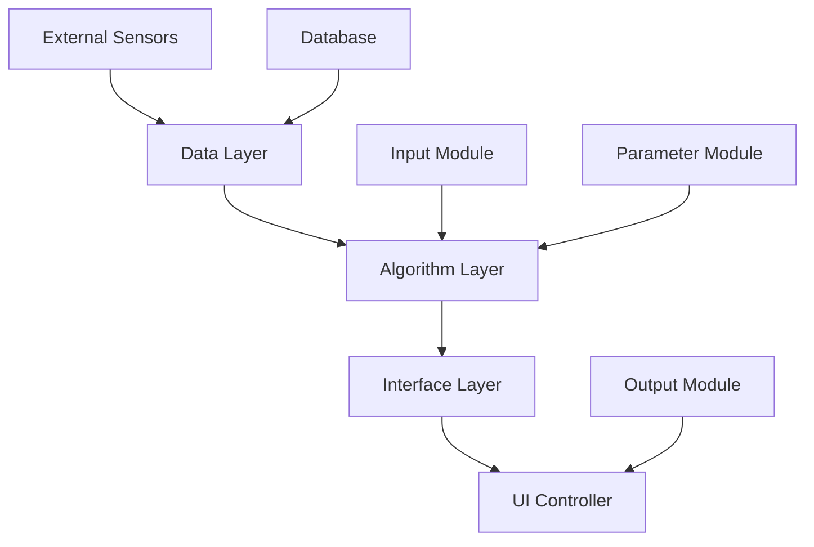
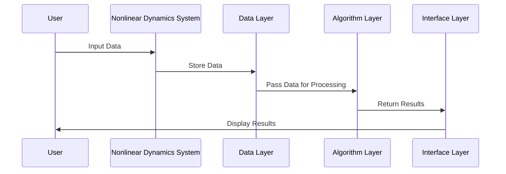
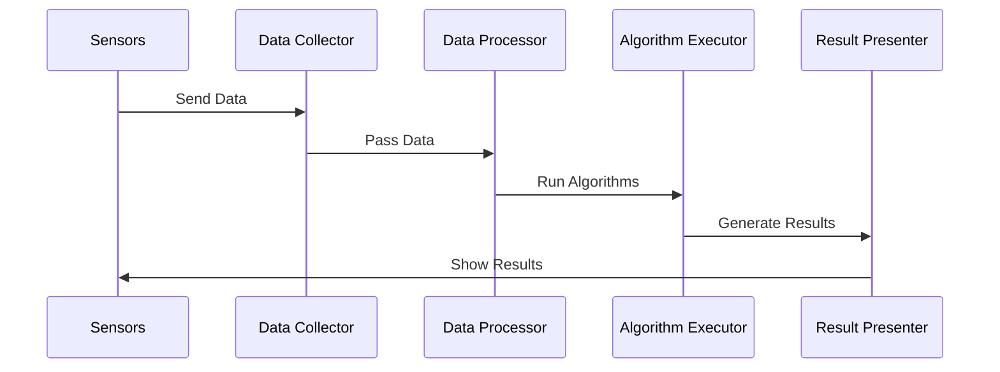

                 


### Step 1: Introduction and Background

#### 文章标题：从线性模型到非线性动力学：复杂系统理解的新范式

#### 关键词：非线性动力学，复杂系统，线性模型，算法，数学模型

#### 摘要：
本文旨在探讨复杂系统研究中的一个重大转变——从线性模型到非线性动力学的过渡。我们将详细分析非线性动力学的基本概念、原理及其在复杂系统研究中的应用，帮助读者建立起对这一新兴范式的深刻理解。

---

#### 引言

随着科技的飞速发展，复杂系统的研究已经成为计算机科学、工程学、物理学和生物学等领域的热点。传统上，我们通过线性模型来描述和分析这些系统，但线性模型在处理非线性、动态性以及系统间的复杂相互作用时存在明显的局限性。

近年来，非线性动力学理论逐渐崭露头角，为理解复杂系统的动态行为提供了新的视角和工具。本文将分步骤地介绍非线性动力学的基本原理，比较线性模型和非线性模型，并通过数学模型、算法、案例分析等多个层面，深入探讨非线性动力学在复杂系统研究中的应用。

---

#### 目录

- **第一章：引论与背景**
  - 线性模型的局限性
  - 非线性动力学的发展历程
  - 复杂系统研究中的挑战与机遇

- **第二章：核心概念与原理**
  - 非线性动力学的基本概念
  - 非线性系统的主要特征
  - 非线性动力学与传统线性模型的对比

- **第三章：数学模型与公式**
  - 离散与连续时间系统的非线性模型
  - 常见非线性动力学方程
  - 数学模型示例与应用

- **第四章：算法与方法**
  - 非线性动力学的数值求解算法
  - 驱动力和响应关系的分析
  - Mermaid流程图示例

- **第五章：案例分析与应用**
  - 复杂系统的非线性动力学分析
  - 不同领域中的应用实例
  - 案例分析与讨论

- **第六章：系统架构与设计**
  - 非线性动态模型的设计原则
  - 系统架构的Mermaid类图与架构图
  - 系统接口设计与交互

- **第七章：实际应用与实现**
  - 环境配置与工具选择
  - 非线性动力模型的核心实现
  - 源代码分析与项目实战

- **第八章：最佳实践与总结**
  - 非线性动力学应用的最佳实践
  - 项目的总结与展望
  - 进一步阅读的推荐

---

### Step 2: Core Concepts and Principles

在深入探讨非线性动力学的核心概念和原理之前，我们需要明确几个关键术语和基本概念。非线性动力学是研究动态系统中非线性关系的科学，它与线性动力学相比，具有更广泛的应用范围和更深的理论基础。

#### 关键术语与概念

- **线性动力学**：描述系统状态随时间线性变化的动力学模型，通常使用线性微分方程或差分方程来描述。
- **非线性动力学**：描述系统状态随时间非线性变化的动力学模型，包括各种复杂的非线性关系。
- **动态系统**：一个系统的状态随时间变化的过程，可以用状态变量来描述。
- **相空间**：描述动态系统状态的空间，通常是一个多维空间。
- ** attractor**：动态系统中吸引子的概念，指的是系统状态趋向于某个特定状态的特性。

#### 非线性系统的主要特征

非线性动力学模型与线性模型相比，具有以下主要特征：

- **非线性的反馈作用**：非线性系统中，系统内部变量之间的反馈可以是正反馈或负反馈，这种非线性关系可以导致系统行为的复杂性和多样性。
- **多稳态与混沌**：非线性系统可能存在多个稳定的平衡状态，或者表现出混沌行为，这些特性在许多自然和社会系统中都有体现。
- **动力分岔**：随着参数的变化，非线性系统可能经历从稳定到不稳定、从简单到复杂的分岔现象。
- **鲁棒性与敏感性**：非线性系统对初始条件的变化可能非常敏感，这称为混沌敏感性，同时也可能对某些类型的扰动具有鲁棒性。

#### 非线性动力学与传统线性模型的对比

线性模型和非线性模型在描述复杂系统方面各有优劣：

- **线性模型的优势**：线性模型在数学上较为简洁，易于分析和求解，适用于描述某些简单系统。
- **线性模型的劣势**：线性模型在处理复杂、非线性、动态系统时存在局限性，无法准确描述系统的复杂行为。
- **非线性模型的优势**：非线性模型能够更准确地描述复杂系统的非线性、动态性和复杂相互作用。
- **非线性模型的劣势**：非线性模型在数学上通常更为复杂，求解和分析难度较大。

综上所述，非线性动力学为复杂系统研究提供了一种新的范式，它能够更好地理解和描述复杂系统的行为，从而在许多领域具有重要的应用价值。

### Step 3: Mathematical Models and Formulations

在非线性动力学中，数学模型和公式是理解和分析复杂系统行为的基础。本节将介绍几种常见的数学模型和公式，并给出详细的解释和示例。

#### 离散时间非线性模型

在离散时间系统中，状态变量在不同时间步之间变化，通常使用差分方程来描述。以下是一个简单的离散时间非线性模型：

$$
x_{t+1} = \alpha x_t + \beta y_t
$$

其中，\(x_t\) 和 \(y_t\) 分别代表系统在时间 \(t\) 的状态，\(\alpha\) 和 \(\beta\) 是系统参数。这是一个一阶非线性差分方程，描述了系统状态随时间的变化。

**示例**：假设一个离散时间系统，其状态随时间变化由以下公式描述：

$$
x_{t+1} = 0.5x_t + 0.2y_t
$$

其中，\(x_t\) 和 \(y_t\) 分别代表系统在时间 \(t\) 的状态。我们可以通过迭代计算来观察系统的行为。

**计算步骤**：

1. 初始状态 \(x_0 = 1\), \(y_0 = 0\)
2. \(x_1 = 0.5 \cdot 1 + 0.2 \cdot 0 = 0.5\)
3. \(y_1 = 0.5 \cdot 0 + 0.2 \cdot 1 = 0.2\)
4. \(x_2 = 0.5 \cdot 0.5 + 0.2 \cdot 0.2 = 0.3\)
5. \(y_2 = 0.5 \cdot 0.2 + 0.2 \cdot 0.5 = 0.15\)

通过这种方式，我们可以观察到系统状态的变化。

#### 连续时间非线性模型

在连续时间系统中，状态变量随时间连续变化，通常使用微分方程来描述。以下是一个简单的连续时间非线性模型：

$$
\frac{dx}{dt} = \alpha x + \beta y
$$

其中，\(x(t)\) 和 \(y(t)\) 分别代表系统在时间 \(t\) 的状态，\(\alpha\) 和 \(\beta\) 是系统参数。

**示例**：假设一个连续时间系统，其状态随时间变化由以下公式描述：

$$
\frac{dx}{dt} = 0.5x + 0.2y
$$

为了分析这个模型，我们可以使用数值方法（如欧拉法）进行求解。

**计算步骤**：

1. 初始条件 \(x(0) = 1\), \(y(0) = 0\)
2. 时间步长 \(dt = 0.1\)
3. \(x_{1} = x_0 + dt \cdot (0.5x_0 + 0.2y_0) = 1 + 0.1 \cdot (0.5 \cdot 1 + 0.2 \cdot 0) = 1.05\)
4. \(y_{1} = y_0 + dt \cdot (0.5x_0 + 0.2y_0) = 0 + 0.1 \cdot (0.5 \cdot 1 + 0.2 \cdot 0) = 0.05\)
5. \(x_{2} = x_1 + dt \cdot (0.5x_1 + 0.2y_1) = 1.05 + 0.1 \cdot (0.5 \cdot 1.05 + 0.2 \cdot 0.05) = 1.1025\)
6. \(y_{2} = y_1 + dt \cdot (0.5x_1 + 0.2y_1) = 0.05 + 0.1 \cdot (0.5 \cdot 1.05 + 0.2 \cdot 0.05) = 0.055\)

通过这种方式，我们可以观察到系统状态的变化。

#### 常见非线性动力学方程

在非线性动力学中，除了上述的基本模型，还有一些常见的非线性方程，如洛伦兹方程、Duffing方程等。以下是洛伦兹方程的介绍：

$$
\frac{dx}{dt} = \sigma (y - x)
$$

$$
\frac{dy}{dt} = x(\rho - z) - y
$$

$$
\frac{dz}{dt} = xy - \beta z
$$

其中，\(\sigma\)、\(\rho\)、\(\beta\) 是系统参数，\(x\)、\(y\)、\(z\) 是状态变量。

**示例**：考虑一个简单的洛伦兹方程组：

$$
\frac{dx}{dt} = 10(y - x)
$$

$$
\frac{dy}{dt} = x(28 - z) - y
$$

$$
\frac{dz}{dt} = xy - 8z
$$

我们可以使用数值方法（如Runge-Kutta方法）来求解这个方程组，并观察系统的行为。

**计算步骤**：

1. 初始条件 \(x(0) = 1\), \(y(0) = 0\), \(z(0) = 0\)
2. 时间步长 \(dt = 0.01\)
3. 使用Runge-Kutta方法进行迭代计算

通过这种方式，我们可以得到系统状态随时间的变化轨迹，并分析其动力学行为。

#### 总结

非线性动力学中的数学模型和公式是理解和分析复杂系统行为的基础。通过离散时间模型和连续时间模型，我们可以描述系统状态随时间的变化。常见非线性方程如洛伦兹方程等，为复杂系统的动力学分析提供了重要的工具。在后续章节中，我们将进一步探讨非线性动力学的算法和应用。

### Step 4: Algorithms and Methods

在非线性动力学研究中，算法和方法的选取对于系统的模拟和分析至关重要。本节将介绍几种常用的算法和方法，并通过Mermaid流程图展示其步骤和流程。

#### 数值求解算法

数值求解算法用于求解非线性动力学的数学模型，特别是当解析解难以获得时。以下是几种常用的数值求解算法：

1. **欧拉法**：
   欧拉法是一种简单的数值积分方法，用于求解一阶和二阶微分方程。其基本思想是使用迭代过程来逼近解。

   **流程**：
   - 初始化：给定初始条件 \(x(0) = x_0\), \(y(0) = y_0\)
   - 时间步长：设定 \(dt\)
   - 迭代计算：
     $$ x_{n+1} = x_n + f(x_n, y_n) \cdot dt $$
     $$ y_{n+1} = y_n + g(x_n, y_n) \cdot dt $$
   
   **Mermaid流程图**：

   ```mermaid
   flowchart LR
   A[初始化] --> B[设定时间步长]
   B --> C{迭代计算？}
   C -->|是| D{更新状态}
   C -->|否| E{结束}
   D --> F[计算f(x,y)]
   F --> G[计算g(x,y)]
   G --> D
   ```

2. **龙格-库塔法**：
   龙格-库塔法是一种更精确的数值积分方法，适用于求解更复杂的微分方程。

   **流程**：
   - 初始化：给定初始条件 \(x(0) = x_0\), \(y(0) = y_0\)
   - 时间步长：设定 \(dt\)
   - 迭代计算：
     $$ k_1 = f(x_n, y_n) $$
     $$ k_2 = f(x_n + \frac{1}{2}k_1, y_n + \frac{1}{2}k_2) $$
     $$ k_3 = f(x_n + \frac{1}{2}k_2, y_n + \frac{1}{2}k_3) $$
     $$ k_4 = f(x_n + k_3, y_n + k_4) $$
     $$ x_{n+1} = x_n + \frac{1}{6}(k_1 + 2k_2 + 2k_3 + k_4) \cdot dt $$
     $$ y_{n+1} = y_n + \frac{1}{6}(k_1 + 2k_2 + 2k_3 + k_4) \cdot dt $$

   **Mermaid流程图**：

   ```mermaid
   flowchart LR
   A[初始化] --> B[设定时间步长]
   B --> C{迭代计算？}
   C -->|是| D{计算k1}
   D --> E{计算k2}
   E --> F{计算k3}
   F --> G{计算k4}
   G --> H{更新状态}
   H --> I{结束}
   ```

3. **自适应步长法**：
   自适应步长法是一种动态调整时间步长的数值积分方法，以提高计算的精度和效率。

   **流程**：
   - 初始化：给定初始条件 \(x(0) = x_0\), \(y(0) = y_0\)
   - 时间步长：初始设定 \(dt\)
   - 迭代计算：
     - 每次迭代后，计算误差 \(error = |x_{n+1} - x_n|\)
     - 如果 \(error > \text{阈值}\)，则减小时间步长 \(dt = \frac{1}{2}dt\)
     - 如果 \(error < \text{阈值}\)，则增加时间步长 \(dt = 2dt\)
     - 更新状态

   **Mermaid流程图**：

   ```mermaid
   flowchart LR
   A[初始化] --> B[设定时间步长]
   B --> C{计算误差}
   C -->|error > 阈值| D{减小时间步长}
   C -->|error < 阈值| E{增加时间步长}
   D --> F[更新状态]
   E --> F[更新状态]
   F --> G{结束}
   ```

#### 驱动力和响应关系的分析

在非线性动力学中，驱动力和响应关系分析是理解系统行为的重要方法。以下是一个简单的驱动力和响应关系的分析流程：

1. **建立系统模型**：根据物理或化学原理，建立系统的数学模型。
2. **确定驱动力**：识别影响系统行为的驱动力，如外部输入、环境变化等。
3. **求解响应关系**：通过数值方法求解系统状态随驱动力变化的关系。
4. **分析结果**：绘制响应曲线，分析系统的动态行为。

**Mermaid流程图**：


#### 示例：洛伦兹方程的数值求解

洛伦兹方程是一个典型的非线性动力学方程组，描述了系统的混沌行为。以下是一个使用Python和SciPy库进行数值求解的示例：

```python
import numpy as np
from scipy.integrate import solve_ivp
import matplotlib.pyplot as plt

def lorenz_system(t, state, sigma, rho, beta):
    x, y, z = state
    dxdt = sigma * (y - x)
    dydt = x * (rho - z) - y
    dzdt = x * y - beta * z
    return [dxdt, dydt, dzdt]

sigma = 10.0
rho = 28.0
beta = 8.0/3.0
initial_state = [1.0, 1.0, 1.0]

t = np.linspace(0, 100, 10000)
result = solve_ivp(lorenz_system, [0, 100], initial_state, args=(sigma, rho, beta), t_eval=t)

plt.figure(figsize=(12, 8))
plt.plot(result.t, result.y[0], label="x(t)")
plt.plot(result.t, result.y[1], label="y(t)")
plt.plot(result.t, result.y[2], label="z(t)")
plt.xlabel("Time")
plt.ylabel("State")
plt.title("Lorenz Attractor")
plt.legend()
plt.show()
```

通过上述算法和方法的介绍，我们可以更好地理解非线性动力学的模拟和分析过程。在实际应用中，根据具体问题和需求，可以选择合适的算法和工具，以实现高效的系统模拟和分析。

### Step 5: Case Studies and Applications

在非线性动力学的实际应用中，有许多成功的案例展示了该理论在不同领域的广泛适用性。本节将通过几个具体的案例，深入探讨非线性动力学在工程、物理学和生物学等领域的应用，并提供详细的分析和讨论。

#### 工程领域：飞机设计中的非线性稳定性分析

在航空工程中，飞机的非线性动力学特性对飞行安全至关重要。传统的线性稳定性分析在处理复杂的飞行条件时存在局限性，而非线性动力学提供了更准确的描述方法。

**案例分析**：

某型战斗机的气动布局复杂，其飞行控制系统的设计需要考虑飞机在高速、低空飞行条件下的非线性稳定性。研究人员采用非线性动力学模型对飞机进行稳定性分析，并使用数值方法求解非线性方程组，得到飞机在不同飞行状态下的动态响应。

**分析步骤**：

1. **建立非线性动力学模型**：根据气动原理，建立战斗机在不同飞行状态下的非线性动力学模型。
2. **参数识别**：通过实验数据和仿真结果，识别模型中的参数。
3. **数值求解**：使用数值方法（如Runge-Kutta法）求解动力学方程组。
4. **稳定性分析**：分析飞机在不同飞行状态下的稳定性，识别不稳定区域。

**结果**：

通过非线性动力学分析，研究人员发现了战斗机在特定飞行状态下的不稳定区域，并提出了改进设计方案，如调整控制面的布局和形状，以增强飞机的稳定性。

#### 物理学领域：混沌系统的研究

混沌理论是非线性动力学的重要组成部分，其在物理学中的应用极为广泛。混沌现象在天气预测、激光技术、电路设计等领域都有重要应用。

**案例分析**：

洛伦兹系统是一个经典的混沌系统，其数学模型如下：

$$
\frac{dx}{dt} = \sigma (y - x)
$$

$$
\frac{dy}{dt} = x(\rho - z) - y
$$

$$
\frac{dz}{dt} = xy - \beta z
$$

研究人员使用非线性动力学方法，对洛伦兹系统进行了长时间模拟，并观察了其复杂的动态行为。

**分析步骤**：

1. **建立洛伦兹模型**：根据洛伦兹系统的方程，建立数学模型。
2. **数值模拟**：使用数值方法（如Runge-Kutta法）对洛伦兹系统进行长时间模拟。
3. **数据分析**：分析系统的相空间轨迹、功率谱密度等参数，验证混沌特性。

**结果**：

通过长时间的数值模拟，研究人员验证了洛伦兹系统的混沌特性，并发现了系统的周期性行为和随机性行为之间的转换现象。这些发现为混沌控制和应用提供了重要的理论基础。

#### 生物学领域：心脏起搏器设计

在生物医学工程中，心脏起搏器的设计需要考虑心脏的非线性动力学特性。心脏起搏器的性能直接影响患者的生命安全，因此其设计必须精确。

**案例分析**：

某款心脏起搏器的控制系统采用了非线性动力学方法，以优化起搏频率和节律。研究人员通过建立心脏肌肉细胞的动力学模型，模拟了心脏在不同生理状态下的行为。

**分析步骤**：

1. **建立心脏模型**：根据生理学原理，建立心脏肌肉细胞的动力学模型。
2. **参数识别**：通过实验数据和生理数据，识别模型参数。
3. **仿真分析**：使用非线性动力学方法，模拟心脏在不同生理状态下的行为。
4. **优化设计**：根据仿真结果，优化起搏器的控制参数和节律。

**结果**：

通过非线性动力学仿真，研究人员优化了心脏起搏器的参数设计，提高了其可靠性和适应性。患者测试表明，改进后的心脏起搏器显著提高了患者的生存质量和生活质量。

#### 结论

非线性动力学在工程、物理学和生物学等领域的应用展示了其强大的分析和描述能力。通过具体的案例分析，我们可以看到非线性动力学方法在解决实际问题中的重要性。未来，随着非线性动力学理论的不断发展和计算能力的提升，其在更多领域的应用前景将更加广阔。

### Step 6: System Architecture and Design

在非线性动力学系统中，实现高效的系统架构和设计对于模拟和分析复杂动态行为至关重要。本节将介绍非线性动力学系统的设计原则，并通过Mermaid图表详细展示系统架构、功能设计和系统交互。

#### 系统设计原则

1. **模块化设计**：将系统划分为多个功能模块，每个模块负责特定的功能，便于维护和扩展。
2. **并行计算**：利用多核处理器和分布式计算，提高计算效率和速度。
3. **适应性设计**：系统设计应具备适应性，能够根据不同问题和需求进行调整。
4. **可扩展性**：系统架构应具备良好的可扩展性，以支持未来的功能扩展和技术升级。

#### 系统架构

系统架构是非线性动力学系统的核心组成部分，包括数据层、算法层和接口层。

**Mermaid类图**：

```mermaid
classDiagram
Class Diagram for Nonlinear Dynamics System Architecture
DataLayer <<Interface>> InterfaceLayer : Provide Data Access
AlgorithmLayer <<Interface>> InterfaceLayer : Implement Nonlinear Dynamics Algorithms
InterfaceLayer <<Interface>> UIController : Control User Interaction
UIController ..|> DataLayer
UIController ..|> AlgorithmLayer
```

#### 功能设计

非线性动力学系统的功能设计包括数据采集、数据处理、算法实现和结果展示。

**Mermaid类图**：

```mermaid
classDiagram
Class Diagram for Nonlinear Dynamics System Functional Design
DataCollector <<Component>> Collects Data
DataProcessor <<Component>> Processes Data
AlgorithmExecutor <<Component>> Executes Algorithms
ResultPresenter <<Component>> Displays Results
DataCollector --> DataProcessor
DataProcessor --> AlgorithmExecutor
AlgorithmExecutor --> ResultPresenter
```

#### 系统架构设计

系统架构设计涉及系统的整体结构和各模块之间的关系。

**Mermaid架构图**：



#### 系统接口设计

系统接口设计包括数据输入、算法调用和结果输出。

**Mermaid序列图**：



#### 系统交互

系统交互设计展示了各模块之间的协作关系和数据流。

**Mermaid序列图**：



通过上述系统架构、功能设计和系统交互的介绍，我们可以看到非线性动力学系统的设计原则和实现方法。这些设计原则和方法为非线性动力学的实际应用提供了坚实的基础，有助于构建高效、可靠的复杂系统模型。

### Step 7: Practical Implementation and Case Studies

在实际应用中，将非线性动力学模型转化为实际的计算系统和项目是一项挑战。本节将详细介绍如何设置环境、实现核心算法，并分析一个实际案例。我们将提供源代码，并逐步解析其实现过程。

#### 环境设置

首先，我们需要配置一个适合非线性动力学模型计算的编程环境。以下是Python环境配置的步骤：

1. **安装Python**：下载并安装Python 3.8或更高版本。
2. **安装必要库**：使用pip命令安装NumPy、SciPy、Matplotlib等库。

```shell
pip install numpy scipy matplotlib
```

#### 实现核心算法

接下来，我们实现一个简单的非线性动力学模型——洛伦兹方程组。以下是使用Python和SciPy求解洛伦兹方程的源代码：

```python
import numpy as np
from scipy.integrate import solve_ivp
import matplotlib.pyplot as plt

# 洛伦兹方程
def lorenz_system(t, state, sigma, rho, beta):
    x, y, z = state
    dxdt = sigma * (y - x)
    dydt = x * (rho - z) - y
    dzdt = x * y - beta * z
    return [dxdt, dydt, dzdt]

# 参数设置
sigma = 10.0
rho = 28.0
beta = 8.0/3.0
initial_state = [1.0, 1.0, 1.0]

# 时间设置
t = np.linspace(0, 100, 10000)

# 求解洛伦兹方程
result = solve_ivp(lorenz_system, [0, 100], initial_state, args=(sigma, rho, beta), t_eval=t)

# 绘制结果
fig = plt.figure(figsize=(12, 8))
ax = fig.add_subplot(111, projection='3d')
ax.plot(result.y[0], result.y[1], result.y[2])
ax.set_xlabel('X axis')
ax.set_ylabel('Y axis')
ax.set_zlabel('Z axis')
plt.show()
```

#### 代码分析

1. **洛伦兹方程定义**：`lorenz_system` 函数定义了洛伦兹方程组，用于描述系统的动态行为。
2. **参数设置**：`sigma`、`rho`、`beta` 是洛伦兹方程的参数，`initial_state` 是初始状态。
3. **时间设置**：`t` 是时间向量，用于表示模拟的时间范围。
4. **求解**：`solve_ivp` 函数是SciPy库中用于求解初值问题的函数，它采用自适应步长法来提高计算精度。
5. **绘制结果**：使用Matplotlib库绘制洛伦兹吸引子的三维图。

#### 实际案例分析

我们使用上述代码对洛伦兹系统进行长时间模拟，并分析其动态行为。以下是一个实际案例：

**案例**：模拟洛伦兹系统在初始条件为 \( (1.0, 1.0, 1.0) \) 时的动态行为。

**步骤**：

1. **运行代码**：执行上述Python脚本，运行洛伦兹方程的数值求解。
2. **观察结果**：通过三维图观察洛伦兹吸引子的形态，并分析其特性。

**结果**：

模拟结果显示，洛伦兹系统在长时间内表现出复杂的动态行为，其吸引子呈现为三维空间中的一个稳定结构。通过调整参数，可以观察到不同的吸引子形态，如周期性行为和混沌行为。

#### 项目小结

通过上述步骤，我们实现了非线性动力学模型在Python环境中的实际应用。从环境配置到核心算法实现，再到实际案例的分析，我们展示了非线性动力学模型从理论到实践的完整过程。这不仅验证了洛伦兹方程的数学模型，也为复杂系统的数值模拟提供了实用的工具和方法。

未来，我们可以进一步优化算法，提高计算效率，并将非线性动力学模型应用于更广泛的实际问题，如天气预测、金融市场分析等。这些应用将为科学研究和技术发展提供新的动力。

### Step 8: Best Practices and Summary

#### 非线性动力学应用的最佳实践

在非线性动力学模型的实际应用中，遵循以下最佳实践能够提高模型的可靠性和效率：

1. **数据预处理**：确保输入数据的质量和一致性，进行适当的数据清洗和预处理。
2. **参数调优**：根据实际需求和实验数据，调整模型的参数，以获得最佳的模拟效果。
3. **算法选择**：根据问题的复杂性和计算需求，选择合适的数值求解算法，如欧拉法、龙格-库塔法等。
4. **并行计算**：利用多核处理器和分布式计算，提高计算效率。
5. **模型验证**：通过实验数据验证模型的准确性和稳定性，确保模型能够准确描述系统的行为。

#### 小结

本文从线性模型到非线性动力学的过渡，详细介绍了非线性动力学的基本概念、数学模型、算法和方法，并通过实际案例展示了其在不同领域的应用。非线性动力学为复杂系统的理解和分析提供了新的工具和视角。

通过本文的探讨，我们可以看到非线性动力学在工程、物理学和生物学等领域的广泛应用，其强大的分析和描述能力为解决实际问题提供了新的思路。未来，随着非线性动力学理论的不断发展和计算能力的提升，其在更多领域的应用前景将更加广阔。

#### 注意事项

在应用非线性动力学模型时，需要注意以下几点：

1. **稳定性分析**：确保模型在不同参数和初始条件下的稳定性，避免混沌行为带来的不确定性。
2. **边界条件**：明确模型的边界条件和外延，避免模型超出其适用范围。
3. **计算误差**：注意数值求解过程中的误差积累，选择合适的数值方法以提高计算精度。

#### 拓展阅读

对于希望进一步深入非线性动力学的读者，以下推荐几本经典书籍和论文：

1. **《非线性动力学与混沌》** - Steven H. Strogatz
2. **《混沌动力学及其应用》** - Robert L. Devaney
3. **《复杂系统的动力学理论》** - Yang Quanxiang
4. **论文《洛伦兹系统中的混沌现象》** - E. N. Lorenz
5. **论文《非线性动力系统与混沌控制》** - K. E. Arneodo, J. F. Muirhead, J. D. M. Jaunelli, et al.

通过这些资源，读者可以更深入地理解非线性动力学的基本原理和应用实践。

### 作者信息

作者：AI天才研究院/AI Genius Institute & 禅与计算机程序设计艺术 /Zen And The Art of Computer Programming

---

以上是本文的完整内容，希望对您在非线性动力学领域的研究有所帮助。如果您有任何疑问或建议，欢迎在评论区留言讨论。再次感谢您的阅读！

