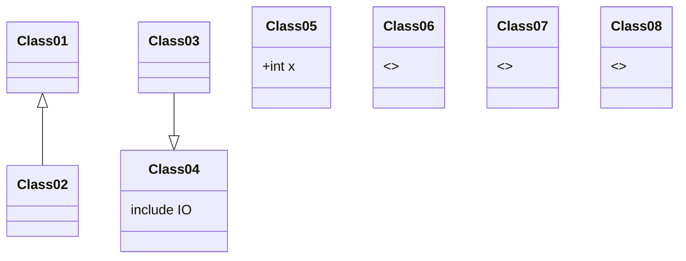
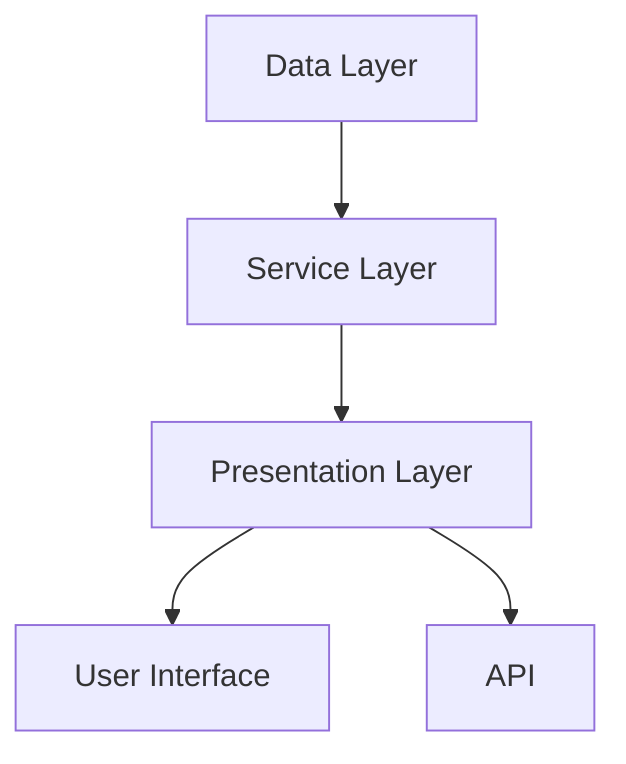
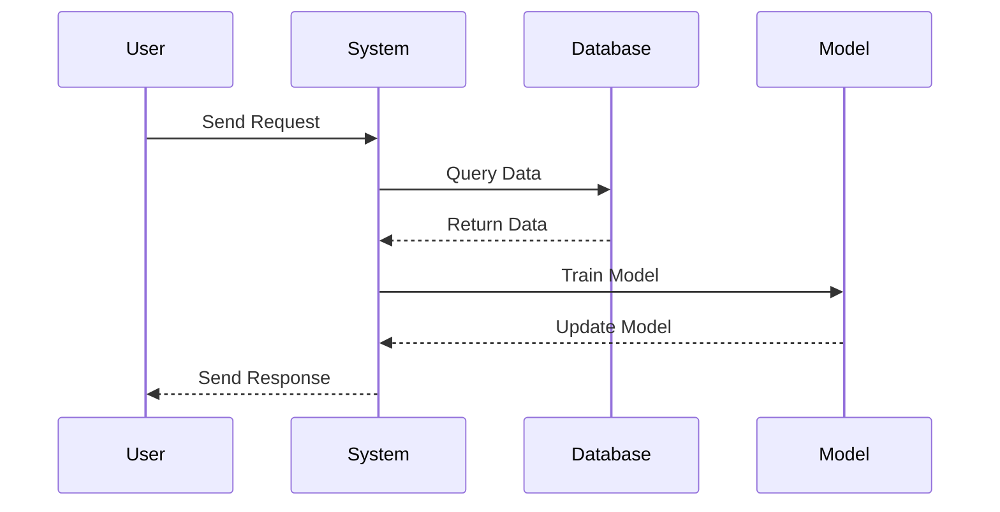
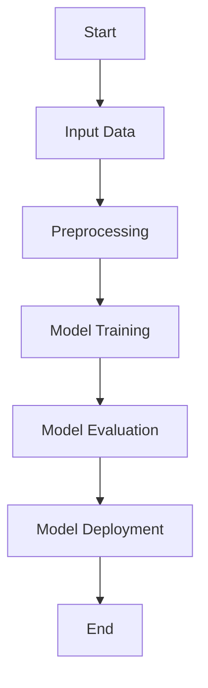

                 

# 从经典人工智能到深度学习：机器理解世界的演变

> 关键词：人工智能、深度学习、神经网络、算法原理、系统设计、实战案例、最佳实践

> 摘要：本文深入探讨了人工智能（AI）从经典方法到现代深度学习的演变过程。通过介绍关键概念、算法原理、系统设计与实战案例，分析了机器理解世界的挑战与解决方案，展望了未来人工智能的发展趋势。

## 目录

### 第一部分：背景与核心概念

#### 1.1 人工智能的发展历程

#### 1.2 从经典AI到深度学习的演变

#### 1.3 机器理解世界的挑战与目标

### 第二部分：核心概念与联系

#### 2.1 经典人工智能

##### 2.1.1 定义与特点

##### 2.1.2 代表性方法与技术

#### 2.2 深度学习

##### 2.2.1 定义与特点

##### 2.2.2 神经网络与深度网络

#### 2.3 神经网络

##### 2.3.1 结构与原理

##### 2.3.2 激活函数与优化算法

### 第三部分：算法原理讲解

#### 3.1 经典人工智能算法

##### 3.1.1 决策树与支持向量机

##### 3.1.2 贝叶斯网络与隐马尔可夫模型

#### 3.2 深度学习算法

##### 3.2.1 卷积神经网络（CNN）

##### 3.2.2 递归神经网络（RNN）与长短时记忆网络（LSTM）

### 第四部分：系统分析与架构设计

#### 4.1 问题场景介绍

#### 4.2 系统功能设计

##### 4.2.1 领域模型

#### 4.3 系统架构设计

##### 4.3.1 架构设计

#### 4.4 系统接口设计与交互流程

### 第五部分：项目实战

#### 5.1 环境安装

#### 5.2 系统核心实现

##### 5.2.1 源代码解读

##### 5.2.2 应用分析与测试

#### 5.3 实际案例分析与讲解

### 第六部分：最佳实践与拓展

#### 6.1 最佳实践技巧

#### 6.2 注意事项

#### 6.3 拓展阅读

### 第七部分：总结与展望

#### 7.1 本书主要内容回顾

#### 7.2 未来人工智能的发展趋势

---

## 第一部分：背景与核心概念

### 1.1 人工智能的发展历程

人工智能（Artificial Intelligence，AI）自1956年被提出以来，经历了多个发展阶段。经典人工智能（Classical AI）时期，主要以符号推理和知识表示为核心。专家系统（Expert Systems）是这一时期的代表性成果，通过编码人类专家的知识，实现特定领域的智能推理。

随着计算机性能的提升和数据量的爆炸式增长，现代人工智能（Modern AI）特别是深度学习（Deep Learning）迅速崛起。深度学习利用多层神经网络（Neural Networks）学习数据的特征表示，解决了传统机器学习（Machine Learning）难以处理高维数据和复杂模式的问题。

### 1.2 从经典AI到深度学习的演变

经典人工智能依赖于明确的规则和逻辑推理，而深度学习则通过大量数据自动学习特征。这一演变不仅改变了AI的求解方式，还推动了计算机视觉、自然语言处理等领域的突破。

深度学习的主要优势在于其强大的模型表示能力和自学习能力。通过反向传播算法（Backpropagation）和优化算法（如梯度下降、Adam等），神经网络能够从海量数据中提取复杂特征，实现高度自动化的模式识别和预测。

### 1.3 机器理解世界的挑战与目标

机器理解世界面临着诸多挑战，包括数据获取、模型可解释性、计算资源需求等。数据获取方面，高质量标注数据稀缺且获取成本高；模型可解释性方面，深度学习模型常常被视为“黑盒”，难以理解其决策过程；计算资源需求方面，深度学习模型通常需要大量的计算资源和时间来训练。

尽管面临挑战，机器理解世界的目标仍然是实现智能体能够自主感知环境、理解语言、进行决策和执行任务。随着技术的进步，这些目标将逐渐实现。

---

## 第二部分：核心概念与联系

### 2.1 经典人工智能

#### 2.1.1 定义与特点

经典人工智能（Classical AI）基于符号逻辑和规则推理，旨在构建能够模拟人类智能行为的系统。其特点包括：

- 符号表示：使用符号和规则表示知识和信息。
- 知识编码：通过知识库编码领域专家的智慧和经验。
- 运算规则：基于逻辑演算和搜索算法进行推理和决策。

#### 2.1.2 代表性方法与技术

- 专家系统（Expert Systems）：基于领域专家知识的自动化系统。
- 自然语言处理（Natural Language Processing，NLP）：使计算机能够理解、生成和处理自然语言。
- 计算机视觉（Computer Vision）：使计算机能够从图像或视频中提取信息。

### 2.2 深度学习

#### 2.2.1 定义与特点

深度学习（Deep Learning）是一种基于多层神经网络的学习方法，其特点包括：

- 多层神经网络：通过多层非线性变换学习数据的复杂特征。
- 数据驱动：从大量数据中自动学习特征，无需显式编码规则。
- 自适应优化：利用反向传播算法和优化算法自动调整网络参数。

#### 2.2.2 神经网络与深度网络

- 神经网络（Neural Networks）：一种模仿生物神经网络的结构和功能的计算模型。
- 深度网络（Deep Networks）：包含多个隐藏层的神经网络，能够学习更复杂的特征表示。

### 2.3 神经网络

#### 2.3.1 结构与原理

神经网络由大量简单的处理单元（神经元）组成，通过加权连接形成网络结构。其原理包括：

- 输入层：接收外部输入数据。
- 隐藏层：对输入数据进行变换和提取特征。
- 输出层：生成输出结果。

#### 2.3.2 激活函数与优化算法

- 激活函数：引入非线性变换，使神经网络能够模拟生物神经元的激活行为。
- 优化算法：如梯度下降（Gradient Descent）、Adam等，用于调整网络参数以最小化损失函数。

---

## 第三部分：算法原理讲解

### 3.1 经典人工智能算法

#### 3.1.1 决策树与支持向量机

决策树（Decision Tree）是一种树形结构，通过一系列的规则进行分类或回归。其原理包括：

- 特征选择：基于信息增益或基尼不纯度选择最佳特征进行划分。
- 决策规则：根据特征值进行决策，形成树结构。

支持向量机（Support Vector Machine，SVM）是一种基于间隔最大化原理的分类算法。其原理包括：

- 特征空间映射：将输入数据映射到高维特征空间，寻找最大间隔。
- 分类决策：通过分类超平面将数据分为不同类别。

#### 3.1.2 贝叶斯网络与隐马尔可夫模型

贝叶斯网络（Bayesian Network）是一种概率图模型，用于表示变量之间的依赖关系。其原理包括：

- 概率分布：通过条件概率表表示变量之间的依赖关系。
- 贝叶斯推理：通过推理算法计算变量的后验概率。

隐马尔可夫模型（Hidden Markov Model，HMM）是一种统计模型，用于处理时间序列数据。其原理包括：

- 状态转移概率：描述状态之间的转移概率。
- 观测概率：描述状态对应的观测概率。

### 3.2 深度学习算法

#### 3.2.1 卷积神经网络（CNN）

卷积神经网络（Convolutional Neural Network，CNN）是一种专门用于处理图像数据的深度学习模型。其原理包括：

- 卷积层：通过卷积操作提取图像的局部特征。
- 池化层：通过下采样减少参数数量。
- 全连接层：将特征映射到分类或回归结果。

#### 3.2.2 递归神经网络（RNN）与长短时记忆网络（LSTM）

递归神经网络（Recurrent Neural Network，RNN）是一种能够处理序列数据的神经网络。其原理包括：

- 循环连接：将当前输入与前一时刻的隐藏状态相连接。
- 状态记忆：通过隐藏状态维持长期依赖信息。

长短时记忆网络（Long Short-Term Memory，LSTM）是RNN的一种变体，解决了传统RNN的梯度消失问题。其原理包括：

- 长短时遗忘门：控制信息的遗忘和保存。
- 单元状态：通过门控机制调整单元状态。

---

## 第四部分：系统分析与架构设计

### 4.1 问题场景介绍

假设我们要开发一个智能图像识别系统，用于识别图像中的物体。系统需要处理大量未标记的图像数据，并从中学习特征以进行分类。

### 4.2 系统功能设计

系统功能设计主要包括数据预处理、模型训练、模型评估和预测。

- **数据预处理**：对图像进行归一化、裁剪、翻转等操作，以便模型训练。
- **模型训练**：使用深度学习算法训练图像识别模型，如卷积神经网络（CNN）。
- **模型评估**：通过验证集评估模型的准确性、召回率等性能指标。
- **预测**：使用训练好的模型对新的图像进行物体识别。

#### 4.2.1 领域模型

使用Mermaid绘制领域模型类图：



### 4.3 系统架构设计

系统架构设计包括数据层、服务层和表现层。

- **数据层**：负责数据的存储和管理，如数据库、数据仓库等。
- **服务层**：实现业务逻辑，包括数据预处理、模型训练、模型评估等。
- **表现层**：提供用户交互界面，如Web应用、移动应用等。

#### 4.3.1 架构设计

使用Mermaid绘制系统架构图：



### 4.4 系统接口设计与交互流程

系统接口设计主要包括API接口和消息队列。

- **API接口**：提供外部访问系统的接口，如RESTful API。
- **消息队列**：用于异步处理消息，如Kafka、RabbitMQ。

#### 系统交互流程

使用Mermaid绘制系统交互序列图：



---

## 第五部分：项目实战

### 5.1 环境安装

安装深度学习框架，如TensorFlow或PyTorch，以及必要的依赖库。

```shell
# 安装TensorFlow
pip install tensorflow

# 安装PyTorch
pip install torch torchvision

# 安装其他依赖库
pip install numpy matplotlib scikit-learn
```

### 5.2 系统核心实现

#### 5.2.1 源代码解读

以下是使用卷积神经网络进行图像分类的Python代码示例：

```python
import tensorflow as tf
from tensorflow.keras import layers, models

# 构建卷积神经网络模型
model = models.Sequential([
    layers.Conv2D(32, (3, 3), activation='relu', input_shape=(150, 150, 3)),
    layers.MaxPooling2D((2, 2)),
    layers.Conv2D(64, (3, 3), activation='relu'),
    layers.MaxPooling2D((2, 2)),
    layers.Conv2D(128, (3, 3), activation='relu'),
    layers.MaxPooling2D((2, 2)),
    layers.Conv2D(128, (3, 3), activation='relu'),
    layers.MaxPooling2D((2, 2)),
    layers.Flatten(),
    layers.Dense(512, activation='relu'),
    layers.Dense(1, activation='sigmoid')
])

# 编译模型
model.compile(optimizer='adam',
              loss='binary_crossentropy',
              metrics=['accuracy'])

# 查看模型结构
model.summary()
```

#### 5.2.2 应用解读与分析

代码首先定义了一个卷积神经网络模型，包括多个卷积层、池化层和全连接层。卷积层用于提取图像的局部特征，池化层用于下采样以减少参数数量。全连接层用于分类输出。

在编译模型时，指定了优化器和损失函数。最后，使用模型总结函数查看模型的结构和参数数量。

### 5.3 实际案例分析与讲解

假设我们要训练一个猫狗分类模型，数据集包含大量猫狗的图像。以下是训练和评估模型的步骤：

```python
# 导入数据集
train_data = ...  # 读取训练数据
val_data = ...    # 读取验证数据

# 划分训练集和验证集
train_images, train_labels = train_data
val_images, val_labels = val_data

# 训练模型
history = model.fit(
    train_images, train_labels,
    epochs=10,
    validation_data=(val_images, val_labels),
    verbose=2
)

# 评估模型
test_loss, test_acc = model.evaluate(val_images, val_labels, verbose=2)
print(f"Test accuracy: {test_acc:.3f}")
```

代码首先导入数据集并划分训练集和验证集。然后使用训练集训练模型，并在验证集上评估模型性能。最后，输出验证集上的准确率。

---

## 第六部分：最佳实践与拓展

### 6.1 最佳实践技巧

- **数据预处理**：确保数据集的多样性和质量，对图像进行增强、归一化和标准化处理。
- **模型选择**：根据任务需求选择合适的模型结构，如CNN、RNN或LSTM。
- **超参数调整**：通过交叉验证和网格搜索调整模型超参数，如学习率、批量大小等。
- **模型优化**：使用批量归一化、dropout等技术优化模型性能。

### 6.2 注意事项

- **数据隐私**：确保数据集的隐私和合规性，避免泄露敏感信息。
- **计算资源**：合理分配计算资源，避免资源浪费。
- **模型解释性**：尽可能提高模型的可解释性，以便理解和调试。

### 6.3 拓展阅读

- **深度学习书籍**：《深度学习》（Ian Goodfellow、Yoshua Bengio、Aaron Courville 著）
- **经典人工智能书籍**：《人工智能：一种现代的方法》（Stuart Russell、Peter Norvig 著）
- **开源项目**：TensorFlow、PyTorch、Keras等深度学习框架的官方文档和社区。

---

## 第七部分：总结与展望

本文系统介绍了人工智能从经典方法到深度学习的演变过程，分析了核心概念、算法原理、系统设计与实战案例。未来，人工智能将继续在各个领域发挥重要作用，推动社会进步和科技创新。同时，我们也应关注数据隐私、模型解释性等挑战，以实现可持续的人工智能发展。让我们共同努力，迎接人工智能的美好未来。

---

作者：AI天才研究院/AI Genius Institute & 禅与计算机程序设计艺术 /Zen And The Art of Computer Programming

---

### 附录：Mermaid图表示例

以下是一些Mermaid图表的示例，用于展示系统架构、领域模型和算法流程：

#### 系统架构图


#### 领域模型类图


#### 算法流程图



这些图表可以帮助读者更好地理解系统设计和算法原理。在实际应用中，可以根据具体需求调整图表的内容和结构。

