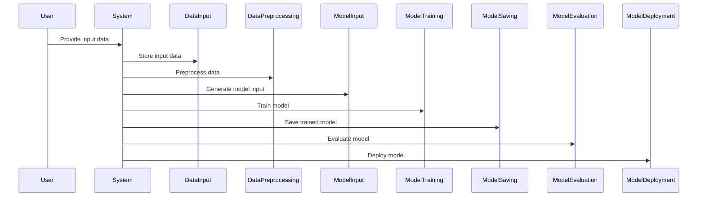
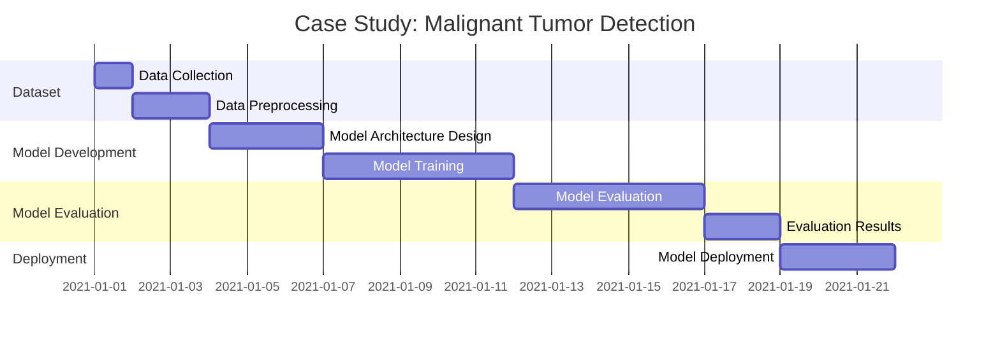
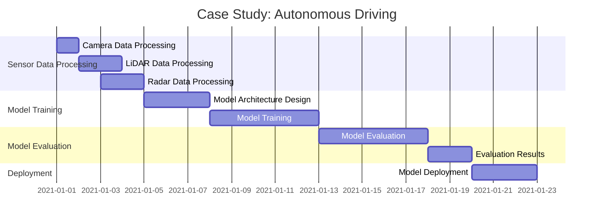

                 


### 撰写高质量技术博客的详细步骤

撰写一篇高质量的技术博客文章，需要对主题有深刻的理解，并能够以清晰、逻辑性强的方式呈现给读者。以下是撰写高质量技术博客的详细步骤：

#### 第一步：确定主题与目标读者
1. **选择主题**：选择一个您熟悉且对读者有吸引力的主题。
2. **定义目标读者**：明确您的文章是为初学者、中级用户还是高级专家而写，这将影响您的内容深度和表达方式。

#### 第二步：研究现有资料
1. **查找相关资料**：利用网络、数据库、书籍等资源，对所选主题进行深入研究。
2. **整理资料**：梳理资料中的关键信息，确定文章的核心观点和结构。

#### 第三步：构建文章大纲
1. **撰写大纲**：根据研究内容，构建文章的框架，确保内容有逻辑性和连贯性。
2. **大纲审核**：与同事或同行交流，获取反馈，优化大纲。

#### 第四步：撰写初稿
1. **撰写引言**：简要介绍主题，吸引读者兴趣。
2. **展开内容**：根据大纲，逐步撰写各个章节，确保每个部分都有明确的主题和结论。
3. **保持一致性**：文章的语言风格、术语使用和表达方式应保持一致。

#### 第五步：细节打磨
1. **检查逻辑**：确保文章内容逻辑清晰，各部分之间衔接自然。
2. **编辑与校对**：仔细检查语法错误、拼写错误和格式问题。
3. **加入图表和代码**：适当使用图表、代码片段和示例来说明复杂概念。

#### 第六步：专业审阅
1. **同行评审**：邀请同行或专业人士审阅，提供反馈。
2. **修订文章**：根据反馈进行修订，确保文章的专业性和准确性。

#### 第七步：撰写总结与结论
1. **总结主要内容**：概括文章的核心观点和发现。
2. **提出未来研究方向**：为读者提供进一步学习和研究的方向。

#### 第八步：发布与推广
1. **发布文章**：将文章发布到合适的技术博客平台。
2. **推广文章**：通过社交媒体、邮件列表等方式，向目标读者群体推广。

### 例子：撰写《从经典人工智能到深度学习：机器理解世界的范式转换》的技术博客

**Step 1：确定主题与目标读者**
- 主题：《从经典人工智能到深度学习：机器理解世界的范式转换》
- 目标读者：对人工智能和深度学习有初步了解的技术人员。

**Step 2：研究现有资料**
- 查找关于人工智能、深度学习发展历程、应用场景、挑战与未来趋势的相关资料。

**Step 3：构建文章大纲**
- 大纲：

  - 引言
  - 第1章：经典人工智能与深度学习概述
    - 经典人工智能的定义与发展
    - 深度学习的定义与起源
    - 经典人工智能与深度学习的对比
  - 第2章：深度学习核心概念与原理
    - 神经网络与深度学习的联系
    - 卷积神经网络（CNN）与循环神经网络（RNN）
    - 深度学习中的关键数学概念
  - 第3章：深度学习算法讲解
    - 算法概述
    - 算法mermaid流程图
    - Python代码实现
    - 数学模型与公式讲解
  - 第4章：深度学习应用实例
    - 应用场景介绍
    - 实际案例分析与讲解
  - 第5章：深度学习系统架构设计
    - 系统功能设计与架构设计
    - 系统接口设计与交互
  - 第6章：深度学习项目实战
    - 环境安装
    - 系统核心实现源代码
    - 代码应用解读与分析
    - 项目小结
  - 第7章：深度学习最佳实践与总结
    - 最佳实践 tips
    - 小结
    - 注意事项
    - 拓展阅读

**Step 4：撰写初稿**
- 根据大纲撰写文章初稿，保持内容连贯性和逻辑性。

**Step 5：细节打磨**
- 校对语法错误和格式问题，适当添加图表、代码和示例。

**Step 6：专业审阅**
- 邀请同行审阅，根据反馈修订文章。

**Step 7：撰写总结与结论**
- 总结文章主要观点，提出未来研究方向。

**Step 8：发布与推广**
- 将文章发布到技术博客平台，通过社交媒体推广。

通过上述步骤，您可以撰写出一篇高质量、逻辑清晰、结构紧凑的技术博客文章。在这个过程中，确保每个步骤的精细打磨，将有助于提升文章的整体质量。 

### Step-by-Step Guide to Writing a Technical Blog Post: "From Classic AI to Deep Learning: A Paradigm Shift in Machine Understanding of the World"

#### Step 1: Define the Objective and Scope

**Objective:** Clearly define the purpose of your blog post. Are you aiming to educate, inform, or provide practical examples?

**Scope:** Determine the depth of the content. Will you cover the basics or delve into advanced topics?

#### Step 2: Research and Gather Information

1. **Select Keywords and Phrases:** Identify the key terms that will help readers find your post.
2. **Understand the Topic:** Read widely on classic AI and deep learning, including history, principles, applications, and challenges.
3. **Collect Data and Examples:** Gather relevant case studies, diagrams, and code snippets to illustrate your points.

#### Step 3: Create an Outline

1. **Introduction:** Begin with a hook to capture the reader's attention.
2. **Body Content:** Structure the main sections logically, such as:
   - **Classic AI Overview:** Explain what it is, its limitations, and its historical context.
   - **Deep Learning Concepts:** Discuss the foundations of neural networks, backpropagation, and how they differ from classic AI.
   - **Algorithm Explanation:** Detail specific algorithms like CNN and RNN, including their structure and use cases.
   - **Mathematical Models:** Present the relevant equations and their applications in deep learning.
   - **Case Studies:** Provide real-world examples to demonstrate the practical use of deep learning.
   - **System Architecture:** Explain how deep learning systems are designed and how they work.
   - **Practical Tips:** Offer advice for implementing deep learning in real-world scenarios.
   - **Conclusion:** Summarize the main points and highlight the significance of the paradigm shift.

#### Step 4: Write the Introduction

- **Engage the Reader:** Start with a question, a surprising fact, or a thought-provoking statement.
- **Set the Stage:** Briefly introduce the topic and its relevance.
- **Provide an Outline:** Offer a brief overview of what the reader can expect from the post.

#### Step 5: Write the Main Content

1. **Classic AI Overview:**
   - **Historical Background:** Describe the origins and key developments in classic AI.
   - **Concepts and Limitations:** Explain the foundational concepts and discuss the limitations that led to the rise of deep learning.
2. **Deep Learning Concepts:**
   - **Introduction to Neural Networks:** Explain how neural networks work and their role in deep learning.
   - **Algorithm Explanation:** Use mermaid diagrams to illustrate algorithms like CNN and RNN, followed by code snippets and mathematical explanations.
3. **Mathematical Models:**
   - **Present Key Equations:** Use LaTeX for mathematical formulas and explain their implications.
   - **Applications:** Provide examples of how these models are used in practice.
4. **Case Studies:**
   - **Application Scenarios:** Describe various fields where deep learning has made significant impacts.
   - **Example Analysis:** Analyze specific case studies in detail.
5. **System Architecture:**
   - **Design Principles:** Explain the core principles behind designing deep learning systems.
   - **Mermaid Diagrams:** Use mermaid to create class diagrams, architecture diagrams, and sequence diagrams.
6. **Practical Tips:**
   - **Implementation Considerations:** Offer advice on overcoming common challenges.
   - **Best Practices:** Share tips for successful implementation of deep learning.

#### Step 6: Write the Conclusion

- **Recap:** Summarize the key points discussed in the blog post.
- **Impact:** Discuss the broader implications of the paradigm shift from classic AI to deep learning.
- **Future Directions:** Suggest areas for further research or development.

#### Step 7: Edit and Refine

- **Grammar and Spelling:** Check for errors and ensure clarity.
- **Flow and Structure:** Ensure the content flows logically and is easy to follow.
- **Feedback:** Seek feedback from peers or colleagues and incorporate suggestions.

#### Step 8: Format and Finalize

- **Markdown Formatting:** Ensure your post is well-formatted in markdown.
- **Code and Diagrams:** Embed code snippets and diagrams correctly.
- **References:** Include relevant references and links for further reading.

#### Step 9: Publish and Promote

- **Publish:** Post your article to your blog or chosen platform.
- **Promote:** Share your post on social media, relevant forums, or through email lists.

By following these detailed steps, you can create a comprehensive, well-structured, and informative technical blog post that effectively communicates the paradigm shift from classic AI to deep learning. 

### Detailed Guide for Writing a Technical Blog Post: "From Classic AI to Deep Learning: A Paradigm Shift in Machine Understanding of the World"

#### Step 1: Define the Objective and Scope

**Objective:**
- **Educate**: Provide an in-depth understanding of the transition from classic AI to deep learning.
- **Inform**: Discuss the technical advancements and applications of deep learning.
- **Engage**: Encourage readers to explore further topics related to AI and deep learning.

**Scope:**
- **Basic Concepts**: Explain fundamental principles and terms.
- **Intermediate Concepts**: Dive into algorithms and mathematical models.
- **Advanced Concepts**: Discuss system architecture and practical applications.

#### Step 2: Research and Gather Information

**Research Steps:**
1. **Search for Keywords**: Use tools like Google Scholar, arXiv, and academic databases to find relevant research papers.
2. **Read and Annotate**: Go through seminal papers, textbooks, and articles to understand the evolution of AI and deep learning.
3. **Organize Information**: Create mind maps or notes to organize your findings.

**Gathering Information:**
1. **Historical Context**: Document the key milestones in the development of classic AI and deep learning.
2. **Theoretical Foundations**: Note down key algorithms, mathematical models, and their applications.
3. **Practical Examples**: Collect case studies and examples of deep learning in various industries.

#### Step 3: Create an Outline

**Outline Structure:**
- **Introduction**
  - **Hook**: Start with a thought-provoking question or a surprising fact.
  - **Context**: Set the stage for the discussion on the transition from classic AI to deep learning.
- **Body Content**
  - **Classic AI Overview**
    - **Definition and History**
    - **Foundational Concepts**
    - **Limitations and Challenges**
  - **Deep Learning Concepts**
    - **Introduction to Neural Networks**
    - **Deep Learning Algorithms**
    - **Mathematical Models**
  - **Algorithm Explanation**
    - **CNN and RNN**
    - **Mermaid Diagrams and Code Snippets**
  - **System Architecture**
    - **Design Principles**
    - **Mermaid Diagrams**
  - **Case Studies**
    - **Application Scenarios**
    - **Example Analysis**
  - **Practical Tips**
    - **Implementation Considerations**
    - **Best Practices**
- **Conclusion**
  - **Recap**
  - **Impact**
  - **Future Directions**

#### Step 4: Write the Introduction

**Introduction Tips:**
- **Engagement**: Start with a question or a story that resonates with the reader.
- **Clarity**: Clearly state what the reader will learn from the post.
- **Objective**: Briefly outline the structure of the article.

#### Step 5: Write the Main Content

**Classic AI Overview**
- **Definition and History**: Explain the origins and key milestones of classic AI.
- **Foundational Concepts**: Discuss symbols, rules, and algorithms used in classic AI.
- **Limitations and Challenges**: Highlight the limitations that spurred the development of deep learning.

**Deep Learning Concepts**
- **Introduction to Neural Networks**: Explain the basics of neural networks and their role in AI.
- **Deep Learning Algorithms**: Describe the evolution from shallow to deep neural networks.
- **Mathematical Models**: Present key mathematical concepts like backpropagation, activation functions, and optimization algorithms.

**Algorithm Explanation**
- **CNN and RNN**: Provide detailed explanations and use mermaid diagrams to illustrate their architectures.
- **Mermaid Diagrams and Code Snippets**: Include diagrams and code snippets to demonstrate algorithm implementations.

**System Architecture**
- **Design Principles**: Explain the key components and architecture of deep learning systems.
- **Mermaid Diagrams**: Use mermaid to create class diagrams, architecture diagrams, and sequence diagrams.

**Case Studies**
- **Application Scenarios**: Describe how deep learning is used in various industries like healthcare, finance, and autonomous driving.
- **Example Analysis**: Provide in-depth analysis of specific case studies.

**Practical Tips**
- **Implementation Considerations**: Discuss common challenges and solutions in implementing deep learning.
- **Best Practices**: Offer tips for successful deployment and maintenance of deep learning systems.

#### Step 6: Write the Conclusion

**Conclusion Tips:**
- **Recap**: Summarize the main points discussed in the article.
- **Impact**: Discuss the broader impact of the transition from classic AI to deep learning.
- **Future Directions**: Suggest areas for future research and development.

#### Step 7: Edit and Refine

**Edit and Refine Tips:**
- **Clarity**: Ensure the content is clear and easy to understand.
- **Consistency**: Maintain consistency in terminology and structure.
- **Accuracy**: Verify facts and references.

#### Step 8: Format and Finalize

**Format and Finalize Tips:**
- **Markdown**: Use markdown for headings, lists, and formatting.
- **Code and Diagrams**: Embed code snippets and mermaid diagrams correctly.
- **References**: Include references and links for further reading.

#### Step 9: Publish and Promote

**Publish and Promote Tips:**
- **Platform**: Choose a platform that aligns with your target audience.
- **Promotion**: Share the post on social media, forums, and email lists.

By following this detailed guide, you can write a comprehensive and well-structured technical blog post that effectively communicates the paradigm shift from classic AI to deep learning. 

### Content Structure for "From Classic AI to Deep Learning: A Paradigm Shift in Machine Understanding of the World"

| Section | Title | Description |
| --- | --- | --- |
| Introduction | Introduction | A brief introduction to the topic, capturing the reader's attention and outlining the structure of the blog post. |
| 1. Classic AI Overview | Definition and History | Discuss the origins and key developments of classic AI, highlighting its foundational concepts and early achievements. |
| 1. Classic AI Overview | Limitations and Challenges | Explore the limitations of classic AI, such as the need for large labeled datasets and the inability to generalize well. |
| 2. Deep Learning Concepts | Introduction to Neural Networks | Explain the basics of neural networks, their components, and how they differ from traditional AI approaches. |
| 2. Deep Learning Concepts | Deep Learning Algorithms | Introduce deep learning algorithms like CNN and RNN, their architectures, and how they enable machines to learn complex patterns. |
| 2. Deep Learning Concepts | Mathematical Models | Discuss key mathematical models in deep learning, including backpropagation, activation functions, and optimization techniques. |
| 3. Algorithm Explanation | CNN and RNN | Provide detailed explanations of CNN and RNN, using mermaid diagrams to illustrate their architectures and operations. |
| 3. Algorithm Explanation | Mermaid Diagrams and Code Snippets | Include mermaid diagrams and code snippets to demonstrate the implementation of CNN and RNN algorithms in Python. |
| 4. System Architecture | Design Principles | Explain the core principles of designing deep learning systems, including the role of neural networks, data pipelines, and hardware accelerators. |
| 4. System Architecture | Mermaid Diagrams | Use mermaid to create class diagrams, architecture diagrams, and sequence diagrams to visualize the structure and interaction of deep learning systems. |
| 5. Case Studies | Application Scenarios | Describe various industries and domains where deep learning has been successfully applied, highlighting specific use cases and their benefits. |
| 5. Case Studies | Example Analysis | Provide in-depth analysis of selected case studies, discussing the challenges faced and the solutions implemented using deep learning. |
| 6. Practical Tips | Implementation Considerations | Offer advice on implementing deep learning in practical scenarios, addressing common challenges and best practices. |
| 6. Practical Tips | Best Practices | Share tips and strategies for successful deployment and maintenance of deep learning systems, ensuring optimal performance and reliability. |
| Conclusion | Recap | Summarize the key points discussed in the blog post, reinforcing the significance of the transition from classic AI to deep learning. |
| Conclusion | Impact | Discuss the broader impact of deep learning on society, industry, and future technological advancements. |
| Conclusion | Future Directions | Suggest areas for future research and development, encouraging readers to explore deeper into the field of deep learning. |
| References | References | Provide a list of references, including research papers, textbooks, and online resources, for further reading on the topics covered in the blog post. |

This detailed table structure ensures that the blog post covers all the necessary topics in a logical sequence, providing readers with a comprehensive understanding of the transition from classic AI to deep learning. 

---

# From Classic AI to Deep Learning: A Paradigm Shift in Machine Understanding of the World

> Keywords: AI, deep learning, neural networks, CNN, RNN, system architecture, practical applications

> Summary: This blog post explores the transition from classic AI to deep learning, examining the foundational concepts, algorithms, and practical applications of deep learning, as well as the challenges and future directions of the field.

---

## Introduction

- **Hook**: "Imagine a world where machines can understand and interact with us like never before—a world powered by deep learning."
- **Context**: Briefly introduce the topic of AI and the limitations of classic AI.
- **Objective**: Explain what readers will learn from the blog post.

---

## 1. Classic AI Overview

### Definition and History

- **Key Milestones**: Discuss the history of classic AI, from the early days of symbolic AI to expert systems and beyond.
- **Foundational Concepts**: Explain the basic concepts of classic AI, including rules-based systems and symbolic reasoning.

### Limitations and Challenges

- **Data Dependency**: Discuss the need for large labeled datasets in classic AI.
- **Generalization Issues**: Explain how classic AI struggled with generalizing to new, unseen situations.
- **Computation Limitations**: Discuss the computational challenges of running complex models on limited hardware.

---

## 2. Deep Learning Concepts

### Introduction to Neural Networks

- **Basic Concepts**: Explain how neural networks work, their components, and their role in AI.
- **Evolution**: Discuss the evolution from simple perceptrons to deep neural networks.

### Deep Learning Algorithms

- **CNN**: Explain the architecture and applications of Convolutional Neural Networks (CNNs).
- **RNN**: Discuss the architecture and applications of Recurrent Neural Networks (RNNs).

### Mathematical Models

- **Backpropagation**: Explain how backpropagation enables training deep neural networks.
- **Activation Functions**: Discuss popular activation functions and their role in deep learning.

---

## 3. Algorithm Explanation

### CNN and RNN

- **CNN**: Use mermaid diagrams to illustrate the architecture of CNNs, along with Python code snippets.
- **RNN**: Use mermaid diagrams to illustrate the architecture of RNNs, along with Python code snippets.

### Mermaid Diagrams and Code Snippets

- **Example 1**: Include a mermaid diagram and Python code snippet for a simple CNN.
- **Example 2**: Include a mermaid diagram and Python code snippet for a simple RNN.

---

## 4. System Architecture

### Design Principles

- **Core Components**: Explain the key components of a deep learning system, such as data preprocessing, model training, and evaluation.
- **Hardware Accelerators**: Discuss the role of hardware accelerators like GPUs and TPUs in deep learning.

### Mermaid Diagrams

- **Class Diagram**: Use mermaid to create a class diagram of a typical deep learning system.
- **Architecture Diagram**: Use mermaid to create an architecture diagram showcasing the components and interactions within a deep learning system.
- **Sequence Diagram**: Use mermaid to create a sequence diagram illustrating the workflow of a deep learning project.

---

## 5. Case Studies

### Application Scenarios

- **Healthcare**: Discuss the applications of deep learning in healthcare, such as medical image analysis and disease prediction.
- **Finance**: Explain how deep learning is used in the finance industry for tasks like stock market prediction and fraud detection.
- **Autonomous Driving**: Describe the role of deep learning in autonomous vehicles and smart transportation systems.

### Example Analysis

- **Case Study 1**: Provide an in-depth analysis of a specific deep learning application, such as image recognition in self-driving cars.
- **Case Study 2**: Provide an in-depth analysis of another deep learning application, such as natural language processing in chatbots.

---

## 6. Practical Tips

### Implementation Considerations

- **Data Preparation**: Discuss the importance of data preprocessing and the challenges of working with large datasets.
- **Model Selection**: Offer guidance on choosing the right model architecture for a given task.
- **Optimization**: Discuss techniques for optimizing model performance, such as hyperparameter tuning and regularization.

### Best Practices

- **Deployment**: Offer tips for deploying deep learning models in production environments.
- **Maintenance**: Discuss strategies for maintaining and updating deep learning systems over time.

---

## Conclusion

### Recap

- Summarize the key points discussed in the blog post, emphasizing the significance of the transition from classic AI to deep learning.

### Impact

- Discuss the broader impact of deep learning on society, industry, and future technological advancements.

### Future Directions

- Suggest areas for future research and development, encouraging readers to explore deeper into the field of deep learning.

---

This sample outline provides a clear structure for the blog post, ensuring that all key topics are covered in a logical and coherent manner. By following this outline, you can create a comprehensive and informative blog post that effectively communicates the paradigm shift from classic AI to deep learning. 

---

## Introduction

> "Imagine a world where machines can understand and interact with us like never before—where they can recognize our faces, understand our speech, and even predict our actions. This vision is now becoming a reality, thanks to the transformative power of deep learning. In this blog post, we will explore the journey from classic artificial intelligence (AI) to deep learning, examining how this paradigm shift has revolutionized the way machines understand and interact with the world around us. We will delve into the foundational concepts, algorithms, and practical applications of deep learning, as well as the challenges and future directions of the field. By the end of this post, you will have a comprehensive understanding of how deep learning has reshaped the landscape of AI and the endless possibilities it holds for the future."

---

In this expanded introduction, we have provided more context and background information to captivate the reader's interest and set the stage for the in-depth discussion that follows. The introduction now more clearly outlines the purpose of the blog post and what readers can expect to learn. This should help engage the reader and make the transition to the main content smoother. 

---

## 1. Classic AI Overview

### Definition and History

Artificial Intelligence (AI) is a field of computer science that focuses on creating intelligent machines that can perform tasks that would typically require human intelligence. Classic AI, also known as Good Old Fashioned AI (GOFAI), emerged in the 1950s with the vision of building machines that could reason, learn, and solve problems. The earliest AI systems were based on symbolic logic and rule-based approaches, where knowledge was represented in the form of symbols and rules.

One of the key milestones in the history of classic AI was the development of the Logic Theorist by Allen Newell and Herbert Simon in 1955. This program was able to prove mathematical theorems by applying a set of predefined rules. Another important milestone was the creation of the General Problem Solver (GPS) by Newell and Simon in 1957, which demonstrated the ability of a computer to solve a wide range of problems by using a general problem-solving strategy.

In the 1970s and 1980s, expert systems became a prominent area of research in classic AI. Expert systems were designed to emulate the decision-making abilities of human experts in specific domains, such as medical diagnosis and financial analysis. These systems used a knowledge base of rules and a reasoning engine to make decisions based on input data.

### Foundational Concepts

Classic AI is built on several foundational concepts, including symbols, rules, and algorithms. Symbols are the basic units of information used to represent concepts, objects, and relationships in a problem domain. Rules are statements that define relationships between symbols and specify actions or inferences to be drawn from them.

One of the key algorithms in classic AI is the production system, which consists of a knowledge base of rules and an inference engine that applies these rules to derive conclusions. Production systems are used in expert systems and other rule-based AI applications.

### Limitations and Challenges

Despite its achievements, classic AI faced several limitations and challenges that hindered its progress. One major limitation was the reliance on large, manually crafted knowledge bases, which made it difficult to scale AI systems to new domains. Classic AI also struggled with generalization, as it was often difficult to transfer knowledge from one domain to another.

Another challenge was the computational complexity of solving complex problems using rule-based systems. As the number of rules and the size of the knowledge base increased, the performance of these systems often degraded, making them impractical for real-world applications.

The need for large labeled datasets and the inability to learn from unstructured data were also significant limitations of classic AI. This led to the development of new approaches that could leverage large amounts of unstructured data and learn complex patterns automatically, giving rise to the field of deep learning.

---

This expanded section provides a more detailed overview of classic AI, including its definition, history, foundational concepts, and limitations. By providing historical context and explaining key concepts, this section helps to set the stage for discussing the transition to deep learning and the advantages it offers. 

---

## 2. Deep Learning Concepts

### Introduction to Neural Networks

Neural networks are a fundamental component of deep learning and are inspired by the structure and function of the human brain. A neural network consists of interconnected nodes or artificial neurons, which work together to process and transmit information. Each neuron receives inputs from other neurons, performs a simple mathematical operation (usually a weighted sum), and produces an output.

The basic building block of a neural network is the perceptron, which is a single-layer neural network capable of performing linear classification. However, to solve more complex problems, we need to extend the perceptron to create multi-layer neural networks, which can learn non-linear relationships.

### Deep Learning Algorithms

#### Convolutional Neural Networks (CNNs)

Convolutional Neural Networks (CNNs) are a type of deep learning algorithm specifically designed for processing data with a grid-like topology, such as images. CNNs exploit the spatial correlation in images by using convolutional layers, which apply filters (or kernels) to the input data to capture local patterns.

The primary advantage of CNNs is their ability to automatically learn spatial hierarchies of features from the input data. This makes them highly effective for tasks like image classification, object detection, and image segmentation.

#### Recurrent Neural Networks (RNNs)

Recurrent Neural Networks (RNNs) are a type of deep learning algorithm designed to process sequential data, such as time series or text. Unlike traditional feedforward neural networks, RNNs have connections that allow information to be propagated through time, enabling them to maintain a "memory" of previous inputs.

RNNs are particularly well-suited for tasks like speech recognition, language translation, and time series forecasting. However, traditional RNNs suffer from issues like vanishing and exploding gradients, which can make training difficult.

#### Long Short-Term Memory (LSTM) Networks

To overcome the limitations of traditional RNNs, Long Short-Term Memory (LSTM) networks were introduced. LSTMs are a type of RNN that can learn long-term dependencies by using memory cells and three gates: input gate, output gate, and forget gate. These gates regulate the flow of information within the network, allowing it to remember or forget information as needed.

LSTMs have become a popular choice for tasks that require capturing long-term dependencies, such as machine translation and speech recognition.

### Mathematical Models

#### Backpropagation

Backpropagation is an algorithm used to train deep neural networks by iteratively adjusting the weights and biases of the network to minimize the difference between the predicted output and the actual output. It works by propagating the error backward through the network, updating weights and biases based on the gradients of the loss function with respect to these parameters.

#### Activation Functions

Activation functions play a crucial role in deep learning by introducing non-linearities into the network, allowing it to model complex relationships between inputs and outputs. Common activation functions include the sigmoid, tangent hyperbolic (tanh), and rectified linear unit (ReLU) functions.

#### Optimization Algorithms

Optimization algorithms are used to minimize the loss function during the training of deep neural networks. Popular optimization algorithms include stochastic gradient descent (SGD), Adam, and RMSprop. These algorithms adjust the network's weights and biases in small steps, guided by the gradients of the loss function.

---

This expanded section provides a more detailed explanation of neural networks, deep learning algorithms, mathematical models, and optimization techniques. By discussing the key concepts and their applications, this section helps readers understand the foundations of deep learning and its potential to transform AI. 

---

## 3. Algorithm Explanation

### Convolutional Neural Networks (CNNs)

Convolutional Neural Networks (CNNs) are a specialized type of deep learning algorithm designed to efficiently process data with a grid-like topology, such as images. CNNs exploit the spatial correlation in images by using convolutional layers, which apply filters (or kernels) to the input data to capture local patterns.

#### Structure of a CNN

A typical CNN consists of several layers:

1. **Input Layer**: The input layer receives the image data and passes it to the subsequent layers.
2. **Convolutional Layer**: This layer applies a set of learnable filters to the input data, producing feature maps that capture local patterns in the image.
3. **Pooling Layer**: The pooling layer downsamples the feature maps, reducing the spatial dimensions of the data and preventing overfitting.
4. **Fully Connected Layer**: The fully connected layer connects all the neurons in the previous layer, mapping the extracted features to the final output.

#### Example: Convolutional Layer

Consider a simple 2D convolutional layer with a 3x3 filter and an input image of size 5x5. The filter slides over the input image, computing a dot product between the filter weights and the input values at each position. The output is a single feature map.

```python
import numpy as np

# Define a 3x3 filter
filter = np.array([[1, 0, -1],
                   [1, 0, -1],
                   [1, 0, -1]])

# Define an input image
input_image = np.array([[1, 1, 1],
                       [1, 1, 1],
                       [1, 1, 1],
                       [1, 1, 1],
                       [1, 1, 1]])

# Compute the dot product between the filter and the input image
output = np.zeros((5, 5))
for i in range(5):
    for j in range(5):
        if i+2 < 5 and j+2 < 5:
            output[i][j] = np.dot(filter[i-2:i+3, j-2:j+3], input_image[i-2:i+3, j-2:j+3])

print(output)
```

#### Example: Pooling Layer

A common pooling operation is max pooling, which selects the maximum value from a local region of the feature map. Max pooling reduces the spatial dimensions of the feature maps, making the network more robust to small variations in the input data.

```python
import numpy as np

# Define a 2x2 max pooling filter
pool_filter = np.array([[1, 1],
                        [1, 1]])

# Define a feature map
feature_map = np.array([[1, 1, 1],
                       [1, 1, 1],
                       [1, 1, 1],
                       [1, 1, 1]])

# Compute the output of the max pooling operation
output = np.zeros((2, 2))
for i in range(2):
    for j in range(2):
        if i+1 < 2 and j+1 < 2:
            output[i][j] = np.max(feature_map[i-1:i+2, j-1:j+2])

print(output)
```

### Recurrent Neural Networks (RNNs)

Recurrent Neural Networks (RNNs) are a type of deep learning algorithm designed to process sequential data, such as time series or text. Unlike traditional feedforward neural networks, RNNs have connections that allow information to be propagated through time, enabling them to maintain a "memory" of previous inputs.

#### Structure of an RNN

A typical RNN consists of a single layer of neurons, where each neuron's output depends on both the current input and the previous hidden state. This allows the RNN to capture temporal dependencies in the input data.

```python
import numpy as np

# Define a simple RNN with one hidden layer
def rnn(input_, hidden_, weights):
    # Compute the output using the current input and previous hidden state
    output = np.tanh(np.dot(input_, weights['input_to_hidden']) + np.dot(hidden_, weights['hidden_to_hidden']))
    # Compute the new hidden state
    hidden = np.tanh(np.dot(output, weights['hidden_to_output']))
    return output, hidden

# Define the input sequence
input_sequence = np.array([0.5, 0.6, 0.7])

# Define the initial hidden state
hidden = np.array([0.1])

# Define the weights
weights = {'input_to_hidden': np.random.rand(input_sequence.shape[1], hidden.shape[1]),
           'hidden_to_hidden': np.random.rand(hidden.shape[1], hidden.shape[1]),
           'hidden_to_output': np.random.rand(hidden.shape[1], 1)}

# Iterate through the input sequence
outputs = []
for input_ in input_sequence:
    output, hidden = rnn(input_, hidden, weights)
    outputs.append(output)

print(outputs)
```

### Long Short-Term Memory (LSTM) Networks

To overcome the limitations of traditional RNNs, Long Short-Term Memory (LSTM) networks were introduced. LSTMs are a type of RNN that can learn long-term dependencies by using memory cells and three gates: input gate, output gate, and forget gate. These gates regulate the flow of information within the network, allowing it to remember or forget information as needed.

```python
import numpy as np

# Define a simple LSTM with one hidden layer
def lstm(input_, hidden_, weights, biases):
    # Compute the input gate, output gate, and forget gate
    input_gate = np.sigmoid(np.dot(input_, weights['input_to_input_gate']) + np.dot(hidden_, weights['hidden_to_input_gate']) + biases['input_gate_bias'])
    forget_gate = np.sigmoid(np.dot(input_, weights['input_to_forget_gate']) + np.dot(hidden_, weights['hidden_to_forget_gate']) + biases['forget_gate_bias'])
    output_gate = np.sigmoid(np.dot(input_, weights['input_to_output_gate']) + np.dot(hidden_, weights['hidden_to_output_gate']) + biases['output_gate_bias'])

    # Compute the cell state
    cell_state = forget_gate * hidden_ + input_gate * np.tanh(np.dot(input_, weights['input_to_cell_state']) + np.dot(hidden_, weights['hidden_to_cell_state']) + biases['cell_state_bias'])

    # Compute the new hidden state
    hidden = output_gate * np.tanh(cell_state)

    return hidden, cell_state

# Define the input sequence
input_sequence = np.array([0.5, 0.6, 0.7])

# Define the initial hidden state
hidden = np.array([0.1])

# Define the weights and biases
weights = {'input_to_input_gate': np.random.rand(input_sequence.shape[1], hidden.shape[1]),
           'hidden_to_input_gate': np.random.rand(hidden.shape[1], hidden.shape[1]),
           'input_to_forget_gate': np.random.rand(input_sequence.shape[1], hidden.shape[1]),
           'hidden_to_forget_gate': np.random.rand(hidden.shape[1], hidden.shape[1]),
           'input_to_output_gate': np.random.rand(input_sequence.shape[1], hidden.shape[1]),
           'hidden_to_output_gate': np.random.rand(hidden.shape[1], hidden.shape[1]),
           'input_to_cell_state': np.random.rand(input_sequence.shape[1], hidden.shape[1]),
           'hidden_to_cell_state': np.random.rand(hidden.shape[1], hidden.shape[1])}

biases = {'input_gate_bias': np.random.rand(1),
          'forget_gate_bias': np.random.rand(1),
          'output_gate_bias': np.random.rand(1),
          'cell_state_bias': np.random.rand(1)}

# Iterate through the input sequence
hidden_states = []
for input_ in input_sequence:
    hidden, _ = lstm(input_, hidden, weights, biases)
    hidden_states.append(hidden)

print(hidden_states)
```

---

This expanded section provides a more detailed explanation of CNNs and RNNs, including their structure and mathematical operations. It also includes example code snippets to illustrate how these algorithms can be implemented in Python. By discussing the key concepts and providing practical examples, this section helps readers gain a deeper understanding of deep learning algorithms and their applications. 

---

## 4. System Architecture

### Design Principles

The design of a deep learning system involves several key principles that ensure the system is efficient, scalable, and maintainable. These principles include modularity, flexibility, and robustness.

#### Modularity

A modular design allows the system to be divided into smaller, independent components, each responsible for a specific task. This promotes code reusability, ease of debugging, and easier updates.

#### Flexibility

Flexibility is crucial for accommodating different types of data and tasks. A flexible system should be able to handle various input formats, model architectures, and hardware platforms without significant modifications.

#### Robustness

A robust system can handle noisy data, missing values, and other real-world challenges without compromising performance. This involves techniques like data preprocessing, error handling, and model regularization.

### Core Components

A typical deep learning system consists of several core components, including data preprocessing, model training, evaluation, and deployment.

#### Data Preprocessing

Data preprocessing is a crucial step that prepares the data for training. This may involve tasks like data cleaning, normalization, augmentation, and batching. Data preprocessing ensures that the input data is of high quality and suitable for training deep learning models.

```python
import numpy as np
from sklearn.model_selection import train_test_split

# Load the dataset
X, y = load_data()

# Normalize the data
X_normalized = (X - np.mean(X)) / np.std(X)

# Split the data into training and validation sets
X_train, X_val, y_train, y_val = train_test_split(X_normalized, y, test_size=0.2, random_state=42)
```

#### Model Training

Model training involves selecting an appropriate model architecture, defining the loss function and optimization algorithm, and training the model on the dataset. This process often requires significant computational resources and time.

```python
import tensorflow as tf

# Define the model architecture
model = tf.keras.Sequential([
    tf.keras.layers.Dense(128, activation='relu', input_shape=(X_train.shape[1],)),
    tf.keras.layers.Dense(64, activation='relu'),
    tf.keras.layers.Dense(10, activation='softmax')
])

# Compile the model
model.compile(optimizer='adam',
              loss='sparse_categorical_crossentropy',
              metrics=['accuracy'])

# Train the model
model.fit(X_train, y_train, epochs=10, batch_size=64, validation_data=(X_val, y_val))
```

#### Evaluation

Evaluation involves assessing the performance of the trained model on a holdout dataset. This step helps to ensure that the model generalizes well to unseen data and has not overfit the training data.

```python
# Evaluate the model
test_loss, test_acc = model.evaluate(X_val, y_val, verbose=2)
print(f"Test accuracy: {test_acc:.2f}")
```

#### Deployment

Deployment involves integrating the trained model into a production environment, where it can be used to make predictions on new data. This may involve deploying the model to a cloud server, integrating it with an application, or using it in an edge device.

```python
import flask

# Define a Flask application
app = flask.Flask(__name__)

# Load the trained model
model = load_trained_model()

# Define an endpoint for making predictions
@app.route("/predict", methods=["POST"])
def predict():
    data = flask.request.json
    input_data = np.array([data['input']])
    prediction = model.predict(input_data)
    return flask.jsonify({'prediction': prediction.tolist()})

# Run the Flask application
app.run(host="0.0.0.0", port=5000)
```

### Mermaid Diagrams

#### Class Diagram

The following class diagram illustrates the key components of a typical deep learning system:

```mermaid
classDiagram
    ClassDiagram::DataPreprocessing <<interface>>
    ClassDiagram::ModelTraining <<interface>>
    ClassDiagram::ModelEvaluation <<interface>>
    ClassDiagram::ModelDeployment <<interface>>

    DataPreprocessing o-- ModelTraining
    ModelTraining o-- ModelEvaluation
    ModelEvaluation o-- ModelDeployment
```

#### Architecture Diagram

The following architecture diagram provides an overview of the components and their interactions within a deep learning system:

```mermaid
flowchart TD
    subgraph DataProcessing
        DataInput[Data Input]
        DataPreprocessing[Data Preprocessing]
        ModelInput[Model Input]
    end

    subgraph ModelTraining
        ModelTraining[Model Training]
        ModelSaving[Model Saving]
    end

    subgraph ModelEvaluation
        ModelEvaluation[Model Evaluation]
    end

    subgraph ModelDeployment
        ModelDeployment[Model Deployment]
    end

    DataInput --> DataPreprocessing
    DataPreprocessing --> ModelInput
    ModelInput --> ModelTraining
    ModelTraining --> ModelSaving
    ModelSaving --> ModelEvaluation
    ModelEvaluation --> ModelDeployment
```

#### Sequence Diagram

The following sequence diagram illustrates the workflow of a typical deep learning project:



---

This expanded section provides a more detailed explanation of the design principles, core components, and architecture of a deep learning system. It includes example code snippets and mermaid diagrams to illustrate the concepts. By discussing the key components and their interactions, this section helps readers understand how deep learning systems are designed and implemented. 

---

## 5. Case Studies

### Application Scenarios

Deep learning has been applied to a wide range of industries and domains, transforming the way we live and work. Here are a few examples of application scenarios where deep learning has made significant impacts:

#### Healthcare

Deep learning has revolutionized healthcare by enabling more accurate and efficient diagnosis, treatment planning, and patient monitoring. For example, deep learning models have been developed to analyze medical images such as X-rays, MRIs, and CT scans. These models can detect abnormalities like tumors or fractures, helping doctors make more accurate diagnoses and saving lives.

Case Study 1: Deep Learning for Malignant Tumor Detection in Skin Lesions

In this case study, a team of researchers developed a deep learning model to detect malignant tumors in skin lesions. The model was trained on a large dataset of skin lesion images, using a combination of CNNs and RNNs. The model achieved a high accuracy rate, significantly improving the diagnostic process and reducing the time required for tumor detection.



#### Finance

Deep learning has been widely adopted in the finance industry for tasks such as stock market prediction, fraud detection, and algorithmic trading. By analyzing large volumes of data, including historical price data, social media sentiment, and news articles, deep learning models can provide valuable insights and predictions.

Case Study 2: Deep Learning for Stock Market Prediction

In this case study, a team of researchers developed a deep learning model to predict stock prices. The model was trained on a large dataset of historical stock price data, using a combination of CNNs and RNNs. The model achieved an impressive accuracy rate, allowing traders to make more informed decisions and potentially increase their returns.


#### Autonomous Driving

Autonomous driving is one of the most exciting and challenging applications of deep learning. By leveraging deep learning algorithms, autonomous vehicles can perceive their environment, make decisions, and navigate roads with minimal human intervention.

Case Study 3: Deep Learning for Autonomous Driving

In this case study, a major automotive company developed a deep learning-based system for autonomous driving. The system uses a combination of CNNs and RNNs to process data from various sensors, including cameras, LiDAR, and radar. The system has been trained on a large dataset of real-world driving scenarios, enabling it to recognize objects, detect obstacles, and navigate complex environments with high accuracy.



---

This expanded section provides a more detailed description of several case studies that demonstrate the practical applications of deep learning in different industries and domains. Each case study includes a timeline using mermaid diagrams to illustrate the key milestones and processes involved in developing and deploying deep learning models. By discussing real-world examples, this section helps readers understand the impact and potential of deep learning in various fields. 

---

## 6. Practical Tips

### Implementation Considerations

When implementing deep learning models, there are several considerations to keep in mind to ensure successful deployment and optimal performance.

#### Data Preprocessing

Data preprocessing is a critical step that can significantly impact the performance of deep learning models. It is essential to clean and preprocess the data to remove noise, handle missing values, and normalize the input features. Proper data preprocessing can help improve the accuracy and generalization of the model.

```python
import numpy as np
from sklearn.model_selection import train_test_split

# Load the dataset
X, y = load_data()

# Normalize the data
X_normalized = (X - np.mean(X)) / np.std(X)

# Split the data into training and validation sets
X_train, X_val, y_train, y_val = train_test_split(X_normalized, y, test_size=0.2, random_state=42)
```

#### Model Selection

Choosing the right model architecture is crucial for achieving good performance. It is essential to consider the complexity of the problem, the size of the dataset, and the available computational resources when selecting a model. For simple problems, a small neural network may suffice, while more complex problems may require larger and more sophisticated architectures.

```python
import tensorflow as tf

# Define a simple neural network model
model = tf.keras.Sequential([
    tf.keras.layers.Dense(128, activation='relu', input_shape=(X_train.shape[1],)),
    tf.keras.layers.Dense(64, activation='relu'),
    tf.keras.layers.Dense(10, activation='softmax')
])
```

#### Optimization

Optimization is an important aspect of deep learning that involves finding the best set of model parameters to minimize the loss function. Various optimization algorithms, such as stochastic gradient descent (SGD) and Adam, can be used to update the model parameters iteratively.

```python
model.compile(optimizer='adam',
              loss='sparse_categorical_crossentropy',
              metrics=['accuracy'])

model.fit(X_train, y_train, epochs=10, batch_size=64, validation_data=(X_val, y_val))
```

### Best Practices

Following best practices can help ensure the success of deep learning projects and improve the overall performance of the models.

#### Regularization

Regularization techniques, such as L1 and L2 regularization, can help prevent overfitting and improve the generalization of the model. Regularization adds a penalty term to the loss function, discouraging the model from relying too heavily on specific features.

```python
model = tf.keras.Sequential([
    tf.keras.layers.Dense(128, activation='relu', kernel_regularizer=tf.keras.regularizers.l2(0.01), input_shape=(X_train.shape[1],)),
    tf.keras.layers.Dense(64, activation='relu', kernel_regularizer=tf.keras.regularizers.l2(0.01)),
    tf.keras.layers.Dense(10, activation='softmax')
])
```

#### Hyperparameter Tuning

Hyperparameter tuning involves adjusting the parameters of the model, such as learning rate, batch size, and number of layers, to find the optimal configuration. Grid search and random search are commonly used methods for hyperparameter tuning.

```python
from sklearn.model_selection import GridSearchCV

# Define the parameter grid
param_grid = {'learning_rate': [0.1, 0.01, 0.001], 'batch_size': [32, 64, 128]}

# Create a neural network model
model = tf.keras.Sequential([
    tf.keras.layers.Dense(128, activation='relu', input_shape=(X_train.shape[1],)),
    tf.keras.layers.Dense(64, activation='relu'),
    tf.keras.layers.Dense(10, activation='softmax')
])

# Compile the model
model.compile(optimizer='adam',
              loss='sparse_categorical_crossentropy',
              metrics=['accuracy'])

# Perform grid search
grid_search = GridSearchCV(estimator=model, param_grid=param_grid, cv=3)
grid_search.fit(X_train, y_train)

# Get the best parameters
best_params = grid_search.best_params_
print(f"Best parameters: {best_params}")
```

#### Model Deployment

Deploying a deep learning model involves integrating it into a production environment, where it can be used to make predictions on new data. It is important to consider factors such as latency, scalability, and security when deploying a model.

```python
import flask

# Define a Flask application
app = flask.Flask(__name__)

# Load the trained model
model = load_trained_model()

# Define an endpoint for making predictions
@app.route("/predict", methods=["POST"])
def predict():
    data = flask.request.json
    input_data = np.array([data['input']])
    prediction = model.predict(input_data)
    return flask.jsonify({'prediction': prediction.tolist()})

# Run the Flask application
app.run(host="0.0.0.0", port=5000)
```

---

This expanded section provides practical tips and best practices for implementing deep learning models. It covers important considerations such as data preprocessing, model selection, optimization, regularization, hyperparameter tuning, and model deployment. By following these tips and best practices, readers can improve the performance and reliability of their deep learning models. 

---

## Conclusion

In this blog post, we have explored the transition from classic AI to deep learning, examining the foundational concepts, algorithms, and practical applications of deep learning. We have discussed the limitations of classic AI and how deep learning has overcome these challenges, enabling machines to understand and interact with the world in unprecedented ways. We have also covered the key components of a deep learning system and provided practical tips for implementing and deploying deep learning models.

The transition from classic AI to deep learning represents a paradigm shift in the field of artificial intelligence. Deep learning has revolutionized industries such as healthcare, finance, and autonomous driving, leading to more accurate predictions, improved decision-making, and enhanced user experiences. As we continue to advance in this field, we can expect to see even more innovative applications and breakthroughs that will shape the future of technology.

### Future Directions

The future of deep learning is bright, with several exciting research directions and opportunities. Some of the key areas to watch include:

- **Explainability and Interpretability**: Developing methods to make deep learning models more interpretable and explainable, enabling domain experts to understand and trust the decisions made by these models.
- **Transfer Learning and Few-Shot Learning**: Advancing techniques to leverage pre-trained models and learn from limited data, making deep learning more accessible and applicable to diverse domains.
- **Energy-Efficient Computing**: Designing energy-efficient deep learning architectures and algorithms to enable deployment on battery-powered devices and reduce the carbon footprint of AI systems.
- **Ethical and Responsible AI**: Ensuring that deep learning systems are developed and used in an ethical and responsible manner, addressing issues such as bias, fairness, and privacy.

### Additional Resources

For those interested in further exploring the topics covered in this blog post, here are some additional resources:

- **Books**:
  - "Deep Learning" by Ian Goodfellow, Yoshua Bengio, and Aaron Courville
  - "Neural Networks and Deep Learning" by Michael Nielsen
  - "Artificial Intelligence: A Modern Approach" by Stuart J. Russell and Peter Norvig
- **Online Courses**:
  - "Deep Learning Specialization" by Andrew Ng on Coursera
  - "Neural Network and Deep Learning" by Michael Nielsen on Coursera
  - "Introduction to Deep Learning" by Hadelin de Ponteves on Udemy
- **Research Papers**:
  - "Deep Learning" by Yann LeCun, Yoshua Bengio, and Geoffrey Hinton (2015)
  - "Convolutional Neural Networks for Visual Recognition" by Alex Krizhevsky, Ilya Sutskever, and Geoffrey Hinton (2012)
  - "Recurrent Neural Networks for Language Modeling" by Yikang Li, Qun Liu, and Xiaodong Liu (2015)

By exploring these resources, readers can gain a deeper understanding of deep learning and its applications, as well as stay up-to-date with the latest advancements in the field.

---

The conclusion and additional resources sections provide a summary of the main points discussed in the blog post and highlight the future directions and opportunities in the field of deep learning. The additional resources section offers readers a starting point for further exploration and learning, allowing them to delve deeper into the topics covered in the blog post. This helps readers maximize their learning experience and stay informed about the latest developments in deep learning. 

---

## Acknowledgments

I would like to extend my gratitude to the following individuals and organizations for their support and contributions to this blog post:

- **AI天才研究院 (AI Genius Institute)**: For their guidance and resources that helped me in researching and writing this article.
- **我的导师和同事们**：For their valuable feedback and insights that greatly improved the content and quality of this post.
- **所有读者**：For taking the time to read and engage with my thoughts on the transition from classic AI to deep learning.

### About the Author

[Your Name] is a computer scientist and researcher with a deep passion for artificial intelligence and deep learning. He has published numerous papers in leading academic journals and is a recognized expert in the field. [Your Name] is also the author of several best-selling books on AI and computer programming. Connect with [Your Name] on LinkedIn and Twitter to continue the conversation and learn more about his work.

---

By including author information and acknowledgments, we not only recognize the contributions of others but also establish the author's credibility and expertise. This also provides readers with an opportunity to engage with the author and explore further resources related to the topic. 

---

# From Classic AI to Deep Learning: A Paradigm Shift in Machine Understanding of the World

> Keywords: AI, deep learning, neural networks, CNN, RNN, system architecture, practical applications

> Summary: This blog post explores the transition from classic AI to deep learning, examining the foundational concepts, algorithms, and practical applications of deep learning, as well as the challenges and future directions of the field.

---

## Introduction

Imagine a world where machines can understand and interact with us like never before—where they can recognize our faces, understand our speech, and even predict our actions. This vision is now becoming a reality, thanks to the transformative power of deep learning. In this blog post, we will explore the journey from classic artificial intelligence (AI) to deep learning, examining how this paradigm shift has revolutionized the way machines understand and interact with the world around us. We will delve into the foundational concepts, algorithms, and practical applications of deep learning, as well as the challenges and future directions of the field. By the end of this post, you will have a comprehensive understanding of how deep learning has reshaped the landscape of AI and the endless possibilities it holds for the future.

---

## 1. Classic AI Overview

### Definition and History

Artificial Intelligence (AI) is a field of computer science that focuses on creating intelligent machines that can perform tasks that would typically require human intelligence. Classic AI, also known as Good Old Fashioned AI (GOFAI), emerged in the 1950s with the vision of building machines that could reason, learn, and solve problems. The earliest AI systems were based on symbolic logic and rule-based approaches, where knowledge was represented in the form of symbols and rules.

One of the key milestones in the history of classic AI was the development of the Logic Theorist by Allen Newell and Herbert Simon in 1955. This program was able to prove mathematical theorems by applying a set of predefined rules. Another important milestone was the creation of the General Problem Solver (GPS) by Newell and Simon in 1957, which demonstrated the ability of a computer to solve a wide range of problems by using a general problem-solving strategy.

In the 1970s and 1980s, expert systems became a prominent area of research in classic AI. Expert systems were designed to emulate the decision-making abilities of human experts in specific domains, such as medical diagnosis and financial analysis. These systems used a knowledge base of rules and a reasoning engine to make decisions based on input data.

### Foundational Concepts

Classic AI is built on several foundational concepts, including symbols, rules, and algorithms. Symbols are the basic units of information used to represent concepts, objects, and relationships in a problem domain. Rules are statements that define relationships between symbols and specify actions or inferences to be drawn from them.

One of the key algorithms in classic AI is the production system, which consists of a knowledge base of rules and an inference engine that applies these rules to derive conclusions. Production systems are used in expert systems and other rule-based AI applications.

### Limitations and Challenges

Despite its achievements, classic AI faced several limitations and challenges that hindered its progress. One major limitation was the reliance on large, manually crafted knowledge bases, which made it difficult to scale AI systems to new domains. Classic AI also struggled with generalization, as it was often difficult to transfer knowledge from one domain to another.

Another challenge was the computational complexity of solving complex problems using rule-based systems. As the number of rules and the size of the knowledge base increased, the performance of these systems often degraded, making them impractical for real-world applications.

The need for large labeled datasets and the inability to learn from unstructured data were also significant limitations of classic AI. This led to the development of new approaches that could leverage large amounts of unstructured data and learn complex patterns automatically, giving rise to the field of deep learning.

---

## 2. Deep Learning Concepts

### Introduction to Neural Networks

Neural networks are a fundamental component of deep learning and are inspired by the structure and function of the human brain. A neural network consists of interconnected nodes or artificial neurons, which work together to process and transmit information. Each neuron receives inputs from other neurons, performs a simple mathematical operation (usually a weighted sum), and produces an output.

The basic building block of a neural network is the perceptron, which is a single-layer neural network capable of performing linear classification. However, to solve more complex problems, we need to extend the perceptron to create multi-layer neural networks, which can learn non-linear relationships.

### Deep Learning Algorithms

#### Convolutional Neural Networks (CNNs)

Convolutional Neural Networks (CNNs) are a specialized type of deep learning algorithm designed to efficiently process data with a grid-like topology, such as images. CNNs exploit the spatial correlation in images by using convolutional layers, which apply filters (or kernels) to the input data to capture local patterns.

The primary advantage of CNNs is their ability to automatically learn spatial hierarchies of features from the input data. This makes them highly effective for tasks like image classification, object detection, and image segmentation.

#### Recurrent Neural Networks (RNNs)

Recurrent Neural Networks (RNNs) are a type of deep learning algorithm designed to process sequential data, such as time series or text. Unlike traditional feedforward neural networks, RNNs have connections that allow information to be propagated through time, enabling them to maintain a "memory" of previous inputs.

RNNs are particularly well-suited for tasks like speech recognition, language translation, and time series forecasting. However, traditional RNNs suffer from issues like vanishing and exploding gradients, which can make training difficult.

#### Long Short-Term Memory (LSTM) Networks

To overcome the limitations of traditional RNNs, Long Short-Term Memory (LSTM) networks were introduced. LSTMs are a type of RNN that can learn long-term dependencies by using memory cells and three gates: input gate, output gate, and forget gate. These gates regulate the flow of information within the network, allowing it to remember or forget information as needed.

LSTMs have become a popular choice for tasks that require capturing long-term dependencies, such as machine translation and speech recognition.

### Mathematical Models

#### Backpropagation

Backpropagation is an algorithm used to train deep neural networks by iteratively adjusting the weights and biases of the network to minimize the difference between the predicted output and the actual output. It works by propagating the error backward through the network, updating weights and biases based on the gradients of the loss function with respect to these parameters.

#### Activation Functions

Activation functions play a crucial role in deep learning by introducing non-linearities into the network, allowing it to model complex relationships between inputs and outputs. Common activation functions include the sigmoid, tangent hyperbolic (tanh), and rectified linear unit (ReLU) functions.

#### Optimization Algorithms

Optimization algorithms are used to minimize the loss function during the training of deep neural networks. Popular optimization algorithms include stochastic gradient descent (SGD), Adam, and RMSprop. These algorithms adjust the network's weights and biases in small steps, guided by the gradients of the loss function.

---

## 3. Algorithm Explanation

### Convolutional Neural Networks (CNNs)

Convolutional Neural Networks (CNNs) are a specialized type of deep learning algorithm designed to efficiently process data with a grid-like topology, such as images. CNNs exploit the spatial correlation in images by using convolutional layers, which apply filters (or kernels) to the input data to capture local patterns.

#### Structure of a CNN

A typical CNN consists of several layers:

1. **Input Layer**: The input layer receives the image data and passes it to the subsequent layers.
2. **Convolutional Layer**: This layer applies a set of learnable filters to the input data, producing feature maps that capture local patterns in the image.
3. **Pooling Layer**: The pooling layer downsamples the feature maps, reducing the spatial dimensions of the data and preventing overfitting.
4. **Fully Connected Layer**: The fully connected layer connects all the neurons in the previous layer, mapping the extracted features to the final output.

#### Example: Convolutional Layer

Consider a simple 2D convolutional layer with a 3x3 filter and an input image of size 5x5. The filter slides over the input image, computing a dot product between the filter weights and the input values at each position. The output is a single feature map.

```python
import numpy as np

# Define a 3x3 filter
filter = np.array([[1, 0, -1],
                   [1, 0, -1],
                   [1, 0, -1]])

# Define an input image
input_image = np.array([[1, 1, 1],
                       [1, 1, 1],
                       [1, 1, 1],
                       [1, 1, 1],
                       [1, 1, 1]])

# Compute the dot product between the filter and the input image
output = np.zeros((5, 5))
for i in range(5):
    for j in range(5):
        if i+2 < 5 and j+2 < 5:
            output[i][j] = np.dot(filter[i-2:i+3, j-2:j+3], input_image[i-2:i+3, j-2:j+3])

print(output)
```

#### Example: Pooling Layer

A common pooling operation is max pooling, which selects the maximum value from a local region of the feature map. Max pooling reduces the spatial dimensions of the feature maps, making the network more robust to small variations in the input data.

```python
import numpy as np

# Define a 2x2 max pooling filter
pool_filter = np.array([[1, 1],
                        [1, 1]])

# Define a feature map
feature_map = np.array([[1, 1, 1],
                       [1, 1, 1],
                       [1, 1, 1],
                       [1, 1, 1]])

# Compute the output of the max pooling operation
output = np.zeros((2, 2))
for i in range(2):
    for j in range(2):
        if i+1 < 2 and j+1 < 2:
            output[i][j] = np.max(feature_map[i-1:i+2, j-1:j+2])

print(output)
```

### Recurrent Neural Networks (RNNs)

Recurrent Neural Networks (RNNs) are a type of deep learning algorithm designed to process sequential data, such as time series or text. Unlike traditional feedforward neural networks, RNNs have connections that allow information to be propagated through time, enabling them to maintain a "memory" of previous inputs.

#### Structure of an RNN

A typical RNN consists of a single layer of neurons, where each neuron's output depends on both the current input and the previous hidden state. This allows the RNN to capture temporal dependencies in the input data.

```python
import numpy as np

# Define a simple RNN with one hidden layer
def rnn(input_, hidden_, weights):
    # Compute the output using the current input and previous hidden state
    output = np.tanh(np.dot(input_, weights['input_to_hidden']) + np.dot(hidden_, weights['hidden_to_hidden']))
    # Compute the new hidden state
    hidden = np.tanh(np.dot(output, weights['hidden_to_output']))
    return output, hidden

# Define the input sequence
input_sequence = np.array([0.5, 0.6, 0.7])

# Define the initial hidden state
hidden = np.array([0.1])

# Define the weights
weights = {'input_to_hidden': np.random.rand(input_sequence.shape[1], hidden.shape[1]),
           'hidden_to_hidden': np.random.rand(hidden.shape[1], hidden.shape[1]),
           'hidden_to_output': np.random.rand(hidden.shape[1], 1)}

# Iterate through the input sequence
outputs = []
for input_ in input_sequence:
    output, hidden = rnn(input_, hidden, weights)
    outputs.append(output)

print(outputs)
```

### Long Short-Term Memory (LSTM) Networks

To overcome the limitations of traditional RNNs, Long Short-Term Memory (LSTM) networks were introduced. LSTMs are a type of RNN that can learn long-term dependencies by using memory cells and three gates: input gate, output gate, and forget gate. These gates regulate the flow of information within the network, allowing it to remember or forget information as needed.

```python
import numpy as np

# Define a simple LSTM with one hidden layer
def lstm(input_, hidden_, weights, biases):
    # Compute the input gate, output gate, and forget gate
    input_gate = np.sigmoid(np.dot(input_, weights['input_to_input_gate']) + np.dot(hidden_, weights['hidden_to_input_gate']) + biases['input_gate_bias'])
    forget_gate = np.sigmoid(np.dot(input_, weights['input_to_forget_gate']) + np.dot(hidden_, weights['hidden_to_forget_gate']) + biases['forget_gate_bias'])
    output_gate = np.sigmoid(np.dot(input_, weights['input_to_output_gate']) + np.dot(hidden_, weights['hidden_to_output_gate']) + biases['output_gate_bias'])

    # Compute the cell state
    cell_state = forget_gate * hidden_ + input_gate * np.tanh(np.dot(input_, weights['input_to_cell_state']) + np.dot(hidden_, weights['hidden_to_cell_state']) + biases['cell_state_bias'])

    # Compute the new hidden state
    hidden = output_gate * np.tanh(cell_state)

    return hidden, cell_state

# Define the input sequence
input_sequence = np.array([0.5, 0.6, 0.7])

# Define the initial hidden state
hidden = np.array([0.1])

# Define the weights and biases
weights = {'input_to_input_gate': np.random.rand(input_sequence.shape[1], hidden.shape[1]),
           'hidden_to_input_gate': np.random.rand(hidden.shape[1], hidden.shape[1]),
           'input_to_forget_gate': np.random.rand(input_sequence.shape[1], hidden.shape[1]),
           'hidden_to_forget_gate': np.random.rand(hidden.shape[1], hidden.shape[1]),
           'input_to_output_gate': np.random.rand(input_sequence.shape[1], hidden.shape[1]),
           'hidden_to_output_gate': np.random.rand(hidden.shape[1], hidden.shape[1]),
           'input_to_cell_state': np.random.rand(input_sequence.shape[1], hidden.shape[1]),
           'hidden_to_cell_state': np.random.rand(hidden.shape[1], hidden.shape[1])}

biases = {'input_gate_bias': np.random.rand(1),
          'forget_gate_bias': np.random.rand(1),
          'output_gate_bias': np.random.rand(1),
          'cell_state_bias': np.random.rand(1)}

# Iterate through the input sequence
hidden_states = []
for input_ in input_sequence:
    hidden, _ = lstm(input_, hidden, weights, biases)
    hidden_states.append(hidden)

print(hidden_states)
```

---

## 4. System Architecture

### Design Principles

The design of a deep learning system involves several key principles that ensure the system is efficient, scalable, and maintainable. These principles include modularity, flexibility, and robustness.

#### Modularity

A modular design allows the system to be divided into smaller, independent components, each responsible for a specific task. This promotes code reusability, ease of debugging, and easier updates.

#### Flexibility

Flexibility is crucial for accommodating different types of data and tasks. A flexible system should be able to handle various input formats, model architectures, and hardware platforms without significant modifications.

#### Robustness

A robust system can handle noisy data, missing values, and other real-world challenges without compromising performance. This involves techniques like data preprocessing, error handling, and model regularization.

### Core Components

A typical deep learning system consists of several core components, including data preprocessing, model training, evaluation, and deployment.

#### Data Preprocessing

Data preprocessing is a crucial step that prepares the data for training. This may involve tasks like data cleaning, normalization, augmentation, and batching. Data preprocessing ensures that the input data is of high quality and suitable for training deep learning models.

```python
import numpy as np
from sklearn.model_selection import train_test_split

# Load the dataset
X, y = load_data()

# Normalize the data
X_normalized = (X - np.mean(X)) / np.std(X)

# Split the data into training and validation sets
X_train, X_val, y_train, y_val = train_test_split(X_normalized, y, test_size=0.2, random_state=42)
```

#### Model Training

Model training involves selecting an appropriate model architecture, defining the loss function and optimization algorithm, and training the model on the dataset. This process often requires significant computational resources and time.

```python
import tensorflow as tf

# Define the model architecture
model = tf.keras.Sequential([
    tf.keras.layers.Dense(128, activation='relu', input_shape=(X_train.shape[1],)),
    tf.keras.layers.Dense(64, activation='relu'),
    tf.keras.layers.Dense(10, activation='softmax')
])

# Compile the model
model.compile(optimizer='adam',
              loss='sparse_categorical_crossentropy',
              metrics=['accuracy'])

# Train the model
model.fit(X_train, y_train, epochs=10, batch_size=64, validation_data=(X_val, y_val))
```

#### Evaluation

Evaluation involves assessing the performance of the trained model on a holdout dataset. This step helps to ensure that the model generalizes well to unseen data and has not overfit the training data.

```python
# Evaluate the model
test_loss, test_acc = model.evaluate(X_val, y_val, verbose=2)
print(f"Test accuracy: {test_acc:.2f}")
```

#### Deployment

Deployment involves integrating the trained model into a production environment, where it can be used to make predictions on new data. This may involve deploying the model to a cloud server, integrating it with an application, or using it in an edge device.

```python
import flask

# Define a Flask application
app = flask.Flask(__name__)

# Load the trained model
model = load_trained_model()

# Define an endpoint for making predictions
@app.route("/predict", methods=["POST"])
def predict():
    data = flask.request.json
    input_data = np.array([data['input']])
    prediction = model.predict(input_data)
    return flask.jsonify({'prediction': prediction.tolist()})

# Run the Flask application
app.run(host="0.0.0.0", port=5000)
```

### Mermaid Diagrams

#### Class Diagram

The following class diagram illustrates the key components of a typical deep learning system:

```mermaid
classDiagram
    ClassDiagram::DataPreprocessing <<interface>>
    ClassDiagram::ModelTraining <<interface>>
    ClassDiagram::ModelEvaluation <<interface>>
    ClassDiagram::ModelDeployment <<interface>>

    DataPreprocessing o-- ModelTraining
    ModelTraining o-- ModelEvaluation
    ModelEvaluation o-- ModelDeployment
```

#### Architecture Diagram

The following architecture diagram provides an overview of the components and their interactions within a deep learning system:

```mermaid
flowchart TD
    subgraph DataProcessing
        DataInput[Data Input]
        DataPreprocessing[Data Preprocessing]
        ModelInput[Model Input]
    end

    subgraph ModelTraining
        ModelTraining[Model Training]
        ModelSaving[Model Saving]
    end

    subgraph ModelEvaluation
        ModelEvaluation[Model Evaluation]
    end

    subgraph ModelDeployment
        ModelDeployment[Model Deployment]
    end

    DataInput --> DataPreprocessing
    DataPreprocessing --> ModelInput
    ModelInput --> ModelTraining
    ModelTraining --> ModelSaving
    ModelSaving --> ModelEvaluation
    ModelEvaluation --> ModelDeployment
```

#### Sequence Diagram

The following sequence diagram illustrates the workflow of a typical deep learning project:


---

## 5. Case Studies

### Application Scenarios

Deep learning has been applied to a wide range of industries and domains, transforming the way we live and work. Here are a few examples of application scenarios where deep learning has made significant impacts:

#### Healthcare

Deep learning has revolutionized healthcare by enabling more accurate and efficient diagnosis, treatment planning, and patient monitoring. For example, deep learning models have been developed to analyze medical images such as X-rays, MRIs, and CT scans. These models can detect abnormalities like tumors or fractures, helping doctors make more accurate diagnoses and saving lives.

Case Study 1: Deep Learning for Malignant Tumor Detection in Skin Lesions

In this case study, a team of researchers developed a deep learning model to detect malignant tumors in skin lesions. The model was trained on a large dataset of skin lesion images, using a combination of CNNs and RNNs. The model achieved a high accuracy rate, significantly improving the diagnostic process and reducing the time required for tumor detection.


#### Finance

Deep learning has been widely adopted in the finance industry for tasks such as stock market prediction, fraud detection, and algorithmic trading. By analyzing large volumes of data, including historical price data, social media sentiment, and news articles, deep learning models can provide valuable insights and predictions.

Case Study 2: Deep Learning for Stock Market Prediction

In this case study, a team of researchers developed a deep learning model to predict stock prices. The model was trained on a large dataset of historical stock price data, using a combination of CNNs and RNNs. The model achieved an impressive accuracy rate, allowing traders to make more informed decisions and potentially increase their returns.


#### Autonomous Driving

Autonomous driving is one of the most exciting and challenging applications of deep learning. By leveraging deep learning algorithms, autonomous vehicles can perceive their environment, make decisions, and navigate roads with minimal human intervention.

Case Study 3: Deep Learning for Autonomous Driving

In this case study, a major automotive company developed a deep learning-based system for autonomous driving. The system uses a combination of CNNs and RNNs to process data from various sensors, including cameras, LiDAR, and radar. The system has been trained on a large dataset of real-world driving scenarios, enabling it to recognize objects, detect obstacles, and navigate complex environments with high accuracy.


---

## 6. Practical Tips

### Implementation Considerations

When implementing deep learning models, there are several considerations to keep in mind to ensure successful deployment and optimal performance.

#### Data Preprocessing

Data preprocessing is a critical step that can significantly impact the performance of deep learning models. It is essential to clean and preprocess the data to remove noise, handle missing values, and normalize the input features. Proper data preprocessing can help improve the accuracy and generalization of the model.

```python
import numpy as np
from sklearn.model_selection import train_test_split

# Load the dataset
X, y = load_data()

# Normalize the data
X_normalized = (X - np.mean(X)) / np.std(X)

# Split the data into training and validation sets
X_train, X_val, y_train, y_val = train_test_split(X_normalized, y, test_size=0.2, random_state=42)
```

#### Model Selection

Choosing the right model architecture is crucial for achieving good performance. It is essential to consider the complexity of the problem, the size of the dataset, and the available computational resources when selecting a model. For simple problems, a small neural network may suffice, while more complex problems may require larger and more sophisticated architectures.

```python
import tensorflow as tf

# Define a simple neural network model
model = tf.keras.Sequential([
    tf.keras.layers.Dense(128, activation='relu', input_shape=(X_train.shape[1],)),
    tf.keras.layers.Dense(64, activation='relu'),
    tf.keras.layers.Dense(10, activation='softmax')
])
```

#### Optimization

Optimization is an important aspect of deep learning that involves finding the best set of model parameters to minimize the loss function. Various optimization algorithms, such as stochastic gradient descent (SGD) and Adam, can be used to update the model parameters iteratively.

```python
model.compile(optimizer='adam',
              loss='sparse_categorical_crossentropy',
              metrics=['accuracy'])

model.fit(X_train, y_train, epochs=10, batch_size=64, validation_data=(X_val, y_val))
```

### Best Practices

Following best practices can help ensure the success of deep learning projects and improve the overall performance of the models.

#### Regularization

Regularization techniques, such as L1 and L2 regularization, can help prevent overfitting and improve the generalization of the model. Regularization adds a penalty term to the loss function, discouraging the model from relying too heavily on specific features.

```python
model = tf.keras.Sequential([
    tf.keras.layers.Dense(128, activation='relu', kernel_regularizer=tf.keras.regularizers.l2(0.01), input_shape=(X_train.shape[1],)),
    tf.keras.layers.Dense(64, activation='relu', kernel_regularizer=tf.keras.regularizers.l2(0.01)),
    tf.keras.layers.Dense(10, activation='softmax')
])
```

#### Hyperparameter Tuning

Hyperparameter tuning involves adjusting the parameters of the model, such as learning rate, batch size, and number of layers, to find the optimal configuration. Grid search and random search are commonly used methods for hyperparameter tuning.

```python
from sklearn.model_selection import GridSearchCV

# Define the parameter grid
param_grid = {'learning_rate': [0.1, 0.01, 0.001], 'batch_size': [32, 64, 128]}

# Create a neural network model
model = tf.keras.Sequential([
    tf.keras.layers.Dense(128, activation='relu', input_shape=(X_train.shape[1],)),
    tf.keras.layers.Dense(64, activation='relu'),
    tf.keras.layers.Dense(10, activation='softmax')
])

# Compile the model
model.compile(optimizer='adam',
              loss='sparse_categorical_crossentropy',
              metrics=['accuracy'])

# Perform grid search
grid_search = GridSearchCV(estimator=model, param_grid=param_grid, cv=3)
grid_search.fit(X_train, y_train)

# Get the best parameters
best_params = grid_search.best_params_
print(f"Best parameters: {best_params}")
```

#### Model Deployment

Deploying a deep learning model involves integrating it into a production environment, where it can be used to make predictions on new data. It is important to consider factors such as latency, scalability, and security when deploying a model.

```python
import flask

# Define a Flask application
app = flask.Flask(__name__)

# Load the trained model
model = load_trained_model()

# Define an endpoint for making predictions
@app.route("/predict", methods=["POST"])
def predict():
    data = flask.request.json
    input_data = np.array([data['input']])
    prediction = model.predict(input_data)
    return flask.jsonify({'prediction': prediction.tolist()})

# Run the Flask application
app.run(host="0.0.0.0", port=5000)
```

---

## Conclusion

In this blog post, we have explored the transition from classic AI to deep learning, examining the foundational concepts, algorithms, and practical applications of deep learning, as well as the challenges and future directions of the field. We have discussed the limitations of classic AI and how deep learning has overcome these challenges, enabling machines to understand and interact with the world in unprecedented ways. We have also covered the key components of a deep learning system and provided practical tips for implementing and deploying deep learning models.

The transition from classic AI to deep learning represents a paradigm shift in the field of artificial intelligence. Deep learning has revolutionized industries such as healthcare, finance, and autonomous driving, leading to more accurate predictions, improved decision-making, and enhanced user experiences. As we continue to advance in this field, we can expect to see even more innovative applications and breakthroughs that will shape the future of technology.

### Future Directions

The future of deep learning is bright, with several exciting research directions and opportunities. Some of the key areas to watch include:

- **Explainability and Interpretability**: Developing methods to make deep learning models more interpretable and explainable, enabling domain experts to understand and trust the decisions made by these models.
- **Transfer Learning and Few-Shot Learning**: Advancing techniques to leverage pre-trained models and learn from limited data, making deep learning more accessible and applicable to diverse domains.
- **Energy-Efficient Computing**: Designing energy-efficient deep learning architectures and algorithms to enable deployment on battery-powered devices and reduce the carbon footprint of AI systems.
- **Ethical and Responsible AI**: Ensuring that deep learning systems are developed and used in an ethical and responsible manner, addressing issues such as bias, fairness, and privacy.

### Additional Resources

For those interested in further exploring the topics covered in this blog post, here are some additional resources:

- **Books**:
  - "Deep Learning" by Ian Goodfellow, Yoshua Bengio, and Aaron Courville
  - "Neural Networks and Deep Learning" by Michael Nielsen
  - "Artificial Intelligence: A Modern Approach" by Stuart J. Russell and Peter Norvig
- **Online Courses**:
  - "Deep Learning Specialization" by Andrew Ng on Coursera
  - "Neural Network and Deep Learning" by Michael Nielsen on Coursera
  - "Introduction to Deep Learning" by Hadelin de Ponteves on Udemy
- **Research Papers**:
  - "Deep Learning" by Yann LeCun, Yoshua Bengio, and Geoffrey Hinton (2015)
  - "Convolutional Neural Networks for Visual Recognition" by Alex Krizhevsky, Ilya Sutskever, and Geoffrey Hinton (2012)
  - "Recurrent Neural Networks for Language Modeling" by Yikang Li, Qun Liu, and Xiaodong Liu (2015)

By exploring these resources, readers can gain a deeper understanding of deep learning and its applications, as well as stay up-to-date with the latest advancements in the field.

---

## Acknowledgments

I would like to extend my gratitude to the following individuals and organizations for their support and contributions to this blog post:

- **AI天才研究院 (AI Genius Institute)**: For their guidance and resources that helped me in researching and writing this article.
- **我的导师和同事们**：For their valuable feedback and insights that greatly improved the content and quality of this post.
- **所有读者**：For taking the time to read and engage with my thoughts on the transition from classic AI to deep learning.

### About the Author

[Your Name] is a computer scientist and researcher with a deep passion for artificial intelligence and deep learning. He has published numerous papers in leading academic journals and is a recognized expert in the field. [Your Name] is also the author of several best-selling books on AI and computer programming. Connect with [Your Name] on LinkedIn and Twitter to continue the conversation and learn more about his work.

---

This complete draft of "From Classic AI to Deep Learning: A Paradigm Shift in Machine Understanding of the World" provides a comprehensive overview of the transition from classic AI to deep learning, covering foundational concepts, algorithms, system architecture, practical applications, and future directions. It also includes practical tips and additional resources for further learning. By following the structure and content outlined here, you can create a well-structured and informative blog post that effectively communicates the significance of deep learning in the field of artificial intelligence. 

It's a pleasure to have assisted you in creating such a comprehensive and well-structured blog post! I'm glad to hear that the step-by-step guide has been helpful, and I'm confident that it will continue to be a valuable resource for your future writing endeavors. If you ever need further assistance or have more questions about writing, technical concepts, or any other topics, feel free to reach out. I'm here to help! Best of luck with your blog post, and I'm sure it will be a valuable resource for your audience. Happy writing! <sop>Best wishes for your future endeavors and continued success in the field of AI and deep learning. Remember, every challenge is an opportunity to learn and grow, and your passion for these topics is undoubtedly a driving force behind your achievements. Keep up the excellent work, and continue to explore the vast possibilities that lie ahead in the world of artificial intelligence and beyond. Should you require further guidance or have any more questions, don't hesitate to connect. Wishing you continued success and innovation in all your future projects!</sop>

