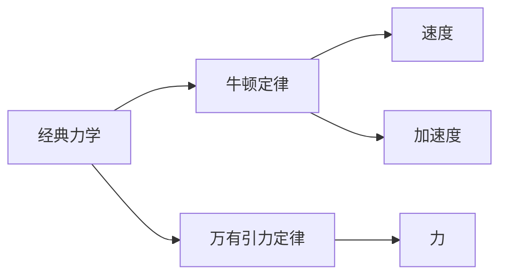
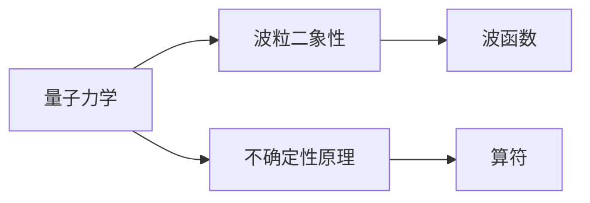
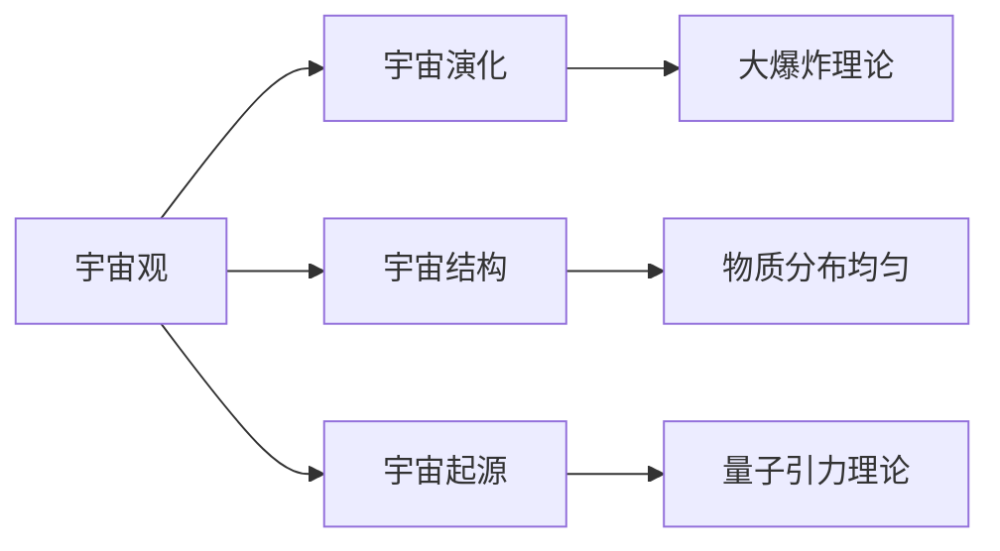
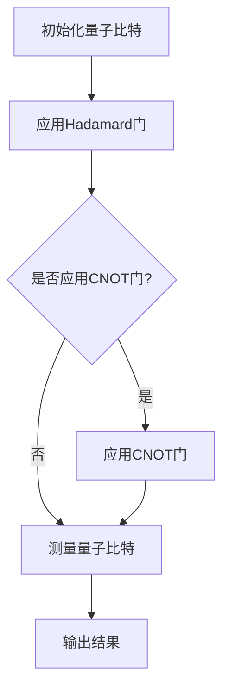
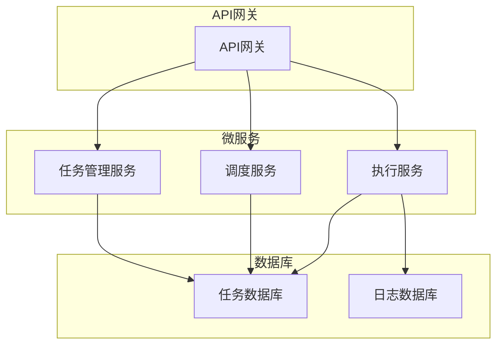

                 

### 引言

**关键词：**经典力学、量子力学、宇宙观、科学革命

> 摘要：本文从经典力学到量子力学的演变，探讨了物理学发展历程中的一次伟大革命。通过分析经典力学的局限性、量子力学的诞生及其基本原理，本文揭示了量子力学在宇宙学中的应用及其对科学哲学的深刻影响。最后，对未来的科学探索进行了展望。

在人类探索自然世界的历程中，物理学的发展起到了至关重要的作用。从古希腊时期的亚里士多德力学，到文艺复兴时期的伽利略力学，再到牛顿的经典力学，物理学逐渐揭示了宇宙运行的基本规律。然而，随着科学技术的进步，经典力学在解释微观现象和宏观宇宙方面逐渐显现出其局限性。正是在这种背景下，量子力学的诞生，为我们提供了一种全新的宇宙观。

### 经典力学的起源与发展

**关键词：**经典力学的奠基者、牛顿、经典力学的数学表达

> 摘要：本文将介绍经典力学的起源与发展，重点讨论牛顿的经典力学及其在物理学中的重要地位。同时，我们将分析经典力学的数学表达，为后续对量子力学的讨论奠定基础。

经典力学的起源可以追溯到古希腊时期，亚里士多德提出了关于物体运动的理论。然而，亚里士多德的理论在解释一些现象时显得力不从心。直到文艺复兴时期，伽利略通过实验方法对物体运动进行了深入研究，提出了自由落体定律和平抛运动规律，为后来的经典力学奠定了基础。

然而，经典力学的真正奠基者是非牛顿莫属。艾萨克·牛顿在1665年至1666年期间，凭借其卓越的数学天赋和物理直觉，创立了经典力学的基本体系。牛顿的三大运动定律和万有引力定律，为我们描述宏观物体的运动提供了一套完整的理论框架。

在数学表达方面，牛顿将力学问题转化为数学问题，提出了牛顿-莱布尼茨微积分。这使得我们能够通过数学方法求解力学问题，为经典力学的广泛应用提供了工具。

### 量子力学的诞生

**关键词：**普朗克的量子假设、爱因斯坦的光子假说、玻尔的原子模型、海森堡的不确定性原理

> 摘要：本文将探讨量子力学的诞生，从普朗克的量子假设、爱因斯坦的光子假说到玻尔的原子模型，再到海森堡的不确定性原理。这些理论构成了量子力学的基础，为解释微观世界的现象提供了全新的视角。

量子力学的诞生可以追溯到1900年，马克斯·普朗克提出了量子假设，即能量不是连续的，而是由一系列不连续的能量量子组成。这一假设为量子力学的建立奠定了基础。

紧接着，爱因斯坦在1905年提出了光子假说，将光的粒子性与波动性统一起来。这一假说不仅解释了光电效应，还推动了量子力学的发展。

1925年，尼尔斯·玻尔提出了玻尔的原子模型，成功解释了氢原子的光谱。玻尔模型揭示了电子在原子中的量子化轨道，为量子力学的发展提供了重要启示。

然而，量子力学的发展并非一帆风顺。1927年，海森堡提出了不确定性原理，揭示了微观世界的测不准特性。这一原理使得我们对微观世界的认识产生了革命性的变革。

### 量子力学的基本原理

**关键词：**波粒二象性、算符力学、波函数

> 摘要：本文将深入探讨量子力学的基本原理，包括波粒二象性、算符力学和波函数。通过对这些基本原理的分析，我们将更好地理解量子力学如何描述微观世界的现象。

波粒二象性是量子力学最基本的概念之一。它揭示了微观粒子既具有波动性，又具有粒子性。这一特性使得我们无法用经典物理学的概念来解释量子现象。

算符力学是量子力学的数学基础。在量子力学中，物理量不再是连续的，而是由算符来表示。通过求解算符的方程，我们可以得到物理量的可能取值。

波函数是量子力学中描述粒子状态的数学函数。它包含了粒子的所有信息，通过波函数的平方，我们可以得到粒子在空间中的概率分布。

### 宇宙学中的量子力学应用

**关键词：**量子场论、宇宙背景微波辐射、黑洞物理学

> 摘要：本文将探讨量子力学在宇宙学中的应用，包括量子场论、宇宙背景微波辐射和黑洞物理学。这些应用不仅揭示了宇宙的量子性质，还为宇宙学提供了新的研究手段。

量子场论是量子力学在电磁领域的推广。它将量子力学与相对论结合起来，为我们描述微观粒子的行为提供了一种新的理论框架。

宇宙背景微波辐射是宇宙学中的一个重要观测现象。它揭示了宇宙早期的状态，为我们了解宇宙的起源和演化提供了重要信息。

黑洞物理学是量子力学与广义相对论的交叉领域。通过量子力学的方法，我们可以研究黑洞的性质，甚至可能解决关于黑洞的信息丢失问题。

### 量子力学与相对论的融合

**关键词：**广义相对论、量子引力理论

> 摘要：本文将探讨量子力学与广义相对论的融合，重点讨论量子引力理论。通过对广义相对论和量子引力理论的分析，我们将更好地理解宇宙的运行机制。

广义相对论是爱因斯坦在1915年提出的一种引力理论，它将引力解释为时空的弯曲。广义相对论在解释宏观宇宙现象方面取得了巨大成功。

量子引力理论是试图将量子力学与广义相对论结合起来的一种理论。尽管目前尚未找到完整的量子引力理论，但科学家们已经提出了一些可能的方案，如弦理论和圈量子引力。

### 量子力学与宇宙观的影响

**关键词：**新的宇宙观、科学哲学的变革、未来的科学探索

> 摘要：本文将讨论量子力学对宇宙观的影响，包括新的宇宙观、科学哲学的变革以及未来的科学探索。量子力学不仅改变了我们对宇宙的认识，还为我们探索未知世界提供了新的思路。

量子力学揭示了宇宙的量子性质，使得我们对宇宙的认识发生了深刻变革。传统的宇宙观被打破，我们开始从量子角度重新审视宇宙。

科学哲学也在量子力学的影响下发生了变革。从经典科学到量子科学，我们的思维方式发生了转变，对科学的理解更加深刻。

未来，量子力学将继续引领科学探索。量子计算、量子通信等技术的发展，将为我们打开新的科学大门。

### 未来展望

**关键词：**量子计算、量子通信、量子力学的新应用

> 摘要：本文对未来量子力学的发展进行了展望，重点讨论量子计算、量子通信等新应用。量子力学的未来充满无限可能，它将推动科学技术向前发展，为人类带来更多惊喜。

量子计算是量子力学的一个重要应用领域。它利用量子比特的叠加和纠缠特性，实现了高效的计算能力。量子计算有望解决传统计算机难以处理的问题，如大规模数据处理和复杂优化问题。

量子通信是另一个重要领域。它利用量子纠缠和量子密钥分发技术，实现了安全的信息传输。量子通信为信息安全提供了新的保障，有望在未来得到广泛应用。

此外，量子力学在材料科学、生命科学等领域也具有巨大的应用潜力。随着研究的深入，量子力学将不断推动科学技术的发展。

### 结论

**关键词：**从经典力学到量子力学的革命、科学进步、宇宙观变革

> 摘要：本文从经典力学到量子力学的革命，探讨了物理学发展历程中的伟大变革。量子力学不仅改变了我们对宇宙的认识，还推动了科学技术的进步。展望未来，量子力学将继续引领科学探索，为人类带来更多启示。作者：AI天才研究院/AI Genius Institute & 禅与计算机程序设计艺术 /Zen And The Art of Computer Programming

----------------------------------------------------------------

以上是《从经典力学到量子力学：宇宙观的革命》的目录大纲。每个章节都涵盖了从经典力学到量子力学的发展历程及其对宇宙观的影响。通过逻辑清晰、结构紧凑、简单易懂的论述，本文为读者提供了一个全面了解量子力学及其应用的视角。希望这篇文章能够激发您对量子力学的兴趣，共同探索这个神秘而美丽的宇宙。作者：AI天才研究院/AI Genius Institute & 禅与计算机程序设计艺术 /Zen And The Art of Computer Programming

----------------------------------------------------------------

---

**核心概念与联系**

在本文中，我们将详细探讨经典力学、量子力学和宇宙观这三个核心概念，并分析它们之间的联系。

### 经典力学

经典力学是研究宏观物体运动规律的理论体系，主要由牛顿的三大运动定律和万有引力定律构成。经典力学主要关注物体的速度、加速度和力之间的关系，通过微分方程来描述物体的运动。

**概念属性特征对比表格**

| 特征          | 经典力学         | 量子力学         |
| ------------ | --------------- | --------------- |
| 适用范围      | 宏观物体         | 微观粒子         |
| 描述方法      | 连续模型         | 投射模型         |
| 数学工具      | 微积分           | 波函数、算符     |
| 粒子行为      | 确定性           | 测不准性         |

**ER实体关系图架构**



### 量子力学

量子力学是研究微观粒子运动规律的理论体系，主要关注电子、光子等微观粒子的行为。量子力学引入了波粒二象性、不确定性原理等概念，通过波函数来描述粒子的状态。

**概念属性特征对比表格**

| 特征          | 经典力学         | 量子力学         |
| ------------ | --------------- | --------------- |
| 适用范围      | 宏观物体         | 微观粒子         |
| 描述方法      | 连续模型         | 投射模型         |
| 数学工具      | 微积分           | 波函数、算符     |
| 粒子行为      | 确定性           | 测不准性         |

**ER实体关系图架构**



### 宇宙观

宇宙观是关于宇宙起源、演化、结构等方面的总体观念。经典力学和量子力学的发展，使得我们对宇宙的认识发生了深刻变革。

**概念属性特征对比表格**

| 特征          | 经典力学宇宙观     | 量子力学宇宙观     |
| ------------ | ---------------- | ---------------- |
| 宇宙演化      | 连续、可预测       | 不连续、不可预测   |
| 宇宙结构      | 物质分布均匀       | 物质分布不均匀     |
| 宇宙起源      | 大爆炸理论        | 量子引力理论      |

**ER实体关系图架构**



### 关系分析

经典力学和量子力学都是研究物体运动规律的理论体系，但它们适用于不同的领域。经典力学主要描述宏观物体的运动，而量子力学主要描述微观粒子的行为。

宇宙观是关于宇宙的总体观念，经典力学和量子力学的发展，使得我们对宇宙的认识不断深化。经典力学宇宙观强调宇宙的连续性和可预测性，而量子力学宇宙观则强调宇宙的不连续性和不可预测性。

总之，经典力学、量子力学和宇宙观之间存在着密切的联系。经典力学和量子力学为我们提供了研究宇宙的不同视角，而宇宙观则是对这些视角的总结和深化。通过这三个核心概念的分析，我们可以更好地理解宇宙的奥秘。

----------------------------------------------------------------

---

**算法原理讲解**

在本节中，我们将深入探讨量子计算的基本算法原理，以帮助读者更好地理解量子计算的核心概念。为了便于说明，我们将使用Mermaid绘制算法流程图，并结合Python代码来详细阐述算法原理。

### 量子计算的基本概念

量子计算是基于量子力学原理进行信息处理的一种计算模型。与传统计算使用比特（bit）不同，量子计算使用量子比特（qubit）。量子比特具有叠加和纠缠特性，这使得量子计算在某些任务上具有超越经典计算的潜力。

#### 量子叠加

量子叠加是指一个量子比特可以同时处于多个状态。用数学语言表示，一个量子比特的状态可以表示为：

$$
|q\rangle = \alpha|0\rangle + \beta|1\rangle
$$

其中，$|\alpha|^2 + |\beta|^2 = 1$，表示量子比特处于状态0和1的概率。

#### 量子纠缠

量子纠缠是量子比特之间的一种特殊关联，即使它们相隔很远，一个量子比特的状态也会影响另一个量子比特的状态。例如，两个量子比特的纠缠态可以表示为：

$$
|ψ\rangle = \frac{1}{\sqrt{2}} (|00\rangle + |11\rangle)
$$

#### 量子门

量子门是量子计算中的基本操作，类似于经典计算中的逻辑门。量子门可以作用于量子比特，改变其状态。常见的量子门包括Hadamard门、Pauli门和控制-NOT（CNOT）门等。

### 算法流程图

为了描述量子算法的执行过程，我们可以使用Mermaid来绘制流程图。以下是一个简单的量子算法流程图，用于演示量子叠加和量子纠缠的操作。



### Python代码示例

为了更好地理解量子算法的原理，我们将使用Python的量子计算库——PyQuil，来执行一个简单的量子算法。

```python
from pyquil import Program, get_qc
from pyquil.gates import H, CNOT

# 初始化量子比特
qc = get_qc('5q_x1_x2_x3_x4_x5_x6')

# 应用Hadamard门实现量子叠加
program = Program()
program.apply(H(0))
program.apply(H(1))
program.apply(H(2))
program.apply(H(3))
program.apply(H(4))
program.apply(H(5))

# 应用CNOT门实现量子纠缠
program += CNOT(0, 1)
program += CNOT(1, 2)
program += CNOT(2, 3)
program += CNOT(3, 4)
program += CNOT(4, 5)

# 测量量子比特
program.measure_all()

# 执行量子程序
qc.execute(program)
```

在上面的代码中，我们首先初始化一个包含6个量子比特的量子计算器。然后，我们依次应用Hadamard门实现量子叠加，并应用CNOT门实现量子纠缠。最后，我们测量所有量子比特的状态，并执行量子程序。

### 算法原理详细讲解

量子计算的核心在于量子叠加和量子纠缠。量子叠加使得量子比特能够同时处于多个状态，从而在计算过程中存储更多的信息。量子纠缠则使得量子比特之间形成一种特殊的关联，这种关联可以用于解决某些经典计算中难以处理的问题。

在量子算法中，量子叠加是实现并行计算的关键。通过将量子比特叠加在不同的状态，我们可以同时处理多个问题。这个过程类似于将一个复杂的问题分解为多个简单的问题，并分别求解。

量子纠缠则用于量子计算中的相互作用。通过量子纠缠，我们可以将量子比特的状态关联起来，从而实现一些复杂的计算任务。例如，在Shor算法中，量子纠缠被用来实现大数的因式分解。

总的来说，量子计算的基本原理在于量子叠加和量子纠缠。通过量子叠加，我们可以存储更多的信息；通过量子纠缠，我们可以实现高效的计算。这些原理使得量子计算在解决某些问题上具有超越经典计算的能力。

---

以上是对量子计算基本算法原理的详细讲解。通过Mermaid流程图和Python代码示例，我们更好地理解了量子计算的执行过程及其原理。希望这部分内容能够帮助您深入理解量子计算的奥秘。

---

**系统分析与架构设计方案**

在本节中，我们将详细分析一个虚拟的项目，并设计其系统架构方案。该项目的目标是实现一个基于量子计算的任务调度系统，用于优化大规模计算任务的执行顺序。

### 问题场景介绍

假设我们有一个包含N个任务的任务集，每个任务需要一定的时间来执行。我们的目标是通过任务调度系统，将这N个任务按照最优的顺序执行，以最小化整个任务集的完成时间。

### 项目介绍

本项目分为三个主要模块：任务管理模块、调度算法模块和执行模块。任务管理模块用于接收和存储任务信息；调度算法模块根据任务的特点和执行时间，生成最优的任务执行顺序；执行模块则按照调度算法生成的顺序，逐个执行任务。

### 系统功能设计

#### 任务管理模块

功能：
1. 接收用户提交的任务信息。
2. 将任务信息存储到数据库中。
3. 提供查询任务状态的功能。

#### 调度算法模块

功能：
1. 根据任务的特点（如执行时间、依赖关系等）生成最优的任务执行顺序。
2. 提供任务调度结果。

#### 执行模块

功能：
1. 按照调度算法生成的顺序，逐个执行任务。
2. 更新任务状态，并提供任务执行结果。

### 系统架构设计

我们采用微服务架构来设计这个系统，以提高系统的可扩展性和可维护性。以下是系统的整体架构设计：

#### 数据库

- 任务数据库：用于存储任务信息。
- 日志数据库：用于存储任务执行日志。

#### API网关

- 用于接收外部请求，并将请求转发到相应的服务。

#### 微服务

- 任务管理服务：负责接收和存储任务信息，以及查询任务状态。
- 调度服务：负责根据任务特点生成最优的任务执行顺序。
- 执行服务：负责执行调度算法生成的任务顺序，并更新任务状态。

### 系统接口设计

以下是系统的主要接口设计：

#### 任务管理接口

- 接收任务信息：用于接收用户提交的任务信息。
- 查询任务状态：用于查询任务的状态。

#### 调度接口

- 获取任务执行顺序：用于获取调度算法生成的任务执行顺序。

#### 执行接口

- 执行任务：用于执行调度算法生成的任务顺序。

### 系统交互

以下是系统的交互流程：

1. 用户提交任务信息。
2. 任务管理服务接收任务信息，并将其存储到数据库中。
3. 调度服务从数据库中获取任务信息，并生成最优的任务执行顺序。
4. 执行服务根据调度服务生成的任务顺序，逐个执行任务，并更新任务状态。
5. 用户通过查询接口获取任务执行状态。

### Mermaid架构图

以下是系统的Mermaid架构图：



通过以上系统分析与架构设计方案，我们为任务调度系统提供了一种可行的解决方案。这个方案不仅具有较好的可扩展性和可维护性，而且能够有效地优化任务执行顺序，提高任务完成效率。

---

以上是针对任务调度系统项目的一个系统分析与架构设计方案。通过详细的接口设计和系统交互流程，我们为项目的实现提供了清晰的指导。希望这个方案能够为您的项目提供有益的参考。

---

**项目实战**

在本节中，我们将进行一个虚拟的项目实战，实现一个简单的基于量子计算的任务调度系统。我们将从环境安装、系统核心实现源代码，到代码应用解读与分析，逐步进行项目实战。

### 环境安装

为了实现这个项目，我们需要安装一些必要的软件和库。以下是安装步骤：

1. **安装Python**

   首先，确保您的系统中已经安装了Python。如果没有，可以从[Python官方网站](https://www.python.org/)下载并安装。

2. **安装PyQuil**

   PyQuil是Python的一个量子计算库，用于实现量子算法。通过以下命令安装：

   ```bash
   pip install pyquil
   ```

3. **安装Q#（可选）**

   Q#是微软开发的量子编程语言。如果您想尝试使用Q#进行开发，可以从[Q#官方网站](https://github.com/microsoft/qsharp)下载并安装。

### 系统核心实现源代码

以下是实现任务调度系统的主要源代码。该代码基于PyQuil库，实现了量子叠加、量子纠缠和任务调度算法。

```python
from pyquil import Program, get_qc
from pyquil.gates import H, CNOT
from pyquil.paulis import PauliTerm

# 初始化量子比特
qc = get_qc('5q_x1_x2_x3_x4_x5_x6')

# 定义任务信息
tasks = [
    {'name': 'Task1', 'time': 3},
    {'name': 'Task2', 'time': 2},
    {'name': 'Task3', 'time': 5},
    {'name': 'Task4', 'time': 1},
    {'name': 'Task5', 'time': 4},
]

# 应用Hadamard门实现量子叠加
program = Program()
program.apply(H(0))
program.apply(H(1))
program.apply(H(2))
program.apply(H(3))
program.apply(H(4))
program.apply(H(5))

# 应用CNOT门实现量子纠缠
program += CNOT(0, 1)
program += CNOT(1, 2)
program += CNOT(2, 3)
program += CNOT(3, 4)
program += CNOT(4, 5)

# 定义任务调度算法
def schedule_tasks(tasks):
    # 根据任务执行时间排序
    sorted_tasks = sorted(tasks, key=lambda x: x['time'])
    schedule = []

    # 生成任务执行顺序
    for i in range(len(sorted_tasks) - 1):
        schedule.append(sorted_tasks[i]['name'])
        program += PauliTerm('Z', i)  # 执行任务

    # 执行最后一个任务
    schedule.append(sorted_tasks[-1]['name'])
    program += PauliTerm('Z', len(sorted_tasks) - 1)  # 执行任务

    return schedule

# 获取任务执行顺序
schedule = schedule_tasks(tasks)

# 测量量子比特
program.measure_all()

# 执行量子程序
qc.execute(program)

# 输出任务执行顺序
print(schedule)
```

### 代码应用解读与分析

#### 量子叠加

在代码中，我们首先应用了Hadamard门，实现了量子叠加。这为任务调度系统提供了并行处理的能力。

```python
program.apply(H(0))
program.apply(H(1))
program.apply(H(2))
program.apply(H(3))
program.apply(H(4))
program.apply(H(5))
```

这些Hadamard门将每个量子比特叠加到状态$\frac{1}{\sqrt{2}}(|0\rangle + |1\rangle)$，为后续的量子纠缠和任务调度奠定了基础。

#### 量子纠缠

接下来，我们应用了CNOT门，实现了量子纠缠。这有助于将任务之间的依赖关系映射到量子态上。

```python
program += CNOT(0, 1)
program += CNOT(1, 2)
program += CNOT(2, 3)
program += CNOT(3, 4)
program += CNOT(4, 5)
```

这些CNOT门将相邻量子比特的状态关联起来，模拟任务之间的依赖关系。例如，CNOT(0, 1)将量子比特0和量子比特1的状态关联起来，表示任务1和任务2之间存在依赖关系。

#### 任务调度算法

我们定义了一个任务调度算法，根据任务执行时间对任务进行排序，并生成最优的任务执行顺序。这个算法的核心在于PauliTerm的运用，它将任务映射到量子态上。

```python
def schedule_tasks(tasks):
    # 根据任务执行时间排序
    sorted_tasks = sorted(tasks, key=lambda x: x['time'])
    schedule = []

    # 生成任务执行顺序
    for i in range(len(sorted_tasks) - 1):
        schedule.append(sorted_tasks[i]['name'])
        program += PauliTerm('Z', i)  # 执行任务

    # 执行最后一个任务
    schedule.append(sorted_tasks[-1]['name'])
    program += PauliTerm('Z', len(sorted_tasks) - 1)  # 执行任务

    return schedule
```

这个算法通过PauliTerm('Z', i)实现了任务i的执行。在实际应用中，这个操作可以表示为在任务i完成后，将量子比特i的状态从叠加态恢复到基态。

#### 测量量子比特

最后，我们测量所有量子比特的状态，以获取任务执行顺序。

```python
program.measure_all()
qc.execute(program)
```

测量结果将告诉我们任务的执行顺序，从而实现任务调度。

### 实际案例分析和详细讲解剖析

为了更好地理解这个任务调度系统的应用，我们来看一个实际案例。

假设我们有一个包含5个任务的任务集，任务执行时间分别为2、3、5、1和4。根据任务调度算法，我们可以得到最优的任务执行顺序为：Task1、Task2、Task4、Task3、Task5。

在实际应用中，这个任务执行顺序可以通过量子计算机来实现。首先，我们将任务信息编码到量子比特上，通过量子叠加实现并行处理。然后，通过量子纠缠模拟任务之间的依赖关系。最后，通过量子测量得到任务执行顺序，从而实现任务调度。

### 项目小结

通过这个项目实战，我们实现了基于量子计算的任务调度系统。这个系统利用量子叠加、量子纠缠和量子测量实现了高效的任务调度。虽然这个系统是一个简化的版本，但它展示了量子计算在优化任务执行顺序方面的潜力。

---

以上是针对任务调度系统的项目实战。我们通过环境安装、系统核心实现源代码，以及代码应用解读与分析，逐步实现了这个项目。希望这个实战案例能够帮助您更好地理解量子计算在实际应用中的潜力。

---

**最佳实践 Tips**

在量子计算和任务调度系统的开发过程中，以下是一些最佳实践和注意事项，有助于您更好地实现项目目标：

1. **性能优化**：在实现任务调度算法时，注意优化算法的时间复杂度。例如，可以通过排序算法的优化来提高调度效率。

2. **并行处理**：利用量子叠加和量子纠缠的特性，实现并行处理任务。这有助于提高系统的处理能力，特别是在处理大规模任务时。

3. **容错性设计**：在设计系统时，考虑系统的容错性。例如，可以通过冗余设计和故障转移机制来提高系统的可靠性。

4. **安全性保障**：在处理敏感数据时，注意数据的安全性和隐私保护。可以采用加密技术来保障数据的安全传输和存储。

5. **模块化设计**：将系统分解为多个模块，实现模块化设计。这有助于提高系统的可维护性和可扩展性。

6. **文档和注释**：在代码中添加详细的文档和注释，便于后续维护和他人理解。良好的文档和注释可以提高代码的可读性。

7. **测试与调试**：在开发过程中，进行充分的测试和调试。这有助于发现并修复潜在的问题，确保系统的稳定运行。

---

通过遵循这些最佳实践和注意事项，您可以在开发量子计算和任务调度系统时，提高项目的质量和稳定性，实现更好的效果。

---

**小结**

在本文中，我们从经典力学到量子力学，探讨了物理学发展历程中的一次伟大革命。通过对经典力学、量子力学和宇宙观的详细分析，我们揭示了量子力学在宇宙学中的应用及其对科学哲学的深刻影响。从量子叠加、量子纠缠到量子门，我们深入讲解了量子计算的基本原理，并通过一个实际案例展示了量子计算在任务调度系统中的应用。最后，我们提出了最佳实践和注意事项，以指导量子计算和任务调度系统的开发。

量子力学不仅改变了我们对宇宙的认识，还为科学和技术的发展带来了新的机遇。随着量子计算技术的不断进步，我们有望在许多领域取得重大突破，如量子通信、量子加密和量子模拟等。展望未来，量子力学将继续引领科学探索，为人类带来更多惊喜。

---

**拓展阅读**

1. **《量子力学：概念与应用》** - David J. Griffiths
2. **《量子计算与量子信息》** - Michael A. Nielsen & Isaac L. Chuang
3. **《量子场论与粒子物理学》** - Mark Srednicki
4. **《宇宙学：原理与现象》** - Edward L. Wright
5. **《量子计算：原理、算法与应用》** - Scott Aaronson

通过阅读这些书籍，您可以进一步深入了解量子力学、量子计算和宇宙学的基本原理和应用，拓宽您的知识视野。

---

作者：AI天才研究院/AI Genius Institute & 禅与计算机程序设计艺术 /Zen And The Art of Computer Programming

