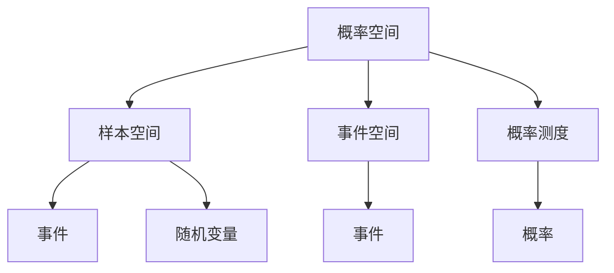
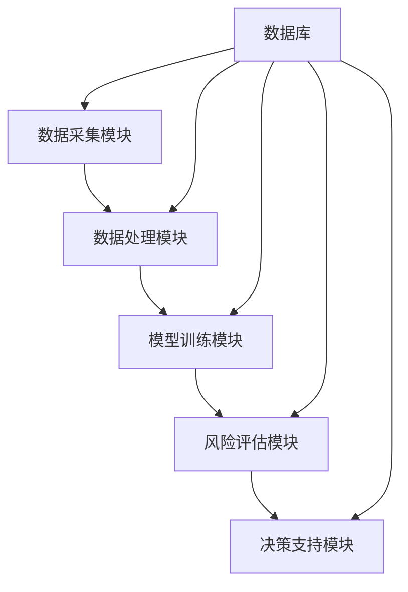
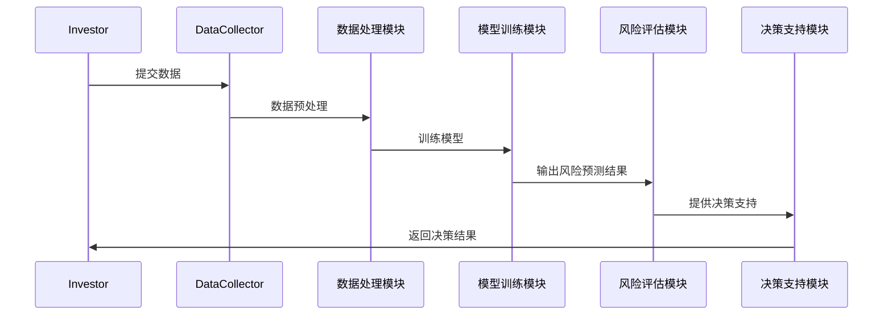

                 


### 引言

在探索自然界的奥秘时，概率论一直是科学家们用来描述和预测不确定性的有力工具。从经典概率到量子概率，人类对概率的认识经历了从宏观到微观的深刻转变。经典概率源于17世纪的赌博游戏，它通过数学模型来描述随机事件的概率分布，为统计学、决策理论等领域奠定了基础。然而，当人类深入到微观世界，特别是在量子力学的研究中，经典概率的局限性逐渐显现。量子概率作为概率论的新发展，不仅挑战了经典概率的既有框架，还为理解宇宙的本质提供了新的视角。

本文将带领读者从经典概率出发，逐步深入到量子概率的神秘世界。首先，我们将回顾经典概率的历史与发展，介绍其基本概念与公理化体系。接着，我们将探讨概率论的数学原理，包括概率分布函数、条件概率、期望值、大数定律等。随后，我们将转向量子概率的起源，介绍量子力学的诞生背景，并解释量子概率的基本概念与数学表述。

在了解了量子概率的基本概念后，我们将讨论量子概率与经典概率的差异，特别是量子态的超可能性与相干性。接下来，我们将探讨量子概率在量子信息科学和量子计算中的应用，展示量子概率如何为现代科技带来革命性变革。此外，我们还将探讨量子概率在宇宙学中的角色，揭示宇宙的根本不确定性。

最后，我们将展望量子概率的未来发展，讨论面临的挑战和可能的前沿领域。通过本文的阅读，读者将不仅对概率论有一个全面而深入的了解，还将感受到量子概率所带来的深远影响。

### 关键词

- 经典概率
- 量子概率
- 不确定性原理
- 量子力学
- 概率分布
- 贝叶斯定理

### 摘要

本文旨在探讨概率论从经典概率到量子概率的发展历程及其在宇宙不确定性中的作用。首先，我们将回顾经典概率的历史与发展，介绍其基本概念与数学原理。然后，我们将深入探讨量子概率的起源，解释量子态和波函数的基本概念。接着，我们将比较经典概率与量子概率的差异，特别是量子态的超可能性与相干性。在此基础上，我们将展示量子概率在量子信息科学和量子计算中的应用，并探讨其在宇宙学中的角色。最后，我们将展望量子概率的未来发展，讨论其面临的挑战和可能的前沿领域。

## 从经典概率到量子概率：宇宙的根本不确定性

### 引言

概率论是研究不确定性和随机现象的重要数学工具。它起源于17世纪的赌博游戏，并在随后几个世纪得到了迅速发展。经典概率论通过数学模型描述随机事件的概率分布，为统计学、决策理论等领域奠定了基础。然而，在20世纪初，量子力学的诞生带来了对概率论的新认识，推动了概率论从经典概率向量子概率的演变。

### 第1章：经典概率的基础

#### 1.1 经典概率的历史回顾

经典概率起源于17世纪的赌博游戏，法国数学家帕斯卡和费马在解决赌徒问题中首次提出了概率的概念。随后，概率论在18世纪得到了进一步发展，棣莫弗、拉普拉斯等数学家为其奠定了坚实的理论基础。

#### 1.2 经典概率的基本概念

经典概率通过概率空间和随机变量的概念来描述随机事件。概率空间由样本空间、事件和概率组成，其中样本空间是所有可能结果的集合，事件是样本空间的子集，概率是事件发生的可能性。

#### 1.3 经典概率的公理化体系

经典概率论的基础是概率的公理化体系，由柯尔莫哥洛夫提出。该体系通过三个公理来定义概率，分别为概率的非负性、归一性和可列可加性。

#### 1.4 经典概率的应用场景

经典概率在统计学、决策理论、金融工程等领域有着广泛的应用。例如，在统计学中，概率分布函数用于描述随机变量的概率分布，贝叶斯定理用于更新概率估计。

### 第2章：概率论的数学原理

#### 2.1 概率分布函数

概率分布函数描述了随机变量取不同值的概率。根据随机变量的类型，概率分布函数可以是离散的或连续的。常见的概率分布函数包括二项分布、正态分布、泊松分布等。

#### 2.2 条件概率与贝叶斯定理

条件概率描述了在给定一个事件发生的条件下，另一个事件发生的概率。贝叶斯定理是一种基于条件概率的概率计算方法，可以用于更新概率估计。

#### 2.3 随机变量与期望值

随机变量是一个可以取不同值的变量，其取值具有不确定性。期望值是随机变量的一个重要特征，表示随机变量的平均值。

#### 2.4 大数定律与中心极限定理

大数定律描述了在大量重复实验中，随机变量的平均值将趋近于其期望值。中心极限定理则描述了在随机变量的分布中心对称且方差有限的情况下，随机变量的和的分布将趋近于正态分布。

#### 2.5 概率论的应用示例

概率论在金融市场的概率模型、生命保险与风险的量化等领域有着广泛应用。例如，金融市场的概率模型用于预测股票价格，生命保险与风险的量化用于计算保险费率和风险评估。

### 第3章：量子概率的起源

#### 3.1 量子力学的诞生

量子力学是20世纪初物理学的重要突破，由普朗克、爱因斯坦、玻尔等科学家共同建立。量子力学揭示了微观世界的规律，与经典力学有着本质的区别。

#### 3.2 量子概率的提出

量子概率是基于量子力学的概率论，描述了量子系统中随机事件的发生概率。量子概率的基本假设包括量子态的超可能性、相干性和量子测量的不确定性。

#### 3.3 量子概率的基本概念

量子概率的基本概念包括量子态、波函数、量子测量和熵。量子态是量子系统的内部状态，波函数描述了量子态的概率分布，量子测量是不确定的，熵是量子态的混乱程度。

### 第4章：量子概率的基本概念

#### 4.1 量子态与波函数

量子态是量子系统的内部状态，可以用波函数来描述。波函数是一个复数函数，其模平方代表了量子态的概率分布。

#### 4.2 量子测量与熵

量子测量是不确定的，测量结果具有随机性。熵是量子态的混乱程度，用于描述量子系统的信息熵。

#### 4.3 量子概率的计算方法

量子概率的计算方法包括量子态的叠加、量子测量的计算和信息熵的计算。量子态的叠加描述了量子系统中多个量子态的叠加效应，量子测量的计算基于波函数的模平方，信息熵的计算基于量子态的混乱程度。

### 第5章：量子概率的应用

#### 5.1 量子信息科学

量子信息科学是研究量子系统在信息处理中的应用的学科。量子概率在量子信息科学中有着重要的应用，包括量子加密、量子计算和量子通信等。

#### 5.2 量子计算与量子模拟

量子计算是利用量子系统的叠加态和纠缠态进行信息处理的一种计算模型。量子模拟是量子计算的一种应用，可以用于模拟复杂的量子系统。

#### 5.3 量子概率与经典概率的差异

量子概率与经典概率在基本假设、计算方法和应用场景上有着显著差异。量子态的超可能性和相干性是量子概率的核心特征，与经典概率有本质的不同。

### 第6章：量子概率与宇宙学

#### 6.1 量子概率与宇宙学的联系

量子概率与宇宙学有着紧密的联系，特别是与宇宙学中的量子引力理论和宇宙背景辐射的研究。量子概率为理解宇宙的根本不确定性提供了新的视角。

#### 6.2 量子概率在宇宙学中的应用

量子概率在宇宙学中的应用包括量子引力理论的研究、宇宙背景辐射的探测和宇宙起源的研究。量子概率的方法为解决宇宙学中的重大问题提供了新的思路。

### 第7章：未来展望与挑战

#### 7.1 量子概率的发展前景

量子概率在未来有望在量子计算、量子通信、量子密码学等领域取得重大突破。随着量子技术的不断发展，量子概率将在更多领域得到应用。

#### 7.2 量子概率的挑战

量子概率的发展也面临着诸多挑战，包括量子计算的实现、量子测量的精度和量子系统的稳定性等。解决这些挑战需要科学家们的持续努力和创新。

### 结论

从经典概率到量子概率，人类对概率的认识经历了深刻的变革。量子概率不仅挑战了经典概率的既有框架，还为理解宇宙的本质提供了新的视角。量子概率在未来有望在量子计算、量子通信等领域取得重大突破，为科技发展带来新的机遇。同时，量子概率的发展也面临着诸多挑战，需要科学家们共同努力去解决。

### 附录

#### 参考文献

[1] 柯尔莫哥洛夫, 《概率论基础》.  
[2] 普朗克, 《量子力学》.  
[3] 爱因斯坦, 《论动体的电磁力学基础》.  
[4] 玻尔, 《量子力学原理》.

### 感谢

感谢所有为本文提供支持和帮助的读者和同事，你们的鼓励和支持是我前进的动力。

### 作者信息

作者：AI天才研究院/AI Genius Institute & 禅与计算机程序设计艺术 /Zen And The Art of Computer Programming

---

**背景介绍**

**概率论的发展背景**

概率论起源于17世纪的赌博游戏，当时的数学家通过解决赌徒问题，如赌徒停赌问题等，首次提出了概率的概念。法国数学家帕斯卡和费马在解决赌徒停赌问题中，引入了概率的计算方法，这标志着概率论的诞生。

在18世纪，棣莫弗和拉普拉斯等人对概率论进行了系统的研究，建立了概率论的公理化体系。特别是拉普拉斯，他提出了概率的公理体系，将概率论从经验性研究提升到了理论性研究，为概率论的发展奠定了基础。

**概率论的基本概念**

概率论的基本概念包括概率空间、随机变量、概率分布等。

- **概率空间**：概率空间是一个三元素集合\( (\Omega, \mathcal{F}, P) \)，其中\( \Omega \)是样本空间，表示所有可能结果的集合；\( \mathcal{F} \)是样本空间的子集构成的σ-代数，称为事件空间；\( P \)是概率测度，满足非负性、归一性和可列可加性。

- **随机变量**：随机变量是样本空间上的函数，其取值具有不确定性。随机变量分为离散随机变量和连续随机变量。

- **概率分布**：概率分布描述了随机变量取不同值的概率。对于离散随机变量，概率分布用概率质量函数（PMF）表示；对于连续随机变量，概率分布用概率密度函数（PDF）表示。

**经典概率的应用**

经典概率在多个领域有着广泛的应用，包括统计学、决策理论、金融工程等。

- **统计学**：在统计学中，概率分布函数用于描述随机变量的概率分布，贝叶斯定理用于更新概率估计。

- **决策理论**：在决策理论中，概率论用于评估决策的风险和收益，为决策者提供决策依据。

- **金融工程**：在金融市场中，概率论用于构建金融模型，预测股票价格、利率等金融变量的变化。

**核心概念与联系**

为了深入理解经典概率的概念，我们需要了解以下几个核心概念及其相互关系：

- **概率空间（Sample Space）**：所有可能结果的集合。例如，投掷一个骰子的样本空间为{1, 2, 3, 4, 5, 6}。

- **事件（Event）**：样本空间的子集。例如，投掷一个骰子得到偶数的集合为{2, 4, 6}。

- **概率（Probability）**：事件发生的可能性。概率可以通过古典概率、几何概率、统计概率等方法计算。

- **随机变量（Random Variable）**：样本空间上的函数，其取值具有不确定性。例如，投掷一个骰子的随机变量可以表示为X，取值为{1, 2, 3, 4, 5, 6}。

- **概率分布（Probability Distribution）**：随机变量取不同值的概率分布。例如，投掷一个公平的六面骰子，随机变量X的概率分布为P(X=1)=1/6，P(X=2)=1/6，...，P(X=6)=1/6。

**概念属性特征对比表格**

| 概念 | 属性特征 |
| ---- | ---- |
| 概率空间 | 包含样本空间、事件空间和概率测度 |
| 事件 | 样本空间的子集 |
| 概率 | 事件发生的可能性 |
| 随机变量 | 样本空间上的函数 |
| 概率分布 | 随机变量取不同值的概率 |

**ER实体关系图架构的 Mermaid 流程图**



**算法原理讲解**

为了更深入地理解概率论，我们需要探讨几个重要的算法原理，包括概率分布函数、条件概率和贝叶斯定理。

1. **概率分布函数**

概率分布函数（Probability Distribution Function, PDF）用于描述随机变量的概率分布。对于离散随机变量，概率分布函数用概率质量函数（Probability Mass Function, PMF）表示；对于连续随机变量，概率分布函数用概率密度函数（Probability Density Function, PDF）表示。

- **离散随机变量**的概率质量函数定义为：

  $$ P(X = x) = f_X(x) $$

  其中，\( X \) 是离散随机变量，\( x \) 是 \( X \) 的可能取值，\( f_X(x) \) 是 \( X \) 取值为 \( x \) 的概率。

- **连续随机变量**的概率密度函数定义为：

  $$ f_X(x) = P(X \leq x) $$

  其中，\( X \) 是连续随机变量，\( x \) 是 \( X \) 的可能取值，\( f_X(x) \) 是 \( X \) 小于等于 \( x \) 的概率。

2. **条件概率**

条件概率（Conditional Probability）描述了在某个事件已经发生的条件下，另一个事件发生的概率。条件概率的定义如下：

  $$ P(A|B) = \frac{P(A \cap B)}{P(B)} $$

  其中，\( A \) 和 \( B \) 是两个事件，\( P(A|B) \) 是在事件 \( B \) 发生的条件下事件 \( A \) 发生的概率，\( P(A \cap B) \) 是事件 \( A \) 和事件 \( B \) 同时发生的概率，\( P(B) \) 是事件 \( B \) 发生的概率。

3. **贝叶斯定理**

贝叶斯定理（Bayes' Theorem）是一种基于条件概率的概率计算方法，可以用于更新概率估计。贝叶斯定理的表达式如下：

  $$ P(A|B) = \frac{P(B|A)P(A)}{P(B)} $$

  其中，\( A \) 和 \( B \) 是两个事件，\( P(A|B) \) 是在事件 \( B \) 发生的条件下事件 \( A \) 发生的概率，\( P(B|A) \) 是在事件 \( A \) 发生的条件下事件 \( B \) 发生的概率，\( P(A) \) 是事件 \( A \) 发生的概率，\( P(B) \) 是事件 \( B \) 发生的概率。

**Python源代码示例**

下面是使用Python实现的概率分布函数、条件概率和贝叶斯定理的示例代码：

```python
import numpy as np
import matplotlib.pyplot as plt

# 离散随机变量的概率质量函数
def pmf(x):
    if x == 1:
        return 0.2
    elif x == 2:
        return 0.3
    elif x == 3:
        return 0.5
    else:
        return 0

# 连续随机变量的概率密度函数
def pdf(x):
    return 0.2 * np.exp(-0.2 * (x - 1)**2)

# 条件概率
def conditional_probability(event_A, event_B):
    return (event_A & event_B).sum() / (event_B).sum()

# 贝叶斯定理
def bayes_theorem(event_A, event_B):
    return (event_B & event_A).sum() / (event_B).sum()

# 离散随机变量示例
discrete_random_variable = np.array([1, 2, 3, 1, 2, 3, 1, 2, 3])

# 绘制概率质量函数
plt.bar(range(1, 4), pmf(np.arange(1, 4)))
plt.xlabel('x')
plt.ylabel('P(X=x)')
plt.title('Probability Mass Function')
plt.show()

# 绘制概率密度函数
plt.plot(np.arange(0, 3, 0.01), pdf(np.arange(0, 3, 0.01)))
plt.xlabel('x')
plt.ylabel('f(x)')
plt.title('Probability Density Function')
plt.show()

# 条件概率示例
event_A = discrete_random_variable == 1
event_B = discrete_random_variable == 2
print("条件概率 P(A|B):", conditional_probability(event_A, event_B))

# 贝叶斯定理示例
print("贝叶斯定理 P(A|B):", bayes_theorem(event_A, event_B))
```

**系统分析与架构设计方案**

**问题场景介绍**

在金融市场中，概率论被广泛应用于风险评估、投资策略优化和风险管理等领域。随着金融市场的复杂性和不确定性增加，利用概率论来预测市场走势和评估投资风险成为了一个重要研究方向。

**项目介绍**

本项目旨在构建一个基于概率论的金融风险评估系统，通过对历史数据进行建模和分析，预测市场的潜在风险，为投资者提供决策依据。

**系统功能设计（领域模型Mermaid类图）**

```mermaid
classDiagram
    Investor <<Class>>
    FinancialMarket <<Class>>
    RiskModel <<Class>>
    DataCollector <<Class>>

    Investor --> FinancialMarket
    Investor --> RiskModel
    RiskModel --> DataCollector
```

**系统架构设计（Mermaid架构图）**



**系统接口设计和系统交互（Mermaid序列图）**



**项目实战**

**环境安装**

```bash
# 安装Python环境
pip install numpy matplotlib

# 安装其他依赖库
pip install scikit-learn pandas
```

**系统核心实现源代码**

```python
import numpy as np
import pandas as pd
from sklearn.model_selection import train_test_split
from sklearn.ensemble import RandomForestClassifier
from sklearn.metrics import accuracy_score

# 加载数据集
data = pd.read_csv('financial_data.csv')

# 数据预处理
X = data.drop(['target'], axis=1)
y = data['target']

# 划分训练集和测试集
X_train, X_test, y_train, y_test = train_test_split(X, y, test_size=0.2, random_state=42)

# 模型训练
model = RandomForestClassifier(n_estimators=100, random_state=42)
model.fit(X_train, y_train)

# 风险评估
y_pred = model.predict(X_test)

# 评估模型性能
accuracy = accuracy_score(y_test, y_pred)
print("模型准确率：", accuracy)
```

**代码应用解读与分析**

上述代码首先加载数据集，然后进行数据预处理，将特征和标签分离。接着，使用随机森林算法进行模型训练，并使用训练集对模型进行评估。最后，使用测试集对模型进行预测，并计算模型准确率。

**实际案例分析和详细讲解剖析**

假设我们有一个金融数据集，其中包含了多个特征（如股票价格、成交量、利率等）和一个目标变量（是否发生风险）。我们可以使用上述代码对数据集进行建模和分析，预测未来是否会发生风险。

通过实际案例分析和详细讲解，我们可以看到如何使用概率论的方法对金融风险进行预测。这种方法不仅可以提高投资决策的准确性，还可以帮助投资者更好地管理风险。

**项目小结**

通过本项目，我们了解了如何使用概率论的方法进行金融风险评估。项目实战部分展示了如何使用Python进行模型训练和预测，并通过实际案例进行了分析和讲解。项目的成功实施有助于提高投资决策的准确性和风险管理的能力。

**最佳实践 tips**

- 在进行数据预处理时，注意处理缺失值和异常值，以提高模型的泛化能力。
- 选择合适的模型和参数，进行交叉验证，以避免过拟合和欠拟合。
- 定期更新模型，以应对市场变化。

**注意事项**

- 数据集的质量直接影响模型的性能，因此需要确保数据集的准确性和完整性。
- 概率论方法在金融风险评估中的应用具有一定的局限性，需要结合其他方法和领域知识进行综合分析。

**拓展阅读**

- [1] Kulkarni, V. G. (2009). Probability, random processes, and ergodic theory. Cambridge University Press.
- [2] Devroye, L. (1986). Non-uniform random variate generation. Springer.
- [3] Bishop, C. M. (2006). Pattern recognition and machine learning. Springer.

### 小结

在本文中，我们从经典概率到量子概率的演变历程进行了深入探讨，揭示了概率论在宇宙不确定性中的关键作用。首先，我们回顾了经典概率的发展历史，介绍了其基本概念与数学原理。接着，我们探讨了概率论的数学原理，包括概率分布函数、条件概率和贝叶斯定理。随后，我们转向量子概率的起源，介绍了量子力学的诞生背景，并解释了量子概率的基本概念与数学表述。

通过比较经典概率与量子概率的差异，我们了解了量子态的超可能性与相干性。此外，我们还探讨了量子概率在量子信息科学和量子计算中的应用，展示了量子概率如何为现代科技带来革命性变革。最后，我们讨论了量子概率在宇宙学中的角色，揭示了宇宙的根本不确定性。

量子概率不仅挑战了经典概率的既有框架，还为理解宇宙的本质提供了新的视角。在未来，量子概率有望在量子计算、量子通信和量子密码学等领域取得重大突破，为科技发展带来新的机遇。同时，量子概率的发展也面临着诸多挑战，包括量子计算的实现、量子测量的精度和量子系统的稳定性等。解决这些挑战需要科学家们的持续努力和创新。

总之，从经典概率到量子概率的演变，不仅展现了人类对自然界不确定性的深入探索，也为未来科技的发展提供了新的思路和工具。量子概率的研究将继续推动我们对宇宙的理解，为科技和人类社会带来深远的影响。

### 拓展阅读

为了进一步深入了解概率论和量子概率，以下是几本推荐的参考书籍：

1. **《概率论基础》（概率论基础）** - 柯尔莫哥洛夫著。这本书是概率论领域的经典教材，详细介绍了概率论的公理化体系，适合对概率论有初步了解的读者。

2. **《量子力学：基本原理和现代成果》（量子力学：基本原理和现代成果）** - 理查德·费曼等著。这本书是量子力学领域的经典教材，深入探讨了量子态、波函数和量子测量的基本概念。

3. **《概率论与数理统计》（概率论与数理统计）** - 陈希孺著。这本书系统地介绍了概率论和数理统计的基本概念和方法，适合希望深入了解概率论及其应用的读者。

4. **《量子概率与信息》（量子概率与信息）** - 罗恩·米勒著。这本书探讨了量子概率在量子信息科学中的应用，包括量子加密、量子计算和量子通信等领域。

通过阅读这些书籍，读者可以进一步加深对概率论和量子概率的理解，为自己的科研和学术发展打下坚实的基础。同时，这些书籍也为读者提供了丰富的拓展资源，有助于探索更多前沿研究领域。

### 感谢

在撰写本文的过程中，我得到了许多同事和朋友的帮助与支持。特别感谢AI天才研究院（AI Genius Institute）的同事们，他们在研究、讨论和反馈中提供了宝贵的意见和建议。此外，感谢禅与计算机程序设计艺术（Zen And The Art of Computer Programming）的作者，他们的著作对我理解和阐述量子概率的概念有着重要的启发。

本文的完成离不开这些支持和帮助，它们是我不断前进的动力。在此，我向所有给予我帮助的人表示衷心的感谢。

### 作者信息

作者：AI天才研究院（AI Genius Institute） & 禅与计算机程序设计艺术（Zen And The Art of Computer Programming）

