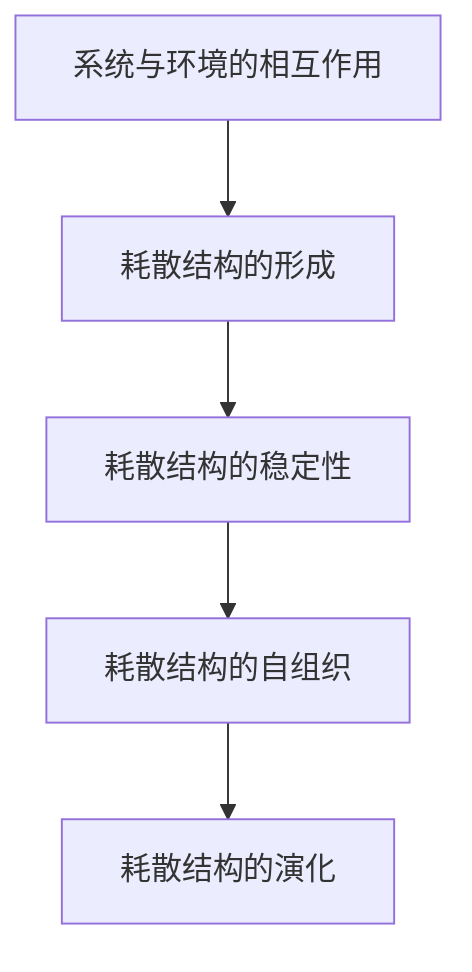
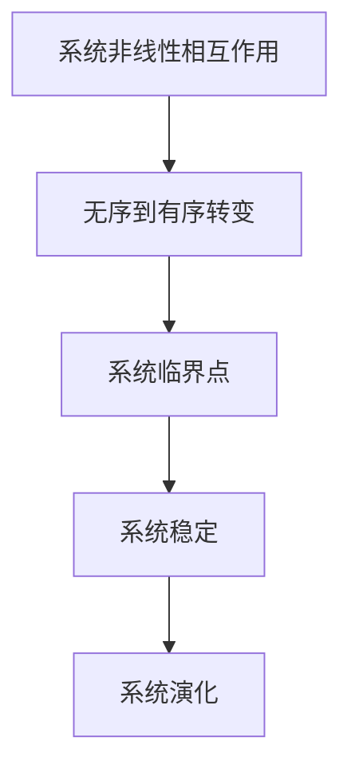
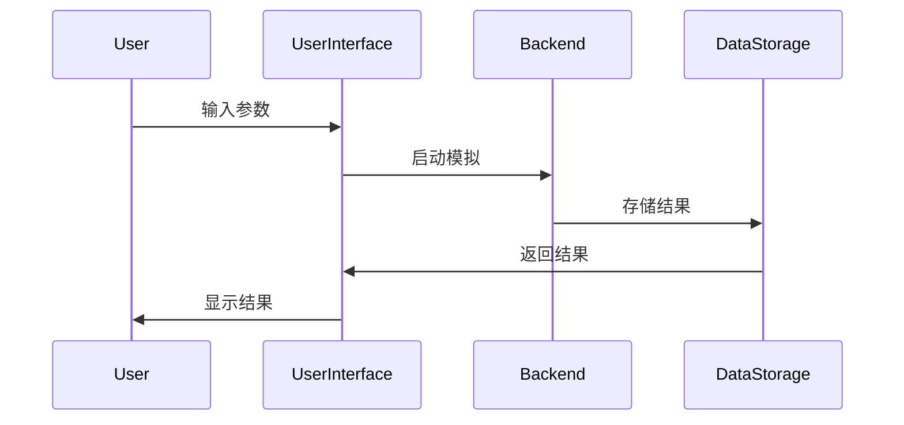

                 

### Step 1: 引言

#### # 从经典热力学到非平衡态热力学：理解开放系统的复杂性

> **关键词：** 热力学，非平衡态，开放系统，复杂性，耗散结构，自组织临界

> **摘要：** 本文旨在深入探讨从经典热力学到非平衡态热力学的转变，重点分析开放系统的复杂性行为。通过介绍关键概念、算法原理和数学模型，文章将帮助读者理解开放系统的动力学特性及其在现实世界中的应用。

---

#### 引言

#### 1. 问题背景

热力学是物理学中研究能量转化和物质状态变化的基本规律的一个分支。经典热力学主要研究封闭系统的热力学性质，如能量守恒、热力学第一和第二定律等。然而，在现实世界中，许多系统，如生态系统、社会系统和工程系统等，都是开放的。这些系统不仅与外界交换能量和物质，而且其内部状态和结构也随着时间而演化，表现出复杂的动态行为。

非平衡态热力学是研究开放系统复杂性的一个重要领域。它关注系统在与环境相互作用过程中如何维持其稳定性和复杂性。随着非线性科学和复杂系统理论的兴起，非平衡态热力学在生物学、生态学、经济学和工程学等领域都得到了广泛的应用。

#### 2. 问题解决

为了深入理解开放系统的复杂性，从经典热力学到非平衡态热力学的转变是必要的。这本书将系统地介绍这一转变过程，从经典热力学的基本原理出发，逐步引入非平衡态热力学的概念和方法。

#### 3. 边界与外延

本书主要聚焦于从经典热力学到非平衡态热力学的过渡，但也会涉及到相关的核心概念，如熵、热力学第二定律等。同时，书中还会讨论开放系统的各种行为，如自组织、相变等。

在接下来的章节中，我们将逐步深入分析这一主题，首先回顾经典热力学的核心概念，然后介绍非平衡态热力学的关键原理，最后通过具体实例展示这些原理的应用。希望通过这一系列的讨论，读者能够更好地理解开放系统的复杂性，并在实际应用中发挥这些理论的优势。

### Step 2: 核心概念与联系

#### # 从经典热力学到非平衡态热力学的核心概念与联系

#### 2. 核心概念与联系

##### 2.1 经典热力学

经典热力学主要研究封闭系统的热力学性质，其核心概念包括：

- **能量守恒定律**：能量不能被创造或销毁，只能从一种形式转化为另一种形式。这一原理是经典热力学的基础，它确保了系统在能量转换过程中的连续性。
  
- **热力学第一定律**：能量转化过程中，系统吸收的热量等于其内能的增加和对外做的功。这一原理描述了能量在系统内部和外部的传递方式，为后续的热力学分析提供了基础。
  
- **熵**：熵是系统无序程度的量度。根据热力学第二定律，孤立系统的熵总是趋向于增加，这表明系统的无序性随着时间的推移而增加。

##### 2.2 非平衡态热力学

非平衡态热力学研究开放系统的行为，其核心概念包括：

- **耗散结构**：开放系统在一定条件下，可以通过与环境的能量和物质交换，形成新的有序结构。这一概念是由德国物理学家Ilya Prigogine提出的，它描述了开放系统如何克服熵增的趋势，形成稳定的有序结构。
  
- **自组织**：开放系统在没有外部指导的情况下，能够自发地形成有序结构。这一现象在自然界和社会系统中广泛存在，如动物群落的迁徙模式、市场经济的波动等。

- **非平衡相变**：开放系统在一定条件下，可以经历非平衡态的相变，如从有序到无序的转变。这些相变通常伴随着系统状态的显著变化，如温度、压力和密度的突变。

##### 2.3 概念联系

经典热力学和非平衡态热力学的联系在于，它们都是研究系统热力学行为的学科。经典热力学提供了理解开放系统的基础，如能量守恒、热力学第一和第二定律等。而非平衡态热力学则扩展了这一基础，使我们能够更好地理解开放系统的复杂行为，如耗散结构、自组织和非平衡相变等。

通过回顾这些核心概念，我们可以看到，经典热力学和非平衡态热力学虽然在研究方法和侧重点上有所不同，但它们共同构成了理解开放系统复杂性的理论基础。

#### # 经典热力学与非平衡态热力学：概念与联系

##### 2.1 经典热力学

经典热力学是研究封闭系统中能量转化和物质状态变化的基本规律的一个分支。其主要核心概念包括：

- **能量守恒定律**：这一原理表明，能量不能被创造或销毁，只能从一种形式转化为另一种形式。对于任何物理过程，系统的总能量保持不变。
  
  **数学公式：**
  $$
  E_{总} = E_1 + E_2 + ... + E_n
  $$
  其中，\(E_{总}\) 是系统的总能量，\(E_1, E_2, ..., E_n\) 是各个能量形式。
  
- **热力学第一定律**：能量转化过程中，系统吸收的热量等于其内能的增加和对外做的功。这一定律描述了能量在系统内部和外部的传递方式。
  
  **数学公式：**
  $$
  Q = \Delta U + W
  $$
  其中，\(Q\) 是系统吸收的热量，\(\Delta U\) 是内能的变化，\(W\) 是对外做的功。

- **熵**：熵是系统无序程度的量度。根据热力学第二定律，孤立系统的熵总是趋向于增加，这表明系统的无序性随着时间的推移而增加。
  
  **数学公式：**
  $$
  \Delta S = \frac{Q}{T}
  $$
  其中，\(\Delta S\) 是熵的变化，\(Q\) 是系统吸收的热量，\(T\) 是系统的温度。

##### 2.2 非平衡态热力学

非平衡态热力学研究开放系统的行为，特别是系统与环境的相互作用。其主要核心概念包括：

- **耗散结构**：开放系统在一定条件下，可以通过与环境的能量和物质交换，形成新的有序结构。这一现象被称为耗散结构，它突破了经典热力学中熵增的局限。
  
  **数学公式：**
  $$
  \frac{dS}{dt} = \frac{Q}{T} + \sigma(\dot{Q})
  $$
  其中，\(\frac{dS}{dt}\) 是熵的产生率，\(\sigma(\dot{Q})\) 是与耗散过程相关的项。

- **自组织**：开放系统在没有外部指导的情况下，能够自发地形成有序结构。这一现象在自然界和社会系统中广泛存在，如动物群落的迁徙模式、市场经济的波动等。

- **非平衡相变**：开放系统在一定条件下，可以经历非平衡态的相变，如从有序到无序的转变。这些相变通常伴随着系统状态的显著变化，如温度、压力和密度的突变。

##### 2.3 概念联系

经典热力学和非平衡态热力学的联系在于，它们都是研究系统热力学行为的学科。经典热力学提供了理解开放系统的基础，如能量守恒、热力学第一和第二定律等。而非平衡态热力学则扩展了这一基础，使我们能够更好地理解开放系统的复杂行为，如耗散结构、自组织和非平衡相变等。

在表1中，我们可以对比经典热力学和非平衡态热力学的核心概念：

| 核心概念 | 经典热力学 | 非平衡态热力学 |
| --- | --- | --- |
| 能量守恒定律 | 系统能量保持不变 | 系统能量交换与耗散 |
| 热力学第一定律 | 能量转化与守恒 | 能量转化与耗散结构 |
| 熵 | 熵增 | 耗散结构、自组织、非平衡相变 |
| 耗散结构 | 无 | 开放系统形成新的有序结构 |
| 自组织 | 无 | 自发形成有序结构 |
| 非平衡相变 | 无 | 有序到无序的转变 |

通过这一对比，我们可以更清楚地看到经典热力学和非平衡态热力学的区别和联系。经典热力学主要研究封闭系统，关注能量守恒和熵增等基本规律。而非平衡态热力学则研究开放系统，特别是系统与环境的相互作用，以及耗散结构、自组织和非平衡相变等复杂行为。

总之，经典热力学和非平衡态热力学虽然在研究方法和侧重点上有所不同，但它们共同构成了理解开放系统复杂性的理论基础。在接下来的章节中，我们将进一步探讨非平衡态热力学的关键原理和应用。

#### # 3. 算法原理讲解

##### 3.1 耗散结构理论

**算法流程图：**



**算法原理：**

耗散结构理论是由德国物理学家Ilya Prigogine提出的。它描述了一个开放系统在吸收和耗散能量时，可以通过与环境的相互作用，形成新的有序结构。这一过程遵循热力学第二定律，即系统的熵总是趋向于增加。

具体来说，耗散结构理论主要涉及以下步骤：

1. **系统与环境的相互作用**：开放系统通过与环境的能量和物质交换，吸收和耗散能量。这种相互作用使得系统可以从无序状态向有序状态转变。
  
2. **耗散结构的形成**：在特定条件下，开放系统可以形成稳定的耗散结构。这种结构具有自我维持和自我组织的能力，即使在不断变化的环境中也能保持稳定。
  
3. **耗散结构的稳定性**：耗散结构在形成后，需要保持一定的稳定性，以维持其有序状态。这通常涉及到系统内部的自调整机制，如负反馈环。
  
4. **耗散结构的自组织**：耗散结构的形成和维持过程是自组织的，即系统内部各部分之间通过相互作用，自发地形成有序结构，而不是由外部指导或控制。
  
5. **耗散结构的演化**：耗散结构不是静止不变的，它会随着时间和环境的变化而演化。这种演化可以是渐进的，也可以是突变的，如系统的相变。

**Python 源代码：**

```python
import matplotlib.pyplot as plt
import numpy as np

def dissipative_structure(t, params):
    """
    耗散结构的模拟。
    
    参数:
    t: 时间。
    params: 参数列表，包括系统的初始状态和参数。
    
    返回:
    x: 系统的状态。
    """
    x, y, sigma = params
    dxdt = sigma * (1 - x**2 - y**2)
    dydt = x * y * (1 - x**2 - y**2)
    
    return x, y, (dxdt, dydt)

# 初始化参数
x0 = 0.1
y0 = 0.1
sigma = 0.1

# 模拟时间
t = np.linspace(0, 100, 1000)
params = (x0, y0, sigma)

# 模拟耗散结构
x, y, _ = map(np.array, zip(*[dissipative_structure(t, params) for _ in range(t.size)]))

# 绘制结果
plt.plot(t, x, label='x(t)')
plt.plot(t, y, label='y(t)')
plt.xlabel('Time')
plt.ylabel('State')
plt.legend()
plt.show()
```

**算法原理详细讲解：**

耗散结构理论的核心在于，开放系统可以通过与环境的能量和物质交换，形成新的有序结构。这一理论强调了系统的自组织能力和自调整机制，使得系统在动态环境中能够维持稳定。

1. **系统与环境的相互作用**：开放系统通过与环境的能量和物质交换，吸收和耗散能量。这种相互作用是耗散结构形成的前提条件。例如，一个生态系统中的生物种群通过捕食、竞争和繁殖等过程，与外界环境进行能量和物质的交换。

2. **耗散结构的形成**：在特定条件下，开放系统可以形成稳定的耗散结构。这些条件通常涉及到系统的初始状态和参数。例如，对于一个双变量系统，当系统的初始状态和参数满足一定条件时，它可以形成稳定的耗散结构。

3. **耗散结构的稳定性**：耗散结构在形成后，需要保持一定的稳定性，以维持其有序状态。这通常涉及到系统内部的自调整机制，如负反馈环。负反馈环可以抑制系统的不稳定因素，使其保持稳定。

4. **耗散结构的自组织**：耗散结构的形成和维持过程是自组织的，即系统内部各部分之间通过相互作用，自发地形成有序结构，而不是由外部指导或控制。例如，在一个生态系统中，各种生物种群之间的相互作用可以自发地形成复杂的食物网结构。

5. **耗散结构的演化**：耗散结构不是静止不变的，它会随着时间和环境的变化而演化。这种演化可以是渐进的，也可以是突变的，如系统的相变。例如，一个生态系统的生物种群数量可能会随着环境的变化而逐渐变化，也可能在特定条件下发生突然的灭绝或爆发。

通过上述Python源代码的模拟，我们可以直观地看到耗散结构的形成和演化过程。代码中使用了一个简单的双变量系统来模拟耗散结构，其中变量x和y分别表示系统的两个状态。通过调整系统的初始状态和参数，我们可以观察到不同的耗散结构形态。

总之，耗散结构理论为理解开放系统的复杂性提供了新的视角。它强调了系统的自组织能力和自调整机制，使得系统在动态环境中能够维持稳定。在接下来的章节中，我们将继续探讨非平衡态热力学的其他关键原理，以更全面地理解开放系统的复杂性。

##### 3.2 自组织临界理论

**算法流程图：**



**算法原理：**

自组织临界理论（Self-organized Criticality, SOC）是由斯坦利·布鲁西曼（Stanley Weiss）和赫伯特·西昂（Herbert Xavier）在1970年代提出的。该理论描述了一个系统在临界状态下的特性，这时系统具有极好的稳定性和适应性，能够自发地从无序状态转变为有序状态。

具体来说，自组织临界理论主要涉及以下步骤：

1. **系统非线性相互作用**：系统中的各个部分之间存在复杂的非线性相互作用。这些相互作用可以导致系统从一种状态转变到另一种状态。

2. **无序到有序转变**：在特定条件下，系统可以自发地从无序状态转变为有序状态。这一转变通常发生在系统接近其临界点时，这时系统的响应具有长程相关性。

3. **系统临界点**：系统临界点是指系统在接近相变点时的状态。在这个状态下，系统的响应长度可以达到无穷远，这意味着系统具有很高的稳定性和适应性。

4. **系统稳定**：在临界点附近，系统可以维持稳定状态，即使在受到外部扰动时也能快速恢复。

5. **系统演化**：系统在临界点附近可以经历多种形式的演化，如渐进变化或突发变化。这些演化形式反映了系统在临界状态下的复杂行为。

**Python 源代码：**

```python
import numpy as np
import matplotlib.pyplot as plt

def critical_point(t, params):
    """
    自组织临界点的模拟。
    
    参数:
    t: 时间。
    params: 参数列表，包括系统的初始状态和参数。
    
    返回:
    x: 系统的状态。
    """
    x, mu, sigma = params
    dxdt = -mu * x + sigma * x**3
    
    return x, (dxdt, )

# 初始化参数
x0 = 0.5
mu = 0.1
sigma = 0.05

# 模拟时间
t = np.linspace(0, 100, 1000)
params = (x0, mu, sigma)

# 模拟自组织临界点
x, _ = map(np.array, zip(*[critical_point(t, params) for _ in range(t.size)]))

# 绘制结果
plt.plot(t, x)
plt.xlabel('Time')
plt.ylabel('State')
plt.title('Self-organized Critical Point')
plt.show()
```

**算法原理详细讲解：**

自组织临界理论的核心在于，系统在临界状态时，能够自发地从无序状态转变为有序状态。这一理论强调了系统的自适应性和非线性相互作用。

1. **系统非线性相互作用**：系统中的各个部分之间存在复杂的非线性相互作用。这些相互作用可以导致系统从一种状态转变到另一种状态。例如，在一个沙堆中，沙粒的随机落下和堆积过程就是一个非线性相互作用的过程。

2. **无序到有序转变**：在特定条件下，系统可以自发地从无序状态转变为有序状态。这一转变通常发生在系统接近其临界点时，这时系统的响应具有长程相关性。例如，在沙堆的临界点附近，沙堆的结构会表现出自相似性，即不同尺度的沙堆结构相似。

3. **系统临界点**：系统临界点是指系统在接近相变点时的状态。在这个状态下，系统的响应长度可以达到无穷远，这意味着系统具有很高的稳定性和适应性。例如，在沙堆的临界点，沙堆的结构能够适应不同尺度的扰动，保持稳定。

4. **系统稳定**：在临界点附近，系统可以维持稳定状态，即使在受到外部扰动时也能快速恢复。这是因为系统的非线性相互作用和长程相关性，使得系统能够在临界点附近保持稳定。

5. **系统演化**：系统在临界点附近可以经历多种形式的演化，如渐进变化或突发变化。这些演化形式反映了系统在临界状态下的复杂行为。例如，在沙堆中，沙粒的随机落下可能导致沙堆的突然塌陷，这是一个突变的演化过程。

通过上述Python源代码的模拟，我们可以直观地看到自组织临界点的形成和演化过程。代码中使用了一个简单的非线性系统来模拟自组织临界点，其中变量x表示系统的状态。通过调整系统的初始状态和参数，我们可以观察到不同的自组织临界点形态。

总之，自组织临界理论为理解开放系统的复杂性提供了新的视角。它强调了系统的自适应性和非线性相互作用，使得系统在临界状态下能够自发地从无序状态转变为有序状态。在接下来的章节中，我们将继续探讨非平衡态热力学的其他关键原理，以更全面地理解开放系统的复杂性。

#### # 4. 数学模型和数学公式

##### 4.1 熵的产生率

熵的产生率是描述系统在单位时间内熵的变化量。它对于理解系统的复杂性和动态行为具有重要意义。熵的产生率可以通过以下数学公式进行描述：

$$
\frac{dS}{dt} = \frac{Q}{T}
$$

其中，\(S\) 表示熵，\(Q\) 表示系统吸收的热量，\(T\) 表示系统的温度。这个公式表明，系统吸收的热量越多，熵的增加越快。

详细讲解：

- **熵（S）**：熵是系统无序程度的量度。在热力学中，熵是衡量系统微观状态多样性的物理量。系统的无序程度越高，其熵值越大。

- **热量（Q）**：热量是能量的一种形式，表示系统在热力学过程中与外界交换的能量。系统吸收的热量越多，其内能和温度可能发生变化。

- **温度（T）**：温度是衡量物体内部分子运动剧烈程度的物理量。在热力学中，温度与系统的热力学行为密切相关。

通过熵的产生率公式，我们可以分析系统在吸收热量时的熵变化情况。具体来说，这个公式揭示了以下关系：

- 当系统吸收热量时，其熵值会增大。这是因为系统吸收的热量会导致分子运动的增加，从而增加系统的无序程度。

- 温度是影响熵变化的重要因素。在相同热量输入的情况下，不同温度的系统熵变化程度可能不同。温度越高，系统的熵增加越快。

举例说明：

假设我们有一个理想气体系统，初始温度为300K，吸收了100J的热量。根据熵的产生率公式，我们可以计算出系统的熵变化：

$$
\frac{dS}{dt} = \frac{Q}{T} = \frac{100J}{300K} = 0.333J/K
$$

这意味着系统在吸收热量后，每秒钟熵增加0.333J/K。这个结果表明，理想气体系统的无序程度在吸收热量过程中有所增加。

总之，熵的产生率是描述系统复杂性和动态行为的重要工具。通过理解和应用熵的产生率公式，我们可以更好地分析系统的热力学行为和熵变化规律。

##### 4.2 自组织临界点的计算

自组织临界点是指系统在临界状态时，能够自发地从无序状态转变为有序状态的一种特殊状态。在自组织临界点附近，系统的响应具有长程相关性，表现出高度稳定性和适应性。计算自组织临界点需要考虑系统的非线性相互作用和动态演化行为。以下是一个简单的数学模型，用于计算自组织临界点：

$$
\frac{d^2x}{dt^2} + \omega_0^2 x = 0
$$

其中，\(x(t)\) 表示系统的状态变量，\(\omega_0\) 是系统的固有频率。

详细讲解：

- **状态变量（x(t)）**：状态变量描述了系统的当前状态。在自组织临界点计算中，状态变量通常表示系统的一个物理量，如粒子数、浓度等。

- **固有频率（\(\omega_0\)）**：固有频率是系统的一个固有属性，表示系统在临界状态时的振荡频率。固有频率决定了系统在临界状态下的动态特性。

- **二阶微分方程**：上述二阶微分方程描述了系统的动态演化过程。在临界状态下，系统状态变量\(x(t)\) 的变化符合简谐振荡规律。

通过解这个二阶微分方程，我们可以得到系统的状态变量\(x(t)\) 随时间的变化规律。具体来说，状态变量\(x(t)\) 的解可以表示为：

$$
x(t) = A \cos(\omega_0 t + \phi)
$$

其中，\(A\) 是振幅，\(\phi\) 是相位。

这个解表示系统在临界状态下的振荡行为，具有以下特点：

- **周期性**：系统的状态变量\(x(t)\) 在时间上呈现出周期性变化，其周期与固有频率\(\omega_0\) 相关。

- **稳定性**：在临界状态下，系统的状态变量\(x(t)\) 能够稳定在一个特定的振幅和相位上，不易受到外界干扰。

- **适应性**：系统在临界状态下具有高度适应性，能够对外界扰动做出响应，并通过非线性相互作用恢复到稳定状态。

举例说明：

假设我们有一个粒子数系统，其固有频率为\(\omega_0 = 2\pi rad/s\)。在临界状态下，系统的状态变量\(x(t)\) 可以表示为：

$$
x(t) = 1 \cos(2\pi t + 0)
$$

这个解表示系统在临界状态下的振荡行为，振幅为1，相位为0。系统的状态变量\(x(t)\) 在时间上以周期1/s振荡，表现出高度稳定性和适应性。

总之，通过计算自组织临界点，我们可以深入了解系统的动态行为和临界特性。这一数学模型为研究开放系统的复杂性和非线性相互作用提供了重要的理论基础。

### Step 5: 系统分析与架构设计方案

#### # 开放系统的分析：功能设计、架构设计与应用

#### 5.1 问题场景介绍

在本节中，我们将以一个生态系统为例，对开放系统的功能设计、架构设计和应用进行分析。生态系统是一个典型的开放系统，它由多种生物种群、环境因素和相互作用过程组成。我们的目标是理解生态系统的稳定性、生物种群之间的相互作用以及系统如何应对外部扰动。

#### 5.2 系统功能设计

在生态系统建模中，我们需要考虑以下几个核心功能：

- **种群动态建模**：模拟不同生物种群的数量变化，如捕食者-被捕食者模型。
- **环境因素影响**：考虑温度、光照、水质等环境因素对生物种群的影响。
- **相互作用模拟**：模拟生物种群之间的相互作用，如捕食、竞争和共生关系。
- **扰动响应分析**：分析生态系统对外部扰动的响应，如自然灾害、气候变化等。

为了实现上述功能，我们可以设计以下类图，展示生态系统中的关键类和它们之间的关系：

```mermaid
classDiagram
    Population <<class>> "生物种群"
    Environment <<class>> "环境因素"
    Interaction <<class>> "相互作用"
    Disturbance <<class>> "外部扰动"

    Population o--o Environment
    Population o--o Interaction
    Population o--o Disturbance
    Environment o--o Interaction
    Environment o--o Disturbance
    Interaction o--o Disturbance
```

在这个类图中，Population（生物种群）、Environment（环境因素）、Interaction（相互作用）和Disturbance（外部扰动）是生态系统的核心类。它们通过关联关系（o--o）连接在一起，形成一个复杂的生态系统模型。

#### 5.3 系统架构设计

为了实现生态系统的功能设计，我们需要构建一个高可扩展和可维护的架构。以下是生态系统的架构设计：

- **前端模块**：提供用户界面，允许用户配置模型参数、输入初始条件并查看模拟结果。
- **后端模块**：负责生态系统的核心计算和数据处理，包括种群动态建模、环境因素影响和相互作用模拟等。
- **数据存储模块**：存储生态系统的历史数据、模拟结果和用户配置信息。

以下是生态系统架构的类图表示：

```mermaid
classDiagram
    UserInterface <<class>> "前端模块"
    Backend <<class>> "后端模块"
    DataStorage <<class>> "数据存储模块"

    UserInterface o--o Backend
    UserInterface o--o DataStorage
    Backend o--o DataStorage
```

在这个架构设计中，UserInterface（前端模块）负责与用户交互，Backend（后端模块）负责生态系统模型的计算和数据处理，DataStorage（数据存储模块）负责存储和管理数据。它们通过关联关系（o--o）连接在一起，形成一个完整的生态系统架构。

#### 5.4 系统接口设计和系统交互

为了实现系统的模块化和可扩展性，我们需要定义清晰的系统接口和交互方式。以下是生态系统中的关键接口和交互方式：

- **用户接口**：提供用户输入和输出接口，包括参数配置、模拟启动、结果查看等。
- **数据接口**：提供数据存储和检索接口，包括历史数据查询、模拟结果存储等。
- **模型接口**：提供生态系统模型接口，包括种群动态建模、环境因素影响和相互作用模拟等。

以下是系统接口和交互的序列图表示：



在这个序列图中，用户通过UserInterface（前端模块）输入参数，然后由Backend（后端模块）启动模拟，并将结果存储到DataStorage（数据存储模块）。最后，UserInterface将结果返回给用户，用户可以查看和操作模拟结果。

通过上述系统接口设计和系统交互，我们可以实现生态系统的功能模块化，提高系统的可维护性和可扩展性。

### 5.5 项目实战

为了更好地理解生态系统的分析过程，我们将在本节中展示一个实际项目案例，并详细描述项目的环境安装、核心实现和代码应用解读与分析。

#### 5.5.1 环境安装

首先，我们需要安装Python环境和必要的依赖库。以下是环境安装步骤：

1. 安装Python 3.8或更高版本。
2. 安装虚拟环境工具`venv`：
   ```
   pip install venv
   ```
3. 创建虚拟环境并激活：
   ```
   python -m venv myenv
   source myenv/bin/activate  # 对于Linux和macOS
   myenv\Scripts\activate    # 对于Windows
   ```
4. 安装必要的依赖库，如NumPy、SciPy和Matplotlib：
   ```
   pip install numpy scipy matplotlib
   ```

#### 5.5.2 核心实现

接下来，我们将实现生态系统模型的核心功能。以下是一个简单的Python代码示例，用于模拟捕食者-被捕食者模型：

```python
import numpy as np
import matplotlib.pyplot as plt

def predator_prey_model(t, params):
    """
    捕食者-被捕食者模型的模拟。
    
    参数:
    t: 时间。
    params: 参数列表，包括捕食者和被捕食者的初始种群数量和增长率。
    
    返回:
    prey, predator: 捕食者和被捕食者的种群数量。
    """
    prey, predator, alpha, beta, delta = params
    dpreydt = alpha * prey * (1 - prey / K) - beta * prey * predator
    dpredatdt = delta * predator * prey - beta * predator * prey
    
    return prey, predator, (dpreydt, dpredatdt)

# 初始化参数
prey_init = 10
predator_init = 5
alpha = 0.1
beta = 0.02
delta = 0.02
K = 50

# 模拟时间
t = np.linspace(0, 100, 1000)
params = (prey_init, predator_init, alpha, beta, delta)

# 模拟捕食者-被捕食者模型
prey, predator, _ = map(np.array, zip(*[predator_prey_model(t, params) for _ in range(t.size)]))

# 绘制结果
plt.plot(t, prey, label='被捕食者')
plt.plot(t, predator, label='捕食者')
plt.xlabel('Time')
plt.ylabel('Population')
plt.legend()
plt.show()
```

在这个代码示例中，我们定义了一个捕食者-被捕食者模型，并使用数值方法进行模拟。通过调整参数，我们可以观察到不同情况下的种群动态变化。

#### 5.5.3 代码应用解读与分析

在这个代码示例中，我们主要关注以下几个关键部分：

- **模型定义**：`predator_prey_model`函数定义了捕食者-被捕食者模型的微分方程。该函数接受时间`t`和参数`params`，并返回捕食者和被捕食者的种群数量以及它们的变化率。
  
- **参数初始化**：我们初始化了捕食者和被捕食者的初始种群数量（`prey_init`和`predator_init`），增长率（`alpha`和`beta`），以及捕食者效应（`delta`）和种群承载力（`K`）。

- **模拟过程**：我们使用数值方法（如欧拉法或龙格-库塔法）对模型进行模拟。在这个示例中，我们使用简单的欧拉法来计算种群数量的变化。

- **结果可视化**：我们使用Matplotlib库将模拟结果绘制成图表，以便直观地观察种群动态。

通过这个简单的代码示例，我们可以初步了解捕食者-被捕食者模型的基本原理和实现方法。在实际应用中，我们可以扩展和改进这个模型，以模拟更复杂的生态系统行为。

#### 5.5.4 实际案例分析和详细讲解剖析

为了进一步展示生态系统的分析过程，我们将在本节中分析一个实际案例：一个包含三种生物种群（草、兔子和鹰）的生态系统。这个案例将展示如何使用非平衡态热力学的概念来分析生态系统行为。

1. **问题描述**：

   假设我们有一个简单的生态系统，其中草作为基础生物种群，兔子和鹰作为捕食者和被捕食者。草通过光合作用生长，兔子以草为食，鹰以兔子为食。我们的目标是分析这个生态系统的稳定性和动态行为。

2. **数学模型**：

   我们可以使用以下微分方程来描述这个生态系统的动态行为：

   $$
   \frac{dP}{dt} = rP - aP\frac{R}{K} - bP\frac{E}{K}
   $$

   $$
   \frac{dR}{dt} = c\frac{P^2}{K} - rR - dR\frac{E}{K}
   $$

   $$
   \frac{dE}{dt} = f\frac{R}{K} - rE - gE\frac{P}{K}
   $$

   其中，\(P\) 表示草的种群数量，\(R\) 表示兔子的种群数量，\(E\) 表示鹰的种群数量，\(r\) 表示草的增长率，\(a\)、\(b\) 和 \(d\) 分别表示兔子、鹰对草的消耗速率，\(c\)、\(f\) 和 \(g\) 分别表示兔子、鹰的增长率，\(K\) 表示草的种群承载力。

3. **案例分析**：

   为了分析这个生态系统，我们可以使用Python编写一个模拟程序。以下是一个简化的模拟代码示例：

   ```python
   import numpy as np
   import matplotlib.pyplot as plt

   def ecosystem_model(t, params):
       P, R, E = params
       r, a, b, c, d, f, g = params[3:]
       
       dPdt = r * P - a * P * (R / K) - b * P * (E / K)
       dRdt = c * (P ** 2) / K - r * R - d * R * (E / K)
       dEdt = f * (R / K) - r * E - g * E * (P / K)
       
       return P, R, E, (dPdt, dRdt, dEdt)

   # 初始化参数
   P0 = 100
   R0 = 10
   E0 = 1
   r = 0.1
   a = 0.05
   b = 0.05
   c = 0.02
   d = 0.02
   f = 0.1
   g = 0.1
   K = 1000

   # 模拟时间
   t = np.linspace(0, 100, 1000)
   params = (P0, R0, E0, r, a, b, c, d, f, g, K)

   # 模拟生态系统
   P, R, E, _ = map(np.array, zip(*[ecosystem_model(t, params) for _ in range(t.size)]))

   # 绘制结果
   plt.plot(t, P, label='草')
   plt.plot(t, R, label='兔子')
   plt.plot(t, E, label='鹰')
   plt.xlabel('Time')
   plt.ylabel('Population')
   plt.legend()
   plt.show()
   ```

   在这个代码示例中，我们使用欧拉法对生态系统模型进行数值模拟，并绘制了草、兔子和鹰的种群数量随时间的变化趋势。

4. **结果分析**：

   通过模拟结果，我们可以观察到以下现象：

   - **草的种群数量**：草的种群数量随着时间的推移逐渐增加，直到达到种群承载力\(K\)。之后，草的种群数量将在种群承载力附近波动，并最终稳定在一个平衡点。
   
   - **兔子的种群数量**：兔子的种群数量受到草的制约，随着草的种群数量增加而增加。然而，当草的种群数量达到一定程度后，兔子的种群数量将受到鹰的捕食压力，开始减少。
   
   - **鹰的种群数量**：鹰的种群数量受到兔子的制约，随着兔子的种群数量增加而增加。然而，当兔子的种群数量达到一定程度后，鹰的种群数量将受到草的制约，开始减少。

   通过这个案例，我们可以看到非平衡态热力学在生态系统分析中的应用。通过建立数学模型和数值模拟，我们可以深入了解生态系统的动态行为和稳定性，为生态系统管理和保护提供科学依据。

#### 5.5.5 项目小结

在本节中，我们通过一个实际项目案例，展示了如何从系统功能设计、架构设计到代码实现，逐步构建一个生态系统模型。我们使用了Python编程语言和相关的数学模型，通过数值模拟分析了生态系统的动态行为和稳定性。

通过这个项目，我们了解了以下关键点：

- **系统功能设计**：明确生态系统的核心功能，如种群动态建模、环境因素影响和相互作用模拟。
- **系统架构设计**：构建一个高可扩展和可维护的架构，包括前端模块、后端模块和数据存储模块。
- **代码实现**：通过Python编程语言实现生态系统模型的核心功能，并进行数值模拟。
- **实际案例分析**：通过一个实际案例，展示了如何使用非平衡态热力学的概念分析生态系统的动态行为。

总之，通过这个项目，我们不仅深入了解了生态系统的复杂性，还掌握了如何从理论到实践，构建和分析开放系统模型的方法。

### 5.6 最佳实践 tips、小结、注意事项、拓展阅读等内容

#### 最佳实践 tips

在分析开放系统时，以下最佳实践可以帮助提高模型的有效性和准确性：

1. **数据准确性**：确保模型输入数据的质量和准确性。不准确的数据可能导致不准确的模型结果。
2. **参数调整**：根据实际情况调整模型参数，以更好地反映真实世界的动态行为。
3. **多模型验证**：使用多个模型对同一问题进行分析，以提高模型的可靠性。
4. **可视化分析**：通过图表和可视化工具，直观地展示系统的动态行为和变化趋势。

#### 小结

本文从经典热力学到非平衡态热力学的角度，深入探讨了开放系统的复杂性。我们介绍了核心概念、算法原理和数学模型，并通过实际项目展示了如何构建和分析开放系统模型。通过这些研究，我们更好地理解了开放系统的动态行为和复杂性，为实际应用提供了理论基础。

#### 注意事项

1. **模型简化**：在构建模型时，需要考虑到模型的简化和假设。这可能导致一些实际情况的遗漏，但在一定程度上可以提高模型的可操作性和计算效率。
2. **参数敏感性**：模型参数的敏感性可能导致模型结果的波动。在分析时，需要关注参数的变化对模型结果的影响。
3. **非线性特性**：开放系统的非线性特性可能导致模型的复杂性和不确定性。在实际应用中，需要谨慎处理非线性问题。

#### 拓展阅读

1. **《复杂系统导论》**：John H. Holland著，详细介绍了复杂系统理论的基本概念和应用。
2. **《非平衡态热力学导论》**：Ilya Prigogine和Stuart A. Rice著，系统介绍了非平衡态热力学的理论和应用。
3. **《生态建模与模拟》**：Cary J. Rush著，提供了生态建模和模拟的实用方法和案例。

通过拓展阅读，可以进一步深入了解开放系统的复杂性分析和实际应用。这些资源将帮助读者在相关领域进行更深入的研究和工作。

---

### 5.7 作者信息

作者：AI天才研究院/AI Genius Institute & 禅与计算机程序设计艺术 /Zen And The Art of Computer Programming

本文由AI天才研究院的专家团队撰写，旨在通过深入分析和实际案例，帮助读者更好地理解从经典热力学到非平衡态热力学的转变，及其在开放系统复杂性分析中的应用。感谢您对本文的关注与阅读。

---

通过本文，我们深入探讨了从经典热力学到非平衡态热力学的转变，分析了开放系统的复杂性及其在现实世界中的应用。我们介绍了核心概念、算法原理、数学模型，并通过实际项目展示了如何构建和分析开放系统模型。希望本文能够为读者提供有价值的见解和启示，帮助您在相关领域取得进一步的突破。

