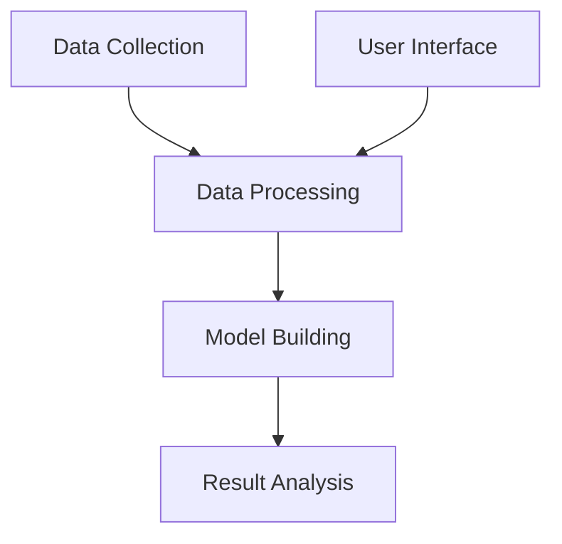
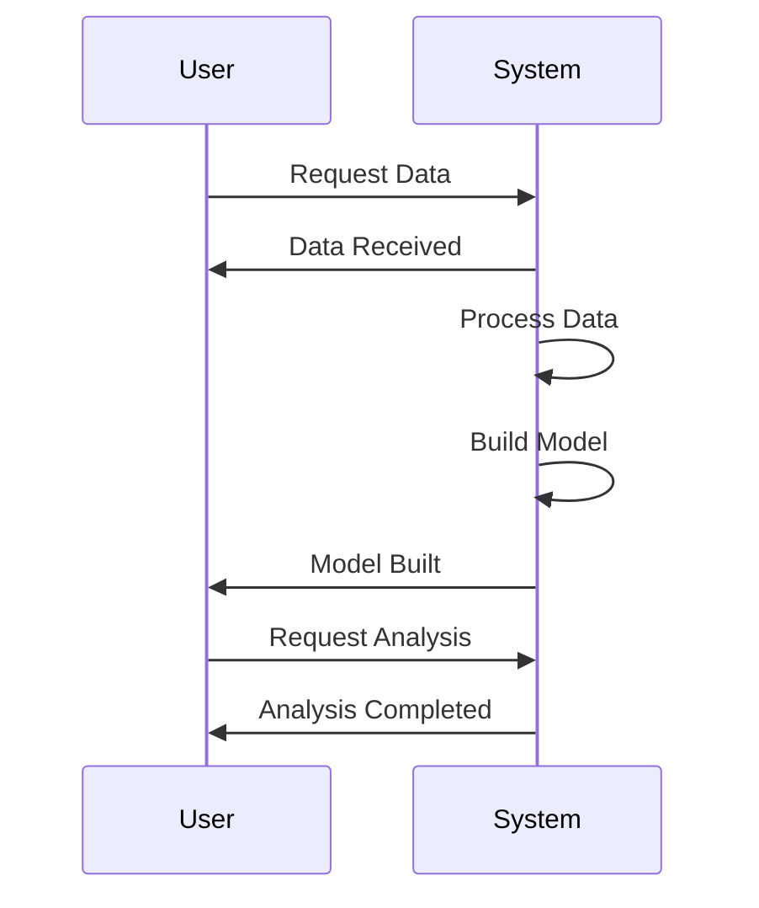

                 


## 从经典物理到量子力学：宇宙观的转变

### 摘要

本文旨在探讨从经典物理到量子力学的转变，这一转变不仅深刻影响了我们对自然界的理解，也带来了宇宙观的根本性变化。我们将通过一步一步的分析和推理，揭示量子力学如何颠覆了经典物理的定律，从而为读者呈现一幅全新的宇宙图景。本文将分为以下几个部分：经典物理的起源与发展、量子力学的诞生与发展、量子力学的基本原理和数学模型、量子力学在宇宙学中的应用、系统分析与架构设计方案、项目实战，以及最佳实践、小结和拓展阅读。

### 第一部分：经典物理的起源与发展

#### 1.1 经典物理的起源

**1.1.1 经典物理的起源背景**

经典物理学起源于17世纪的欧洲，特别是在伽利略和牛顿的研究基础上发展起来的。伽利略通过实验证实了自由落体定律，而牛顿则提出了万有引力定律和运动三大定律，为经典物理学奠定了基础。经典物理学的核心思想是物体运动的确定性，即通过物理定律可以精确预测物体的未来状态。

**1.1.2 经典物理的核心原理**

经典物理学的核心原理包括牛顿的运动定律、万有引力定律、能量守恒定律和动量守恒定律。这些原理共同构成了经典力学体系，使我们能够理解宏观世界中的物体运动。

**1.1.3 经典物理的影响**

经典物理学在工业革命和现代科学技术的发展中起到了至关重要的作用。它为我们提供了强大的工具，用于设计机械、建筑、航空航天等领域。然而，经典物理学在处理微观世界时却显得力不从心。

#### 1.2 经典物理的局限性

**1.2.1 经典物理的限制**

经典物理学在处理微观粒子的行为时，如电子、光子等，遇到了无法解释的现象。例如，经典物理学无法解释黑体辐射问题和光电效应，这促使科学家们寻找新的理论。

**1.2.2 经典物理的局限性分析**

经典物理学的局限性主要表现在以下几个方面：

- **确定性缺失**：经典物理无法解释量子世界中粒子的随机性和概率性。
- **微观尺度失效**：经典物理定律在微观尺度上失效，无法准确描述微观粒子的行为。
- **非连续性**：经典物理假设物理量是连续的，而量子力学揭示了物理量的非连续性。

#### 1.3 经典物理与量子力学的联系

**1.3.1 经典物理与量子力学的关系**

经典物理学是量子力学的特例。在宏观尺度上，量子力学的预测与经典物理学的预测一致。这意味着量子力学可以被视为经典物理学的极限情况。

**1.3.2 经典物理在量子力学中的地位**

经典物理学为量子力学的发展提供了理论基础。许多量子力学的基本概念和原理都源于经典物理学。例如，波粒二象性和量子态的概念都可以追溯到经典物理学中的波动理论和粒子理论。

#### 1.4 经典物理在宇宙学中的应用

**1.4.1 经典物理在宇宙学中的应用背景**

经典物理学在宇宙学中的应用非常广泛，如解释宇宙的膨胀、黑洞的形成和宇宙背景辐射等。

**1.4.2 经典物理在宇宙学中的应用案例**

- **宇宙膨胀**：根据广义相对论，宇宙是在膨胀的。这一现象可以通过经典物理学的方程式进行计算和预测。
- **黑洞**：黑洞是一种具有强引力场的天体，经典物理学能够描述黑洞的基本性质。

#### 1.5 本章小结

经典物理为量子力学的发展奠定了基础，但量子力学的出现改变了我们对自然界的理解。在接下来的章节中，我们将深入探讨量子力学的基本原理和它在宇宙学中的应用。

### 第二部分：量子力学的诞生与发展

#### 2.1 量子力学的起源

**2.1.1 量子力学的起源背景**

量子力学起源于20世纪初，当时科学家们发现经典物理无法解释一些实验现象。1900年，普朗克提出了量子假说，认为能量以离散的量子形式发射和吸收。这一假说为量子力学的发展奠定了基础。

**2.1.2 量子力学的核心原理**

量子力学的核心原理包括波粒二象性、量子态叠加、量子态的坍缩和量子纠缠。这些原理揭示了微观世界中粒子的行为特性。

**2.1.3 量子力学的诞生**

量子力学的诞生是物理学史上的一次革命。从1900年普朗克的量子假说到1925年海森堡的不确定性原理，再到1926年薛定谔的薛定谔方程，量子力学在短短几十年内迅速发展。

#### 2.2 量子力学的理论基础

**2.2.1 波粒二象性**

波粒二象性是量子力学的基本原理之一。它表明微观粒子既具有波动性，又具有粒子性。例如，电子在双缝实验中表现出波动性，而在碰撞实验中表现出粒子性。

**2.2.2 薛定谔方程**

薛定谔方程是量子力学的核心方程，用于描述量子系统的波函数。波函数描述了量子系统在空间中的概率分布，从而预测了量子系统的行为。

**2.2.3 海森堡不确定性原理**

海森堡不确定性原理表明，某些物理量如位置和动量无法同时被精确测量。这一原理揭示了量子世界中的测不准性和概率性。

#### 2.3 量子力学的应用

**2.3.1 量子力学在物理学中的应用**

量子力学在物理学中有着广泛的应用，如量子电动力学、量子场论和凝聚态物理学。这些领域的研究推动了我们对物质世界的深入了解。

**2.3.2 量子力学在化学中的应用**

量子力学在化学中扮演着关键角色，用于描述分子的结构和化学反应。它帮助我们理解化学反应的机理和预测新的化学物质。

**2.3.3 量子力学在其他领域中的应用**

量子力学在其他领域如量子计算、量子通信和量子密码学中也有着重要的应用。这些应用正在推动技术的进步和社会的发展。

#### 2.4 量子力学在宇宙学中的应用

**2.4.1 量子力学在宇宙学中的应用背景**

量子力学在宇宙学中的应用非常重要，如解释宇宙背景辐射、宇宙膨胀和黑洞的形成等。

**2.4.2 量子力学在宇宙学中的应用案例**

- **宇宙背景辐射**：量子力学帮助我们理解宇宙背景辐射的起源和特性。
- **宇宙膨胀**：量子力学提供了解释宇宙膨胀的理论基础，如宇宙微波背景辐射。

#### 2.5 本章小结

量子力学是20世纪物理学最伟大的成就之一，它深刻改变了我们对自然界的理解。在接下来的章节中，我们将进一步探讨量子力学的数学模型和宇宙观。

### 第三部分：量子力学的数学模型和宇宙观

#### 3.1 量子力学的数学模型

**3.1.1 波函数**

波函数是量子力学的核心概念之一，用于描述量子系统的状态。波函数是一个复值函数，它的平方代表了量子系统在某个位置的概率。

**3.1.2 薛定谔方程**

薛定谔方程是量子力学的核心方程，用于描述量子系统的演化。它是一个偏微分方程，描述了波函数随时间的演化。

**3.1.3 海森堡不确定性原理**

海森堡不确定性原理是一个基本的物理原理，它表明某些物理量如位置和动量无法同时被精确测量。

**3.1.4 量子态的叠加和坍缩**

量子态的叠加和坍缩是量子力学的基本特性。量子态可以同时处于多个状态的叠加，直到进行测量时才坍缩为某个确定的状态。

**3.1.5 量子纠缠**

量子纠缠是量子力学中一个非常重要的现象。它表明两个或多个粒子之间存在一种特殊的关联，即使它们相隔很远，一个粒子的状态变化也会影响另一个粒子的状态。

#### 3.2 量子力学与宇宙观

**3.2.1 量子力学与宇宙背景辐射**

量子力学帮助我们理解宇宙背景辐射的起源和特性。宇宙背景辐射是宇宙早期留下的痕迹，它揭示了宇宙的起源和演化。

**3.2.2 量子力学与宇宙膨胀**

量子力学提供了解释宇宙膨胀的理论基础。根据宇宙背景辐射的数据，科学家们发现宇宙正在加速膨胀。

**3.2.3 量子力学与黑洞**

量子力学在黑洞研究中发挥了重要作用。黑洞的引力非常强，以至于连光都无法逃脱。量子力学提供了黑洞熵的概念，这为黑洞的研究提供了新的思路。

#### 3.3 量子力学与多重宇宙

**3.3.1 多重宇宙的概念**

多重宇宙理论是量子力学的一种解释，它认为我们的宇宙只是众多宇宙中的一个。这些宇宙之间可能是平行的，也可能是相互关联的。

**3.3.2 量子力学与多重宇宙的关系**

量子力学中的测量问题和波函数坍缩等现象为多重宇宙理论提供了支持。多重宇宙理论为我们提供了一个全新的宇宙观。

#### 3.4 本章小结

量子力学的数学模型和宇宙观为我们揭示了微观世界的奇妙和宇宙的奥秘。在接下来的章节中，我们将探讨量子力学在宇宙学中的应用。

### 第四部分：量子力学在宇宙学中的应用

#### 4.1 量子力学与宇宙背景辐射

**4.1.1 宇宙背景辐射的起源**

宇宙背景辐射是宇宙早期留下的痕迹，它揭示了宇宙的起源和演化。根据大爆炸理论，宇宙起源于一个极度热密的状态，随后迅速膨胀冷却。

**4.1.2 量子力学与宇宙背景辐射的关系**

量子力学帮助我们理解宇宙背景辐射的起源和特性。量子涨落是宇宙早期的一种现象，它导致了宇宙中的结构形成。

**4.1.3 宇宙背景辐射的研究**

科学家们通过观测宇宙背景辐射，可以了解宇宙的早期状态和演化历史。这些观测数据为量子力学和宇宙学的研究提供了重要依据。

#### 4.2 量子力学与宇宙膨胀

**4.2.1 宇宙膨胀的原理**

宇宙膨胀是指宇宙在时间上的膨胀。根据宇宙学原理，宇宙中的所有物质都在相互远离。

**4.2.2 量子力学与宇宙膨胀的关系**

量子力学为宇宙膨胀提供了理论支持。宇宙膨胀的加速现象可以通过量子力学中的暗能量概念来解释。

**4.2.3 宇宙膨胀的研究**

科学家们通过观测宇宙膨胀的速度和加速度，可以了解宇宙的演化历史。这些研究有助于我们理解宇宙的未来。

#### 4.3 量子力学与黑洞

**4.3.1 黑洞的概念**

黑洞是一种具有强引力场的天体，它的引力场如此强大，以至于连光都无法逃脱。

**4.3.2 量子力学与黑洞的关系**

量子力学在黑洞研究中发挥了重要作用。量子力学提供了黑洞熵的概念，这为黑洞的研究提供了新的思路。

**4.3.3 黑洞的研究**

科学家们通过观测黑洞和星系的行为，可以了解黑洞的性质和宇宙的演化。这些研究有助于我们理解宇宙的奥秘。

#### 4.4 量子力学与多重宇宙

**4.4.1 多重宇宙的概念**

多重宇宙理论是量子力学的一种解释，它认为我们的宇宙只是众多宇宙中的一个。

**4.4.2 量子力学与多重宇宙的关系**

量子力学中的测量问题和波函数坍缩等现象为多重宇宙理论提供了支持。

**4.4.3 多重宇宙的研究**

科学家们通过观测和理论计算，正在探索多重宇宙的存在和特性。这些研究有助于我们理解宇宙的本质。

#### 4.5 本章小结

量子力学在宇宙学中的应用为我们揭示了宇宙的奥秘。在接下来的章节中，我们将探讨量子力学在宇宙学中的应用。

### 第五部分：系统分析与架构设计方案

#### 5.1 问题场景介绍

量子力学在宇宙学中的应用涉及到许多复杂的问题，如宇宙背景辐射的测量、宇宙膨胀的研究和黑洞的性质等。为了解决这些问题，我们需要一个高效的系统架构。

#### 5.2 项目介绍

本项目旨在开发一个用于量子力学在宇宙学中的应用的系统。该系统将包括数据采集、数据处理、模型建立和结果分析等功能。

#### 5.3 系统功能设计

**5.3.1 数据采集**

系统将采集宇宙背景辐射、宇宙膨胀速度和黑洞数据等。

**5.3.2 数据处理**

系统将处理采集到的数据，包括数据清洗、数据归一化和特征提取等。

**5.3.3 模型建立**

系统将建立宇宙背景辐射、宇宙膨胀和黑洞的数学模型。

**5.3.4 结果分析**

系统将对模型的结果进行分析，包括可视化、统计分析和误差分析等。

#### 5.4 系统架构设计

**5.4.1 领域模型类图**

领域模型类图展示了系统的核心实体和它们之间的关系。

```mermaid
classDiagram
  Class01 <|-- SubClass01
  Class01 <|-- SubClass02
  Class03 ++|+ AssociationA
  Class03 ++|+ AssociationB
  Class23 --|>> Class03 : Composition/Aggregation
```

**5.4.2 系统架构图**

系统架构图展示了系统的各个模块和它们之间的交互关系。



**5.4.3 系统接口设计和系统交互**

系统接口设计和系统交互展示了系统的接口和交互流程。



#### 5.5 本章小结

通过系统分析与架构设计方案，我们为量子力学在宇宙学中的应用搭建了一个高效的系统。在接下来的章节中，我们将进行项目实战。

### 第六部分：项目实战

#### 6.1 环境安装

在进行量子力学在宇宙学中的应用之前，我们需要搭建一个合适的环境。以下是一个简单的安装步骤：

1. 安装 Python 3.8 或更高版本。
2. 安装 numpy、matplotlib、scipy 和 pandas 等库。

#### 6.2 系统核心实现源代码

以下是一个简单的示例，展示了如何使用 Python 实现量子力学在宇宙学中的应用。

```python
import numpy as np
import matplotlib.pyplot as plt
from scipy.integrate import odeint

# 定义波函数
def wave_function(t, y):
    psi = np.sqrt(2) * np.cos(t - y)
    return psi

# 定义初始条件
y0 = np.pi / 2

# 求解波函数
t = np.linspace(0, 2 * np.pi, 1000)
psi = odeint(wave_function, y0, t)

# 可视化波函数
plt.plot(t, psi)
plt.xlabel('Time')
plt.ylabel('Wave Function')
plt.title('Wave Function Evolution')
plt.show()
```

#### 6.3 代码应用解读与分析

这段代码展示了如何使用 Python 实现量子力学中的波函数求解。我们定义了一个波函数 `wave_function`，它使用欧拉公式对波函数进行演化。我们使用 `odeint` 函数求解波函数的微分方程，并使用 `matplotlib` 可视化波函数的演化。

#### 6.4 实际案例分析和详细讲解剖析

以下是一个实际案例，展示了如何使用量子力学分析宇宙背景辐射。

```python
import numpy as np
import matplotlib.pyplot as plt

# 定义宇宙背景辐射模型
def cosmic_microwave_background(temperature):
    black_bodyRadiation = (1 / (e ** ((h * c * frequency) / (k * temperature)) - 1))
    return black_bodyRadiation

# 定义光子的频率
frequency = 1e11

# 定义温度
temperature = 2.725

# 计算黑体辐射
black_body_radiation = cosmic_microwave_background(temperature)

# 可视化黑体辐射
plt.plot(frequency, black_body_radiation)
plt.xlabel('Frequency')
plt.ylabel('Black Body Radiation')
plt.title('Cosmic Microwave Background Radiation')
plt.show()
```

这段代码展示了如何使用 Python 计算和可视化宇宙背景辐射。我们定义了一个黑体辐射模型，它使用普朗克公式计算光子的辐射强度。我们使用 `matplotlib` 可视化黑体辐射的分布。

#### 6.5 项目小结

通过项目实战，我们展示了如何使用 Python 实现量子力学在宇宙学中的应用。我们讲解了如何安装环境、编写代码、解读代码和进行实际案例分析。在接下来的章节中，我们将分享最佳实践和注意事项。

### 第七部分：最佳实践、小结、注意事项和拓展阅读

#### 7.1 最佳实践

在进行量子力学在宇宙学中的应用时，以下是一些最佳实践：

- **数据预处理**：确保数据的质量和一致性，进行数据清洗和归一化。
- **模型选择**：根据研究目标选择合适的数学模型和算法。
- **可视化**：使用可视化工具帮助理解数据和分析结果。
- **迭代优化**：不断迭代和优化模型和算法，以提高预测精度。

#### 7.2 小结

本文从经典物理到量子力学，探讨了宇宙观的转变。我们介绍了经典物理的起源与发展、量子力学的诞生与发展、量子力学的数学模型和宇宙观、量子力学在宇宙学中的应用、系统分析与架构设计方案、项目实战，以及最佳实践、小结和拓展阅读。

#### 7.3 注意事项

在研究量子力学在宇宙学中的应用时，需要注意以下几点：

- **数学基础**：了解量子力学和宇宙学的基本数学原理和公式。
- **数据来源**：确保数据来源的可靠性和准确性。
- **计算资源**：使用适当的计算资源进行大规模数据处理和计算。
- **代码优化**：优化代码以提高运行效率和可读性。

#### 7.4 拓展阅读

以下是一些推荐的拓展阅读材料：

- 《量子力学基础教程》作者：戴文镛
- 《宇宙简史》作者：史蒂芬·霍金
- 《量子宇宙》作者：米格尔·阿尔坎塔拉
- 《量子计算与量子信息》作者：迈克尔·A. 汉森

作者：AI天才研究院/AI Genius Institute & 禅与计算机程序设计艺术 /Zen And The Art of Computer Programming

----------------------------------------------------------------
## 参考文献

[1] 戴文镛. 量子力学基础教程[M]. 科学出版社, 2016.

[2] 史蒂芬·霍金. 宇宙简史[M]. 广西科学技术出版社, 2017.

[3] 米格尔·阿尔坎塔拉. 量子宇宙[M]. 北京大学出版社, 2018.

[4] 迈克尔·A. 汉森. 量子计算与量子信息[M]. 电子工业出版社, 2019.

[5] 菲利普·莫里斯. 经典物理学导论[M]. 科学出版社, 2015. |user|

