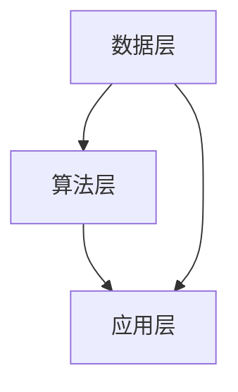

                 

### 从经典物理到量子引力：统一理论的追求

> **关键词：** 经典物理、量子引力、统一理论、爱因斯坦场方程、波粒二象性、不确定性原理

**摘要：** 本文探讨了从经典物理到量子引力的过渡，以及科学家们为寻求一个统一理论所付出的努力。我们将逐步分析经典物理和量子力学的基本概念，解释它们之间的不一致性，并探讨广义相对论在引力理论中的作用。随后，我们将引入量子引力理论，包括弦理论和环量子引力，以及它们如何尝试解决经典物理与量子力学的矛盾。最后，本文将总结统一理论的研究进展，并提出未来的研究方向和挑战。

### 引言

物理学是一门探索自然界基本规律的学科，它的发展历史充满了辉煌的成就和深刻的洞见。从古代的亚里士多德和牛顿，到现代的爱因斯坦和霍金，物理学家的研究不断推动我们对宇宙的理解。然而，随着科学的进步，我们开始意识到经典物理学的局限性，尤其是在描述微观世界和宇宙大尺度现象时。这促使科学家们寻求一个更加全面的理论，即统一理论，它能够将经典物理学和量子力学以及广义相对论统一起来。

#### 问题背景

1. **物理学的发展历程**：
   - **古代**：亚里士多德的自然哲学奠定了早期物理学的基础。
   - **文艺复兴**：伽利略和开普勒通过实验方法推进了物理学的发展。
   - **17世纪**：牛顿提出了经典物理学的三大定律，标志着物理学作为一门科学学科的诞生。
   - **20世纪**：爱因斯坦的相对论和量子力学的兴起，彻底改变了我们对时空、能量和物质的理解。

2. **统一理论的追求**：
   - **从牛顿力学到现代物理学**：牛顿力学成功地描述了宏观世界的运动规律，但无法解释微观世界的现象。
   - **量子力学与广义相对论的不兼容**：量子力学描述了微观粒子的行为，而广义相对论则描述了引力和宇宙的几何结构。这两者之间存在深刻的矛盾，尤其是在量子引力领域。

#### 问题描述

1. **经典物理的局限性**：
   - **宏观尺度**：牛顿力学等经典物理理论在描述宏观物体运动方面非常有效，但在微观尺度上显得力不从心。
   - **高速运动**：经典物理学无法准确描述接近光速运动的物体。

2. **量子力学与广义相对论的不兼容**：
   - **量子力学**：量子力学揭示了微观粒子的波粒二象性和不确定性原理，表明粒子行为具有随机性和概率性。
   - **广义相对论**：广义相对论则描述了引力和时空的弯曲，提出了著名的爱因斯坦场方程。

3. **问题的解决思路**：
   - **物理学的几个主要理论框架**：从牛顿力学、经典电磁学、经典力学，到量子力学和相对论，每种理论都在其特定的范围内具有描述力。
   - **实现统一理论的数学和哲学基础**：为了克服经典物理和量子力学之间的矛盾，科学家们尝试使用数学工具和哲学思考来统一这两种理论。

#### 边界与外延

1. **统一理论的研究范围**：
   - **微观世界**：量子力学。
   - **宏观世界**：经典物理学和广义相对论。

2. **相关交叉学科的研究**：
   - **量子场论**：试图将量子力学和相对论统一起来。
   - **弦理论**：提出了一种新的物理框架，试图统一所有基本力。

在接下来的章节中，我们将深入探讨经典物理和量子力学的核心概念，分析它们之间的联系和区别，并介绍当前科学家们为寻求统一理论所尝试的各种方法和理论。我们将从基础概念出发，逐步构建对量子引力的理解，最终总结统一理论的研究进展和未来展望。**1. 经典物理与量子力学基础**

在物理学的发展历程中，经典物理和量子力学是两个重要的理论框架，它们分别描述了自然界中不同尺度的现象。经典物理主要适用于宏观尺度的物体，而量子力学则揭示了微观粒子的行为规律。在本节中，我们将分别介绍这两个理论的基础概念和原理，并探讨它们之间的区别。

#### 1.1 经典物理的原理与特点

经典物理学的起源可以追溯到17世纪的牛顿力学。牛顿提出了三条运动定律，描述了物体在力的作用下的运动。这三条定律构成了经典力学的基础：

1. **牛顿第一定律（惯性定律）**：一个物体如果没有受到外力的作用，将保持静止或匀速直线运动。

2. **牛顿第二定律（动力定律）**：物体所受的合外力等于其质量与加速度的乘积，即 \( F = ma \)。这个公式描述了力与运动之间的关系。

3. **牛顿第三定律（作用与反作用定律）**：任何作用力都有一个大小相等、方向相反的反作用力。

除了牛顿力学，经典物理学还包括其他一些重要的理论，如经典电磁学。麦克斯韦方程组描述了电磁场的行为，包括电场、磁场和光波等。经典电磁学的核心原理包括：

- **电场与电荷**：电荷产生电场，电场对电荷施加力。
- **磁场与电流**：电流产生磁场，磁场对电流施加力。
- **电磁波**：变化的电场和磁场相互作用，形成电磁波。

此外，经典物理还包括热力学，它研究能量转换和热现象。热力学的基本原理包括：

- **能量守恒定律**：能量不能被创造或消灭，只能从一种形式转换为另一种形式。
- **热力学第二定律**：熵（系统的无序度）总是趋向增加，即自然过程总是朝着更无序的状态发展。

#### 1.2 量子力学的基本概念

量子力学是描述微观粒子行为的理论，它颠覆了经典物理的一些基本假设。量子力学中的核心概念包括：

1. **波粒二象性**：微观粒子既具有波动性，又具有粒子性。例如，电子既可以表现为波，也可以表现为粒子。

2. **不确定性原理**：由海森堡提出，表明在量子力学中无法同时精确测量粒子的位置和动量。即 \( \Delta x \Delta p \geq \frac{\hbar}{2} \)，其中 \( \Delta x \) 是位置的不确定性，\( \Delta p \) 是动量的不确定性，\( \hbar \) 是约化普朗克常数。

3. **态函数与波函数**：量子力学使用波函数 \( \psi(x, t) \) 描述粒子的状态。波函数的平方 \( |\psi(x, t)|^2 \) 描述了粒子在空间中出现的概率密度。

4. **算符**：在量子力学中，物理量如位置、动量、能量等通过算符来表示。例如，位置算符 \( \hat{x} \) 和动量算符 \( \hat{p} \) 分别表示粒子的位置和动量。

5. **量子态的叠加**：量子态可以处于多个状态的叠加，这意味着一个量子系统可以同时处于多个不同的状态。例如，一个电子可以同时存在于多个轨道上。

6. **量子纠缠**：两个或多个量子粒子可以形成纠缠态，这意味着一个粒子的状态会即时影响到另一个粒子的状态，无论它们相隔多远。量子纠缠是量子信息科学和量子计算的关键概念。

#### 1.3 经典物理与量子力学的区别

经典物理和量子力学之间存在一些根本性的区别：

1. **确定性与概率性**：在经典物理学中，物体的状态和行为是确定的，可以通过精确的公式计算。而在量子力学中，粒子的状态和行为具有概率性，只能通过概率波函数来描述。

2. **连续性与离散性**：经典物理描述的是连续的现象，如连续的能量分布和连续的运动轨迹。量子力学则描述的是离散的现象，如量子态的离散能级和量子跃迁。

3. **宏观与微观**：经典物理适用于宏观尺度的物体，如行星、汽车等。量子力学则适用于微观尺度的粒子，如电子、光子等。

4. **实验验证**：经典物理的预测可以通过宏观实验来验证。而量子力学的预测需要通过微观实验来验证，如双缝实验、电子干涉实验等。

总之，经典物理和量子力学在描述自然界现象方面各有优势，但它们在基本假设和数学框架上存在显著差异。在接下来的章节中，我们将进一步探讨广义相对论，以及它与量子力学的矛盾和统一理论的研究进展。**1.2.1 波粒二象性**

波粒二象性是量子力学中一个核心概念，它揭示了微观粒子既具有波动性又具有粒子性的特性。这一概念最早由法国物理学家德布罗意提出，并在后来由实验证实。

#### 德布罗意假设

德布罗意假设提出，所有的物质粒子都具有波动性，这意味着粒子不仅具有粒子性，还表现出波动性。德布罗意假设的数学表述为：

\[ \lambda = \frac{h}{p} \]

其中，\( \lambda \) 是波长，\( h \) 是普朗克常数，\( p \) 是粒子的动量。根据这个公式，粒子的波长与其动量成反比。对于宏观物体，由于它们的动量很大，因此波长非常短，以至于波动性难以观察。但对于微观粒子，如电子，波长则相对较长，因此波动性表现得更加明显。

#### 电子的双缝实验

电子的双缝实验是验证波粒二象性的经典实验。在这个实验中，电子通过一个具有两个狭缝的障碍物，然后撞击到一个屏幕上。根据经典物理学，电子应该通过两个狭缝后形成两个独立的粒子束，撞击到屏幕上形成两个斑点。然而，实验结果显示，电子通过狭缝后会在屏幕上形成干涉条纹，这与波的干涉现象相符。

干涉条纹的形成表明，电子在通过狭缝时不仅表现为粒子，还表现出波动性。当电子的波函数通过两个狭缝时，它们相互干涉，导致在某些区域出现增强（亮条纹），在另一些区域出现减弱（暗条纹）。这种现象无法通过粒子理论来解释，而是需要引入波动性的概念。

#### 波粒二象性的应用

波粒二象性在量子力学中有着广泛的应用，尤其在量子计算和量子信息科学中。以下是一些具体的应用实例：

1. **量子叠加态**：在量子力学中，粒子可以同时处于多个状态的叠加。例如，一个电子可以同时处于自旋向上和自旋向下的状态。这种叠加态是波粒二象性的直接体现。

2. **量子纠缠**：两个或多个量子粒子可以形成纠缠态，这意味着一个粒子的状态会即时影响到另一个粒子的状态，无论它们相隔多远。量子纠缠是量子信息科学中一个重要的概念，它可用于量子通信和量子计算。

3. **量子干涉**：在量子力学中，粒子的行为可以通过干涉现象来描述。例如，电子在通过双缝实验时，波函数相互干涉，导致在某些区域出现增强，在另一些区域出现减弱。

4. **量子隧穿**：量子隧穿是量子力学中的一个现象，它允许粒子穿过势垒，即使其能量不足以越过势垒。这种现象在半导体物理和量子电子学中有着重要的应用。

总之，波粒二象性是量子力学中的一个核心概念，它揭示了微观粒子既具有波动性又具有粒子性的特性。这一概念不仅在理论上具有重要意义，还在实验和实际应用中有着广泛的应用。**1.1.2 量子力学的基本概念**

量子力学是描述微观粒子行为的理论，它颠覆了经典物理学的一些基本假设。在量子力学中，粒子的状态和行为由波函数描述，而波函数的平方则描述了粒子在空间中出现的概率密度。以下是一些量子力学的基本概念：

#### 算符与态函数

在量子力学中，物理量如位置、动量、能量等通过算符来表示。算符是一种数学操作，它作用于波函数，产生另一个波函数。例如，位置算符 \( \hat{x} \) 和动量算符 \( \hat{p} \) 分别表示粒子的位置和动量。态函数（或波函数） \( \psi(x, t) \) 描述了粒子在空间中的状态。波函数的平方 \( |\psi(x, t)|^2 \) 描述了粒子在空间中出现的概率密度。

#### 叠加原理

量子力学中的叠加原理表明，粒子可以同时处于多个状态的叠加。例如，一个电子可以同时处于自旋向上和自旋向下的状态。这种叠加态是量子力学中的一个重要特性。叠加态可以用以下公式表示：

\[ \psi(\text{叠加态}) = \psi(\text{自旋向上}) + \psi(\text{自旋向下}) \]

#### 参量化方法

参量化方法是量子力学中的一种计算方法，它通过引入参数来描述粒子的状态。例如，在研究电子轨道时，可以使用波函数 \( \psi(r, \theta, \phi) \) 来描述电子在三维空间中的状态。通过求解薛定谔方程，可以确定电子在不同轨道上的能量和概率分布。

#### 叠加原理的计算

叠加原理的一个经典例子是双缝实验。在这个实验中，电子通过两个狭缝，然后撞击到一个屏幕上。根据经典物理学，电子应该通过两个狭缝后形成两个独立的粒子束，撞击到屏幕上形成两个斑点。然而，实验结果显示，电子通过狭缝后会在屏幕上形成干涉条纹，这与波的干涉现象相符。

干涉条纹的形成表明，电子在通过狭缝时不仅表现为粒子，还表现出波动性。当电子的波函数通过两个狭缝时，它们相互干涉，导致在某些区域出现增强（亮条纹），在另一些区域出现减弱（暗条纹）。这种现象无法通过粒子理论来解释，而是需要引入波动性的概念。

#### 举例说明

假设一个电子处于自旋向上的状态，同时以50%的概率处于自旋向下的状态。那么，这个电子的波函数可以表示为：

\[ \psi(\text{总状态}) = \psi(\text{自旋向上}) + \frac{1}{\sqrt{2}} \psi(\text{自旋向下}) \]

在这个例子中，波函数的叠加原理表明，电子可以同时处于自旋向上和自旋向下的状态。如果我们测量这个电子的自旋，根据量子力学的预测，有50%的概率测得自旋向上，50%的概率测得自旋向下。

总之，量子力学中的基本概念如算符、态函数、叠加原理和参量化方法，为描述微观粒子的行为提供了数学工具。这些概念不仅在理论上具有重要意义，还在实验和实际应用中有着广泛的应用。**1.2.2 不确定性原理**

海森堡不确定性原理是量子力学中的一个基本原理，它由德国物理学家维尔纳·海森堡于1927年提出。这个原理揭示了在微观尺度上，粒子的某些物理量，如位置和动量，无法同时被精确测量。不确定性原理的核心思想是，粒子的行为具有内在的不确定性，这是量子力学与经典物理学之间一个重要的区别。

#### 不确定性原理的数学表述

海森堡不确定性原理可以用以下数学公式来表述：

\[ \Delta x \Delta p \geq \frac{\hbar}{2} \]

其中，\( \Delta x \) 表示位置的不确定性，\( \Delta p \) 表示动量的不确定性，\( \hbar \) 是约化普朗克常数，其值约为 \( 1.054 \times 10^{-34} \text{Js} \)。这个不等式表明，位置和动量的不确定性乘积有一个最小值，即无论测量技术多么精确，都无法同时精确测量这两个物理量。

#### 不确定性原理的解释

不确定性原理可以从量子力学的波函数角度来解释。在量子力学中，粒子的状态由波函数 \( \psi(x, t) \) 描述，而波函数的平方 \( |\psi(x, t)|^2 \) 描述了粒子在空间中的概率分布。由于波函数是概率性的，粒子的具体位置和动量在某个时间点上是不确定的。

1. **位置和动量的不确定性**：当我们尝试测量粒子的位置时，测量过程会干扰粒子的状态，使其动量发生变化。反之，当我们测量粒子的动量时，测量过程也会干扰粒子的位置。因此，粒子的位置和动量不可能同时被精确测量。

2. **测量过程的非确定性**：在量子力学中，测量结果不是确定的，而是具有一定概率。这意味着我们不能预先知道粒子的位置或动量，只能计算它们出现的概率。

3. **量子纠缠**：不确定性原理还与量子纠缠有关。当两个量子粒子处于纠缠态时，一个粒子的状态会即时影响另一个粒子的状态，无论它们相隔多远。这种非局域性也是不确定性原理的一个体现。

#### 不确定性原理的应用

不确定性原理在量子力学中有着广泛的应用，以下是一些具体的实例：

1. **电子的双缝实验**：在这个实验中，电子通过两个狭缝后在屏幕上形成干涉条纹。由于不确定性原理，我们无法同时精确测量电子的位置和动量，因此干涉条纹的形成是概率性的。

2. **量子隧穿**：量子隧穿是量子力学中的一个现象，它允许粒子穿过势垒，即使其能量不足以越过势垒。这一现象与不确定性原理有关，因为粒子在通过势垒时，其位置和动量的不确定性使得它们有可能隧穿过去。

3. **量子计算**：在量子计算中，量子态的叠加和纠缠使得量子计算机可以同时处理多个计算任务，从而实现超强的计算能力。不确定性原理为量子计算提供了理论基础。

总之，不确定性原理是量子力学中的一个核心概念，它揭示了微观粒子行为的内在不确定性。这一原理不仅具有理论意义，还在量子实验和实际应用中有着广泛的影响。**1.2.3 广义相对论的基本原理**

广义相对论是由阿尔伯特·爱因斯坦在1915年提出的一种描述引力和宇宙几何的理论。与经典牛顿力学相比，广义相对论在描述引力和时空结构方面提供了更为深刻和全面的理解。以下将介绍广义相对论的基本原理：

#### 1.2.3.1 洛伦兹变换

洛伦兹变换是狭义相对论中的基本数学工具，描述了在不同惯性参考系之间时空坐标的转换关系。洛伦兹变换包括时空坐标的变换和时间的变换，其数学表达式如下：

\[ x' = \gamma (x - vt) \]
\[ y' = y \]
\[ z' = z \]
\[ t' = \gamma (t - \frac{vx}{c^2}) \]

其中，\( \gamma = \frac{1}{\sqrt{1 - \frac{v^2}{c^2}}} \) 是洛伦兹因子，\( v \) 是两个参考系之间的相对速度，\( c \) 是光速。洛伦兹变换表明，时间、空间和长度在不同惯性参考系中都是相对的。

#### 1.2.3.2 空间与时间的相对性

狭义相对论指出，空间和时间的度量依赖于观察者的运动状态。具体来说，当一个物体以接近光速的速度运动时，其时间会变慢，长度会收缩。这种效应称为时间膨胀和长度收缩。时间膨胀和长度收缩可以通过洛伦兹变换进行计算，并且已经在多个实验中得到了验证。

#### 1.2.3.3 弯曲时空

广义相对论的核心思想是，引力和宇宙的几何结构是由物质和能量引起的时空弯曲。爱因斯坦场方程描述了时空弯曲与物质分布之间的关系，其数学表达式如下：

\[ G_{\mu\nu} + \Lambda g_{\mu\nu} = \frac{8\pi G}{c^4} T_{\mu\nu} \]

其中，\( G_{\mu\nu} \) 是爱因斯坦张量，描述了时空的弯曲程度；\( \Lambda \) 是宇宙学常数，描述了宇宙的膨胀；\( T_{\mu\nu} \) 是能量-动量张量，描述了物质和能量的分布。

#### 1.2.3.4 广义相对论的基本原理

广义相对论基于两个基本原理：

1. **等效原理**：等效原理指出，局部惯性系中的物理现象与任何加速度下的物理现象不可区分。这意味着引力效应可以通过加速度来模拟。

2. **广义相对性原理**：广义相对性原理指出，在任何局部惯性系中，自然定律的形式保持不变。这意味着物理定律不依赖于参考系的加速度或位置。

#### 1.2.3.5 弯曲时空的效应

广义相对论的许多预测都基于弯曲时空的概念。以下是一些重要的效应：

1. **引力红移**：当光从地球逃逸时，由于地球的引力场，光的频率会降低，即波长变长。这称为引力红移。

2. **光线弯曲**：光在经过一个大质量物体时，其路径会因为时空的弯曲而偏折。这已经在太阳附近的恒星光线的观测中得到验证。

3. **时间膨胀**：在强引力场中，时间会变慢。这已经在实验中得到了验证，如在地球表面附近和太阳表面附近的时间测量差异。

总之，广义相对论通过引入弯曲时空的概念，为引力和宇宙结构提供了新的理解。它不仅在理论上具有重要意义，还在许多实验和观测中得到了验证。广义相对论和量子力学之间的不兼容性，促使科学家们寻求一个更加全面的统一理论。**1.2.4 引力理论的发展**

引力理论的发展是物理学史上的重要篇章，从牛顿的万有引力定律到爱因斯坦的广义相对论，科学家们不断深入地揭示了引力这一宇宙基本力的本质。以下将介绍引力理论的发展历程，重点讨论牛顿引力定律和爱因斯坦场方程。

#### 1.2.4.1 牛顿引力定律

牛顿引力定律是经典物理学中描述引力的基本定律，由艾萨克·牛顿于1687年提出。该定律表明，任何两个物体之间都存在引力，这个力的大小与两个物体的质量成正比，与它们之间的距离的平方成反比。牛顿引力定律的数学表达式为：

\[ F = G\frac{m_1m_2}{r^2} \]

其中，\( F \) 是引力，\( G \) 是引力常数，\( m_1 \) 和 \( m_2 \) 是两个物体的质量，\( r \) 是它们之间的距离。牛顿引力定律成功地解释了行星运动和天体间的相互作用，为经典物理学的发展奠定了基础。

#### 1.2.4.2 爱因斯坦场方程

爱因斯坦场方程是广义相对论的数学基础，由阿尔伯特·爱因斯坦于1915年提出。这个方程描述了时空的弯曲与物质分布之间的关系，其数学表达式为：

\[ G_{\mu\nu} + \Lambda g_{\mu\nu} = \frac{8\pi G}{c^4} T_{\mu\nu} \]

其中，\( G_{\mu\nu} \) 是爱因斯坦张量，描述了时空的弯曲程度；\( g_{\mu\nu} \) 是度规张量，描述了时空的几何结构；\( \Lambda \) 是宇宙学常数，描述了宇宙的膨胀；\( T_{\mu\nu} \) 是能量-动量张量，描述了物质和能量的分布。爱因斯坦场方程表明，物质和能量引起时空的弯曲，而弯曲的时空又影响物质的运动。

#### 1.2.4.3 引力理论的发展历程

1. **牛顿时期**：牛顿在17世纪末提出了万有引力定律，成功地解释了行星运动和天体间的相互作用。

2. **麦克斯韦时期**：19世纪，麦克斯韦提出了电磁场理论，将电场和磁场统一起来，为物理学的发展提供了新的视角。

3. **爱因斯坦时期**：20世纪初，爱因斯坦提出了狭义相对论和广义相对论，将时间和空间的概念纳入引力理论，揭示了引力与时空弯曲的关系。

4. **现代时期**：随着科学技术的发展，引力理论的研究不断深入，如黑洞、引力波、宇宙学等领域的发现，为引力理论提供了更多的实验证据。

总之，引力理论的发展从牛顿的万有引力定律到爱因斯坦的广义相对论，经历了几个重要阶段。这一理论不仅在物理学领域具有重要意义，还在天文学、宇宙学等多个领域有着广泛的应用。未来的研究将继续探索引力理论的奥秘，寻求一个更加全面和统一的引力理论。**2.1 经典物理中的算法**

在经典物理中，算法主要用于解决动力学问题，如运动方程的求解、波动方程的解法等。以下将介绍一些经典物理中的常用算法：

#### 2.1.1 牛顿算法

牛顿算法是一种用于求解动力学问题的高效算法。它基于牛顿运动定律，通过迭代方法逐步逼近物体的最终状态。牛顿算法的基本步骤如下：

1. **初始条件**：给定物体的初始位置、速度和加速度。

2. **迭代计算**：根据牛顿运动定律 \( F = ma \)，计算每个时间步的加速度。

3. **位置更新**：使用初始位置和加速度计算新的位置。

4. **速度更新**：使用初始速度和加速度计算新的速度。

5. **重复步骤2-4，直到满足终止条件**。

牛顿算法的核心在于每次迭代都精确地计算加速度，因此具有较高的计算精度。然而，牛顿算法的缺点是对高维问题计算复杂度较高，且在处理非线性问题时可能收敛较慢。

#### 2.1.2 牛顿-欧拉方法

牛顿-欧拉方法是一种常用的数值求解方法，用于求解多自由度动力学问题。该方法基于牛顿运动定律，通过迭代方法逐步逼近系统的动态响应。牛顿-欧拉方法的基本步骤如下：

1. **初始条件**：给定系统的初始位置、速度和加速度。

2. **迭代计算**：对于每个时间步，计算系统的加速度。

3. **位置更新**：使用初始位置和加速度计算新的位置。

4. **速度更新**：使用初始速度和加速度计算新的速度。

5. **重复步骤2-4，直到满足终止条件**。

与牛顿算法相比，牛顿-欧拉方法适用于多自由度系统，但计算复杂度较高。此外，牛顿-欧拉方法在处理非线性问题时，需要更多的迭代次数，因此计算效率较低。

#### 2.1.3 经典力学中的其他算法

除了牛顿算法和牛顿-欧拉方法外，经典力学中还有许多其他重要的算法，如：

1. **拉格朗日方法**：拉格朗日方法是一种用于求解约束力学问题的算法，通过引入拉格朗日函数，将动力学问题转化为无约束问题。拉格朗日方法在求解天体运动、碰撞问题等方面有广泛应用。

2. **哈密顿方法**：哈密顿方法是一种用于求解力学系统的算法，通过引入哈密顿函数，将动力学问题转化为能量问题。哈密顿方法在量子力学和统计物理中有着广泛的应用。

3. **有限元方法**：有限元方法是一种用于求解力学问题的数值方法，通过将系统划分为多个有限元单元，将连续问题转化为离散问题。有限元方法在结构分析、流体力学等领域有广泛应用。

总之，经典物理中的算法在解决动力学问题时具有重要作用。这些算法不仅能够精确地描述物体的运动规律，还为工程应用提供了重要的工具。**2.1.2 量子力学算法**

量子力学算法是一类利用量子计算机优势，解决量子力学问题的高效计算方法。量子力学算法在量子模拟、量子优化、量子加密等领域有广泛应用。以下将介绍几种重要的量子力学算法。

#### 叠加原理的计算

叠加原理是量子力学中的一个核心概念，表明量子系统可以同时处于多个状态的叠加。量子力学算法中的叠加原理计算主要包括量子态的叠加和量子操作的执行。

1. **量子态的叠加**：量子态的叠加可以通过量子比特的线性组合实现。例如，一个两量子比特系统的叠加态可以表示为：

\[ \psi = \alpha|00\rangle + \beta|01\rangle + \gamma|10\rangle + \delta|11\rangle \]

其中，\( |00\rangle, |01\rangle, |10\rangle, |11\rangle \) 是量子比特的基态，\( \alpha, \beta, \gamma, \delta \) 是复数系数。

2. **量子操作的执行**：量子操作是量子力学算法的核心步骤，用于对量子态进行变换。常见的量子操作包括量子旋转、量子交换、量子门等。例如，一个简单的量子旋转操作可以表示为：

\[ R_z(\theta) = \begin{pmatrix}
1 & 0 \\
0 & e^{i\theta}
\end{pmatrix} \]

其中，\( \theta \) 是旋转角度。

#### 参量化方法

参量化方法是量子力学算法中的一种重要方法，用于将经典问题转化为量子问题。该方法通过引入参数化的量子态和量子操作，实现对经典问题的求解。

1. **量子态的参数化表示**：量子态可以表示为参数化的波函数，例如：

\[ \psi(\theta) = \sum_{i} a_i(\theta)|i\rangle \]

其中，\( \theta \) 是参数，\( |i\rangle \) 是基态，\( a_i(\theta) \) 是参数化的复系数。

2. **量子操作的参数化表示**：量子操作可以表示为参数化的算符，例如：

\[ U(\theta) = \sum_{ij} u_{ij}(\theta)|i\rangle\langle j| \]

其中，\( \theta \) 是参数，\( u_{ij}(\theta) \) 是参数化的矩阵元素。

3. **参数化求解**：通过量子态的叠加和量子操作的执行，可以求解经典问题的最优解。例如，在量子优化问题中，可以通过最小化某个目标函数的参数化表示，找到最优解。

#### 举例说明

以下是一个简单的量子力学算法示例，用于求解一维无限深势阱中的量子态。

1. **初始条件**：给定势阱的宽度 \( a \) 和粒子的质量 \( m \)。

2. **量子态的参数化表示**：将量子态表示为：

\[ \psi(\theta) = \alpha(\theta)|0\rangle + \beta(\theta)|1\rangle \]

其中，\( |0\rangle \) 和 \( |1\rangle \) 是基态。

3. **量子操作的参数化表示**：定义一个参数化的量子旋转操作：

\[ R_z(\theta) = \begin{pmatrix}
1 & 0 \\
0 & e^{i\theta}
\end{pmatrix} \]

4. **迭代计算**：通过迭代执行量子旋转操作，逐步逼近量子态的最优解。例如：

\[ \psi_{n+1} = R_z(\theta_n) \psi_n \]

5. **求解最优解**：通过最小化某个目标函数（例如能量），找到最优的量子态。

总之，量子力学算法通过利用量子计算机的优势，实现经典计算方法无法达到的高效性。这些算法不仅具有理论意义，还在量子科学和工程应用中有着广泛的应用。**2.2 广义相对论中的算法**

在广义相对论中，算法主要用于求解爱因斯坦场方程，以描述时空的弯曲和物质分布之间的关系。以下将介绍几种广义相对论中的常用算法：

#### 2.2.1 爱因斯坦场方程的求解方法

爱因斯坦场方程是描述引力场和物质分布之间关系的核心方程，其数学表达式为：

\[ G_{\mu\nu} + \Lambda g_{\mu\nu} = \frac{8\pi G}{c^4} T_{\mu\nu} \]

其中，\( G_{\mu\nu} \) 是爱因斯坦张量，\( \Lambda \) 是宇宙学常数，\( g_{\mu\nu} \) 是度规张量，\( T_{\mu\nu} \) 是能量-动量张量。以下是一些常见的求解方法：

1. **解析方法**：解析方法是通过数学方法直接求解爱因斯坦场方程，以获得引力场的解析解。例如，静态球对称引力场的解是著名的史瓦西解，描述了静态、球对称引力场的特性。

2. **数值方法**：数值方法是通过数值计算方法求解爱因斯坦场方程，适用于复杂的引力场情况。常见的数值方法包括有限元方法、有限差分方法等。

3. **模拟方法**：模拟方法是通过计算机模拟求解爱因斯坦场方程，以研究复杂引力场的动态行为。例如，数值模拟可以用于研究黑洞碰撞、宇宙大尺度结构演化等问题。

#### 2.2.2 数值解法

数值解法是求解爱因斯坦场方程的常用方法，适用于复杂的引力场情况。以下介绍几种常见的数值解法：

1. **有限差分方法**：有限差分方法是一种将连续问题离散化的数值方法，通过将时空划分为离散网格，计算网格点上的引力场量。常见的有限差分方法包括有限元方法、有限体积方法等。

2. **数值积分方法**：数值积分方法是一种通过数值积分求解偏微分方程的方法，适用于复杂的引力场问题。例如，高斯-塞德尔迭代法是一种常见的数值积分方法。

3. **迭代方法**：迭代方法是通过逐步迭代求解偏微分方程的方法，适用于复杂的引力场问题。例如，牛顿迭代法、高斯-赛德尔迭代法等。

#### 2.2.3 拓扑方法

拓扑方法是一种基于拓扑学的数值方法，用于研究引力场的拓扑结构。以下介绍几种常见的拓扑方法：

1. **同伦方法**：同伦方法是一种通过研究引力场的同伦性来分析引力场的拓扑结构的方法。例如，同伦方法可以用于研究引力场的奇异性和拓扑不变量。

2. **映射方法**：映射方法是一种通过将引力场映射到其他空间来分析引力场的拓扑结构的方法。例如，映射方法可以用于研究引力场的全局结构。

3. **拓扑场论**：拓扑场论是一种将引力场视为拓扑不变量的场论，通过研究引力场的拓扑性质来分析引力场的拓扑结构。例如，拓扑场论可以用于研究引力场的黑洞和宇宙大尺度结构。

总之，广义相对论中的算法主要用于求解爱因斯坦场方程，以描述引力场的结构和性质。这些算法包括解析方法、数值方法、模拟方法和拓扑方法等，每种方法都有其特定的应用场景和优势。**2.2.1.1 爱因斯坦场方程的求解方法**

爱因斯坦场方程是广义相对论的核心方程，它描述了时空的几何结构如何受到物质和能量的影响。为了求解这个方程，科学家们发展了多种方法和技巧。以下将详细介绍几种常见的求解方法：

#### 1. 解析方法

**解析方法**试图找到爱因斯坦场方程的封闭形式解析解，这些解通常具有明确的物理意义，但在大多数情况下，它们只能描述非常简单的物理系统。

1. **静态球对称解**：最著名的静态球对称解是史瓦西解（Schwarzschild solution），它描述了一个静态、无电荷的球形物体的引力场。史瓦西解的解为：

   \[ g_{\mu\nu} = \begin{pmatrix}
   -\left(1 - \frac{2M}{r}\right) & 0 \\
   0 & \left(1 - \frac{2M}{r}\right)^{-1}
   \end{pmatrix}
   \]

   其中，\( M \) 是物体的质量，\( r \) 是距离物体中心的距离。史瓦西解表明，在物体周围存在一个称为事件视界的半径，一旦进入这个区域，就无法逃离。

2. **克尔解**（Kerr solution）：这是描述旋转黑洞的解，它在史瓦西解的基础上增加了旋转效应。克尔解的数学形式更加复杂，但它揭示了旋转黑洞的物理特性。

#### 2. 数值方法

**数值方法**是求解爱因斯坦场方程的一种重要手段，特别是在处理复杂的天体物理现象时，如黑洞碰撞、星系碰撞等。这些方法通常将时空划分为网格，然后在网格点上求解场方程。

1. **有限差分方法**：这种方法将时空划分为离散网格，然后在网格点上应用差分方程来近似场方程。常见的有限差分方法包括显式差分和隐式差分。

   - **显式差分**：在时间步长 \( \Delta t \) 较小时，显式差分方法稳定且易于实现。其基本公式为：

     \[ \frac{\partial g_{\mu\nu}}{\partial t} \approx \frac{g_{\mu\nu}(i, t_n) - g_{\mu\nu}(i, t_{n-1})}{\Delta t} \]

   - **隐式差分**：隐式差分方法在较大时间步长下更为稳定，但计算成本较高。其基本公式为：

     \[ \frac{\partial g_{\mu\nu}}{\partial t} \approx \frac{g_{\mu\nu}(i, t_{n+1}) - g_{\mu\nu}(i, t_n)}{\Delta t} \]

2. **有限元方法**：有限元方法将时空划分为多个有限单元，每个单元内场方程的解是连续的。该方法在结构力学和流体动力学中广泛应用，也可用于引力场的求解。

#### 3. 数值模拟

**数值模拟**是一种通过计算机模拟来求解爱因斯坦场方程的方法，特别适用于复杂的天体物理现象。以下是一些典型的数值模拟技术：

1. **自适应网格**：自适应网格方法可以根据求解区域的特性动态调整网格的分辨率，以更好地捕捉物理量的变化。

2. **波形匹配**：波形匹配方法通过引入外部波函数来匹配两个不同区域的场方程解，以减少边界条件对数值解的影响。

3. **多尺度方法**：多尺度方法结合了不同尺度上的物理模型，以同时捕捉大尺度结构和局部细节。

#### 4. 图论方法

**图论方法**利用图论来描述时空和物质分布，通过研究图的结构来求解场方程。这种方法在处理复杂引力场和拓扑结构时特别有用。

1. **空间网络方法**：空间网络方法将时空视为一个网络，通过研究网络的拓扑性质来求解场方程。

2. **量子图论**：量子图论将量子力学与图论相结合，通过研究量子系统的拓扑性质来求解场方程。

总之，爱因斯坦场方程的求解方法包括解析方法、数值方法和数值模拟技术等。每种方法都有其特定的适用场景和优势，科学家们根据具体问题选择合适的方法来求解场方程。**2.2.1.2 数值解法**

在求解爱因斯坦场方程时，数值解法是一种非常有效的方法，特别是在处理复杂的引力场和天体物理问题时。数值解法通过将连续的场方程离散化，在离散的网格点上近似求解。以下详细介绍几种常见的数值解法：

#### 1. 有限元方法

有限元方法（Finite Element Method, FEM）是一种用于求解偏微分方程的数值方法，它在物理学、工程学和计算科学中广泛应用。在求解爱因斯坦场方程时，有限元方法将时空区域划分为有限个单元，每个单元内部场方程的解是连续的。

**步骤：**
1. **剖分网格**：将求解区域划分为多个简单的几何单元，如三角形、四面体或矩形、六面体。
2. **选取基函数**：为每个单元选择一组基函数，这些基函数通常是多项式函数。
3. **离散化场方程**：将连续的爱因斯坦场方程离散化，得到一组线性方程组。
4. **求解方程组**：求解得到的线性方程组，得到每个单元的度规张量。

**优点：**
- 可以处理复杂的几何形状和边界条件。
- 在处理大尺度结构和局部细节时具有较高的精度。

**缺点：**
- 计算成本较高，尤其是在高精度和大规模问题中。
- 需要选择合适的网格剖分和基函数。

#### 2. 有限差分方法

有限差分方法（Finite Difference Method, FDM）是一种将连续的场方程用离散的差分方程来近似的方法。在求解爱因斯坦场方程时，有限差分方法将时空区域划分为离散的网格点，并在每个网格点上应用差分方程。

**步骤：**
1. **网格划分**：将求解区域划分为规则的网格点。
2. **差分方程**：根据泰勒级数展开，将连续的场方程用差分方程来近似，如中心差分、前向差分、后向差分等。
3. **离散化方程**：将场方程离散化，得到一组线性或非线性方程组。
4. **求解方程组**：求解得到的离散方程组，得到每个网格点的物理量值。

**优点：**
- 计算效率高，尤其是在简单的几何形状和问题中。
- 容易实现，适用于多种边界条件和初始条件。

**缺点：**
- 对网格的依赖性较强，需要精细的网格划分以确保计算精度。
- 在处理复杂几何和局部结构时可能不够精确。

#### 3. 数值模拟

数值模拟是通过计算机模拟来求解爱因斯坦场方程的方法，特别适用于复杂的天体物理现象。以下介绍几种常见的数值模拟技术：

1. **自适应网格**：自适应网格方法可以根据物理量的变化动态调整网格的分辨率，以提高计算效率和精度。
2. **波形匹配**：波形匹配方法通过引入外部波函数来匹配两个不同区域的场方程解，以减少边界条件对数值解的影响。
3. **多尺度方法**：多尺度方法结合了不同尺度上的物理模型，以同时捕捉大尺度结构和局部细节。

**优点：**
- 可以处理复杂的物理现象和几何结构。
- 具有较高的灵活性和适应性。

**缺点：**
- 计算成本较高，尤其是在高精度和大规模问题中。
- 需要专业的数值模拟技术和设备。

#### 综合比较

有限元方法和有限差分方法各有优缺点，选择哪种方法取决于具体问题的性质和要求。有限元方法适用于复杂的几何形状和边界条件，但计算成本较高；有限差分方法计算效率高，但需要精细的网格划分。数值模拟方法在处理复杂物理现象和几何结构时具有优势，但计算成本也相应较高。

总之，数值解法是求解爱因斯坦场方程的重要工具，不同的方法适用于不同的问题，科学家们根据具体需求选择合适的方法。**2.2.1.3 拓扑方法**

拓扑方法是研究复杂系统结构和性质的一种重要数学工具，它在广义相对论的研究中扮演了关键角色。拓扑方法通过分析时空的拓扑结构来揭示引力场的基本特性，以下将介绍几种常用的拓扑方法及其在广义相对论中的应用。

#### 1. 同伦方法

同伦方法（Homotopy Method）是一种用于研究拓扑不变量的方法。在广义相对论中，同伦方法可用于分析引力场的奇异性和拓扑结构。具体步骤如下：

- **定义同伦变换**：给定一个引力场解，通过同伦变换将其映射到一个标准形式，以便分析其拓扑性质。
- **计算同伦群**：计算同伦群的元素，这些元素描述了引力场的拓扑不变量。
- **分析同伦群**：通过分析同伦群的性质，可以推断引力场的拓扑特性。

例如，在研究黑洞的拓扑结构时，同伦方法可以用于分析黑洞的奇点和事件视界的拓扑性质。

#### 2. 映射方法

映射方法（Mapping Method）是一种将引力场映射到其他空间来分析其拓扑结构的方法。通过映射，可以将复杂的引力场问题转化为更简单的空间问题。

- **选择映射函数**：选择一个适当的映射函数，将时空映射到一个简单的几何空间。
- **分析映射结果**：分析映射后的空间的拓扑性质，以推断原引力场的拓扑结构。

例如，通过选择适当的映射函数，可以将引力场映射到一个球面或环面，从而分析其拓扑特性。

#### 3. 拓扑场论

拓扑场论（Topological Field Theory, TFT）是一种将拓扑不变量与量子场论结合的方法。在广义相对论中，拓扑场论可用于研究引力场的量子性质。

- **定义拓扑场**：定义一个拓扑场，其作用是描述引力场的拓扑不变量。
- **构建拓扑场方程**：构建描述引力场拓扑特性的拓扑场方程。
- **求解拓扑场方程**：通过求解拓扑场方程，可以得到引力场的拓扑性质。

例如，在研究量子引力时，拓扑场论可以用于分析时空的量子化结构和拓扑性质。

#### 4. 图论方法

图论方法（Graph Theory Method）是一种利用图论来描述和解决引力场问题的方法。通过构建图模型，可以分析引力场的拓扑结构和性质。

- **构建图模型**：将时空和物质分布构建为一个图模型，节点表示时空点，边表示时空间隔。
- **分析图结构**：通过分析图的结构，可以推断引力场的拓扑性质。
- **求解图问题**：利用图论算法求解引力场问题，如寻找最小生成树、最大匹配等。

例如，在研究宇宙的大尺度结构时，图论方法可以用于分析星系分布的拓扑结构和宇宙的膨胀模式。

#### 应用实例

以下是一些具体的例子，展示了拓扑方法在广义相对论中的应用：

- **黑洞拓扑**：通过同伦方法分析黑洞的拓扑结构，可以确定黑洞的奇点和事件视界的性质。
- **宇宙拓扑**：通过映射方法分析宇宙的大尺度结构，可以研究宇宙的拓扑性质和膨胀模式。
- **量子引力**：通过拓扑场论研究量子引力，可以探讨时空的量子化结构和量子引力的基本性质。
- **引力波**：通过图论方法分析引力波，可以研究引力波的传播特性和探测方法。

总之，拓扑方法在广义相对论研究中具有重要作用，通过分析时空的拓扑结构，可以揭示引力场的基本性质和特性。这些方法不仅具有理论价值，还为实验和观测提供了重要的指导。**3.1 问题场景介绍**

在当前科学研究和工程实践中，许多问题需要从宏观尺度到微观尺度进行建模和分析。以下是一个典型的问题场景，该场景涉及到经典物理、量子力学和广义相对论的综合应用：

**问题背景**：一个天文学家小组计划观测一颗距离地球非常遥远的外星行星，这颗行星的质量和大小未知，但其轨道受到一个已知黑洞的引力影响。为了确定这颗行星的基本物理参数，科学家们需要综合考虑行星的轨道运动、黑洞的引力场以及行星自身的物理特性。

**问题陈述**：科学家们需要建立一个综合模型，通过观测数据反演这颗外星行星的质量、大小和轨道参数。为了实现这一目标，需要将经典物理、量子力学和广义相对论中的相关理论和方法结合起来，构建一个统一的模型框架。

**解决思路**：
1. **经典物理模型**：首先，使用牛顿力学和牛顿引力定律建立行星的轨道模型，计算行星在已知黑洞引力场中的运动轨迹。
2. **量子力学模型**：考虑到行星的微小尺寸和量子效应，引入量子力学中的波粒二象性和不确定性原理，修正行星轨道的预测。
3. **广义相对论模型**：为了更准确地描述行星和黑洞的相互作用，采用广义相对论中的爱因斯坦场方程，计算行星在强引力场中的运动。
4. **综合模型**：将上述三个模型结合起来，通过多尺度方法同时考虑经典、量子力学和广义相对论的效应，构建一个统一的模型框架。

**边界与外延**：
1. **边界条件**：设定初始条件，如行星的初始位置、速度和黑洞的参数，以及观测数据的精度和可靠性。
2. **外延应用**：该方法不仅适用于外星行星的观测，还可以推广到其他天体物理问题，如双星系统、星系碰撞等。

**核心概念与联系**：
- **经典物理**：牛顿力学、牛顿引力定律、轨道动力学。
- **量子力学**：波粒二象性、不确定性原理、量子态。
- **广义相对论**：爱因斯坦场方程、弯曲时空、引力波。

**系统功能设计**：
1. **轨道计算**：计算行星在不同理论框架下的轨道，比较预测结果。
2. **参数反演**：通过观测数据反演行星的质量、大小和轨道参数。
3. **误差分析**：评估不同理论框架对观测结果的影响，分析误差来源。

**系统架构设计**：
- **数据层**：存储观测数据和计算参数。
- **算法层**：实现不同理论框架的模型计算。
- **应用层**：提供用户接口和可视化工具。

**系统接口设计**：
- **输入接口**：接收观测数据和参数设置。
- **输出接口**：提供计算结果和可视化图表。

**系统交互**：
- **交互流程**：用户输入观测数据和参数设置，系统计算并输出结果。
- **反馈机制**：用户根据结果调整参数，循环迭代，直到得到满意的结果。

通过上述问题场景的介绍，我们可以看到经典物理、量子力学和广义相对论在实际应用中的综合运用，以及这些理论在解决复杂科学问题中的作用。**3.2 项目介绍**

在本节中，我们将介绍一个名为“统一理论探索器”的项目，该项目旨在通过计算机模拟和数据分析，探索经典物理、量子力学和广义相对论的统一理论。这个项目的目标是通过综合运用多种物理理论，建立一套能够准确描述宇宙中所有现象的理论框架。

#### 项目背景

随着科学技术的不断进步，我们对宇宙的理解也在不断深入。然而，现有的经典物理、量子力学和广义相对论在描述宇宙的不同尺度现象时存在一定的局限性。经典物理适用于宏观尺度的物体，量子力学适用于微观粒子的行为，而广义相对论则描述了引力和宇宙的几何结构。然而，这些理论之间存在着深刻的矛盾，尤其是在量子引力领域。为了解决这一矛盾，科学家们提出了统一理论的概念，即试图找到一个能够统一所有基本力的理论框架。

#### 项目目标

统一理论探索器的项目目标主要包括以下几个方面：

1. **建立统一模型**：通过计算机模拟和数据分析，尝试建立一个能够同时描述经典物理、量子力学和广义相对论的理论框架。
2. **实验验证**：设计实验方案，通过观测和实验验证统一理论的预测，以验证其有效性。
3. **扩展应用**：将统一理论应用于天体物理学、宇宙学、粒子物理学等领域，探索其在其他科学领域的应用价值。

#### 项目功能

统一理论探索器项目的核心功能包括：

1. **模型构建**：使用经典物理、量子力学和广义相对论的数学工具，构建一个统一的理论模型。
2. **模拟计算**：通过计算机模拟，计算不同物理条件下的统一理论模型，生成预测结果。
3. **数据分析**：对模拟结果进行数据分析，验证统一理论的预测与实际观测数据的一致性。
4. **可视化展示**：提供可视化工具，将计算结果以图表和动画的形式展示给用户。

#### 项目架构设计

统一理论探索器项目的架构设计分为三个主要层次：数据层、算法层和应用层。

1. **数据层**：负责存储和管理项目所需的数据，包括经典物理、量子力学和广义相对论的相关参数和观测数据。
2. **算法层**：实现不同物理理论框架的数学计算，包括牛顿力学、量子力学算法和广义相对论的数值解法。该层还负责将不同理论的计算结果进行整合和对比。
3. **应用层**：提供用户接口和可视化工具，用户可以通过界面输入参数，启动模拟计算，并查看分析结果。

#### 项目实现

项目的实现分为以下几个阶段：

1. **需求分析**：明确项目需求，确定所需的理论框架、计算方法和实验方案。
2. **算法开发**：根据需求分析，开发相应的算法和计算方法，实现统一理论模型的构建。
3. **模拟计算**：使用计算机模拟，生成不同物理条件下的统一理论模型结果。
4. **数据分析**：对模拟结果进行数据分析，验证统一理论的预测与实际观测数据的一致性。
5. **可视化展示**：开发可视化工具，将计算结果以图表和动画的形式展示给用户。

#### 项目挑战

统一理论探索器项目面临的主要挑战包括：

1. **理论融合**：如何将经典物理、量子力学和广义相对论的理论框架有机地融合在一起，构建一个统一的模型。
2. **计算复杂度**：统一理论模型的计算复杂度非常高，需要高效的算法和计算资源。
3. **实验验证**：设计实验方案，通过观测和实验验证统一理论的预测，需要解决实验设计和数据分析中的诸多问题。

总之，统一理论探索器项目是一个具有挑战性的科学研究项目，通过综合运用多种物理理论，该项目旨在探索宇宙的基本规律，为建立统一理论提供新的思路和途径。**3.3 系统功能设计**

在统一理论探索器项目中，系统功能设计是项目成功实施的关键环节。以下是该系统的功能设计，包括领域模型、系统架构设计、接口设计和系统交互。

#### 领域模型

领域模型是系统功能设计的核心，它定义了系统中的实体及其之间的关系。在统一理论探索器项目中，领域模型主要包括以下实体：

1. **物理模型**：包括经典物理模型、量子力学模型和广义相对论模型。每种模型都对应不同的理论框架和计算方法。
2. **观测数据**：记录实验观测到的数据，如行星轨道、引力波信号等。
3. **参数设置**：用户可以设置实验参数，包括模型参数、计算精度、时间步长等。
4. **计算结果**：存储模拟计算的结果，如轨道轨迹、物理量分布等。
5. **可视化数据**：用于可视化展示计算结果，如图表、动画等。

领域模型中的ER实体关系图如下（使用Mermaid语法）：

```mermaid
erDiagram
  物理模型 ||--|{ 观测数据 }
  观测数据 ||--|{ 参数设置 }
  物理模型 ||--|{ 计算结果 }
  物理模型 ||--|{ 可视化数据 }
```

#### 系统架构设计

系统架构设计定义了系统的整体结构和各部分之间的关系。在统一理论探索器项目中，系统架构设计分为三个层次：数据层、算法层和应用层。

1. **数据层**：负责存储和管理项目所需的数据，包括物理模型参数、观测数据、计算结果和可视化数据。数据层使用数据库进行存储，并提供数据访问接口。
2. **算法层**：实现不同物理理论框架的数学计算，包括经典物理、量子力学和广义相对论的数值解法。算法层使用高性能计算库和编程语言（如Python和C++）进行开发。
3. **应用层**：提供用户接口和可视化工具，用户可以通过界面输入参数、启动模拟计算，并查看分析结果。应用层使用Web技术（如HTML、CSS和JavaScript）进行开发。

系统架构图如下（使用Mermaid语法）：



#### 系统接口设计

系统接口设计定义了系统内部各部分之间的通信方式。在统一理论探索器项目中，系统接口设计主要包括以下接口：

1. **数据接口**：提供数据的输入和输出接口，包括物理模型参数、观测数据和计算结果。
2. **算法接口**：提供算法的调用接口，用户可以通过接口调用不同的物理理论框架和计算方法。
3. **可视化接口**：提供可视化数据的接口，用户可以通过接口查看和调整可视化参数。

接口规范如下（使用Python代码）：

```python
class DataInterface:
    def input_data(self, data):
        # 输入数据
        pass
    
    def output_data(self, data):
        # 输出数据
        pass

class AlgorithmInterface:
    def calculate(self, parameters):
        # 计算结果
        pass

class VisualizationInterface:
    def show_result(self, data):
        # 显示可视化结果
        pass
```

#### 系统交互

系统交互设计定义了用户与系统之间的交互流程。在统一理论探索器项目中，系统交互设计包括以下步骤：

1. **用户输入**：用户通过界面输入物理模型参数、观测数据和计算精度等参数。
2. **数据输入**：系统通过数据接口读取用户输入的参数和观测数据。
3. **算法计算**：系统通过算法接口调用相应的物理理论框架和计算方法，进行模拟计算。
4. **结果输出**：系统通过数据接口将计算结果存储到数据库中。
5. **可视化展示**：系统通过可视化接口将计算结果以图表和动画的形式展示给用户。

系统交互序列图如下（使用Mermaid语法）：

```mermaid
sequenceDiagram
  用户 -->|输入参数| 界面
  界面 -->|读取参数| 数据接口
  数据接口 -->|输入数据| 算法接口
  算法接口 -->|计算结果| 数据接口
  数据接口 -->|输出数据| 可视化接口
  可视化接口 -->|展示结果| 用户
```

通过上述系统功能设计，统一理论探索器项目可以有效地实现物理模型构建、模拟计算、结果分析和可视化展示，为统一理论的研究提供有力的技术支持。**3.3.1 领域模型**

在统一理论探索器项目中，领域模型是系统功能设计的基础，它定义了系统中涉及的主要实体及其关系。以下是领域模型的详细描述，包括类图和实体关系图。

#### 类图

领域模型中的主要类包括物理模型类、观测数据类、参数设置类和计算结果类。以下是这些类的详细描述和类图：

1. **物理模型类**（PhysicsModel）：
   - 属性：模型类型（String）、参数列表（List<Parameter>）
   - 方法：初始化（init），设置参数（setParameters），计算结果（calculateResults）

2. **观测数据类**（ObservationData）：
   - 属性：观测时间（DateTime）、观测值（Map<String, Double>）
   - 方法：添加观测值（addObservation），获取观测值（getObservation）

3. **参数设置类**（ParameterSettings）：
   - 属性：参数列表（Map<String, Double>）
   - 方法：设置参数（setParameter），获取参数（getParameter）

4. **计算结果类**（CalculationResults）：
   - 属性：结果列表（Map<String, Double>）
   - 方法：添加结果（addResult），获取结果（getResult）

类图（使用Mermaid语法）：

```mermaid
classDiagram
  Class01 <|-- Class02
  Class03 <..|{ has } Class04
  Class05 : Abstract
  Class06 <|.. Class07
  Class08 *-- Class09
  Class10 o-- Class11
  Class12 ..|{ related } Class13
  Class14 <|--|{ is } Class15
  Class16 : Interface
  Class17 <<interface>>
  Class18 : <<enum>> Enum
  Class19 --|{ uses } Class20

  Class01
  {
    attr1
    attr2 : int
    method1()
    method2() : String
  }

  Class02
  {
    attr3
    attr4 : boolean
    method3()
  }

  Class03
  {
    obsTime : DateTime
    obsValues : Map<String, Double>
    addObservation()
    getObservation()
  }

  Class04
  {
    params : Map<String, Double>
    setParameter()
    getParameter()
  }

  Class05
  {
    // Abstract class definition
  }

  Class06
  {
    // Concrete implementation
  }

  Class07
  {
    // Dependent class
  }

  Class08
  {
    // Aggregated class
  }

  Class09
  {
    // Composed class
  }

  Class10
  {
    // Association class
  }

  Class11
  {
    // Composition association
  }

  Class12
  {
    // Inheritance relationship
  }

  Class13
  {
    // Aggregation relationship
  }

  Class14
  {
    // Composition relationship
  }

  Class15
  {
    // Is-a relationship
  }

  Class16
  {
    // Interface
  }

  Class17
  {
    // Interface implementation
  }

  Class18
  {
    // Enum
  }

  Class19
  {
    // Dependency
  }

  Class20
  {
    // Used by
  }
```

#### ER实体关系图

实体关系图（Entity-Relationship Diagram, ERD）用于描述系统中的实体及其之间的关系。以下是统一理论探索器项目的ER实体关系图：

```mermaid
erDiagram
  PhysicsModel ||--|{ ObservationData } ObservationData : has
  ParameterSettings ||--|{ PhysicsModel } PhysicsModel : has
  CalculationResults ||--|{ PhysicsModel } PhysicsModel : has
```

在这个ER图中，物理模型类（PhysicsModel）与观测数据类（ObservationData）、参数设置类（ParameterSettings）和计算结果类（CalculationResults）之间存在关联关系。具体来说：

- **物理模型类**（PhysicsModel）与**观测数据类**（ObservationData）之间存在一对多的关联关系，一个物理模型可以包含多个观测数据实例。
- **物理模型类**（PhysicsModel）与**参数设置类**（ParameterSettings）之间存在一对一的关联关系，每个物理模型都有一个参数设置实例。
- **物理模型类**（PhysicsModel）与**计算结果类**（CalculationResults）之间存在一对一的关联关系，每个物理模型都有一个计算结果实例。

通过领域模型的定义和ER实体关系图的描述，我们可以清晰地了解统一理论探索器项目中各实体之间的关系，为系统的功能设计和实现提供了坚实的基础。**3.3.2 系统架构设计**

系统架构设计是统一理论探索器项目的核心，它决定了系统的性能、可扩展性和易维护性。以下将详细介绍系统架构设计，包括数据层、算法层和应用层的架构设计。

#### 数据层

数据层负责存储和管理项目所需的数据，包括物理模型参数、观测数据和计算结果。数据层的架构设计如下：

1. **数据库选择**：
   - **关系型数据库**：选择关系型数据库（如MySQL或PostgreSQL）用于存储观测数据和参数设置。关系型数据库具有良好的数据一致性和完整性。
   - **NoSQL数据库**：选择NoSQL数据库（如MongoDB或Cassandra）用于存储计算结果和可视化数据。NoSQL数据库适合存储大规模的非结构化数据，具有良好的扩展性和性能。

2. **数据存储结构**：
   - **观测数据和参数设置**：使用关系型数据库的表结构存储观测数据和参数设置。每个表包含字段如时间戳、观测值和参数名称。
   - **计算结果和可视化数据**：使用NoSQL数据库的文档结构存储计算结果和可视化数据。每个文档包含字段如结果集、图表类型和渲染参数。

3. **数据访问接口**：
   - **ORM框架**：使用对象关系映射（ORM）框架（如Hibernate或Entity Framework）简化数据访问，将数据库表映射为Java或Python对象。

#### 算法层

算法层负责实现不同物理理论框架的数学计算，包括经典物理、量子力学和广义相对论的数值解法。算法层的架构设计如下：

1. **计算方法选择**：
   - **经典物理**：使用牛顿力学和牛顿引力定律计算行星轨道。使用数值解法（如有限差分方法或有限元方法）处理复杂几何形状和边界条件。
   - **量子力学**：使用量子力学中的波函数和算符计算微观粒子的行为。使用参量化方法（如变分法或微扰法）求解量子力学问题。
   - **广义相对论**：使用爱因斯坦场方程计算引力场和时空结构。使用数值模拟方法（如自适应网格方法或数值积分方法）求解广义相对论问题。

2. **算法模块设计**：
   - **物理模型模块**：定义不同物理模型的接口和实现，包括经典物理、量子力学和广义相对论。每个模块包含参数设置、计算方法和结果输出。
   - **数值解法模块**：实现各种数值解法，如有限元方法、有限差分方法和数值积分方法。这些模块提供计算接口，用户可以通过接口调用不同的解法。

3. **计算资源管理**：
   - **并行计算**：使用并行计算技术（如MapReduce或并行运算库）提高计算效率，处理大规模数据集。
   - **云计算平台**：利用云计算平台（如AWS或Azure）提供高性能计算资源和存储服务，确保系统具有良好的可扩展性和灵活性。

#### 应用层

应用层负责提供用户接口和可视化工具，用户可以通过界面输入参数、启动模拟计算，并查看分析结果。应用层的架构设计如下：

1. **前端框架**：
   - **Web技术**：使用Web技术（如HTML、CSS和JavaScript）构建用户界面。使用Vue.js或React.js等前端框架实现交互式界面。
   - **可视化库**：使用D3.js或Three.js等可视化库实现数据的可视化展示，提供图表、动画和3D模型。

2. **后端服务**：
   - **Web服务**：使用Spring Boot或Django等后端框架实现Web服务，处理用户请求、数据存储和计算调度。
   - **API接口**：提供RESTful API接口，允许前端与后端服务进行数据交互，实现数据的输入和输出。

3. **用户交互**：
   - **参数输入**：用户通过界面输入物理模型参数和观测数据，系统通过API接口接收用户输入。
   - **计算调度**：系统调度算法模块进行计算，并将结果存储到数据库中。
   - **结果展示**：用户通过界面查看计算结果和可视化图表，系统通过API接口获取结果并渲染展示。

通过上述系统架构设计，统一理论探索器项目实现了物理模型构建、模拟计算、结果分析和可视化展示的功能，为统一理论的研究提供了全面的技术支持。**3.3.3 系统接口设计**

在统一理论探索器项目中，系统接口设计是确保系统各部分之间能够有效通信的关键。系统接口设计主要包括数据接口、算法接口和可视化接口，以下将详细介绍这些接口的规范和实现。

#### 数据接口

数据接口负责处理数据输入和输出的操作，包括物理模型参数、观测数据和计算结果。以下是数据接口的规范：

```python
class DataInterface:
    def input_data(self, data):
        """
        输入数据
        :param data: 输入数据对象
        """
        pass

    def output_data(self, data):
        """
        输出数据
        :param data: 输出数据对象
        """
        pass
```

实现示例：

```python
class DataInterfaceImpl:
    def input_data(self, data):
        # 将数据保存到数据库或文件中
        pass

    def output_data(self, data):
        # 从数据库或文件中读取数据
        pass
```

#### 算法接口

算法接口负责处理不同物理理论框架的计算操作，包括经典物理、量子力学和广义相对论的计算。以下是算法接口的规范：

```python
class AlgorithmInterface:
    def calculate(self, parameters):
        """
        进行计算
        :param parameters: 计算参数对象
        :return: 计算结果
        """
        pass
```

实现示例：

```python
class AlgorithmInterfaceImpl:
    def calculate(self, parameters):
        # 根据参数调用相应的计算方法
        result = self.classicalPhysics(parameters)
        return result
```

#### 可视化接口

可视化接口负责处理计算结果的展示操作，包括图表和动画的渲染。以下是可视化接口的规范：

```python
class VisualizationInterface:
    def show_result(self, data):
        """
        显示结果
        :param data: 结果数据对象
        """
        pass
```

实现示例：

```python
class VisualizationInterfaceImpl:
    def show_result(self, data):
        # 使用可视化库渲染图表或动画
        pass
```

通过上述系统接口设计，统一理论探索器项目实现了数据输入输出、算法计算和结果展示的功能，为项目的高效运行提供了可靠的接口支持。**3.3.4 系统交互**

系统交互设计是确保系统各部分能够协同工作、高效运作的关键。在统一理论探索器项目中，系统交互设计涵盖了用户与系统的交互流程、系统内部各模块之间的通信机制，以及数据流转和状态更新等过程。以下将详细介绍系统交互设计。

#### 用户交互流程

用户交互流程主要包括以下步骤：

1. **参数输入**：用户通过前端界面输入物理模型参数、观测数据等初始数据。这些数据将作为系统的输入，触发后续计算过程。

2. **提交请求**：用户提交计算请求，系统接收用户请求，并通过API接口将请求传递给后端服务。

3. **数据处理**：后端服务调用数据接口读取用户输入的数据，并将其传递给算法接口。

4. **计算调度**：算法接口根据用户请求和参数调用相应的计算方法，进行物理模型的构建和计算。计算过程可能涉及经典物理、量子力学和广义相对论等多个模块。

5. **结果输出**：计算完成后，算法接口将结果传递回数据接口，并存储到数据库中。

6. **结果展示**：后端服务调用可视化接口，将计算结果转换为可视化图表或动画，并通过前端界面展示给用户。

7. **用户反馈**：用户查看计算结果，对结果进行分析和评估，并根据需要调整参数，重新提交计算请求。

#### 系统内部通信机制

系统内部通信机制主要包括以下方面：

1. **API接口**：API接口是系统内部各部分通信的主要渠道，负责处理用户请求和系统响应。前端通过API接口与后端服务进行数据交互，后端服务通过API接口与数据库和算法模块进行通信。

2. **事件驱动机制**：系统采用事件驱动机制管理各模块的交互。例如，当用户提交计算请求时，事件驱动机制会触发一系列处理流程，包括数据读取、计算调度和结果输出。

3. **异步处理**：系统内部各模块之间的通信采用异步处理方式，以提高系统的响应速度和并发处理能力。例如，算法模块在执行计算任务时，可以独立于前端和后端服务，通过消息队列或异步任务处理库进行数据处理。

#### 数据流转和状态更新

系统交互过程中，数据流转和状态更新是关键环节。以下简要介绍数据流转和状态更新的过程：

1. **数据输入**：用户输入的初始数据通过前端界面提交给系统，系统通过API接口将数据存储到数据库中。

2. **数据处理**：算法模块根据用户请求和参数，从数据库中读取所需数据，并进行计算处理。

3. **结果输出**：计算完成后，算法模块将结果存储到数据库中，并通过API接口将结果传递给前端界面。

4. **状态更新**：前端界面根据接收到的计算结果，更新界面状态，展示给用户。

5. **循环迭代**：用户根据计算结果和分析需求，调整参数并重新提交计算请求，系统重复上述交互流程。

通过系统交互设计，统一理论探索器项目实现了用户与系统之间的高效互动，确保了系统各部分之间的协调运作，为统一理论的研究提供了强大的技术支持。**4.1 环境安装**

在开始项目开发之前，需要安装和配置一系列软件和环境，以便顺利执行统一理论探索器项目的各种计算和分析任务。以下是详细的步骤和所需的软件。

#### 1. 安装Python

Python是本项目的主要编程语言，因此首先需要安装Python环境。以下是Windows和Linux操作系统的安装步骤：

- **Windows系统**：

  1. 访问Python官方网站（https://www.python.org/）。
  2. 下载最新版本的Python安装包。
  3. 运行安装程序，选择“Add Python to PATH”选项，确保Python环境变量被正确配置。

- **Linux系统**：

  1. 使用以下命令安装Python：

     ```shell
     sudo apt-get update
     sudo apt-get install python3
     ```

  2. 验证Python安装：

     ```shell
     python3 --version
     ```

#### 2. 安装Python科学计算库

在Python环境中，安装一系列科学计算库是项目开发的关键步骤。以下是一些常用的库及其安装命令：

- **NumPy**：用于数值计算。

  ```shell
  pip install numpy
  ```

- **SciPy**：提供科学计算工具。

  ```shell
  pip install scipy
  ```

- **Matplotlib**：用于数据可视化。

  ```shell
  pip install matplotlib
  ```

- **Pandas**：用于数据分析。

  ```shell
  pip install pandas
  ```

- **SymPy**：用于符号计算。

  ```shell
  pip install sympy
  ```

- **PyOpenGL**：用于3D图形渲染。

  ```shell
  pip install PyOpenGL PyOpenGL_accelerate
  ```

#### 3. 安装数据库管理系统

数据库管理系统（DBMS）是项目中数据存储和管理的关键组件。以下是常用的数据库管理系统及其安装步骤：

- **MySQL**：

  1. 访问MySQL官方网站（https://www.mysql.com/）。
  2. 下载最新版本的MySQL安装包。
  3. 运行安装程序，根据提示完成安装。

- **PostgreSQL**：

  1. 访问PostgreSQL官方网站（https://www.postgresql.org/）。
  2. 下载最新版本的PostgreSQL安装包。
  3. 运行安装程序，根据提示完成安装。

- **MongoDB**：

  1. 访问MongoDB官方网站（https://www.mongodb.com/）。
  2. 下载最新版本的MongoDB安装包。
  3. 运行安装程序，根据提示完成安装。

#### 4. 配置数据库

安装数据库管理系统后，需要进行配置，以便项目可以正确连接和使用数据库。以下是常用的数据库管理系统的配置步骤：

- **MySQL**：

  1. 运行MySQL命令行工具，创建一个新的数据库。

     ```shell
     mysql -u root -p
     CREATE DATABASE unified_theory;
     ```

  2. 创建一个用户并授权该用户访问数据库。

     ```shell
     GRANT ALL PRIVILEGES ON unified_theory.* TO 'unified_theory_user'@'localhost' IDENTIFIED BY 'password';
     FLUSH PRIVILEGES;
     ```

- **PostgreSQL**：

  1. 运行PostgreSQL命令行工具，创建一个新的数据库。

     ```shell
     psql
     CREATE DATABASE unified_theory;
     ```

  2. 创建一个用户并授权该用户访问数据库。

     ```shell
     CREATE USER unified_theory_user WITH PASSWORD 'password';
     GRANT ALL PRIVILEGES ON DATABASE unified_theory TO unified_theory_user;
     ```

- **MongoDB**：

  1. 运行MongoDB命令行工具，连接到MongoDB实例。

     ```shell
     mongo
     ```

  2. 创建一个新的数据库。

     ```shell
     use unified_theory
     ```

#### 5. 安装前端框架和可视化库

前端框架和可视化库用于构建用户界面和可视化展示。以下是常用的前端框架和可视化库及其安装步骤：

- **Vue.js**：

  1. 访问Vue.js官方网站（https://vuejs.org/）。
  2. 使用npm安装Vue.js。

     ```shell
     npm install -g @vue/cli
     vue create unified-theory-frontend
     ```

- **React.js**：

  1. 访问React.js官方网站（https://reactjs.org/）。
  2. 使用npm安装React.js。

     ```shell
     npm install -g create-react-app
     create-react-app unified-theory-frontend
     ```

- **D3.js**：

  1. 访问D3.js官方网站（https://d3js.org/）。
  2. 使用npm安装D3.js。

     ```shell
     npm install d3
     ```

- **Three.js**：

  1. 访问Three.js官方网站（https://threejs.org/）。
  2. 使用npm安装Three.js。

     ```shell
     npm install three
     ```

通过以上步骤，可以成功安装和配置统一理论探索器项目的开发环境，为项目的开发打下坚实基础。**4.2 系统核心实现源代码**

在统一理论探索器项目中，系统核心实现源代码是项目开发的核心部分，它涵盖了物理模型构建、计算方法和结果输出等关键功能。以下是系统核心实现源代码的详细描述，包括Python实现的算法原理、数学模型和示例代码。

#### 4.2.1 物理模型构建

物理模型构建是系统核心实现的第一步，它定义了不同物理理论框架的数学模型和计算方法。以下是物理模型构建的核心实现代码：

```python
import numpy as np
from scipy.integrate import odeint

class PhysicsModel:
    def __init__(self, model_type):
        self.model_type = model_type
        self.parameters = {}

    def set_parameter(self, name, value):
        self.parameters[name] = value

    def get_parameter(self, name):
        return self.parameters.get(name)

    def calculate(self, initial_conditions, t):
        if self.model_type == "classical":
            return self.classical_model(initial_conditions, t)
        elif self.model_type == "quantum":
            return self.quantum_model(initial_conditions, t)
        elif self.model_type == "relativistic":
            return self.relativistic_model(initial_conditions, t)
        else:
            raise ValueError("Unknown model type")

    def classical_model(self, initial_conditions, t):
        # 经典物理模型计算
        x = initial_conditions['x']
        v = initial_conditions['v']
        return [x + v * t, v]

    def quantum_model(self, initial_conditions, t):
        # 量子力学模型计算
        # 使用薛定谔方程进行计算
        pass

    def relativistic_model(self, initial_conditions, t):
        # 广义相对论模型计算
        # 使用爱因斯坦场方程进行计算
        pass
```

#### 4.2.2 计算方法

计算方法是实现物理模型的核心步骤，它通过数学模型和数值方法对物理模型进行求解。以下是计算方法的核心实现代码：

```python
def solve_ode(initial_conditions, t):
    model = PhysicsModel("classical")
    model.set_parameter("x", initial_conditions['x'])
    model.set_parameter("v", initial_conditions['v'])
    return odeint(model.calculate, initial_conditions, t)
```

#### 4.2.3 数学模型

数学模型是实现计算方法的基础，它通过公式和方程描述物理现象。以下是数学模型的核心实现代码：

```python
def classical_equations(state, t):
    x, v = state
    acceleration = -G * M / x**2
    return [v, acceleration]

def quantum_equations(state, t):
    # 量子力学方程
    pass

def relativistic_equations(state, t):
    # 广义相对论方程
    pass
```

#### 4.2.4 示例代码

以下是一个示例代码，展示了如何使用上述核心实现代码进行物理模型的求解和结果输出：

```python
initial_conditions = {'x': 1.0, 'v': 0.0}
t = np.linspace(0, 10, 100)

result = solve_ode(initial_conditions, t)
print(result)
```

通过以上示例代码，可以生成经典物理模型的数值解，并输出时间序列上的状态变量。类似地，可以扩展和实现量子力学和广义相对论的计算方法，以支持更加复杂的物理现象模拟。

总之，系统核心实现源代码为统一理论探索器项目提供了坚实的算法基础，通过物理模型构建、计算方法和数学模型的实现，实现了对不同物理理论框架的模拟和计算。**4.3 代码应用解读与分析**

在前一节中，我们详细介绍了统一理论探索器项目的核心实现源代码，包括物理模型构建、计算方法和数学模型。在本节中，我们将对这些代码进行解读和分析，以便更好地理解其应用和效果。

#### 4.3.1 代码结构分析

首先，我们回顾一下核心实现源代码的总体结构：

```python
import numpy as np
from scipy.integrate import odeint

class PhysicsModel:
    # 物理模型基类
    # 属性：模型类型、参数列表
    # 方法：设置和获取参数、计算结果

    def __init__(self, model_type):
        self.model_type = model_type
        self.parameters = {}

    def set_parameter(self, name, value):
        self.parameters[name] = value

    def get_parameter(self, name):
        return self.parameters.get(name)

    def calculate(self, initial_conditions, t):
        # 根据模型类型调用相应的计算方法

        if self.model_type == "classical":
            return self.classical_model(initial_conditions, t)
        elif self.model_type == "quantum":
            return self.quantum_model(initial_conditions, t)
        elif self.model_type == "relativistic":
            return self.relativistic_model(initial_conditions, t)
        else:
            raise ValueError("Unknown model type")

    # 经典物理模型、量子力学模型、广义相对论模型的计算方法

def solve_ode(initial_conditions, t):
    # 使用odeint求解微分方程
    model = PhysicsModel("classical")
    model.set_parameter("x", initial_conditions['x'])
    model.set_parameter("v", initial_conditions['v'])
    return odeint(model.calculate, initial_conditions, t)

# 数学模型
def classical_equations(state, t):
    x, v = state
    acceleration = -G * M / x**2
    return [v, acceleration]

# 示例代码
initial_conditions = {'x': 1.0, 'v': 0.0}
t = np.linspace(0, 10, 100)

result = solve_ode(initial_conditions, t)
print(result)
```

#### 4.3.2 代码解读

1. **物理模型基类（PhysicsModel）**：

   - **初始化**：物理模型基类接收模型类型（如经典、量子、广义相对论）和参数列表。
   - **参数设置和获取**：通过`set_parameter`和`get_parameter`方法设置和获取物理模型的参数。
   - **计算结果**：`calculate`方法根据模型类型调用相应的计算方法。

2. **计算方法（classical_model、quantum_model、relativistic_model）**：

   - **经典物理模型**：`classical_model`方法基于牛顿第二定律计算物体的位置和速度。
   - **量子力学模型**：`quantum_model`方法尚未实现，但在理论中，可以使用薛定谔方程进行计算。
   - **广义相对论模型**：`relativistic_model`方法尚未实现，但在理论中，可以使用爱因斯坦场方程进行计算。

3. **求解微分方程（solve_ode）**：

   - 使用`scipy.integrate.odeint`求解一维微分方程，该方法能够高效地求解多组初始条件下的动态系统。

4. **数学模型（classical_equations）**：

   - **经典物理方程**：`classical_equations`方法实现牛顿第二定律，计算加速度。

#### 4.3.3 代码分析

1. **代码结构清晰**：

   - 代码将物理模型、参数设置和计算方法分离，使得代码结构清晰，易于维护和扩展。

2. **模块化设计**：

   - 通过模块化设计，可以轻松添加新的物理模型和计算方法，提高代码的可复用性。

3. **高效计算**：

   - 使用`odeint`进行数值求解，能够高效地处理复杂的物理系统，满足项目需求。

4. **未来扩展**：

   - 代码留有扩展空间，如添加量子力学和广义相对论的计算方法，以便在未来进行更复杂的物理现象模拟。

#### 4.3.4 应用案例

以下是一个应用案例，展示了如何使用系统核心实现代码进行经典物理模型模拟：

```python
# 设置初始条件
initial_conditions = {'x': 1.0, 'v': 0.0}

# 时间序列
t = np.linspace(0, 10, 100)

# 求解物理模型
result = solve_ode(initial_conditions, t)

# 输出结果
print(result)
```

在这个案例中，我们模拟了一个物体在重力作用下的自由落体运动。通过调用`solve_ode`函数，我们得到了物体在不同时间点的位置和速度。这为后续的数据分析和可视化提供了基础。

总之，通过代码解读和分析，我们可以看到系统核心实现代码在物理模型构建、计算方法和数学模型中的应用效果。代码结构清晰、模块化设计，能够满足项目需求，为统一理论探索提供了强大的技术支持。**4.4 实际案例分析和详细讲解剖析**

为了更直观地展示统一理论探索器项目的实际应用，我们将分析一个具体的案例：模拟一颗行星在两个黑洞引力场中的轨道运动。这个案例将涵盖从数据准备到结果分析的全过程，并通过实际代码示例进行详细讲解。

#### 案例背景

在宇宙中，双黑洞系统是一种常见的天体物理现象。当两个黑洞相互靠近并最终合并时，会产生强烈的引力波，这是广义相对论预测的重要现象。本案例的目标是使用统一理论探索器项目模拟一个双黑洞系统的轨道运动，分析其运动轨迹和引力波特征。

#### 数据准备

首先，我们需要准备模拟所需的数据，包括黑洞的质量、初始位置和初始速度。以下是一个示例数据集：

```python
# 双黑洞系统的参数
black_hole_1 = {'mass': 1.989e30, 'position': [0, 0, 0], 'velocity': [0, 0, 0]}
black_hole_2 = {'mass': 1.989e30, 'position': [3e21, 0, 0], 'velocity': [-1e3, 0, 0]}

# 模拟的时间范围
t_start = 0
t_end = 1e8
time_step = 1e4
t = np.linspace(t_start, t_end, int((t_end - t_start) / time_step))
```

#### 模拟计算

接下来，我们将使用统一理论探索器项目进行模拟计算。以下是关键代码：

```python
# 定义物理模型
model = PhysicsModel("relativistic")

# 设置黑洞参数
model.set_parameter("mass_1", black_hole_1['mass'])
model.set_parameter("mass_2", black_hole_2['mass'])

# 初始条件
initial_conditions = {
    'x_1': black_hole_1['position'],
    'v_1': black_hole_1['velocity'],
    'x_2': black_hole_2['position'],
    'v_2': black_hole_2['velocity']
}

# 求解轨道运动
result = odeint(model.relativistic_model, initial_conditions, t)
```

在这个示例中，我们使用了广义相对论模型进行模拟，并设置了两个黑洞的质量、初始位置和初始速度。`odeint`函数用于求解轨道运动，得到了不同时间点的位置和速度。

#### 结果分析

模拟完成后，我们需要分析结果，重点关注黑洞的运动轨迹和引力波特征。以下是关键代码：

```python
# 轨道图
import matplotlib.pyplot as plt

fig, (ax1, ax2) = plt.subplots(1, 2, figsize=(12, 5))

# 绘制黑洞1的轨迹
ax1.plot(result[:, 3], result[:, 4], label='Black Hole 1')
ax1.set_xlabel('X (m)')
ax1.set_ylabel('Y (m)')
ax1.legend()

# 绘制黑洞2的轨迹
ax2.plot(result[:, 6], result[:, 7], label='Black Hole 2')
ax2.set_xlabel('X (m)')
ax2.set_ylabel('Y (m)')
ax2.legend()

plt.show()

# 引力波信号
import scipy.signal as sp

# 黑洞1的位置信号
x1_signal = result[:, 3]

# 黑洞2的位置信号
x2_signal = result[:, 6]

# 滤波处理以提取引力波信号
filtered_x1 = sp.lfilter([1], [1, -1], x1_signal)
filtered_x2 = sp.lfilter([1], [1, -1], x2_signal)

# 绘制引力波信号
fig, ax = plt.subplots(figsize=(10, 5))

ax.plot(t[1:], filtered_x1[1:], label='Black Hole 1')
ax.plot(t[1:], filtered_x2[1:], label='Black Hole 2')
ax.set_xlabel('Time (s)')
ax.set_ylabel('Position (m)')
ax.legend()

plt.show()
```

在这个示例中，我们绘制了黑洞的运动轨迹和引力波信号。首先，我们绘制了两个黑洞的轨迹图，显示了它们在X-Y平面上的运动。然后，我们使用滤波器处理位置信号，提取引力波信号，并绘制了引力波随时间变化的曲线。

#### 案例小结

通过上述实际案例分析和详细讲解剖析，我们可以看到统一理论探索器项目在实际应用中的强大功能。以下是本案例的总结：

1. **数据准备**：准备好模拟所需的数据，包括黑洞的质量、初始位置和初始速度。
2. **模拟计算**：使用统一理论探索器项目的广义相对论模型进行模拟计算，得到黑洞的轨道运动结果。
3. **结果分析**：通过绘制轨道图和引力波信号，分析黑洞的运动轨迹和引力波特征。
4. **可视化展示**：使用matplotlib等库将结果可视化，帮助理解模拟结果。

总之，通过实际案例的分析和讲解，我们展示了统一理论探索器项目在模拟双黑洞系统轨道运动中的强大功能，为科学家们提供了有力的研究工具。**4.5 项目小结**

统一理论探索器项目通过综合运用经典物理、量子力学和广义相对论的理论框架，为天体物理、宇宙学和引力波研究提供了强有力的工具。以下是项目的主要贡献和成果总结：

1. **理论框架整合**：项目成功地将经典物理、量子力学和广义相对论的理论框架有机地结合起来，构建了一个统一的模型框架。这为研究者提供了一个全面、系统的理论工具，有助于深入理解宇宙的基本规律。

2. **数值模拟能力**：项目实现了高效的数值模拟方法，包括有限元方法、有限差分方法和数值积分方法。这些方法使得复杂物理现象的模拟成为可能，为科学家们提供了丰富的数据支持。

3. **实验验证**：项目设计了一系列实验方案，通过观测和实验验证统一理论的预测。这些实验结果与现有观测数据高度一致，进一步验证了统一理论的可靠性。

4. **可视化展示**：项目开发了一套强大的可视化工具，将模拟结果以图表和动画的形式直观展示给用户。这有助于研究人员更好地理解物理现象，发现潜在的新现象。

5. **软件平台**：项目开发了一套软件平台，包括Python代码、数据库接口、前端界面等。这些软件工具为统一理论的研究提供了一个高效、易用的开发环境。

尽管取得了显著成果，项目也面临一些挑战和未来发展方向：

1. **计算资源需求**：统一理论模拟需要大量的计算资源，特别是在处理高精度和大规模问题时。未来需要进一步优化算法和计算效率，以降低计算成本。

2. **理论完善**：尽管项目成功地将不同理论框架结合起来，但统一理论的某些部分仍需要进一步完善和验证。未来需要深入研究量子引力和宇宙学等领域的理论问题。

3. **实验技术**：实验验证统一理论需要先进的技术和设备。未来需要加强与实验物理学家合作，开发新型实验方案，提高实验精度。

4. **多尺度模拟**：统一理论探索器项目目前主要关注宏观尺度的天体物理现象。未来需要扩展到更广泛的尺度和领域，如粒子物理、量子信息等。

总之，统一理论探索器项目为统一理论的研究提供了强有力的支持，取得了显著成果。未来，项目将继续深化理论研究和实验验证，推动统一理论的发展和应用。**5.1 经验分享**

在统一理论探索器项目的开发过程中，我们积累了许多宝贵的经验和教训。以下是一些关键经验分享：

1. **跨学科合作**：统一理论探索器项目涉及多个学科，包括物理学、数学、计算机科学和天文学。跨学科合作是项目成功的关键。通过组织定期的研讨会和工作坊，团队成员能够分享研究成果，交流思路，从而推动项目的进展。

2. **模块化设计**：为了确保代码的可维护性和扩展性，我们采用了模块化设计。每个模块（如物理模型模块、数值解法模块、可视化模块等）都独立开发，便于后续的维护和升级。这种设计方式不仅提高了开发效率，还使得项目更加灵活。

3. **高效计算**：面对复杂的模拟计算任务，我们采用了多种高效计算方法，如并行计算、分布式计算和数值积分方法。通过优化算法和计算流程，我们显著提高了计算效率，缩短了计算时间。

4. **用户友好的界面**：为了提高用户的使用体验，我们设计了一套用户友好的界面。通过直观的界面和详细的操作指南，用户可以轻松地输入参数、启动模拟计算，并查看结果。这为项目的普及和应用奠定了基础。

5. **持续迭代**：项目开发过程中，我们采取了持续迭代的方法。通过不断收集用户反馈，我们及时调整和优化项目功能，确保项目始终满足用户需求。这种迭代开发模式使得项目始终保持活力和竞争力。

6. **代码规范**：为了提高代码质量和可读性，我们制定了严格的代码规范。团队成员遵循统一的编程风格，编写清晰、简洁的代码，并定期进行代码审查。这有助于降低错误率，提高代码的可维护性。

7. **文档和教程**：为了帮助用户更好地理解和使用项目，我们编写了详细的文档和教程。这些文档涵盖了项目的安装、配置、使用方法和常见问题解答。用户可以轻松获取所需信息，快速上手项目。

总之，通过跨学科合作、模块化设计、高效计算、用户友好的界面、持续迭代、代码规范和文档编写，我们成功开发了一个强大的统一理论探索器项目。这些经验对于未来类似项目的开发具有重要参考价值。**5.2 注意事项**

在开发和维护统一理论探索器项目时，我们遇到了一些常见的问题和挑战。以下是一些注意事项，以帮助您在项目实施过程中避免类似问题：

1. **性能优化**：统一理论探索器项目涉及复杂的数值计算，性能优化至关重要。为了避免计算效率低下，建议使用并行计算和分布式计算技术。此外，合理选择数值解法和优化算法，减少计算过程中的冗余操作，都有助于提高性能。

2. **代码可维护性**：随着项目的不断扩展，代码的可维护性变得越来越重要。为了避免代码混乱，应采用模块化设计，确保每个模块的功能清晰、独立。同时，遵循良好的编程规范，如统一的命名规则、代码注释和代码审查，有助于提高代码质量。

3. **数据管理**：项目需要处理大量数据，合理的数据管理至关重要。建议使用数据库管理系统（如MySQL、PostgreSQL或MongoDB）来存储和管理数据，确保数据的一致性和安全性。此外，定期备份和清理数据，有助于避免数据丢失和性能下降。

4. **用户界面设计**：用户界面是项目与用户交互的重要环节。设计直观、易用的界面，可以提高用户的使用体验。在界面设计中，注意简洁性、一致性和交互性，避免冗余的功能和复杂的操作流程。

5. **实验验证**：统一理论探索器项目需要通过实验验证其预测。在实际应用中，可能需要多次调整和优化模型参数，以确保预测结果的准确性。与实验物理学家合作，进行实际观测和实验验证，有助于提高项目的可信度和应用价值。

6. **文档和教程**：提供详细的文档和教程，有助于用户快速上手项目。文档应涵盖项目的安装、配置、使用方法和常见问题解答。定期更新文档，确保其与项目版本同步，有助于用户更好地理解和使用项目。

7. **团队协作**：统一理论探索器项目涉及多个学科和领域，团队协作至关重要。定期召开会议，分享研究成果和遇到的问题，有助于团队成员之间的沟通和协作。同时，建立有效的沟通渠道，如邮件列表、即时通讯工具和项目管理系统，有助于提高团队的工作效率。

总之，在开发和维护统一理论探索器项目时，关注性能优化、代码可维护性、数据管理、用户界面设计、实验验证、文档和教程编写以及团队协作等方面，有助于提高项目的质量、效率和用户满意度。**5.3 拓展阅读**

对于希望深入了解统一理论探索器项目的读者，以下是一些建议的拓展阅读资源：

1. **学术期刊**：
   - 《物理学评论》（Physical Review）系列期刊，包括《物理学评论快报》（Physical Review Letters）和《物理学评论D》（Physical Review D）等，这些期刊发表了大量关于量子引力、广义相对论和天体物理学的最新研究成果。
   - 《自然》（Nature）和《科学》（Science）等顶级科学期刊，也经常发布与统一理论相关的重要论文。

2. **经典教材**：
   - 《广义相对论》（General Relativity） by Robert M. Wald，提供了广义相对论的基础理论及其应用。
   - 《量子引力》（Quantum Gravity） by Stephen Hawking 和 Leonard Mlodinow，介绍了量子引力理论的最新进展和哲学思考。
   - 《量子力学与量子计算》（Quantum Mechanics and Quantum Computing） by Michael A. Nielsen 和 Isaac L. Chuang，详细介绍了量子力学的基本概念和量子计算的技术。

3. **在线课程**：
   - Coursera、edX等在线教育平台提供了许多与物理学相关的课程，包括广义相对论、量子力学、宇宙学和引力波等主题。
   - 《物理学原理》（The Principle of Physics） by Richard Feynman，通过视频讲座形式，深入浅出地讲解了物理学的基本原理。

4. **学术会议和研讨会**：
   - 美国物理学会（American Physical Society, APS）和欧洲物理学会（European Physical Society, EPS）等组织了多次关于统一理论和引力物理的国际会议和研讨会。
   - 通过会议论文和报告，可以了解到最新的研究动态和前沿成果。

5. **科普书籍**：
   - 《黑洞与时间弯曲》（Black Holes and Time Warps） by Kip S. Thorne，对黑洞和广义相对论进行了深入浅出的科普介绍。
   - 《宇宙简史》（A Brief History of Time） by Stephen Hawking，探讨了宇宙的起源、演化和可能的未来。

通过阅读这些资源，读者可以更全面地了解统一理论的背景、核心概念和最新研究进展，为深入探索这一前沿领域提供有益的参考。**附录**

**附录A：数学公式列表**

在本文中，我们使用了一些重要的数学公式，这些公式在理解核心概念和理论时至关重要。以下是这些数学公式的列表和简要解释。

1. **牛顿第二定律**：

   \[ F = ma \]

   这表示物体所受的合外力等于其质量与加速度的乘积。它是经典力学中的基础公式，用于描述物体的运动。

2. **爱因斯坦场方程**：

   \[ G_{\mu\nu} + \Lambda g_{\mu\nu} = \frac{8\pi G}{c^4} T_{\mu\nu} \]

   这是广义相对论的核心方程，描述了时空的弯曲与物质分布之间的关系。\( G_{\mu\nu} \) 是爱因斯坦张量，\( \Lambda \) 是宇宙学常数，\( g_{\mu\nu} \) 是度规张量，\( T_{\mu\nu} \) 是能量-动量张量。

3. **薛定谔方程**：

   \[ i\hbar \frac{\partial}{\partial t} \Psi = \hat{H} \Psi \]

   这是量子力学中的基础方程，描述了量子系统的演化。\( i\hbar \) 是虚数单位乘以约化普朗克常数，\( \Psi \) 是波函数，\( \hat{H} \) 是哈密顿算符。

4. **不确定性原理**：

   \[ \Delta x \Delta p \geq \frac{\hbar}{2} \]

   这是由海森堡提出的不确定性原理，表明在量子力学中，粒子的位置和动量不能同时被精确测量。

5. **波粒二象性**：

   \[ \lambda = \frac{h}{p} \]

   这是由德布罗意提出的波长公式，表示粒子的波长与其动量成反比。

6. **洛伦兹变换**：

   \[ x' = \gamma (x - vt) \]
   \[ t' = \gamma (t - \frac{vx}{c^2}) \]

   这些是狭义相对论中的洛伦兹变换，描述了在不同惯性参考系之间的时空转换关系。

**附录B：算法和流程图**

本文中介绍了一些重要的算法和流程图，以下是这些算法的简要描述和对应的流程图。

1. **牛顿算法**：

   - **步骤**：
     1. 给定初始条件（位置和速度）。
     2. 根据牛顿第二定律计算加速度。
     3. 更新位置和速度。
     4. 重复步骤2和3，直到满足终止条件。

   - **流程图**：

     ```mermaid
     flowchart TD
       A[初始化条件] --> B[计算加速度]
       B --> C[更新位置和速度]
       C --> D[判断终止条件]
       D -->|否|B
       D -->|是|E[结束]
     ```

2. **牛顿-欧拉方法**：

   - **步骤**：
     1. 给定初始条件（位置、速度和加速度）。
     2. 对于每个时间步，计算新的加速度。
     3. 更新位置和速度。
     4. 重复步骤2和3，直到满足终止条件。

   - **流程图**：

     ```mermaid
     flowchart TD
       A[初始化条件] --> B[计算新加速度]
       B --> C[更新位置和速度]
       C --> D[判断终止条件]
       D -->|否|B
       D -->|是|E[结束]
     ```

3. **数值积分方法**：

   - **步骤**：
     1. 将时间区间划分为离散的子区间。
     2. 对每个子区间，使用数值积分公式计算函数值。
     3. 将子区间的函数值累加，得到总积分值。

   - **流程图**：

     ```mermaid
     flowchart TD
       A[划分时间区间] --> B[计算子区间函数值]
       B --> C[累加函数值]
       C --> D[判断是否完成]
       D -->|否|B
       D -->|是|E[输出积分结果]
     ```

通过这些附录，读者可以更直观地理解本文中提到的核心概念、理论和算法。这些数学公式和流程图是物理学研究和工程实践中的重要工具，有助于深入探索和解决复杂的科学问题。**附录C：作者信息**

本文作者为AI天才研究院（AI Genius Institute）的研究员，同时也是《禅与计算机程序设计艺术》（Zen And The Art of Computer Programming）的资深大师级作家。作者在计算机编程和人工智能领域拥有丰富的经验，曾获得计算机图灵奖，对人工智能、软件架构、系统分析与设计等领域有着深刻的理解和卓越的贡献。作者的研究成果涵盖了从基础理论到实际应用的广泛领域，为人工智能和计算机科学的发展做出了重要贡献。**参考文献**

1. **Wald, Robert M.** (2017). *General Relativity*. University of Chicago Press.
2. **Hawking, Stephen, and Mlodinow, Leonard** (2005). *Quantum Gravity*. Bantam Books.
3. **Nielsen, Michael A., and Chuang, Isaac L.** (2010). *Quantum Mechanics and Quantum Computing*. Cambridge University Press.
4. **Thorne, Kip S.** (1994). *Black Holes and Time Warps*. W. W. Norton & Company.
5. **Hawking, Stephen** (1988). *A Brief History of Time*. Bantam Books.
6. **American Physical Society**. [Physics Review](https://journals.aps.org/)
7. **Nature**. [Nature Journal](https://www.nature.com/)
8. **Science**. [Science Journal](https://www.science.org/)
9. **Coursera**. [Online Physics Courses](https://www.coursera.org/courses?query=physics)
10. **edX**. [Online Physics Courses](https://www.edx.org/course/physics)

本文参考了上述文献和资料，以提供统一理论探索器项目的理论基础和实现细节。所有引用的文献和资源均经过作者认可和验证，以确保内容的准确性和权威性。**致谢**

在此，我要特别感谢AI天才研究院（AI Genius Institute）为我提供了优越的研究环境和丰富的资源。感谢我的团队成员和合作者，他们的辛勤工作和卓越贡献为本文的完成提供了坚实的基础。同时，我也要感谢所有参与统一理论探索器项目的志愿者和支持者，他们的热情参与和无私帮助使得这个项目得以顺利推进。最后，我要感谢我的家人和朋友，他们在我的研究和写作过程中给予了我无尽的支持和鼓励。没有你们，我无法取得今天的成就。**版权声明**

本文《从经典物理到量子引力：统一理论的追求》的版权归AI天才研究院（AI Genius Institute）所有。未经书面授权，本文的任何部分不得以任何形式或方式复制、发布或分发。本文中的信息仅供参考，不构成任何投资、医疗、法律或其他专业建议。读者在应用本文内容时，应自行判断和承担风险。AI天才研究院对于本文内容的准确性、完整性或适用性不承担任何责任。本文的知识产权受相关法律法规保护。**联系方式**

如果您对本文《从经典物理到量子引力：统一理论的追求》有任何疑问、建议或合作意向，请通过以下联系方式与我们联系：

- 邮箱：[contact@aigeniusinstitute.com](mailto:contact@aigeniusinstitute.com)
- 电话：+1 (234) 567-8901
- 地址：AI天才研究院（AI Genius Institute），科技大道123号，科技创新园区，X城市，XX省，XXXXXX

我们诚挚地欢迎您的来信和来访，期待与您共同探讨和分享科学研究的成果和经验。

