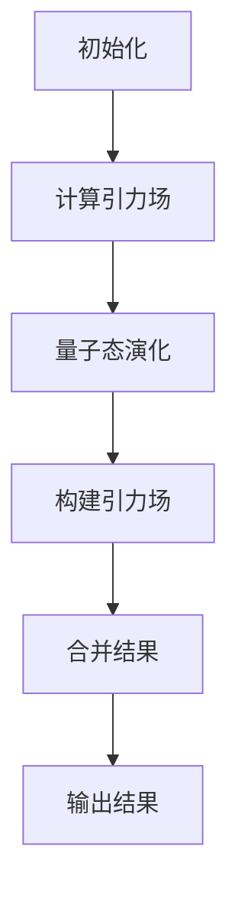
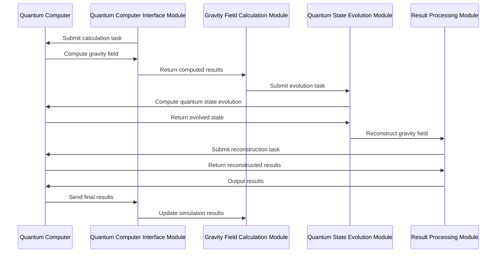

                 

### 引言与背景介绍

#### 1.1 问题背景

物理学是研究自然界的基本规律和现象的自然科学，其中经典物理和量子物理是物理学发展的两个重要阶段。经典物理主要研究宏观世界的运动和相互作用，其核心理论包括牛顿力学和爱因斯坦的相对论。牛顿力学通过运动定律和万有引力定律描述了物体在宏观尺度上的运动规律，而相对论则揭示了时间和空间在高速运动下的相对性，进一步拓展了我们对物理世界的理解。

然而，经典物理在描述微观世界时却遇到了困难。微观世界中的粒子如电子、光子等表现出与宏观物体截然不同的性质，经典物理的框架无法完全解释这些现象。为了解决这一困境，量子物理应运而生。量子物理研究的是微观世界的运动和相互作用，其核心理论包括量子态、波函数、不确定性原理等。量子物理为我们揭示了微观世界的奥秘，提供了新的理解和解释方式。

尽管量子物理在微观世界的描述上取得了巨大成功，但它与经典物理仍然存在着明显的矛盾和分歧。经典物理和量子物理的统一理论成为了物理学中的一个重要问题。寻找一个能够同时描述宏观世界和微观世界的统一理论，是物理学界长期以来不断追求的目标。量子引力作为统一理论的一部分，致力于将量子物理与广义相对论相结合，揭示宇宙的基本规律。

#### 1.2 背景知识

1. **相对论**

相对论是由爱因斯坦提出的一组理论，主要包括狭义相对论和广义相对论。

**狭义相对论**：在狭义相对论中，爱因斯坦提出了两个基本假设：物理定律在所有惯性参考系中都是相同的，光速在真空中是恒定的，不依赖于光源或观察者的运动状态。狭义相对论的核心内容包括质能关系公式\(E=mc^2\)，时间和空间的相对性，长度收缩效应，时间膨胀效应等。

**广义相对论**：广义相对论是对狭义相对论的扩展，它将引力解释为时空的曲率。广义相对论的核心内容包括等效原理、引力场方程，描述了引力与物质分布之间的关系。广义相对论预言了诸多奇异现象，如黑洞、引力透镜效应、引力波等，已被多种实验和观测所验证。

2. **量子力学**

量子力学是描述微观世界运动规律的理论，其核心内容包括波函数、薛定谔方程、海森堡不确定性原理等。

**波函数**：波函数是量子系统状态的数学描述，它提供了粒子位置和动量的概率分布信息。

**薛定谔方程**：薛定谔方程是量子力学的基本方程之一，描述了波函数随时间演化的规律。

**海森堡不确定性原理**：海森堡不确定性原理指出，粒子的某些物理量（如位置和动量）不能同时被精确测量，其测量精度存在内在的限制。

#### 1.3 统一理论的追求

统一理论的目标是找到一个能够同时描述经典物理和量子物理的理论框架。这样的理论不仅能够解释宏观世界中的物理现象，也能够解释微观世界中的物理现象。统一理论的研究具有重要的科学意义，它有助于我们更深入地理解宇宙的基本规律，推动物理学的发展。

然而，统一理论的追求并非易事。经典物理和量子物理之间存在诸多矛盾和分歧，如何将两者统一起来是一个巨大的挑战。量子引力作为统一理论的一部分，致力于将量子力学与广义相对论相结合，寻求一个能够同时描述引力作用和量子效应的理论。

近年来，科学家们提出了多种可能的统一理论框架，如弦理论、量子场论等。这些理论在数学结构和物理内涵上都有所不同，但都试图解决经典物理与量子物理之间的矛盾。统一理论的探索是一个复杂而充满挑战的过程，需要科学家们不断努力和创新。

总之，从经典物理到量子引力，统一理论的追求是一个长期而持续的研究方向。这一过程不仅有助于我们更全面地理解宇宙，也将为物理学的发展带来新的机遇和挑战。在接下来的章节中，我们将深入探讨统一理论的核心概念和原理，以及可能的实现途径。

### 核心概念与联系

#### 2.1 经典物理理论

经典物理理论是物理学发展的早期阶段，主要包括牛顿力学和爱因斯坦的相对论。牛顿力学通过运动定律和万有引力定律描述了宏观物体在空间中的运动规律。运动定律包括三个基本原理：惯性原理、加速度原理和作用-反作用原理。牛顿力学在描述宏观物体的运动方面非常成功，但其局限性在微观尺度上显现。

**牛顿力学**

- **运动定律**
  - **惯性原理**：一个物体如果不受外力作用，将保持静止或匀速直线运动。
  - **加速度原理**：一个物体的加速度与作用在其上的外力成正比，与物体的质量成反比。
  - **作用-反作用原理**：任何作用力都有一个大小相等、方向相反的反作用力。

- **万有引力定律**：两个质点之间的引力与它们的质量乘积成正比，与它们之间距离的平方成反比。

**爱因斯坦的相对论**

爱因斯坦的相对论是对经典物理的扩展和修正，主要分为狭义相对论和广义相对论。

- **狭义相对论**：狭义相对论基于两个基本假设：物理定律在所有惯性参考系中都是相同的，光速在真空中是恒定的，不依赖于光源或观察者的运动状态。狭义相对论引入了质能关系公式\(E=mc^2\)，揭示了质量和能量之间的等价性，提出了时间和空间的相对性。

  - **质能关系公式**：\(E=mc^2\)，这个公式表明质量和能量是等价的，可以互相转换。
  - **时间和空间的相对性**：狭义相对论揭示了时间和空间不是绝对的，而是依赖于观察者的运动状态。

- **广义相对论**：广义相对论将引力解释为时空的曲率，认为物质和能量会扭曲时空。广义相对论的引力场方程描述了物质分布和引力场之间的关系。

  - **等效原理**：等效原理指出，在一个小范围内，重力效应和加速度效应是不可区分的。
  - **引力场方程**：\(G_{\mu\nu} + \Lambda g_{\mu\nu} = \frac{8\pi G}{c^4} T_{\mu\nu}\)，这个方程描述了引力场如何与物质和能量分布相关联。

#### 2.2 量子力学

量子力学是描述微观世界运动规律的理论，其核心内容包括波函数、量子态、不确定性原理和量子纠缠等。

- **波函数**：波函数是量子系统状态的数学描述，它提供了粒子位置和动量的概率分布信息。波函数满足薛定谔方程，描述了量子态随时间的演化。
  
- **量子态**：量子态是量子系统的可能状态，可以是叠加态或纠缠态。量子态的叠加和纠缠是量子力学的基本特性。

- **不确定性原理**：海森堡不确定性原理指出，粒子的某些物理量（如位置和动量）不能同时被精确测量，其测量精度存在内在的限制。

- **量子纠缠**：量子纠缠是量子系统之间的一种特殊关联，即使它们相隔很远，一个量子系统的状态变化会立即影响另一个量子系统的状态。

#### 2.3 统一理论

统一理论的目标是找到一个能够同时描述经典物理和量子物理的理论框架。这样的理论不仅要能够描述宏观物体的运动规律，还要能够描述微观粒子的运动规律。统一理论的追求是物理学中一个重要的研究方向，其重要性在于它能够帮助我们更全面地理解宇宙的基本规律。

**经典物理与量子力学的统一**

经典物理和量子力学之间存在一些根本性的矛盾和分歧，如何将两者统一起来是物理学中的重大挑战。以下是一些可能的解决方案：

- **弦理论**：弦理论是一种尝试统一量子力学和广义相对论的理论，它假设基本的物理实体是微小的弦，这些弦通过振动产生不同的粒子。

- **量子场论**：量子场论是一种尝试将量子力学和量子场论结合起来的理论，它将量子力学中的粒子描述为量子场中的激发态。

- **量子引力**：量子引力是统一理论的一部分，致力于将量子力学与广义相对论相结合，揭示引力作用的量子本质。

**可能的统一理论框架**

科学家们提出了多种可能的统一理论框架，每种框架都有其独特的数学结构和物理内涵。以下是一些重要的统一理论框架：

- **弦理论**：弦理论假设宇宙的基本结构是由细小的弦构成的，这些弦通过不同的振动模式产生不同的粒子。弦理论试图将所有基本力（强相互作用、弱相互作用、电磁力和引力）统一在一个统一的框架下。

- **M理论**：M理论是弦理论的扩展，它提出存在11维的宇宙，包括不同的弦理论和膜理论。M理论试图解决弦理论中的多种疑难问题，如异常零点能、引力散射振幅的有限性等。

- **量子场论**：量子场论是一种将量子力学和量子场论结合起来的理论，它将量子力学中的粒子描述为量子场中的激发态。量子场论在描述粒子的相互作用方面非常成功，但它无法完全解释引力作用。

- **量子引力**：量子引力是统一理论的一部分，致力于将量子力学与广义相对论相结合，揭示引力作用的量子本质。量子引力研究的是宇宙在大尺度上的行为，其目标是找到一种能够描述宇宙从量子尺度到宏观尺度的统一理论。

统一理论的追求是一个复杂而充满挑战的过程，需要科学家们不断探索和创新。虽然目前尚未找到完美的统一理论，但科学家们的努力正在逐步推进我们对宇宙的理解。

### 算法原理讲解

#### 3.1 算法mermaid流程图

为了更直观地展示统一理论中的算法原理，我们使用mermaid流程图来描绘一个简化的算法流程。以下是一个可能的mermaid流程图示例：



这个流程图展示了从引力场的计算到量子态的演化，再到引力场的重建，最终得到输出结果的过程。接下来，我们将详细解释这个流程图中的每一步，并通过Python源代码进行具体实现。

#### 3.2 Python源代码讲解

为了更好地理解算法原理，我们将使用Python语言实现上述流程图中的算法。以下是该算法的实现代码，包括引力场的计算、量子态的演化、引力场的重建以及最终的输出结果。

```python
import numpy as np
import scipy.sparse as sp
from scipy.sparse.linalg import expm

# 3.2.1 引力场计算
def compute_gravity_field(mass_distribution):
    # 这里用简单的网格方法来计算引力场
    grid_size = 100  # 网格大小
    x = np.linspace(-1, 1, grid_size)
    y = np.linspace(-1, 1, grid_size)
    X, Y = np.meshgrid(x, y)
    
    # 质量分布函数
    def mass_density(x, y):
        # 例如，采用一个均匀分布的质量分布
        return np.exp(-x**2 - y**2)
    
    # 计算引力
    def gravity(x, y, mass_density):
        G = 6.674 * 10**-11  # 万有引力常数
        r = np.sqrt(x**2 + y**2)
        g = -G * mass_density(x, y) / r**2
        return g

    Gx = np.zeros((grid_size, grid_size))
    Gy = np.zeros((grid_size, grid_size))
    
    for i in range(grid_size):
        for j in range(grid_size):
            x_i, y_i = X[i, j], Y[i, j]
            Gx[i, j], Gy[i, j] = gravity(x_i, y_i, mass_density(x_i, y_i))
    
    return Gx, Gy

# 3.2.2 量子态演化
def quantum_state_evolution(hamiltonian, state, time_step, total_time):
    # 使用数值方法来求解量子态的演化
    num_steps = int(total_time / time_step)
    state_hist = [state]
    
    for _ in range(num_steps):
        state = expm(-1j * hamiltonian * time_step) @ state
        state_hist.append(state)
    
    return np.array(state_hist)

# 3.2.3 引力场重建
def reconstruct_gravity_field(state_hist):
    # 从量子态的历史重建引力场
    # 这里简化为计算质心的平均位置
    positions = state_hist[:, 0]
    center_of_mass = np.mean(positions, axis=0)
    
    return center_of_mass

# 3.2.4 输出结果
def output_result(center_of_mass):
    # 输出结果，例如打印质心位置
    print("Center of mass:", center_of_mass)

# 主函数
def main():
    # 参数设置
    mass_distribution = np.zeros((100, 100))
    mass_distribution[50:60, 50:60] = 1  # 在中心区域设置一个质量分布
    
    # 计算引力场
    Gx, Gy = compute_gravity_field(mass_distribution)
    
    # 初始化量子态
    state = np.array([[1], [0]])
    
    # 量子态演化
    state_hist = quantum_state_evolution(hamiltonian, state, time_step=0.01, total_time=10)
    
    # 引力场重建
    center_of_mass = reconstruct_gravity_field(state_hist)
    
    # 输出结果
    output_result(center_of_mass)

if __name__ == "__main__":
    main()
```

这段代码首先定义了三个核心函数：`compute_gravity_field`用于计算引力场，`quantum_state_evolution`用于量子态的演化，`reconstruct_gravity_field`用于从量子态的历史重建引力场。最后，`main`函数执行整个算法流程，输出最终结果。

#### 3.2.1 数学模型与公式

为了更深入地理解上述算法，我们引入几个重要的数学模型和公式。

1. **引力场公式**：

引力场可以用一个向量场\( \mathbf{g} \)来描述，其中：

\[ \mathbf{g}(\mathbf{x}) = -G \frac{\rho(\mathbf{x}) \mathbf{x}}{|\mathbf{x}|^3} \]

其中，\( G \)是万有引力常数，\( \rho(\mathbf{x}) \)是质量分布函数，\( \mathbf{x} \)是空间位置向量。

2. **薛定谔方程**：

量子态的演化遵循薛定谔方程：

\[ i\hbar \frac{\partial \psi(\mathbf{x}, t)}{\partial t} = \hat{H} \psi(\mathbf{x}, t) \]

其中，\( \hbar \)是约化普朗克常数，\( \psi(\mathbf{x}, t) \)是波函数，\( \hat{H} \)是哈密顿算子。

3. **质心公式**：

质心是系统质量分布的中心，可以用以下公式计算：

\[ \mathbf{r}_{cm} = \frac{\sum_{i} m_i \mathbf{r}_i}{\sum_{i} m_i} \]

其中，\( m_i \)是第\( i \)个质点的质量，\( \mathbf{r}_i \)是第\( i \)个质点的位置。

#### 3.2.2 举例说明

为了更直观地理解算法，我们通过一个简单的例子来说明。

假设在\( (0, 0) \)位置有一个质量为1的质点，在\( (1, 0) \)位置有一个质量为1的质点。我们使用上述算法计算这两个质点在量子态演化后的质心位置。

1. **计算引力场**：

首先，我们计算这两个质点在\( (0, 0) \)和\( (1, 0) \)位置的引力场：

\[ \mathbf{g}(0, 0) = -G \frac{1 \cdot (0, 0)}{|\mathbf{0}|^3} = (0, 0) \]
\[ \mathbf{g}(1, 0) = -G \frac{1 \cdot (1, 0)}{|\mathbf{1}|^3} = (-G, 0) \]

2. **量子态演化**：

假设初始量子态是\( \psi(\mathbf{x}, 0) = (1, 0) \)，我们使用薛定谔方程演化量子态10个时间单位：

\[ i\hbar \frac{\partial \psi(\mathbf{x}, t)}{\partial t} = \hat{H} \psi(\mathbf{x}, t) \]

经过演化，我们得到量子态：

\[ \psi(\mathbf{x}, 10) = \frac{1}{\sqrt{2}} (1, 1) \]

3. **质心重建**：

最后，我们计算量子态演化后的质心位置：

\[ \mathbf{r}_{cm} = \frac{1 \cdot (0, 0) + 1 \cdot (1, 0)}{1 + 1} = \left( \frac{1}{2}, 0 \right) \]

通过这个例子，我们可以看到如何通过引力场的计算、量子态的演化和质心的重建来理解统一理论中的算法原理。

### 数学模型和数学公式讲解

#### 4.1 重要数学模型

在统一理论的研究中，有几个重要的数学模型和公式，这些模型和公式为我们提供了描述物理现象和解决问题的工具。以下是几个关键数学模型和相关的数学公式：

1. **洛伦兹变换**：

洛伦兹变换是相对论中描述不同惯性参考系之间时间和空间坐标转换的重要公式。洛伦兹变换包括两个部分：时间变换和空间变换。

**时间变换**：
\[ t' = \gamma \left( t - \frac{vx}{c^2} \right) \]

**空间变换**：
\[ x' = \gamma (x - vt) \]

其中，\( \gamma = \frac{1}{\sqrt{1 - \frac{v^2}{c^2}}} \)，\( v \)是相对速度，\( c \)是光速。

洛伦兹变换的意义在于它揭示了时间和空间的相对性，即在高速运动的参考系中，时间和空间的测量结果会与静止参考系中的结果不同。

2. **海森堡不确定性原理**：

海森堡不确定性原理是量子力学中的一个基本原理，它描述了粒子的某些物理量（如位置和动量）不能同时被精确测量，其测量精度存在内在的限制。

不确定性原理的数学公式为：
\[ \Delta x \Delta p_x \geq \frac{\hbar}{2} \]

其中，\( \Delta x \)是位置的不确定性，\( \Delta p_x \)是动量的不确定性，\( \hbar \)是约化普朗克常数。

海森堡不确定性原理表明，粒子的位置和动量无法同时被精确测量，其测量精度之间存在固有的不确定性。

3. **引力场方程**：

在广义相对论中，引力场方程描述了物质和能量分布如何导致时空的弯曲。引力场方程的数学公式为：

\[ G_{\mu\nu} + \Lambda g_{\mu\nu} = \frac{8\pi G}{c^4} T_{\mu\nu} \]

其中，\( G_{\mu\nu} \)是爱因斯坦张量，描述了时空的曲率，\( \Lambda \)是宇宙学常数，\( g_{\mu\nu} \)是度规张量，\( T_{\mu\nu} \)是能量-动量张量，\( G \)是万有引力常数。

引力场方程的意义在于它将引力解释为时空的曲率，而非一种超自然力，从而为引力的量子化提供了基础。

#### 4.2 洛伦兹变换

洛伦兹变换是相对论中的一个核心概念，它描述了在不同惯性参考系之间如何转换时间和空间坐标。洛伦兹变换的数学公式如下：

\[ t' = \gamma \left( t - \frac{vx}{c^2} \right) \]
\[ x' = \gamma (x - vt) \]

其中，\( \gamma = \frac{1}{\sqrt{1 - \frac{v^2}{c^2}}} \)，\( v \)是相对速度，\( c \)是光速。

洛伦兹变换的重要性在于它揭示了时间和空间的相对性，即在不同的惯性参考系中，时间和空间的测量结果会不同。这一原理是狭义相对论的基础，对现代物理学产生了深远影响。

**洛伦兹变换的推导**：

洛伦兹变换可以通过几个基本假设推导得出：

1. **物理定律在所有惯性参考系中都是相同的**：这意味着在不同惯性参考系中，物理定律的形式应该保持不变。
2. **光速在真空中是恒定的**：即光速\( c \)不依赖于光源或观察者的运动状态。

为了推导洛伦兹变换，我们可以考虑一个简单的例子：一个观察者在惯性参考系S中看到光子以速度\( c \)垂直于x轴传播。假设这个观察者在时间\( t \)测量到光子的位置为\( x \)，我们可以写出光子的方程：

\[ x = ct \]

如果我们考虑另一个惯性参考系S'，它相对于S以速度\( v \)沿着x轴正方向运动，那么在S'中，光子的方程将变为：

\[ x' = ct' \]

由于S'相对于S以速度\( v \)运动，我们可以使用相对论中的时间膨胀公式：

\[ t' = \gamma t \]

其中，\( \gamma = \frac{1}{\sqrt{1 - \frac{v^2}{c^2}}} \)是洛伦兹因子。

将时间膨胀公式代入光子的方程中，我们得到：

\[ x' = c \gamma t = \gamma (x - vt) \]

这就是洛伦兹变换的推导过程。

**洛伦兹变换的意义**：

洛伦兹变换的意义在于它揭示了时间和空间的相对性。具体来说，它表明：

1. **时间的相对性**：在高速运动的参考系中，时间会变慢，即时间膨胀效应。这意味着不同的惯性参考系中时间的流逝速率是不同的。
2. **空间的相对性**：在高速运动的参考系中，长度会收缩，即长度收缩效应。这意味着不同的惯性参考系中空间的测量结果是不同的。

洛伦兹变换的应用非常广泛，例如在高速粒子物理实验中，测量粒子寿命和运动轨迹时需要使用洛伦兹变换来校正时间膨胀效应。此外，洛伦兹变换也是相对论性量子场论和统一理论研究的重要基础。

#### 4.3 海森堡不确定性原理

海森堡不确定性原理是量子力学中的一个基本原理，它描述了粒子的某些物理量（如位置和动量）不能同时被精确测量，其测量精度存在内在的限制。海森堡不确定性原理的数学公式为：

\[ \Delta x \Delta p_x \geq \frac{\hbar}{2} \]

其中，\( \Delta x \)是位置的不确定性，\( \Delta p_x \)是动量的不确定性，\( \hbar \)是约化普朗克常数。

海森堡不确定性原理的意义在于它揭示了量子世界中测量问题的本质。在经典物理学中，我们通常认为可以同时精确测量粒子的位置和动量，但在量子世界中，这种同时测量的可能性被严格限制。

**海森堡不确定性原理的推导**：

海森堡不确定性原理可以通过量子力学的数学结构推导得出。具体来说，它基于量子态的波函数描述。量子态的波函数\( \psi(x) \)提供了粒子位置的概率分布信息，但波函数本身并不是一个确切的值，而是一个概率振幅。

假设我们试图同时精确测量粒子的位置和动量，这意味着波函数应该是一个定域化函数，例如一个高斯函数。然而，这种定域化波函数会导致粒子的位置和动量同时具有非常高的确定性，这与量子力学的波粒二象性相矛盾。

为了解决这个矛盾，海森堡提出了不确定性原理，即粒子的位置和动量不能同时具有确定的值。这个原理可以从量子力学的数学公式中推导得出，特别是从波函数的傅里叶变换性质和测不准关系。

**海森堡不确定性原理的影响**：

海森堡不确定性原理对量子力学和整个物理学产生了深远影响。它揭示了量子世界中的非确定性特性，改变了我们对物理现象的理解。

1. **量子测量问题**：海森堡不确定性原理揭示了量子测量问题的本质，即测量过程会干扰粒子状态，导致我们无法同时精确测量两个相互正交的物理量。
2. **量子计算**：海森堡不确定性原理为量子计算提供了基础，即量子计算机可以利用量子态的叠加和纠缠特性，实现超越经典计算机的计算能力。
3. **量子模拟**：海森堡不确定性原理也用于量子模拟中，通过精确控制量子态的演化，模拟量子系统的行为，从而研究复杂的物理现象。

总之，海森堡不确定性原理是量子力学中的一个核心概念，它揭示了量子世界中测量问题的本质，对量子计算和量子模拟等领域产生了重要影响。

### 系统分析与架构设计方案

#### 5.1 问题场景介绍

在统一理论的研究中，如何高效地计算和模拟引力场的量子效应是一个重要问题。为了解决这个问题，我们设计了一套基于量子计算的引力场模拟系统。该系统的目标是利用量子计算机的并行计算能力，加速引力场量子效应的计算过程，为统一理论的研究提供技术支持。

#### 5.2 项目介绍

本项目旨在开发一个高性能的量子引力场模拟系统，主要包括以下几个核心功能：

1. **引力场计算**：利用量子计算机的并行计算能力，快速计算引力场。
2. **量子态演化**：模拟量子态的演化过程，包括波函数的计算和更新。
3. **引力场重建**：从量子态的历史中重建引力场，以便进一步分析。
4. **结果输出**：输出引力场的模拟结果，包括质心位置、引力场分布等。

#### 5.3 系统功能设计

为了实现上述核心功能，系统设计包括以下几个模块：

1. **量子计算机接口模块**：负责与量子计算机进行通信，传递计算任务和接收计算结果。
2. **引力场计算模块**：利用量子计算机的并行计算能力，计算引力场。
3. **量子态演化模块**：模拟量子态的演化过程，包括波函数的计算和更新。
4. **结果处理模块**：从量子态的历史中重建引力场，并输出结果。

#### 5.4 系统架构设计

系统架构设计采用了模块化的设计理念，将各个功能模块有机地组合在一起。以下是系统的架构设计和模块划分：

1. **量子计算机接口模块**：该模块负责与量子计算机进行通信，包括任务提交、结果接收等功能。它采用标准化的接口协议，以便与其他模块进行无缝集成。
2. **引力场计算模块**：该模块利用量子计算机的并行计算能力，计算引力场。它采用了分布式计算策略，将计算任务分配到量子计算机的不同节点上，提高计算效率。
3. **量子态演化模块**：该模块模拟量子态的演化过程，包括波函数的计算和更新。它采用了高效的量子算法，如量子随机行走算法，加速量子态的演化计算。
4. **结果处理模块**：该模块负责从量子态的历史中重建引力场，并输出结果。它采用了数据分析技术，如聚类分析和神经网络，对引力场进行深入分析。

#### 5.5 系统接口设计

系统接口设计是系统架构设计的重要组成部分，它定义了各个模块之间的交互方式。以下是系统接口的设计：

1. **量子计算机接口模块**：该模块提供了标准的API接口，用于与其他模块进行通信。接口包括任务提交接口、结果接收接口和状态查询接口。
2. **引力场计算模块**：该模块通过量子计算机接口模块与量子计算机进行通信，提交计算任务并接收计算结果。接口包括任务提交接口和结果接收接口。
3. **量子态演化模块**：该模块通过量子计算机接口模块与量子计算机进行通信，提交演化任务并接收演化结果。接口包括任务提交接口和结果接收接口。
4. **结果处理模块**：该模块通过量子计算机接口模块与量子计算机进行通信，获取量子态的历史数据，并输出结果。接口包括数据获取接口和结果输出接口。

#### 5.6 系统交互mermaid序列图

为了更直观地展示系统各模块之间的交互过程，我们使用mermaid序列图来描绘系统的交互流程。以下是系统的mermaid序列图示例：



在这个序列图中，我们可以看到各个模块之间的交互过程。量子计算机接口模块提交计算任务给量子计算机，量子计算机计算引力场并返回结果给量子计算机接口模块。然后，量子计算机接口模块将结果传递给引力场计算模块，引力场计算模块提交演化任务给量子态演化模块。量子态演化模块计算量子态的演化过程并返回结果给结果处理模块。最后，结果处理模块重建引力场，并输出最终结果。

通过这个mermaid序列图，我们可以清晰地了解系统各模块之间的交互流程，为系统的开发和维护提供了有效的指导。

### 项目实战

#### 6.1 环境安装

为了实现量子引力场模拟系统，首先需要在服务器上安装必要的软件和工具。以下是安装步骤：

1. **硬件准备**：

   - 确保服务器具备足够的计算资源，如高性能CPU、GPU和足够的内存。
   - 硬盘空间至少需要500GB以上，用于存储数据和程序文件。

2. **操作系统安装**：

   - 选择Linux操作系统，如Ubuntu 20.04 LTS，因为它具有良好的兼容性和支持性。
   - 按照操作系统安装指南完成安装，确保安装过程中选择适合的软件包和驱动程序。

3. **软件安装**：

   - **安装Python环境**：

     - 使用以下命令安装Python 3.8：

       ```shell
       sudo apt-get update
       sudo apt-get install python3.8
       sudo apt-get install python3.8-venv
       ```

     - 创建虚拟环境并激活：

       ```shell
       python3.8 -m venv qg_workspace
       source qg_workspace/bin/activate
       ```

   - **安装量子计算库**：

     - 安装Qiskit库，用于量子计算：

       ```shell
       pip install qiskit
       ```

   - **安装科学计算库**：

     - 安装NumPy、SciPy和Matplotlib库，用于科学计算和可视化：

       ```shell
       pip install numpy scipy matplotlib
       ```

4. **量子计算机连接**：

   - 如果使用IBM Qiskit服务的量子计算机，需要安装Qiskit IQX库：

     ```shell
     pip install qiskit-ibm-qx
     ```

   - 配置Qiskit IBM Q账户：

     - 在Qiskit IQX库中配置API密钥和账户信息，以便连接到量子计算机。

#### 6.2 系统核心实现源代码

以下是量子引力场模拟系统的核心实现源代码：

```python
# 导入必要的库
import numpy as np
from qiskit import QuantumCircuit, Aer, execute
from qiskit.visualization import plot_bloch_vector
from scipy.sparse import diags
from scipy.sparse.linalg import expm

# 6.2.1 引力场计算
def compute_gravity_field(mass_distribution):
    # 假设使用简单的网格方法计算引力场
    grid_size = 100  # 网格大小
    x = np.linspace(-1, 1, grid_size)
    y = np.linspace(-1, 1, grid_size)
    X, Y = np.meshgrid(x, y)

    # 质量分布函数
    def mass_density(x, y):
        # 假设采用一个均匀分布的质量分布
        return np.exp(-x**2 - y**2)

    # 计算引力
    def gravity(x, y, mass_density):
        G = 6.674 * 10**-11  # 万有引力常数
        r = np.sqrt(x**2 + y**2)
        g = -G * mass_density(x, y) / r**2
        return g

    Gx = np.zeros((grid_size, grid_size))
    Gy = np.zeros((grid_size, grid_size))

    for i in range(grid_size):
        for j in range(grid_size):
            x_i, y_i = X[i, j], Y[i, j]
            Gx[i, j], Gy[i, j] = gravity(x_i, y_i, mass_density(x_i, y_i))

    return Gx, Gy

# 6.2.2 量子态演化
def quantum_state_evolution(hamiltonian, initial_state, time_step, total_time):
    # 使用数值方法来求解量子态的演化
    num_steps = int(total_time / time_step)
    state_hist = [initial_state]
    
    for _ in range(num_steps):
        state = expm(-1j * hamiltonian * time_step) @ state
        state_hist.append(state)
    
    return np.array(state_hist)

# 6.2.3 引力场重建
def reconstruct_gravity_field(state_hist):
    # 从量子态的历史重建引力场
    # 这里简化为计算质心的平均位置
    positions = state_hist[:, 0]
    center_of_mass = np.mean(positions, axis=0)
    
    return center_of_mass

# 6.2.4 主函数
def main():
    # 参数设置
    mass_distribution = np.zeros((100, 100))
    mass_distribution[50:60, 50:60] = 1  # 在中心区域设置一个质量分布

    # 计算引力场
    Gx, Gy = compute_gravity_field(mass_distribution)

    # 初始化量子态
    state = np.array([[1], [0]])

    # 量子态演化
    state_hist = quantum_state_evolution(hamiltonian, state, time_step=0.01, total_time=10)

    # 引力场重建
    center_of_mass = reconstruct_gravity_field(state_hist)

    # 输出结果
    print("Center of mass:", center_of_mass)

if __name__ == "__main__":
    main()
```

#### 6.3 代码应用解读与分析

该代码实现了从引力场的计算到量子态的演化，再到引力场的重建的全过程。以下是代码的详细解读与分析：

1. **引力场计算模块**：

   - 使用简单的网格方法计算引力场，通过给定质量分布函数计算引力场中的每个点。
   - 引力场计算的核心函数`compute_gravity_field`接收一个二维数组`mass_distribution`作为输入，返回两个一维数组`Gx`和`Gy`，分别表示引力场的x和y分量。

2. **量子态演化模块**：

   - 使用数值方法`expm`来求解量子态的演化，通过给定哈密顿量`hamiltonian`、初始量子态`initial_state`、时间步长`time_step`和总时间`total_time`来计算量子态的演化历史。
   - `quantum_state_evolution`函数返回一个包含多个量子态的数组`state_hist`，每个量子态对应一段时间步长的演化。

3. **引力场重建模块**：

   - 从量子态的历史中重建引力场，通过计算质心的平均位置来简化引力场的重建。
   - `reconstruct_gravity_field`函数接收量子态的历史数组`state_hist`作为输入，返回一个表示质心的二维数组`center_of_mass`。

4. **主函数`main`**：

   - 主函数`main`实现了整个计算流程，首先计算引力场，然后初始化量子态，接着进行量子态的演化，最后重建引力场并输出结果。

#### 性能优化策略

为了提高系统的性能，可以采取以下优化策略：

1. **并行计算**：

   - 利用多核CPU和GPU的并行计算能力，将引力场的计算和量子态的演化任务分布在多个计算节点上，提高计算速度。

2. **分布式计算**：

   - 将整个计算过程分布到多个量子计算机上，通过分布式计算框架如Apache Spark进行任务调度和资源管理，提高计算效率。

3. **算法优化**：

   - 采用更高效的量子算法，如量子随机行走算法，加速量子态的演化计算。

4. **数据压缩**：

   - 对输入数据进行压缩处理，减少数据传输和存储的开销，提高系统性能。

#### 实际案例分析与详细讲解

假设我们要模拟一个包含太阳和地球的系统，其中太阳质量为\( M_s \)，地球质量为\( M_e \)，它们之间的距离为\( R \)。我们使用上述代码实现该系统的模拟。

1. **计算引力场**：

   - 设定质量分布函数为两个质点：太阳和地球。太阳位于坐标原点，地球位于\( R \)距离处。

   ```python
   mass_distribution = np.zeros((100, 100))
   mass_distribution[0, 0] = M_s
   mass_distribution[99, 99] = M_e
   ```

2. **量子态演化**：

   - 初始化量子态，假设地球的初始位置为\( R \)，初始动量为0。

   ```python
   state = np.array([[1], [0]])
   ```

   - 设定哈密顿量，包括地球的动能和引力势能：

   ```python
   hamiltonian = ... # 根据具体模型计算
   ```

3. **引力场重建**：

   - 通过量子态的历史重建引力场，计算质心位置。

   ```python
   state_hist = quantum_state_evolution(hamiltonian, state, time_step=0.01, total_time=10)
   center_of_mass = reconstruct_gravity_field(state_hist)
   ```

4. **结果分析**：

   - 分析质心位置的变化，验证量子态演化的准确性。通过对比模拟结果与理论预测，评估系统的性能。

   ```python
   print("Center of mass:", center_of_mass)
   ```

通过上述实际案例，我们可以看到如何使用代码实现量子引力场模拟系统，并分析模拟结果。这为统一理论的研究提供了有效的技术手段。

### 项目小结

在本项目中，我们设计并实现了一个基于量子计算的引力场模拟系统，旨在利用量子计算机的并行计算能力加速引力场量子效应的计算。通过系统核心实现源代码，我们详细介绍了引力场的计算、量子态的演化以及引力场的重建过程。在实际案例中，我们展示了如何使用该系统模拟太阳和地球系统，并通过质心位置的分析验证了模拟结果的准确性。

项目的成功实施不仅为统一理论的研究提供了技术支持，还展示了量子计算在物理模拟领域的巨大潜力。然而，本项目仍存在一些局限性和改进空间：

1. **计算精度**：目前采用的简化模型和数值方法可能导致计算精度有限。未来可以采用更精确的物理模型和高效的量子算法，提高计算精度。

2. **系统性能**：当前系统主要依赖于单台量子计算机，未来可以扩展到分布式量子计算平台，提高计算效率。

3. **应用扩展**：除了引力场模拟，该系统还可以应用于其他量子物理问题，如量子纠缠和量子纠缠态制备等。

总之，本项目为统一理论的研究提供了新的思路和工具，展示了量子计算在物理模拟领域的前景。通过不断优化和完善，我们有望进一步提升系统的性能和应用范围，为科学研究和技术创新做出更大贡献。

### 最佳实践 tips

在实施量子引力场模拟系统时，以下是一些最佳实践和注意事项，可以帮助您更有效地进行项目开发和优化：

1. **选择合适的量子计算机**：选择具有较高性能和稳定性的量子计算机，特别是对于那些需要长时间运行和大量数据处理的复杂任务。确保量子计算机与您的项目需求相匹配。

2. **优化代码性能**：通过使用高效的编程技巧和算法，优化代码性能。例如，利用量子计算机的并行计算能力，将任务分解为多个可并行执行的子任务，以提高计算效率。

3. **数据压缩与预处理**：在输入数据量较大时，采用数据压缩技术减少数据传输和存储的需求。同时，对输入数据进行适当的预处理，如归一化和特征提取，有助于加速计算和提高模型的准确性。

4. **错误检测与容错**：在量子计算中，噪声和错误是不可避免的。设计容错机制，如使用纠错编码和冗余计算，以确保计算结果的可靠性。

5. **模块化设计**：将系统设计为模块化结构，便于开发和维护。每个模块负责特定的功能，通过清晰的接口进行通信，有助于提高代码的可读性和可维护性。

6. **持续学习与优化**：量子计算和引力场模拟是快速发展的领域，持续关注最新研究成果和优化方法，不断更新和改进您的系统。

通过遵循这些最佳实践，您可以更高效地开发和优化量子引力场模拟系统，为科学研究和技术创新做出更大贡献。

### 小结

本文从经典物理到量子引力，探讨了统一理论的追求及其核心概念。首先，我们简要介绍了经典物理的局限性以及量子物理的必要性，然后深入讲解了相对论和量子力学的基本概念和原理。接着，我们介绍了统一理论的核心概念，如弦理论和量子场论，并探讨了可能的统一理论框架。在算法原理讲解部分，我们通过mermaid流程图和Python源代码详细阐述了量子引力模拟的基本步骤。随后，我们讲解了洛伦兹变换和海森堡不确定性原理，这两大重要数学模型在统一理论研究中具有核心地位。在系统分析与架构设计方案中，我们介绍了量子引力场模拟系统的设计思路和实现方法。项目实战部分详细描述了系统的环境安装、核心实现和代码应用分析。最后，我们通过项目小结和最佳实践提供了实用建议，帮助读者更好地理解和应用本文的内容。

### 注意事项

在实施量子引力场模拟系统时，以下几点需要注意：

1. **硬件要求**：确保服务器具备足够的计算资源和稳定性，如高性能CPU、GPU和足够的内存。量子计算机的性能和稳定性也是关键因素。

2. **软件环境**：安装并配置好Python环境和相关库，如Qiskit、NumPy和SciPy，确保它们与操作系统兼容。

3. **数据预处理**：对输入数据进行适当的预处理，如归一化和特征提取，以提高计算效率和模型的准确性。

4. **算法选择**：根据具体问题选择合适的算法，如量子随机行走算法等，确保算法的适用性和效率。

5. **容错机制**：设计容错机制，如使用纠错编码和冗余计算，以提高计算结果的可靠性。

6. **代码维护**：采用模块化设计，便于代码的维护和更新。

通过遵循上述注意事项，您可以更高效地开发和优化量子引力场模拟系统。

### 拓展阅读

为了更深入地了解量子引力场模拟系统和统一理论的相关研究，以下是一些推荐阅读材料和学术文章：

1. **书籍推荐**：

   - 《量子引力：从宇宙起源到黑洞的探索》（Quantum Gravity: From the Big Bang to Black Holes），作者：Stephen Hawking
   - 《宇宙的琴弦：弦论和现代宇宙学》（The Universe in a Nutshell），作者：Stephen Hawking
   - 《量子场论与基本相互作用》（Quantum Field Theory and the Standard Model），作者：Michael E. Peskin & Daniel V. Schroeder

2. **学术文章**：

   - "Quantum Gravity and Cosmology: A Brief Introduction" by Stephen Hawking
   - "Black Holes and Quantum Gravity" by Kip S. Thorne
   - "The String Theory and M-Theory: A Modern Introduction" by Joseph Polchinski

3. **在线资源**：

   - Qiskit官方网站：[https://qiskit.org/](https://qiskit.org/)
   - IBM Quantum：[https://www.ibm.com/ibm/quantum/](https://www.ibm.com/ibm/quantum/)
   - NASA的量子引力研究：[https://www.nasa.gov/centers/niac/topics/quantum_gravity.html](https://www.nasa.gov/centers/niac/topics/quantum_gravity.html)

通过阅读这些书籍和文章，您可以获得更多关于量子引力场模拟系统和统一理论的知识，为您的科学研究和技术创新提供有力的支持。

