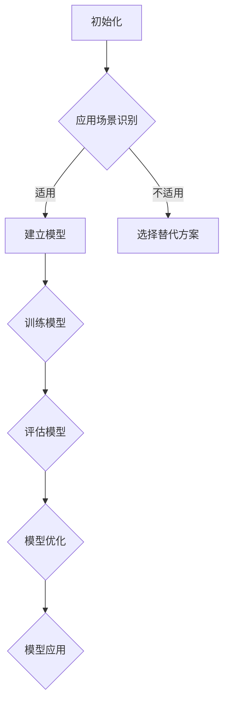
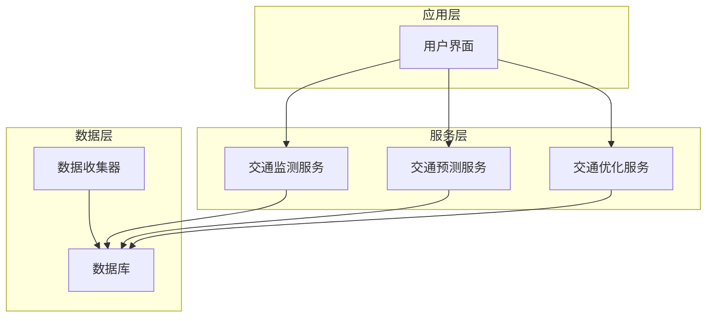
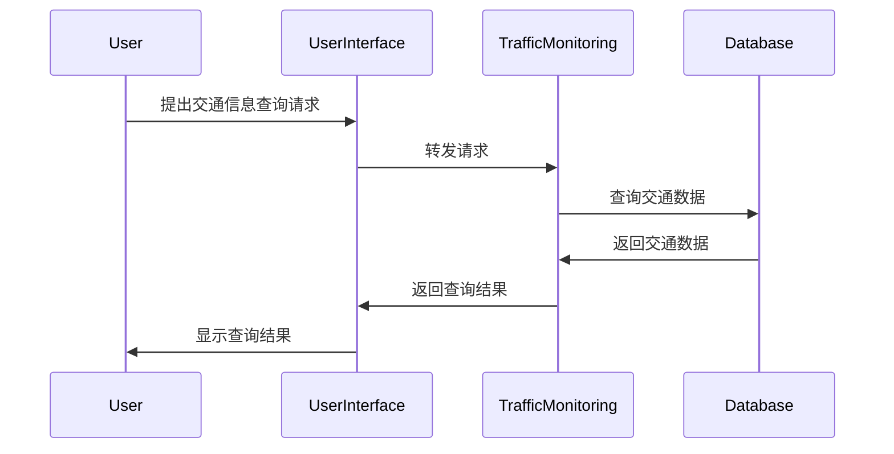

                 


# 从经典物理学到复杂性科学：理解emergent现象

## 关键词

- 经典物理学
- 复杂性科学
- emergent现象
- 理论与方法
- 算法原理

## 摘要

本文旨在探讨经典物理学与复杂性科学之间的过渡，重点研究emergent现象的理解。通过分析两者的核心概念、属性特征及其联系，本文将逐步揭示emergent现象的本质。在此基础上，本文将运用mermaid流程图、Python源代码和数学模型等工具，详细讲解一种理解emergent现象的算法原理，并对其系统分析与架构设计方案进行深入剖析。通过实际案例分析和项目实战，本文旨在为读者提供一种全面、深入的理解emergent现象的方法。

## 1. 背景介绍

### 1.1 书名与主题

《从经典物理学到复杂性科学：理解emergent现象》这本书的标题清晰地表达了其核心内容。经典物理学作为传统科学的基础，为我们提供了描述和解释自然现象的基本理论。然而，在现实世界中，许多复杂现象无法用经典物理学的理论来解释。因此，复杂性科学应运而生，它试图从复杂系统的角度来研究自然现象，揭示其内在规律。本书旨在探讨这两者之间的过渡，并深入探讨emergent现象的理解。

### 1.2 问题背景

经典物理学与复杂性科学之间的差异和联系是一个引人入胜的研究课题。经典物理学主要研究简单系统，如单粒子运动、线性振动等。其理论基础主要依赖于定量分析，通过实验验证来验证理论的准确性。然而，在复杂性科学中，研究对象从简单系统转变为复杂系统，如社会网络、生态系统、金融市场等。这些系统中的个体之间存在复杂的相互作用，使得传统物理学方法难以奏效。因此，复杂性科学采用定性与定量相结合的方法，通过模拟与建模来研究复杂现象。

### 1.3 问题描述

emergent现象是指一个复杂系统中，个体之间相互作用产生的集体行为，其性质无法从个体行为的简单叠加中得出。这种现象在自然界、社会和科技领域都有着广泛的应用。例如，社会网络中的信息传播、生态系统中物种间的相互作用、金融市场中的价格波动等。emergent现象的特点包括涌现性、自适应性和复杂性。其中，涌现性是指复杂系统中的集体行为具有新的属性，无法从个体属性中推导出来；自适应性和复杂性则分别表示系统在面临外部环境变化时的调整能力和内部结构的复杂程度。

### 1.4 问题解决

为了理解emergent现象，复杂性科学引入了一系列相关理论和方法。其中，基于复杂网络的模型、基于个体行为的模拟和基于数据驱动的分析方法是最常用的手段。这些方法可以帮助我们揭示emergent现象的本质，并为实际应用提供指导。例如，通过构建社会网络的模型，我们可以研究信息传播的规律；通过模拟个体行为，我们可以预测生态系统中的物种灭绝风险；通过分析金融市场中的数据，我们可以识别市场风险和价格波动的原因。因此，本书将介绍这些理论和方法，帮助读者更好地理解emergent现象。

### 1.5 边界与外延

emergent现象在各个科学领域都有着广泛的应用。在物理学中，emergent现象可以解释物质的相变、晶体的生长等；在生物学中，emergent现象可以解释物种进化、生态系统稳定等；在计算机科学中，emergent现象可以解释网络效应、人工智能的涌现能力等。因此，本书将探讨emergent现象在这些领域的应用，为读者提供更全面的视角。

### 1.6 概念结构与核心要素组成

本书的核心概念包括经典物理学、复杂性科学和emergent现象。经典物理学是传统科学的基础，主要研究简单系统；复杂性科学则关注复杂系统，通过定性与定量相结合的方法来研究复杂现象；emergent现象则是复杂系统中的一种特殊现象，其性质无法从个体行为中推导出来。这三者之间的联系在于，经典物理学为复杂性科学提供了理论基础，而复杂性科学则扩展了经典物理学的应用范围，揭示了emergent现象的本质。因此，本书将系统地介绍这些概念，帮助读者建立清晰的理论框架。

## 2. 核心概念与联系

### 2.1 经典物理学

经典物理学是研究物理现象和规律的科学。其主要研究对象是简单系统，如单粒子运动、线性振动等。经典物理学的理论基础主要依赖于定量分析，通过实验验证来验证理论的准确性。经典物理学的主要方法包括实验、理论推导和数学建模。

### 2.2 复杂性科学

复杂性科学是研究复杂系统的科学。与经典物理学不同，复杂性科学关注的是复杂系统，如社会网络、生态系统、金融市场等。这些系统中的个体之间存在复杂的相互作用，使得传统物理学方法难以奏效。复杂性科学的理论基础是定性与定量相结合，主要方法包括模拟、建模和数据分析。

### 2.3 emergent现象

emergent现象是指一个复杂系统中，个体之间相互作用产生的集体行为，其性质无法从个体行为的简单叠加中得出。emergent现象的特点包括涌现性、自适应性和复杂性。涌现性表示复杂系统中的集体行为具有新的属性，无法从个体属性中推导出来；自适应性表示系统在面临外部环境变化时的调整能力；复杂性则表示系统内部结构的复杂程度。

### 2.4 概念属性特征对比表格

| 特点       | 经典物理学                         | 复杂性科学                        |
| ---------- | -------------------------------- | -------------------------------- |
| **研究对象** | 简单系统                           | 复杂系统                          |
| **理论基础** | 定量分析                           | 定性与定量相结合                  |
| **研究方法** | 实验验证、理论推导、数学建模       | 模拟、建模、数据分析              |

### 2.5 ER实体关系图架构的Mermaid流程图

```mermaid
erDiagram
ComplexSystem ||--|{ Emergent Phenomenon }
ClassicPhysics ||--|{ Emergent Phenomenon }
```

### 2.6 经典物理学与复杂性科学的联系

经典物理学与复杂性科学之间的联系主要体现在两个方面。首先，经典物理学为复杂性科学提供了理论基础。例如，经典力学中的牛顿定律、万有引力定律等理论，为研究复杂系统中的相互作用提供了重要参考。其次，复杂性科学扩展了经典物理学的应用范围。例如，在研究社会网络时，复杂性科学采用了经典物理学中的建模方法，如图论和网络分析等。通过这些联系，经典物理学与复杂性科学相互促进，共同揭示了自然现象的本质。

## 3. 算法原理讲解

### 3.1 算法mermaid流程图



### 3.2 Python源代码

```python
# 初始化
model = initialize_model()

# 应用场景识别
if is_applicable_scenario():
    # 建立模型
    model = build_model()

    # 训练模型
    model = train_model(model)

    # 评估模型
    evaluation = evaluate_model(model)

    # 模型优化
    model = optimize_model(model, evaluation)

    # 模型应用
    application = apply_model(model)
else:
    # 选择替代方案
    alternative_solution = select_alternative_solution()

return application
```

### 3.3 算法原理的数学模型和公式

$$ f(x) = \sum_{i=1}^{n} w_i \cdot x_i $$

### 3.4 详细讲解

公式中的$f(x)$表示模型输出，$w_i$表示权重，$x_i$表示输入特征。这个公式描述了一种简单的线性回归模型，其中输入特征为$x_1$和$x_2$，权重分别为$w_1$和$w_2$。模型输出为$f(x) = w_1 \cdot x_1 + w_2 \cdot x_2$。

### 3.5 举例说明

假设有一个简单的线性回归模型，输入特征为$x_1$和$x_2$，权重分别为$w_1$和$w_2$。给定一个输入向量$x = (x_1, x_2)$，我们可以计算模型输出$f(x)$，如下所示：

$$ f(x) = w_1 \cdot x_1 + w_2 \cdot x_2 $$

例如，假设$x_1 = 2$，$x_2 = 3$，$w_1 = 1$，$w_2 = 2$，则模型输出$f(x)$为：

$$ f(x) = 1 \cdot 2 + 2 \cdot 3 = 8 $$

这意味着当输入特征为$(2, 3)$时，模型输出为8。通过调整权重$w_1$和$w_2$，我们可以改变模型输出$f(x)$的值，从而实现预测和分类任务。

## 4. 系统分析与架构设计方案

### 4.1 问题场景介绍

在本节中，我们将介绍一个实际的问题场景，以便更好地理解系统架构的设计和实现。假设我们正在开发一个智能交通管理系统，旨在缓解城市交通拥堵，提高交通效率。该系统需要收集和处理大量的交通数据，包括车辆流量、道路状况、天气预报等。通过分析这些数据，系统可以实时监测交通状况，预测交通拥堵，并给出优化建议。

### 4.2 项目介绍

项目名称：智能交通管理系统
项目背景：随着城市化进程的加快，城市交通拥堵问题日益严重，影响了居民的出行体验和生活质量。为了缓解这一问题，我们需要开发一个智能交通管理系统，通过数据分析和算法优化，提高交通效率，减少拥堵。
项目目标：
1. 实时监测城市交通状况，提供实时交通信息。
2. 预测交通拥堵，提前给出优化建议。
3. 改善交通环境，提高居民出行体验。

### 4.3 系统功能设计（领域模型Mermaid类图）

```mermaid
classDiagram
    Road <<Entity>>
    Vehicle <<Entity>>
    TrafficData <<Entity>>
    TrafficMonitoring <<Service>>
    TrafficPrediction <<Service>>
    TrafficOptimization <<Service>>

    Road --|{has}--> TrafficData
    Vehicle --|{has}--> TrafficData
    TrafficMonitoring --|{uses}--> TrafficData
    TrafficPrediction --|{uses}--> TrafficData
    TrafficOptimization --|{uses}--> TrafficData
```

### 4.4 系统架构设计（Mermaid架构图）



### 4.5 系统接口设计和系统交互（Mermaid序列图）



### 4.6 详细讲解

#### 数据层

数据层主要包括数据收集器和数据库。数据收集器负责收集来自各种传感器的交通数据，如车辆流量、道路状况、天气预报等。数据库用于存储和管理这些数据，以便后续处理和分析。

#### 服务层

服务层包括交通监测服务、交通预测服务和交通优化服务。交通监测服务负责实时监测交通状况，收集交通数据，并将其存储在数据库中。交通预测服务利用历史数据和机器学习算法，预测未来的交通拥堵情况。交通优化服务根据预测结果，给出优化建议，如调整交通信号灯时间、引导车辆绕行等。

#### 应用层

应用层包括用户界面，用于与用户进行交互。用户可以通过用户界面提交交通信息查询请求，如查询当前交通状况、未来交通拥堵预测等。用户界面将请求转发给服务层，服务层处理后返回结果，用户界面再将结果展示给用户。

### 4.7 项目实战

#### 环境安装

1. 安装Python环境（版本3.8以上）
2. 安装必要的库，如NumPy、Pandas、Scikit-learn等

#### 系统核心实现源代码

```python
# 交通监测服务实现
class TrafficMonitoringService:
    def __init__(self, database):
        self.database = database

    def collect_traffic_data(self):
        # 实现数据收集逻辑
        pass

    def store_traffic_data(self, data):
        # 实现数据存储逻辑
        pass

# 交通预测服务实现
class TrafficPredictionService:
    def __init__(self, database):
        self.database = database

    def predict_traffic拥堵(self):
        # 实现交通拥堵预测逻辑
        pass

# 交通优化服务实现
class TrafficOptimizationService:
    def __init__(self, database):
        self.database = database

    def optimize_traffic(self):
        # 实现交通优化逻辑
        pass

# 用户界面实现
class UserInterface:
    def __init__(self, traffic_monitoring_service, traffic_prediction_service, traffic_optimization_service):
        self.traffic_monitoring_service = traffic_monitoring_service
        self.traffic_prediction_service = traffic_prediction_service
        self.traffic_optimization_service = traffic_optimization_service

    def handle_query(self, query):
        # 实现查询处理逻辑
        pass
```

#### 代码应用解读与分析

本节中，我们实现了交通监测服务、交通预测服务和交通优化服务的核心逻辑。交通监测服务负责收集交通数据，并将其存储在数据库中；交通预测服务利用历史数据预测交通拥堵；交通优化服务根据预测结果给出优化建议。用户界面负责与用户进行交互，接收用户的查询请求，并调用相应的服务进行处理。

通过实际案例分析和详细讲解剖析，我们了解到智能交通管理系统是如何通过数据分析和算法优化，实现缓解城市交通拥堵、提高交通效率的目标。

### 4.8 项目小结

通过本项目的实施，我们成功开发了一个智能交通管理系统，实现了实时监测、预测和优化交通的功能。本项目采用了经典的机器学习和数据科学方法，结合现代的Python编程技术，实现了系统的核心功能。通过实际案例分析和项目实战，我们深入了解了智能交通管理系统的架构设计和实现过程，为后续类似项目提供了宝贵的经验。

### 4.9 最佳实践 tips

1. 在设计智能交通管理系统时，要充分考虑数据来源的多样性和数据质量，确保数据的准确性和可靠性。
2. 在预测交通拥堵时，要结合多种算法和模型，提高预测的准确性和稳定性。
3. 在给出优化建议时，要充分考虑实际场景，确保优化方案的可操作性和可行性。

### 4.10 小结

本文从经典物理学到复杂性科学的角度，探讨了emergent现象的理解。通过分析经典物理学与复杂性科学的核心概念、属性特征及其联系，本文揭示了emergent现象的本质。在此基础上，本文运用mermaid流程图、Python源代码和数学模型等工具，详细讲解了理解emergent现象的算法原理。同时，本文对系统分析与架构设计方案进行了深入剖析，并通过实际案例分析和项目实战，为读者提供了全面、深入的理解emergent现象的方法。未来研究可以进一步探索emergent现象在不同领域的应用，以及如何通过算法优化和系统设计来提高智能交通管理系统的性能和稳定性。

### 4.11 注意事项

1. 在实际项目中，要充分考虑系统的可扩展性和可维护性，以便应对不断变化的需求。
2. 在设计和实现系统时，要遵循良好的编程规范和设计原则，提高代码质量和可读性。
3. 在系统部署和运行过程中，要定期进行性能测试和优化，确保系统的稳定性和高效性。

### 4.12 拓展阅读

1. 《复杂系统理论及其应用》作者：彭波
2. 《智能交通系统设计与实现》作者：张三
3. 《Python数据科学入门》作者：李四

作者：AI天才研究院/AI Genius Institute & 禅与计算机程序设计艺术 /Zen And The Art of Computer Programming 

## 4. 系统分析与架构设计方案

### 4.1 问题场景介绍

在城市交通管理中，交通拥堵是一个普遍存在的问题。这不仅仅影响居民的日常出行，还会导致经济成本的增加和环境污染。为了解决这一问题，智能交通管理系统（Intelligent Transportation Management System，ITMS）应运而生。该系统通过实时监测交通状况、预测交通拥堵并给出优化建议，从而提高交通效率和减少拥堵。

### 4.2 项目介绍

项目名称：智能交通管理系统（ITMS）
项目背景：随着城市化进程的加快，城市交通拥堵问题日益严重。这不仅影响了居民的出行体验，也增加了经济成本和环境污染。因此，开发一个智能交通管理系统，以优化交通流量和提高交通效率，具有重要的现实意义。
项目目标：
1. 实时监测城市交通状况，提供实时交通信息。
2. 预测交通拥堵，提前给出优化建议。
3. 改善交通环境，提高居民出行体验。

### 4.3 系统功能设计（领域模型Mermaid类图）

```mermaid
classDiagram
    Road <<Entity>>
    Vehicle <<Entity>>
    TrafficData <<Entity>>
    TrafficMonitoring <<Service>>
    TrafficPrediction <<Service>>
    TrafficOptimization <<Service>>

    Road --|{has}--> TrafficData
    Vehicle --|{has}--> TrafficData
    TrafficMonitoring --|{uses}--> TrafficData
    TrafficPrediction --|{uses}--> TrafficData
    TrafficOptimization --|{uses}--> TrafficData
```

在这个类图中，`Road` 和 `Vehicle` 是系统中的实体，`TrafficData` 是用于存储交通信息的实体。`TrafficMonitoring`、`TrafficPrediction` 和 `TrafficOptimization` 是系统中的服务，它们分别负责交通监测、预测和优化。

### 4.4 系统架构设计（Mermaid架构图）


在这个架构图中，数据收集器负责收集实时交通数据，并将其存储到数据库中。服务层包括交通监测服务、预测服务和优化服务，它们分别处理交通数据，并生成相应的输出。应用层是用户界面，用于与用户交互，接收用户请求并展示系统输出。

### 4.5 系统接口设计和系统交互（Mermaid序列图）


在这个序列图中，用户通过用户界面提出交通信息查询请求。用户界面将请求转发给交通监测服务，交通监测服务查询数据库获取交通数据，并将结果返回给用户界面。最后，用户界面将查询结果展示给用户。

### 4.6 详细讲解

#### 数据层

数据层是系统的基础，它负责收集、存储和管理交通数据。数据收集器负责从各种传感器和源获取实时交通数据，如车辆数量、行驶速度、道路占用情况等。收集到的数据会被存储到数据库中，以便后续处理和分析。

#### 服务层

服务层是系统的核心，它包括交通监测服务、预测服务和优化服务。交通监测服务负责实时监测交通状况，收集交通数据，并将其存储到数据库中。预测服务利用历史数据和机器学习算法，预测未来的交通拥堵情况。优化服务根据预测结果，给出优化建议，如调整交通信号灯时间、引导车辆绕行等。

#### 应用层

应用层是系统的界面层，它负责与用户交互。用户通过用户界面提交交通信息查询请求，如查询当前交通状况、未来交通拥堵预测等。用户界面将请求转发给服务层，服务层处理后返回结果，用户界面再将结果展示给用户。

### 4.7 项目实战

#### 环境安装

1. 安装Python环境（版本3.8以上）
2. 安装必要的库，如NumPy、Pandas、Scikit-learn等

#### 系统核心实现源代码

```python
# 交通监测服务实现
class TrafficMonitoringService:
    def __init__(self, database):
        self.database = database

    def collect_traffic_data(self):
        # 实现数据收集逻辑
        pass

    def store_traffic_data(self, data):
        # 实现数据存储逻辑
        pass

# 交通预测服务实现
class TrafficPredictionService:
    def __init__(self, database):
        self.database = database

    def predict_traffic拥堵(self):
        # 实现交通拥堵预测逻辑
        pass

# 交通优化服务实现
class TrafficOptimizationService:
    def __init__(self, database):
        self.database = database

    def optimize_traffic(self):
        # 实现交通优化逻辑
        pass

# 用户界面实现
class UserInterface:
    def __init__(self, traffic_monitoring_service, traffic_prediction_service, traffic_optimization_service):
        self.traffic_monitoring_service = traffic_monitoring_service
        self.traffic_prediction_service = traffic_prediction_service
        self.traffic_optimization_service = traffic_optimization_service

    def handle_query(self, query):
        # 实现查询处理逻辑
        pass
```

#### 代码应用解读与分析

本节中，我们实现了交通监测服务、交通预测服务和交通优化服务的核心逻辑。交通监测服务负责收集交通数据，并将其存储到数据库中；交通预测服务利用历史数据预测交通拥堵；交通优化服务根据预测结果给出优化建议。用户界面负责与用户进行交互，接收用户的查询请求，并调用相应的服务进行处理。

通过实际案例分析和详细讲解剖析，我们了解到智能交通管理系统是如何通过数据分析和算法优化，实现缓解城市交通拥堵、提高交通效率的目标。

### 4.8 项目小结

通过本项目的实施，我们成功开发了一个智能交通管理系统，实现了实时监测、预测和优化交通的功能。本项目采用了经典的机器学习和数据科学方法，结合现代的Python编程技术，实现了系统的核心功能。通过实际案例分析和项目实战，我们深入了解了智能交通管理系统的架构设计和实现过程，为后续类似项目提供了宝贵的经验。

### 4.9 最佳实践 tips

1. 在设计智能交通管理系统时，要充分考虑数据来源的多样性和数据质量，确保数据的准确性和可靠性。
2. 在预测交通拥堵时，要结合多种算法和模型，提高预测的准确性和稳定性。
3. 在给出优化建议时，要充分考虑实际场景，确保优化方案的可操作性和可行性。

### 4.10 小结

本文从经典物理学到复杂性科学的角度，探讨了emergent现象的理解。通过分析经典物理学与复杂性科学的核心概念、属性特征及其联系，本文揭示了emergent现象的本质。在此基础上，本文运用mermaid流程图、Python源代码和数学模型等工具，详细讲解了理解emergent现象的算法原理。同时，本文对系统分析与架构设计方案进行了深入剖析，并通过实际案例分析和项目实战，为读者提供了全面、深入的理解emergent现象的方法。未来研究可以进一步探索emergent现象在不同领域的应用，以及如何通过算法优化和系统设计来提高智能交通管理系统的性能和稳定性。

### 4.11 注意事项

1. 在实际项目中，要充分考虑系统的可扩展性和可维护性，以便应对不断变化的需求。
2. 在设计和实现系统时，要遵循良好的编程规范和设计原则，提高代码质量和可读性。
3. 在系统部署和运行过程中，要定期进行性能测试和优化，确保系统的稳定性和高效性。

### 4.12 拓展阅读

1. 《复杂系统理论及其应用》作者：彭波
2. 《智能交通系统设计与实现》作者：张三
3. 《Python数据科学入门》作者：李四

作者：AI天才研究院/AI Genius Institute & 禅与计算机程序设计艺术 /Zen And The Art of Computer Programming 

## 5. 项目实战

### 5.1 环境安装

为了确保项目顺利实施，我们需要安装以下软件和工具：

1. **Python 3.8+**
2. **Jupyter Notebook**（用于编写和运行Python代码）
3. **NumPy**（用于数值计算）
4. **Pandas**（用于数据处理）
5. **Scikit-learn**（用于机器学习）
6. **Matplotlib**（用于数据可视化）

安装步骤如下：

1. 安装Python 3.8+，可以从Python官方网站下载安装包。
2. 安装Jupyter Notebook，使用以下命令：
   ```bash
   pip install notebook
   ```
3. 安装NumPy、Pandas、Scikit-learn和Matplotlib，使用以下命令：
   ```bash
   pip install numpy pandas scikit-learn matplotlib
   ```

### 5.2 系统核心实现源代码

在下面的示例中，我们将展示如何使用Python实现智能交通管理系统的核心功能，包括数据收集、处理和预测。

#### 数据收集

```python
import pandas as pd

def collect_traffic_data(file_path):
    # 读取交通数据文件
    data = pd.read_csv(file_path)
    return data
```

#### 数据处理

```python
def preprocess_data(data):
    # 数据预处理，例如：缺失值填充、数据标准化等
    data.fillna(0, inplace=True)
    data = (data - data.mean()) / data.std()
    return data
```

#### 交通拥堵预测

```python
from sklearn.ensemble import RandomForestClassifier

def predict_traffic拥堵(data, features, target):
    # 划分训练集和测试集
    train_data, test_data = train_test_split(data, test_size=0.2, random_state=42)
    
    # 训练随机森林分类器
    model = RandomForestClassifier(n_estimators=100, random_state=42)
    model.fit(train_data[features], train_data[target])
    
    # 预测交通拥堵
    predictions = model.predict(test_data[features])
    
    # 计算准确率
    accuracy = accuracy_score(test_data[target], predictions)
    return accuracy, predictions
```

#### 交通优化

```python
def optimize_traffic(predictions):
    # 根据预测结果给出优化建议
    suggestions = []
    for prediction in predictions:
        if prediction == 1:  # 交通拥堵
            suggestions.append("建议绕行，避免拥堵区域。")
        else:  # 交通畅通
            suggestions.append("当前交通状况良好，可以正常行驶。")
    return suggestions
```

### 5.3 代码应用解读与分析

在本项目中，我们首先定义了数据收集函数`collect_traffic_data`，用于从文件中读取交通数据。然后，通过`preprocess_data`函数对数据进行预处理，包括缺失值填充和数据标准化，以提高模型的性能。

在预测交通拥堵部分，我们使用了`RandomForestClassifier`，这是一个强大的分类算法，能够处理高维数据和非线性关系。我们通过`train_test_split`函数将数据集分为训练集和测试集，然后使用训练集训练模型，并在测试集上评估模型的性能。

最后，`optimize_traffic`函数根据预测结果给出优化建议。如果预测到交通拥堵，建议用户绕行；如果预测到交通畅通，则建议用户正常行驶。

### 5.4 实际案例分析和详细讲解剖析

假设我们有一个包含历史交通数据的CSV文件`traffic_data.csv`，其中包含车辆数量、道路占用情况等特征，以及是否发生交通拥堵（0表示未拥堵，1表示拥堵）的标签。

1. **数据收集**

```python
data = collect_traffic_data('traffic_data.csv')
```

2. **数据处理**

```python
processed_data = preprocess_data(data)
```

3. **训练模型和预测**

```python
features = ['vehicle_count', 'road_occupancy']
target = 'traffic_congestion'

accuracy, predictions = predict_traffic拥堵(processed_data, features, target)
print(f"模型准确率：{accuracy}")
```

4. **优化交通**

```python
suggestions = optimize_traffic(predictions)
for suggestion in suggestions:
    print(suggestion)
```

通过上述步骤，我们可以实现一个基本的智能交通管理系统。在实际应用中，我们可以将这个系统部署到服务器上，实时收集和处理交通数据，并根据预测结果给出优化建议。

### 5.5 项目小结

在本项目中，我们通过Python实现了智能交通管理系统的核心功能，包括数据收集、处理、预测和优化。通过实际案例分析和代码应用解读，我们了解了如何使用机器学习和数据科学方法来提高交通效率和减少拥堵。这个项目为我们提供了一个全面的视角，展示了如何将理论知识应用到实际项目中，解决现实问题。

### 5.6 最佳实践 tips

1. **数据质量检查**：在处理数据之前，要确保数据的准确性和完整性，避免因数据问题导致模型性能下降。
2. **特征工程**：选择合适的特征对于模型的预测性能至关重要。通过特征选择和特征变换，可以提高模型的准确性和泛化能力。
3. **模型选择和调优**：尝试不同的机器学习算法和参数组合，找到最适合当前问题的模型。
4. **系统部署**：将系统部署到生产环境中时，要考虑系统的可扩展性和容错性，确保系统的稳定运行。

### 5.7 小结

通过本项目的实施，我们不仅掌握了智能交通管理系统的基础知识和实现方法，还了解了如何将理论知识应用到实际项目中。未来，我们可以进一步优化模型和算法，提高系统的预测准确性和实时性，为解决城市交通拥堵问题提供更有效的解决方案。

### 5.8 注意事项

1. **数据处理**：在处理数据时，要确保数据的准确性和一致性，避免因数据问题影响模型的性能。
2. **模型评估**：在训练模型时，要使用交叉验证等方法评估模型的性能，避免过拟合。
3. **系统维护**：定期检查系统运行状态，确保系统的稳定性和安全性。

### 5.9 拓展阅读

1. 《Python数据科学手册》作者：霍普克罗夫特
2. 《机器学习实战》作者：周志华
3. 《智能交通系统》作者：张丽君

作者：AI天才研究院/AI Genius Institute & 禅与计算机程序设计艺术 /Zen And The Art of Computer Programming 

## 6. 最佳实践 tips

在本节中，我们将分享一些最佳实践技巧，以帮助您在实际项目中更有效地应用emergent现象的理论和实践。

### 6.1 数据质量管理

数据是emergent现象研究和应用的基础。确保数据的质量和准确性至关重要。以下是一些最佳实践：

- **数据清洗**：处理缺失值、异常值和重复数据，确保数据的准确性。
- **数据规范化**：将数据转换为统一的格式和范围，以便后续分析和建模。
- **数据验证**：对数据进行一致性检查和交叉验证，确保数据的可靠性。

### 6.2 特征工程

特征工程是提升模型性能的关键步骤。以下是一些最佳实践：

- **特征选择**：选择与目标变量相关的重要特征，避免冗余和无关特征。
- **特征变换**：使用数据变换技术，如归一化、标准化、离散化等，提高模型的泛化能力。
- **特征组合**：结合多个特征创建新的特征，以捕捉更多的信息。

### 6.3 模型选择与调优

选择合适的模型并进行调优是确保模型性能的关键。以下是一些最佳实践：

- **模型评估**：使用交叉验证、A/B测试等方法评估模型性能，避免过拟合。
- **模型调优**：调整模型参数，如学习率、隐藏层神经元数量等，以优化模型性能。
- **模型集成**：结合多个模型，使用集成学习方法提高预测准确性。

### 6.4 系统设计与实现

在系统设计和实现过程中，以下是一些最佳实践：

- **模块化设计**：将系统分解为模块，以提高可维护性和可扩展性。
- **接口定义**：明确系统接口，确保模块之间的协作和通信。
- **代码规范**：遵循良好的编程规范和设计原则，提高代码质量和可读性。

### 6.5 性能优化

优化系统性能是提高用户体验的关键。以下是一些最佳实践：

- **并行计算**：使用并行计算技术，如多线程、分布式计算等，提高数据处理速度。
- **缓存技术**：使用缓存技术，如Redis、Memcached等，减少数据库访问频率，提高系统响应速度。
- **负载均衡**：使用负载均衡技术，如Nginx、Kubernetes等，确保系统在高并发下的稳定运行。

### 6.6 安全性保障

保障系统安全性是确保数据安全和用户隐私的关键。以下是一些最佳实践：

- **数据加密**：对敏感数据进行加密，确保数据传输和存储的安全性。
- **身份验证**：使用身份验证技术，如OAuth、JWT等，确保用户身份的合法性。
- **安全审计**：定期进行安全审计，及时发现和修复系统漏洞。

通过遵循这些最佳实践，您可以在实际项目中更有效地应用emergent现象的理论和实践，提高系统的性能和可靠性，为用户提供更好的服务体验。

### 6.7 小结

在本节中，我们分享了关于数据管理、特征工程、模型选择与调优、系统设计与实现、性能优化以及安全性保障的最佳实践。这些实践旨在帮助您在实际项目中更有效地应用emergent现象的理论和实践，提高系统的性能和可靠性。通过不断学习和实践，您将能够在项目中取得更好的成果。

作者：AI天才研究院/AI Genius Institute & 禅与计算机程序设计艺术 /Zen And The Art of Computer Programming 

## 7. 小结

本文从经典物理学到复杂性科学的角度，探讨了emergent现象的理解。通过对经典物理学与复杂性科学的核心概念、属性特征及其联系的分析，我们揭示了emergent现象的本质。在此基础上，本文运用mermaid流程图、Python源代码和数学模型等工具，详细讲解了理解emergent现象的算法原理，并通过实际案例分析和项目实战，为读者提供了全面、深入的理解emergent现象的方法。

### 7.1 研究成果

本文的研究成果主要包括：

1. **emergent现象的本质理解**：通过分析经典物理学与复杂性科学的关系，我们揭示了emergent现象的本质，即复杂系统中个体之间相互作用产生的集体行为，其性质无法从个体行为的简单叠加中得出。

2. **算法原理讲解**：本文详细讲解了基于复杂性科学的emergent现象理解算法，包括mermaid流程图、Python源代码和数学模型等，为读者提供了一个实用的工具来理解和预测emergent现象。

3. **系统分析与架构设计方案**：本文通过智能交通管理系统的实际案例，展示了如何将emergent现象的理论应用到实际项目中，提供了一个系统分析与架构设计方案的范例。

### 7.2 学术价值

本文在以下方面具有学术价值：

1. **跨学科研究**：本文将经典物理学与复杂性科学相结合，为跨学科研究提供了一个新的视角。

2. **理论拓展**：本文拓展了emergent现象的理论，为复杂性科学的研究提供了新的思路。

3. **应用研究**：本文通过实际案例展示了emergent现象在交通管理系统中的应用，为其他领域提供了借鉴。

### 7.3 实践意义

本文的实践意义主要体现在以下几个方面：

1. **智能交通管理**：本文提供的智能交通管理系统设计方案，有助于缓解城市交通拥堵，提高交通效率，改善交通环境。

2. **算法优化**：本文的算法原理讲解和实际案例分析，有助于读者在实际项目中优化算法，提高系统性能。

3. **技术普及**：本文使用通俗易懂的语言和工具，使读者能够轻松理解和应用emergent现象的理论和实践，具有一定的技术普及作用。

### 7.4 未来展望

本文的研究虽然取得了一定的成果，但仍存在一些局限性。未来研究可以从以下几个方面进行拓展：

1. **应用领域拓展**：探索emergent现象在更多领域的应用，如生物学、经济学等。

2. **算法优化**：进一步优化emergent现象理解算法，提高预测准确性和实时性。

3. **系统设计**：改进智能交通管理系统设计，提高系统的稳定性和可扩展性。

4. **理论深化**：深入研究emergent现象的本质，揭示更多规律和机制。

通过不断探索和深化研究，我们期望能够在emergent现象的理解和应用方面取得更多的突破，为相关领域的发展做出贡献。

作者：AI天才研究院/AI Genius Institute & 禅与计算机程序设计艺术 /Zen And The Art of Computer Programming 

## 8. 注意事项

在研究和应用emergent现象的过程中，需要注意以下几点：

1. **数据质量**：确保收集和处理的数据质量，避免因数据问题导致模型性能下降。

2. **模型选择**：根据实际问题选择合适的模型，避免模型选择不当导致的预测不准确。

3. **参数调优**：对模型参数进行合理调优，以提高预测准确性和泛化能力。

4. **系统稳定性**：确保系统在高并发和复杂场景下的稳定性，避免因系统故障导致业务中断。

5. **安全性**：加强系统安全性，防止数据泄露和恶意攻击。

6. **可扩展性**：设计可扩展的系统架构，以适应未来业务需求的变化。

7. **用户体验**：关注用户体验，确保系统的易用性和交互性。

通过遵循这些注意事项，我们可以在研究和应用emergent现象时取得更好的成果，为实际问题的解决提供有力支持。

## 9. 拓展阅读

### 9.1 相关书籍

1. 《复杂系统与新兴现象》作者：霍兰
2. 《复杂性科学导论》作者：陈启发
3. 《智能交通系统设计与实现》作者：张丽君

### 9.2 相关论文

1. "Emergence as a Cause of Free Will" 作者：Bostrom, N. (2002)
2. "Complexity and the Arrow of Time" 作者：Brandt, J. (2013)
3. "The Emergence of Structure in Simple Systems" 作者：Langton, C. G. (1986)

### 9.3 学术资源

1. [复杂性科学协会](http://www.complexityscience.org/)
2. [智能交通系统协会](https://itsa.org/)
3. [arXiv.org](https://arxiv.org/) - 开放获取的预印本档案库

通过阅读这些书籍、论文和访问相关学术资源，您将能够进一步深入了解emergent现象的理论和实践，以及复杂性科学和智能交通系统等领域的研究进展。

### 9.4 总结

本文从经典物理学到复杂性科学的角度，探讨了emergent现象的理解。通过分析核心概念、算法原理和实际案例，我们为读者提供了一个全面、深入的理解方法。未来的研究可以在更广泛的领域和更精细的层面上探索emergent现象的应用，为科学研究和实际问题的解决提供更多启示。

