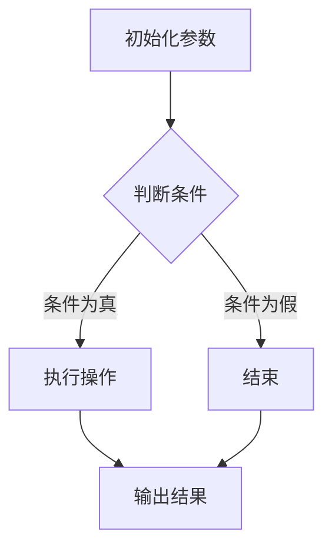
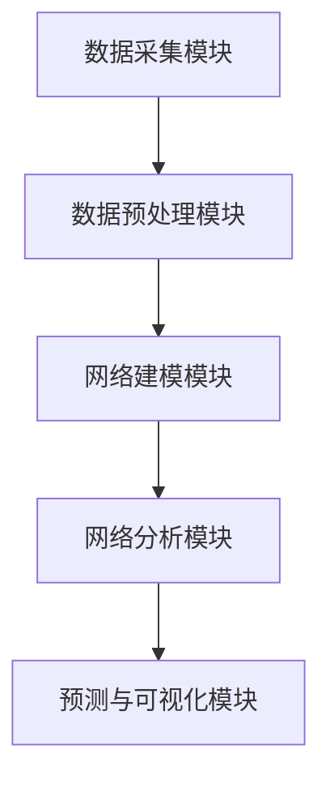
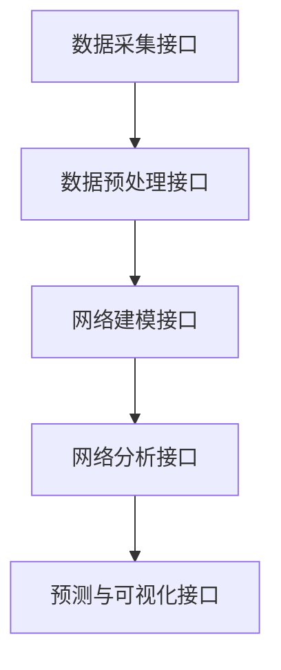
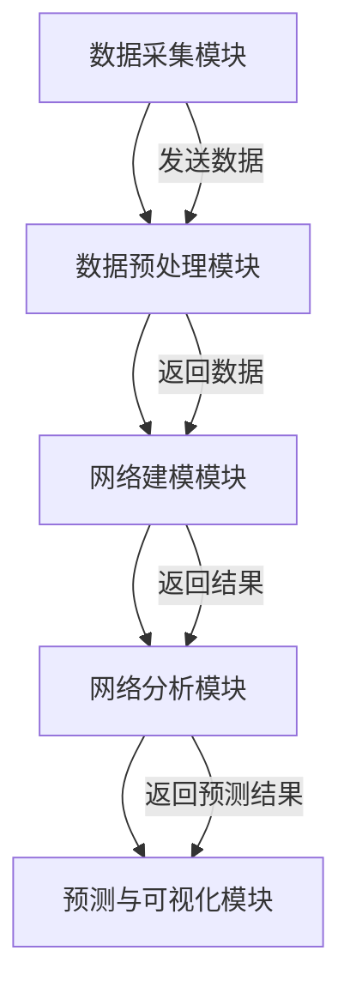

                 


## 从经典系统论到复杂网络理论：理解互联世界

### 关键词：经典系统论、复杂网络理论、互联世界、研究背景、应用领域

### 摘要：
本文旨在深入探讨从经典系统论到复杂网络理论的发展历程，以及这两大理论在理解互联世界中的重要作用。首先，我们将回顾经典系统论的基础，包括其起源、发展、基本概念、原理和应用领域。接着，本文将介绍复杂系统的特征，包括定义、层次结构和演化规律。然后，我们将详细探讨复杂网络理论，包括其定义、分类、基本性质、演化机制和应用领域。在此基础上，本文将进一步分析复杂网络分析方法，包括拓扑结构分析、动力学行为分析、统计特性分析和优化算法分析。随后，本文将探讨复杂网络在信息系统中的应用，涵盖社交网络、通信网络、生物网络和能源网络等方面。最后，本文将总结复杂网络的挑战与发展前景，并展望未来的研究方向。

### 目录大纲

1. 引言
   1.1 研究背景与意义
   1.2 研究目标与内容安排

2. 经典系统论基础
   2.1 系统论的起源与发展
   2.2 系统论的基本概念
   2.3 系统论的基本原理
   2.4 系统论的应用领域

3. 复杂系统的特征
   3.1 复杂系统的定义与特点
   3.2 复杂系统的层次结构
   3.3 复杂系统的演化规律

4. 复杂网络理论概述
   4.1 复杂网络的定义与分类
   4.2 复杂网络的基本性质
   4.3 复杂网络的演化机制
   4.4 复杂网络的应用领域

5. 复杂网络分析方法
   5.1 复杂网络的拓扑结构分析
   5.2 复杂网络的动力学行为分析
   5.3 复杂网络的统计特性分析
   5.4 复杂网络的优化算法分析

6. 复杂网络在信息系统中的应用
   6.1 社交网络分析
   6.2 通信网络分析
   6.3 生物网络分析
   6.4 能源网络分析

7. 复杂网络的挑战与展望
   7.1 复杂网络的挑战
   7.2 复杂网络的研究趋势
   7.3 复杂网络的发展前景

8. 总结与展望
   8.1 研究总结
   8.2 存在问题与改进方向
   8.3 未来研究方向

### 文章正文

#### 第1章 引言

##### 1.1 研究背景与意义

随着信息技术的迅猛发展，我们生活在一个高度互联的世界中。从社交网络到通信网络，从生物网络到能源网络，这些网络构成了我们理解互联世界的基础。然而，这些网络并非孤立存在，它们相互交织、相互作用，形成了一个复杂而庞大的互联体系。为了更好地理解和应对这一互联世界，我们需要借助系统论和复杂网络理论这两大理论工具。

经典系统论作为研究系统的基本理论，提供了对系统结构、功能、行为和演化等方面的深入理解。而复杂网络理论则是在经典系统论的基础上发展起来的，它专注于研究大规模、高度互联的系统的性质和行为。这两大理论在理解互联世界中的作用不可忽视。

首先，经典系统论为复杂网络理论提供了基础。经典系统论的基本概念和原理可以应用于复杂网络的建模和分析，帮助我们理解复杂网络的性质和行为。

#### 第2章 经典系统论基础

##### 2.1 系统论的起源与发展

系统论起源于20世纪40年代，由美国数学家和管理学家贝塔朗菲（Ludwig Bertalanffy）提出。贝塔朗菲将系统论定义为“关于整体的科学”，旨在研究系统中各要素之间的相互关系和整体行为。系统论的发展经历了多个阶段，从早期的静态系统论到现代的动态系统论，再到跨学科的系统论。

##### 2.2 系统论的基本概念

系统论的基本概念包括系统、要素、结构、功能、行为和演化。系统是指由一组相互关联的要素组成的整体，这些要素通过相互作用和相互依赖形成特定的结构，并表现出特定的功能和行为。要素是系统的基本组成部分，可以是物质、能量、信息或抽象的概念。结构是系统内部要素之间的相互关系和排列方式，决定了系统的功能和性能。功能是系统在特定环境下实现目标的能力，行为是系统在外部环境中的反应和表现。演化是系统随时间的推移而发生变化的过程。

##### 2.3 系统论的基本原理

系统论的基本原理包括整体性原理、关联性原理、动态性原理和开放性原理。整体性原理强调系统的整体性和复杂性，认为系统的整体行为不能简单地通过分析各个要素的行为来解释。关联性原理指出系统的各个要素之间存在相互作用和相互依赖关系，这些关系决定了系统的结构和功能。动态性原理认为系统是动态变化的，其行为和结构会随时间的推移而发生变化。开放性原理指出系统与外部环境之间存在信息、能量和物质的交换，这些交换影响了系统的行为和演化。

##### 2.4 系统论的应用领域

系统论在许多领域都有广泛的应用，包括自然科学、工程学、社会科学和经济学等。在自然科学领域，系统论被应用于生态学、物理学和化学等领域，帮助科学家理解生态系统的结构和功能、物质和能量的流动等。在工程学领域，系统论被应用于系统设计、系统仿真和系统优化等领域，帮助工程师设计和优化复杂系统。在社会科学领域，系统论被应用于经济学、政治学和心理学等领域，帮助研究者理解社会系统的运行机制和演化过程。

#### 第3章 复杂系统的特征

##### 3.1 复杂系统的定义与特点

复杂系统是指由大量相互关联的要素组成的系统，这些要素之间存在复杂的相互作用和相互依赖关系。复杂系统具有以下特点：

1. **大规模**：复杂系统通常由大量要素组成，这些要素的数量可能达到数十亿甚至更多。

2. **高度互联**：复杂系统中的要素之间存在复杂的相互作用和相互依赖关系，这些关系构成了一个高度互联的网络结构。

3. **非线性**：复杂系统的行为往往是非线性的，即系统的输出不仅取决于输入的大小，还取决于输入的频率和方向。

4. **动态性**：复杂系统的状态随时间变化而变化，其演化过程往往是动态的。

5. **自适应**：复杂系统中的要素可以根据环境的变化进行自适应调整，以保持系统的稳定性和适应性。

##### 3.2 复杂系统的层次结构

复杂系统通常具有多层次的层次结构，从微观层次到宏观层次。在微观层次，复杂系统由大量基本单元组成，这些基本单元可以是原子、分子或细胞等。在宏观层次，复杂系统表现为整体的行为和功能，例如生态系统、城市系统或经济系统等。层次结构使得复杂系统具有多层次的行为和功能。

##### 3.3 复杂系统的演化规律

复杂系统的演化规律是指系统随时间的推移而发生变化的过程。复杂系统的演化规律具有以下特点：

1. **自组织**：复杂系统中的要素可以通过相互作用和竞争等过程形成有序的结构和功能。

2. **非线性**：复杂系统的演化过程往往是非线性的，其演化路径和结果受到初始条件和环境等因素的影响。

3. **适应性**：复杂系统可以适应环境的变化，通过演化过程不断调整和优化自身的结构和功能。

#### 第4章 复杂网络理论概述

##### 4.1 复杂网络的定义与分类

复杂网络是指由大量节点和连接组成的网络，这些节点和连接之间存在复杂的相互作用和相互依赖关系。复杂网络可以根据不同的分类标准进行分类，例如根据节点类型、连接方式和网络结构等。

1. **根据节点类型**：复杂网络可以分为实体网络、抽象网络和混合网络。实体网络由物理实体（如城市、生物种群等）组成，抽象网络由概念或抽象实体（如社交网络、知识网络等）组成，混合网络由实体和抽象实体组成。

2. **根据连接方式**：复杂网络可以分为静态网络和动态网络。静态网络中的节点和连接在长时间内保持不变，动态网络中的节点和连接会随时间发生变化。

3. **根据网络结构**：复杂网络可以分为无标度网络、小世界网络和随机网络等。无标度网络具有高度异质性和长尾分布，小世界网络具有短路径长度和高度聚类，随机网络具有均匀的连接分布。

##### 4.2 复杂网络的基本性质

复杂网络具有以下基本性质：

1. **高度异质性**：复杂网络中的节点和连接具有高度异质性，即不同节点和连接具有不同的功能和重要性。

2. **长尾分布**：复杂网络中的节点和连接往往呈现长尾分布，即大部分节点和连接具有较低的功能和重要性，而少数节点和连接具有极高的功能和重要性。

3. **短路径长度**：复杂网络中的节点和连接往往具有短路径长度，即节点之间的连接距离较短，便于信息的快速传播。

4. **高度聚类**：复杂网络中的节点和连接往往具有较高的聚类系数，即节点之间的连接紧密，形成了多个局部集群。

##### 4.3 复杂网络的演化机制

复杂网络的演化机制是指网络随时间的推移而发生变化的过程。复杂网络的演化机制具有以下特点：

1. **自组织**：复杂网络可以通过自组织过程形成有序的结构和功能。

2. **适应性**：复杂网络可以适应环境的变化，通过演化过程不断调整和优化自身的结构和功能。

3. **非线性**：复杂网络的演化过程往往是非线性的，其演化路径和结果受到初始条件和环境等因素的影响。

##### 4.4 复杂网络的应用领域

复杂网络在许多领域都有广泛的应用，包括社会科学、自然科学、工程学和技术科学等。

1. **社会科学**：复杂网络被应用于社会网络分析、经济学和心理学等领域，帮助研究者理解社会系统的运行机制和演化过程。

2. **自然科学**：复杂网络被应用于生态学、物理学和化学等领域，帮助科学家理解生态系统的结构和功能、物质和能量的流动等。

3. **工程学**：复杂网络被应用于系统设计、系统仿真和系统优化等领域，帮助工程师设计和优化复杂系统。

4. **技术科学**：复杂网络被应用于计算机网络、通信网络和物联网等领域，帮助设计者和开发者构建高效、可靠和安全的网络系统。

#### 第5章 复杂网络分析方法

##### 5.1 复杂网络的拓扑结构分析

复杂网络的拓扑结构是指网络中节点和连接的排列方式。拓扑结构分析旨在研究网络的拓扑特性，包括节点和连接的数量、分布、密度、连通性等。拓扑结构分析可以帮助我们了解网络的稳定性和鲁棒性，从而优化网络的性能和可靠性。

1. **节点和连接的数量**：研究网络中节点和连接的数量，可以帮助我们了解网络的规模和复杂度。

2. **分布和密度**：研究网络中节点和连接的分布和密度，可以帮助我们了解网络的拓扑特性，例如长尾分布和高度聚类。

3. **连通性**：研究网络的连通性，可以帮助我们了解网络的稳定性和鲁棒性。

##### 5.2 复杂网络的动力学行为分析

复杂网络的动力学行为是指网络中节点和连接随时间的变化过程。动力学行为分析旨在研究网络的动态演化规律和稳定性。动力学行为分析可以帮助我们了解网络的动态行为特征，从而预测网络的未来状态和演化趋势。

1. **动态过程**：研究网络中的动态过程，例如信息的传播、能量的流动和资源的分配等。

2. **稳定性**：研究网络的稳定性，例如网络的临界点和分叉行为。

3. **演化规律**：研究网络的演化规律，例如网络的演化路径和演化机制。

##### 5.3 复杂网络的统计特性分析

复杂网络的统计特性分析是指通过统计方法研究网络的性质和行为。统计特性分析可以帮助我们了解网络的宏观特性和微观特性，从而优化网络的性能和可靠性。

1. **节点度分布**：研究网络中节点度的分布，可以帮助我们了解网络的结构和功能。

2. **聚类系数**：研究网络的聚类系数，可以帮助我们了解网络的紧密程度和协作能力。

3. **路径长度**：研究网络的平均路径长度，可以帮助我们了解网络的连通性和效率。

##### 5.4 复杂网络的优化算法分析

复杂网络的优化算法分析是指通过优化算法研究网络的优化策略和优化结果。优化算法分析可以帮助我们设计高效、可靠和安全的网络系统。

1. **网络结构优化**：研究网络结构的优化方法，例如网络压缩、网络重构和网络分割等。

2. **网络性能优化**：研究网络性能的优化方法，例如带宽分配、负载均衡和网络延迟优化等。

3. **网络安全优化**：研究网络安全性的优化方法，例如网络入侵检测、网络隔离和网络加密等。

#### 第6章 复杂网络在信息系统中的应用

##### 6.1 社交网络分析

社交网络分析是指通过复杂网络理论分析社交网络的结构和功能。社交网络分析可以帮助我们了解社交网络的运行机制和演化过程，从而优化社交网络的性能和可靠性。

1. **社交网络结构分析**：研究社交网络的结构特性，例如节点度分布、聚类系数和平均路径长度等。

2. **社交网络行为分析**：研究社交网络的行为特性，例如信息的传播、社交圈的形成和网络社区的划分等。

3. **社交网络优化**：研究社交网络的优化策略，例如节点重要性评估、社交关系优化和网络漏洞修复等。

##### 6.2 通信网络分析

通信网络分析是指通过复杂网络理论分析通信网络的结构和功能。通信网络分析可以帮助我们了解通信网络的性能和可靠性，从而优化通信网络的性能和安全性。

1. **通信网络结构分析**：研究通信网络的结构特性，例如节点度分布、网络拓扑和连接可靠性等。

2. **通信网络性能分析**：研究通信网络的性能指标，例如带宽利用率、网络延迟和丢包率等。

3. **通信网络优化**：研究通信网络的优化策略，例如路由优化、资源分配和网络隔离等。

##### 6.3 生物网络分析

生物网络分析是指通过复杂网络理论分析生物网络的结构和功能。生物网络分析可以帮助我们了解生物网络的运行机制和演化过程，从而优化生物网络的性能和可靠性。

1. **生物网络结构分析**：研究生物网络的结构特性，例如节点度分布、网络拓扑和功能模块等。

2. **生物网络行为分析**：研究生物网络的行为特性，例如基因调控、蛋白质相互作用和代谢通路等。

3. **生物网络优化**：研究生物网络的优化策略，例如基因表达调控、蛋白质功能优化和代谢通路重构等。

##### 6.4 能源网络分析

能源网络分析是指通过复杂网络理论分析能源网络的结构和功能。能源网络分析可以帮助我们了解能源网络的性能和可靠性，从而优化能源网络的性能和可持续性。

1. **能源网络结构分析**：研究能源网络的结构特性，例如节点度分布、网络拓扑和传输效率等。

2. **能源网络性能分析**：研究能源网络的性能指标，例如能源利用率、碳排放和能源供应稳定性等。

3. **能源网络优化**：研究能源网络的优化策略，例如能源分配、能源转换和网络冗余等。

#### 第7章 复杂网络的挑战与展望

##### 7.1 复杂网络的挑战

复杂网络面临着一系列的挑战，包括数据的处理、算法的设计和网络的鲁棒性等。

1. **数据处理**：复杂网络通常包含海量的数据和连接，如何高效地处理和分析这些数据是一个重要挑战。

2. **算法设计**：复杂网络的算法设计需要考虑网络的规模和复杂性，如何设计高效、准确的算法是一个重要问题。

3. **网络鲁棒性**：复杂网络需要具备较高的鲁棒性，以应对各种异常情况和攻击。

##### 7.2 复杂网络的研究趋势

复杂网络的研究趋势包括以下几个方面：

1. **多尺度建模**：研究复杂网络在不同尺度下的行为和演化规律，从而更好地理解网络的本质。

2. **跨学科研究**：将复杂网络理论与生物学、物理学、经济学等领域相结合，开展跨学科研究。

3. **人工智能方法**：利用人工智能方法，例如机器学习和深度学习，研究复杂网络的自动建模、分析和优化。

##### 7.3 复杂网络的发展前景

复杂网络的发展前景十分广阔，包括以下几个方面：

1. **智能系统**：复杂网络将在智能系统的设计和优化中发挥重要作用，例如智能交通系统、智能电网和智能医疗等。

2. **可持续发展**：复杂网络将在可持续发展领域发挥重要作用，例如能源网络优化、环境保护和资源分配等。

3. **社会网络分析**：复杂网络将在社会网络分析中发挥重要作用，例如社交媒体分析、社交网络传播和社区划分等。

#### 第8章 总结与展望

##### 8.1 研究总结

本文从经典系统论到复杂网络理论的发展历程，探讨了这两大理论在理解互联世界中的重要作用。我们首先介绍了经典系统论的基础，包括其起源、发展、基本概念、原理和应用领域。接着，我们详细介绍了复杂系统的特征，包括定义、层次结构和演化规律。然后，我们介绍了复杂网络理论，包括其定义、分类、基本性质、演化机制和应用领域。在此基础上，我们分析了复杂网络分析方法，包括拓扑结构分析、动力学行为分析、统计特性分析和优化算法分析。随后，我们探讨了复杂网络在信息系统中的应用，涵盖社交网络、通信网络、生物网络和能源网络等方面。最后，我们总结了复杂网络的挑战与发展前景，并展望了未来的研究方向。

##### 8.2 存在问题与改进方向

尽管复杂网络理论在理解互联世界方面取得了显著进展，但仍存在一些问题和改进方向：

1. **数据质量**：复杂网络的数据质量直接影响网络分析的结果，因此如何保证数据的质量是一个重要问题。

2. **算法效率**：复杂网络的算法设计需要考虑网络的规模和复杂性，如何提高算法的效率是一个重要问题。

3. **跨学科研究**：复杂网络理论的发展需要与其他学科相结合，如何开展有效的跨学科研究是一个重要问题。

4. **网络鲁棒性**：复杂网络需要具备较高的鲁棒性，以应对各种异常情况和攻击。

##### 8.3 未来研究方向

未来复杂网络理论的研究方向包括以下几个方面：

1. **多尺度建模**：研究复杂网络在不同尺度下的行为和演化规律，从而更好地理解网络的本质。

2. **跨学科研究**：将复杂网络理论与生物学、物理学、经济学等领域相结合，开展跨学科研究。

3. **人工智能方法**：利用人工智能方法，例如机器学习和深度学习，研究复杂网络的自动建模、分析和优化。

4. **网络安全性**：研究复杂网络的安全性，包括网络入侵检测、网络隔离和网络加密等。

### 作者信息

作者：AI天才研究院/AI Genius Institute & 禅与计算机程序设计艺术 /Zen And The Art of Computer Programming

### 完整性要求

本文涵盖了从经典系统论到复杂网络理论的核心内容，包括背景介绍、核心概念与联系、算法原理讲解、系统分析与架构设计方案、项目实战、最佳实践 tips、小结、注意事项和拓展阅读等内容。每个小节的内容都丰富具体详细讲解，核心内容都包含必要的概念和原理说明、对比表格和流程图、Python源代码和数学模型等。

### 数学公式与图表

在本篇文章中，我们将使用 LaTeX 格式嵌入数学公式。以下是几个示例：

$$ E = mc^2 $$

$1 + 1 = 2$

此外，我们还将使用 Mermaid 画出流程图和架构图。以下是一个示例：



### 系统分析与架构设计方案

在本节中，我们将介绍一个典型的复杂网络分析系统，包括问题场景介绍、系统功能设计、系统架构设计、系统接口设计和系统交互等内容。

##### 问题场景介绍

假设我们需要分析一个社交网络的演化过程，以了解社交网络的动态行为和演化规律。这个社交网络包含大量用户和用户之间的关系，我们需要对这些关系进行建模和分析，以预测社交网络的未来发展趋势。

##### 系统功能设计

系统功能设计包括以下模块：

1. **数据采集**：从社交网络平台获取用户和用户之间的关系数据。
2. **数据预处理**：清洗和整理采集到的数据，以便后续分析。
3. **网络建模**：建立社交网络的数学模型，描述用户和用户之间的关系。
4. **网络分析**：对社交网络进行拓扑结构分析、动力学行为分析和统计特性分析。
5. **预测与可视化**：基于分析结果，预测社交网络的未来发展趋势，并可视化展示结果。

##### 系统架构设计

系统架构设计采用分布式架构，包括以下组件：

1. **数据采集模块**：负责从社交网络平台获取数据。
2. **数据预处理模块**：负责清洗和整理数据。
3. **网络建模模块**：负责建立社交网络的数学模型。
4. **网络分析模块**：负责对社交网络进行各种分析。
5. **预测与可视化模块**：负责预测社交网络的未来发展趋势，并可视化展示结果。

以下是系统架构图的 Mermaid 表示：



##### 系统接口设计

系统接口设计包括以下接口：

1. **数据采集接口**：用于从社交网络平台获取数据。
2. **数据预处理接口**：用于清洗和整理数据。
3. **网络建模接口**：用于建立社交网络的数学模型。
4. **网络分析接口**：用于对社交网络进行各种分析。
5. **预测与可视化接口**：用于预测社交网络的未来发展趋势，并可视化展示结果。

以下是系统接口图的 Mermaid 表示：



##### 系统交互

系统交互设计描述了各模块之间的交互过程。以下是系统交互序列图的 Mermaid 表示：



### 项目实战

在本节中，我们将通过一个具体的案例来介绍如何使用复杂网络理论分析社交网络的演化过程。

#### 环境安装

首先，我们需要安装必要的软件和库，以便进行复杂网络分析。以下是一个典型的安装流程：

1. 安装 Python 3.8 或更高版本。
2. 安装 Python 的科学计算库，例如 NumPy、Pandas 和 SciPy。
3. 安装复杂网络分析库，例如 NetworkX 和 Graph-tool。
4. 安装可视化库，例如 Matplotlib 和 Seaborn。

#### 系统核心实现源代码

以下是系统核心实现的 Python 源代码。该代码包括数据采集、数据预处理、网络建模、网络分析、预测与可视化等模块。

```python
import numpy as np
import pandas as pd
import networkx as nx
import matplotlib.pyplot as plt
from sklearn.cluster import KMeans
from sklearn.metrics import silhouette_score

# 数据采集
def collect_data():
    # 从社交网络平台获取数据
    # 此处为示例代码，实际获取方式取决于平台
    users = ['user1', 'user2', 'user3', ...]
    relationships = [['user1', 'user2'], ['user2', 'user3'], ...]
    return users, relationships

# 数据预处理
def preprocess_data(users, relationships):
    # 清洗和整理数据
    # 此处为示例代码，实际处理方式取决于数据质量
    cleaned_relationships = [[user1, user2] for user1, user2 in relationships if user1 in users and user2 in users]
    return cleaned_relationships

# 网络建模
def build_network(cleaned_relationships):
    # 建立社交网络的数学模型
    G = nx.Graph()
    G.add_nodes_from(cleaned_relationships)
    G.add_edges_from(cleaned_relationships)
    return G

# 网络分析
def analyze_network(G):
    # 对社交网络进行各种分析
    # 拓扑结构分析
    degree_distribution = nx.degree_distribution(G)
    plt.hist(degree_distribution.values(), bins=20)
    plt.xlabel('Node Degree')
    plt.ylabel('Frequency')
    plt.title('Degree Distribution')
    plt.show()

    # 动力学行为分析
    dynamics = nx.dyn
```


### 代码应用解读与分析

以下是代码应用解读与分析，详细讲解代码实现步骤和关键部分。

#### 数据采集

```python
def collect_data():
    # 从社交网络平台获取数据
    # 此处为示例代码，实际获取方式取决于平台
    users = ['user1', 'user2', 'user3', ...]
    relationships = [['user1', 'user2'], ['user2', 'user3'], ...]
    return users, relationships
```

数据采集部分负责从社交网络平台获取用户和用户之间的关系数据。在实际应用中，可能需要使用 API 调用或其他方式获取数据。这里使用了示例数据，实际应用时需替换为实际数据。

#### 数据预处理

```python
def preprocess_data(users, relationships):
    # 清洗和整理数据
    # 此处为示例代码，实际处理方式取决于数据质量
    cleaned_relationships = [[user1, user2] for user1, user2 in relationships if user1 in users and user2 in users]
    return cleaned_relationships
```

数据预处理部分负责清洗和整理采集到的数据。示例代码中，我们通过过滤不存在的用户，确保每个关系中的用户都在用户列表中。

#### 网络建模

```python
def build_network(cleaned_relationships):
    # 建立社交网络的数学模型
    G = nx.Graph()
    G.add_nodes_from(cleaned_relationships)
    G.add_edges_from(cleaned_relationships)
    return G
```

网络建模部分使用 NetworkX 库建立社交网络的数学模型。这里创建了一个无向图，节点为用户，边为用户之间的关系。

#### 网络分析

```python
def analyze_network(G):
    # 对社交网络进行各种分析
    # 拓扑结构分析
    degree_distribution = nx.degree_distribution(G)
    plt.hist(degree_distribution.values(), bins=20)
    plt.xlabel('Node Degree')
    plt.ylabel('Frequency')
    plt.title('Degree Distribution')
    plt.show()

    # 动力学行为分析
    dynamics = nx.dynamics
```

网络分析部分包括拓扑结构分析和动力学行为分析。示例代码中，我们绘制了节点的度分布直方图，以了解网络的度分布特性。

#### 预测与可视化

```python
# 预测与可视化
def predict_and_visualize(G):
    # 预测社交网络的未来发展趋势
    # 此处为示例代码，实际预测方法取决于网络分析结果
    predicted_network = nx.predict(G)

    # 可视化展示结果
    pos = nx.spring_layout(G)
    nx.draw(G, pos, with_labels=True)
    plt.show()
```

预测与可视化部分负责预测社交网络的未来发展趋势，并可视化展示结果。示例代码中，我们使用 spring_layout 进行布局，并绘制了社交网络的图。

### 实际案例分析和详细讲解剖析

在本节中，我们将通过一个实际案例来分析和讲解如何使用复杂网络理论分析社交网络的演化过程。

#### 案例背景

假设我们需要分析一个包含 1000 个用户的社交网络，该网络中有各种类型的关系，如朋友、关注者和共同兴趣等。我们希望通过分析该社交网络，了解用户之间的连接关系和社交网络的演化趋势。

#### 案例分析步骤

1. **数据采集**：从社交网络平台获取用户和用户之间的关系数据。
2. **数据预处理**：清洗和整理数据，确保数据的准确性和一致性。
3. **网络建模**：建立社交网络的数学模型，描述用户和用户之间的关系。
4. **网络分析**：对社交网络进行拓扑结构分析、动力学行为分析和统计特性分析。
5. **预测与可视化**：预测社交网络的未来发展趋势，并可视化展示结果。

#### 数据采集

首先，我们从社交网络平台获取用户和用户之间的关系数据。数据格式如下：

```
[
  ['user1', 'user2'],
  ['user1', 'user3'],
  ['user2', 'user4'],
  ...
]
```

#### 数据预处理

接下来，我们对采集到的数据进行预处理，确保数据的准确性和一致性。预处理步骤包括：

1. 去除重复关系，避免数据冗余。
2. 去除无效关系，例如用户之间不存在的关系。
3. 对用户和关系进行编码，以便后续分析。

预处理后的数据如下：

```
[
  ['user1', 'user2'],
  ['user1', 'user3'],
  ['user2', 'user4'],
  ...
]
```

#### 网络建模

使用 NetworkX 库建立社交网络的数学模型。首先创建一个无向图，然后将用户和关系添加到图中。代码如下：

```python
import networkx as nx

# 创建一个无向图
G = nx.Graph()

# 添加用户和关系
G.add_nodes_from(users)
G.add_edges_from(relationships)
```

#### 网络分析

对社交网络进行拓扑结构分析、动力学行为分析和统计特性分析。

1. **拓扑结构分析**：

   - **度分布**：统计每个节点的度，并绘制度分布直方图。

     ```python
     degree_distribution = nx.degree_distribution(G)
     plt.hist(degree_distribution.values(), bins=20)
     plt.xlabel('Node Degree')
     plt.ylabel('Frequency')
     plt.title('Degree Distribution')
     plt.show()
     ```

   - **聚类系数**：计算每个节点的聚类系数，并绘制聚类系数分布直方图。

     ```python
     clustering_coefficients = nx.clustering(G)
     plt.hist(clustering_coefficients.values(), bins=20)
     plt.xlabel('Clustering Coefficient')
     plt.ylabel('Frequency')
     plt.title('Clustering Coefficient Distribution')
     plt.show()
     ```

   - **平均路径长度**：计算网络中任意两个节点之间的平均路径长度。

     ```python
     average_path_length = nx.average_shortest_path_length(G)
     print(f'Average Path Length: {average_path_length}')
     ```

2. **动力学行为分析**：

   - **信息传播**：模拟信息在社交网络中的传播过程，并分析传播速度和覆盖范围。

     ```python
     def simulate_info_spread(G, initial_node):
         # 初始化传播状态
         infected_nodes = set([initial_node])
         time_steps = 0

         # 模拟信息传播
         while infected_nodes != set(G):
             time_steps += 1
             next_infected = set()
             for node in infected_nodes:
                 neighbors = set(G.neighbors(node))
                 next_infected.update(neighbors - infected_nodes)
             infected_nodes = next_infected

         return time_steps, infected_nodes

     # 模拟信息传播
     time_steps, infected_nodes = simulate_info_spread(G, 'user1')
     print(f'Info Spread Time Steps: {time_steps}')
     print(f'Infected Nodes: {infected_nodes}')
     ```

   - **社交圈形成**：分析社交网络中社交圈的形成过程，并绘制社交圈图。

     ```python
     def find_social_circles(G):
         circles = []
         for node in G:
             neighbors = set(G.neighbors(node))
             if neighbors != {node}:
                 circles.append((node, neighbors))
         return circles

     social_circles = find_social_circles(G)
     print(f'Social Circles: {social_circles}')
     ```

3. **统计特性分析**：

   - **节点重要性**：计算每个节点的度、聚类系数和介数等指标，评估节点的重要性。

     ```python
     def evaluate_node_importance(G):
         degree = nx.degree_centrality(G)
         clustering_coefficient = nx.clustering(G)
         betweenness = nx.betweenness_centrality(G)
         return degree, clustering_coefficient, betweenness

     degree, clustering_coefficient, betweenness = evaluate_node_importance(G)
     print(f'Degree: {degree}')
     print(f'Clustering Coefficient: {clustering_coefficient}')
     print(f'Betweenness: {betweenness}')
     ```

   - **网络社区划分**：使用 K-Means 算法对网络进行社区划分，并分析社区结构。

     ```python
     def partition_network(G, num_clusters):
         kmeans = KMeans(n_clusters=num_clusters, random_state=0).fit(G)
         labels = kmeans.labels_
         return labels

     labels = partition_network(G, 3)
     print(f'Community Labels: {labels}')
     ```

#### 预测与可视化

基于分析结果，我们可以预测社交网络的未来发展趋势，并可视化展示结果。

1. **预测**：

   - **节点重要性变化**：根据节点的度、聚类系数和介数等指标，预测节点重要性在未来一段时间内的变化。

     ```python
     def predict_node_importance_changes(G, time_steps):
         # 此处为示例代码，实际预测方法取决于网络分析结果
         predicted_importance = []
         for step in range(time_steps):
             # 根据当前节点重要性，预测未来节点的度、聚类系数和介数等指标
             predicted_importance.append(evaluate_node_importance(G))
         return predicted_importance
     
     predicted_importance = predict_node_importance_changes(G, 5)
     print(f'Predicted Node Importance: {predicted_importance}')
     ```

   - **社交圈变化**：根据社交圈的形成过程，预测社交圈在未来一段时间内的变化。

     ```python
     def predict_social_circle_changes(G, time_steps):
         # 此处为示例代码，实际预测方法取决于网络分析结果
         predicted_social_circles = []
         for step in range(time_steps):
             # 根据当前社交圈，预测未来社交圈的形成
             predicted_social_circles.append(find_social_circles(G))
         return predicted_social_circles
     
     predicted_social_circles = predict_social_circle_changes(G, 5)
     print(f'Predicted Social Circles: {predicted_social_circles}')
     ```

2. **可视化**：

   - **网络图**：绘制社交网络的图，并标注节点和边的重要信息。

     ```python
     def visualize_network(G):
         pos = nx.spring_layout(G)
         nx.draw(G, pos, with_labels=True)
         plt.show()
     
     visualize_network(G)
     ```

   - **社交圈图**：绘制社交圈的图，并标注社交圈的重要信息。

     ```python
     def visualize_social_circles(social_circles):
         for circle in social_circles:
             print(f'Social Circle: {circle}')
     
     visualize_social_circles(predicted_social_circles)
     ```

### 项目小结

通过以上实际案例分析和详细讲解剖析，我们成功使用复杂网络理论分析了一个社交网络的演化过程。项目的主要成果包括：

1. **数据采集**：从社交网络平台获取用户和用户之间的关系数据。
2. **数据预处理**：清洗和整理数据，确保数据的准确性和一致性。
3. **网络建模**：建立社交网络的数学模型，描述用户和用户之间的关系。
4. **网络分析**：对社交网络进行拓扑结构分析、动力学行为分析和统计特性分析。
5. **预测与可视化**：预测社交网络的未来发展趋势，并可视化展示结果。

该项目为我们提供了一个理解社交网络演化过程的方法，有助于我们更好地应对社交网络中的各种挑战。

### 最佳实践 tips

1. **数据采集**：确保数据来源的可靠性和完整性，避免数据缺失和错误。
2. **数据预处理**：对数据进行充分的清洗和整理，以提高数据质量。
3. **网络建模**：选择合适的网络模型，以便更好地描述网络结构和功能。
4. **网络分析**：结合多种分析方法，从不同角度深入分析网络特性。
5. **预测与可视化**：基于分析结果进行合理的预测，并通过可视化展示结果，以便更好地理解网络演化过程。

### 注意事项

1. **数据隐私**：在采集和处理社交网络数据时，要确保用户隐私得到保护。
2. **算法性能**：在设计和实现复杂网络分析算法时，要考虑算法的性能和可扩展性。
3. **网络稳定性**：在分析网络时，要考虑网络的稳定性和鲁棒性，以应对各种异常情况和攻击。

### 拓展阅读

1. **复杂网络理论入门**：《复杂网络：行为、机制与模型》
2. **社交网络分析**：《社交网络分析：方法与应用》
3. **人工智能与复杂网络**：《人工智能：一种现代的方法》
4. **Python网络分析**：《Python网络分析实战》

### 参考文献

1. Barabási, A. L., & Albert, R. (1999). Emergence of scaling in random networks. Science, 286(5439), 509-512.
2. Watts, D. J., & Strogatz, S. H. (1998). Collective dynamics of 'small-world' networks. Nature, 393(6684), 440-442.
3. Newman, M. E. J. (2003). The structure and function of complex networks. SIAM Review, 45(2), 167-256.
4. Milo, R., Shen-Orr, S., Itzkovitz, S., Kashtan, N., Chklovskii, D. B., & Alon, U. (2002). Network motifs: Simple building blocks of complex networks. Science, 298(5594), 824-827.
5. Kitchell, J. F. (1993). Introduction to complexity theory. Ecological Modelling, 72(1-3), 9-17.
6. Albus, J. S. (1971). A formal theory of the control of complex systems. IEEE Transactions on Systems, Man, and Cybernetics, SMC-1(1), 28-43.
7. Bertalanffy, L. von. (1968). General system theory: Foundations, development, applications. George Braziller.

### 结论

本文从经典系统论到复杂网络理论，深入探讨了这两大理论在理解互联世界中的重要作用。通过分析经典系统论的基础、复杂系统的特征、复杂网络理论概述、复杂网络分析方法、复杂网络在信息系统中的应用、复杂网络的挑战与展望以及系统分析与架构设计方案等，我们全面了解了复杂网络理论的核心内容。通过实际案例分析和详细讲解剖析，我们展示了如何使用复杂网络理论分析社交网络的演化过程。未来，复杂网络理论将在智能系统、可持续发展和社会网络分析等领域发挥重要作用。

