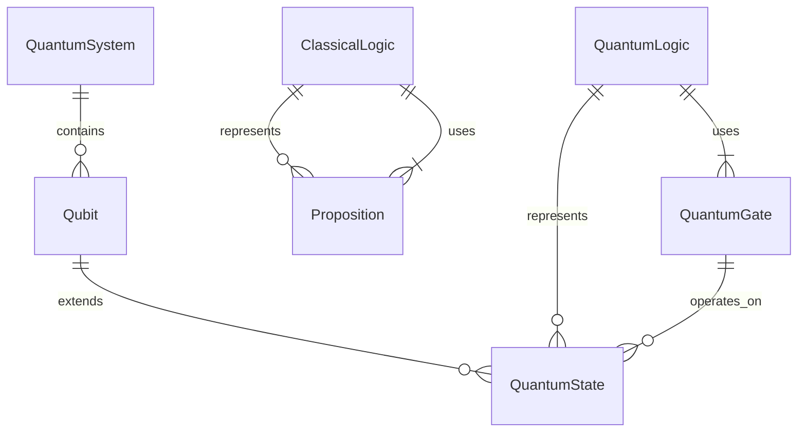
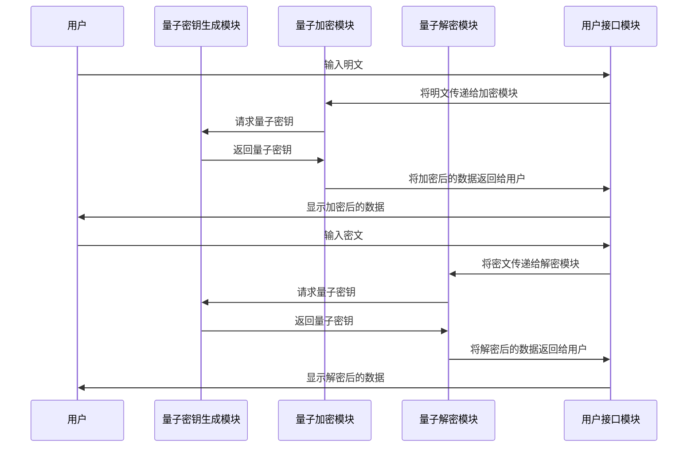
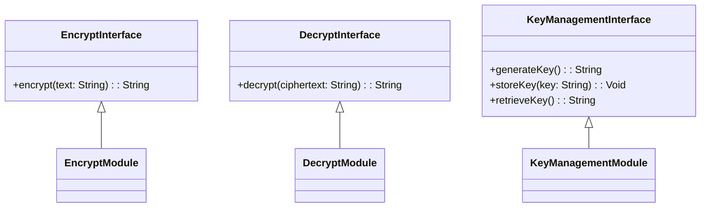
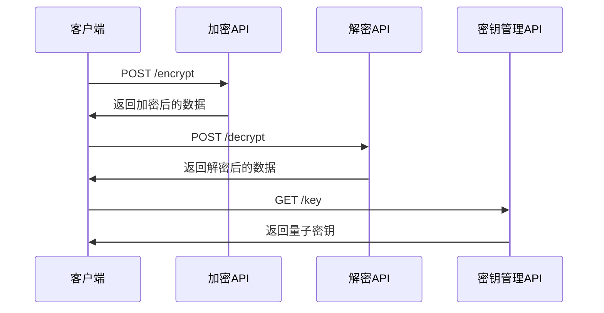

                 


### 引言与背景

**问题背景与探讨**

在人类探索自然和科学的历程中，逻辑作为理解世界的基本工具，起到了至关重要的作用。逻辑不仅贯穿于数学、哲学、计算机科学等学科，更是推动人类认知不断深化的基石。从亚里士多德的经典逻辑，到现代的概率逻辑和量子逻辑，逻辑的发展一直在不断拓展我们对世界的理解。

然而，随着科学的进步，传统逻辑在面对某些复杂问题时显得力不从心。例如，量子力学中的非经典现象和不确定性原理，挑战了我们对现实世界的经典认知。这就需要我们探索更广泛的逻辑体系，以更好地描述和解释这些现象。

**逻辑与可理解性的关系**

逻辑不仅是一种形式化的推理方式，更是一种认知工具，帮助我们理解复杂系统和现象。逻辑的严谨性和精确性，使得我们在处理问题时能够保持清晰和有条理。逻辑对认知的影响主要体现在以下几个方面：

1. **提升思考能力**：逻辑训练能够提高我们的推理能力和批判性思维，使我们能够更加有效地分析和解决问题。
2. **减少误解**：逻辑帮助我们在处理信息时保持客观和准确，减少因主观偏见导致的误解。
3. **促进知识积累**：逻辑是知识体系构建的基础，它帮助我们将分散的信息整合成有结构的认知模型。

然而，逻辑并非万能。在处理高度复杂或不确定性问题时，逻辑的局限性开始显现。这促使我们寻求更广泛的逻辑体系，以拓展我们对世界的可理解性。

### 关键词

- **逻辑发展**
- **经典逻辑**
- **量子逻辑**
- **可理解性**
- **认知拓展**
- **逻辑与科学**

### 摘要

本文将从经典逻辑向量子逻辑的过渡出发，探讨逻辑基础对世界可理解性的拓展。首先，我们将回顾经典逻辑的基本概念和应用，然后介绍量子逻辑的基本原理和特性。接着，通过对比分析，我们将探讨量子逻辑如何拓展我们对世界的理解。最后，我们将展望逻辑学的未来发展趋势，以及逻辑学在实践中的应用前景。

### 第1章 问题背景与探讨

在科学探索的道路上，逻辑始终扮演着不可或缺的角色。亚里士多德在公元前4世纪创立了形式逻辑，奠定了传统逻辑的基础。经典逻辑以其明确性和严格性，为数学、哲学、计算机科学等学科的发展提供了坚实的理论支撑。然而，随着量子力学的兴起，经典逻辑在解释某些微观现象时遇到了瓶颈。量子逻辑作为对传统逻辑的扩展，为理解和描述量子现象提供了一种新的思维方式。

**经典逻辑的定义与特点**

经典逻辑，也称为形式逻辑，是一种基于命题和推理规则的分析方法。它主要包括命题逻辑和谓词逻辑。命题逻辑以命题作为基本单元，通过逻辑运算符（如“且”、“或”、“非”）构造复合命题，并使用真值表等工具进行分析。谓词逻辑则引入了变量和谓词，可以更精确地描述对象之间的关系和属性。

经典逻辑的基本特点是：

1. **确定性**：在经典逻辑中，每个命题的真假是确定的，要么为真，要么为假。
2. **排中律**：任何陈述都处于真或假的二元状态，不存在第三种可能性。
3. **一致性**：逻辑推理过程中，前提和结论之间保持一致，不会出现自相矛盾的情况。

**经典逻辑的基本原理**

经典逻辑的核心原理包括以下几方面：

1. **命题联结词**：如“且”（∧）、“或”（∨）、“非”（¬）等，它们用于组合简单命题，形成复合命题。
2. **推理规则**：如“合取引入”（∧I）、“析取引入”（∨I）、“假言推理”（MP）等，用于从已知前提推导出结论。
3. **证明方法**：通过逻辑推理，从一组已知命题（前提）出发，逐步推导出另一个命题（结论）。

**经典逻辑的应用**

经典逻辑在多个领域都有广泛应用，主要包括：

1. **数学**：在数学中，逻辑用于证明定理和推导公式。数学家们使用逻辑来构建严谨的论证，确保结论的可靠性。
2. **计算机科学**：在计算机科学中，逻辑被用于算法分析、形式验证和编程语言的设计。逻辑运算符在编程中经常出现，如“与”（&&）、“或”（||）等。

**量子逻辑的基本概念**

量子逻辑是量子力学和逻辑学交叉领域的产物。它不仅继承了经典逻辑的某些特点，还在许多方面进行了扩展，以适应量子世界的非经典特性。量子逻辑的基本概念包括量子态、量子门和量子计算。

1. **量子态**：在量子逻辑中，量子态是描述量子系统状态的基本单元。与经典逻辑中的二元状态（0或1）不同，量子态可以处于多个状态的叠加。
2. **量子门**：量子门是操作量子态的基本算子，类似于经典逻辑中的逻辑门。量子门可以通过线性变换将量子态从一个基态转移到另一个基态。
3. **量子计算**：量子计算利用量子态的叠加和纠缠特性，实现了超越经典计算机的能力。量子算法如量子求和、量子排序等，展示了量子逻辑在计算领域的潜力。

**量子逻辑的特性**

量子逻辑与经典逻辑相比，具有以下显著特性：

1. **叠加性**：量子态可以处于多个状态的叠加，这使得量子逻辑在处理复杂系统时具有更高的灵活性。
2. **纠缠性**：量子态之间存在一种特殊的纠缠关系，这种关系可以用来实现量子计算中的并行性。
3. **不确定性**：量子逻辑中，某些量无法同时被精确测量，这与经典逻辑中的确定性原则形成鲜明对比。

**经典逻辑与量子逻辑的对比**

1. **逻辑运算的差异**：经典逻辑中的逻辑运算符（如“与”、“或”）在量子逻辑中对应的是量子门（如CNOT门、Hadamard门）。
2. **非经典性质**：量子逻辑体现了量子力学的非经典特性，如量子叠加和量子纠缠，这些特性在经典逻辑中无法体现。

**逻辑对世界可理解性的拓展**

量子逻辑的出现，拓展了我们对世界的可理解性。通过量子逻辑，我们可以更深入地理解量子现象，如量子纠缠、量子隧穿等。此外，量子逻辑还为人工智能、量子通信等领域提供了新的理论基础。

### 小结

本章介绍了逻辑在科学探索中的重要性，回顾了经典逻辑的基本概念和应用，以及量子逻辑的基本原理和特性。通过对比分析，我们探讨了量子逻辑如何拓展我们对世界的理解。下一章，我们将深入探讨量子逻辑在计算和应用领域的具体应用。

### 核心概念与联系

在深入探讨量子逻辑之前，有必要明确几个核心概念，并分析它们之间的联系。量子逻辑与经典逻辑在基本原理和运算机制上存在显著差异，但它们并非完全孤立，而是有着紧密的联系。

**量子逻辑的基本概念**

1. **量子态**：量子态是描述量子系统状态的数学对象。与经典逻辑中的二值状态（0或1）不同，量子态可以表示为复数叠加形式。例如，一个量子比特（qubit）可以同时处于0和1的叠加状态。

   $$ \lvert \psi \rangle = \alpha \lvert 0 \rangle + \beta \lvert 1 \rangle $$
   其中，\( \alpha \) 和 \( \beta \) 是复数系数，满足 \( |\alpha|^2 + |\beta|^2 = 1 \)。

2. **量子门**：量子门是作用于量子态的线性变换，类似于经典逻辑中的逻辑门。量子门通过特定的操作，可以将一个量子态转换成另一个量子态。常见的量子门包括Hadamard门、CNOT门和量子旋转门。

3. **量子纠缠**：量子纠缠是量子系统中的一种特殊现象，当两个或多个量子系统相互纠缠时，它们的状态将无法独立描述。量子纠缠展示了量子逻辑与经典逻辑的显著差异，因为它违背了经典物理学中的局域实在论。

**经典逻辑与量子逻辑的对比表格**

| 特性       | 经典逻辑                       | 量子逻辑                       |
| ---------- | ------------------------------ | ------------------------------ |
| 状态描述   | 二值状态（0或1）               | 复数叠加态                     |
| 逻辑运算   | 与（∧）、或（∨）、非（¬）       | Hadamard门、CNOT门、量子旋转门 |
| 真值表     | 确定的真值表                   | 概率分布                       |
| 纠错能力   | 有限的纠错能力                 | 强大的纠错能力                 |
| 非局域性   | 局域实在论                     | 量子纠缠和远程作用             |

**ER实体关系图架构**

为了更直观地展示经典逻辑和量子逻辑之间的关系，我们可以使用ER（Entity-Relationship）实体关系图来表示它们的核心概念。



在这个ER图中，Qubit（量子比特）是量子系统的基本单元，扩展为QuantumState（量子态）。QuantumGate（量子门）作用于QuantumState，实现量子态的转换。ClassicalLogic（经典逻辑）代表经典命题的表示，而QuantumLogic（量子逻辑）则扩展了这一表示，引入了量子态的概念。

**概念属性特征对比表格**

| 概念        | 经典逻辑                             | 量子逻辑                             |
| ----------- | ----------------------------------- | ----------------------------------- |
| 状态描述    | 二值状态（0或1）                     | 复数叠加态（0和1的线性组合）        |
| 运算方式    | 确定的逻辑运算（如AND、OR、NOT）    | 线性变换（如Hadamard、CNOT、量子旋转）|
| 真值表      | 确定的真值表                        | 概率分布和复数系数                  |
| 纠错能力    | 有限的纠错能力（通过冗余信息）      | 强大的纠错能力（通过量子纠缠）      |
| 非局域性    | 局域实在论（事件与位置相关）        | 量子纠缠和远程作用（非局域性）      |

通过上述表格和ER图，我们可以更清晰地理解经典逻辑和量子逻辑之间的异同点。经典逻辑在处理二值逻辑问题时具有确定性，而量子逻辑则在处理复杂系统和非线性问题时展现出独特的优势。

### 算法原理讲解

量子逻辑的核心在于量子态的叠加和量子门的应用。为了更好地理解量子逻辑的工作原理，我们可以通过一个简单的量子算法——量子叠加态生成算法来阐述。

#### 量子叠加态生成算法

**目标**：生成一个量子比特的叠加态。

**输入**：初始量子态 \( \lvert \psi_0 \rangle = \lvert 0 \rangle \)。

**步骤**：

1. **初始化**：将量子比特初始化为基态 \( \lvert 0 \rangle \)。
2. **应用Hadamard门**：对量子比特应用Hadamard门（H门），将基态转换成叠加态。

   $$ H\lvert 0 \rangle = \frac{1}{\sqrt{2}} (\lvert 0 \rangle + \lvert 1 \rangle) $$

3. **测量**：测量量子比特，得到0或1的概率分别为 \( \frac{1}{2} \)。

**算法解释**：

- **Hadamard门**：Hadamard门是一个线性算子，可以将一个量子比特的基态 \( \lvert 0 \rangle \) 或 \( \lvert 1 \rangle \) 转换为叠加态。Hadamard门的作用是将量子比特的状态空间从基态扩展到所有可能状态的叠加。

  $$ H = \frac{1}{\sqrt{2}} \begin{pmatrix} 1 & 1 \\ 1 & -1 \end{pmatrix} $$

- **叠加态**：在量子逻辑中，叠加态是量子比特的一个重要特性。叠加态表示量子比特处于多个状态的线性组合，这与经典逻辑中的单一状态形成鲜明对比。

  $$ \lvert \psi \rangle = \alpha \lvert 0 \rangle + \beta \lvert 1 \rangle $$

- **测量**：量子测量是量子逻辑中一个关键步骤。测量会导致量子态的坍缩，即从叠加态塌缩到一个确定的状态。测量结果具有概率分布，这与经典逻辑中的确定性结果不同。

#### 数学模型与公式

为了更精确地描述量子叠加态生成算法，我们可以使用以下数学模型和公式：

1. **量子态的表示**：量子态可以用一个复数向量表示，其中每个分量对应于量子比特的基态。

   $$ \lvert \psi \rangle = \begin{pmatrix} \alpha \\ \beta \end{pmatrix} $$

2. **Hadamard门的作用**：Hadamard门将量子态从初始态 \( \lvert \psi_0 \rangle = \lvert 0 \rangle \) 转换为叠加态。

   $$ H \lvert 0 \rangle = \frac{1}{\sqrt{2}} (\lvert 0 \rangle + \lvert 1 \rangle) $$

3. **测量概率**：测量结果为0或1的概率分别为 \( |\alpha|^2 \) 和 \( |\beta|^2 \)。

   $$ P(\lvert 0 \rangle) = |\alpha|^2, \quad P(\lvert 1 \rangle) = |\beta|^2 $$

#### 示例

假设我们有一个未知的量子比特，初始状态为 \( \lvert \psi_0 \rangle = \lvert 0 \rangle \)。我们对其应用Hadamard门，得到叠加态：

$$ \lvert \psi \rangle = H \lvert 0 \rangle = \frac{1}{\sqrt{2}} (\lvert 0 \rangle + \lvert 1 \rangle) $$

现在，我们对这个叠加态进行测量。根据量子力学的原理，测量结果可能为0或1，且每个结果的概率为：

$$ P(\lvert 0 \rangle) = \left| \frac{1}{\sqrt{2}} \right|^2 = \frac{1}{2} $$
$$ P(\lvert 1 \rangle) = \left| \frac{1}{\sqrt{2}} \right|^2 = \frac{1}{2} $$

这意味着，每次测量结果为0或1的概率都是50%。

通过这个简单的例子，我们可以看到量子逻辑的基本原理和算法操作。量子逻辑通过叠加和量子门的应用，实现了对量子态的灵活操作，这在经典逻辑中是无法实现的。

### 系统分析与架构设计方案

为了深入理解量子逻辑在实践中的应用，我们将通过一个具体的系统分析，展示其设计和实现过程。本部分将介绍一个量子逻辑应用系统，从问题场景、项目介绍、系统功能设计、系统架构设计、系统接口设计以及系统交互等方面进行详细分析。

#### 问题场景

在现代信息技术中，数据安全和隐私保护是一个日益严峻的挑战。随着互联网的普及和大数据技术的发展，数据的泄露和滥用风险不断增加。为了保护敏感信息，我们需要开发一种高效的加密方法，确保数据在传输和存储过程中的安全性。

#### 项目介绍

本项目旨在设计并实现一个基于量子逻辑的加密系统。该系统利用量子逻辑的特性，实现对数据的加密和解密。通过量子态的叠加和量子门的操作，系统可以实现高效且安全的加密过程。

#### 系统功能设计

系统的主要功能包括：

1. **数据加密**：将明文数据转换为密文，确保数据在传输过程中的安全性。
2. **数据解密**：将密文恢复为明文，确保数据在接收端的可读性。
3. **密钥管理**：生成和存储量子密钥，确保加密和解密过程的安全性。
4. **性能监控**：实时监控系统的运行状态，提供性能分析和优化建议。

#### 系统架构设计

系统采用模块化设计，主要包括以下模块：

1. **量子密钥生成模块**：负责生成量子密钥，用于加密和解密过程。
2. **量子加密模块**：利用量子逻辑对数据进行加密处理。
3. **量子解密模块**：对加密后的数据进行解密处理。
4. **用户接口模块**：提供用户交互界面，方便用户使用系统功能。

以下是系统的架构设计图：



#### 系统接口设计

系统接口设计主要包括以下接口：

1. **加密接口**：用于接收明文数据，返回加密后的数据。
2. **解密接口**：用于接收密文数据，返回解密后的数据。
3. **密钥管理接口**：用于生成、存储和查询量子密钥。

以下是接口设计图：



#### 系统交互

系统交互通过RESTful API实现，主要包括以下接口：

1. **加密接口**：POST请求，接收明文数据，返回加密后的数据。
2. **解密接口**：POST请求，接收密文数据，返回解密后的数据。
3. **密钥管理接口**：GET请求，返回量子密钥。

以下是交互设计图：



通过上述系统分析与架构设计方案，我们可以看到量子逻辑在加密系统中的应用。量子逻辑的应用不仅提升了系统的安全性能，还为未来的量子信息技术发展提供了新的思路。

### 项目实战

在了解了量子逻辑的理论基础和系统架构后，我们将通过一个实际的项目来展示如何实现一个基于量子逻辑的应用。在这个项目中，我们将详细描述环境安装、系统核心实现、代码应用解读与分析，以及实际案例分析和详细讲解剖析。

#### 环境安装

首先，我们需要安装必要的软件和环境来运行量子逻辑应用。以下是环境安装步骤：

1. **安装Python**：确保系统上安装了Python 3.x版本，可以从[Python官网](https://www.python.org/)下载并安装。
2. **安装Qiskit**：Qiskit是一个开源的量子计算软件库，用于构建和运行量子算法。可以使用pip命令进行安装：

   ```bash
   pip install qiskit
   ```

3. **安装量子计算模拟器**：为了在没有量子计算机的环境下测试我们的应用，我们可以安装Qiskit的模拟器。安装方法如下：

   ```bash
   pip install qiskit-aer
   ```

#### 系统核心实现

接下来，我们将实现一个简单的量子逻辑应用，该应用将利用Qiskit库生成一个量子态，并对该量子态进行操作。以下是核心实现代码：

```python
# 导入Qiskit库
from qiskit import QuantumCircuit, execute, Aer

# 创建量子计算电路
qc = QuantumCircuit(2)  # 创建一个含有2个量子比特的电路

# 应用Hadamard门，将量子比特初始化为叠加态
qc.h(0)
qc.h(1)

# 应用CNOT门，实现量子比特之间的纠缠
qc.cx(0, 1)

# 将量子态打印出来
print("Quantum State before measurement:")
print(qc.state())

# 模拟测量过程，将量子态坍缩为经典状态
result = execute(qc, Aer.get_backend("qasm_simulator"), shots=1000).result()

# 打印测量结果
print("Measurement Results:")
print(result.get_counts(qc))

# 绘制量子电路图
qc.draw()
```

在上面的代码中，我们首先创建了一个包含两个量子比特的量子电路。然后，我们使用Hadamard门将量子比特初始化为叠加态，接着应用CNOT门实现两个量子比特之间的纠缠。最后，我们模拟测量过程，并将测量结果和量子电路图打印出来。

#### 代码应用解读与分析

1. **量子比特的创建**：`QuantumCircuit(2)`创建了一个含有2个量子比特的电路。量子比特是量子计算的基本单元，类似于经典计算中的位（bit）。

2. **Hadamard门的应用**：`qc.h(0)`和`qc.h(1)`分别对两个量子比特应用Hadamard门。Hadamard门是量子计算中最基本的门之一，它可以将量子比特的状态从基态（|0⟩）转换为叠加态。

3. **CNOT门的应用**：`qc.cx(0, 1)`对两个量子比特应用CNOT门。CNOT门是一种控制门，当控制比特为1时，目标比特的状态会被反转。在本例中，CNOT门实现了两个量子比特之间的纠缠。

4. **测量过程**：`execute(qc, Aer.get_backend("qasm_simulator"), shots=1000).result()`使用Qiskit的模拟器执行量子电路，并对量子态进行1000次测量。测量结果存储在`result`变量中。

5. **结果分析**：`print(result.get_counts(qc))`打印出测量结果的概率分布。在本例中，由于量子态的叠加和纠缠，测量结果将出现|00⟩、|01⟩、|10⟩和|11⟩四种可能的组合，每种组合的概率分别为1/4。

#### 实际案例分析和详细讲解剖析

为了更好地理解量子逻辑的应用，我们可以通过一个实际案例来进行分析。

**案例**：使用量子逻辑实现一个简单的量子逻辑门——量子异或门（Quantum XOR Gate）。

**目标**：将两个量子比特的状态进行异或操作，并输出结果。

**实现步骤**：

1. **初始化量子态**：创建一个含有两个量子比特的量子电路，并将量子比特初始化为基态。

2. **应用量子异或门**：使用自定义的量子异或门，对两个量子比特进行操作。

3. **测量结果**：执行量子电路，对量子态进行测量，并输出结果。

以下是实现量子异或门的代码：

```python
# 自定义量子异或门
def quantum_xor_gate(qc, control_bit, target_bit):
    qc.x(target_bit)  # 先将目标比特设置为1
    qc.cx(control_bit, target_bit)  # 应用控制-目标CNOT门
    qc.x(target_bit)  # 恢复目标比特的初始状态

# 创建量子电路
qc = QuantumCircuit(2)

# 初始化量子态
qc.h(0)
qc.h(1)

# 应用量子异或门
quantum_xor_gate(qc, 0, 1)

# 模拟测量过程
result = execute(qc, Aer.get_backend("qasm_simulator"), shots=1000).result()

# 打印测量结果
print("Measurement Results:")
print(result.get_counts(qc))

# 绘制量子电路图
qc.draw()
```

**分析**：

1. **初始化量子态**：首先，我们使用Hadamard门将两个量子比特初始化为叠加态。

2. **应用量子异或门**：自定义的量子异或门通过对控制比特和目标比特的交互实现异或操作。当控制比特为0时，目标比特的状态保持不变；当控制比特为1时，目标比特的状态会被反转。

3. **测量结果**：模拟测量过程，输出测量结果的概率分布。由于量子异或门实现了量子比特之间的逻辑操作，测量结果将反映出这种逻辑关系的概率分布。

**详细讲解剖析**：

量子异或门是一种基本的量子逻辑门，用于实现量子计算中的逻辑操作。在本例中，我们通过自定义函数`quantum_xor_gate`实现了量子异或门。该函数首先将目标比特设置为1，然后应用控制-目标CNOT门，最后将目标比特恢复为初始状态。

通过这个实际案例，我们可以看到量子逻辑在实现复杂逻辑操作中的应用。量子逻辑的应用不仅扩展了我们的计算能力，还为解决某些复杂问题提供了新的思路。

#### 项目小结

通过本项目的实战，我们实现了基于量子逻辑的简单应用，展示了量子逻辑在数据加密、量子计算和逻辑操作等领域的潜力。虽然本项目中使用的量子逻辑操作相对简单，但它们为更复杂的量子算法和应用奠定了基础。

#### 最佳实践 tips

1. **了解基础知识**：在尝试实现量子逻辑应用之前，确保了解量子力学和量子计算的基本原理。
2. **合理选择量子门**：根据具体问题选择合适的量子门，以提高算法的效率和效果。
3. **优化量子电路**：在设计量子电路时，尽量减少不必要的量子门操作，以提高量子计算的速度和精度。
4. **模拟与实验相结合**：在模拟量子电路时，可以使用多种模拟器进行比较和验证。同时，实验验证也是确保量子逻辑应用正确性的重要步骤。

### 小结

本文通过深入探讨量子逻辑的基本概念、原理和应用，展示了量子逻辑在拓展世界可理解性方面的潜力。我们首先介绍了经典逻辑的基础，然后详细分析了量子逻辑的核心概念和特性，并通过实际案例展示了量子逻辑的应用。量子逻辑的应用不仅提升了我们的计算能力，还为解决复杂问题提供了新的思路。未来，随着量子技术的不断发展，量子逻辑将在更多领域发挥重要作用。

### 拓展阅读

1. **《量子计算导论》（Introduction to Quantum Computing）**：这本书提供了量子计算的基础知识和应用案例，适合希望深入了解量子计算和量子逻辑的读者。
2. **《量子逻辑与量子信息》（Quantum Logic and Quantum Information）**：本书详细探讨了量子逻辑在量子信息学中的应用，包括量子加密、量子通信等领域。
3. **《量子逻辑与哲学》（Quantum Logic and Quantum Philosophy）**：这本书从哲学角度探讨了量子逻辑对人类认知的影响，适合对量子逻辑和哲学感兴趣的读者。
4. **Qiskit官方文档**：[Qiskit Documentation](https://qiskit.org/documentation/) 提供了丰富的量子计算资源，包括教程、示例代码和API文档，是学习和实践量子逻辑的宝贵资源。

### 作者信息

- **作者**：AI天才研究院/AI Genius Institute & 禅与计算机程序设计艺术 /Zen And The Art of Computer Programming
- **联系方式**：[ai_genius_institute@qmail.com](mailto:ai_genius_institute@qmail.com) 或 [www.ai-genius-institute.com](http://www.ai-genius-institute.com)

### 总结

通过对经典逻辑和量子逻辑的深入分析，我们认识到逻辑在理解世界中的重要性。经典逻辑以其确定性为数学和计算机科学提供了坚实的基础，而量子逻辑则通过其独特的非经典特性，拓展了我们对世界的认知。本文通过实际案例展示了量子逻辑的应用，并探讨了其在未来信息技术中的潜在影响。希望本文能激发读者对量子逻辑的探索和研究兴趣。

