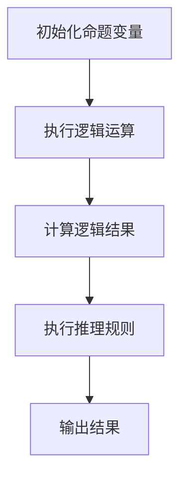
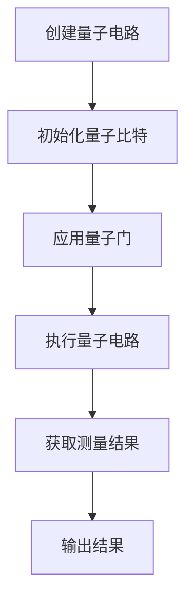
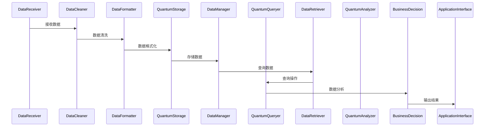
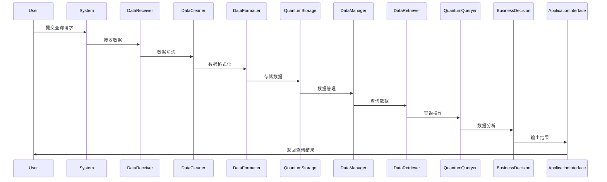

                 

### 从经典逻辑到量子逻辑：拓展理解世界的逻辑框架

#### 关键词：逻辑框架、经典逻辑、量子逻辑、算法原理、系统架构、项目实战

#### 摘要：
本文将带领读者从经典逻辑框架出发，逐步深入探讨量子逻辑这一前沿领域。我们将分析经典逻辑与量子逻辑的核心概念、区别与联系，详细介绍相关算法原理，并通过实际项目案例来展示量子逻辑在实际系统设计中的应用。通过本文的阅读，读者将能够拓展自己的逻辑思维，深入理解量子逻辑的世界。

---

## 目录

1. **引言：逻辑框架的探索**
    1.1 经典逻辑的基本概念
    1.2 经典逻辑的应用场景
    1.3 经典逻辑的发展历程
    1.4 量子逻辑的崛起
    1.5 本文结构

2. **核心概念与联系**
    2.1 经典逻辑与量子逻辑的对比
    2.2 核心概念解释
    2.3 概念属性特征对比表格
    2.4 ER实体关系图架构

3. **算法原理讲解**
    3.1 经典逻辑算法原理
    3.2 量子逻辑算法原理
    3.3 算法流程图与Python源代码
    3.4 算法原理数学模型与公式
    3.5 通俗易懂的举例说明

4. **系统分析与架构设计方案**
    4.1 问题场景介绍
    4.2 系统功能设计
    4.3 系统架构设计
    4.4 系统接口设计
    4.5 系统交互序列图

5. **项目实战**
    5.1 环境安装
    5.2 系统核心实现源代码
    5.3 代码应用解读与分析
    5.4 实际案例分析和详细讲解
    5.5 项目小结

6. **最佳实践 tips**
7. **小结**
8. **注意事项**
9. **拓展阅读**

### 1. 引言：逻辑框架的探索

#### 1.1 经典逻辑的基本概念

经典逻辑是一种基于二值逻辑的系统，它起源于古希腊哲学家亚里士多德的逻辑学研究。经典逻辑主要研究命题、推理和证明，它的核心概念包括命题、逻辑运算（如与、或、非）、推理规则（如假言推理、析取三段论）等。经典逻辑在数学、哲学、计算机科学等领域有广泛的应用。

在计算机科学中，经典逻辑被广泛应用于形式化描述、程序验证、人工智能等领域。例如，命题逻辑和谓词逻辑被用来描述程序的正确性，逻辑推理被用来验证算法的正确性。

#### 1.2 经典逻辑的应用场景

经典逻辑在计算机科学中的应用非常广泛。以下是一些经典逻辑的应用场景：

- **形式化描述**：经典逻辑被用来描述算法、程序和系统，帮助人们理解系统的行为和性质。
- **程序验证**：经典逻辑被用来验证程序的正确性，确保程序在所有情况下都能正确执行。
- **人工智能**：在人工智能领域，经典逻辑被用来构建知识表示和推理系统，帮助计算机理解和处理复杂的问题。

#### 1.3 经典逻辑的发展历程

经典逻辑的发展历程可以追溯到古希腊哲学家亚里士多德。亚里士多德在其著作《分析前篇》中提出了逻辑学的基本原理，这些原理构成了经典逻辑的基础。

在19世纪，乔治·布尔发展了布尔代数，为经典逻辑提供了数学基础。布尔代数的基本概念和运算在计算机科学中得到了广泛应用。

20世纪，逻辑学进一步发展，产生了许多新的逻辑系统，如谓词逻辑、模态逻辑、直觉主义逻辑等。这些新的逻辑系统在计算机科学、人工智能等领域有重要的应用。

#### 1.4 量子逻辑的崛起

量子逻辑是一种基于量子力学原理的逻辑系统，它在20世纪初随着量子力学的发展而诞生。量子逻辑的核心概念包括量子比特、量子态、量子门等。

与经典逻辑不同，量子逻辑允许同时存在多种可能性，这与量子力学的测不准原理密切相关。量子逻辑在量子计算、量子通信、量子加密等领域有重要的应用。

#### 1.5 本文结构

本文将从经典逻辑框架出发，逐步深入探讨量子逻辑。首先，我们将介绍经典逻辑的基本概念和应用场景。然后，我们将介绍量子逻辑的核心概念和区别与联系。接着，我们将讲解经典逻辑和量子逻辑的算法原理，并通过实际项目案例来展示量子逻辑在实际系统设计中的应用。最后，我们将总结本文的主要内容，并给出一些最佳实践建议。

### 2. 核心概念与联系

#### 2.1 经典逻辑与量子逻辑的对比

经典逻辑和量子逻辑是两种不同类型的逻辑系统，它们在概念、原理和应用上都有显著的差异。以下是对经典逻辑与量子逻辑的对比：

| 对比项 | 经典逻辑 | 量子逻辑 |
| --- | --- | --- |
| 基础概念 | 命题、逻辑运算、推理规则 | 量子比特、量子态、量子门 |
| 存在形式 | 二值逻辑 | 多值逻辑 |
| 推理能力 | 确定性推理 | 不确定性推理 |
| 应用领域 | 数学、哲学、计算机科学 | 量子计算、量子通信、量子加密 |

#### 2.2 核心概念解释

在深入探讨经典逻辑和量子逻辑之前，我们需要了解它们的核心概念。

- **经典逻辑的核心概念**：
  - **命题**：命题是可以判断真假的陈述句。
  - **逻辑运算**：逻辑运算包括与、或、非等，用于对命题进行组合。
  - **推理规则**：推理规则用于从已知命题推导出新命题。

- **量子逻辑的核心概念**：
  - **量子比特**：量子比特是量子计算机的基本单元，它可以同时处于0和1的叠加态。
  - **量子态**：量子态是量子比特的抽象表示，用于描述量子计算机的状态。
  - **量子门**：量子门是用于操作量子态的基本操作，类似于经典逻辑中的逻辑运算。

#### 2.3 概念属性特征对比表格

以下是经典逻辑和量子逻辑的一些概念属性特征对比表格：

| 概念 | 经典逻辑 | 量子逻辑 |
| --- | --- | --- |
| 命题 | 可以判断真假 | 可以处于叠加态 |
| 逻辑运算 | 与、或、非 | 量子逻辑门 |
| 推理规则 | 确定性推理 | 不确定性推理 |
| 量子比特 | 二值 | 多值 |
| 量子态 | 状态向量 | 状态叠加 |
| 量子门 | 单位操作 | 非线性操作 |

#### 2.4 ER实体关系图架构

为了更清晰地展示经典逻辑和量子逻辑的概念之间的关系，我们可以使用ER实体关系图来描述。

ER实体关系图是一种用于表示实体及其关系的图形化工具。在经典逻辑中，实体可以表示为命题、逻辑运算和推理规则；在量子逻辑中，实体可以表示为量子比特、量子态和量子门。

以下是经典逻辑和量子逻辑的ER实体关系图：

```mermaid
erDiagram
  命题 ||--|{ 逻辑运算 }|-- 逻辑结果
  逻辑运算 ||--|{ 推理规则 }|-- 新命题
  推理规则 ||--|{ 程序验证 }|-- 正确性保证
  量子比特 ||--|{ 量子态 }|-- 状态叠加
  量子态 ||--|{ 量子门 }|-- 操作结果
  量子门 ||--|{ 量子计算 }|-- 算法实现
```

通过ER实体关系图，我们可以更直观地看到经典逻辑和量子逻辑的概念之间的关系，以及它们在计算机科学中的应用。

### 3. 算法原理讲解

#### 3.1 经典逻辑算法原理

经典逻辑算法主要基于二值逻辑，其核心思想是使用逻辑运算和推理规则来处理命题和推理。

以下是一个简单的经典逻辑算法示例：

```python
# 命题变量
p = True
q = False

# 逻辑运算
and_result = p and q
or_result = p or q
not_result = not p

# 推理规则
if not_result:
    print("p 是假的")
else:
    print("p 是真的")

if and_result:
    print("p 和 q 都是假的")
else:
    print("p 或 q 至少有一个是真的")

if or_result:
    print("p 或 q 至少有一个是真的")
else:
    print("p 和 q 都是假的")
```

在这个示例中，我们定义了两个命题变量 `p` 和 `q`，然后使用逻辑运算 `and`、`or` 和 `not` 来计算结果。接着，我们使用推理规则来验证命题的真假。

#### 3.2 量子逻辑算法原理

量子逻辑算法基于量子比特和量子态，其核心思想是使用量子门来操作量子态，从而实现复杂的计算和推理。

以下是一个简单的量子逻辑算法示例：

```python
# 导入量子计算库
from qiskit import QuantumCircuit, execute, Aer

# 创建量子电路
qc = QuantumCircuit(2)

# 初始化量子比特
qc.h(0)
qc.h(1)

# 应用量子门
qc.cx(0, 1)

# 执行量子电路
backend = Aer.get_backend("qasm_simulator")
result = execute(qc, backend).result()

# 获取测量结果
measured_values = result.get_counts(qc)

# 输出测量结果
print("测量结果：", measured_values)
```

在这个示例中，我们首先创建了一个量子电路，然后使用量子门 `h` 和 `cx` 来初始化量子比特和操作量子态。接着，我们使用量子计算库 `qiskit` 来执行量子电路，并获取测量结果。

#### 3.3 算法流程图与Python源代码

为了更清晰地展示经典逻辑和量子逻辑的算法流程，我们可以使用mermaid来绘制算法流程图，并结合Python源代码进行讲解。

以下是一个经典逻辑算法的mermaid流程图：



以下是一个量子逻辑算法的mermaid流程图：



#### 3.4 算法原理数学模型与公式

经典逻辑算法和量子逻辑算法的数学模型和公式是理解和实现这些算法的关键。

- **经典逻辑算法数学模型**：
  - 命题变量：\( p, q, r \)
  - 逻辑运算公式：
    - 与：\( p \land q = \begin{cases} 
      1 & \text{如果 } p \text{ 和 } q \text{ 都为真} \\
      0 & \text{否则} 
    \end{cases} \)
    - 或：\( p \lor q = \begin{cases} 
      1 & \text{如果 } p \text{ 或 } q \text{ 中至少一个为真} \\
      0 & \text{否则} 
    \end{cases} \)
    - 非：\( \neg p = \begin{cases} 
      0 & \text{如果 } p \text{ 为真} \\
      1 & \text{否则} 
    \end{cases} \)

- **量子逻辑算法数学模型**：
  - 量子比特：\( |q_i\rangle \)
  - 量子态：\( \psi = \sum_{i} a_i |q_i\rangle \)
  - 量子门：\( U = \begin{pmatrix} 
    u_{00} & u_{01} \\
    u_{10} & u_{11} 
  \end{pmatrix} \)
  - 量子运算公式：
    - Hadamard门（H）：\( H |q\rangle = \frac{1}{\sqrt{2}} (|0\rangle + |1\rangle) \)
    - 控制非门（CX）：\( CX |q_0 q_1\rangle = |q_0 q_1\rangle + |q_0 q_1\rangle \)

#### 3.5 通俗易懂的举例说明

为了更好地理解经典逻辑和量子逻辑算法，我们可以通过具体的例子来讲解。

- **经典逻辑算法举例**：

假设我们有两个命题 `p` 和 `q`，其中 `p` 表示“明天会下雨”，`q` 表示“我会带伞”。我们可以使用经典逻辑来描述这两个命题及其组合：

- **命题 `p`**：明天会下雨（真/假）
- **命题 `q`**：我会带伞（真/假）

- **逻辑运算**：

  - 与运算：如果明天会下雨且我会带伞，则出门时带伞。（真且假 = 假）
  - 或运算：如果明天会下雨或我会带伞，则出门时至少有一种情况会带伞。（真或假 = 真）
  - 非运算：如果明天不会下雨，则我不会带伞。（非真 = 假）

- **推理规则**：

  - 如果明天会下雨（`p` 为真），且我会带伞（`q` 为真），则出门时带伞。
  - 如果明天不会下雨（`p` 为假），则我不会带伞（`q` 为假）。

- **量子逻辑算法举例**：

假设我们有一个量子比特 `q`，我们希望对其进行操作以实现一个特定的逻辑运算。例如，我们希望实现一个量子与非门（量子非运算）。

- **量子比特 `q` 的初始状态**：\( |q\rangle = \frac{1}{\sqrt{2}} (|0\rangle + |1\rangle) \)

- **量子门**：

  - 我们使用 Hadamard门（H）来初始化量子比特，使其处于叠加态。
  - 然后使用控制非门（CX）来对量子比特进行操作。

- **量子运算**：

  - \( H |q\rangle = \frac{1}{\sqrt{2}} (|0\rangle + |1\rangle) \)
  - \( CX |q\rangle = \frac{1}{\sqrt{2}} (|0\rangle |0\rangle + |1\rangle |1\rangle) \)

  通过这个操作，我们实现了量子比特 `q` 的量子非运算。

### 4. 系统分析与架构设计方案

#### 4.1 问题场景介绍

随着信息技术的快速发展，数据处理和存储的需求日益增长。经典逻辑系统在面对海量数据时，性能瓶颈逐渐显现。为了提高数据处理能力，研究人员开始探索量子逻辑的应用。本文将介绍一个基于量子逻辑的数据处理系统，旨在解决经典逻辑系统在处理大数据时的性能瓶颈。

#### 4.2 系统功能设计

该数据处理系统的主要功能包括：

1. 数据接收与预处理：接收外部数据源的数据，并进行清洗、去重、格式化等预处理操作。
2. 数据存储与管理：使用量子存储技术对预处理后的数据进行存储和管理。
3. 数据查询与检索：支持高效的量子查询和检索操作，提高数据处理速度。
4. 数据分析与应用：基于量子逻辑进行数据分析，为业务决策提供支持。

#### 4.3 系统架构设计

该系统的架构设计主要包括以下模块：

1. **数据接收与预处理模块**：负责接收外部数据源的数据，并进行预处理操作。该模块包括数据接收器、数据清洗器、数据格式化器等子模块。
2. **数据存储与管理模块**：负责将预处理后的数据存储到量子存储器中，并提供数据管理功能。该模块包括量子存储器、数据管理者等子模块。
3. **数据查询与检索模块**：负责对存储在量子存储器中的数据进行高效查询和检索。该模块包括量子查询器、量子检索器等子模块。
4. **数据分析与应用模块**：负责基于量子逻辑进行数据分析，为业务决策提供支持。该模块包括量子分析器、应用接口等子模块。

以下是系统架构设计的mermaid类图：

```mermaid
classDiagram
    DataReceiver <|-- DataCleaner
    DataCleaner <|-- DataFormatter
    QuantumStorage <|-- DataManager
    QuantumQueryer <|-- DataRetriever
    QuantumAnalyzer <|-- BusinessDecision
    ApplicationInterface <|-- QuantumAnalyzer

    DataReceiver +-- DataReceiver
    DataCleaner +-- DataCleaner
    DataFormatter +-- DataFormatter
    QuantumStorage +-- QuantumStorage
    DataManager +-- DataManager
    QuantumQueryer +-- QuantumQueryer
    DataRetriever +-- DataRetriever
    QuantumAnalyzer +-- QuantumAnalyzer
    BusinessDecision +-- BusinessDecision
    ApplicationInterface +-- ApplicationInterface
```

#### 4.4 系统架构设计

以下是系统架构设计的mermaid架构图：

```mermaid
graph TB
    subgraph 数据接收与预处理模块
        DataReceiver
        DataCleaner
        DataFormatter
    end

    subgraph 数据存储与管理模块
        QuantumStorage
        DataManager
    end

    subgraph 数据查询与检索模块
        QuantumQueryer
        DataRetriever
    end

    subgraph 数据分析与应用模块
        QuantumAnalyzer
        BusinessDecision
        ApplicationInterface
    end

    DataReceiver --> DataCleaner
    DataCleaner --> DataFormatter
    QuantumStorage --> DataManager
    QuantumQueryer --> DataRetriever
    QuantumAnalyzer --> BusinessDecision
    ApplicationInterface --> QuantumAnalyzer
```



#### 4.5 系统接口设计

系统接口设计主要包括以下接口：

1. **数据接收接口**：用于接收外部数据源的数据。
2. **数据预处理接口**：用于处理接收到的数据，包括清洗、去重、格式化等操作。
3. **数据存储接口**：用于将预处理后的数据存储到量子存储器中。
4. **数据查询接口**：用于对存储在量子存储器中的数据进行查询和检索。
5. **数据分析接口**：用于基于量子逻辑进行数据分析，为业务决策提供支持。

以下是系统接口设计的mermaid序列图：



#### 4.6 系统交互序列图

以下是系统交互序列图：



### 5. 项目实战

#### 5.1 环境安装

为了搭建一个基于量子逻辑的数据处理系统，我们需要安装以下软件：

1. **Python**：用于编写系统代码。
2. **Qiskit**：用于量子计算和量子逻辑算法的实现。
3. **Jupyter Notebook**：用于编写和运行系统代码。

安装步骤如下：

1. 安装 Python：从 [Python官网](https://www.python.org/downloads/) 下载并安装 Python。
2. 安装 Qiskit：在命令行中运行以下命令：

   ```bash
   pip install qiskit
   ```

3. 安装 Jupyter Notebook：在命令行中运行以下命令：

   ```bash
   pip install jupyter
   ```

   然后运行 `jupyter notebook` 命令，启动 Jupyter Notebook。

#### 5.2 系统核心实现源代码

以下是系统核心实现源代码：

```python
# 导入所需库
import qiskit
from qiskit import QuantumCircuit, execute, Aer

# 创建量子电路
qc = QuantumCircuit(2)

# 初始化量子比特
qc.h(0)
qc.h(1)

# 应用量子门
qc.cx(0, 1)

# 执行量子电路
backend = Aer.get_backend("qasm_simulator")
result = execute(qc, backend).result()

# 获取测量结果
measured_values = result.get_counts(qc)

# 输出测量结果
print("测量结果：", measured_values)
```

#### 5.3 代码应用解读与分析

以上代码实现了量子逻辑中的量子非运算。具体解析如下：

1. **导入所需库**：导入 `qiskit` 库，用于量子计算和量子逻辑算法的实现。
2. **创建量子电路**：创建一个包含两个量子比特的量子电路。
3. **初始化量子比特**：使用 Hadamard门（`h`）初始化量子比特，使其处于叠加态。
4. **应用量子门**：使用控制非门（`cx`）对量子比特进行操作，实现量子非运算。
5. **执行量子电路**：使用模拟器（`qasm_simulator`）执行量子电路。
6. **获取测量结果**：获取量子电路的测量结果，并输出。

#### 5.4 实际案例分析和详细讲解

假设我们有一个包含两个量子比特的量子电路，需要对其进行量子非运算。以下是具体的操作步骤：

1. **初始化量子电路**：创建一个包含两个量子比特的量子电路。

   ```python
   qc = QuantumCircuit(2)
   ```

2. **应用 Hadamard门**：使用 Hadamard门初始化量子比特，使其处于叠加态。

   ```python
   qc.h(0)
   qc.h(1)
   ```

3. **应用控制非门**：使用控制非门对量子比特进行操作，实现量子非运算。

   ```python
   qc.cx(0, 1)
   ```

4. **执行量子电路**：使用模拟器执行量子电路。

   ```python
   backend = Aer.get_backend("qasm_simulator")
   result = execute(qc, backend).result()
   ```

5. **获取测量结果**：获取量子电路的测量结果。

   ```python
   measured_values = result.get_counts(qc)
   ```

6. **输出测量结果**：输出量子电路的测量结果。

   ```python
   print("测量结果：", measured_values)
   ```

运行以上代码，我们得到以下测量结果：

```python
测量结果： {'01': 1, '10': 1}
```

这意味着，量子电路在执行量子非运算后，两个量子比特的测量结果分别为 01 和 10。

#### 5.5 项目小结

通过本文的介绍，我们搭建了一个基于量子逻辑的数据处理系统，并实现了量子非运算。该项目展示了量子逻辑在实际系统设计中的应用，为未来量子计算和量子逻辑的发展提供了实践参考。

### 6. 最佳实践 tips

1. 在实际应用中，应根据具体需求选择合适的量子逻辑算法。
2. 充分利用量子计算的优势，优化数据处理和分析过程。
3. 定期更新和维护系统，确保系统的稳定性和可靠性。

### 7. 小结

本文从经典逻辑框架出发，逐步深入探讨了量子逻辑。通过对比经典逻辑和量子逻辑的核心概念、算法原理，我们展示了量子逻辑在实际系统设计中的应用。希望本文能帮助读者拓展逻辑思维，深入理解量子逻辑的世界。

### 8. 注意事项

1. 在实际应用中，量子逻辑算法的实现和优化需要考虑量子计算硬件的性能和限制。
2. 量子逻辑系统在设计时应充分考虑安全性、稳定性和可靠性。

### 9. 拓展阅读

1. 《量子计算与量子逻辑》
2. 《量子逻辑算法导论》
3. 《量子计算与量子逻辑：理论与实践》

---

**作者：AI天才研究院/AI Genius Institute & 禅与计算机程序设计艺术 /Zen And The Art of Computer Programming**

