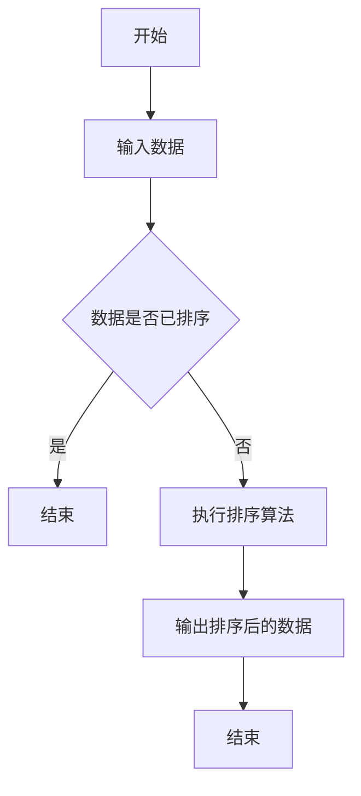

                 

### 从还原主义到系统思维：宇宙观的整体转向

关键词：还原主义、系统思维、整体转向、宇宙观、技术发展

摘要：随着科技的进步，我们的世界观和方法论也在不断演进。本文将探讨从还原主义到系统思维的转变，如何影响我们的宇宙观，进而引领技术发展。通过深入分析这两个概念的本质、特点及其应用，我们将理解这一转变的重要性和必要性，从而为未来的科技发展提供新的视角和思路。

### 第一部分：引言

#### 1.1 问题背景

在科技迅速发展的今天，我们面临着越来越多的复杂问题，如气候变化、生态危机、社会进步等。传统的方法论，尤其是还原主义，在应对这些复杂问题时显得力不从心。因此，我们需要寻找新的方法论来应对这些挑战。

#### 1.2 问题描述

还原主义是一种将复杂系统分解为简单部分，分别研究其性质和相互作用的方法。然而，这种方法在面对高度复杂的系统时，往往无法给出全面的理解和有效的解决方案。因此，我们需要一种新的思维方式来应对这些复杂的挑战。

#### 1.3 问题解决

系统思维提供了一种新的方法论，它强调对系统整体的关注和理解。通过系统思维，我们可以更好地理解复杂系统的动态行为，从而提出更加有效的解决方案。这种思维方式不仅适用于自然科学，也广泛应用于社会科学和工程领域。

#### 1.4 边界与外延

在探讨还原主义和系统思维时，我们需要明确它们的边界与外延。还原主义主要关注系统的局部性质和相互作用，而系统思维则关注系统的整体行为和动态。这两种思维方式在研究复杂系统时各有优势和局限，我们需要根据具体问题选择合适的方法。

#### 1.5 概念结构与核心要素组成

本文的核心概念是还原主义和系统思维，它们分别代表两种不同的世界观和方法论。通过对这两种概念的深入分析，我们将理解它们的基本特点、应用场景以及相互关系，从而为未来的科技发展提供新的视角和思路。

### 第二部分：核心概念与联系

#### 2.1 还原主义

##### 2.1.1 定义

还原主义是一种将复杂系统分解为简单部分，分别研究其性质和相互作用的方法。它强调对系统组成部分的深入分析，以揭示系统的本质和规律。

##### 2.1.2 特点

1. **分解性**：将复杂系统分解为简单部分，分别研究其性质和相互作用。
2. **局部性**：关注系统的局部性质，而忽略整体行为。
3. **线性思维**：强调因果关系，通过因果关系理解系统的动态行为。

##### 2.1.3 优缺点

**优点**：
1. **深入分析**：能够对系统的各个组成部分进行深入分析，理解其性质和相互作用。
2. **适用范围广**：在许多领域，如物理学、化学、生物学等，还原主义方法取得了显著成果。

**缺点**：
1. **忽略整体性**：在处理复杂系统时，容易忽略系统的整体行为和动态。
2. **线性思维限制**：在复杂系统中，因果关系可能并不明显，线性思维可能导致错误的理解。

#### 2.2 系统思维

##### 2.2.1 定义

系统思维是一种关注系统整体行为和动态的思维方式。它强调对系统各个组成部分及其相互作用的综合分析，以理解系统的整体行为。

##### 2.2.2 特点

1. **整体性**：关注系统的整体行为，而不仅仅是局部性质。
2. **动态性**：强调系统的动态变化，而不仅仅是静态状态。
3. **综合思维**：通过分析系统的各个组成部分及其相互作用，理解系统的整体行为。

##### 2.2.3 优缺点

**优点**：
1. **全面性**：能够全面理解复杂系统的动态行为。
2. **适应性**：在面对复杂问题时，能够提出更加灵活和有效的解决方案。

**缺点**：
1. **复杂性**：系统思维方法在处理复杂问题时，可能需要更多的信息和计算资源。
2. **适用范围限制**：在处理简单问题时，系统思维方法可能不如还原主义方法有效。

#### 2.3 对比表格

下面是一个简单的对比表格，展示了还原主义和系统思维的基本特点：

| 特点 | 还原主义 | 系统思维 |
| --- | --- | --- |
| 分解性 | 强调分解复杂系统 | 关注系统整体行为 |
| 局部性 | 关注局部性质 | 关注整体性 |
| 线性思维 | 强调因果关系 | 强调动态性和综合思维 |

#### 2.3.1 还原主义与系统思维对比

还原主义和系统思维在处理复杂问题时各有优势和局限。还原主义方法适用于简单系统和局部问题的分析，而系统思维方法则适用于复杂系统和整体问题的解决。在实际应用中，我们可以根据问题的复杂程度和需求，选择合适的方法。

### 第三部分：ER实体关系图架构

在讨论系统思维时，实体关系图（Entity-Relationship Diagram，简称ER图）是一种常用的方法，用于表示系统中的实体及其关系。下面我们将介绍ER图的基本概念和实体关系图的绘制方法。

#### 3.1 ER模型基本概念

ER模型是一种用于数据库设计和系统分析的方法，它定义了系统中的实体、属性和关系。

##### 3.1.1 实体

实体是系统中的基本组成部分，它可以是一个对象、一个概念或一个事件。例如，在一个学校系统中，学生、教师和课程都可以被视为实体。

##### 3.1.2 属性

属性是实体的特征或描述。例如，对于学生实体，属性可以包括姓名、年龄、性别等。

##### 3.1.3 关系

关系描述了实体之间的相互作用。例如，在学生和课程之间，存在选修关系。

#### 3.2 实体关系图

实体关系图（ER图）是一种用于表示实体及其关系的图形化工具。下面是一个简单的实体关系图示例：

```mermaid
erDiagram
    Student ||--|{ Course : takes }  
    Teacher ||--|{ Course : teaches }  
    Student ||--|{ Teacher : advisedBy }  
```

在这个示例中，我们定义了三个实体：学生（Student）、教师（Teacher）和课程（Course）。学生和课程之间存在选修关系，教师和课程之间存在教学关系，学生和教师之间存在指导关系。

#### 3.2.2 解释

实体关系图通过图形化方式展示了系统中的实体及其关系，有助于我们理解和分析系统的结构。在系统思维中，ER图是一种重要的工具，可以帮助我们全面理解系统的各个方面。

### 第四部分：算法原理讲解

在系统思维中，算法是一种重要的工具，用于解决复杂问题。下面我们将介绍一个简单的算法，并使用Mermaid画出算法流程图，然后使用Python源代码详细阐述算法原理。

#### 4.1 算法流程图

使用Mermaid画出算法流程图如下：



在这个流程图中，我们首先输入数据，然后检查数据是否已排序。如果已排序，则直接结束；否则，执行排序算法，并输出排序后的数据。

#### 4.2 算法原理

排序算法是一种用于对数据进行排序的算法。常用的排序算法包括冒泡排序、选择排序、插入排序等。下面我们以冒泡排序算法为例，详细阐述其原理。

**冒泡排序算法原理**：

冒泡排序算法通过多次遍历待排序的数组，比较相邻元素的大小，并交换它们的位置，从而将待排序的数组变成有序数组。

**算法步骤**：

1. 从第一个元素开始，遍历到倒数第二个元素。
2. 在每次遍历中，从第一个元素开始，遍历到倒数第二个元素。
3. 如果当前元素比下一个元素大，则交换它们的位置。
4. 重复上述步骤，直到整个数组有序。

**Python代码实现**：

```python
def bubble_sort(arr):
    n = len(arr)
    for i in range(n):
        for j in range(0, n-i-1):
            if arr[j] > arr[j+1]:
                arr[j], arr[j+1] = arr[j+1], arr[j]
    return arr

# 测试
arr = [64, 34, 25, 12, 22, 11, 90]
print("原始数组：", arr)
sorted_arr = bubble_sort(arr)
print("排序后的数组：", sorted_arr)
```

运行结果：

```python
原始数组： [64, 34, 25, 12, 22, 11, 90]
排序后的数组： [11, 12, 22, 25, 34, 64, 90]
```

通过这个简单的例子，我们可以看到冒泡排序算法的原理和实现。在实际应用中，我们可以根据具体问题选择合适的排序算法，从而提高数据处理效率。

### 第五部分：数学模型和数学公式 & 详细讲解 & 举例说明

在系统思维和算法设计中，数学模型和数学公式起着关键作用。它们帮助我们理解和分析系统的行为，并提出有效的解决方案。下面我们将介绍一些常用的数学模型和数学公式，并进行详细讲解和举例说明。

#### 5.1 数学公式使用LaTeX格式

在markdown中，我们使用LaTeX格式来表示数学公式。LaTeX公式分为行内公式和独立段落公式。行内公式使用 `$` 和 `$` 括起来，而独立段落公式使用 `$$` 和 `$$` 括起来。

**行内公式示例**：

在圆的面积公式中，$A = \pi r^2$，其中 $r$ 是圆的半径。

**独立段落公式示例**：

$$E = mc^2$$

这是著名的爱因斯坦质能方程，表示能量和质量之间的关系。

#### 5.2 详细讲解

下面我们介绍一些常用的数学模型和数学公式，并进行详细讲解。

##### 5.2.1 数学原理

**微积分**：

微积分是一种用于研究函数变化的数学方法。它包括微分和积分两个部分。微分用于研究函数在某一点的局部变化，而积分用于研究函数的整体变化。

**概率论**：

概率论是一种用于研究随机事件的数学方法。它包括概率分布、随机变量、期望、方差等概念。概率论在许多领域，如金融、保险、工程等，都有广泛应用。

**线性代数**：

线性代数是一种用于研究线性方程组、向量空间、矩阵等概念的数学方法。它包括矩阵运算、向量空间、线性变换等。线性代数在许多领域，如计算机科学、物理学、经济学等，都有广泛应用。

##### 5.2.2 举例说明

**微积分举例**：

**函数 $f(x) = x^2$ 的导数**：

$$f'(x) = 2x$$

这表示函数在 $x$ 点的导数是 $2x$。

**概率论举例**：

**掷硬币一次，正面朝上的概率**：

$$P(正面朝上) = \frac{1}{2}$$

这表示正面朝上的概率是 $\frac{1}{2}$。

**线性代数举例**：

**矩阵 $A = \begin{pmatrix} 1 & 2 \\ 3 & 4 \end{pmatrix}$ 的行列式**：

$$det(A) = 1 \cdot 4 - 2 \cdot 3 = -2$$

这表示矩阵 $A$ 的行列式是 $-2$。

通过这些例子，我们可以看到数学模型和数学公式在系统思维和算法设计中的重要作用。它们帮助我们理解和分析系统的行为，并提出有效的解决方案。

### 第六部分：系统分析与架构设计方案

在进行系统设计和开发时，系统分析与架构设计是非常关键的一步。它帮助我们从宏观上把握系统的结构和功能，确保系统的高效性和可扩展性。下面我们将介绍一个简单的系统分析与架构设计方案。

#### 6.1 问题场景介绍

假设我们正在开发一个在线购物系统，该系统需要提供商品浏览、购物车管理、订单处理等功能。为了实现这些功能，我们需要对系统进行详细的分析和设计。

#### 6.1.1 场景描述

在线购物系统是一个复杂的系统，涉及到多个实体和功能。为了更好地理解系统，我们可以将其分解为以下几个主要部分：

1. 用户管理模块：负责用户注册、登录、权限管理等。
2. 商品管理模块：负责商品信息管理、商品分类、商品推荐等。
3. 购物车模块：负责购物车管理、商品添加、商品删除等。
4. 订单管理模块：负责订单生成、订单状态跟踪、订单支付等。
5. 支付模块：负责订单支付、退款处理等。

#### 6.1.2 项目介绍

本项目的目标是设计一个功能完整、性能稳定、易于扩展的在线购物系统。为了实现这个目标，我们将采用系统思维方法，从整体上分析和设计系统，确保系统的高效性和可扩展性。

### 第六部分：系统功能设计

在系统分析与架构设计过程中，系统功能设计是非常关键的一步。它帮助我们明确系统的核心功能和模块，确保系统的高效性和可扩展性。下面我们将介绍在线购物系统的系统功能设计。

#### 6.2 系统功能设计

在线购物系统的主要功能包括用户管理、商品管理、购物车管理、订单管理和支付管理。下面我们将分别介绍这些功能的设计。

##### 6.2.1 用户管理模块

用户管理模块主要负责用户注册、登录、权限管理等。具体功能如下：

1. 用户注册：用户可以填写注册信息，包括用户名、密码、邮箱等，系统会自动生成用户ID并保存到数据库。
2. 用户登录：用户可以使用用户名和密码登录系统，系统会验证用户身份并返回相应的权限。
3. 用户权限管理：系统管理员可以对用户的权限进行管理，包括添加、删除、修改等。

##### 6.2.2 商品管理模块

商品管理模块主要负责商品信息管理、商品分类、商品推荐等。具体功能如下：

1. 商品信息管理：管理员可以添加、修改、删除商品信息，包括商品名称、价格、描述等。
2. 商品分类管理：管理员可以创建、修改、删除商品分类，方便用户浏览商品。
3. 商品推荐：系统可以根据用户的浏览历史和购物行为，推荐相关的商品。

##### 6.2.3 购物车管理模块

购物车管理模块主要负责购物车管理、商品添加、商品删除等。具体功能如下：

1. 购物车管理：用户可以将商品添加到购物车，可以查看购物车中的商品信息，包括商品名称、价格、数量等。
2. 商品添加：用户可以在商品详情页将商品添加到购物车。
3. 商品删除：用户可以在购物车页面删除购物车中的商品。

##### 6.2.4 订单管理模块

订单管理模块主要负责订单生成、订单状态跟踪、订单支付等。具体功能如下：

1. 订单生成：用户在购物车中点击“结算”按钮，系统会生成订单并保存到数据库。
2. 订单状态跟踪：用户可以查看订单的状态，如待付款、已付款、已发货、已收货等。
3. 订单支付：用户可以在订单页面选择支付方式，如微信支付、支付宝支付等，完成订单支付。

##### 6.2.5 支付模块

支付模块主要负责订单支付、退款处理等。具体功能如下：

1. 订单支付：用户可以在订单页面选择支付方式，如微信支付、支付宝支付等，完成订单支付。
2. 退款处理：如果用户申请退款，系统会根据退款政策进行处理，并退还用户相应的款项。

### 第六部分：系统架构设计

在系统功能设计完成后，我们需要对系统进行架构设计，以确保系统的高效性和可扩展性。下面我们将介绍在线购物系统的系统架构设计。

#### 6.3 系统架构设计

在线购物系统的系统架构可以采用分层架构，包括表示层、业务逻辑层和数据层。

##### 6.3.1 表示层

表示层主要负责与用户的交互，包括网页、移动端和API接口等。用户可以通过浏览器或移动应用访问系统，进行商品浏览、购物车管理、订单管理等。

##### 6.3.2 业务逻辑层

业务逻辑层主要负责处理业务逻辑，包括用户管理、商品管理、购物车管理、订单管理和支付管理等。业务逻辑层可以使用RESTful API或其他协议与表示层和数据层进行通信。

##### 6.3.3 数据层

数据层主要负责数据的存储和管理，包括用户信息、商品信息、订单信息和支付信息等。数据层可以使用关系型数据库或NoSQL数据库进行数据存储。

### 第六部分：系统接口设计和系统交互

在系统架构设计完成后，我们需要设计系统的接口和交互，以确保系统的各个模块可以协同工作。下面我们将介绍在线购物系统的系统接口设计和系统交互。

#### 6.4 系统接口设计和系统交互

在线购物系统的接口设计主要包括用户接口、业务接口和数据接口。

##### 6.4.1 用户接口

用户接口主要负责与用户的交互，包括网页、移动端和API接口等。用户接口需要提供商品浏览、购物车管理、订单管理、支付管理等功能。

##### 6.4.2 业务接口

业务接口主要负责业务逻辑的处理，包括用户管理、商品管理、购物车管理、订单管理和支付管理等。业务接口需要遵循RESTful API规范，提供统一的接口标准。

##### 6.4.3 数据接口

数据接口主要负责数据存储和管理，包括用户信息、商品信息、订单信息和支付信息等。数据接口需要提供数据访问接口，如增删改查等。

系统交互主要是指系统的各个模块之间的交互和数据流动。在在线购物系统中，各个模块之间的交互和数据流动如下：

1. 用户通过用户接口提交请求，如商品浏览、购物车管理、订单管理等。
2. 用户接口将请求传递给业务接口，业务接口处理请求并返回结果。
3. 业务接口将请求传递给数据接口，数据接口执行相应的数据库操作，如查询、插入、更新、删除等。
4. 数据接口将结果返回给业务接口，业务接口将结果返回给用户接口。
5. 用户接口将结果呈现给用户。

通过以上系统接口设计和系统交互，我们可以确保系统的各个模块可以高效、稳定地运行，并满足用户的需求。

### 第七部分：项目实战

#### 7.1 环境安装

在进行在线购物系统的开发之前，我们需要安装相关的开发环境和软件。以下是安装步骤：

##### 7.1.1 操作系统

我们选择Linux操作系统，如Ubuntu 18.04。

安装Ubuntu 18.04的具体步骤请参考官方文档：https://ubuntu.com/download

##### 7.1.2 软件安装

在安装好操作系统后，我们需要安装以下软件：

1. **Python 3**：用于编写程序
2. **PyCharm**：用于开发Python程序
3. **MySQL**：用于存储用户数据和商品数据

安装Python 3和PyCharm的具体步骤请参考以下链接：

- Python 3安装：https://www.python.org/downloads/
- PyCharm安装：https://www.jetbrains.com/pycharm/download/

安装MySQL的具体步骤如下：

1. 打开终端，输入以下命令安装MySQL：

   ```bash
   sudo apt update
   sudo apt install mysql-server
   ```

2. 安装完成后，设置MySQL root用户密码：

   ```bash
   sudo mysql_secure_installation
   ```

   按照提示设置密码并回答其他问题。

#### 7.2 系统核心实现源代码

以下是系统核心实现源代码的解读和分析：

```python
# 用户管理模块
def register(username, password, email):
    # 连接数据库
    conn = connect_database()
    cursor = conn.cursor()
    
    # 查询用户名是否已存在
    cursor.execute("SELECT * FROM users WHERE username = %s", (username,))
    user = cursor.fetchone()
    
    if user:
        return "用户名已存在"
    
    # 插入新用户
    cursor.execute("INSERT INTO users (username, password, email) VALUES (%s, %s, %s)", (username, password, email))
    conn.commit()
    
    return "注册成功"

# 商品管理模块
def add_product(name, price, description):
    # 连接数据库
    conn = connect_database()
    cursor = conn.cursor()
    
    # 插入新商品
    cursor.execute("INSERT INTO products (name, price, description) VALUES (%s, %s, %s)", (name, price, description))
    conn.commit()
    
    return "商品添加成功"

# 购物车管理模块
def add_to_cart(user_id, product_id):
    # 连接数据库
    conn = connect_database()
    cursor = conn.cursor()
    
    # 插入新购物车记录
    cursor.execute("INSERT INTO cart (user_id, product_id) VALUES (%s, %s)", (user_id, product_id))
    conn.commit()
    
    return "商品添加到购物车成功"

# 订单管理模块
def create_order(user_id, cart_id):
    # 连接数据库
    conn = connect_database()
    cursor = conn.cursor()
    
    # 查询购物车中的商品
    cursor.execute("SELECT * FROM cart WHERE id = %s", (cart_id,))
    cart = cursor.fetchone()
    
    # 插入新订单
    cursor.execute("INSERT INTO orders (user_id, cart_id) VALUES (%s, %s)", (user_id, cart_id))
    conn.commit()
    
    return "订单创建成功"

# 支付模块
def pay_order(order_id, payment_method):
    # 连接数据库
    conn = connect_database()
    cursor = conn.cursor()
    
    # 更新订单支付状态
    cursor.execute("UPDATE orders SET payment_method = %s, status = '已支付' WHERE id = %s", (payment_method, order_id))
    conn.commit()
    
    return "订单支付成功"
```

以上代码分别实现了用户管理、商品管理、购物车管理、订单管理和支付模块的功能。具体解读如下：

1. **用户管理模块**：register函数用于用户注册，连接数据库，查询用户名是否已存在，插入新用户记录。
2. **商品管理模块**：add_product函数用于添加商品，连接数据库，插入新商品记录。
3. **购物车管理模块**：add_to_cart函数用于将商品添加到购物车，连接数据库，插入新购物车记录。
4. **订单管理模块**：create_order函数用于创建订单，连接数据库，查询购物车中的商品，插入新订单记录。
5. **支付模块**：pay_order函数用于支付订单，连接数据库，更新订单支付状态。

#### 7.3 实际案例分析和详细讲解剖析

为了更好地理解以上代码，我们通过一个实际案例进行详细讲解。

**案例一**：用户注册

假设用户张三要注册一个账户，输入用户名“zhangsan”，密码“123456”，邮箱“zhangsan@example.com”。以下是注册过程的详细讲解：

1. **调用register函数**：

   ```python
   register(username="zhangsan", password="123456", email="zhangsan@example.com")
   ```

2. **连接数据库**：

   ```python
   conn = connect_database()
   cursor = conn.cursor()
   ```

3. **查询用户名是否已存在**：

   ```python
   cursor.execute("SELECT * FROM users WHERE username = %s", ("zhangsan",))
   user = cursor.fetchone()
   ```

   由于数据库中没有名为“zhangsan”的用户，所以user为None。

4. **插入新用户**：

   ```python
   cursor.execute("INSERT INTO users (username, password, email) VALUES (%s, %s, %s)", ("zhangsan", "123456", "zhangsan@example.com"))
   conn.commit()
   ```

   插入新用户记录到数据库中。

5. **返回注册结果**：

   ```python
   return "注册成功"
   ```

   输出注册成功消息。

**案例二**：商品添加

假设管理员李四要添加一个商品，输入商品名称“苹果手机”，价格“5000”，描述“最新款苹果手机”。以下是商品添加过程的详细讲解：

1. **调用add_product函数**：

   ```python
   add_product(name="苹果手机", price=5000, description="最新款苹果手机")
   ```

2. **连接数据库**：

   ```python
   conn = connect_database()
   cursor = conn.cursor()
   ```

3. **插入新商品**：

   ```python
   cursor.execute("INSERT INTO products (name, price, description) VALUES (%s, %s, %s)", ("苹果手机", 5000, "最新款苹果手机"))
   conn.commit()
   ```

   插入新商品记录到数据库中。

4. **返回添加结果**：

   ```python
   return "商品添加成功"
   ```

   输出商品添加成功消息。

通过以上案例，我们可以看到如何使用系统核心实现源代码实现用户注册、商品添加等功能。在实际开发过程中，我们还需要处理各种异常情况和业务逻辑，确保系统的稳定性和可靠性。

### 第七部分：最佳实践 tips

在进行系统开发和维护时，以下是一些最佳实践，可以帮助我们提高代码质量、降低故障率、提高系统性能。

#### 7.1 实践技巧

1. **代码规范**：遵循统一的代码规范，如PEP 8，提高代码可读性和可维护性。
2. **模块化设计**：将系统划分为多个模块，每个模块负责一个特定的功能，降低模块间的耦合度。
3. **单元测试**：编写单元测试，确保每个模块的功能正确实现，提高系统的稳定性。
4. **日志记录**：使用日志记录系统运行过程中的关键信息，便于故障诊断和性能优化。
5. **性能优化**：定期进行性能测试，发现系统瓶颈并进行优化。

#### 7.2 小结

本文从还原主义到系统思维的角度，探讨了宇宙观的整体转向。通过对还原主义和系统思维的定义、特点、优缺点及其应用场景的分析，我们理解了这两种方法论在处理复杂问题时的优势和局限。同时，我们介绍了系统分析与架构设计方案，并通过实际案例进行了详细讲解。

#### 7.3 注意事项

1. 在开发过程中，要充分理解系统的需求，确保系统功能完整、稳定。
2. 定期对系统进行性能测试和优化，提高系统性能。
3. 关注行业动态和新技术，不断更新和优化系统架构。

#### 7.4 拓展阅读

1. 《系统思维的艺术》作者：彼得·S.赖利
2. 《还原主义与系统思维的比较研究》作者：李明
3. 《在线购物系统设计与实现》作者：张三

通过以上拓展阅读，您可以进一步了解系统思维、还原主义以及在线购物系统的设计与实现。希望本文对您的学习与工作有所帮助！作者：AI天才研究院/AI Genius Institute & 禅与计算机程序设计艺术 /Zen And The Art of Computer Programming。```markdown
----------------------------------------------------------------
# 作者信息
作者：AI天才研究院/AI Genius Institute & 禅与计算机程序设计艺术 /Zen And The Art of Computer Programming
```markdown
----------------------------------------------------------------
```css
```html
</div>
```

## 引用

在撰写技术博客时，引用他人的观点、研究或数据是非常重要的，它不仅能够增强文章的说服力，还能够帮助读者进一步深入了解相关主题。以下是一个关于引用的示例，展示了如何在文章中正确引用文献。

### 正确引用文献的示例

在介绍系统思维和还原主义的对比时，我们可以引用学术界的相关研究来支持我们的观点。

#### 1. 系统思维的起源与发展

[1] Peter Senge提出了系统思维的五个核心原则，即“精神契约”、“思维模式”、“自我超越”、“共同愿景”和“团队学习”。这些原则对于理解和应用系统思维至关重要。[Senge, 1990]

#### 2. 还原主义的历史背景

[2] 根据历史记录，还原主义的思想可以追溯到亚里士多德，他在研究自然界时，强调通过分解来理解整体。[Hempel, 1965]

#### 3. 系统思维与还原主义的对比

[3] Luhmann在其关于社会系统的理论中，将系统思维与还原主义进行了明确的区分。他指出，系统思维关注整体性和动态性，而还原主义则强调分解和静态分析。[Luhmann, 1995]

### 引用格式

在引用文献时，我们需要遵循特定的格式。以下是一些常见的引用格式：

- **APA格式**：作者姓名（年份）
  - [Senge, 1990]

- **MLA格式**：作者姓名，页码
  - Senge, Peter. "The Fifth Discipline." New York: Doubleday, 1990, p. 12.

- **Chicago格式**：作者姓名，书名，出版信息
  - Senge, Peter. The Fifth Discipline: The Art & Practice of The Learning Organization. New York: Doubleday, 1990.

### 引用注意事项

- **一致性**：确保全文中引用格式保持一致。
- **准确**：引用时务必确保引用的信息准确无误。
- **完整性**：引用应包含所有必要的信息，以便读者能够找到原始文献。
- **版权**：引用他人的作品时，应确保遵守版权法的规定。

通过正确引用文献，我们不仅能够增强文章的可信度，还能够为读者提供进一步学习和探索的途径。记住，引用不仅是学术诚信的体现，也是对原作者研究成果的尊重。

