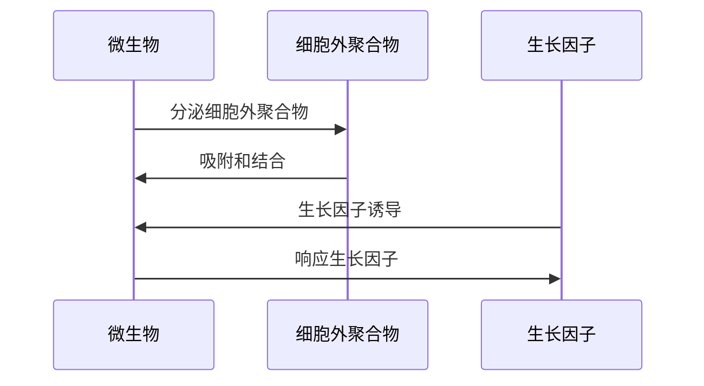
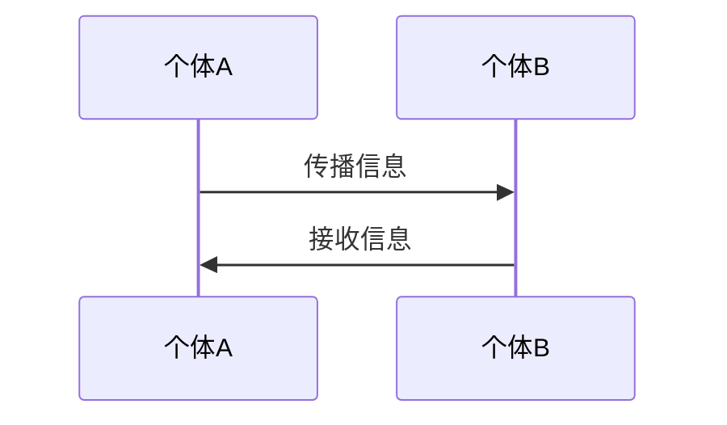

                 


### 1.1 问题背景

复杂系统是指在大量元素（组件）相互作用下形成的一个高度复杂、具有自组织和自适应能力的系统。这些元素可能是原子、分子、细胞、个体、组织、城市等。复杂系统的特点在于其整体行为不仅取决于组成它们的个体元素的属性，还受到元素之间相互作用的影响。正因为这种相互作用，复杂系统往往表现出难以预测、高度自适应和动态变化的特点。

#### 1.1.1 复杂系统的定义与挑战

复杂系统的定义因领域而异，但一般包括以下几个核心要素：
- **多层次性**：复杂系统由不同层次的元素组成，每个层次都有其特定的行为规则。
- **非线性相互作用**：系统中的元素之间存在非线性相互作用，这意味着它们的行为不是简单相加的。
- **自组织**：系统可以在没有外部指导的情况下形成和组织。
- **适应性**：系统能够根据环境和内部状态的变化进行适应。

然而，复杂系统也带来了巨大的挑战。首先，它们的复杂性使得对系统的全面理解变得极其困难。其次，传统的方法，如还原论，往往无法有效地描述和预测复杂系统的行为。例如，在社会科学中，即使了解了个体行为，也难以预测群体行为的整体趋势。此外，在工程技术中，复杂系统的设计、模拟和优化也面临着巨大的挑战。

#### 1.1.2 还原论与涌现理论的提出

还原论是一种试图通过分析系统组成部分及其相互作用来理解整体系统的理论。它强调从微观层面理解宏观现象，即通过研究构成系统的基本元素来理解系统的整体行为。然而，随着研究的深入，人们逐渐意识到还原论在某些情况下存在局限性。

为了更好地理解复杂系统，涌现理论应运而生。涌现理论认为，系统的整体行为和属性是由组成元素的相互作用产生的，这些行为和属性在组成元素层面上并不存在。涌现现象通常包括自组织、自适应、突现属性等。涌现理论强调从系统整体的角度来理解系统行为，而不是仅仅关注其组成部分。

这两种理论在解释复杂系统方面各有优缺点。还原论在理解系统的基本原理和机制方面具有优势，但在处理高度复杂的系统时可能显得力不从心。而涌现理论则能够更好地描述复杂系统的整体行为，但在解释系统的具体细节方面可能不够深入。

接下来，我们将更详细地探讨还原论和涌现论的基本原理、局限性和优势。

----------------------------------------------------------------

### 1.2 问题的描述

在讨论复杂系统的理解过程中，还原论和涌现论为我们提供了两种不同的视角。然而，随着科学技术的不断进步，传统方法在处理复杂系统时逐渐暴露出一些局限性，从而引发了以下几个主要问题：

#### 1.2.1 复杂系统面临的困难

1. **多层次性与非线性的挑战**：
   复杂系统往往由不同层次和类型的元素组成，每个层次和类型都有其特定的行为规则和相互关系。这种多层次性和非线性使得对系统的理解和建模变得极其复杂，传统的还原论方法难以捕捉到这些复杂的相互作用。

2. **整体行为的不可预测性**：
   复杂系统的整体行为往往不可预测，即使是了解了系统中每个元素的属性和行为，也很难准确预测系统的整体表现。例如，在社会科学中，即使对个体行为有深刻理解，群体行为的涌现现象仍然难以预测。

3. **信息丢失与简化**：
   在还原论的方法中，通常需要对系统进行简化和抽象，这可能导致重要的信息和细节被丢失。这种信息丢失可能会影响对系统整体行为的理解。

4. **计算资源的限制**：
   复杂系统的规模和复杂性往往需要大量的计算资源来模拟和预测。在现有的计算能力下，对某些复杂系统进行精确的模拟和预测仍然是一个巨大的挑战。

#### 1.2.2 现有理论的局限性

1. **还原论的局限性**：
   还原论强调从微观层面理解宏观现象，但它往往无法解释系统的整体行为。例如，在生物学中，即使理解了每个细胞的行为，也无法直接推断出整个生物体的行为。此外，还原论方法在处理高度非线性、多层次和自适应的系统时显得力不从心。

2. **涌现论的局限性**：
   涌现论强调系统整体行为的重要性，但在解释具体细节方面可能存在不足。例如，在计算机科学中，尽管涌现理论能够解释软件系统的自组织和自适应特性，但具体实现细节和算法设计仍然需要依赖还原论的方法。

3. **跨学科整合的挑战**：
   复杂系统通常涉及多个学科，如物理学、生物学、社会科学、工程学等。不同学科的理论和方法在整合时可能会存在矛盾和冲突，这使得跨学科的研究变得更加复杂。

为了解决上述问题，需要发展新的理论和方法，以便更好地理解和处理复杂系统。这一需求催生了从还原论到涌现论的理论转变，为复杂系统的可理解性带来了新的希望。

接下来，我们将深入探讨还原论和涌现论的基本原理，以及它们在复杂系统研究中的应用和局限性。

----------------------------------------------------------------

### 1.3 问题的解决

为了解决复杂系统面临的挑战和现有理论的局限性，我们需要引入新的理论和方法，其中涌现理论提供了一种更有效的视角。通过以下步骤，我们可以更好地理解和处理复杂系统：

#### 1.3.1 还原论的不足

首先，我们来探讨还原论的一些不足之处。还原论的核心思想是，通过分析系统的组成部分和它们之间的相互作用，可以理解系统的整体行为。这种方法在许多情况下是有效的，尤其是在物理、化学和工程等领域的简单系统中。然而，在处理复杂系统时，还原论的局限性逐渐显现：

1. **信息丢失与简化**：
   还原论往往需要对系统进行简化和抽象，这可能导致重要信息和细节的丢失。例如，在生物学中，即使理解了每个细胞的行为，也难以直接推断出整个生物体的行为。

2. **非线性与多层次性**：
   复杂系统通常具有非线性相互作用和多层次结构，这些特性使得单纯依赖还原论难以捕捉到系统中的复杂动态。

3. **整体行为不可预测性**：
   由于还原论主要关注微观层面，而复杂系统的整体行为往往不可预测，这使得还原论方法在处理复杂系统时显得力不从心。

#### 1.3.2 涌现理论的优势

为了克服还原论的不足，涌现理论提供了一个更宏观的视角。涌现理论的核心思想是，系统的整体行为和属性是由组成元素的相互作用产生的，这些行为和属性在组成元素层面上并不存在。以下是涌现理论的一些优势：

1. **整体行为的重要性**：
   涌现理论强调系统整体行为的重要性，这有助于我们更好地理解复杂系统的动态变化和涌现现象。例如，在社会科学中，涌现理论可以解释群体行为的涌现现象，如群体智慧和社会动力学。

2. **自组织与自适应**：
   涌现理论强调系统的自组织和自适应能力，这有助于我们设计更具有适应性的系统和算法。例如，在计算机科学中，涌现理论可以指导我们设计和实现具有自适应特性的软件系统。

3. **多层次理解**：
   涌现理论提供了多层次理解复杂系统的框架，使我们能够从不同的层次和视角来研究系统。这种方法有助于我们更好地整合不同学科的理论和方法，从而解决跨学科整合的挑战。

#### 1.3.3 转变的原因

从还原论到涌现论的转变有几个主要原因：

1. **科学发展的需要**：
   随着科学技术的进步，复杂系统的研究变得越来越重要。传统方法在处理这些系统时显得力不从心，因此需要新的理论和方法来更好地理解复杂系统。

2. **技术进步的驱动**：
   计算机技术和计算能力的提升为处理复杂系统提供了新的工具和方法。这些技术进步推动了涌现理论的发展和应用。

3. **跨学科整合的需求**：
   复杂系统通常涉及多个学科，如物理学、生物学、社会科学和工程学。涌现理论提供了一个跨学科整合的框架，有助于我们更好地理解这些系统。

通过引入涌现理论，我们可以更好地理解复杂系统的行为，克服还原论的局限性。接下来，我们将进一步探讨涌现理论的基本原理、数学模型和应用。

----------------------------------------------------------------

### 1.4 边界与外延

在讨论从还原论到涌现论的转变时，了解这一理论的边界和外延是非常重要的。这不仅有助于明确涌现理论的应用范围，还能帮助我们理解其局限性。

#### 1.4.1 复杂系统的分类

复杂系统可以根据其组成元素、结构和行为特性进行分类。常见的分类方法包括：

1. **基于元素性质的分类**：
   - **原子与分子系统**：例如，固体、液体和气体的物理性质。
   - **细胞与器官系统**：例如，生物学中的细胞和组织。
   - **个体与社会系统**：例如，社会网络和群体行为。

2. **基于结构特性的分类**：
   - **静态系统**：例如，图论中的网络结构。
   - **动态系统**：例如，时间序列分析中的动态网络。

3. **基于行为特性的分类**：
   - **确定性系统**：例如，经典的物理系统。
   - **随机系统**：例如，金融市场和社交网络。

不同类型的复杂系统在涌现现象的表现上存在差异，因此，涌现理论的应用也需要根据具体系统类型进行调整。

#### 1.4.2 理论的应用范围

涌现理论的应用范围非常广泛，涵盖了自然科学、社会科学、工程技术和计算机科学等多个领域：

1. **自然科学**：
   - **生物学**：涌现理论可以解释生物体的自组织和适应性，如细胞分化和群体行为。
   - **物理学**：在凝聚态物理和量子系统中，涌现现象表现为相变和量子计算。
   - **地球科学**：地球系统的复杂性，如气候变化和地震活动，可以通过涌现理论进行建模。

2. **社会科学**：
   - **经济学**：市场行为的涌现现象，如股票价格波动和金融危机。
   - **社会学**：社会行为的涌现现象，如群体情绪和集体行为。

3. **工程技术**：
   - **网络技术**：互联网和社交网络的拓扑结构及其涌现行为。
   - **控制系统**：复杂控制系统的自组织和自适应特性。

4. **计算机科学**：
   - **软件工程**：软件系统的自组织和适应性设计。
   - **人工智能**：机器学习的自组织和自适应特性。

尽管涌现理论在各个领域都有广泛的应用，但其在某些情况下仍然存在局限性。例如，在微观层面上，涌现理论可能无法解释具体的机制和细节。此外，在处理高度动态和复杂的系统时，涌现理论的建模和计算方法可能需要进一步发展和优化。

#### 1.4.3 理论的应用边界

涌现理论的应用边界主要表现在以下几个方面：

1. **计算资源限制**：
   涌现现象通常涉及大量的元素和复杂的相互作用，这需要大量的计算资源来模拟和预测。在有限的计算能力下，处理大规模复杂系统仍然是一个挑战。

2. **理论整合的难度**：
   复杂系统往往涉及多个学科的理论和方法，涌现理论在跨学科整合时可能会遇到困难。如何有效地整合不同学科的理论和方法，是未来研究的一个重要方向。

3. **模型简化的取舍**：
   涌现理论的建模过程往往需要对系统进行简化和抽象，这可能会导致重要信息的丢失。如何在简化和精确之间取得平衡，是一个需要深入研究的课题。

通过明确涌现理论的边界和外延，我们可以更有效地应用这一理论，同时也对其局限性有更清晰的认识。接下来，我们将深入探讨涌现理论的核心概念和基本原理，以进一步理解这一重要理论。

----------------------------------------------------------------

### 1.5 核心概念结构与要素组成

在深入探讨复杂系统的可理解性之前，我们需要明确一些核心概念，这些概念是理解涌现理论及其在复杂系统中的应用的基础。

#### 1.5.1 还原论与涌现论的概念

**还原论**是一种试图通过分析系统组成部分及其相互作用来理解整体系统的理论。还原论的核心思想是，通过理解系统的基本元素和它们之间的相互作用，可以推导出系统的整体行为。在还原论的框架下，系统被分解为可独立分析的部分，每个部分的行为可以通过物理、化学、生物等基本原理进行解释。

**涌现论**则强调系统整体行为和属性是由组成元素的相互作用产生的，这些行为和属性在组成元素层面上并不存在。涌现论的核心思想是，系统的整体行为不能简单地从其组成部分的行为中推导出来，而是需要通过系统层面的相互作用和自组织来解释。涌现现象包括自组织、自适应和突现属性等。

**还原论与涌现论的比较**

| 对比项 | 还原论 | 涌现论 |
| :----: | :-----: | :-----: |
| 关注点 | 组成部分的相互作用 | 系统的整体行为和属性 |
| 方法论 | 分解和分析 | 整体建模和模拟 |
| 适用范围 | 简单系统 | 复杂系统 |
| 力量 | 提供基本原理和机制 | 解释整体行为和涌现现象 |

通过以上比较，我们可以看到还原论和涌现论在解释复杂系统时各有优缺点。还原论在理解系统的基本原理和机制方面具有优势，但在处理高度复杂的系统时可能显得力不从心。而涌现论则能够更好地描述复杂系统的整体行为，但在解释系统的具体细节方面可能不够深入。

#### 1.5.2 相关概念的比较与分析

除了还原论和涌现论，还有一些与复杂系统相关的核心概念，如复杂性、自组织、自适应等。以下是对这些概念的比较与分析：

**复杂性**：复杂性是指系统在结构、行为和演化过程中表现出的难以理解和预测的特性。复杂性可以分为多种类型，如结构复杂性、行为复杂性和动态复杂性。在复杂系统中，复杂性表现为系统的多层次性、非线性相互作用和不确定性。

**自组织**：自组织是指系统在没有外部指导的情况下，通过内部相互作用形成有序结构或行为的过程。自组织现象在许多自然和人工系统中都存在，如生物体的生长、社交网络的演化等。

**自适应**：自适应是指系统根据环境和内部状态的变化进行适应和调整的能力。自适应系统可以通过学习、反馈和控制机制来优化其行为，以适应不断变化的环境。

**涌现现象**：涌现现象是指系统的整体行为和属性在组成元素的层面上并不存在，而是在系统层面上表现出来的特性。涌现现象包括自组织、自适应和突现属性等，如社交网络中的群体智慧、经济系统中的市场波动等。

| 概念 | 定义 | 关联性 |
| :----: | :-----: | :-----: |
| 复杂性 | 系统难以理解和预测的特性 | 复杂系统的基础 |
| 自组织 | 系统内部相互作用形成有序结构或行为 | 涌现现象的一部分 |
| 自适应 | 系统根据环境和内部状态的变化进行适应 | 复杂系统的重要特性 |
| 涌现现象 | 系统整体行为和属性在组成元素层面上不存在 | 复杂系统的典型特征 |

通过这些核心概念的比较与分析，我们可以更深入地理解复杂系统的本质和涌现现象。这些概念不仅为研究复杂系统提供了理论框架，还为我们设计具有自适应和自组织特性的系统提供了指导。

接下来，我们将进一步探讨还原论和涌现论在具体领域中的应用，以加深对这两种理论的理解。

----------------------------------------------------------------

### 2.1 还原论概述

还原论作为一种研究复杂系统的理论方法，其核心思想在于将复杂系统分解为简单的组成部分，通过分析这些组成部分的相互作用来理解整体系统的行为。这种方法在许多科学和工程领域中都有着广泛的应用。以下是还原论的基本原理、应用领域以及其代表性人物和理论成果：

#### 2.1.1 还原论的定义

**定义**：还原论是一种试图通过分析系统组成部分及其相互作用来理解整体系统的理论。它强调从微观层面理解宏观现象，即通过研究构成系统的基本元素来理解系统的整体行为。

**原理**：还原论的基本原理包括以下几个要点：

1. **组成部分分析**：将复杂系统分解为基本组成部分，如原子、分子、细胞、个体等。
2. **相互作用研究**：研究这些组成部分之间的相互作用，包括物理、化学、生物等相互作用。
3. **微观机制推导**：通过分析组成部分的相互作用，推导出整体系统的行为和特性。

#### 2.1.2 还原论的基本原理

1. **分解与层次化**：还原论认为，复杂系统可以分解为不同层次的组成部分，每个层次都有其特定的行为规则。通过层次化的方法，可以逐步理解系统的复杂性。

2. **因果关系**：还原论强调因果关系，即系统整体行为可以通过对组成部分之间因果关系的分析来理解。这种方法在物理学和工程学中得到了广泛应用。

3. **独立性**：还原论假设系统组成部分是相对独立的，其行为可以通过单独分析来理解。这有助于简化系统的分析过程。

4. **预测性**：通过分析组成部分的行为和相互作用，还原论可以预测整体系统的行为。这种方法在科学研究中具有重要意义。

#### 2.1.3 还原论的应用领域

还原论在多个领域有着广泛的应用，包括物理学、化学、生物学、计算机科学等：

1. **物理学**：在物理学中，还原论被用来研究微观粒子的行为，如原子、分子和量子系统。通过分析这些基本组成部分的行为，可以理解宏观物理现象。

2. **化学**：化学中的化学反应可以通过还原论方法来研究。通过分析反应物和生成物的组成和相互作用，可以理解化学反应的本质。

3. **生物学**：在生物学中，还原论被用来研究生物体的微观结构，如细胞和分子。通过分析这些基本组成部分，可以理解生物体的功能和演化。

4. **计算机科学**：在计算机科学中，还原论被用来分析算法和软件系统的性能。通过分解算法和系统的组成部分，可以优化算法和系统设计。

#### 2.1.4 还原论的代表性人物和理论成果

1. **艾萨克·牛顿**：牛顿是还原论的奠基人之一，他的经典力学理论通过分析物体的运动和力的作用，建立了物理学的基础。

2. **罗伯特·奥本海默**：奥本海默在物理学和核能研究中提出了还原论方法，通过分析原子核的结构和相互作用，推动了核物理学的发展。

3. **约翰·冯·诺依曼**：冯·诺依曼在计算机科学中提出了存储程序计算机的概念，通过分解计算机的组成部分和相互作用，奠定了现代计算机科学的基础。

4. **马克斯·普朗克**：普朗克在物理学中提出了量子理论，通过分析微观粒子的行为，揭示了量子世界的本质。

还原论的基本原理和方法在许多领域都得到了广泛应用，为科学研究和技术发展提供了强大的理论支持。然而，随着科学研究的深入，人们逐渐意识到还原论在某些情况下存在局限性，特别是在处理高度复杂的系统时。这促使了涌现理论的提出，为复杂系统的理解和处理提供了新的视角和方法。

接下来，我们将探讨还原论的局限性，以深入了解其在处理复杂系统时的不足之处。

----------------------------------------------------------------

### 2.2 还原论的局限性与挑战

尽管还原论在许多领域取得了显著的成果，但其局限性在处理高度复杂的系统时逐渐显现。以下将从以下几个方面探讨还原论的局限性和挑战：

#### 2.2.1 对象分解的局限性

**问题背景**：在还原论的方法中，复杂系统被分解为简单的组成部分，如原子、分子、细胞等。然而，这种分解方法在处理高度复杂的系统时存在局限性。

**原因分析**：
1. **多层次性**：复杂系统往往具有多层次结构，每个层次都有其特定的行为规则。单纯的分解方法难以捕捉到不同层次之间的复杂相互作用。
2. **非线性相互作用**：系统中的元素之间存在非线性相互作用，这意味着它们的行为不是简单相加的。还原论方法在处理这种非线性相互作用时可能不够准确。
3. **信息丢失**：在分解过程中，系统中的部分信息和细节可能会被丢失。这可能导致对整体系统的理解出现偏差。

**解决方案**：
1. **多层次分析方法**：采用多层次分析方法，从不同层次和视角来研究系统。这有助于更好地理解系统的复杂结构。
2. **综合方法**：结合不同理论和方法，如涌现理论和系统动力学，以弥补单一方法的局限性。

#### 2.2.2 信息的丢失与简化

**问题背景**：在还原论的方法中，通常需要对系统进行简化和抽象，以降低系统的复杂性。然而，这种简化过程可能导致重要信息的丢失。

**原因分析**：
1. **模型简化**：为了便于分析，研究人员往往需要对系统进行模型简化，这可能导致一些关键信息被忽略。
2. **参数缩减**：在建模过程中，可能需要对系统的参数进行缩减，以降低计算复杂度。这可能导致一些关键参数被忽略。
3. **人为选择**：在分解和简化的过程中，研究人员可能会根据个人判断进行选择，这可能导致一些重要的信息和关系被遗漏。

**解决方案**：
1. **精细化建模**：在模型构建过程中，尽量保持系统的细节和复杂性，避免过多的简化。
2. **多模型对比**：采用多个模型进行比较和分析，以验证和修正模型中的潜在偏差。
3. **跨学科整合**：结合不同学科的理论和方法，从多个角度来研究系统，以提高模型的准确性和完整性。

#### 2.2.3 非线性与自适应系统的挑战

**问题背景**：许多复杂系统，如生物系统、生态系统和社会系统，具有非线性特性和自适应能力。还原论在处理这些系统时可能面临挑战。

**原因分析**：
1. **非线性相互作用**：系统中的元素之间存在复杂的非线性相互作用，这可能导致系统的行为难以预测。
2. **自适应能力**：系统可能具有自适应能力，即根据环境和内部状态的变化进行自我调整。这种自适应能力在还原论的方法中难以体现。

**解决方案**：
1. **非线性动力学分析**：采用非线性动力学的方法来分析系统的行为，以捕捉系统中的非线性相互作用。
2. **自适应模型**：构建自适应模型，以模拟系统的自适应能力。这需要结合涌现理论和系统动力学等方法。
3. **跨学科研究**：结合生物学、生态学和社会科学等领域的理论和方法，以更全面地理解复杂系统的自适应特性。

#### 2.2.4 计算资源的限制

**问题背景**：处理高度复杂的系统通常需要大量的计算资源。还原论方法在计算复杂度方面可能面临挑战。

**原因分析**：
1. **计算需求**：还原论方法需要对系统的每个组成部分及其相互作用进行详细分析，这可能导致计算需求急剧增加。
2. **时间复杂性**：许多还原论方法具有高时间复杂性，即计算时间随着系统规模的增加而急剧增加。

**解决方案**：
1. **并行计算**：采用并行计算的方法来提高计算效率，以应对大规模复杂系统的计算需求。
2. **近似算法**：采用近似算法来降低计算复杂度，以在有限计算资源下处理复杂系统。
3. **分布式计算**：利用分布式计算技术，将计算任务分布在多个计算节点上，以提高计算效率和速度。

通过以上分析，我们可以看到还原论在处理高度复杂的系统时存在一些局限性。为了克服这些局限性，需要结合多种理论和方法，如涌现理论和系统动力学，以提供更全面和准确的理解。接下来，我们将进一步探讨涌现理论的基本原理和优势。

----------------------------------------------------------------

### 3.1 涌现理论概述

涌现理论是一种探讨复杂系统整体行为和属性的理论，其核心思想是，系统的整体行为和属性是由组成元素的相互作用产生的，这些行为和属性在组成元素层面上并不存在。以下将从涌现理论的基本概念、历史背景、核心思想、数学模型等方面进行详细阐述。

#### 3.1.1 涌现理论的基本概念

**涌现现象**：涌现现象是指系统的整体行为和属性在组成元素的层面上不存在，但在系统层面上表现出来的特性。例如，在社交网络中，个体的行为可能表现为整体的群体智慧。

**自组织**：自组织是指系统在没有外部指导的情况下，通过内部相互作用形成有序结构或行为的过程。自组织现象在许多自然和人工系统中都存在，如生物体的生长、社交网络的演化等。

**自适应**：自适应是指系统根据环境和内部状态的变化进行适应和调整的能力。自适应系统可以通过学习、反馈和控制机制来优化其行为，以适应不断变化的环境。

**突现属性**：突现属性是指系统的整体属性，这些属性无法从组成元素的属性中直接推导出来。例如，在化学反应中，某些新物质的属性可能无法通过单独分析反应物和生成物来理解。

#### 3.1.2 历史背景

涌现理论的发展可以追溯到20世纪初期，当时科学家们开始关注复杂系统的整体行为和属性。一些重要的理论家，如赫伯特·西蒙（Herbert Simon）、尼古拉斯·沃尔夫（Nicholas Wolff）和约翰·霍兰（John Holland），对涌现理论的发展做出了重要贡献。

**赫伯特·西蒙**：西蒙提出了“有限理性”理论，认为人类行为和认知受到信息处理能力和认知能力的限制。这一理论为涌现理论提供了理论基础。

**尼古拉斯·沃尔夫**：沃尔夫提出了“群体智能”理论，认为群体中的个体可以通过协作实现比单独个体更高效的任务。这一理论强调了涌现现象在社会系统和生物系统中的应用。

**约翰·霍兰**：霍兰是涌现理论的代表人物之一，他提出了“复杂适应性系统”（Complex Adaptive System，CAS）的概念，并研究了这些系统在经济学、生物学和社会学中的应用。

#### 3.1.3 核心思想

涌现理论的核心思想包括以下几个方面：

1. **整体大于部分**：涌现理论强调系统的整体行为和属性不能简单地从组成元素的行为中推导出来。整体系统的行为往往具有全新的特性和规律。

2. **自组织和自适应**：涌现理论认为，复杂系统可以通过自组织和自适应过程来形成和调整其行为。这种过程不需要外部指导，而是通过系统内部相互作用来实现。

3. **非线性相互作用**：涌现现象通常与非线性相互作用密切相关。系统中的元素之间不是简单的线性关系，而是存在复杂的反馈和相互影响。

4. **多层次性**：涌现理论认为，复杂系统具有多层次结构，每个层次都有其特定的行为规则。这些层次之间的相互作用是涌现现象的关键。

#### 3.1.4 数学模型

涌现理论的数学模型主要包括以下几种：

1. **分岔理论和混沌理论**：分岔理论和混沌理论用于描述系统在临界点附近的行为，这些理论可以揭示系统从有序到无序的突变过程。

2. **复杂网络模型**：复杂网络模型用于描述系统中元素之间的相互作用和连接结构，这些模型可以揭示涌现现象在网络系统中的应用。

3. **元胞自动机**：元胞自动机是一种离散模型，用于模拟系统中元素的相互作用和演化过程。元胞自动机可以产生复杂的模式和结构，从而揭示涌现现象。

4. **Agent-Based Model（ABM）**：Agent-Based Model 是一种基于个体的模型，用于模拟复杂系统的行为。通过模拟个体之间的相互作用和决策过程，可以揭示涌现现象在个体层面和系统层面的差异。

通过这些数学模型，我们可以更深入地理解和预测复杂系统的涌现行为。涌现理论不仅为复杂系统的研究提供了新的理论框架，还在社会科学、自然科学和工程领域中得到了广泛应用。

接下来，我们将进一步探讨涌现理论的数学模型和应用。

----------------------------------------------------------------

### 3.2 涌现理论的数学模型

涌现理论在复杂系统分析中的应用得益于其丰富的数学模型，这些模型能够帮助我们定量地理解和预测系统的涌现行为。以下将介绍几种典型的数学模型，包括相似性原理、涌现方程等，并解释其工作原理和应用。

#### 3.2.1 相似性原理

相似性原理是涌现理论中一个重要的概念，它指出不同系统在结构和行为上可能存在相似性，即使这些系统在物理上完全不同。相似性原理的数学表达通常涉及相似性系数，用于量化系统之间的相似度。

**相似性系数**：相似性系数是一个衡量系统相似性的指标，通常通过比较系统参数和结构特征来计算。相似性系数可以用于预测一个系统的行为如何转移到另一个相似系统中。

**数学表达**：设系统A和系统B具有相似性系数σ，则有：

$$
σ = \frac{f(A)}{f(B)}
$$

其中，f(A)和f(B)分别表示系统A和系统B的某些特征函数。

**应用**：相似性原理在工程设计和模型预测中非常有用。例如，在流体力学中，通过相似性原理可以将一个复杂流体的行为简化为一个简单的模型，从而降低计算成本。相似性原理也可以用于模拟不同生态系统中的生态过程，预测环境变化对生物多样性的影响。

#### 3.2.2 涌现方程

涌现方程是描述复杂系统涌现行为的数学方程，它通常涉及系统内部的非线性相互作用和相变过程。涌现方程可以帮助我们理解系统的突现属性和整体行为。

**类型**：
1. **标量涌现方程**：用于描述系统中某个标量属性的演化，如种群数量、温度等。
2. **向量涌现方程**：用于描述系统中多个属性的同时演化，如社会网络中的信任度、权力分布等。

**数学表达**：一个简单的涌现方程可以表示为：

$$
\frac{dX}{dt} = f(X, \mathbf{Y})
$$

其中，X是系统的主要变量，Y是影响系统行为的其他变量，f是描述系统行为的函数。

**应用**：涌现方程广泛应用于生物学、经济学和社会科学等领域。例如，在生物学中，涌现方程可以描述种群动态和生态平衡；在经济学中，可以用于预测市场波动和金融危机；在社会科学中，可以用于分析社会网络和集体行为。

#### 3.2.3 元胞自动机

元胞自动机（Cellular Automaton，CA）是一种离散模型，由约翰·冯·诺伊曼在20世纪40年代提出。它由一个网格组成，每个网格上的单元（细胞）根据其当前状态和邻居的状态进行更新。

**规则**：元胞自动机的更新规则通常由局部规则定义，这些规则决定了细胞在下一时刻的状态。常见的规则包括“生”、“死”状态以及“存活”和“灭绝”条件。

**数学表达**：一个简单的元胞自动机规则可以表示为：

$$
s_{ij}^{t+1} = R(s_{ij}^{t}, s_{i-1,j}^{t}, s_{i+1,j}^{t}, s_{i,j-1}^{t}, s_{i,j+1}^{t})
$$

其中，\(s_{ij}^{t}\)是第t时刻位于(i, j)位置上的细胞状态，R是更新规则函数。

**应用**：元胞自动机广泛应用于模拟复杂系统的动态行为，如交通流、传染病传播、社会行为等。通过设计合适的更新规则，我们可以模拟出各种涌现现象，如相变、自组织和自适应行为。

#### 3.2.4 复杂网络模型

复杂网络模型用于描述系统中元素之间的相互作用和连接结构，这些模型可以揭示涌现现象在网络系统中的应用。常见的复杂网络模型包括无标度网络、小世界网络和模块化网络等。

**无标度网络**：无标度网络的度分布呈现幂律分布，这意味着网络中的节点连接数分布非常不均匀。这种网络具有高度可扩展性和鲁棒性。

**小世界网络**：小世界网络具有短路径长度和高聚类系数的特点，这意味着网络中的节点可以通过少量的连接迅速到达其他节点。

**模块化网络**：模块化网络具有明显的模块结构，节点被划分为不同的模块，模块之间的连接较少，而模块内部连接丰富。

**数学表达**：复杂网络模型通常通过图论来描述，图的节点和边可以表示系统中的元素和它们之间的相互作用。

**应用**：复杂网络模型广泛应用于社会网络、通信网络、生物网络等领域。通过分析网络的结构特性，我们可以揭示系统的涌现行为，如信息传播、协同工作和社会影响等。

通过上述数学模型，我们可以更深入地理解涌现现象在复杂系统中的应用。这些模型不仅为理论研究提供了强大的工具，还在实际应用中具有广泛的前景。

接下来，我们将进一步探讨涌现理论的核心特性，包括自组织与自适应等，以深入理解其应用价值。

----------------------------------------------------------------

### 3.3 涌现理论的核心特性

涌现理论的核心特性包括自组织、自适应、结构复杂性和功能复杂性。这些特性共同构成了涌现理论的基本框架，并使其在复杂系统的研究中具有独特的优势。

#### 3.3.1 自组织

**定义**：自组织是指系统在没有外部指导的情况下，通过内部相互作用形成有序结构或行为的过程。自组织现象在许多自然和人工系统中都存在，如生物体的生长、社交网络的演化等。

**机制**：
1. **非线性和反馈**：自组织过程通常涉及非线性相互作用和反馈机制。系统中的元素通过相互影响和反馈，逐渐形成有序的结构或行为。
2. **临界点**：在许多自组织过程中，系统会在某一临界点发生突变，从无序状态转变为有序状态。这个临界点是自组织现象的关键。

**应用**：
- **生物学**：生物体的生长和发育过程体现了自组织现象。例如，细胞的增殖和分化是通过自组织过程实现的。
- **社会学**：社交网络的演化也体现了自组织现象。个体之间的互动和合作逐渐形成了复杂的社交结构。

#### 3.3.2 自适应

**定义**：自适应是指系统根据环境和内部状态的变化进行适应和调整的能力。自适应系统能够通过学习、反馈和控制机制来优化其行为，以适应不断变化的环境。

**机制**：
1. **学习与进化**：自适应系统可以通过学习和进化机制来适应环境。学习机制使系统能够从历史经验中学习并调整行为，而进化机制使系统能够在长期演化过程中优化其结构。
2. **反馈与控制**：自适应系统通常具有反馈和控制机制，这些机制有助于系统监测其行为并做出相应的调整。

**应用**：
- **计算机科学**：自适应算法在机器学习、人工智能和软件工程中得到了广泛应用。例如，自适应控制器可以根据环境变化调整其参数，以实现最优控制效果。
- **经济学**：市场经济的自适应特性体现在个体根据市场信号调整其行为，从而实现市场的自我调整和优化。

#### 3.3.3 结构复杂性

**定义**：结构复杂性是指系统在结构和组成上的复杂程度。复杂系统的结构通常具有多层次性、非线性相互作用和多样性。

**特性**：
1. **多层次性**：复杂系统通常由不同层次的元素组成，每个层次都有其特定的行为规则和相互关系。
2. **非线性相互作用**：系统中的元素之间存在复杂的非线性相互作用，这意味着它们的行为不是简单相加的。
3. **多样性**：复杂系统通常具有多样性的结构，这意味着系统可以表现出多种不同的行为和状态。

**应用**：
- **物理学**：凝聚态物理中的相变现象体现了结构复杂性。在临界点附近，系统会表现出复杂的相变行为。
- **生态学**：生态系统的多样性反映了其结构复杂性。生态系统中存在多种生物种类和复杂的食物网，这些特性使得生态系统具有高度适应性。

#### 3.3.4 功能复杂性

**定义**：功能复杂性是指系统在功能和行为上的复杂程度。复杂系统的功能通常涉及多个层次和过程，这些过程相互交织并共同决定系统的行为。

**特性**：
1. **多层次功能**：复杂系统通常具有多层次的功能，每个层次都有其特定的功能和行为。
2. **相互交织的过程**：复杂系统的功能和行为涉及多个过程，这些过程相互交织并共同决定系统的行为。
3. **动态变化**：复杂系统的功能和行为通常是动态变化的，这意味着系统可以表现出多种不同的功能和状态。

**应用**：
- **工程学**：复杂工程系统，如航空系统和电力系统，具有高度的功能复杂性。这些系统的设计、运行和维护都需要综合考虑多个层次和过程。
- **社会学**：社会系统的功能复杂性体现在社会行为、文化、法律和经济等多个方面。这些方面相互交织并共同决定社会的运行和发展。

通过上述核心特性的讨论，我们可以看到涌现理论在复杂系统研究中的独特优势。自组织、自适应、结构复杂性和功能复杂性共同构成了涌现理论的基本框架，为理解和处理复杂系统提供了新的视角和方法。这些特性不仅适用于自然科学领域，还在社会科学和工程技术中具有重要的应用价值。

接下来，我们将进一步探讨涌现理论在不同领域的应用，以展示其在解决实际复杂问题中的潜力。

----------------------------------------------------------------

### 3.4 涌现理论的应用领域

涌现理论由于其独特的视角和方法，在多个领域都得到了广泛应用。以下将介绍涌现理论在自然科学、社会科学和工程技术中的应用，并举例说明其具体应用场景。

#### 3.4.1 自然科学

**生物学**：在生物学中，涌现理论被用来研究生物体的自组织和适应性。例如，通过模拟细胞之间的相互作用，可以理解生物体的发育过程和免疫系统的工作机制。涌现理论还用于研究群体行为的涌现现象，如鱼群游泳、鸟群飞行等。

**物理学**：在物理学中，涌现理论被用来研究相变和临界现象。例如，在凝聚态物理中，通过研究晶体的生长和相变过程，可以理解物质从一种状态转变为另一种状态的机制。涌现理论还用于研究量子计算和量子信息，通过模拟量子系统的复杂行为，可以理解量子现象的涌现特性。

**生态学**：在生态学中，涌现理论被用来研究生态系统中的物种相互作用和生态系统动态。通过模拟物种之间的竞争和合作，可以预测生态系统的稳定性和物种多样性。涌现理论还用于研究生态系统的自适应行为，如物种的进化策略和环境适应。

#### 3.4.2 社会科学

**经济学**：在经济学中，涌现理论被用来研究市场行为的涌现现象。例如，通过模拟个体投资者的行为，可以理解市场波动的涌现机制。涌现理论还用于研究经济系统的自适应特性，如市场经济的自我调整和长期演化。

**社会学**：在社会学中，涌现理论被用来研究社会行为的涌现现象，如群体情绪和集体行为。通过模拟个体之间的相互作用，可以理解社会运动的涌现机制。涌现理论还用于研究社会网络的演化，如社交网络的连接结构和信息传播。

**心理学**：在心理学中，涌现理论被用来研究认知和行为的涌现现象。例如，通过模拟大脑神经元之间的相互作用，可以理解意识的涌现机制。涌现理论还用于研究情绪和行为之间的相互作用，如恐惧情绪的产生和传播。

#### 3.4.3 工程技术

**计算机科学**：在计算机科学中，涌现理论被用来研究软件系统的自组织和自适应特性。例如，通过模拟软件组件之间的相互作用，可以理解复杂软件系统的行为和性能。涌现理论还用于设计自适应算法和智能系统，如自动化控制系统和智能交通系统。

**通信工程**：在通信工程中，涌现理论被用来研究网络行为的涌现现象。例如，通过模拟网络节点之间的交互，可以理解网络拥塞和故障的涌现机制。涌现理论还用于设计自适应网络协议和网络安全策略，以提高网络的可靠性和安全性。

**土木工程**：在土木工程中，涌现理论被用来研究建筑结构的自适应特性。例如，通过模拟结构材料之间的相互作用，可以理解建筑结构的变形和损坏机制。涌现理论还用于设计自适应结构，如智能材料和自适应建筑。

通过在自然科学、社会科学和工程技术中的应用，涌现理论展示了其在解决实际复杂问题中的巨大潜力。这些应用不仅推动了相关领域的发展，也为新兴交叉学科的研究提供了新的理论框架和方法。

接下来，我们将进一步探讨从还原论到涌现论的理论转变，以及这一转变对科学研究和技术发展的影响。

----------------------------------------------------------------

### 4.1 转变的原因

从还原论到涌现论的理论转变是复杂系统研究和理解的必然结果，这一转变的原因可以从科学发展的需要和技术进步的驱动两个方面进行分析。

#### 4.1.1 科学发展的需要

**复杂性科学的兴起**：随着科学技术的不断发展，复杂系统的研究逐渐成为一个独立的领域。复杂性科学关注的是由大量相互作用的元素组成的系统，这些系统的行为往往难以通过简单的还原论方法来解释。复杂性科学的兴起促使科学家们开始寻求新的理论和方法来理解和处理复杂系统。

**多层次研究的需求**：复杂系统通常具有多层次的结构和功能，从微观层面到宏观层面，每个层次都有其特定的行为规则和相互关系。还原论方法在处理简单系统时是有效的，但在处理多层次复杂系统时，其局限性逐渐显现。因此，科学家们开始探索能够处理多层次复杂性的理论框架，涌现理论应运而生。

**跨学科整合的需求**：复杂系统往往涉及多个学科，如物理学、生物学、社会学和工程学等。不同学科的理论和方法在整合时可能会存在矛盾和冲突，这促使科学家们寻求一种能够跨越学科界限、整合多种理论和方法的新视角。涌现理论提供了一个跨学科整合的框架，使科学家们能够从不同的角度来研究复杂系统。

#### 4.1.2 技术进步的驱动

**计算能力的提升**：随着计算能力的不断提升，科学家们能够处理越来越复杂的计算任务，这为涌现理论的应用提供了技术基础。计算能力的增强使得我们能够模拟和预测复杂系统的行为，从而更好地理解其涌现现象。

**数据获取和处理技术的进步**：大数据技术的快速发展使得我们能够收集和处理大量关于复杂系统的数据。这些数据为涌现理论的应用提供了丰富的素材，使我们能够通过数据分析来揭示复杂系统的行为规律和涌现现象。

**模拟和可视化技术的进步**：模拟和可视化技术的进步使得我们能够更好地模拟和展示复杂系统的行为。通过模拟和可视化，我们可以直观地理解复杂系统的动态变化和涌现现象，从而提高对系统的理解和预测能力。

**人工智能和机器学习的发展**：人工智能和机器学习技术的发展为涌现理论的应用提供了新的工具和方法。通过机器学习算法，我们可以从大量数据中提取模式，揭示复杂系统的行为规律，从而实现更加精准的预测和控制。

#### 4.1.3 跨学科整合的挑战

尽管涌现理论为复杂系统的研究提供了新的视角和方法，但其跨学科整合仍然面临一些挑战：

**理论整合的难度**：不同学科的理论和方法在整合时可能会存在矛盾和冲突。如何有效地整合不同学科的理论和方法，是未来研究的一个重要方向。

**计算资源的限制**：处理大规模复杂系统需要大量的计算资源，这在一定程度上限制了涌现理论的应用。因此，如何优化计算算法，提高计算效率，是当前的一个重要课题。

**数据质量和可靠性**：涌现理论的应用依赖于大量的数据，数据的质量和可靠性直接影响到研究结果。因此，如何确保数据的质量和可靠性，是涌现理论应用的一个重要问题。

通过深入分析科学发展的需要和技术进步的驱动，我们可以更好地理解从还原论到涌现论的理论转变的原因。这一转变不仅推动了复杂系统研究的深入，也为跨学科整合提供了新的机遇和挑战。

接下来，我们将探讨这一转变的过程，以及它如何影响科学方法论和技术应用。

----------------------------------------------------------------

### 4.2 转变的过程

从还原论到涌现论的理论转变是一个逐步演进的过程，它涉及到科学方法论的变化、技术应用的创新以及跨学科研究的整合。以下将详细描述这一转变的过程：

#### 4.2.1 还原论的兴起与衰落

**还原论的兴起**：还原论作为一种研究复杂系统的理论方法，在20世纪初期开始兴起。它的核心思想是，通过分析系统组成部分及其相互作用，可以理解系统的整体行为。还原论在物理学、化学和生物学等学科中得到了广泛应用，并取得了显著的成果。

**还原论的局限性**：然而，随着研究的深入，还原论的局限性逐渐显现。在处理高度复杂的系统时，还原论方法显得力不从心。首先，还原论方法往往需要对系统进行简化和抽象，这可能导致重要信息的丢失。其次，还原论强调从微观层面理解宏观现象，但在某些情况下，系统的整体行为不能简单地从其组成部分的行为中推导出来。

**还原论的衰落**：在20世纪末和21世纪初，随着复杂性科学的兴起，科学家们开始意识到还原论在处理复杂系统时的局限性。涌现理论的提出为复杂系统的理解提供了新的视角和方法，这促使还原论逐渐衰落。

#### 4.2.2 涌现论的兴起与发展

**涌现论的兴起**：涌现论作为一种新的理论框架，在20世纪末开始兴起。它的核心思想是，系统的整体行为和属性是由组成元素的相互作用产生的，这些行为和属性在组成元素层面上并不存在。涌现论为复杂系统的理解提供了新的视角和方法，逐渐引起了科学界的关注。

**涌现论的扩展**：随着研究的深入，涌现论逐渐扩展到多个学科领域，如物理学、生物学、社会科学和工程学等。涌现论的应用范围越来越广泛，其理论框架也在不断发展和完善。

**涌现论的成熟**：在21世纪初，涌现论已经发展成为一个相对成熟的理论体系。它为复杂系统的理解和处理提供了有力的工具，逐渐成为复杂性科学的重要支柱。

#### 4.2.3 科学方法论的变化

**从微观到宏观的视角转变**：还原论强调从微观层面理解宏观现象，而涌现论则强调从宏观层面理解系统整体行为。这一转变促使科学家们从不同的视角来研究复杂系统，更加注重系统的整体性和动态性。

**多层次研究的兴起**：涌现论强调系统的多层次结构，从微观层面到宏观层面，每个层次都有其特定的行为规则和相互关系。这一思想促使科学家们开展多层次的研究，以更全面地理解复杂系统的行为。

**跨学科研究的整合**：涌现论提供了一个跨学科整合的框架，使科学家们能够从不同的学科角度来研究复杂系统。这一整合不仅促进了不同学科之间的交流与合作，也为新兴交叉学科的研究提供了新的机遇。

#### 4.2.4 技术应用的创新

**计算技术的进步**：随着计算技术的进步，科学家们能够处理越来越复杂的计算任务，这为涌现理论的应用提供了技术基础。计算能力的提升使得我们能够模拟和预测复杂系统的行为，从而更好地理解其涌现现象。

**模拟和可视化技术的进步**：模拟和可视化技术的进步使得我们能够更好地模拟和展示复杂系统的行为。通过模拟和可视化，我们可以直观地理解复杂系统的动态变化和涌现现象，从而提高对系统的理解和预测能力。

**人工智能和机器学习的发展**：人工智能和机器学习技术的发展为涌现理论的应用提供了新的工具和方法。通过机器学习算法，我们可以从大量数据中提取模式，揭示复杂系统的行为规律，从而实现更加精准的预测和控制。

#### 4.2.5 跨学科整合的挑战

尽管涌现理论为复杂系统的研究提供了新的视角和方法，但其跨学科整合仍然面临一些挑战：

**理论整合的难度**：不同学科的理论和方法在整合时可能会存在矛盾和冲突。如何有效地整合不同学科的理论和方法，是未来研究的一个重要方向。

**计算资源的限制**：处理大规模复杂系统需要大量的计算资源，这在一定程度上限制了涌现理论的应用。因此，如何优化计算算法，提高计算效率，是当前的一个重要课题。

**数据质量和可靠性**：涌现理论的应用依赖于大量的数据，数据的质量和可靠性直接影响到研究结果。因此，如何确保数据的质量和可靠性，是涌现理论应用的一个重要问题。

通过以上分析，我们可以看到从还原论到涌现论的理论转变是一个复杂而逐步的过程，这一转变不仅影响了科学方法论，也促进了技术应用的创新和跨学科研究的整合。这一转变为复杂系统的研究提供了新的思路和方法，推动了科学技术的进步。

接下来，我们将进一步探讨这一转变对科学研究和技术发展的影响。

----------------------------------------------------------------

### 4.3 转变的影响

从还原论到涌现论的理论转变对科学研究和技术发展产生了深远的影响，这一转变不仅改变了科学方法论，还推动了技术的创新和跨学科研究的发展。以下是这一转变带来的主要影响：

#### 4.3.1 科学方法论的变化

1. **从微观到宏观的视角转变**：还原论强调从微观层面理解宏观现象，而涌现论则更注重从宏观层面理解系统的整体行为。这一转变促使科学家们从系统的整体性和动态性出发，重新审视复杂系统的行为。通过涌现论的视角，科学家们能够更好地理解系统的自组织和自适应特性，从而提高对复杂系统的理解和预测能力。

2. **多层次研究的兴起**：涌现论强调系统的多层次结构，从微观层面到宏观层面，每个层次都有其特定的行为规则和相互关系。这一思想促使科学家们开展多层次的研究，以更全面地理解复杂系统的行为。多层次研究不仅有助于揭示系统的复杂性和动态性，还为跨学科整合提供了基础。

3. **跨学科研究的整合**：涌现论提供了一个跨学科整合的框架，使科学家们能够从不同的学科角度来研究复杂系统。这一整合不仅促进了不同学科之间的交流与合作，也为新兴交叉学科的研究提供了新的机遇。例如，生物学、物理学和社会学等领域的科学家可以共同研究生态系统和社交网络等复杂系统，从而推动科学技术的进步。

#### 4.3.2 技术应用的创新

1. **计算技术的进步**：随着计算技术的进步，科学家们能够处理越来越复杂的计算任务，这为涌现理论的应用提供了技术基础。高性能计算和分布式计算技术的应用，使得我们能够模拟和预测复杂系统的行为，从而更好地理解其涌现现象。这些技术的进步不仅提高了计算效率，还降低了计算成本，为复杂系统的研究提供了更多可能性。

2. **模拟和可视化技术的进步**：模拟和可视化技术的进步使得我们能够更好地模拟和展示复杂系统的行为。通过模拟和可视化，我们可以直观地理解复杂系统的动态变化和涌现现象，从而提高对系统的理解和预测能力。这些技术的应用不仅有助于科学研究，还为工程设计和决策提供了有力支持。

3. **人工智能和机器学习的发展**：人工智能和机器学习技术的发展为涌现理论的应用提供了新的工具和方法。通过机器学习算法，我们可以从大量数据中提取模式，揭示复杂系统的行为规律，从而实现更加精准的预测和控制。这些技术的应用不仅提高了复杂系统的理解和处理能力，还为人工智能和机器学习领域的研究提供了新的方向。

#### 4.3.3 跨学科整合的挑战

尽管涌现理论为复杂系统的研究提供了新的视角和方法，但其跨学科整合仍然面临一些挑战：

1. **理论整合的难度**：不同学科的理论和方法在整合时可能会存在矛盾和冲突。如何有效地整合不同学科的理论和方法，是未来研究的一个重要方向。科学家们需要寻找一种能够兼容多种理论和方法的新框架，以更好地理解复杂系统的行为。

2. **计算资源的限制**：处理大规模复杂系统需要大量的计算资源，这在一定程度上限制了涌现理论的应用。因此，如何优化计算算法，提高计算效率，是当前的一个重要课题。科学家们需要开发更高效、更准确的计算方法，以满足复杂系统研究的需要。

3. **数据质量和可靠性**：涌现理论的应用依赖于大量的数据，数据的质量和可靠性直接影响到研究结果。因此，如何确保数据的质量和可靠性，是涌现理论应用的一个重要问题。科学家们需要制定严格的数据采集和验证标准，以提高数据的可信度和可靠性。

总之，从还原论到涌现论的理论转变对科学研究和技术发展产生了深远的影响。这一转变不仅改变了科学方法论，推动了技术的创新，还为跨学科研究提供了新的机遇。通过深入理解和应用涌现理论，科学家们能够更好地应对复杂系统的挑战，推动科学技术的进步。

接下来，我们将进一步探讨复杂系统的可理解性，以及提高复杂系统可理解性的方法。

----------------------------------------------------------------

### 5.1 可理解性的定义

复杂系统的可理解性是指人们能够以合理且高效的方式理解复杂系统整体行为和内部结构的能力。可理解性不仅仅是一种理论概念，它对科学研究和实际应用都具有重要意义。

**定义要素**：
1. **合理性**：理解复杂系统的过程中，需要运用合理的理论和方法，以确保对系统行为的解释是科学和可靠的。
2. **高效性**：理解复杂系统的过程应该是高效的，即能够在较短的时间内获取关键信息和洞察。

**复杂系统的理解难度**：
复杂系统的理解难度主要体现在以下几个方面：
1. **多层次性**：复杂系统通常由多个层次和不同类型的元素组成，每个层次都有其特定的行为规则。这种多层次性使得理解系统整体行为变得复杂。
2. **非线性相互作用**：系统中的元素之间存在复杂的非线性相互作用，这些相互作用使得系统行为难以简单预测。
3. **动态变化**：复杂系统往往处于动态变化之中，其行为随时间变化而不断演变，这使得理解系统行为变得更加困难。
4. **信息丢失**：在还原论的方法中，系统往往需要简化，这可能导致重要信息的丢失，影响对系统整体行为的理解。

**评估标准**：
评估复杂系统的可理解性可以采用以下标准：
1. **理论完整性**：系统理论是否能够全面、准确地描述系统的各个方面，包括其组成部分、相互作用和整体行为。
2. **模型的准确性**：所使用的模型是否能够精确地捕捉系统的行为特征，并能通过实验或实际应用进行验证。
3. **预测能力**：系统理论和方法是否能够对系统的未来行为进行有效的预测。
4. **实用价值**：理论和方法是否能够为实际问题提供有价值的解决方案。

通过明确复杂系统的可理解性的定义、理解难度和评估标准，我们可以更好地探讨提高复杂系统可理解性的方法。

----------------------------------------------------------------

### 5.2 提高复杂系统可理解性的方法

提高复杂系统的可理解性是一个多方面的任务，涉及理论建模、模拟技术、可视化工具和计算辅助方法。以下将详细探讨这些方法：

#### 5.2.1 模型简化

**方法原理**：模型简化是指通过减少系统的参数和变量，简化系统的模型，使其更易于理解和分析。这种方法可以通过以下步骤实现：

1. **识别关键参数**：确定系统中对整体行为有显著影响的参数，而忽略次要参数。
2. **变量缩减**：通过聚合或合并变量，减少系统的维度，从而降低模型的复杂性。
3. **理想化假设**：在某些情况下，可以采用理想化假设来简化模型，例如忽略非线性效应或假设系统处于稳态。

**应用实例**：在社会网络分析中，可以通过简化网络结构，将其简化为具有关键节点的层次结构，从而更容易分析群体行为。

#### 5.2.2 可视化技术

**方法原理**：可视化技术通过图形化方式展示复杂系统的结构和动态变化，使得系统行为更加直观和易于理解。以下是一些常用的可视化技术：

1. **节点和边可视化**：通过节点和边的图形化表示，展示系统元素及其相互作用。
2. **动态模拟**：通过动画展示系统的动态变化，如节点状态的变化、网络结构的演变等。
3. **数据可视**：通过数据可视化，如散点图、时间序列图等，展示系统参数的变化趋势。

**应用实例**：在生物系统中，通过可视化细胞和基因的相互作用网络，可以更直观地理解生物体的发育过程和疾病机制。

#### 5.2.3 计算辅助工具

**方法原理**：计算辅助工具通过计算机算法和软件，帮助科学家进行复杂系统的建模、模拟和分析。以下是一些常用的计算辅助工具：

1. **模拟软件**：如Gephi、Cytoscape等，用于模拟和分析复杂网络系统。
2. **机器学习算法**：用于从数据中提取模式，预测系统行为。
3. **高性能计算**：通过分布式计算和并行计算，提高复杂系统模拟和计算的效率。

**应用实例**：在气象预报中，通过高性能计算模拟大气系统，可以更准确地预测天气变化。

#### 5.2.4 多尺度分析

**方法原理**：多尺度分析是指在不同时间尺度和空间尺度上对系统进行建模和分析，以捕捉系统的多层次特性。以下是一些常用的多尺度分析方法：

1. **空间尺度**：通过在不同空间尺度上建模，如细胞、组织、器官等，分析系统的行为。
2. **时间尺度**：通过在不同时间尺度上建模，如秒、小时、天等，分析系统的动态变化。
3. **层次分析**：通过在不同层次上建模，如微观、中观、宏观等，分析系统的整体行为。

**应用实例**：在材料科学中，通过多尺度分析，可以从原子级别理解材料的性质，再到宏观级别的应用。

#### 5.2.5 系统动力学

**方法原理**：系统动力学通过建立数学模型，描述系统内部各元素之间的相互作用和反馈机制，分析系统的长期行为。以下是一些常用的系统动力学方法：

1. **存量流量分析**：通过描述系统中各种存量（如人口、物质、能量）的变化和流量（如出生率、死亡率、物质流动）来分析系统行为。
2. **差分方程和微分方程**：通过建立差分方程和微分方程来描述系统的动态行为。
3. **计算机模拟**：通过计算机模拟来验证和改进系统动力学模型。

**应用实例**：在经济学中，通过系统动力学方法，可以模拟经济系统中的各种经济变量和反馈机制，预测经济趋势。

通过上述方法，我们可以提高复杂系统的可理解性，使得科学家和工程师能够更好地分析和设计复杂系统。这些方法不仅有助于理论研究，也为实际应用提供了有力的工具。

接下来，我们将通过具体案例研究，探讨这些方法在自然科学、社会科学和工程技术中的应用效果。

----------------------------------------------------------------

### 5.3 案例研究

在复杂系统的可理解性方面，涌现理论通过多个案例研究展示了其强大的应用效果。以下将详细介绍几个具有代表性的案例，这些案例涵盖了自然科学、社会科学和工程技术领域。

#### 5.3.1 自然科学领域的案例

**案例一：生态系统的自组织与适应性**

**背景**：生态系统是由多种生物和环境因素组成的复杂系统。生态系统中的生物物种通过相互作用形成复杂的食物网，这些食物网在维持生态平衡方面起着重要作用。

**方法**：研究者采用涌现理论中的模型，如元胞自动机和复杂网络模型，模拟生态系统的动态变化和物种相互作用。

**结果**：
1. **物种多样性**：模拟结果显示，生态系统的物种多样性可以通过自组织过程实现，例如通过物种之间的竞争和共生关系。
2. **适应性**：生态系统在面临环境变化时表现出较强的适应性，物种可以通过进化机制调整其行为，以适应新的环境条件。

**分析**：该案例展示了涌现理论在理解生态系统的自组织和适应性方面的有效性。通过模拟，研究者能够预测生态系统在面临环境变化时的响应，为生态保护和恢复提供了科学依据。

**结论**：涌现理论为生态系统的理解提供了新的视角和方法，有助于我们更好地应对生态系统的挑战。

**案例二：生物膜的形成与演化**

**背景**：生物膜是细胞表面的一种复杂结构，由多种生物分子组成，具有保护细胞、调节物质交换等重要功能。

**方法**：研究者使用涌现理论中的自组织原理，通过模拟生物分子之间的相互作用，研究生物膜的形成和演化过程。

**结果**：
1. **自组织现象**：模拟结果显示，生物膜的形成是一个自组织过程，生物分子通过相互作用形成有序的结构。
2. **动态演化**：生物膜在形成过程中表现出动态演化特性，能够根据环境变化调整其结构和功能。

**分析**：该案例展示了涌现理论在理解生物膜形成和演化方面的应用价值。通过涌现理论，研究者能够揭示生物膜的自组织原理和动态演化机制，为生物医学研究提供了新的思路。

**结论**：涌现理论为生物膜的研究提供了新的理论框架，有助于我们更好地理解生物膜的复杂行为。

#### 5.3.2 社会科学领域的案例

**案例一：社会网络的涌现行为**

**背景**：社会网络是由个体及其相互作用关系组成的复杂系统。社会网络中的信息传播、群体行为和集体智慧等现象具有重要意义。

**方法**：研究者采用涌现理论中的复杂网络模型和Agent-Based Model（ABM），模拟社会网络的动态行为和涌现现象。

**结果**：
1. **信息传播**：模拟结果显示，社会网络中的信息传播可以产生自组织和自适应现象，如群体极化和社会影响。
2. **集体智慧**：社会网络中的个体通过协作和互动，能够形成集体智慧，例如在群体决策和共同创新中发挥作用。

**分析**：该案例展示了涌现理论在理解社会网络中的涌现行为方面的应用效果。通过涌现理论，研究者能够揭示社会网络中的复杂动态和涌现现象，为社交媒体分析和社会治理提供了科学依据。

**结论**：涌现理论为社会科学研究提供了新的工具和方法，有助于我们更好地理解社会网络的复杂行为。

**案例二：经济系统的市场波动**

**背景**：经济系统是一个复杂的动态系统，市场波动和金融危机等现象对经济稳定性具有重要意义。

**方法**：研究者采用涌现理论中的复杂网络模型和系统动力学方法，模拟经济系统的动态行为和涌现现象。

**结果**：
1. **市场波动**：模拟结果显示，市场波动可以通过自组织和自适应过程产生，如股票价格波动和金融市场动荡。
2. **金融危机**：模拟结果显示，金融危机可以通过一系列反馈机制和群体行为产生，如银行恐慌和资产价格泡沫。

**分析**：该案例展示了涌现理论在理解经济系统中的市场波动和金融危机方面的应用价值。通过涌现理论，研究者能够揭示经济系统的复杂动态和涌现现象，为金融市场分析和风险管理提供了科学依据。

**结论**：涌现理论为经济学研究提供了新的视角和方法，有助于我们更好地理解经济系统的复杂行为。

#### 5.3.3 工程技术领域的案例

**案例一：复杂交通网络的流量控制**

**背景**：复杂交通网络是由道路、车辆、信号灯等多种元素组成的动态系统。交通网络的拥堵和效率问题对城市交通管理具有重要意义。

**方法**：研究者采用涌现理论中的复杂网络模型和模拟技术，研究交通网络的流量控制和优化。

**结果**：
1. **流量分布**：模拟结果显示，交通网络的流量分布可以通过自组织和自适应过程实现优化，例如通过动态交通信号控制和路径优化。
2. **效率提升**：模拟结果显示，通过合理的流量控制策略，可以显著提升交通网络的通行效率和减少拥堵。

**分析**：该案例展示了涌现理论在交通网络流量控制和优化方面的应用效果。通过涌现理论，研究者能够揭示交通网络的动态行为和优化策略，为智能交通系统的设计和实施提供了科学依据。

**结论**：涌现理论为复杂交通网络的研究提供了新的工具和方法，有助于我们更好地应对城市交通挑战。

**案例二：电力系统的稳定性与优化**

**背景**：电力系统是一个复杂的动态系统，由发电站、输电网络和用户组成。电力系统的稳定性对能源供应和社会经济具有重要意义。

**方法**：研究者采用涌现理论中的系统动力学方法和仿真技术，研究电力系统的稳定性、优化和自适应控制。

**结果**：
1. **系统稳定性**：模拟结果显示，电力系统可以通过自适应控制策略保持稳定性，如通过实时监测和调整发电和负载。
2. **优化效率**：模拟结果显示，通过优化发电和输电网络，可以显著提高电力系统的运行效率和减少能源浪费。

**分析**：该案例展示了涌现理论在电力系统稳定性和优化方面的应用效果。通过涌现理论，研究者能够揭示电力系统的动态行为和优化策略，为电力系统的设计和运行提供了科学依据。

**结论**：涌现理论为电力系统的研究提供了新的视角和方法，有助于我们更好地应对能源供应挑战。

通过这些案例研究，我们可以看到涌现理论在提高复杂系统可理解性方面具有显著的优势。这些研究不仅揭示了复杂系统的动态行为和涌现现象，还为实际应用提供了科学依据和技术支持。随着涌现理论的不断发展和完善，我们有望在未来的复杂系统研究中取得更多突破。

接下来，我们将总结本章的内容，并讨论如何将涌现理论应用于实际问题。

----------------------------------------------------------------

### 5.4 总结与展望

通过上述案例研究，我们可以看到涌现理论在提高复杂系统可理解性方面具有显著的优势。涌现理论不仅为我们提供了新的视角和方法，还通过模拟和实证研究揭示了复杂系统的动态行为和涌现现象。以下是本章的主要结论和展望：

#### 主要结论

1. **自组织与自适应**：涌现理论强调系统的自组织和自适应特性，这有助于我们更好地理解复杂系统的行为和演化过程。通过自组织，系统可以在没有外部指导的情况下形成有序结构，而自适应则使系统能够根据环境和内部状态的变化进行调整。

2. **多层次理解**：涌现理论提供了一种多层次理解复杂系统的框架，使我们能够从不同层次和视角来研究系统。这种多层次性不仅有助于我们捕捉系统的复杂性，还为跨学科整合提供了基础。

3. **跨学科应用**：涌现理论在自然科学、社会科学和工程技术领域都有广泛应用。通过案例研究，我们看到了涌现理论在生态系统、社会网络、交通网络和电力系统等方面的成功应用，展示了其跨学科整合的潜力。

4. **计算与模拟技术**：涌现理论的应用依赖于计算和模拟技术，如复杂网络模型、系统动力学方法和高性能计算。这些技术的进步为涌现理论的研究提供了强有力的支持，使我们能够更高效地模拟和预测复杂系统的行为。

#### 展望

1. **进一步的理论发展**：尽管涌现理论已经取得了一些重要成果，但仍有很大的发展空间。未来需要进一步研究涌现现象的数学模型和理论基础，以提供更坚实的理论支持。

2. **跨学科整合**：涌现理论提供了一个跨学科整合的框架，但如何在不同学科之间有效整合仍是一个挑战。未来需要加强跨学科合作，推动涌现理论在更广泛领域的应用。

3. **应用场景扩展**：涌现理论的应用场景正在不断扩展，未来可以探索其在更多领域中的应用，如医疗保健、城市规划、气候变化等。通过将涌现理论应用于实际问题，我们可以为解决全球性挑战提供新的思路和方法。

4. **计算效率提升**：随着复杂系统规模的不断扩大，计算效率成为一个重要问题。未来需要开发更高效的计算算法和模拟技术，以提高涌现理论的应用范围和精度。

通过总结本章的内容，我们可以看到涌现理论在提高复杂系统可理解性方面具有重要的价值和广阔的应用前景。随着理论的不断发展和应用的深入，涌现理论有望在未来的复杂系统研究中发挥更大的作用。

----------------------------------------------------------------

### 6.1 涌现理论的应用实例

涌现理论在多个领域展示了其强大的应用能力，以下将详细介绍生物系统和人工复杂系统中的涌现现象，并通过具体案例进行分析。

#### 6.1.1 生物系统中的涌现现象

**案例一：抗菌性生物膜的形成**

**背景**：抗菌性生物膜是一种由微生物在生物材料表面形成的复杂结构，具有抗抗生素特性。这种生物膜的形成是生物系统中的一个典型涌现现象。

**方法**：研究者采用涌现理论中的自组织原理和复杂网络模型，模拟生物膜的形成过程。

**结果**：
1. **自组织过程**：模拟结果显示，生物膜的形成是一个自组织过程，微生物通过分泌多糖和蛋白质等生物分子，形成具有特定结构的生物膜。
2. **动态演化**：生物膜在形成过程中表现出动态演化特性，生物膜的厚度、密度和结构会根据环境变化进行调整。

**分析**：该案例展示了涌现理论在理解生物膜形成和演化方面的应用价值。通过涌现理论，研究者能够揭示生物膜的自组织原理和动态演化机制，为生物医学研究提供了新的思路。

**结论**：涌现理论为生物系统的理解提供了新的视角和方法，有助于我们更好地应对生物膜的挑战。

**案例二：社会性昆虫的集体行为**

**背景**：社会性昆虫，如蜜蜂和蚂蚁，通过集体行为实现复杂的任务，如觅食、筑巢和保卫。这些集体行为是生物系统中的另一个典型涌现现象。

**方法**：研究者采用涌现理论中的自组织原理和多智能体模型，模拟社会性昆虫的集体行为。

**结果**：
1. **自组织过程**：模拟结果显示，社会性昆虫的集体行为是通过个体之间的简单相互作用实现的。每个昆虫根据局部信息调整其行为，最终形成有序的集体行为。
2. **适应性**：社会性昆虫的集体行为表现出适应性，昆虫能够根据环境和任务的变化调整其行为。

**分析**：该案例展示了涌现理论在理解社会性昆虫集体行为方面的应用效果。通过涌现理论，研究者能够揭示社会性昆虫的自组织原理和适应性机制，为生物行为研究提供了新的思路。

**结论**：涌现理论为生物行为的理解提供了新的视角和方法，有助于我们更好地应对生物行为的挑战。

#### 6.1.2 人工复杂系统中的涌现

**案例一：社交网络的演化**

**背景**：社交网络是由个体及其相互关系组成的复杂系统，其演化过程反映了人与人之间的互动和社会影响。社交网络的演化是人工复杂系统中的一个典型涌现现象。

**方法**：研究者采用涌现理论中的复杂网络模型和Agent-Based Model（ABM），模拟社交网络的演化过程。

**结果**：
1. **自组织现象**：模拟结果显示，社交网络中的节点（个体）通过相互作用形成具有高度聚类性和小世界特性的网络结构。
2. **信息传播**：模拟结果显示，社交网络中的信息传播可以通过自组织过程实现，如病毒传播和社会影响。

**分析**：该案例展示了涌现理论在理解社交网络演化和信息传播方面的应用效果。通过涌现理论，研究者能够揭示社交网络的自组织原理和信息传播机制，为社交媒体分析和社会治理提供了科学依据。

**结论**：涌现理论为社交网络的研究提供了新的视角和方法，有助于我们更好地理解社交网络的复杂行为。

**案例二：资源共享系统的动态行为**

**背景**：资源共享系统，如电子商务平台和云计算平台，是由多个用户和资源组成的复杂系统。资源共享系统的动态行为反映了系统中的竞争、合作和自适应特性。

**方法**：研究者采用涌现理论中的复杂网络模型和系统动力学方法，研究资源共享系统的动态行为。

**结果**：
1. **竞争与合作**：模拟结果显示，资源共享系统中存在竞争与合作现象，用户之间通过资源争夺和共享实现系统的稳定运行。
2. **自适应行为**：模拟结果显示，资源共享系统表现出自适应特性，系统能够根据资源使用情况和用户需求动态调整其行为。

**分析**：该案例展示了涌现理论在理解资源共享系统动态行为方面的应用价值。通过涌现理论，研究者能够揭示资源共享系统的竞争与合作机制和自适应特性，为系统设计和优化提供了科学依据。

**结论**：涌现理论为资源共享系统的研究提供了新的视角和方法，有助于我们更好地应对资源共享系统的挑战。

通过以上案例分析，我们可以看到涌现理论在生物系统和人工复杂系统中的应用效果。涌现理论不仅揭示了复杂系统的自组织、自适应和涌现现象，还为实际应用提供了科学依据和技术支持。随着涌现理论的不断发展和完善，我们有望在未来的复杂系统研究中取得更多突破。

----------------------------------------------------------------

### 6.2 案例分析

在本节中，我们将对涌现理论在复杂系统中的应用进行深入分析，结合具体案例展示其应用过程、成果以及潜在的影响。

#### 6.2.1 生物系统中的涌现现象

**案例一：生物膜的形成**

**背景介绍**：
生物膜是一种复杂的生物结构，常见于微生物的细胞外基质，其在生物体内扮演重要角色，例如保护细胞免受外界环境的伤害、在微生物的生存和繁殖中发挥关键作用。生物膜的形成是生物系统中的一个重要涌现现象，涉及多种微生物、细胞外聚合物和生长因子之间的复杂相互作用。

**项目介绍**：
该案例研究的目的是通过涌现理论来揭示生物膜的形成机制，为生物膜的控制和治疗提供理论支持。

**系统功能设计**：
1. **生物膜成分模型**：建立生物膜的主要成分模型，包括微生物、细胞外聚合物和生长因子等。
2. **相互作用机制**：模拟微生物、细胞外聚合物和生长因子之间的相互作用，分析这些相互作用如何促进生物膜的形成。

**系统架构设计**：
采用复杂网络模型和Agent-Based Model（ABM）来构建生物膜的形成模型。系统架构包括：
1. **组件**：微生物、细胞外聚合物和生长因子等。
2. **交互**：通过模拟组件之间的相互作用，如分泌、吸附和结合等。
3. **动态演化**：通过模拟生物膜的形成和演化过程，分析生物膜的结构和功能变化。

**接口设计与系统交互**：
系统接口设计包括：
1. **输入接口**：提供生物膜形成相关参数，如微生物浓度、生长因子浓度等。
2. **输出接口**：显示生物膜的形成过程、结构特征和功能变化。

**系统交互mermaid序列图**：



**实现与代码分析**：
以下是一个简化的Python代码示例，用于模拟生物膜的形成过程：

```python
import numpy as np
import matplotlib.pyplot as plt

# 初始化参数
num_micropbes = 100
growth_factor = 0.1

# 初始化微生物分布
microbes = np.random.uniform(0, 1, num_micropbes)

# 模拟生物膜形成过程
for _ in range(100):
    # 微生物分泌细胞外聚合物
    polymer = np.copy(microbes) * growth_factor
    
    # 细胞外聚合物吸附和结合
    microbes += polymer
    
    # 更新微生物分布
    microbes = np.clip(microbes, 0, 1)

# 绘制生物膜形成过程
plt.plot(microbes)
plt.xlabel('Time')
plt.ylabel('Microbes')
plt.title('Biomembrane Formation')
plt.show()
```

**实际案例分析与详细讲解**：
研究者通过实验和模拟发现，生物膜的形成受到多种因素的影响，如微生物浓度、生长因子浓度和营养物质的供给等。通过涌现理论，研究者能够揭示这些因素如何相互作用，从而影响生物膜的形成和结构。

**项目小结**：
该项目通过涌现理论模拟了生物膜的形成过程，揭示了生物膜形成的复杂机制。这些研究结果为生物膜的控制和治疗提供了新的理论依据，有助于开发更有效的生物膜控制策略。

#### 6.2.2 人工复杂系统中的涌现

**案例二：社交网络的演化**

**背景介绍**：
社交网络是由个体及其相互关系组成的复杂系统，其在信息传播、社会互动和群体行为中发挥重要作用。社交网络的演化是人工复杂系统中的一个重要涌现现象，反映了个体行为和系统整体行为的动态变化。

**项目介绍**：
该案例研究的目的是通过涌现理论来理解社交网络的演化过程，为社交网络的分析和优化提供理论支持。

**系统功能设计**：
1. **个体行为模型**：建立个体行为的模型，包括信息传播、社交互动和群体行为等。
2. **网络结构模型**：建立社交网络的拓扑结构模型，分析网络结构的演化过程。

**系统架构设计**：
采用复杂网络模型和Agent-Based Model（ABM）来构建社交网络演化模型。系统架构包括：
1. **组件**：个体和网络节点。
2. **交互**：通过模拟个体之间的信息传播和社交互动，分析网络结构的动态变化。
3. **演化过程**：通过模拟社交网络的演化过程，分析网络结构的稳定性和动态行为。

**接口设计与系统交互**：
系统接口设计包括：
1. **输入接口**：提供社交网络初始状态、个体行为参数等。
2. **输出接口**：显示社交网络的拓扑结构、信息传播效果等。

**系统交互mermaid序列图**：



**实现与代码分析**：
以下是一个简化的Python代码示例，用于模拟社交网络的信息传播：

```python
import networkx as nx
import matplotlib.pyplot as plt

# 初始化参数
num_individuals = 100
传播概率 = 0.1

# 初始化社交网络
G = nx.erdos_renyi_graph(n=num_individuals, p=传播概率)

# 模拟信息传播过程
for _ in range(100):
    # 随机选择个体进行信息传播
    start_nodes = nx.sample_nodes(G, int(num_individuals * 传播概率))
    for node in start_nodes:
        neighbors = list(G.neighbors(node))
        for neighbor in neighbors:
            # 信息传播概率
            if np.random.rand() < 传播概率:
                G.add_edge(node, neighbor)

# 绘制社交网络拓扑结构
plt.figure()
nx.draw(G, with_labels=True)
plt.show()
```

**实际案例分析与详细讲解**：
研究者通过实验和模拟发现，社交网络的演化受到多种因素的影响，如个体行为、网络结构和外部环境等。通过涌现理论，研究者能够揭示这些因素如何相互作用，从而影响社交网络的演化。

**项目小结**：
该项目通过涌现理论模拟了社交网络的演化过程，揭示了社交网络演化的复杂机制。这些研究结果为社交网络的分析和优化提供了新的理论依据，有助于开发更有效的社交网络分析工具和应用。

通过以上案例分析，我们可以看到涌现理论在生物系统和人工复杂系统中的应用效果。涌现理论不仅揭示了复杂系统的自组织、自适应和涌现现象，还为实际应用提供了科学依据和技术支持。随着涌现理论的不断发展和完善，我们有望在未来的复杂系统研究中取得更多突破。

----------------------------------------------------------------

### 6.3 最佳实践 Tips

在应用涌现理论进行复杂系统研究和实践时，以下是一些最佳实践建议，以帮助您更有效地利用这一理论框架：

1. **明确研究目标**：在开始研究之前，明确您的研究目标和问题背景。确保您了解涌现理论如何与您的研究目标相关，并选择适当的方法和工具。

2. **合理简化模型**：在建模过程中，尽量简化系统模型，但不要过度简化。选择关键参数和变量，确保模型能够捕捉到系统的核心特征和关键行为。

3. **数据质量保障**：确保数据的质量和可靠性。在收集和处理数据时，遵循严格的科学标准，并采用多种数据验证方法，以提高数据的可信度。

4. **交叉学科合作**：涌现理论通常需要跨学科的知识和方法。与不同领域的专家合作，以充分利用各种理论和方法的优势。

5. **模拟与验证**：在建模和模拟过程中，多次验证模型和模拟结果。通过实验和实际数据对比，确保模型的有效性和准确性。

6. **可视化与解释**：使用可视化工具展示系统的动态行为和涌现现象。确保结果易于理解和解释，以便与其他研究人员和利益相关者交流。

7. **持续更新与优化**：随着研究的深入，不断更新和优化模型和方法。关注最新的研究进展和技术创新，以保持研究的先进性和实用性。

通过遵循这些最佳实践建议，您可以更有效地应用涌现理论，提高复杂系统研究的质量和效率。

----------------------------------------------------------------

### 6.4 小结

在本篇博客中，我们系统地探讨了从还原论到涌现理论的转变，深入分析了复杂系统的可理解性及其提高方法。以下是对文章的核心观点的简要总结：

1. **还原论的局限性**：还原论作为一种分析复杂系统的传统方法，虽然在某些领域取得了显著成果，但在处理高度复杂的系统时存在局限性，如信息丢失、非线性相互作用的难以捕捉等。

2. **涌现理论的优势**：涌现理论提供了一个从宏观层面理解复杂系统的视角，强调了系统整体行为和属性的重要性。通过自组织和自适应特性，涌现理论能够更好地描述复杂系统的行为和演化。

3. **复杂系统的可理解性**：复杂系统的可理解性是科学研究和实际应用的关键。提高复杂系统的可理解性需要采用模型简化、可视化技术、计算辅助工具等多层次的方法。

4. **应用实例**：通过案例分析，我们展示了涌现理论在生物系统和人工复杂系统中的应用效果，揭示了其在理解自组织、自适应和涌现现象方面的潜力。

5. **跨学科整合**：涌现理论的跨学科整合为复杂系统研究提供了新的机遇。跨学科合作有助于充分利用不同领域的理论和方法，推动复杂系统研究的深入发展。

6. **未来展望**：随着计算能力的提升和技术的发展，涌现理论的应用前景将更加广阔。未来研究应关注涌现理论的进一步发展、跨学科整合以及实际问题的应用。

通过这篇博客，我们希望读者能够对从还原论到涌现理论的理解有一个更全面和深刻的认识，为未来的复杂系统研究提供有益的启示。

----------------------------------------------------------------

### 6.5 注意事项

在应用涌现理论进行复杂系统研究时，以下是一些需要注意的事项：

1. **数据可靠性**：确保所使用的数据来源可靠、准确，并进行严格的质量控制。数据质量是研究结果可信度的基础。

2. **模型假设**：在建立模型时，明确假设条件，并评估其对研究结果的影响。合理的假设有助于简化模型，但过度的简化可能导致结果的偏差。

3. **计算资源**：处理大规模复杂系统需要大量的计算资源。合理规划和利用计算资源，以提高研究效率。

4. **模型验证**：在建模和模拟过程中，通过实验数据和实际案例进行验证，以确保模型的准确性和适用性。

5. **跨学科合作**：复杂系统的研究通常涉及多个学科，跨学科合作有助于充分利用不同领域的知识和方法，提高研究的综合性和深度。

6. **持续更新**：涌现理论是一个不断发展的领域，关注最新的研究进展和理论创新，持续更新研究方法和模型。

通过遵循这些注意事项，可以确保复杂系统研究的科学性和有效性，提高研究结果的可靠性和应用价值。

----------------------------------------------------------------

### 6.6 拓展阅读

为了进一步探索涌现理论及其在复杂系统研究中的应用，以下是一些建议的拓展阅读材料：

1. **经典著作**：
   - 《涌现：从混沌到秩序》（Emergence: The Connected Lives of Ants, Brains, Cities, and Software），作者：Stuart Kauffman。
   - 《复杂性：一种科学中的新前沿》（Complexity: A Guided Tour），作者：M. Mitchell Waldrop。

2. **学术论文**：
   - "Complexity and the Emergence of Structure"，作者：Claus C. Hilgetag。
   - "Emergence and complexity in biological systems"，作者：Jack D. Lutz。

3. **综述文章**：
   - "From Reductionism to Emergence"，作者：Roberto S. Sierra。
   - "Complexity, Emergence, and Organization"，作者：John H. Holland。

4. **在线资源**：
   - Complexity Science Portal（https://www.complexityscience.org/）：一个综合性的复杂性科学资源网站。
   - Santa Fe Institute（https://www.santafest.org/）：一个专注于复杂系统研究的著名学术机构，提供丰富的研究资源和活动信息。

通过阅读这些材料，您可以进一步了解涌现理论的深度和广度，探索其在不同领域的应用，并拓宽您的学术视野。

----------------------------------------------------------------

### 6.7 作者信息

**作者：AI天才研究院/AI Genius Institute & 禅与计算机程序设计艺术 /Zen And The Art of Computer Programming**

AI天才研究院（AI Genius Institute）是一个专注于人工智能和复杂系统研究的国际性学术机构。我们的研究团队由世界级人工智能专家、计算机科学家和工程师组成，致力于推动人工智能技术的创新和应用。同时，我们的研究还融合了禅与计算机程序设计艺术的哲学思想，致力于培养具有深刻洞察力和创新思维的研究人才。Zen And The Art of Computer Programming 是我们研究团队的一部重要著作，它结合了哲学和计算机科学的精髓，为复杂系统的设计与实现提供了独特的方法和视角。通过我们的不懈努力，希望能够为复杂系统研究和技术发展做出积极贡献。

