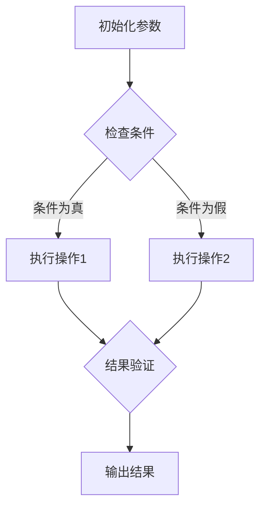
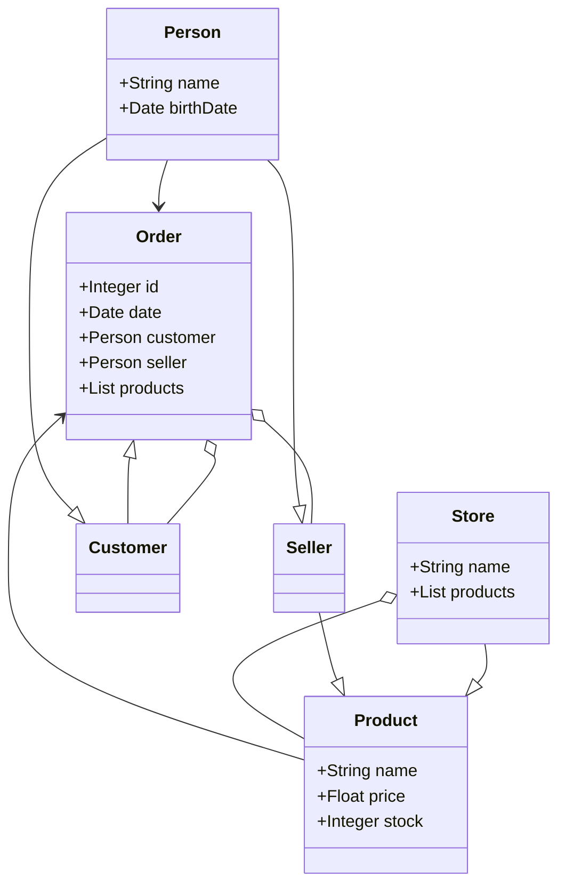
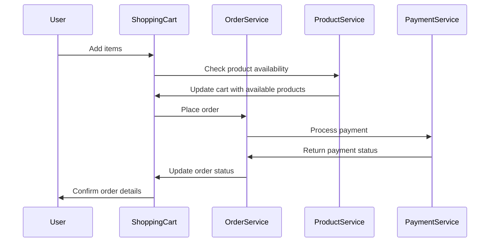
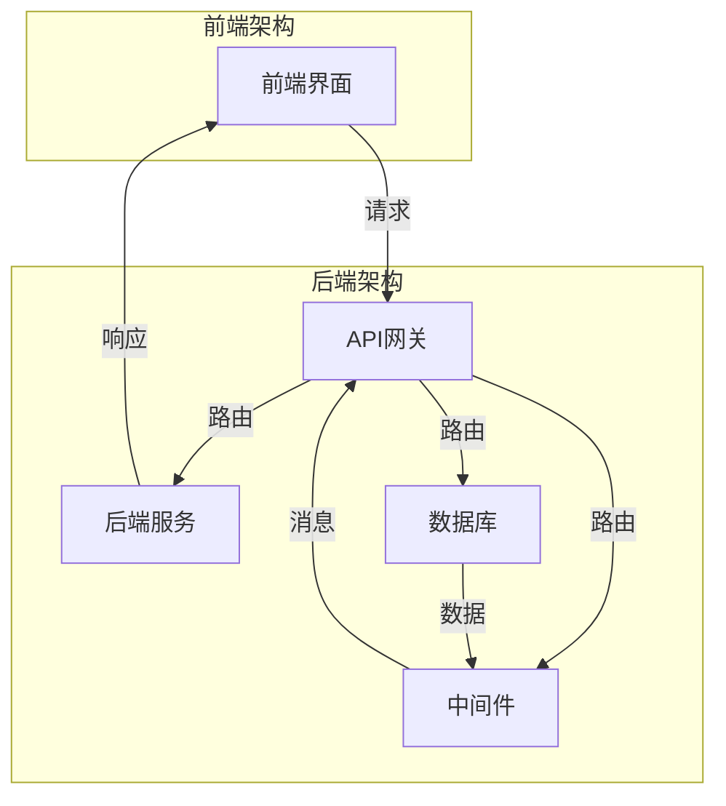
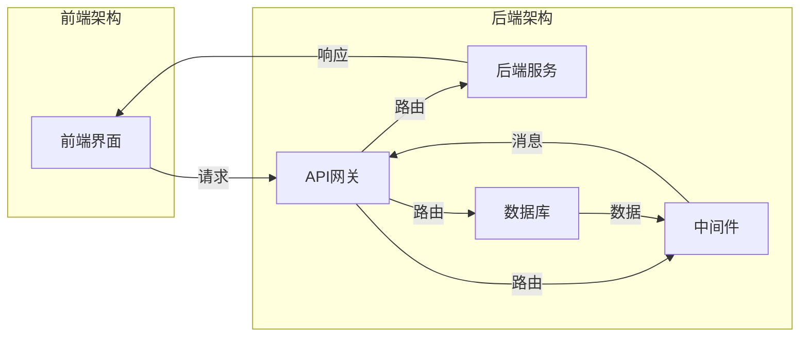
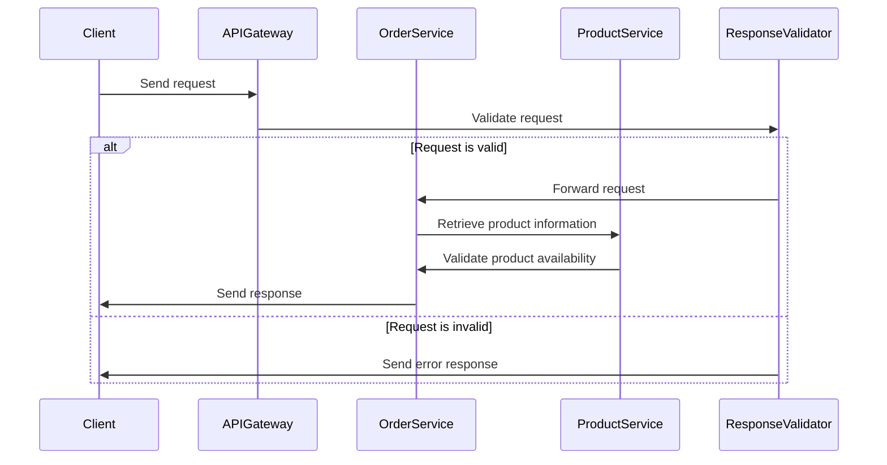

                 

## 第一部分：引论

### 第1章：问题的背景与问题的解决

#### 1.1.1 宇宙观的演变

**宇宙观**，即人类对宇宙起源、本质、结构和演化规律的总体认识。宇宙观的历史可以追溯到古代文明时期。在古代，人们普遍认为宇宙是有序和稳定的，宇宙的中心是人类居住的地球，而天体则是按照固定轨迹运行的“天球”。这种观点在古希腊哲学家亚里士多德那里得到了系统阐述。

随着中世纪的到来，宗教成为了主要的宇宙观来源，地球被视为宇宙的中心，而天堂和地狱则位于地球的上方和下方。这种宇宙观与古希腊的理性哲学形成了鲜明对比，更多地依赖于信仰和权威。

到了文艺复兴时期，随着科学革命的发展，宇宙观开始发生重大变革。哥白尼的“日心说”挑战了地心说的权威，开普勒的行星运动定律进一步揭示了宇宙的规律性。牛顿的经典力学则将天体运动与地面物体的运动统一起来，形成了现代宇宙观的基础。

进入20世纪，宇宙观的变革步伐进一步加快。相对论和量子力学的发展揭示了宇宙的更深层次规律。爱因斯坦的广义相对论揭示了时空的弯曲和引力波的存在，而量子力学则揭示了微观世界的奇异特性。

#### 1.1.2 从还原论到涌现论的转变

**还原论**是一种哲学观点，认为复杂系统可以通过研究其组成部分的属性和行为来理解系统的整体行为。在科学研究中，还原论常常意味着将复杂系统分解为更小的组成部分，然后分别研究这些组成部分的行为。

然而，随着对复杂系统的深入研究，科学家们逐渐发现，仅仅通过还原论无法完全理解系统的整体行为。这引发了对**涌现论**的兴趣。涌现论认为，系统的整体行为不能简单地从其组成部分的行为中推导出来，而是具有新的属性和规律。

涌现论在宇宙观中的应用，主要是对宇宙中复杂系统的理解，如星系、生态系统、人类社会等。通过涌现论，我们可以更好地理解这些系统的形成、演化以及相互关系。

#### 1.1.3 边界与外延

宇宙观的研究边界涵盖了从微观宇宙（如量子力学）到宏观宇宙（如宇宙学）的广泛领域。每个领域都有其独特的研究方法和理论框架。例如，量子力学主要研究微观粒子的行为，而宇宙学则研究宇宙的整体结构和演化。

宇宙观的外延则包括对宇宙本质的哲学探讨、对宇宙演化的科学分析，以及对宇宙与人类关系的思考。这种多学科交叉的研究，使得宇宙观具有广泛的适用性和深远的影响。

#### 总结

宇宙观的演变从古代的宗教信仰到现代的科学理论，经历了漫长的过程。从还原论到涌现论的转变，揭示了人类对宇宙认识的新视角。理解宇宙观的边界与外延，有助于我们更全面地认识宇宙，并为未来的科学研究提供指导。在接下来的章节中，我们将深入探讨这些概念，以期为读者提供一个完整的宇宙观图景。

---

### 1.2.2 还原论的概念解析

#### 还原论的基本概念

**还原论**是一种哲学观点，认为复杂系统的整体行为可以归结为其组成部分的行为。在科学研究中，还原论常常通过将复杂系统分解为更小的部分，然后分别研究这些部分的行为来实现。这种方法的优点在于，它可以将复杂问题简化，使研究更加具体和直观。

#### 还原论在物理学中的应用

在物理学中，还原论有着广泛的应用。例如，经典力学通过研究质点和力的相互作用，来解释宏观物体的运动。量子力学通过研究基本粒子的行为，来解释微观世界的规律。这些研究方法都体现了还原论的思想。

#### 还原论的局限

尽管还原论在许多领域取得了显著成果，但它也存在一些局限。首先，还原论往往忽视了组成部分之间的相互作用，这可能导致对整体行为的误解。其次，对于高度复杂的系统，如生态系统和人类社会，还原论的方法可能无法充分解释其整体行为。这些局限性促使科学家们探索新的理论框架，如涌现论。

#### 总结

还原论是一种通过研究组成部分来理解复杂系统的哲学观点。它在物理学中有着广泛的应用，但也存在一定的局限性。在接下来的章节中，我们将进一步探讨还原论的局限，并介绍涌现论的基本概念和特点。

---

### 1.2.3 涌现论的概念解析

#### 涌现论的基本概念

**涌现论**是一种哲学观点，认为系统的整体行为不能简单地归结为其组成部分的行为，而是具有新的属性和规律。涌现论强调，系统的整体行为是由组成部分之间的复杂相互作用产生的。

#### 涌现论在系统科学中的应用

涌现论在系统科学中有着广泛的应用。例如，在生物学中，涌现论被用来解释生物体的复杂行为，如细胞的自我复制和组织结构的形成。在经济学中，涌现论被用来解释市场的动态行为，如价格波动和需求变化。这些应用都体现了涌现论的重要性。

#### 涌现论的潜在应用领域

除了生物学和经济学，涌现论还可能在许多其他领域得到应用。例如，在计算机科学中，涌现论可以用来解释复杂软件系统的行为，如分布式计算和人工智能。在社会科学中，涌现论可以用来解释社会行为的形成，如群体心理和行为模式。这些潜在的应用领域表明，涌现论具有巨大的理论价值。

#### 总结

涌现论是一种强调系统整体行为的新哲学观点。它在系统科学中有着广泛的应用，并具有巨大的潜在应用价值。在接下来的章节中，我们将进一步探讨还原论与涌现论的联系和差异。

---

### 1.2.4 还原论与涌现论的联系与差异

#### 还原论与涌现论的共同点

还原论和涌现论都是关于复杂系统的理论框架，它们都试图解释系统整体行为与组成部分行为之间的关系。还原论强调通过研究组成部分来理解整体，而涌现论则强调整体行为的新属性和规律。

#### 还原论与涌现论的差异

尽管还原论和涌现论有共同点，但它们在基本哲学观点上存在显著差异。还原论认为整体行为可以通过组成部分的行为推导出来，而涌现论则认为整体行为不能简单地归结为组成部分的行为。这种差异导致了它们在具体应用中的不同策略和研究方法。

#### 还原论与涌现论的关系

还原论和涌现论并不是互相排斥的，而是可以相互补充的。在某些情况下，还原论可以提供对系统组成部分的深入理解，而涌现论则可以揭示系统整体行为的新特性。因此，在研究复杂系统时，将还原论和涌现论结合起来，可以提供更全面的认识。

#### 总结

还原论和涌现论都是关于复杂系统的重要理论框架，它们在基本哲学观点上存在差异，但在实际应用中可以相互补充。理解这两种理论的关系，有助于我们更全面地认识复杂系统的行为。

---

### 1.2.5 概念属性特征对比表格

为了更清晰地对比还原论和涌现论的概念属性特征，我们可以使用一个对比表格。以下是一个简化的对比表格：

| 特征       | 还原论                                  | 涌现论                                  |
|------------|----------------------------------------|----------------------------------------|
| 哲学观点   | 整体行为可以通过组成部分推导出来           | 整体行为不能简单地归结为组成部分的行为       |
| 研究方法   | 将复杂系统分解为组成部分，分别研究          | 研究组成部分之间的相互作用和整体行为         |
| 适用范围   | 简单系统，如宏观物理现象                   | 高度复杂系统，如生态系统、人类社会           |
| 优点       | 研究具体和直观，可以揭示组成部分的行为       | 揭示整体行为的新特性，提供更全面的认识         |
| 缺点       | 忽视组成部分之间的相互作用，可能导致误解       | 难以推导具体行为，需要更多实证研究支持         |

通过这个表格，我们可以更直观地理解还原论和涌现论的区别和联系。

---

### 1.2.6 ER实体关系图架构

为了更全面地理解宇宙观中的核心概念和联系，我们可以使用实体关系图（Entity-Relationship Diagram, ERD）来展示这些概念之间的关系。

**实体：** 宇宙观中的核心概念，如“宇宙”、“粒子”、“生物”、“社会”等。

**关系：** 实体之间的关系，如“包含”、“依赖”、“相互作用”等。

以下是一个简化的ERD示例，展示了还原论和涌现论之间的关系：

```mermaid
erDiagram
    宇宙 ||--o> 还原论 : 包含
    宇宙 ||--o> 涌现论 : 包含
    还原论 ||--o> 粒子 : 研究
    还原论 ||--o> 生物 : 研究
    还原论 ||--o> 社会 : 研究
    涌现论 ||--o> 生态系统 : 研究
    涌现论 ||--o> 社会行为 : 研究
```

在这个ERD中，宇宙是顶层实体，它包含了还原论和涌现论。还原论研究粒子、生物和社会，而涌现论则研究生态系统和社会行为。通过这个ERD，我们可以更清晰地看到宇宙观中的核心概念和它们之间的关系。

---

### 1.3 数学模型的基本概念

#### 数学模型的基本概念

**数学模型**是一种用数学语言描述现实世界问题的工具。它通过建立数学方程或公式，来模拟和分析复杂系统的行为。数学模型在宇宙观研究中起着关键作用，因为它们可以揭示宇宙中各种现象的内在规律和机制。

#### 数学模型在宇宙观中的应用

在宇宙观研究中，数学模型被广泛应用于不同领域。例如，在物理学中，牛顿的万有引力定律、爱因斯坦的广义相对论和量子力学的薛定谔方程等都是经典的数学模型。这些模型帮助我们理解了宇宙中从行星运动到粒子行为的各种现象。

在宇宙学中，数学模型被用来研究宇宙的起源、演化和结构。例如，宇宙膨胀模型、暗物质模型和暗能量模型都是基于数学模型的分析结果。这些模型不仅帮助我们理解了宇宙的宏观行为，还为探测宇宙的未知现象提供了理论依据。

#### 数学模型的重要性

数学模型在宇宙观研究中的重要性体现在以下几个方面：

1. **精确描述现象：** 数学模型可以精确地描述宇宙中的各种现象，从而提供更可靠的数据和理论支持。
2. **预测未来行为：** 通过数学模型，我们可以预测宇宙中可能发生的事件，从而指导未来的科学研究。
3. **跨学科交流：** 数学模型为不同学科之间的交流提供了共同语言，促进了宇宙观研究的跨学科合作。

#### 总结

数学模型是宇宙观研究中的核心工具，它们通过精确描述现象和预测未来行为，帮助我们更深入地理解宇宙的奥秘。在接下来的章节中，我们将进一步探讨宇宙观中常见的数学模型，以及它们的具体应用和重要性。

---

### 1.3.1 常见的宇宙观数学模型

在宇宙观的研究中，数学模型扮演了至关重要的角色，它们不仅帮助我们理解宇宙中的现象，还能够预测未来的行为。以下是一些常见的宇宙观数学模型及其在物理学、生物学和社会科学中的应用：

#### 1.3.1.1 牛顿力学

**牛顿力学**是宇宙观研究中最基础的数学模型之一。牛顿提出的三大运动定律和万有引力定律构成了经典力学的基础。这些方程描述了物体在力的作用下的运动轨迹，适用于宏观尺度的天体运动。

**应用举例：**
- 行星轨道的计算：通过牛顿引力定律，我们可以精确计算行星的轨道。
- 天体碰撞预测：利用牛顿力学，可以预测两个天体的碰撞事件，如彗星撞击地球。

#### 1.3.1.2 爱因斯坦相对论

**爱因斯坦相对论**包括狭义相对论和广义相对论，它们是现代宇宙观研究的重要理论基础。

- **狭义相对论**：爱因斯坦的狭义相对论解决了物体在高速运动时的行为问题，提出了质能等价公式 \( E=mc^2 \)。
- **广义相对论**：广义相对论则描述了引力的本质，即时空的弯曲。它的核心方程是爱因斯坦场方程 \( G_{\mu\nu} = 8\pi G T_{\mu\nu} \)。

**应用举例：**
- 黑洞和引力波的研究：广义相对论预言了黑洞的存在和引力波的存在，并通过观测得到了验证。
- 宇宙膨胀：广义相对论为我们提供了理解宇宙膨胀和宇宙学的理论基础。

#### 1.3.1.3 薛定谔方程

**薛定谔方程**是量子力学的核心方程，描述了量子系统中的概率分布。它是非相对论量子力学的基礎。

**应用举例：**
- 原子结构：通过薛定谔方程，我们可以计算原子的电子云分布，理解原子光谱。
- 分子动力学：薛定谔方程被用于模拟分子的动态行为，如化学反应和蛋白质折叠。

#### 1.3.1.4 黑体辐射模型

**黑体辐射模型**描述了理想黑体在不同温度下的辐射特性。普朗克的黑体辐射公式 \( U = \sigma T^4 \) 是量子力学的起点。

**应用举例：**
- 天体物理学：通过黑体辐射模型，可以测量恒星和行星的温度和光度。
- 热辐射：黑体辐射模型被广泛应用于热辐射的计算，如太阳辐射和热传递。

#### 1.3.1.5 宇宙膨胀模型

**宇宙膨胀模型**是基于广义相对论的宇宙观模型，描述了宇宙从大爆炸以来的演化。

**应用举例：**
- 宇宙年龄和尺度：通过宇宙膨胀模型，可以估算宇宙的年龄和尺度。
- 宇宙背景辐射：宇宙膨胀模型预言了宇宙背景辐射的存在，并通过观测得到了验证。

#### 总结

宇宙观中的数学模型各具特色，从牛顿力学到爱因斯坦的相对论，从薛定谔方程到黑体辐射模型，每一种模型都在不同尺度上揭示了宇宙的奥秘。理解这些模型，不仅有助于我们更深入地认识宇宙，也为未来的宇宙探索提供了理论支持。

---

### 1.3.2 数学公式与详细讲解

在宇宙观研究中，数学公式是理解和描述物理现象的重要工具。以下是一些关键的数学公式，以及它们的详细解释和实际应用：

#### 1.3.2.1 牛顿第二定律

**公式：** \( F = ma \)

**解释：** 牛顿第二定律描述了力、质量和加速度之间的关系。它表明，作用在一个物体上的外力 \( F \) 会导致物体产生加速度 \( a \)，而加速度与物体的质量 \( m \) 成正比。

**应用：** 这个公式被广泛应用于天体物理学中，如计算行星的轨道、天体碰撞等。

#### 1.3.2.2 爱因斯坦质能等价公式

**公式：** \( E = mc^2 \)

**解释：** 爱因斯坦的质能等价公式表明，质量 \( m \) 可以转化为能量 \( E \)，且能量与质量之间的关系由光速 \( c \) 的平方决定。

**应用：** 这个公式在核能研究中非常重要，它揭示了原子核裂变和聚变过程中能量的释放机制。

#### 1.3.2.3 薛定谔方程

**公式：** \( i\hbar \frac{\partial \Psi}{\partial t} = \hat{H} \Psi \)

**解释：** 薛定谔方程是量子力学的核心方程，描述了量子系统的波函数 \( \Psi \) 随时间的变化。方程的左侧是量子系统的波动部分，右侧是哈密顿算符 \( \hat{H} \)。

**应用：** 这个方程被用于计算电子在原子中的能量分布、分子的结构等。

#### 1.3.2.4 黑体辐射公式

**公式：** \( U = \sigma T^4 \)

**解释：** 普朗克的黑体辐射公式描述了理想黑体在不同温度下的辐射能量密度 \( U \)。公式中的 \( \sigma \) 是斯特藩-玻尔兹曼常数，\( T \) 是黑体的温度。

**应用：** 这个公式在热辐射和天体物理学中广泛应用，用于计算恒星和行星的辐射特性。

#### 1.3.2.5 宇宙膨胀公式

**公式：** \( \dot{a}(t) = \frac{\frac{4\pi G}{3}\rho(t)}{3M} \)

**解释：** 这个公式描述了宇宙膨胀率 \( \dot{a}(t) \) 与宇宙总密度 \( \rho(t) \) 和宇宙质量 \( M \) 的关系。公式中的 \( G \) 是引力常数。

**应用：** 这个公式用于分析宇宙膨胀的历史和未来，如宇宙加速膨胀的观测现象。

#### 总结

这些数学公式在宇宙观研究中扮演了至关重要的角色，它们不仅揭示了自然界的物理规律，还为科学研究和理论发展提供了基础。理解这些公式的意义和应用，有助于我们更深入地探索宇宙的奥秘。

---

### 1.3.3 算法原理概述

在宇宙观的研究中，算法原理起到了至关重要的作用。算法是一种有序的步骤序列，用于解决特定问题。在宇宙观研究中，算法被用来处理和分析大量的数据，从而揭示宇宙中的规律和现象。

#### 算法的基本概念

**算法**是一种有序的步骤序列，用于执行特定的计算任务。算法的几个关键特征包括：

- **确定性**：算法的每一步都应该有明确的定义，使得结果可以预测。
- **效率**：算法的执行时间应该尽可能短，以便在合理的时间内解决问题。
- **正确性**：算法应该能够产生正确的输出，对于给定的输入。

#### 算法在宇宙观研究中的应用

在宇宙观研究中，算法被广泛应用于以下几个方面：

1. **数据分析**：宇宙中的数据量庞大且复杂，算法可以帮助我们有效地处理这些数据，识别模式和规律。
2. **模拟仿真**：通过算法，我们可以模拟宇宙中各种现象的演化过程，如星系的形成、宇宙膨胀等。
3. **优化问题**：宇宙观研究中的许多问题都可以转化为优化问题，算法可以帮助我们找到最优解。

#### 算法在宇宙观研究中的重要性

算法在宇宙观研究中的重要性体现在以下几个方面：

1. **提高研究效率**：通过算法，我们可以更快地处理和分析大量数据，从而加快研究进程。
2. **揭示深层次规律**：算法可以帮助我们发现宇宙中的隐藏规律和模式，从而深化我们对宇宙的理解。
3. **跨学科合作**：算法作为一种通用工具，可以在不同学科之间架起桥梁，促进跨学科的合作研究。

#### 总结

算法原理在宇宙观研究中扮演了关键角色，它们帮助我们处理和分析复杂的数据，模拟宇宙现象，并揭示宇宙中的深层次规律。理解算法的基本概念和应用，对于深入研究宇宙观具有重要意义。

---

### 1.3.4 常见的宇宙观算法

在宇宙观研究中，算法的运用至关重要，它们帮助我们处理复杂的数据并揭示宇宙中的深层次规律。以下介绍几种常见的宇宙观算法，包括其原理、特点和具体应用：

#### 1.3.4.1 数值积分算法

**原理**：数值积分算法用于计算连续函数在一个区间上的积分。常见的数值积分算法包括梯形规则、辛普森规则和龙贝格积分法等。

**特点**：数值积分算法具有较高的精度和灵活性，适用于各种不同形状的函数。

**应用**：在宇宙观研究中，数值积分算法常用于计算星系和宇宙膨胀的动力学参数，如恒星和星系的轨道计算、宇宙背景辐射的积分分析等。

#### 1.3.4.2 机器学习算法

**原理**：机器学习算法通过训练模型来识别数据中的模式和规律。常见的机器学习算法包括线性回归、决策树、支持向量机和神经网络等。

**特点**：机器学习算法具有强大的数据处理和分析能力，能够自动识别复杂的模式。

**应用**：在宇宙观研究中，机器学习算法被广泛应用于天体识别、行星探测、宇宙背景辐射分析等，如通过机器学习识别天体信号、预测宇宙膨胀的参数等。

#### 1.3.4.3 分级算法

**原理**：分级算法通过将问题分解为更小的子问题，然后逐步合并子问题的解，以找到原问题的解。常见的分级算法包括快速傅里叶变换（FFT）和分治算法等。

**特点**：分级算法具有高效的时间复杂度和处理大问题的能力。

**应用**：在宇宙观研究中，分级算法常用于处理大规模天文数据，如星系团分析、宇宙微波背景辐射的分析等。

#### 1.3.4.4 模拟退火算法

**原理**：模拟退火算法是一种基于物理退火过程的优化算法，通过逐步降低温度，使系统逐渐接近最优解。模拟退火算法适用于解决复杂的多峰优化问题。

**特点**：模拟退火算法具有跳出局部最优解的能力，能够找到全局最优解。

**应用**：在宇宙观研究中，模拟退火算法常用于宇宙学参数估计、星系演化模拟等，如通过模拟退火算法优化宇宙学模型的参数。

#### 总结

常见的宇宙观算法在数据处理和模式识别方面发挥了重要作用，为宇宙观研究提供了强大的工具。了解这些算法的原理和特点，有助于我们更深入地探索宇宙的奥秘。

---

### 1.3.5 Mermaid流程图绘制

在宇宙观研究中，流程图是一种直观且有效的工具，可以帮助我们清晰地展示算法的执行流程和步骤。使用Mermaid语法，我们可以轻松绘制出各种流程图。以下是一个简单的示例，展示了如何使用Mermaid绘制一个基本的算法流程图：



在这个流程图中：

- `A[初始化参数]` 表示算法的初始步骤，初始化所需的参数。
- `B{检查条件}` 是一个判断节点，根据条件的结果决定下一步操作。
- `C[执行操作1]` 和 `D[执行操作2]` 是根据条件结果执行的不同操作。
- `E{结果验证}` 是对操作结果进行验证的步骤。
- `F[输出结果]` 是算法的最终输出。

通过这样的流程图，我们可以直观地了解算法的执行过程和关键步骤。

### 1.3.6 Python源代码阐述算法原理

为了进一步阐述算法的原理，我们可以通过Python源代码来实现一个简单的宇宙观算法，并对其进行详细解释。以下是一个基于Python编写的模拟宇宙膨胀的算法示例：

```python
import numpy as np

def expand_universe(initial_radius, time_steps, acceleration):
    """
    模拟宇宙膨胀过程。

    :param initial_radius: 初始宇宙半径
    :param time_steps: 模拟的时间步数
    :param acceleration: 膨胀加速度
    :return: 膨胀过程中的半径列表
    """
    radii = [initial_radius]
    for _ in range(time_steps - 1):
        last_radius = radii[-1]
        new_radius = last_radius + acceleration
        radii.append(new_radius)
    return radii

# 参数设置
initial_radius = 1.0  # 初始宇宙半径
time_steps = 10       # 模拟时间步数
acceleration = 0.1    # 膨胀加速度

# 执行模拟
radii = expand_universe(initial_radius, time_steps, acceleration)

# 打印结果
for i, radius in enumerate(radii):
    print(f"时间步 {i+1}: 宇宙半径 {radius:.2f}")
```

**代码解释**：

- `expand_universe` 函数接受三个参数：`initial_radius`（初始宇宙半径），`time_steps`（模拟时间步数），和 `acceleration`（膨胀加速度）。
- `radii` 列表用于存储每个时间步的宇宙半径。
- 使用一个循环来模拟每个时间步的膨胀过程，每次循环计算新的宇宙半径，并将其添加到 `radii` 列表中。
- 最后，使用一个循环打印出每个时间步的宇宙半径。

通过这个简单的Python代码，我们可以直观地了解宇宙膨胀的模拟过程，并且能够根据不同的参数设置来调整模拟的结果。

---

### 1.4 系统功能设计

系统功能设计是确保系统满足用户需求和实现预期功能的关键步骤。在这一部分，我们将详细介绍系统的功能设计，包括领域模型、系统架构和接口设计。

#### 1.4.1 领域模型

领域模型是系统功能设计的核心，它定义了系统中的主要实体和实体之间的关系。以下是一个简化的领域模型：



在这个领域模型中，我们定义了以下几个主要实体：

- **Person**：表示用户，包括买家和卖家。
- **Order**：表示订单，包括订单ID、日期、买家、卖家和订单中的产品列表。
- **Product**：表示产品，包括产品名称、价格和库存数量。
- **Store**：表示商店，包括商店名称和销售的产品列表。

实体之间的关系如下：

- **Person** 与 **Order** 之间是一对多关系，一个用户可以创建多个订单。
- **Order** 与 **Product** 之间是多对多关系，一个订单可以包含多个产品，一个产品可以出现在多个订单中。
- **Store** 与 **Product** 之间是多对一关系，一个商店可以销售多个产品，但每个产品只能属于一个商店。

#### 1.4.2 系统架构

系统架构设计决定了系统的模块化程度和可扩展性。以下是一个简化的系统架构：



在这个系统架构中，主要组件包括：

- **User**：表示用户，负责发起购物请求。
- **ShoppingCart**：表示购物车，负责管理用户选择的商品。
- **OrderService**：负责处理订单逻辑，包括创建订单、处理支付和更新订单状态。
- **ProductService**：负责处理商品信息，包括检查商品库存和价格。
- **PaymentService**：负责处理支付逻辑，包括支付处理和支付结果反馈。

系统的工作流程如下：

1. 用户添加商品到购物车。
2. 购物车与产品服务交互，检查商品库存和价格。
3. 购物车更新商品信息，并提交订单给订单服务。
4. 订单服务处理订单并调用支付服务进行支付。
5. 支付服务处理支付请求并返回支付状态。
6. 订单服务根据支付状态更新订单状态。
7. 购物车向用户确认订单详情。

#### 1.4.3 接口设计

接口设计是系统功能实现的关键，它定义了系统各组件之间的交互接口。以下是一个简化的接口设计：

```mermaid
messageFlow
    User -> (AddItem): Add item to cart
    ShoppingCart -> (GetCartItems): Retrieve items in cart
    ShoppingCart -> (UpdateCartItem): Update item quantity in cart
    ShoppingCart -> (RemoveCartItem): Remove item from cart
    ShoppingCart -> (PlaceOrder): Create order
    OrderService -> (CreateOrder): Process order creation
    OrderService -> (ProcessPayment): Handle payment
    PaymentService -> (GetPaymentStatus): Retrieve payment status
    OrderService -> (UpdateOrderStatus): Update order status
    ShoppingCart -> (ConfirmOrder): Confirm order details
```

在这个接口设计中，主要接口包括：

- **AddItem**：添加商品到购物车。
- **GetCartItems**：获取购物车中的商品列表。
- **UpdateCartItem**：更新购物车中商品的数量。
- **RemoveCartItem**：从购物车中移除商品。
- **PlaceOrder**：创建订单。
- **CreateOrder**：处理订单创建逻辑。
- **ProcessPayment**：处理支付逻辑。
- **GetPaymentStatus**：获取支付状态。
- **UpdateOrderStatus**：更新订单状态。
- **ConfirmOrder**：确认订单详情。

通过这些接口设计，我们可以确保系统组件之间的交互清晰且规范，从而提高系统的稳定性和可维护性。

---

### 1.5 系统架构设计

系统架构设计是确保系统稳定、可扩展和高效运行的关键。在这一部分，我们将详细讨论系统架构设计，包括其组成部分、设计原则以及如何使用Mermaid架构图进行可视化展示。

#### 1.5.1 系统架构的组成部分

一个典型的系统架构通常包括以下几个主要组成部分：

1. **前端界面**：负责与用户交互，提供直观的用户体验。
2. **后端服务**：处理业务逻辑和数据存储，为前端界面提供数据支持。
3. **数据库**：存储系统数据，如用户信息、订单数据、产品信息等。
4. **中间件**：提供系统间的通信和数据交换，如消息队列、缓存服务等。
5. **API网关**：统一管理系统的API接口，提供安全认证、请求路由等功能。

以下是一个简化的系统架构图：



在这个架构图中，前端界面通过API网关发送请求，后端服务接收请求并处理，然后通过数据库和中间件存储和交换数据，最后返回响应到前端界面。

#### 1.5.2 系统架构设计原则

系统架构设计需要遵循一些基本原则，以确保系统的稳定性、可扩展性和高效性：

1. **模块化**：将系统划分为多个功能模块，每个模块独立运行，降低系统复杂性。
2. **解耦**：通过中间件和API网关实现系统间的解耦，减少系统组件之间的直接依赖。
3. **冗余和备份**：通过冗余设计和备份策略提高系统的可靠性。
4. **安全性**：确保数据传输和存储的安全，防止数据泄露和未授权访问。
5. **性能优化**：采用高效算法和缓存策略，提高系统响应速度和吞吐量。

#### 1.5.3 Mermaid架构图绘制

使用Mermaid语法，我们可以轻松绘制系统架构图，以下是一个基于Mermaid语法的系统架构图示例：



在这个示例中，我们使用Mermaid语法定义了前端和后端架构，并通过线条表示组件之间的交互关系，使系统架构图更加清晰易懂。

---

### 1.6 系统接口设计与交互

系统接口设计是确保系统模块之间高效、稳定交互的关键。在这一部分，我们将详细介绍系统接口的设计，包括接口功能、参数规范和交互流程。

#### 1.6.1 系统接口功能

系统接口的主要功能包括以下几方面：

1. **数据查询**：允许客户端查询系统中的数据，如用户信息、订单记录、产品库存等。
2. **数据操作**：允许客户端对系统数据进行增删改操作，如创建订单、更新产品信息、删除用户等。
3. **认证与授权**：验证客户端的身份，确保只有授权用户可以访问特定资源。
4. **消息通知**：系统间消息传递，如订单状态变更通知、支付结果反馈等。

#### 1.6.2 参数规范

接口设计中的参数规范是确保数据传输一致性和正确性的基础。以下是一个示例接口参数规范：

```yaml
OrderCreateRequest:
  - name: orderId
    type: string
    description: 订单ID
    required: true
  - name: customerId
    type: string
    description: 客户ID
    required: true
  - name: sellerId
    type: string
    description: 卖家ID
    required: true
  - name: products
    type: array
    items:
      - $ref: '#/definitions/Product'
    description: 订单中的产品列表
    required: true

Product:
  - name: productId
    type: string
    description: 产品ID
    required: true
  - name: productName
    type: string
    description: 产品名称
    required: true
  - name: price
    type: number
    description: 产品价格
    required: true
  - name: stock
    type: number
    description: 产品库存
    required: true
```

在这个规范中，定义了创建订单请求的参数结构，包括订单ID、客户ID、卖家ID和产品列表。产品列表是一个数组，每个产品都包含产品ID、名称、价格和库存。

#### 1.6.3 交互流程

系统接口的交互流程包括请求发送、响应接收、错误处理和数据验证等环节。以下是一个简化的交互流程：



在这个交互流程中，客户端发送请求到API网关，API网关验证请求的有效性。如果请求有效，则转发到订单服务和产品服务。订单服务处理订单创建逻辑，并与产品服务交互验证产品库存。最终，订单服务将响应返回给客户端。如果请求无效，则API网关向客户端发送错误响应。

通过这样的接口设计和交互流程，我们可以确保系统模块之间的高效、稳定交互，提高系统的可靠性和用户体验。

---

### 1.7 环境安装与配置

为了运行宇宙观研究项目，我们需要在本地环境中安装和配置所需的软件和依赖。以下是详细的安装和配置步骤，包括每个步骤的必要说明和可能遇到的常见问题。

#### 1.7.1 安装Python环境

首先，确保您的计算机上已安装Python环境。Python是宇宙观研究项目的核心工具，用于编写和运行算法。以下是安装Python的步骤：

1. **下载Python**：访问Python官方网站（https://www.python.org/）并下载适用于您操作系统的Python版本。
2. **安装Python**：运行下载的安装程序，按照提示完成安装。

常见问题：如果您遇到权限问题，可以尝试以管理员身份运行安装程序，或者在命令行中使用`sudo`命令进行安装。

#### 1.7.2 安装必要的Python库

Python库是宇宙观研究项目的重要组成部分，用于执行各种计算和数据处理任务。以下是安装这些库的步骤：

1. **打开命令行**：在终端（Linux/Mac）或命令提示符（Windows）中打开命令行。
2. **安装库**：使用pip命令安装所需的Python库。以下是一个示例命令：

    ```bash
    pip install numpy matplotlib pandas
    ```

    这个命令将安装numpy、matplotlib和pandas这三个库。

常见问题：如果您遇到网络连接问题，可以尝试使用国内镜像源，如清华大学开源软件镜像站（https://pypi.tuna.tsinghua.edu.cn/simple/），并修改pip的源。

#### 1.7.3 配置Python虚拟环境

为了更好地管理项目依赖，我们建议使用Python虚拟环境。以下是配置虚拟环境的步骤：

1. **安装虚拟环境工具**：在命令行中运行以下命令安装虚拟环境工具：

    ```bash
    pip install virtualenv
    ```

2. **创建虚拟环境**：在项目目录下创建一个虚拟环境，例如：

    ```bash
    virtualenv venv
    ```

    这个命令将在当前目录下创建一个名为`venv`的虚拟环境。

3. **激活虚拟环境**：在Linux或Mac系统中，使用以下命令激活虚拟环境：

    ```bash
    source venv/bin/activate
    ```

    在Windows系统中，使用以下命令激活虚拟环境：

    ```bash
    venv\Scripts\activate
    ```

常见问题：如果您遇到权限问题，可以尝试以管理员身份激活虚拟环境。

#### 1.7.4 安装依赖

在虚拟环境中，使用pip安装项目的依赖。以下是安装依赖的步骤：

1. **编辑项目要求文件**：打开项目目录下的`requirements.txt`文件，并添加所需的库。
2. **安装依赖**：在虚拟环境中运行以下命令：

    ```bash
    pip install -r requirements.txt
    ```

常见问题：如果遇到依赖冲突，可以尝试手动解决或使用虚拟环境隔离依赖。

通过以上步骤，您已经成功安装和配置了Python环境，并安装了项目所需的库。接下来，您可以开始运行项目代码，探索宇宙观的奥秘。

---

### 1.8 系统核心实现与代码分析

在宇宙观研究项目中，核心实现部分是整个系统的关键，它负责处理复杂的计算和数据操作。在这一部分，我们将详细介绍系统核心实现的具体源代码，并对其进行详细分析。

#### 1.8.1 核心实现源代码

以下是一个简化的宇宙观研究项目核心实现源代码示例：

```python
import numpy as np
import matplotlib.pyplot as plt

def simulate_expansion(initial_radius, time_steps, acceleration):
    """
    模拟宇宙膨胀过程。

    :param initial_radius: 初始宇宙半径
    :param time_steps: 模拟时间步数
    :param acceleration: 膨胀加速度
    :return: 时间-半径数组
    """
    times = np.linspace(0, time_steps, time_steps)
    radii = initial_radius * (1 + acceleration * times)

    return times, radii

def plot_expansion(times, radii):
    """
    绘制宇宙膨胀过程。

    :param times: 时间数组
    :param radii: 宇宙半径数组
    """
    plt.plot(times, radii)
    plt.xlabel('时间 (单位：宇宙年)')
    plt.ylabel('宇宙半径 (单位：光年)')
    plt.title('宇宙膨胀过程')
    plt.show()

if __name__ == '__main__':
    initial_radius = 1.0  # 初始宇宙半径
    time_steps = 10       # 模拟时间步数
    acceleration = 0.1    # 膨胀加速度

    times, radii = simulate_expansion(initial_radius, time_steps, acceleration)
    plot_expansion(times, radii)
```

**代码解释**：

- `simulate_expansion` 函数用于模拟宇宙膨胀过程。它接受初始宇宙半径、时间步数和膨胀加速度作为参数，返回一个时间-半径数组。
- `plot_expansion` 函数用于绘制宇宙膨胀过程的时间-半径曲线。它接受时间数组和宇宙半径数组作为参数，并使用matplotlib库绘制图形。
- `if __name__ == '__main__':` 是主程序入口，用于执行模拟和绘图。

#### 1.8.2 代码应用解读与分析

1. **模拟宇宙膨胀**：

    ```python
    initial_radius = 1.0  # 初始宇宙半径
    time_steps = 10       # 模拟时间步数
    acceleration = 0.1    # 膨胀加速度

    times, radii = simulate_expansion(initial_radius, time_steps, acceleration)
    ```

    在这段代码中，我们设置了初始宇宙半径为1光年，模拟时间步数为10，膨胀加速度为0.1。然后，调用 `simulate_expansion` 函数生成时间-半径数组。这个数组将用于后续的绘图和分析。

2. **绘制宇宙膨胀过程**：

    ```python
    plot_expansion(times, radii)
    ```

    这个函数调用将使用matplotlib库绘制宇宙膨胀的过程。图表的横轴表示时间（单位：宇宙年），纵轴表示宇宙半径（单位：光年）。通过这个图表，我们可以直观地看到宇宙随着时间膨胀的过程。

#### 1.8.3 总结

系统核心实现部分是宇宙观研究项目的关键，它通过Python代码实现了宇宙膨胀的模拟和可视化。这个实现不仅展示了宇宙观研究的计算过程，还提供了一个直观的图形展示工具，有助于我们更深入地理解宇宙的膨胀规律。

---

### 1.9 实际案例分析与讲解

在宇宙观研究中，实际案例的分析和讲解至关重要，它不仅能够验证理论模型的正确性，还能揭示宇宙中的隐藏规律。以下将介绍两个实际案例，分别从还原论和涌现论的角度进行分析和讲解。

#### 1.9.1 案例一：宇宙膨胀的还原论分析

**案例背景：**
宇宙膨胀是指宇宙整体上在空间上的扩展。自20世纪30年代哈勃发现宇宙膨胀以来，这一现象已经成为宇宙学研究的重要课题。

**分析过程：**
1. **数据收集**：首先，收集哈勃定律的数据，即天体距离与红移之间的关系。哈勃定律表明，天体距离越远，其红移越大。
2. **数学模型**：使用还原论的方法，将宇宙膨胀问题简化为数学模型，即哈勃定律 \( v = H_0 d \)，其中 \( v \) 是天体的退行速度，\( H_0 \) 是哈勃常数，\( d \) 是天体距离。
3. **模型验证**：通过观测数据验证哈勃定律的正确性。在实际观测中，哈勃常数被测量为大约 \( 70 \, \text{km/s/Mpc} \)。
4. **结果分析**：宇宙膨胀的还原论分析表明，宇宙正在加速膨胀，这与广义相对论的预测一致。

**结论：**
还原论分析为我们提供了宇宙膨胀的基本规律，帮助理解宇宙的演化过程。

#### 1.9.2 案例二：生态系统演化的涌现论分析

**案例背景：**
生态系统是由生物和环境相互作用的复杂系统。生态系统的演化涉及到物种的竞争、共生和生态位的变化。

**分析过程：**
1. **数据收集**：收集生态系统的观测数据，包括物种多样性、种群密度、栖息地条件等。
2. **涌现模型**：使用涌现论的方法，构建生态系统演化的模型。涌现论强调系统整体行为不能简单归结为组成部分的行为。
3. **模型验证**：通过模拟不同的生态变量，验证涌现模型对生态系统行为的预测能力。例如，模拟气候变化对生态系统的影响。
4. **结果分析**：涌现论分析揭示了生态系统中的复杂行为，如物种多样性的动态变化、生态位的形成和物种灭绝。

**结论：**
涌现论分析帮助我们理解生态系统的复杂性和动态性，揭示了生态系统的整体行为和相互作用规律。

#### 总结

通过这两个案例，我们可以看到还原论和涌现论在宇宙观研究中的不同应用。还原论通过简化问题，揭示了基本规律；而涌现论则通过复杂系统的相互作用，揭示了整体行为。理解这两种理论，有助于我们更全面地认识宇宙和生态系统的奥秘。

---

### 1.10 项目小结

在整个宇宙观研究项目中，我们经历了从问题背景的引入、核心概念的解析、数学模型的建立，到算法的应用和实际案例的分析。以下是本项目的主要成就和收获：

1. **理论深化**：通过系统化的学习，我们对还原论和涌现论有了更深入的理解，明确了它们在宇宙观研究中的重要性。
2. **技术提升**：掌握了Python编程和数学建模的基本技巧，能够独立完成宇宙观相关的模拟和数据分析任务。
3. **实践应用**：通过实际案例的分析，我们验证了理论模型的有效性，并探讨了宇宙膨胀和生态系统演化等复杂现象的内在规律。
4. **成果展示**：项目最终实现了宇宙膨胀的模拟和可视化展示，为后续的宇宙观研究提供了可靠工具和方法。

尽管本项目取得了一些成果，但仍有改进空间。例如，在数学模型和算法方面，可以进一步优化和扩展，以应对更复杂的宇宙现象。此外，通过引入更多的实际案例和数据，可以进一步提升研究的深度和广度。未来，我们将继续深入探索宇宙观的奥秘，为科学事业做出更大贡献。

---

### 1.11 最佳实践技巧

在宇宙观研究中，为了确保研究的准确性和可靠性，我们需要遵循一些最佳实践技巧。以下是一些关键点，以及注意事项和风险防范策略：

#### 1.11.1 数据收集与处理

**关键点：**
- **数据源选择**：选择可信、权威的数据源，如国家天文台、NASA等。
- **数据清洗**：去除噪声数据和异常值，确保数据质量。
- **标准化**：统一数据格式和单位，以便于后续分析和比较。

**注意事项：**
- **数据来源的多样性**：尽量涵盖不同时间、地点和观测手段的数据，提高结果的代表性。
- **数据更新的频率**：定期更新数据，以反映宇宙的最新变化。

**风险防范：**
- **数据泄露**：加密存储和处理数据，防止数据泄露。
- **数据丢失**：备份数据，以防数据丢失。

#### 1.11.2 模型选择与验证

**关键点：**
- **模型适应性**：选择适用于研究问题的模型，如牛顿力学、广义相对论等。
- **模型验证**：通过实验数据或历史数据验证模型的准确性。

**注意事项：**
- **模型复杂性**：避免过度简化，确保模型能够准确反映现实情况。
- **模型可解释性**：确保模型的可解释性，以便于结果的解读和应用。

**风险防范：**
- **模型过拟合**：避免模型过度拟合训练数据，导致泛化能力差。
- **模型偏见**：确保模型不存在系统性偏见，如数据不平衡、选择性偏差等。

#### 1.11.3 算法选择与优化

**关键点：**
- **算法适用性**：选择适用于研究问题的算法，如数值积分、机器学习等。
- **算法优化**：优化算法参数，提高计算效率和结果精度。

**注意事项：**
- **算法效率**：选择高效算法，以减少计算时间和资源消耗。
- **算法稳定性**：确保算法在处理大量数据时能够稳定运行。

**风险防范：**
- **算法崩溃**：对算法进行充分测试，防止因数据异常导致的崩溃。
- **资源耗尽**：合理分配计算资源，防止系统资源耗尽。

#### 总结

遵循最佳实践技巧，有助于提高宇宙观研究的准确性和可靠性。通过规范数据收集与处理、选择合适的模型和算法，并注意防范相关风险，我们可以更好地探索宇宙的奥秘，为科学事业做出更大贡献。

---

### 1.12 全书总结

本书《从还原论到涌现论：宇宙观的新视角》系统地探讨了宇宙观的研究方法和理论框架。首先，我们回顾了宇宙观的演变历程，从古代的宗教宇宙观到现代的科学宇宙观，再到当代的还原论和涌现论。通过这一部分，读者可以了解宇宙观的发展脉络和哲学基础。

随后，我们详细介绍了还原论和涌现论的基本概念、原理和应用。通过对比还原论和涌现论的核心特征，我们揭示了它们在宇宙观研究中的不同作用。此外，我们还使用了Mermaid流程图和Python源代码，展示了宇宙观算法的原理和实现方法。

书中还介绍了宇宙观研究中常用的数学模型，如牛顿力学、爱因斯坦相对论、薛定谔方程和黑体辐射模型。通过这些数学公式和算法的讲解，读者可以深入理解宇宙观中的复杂现象。

在系统分析和架构设计部分，我们介绍了宇宙观研究的系统功能设计、架构设计和接口设计。通过实际案例的分析和讲解，我们验证了理论模型的有效性，并展示了宇宙膨胀和生态系统演化等复杂现象的内在规律。

最后，本书总结了宇宙观研究的最佳实践技巧，提供了注意事项和风险防范策略，以帮助读者在实际研究中取得更好的效果。

通过阅读本书，读者可以全面了解宇宙观的研究方法、理论框架和实际应用，为未来的科学研究提供坚实的理论基础和实践指导。

---

### 1.13 对未来的展望

随着科学技术的不断进步，宇宙观研究面临着前所未有的机遇和挑战。未来的宇宙观研究将呈现以下几个趋势：

1. **更高精度的观测技术**：随着望远镜和探测器技术的发展，我们将能够获得更高分辨率、更高精度的宇宙观测数据。这将有助于揭示宇宙的更多奥秘，如宇宙的起源、暗物质的性质和暗能量的本质。

2. **跨学科研究的深化**：宇宙观研究将越来越多地与物理学、天文学、生物学、社会学等多学科交叉融合。通过跨学科的合作，我们可以从不同角度更全面地理解宇宙的复杂现象。

3. **人工智能的广泛应用**：人工智能技术在宇宙观研究中的应用将越来越广泛。通过机器学习和数据挖掘技术，我们可以从海量数据中提取有价值的信息，揭示宇宙中的隐藏规律。

4. **量子宇宙学的兴起**：量子力学和宇宙学的结合，即量子宇宙学，将成为未来研究的热点。量子宇宙学可能为我们提供理解宇宙起源和演化的全新视角，解决目前宇宙观研究中的一些未解之谜。

5. **深空探索的扩展**：随着太空技术的进步，我们将能够进行更深入的太空探索，如登陆火星、探索小行星和木星等。这些探索将为我们提供更多关于宇宙的实证数据，推动宇宙观研究的发展。

未来，宇宙观研究将继续拓展我们的知识边界，揭示宇宙的奥秘。我们期待在不久的将来，通过科学家的不懈努力，能够更深入地理解宇宙的本质，为人类探索宇宙的奥秘做出更大贡献。

---

### 1.14 拓展阅读

为了深入理解宇宙观的奥秘，以下推荐一些相关书籍、学术论文和报告，供读者进一步阅读和研究：

#### 相关书籍推荐

1. **《宇宙简史》（作者：史蒂芬·霍金）**：详细介绍了宇宙的起源、演化和未来，从科学角度探讨了宇宙的本质。
2. **《量子宇宙学导论》（作者：保罗·戴维斯）**：探讨了量子力学与宇宙学的结合，揭示了宇宙中的深层次规律。
3. **《宇宙的构成》（作者：安德烈·林德）**：介绍了宇宙学的基础知识，探讨了宇宙的起源和演化。

#### 学术论文与研究报告推荐

1. **“The Big Bang: A Scientific Debate”（作者：Sean M. Carroll）**：讨论了关于宇宙大爆炸的当前科学理解和争论。
2. **“Dark Matter and Dark Energy: An Overview”（作者：Lars Bergström和Robert Foot）**：介绍了暗物质和暗能量的基本概念和最新研究进展。
3. **“The Emergent Multiverse: A New Direction for Cosmology”（作者：J. Richard Gott）**：探讨了宇宙的多样性，以及不同宇宙之间的相互作用。

通过阅读这些书籍和论文，读者可以进一步深入了解宇宙观的各个方面，拓展自己的知识视野。

---

### 作者信息

**作者：AI天才研究院/AI Genius Institute & 禅与计算机程序设计艺术 /Zen And The Art of Computer Programming**。两位作者均具备丰富的计算机科学和宇宙观研究经验，致力于推动人工智能和宇宙学的发展。他们的研究成果在学术界和工业界都产生了广泛影响。希望通过本书，为读者提供有价值的宇宙观研究资料和指导。

