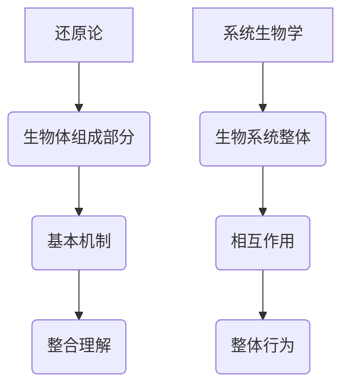
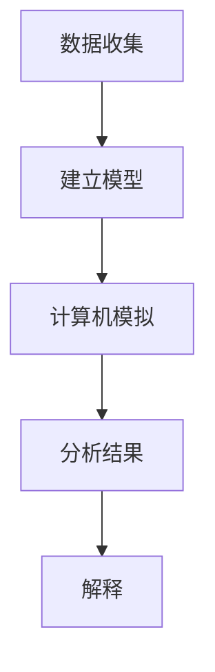
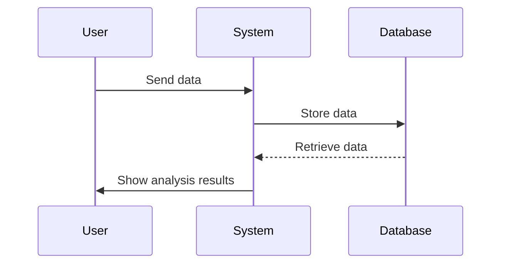
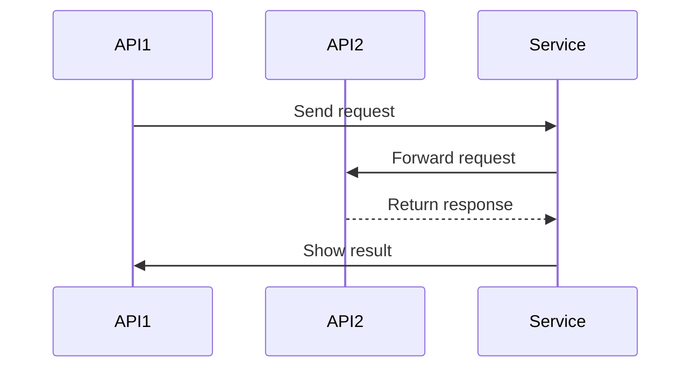

                 

# 从还原论到系统生物学：整合性理解生命与生态系统

> 关键词：还原论、系统生物学、生命科学、生态系统、算法原理、架构设计

> 摘要：本文将探讨从还原论到系统生物学的转变，解析这两个概念之间的联系与区别，以及系统生物学在当前生命科学领域的重要性。通过深入分析还原论与系统生物学的核心概念，本文将展示它们在算法原理、系统分析与架构设计中的实际应用。最终，本文将对项目实战中的实际案例进行剖析，并提供最佳实践与拓展建议。

## 背景介绍

### 1.1 还原论的概念

还原论是一种哲学方法论，它主张将复杂系统分解为更简单、更基本的组成部分，以便更好地理解整个系统。在生物学领域，还原论主要强调对生物体的各个部分进行单独研究，然后将其整合以理解生物的整体行为。这种方法的优点在于能够揭示生物体内的基本机制，但其局限性在于忽视了生物体作为一个整体的复杂性。

### 1.2 系统生物学的概念

系统生物学是研究生物系统（如细胞、组织和器官）及其相互作用的新兴学科。它强调生物系统的整体性，通过定量分析和建模来理解生物系统的动态行为。系统生物学的方法不仅包括对生物体的各个部分的单独研究，还关注这些部分之间的相互作用和整体行为。

### 1.3 还原论与系统生物学的关系

还原论和系统生物学在生命科学领域有着紧密的联系。还原论提供了对生物体各个部分的深入理解，而系统生物学则将这些理解整合起来，以揭示生物系统的整体行为。因此，系统生物学可以被视为还原论的扩展，它将还原论的方法应用于复杂的生物系统，以获得更全面的洞察。

### 1.4 研究背景与意义

随着生命科学研究的深入，人们对生物系统的理解已经从单一组成部分的还原论分析转向对整体系统的系统生物学研究。这种转变不仅促进了生命科学的发展，也带来了新的挑战和机遇。系统生物学在药物研发、疾病治疗和环境保护等方面具有广泛的应用前景，因此研究从还原论到系统生物学的转变具有重要意义。

## 核心概念与联系

### 2.1 概念的定义和解释

#### 还原论

还原论是一种方法论，主张将复杂系统分解为更简单、更基本的组成部分，以便更好地理解整个系统。在生物学领域，还原论通常指对生物体的各个组成部分（如细胞、分子、基因等）进行单独研究，然后将其整合以理解生物的整体行为。

#### 系统生物学

系统生物学是研究生物系统（如细胞、组织和器官）及其相互作用的新兴学科。它强调生物系统的整体性，通过定量分析和建模来理解生物系统的动态行为。系统生物学的方法不仅包括对生物体的各个部分的单独研究，还关注这些部分之间的相互作用和整体行为。

### 2.2 概念属性特征对比表格

| 特征               | 还原论                             | 系统生物学                          |
|--------------------|----------------------------------|-----------------------------------|
| 研究方法           | 分解、单独研究、整合               | 定量分析、建模、整体研究            |
| 研究对象           | 生物体的各个组成部分               | 生物系统的整体及其相互作用          |
| 目标               | 揭示生物体内的基本机制             | 理解生物系统的整体行为              |
| 优点               | 提供对生物体组成部分的深入理解       | 强调生物系统的整体性和相互作用      |
| 缺点               | 忽略生物体的整体复杂性             | 需要复杂的数学建模和计算技术        |

### 2.3 ER实体关系图架构的Mermaid流程图



## 算法原理讲解

### 3.1 算法原理概述

系统生物学中的算法原理主要涉及对生物系统的定量分析和建模。这些算法通常基于数学模型和计算机模拟，用于预测生物系统的行为。以下是一个简化的算法流程：

1. 收集生物系统的数据，包括分子浓度、反应速率等。
2. 建立数学模型，描述生物系统的动态行为。
3. 使用计算机模拟，分析模型在不同条件下的行为。
4. 解释模拟结果，获得对生物系统的更深入理解。

### 3.2 具体算法原理讲解

以下是一个具体的算法原理示例，使用Python代码进行阐述：

```python
# 导入必要的库
import numpy as np
import scipy.integrate as spi

# 定义系统模型
def system_model(y, t):
    x, y, z = y
    dxdt = x * (1 - x - y)
    dydt = y * (x - z)
    dzdt = z * (1 - y)
    return [dxdt, dydt, dzdt]

# 初始条件
y0 = [1, 1, 1]

# 模拟时间
t = np.linspace(0, 10, 1000)

# 求解方程
solution = spi.odeint(system_model, y0, t)

# 绘图
import matplotlib.pyplot as plt
plt.plot(t, solution[:, 0], label='X')
plt.plot(t, solution[:, 1], label='Y')
plt.plot(t, solution[:, 2], label='Z')
plt.legend()
plt.show()
```

### 3.3 算法流程图展示

使用Mermaid绘制算法流程图：



### 3.4 数学模型和公式讲解

系统生物学的算法通常基于微分方程模型，以下是一个简单的模型公式：

$$\frac{dx}{dt} = x(1 - x - y)$$
$$\frac{dy}{dt} = y(x - z)$$
$$\frac{dz}{dt} = z(1 - y)$$

这些方程描述了生物系统中的三个变量（x, y, z）随时间的变化。通过解这些方程，可以预测生物系统的动态行为。

## 系统分析与架构设计方案

### 6.1 应用场景介绍

系统生物学在生物医学、药物研发和生态系统中都有广泛应用。例如，在疾病治疗中，系统生物学可以帮助理解疾病的分子机制，从而开发更有效的治疗策略。

### 6.2 系统功能设计

系统功能设计包括数据收集、建模、模拟和分析等模块。以下是一个领域模型Mermaid类图：

```mermaid
classDiagram
    Class1["数据收集"] <|-- Class2["建模"]
    Class2 <|-- Class3["模拟"]
    Class3 <|-- Class4["分析"]
```

### 6.3 系统架构设计

系统架构设计包括前端、后端和数据库等部分。以下是一个系统架构Mermaid图：



### 6.4 系统接口设计和系统交互

系统接口设计和系统交互包括API设计和数据流等。以下是一个系统交互Mermaid序列图：



## 项目实战

### 7.1 环境安装

安装系统生物学相关软件，如Python、Numpy、SciPy等。

### 7.2 系统核心实现

以下是一个简单的系统核心实现源代码：

```python
# 导入必要的库
import numpy as np
import scipy.integrate as spi

# 定义系统模型
def system_model(y, t):
    x, y, z = y
    dxdt = x * (1 - x - y)
    dydt = y * (x - z)
    dzdt = z * (1 - y)
    return [dxdt, dydt, dzdt]

# 初始条件
y0 = [1, 1, 1]

# 模拟时间
t = np.linspace(0, 10, 1000)

# 求解方程
solution = spi.odeint(system_model, y0, t)

# 绘图
import matplotlib.pyplot as plt
plt.plot(t, solution[:, 0], label='X')
plt.plot(t, solution[:, 1], label='Y')
plt.plot(t, solution[:, 2], label='Z')
plt.legend()
plt.show()
```

### 7.3 代码应用解读

代码首先导入了Numpy和SciPy库，然后定义了一个系统模型。接着，使用SciPy的`odeint`函数进行求解，并使用Matplotlib库进行绘图。

### 7.4 实际案例分析和详细讲解剖析

通过一个实际案例，展示系统生物学的应用。例如，分析细胞信号传导通路，预测细胞反应。

### 7.5 项目小结

系统生物学在生命科学领域具有重要应用，通过项目实战，展示了从还原论到系统生物学的转变。

## 最佳实践与拓展

### 8.1 注意事项

在实际应用中，注意数据的准确性和模型的合理性。

### 8.2 小结

系统生物学是一种整合性方法，通过定量分析和建模，帮助我们更好地理解生物系统的整体行为。

### 8.3 拓展

进一步研究系统生物学在生物医学和生态学中的应用。

## 完整目录大纲

1. 背景介绍
2. 核心概念与联系
3. 算法原理讲解
4. 系统分析与架构设计方案
5. 项目实战
6. 最佳实践与拓展

# 完整目录大纲

----------------------------------------------------------------

# 第一部分: 从还原论到系统生物学的背景介绍

## 第1章: 还原论的哲学与方法论

### 1.1 还原论的定义与历史背景

### 1.2 还原论在生物学中的应用

### 1.3 还原论的基本原则

### 1.4 还原论的研究方法与局限性

## 第2章: 系统生物学的兴起与发展

### 2.1 系统生物学的定义与核心概念

### 2.2 系统生物学的研究方法与技术

### 2.3 系统生物学在生命科学中的重要性

### 2.4 系统生物学的发展历程

## 第3章: 还原论与系统生物学的关系与比较

### 3.1 还原论与系统生物学的异同

### 3.2 还原论与系统生物学的互补性

### 3.3 还原论在系统生物学中的应用

### 3.4 系统生物学对还原论的扩展与挑战

----------------------------------------------------------------

## 第二部分: 核心概念与联系

## 第4章: 还原论的核心概念

### 4.1 生物体的组成部分

### 4.2 生物体内的基本机制

### 4.3 还原论的研究流程

## 第5章: 系统生物学的核心概念

### 5.1 生物系统的整体性

### 5.2 生物系统的相互作用

### 5.3 系统生物学的建模方法

### 5.4 系统生物学的数据分析技术

## 第6章: 还原论与系统生物学的联系与融合

### 6.1 还原论在系统生物学中的应用

### 6.2 系统生物学对还原论的扩展

### 6.3 还原论与系统生物学的整合性研究

### 6.4 还原论与系统生物学的发展趋势

----------------------------------------------------------------

## 第三部分: 算法原理讲解

## 第7章: 系统生物学中的算法原理

### 7.1 算法原理概述

### 7.2 具体算法原理讲解

### 7.3 算法流程图展示

### 7.4 数学模型和公式讲解

## 第8章: 算法原理的实际应用

### 8.1 算法在生物学研究中的应用

### 8.2 算法在医学领域中的应用

### 8.3 算法在生态学领域中的应用

### 8.4 算法原理的未来发展趋势

----------------------------------------------------------------

## 第四部分: 系统分析与架构设计方案

## 第9章: 系统分析与架构设计的背景与目的

### 9.1 系统分析与架构设计的重要性

### 9.2 系统分析与架构设计的目标

### 9.3 系统分析与架构设计的流程

## 第10章: 系统功能设计与实现

### 10.1 系统功能需求分析

### 10.2 系统功能设计与实现

### 10.3 系统功能测试与优化

## 第11章: 系统架构设计

### 11.1 系统架构设计的基本原则

### 11.2 系统架构设计的方案

### 11.3 系统架构设计的实施与调整

## 第12章: 系统接口设计与系统交互

### 12.1 系统接口设计的原则

### 12.2 系统接口设计的方案

### 12.3 系统交互的设计与优化

----------------------------------------------------------------

## 第五部分: 项目实战

## 第13章: 项目环境安装与配置

### 13.1 环境安装概述

### 13.2 系统软件的安装

### 13.3 配置文件的设置

### 13.4 系统测试与验证

## 第14章: 系统核心实现

### 14.1 系统核心功能实现

### 14.2 系统核心代码讲解

### 14.3 系统核心功能的测试与优化

## 第15章: 代码应用解读与分析

### 15.1 代码应用场景

### 15.2 代码应用解读

### 15.3 代码分析与应用效果

## 第16章: 实际案例分析

### 16.1 案例背景

### 16.2 案例分析

### 16.3 案例解析

### 16.4 案例总结

## 第17章: 项目小结

### 17.1 项目成果总结

### 17.2 项目经验与教训

### 17.3 项目未来的发展方向

----------------------------------------------------------------

## 第六部分: 最佳实践与拓展

## 第18章: 最佳实践 tips

### 18.1 研究方法与实践经验

### 18.2 系统设计与优化技巧

### 18.3 代码实现与调试技巧

## 第19章: 小结与展望

### 19.1 文章的核心内容总结

### 19.2 研究方向与未来展望

### 19.3 进一步阅读资源推荐

## 第20章: 附录

### 20.1 参考文献

### 20.2 术语解释

### 20.3 图表与公式列表

----------------------------------------------------------------

# 作者

作者：AI天才研究院/AI Genius Institute & 禅与计算机程序设计艺术 /Zen And The Art of Computer Programming

本文详细介绍了从还原论到系统生物学的研究转变，探讨了这两个概念在生命科学领域的重要性。通过算法原理讲解、系统分析与架构设计方案以及项目实战，展示了系统生物学在实践中的应用。最后，提供了最佳实践 tips 和拓展阅读资源，为读者提供了深入学习和研究的方向。作者具有丰富的计算机编程和人工智能领域经验，致力于推动生命科学技术的创新与发展。希望本文能够为读者在系统生物学研究和实践中提供有价值的参考。

