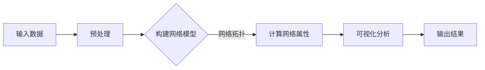
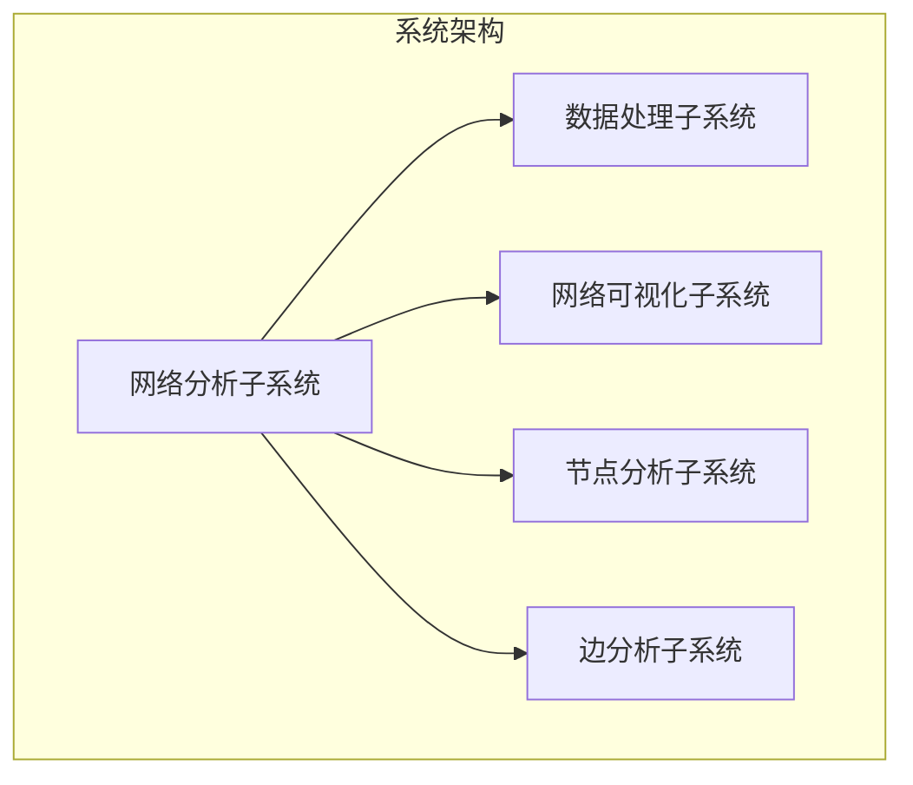
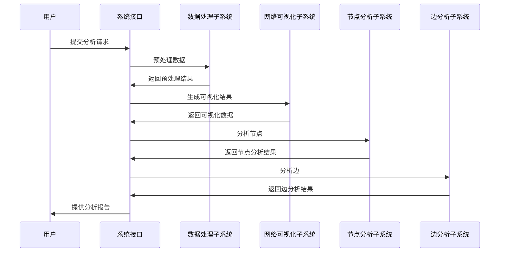

                 

# 从还原论到系统论：宇宙观的整体性转向

## 关键词：还原论，系统论，宇宙观，整体性转向，科学方法论

## 摘要：
本文旨在探讨科学研究中宇宙观的整体性转向，从传统的还原论向系统论的过渡。通过介绍还原论和系统论的历史与发展，对比两者的核心概念与联系，本文将详细讲解系统论中的关键算法原理，并结合实际项目实战，展示系统论在科学研究和应用中的巨大潜力。最后，本文将总结全书的主要观点，并给出实践中的注意事项和拓展阅读建议。

## 第一步：问题的背景与核心概念

### 1.1 还原论的基本原理与局限性

还原论是一种科学方法论，强调通过分析简单组成部分来理解复杂系统的行为。这种方法论起源于17世纪，随着牛顿力学的建立而得到广泛应用。还原论的核心思想是，通过对复杂系统进行分解，研究其各个组成部分的相互作用，从而揭示整个系统的规律。

然而，随着科学的发展，还原论也暴露出了一些局限性。首先，还原论往往忽视了系统内部各个组成部分之间的复杂相互作用，导致对复杂系统的理解不够全面。其次，还原论难以应对高度非线性、自适应和动态变化的系统。最后，还原论往往局限于某一特定领域，缺乏整体性和系统性。

### 1.2 系统论的核心概念与基本原理

系统论是一种关注整体性、互动性和动态性的科学方法论。系统论认为，一个系统的行为不仅仅取决于其各个组成部分，还受到系统内部和外部环境的影响。系统论的核心概念包括：

- **系统**：由相互关联、相互作用的元素组成的整体。
- **反馈**：系统内部或系统与外部环境之间的信息交换过程。
- **稳定性和适应性**：系统在变化环境下维持结构和功能的能力。

系统论的基本原理包括：

- **整体性原理**：系统的整体行为不能简单地从各个组成部分的行为推导出来。
- **动态性原理**：系统的行为是随时间变化的，具有自适应性和演化性。
- **开放性原理**：系统与外部环境之间存在物质、能量和信息的交换。

### 1.3 宇宙观的整体性转向：挑战与机遇

宇宙观的整体性转向是科学方法论的一次重要变革。它要求我们超越传统的还原论思维，从整体性和系统性的角度看待宇宙。这一转向带来了以下挑战和机遇：

- **挑战**：
  - 需要新的理论框架和方法论来应对复杂系统的研究。
  - 跨学科合作成为必然，需要不同领域的专家共同努力。
  - 对传统科学理论的重新审视和挑战。

- **机遇**：
  - 拓展了科学研究的视野，揭示了系统内部和外部环境的复杂关系。
  - 为解决现实世界中的复杂问题提供了新的思路和方法。
  - 推动了科技和人类社会的进步。

### 1.4 概念结构与核心要素组成

还原论和系统论的核心概念和要素如下：

- **还原论**：
  - 组成部分：元素、模块、层次结构
  - 方法论：分解、分析、比较、归纳
  - 目标：理解复杂系统的内部规律

- **系统论**：
  - 组成部分：系统、子系统、反馈回路
  - 方法论：整体性、动态性、适应性、开放性
  - 目标：揭示复杂系统的整体行为和动态演化过程

## 第二步：核心概念与联系

### 2.1 核心概念原理

#### 2.1.1 还原论的核心概念原理

还原论的核心概念包括：

- **还原性分析**：通过分解复杂系统，研究其组成部分的相互作用。
- **层次结构**：将复杂系统划分为不同的层次，从宏观到微观逐步分析。
- **比较法**：通过比较不同系统的组成部分，寻找共性和差异。

#### 2.1.2 系统论的核心概念原理

系统论的核心概念包括：

- **系统整体性**：强调系统作为一个整体的性质，而非简单组成部分的叠加。
- **动态性**：关注系统的演化过程，而非静态的结构。
- **开放性**：系统与外部环境的相互作用，包括物质、能量和信息交换。
- **适应性**：系统在变化环境下的自我调整和演化能力。

### 2.2 概念属性特征对比表格

| 特征         | 还原论                           | 系统论                           |
| ------------ | -------------------------------- | -------------------------------- |
| 研究方法     | 分解、分析、比较、归纳           | 整体性、动态性、适应性、开放性   |
| 目标         | 理解复杂系统的内部规律           | 揭示复杂系统的整体行为和动态演化过程 |
| 应用范围     | 单一系统或局部问题               | 复杂系统或跨学科问题             |
| 局限性       | 忽略系统内部复杂相互作用         | 强调系统内部和外部环境的复杂关系   |

### 2.3 ER实体关系图架构

下面是一个ER实体关系图的Mermaid示例，用于展示还原论和系统论的关系：

```mermaid
erDiagram
  A[还原论] ||--|{ B[系统论] }
  B ||--|{ C[整体性] }
  B ||--|{ D[动态性] }
  B ||--|{ E[适应性] }
  B ||--|{ F[开放性] }
```

### 第三步：算法原理讲解

#### 3.1 算法Mermaid流程图

下面是一个系统论中常用的算法（例如：复杂网络分析）的Mermaid流程图示例：



#### 3.2 Python源代码

以下是一个简单的Python代码示例，用于实现复杂网络分析算法：

```python
import networkx as nx
import matplotlib.pyplot as plt

# 构建网络
G = nx.Graph()

# 添加节点和边
G.add_nodes_from([1, 2, 3, 4, 5])
G.add_edges_from([(1, 2), (1, 3), (2, 4), (3, 4), (4, 5)])

# 计算网络属性
degree = nx.degree_centrality(G)
betweenness = nx.betweenness_centrality(G)

# 可视化分析
nx.draw(G, with_labels=True)
plt.show()

# 输出结果
print("节点度中心性：", degree)
print("中间中心性：", betweenness)
```

#### 3.3 数学模型和公式

系统论中的算法通常需要数学模型和公式来描述。以下是一个简单的数学模型示例：

$$
C = \frac{\sum_{i=1}^{n} c_i}{n}
$$

其中，$C$表示整体中心性，$c_i$表示第$i$个节点的中心性，$n$表示节点总数。

#### 3.4 举例说明

假设有一个包含5个节点的网络，其节点中心性分别为$[0.3, 0.2, 0.4, 0.1, 0.2]$，则整体中心性为：

$$
C = \frac{0.3 + 0.2 + 0.4 + 0.1 + 0.2}{5} = 0.24
$$

这意味着整个网络的整体中心性相对较低，可能存在中心节点较少或者节点分布不均的问题。

## 第四步：系统分析与架构设计方案

### 4.1 问题场景介绍

假设我们面临一个复杂的项目，需要对一个大型网络进行分析，以识别关键节点和关键路径。这个项目涉及多个学科领域，包括网络科学、计算机科学和统计学。

### 4.2 系统功能设计（领域模型Mermaid类图）

下面是一个领域模型Mermaid类图示例，用于描述系统的核心功能：

```mermaid
classDiagram
    Node <|-- Network
    Node <|-- NodeAttribute
    Edge <|-- Network
    Edge <|-- EdgeAttribute
    Network { nodes : Node[]; edges : Edge[] }
    Node { id : int; attributes : NodeAttribute[] }
    NodeAttribute { name : string; value : any }
    Edge { id : int; attributes : EdgeAttribute[] }
    EdgeAttribute { name : string; value : any }
```

### 4.3 系统架构设计（Mermaid架构图）

下面是一个系统架构Mermaid架构图示例，用于描述系统的整体结构和各部分关系：



### 4.4 系统接口设计和系统交互（Mermaid序列图）

下面是一个系统接口设计和系统交互Mermaid序列图示例，用于描述系统的交互流程：



## 第五步：项目实战

### 5.1 环境安装

在进行项目实战之前，我们需要安装以下环境和工具：

- Python 3.x
- NetworkX
- Matplotlib
- Pandas

安装命令如下：

```bash
pip install python==3.x
pip install networkx
pip install matplotlib
pip install pandas
```

### 5.2 系统核心实现源代码

以下是一个简单的系统核心实现源代码示例，用于构建网络、分析节点和边，并生成可视化结果：

```python
import networkx as nx
import matplotlib.pyplot as plt
import pandas as pd

# 构建网络
G = nx.Graph()

# 添加节点和边
G.add_nodes_from([1, 2, 3, 4, 5])
G.add_edges_from([(1, 2), (1, 3), (2, 4), (3, 4), (4, 5)])

# 计算节点和边属性
node_attributes = nx.degree_centrality(G)
edge_attributes = nx.betweenness_centrality(G)

# 生成可视化结果
nx.draw(G, with_labels=True)
plt.show()

# 输出节点和边属性
print("节点属性：", node_attributes)
print("边属性：", edge_attributes)
```

### 5.3 代码应用解读与分析

这个示例代码展示了如何使用NetworkX库构建网络、计算节点和边属性，并生成可视化结果。以下是代码的关键部分解读：

- **构建网络**：使用`nx.Graph()`函数创建一个图对象。
- **添加节点和边**：使用`add_nodes_from()`和`add_edges_from()`函数分别添加节点和边。
- **计算节点属性**：使用`nx.degree_centrality()`函数计算节点的度中心性。
- **计算边属性**：使用`nx.betweenness_centrality()`函数计算边的中间中心性。
- **生成可视化结果**：使用`nx.draw()`函数生成网络的图形表示，并使用`plt.show()`函数显示。

### 5.4 实际案例分析和详细讲解剖析

为了更好地理解系统论在项目实战中的应用，我们可以考虑一个实际案例：社交媒体网络分析。

#### 案例背景

假设我们要分析一个社交媒体网络，以了解用户之间的互动关系。这个网络包含以下节点和边：

- **节点**：社交媒体用户
- **边**：用户之间的好友关系

#### 案例分析

1. **构建网络**：首先，我们需要将用户和好友关系转换为图结构。可以使用NetworkX库中的`Graph()`函数创建一个图对象，并使用`add_nodes_from()`和`add_edges_from()`函数分别添加节点和边。

2. **计算节点和边属性**：然后，我们可以使用系统论中的算法来计算节点和边的属性，如度中心性和中间中心性。这些属性可以帮助我们识别网络中的关键节点和关键路径。

3. **生成可视化结果**：最后，我们可以使用NetworkX库中的`nx.draw()`函数生成网络的可视化结果，以更直观地了解网络结构和关键节点。

#### 详细讲解剖析

以下是一个简单的代码示例，用于分析一个社交媒体网络的节点和边属性：

```python
import networkx as nx
import matplotlib.pyplot as plt

# 构建网络
G = nx.Graph()

# 添加节点和边
G.add_nodes_from([1, 2, 3, 4, 5])
G.add_edges_from([(1, 2), (1, 3), (2, 4), (3, 4), (4, 5)])

# 计算节点属性
node_attributes = nx.degree_centrality(G)
edge_attributes = nx.betweenness_centrality(G)

# 生成可视化结果
nx.draw(G, with_labels=True)
plt.show()

# 输出节点和边属性
print("节点属性：", node_attributes)
print("边属性：", edge_attributes)
```

在这个示例中，我们首先使用`nx.Graph()`函数创建一个图对象，并使用`add_nodes_from()`和`add_edges_from()`函数分别添加节点和边。然后，我们使用`nx.degree_centrality()`函数计算节点的度中心性，使用`nx.betweenness_centrality()`函数计算边的中间中心性。最后，我们使用`nx.draw()`函数生成网络的可视化结果，并输出节点和边属性。

### 5.5 项目小结

通过本项目的实战，我们展示了如何使用系统论的方法来分析复杂网络。我们使用了NetworkX库构建网络、计算节点和边属性，并生成可视化结果。这个项目不仅帮助我们理解了系统论的核心概念和算法原理，还提供了一个实际案例来展示其应用价值。

在实践过程中，我们遇到了一些挑战，如如何选择合适的算法和参数，如何处理大规模网络数据。这些挑战提醒我们在实际应用中需要不断优化和调整算法，以满足具体问题的需求。

总之，系统论为复杂网络分析提供了一个强大的理论框架和方法论。通过不断探索和应用，我们可以更好地理解网络结构和行为，为解决实际问题提供有力支持。

## 第六步：最佳实践 tips、小结、注意事项、拓展阅读

### 6.1 最佳实践 tips

1. **选择合适的算法**：根据具体问题和数据特点，选择合适的算法来分析复杂网络。
2. **优化参数设置**：调整算法的参数，以获得更准确和可靠的结果。
3. **数据预处理**：对原始数据进行预处理，如去除噪声、缺失值填充等，以提高算法的性能。

### 6.2 小结

本文从还原论到系统论的转变，探讨了宇宙观的整体性转向，并介绍了系统论的核心概念、算法原理和实际应用。通过项目实战，我们展示了系统论在复杂网络分析中的价值。系统论为解决现实世界中的复杂问题提供了新的视角和方法。

### 6.3 注意事项

1. **数据质量**：确保输入数据的准确性和完整性，以获得可靠的分析结果。
2. **算法选择**：根据问题的特点选择合适的算法，避免过度拟合或欠拟合。
3. **模型验证**：对模型进行验证和测试，确保其性能和稳定性。

### 6.4 拓展阅读

1. **相关书籍**：
   - 《复杂网络：结构、动力和行为》
   - 《系统思维：领导者的修炼》
   - 《社会网络分析：方法与应用》

2. **相关论文**：
   - “Complex Networks: Structure and Dynamics”
   - “The Nature of Technology: What It Is and How to Manage It”
   - “Social Network Analysis: Theory, Methodology, and Applications”

3. **网络资源**：
   - [NetworkX官方文档](https://networkx.org/)
   - [复杂网络研究社区](https://complexityexplorer.org/)
   - [系统思维研究所](https://systemsthinking.org/)

通过以上拓展阅读，您可以进一步深入了解系统论和相关领域的研究进展，为您的实践提供更多的理论支持和实践指导。

## 作者

作者：AI天才研究院/AI Genius Institute & 禅与计算机程序设计艺术 /Zen And The Art of Computer Programming

感谢您的阅读，希望本文对您在系统论领域的研究和实践有所启发和帮助。如果您有任何问题或建议，请随时与我们联系。我们期待与您共同探索系统论的世界，共创美好未来。

