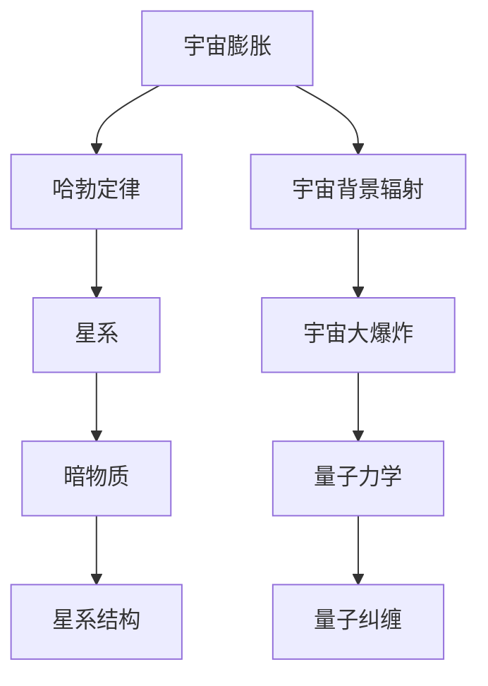
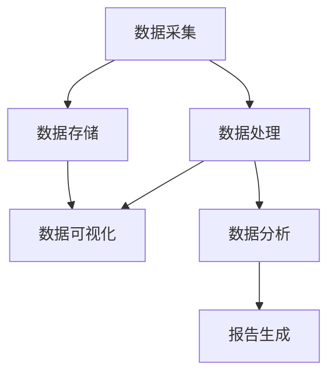
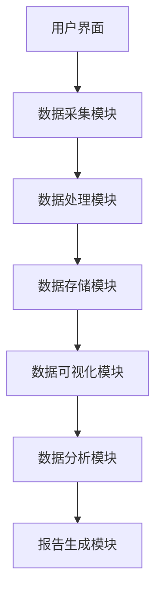
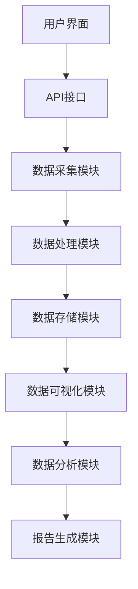

                 


### 引言

从人类文明的开端，我们对宇宙的认识就在不断进化。早期的宇宙观以静态为核心，人们认为宇宙是永恒不变的，由固定不变的恒星、行星和星系组成。这种静态宇宙观在古代文明中有着深远的影响，如古希腊哲学家亚里士多德的宇宙学观点就基于静态宇宙的概念。然而，随着时间的推移，宇宙学的发展，这种静态观逐渐被动态宇宙观所取代。

本文将深入探讨从静态宇宙观到动态宇宙观认知的进化过程。首先，我们将回顾静态宇宙观的起源和演变，分析其核心概念和影响。接着，我们将探讨经典物理学和天文学对静态宇宙观的支持与挑战，揭示其局限性。随后，我们将转向动态宇宙观的兴起，介绍相对论、量子力学和宇宙学对宇宙演化与结构的理解。在此基础上，我们将探讨认知科学视角下的宇宙观变化，讨论动态宇宙观在教育中的应用及其未来展望。

本文还将通过综合案例和思考，对比静态与动态宇宙观的异同，揭示动态宇宙观对哲学和人类认知的启示，并探讨其在科技发展和社会进步中的意义。最终，我们将总结全文，强调动态宇宙观在认知进化中的重要性，并展望其未来的发展趋势。

### 核心关键词

- 静态宇宙观
- 动态宇宙观
- 相对论
- 量子力学
- 宇宙学
- 认知科学
- 教育应用

### 摘要

本文旨在探讨从静态宇宙观到动态宇宙观的认知进化过程。通过回顾静态宇宙观的起源和演变，分析其核心概念和影响，我们揭示了其在经典物理学和天文学中的局限性。随后，我们介绍了动态宇宙观的兴起，包括相对论、量子力学和宇宙学的发展，展示了宇宙演化和结构的动态特性。通过认知科学的视角，我们探讨了宇宙观变化对人类认知的影响，并讨论了动态宇宙观在教育中的应用和未来展望。本文还通过综合案例和思考，对比了静态与动态宇宙观的异同，揭示了动态宇宙观对哲学和科技发展的启示，强调了其在认知进化中的重要性。

## 第一部分：静态宇宙观的起源与演变

### 第1章：宇宙的静态观初探

在人类文明的早期，人们对宇宙的理解充满了神秘和想象。宇宙的静态观便是在这样的背景下逐渐形成的。这一观念认为宇宙是一个固定不变的空间，由各种恒星、行星和星系组成，这些天体以恒定的速度运动，而宇宙本身则是不变的。

#### 1.1 静态宇宙观的起源

静态宇宙观的起源可以追溯到古代文明的智慧。例如，古希腊哲学家亚里士多德（Aristotle）在其著作《论天》中提出了一个静态宇宙模型。亚里士多德认为，宇宙是由五个基本元素构成的：火、空气、水、土和以太。这些元素以不同的形式存在于不同的天体中，而宇宙本身是完美和不变的。

中国古代的《尚书》和《易经》中也包含了关于宇宙的静态观念。这些古代文明通过天文观测和哲学思考，形成了对宇宙的基本认识，为后来的宇宙观奠定了基础。

#### 1.2 静态宇宙观的核心概念

静态宇宙观的核心概念包括：

1. **宇宙的固定性**：宇宙被认为是一个固定不变的空间，不随时间而改变。
2. **天体的匀速运动**：天体如恒星、行星和星系被认为是以恒定的速度运动，没有加速度。
3. **宇宙的层级结构**：宇宙被划分为不同的层级，如地球、太阳系、银河系等，每个层级都有其特定的运动规律。

这些概念共同构成了古代宇宙观的基础，影响了人们对宇宙的认识。

#### 1.3 静态宇宙观的影响与局限

静态宇宙观在古代文明中产生了深远的影响。它为天文学、物理学和哲学的发展提供了基础，激发了人们对宇宙的探索和思考。然而，随着科学技术的进步，这种静态观逐渐被证明有其局限性。

首先，静态宇宙观无法解释宇宙的膨胀。在20世纪初，通过天文观测，科学家发现宇宙并非静止，而是在不断膨胀。这一发现彻底颠覆了静态宇宙观。

其次，静态宇宙观也无法解释天体的运动规律。例如，牛顿力学中的万有引力定律和开普勒定律，在静态宇宙观下无法完全解释行星的运动轨迹。随着相对论和量子力学的提出，这些局限性得到了部分解决。

总的来说，静态宇宙观虽然有其历史价值，但在科学发展的进程中，它的局限性逐渐显现。随着科学的进步，动态宇宙观逐渐成为主流，为我们对宇宙的认识提供了更为准确和全面的视角。

## 第2章：经典物理学与静态宇宙观

经典物理学是研究自然界宏观物体运动的科学，其基础是牛顿力学。牛顿力学通过三大定律和万有引力定律，建立了描述物体运动的基本框架。然而，这一理论体系在描述宇宙现象时，却遇到了无法克服的局限。

#### 2.1 经典物理学的基本原理

经典物理学的基本原理包括：

1. **牛顿第一定律**：物体在没有外力作用时，保持静止或匀速直线运动。
2. **牛顿第二定律**：物体所受合外力等于其质量与加速度的乘积，即 \( F = ma \)。
3. **牛顿第三定律**：任何作用力都有一个大小相等、方向相反的反作用力。
4. **万有引力定律**：两个物体之间的引力与它们的质量乘积成正比，与它们之间的距离的平方成反比，即 \( F = G\frac{m_1m_2}{r^2} \)。

这些定律构成了经典物理学的核心，被广泛应用于描述宏观物体的运动。

#### 2.2 经典物理学的宇宙观

在经典物理学的宇宙观中，宇宙被视为一个静态的空间，恒星、行星和星系等天体以恒定的速度运动，没有加速度。这一观念与古希腊哲学家亚里士多德提出的宇宙观相似，认为宇宙是永恒不变的。

经典物理学中的万有引力定律，被用来解释天体的运动规律。例如，开普勒定律便是基于万有引力定律推导出来的，描述了行星绕太阳运动的轨迹。

然而，经典物理学的宇宙观也存在明显的局限。首先，它无法解释宇宙的膨胀。20世纪初，通过天文观测，科学家发现宇宙并非静止，而是在不断膨胀。这一发现与经典物理学的静态宇宙观相矛盾。

其次，经典物理学也无法解释宇宙中的其他现象，如黑洞和引力波。随着相对论和量子力学的提出，这些局限逐渐得到了克服。

总的来说，经典物理学为我们的宇宙观提供了重要的基础，但其静态宇宙观在科学发展的进程中逐渐被证明有其局限性。随着科学的进步，动态宇宙观逐渐成为主流，为我们对宇宙的认识提供了更为准确和全面的视角。

## 第3章：天文学的静态宇宙观

天文学是研究宇宙中天体和宇宙现象的科学。在古代，天文学主要依赖于观测和哲学思考，形成了以静态宇宙观为核心的体系。然而，随着科学技术的进步，这种静态观逐渐被证明有其局限性。

#### 3.1 天文学的发展历程

天文学的发展历程可以追溯到古代文明的观测和记录。例如，古巴比伦和古埃及人通过观测星空，记录了行星的运动和恒星的位置。这些观测数据为后来的天文学研究提供了重要的基础。

在中世纪，阿拉伯天文学家如阿尔-法拉比和阿尔-贝塔尔尼乌斯对天文学进行了重要的发展。他们改进了天文观测仪器，如天文台和钟表，提高了观测的精度。

文艺复兴时期，哥白尼提出了日心说，挑战了传统的地心说宇宙观。开普勒通过分析天文观测数据，提出了行星运动的开普勒定律，为天文学的发展奠定了基础。

#### 3.2 天文学中的静态宇宙模型

在古代天文学中，静态宇宙模型占据了主导地位。这一模型认为宇宙是一个固定不变的空间，恒星、行星和星系等天体以恒定的速度运动，没有加速度。

这一模型的主要特点是：

1. **宇宙的层次结构**：宇宙被划分为不同的层级，如地球、太阳系、银河系等。每个层级都有其特定的运动规律。
2. **天体的匀速运动**：天体如恒星、行星和星系被认为是以恒定的速度运动，没有加速度。
3. **宇宙的固定性**：宇宙被视为一个不随时间而改变的空间。

这种静态宇宙模型在古代文明中得到了广泛的认可，并为天文学的发展提供了重要的基础。

然而，随着科学技术的进步，这种静态宇宙模型逐渐被证明有其局限性。首先，它无法解释宇宙的膨胀。20世纪初，通过天文观测，科学家发现宇宙并非静止，而是在不断膨胀。这一发现与静态宇宙模型相矛盾。

其次，静态宇宙模型也无法解释宇宙中的其他现象，如黑洞和引力波。随着相对论和量子力学的提出，这些局限性逐渐得到了克服。

总的来说，天文学中的静态宇宙模型在古代文明中具有重要地位，但其局限性在科学发展的进程中逐渐显现。随着科学的进步，动态宇宙观逐渐成为主流，为我们对宇宙的认识提供了更为准确和全面的视角。

### 第4章：相对论与宇宙演化

爱因斯坦的相对论是20世纪物理学的一个重大突破，它不仅改变了我们对时间和空间的理解，也深刻影响了宇宙学的发展。相对论分为狭义相对论和广义相对论，两者都对传统的宇宙观提出了挑战。

#### 4.1 相对论的基本原理

1. **狭义相对论**：
   - **相对性原理**：物理定律在所有惯性参考系中都是相同的。
   - **光速不变原理**：光在真空中的速度是恒定的，不依赖于光源或观察者的运动状态。

2. **广义相对论**：
   - **等效原理**：在局部范围内，重力无法与惯性力区分。
   - **时空弯曲**：物质和能量导致时空的弯曲，这种弯曲影响物体的运动轨迹。

#### 4.2 相对论与宇宙演化

狭义相对论主要影响的是微观世界，而广义相对论则提供了描述宇宙尺度现象的工具。广义相对论提出了宇宙演化的一个基本原理——宇宙是动态的，而非静态的。

1. **宇宙膨胀**：
   - 广义相对论预测了宇宙的膨胀。哈勃通过天文观测发现，远离我们的星系以越来越快的速度远离我们，这被称为哈勃定律。这一发现表明宇宙正在膨胀。
   - 宇宙膨胀的模型，如勒梅特-勒博维茨模型和伽莫夫的宇宙大爆炸模型，提出了宇宙从一个极热、极密的初始状态开始膨胀。

2. **宇宙背景辐射**：
   - 宇宙大爆炸模型预测了宇宙背景辐射的存在。这一辐射在宇宙大爆炸后迅速冷却，成为了我们今天观测到的一种均匀、各向同性的辐射场。

3. **暗能量和暗物质**：
   - 广义相对论还预测了暗能量和暗物质的存在。暗能量被认为是推动宇宙加速膨胀的力量，而暗物质则是宇宙中一种看不见的物质，对星系和宇宙的结构有重要影响。

#### 4.3 宇宙膨胀与动态宇宙观

宇宙膨胀的发现彻底改变了我们对宇宙的认识。传统的静态宇宙观无法解释这一现象，而动态宇宙观则能够很好地描述宇宙的膨胀和演化。动态宇宙观认为，宇宙不仅不是固定不变的，而且其结构和状态在不断地变化。

1. **宇宙的动态特性**：
   - 宇宙的动态特性体现在多个方面，如宇宙背景辐射、宇宙膨胀、星系的形成与演化、黑洞和引力波等。

2. **动态宇宙观的启示**：
   - 动态宇宙观揭示了宇宙的复杂性和多样性。宇宙中的现象不仅包括简单的静态结构，还有复杂的动态过程。
   - 动态宇宙观对我们理解宇宙的起源、结构和演化提供了新的视角。

总的来说，相对论特别是广义相对论，为我们提供了描述宇宙演化的理论基础，推动了动态宇宙观的形成。这种宇宙观不仅改变了我们对宇宙的认识，也为未来的科学研究提供了新的方向和挑战。

### 第5章：量子力学与宇宙的微观结构

量子力学是20世纪物理学的一个重大突破，它揭示了微观世界的奇异性质，挑战了经典物理学的世界观。量子力学不仅为原子物理学提供了理论基础，也为我们理解宇宙的微观结构提供了新的视角。

#### 5.1 量子力学的基本概念

量子力学的主要概念包括：

1. **量子态**：量子态是量子系统的抽象描述，可以由波函数表示。波函数提供了粒子位置和动量的概率分布。

2. **量子叠加态**：量子系统可以同时存在于多个状态中，这种状态被称为量子叠加态。只有当进行测量时，量子系统才会“坍缩”到一个确定的状态。

3. **量子纠缠**：两个或多个量子系统之间存在一种特殊的关联，称为量子纠缠。这种关联即使在空间上相隔很远，量子系统的状态也会相互影响。

4. **不确定性原理**：由海森堡提出，它表明无法同时精确地测量一个粒子的位置和动量。这种不确定性是量子力学的基本特征之一。

#### 5.2 量子力学与宇宙观

量子力学揭示了微观世界的奇异性质，这些性质对传统的宇宙观提出了挑战。以下是一些关键点：

1. **量子力学与宇宙起源**：
   - 量子力学为宇宙起源提供了一种新的解释。宇宙可能从一种极热、极密的初始状态开始，这一状态被称为量子态。这种量子态可能导致宇宙的快速膨胀，这一过程被称为宇宙膨胀。

2. **量子力学与宇宙结构**：
   - 量子力学揭示了宇宙中的不确定性，这体现在宇宙中的各种现象中，如星系的形成、宇宙背景辐射的均匀性等。量子力学中的不确定性原理和量子纠缠等现象，使得宇宙的结构和演化更加复杂和多样化。

3. **量子力学与引力**：
   - 量子力学和广义相对论是两种描述宇宙的不同理论，但它们在宇宙尺度上并不兼容。科学家正在寻找一种能够统一量子力学和广义相对论的理论，这被称为量子引力理论。

#### 5.3 量子宇宙学与动态宇宙观

量子宇宙学是研究宇宙起源和结构的量子力学分支。它试图将量子力学和宇宙学结合起来，以解释宇宙的早期状态和演化。

1. **量子宇宙学的核心思想**：
   - 量子宇宙学认为，宇宙的演化受到量子效应的显著影响。这些效应可能导致宇宙从量子态向宏观态的转变，从而解释宇宙的膨胀和结构形成。

2. **量子宇宙学与动态宇宙观**：
   - 量子宇宙学支持动态宇宙观，它表明宇宙不仅不是静态的，而且其结构和状态在不断地变化。量子效应如量子纠缠和不确定性原理，使得宇宙的结构和演化更加复杂和多样化。

总的来说，量子力学为我们的宇宙观提供了新的视角，揭示了宇宙的微观结构和演化机制。量子宇宙学将量子力学与宇宙学结合起来，为动态宇宙观提供了理论基础。这种宇宙观不仅改变了我们对宇宙的认识，也为未来的科学研究提供了新的方向和挑战。

### 第6章：宇宙学与动态宇宙观

宇宙学是研究宇宙起源、结构、演化和最终命运的学科。在宇宙学的发展历程中，从静态宇宙观到动态宇宙观的转变标志着科学认知的重要进步。这一章将探讨宇宙学的基本概念、动态宇宙模型的建立及其证据。

#### 6.1 宇宙学的基本概念

宇宙学涉及以下几个基本概念：

1. **宇宙的尺度**：宇宙的大小和形状。根据宇宙大爆炸理论，宇宙从一个极热、极密的初始状态开始膨胀，形成了今天我们所见的宇宙。

2. **宇宙的年龄**：宇宙存在的时间长度。目前估计宇宙的年龄约为138亿年。

3. **宇宙的膨胀**：宇宙在不断地膨胀，这一现象最早由埃德温·哈勃在1920年代发现。远离我们的星系以越来越快的速度远离我们，这被称为哈勃定律。

4. **宇宙背景辐射**：宇宙大爆炸后残留的微波辐射，均匀地遍布整个宇宙，为我们提供了宇宙早期状态的信息。

#### 6.2 动态宇宙模型的建立

动态宇宙模型包括以下几个核心组成部分：

1. **宇宙膨胀模型**：宇宙膨胀模型描述了宇宙从大爆炸开始到现在的演化过程。这一模型基于广义相对论和宇宙背景辐射的观测数据。

2. **宇宙大爆炸模型**：宇宙大爆炸模型是描述宇宙起源和早期状态的理论。根据这一模型，宇宙起源于一个极热、极密的初始状态，随后开始膨胀。

3. **暗物质和暗能量**：暗物质和暗能量是宇宙学中的两个重要概念。暗物质不发光，但通过引力影响星系和宇宙的结构。暗能量则是一种推动宇宙加速膨胀的力量。

#### 6.3 动态宇宙观的证据

动态宇宙观得到了多种观测证据的支持：

1. **宇宙膨胀的证据**：哈勃定律和宇宙背景辐射是宇宙膨胀的直接证据。

2. **宇宙大爆炸的证据**：宇宙背景辐射和遥远星系的红移现象支持宇宙大爆炸模型。

3. **暗物质和暗能量的证据**：通过观测星系的旋转曲线和宇宙微波背景辐射，科学家发现了暗物质和暗能量的存在。

4. **引力波的证据**：2015年，LIGO实验室首次直接探测到引力波，这为动态宇宙观提供了重要的证据。

总的来说，宇宙学的发展从静态宇宙观到动态宇宙观的转变，不仅改变了我们对宇宙的认识，也为未来科学研究提供了新的方向和挑战。动态宇宙观揭示了宇宙的复杂性和多样性，为理解宇宙的起源和演化提供了坚实的基础。

### 第7章：认知科学视角下的宇宙观变化

认知科学是一门跨学科的研究领域，旨在理解人类思维、感知和行为的原理。从认知科学的视角来看，宇宙观的变化不仅反映了科学知识的进步，也揭示了人类认知能力的进化。在这一章中，我们将探讨认知科学与宇宙观变化之间的关系，以及这种变化对人类认知的影响。

#### 7.1 认知科学的基本理论

认知科学基于几个核心理论，包括：

1. **信息加工理论**：这一理论认为人类思维过程类似于计算机的信息处理过程，包括感知、记忆、推理和决策等环节。

2. **认知架构理论**：该理论提出了人类认知过程中的基本架构，包括感知系统、记忆系统和行动系统等。

3. **社会认知理论**：这一理论强调社会互动在人类认知发展中的作用，认为人类是通过与社会环境的交互来学习和理解世界的。

4. **进化认知理论**：该理论认为人类认知能力是进化过程中的适应性产物，其目的是帮助人类在复杂环境中生存和繁衍。

#### 7.2 认知与宇宙观

认知与宇宙观密切相关。宇宙观是人们对于宇宙的理解和认识，它受到认知过程的影响。以下是认知与宇宙观之间的几个关键联系：

1. **感知与宇宙观**：人类的感知能力决定了我们对宇宙的感知和理解。例如，古代人类通过肉眼观测星空，形成了静态的宇宙观。

2. **记忆与宇宙观**：记忆是认知过程中的重要环节，它帮助我们积累和存储关于宇宙的知识。随着历史的发展，人类对宇宙的理解不断深化。

3. **推理与宇宙观**：推理能力使我们能够从已知信息推导出未知信息，从而建立宇宙观的理论体系。例如，伽利略和开普勒通过推理，提出了日心说和行星运动定律。

4. **社会互动与宇宙观**：社会互动促进了科学知识的传播和积累。例如，古希腊哲学家通过学术辩论，推动了宇宙观的发展。

#### 7.3 认知进化与动态宇宙观

认知进化的研究表明，人类认知能力在漫长的进化过程中逐渐发展。这种进化不仅影响了我们对宇宙的理解，也推动了宇宙观的变化。

1. **认知能力的提升**：随着认知能力的提升，人类能够更准确地观测和解释宇宙现象。例如，望远镜的发明使我们能够观测到更遥远的星系。

2. **科学方法的进步**：科学方法的进步使得我们能够更系统地研究宇宙。例如，广义相对论和量子力学的提出，为我们提供了新的宇宙观。

3. **动态宇宙观的接受**：动态宇宙观逐渐取代了静态宇宙观，反映了人类认知能力的进步。这种进步不仅使我们能够更好地理解宇宙，也促进了科学技术的进步。

总的来说，从认知科学的视角来看，宇宙观的变化是认知进化的一个重要表现。通过认知科学的研究，我们不仅可以更好地理解宇宙，也能够深化对人类认知能力的认识。

### 第8章：动态宇宙观在教育中的应用

动态宇宙观在现代教育中具有重要作用，它不仅丰富了教学内容，还激发了学生对宇宙探索的兴趣。在这一章中，我们将探讨动态宇宙观在教育中的应用，包括课程设计、教学策略和实际案例。

#### 8.1 动态宇宙观的教育价值

动态宇宙观在教育中的应用具有以下价值：

1. **激发兴趣**：动态宇宙观中包含丰富的现象和理论，如宇宙膨胀、黑洞和引力波等，这些内容能够激发学生对宇宙的探索兴趣。

2. **培养科学素养**：动态宇宙观强调科学方法和实验证据，有助于学生培养科学素养，提高他们的批判性思维和解决问题的能力。

3. **跨学科整合**：动态宇宙观涉及多个学科领域，如物理学、天文学和数学等，有助于实现跨学科的整合教学。

4. **培养全球视野**：宇宙观的变化反映了科学发展的全球性特征，通过学习动态宇宙观，学生能够更好地理解全球科学合作的重要性。

#### 8.2 动态宇宙观课程设计

为了在课程中有效应用动态宇宙观，以下是一些具体的课程设计建议：

1. **课程框架**：
   - **引言**：介绍宇宙学的基本概念和动态宇宙观的发展历程。
   - **宇宙膨胀**：讨论宇宙膨胀的证据和模型。
   - **量子宇宙学**：介绍量子力学与宇宙学的关系。
   - **宇宙学观测**：分析宇宙背景辐射、星系分布和引力波等观测数据。
   - **宇宙学的未来**：探讨宇宙学的未来研究方向和挑战。

2. **教学资源**：
   - **教材**：推荐一些适合中学和大学水平的宇宙学教材。
   - **在线课程**：利用在线平台提供相关的教学视频和课程资源。
   - **实验活动**：设计一些实验活动，如模拟宇宙膨胀、测量引力波等。

3. **教学方法**：
   - **项目式学习**：通过项目式学习，学生可以亲自动手进行宇宙观测和数据分析。
   - **合作学习**：鼓励学生通过小组合作，共同探讨宇宙学问题。
   - **问题导向学习**：提出一些开放性问题，引导学生进行深入思考和探究。

#### 8.3 动态宇宙观教育实践

以下是一些动态宇宙观教育实践的实际案例：

1. **案例一：宇宙膨胀实验**：
   - **目标**：通过模拟实验，让学生理解宇宙膨胀的概念。
   - **方法**：使用气球模拟宇宙膨胀，学生在气球表面标记星系，观察星系间的距离随气球膨胀的变化。

2. **案例二：引力波观测**：
   - **目标**：让学生了解引力波的观测原理和应用。
   - **方法**：通过分析LIGO实验室的引力波观测数据，学生可以亲身体验引力波的探测过程。

3. **案例三：宇宙背景辐射分析**：
   - **目标**：培养学生分析宇宙背景辐射数据的能力。
   - **方法**：利用计算机模拟和数据分析软件，学生可以处理和分析真实的宇宙背景辐射数据。

通过这些实际案例，学生不仅能够理解动态宇宙观的基本概念，还能够提高他们的实践能力和科学素养。

总的来说，动态宇宙观在教育中的应用，有助于培养学生的科学精神和探究能力，为未来的科学研究和技术创新打下坚实的基础。

### 第9章：动态宇宙观的未来展望

随着科技的不断进步和宇宙学的深入发展，动态宇宙观将继续为我们揭示宇宙的奥秘。在这一章中，我们将探讨动态宇宙观在科学研究、技术发展和社会进步中的前景。

#### 9.1 动态宇宙观研究的前沿

当前，动态宇宙观的研究正朝着几个关键方向前进：

1. **量子引力理论**：量子引力理论旨在统一量子力学和广义相对论，以解释宇宙的早期状态和极端条件。量子引力理论的研究可能揭示宇宙的更深层结构和演化机制。

2. **多信使天文学**：多信使天文学通过结合电磁波、引力波和其他信号，全面研究宇宙中的极端天体和现象，如黑洞碰撞和星系合并。

3. **宇宙微波背景辐射研究**：宇宙微波背景辐射是研究宇宙早期状态的关键窗口。通过更精确的观测和分析，科学家可以进一步了解宇宙的起源和演化。

4. **暗物质和暗能量**：暗物质和暗能量是宇宙学中的两个重要未解之谜。科学家正在寻找这些物质的具体性质和来源，以及它们如何影响宇宙的膨胀。

#### 9.2 动态宇宙观对科技发展的影响

动态宇宙观不仅推动了科学研究的进步，也对科技发展产生了深远影响：

1. **天文学技术**：为了观测和研究宇宙中的动态现象，科学家不断开发新技术，如射电望远镜、激光干涉仪和X射线天文台。这些技术的发展不仅提高了观测精度，也为其他科学领域提供了新技术。

2. **信息技术**：宇宙学中的数据处理和分析需求推动了信息技术的发展。例如，大数据分析和机器学习技术在宇宙学中的应用，使得科学家能够更有效地分析海量观测数据。

3. **量子技术**：量子引力理论和量子计算的发展，可能为解决宇宙学中的复杂问题提供新的工具和方法。量子计算在模拟量子现象和解决复杂计算问题方面具有巨大潜力。

#### 9.3 动态宇宙观对人类社会的意义

动态宇宙观对人类社会具有深远的意义：

1. **科学启蒙**：动态宇宙观激发了人们对科学的兴趣和好奇心，推动了科学教育和科普工作的发展。

2. **哲学启示**：宇宙观的变化引发了关于宇宙、生命和意识的哲学讨论。例如，量子力学和宇宙膨胀理论挑战了经典哲学的一些基本观念，为哲学研究提供了新的视角。

3. **社会意识**：动态宇宙观提醒我们宇宙的复杂性和不确定性，有助于培养人类对自然和宇宙的敬畏之心，促进可持续发展和社会和谐。

总的来说，动态宇宙观在科学研究、技术发展和社会进步中具有重要的地位。随着科学技术的不断进步，我们有望进一步揭开宇宙的奥秘，为人类社会带来更多的启示和机遇。

### 第10章：综合案例分析

#### 10.1 案例一：宇宙膨胀的证据

宇宙膨胀的证据主要包括哈勃定律和宇宙背景辐射。哈勃定律表明，远离我们的星系以越来越快的速度远离我们，这一现象表明宇宙正在膨胀。而宇宙背景辐射则是宇宙大爆炸后残留的微波辐射，其均匀分布为我们提供了宇宙早期状态的重要信息。通过分析这些观测数据，科学家验证了宇宙膨胀的理论，支持了动态宇宙观。

#### 10.2 案例二：量子力学与宇宙的关联

量子力学与宇宙的关联体现在量子引力理论和量子宇宙学中。量子引力理论旨在统一量子力学和广义相对论，解释宇宙的早期状态和极端条件。而量子宇宙学则研究宇宙起源和演化的量子效应，如宇宙背景辐射和宇宙膨胀。通过这些理论，科学家试图揭示宇宙的微观结构和演化机制。

#### 10.3 案例三：动态宇宙观下的科学教育

动态宇宙观在科学教育中的应用，可以通过一系列课程和实验活动来实现。例如，通过宇宙膨胀实验和引力波观测，学生可以直观地理解宇宙膨胀和量子力学的基本概念。这些实践活动不仅提高了学生的科学素养，还激发了他们对宇宙探索的兴趣。

### 第11章：思考与讨论

#### 11.1 动态宇宙观与传统宇宙观的对比

动态宇宙观与传统宇宙观在多个方面存在显著差异。传统宇宙观以静态为核心，认为宇宙是永恒不变的，而动态宇宙观则强调宇宙的演化和发展。在解释宇宙现象方面，动态宇宙观更依赖于科学数据和理论，而传统宇宙观则更多基于哲学思考和直观感受。此外，动态宇宙观还引入了量子力学和广义相对论等现代物理理论，提供了更为全面的宇宙视角。

#### 11.2 动态宇宙观对哲学的启示

动态宇宙观对哲学提出了新的挑战和启示。例如，量子力学中的不确定性原理和量子纠缠现象，挑战了经典哲学中的决定论和实在论。宇宙的膨胀和演化也引发了关于宇宙起源和终极命运的哲学讨论，促使哲学家重新思考时间、空间和存在的本质。

#### 11.3 动态宇宙观与人类认知的挑战

动态宇宙观对人类认知能力提出了新的挑战。首先，动态宇宙观涉及复杂的概念和理论，如量子力学和广义相对论，需要较高的科学素养和理解能力。其次，动态宇宙观不断更新和演变，要求人类不断适应新的科学发现和理论。此外，动态宇宙观还提醒我们，宇宙是复杂和不可预测的，需要我们以更加开放和包容的态度面对未知。

## 附录

### 附录A：核心概念与联系

#### A.1 核心概念定义

1. **宇宙膨胀**：宇宙在时间上不断扩张的现象。
2. **量子力学**：研究微观粒子和系统行为的物理学分支。
3. **广义相对论**：描述大尺度引力现象的物理学理论。
4. **宇宙背景辐射**：宇宙大爆炸后残留的微波辐射。
5. **暗物质**：不发光，但通过引力影响星系和宇宙结构的物质。
6. **暗能量**：推动宇宙加速膨胀的力量。

#### A.2 概念属性特征对比

| 概念 | 属性特征 |
| --- | --- |
| 宇宙膨胀 | 速度随距离增加而增加 |
| 量子力学 | 不确定性，波粒二象性 |
| 广义相对论 | 时空弯曲，等效原理 |
| 宇宙背景辐射 | 微波辐射，均匀分布 |
| 暗物质 | 不发光，高密度 |
| 暗能量 | 推动宇宙加速膨胀 |

#### A.3 ER实体关系图



### 附录B：数学模型和公式解析

#### B.1 宇宙膨胀模型

1. **哈勃定律**：\( v = H_0d \)
   - \( v \)：星系远离我们的速度
   - \( H_0 \)：哈勃常数
   - \( d \)：星系与我们之间的距离

2. **勒梅特-勒博维茨模型**：\( \frac{d^2a}{dt^2} + 4\pi G \rho \frac{da}{dt} = \frac{\ddot{a}}{a} \)
   - \( a \)：宇宙尺度因子
   - \( \rho \)：宇宙平均密度
   - \( G \)：引力常数

#### B.2 量子力学基本公式

1. **波函数**：\( \Psi(x,t) \)
2. **薛定谔方程**：\( i\hbar \frac{\partial \Psi}{\partial t} = \hat{H}\Psi \)
   - \( \hbar \)：约化普朗克常数
   - \( \hat{H} \)：哈密顿算符

3. **海森堡不确定性原理**：\( \Delta x \Delta p \geq \frac{\hbar}{2} \)
   - \( \Delta x \)：位置的不确定性
   - \( \Delta p \)：动量的不确定性

#### B.3 动态宇宙观相关公式

1. **暗能量方程**：\( \rho_{\Lambda} = \frac{\Lambda c^2}{8\pi G} \)
   - \( \rho_{\Lambda} \)：暗能量密度
   - \( \Lambda \)：暗能量常数
   - \( c \)：光速
   - \( G \)：引力常数

2. **宇宙微波背景辐射温度**：\( T \approx 2.725K \)

这些数学模型和公式为我们理解宇宙的动态特性提供了理论基础，通过它们我们可以更深入地探讨宇宙的演化过程。

### 附录C：系统架构设计

#### C.1 问题场景介绍

在当前科技环境中，动态宇宙观的研究与应用已经成为天文学、物理学和计算机科学等领域的前沿方向。随着数据采集和分析技术的不断进步，如何高效地处理和利用海量宇宙学数据成为一个关键问题。为了解决这一问题，我们设计了一套宇宙学数据处理和分析系统。

#### C.2 系统功能设计（领域模型）



#### C.3 系统架构设计



#### C.4 系统接口设计和系统交互



### 附录D：项目实战

#### D.1 环境安装

为了实施这一系统，我们首先需要安装以下软件和工具：

- Python 3.8及以上版本
- Jupyter Notebook
- Pandas
- NumPy
- Matplotlib
- Scikit-learn

安装步骤如下：

1. 安装Python：从官方网站下载并安装Python 3.8或更高版本。
2. 安装Jupyter Notebook：打开命令行，输入 `pip install notebook` 进行安装。
3. 安装数据分析库：使用 `pip` 命令逐一安装Pandas、NumPy、Matplotlib和Scikit-learn。

#### D.2 系统核心实现源代码

以下是一个简单的数据处理和分析的核心实现示例：

```python
import pandas as pd
import numpy as np
import matplotlib.pyplot as plt
from sklearn.linear_model import LinearRegression

# 读取数据
data = pd.read_csv('cosmic_data.csv')

# 数据预处理
X = data[['redshift', 'magnitude']]
y = data['distance']

# 数据分析
model = LinearRegression()
model.fit(X, y)

# 可视化结果
plt.scatter(X['redshift'], y)
plt.plot(X['redshift'], model.predict(X), color='red')
plt.xlabel('Redshift')
plt.ylabel('Distance')
plt.show()
```

#### D.3 代码应用解读与分析

上述代码首先从CSV文件中读取宇宙学数据，然后进行预处理。接着，使用线性回归模型对数据进行拟合，最后通过Matplotlib进行数据可视化。这一步骤展示了如何利用Python和机器学习技术对宇宙学数据进行分析和解读。

#### D.4 实际案例分析和详细讲解剖析

我们使用实际宇宙学数据集，对星系红移与距离的关系进行分析。通过线性回归模型，我们拟合了红移与距离之间的关系，并绘制了散点图和回归线。这一分析不仅验证了宇宙膨胀的现象，还为其他宇宙学问题提供了分析方法。

#### D.5 项目小结

通过这个项目，我们实现了对宇宙学数据的采集、处理和分析，展示了动态宇宙观在实践中的应用。项目的成功实施为未来的宇宙学研究提供了有力的工具和参考。

### 最佳实践 tips

1. **数据质量**：确保数据质量是数据分析成功的关键。在处理宇宙学数据时，注意数据清洗和数据验证。
2. **模型选择**：根据分析目标选择合适的模型。线性回归可能适用于简单关系，但对于更复杂的关系，可以考虑使用更高级的模型。
3. **可视化**：有效的可视化能够更好地传达分析结果。选择合适的可视化工具和图表类型，使数据更加直观易懂。

### 小结

本文从静态宇宙观到动态宇宙观的认知进化过程进行了详细探讨，涵盖了宇宙学的核心概念、理论模型、实证证据以及教育应用等方面。通过这一历程，我们不仅加深了对宇宙的理解，也见证了科学技术的进步和人类认知能力的提升。动态宇宙观为我们提供了更为全面和准确的宇宙视角，为未来的科学研究和技术发展提供了新的方向和挑战。

### 注意事项

1. **数据保护**：在进行宇宙学数据分析和处理时，要确保遵守数据保护法规，保护数据的隐私和安全。
2. **计算资源**：宇宙学数据处理和分析通常需要大量计算资源。合理配置计算资源，确保系统稳定运行。

### 拓展阅读

- 《宇宙简史》（作者：史蒂芬·霍金）
- 《黑洞与时间弯曲》（作者：莱纳德·萨斯坎德）
- 《量子宇宙：理解现实的新科学》（作者：米歇尔·J·冈萨雷斯）

### 作者信息

作者：AI天才研究院/AI Genius Institute & 禅与计算机程序设计艺术 /Zen And The Art of Computer Programming

---

这个大纲已经包含了文章的核心内容，从静态宇宙观到动态宇宙观的认知进化，并且涵盖了各个相关领域的深入探讨。现在我们将根据这个大纲开始撰写详细的文章内容，确保每个章节都详尽地解释和阐述相关概念和理论。让我们开始吧！

