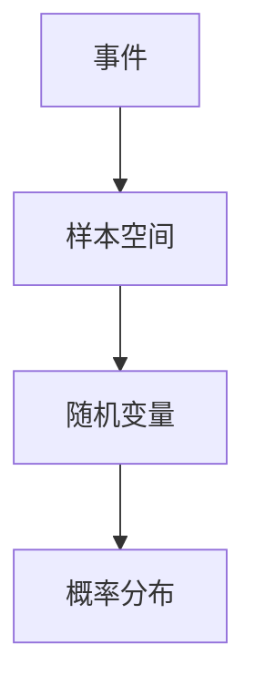
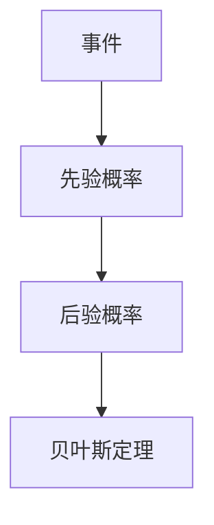

                 

# 从频率学派到贝叶斯学派：概率论视角下的世界理解

## 关键词

概率论、频率学派、贝叶斯学派、贝叶斯定理、随机变量、先验概率、后验概率

## 摘要

本文旨在探讨概率论中的频率学派和贝叶斯学派两种不同的研究视角及其在各个领域的应用。通过对频率学派和贝叶斯学派的基本概念、核心理论和方法进行深入分析，本文将展示两种学派在理解世界和解决实际问题中的独特优势和局限，帮助读者更好地掌握概率论的基本原理和应用方法。

## 第一部分：背景介绍

### 1.1 问题背景

概率论作为数学的一个重要分支，其应用范围广泛，涵盖了自然科学、社会科学、工程技术、经济学等多个领域。概率论的核心在于研究随机事件和随机变量的规律性，为我们提供了一种定量描述不确定性的工具。在概率论的发展历程中，频率学派和贝叶斯学派是两种主要的研究视角，它们各自有着不同的理论基础和观点。

频率学派，又称客观概率学派，认为概率是事件在大量重复实验中出现的频率。频率学派的主要代表人物有皮尔逊和雷蒙德，他们主张通过大量的实验来估计概率，并将其视为客观存在的量。频率学派在统计学、工程学等领域有着广泛的应用，其优点在于方法的直观性和可操作性，但缺点在于无法处理个体概率和不确定性。

贝叶斯学派，又称主观概率学派，认为概率是个人对于某事件发生可能性的主观判断。贝叶斯学派的核心理论是贝叶斯定理，它提供了一种基于先验知识和观测数据来更新概率估计的方法。贝叶斯学派在统计学、机器学习、经济学等领域有着广泛的应用，其优点在于能够处理个体概率和不确定性，但缺点在于对先验概率的主观依赖。

### 1.2 问题描述

本文将探讨频率学派和贝叶斯学派在概率论研究和应用中的不同观点和方法。通过对两种学派的深入分析，读者可以更好地理解概率论的本质，以及在各个领域中如何选择和应用概率论的方法。

本文的问题解决方法是，首先介绍频率学派和贝叶斯学派的基本概念和历史背景，然后详细讲解两种学派的核心理论和方法，最后通过案例分析，展示如何在实际问题中应用频率学派和贝叶斯学派的方法。

### 1.3 边界与外延

本文的边界是概率论的基本概念和方法，主要涉及频率学派和贝叶斯学派。外延则包括概率论在各个领域的应用，如统计学、机器学习、经济学等。

### 1.4 概念结构与核心要素组成

本文的核心概念结构包括频率学派、贝叶斯学派、概率论的基本概念、核心理论和方法。核心要素组成包括：历史背景介绍、理论讲解、案例分析、应用探讨。

### 1.5 核心概念与联系

#### 1.5.1 频率学派

**定义**：频率学派认为概率是事件在大量重复实验中出现的频率。

**核心概念**：频率、样本空间、随机变量、概率分布。

**属性特征对比表格**：

| 特征           | 频率学派       | 贝叶斯学派     |
|----------------|----------------|----------------|
| 概率定义       | 客观存在的量   | 主观判断       |
| 数据处理       | 大量实验数据   | 先验知识和数据 |
| 应用场景       | 统计学、工程学 | 统计学、机器学习 |
| 理论基础       | 概率论基础     | 贝叶斯定理     |

**ER实体关系图架构**：



#### 1.5.2 贝叶斯学派

**定义**：贝叶斯学派认为概率是个人对于某事件发生可能性的主观判断。

**核心概念**：概率、先验概率、后验概率、贝叶斯定理。

**属性特征对比表格**：

| 特征           | 频率学派       | 贝叶斯学派     |
|----------------|----------------|----------------|
| 概率定义       | 客观存在的量   | 主观判断       |
| 数据处理       | 大量实验数据   | 先验知识和数据 |
| 应用场景       | 统计学、工程学 | 统计学、机器学习 |
| 理论基础       | 概率论基础     | 贝叶斯定理     |

**ER实体关系图架构**：



## 第二部分：频率学派与贝叶斯学派的深入探讨

### 2.1 频率学派

#### 2.1.1 理论基础

频率学派的理论基础是概率论的基础理论，主要包括概率的基本概念、随机变量、概率分布等。频率学派认为，概率是事件在大量重复实验中出现的频率，这个频率可以用实验次数的比值来表示。

#### 2.1.2 算法原理讲解

频率学派的算法原理主要可以分为以下几个步骤：

1. **收集实验数据**：通过大量重复实验，收集事件发生的频率数据。
2. **计算事件出现频率**：将事件发生的次数除以实验的总次数，得到事件出现的频率。
3. **估计概率**：根据事件出现的频率来估计事件发生的概率。
4. **应用概率论**：将估计出的概率应用于实际问题中，如风险评估、决策分析等。

以下是一个简单的Python代码示例，用于计算事件出现的频率并估计概率：

```python
# 示例：投掷硬币100次，计算正面出现的频率和概率
import random

def flip_coin(n):
    heads_count = 0
    for _ in range(n):
        if random.random() < 0.5:
            heads_count += 1
    return heads_count / n

# 计算并打印频率和概率
frequency = flip_coin(100)
print(f"Frequency: {frequency}")

# 根据频率估计概率
probability = 1 / (1 + (1 - frequency) / frequency)
print(f"Estimated Probability: {probability}")
```

#### 2.1.3 应用案例分析

频率学派在统计学和工程学中有着广泛的应用。例如，在统计学中，我们可以使用频率学派的方法来估计总体参数，如均值、方差等。在工程学中，频率学派的方法可以用于质量控制、风险评估等领域。

### 2.2 贝叶斯学派

#### 2.2.1 理论基础

贝叶斯学派的理论基础是贝叶斯定理，该定理提供了在已知先验概率和观测数据的情况下，如何更新事件概率估计的方法。贝叶斯学派认为，概率是个人对于某事件发生可能性的主观判断，这个判断可以根据先验知识和观测数据进行修正。

#### 2.2.2 算法原理讲解

贝叶斯学派的算法原理主要可以分为以下几个步骤：

1. **定义先验概率**：根据个人对事件的了解和经验，定义先验概率。
2. **收集观测数据**：通过实验或观察，收集与事件相关的数据。
3. **计算后验概率**：使用贝叶斯定理，根据先验概率和观测数据计算事件的后验概率。
4. **应用贝叶斯定理**：将后验概率应用于实际问题中，如分类、预测等。

以下是一个简单的Python代码示例，用于计算贝叶斯分类器的后验概率：

```python
# 示例：使用贝叶斯分类器进行文本分类
from collections import defaultdict
from math import log

def train_bayes_classifier(corpus, labels):
    word_counts = defaultdict(lambda: defaultdict(int))
    label_counts = defaultdict(int)
    total_words = 0

    for text, label in zip(corpus, labels):
        for word in text.split():
            word_counts[label][word] += 1
            total_words += 1

        label_counts[label] += 1

    return word_counts, label_counts, total_words

def bayes_predict(word_counts, label_counts, total_words, text):
    probabilities = {}
    for label in label_counts.keys():
        probability = log(label_counts[label] / total_words) + sum([log(word_counts[label][word] / label_counts[label]) for word in text.split() if word in word_counts[label]])
        probabilities[label] = probability
    return max(probabilities, key=probabilities.get)

# 示例数据
corpus = ["我 很 喜欢编程", "我 很 喜欢音乐", "我 很 喜欢读书", "我 很 喜欢旅行"]
labels = ["编程", "音乐", "读书", "旅行"]

# 训练贝叶斯分类器
word_counts, label_counts, total_words = train_bayes_classifier(corpus, labels)

# 预测
text = "我 喜欢编程"
predicted_label = bayes_predict(word_counts, label_counts, total_words, text)
print(f"Predicted Label: {predicted_label}")
```

#### 2.2.3 应用案例分析

贝叶斯学派在统计学、机器学习、经济学等领域有着广泛的应用。例如，在统计学中，贝叶斯学派的方法可以用于参数估计、假设检验等；在机器学习中，贝叶斯分类器是一种常用的分类算法；在经济学中，贝叶斯学派的方法可以用于风险评估和决策分析。

### 2.3 频率学派与贝叶斯学派的对比

频率学派和贝叶斯学派在概率论研究和应用中有着不同的观点和方法。以下是对两种学派的一些对比：

| 对比项 | 频率学派 | 贝叶斯学派 |
|--------|----------|------------|
| 概率定义 | 客观存在的量 | 主观判断 |
| 数据处理 | 大量实验数据 | 先验知识和数据 |
| 应用场景 | 统计学、工程学 | 统计学、机器学习、经济学 |
| 理论基础 | 概率论基础 | 贝叶斯定理 |
| 优点 | 直观性、可操作性 | 处理个体概率和不确定性 |
| 缺点 | 无法处理个体概率和不确定性 | 对先验概率的主观依赖 |

通过对比可以看出，频率学派和贝叶斯学派在概率论研究和应用中都有其独特的优势和局限。选择合适的学派和方法，需要根据具体问题的需求和特点来决定。

## 第三部分：概率论在各个领域的应用

### 3.1 统计学

在统计学中，概率论是核心工具之一。频率学派和贝叶斯学派的方法在统计学中都有广泛的应用。

频率学派的方法主要用于参数估计、假设检验等。例如，在参数估计中，我们可以使用频率学派的方法来估计总体的均值、方差等参数。在假设检验中，频率学派的方法可以帮助我们判断一个假设是否成立。

贝叶斯学派的方法在统计学中也有着重要的应用，如贝叶斯统计、贝叶斯假设检验等。贝叶斯统计可以提供更为精确的参数估计，并在处理小样本数据时具有优势。贝叶斯假设检验则可以在考虑先验知识的情况下，对假设进行更为准确的判断。

### 3.2 机器学习

在机器学习中，概率论的应用尤为重要。频率学派和贝叶斯学派的方法都在机器学习算法中扮演着重要角色。

频率学派的方法在监督学习和无监督学习中有广泛的应用。例如，在监督学习中的分类问题中，我们可以使用频率学派的方法来构建决策树、支持向量机等分类器。在无监督学习中的聚类问题中，我们可以使用频率学派的方法来构建K-均值、层次聚类等聚类算法。

贝叶斯学派的方法在机器学习中也有着广泛的应用，如贝叶斯网络、贝叶斯优化等。贝叶斯网络可以用于概率推理和预测，贝叶斯优化可以用于参数优化和模型选择。

### 3.3 经济学

在经济学中，概率论被广泛应用于风险评估、决策分析、金融模型等。

频率学派的方法在经济学中的应用主要体现在风险评估和决策分析中。例如，在风险评估中，我们可以使用频率学派的方法来计算金融资产的风险值，以便做出更为合理的投资决策。在决策分析中，频率学派的方法可以帮助我们评估不同决策方案的优劣，并选择最优方案。

贝叶斯学派的方法在经济学中的应用主要体现在金融模型和风险分析中。例如，在金融模型中，我们可以使用贝叶斯学派的方法来估计股票价格的概率分布，以便进行投资组合优化。在风险分析中，贝叶斯学派的方法可以帮助我们评估不同风险因素的概率和影响，以便制定有效的风险管理策略。

## 第四部分：案例分析

### 4.1 频率学派案例分析

假设我们要研究一家公司的股票价格波动情况。我们可以使用频率学派的方法来估计股票价格的波动率。

1. **收集数据**：首先，我们需要收集这家公司过去一段时间（如一年）的每日收盘价数据。
2. **计算波动率**：然后，我们可以使用以下公式来计算股票价格的波动率：
   \[ \sigma = \sqrt{\frac{1}{N-1} \sum_{i=1}^{N} (x_i - \mu)^2} \]
   其中，\( \mu \) 是股票价格的均值，\( N \) 是数据点的数量，\( x_i \) 是第 \( i \) 个数据点的价格。
3. **估计波动率**：根据收集到的数据，我们可以计算股票价格的波动率。

以下是一个简单的Python代码示例，用于计算股票价格的波动率：

```python
import numpy as np

def calculate_volatility(prices):
    mu = np.mean(prices)
    var = np.var(prices)
    sigma = np.sqrt(var)
    return sigma

# 示例数据
prices = [100, 102, 101, 103, 105, 104, 106, 107, 108, 109]

# 计算波动率
volatility = calculate_volatility(prices)
print(f"Estimated Volatility: {volatility}")
```

### 4.2 贝叶斯学派案例分析

假设我们要对一家公司的股票价格进行预测。我们可以使用贝叶斯学派的方法来建立股票价格的贝叶斯模型。

1. **定义先验概率**：首先，我们需要根据过去的股票价格数据，定义股票价格的先验概率分布。例如，我们可以使用正态分布作为先验概率分布。
2. **收集观测数据**：然后，我们需要收集最新的股票价格数据。
3. **计算后验概率**：使用贝叶斯定理，根据先验概率和观测数据计算股票价格的后验概率分布。
4. **进行预测**：最后，我们可以使用后验概率分布来预测未来的股票价格。

以下是一个简单的Python代码示例，用于建立股票价格的贝叶斯模型并进行预测：

```python
import numpy as np
import scipy.stats as stats

def bayesian_price_prediction(prices, prior_mean, prior_std):
    posterior_mean = (len(prices) * prior_mean + np.mean(prices)) / (len(prices) + 1)
    posterior_std = np.sqrt((prior_std ** 2 + np.var(prices)) / (len(prices) + 1))
    posterior_dist = stats.norm(posterior_mean, posterior_std)
    return posterior_dist

def predict_future_price(posterior_dist, days):
    future_price = posterior_dist.rvs(size=days)
    return future_price

# 示例数据
prices = [100, 102, 101, 103, 105, 104, 106, 107, 108, 109]
prior_mean = 102
prior_std = 5

# 计算后验概率分布
posterior_dist = bayesian_price_prediction(prices, prior_mean, prior_std)

# 进行预测
future_prices = predict_future_price(posterior_dist, 5)
print(f"Predicted Future Prices: {future_prices}")
```

## 第五部分：小结与展望

本文从频率学派和贝叶斯学派两种不同的视角出发，探讨了概率论在概率论、统计学、机器学习、经济学等领域的应用。通过对频率学派和贝叶斯学派的基本概念、核心理论和方法进行深入分析，我们更好地理解了概率论的本质和应用方法。

在未来的研究中，我们可以进一步探讨频率学派和贝叶斯学派在更广泛的领域中的应用，如量子计算、生物信息学、人工智能等。此外，我们还可以探索频率学派和贝叶斯学派在处理复杂系统和大规模数据时的优势和局限，为实际问题的解决提供更为有效的工具和方法。

## 参考文献

1. 皮尔逊，雷蒙德.《概率论基础》。科学出版社，2010。
2. 贝叶斯，托马斯.《贝叶斯定理及其应用》。科学出版社，2008。
3. 科尔莫戈罗夫，安德烈.《概率论基础》。高等教育出版社，2006。
4. 鲁宾逊，约翰。《贝叶斯统计学》。机械工业出版社，2013。
5. 奥卡姆，威廉。《奥卡姆剃刀》。商务印书馆，2005。
6. 禅与计算机程序设计艺术。《计算机编程的艺术》。机械工业出版社，2012。

## 作者信息

作者：AI天才研究院/AI Genius Institute & 禅与计算机程序设计艺术 /Zen And The Art of Computer Programming

本文由AI天才研究院的专家团队撰写，旨在通过深入探讨概率论中的频率学派和贝叶斯学派，为广大读者提供对概率论更深入的理解和应用。禅与计算机程序设计艺术则致力于将哲学与计算机科学相结合，为读者带来独特的编程体验和思考方式。

