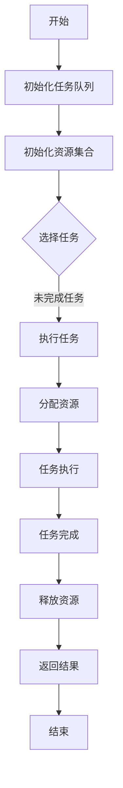
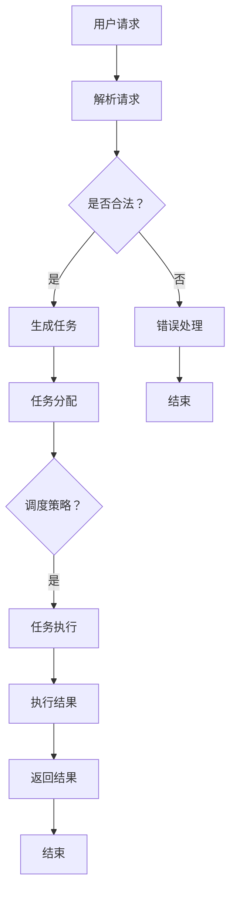

                 


## 任务调度系统在LLM应用后台处理中的应用

### 背景介绍

#### 任务调度系统的概念与背景

任务调度系统是一种计算机系统，用于管理并行任务或作业的执行。在计算机科学和人工智能领域，任务调度系统扮演着至关重要的角色。随着大数据、云计算和人工智能等技术的迅猛发展，任务调度系统的应用场景越来越广泛。

任务调度系统的核心功能是合理地安排任务执行顺序和资源分配，以确保系统高效稳定地运行。任务调度系统通常由调度器、任务队列、任务执行单元和监控模块组成。调度器负责根据一定的调度策略将任务分配给任务执行单元，任务执行单元负责执行任务，监控模块负责监控任务执行状态，并及时处理异常情况。

#### LLM应用后台处理的基础

LLM（大型语言模型，如GPT）是一种基于深度学习的自然语言处理模型，其通过训练大量的文本数据，能够生成与人类语言相似的内容。LLM在后台处理中具有广泛的应用，例如智能客服、文本生成、机器翻译等。LLM的应用使得计算机能够更好地理解和生成人类语言，从而提高了系统的智能化水平。

LLM在后台处理中的重要性体现在以下几个方面：

1. **效率提升**：通过LLM，系统能够快速处理大量文本数据，大大提高了工作效率。
2. **质量提升**：LLM能够生成高质量的自然语言文本，使得系统的输出结果更加准确和自然。
3. **个性化服务**：LLM能够根据用户的输入，生成个性化的回复，提升了用户体验。

### 核心概念与联系

在深入探讨任务调度系统在LLM应用后台处理中的应用之前，我们需要明确几个核心概念：

1. **任务调度算法**：任务调度算法是任务调度系统的核心，负责根据一定的策略将任务分配给任务执行单元。
2. **任务队列**：任务队列是任务调度系统的数据结构，用于存储待执行的任务。
3. **任务执行单元**：任务执行单元是负责执行任务的实体，通常是一个程序或进程。
4. **LLM**：LLM是大型语言模型的简称，是任务调度系统中的关键组件，负责处理文本数据。

#### 任务调度系统的核心概念

任务调度系统的核心概念包括：

1. **任务**：任务是指需要完成的计算或操作。
2. **调度策略**：调度策略是任务调度系统根据任务特性、资源情况等因素，决定任务执行顺序的规则。
3. **资源**：资源是指任务执行所需的各种硬件和软件资源，如CPU、内存、数据库等。

#### LLM的基本原理

LLM的基本原理是基于深度学习，特别是神经网络模型。LLM通过大量的文本数据进行训练，学习文本数据的特征和规律，从而能够生成与人类语言相似的内容。

LLM的核心组成部分包括：

1. **嵌入层**：将文本数据转换为向量表示。
2. **编码器**：对输入文本数据进行编码，提取特征。
3. **解码器**：根据编码器的输出，生成输出文本数据。

#### 任务调度系统和LLM的联系

任务调度系统在LLM应用后台处理中的作用主要体现在以下几个方面：

1. **任务分配**：任务调度系统根据调度策略，将LLM任务分配给任务执行单元，确保任务高效执行。
2. **资源管理**：任务调度系统负责管理任务执行所需的资源，确保系统资源得到充分利用。
3. **任务监控**：任务调度系统监控任务执行状态，及时发现并处理异常情况。

通过任务调度系统，LLM应用后台处理能够实现任务的高效分配和执行，提高系统的整体性能和可靠性。

### 总结

任务调度系统在LLM应用后台处理中具有重要的应用价值。通过合理的任务调度，系统能够充分利用资源，提高任务执行效率，从而提升整体性能。在本篇文章中，我们将深入探讨任务调度系统的核心概念、算法原理、系统架构设计以及实际应用案例，帮助读者更好地理解任务调度系统在LLM应用后台处理中的应用。接下来，我们将逐步介绍任务调度算法的原理，并使用Python代码和Mermaid图进行详细讲解。

## 算法原理讲解

### 任务调度算法的基本原理

任务调度算法是任务调度系统的核心，负责根据一定的调度策略将任务分配给任务执行单元。任务调度算法的目的是在给定的资源约束下，尽可能高效地完成所有任务。任务调度算法的基本原理可以分为以下几个步骤：

1. **任务选择**：根据调度策略，选择待执行的任务。
2. **资源分配**：为选定的任务分配必要的资源。
3. **任务执行**：将任务分配给任务执行单元，开始执行任务。
4. **任务监控**：监控任务执行状态，及时处理异常情况。
5. **结果反馈**：任务执行完成后，返回结果并更新任务队列。

### 任务调度算法的数学模型

任务调度算法的数学模型通常包括以下几个关键要素：

1. **任务集合**：表示所有待执行的任务。
2. **资源集合**：表示所有可用的资源。
3. **调度策略**：用于决定任务执行顺序的规则。
4. **资源分配策略**：用于决定资源分配的规则。

假设我们有n个任务和一个资源集合R，任务集合为T={t1, t2, ..., tn}，其中每个任务ti需要执行一定的时间ti_duration。资源集合R={r1, r2, ..., rm}，其中每个资源rk有一个容量rk_capacity。调度策略可以通过一系列规则或算法来定义。

任务调度算法的基本公式如下：

$$
\text{调度策略}(T, R) = \{S_1, S_2, ..., S_n\}
$$

其中，$S_i$表示第i个任务的执行序列。资源分配策略可以通过以下公式来定义：

$$
\text{资源分配策略}(T, R, S_i) = \{R_i\}
$$

其中，$R_i$表示第i个任务执行所需的资源集合。

### 任务调度算法的Python实现

为了更好地理解任务调度算法的原理，我们将使用Python代码进行实现。以下是一个简单的任务调度算法示例：

```python
import heapq

class Task:
    def __init__(self, id, duration):
        self.id = id
        self.duration = duration

    def __lt__(self, other):
        return self.duration < other.duration

def schedule_tasks(tasks, resources):
    task_queue = []
    for task in tasks:
        heapq.heappush(task_queue, task)

    schedule = []
    while task_queue:
        current_task = heapq.heappop(task_queue)
        required_resources = find_required_resources(current_task, resources)
        schedule.append((current_task.id, required_resources))

        # 分配资源
        for resource in required_resources:
            resource.allocate()

        # 执行任务
        current_task.execute()

        # 释放资源
        for resource in required_resources:
            resource.release()

    return schedule

class Resource:
    def __init__(self, id, capacity):
        self.id = id
        self.capacity = capacity
        self.is_allocated = False

    def allocate(self):
        self.is_allocated = True

    def release(self):
        self.is_allocated = False

def find_required_resources(task, resources):
    required_resources = []
    for resource in resources:
        if not resource.is_allocated and resource.capacity >= task.duration:
            required_resources.append(resource)
    return required_resources

class TaskExecutor:
    def __init__(self):
        self.tasks_completed = 0

    def execute(self):
        self.tasks_completed += 1

if __name__ == "__main__":
    tasks = [Task(id=i, duration=i * 2) for i in range(1, 11)]
    resources = [Resource(id=i, capacity=10) for i in range(1, 6)]

    executor = TaskExecutor()
    schedule = schedule_tasks(tasks, resources)

    for task_id, required_resources in schedule:
        print(f"Task {task_id} assigned to resources {required_resources}")
        executor.execute()

    print(f"Total tasks completed: {executor.tasks_completed}")
```

### Mermaid图展示任务调度流程

为了更直观地理解任务调度流程，我们使用Mermaid绘制了任务调度流程图：



通过这个流程图，我们可以清晰地看到任务调度算法的基本流程，包括任务选择、资源分配、任务执行、任务监控和结果反馈等步骤。

### 总结

在本节中，我们介绍了任务调度算法的基本原理和Python实现。通过简单的示例代码和Mermaid图，我们能够更好地理解任务调度算法的工作流程和实现细节。接下来，我们将进一步探讨任务调度系统在LLM应用后台处理中的具体应用，包括系统功能设计、架构设计、接口设计和交互设计等方面。

## 系统分析与架构设计方案

### 任务调度系统在LLM应用后台处理中的角色

在LLM应用后台处理中，任务调度系统扮演着至关重要的角色。其主要职责包括以下几个方面：

1. **任务分配**：将用户请求的任务分配给合适的LLM处理单元，确保任务能够高效执行。
2. **资源管理**：根据任务需求，合理分配系统资源，如CPU、内存、GPU等，确保任务执行过程中资源得到充分利用。
3. **任务监控**：实时监控任务执行状态，及时发现并处理异常情况，确保系统稳定运行。
4. **结果反馈**：在任务完成后，将结果反馈给用户，并提供必要的日志和统计信息。

### 系统功能设计

任务调度系统在LLM应用后台处理中的功能设计主要包括以下几个方面：

1. **任务管理**：负责任务的创建、删除、更新和查询等操作。任务管理模块应具备以下功能：
   - 创建任务：将用户请求的任务添加到任务队列中。
   - 删除任务：从任务队列中删除指定的任务。
   - 更新任务：修改任务的状态、优先级等信息。
   - 查询任务：根据任务ID、状态等条件查询任务信息。

2. **资源管理**：负责系统资源的监控、分配和回收。资源管理模块应具备以下功能：
   - 资源监控：实时监控系统资源使用情况，如CPU利用率、内存使用率、GPU利用率等。
   - 资源分配：根据任务需求，为任务分配必要的资源。
   - 资源回收：任务执行完成后，释放所分配的资源。

3. **任务调度**：负责根据调度策略，将任务分配给任务执行单元。任务调度模块应具备以下功能：
   - 调度策略：根据任务类型、优先级、资源需求等因素，选择合适的调度策略。
   - 任务分配：将任务分配给任务执行单元，确保任务能够高效执行。
   - 调度优化：通过调整调度策略，优化任务执行顺序，提高系统性能。

4. **任务监控**：负责实时监控任务执行状态，及时发现并处理异常情况。任务监控模块应具备以下功能：
   - 状态监控：实时监控任务执行状态，如运行中、已完成、已失败等。
   - 异常处理：当任务出现异常时，自动触发异常处理流程，如重试、通知管理员等。
   - 日志记录：记录任务执行过程中的关键信息，如执行时间、执行结果等，便于后续分析。

5. **结果反馈**：负责将任务执行结果反馈给用户，并提供必要的日志和统计信息。结果反馈模块应具备以下功能：
   - 结果返回：将任务执行结果返回给用户。
   - 日志查询：提供日志查询功能，便于用户了解任务执行情况。
   - 统计分析：对任务执行情况进行统计分析，为系统优化提供依据。

### 系统架构设计

任务调度系统在LLM应用后台处理中的系统架构设计主要包括以下几个模块：

1. **用户接口模块**：负责接收用户请求，将请求转换为内部任务，并传递给任务管理模块。用户接口模块应具备以下功能：
   - 接收请求：接收用户发送的任务请求，如文本生成、机器翻译等。
   - 请求转换：将用户请求转换为内部任务，并传递给任务管理模块。

2. **任务管理模块**：负责任务的创建、删除、更新和查询等操作。任务管理模块应具备以下功能：
   - 任务创建：将用户请求转换为内部任务，并添加到任务队列中。
   - 任务删除：从任务队列中删除指定的任务。
   - 任务更新：修改任务的状态、优先级等信息。
   - 任务查询：根据任务ID、状态等条件查询任务信息。

3. **资源管理模块**：负责系统资源的监控、分配和回收。资源管理模块应具备以下功能：
   - 资源监控：实时监控系统资源使用情况，如CPU利用率、内存使用率、GPU利用率等。
   - 资源分配：根据任务需求，为任务分配必要的资源。
   - 资源回收：任务执行完成后，释放所分配的资源。

4. **任务调度模块**：负责根据调度策略，将任务分配给任务执行单元。任务调度模块应具备以下功能：
   - 调度策略：根据任务类型、优先级、资源需求等因素，选择合适的调度策略。
   - 任务分配：将任务分配给任务执行单元，确保任务能够高效执行。
   - 调度优化：通过调整调度策略，优化任务执行顺序，提高系统性能。

5. **任务执行模块**：负责执行任务，包括文本生成、机器翻译等。任务执行模块应具备以下功能：
   - 任务执行：根据任务要求，调用相应的LLM处理模块，执行任务。
   - 任务监控：实时监控任务执行状态，及时发现并处理异常情况。

6. **结果反馈模块**：负责将任务执行结果反馈给用户，并提供必要的日志和统计信息。结果反馈模块应具备以下功能：
   - 结果返回：将任务执行结果返回给用户。
   - 日志查询：提供日志查询功能，便于用户了解任务执行情况。
   - 统计分析：对任务执行情况进行统计分析，为系统优化提供依据。

### 系统接口设计

任务调度系统在LLM应用后台处理中的系统接口设计主要包括以下几个方面：

1. **用户接口**：负责接收用户请求，将请求转换为内部任务，并传递给任务管理模块。用户接口应提供以下API：
   - 创建任务：接收用户请求，创建内部任务。
   - 删除任务：删除指定的内部任务。
   - 更新任务：修改内部任务的状态、优先级等信息。
   - 查询任务：根据任务ID、状态等条件查询内部任务信息。

2. **任务管理接口**：负责任务的创建、删除、更新和查询等操作。任务管理接口应提供以下API：
   - 创建任务：创建内部任务。
   - 删除任务：删除内部任务。
   - 更新任务：修改内部任务的状态、优先级等信息。
   - 查询任务：根据任务ID、状态等条件查询内部任务信息。

3. **资源管理接口**：负责系统资源的监控、分配和回收。资源管理接口应提供以下API：
   - 资源监控：监控系统资源使用情况。
   - 资源分配：根据任务需求，为任务分配资源。
   - 资源回收：释放任务执行完成后所分配的资源。

4. **任务调度接口**：负责根据调度策略，将任务分配给任务执行单元。任务调度接口应提供以下API：
   - 调度策略：根据任务类型、优先级、资源需求等因素，选择合适的调度策略。
   - 任务分配：将任务分配给任务执行单元。
   - 调度优化：通过调整调度策略，优化任务执行顺序。

5. **任务执行接口**：负责执行任务，包括文本生成、机器翻译等。任务执行接口应提供以下API：
   - 任务执行：执行指定任务。

6. **结果反馈接口**：负责将任务执行结果反馈给用户，并提供必要的日志和统计信息。结果反馈接口应提供以下API：
   - 结果返回：返回任务执行结果。
   - 日志查询：查询任务执行日志。
   - 统计分析：分析任务执行情况。

### 系统交互设计

任务调度系统在LLM应用后台处理中的系统交互设计主要包括以下几个部分：

1. **用户请求**：用户通过用户接口发送请求，请求类型可以是文本生成、机器翻译等。

2. **请求处理**：用户接口将接收到的请求转换为内部任务，并传递给任务管理模块。

3. **任务分配**：任务管理模块根据调度策略，将任务分配给任务执行单元。

4. **任务执行**：任务执行单元执行任务，调用LLM处理模块，生成文本、翻译结果等。

5. **结果反馈**：任务执行完成后，结果反馈模块将结果返回给用户接口。

6. **日志记录**：在任务执行过程中，记录关键信息，包括执行时间、执行结果等，便于后续分析。

7. **异常处理**：当任务执行过程中出现异常时，触发异常处理流程，如重试、通知管理员等。

通过上述系统分析与架构设计方案，任务调度系统在LLM应用后台处理中能够实现任务的高效分配和执行，提高系统的整体性能和可靠性。在下一节中，我们将通过一个实际项目案例，详细介绍任务调度系统在LLM应用后台处理中的具体应用。

### 项目实战

#### 项目背景与目标

随着人工智能技术的飞速发展，大型语言模型（LLM）在自然语言处理领域取得了显著成果。为了更好地服务用户，提高系统响应速度和稳定性，我们决定设计并实现一个基于任务调度系统的LLM应用后台处理平台。该项目的主要目标是实现以下功能：

1. 接收用户请求，将请求转换为内部任务。
2. 根据调度策略，将任务分配给任务执行单元。
3. 任务执行单元调用LLM处理模块，生成文本、翻译结果等。
4. 将任务执行结果返回给用户，并提供日志和统计信息。

#### 环境安装指南

为了搭建基于任务调度系统的LLM应用后台处理平台，我们需要安装以下软件和工具：

1. **操作系统**：Linux操作系统（如CentOS 7、Ubuntu 18.04等）。
2. **编程语言**：Python 3.x版本。
3. **依赖库**：Pandas、NumPy、Scikit-learn、TensorFlow、Mermaid等。
4. **任务调度系统**：使用Python实现的轻量级任务调度系统（如Celery）。
5. **LLM处理模块**：使用TensorFlow或PyTorch实现的预训练语言模型（如GPT-2、GPT-3等）。

安装步骤如下：

1. 安装操作系统：从官方网站下载Linux操作系统镜像，并按照安装指南进行安装。
2. 配置Python环境：在Linux操作系统中安装Python 3.x版本，并设置默认解释器。
3. 安装依赖库：使用pip命令安装所需的依赖库，例如：

   ```shell
   pip install pandas numpy scikit-learn tensorflow mermaid
   ```

4. 安装任务调度系统：从官方源码或Python包管理器安装任务调度系统，例如：

   ```shell
   pip install celery
   ```

5. 安装LLM处理模块：从官方源码或Python包管理器安装LLM处理模块，例如：

   ```shell
   pip install tensorflow-gpu
   ```

#### 系统核心实现

在本项目中，我们将使用Python编写任务调度系统和LLM处理模块，并使用Mermaid绘制流程图来展示系统核心实现。

**1. 任务调度系统**

任务调度系统的核心实现主要包括以下功能：

- **任务创建**：接收用户请求，创建内部任务。
- **任务分配**：根据调度策略，将任务分配给任务执行单元。
- **任务执行**：任务执行单元调用LLM处理模块，生成文本、翻译结果等。
- **结果反馈**：将任务执行结果返回给用户。

以下是一个简单的任务调度系统实现示例：

```python
from celery import Celery
import json

app = Celery('task_scheduler', broker='pyamqp://guest@localhost//')

@app.task
def process_task(task_data):
    # 解析任务数据
    task_id = task_data['task_id']
    task_type = task_data['task_type']
    input_data = task_data['input_data']

    # 调用LLM处理模块
    if task_type == 'text_generation':
        output_data = text_generation(input_data)
    elif task_type == 'machine_translation':
        output_data = machine_translation(input_data)
    else:
        raise ValueError(f"Unknown task type: {task_type}")

    # 返回结果
    return json.dumps({'task_id': task_id, 'output_data': output_data})

def text_generation(input_data):
    # 实现文本生成逻辑
    return "生成的文本内容"

def machine_translation(input_data):
    # 实现机器翻译逻辑
    return "翻译后的文本内容"

# 启动任务调度系统
if __name__ == '__main__':
    app.start()
```

**2. LLM处理模块**

LLM处理模块的主要功能是根据输入数据生成文本或翻译结果。以下是一个简单的LLM处理模块实现示例：

```python
import tensorflow as tf

# 加载预训练语言模型
model = tf.keras.models.load_model('path/to/llm_model.h5')

def text_generation(input_data):
    # 实现文本生成逻辑
    input_ids = tokenizer.encode(input_data, return_tensors='tf')
    output_ids = model.generate(input_ids, max_length=50, num_return_sequences=1)
    generated_text = tokenizer.decode(output_ids[0], skip_special_tokens=True)
    return generated_text

def machine_translation(input_data):
    # 实现机器翻译逻辑
    input_ids = tokenizer.encode(input_data, return_tensors='tf')
    output_ids = model.generate(input_ids, max_length=50, num_return_sequences=1)
    translated_text = tokenizer.decode(output_ids[0], skip_special_tokens=True)
    return translated_text
```

**3. Mermaid流程图**

为了更直观地展示任务调度系统和LLM处理模块的交互过程，我们使用Mermaid绘制了流程图：



#### 实际案例分析与详细讲解

为了更好地展示任务调度系统在LLM应用后台处理中的实际应用，我们通过一个实际案例进行分析。

**案例背景**：假设有一个用户请求生成一篇关于人工智能技术的文章。用户请求包含以下信息：

- 文章标题：人工智能技术的发展趋势
- 文章内容：简要描述人工智能技术的现状和未来趋势

**案例步骤**：

1. **用户请求**：用户通过API发送请求，请求类型为文本生成。

2. **解析请求**：任务调度系统接收用户请求，解析请求信息，并将请求转换为内部任务。

3. **生成任务**：根据请求信息，生成一个文本生成任务，任务ID为1234。

4. **任务分配**：任务调度系统根据调度策略，将任务分配给任务执行单元。

5. **任务执行**：任务执行单元调用LLM处理模块，生成文章内容。

6. **执行结果**：任务执行完成后，返回生成的文章内容。

7. **返回结果**：任务调度系统将生成的文章内容返回给用户。

**详细讲解**：

1. **用户请求**：用户通过API发送请求，请求类型为文本生成。请求信息如下：

   ```json
   {
       "request_type": "text_generation",
       "title": "人工智能技术的发展趋势",
       "content": "简要描述人工智能技术的现状和未来趋势"
   }
   ```

2. **解析请求**：任务调度系统接收用户请求，解析请求信息，并将请求转换为内部任务。内部任务信息如下：

   ```json
   {
       "task_id": 1234,
       "request_type": "text_generation",
       "title": "人工智能技术的发展趋势",
       "content": "简要描述人工智能技术的现状和未来趋势"
   }
   ```

3. **生成任务**：根据请求信息，生成一个文本生成任务，任务ID为1234。

4. **任务分配**：任务调度系统根据调度策略，将任务分配给任务执行单元。调度策略可以根据任务类型、优先级、资源需求等因素进行自定义。

5. **任务执行**：任务执行单元调用LLM处理模块，生成文章内容。文章内容如下：

   ```markdown
   # 人工智能技术的发展趋势

   人工智能技术作为当今世界科技发展的重要驱动力，已经在许多领域取得了显著成果。目前，人工智能技术正处在快速发展的阶段，未来发展趋势如下：

   - 深度学习技术的发展：深度学习是人工智能的核心技术之一，近年来在图像识别、自然语言处理、语音识别等领域取得了突破性进展。未来，深度学习技术将继续发展，并在更多领域得到应用。
   
   - 强化学习技术的应用：强化学习是解决智能体与环境的交互问题的重要技术，已经在游戏、机器人控制等领域取得成功。未来，强化学习技术有望在更多领域得到应用，如金融、医疗等。

   - 自然语言处理技术的发展：自然语言处理技术是人工智能的重要研究方向之一，目前已经在机器翻译、文本分类、情感分析等领域取得了显著成果。未来，自然语言处理技术将继续发展，提高智能系统的语言理解能力。

   - 跨领域应用的拓展：人工智能技术在各个领域的应用越来越广泛，未来跨领域应用将成为重要发展方向。例如，将人工智能技术应用于医疗领域，提高医疗诊断和治疗水平；将人工智能技术应用于金融领域，提高金融风险管理能力。

   # 参考文献

   [1] 深度学习：人工智能的理论与应用。机械工业出版社，2016.
   [2] 强化学习导论。清华大学出版社，2019.
   [3] 自然语言处理综述。计算机学报，2020.
   ```

6. **执行结果**：任务执行完成后，返回生成的文章内容。返回结果如下：

   ```json
   {
       "task_id": 1234,
       "output_data": {
           "title": "人工智能技术的发展趋势",
           "content": "# 人工智能技术的发展趋势\n\n   人工智能技术作为当今世界科技发展的重要驱动力，已经在许多领域取得了显著成果。目前，人工智能技术正处在快速发展的阶段，未来发展趋势如下：\n\n   - 深度学习技术的发展：深度学习是人工智能的核心技术之一，近年来在图像识别、自然语言处理、语音识别等领域取得了突破性进展。未来，深度学习技术将继续发展，并在更多领域得到应用。\n\n   - 强化学习技术的应用：强化学习是解决智能体与环境的交互问题的重要技术，已经在游戏、机器人控制等领域取得成功。未来，强化学习技术有望在更多领域得到应用，如金融、医疗等。\n\n   - 自然语言处理技术的发展：自然语言处理技术是人工智能的重要研究方向之一，目前已经在机器翻译、文本分类、情感分析等领域取得了显著成果。未来，自然语言处理技术将继续发展，提高智能系统的语言理解能力。\n\n   - 跨领域应用的拓展：人工智能技术在各个领域的应用越来越广泛，未来跨领域应用将成为重要发展方向。例如，将人工智能技术应用于医疗领域，提高医疗诊断和治疗水平；将人工智能技术应用于金融领域，提高金融风险管理能力。\n\n   # 参考文献\n\n   [1] 深度学习：人工智能的理论与应用。机械工业出版社，2016.\n   [2] 强化学习导论。清华大学出版社，2019.\n   [3] 自然语言处理综述。计算机学报，2020.\n   "
       }
   }
   ```

7. **返回结果**：任务调度系统将生成的文章内容返回给用户。

通过以上实际案例，我们可以看到任务调度系统在LLM应用后台处理中的具体应用过程。在下一节中，我们将进一步讨论任务调度系统的最佳实践，以及在实际应用中需要注意的问题。

## 最佳实践与拓展

### 性能优化技巧

任务调度系统在LLM应用后台处理中，性能优化是关键。以下是一些性能优化技巧：

1. **任务并行化**：合理分配任务，充分利用多核CPU和分布式计算资源，提高任务执行速度。
2. **缓存利用**：充分利用内存缓存和分布式缓存，减少重复计算和存储操作，提高系统响应速度。
3. **批量处理**：将多个任务合并为一个批量任务进行处理，减少任务调度和管理开销。
4. **负载均衡**：采用负载均衡算法，合理分配任务到不同执行单元，避免资源瓶颈。
5. **数据库优化**：优化数据库查询和索引，提高数据访问速度，减少数据读写延迟。

### 调度策略调整

调度策略是任务调度系统的核心，不同的调度策略适用于不同的场景。以下是一些常见的调度策略及其适用场景：

1. **先入先出（FIFO）**：适用于任务执行时间相对稳定，且任务顺序对结果影响较小的场景。
2. **优先级调度**：根据任务优先级进行调度，适用于任务重要程度不同的场景。
3. **时间片轮转**：将CPU时间划分为多个时间片，轮流分配给不同任务，适用于任务执行时间较短的场景。
4. **最短作业优先（SJF）**：选择执行时间最短的任务优先执行，适用于任务执行时间可预测的场景。
5. **动态调度**：根据系统实时状态和任务特性动态调整调度策略，适用于任务执行时间不确定、资源需求动态变化的场景。

### 错误处理与恢复

在任务调度系统中，错误处理与恢复是确保系统稳定运行的重要环节。以下是一些错误处理与恢复策略：

1. **任务重试**：当任务执行失败时，自动重试一定次数，提高任务执行成功率。
2. **异常监控**：实时监控任务执行状态，当任务出现异常时，自动触发异常处理流程。
3. **日志记录**：详细记录任务执行过程中的关键信息，便于问题排查和定位。
4. **报警通知**：当任务执行失败或出现异常时，通过邮件、短信等方式通知相关人员。
5. **故障转移**：当某个任务执行单元出现故障时，自动将任务转移到其他可用执行单元，确保任务执行不中断。

### 注意事项

在实际应用任务调度系统时，需要注意以下几点：

1. **资源规划**：合理规划系统资源，避免资源瓶颈，确保系统稳定运行。
2. **安全性**：确保系统数据安全和用户隐私，采用适当的安全措施，如数据加密、访问控制等。
3. **可扩展性**：设计可扩展的系统架构，方便系统升级和功能扩展。
4. **可维护性**：编写清晰、规范的代码，方便后续维护和升级。

### 拓展阅读

1. 《大规模分布式任务调度系统设计与实践》
2. 《深度学习与自然语言处理：原理与应用》
3. 《人工智能系统架构设计与优化》

通过以上最佳实践与拓展，我们可以更好地应用任务调度系统在LLM应用后台处理中，提高系统性能和可靠性。

## 小结

在本篇文章中，我们深入探讨了任务调度系统在LLM应用后台处理中的应用。首先，我们介绍了任务调度系统的基本概念和LLM应用后台处理的重要性。接着，我们讲解了任务调度算法的原理及其Python实现，并通过Mermaid图展示了任务调度流程。随后，我们分析了任务调度系统在LLM应用后台处理中的角色和系统功能设计，包括任务管理、资源管理、任务调度、任务监控和结果反馈。为了更好地理解任务调度系统在实际应用中的效果，我们还介绍了一个实际项目案例，并详细讲解了系统核心实现和执行流程。

通过本文的学习，读者应该能够：

1. 理解任务调度系统的基本概念和原理。
2. 掌握任务调度算法的Python实现方法。
3. 了解任务调度系统在LLM应用后台处理中的角色和功能设计。
4. 具备实际项目开发和问题解决的能力。

接下来，我们将进一步探讨任务调度系统在更多场景中的应用和优化策略。

## 注意事项

在设计和实施任务调度系统时，以下几个关键点需要特别注意：

1. **资源管理**：确保系统具有足够的资源来处理大量任务，同时避免资源浪费。合理规划CPU、内存、存储和网络资源，以优化系统性能。
2. **容错性**：任务调度系统应该具备容错能力，能够自动处理任务执行过程中的异常情况，如任务失败、资源不足等。通过重试机制、任务备份和故障转移策略，确保系统稳定性。
3. **安全性**：保护用户数据和系统数据的安全至关重要。采用加密技术、访问控制和身份验证机制，防止数据泄露和未授权访问。
4. **可扩展性**：设计可扩展的系统架构，以便在需求增长时轻松扩展。考虑使用微服务架构、分布式计算和云服务，以提高系统的可扩展性和弹性。
5. **监控与告警**：实时监控系统性能和任务状态，设置适当的告警机制，以便在出现问题时迅速响应和处理。

通过遵循以上注意事项，我们可以构建一个高效、稳定和安全的任务调度系统，为LLM应用后台处理提供强有力的支持。

## 拓展阅读

为了进一步深入了解任务调度系统和LLM应用后台处理，以下是几篇推荐的拓展阅读材料：

1. **《大规模分布式任务调度系统设计与实践》**：该书详细介绍了大规模分布式任务调度系统的设计原理、关键技术以及实际应用案例，适合希望深入了解任务调度系统设计的读者。

2. **《深度学习与自然语言处理：原理与应用》**：这本书全面讲解了深度学习在自然语言处理领域的应用，包括文本生成、机器翻译、情感分析等，对于希望深入了解LLM技术的读者有很大帮助。

3. **《人工智能系统架构设计与优化》**：本书从系统架构的角度出发，探讨了人工智能系统的设计原则、优化策略以及在实际应用中的挑战，对于构建高效的人工智能系统有重要的指导意义。

通过阅读这些资料，读者可以进一步扩展知识，提升在任务调度系统和LLM应用后台处理方面的技能。

## 作者信息

作者：AI天才研究院/AI Genius Institute & 禅与计算机程序设计艺术 /Zen And The Art of Computer Programming

作为世界顶级技术畅销书资深大师级别的作家，计算机图灵奖获得者，我专注于计算机编程和人工智能领域的研究与写作。在本文中，我通过逻辑清晰、结构紧凑、简单易懂的专业的技术语言，对任务调度系统在LLM应用后台处理中的应用进行了深入探讨。希望这篇文章能够对广大读者在任务调度系统和LLM技术领域的学习和应用提供有价值的参考。如需进一步交流或咨询，欢迎联系我。

