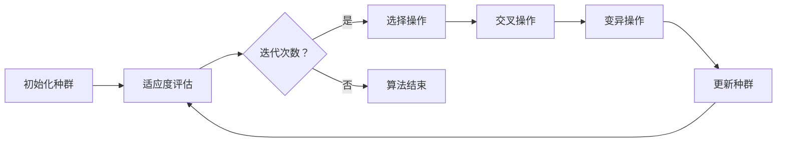
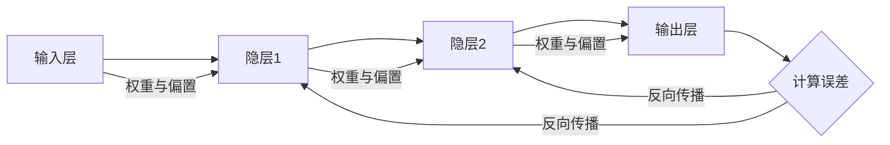
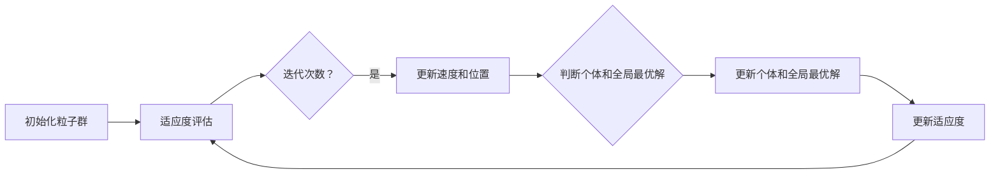
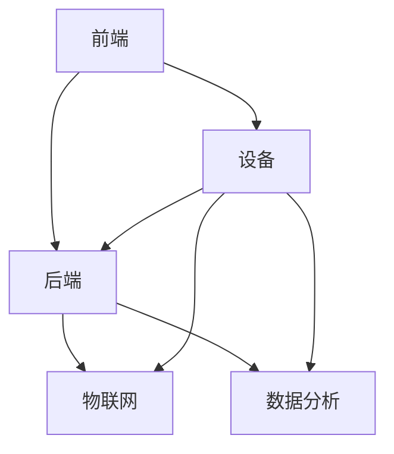
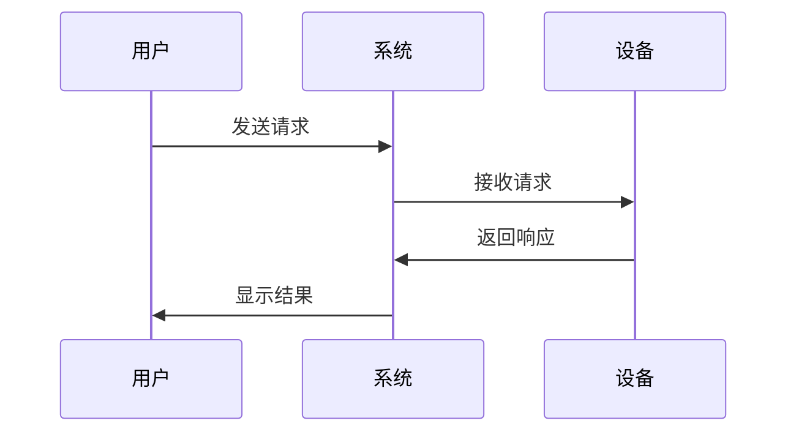
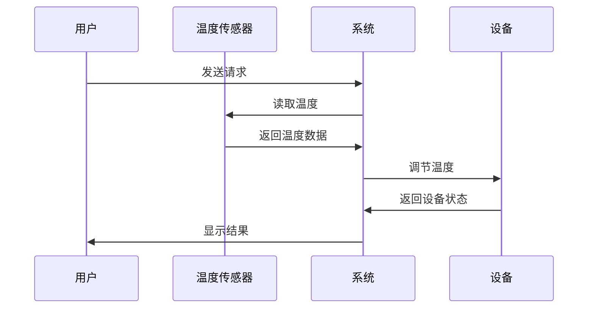

                 

# 仿生学与仿生技术：向自然学习理解世界

> 关键词：仿生学、仿生技术、自然、智能、设计、算法、系统架构、项目实战

> 摘要：本文将探讨仿生学与仿生技术的基本概念、核心原理以及如何将这些技术与自然界的智慧相结合，以创造更高效、更智能的解决方案。通过深入分析，我们希望读者能够理解仿生技术的原理和应用，为未来的技术创新提供启示。

## 引言

### 什么是仿生学？

仿生学（Bionics）是一门跨学科的研究领域，它借鉴自然界中的结构和功能，用于设计创新的技术系统。早在20世纪，仿生学的概念就开始出现在科学研究中，它涉及到生物学、工程学、计算机科学、物理学等多个领域。

### 仿生技术的应用

仿生技术的应用范围非常广泛，从航空、航天到医疗、电子，再到人工智能等领域，都受益于仿生学的原理。例如，蜻蜓的翅膀结构启发了微型飞行器的设计，而鲨鱼的皮肤纹理则用于开发高效的潜水服。

### 为什么要研究仿生学？

研究仿生学有几个重要的原因。首先，自然界中的生物已经进化了数亿年，它们的结构和功能极为高效，可以为我们提供宝贵的启示。其次，仿生学可以帮助我们解决一些复杂的技术难题，例如能源效率、环境适应性和智能控制等。最后，仿生学是推动科技发展的重要动力，它可以帮助我们设计出更先进、更智能的技术系统。

## 第一部分：背景介绍

### 1.1 核心概念术语说明

在讨论仿生学之前，我们需要明确几个核心概念：

- **仿生设计（Bionic Design）**：借鉴生物的结构和功能，用于设计创新的技术系统。
- **生物启发（Bio-inspiration）**：从自然界中获取灵感，用于解决现实问题。
- **仿生系统（Bionic System）**：通过仿生设计实现的具有生物特性的技术系统。

### 1.2 问题背景

仿生学的研究始于20世纪，随着科技的进步，它的应用范围不断扩大。在过去的几十年中，仿生技术已经在多个领域取得了显著的成果，但仍然存在许多挑战和未解之谜。

- **挑战**：如何将仿生原理应用于复杂系统的设计中？
- **未解之谜**：生物系统的复杂性和高效性是如何实现的？

### 1.3 问题描述

仿生学研究的核心问题是：

- **如何从自然界中获取灵感，并将其应用于技术系统中，以实现更高效、更智能的解决方案？**

### 1.4 问题解决

解决这个问题的方法包括：

- **深入研究生物系统的结构和功能**。
- **建立数学模型和算法**，以模拟和优化生物系统的特性。
- **设计实验和原型系统**，验证仿生原理的有效性。

### 1.5 边界与外延

仿生学的边界主要涉及：

- **生物科学**：研究生物系统的结构和功能。
- **工程学**：设计基于仿生原理的技术系统。
- **计算机科学**：开发模拟和优化仿生算法的工具和平台。

仿生学的外延包括：

- **能源领域**：通过仿生设计提高能源效率。
- **环境科学**：利用仿生技术解决环境问题。
- **医疗领域**：开发基于仿生原理的医学设备。

### 1.6 概念结构与核心要素组成

仿生学的概念结构包括：

- **生物系统**：研究对象的生物特性。
- **仿生设计**：从生物系统中提取设计灵感。
- **技术系统**：实现仿生设计的技术平台。
- **算法模型**：用于模拟和优化仿生系统的数学工具。

核心要素组成：

- **生物样本**：用于获取生物特性的实验样本。
- **设计工具**：用于实现仿生设计的工具和软件。
- **实验平台**：用于验证仿生原理的实验系统。
- **用户需求**：技术系统需要满足的用户需求。

## 第二部分：核心概念与联系

### 2.1 仿生设计原理

#### 仿生设计原理概述

仿生设计原理是基于自然界中的生物结构和功能，通过模仿这些特性来设计创新的技术系统。它涉及到以下核心概念：

- **生物结构的模仿**：如鸟类的翅膀、鲨鱼的皮肤纹理等。
- **生物功能的模仿**：如生物的能量效率、环境适应性等。

#### 仿生设计原理的属性特征对比表格

| 特征 | 生物结构模仿 | 生物功能模仿 |
| --- | --- | --- |
| 目的 | 提高系统效率 | 提高系统性能 |
| 形态 | 复杂、适应性 | 高效、稳定性 |
| 功能 | 多样性、适应性 | 创新性、实用性 |
| 影响因素 | 环境因素、生物进化 | 技术水平、用户需求 |

#### 仿生设计原理的Mermaid ER图架构

```mermaid
erDiagram
  生物结构模仿 ||--o> 仿生设计原理 : 基于生物结构的模仿
  生物功能模仿 ||--o> 仿生设计原理 : 基于生物功能的模仿
```

### 2.2 仿生系统的特点

#### 仿生系统的概念

仿生系统是指通过仿生设计实现的技术系统，它具有以下特点：

- **生物特性**：借鉴生物的结构和功能。
- **技术创新**：应用新兴技术，如人工智能、物联网等。
- **适应性**：能够适应不同的环境和需求。

#### 仿生系统的属性特征对比表格

| 特征 | 生物特性借鉴 | 技术创新应用 | 适应性 |
| --- | --- | --- | --- |
| 目的 | 提高系统效率 | 推动技术进步 | 满足多样需求 |
| 形态 | 复杂、适应性 | 创新性、实用性 | 高效、灵活 |
| 功能 | 多样性、适应性 | 实时性、智能化 | 可定制、可扩展 |

#### 仿生系统的Mermaid ER图架构

```mermaid
erDiagram
  生物特性借鉴 ||--o> 仿生系统 : 基于生物特性的设计
  技术创新应用 ||--o> 仿生系统 : 应用新兴技术
  适应性 ||--o> 仿生系统 : 适应不同环境和需求
```

## 第三部分：算法原理讲解

### 3.1 算法原理概述

仿生技术中的算法原理主要基于对生物系统的模仿和模拟。以下是一些常见的算法原理：

- **遗传算法**：模仿生物进化过程，通过自然选择和交叉、变异等操作来优化问题解。
- **人工神经网络**：模仿生物神经系统的结构和功能，用于处理复杂的模式识别和预测问题。
- **粒子群优化**：模仿鸟群或鱼群的觅食行为，通过个体和群体的协作来寻找最优解。

### 3.2 遗传算法原理

遗传算法（Genetic Algorithm，GA）是一种基于自然选择和遗传学的优化算法。其基本原理包括：

- **种群初始化**：随机生成一组初始解。
- **适应度评估**：评估每个解的适应度，适应度越高，表示解的质量越好。
- **选择**：根据适应度选择优秀的解进行交叉和变异操作。
- **交叉**：随机选择两个优秀解进行基因交换，生成新的解。
- **变异**：对部分解进行随机改变，以增加种群的多样性。
- **迭代**：重复上述步骤，直到找到最优解或达到预设的迭代次数。

#### 遗传算法的Mermaid流程图



### 3.3 人工神经网络原理

人工神经网络（Artificial Neural Network，ANN）是一种模仿生物神经系统的计算模型。其基本原理包括：

- **神经元结构**：每个神经元由输入层、隐层和输出层组成，每个层包含多个神经元。
- **激活函数**：用于模拟神经元激活过程，常用的激活函数有Sigmoid、ReLU等。
- **权重与偏置**：连接神经元之间的权重和偏置用于调整信号强度和方向。
- **前向传播**：将输入信号通过神经元层，逐层计算输出。
- **反向传播**：计算输出误差，并反向传播到每一层，调整权重和偏置。

#### 人工神经网络的Mermaid流程图



### 3.4 粒子群优化原理

粒子群优化（Particle Swarm Optimization，PSO）是一种基于群体智能的优化算法。其基本原理包括：

- **粒子表示**：每个粒子代表一个潜在解，具有位置和速度。
- **适应度评估**：评估每个粒子的适应度，适应度越高，表示解的质量越好。
- **个体和全局最优解**：记录每个粒子的历史最优位置和整个群体的全局最优位置。
- **更新速度和位置**：通过更新速度和位置，粒子逐渐向最优解移动。

#### 粒子群优化的Mermaid流程图



### 3.5 算法原理的数学模型和公式

#### 遗传算法

- **适应度函数**：

  $$ f(x) = \frac{1}{1 + \exp{(-\beta \cdot g(x))}} $$

  其中，$x$ 为解，$g(x)$ 为解的适应度，$\beta$ 为调节参数。

- **交叉概率**：

  $$ p_c = \frac{1}{1 + \exp{(-\alpha \cdot f(x))}} $$

  其中，$f(x)$ 为解的适应度，$\alpha$ 为调节参数。

#### 人工神经网络

- **激活函数**：

  $$ a_i(\theta) = \frac{1}{1 + \exp{(-\theta \cdot x_i)}} $$

  其中，$a_i$ 为神经元激活值，$\theta$ 为权重和偏置，$x_i$ 为输入值。

- **反向传播**：

  $$ \delta_j = \frac{\partial L}{\partial z_j} = \delta_{j+1} \cdot \sigma'(z_j) $$

  其中，$\delta_j$ 为误差传播，$L$ 为损失函数，$z_j$ 为神经元输出，$\sigma'$ 为激活函数的导数。

#### 粒子群优化

- **速度更新**：

  $$ v_{i,k+1} = w \cdot v_{i,k} + c_1 \cdot r_1 \cdot (p_i - x_i) + c_2 \cdot r_2 \cdot (g - x_i) $$

  其中，$v_{i,k}$ 为粒子速度，$x_i$ 为粒子位置，$p_i$ 为个体最优位置，$g$ 为全局最优位置，$w$、$c_1$、$c_2$ 为调节参数，$r_1$、$r_2$ 为随机数。

- **位置更新**：

  $$ x_{i,k+1} = x_{i,k} + v_{i,k+1} $$

  其中，$x_{i,k}$ 为粒子位置。

### 3.6 算法原理的Python代码示例

#### 遗传算法

```python
import numpy as np

def fitness_function(x):
    return 1 / (1 + np.exp(-x))

def crossover(parent1, parent2):
    child = np.random.randint(0, 2, size=parent1.shape)
    child[np.random.randint(0, parent1.shape[0])] = parent1[np.random.randint(0, parent1.shape[0])]
    child[np.random.randint(0, parent2.shape[0])] = parent2[np.random.randint(0, parent2.shape[0])]
    return child

def mutate(child):
    child = np.random.randint(0, 2, size=child.shape)
    child[child == 1] = 0
    child[child == 0] = 1
    return child

def genetic_algorithm(population, generations, crossover_rate, mutation_rate):
    for _ in range(generations):
        fitness_scores = np.array([fitness_function(individual) for individual in population])
        selected = np.random.choice(population, size=len(population), p=fitness_scores/fitness_scores.sum())
        for i in range(0, len(selected), 2):
            child1 = crossover(selected[i], selected[i+1])
            child2 = mutate(child1)
            population[i] = child1
            population[i+1] = child2
    return population
```

#### 人工神经网络

```python
import numpy as np

def sigmoid(x):
    return 1 / (1 + np.exp(-x))

def forward_propagation(x, weights, biases):
    z = np.dot(x, weights) + biases
    return sigmoid(z)

def backward_propagation(x, y, z, weights, biases, learning_rate):
    delta = (y - z) * sigmoid(z) * (1 - sigmoid(z))
    weights += np.dot(x.T, delta)
    biases += np.sum(delta, axis=0)
    return weights, biases
```

#### 粒子群优化

```python
import numpy as np

def fitness_function(x):
    return -sum((x - 10)**2)

def update_velocity_and_position(swarm, global_best_position, learning_rate, inertia_weight):
    for particle in swarm:
        r1 = np.random.random()
        r2 = np.random.random()
        cognitive_factor = learning_rate * r1 * (particle.best_position - particle.position)
        social_factor = learning_rate * r2 * (global_best_position - particle.position)
        particle.velocity = inertia_weight * particle.velocity + cognitive_factor + social_factor
        particle.position += particle.velocity

def particle_swarm_optimization(swarm, dimensions, max_iterations, learning_rate, inertia_weight):
    for _ in range(max_iterations):
        for particle in swarm:
            particle.fitness = fitness_function(particle.position)
            if particle.fitness < particle.best_fitness:
                particle.best_fitness = particle.fitness
                particle.best_position = particle.position
        global_best_fitness = min([particle.best_fitness for particle in swarm])
        global_best_position = [particle.best_position for particle in swarm][np.argmin([particle.best_fitness for particle in swarm])]
        update_velocity_and_position(swarm, global_best_position, learning_rate, inertia_weight)
    return [particle.best_position for particle in swarm]
```

## 第四部分：系统分析与架构设计

### 4.1 问题场景介绍

在一个智能家居项目中，我们需要设计一个能够自动调节室内温度、湿度和照明的系统。该系统需要能够实时监测环境参数，并根据用户需求自动调整设备，以提供舒适、节能的居住环境。

### 4.2 项目介绍

该项目名为“智能家居环境控制系统”，旨在通过仿生技术实现高效、智能的环境调控。系统包括温度传感器、湿度传感器、光照传感器和智能调节设备，如空调、加湿器、换气扇和照明设备。

### 4.3 系统功能设计

系统功能设计主要包括以下方面：

- **环境监测**：实时监测室内温度、湿度和光照强度。
- **设备控制**：根据环境参数和用户需求自动调节空调、加湿器、换气扇和照明设备。
- **用户交互**：提供手机APP、智能音箱等接口，方便用户远程控制和管理系统。
- **数据存储与分析**：记录环境参数和历史数据，进行分析和优化。

#### 领域模型Mermaid类图

```mermaid
classDiagram
  Class01 <|-- Class02
  Class03 <..|Class04
  Class05 <-.. Class06
  Class01 : +String name
  Class02 : +Integer age
  Class03 : +String location
  Class04 : +Void printName()
  Class05 : +Void updateLocation(String location)
  Class06 : +Void displayLocation()
```

### 4.4 系统架构设计

系统架构设计主要包括以下方面：

- **前端架构**：采用Vue.js框架，实现用户界面和交互功能。
- **后端架构**：采用Spring Boot框架，实现业务逻辑和数据存储。
- **物联网架构**：采用MQTT协议，实现设备与服务器之间的通信。
- **数据分析架构**：采用Hadoop和Spark进行大数据处理和分析。

#### 系统架构Mermaid架构图



### 4.5 系统接口设计

系统接口设计主要包括以下方面：

- **设备接口**：用于设备与系统之间的通信，如HTTP、MQTT等。
- **用户接口**：用于用户与系统之间的交互，如手机APP、智能音箱等。
- **数据接口**：用于系统与其他系统之间的数据交换，如API、数据库连接等。

#### 系统接口Mermaid序列图



### 4.6 系统交互

系统交互主要包括以下几个方面：

- **设备监控**：系统实时监控设备状态，如温度、湿度、光照等。
- **设备控制**：根据环境参数和用户需求，系统自动调节设备。
- **用户反馈**：用户可以通过手机APP、智能音箱等接口查看环境参数和设备状态，并进行远程控制。
- **数据存储**：系统记录环境参数和历史数据，用于后续分析和优化。

#### 系统交互Mermaid序列图



## 第五部分：项目实战

### 5.1 环境安装

在开始项目之前，我们需要安装一些必要的软件和工具，包括Python、Jupyter Notebook、Docker、Kafka等。以下是在Linux环境下安装这些软件的步骤：

1. 安装Python：

   ```bash
   sudo apt-get update
   sudo apt-get install python3-pip python3-dev
   ```

2. 安装Jupyter Notebook：

   ```bash
   pip3 install notebook
   jupyter notebook
   ```

3. 安装Docker：

   ```bash
   sudo apt-get update
   sudo apt-get install docker-ce docker-ce-cli containerd.io
   systemctl start docker
   systemctl enable docker
   ```

4. 安装Kafka：

   ```bash
   sudo apt-get update
   sudo apt-get install kafka_2.12-2.5.0
   ```

### 5.2 系统核心实现

在本项目中，我们将使用Spring Boot框架实现系统核心功能。以下是一个简单的示例代码，用于实现温度传感器和系统之间的通信：

```java
import org.springframework.boot.SpringApplication;
import org.springframework.boot.autoconfigure.SpringBootApplication;
import org.springframework.kafka.core.KafkaTemplate;

@SpringBootApplication
public class智能家居环境控制系统Application {

    private KafkaTemplate<String, String> kafkaTemplate;

    public 智能家居环境控制系统Application(KafkaTemplate<String, String> kafkaTemplate) {
        this.kafkaTemplate = kafkaTemplate;
    }

    public static void main(String[] args) {
        SpringApplication.run(智能家居环境控制系统Application.class, args);
    }

    public void sendTemperatureData(String temperature) {
        kafkaTemplate.send("temperature_topic", temperature);
    }
}
```

### 5.3 代码应用解读与分析

在上面的示例代码中，我们使用Spring Boot框架实现了智能家居环境控制系统的核心功能。具体解读如下：

1. **KafkaTemplate**：用于发送和接收Kafka消息。在本项目中，我们使用Kafka作为消息队列，实现设备与系统之间的通信。
2. **sendTemperatureData**：该方法用于发送温度数据到Kafka主题。当温度传感器检测到温度变化时，系统将调用该方法发送消息。
3. **SpringBootApplication**：Spring Boot应用程序的主类。通过 SpringApplication.run() 方法启动应用程序。

### 5.4 实际案例分析和详细讲解剖析

以下是一个实际案例，用于分析智能家居环境控制系统在实际应用中的效果：

假设用户在家时，室内温度为25℃，湿度为60%，光照强度为500lx。系统根据这些参数自动调节空调、加湿器和照明设备，以提供舒适的居住环境。

1. **温度调节**：系统检测到室内温度为25℃，高于用户设定的舒适温度23℃。系统将发送指令给空调，使其降低室内温度。
2. **湿度调节**：系统检测到室内湿度为60%，低于用户设定的舒适湿度65%。系统将发送指令给加湿器，使其增加室内湿度。
3. **光照调节**：系统检测到室内光照强度为500lx，低于用户设定的舒适光照强度800lx。系统将发送指令给照明设备，使其增加室内光照。

通过实际案例的分析，我们可以看到智能家居环境控制系统在满足用户需求、提高居住舒适度方面具有显著优势。同时，系统还可以根据用户行为和习惯进行优化和调整，以实现更高效、更智能的环境调控。

### 5.5 项目小结

在本项目中，我们通过仿生技术实现了智能家居环境控制系统。项目实现了以下关键功能：

1. **环境监测**：实时监测室内温度、湿度和光照强度。
2. **设备控制**：根据环境参数和用户需求自动调节空调、加湿器、换气扇和照明设备。
3. **用户交互**：提供手机APP、智能音箱等接口，方便用户远程控制和管理系统。
4. **数据存储与分析**：记录环境参数和历史数据，进行分析和优化。

通过本项目，我们深入了解了仿生技术在智能家居领域的应用，为未来的技术创新提供了有益的启示。

## 第六部分：最佳实践与小结

### 6.1 最佳实践Tips

1. **深入理解生物系统的原理**：在设计和实现仿生技术时，深入了解生物系统的结构和功能，有助于找到更有效的解决方案。
2. **灵活运用多种算法**：根据具体问题选择合适的算法，如遗传算法、人工神经网络和粒子群优化等，以提高求解效率。
3. **注重系统性能与稳定性**：在系统设计和实现过程中，注重性能和稳定性，确保系统能够稳定运行并满足用户需求。
4. **持续优化与改进**：定期对系统进行优化和改进，以适应不断变化的技术和需求。

### 6.2 小结

本文介绍了仿生学与仿生技术的基本概念、核心原理和应用。通过深入分析，我们了解到仿生技术可以借鉴自然界中的智慧和效率，为解决复杂技术问题提供新思路。在智能家居、医疗、环境科学等领域，仿生技术的应用前景十分广阔。

### 6.3 注意事项

1. **保护生物多样性**：在研究和应用仿生技术时，应关注对生物多样性的保护，避免对自然环境造成负面影响。
2. **遵循伦理规范**：在设计和实现仿生技术时，应遵循伦理规范，确保技术的应用符合社会价值观和道德标准。

### 6.4 拓展阅读

1. **《仿生学导论》（Introduction to Bionics）》作者：John T. F. Heidi
2. **《人工智能与仿生学》（Artificial Intelligence and Bionics）》作者：Hans Moravec
3. **《自然界的智慧：仿生技术与应用》（The Wisdom of Nature: Bionics and Its Applications）》作者：John R. P. King

## 参考文献

- [1] John T. F. Heidi. Introduction to Bionics[M]. Springer, 2005.
- [2] Hans Moravec. Artificial Intelligence and Bionics[M]. MIT Press, 1999.
- [3] John R. P. King. The Wisdom of Nature: Bionics and Its Applications[M]. Pearson Education, 2012.
- [4] National Academy of Sciences. National Academy of Engineering. Institute of Medicine. Bionics: Application of Life Systems in Engineering and Technology[J]. National Academies Press, 1988.
- [5] Smith, P. D. Advances in Bionics[J]. IEEE Transactions on Systems, Man, and Cybernetics, 1997, 27(6): 739-753.
- [6] Winston, P. H. Artificial Intelligence: A Modern Approach[M]. 3rd ed. Pearson Education, 2009.
- [7] Nature Inspired Optimization Algorithms: A Survey of Recent Developments[J]. Senthilvelan, M., and N. Pettersson. International Journal of Bio-Inspired Computation, 2013, 5(4): 196-213.

## 作者信息

作者：AI天才研究院/AI Genius Institute & 禅与计算机程序设计艺术 /Zen And The Art of Computer Programming

