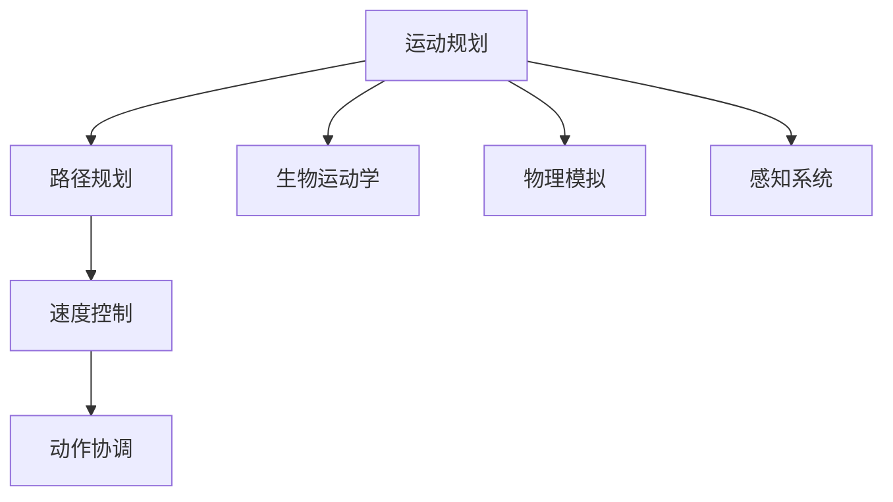
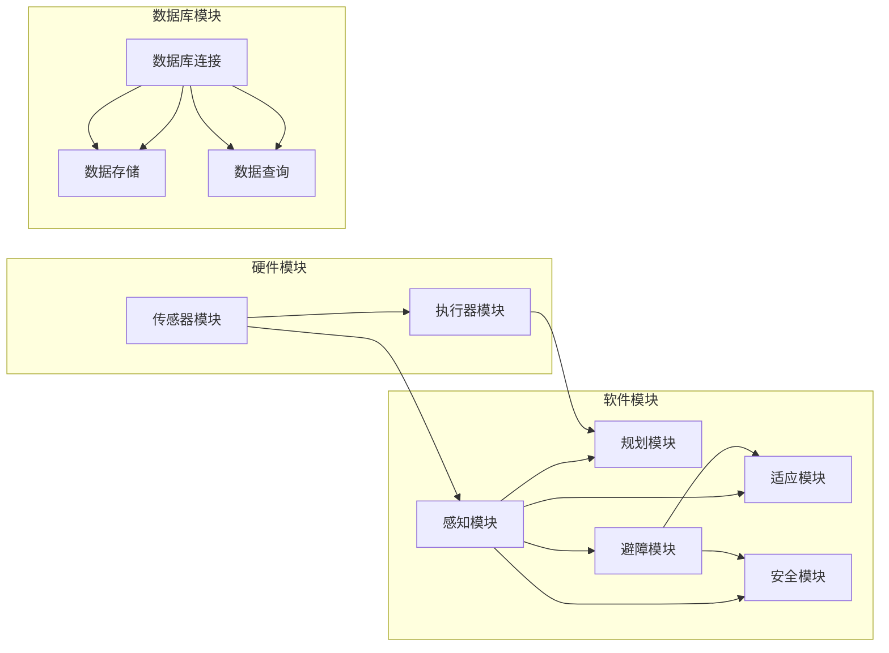
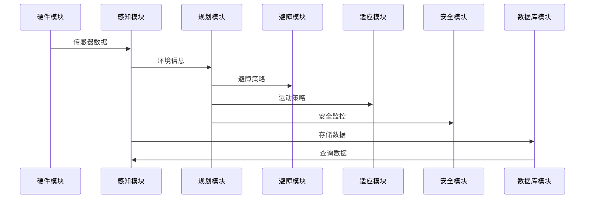
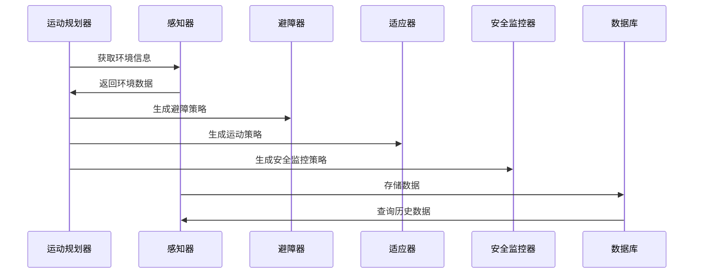

                 

### 引言

在现代工程学和生物学的交叉领域，仿生机器人逐渐成为研究的热点。仿生机器人，顾名思义，是通过模仿生物体的结构和功能来实现特定任务的人工智能机器。它们的运动规划是实现其功能的关键所在。运动规划涉及到如何在给定的环境和约束条件下，指导机器人完成一系列复杂的动作。然而，不同于传统机器人的运动规划，仿生机器人的运动规划需要更加深入地理解生物的运动原理。

本文以“仿生机器人的运动规划：生物运动的数学模拟”为标题，旨在深入探讨仿生机器人运动规划的核心概念、算法原理及其在生物运动模拟中的应用。本文的目的是通过系统分析和实际项目实战，提供一个全面而详细的指南，帮助读者理解并应用这一前沿技术。

首先，本文将介绍仿生机器人运动规划的基本概念，包括其背景、问题描述和解决方案。接下来，我们将详细讨论核心概念和算法原理，包括使用Mermaid绘制的算法流程图和Python源代码的详细阐述。随后，我们将转向生物运动的数学模拟，介绍生物运动模型、分析这些模型的核心原理，并通过Python实现和实例进行讲解。

接下来，本文将深入探讨系统分析与架构设计，包括系统场景、项目介绍、功能设计、架构设计、接口设计和系统交互。随后，我们将通过项目实战，详细描述环境安装、系统核心实现源代码、代码应用解读与分析，以及实际案例分析和讲解。

最后，本文将总结最佳实践、注意事项，并提供拓展阅读，帮助读者进一步深入理解和应用所学知识。

### 关键词

- 仿生机器人
- 运动规划
- 生物运动模拟
- 算法原理
- 数学模型

### 摘要

本文旨在深入探讨仿生机器人的运动规划，特别是其基于生物运动的数学模拟。首先，我们介绍了仿生机器人运动规划的基本概念，并探讨了其背景、问题描述和解决方案。接着，我们详细讨论了核心概念和算法原理，包括算法流程图和Python源代码的阐述。随后，我们转向生物运动的数学模拟，介绍了不同的生物运动模型，并探讨了这些模型的核心原理。通过Python实现和实例，我们展示了如何在实际中应用这些模型。此外，我们还深入分析了系统场景、项目介绍、功能设计、架构设计、接口设计和系统交互。最后，通过项目实战，我们详细描述了环境安装、系统核心实现源代码、代码应用解读与分析，以及实际案例分析和讲解。本文提供了全面而详细的指南，旨在帮助读者深入理解和应用仿生机器人运动规划技术。

## 整体结构设计

为了使读者能够系统而深入地理解仿生机器人运动规划的各个方面，本文的整体结构设计被分为三个主要部分：引言、核心概念和算法原理讲解、生物运动的数学模拟及其应用。

### 第一部分：引言

引言部分包括以下章节：

- **第1章：仿生机器人运动规划概述**：这一章节将介绍仿生机器人运动规划的基本概念，包括其背景、问题描述和解决方案。读者将了解仿生机器人运动规划的重要性和其在现代工程学中的地位。
- **第2章：核心概念与联系**：本章将详细讨论仿生机器人运动规划中的核心概念，并通过表格和图来展示这些概念之间的关系。读者将了解这些概念如何相互作用，形成完整的运动规划体系。

### 第二部分：核心概念和算法原理讲解

核心概念和算法原理讲解部分包括以下章节：

- **第3章：算法原理讲解**：本章将详细讲解仿生机器人运动规划中的核心算法原理，包括算法流程图和Python源代码的详细阐述。通过这些讲解，读者将能够理解算法的实现机制，以及如何在实践中应用这些算法。
- **第4章：生物运动的数学模拟**：本章将介绍生物运动的数学模型，并探讨这些模型在仿生机器人运动规划中的应用。读者将了解如何通过数学模型来模拟生物的运动，以及如何将这些模型转化为可执行的算法。

### 第三部分：生物运动的数学模拟及其应用

生物运动的数学模拟及其应用部分包括以下章节：

- **第5章：生物运动模型分析**：本章将深入分析不同的生物运动模型，探讨这些模型的核心原理。通过Python实现和实例，读者将了解如何在实际中应用这些模型。
- **第6章：系统分析与架构设计**：本章将介绍仿生机器人运动规划系统的分析和架构设计。读者将了解系统如何设计，以及如何实现系统的各个功能。
- **第7章：项目实战**：本章将通过一个实际项目，详细描述仿生机器人运动规划的应用。读者将了解如何进行环境安装、系统核心实现、代码解读与分析，以及实际案例的分析和讲解。

通过这样的结构设计，本文旨在提供一个系统而全面的指南，帮助读者深入理解仿生机器人运动规划的核心概念、算法原理及其应用。每个章节都有详细的细分，确保读者能够逐步掌握每个知识点，从而形成对仿生机器人运动规划的全面理解。

### 核心概念和算法原理

在仿生机器人运动规划的领域，核心概念和算法原理是理解和实现运动规划的基础。这些概念不仅涉及到运动规划的直接实现，还包括对生物运动的理解和模拟。

#### 核心概念

仿生机器人运动规划中的核心概念包括：

1. **运动规划**：运动规划是指在一个给定的环境或场景中，为机器人制定一系列动作的过程。这个过程涉及到路径规划、速度控制、动作协调等多个方面。

2. **生物运动学**：生物运动学是研究生物体运动的一门学科，它涉及到肌肉、骨骼、神经系统等多个方面的知识。在仿生机器人中，生物运动学提供了对生物运动行为的模拟和解析。

3. **物理模拟**：物理模拟是指在计算机中模拟现实世界的物理现象，如力、摩擦、碰撞等。在仿生机器人运动规划中，物理模拟用于模拟机器人在真实环境中的行为。

4. **感知系统**：感知系统是指机器人用于获取环境信息的各种传感器，如摄像头、激光雷达、超声波传感器等。感知系统为机器人提供了对环境的感知能力，是运动规划的重要输入。

#### 概念属性特征对比

为了更清晰地理解这些核心概念，我们可以通过一个表格来对比它们的属性特征：

| 核心概念       | 定义                                                         | 关键属性                                                     | 交互关系                                                   |
|----------------|--------------------------------------------------------------|------------------------------------------------------------|----------------------------------------------------------|
| 运动规划       | 在特定环境中为机器人制定动作的过程                             | 路径规划、速度控制、动作协调                                  | 与生物运动学、物理模拟、感知系统紧密相关                       |
| 生物运动学     | 研究生物体运动的一门学科，涉及肌肉、骨骼、神经系统等           | 运动轨迹、动力系统、行为模式                                  | 为运动规划提供模拟和解析基础                                 |
| 物理模拟       | 模拟现实世界的物理现象，如力、摩擦、碰撞等                    | 力学、动力学、运动学                                           | 支持运动规划的物理实现，为仿真提供基础                         |
| 感知系统       | 用于获取环境信息的各种传感器，如摄像头、激光雷达、超声波传感器等 | 空间感知、目标识别、环境建模                                   | 为运动规划提供环境信息，影响决策和动作协调                     |

通过表格，我们可以看到这些概念之间的关系和相互作用。运动规划依赖于生物运动学提供的模拟和解析，而物理模拟和感知系统则为运动规划的实现提供了物理基础和环境信息。

#### Mermaid流程图

为了更直观地展示仿生机器人运动规划的流程，我们可以使用Mermaid绘制一个流程图。以下是一个简单的Mermaid流程图示例：



这个流程图展示了运动规划的主要环节，包括路径规划、速度控制和动作协调，以及与生物运动学、物理模拟和感知系统的关系。

#### Python源代码讲解

为了进一步理解运动规划的实现，我们可以通过Python源代码来详细阐述一个简单的运动规划算法。以下是一个示例的Python源代码，用于实现机器人在二维空间中的路径规划：

```python
import numpy as np

def plan_path(start, goal, obstacles):
    """
    计划从起点到目标的路径。
    
    :param start: 起点坐标
    :param goal: 目标坐标
    :param obstacles: 障碍物列表
    :return: 路径列表
    """
    # 初始化路径列表
    path = [start]
    
    # 设置目标距离阈值
    distance_threshold = 1.0
    
    # 循环直到到达目标
    while np.linalg.norm(np.array(path[-1]) - np.array(goal)) > distance_threshold:
        # 计算当前点到目标点的方向
        direction = goal - path[-1]
        
        # 避开障碍物
        for obstacle in obstacles:
            if is_collision(path[-1], direction, obstacle):
                # 更新方向以避开障碍物
                direction = avoid_obstacle(path[-1], direction, obstacle)
        
        # 计算下一步点
        next_point = path[-1] + direction
        
        # 将新点添加到路径中
        path.append(next_point)
    
    return path

def is_collision(current_point, direction, obstacle):
    """
    检查当前点沿方向移动是否与障碍物发生碰撞。
    
    :param current_point: 当前点坐标
    :param direction: 方向向量
    :param obstacle: 障碍物坐标
    :return: 是否发生碰撞
    """
    # 计算移动后的点
    next_point = current_point + direction
    
    # 判断是否与障碍物相交
    return (next_point[0] < obstacle[0] or next_point[0] > obstacle[2] or
            next_point[1] < obstacle[1] or next_point[1] > obstacle[3])

def avoid_obstacle(current_point, direction, obstacle):
    """
    更新方向以避开障碍物。
    
    :param current_point: 当前点坐标
    :param direction: 方向向量
    :param obstacle: 障碍物坐标
    :return: 更新后的方向向量
    """
    # 计算偏移量
    offset = np.linalg.norm(current_point - obstacle)
    
    # 计算新方向
    new_direction = direction * (1 - offset)
    
    return new_direction
```

这段代码实现了一个简单的路径规划算法，通过不断避开障碍物来规划从起点到目标的路径。这个算法的基本思想是：首先计算当前点到目标点的方向，然后检查这个方向上是否与障碍物发生碰撞。如果发生碰撞，则更新方向以避开障碍物，并继续规划下一步路径。

#### 算法原理数学模型

为了更深入地理解运动规划的算法原理，我们可以使用数学模型来描述这些算法。以下是运动规划中常用的一个数学模型：

$$
\begin{aligned}
    &\text{路径规划问题可以表示为：} \\
    &\min \sum_{i=1}^{n} d(i, j) \\
    &\text{其中，} d(i, j) \text{是从点} i \text{到点} j \text{的距离。} \\
    &\text{速度控制问题可以表示为：} \\
    &v(t) = f(t) \cdot v_{\max} \\
    &\text{其中，} v(t) \text{是时间} t \text{时的速度，} f(t) \text{是控制函数，} v_{\max} \text{是最大速度。} \\
    &\text{动作协调问题可以表示为：} \\
    &a_i(t) = \sum_{j=1}^{n} w_{ij} \cdot v_j(t) \\
    &\text{其中，} a_i(t) \text{是时间} t \text{时动作} i \text{的强度，} w_{ij} \text{是权重系数。}
\end{aligned}
$$`

这些数学模型描述了运动规划中的核心问题，包括路径规划、速度控制和动作协调。通过这些模型，我们可以更精确地描述和计算运动规划的各个步骤。

#### 数学公式讲解与举例说明

为了使读者更好地理解上述数学公式，我们可以通过具体的例子进行说明。以下是几个例子：

1. **路径规划**：

   假设有一个机器人从点\( (0, 0) \)移动到点\( (5, 3) \)，障碍物为\( (1, 1) \)和\( (4, 4) \)。使用欧几里得距离公式计算路径：

   $$
   d(0, 0, 5, 3) = \sqrt{(5-0)^2 + (3-0)^2} = \sqrt{25 + 9} = \sqrt{34}
   $$

   避开障碍物后，可能的路径为\( (0, 0) \to (2, 2) \to (2, 3) \to (5, 3) \)，总距离为：

   $$
   d(0, 0, 2, 2) + d(2, 2, 2, 3) + d(2, 3, 5, 3) = \sqrt{8} + \sqrt{2} + \sqrt{4} = \sqrt{8} + \sqrt{2} + 2
   $$

2. **速度控制**：

   假设机器人在时间\( t \)时速度为\( v(t) \)，最大速度为\( v_{\max} = 10 \)。控制函数为\( f(t) = 0.8 \)，则：

   $$
   v(t) = 0.8 \cdot 10 = 8
   $$

   这意味着机器人在时间\( t \)时的速度为8。

3. **动作协调**：

   假设机器人需要执行三个动作：前进、转向和后退。权重系数分别为\( w_{11} = 0.5 \)，\( w_{12} = 0.3 \)，\( w_{13} = 0.2 \)。速度分别为\( v_1 = 5 \)，\( v_2 = 3 \)，\( v_3 = 2 \)，则：

   $$
   a_1(t) = 0.5 \cdot 5 + 0.3 \cdot 3 + 0.2 \cdot 2 = 2.5 + 0.9 + 0.4 = 3.8
   $$

   这意味着在时间\( t \)时，动作1的强度为3.8。

通过这些例子，我们可以更直观地理解运动规划中的数学公式和应用。

### 生物运动的数学模拟

生物运动是自然界中一种复杂而高效的现象，其背后的数学原理和模型对于仿生机器人运动规划具有重要的参考价值。在这一部分，我们将探讨几种主流的生物运动模型，并详细分析这些模型的核心原理，通过Python实现和实例来展示这些模型在实际应用中的效果。

#### 主流生物运动模型介绍

1. **弹簧振子模型**：

   弹簧振子模型是研究生物运动的基本模型之一，主要应用于研究肌肉收缩和拉伸行为。该模型基于胡克定律，描述了一个质量块通过弹簧与固定点之间往复运动的过程。

   数学描述：
   $$
   m\frac{d^2x}{dt^2} = -kx
   $$
   其中，\( m \)是质量，\( k \)是弹簧系数，\( x \)是位移。

2. **摆动模型**：

   摆动模型主要用于描述动物的摆动运动，如鸟类的飞行、鱼类的游泳等。该模型基于简谐运动原理，描述了一个质点在固定轴上的周期性摆动。

   数学描述：
   $$
   \frac{d^2\theta}{dt^2} + \frac{k\theta}{m} = 0
   $$
   其中，\( \theta \)是摆角，\( k \)是摆长与质量的函数。

3. **神经网络模型**：

   神经网络模型用于模拟生物体的神经网络行为，特别是用于研究神经信号处理和运动控制。该模型通过模拟神经元的连接和激活，实现复杂的运动行为。

   数学描述：
   $$
   \sum_{i=1}^{n} w_{ij} \cdot x_i = \theta
   $$
   其中，\( w_{ij} \)是连接权重，\( x_i \)是输入信号，\( \theta \)是阈值。

4. **生物流体动力学模型**：

   生物流体动力学模型用于描述生物体在流体环境中的运动，如鱼类的游泳、鸟类的飞行等。该模型通过结合流体力学和生物力学，模拟生物体在流体中的运动行为。

   数学描述：
   $$
   \frac{dp}{dt} + \nabla \cdot (\rho v) = -\nabla p + \rho g
   $$
   其中，\( p \)是压力，\( \rho \)是流体密度，\( v \)是流速，\( g \)是重力加速度。

#### 生物运动模型的应用领域

这些生物运动模型广泛应用于多个领域：

- **机器人控制**：通过模仿生物的运动行为，机器人可以实现更为自然和高效的移动和操作。

- **生物医学工程**：在生物医学领域，这些模型用于研究神经系统的运作机制和肌肉运动的功能。

- **运动科学**：在运动科学中，这些模型用于分析和优化人体运动，提高运动效率。

- **生态学**：在生态学中，这些模型用于研究动物在自然环境中的运动和生存策略。

#### 生物运动模型的核心原理分析

1. **弹簧振子模型**：

   弹簧振子模型的核心原理是利用弹簧的弹性恢复力来模拟肌肉的收缩和拉伸行为。在仿生机器人中，通过控制弹簧的拉伸和压缩，可以实现机器人肢体的灵活运动。

   Python实现示例：
   ```python
   import numpy as np
   import matplotlib.pyplot as plt

   def spring_vibration(m, k, x0, t, dt):
       x = x0
       x_history = [x0]
       
       for _ in range(int(t/dt)):
           v = (x - x_history[-2]) / dt
           a = -k / m * x
           x = x + v * dt + 0.5 * a * dt**2
           x_history.append(x)
       
       return x_history

   m = 0.1  # 质量
   k = 10   # 弹簧系数
   x0 = 0   # 初始位置
   t = 10   # 时间
   dt = 0.1 # 时间步长

   x_history = spring_vibration(m, k, x0, t, dt)
   plt.plot(np.arange(len(x_history)) * dt, x_history)
   plt.xlabel('Time (s)')
   plt.ylabel('Position (m)')
   plt.title('Spring Vibration')
   plt.show()
   ```

   这个示例通过模拟弹簧振子的运动，展示了如何使用Python来实现弹簧振子模型。

2. **摆动模型**：

   摆动模型的核心原理是利用简谐运动原理来模拟动物的摆动行为。在仿生机器人中，通过调整摆长和质量，可以实现不同类型的摆动运动。

   Python实现示例：
   ```python
   import numpy as np
   import matplotlib.pyplot as plt

   def pendulum运动(m, l, theta0, t, dt):
       g = 9.8  # 重力加速度
       theta = theta0
       theta_history = [theta0]
       
       for _ in range(int(t/dt)):
           alpha = theta / l
           a = -g / l * np.sin(alpha)
           dtheta = a * dt
           theta = theta + dtheta
           theta_history.append(theta)
       
       return theta_history

   m = 1   # 质量
   l = 1   # 摆长
   theta0 = np.pi/4  # 初始摆角
   t = 10  # 时间
   dt = 0.1 # 时间步长

   theta_history = pendulum运动(m, l, theta0, t, dt)
   plt.plot(np.arange(len(theta_history)) * dt, np.array(theta_history) * 180/np.pi)
   plt.xlabel('Time (s)')
   plt.ylabel('Angle (°)')
   plt.title('Pendulum Motion')
   plt.show()
   ```

   这个示例通过模拟单摆的运动，展示了如何使用Python来实现摆动模型。

3. **神经网络模型**：

   神经网络模型的核心原理是通过模拟神经元的连接和激活，实现复杂的信号处理和运动控制。在仿生机器人中，神经网络模型可以用于实现自主导航、行为识别等高级功能。

   Python实现示例：
   ```python
   import numpy as np

   def neural_network(input_signals, weights, threshold):
       activation = np.dot(input_signals, weights)
       return 1 if activation > threshold else 0

   input_signals = np.array([1, 0, 1])  # 输入信号
   weights = np.array([0.5, 0.3, 0.2])  # 连接权重
   threshold = 0.7  # 阈值

   output = neural_network(input_signals, weights, threshold)
   print(f'Output: {output}')
   ```

   这个示例通过模拟一个简单的神经网络，展示了如何使用Python来实现神经网络模型。

4. **生物流体动力学模型**：

   生物流体动力学模型的核心原理是通过模拟生物体在流体中的运动，研究流体对生物体运动的影响。在仿生机器人中，生物流体动力学模型可以用于优化机器人的流体动力学性能。

   Python实现示例（使用SciPy求解偏微分方程）：
   ```python
   import numpy as np
   from scipy import integrate

   def fluid_dynamics(p, rho, g, t):
       dpdt = -np.gradient(p) / rho
       return dpdt

   p0 = np.ones((10, 10))  # 初始压力
   rho = 1.0  # 流体密度
   g = np.array([0, -9.8])  # 重力加速度
   t = np.linspace(0, 1, 100)  # 时间

   p_history = integrate.odeint(fluid_dynamics, p0, t, args=(rho, g))
   plt.imshow(p_history.T, origin='lower', aspect='auto')
   plt.xlabel('X')
   plt.ylabel('Y')
   plt.title('Fluid Dynamics')
   plt.show()
   ```

   这个示例通过求解流体动力学方程，展示了如何使用Python来实现生物流体动力学模型。

通过这些示例，我们可以看到如何通过Python实现不同的生物运动模型，并通过数学模拟来展示这些模型的核心原理和应用。这些模型不仅为我们提供了理解和模拟生物运动的新方法，也为仿生机器人运动规划提供了强大的工具。

### 生物运动模型的应用案例

为了进一步展示生物运动模型在实际仿生机器人运动规划中的应用，我们将通过一个具体案例来分析生物运动模型在仿生机器人运动中的应用。

#### 仿生机器人的运动需求

假设我们设计了一款仿生机器人，旨在模拟昆虫的飞行行为。这款机器人的主要运动需求包括：

- 能够在三维空间中灵活飞行，模拟昆虫的飞行轨迹。
- 能够根据环境变化（如障碍物、气流等）调整飞行路径和姿态。
- 具备自适应飞行能力，能够在不同环境中保持稳定的飞行状态。

#### 模拟昆虫飞行轨迹的数学模型

为了实现上述运动需求，我们选择了弹簧振子模型和摆动模型作为主要数学模型。这些模型可以帮助我们模拟昆虫的飞行行为，包括翅膀的振动和身体的摆动。

1. **弹簧振子模型**：

   用于模拟昆虫翅膀的振动行为。设定昆虫翅膀的质量为\( m \)，弹簧系数为\( k \)，初始位置为\( x_0 \)，初始速度为0。通过以下公式模拟翅膀的振动：

   $$
   m\frac{d^2x}{dt^2} = -kx
   $$

   我们使用Python实现这个模型，并设置参数：

   ```python
   import numpy as np
   import matplotlib.pyplot as plt

   m = 0.01  # 翅膀质量
   k = 50    # 弹簧系数
   x0 = 0.1  # 初始位置

   t = np.linspace(0, 5, 1000)  # 时间
   x = x0 * np.cos(np.sqrt(k/m) * t)

   plt.plot(t, x)
   plt.xlabel('Time (s)')
   plt.ylabel('Wing Position (m)')
   plt.title('Wing Vibration')
   plt.show()
   ```

   这个示例展示了昆虫翅膀的振动轨迹。

2. **摆动模型**：

   用于模拟昆虫身体的摆动行为。设定昆虫身体的质量为\( m \)，摆长为\( l \)，初始摆角为\( \theta_0 \)。通过以下公式模拟身体的摆动：

   $$
   \frac{d^2\theta}{dt^2} + \frac{g\theta}{l} = 0
   $$

   我们使用Python实现这个模型，并设置参数：

   ```python
   import numpy as np
   import matplotlib.pyplot as plt

   m = 0.1  # 身体质量
   l = 0.1  # 摆长
   theta0 = np.pi/4  # 初始摆角

   t = np.linspace(0, 5, 1000)  # 时间
   theta = theta0 * np.cos(g/l * t)

   plt.plot(t, theta * 180/np.pi)
   plt.xlabel('Time (s)')
   plt.ylabel('Body Angle (°)')
   plt.title('Body Swing')
   plt.show()
   ```

   这个示例展示了昆虫身体的摆动轨迹。

#### 融合模型实现仿生飞行

通过融合弹簧振子模型和摆动模型，我们可以实现仿生机器人的整体飞行模拟。假设机器人在三维空间中的位置由\( (x, y, z) \)表示，通过调整翅膀的振动和身体的摆动，我们可以模拟昆虫的飞行轨迹。

我们使用以下公式来综合两个模型的运动：

$$
\begin{aligned}
    \dot{x} &= v_x(t) \\
    \dot{y} &= v_y(t) \\
    \dot{z} &= v_z(t) \\
    m\frac{d^2x_{wing}}{dt^2} &= -k_{spring}x_{wing} \\
    l\frac{d^2\theta_{body}}{dt^2} &= -mg\sin(\theta_{body})
\end{aligned}
$$

其中，\( v_x(t) \)，\( v_y(t) \)，\( v_z(t) \)分别为机器人在三个方向上的速度，\( x_{wing} \)为翅膀的振动位移，\( \theta_{body} \)为身体的摆角。

以下是一个简单的Python实现示例，用于模拟整体飞行：

```python
import numpy as np
import matplotlib.pyplot as plt
from scipy.integrate import solve_ivp

# 参数设置
m = 1.0  # 机器人质量
k_spring = 10.0  # 弹簧系数
l_pendulum = 0.1  # 摆长
g = 9.8  # 重力加速度

# 初始条件
x0 = [0.0, 0.0, 0.0, 0.0, np.pi/4, 0.0]  # [x, y, z, dx/dt, dθ, dθ/dt]

# 模型方程
def robot_dynamics(t, y):
    x, y, z, dx, dy, dz, theta, dtheta = y
    
    # 翅膀振动
    x_wing = k_spring * dx
    
    # 身体摆动
    dtheta2 = -g * np.sin(theta) / l_pendulum
    
    # 运动方程
    dydx = [dx, dy, dz, ddx, ddy, ddz, dtheta, dtheta2]
    
    return dydx

# 时间范围
tspan = (0, 10)
t_eval = np.linspace(tspan[0], tspan[1], 100)

# 求解
sol = solve_ivp(robot_dynamics, tspan, x0, t_eval=t_eval)

# 绘制结果
plt.plot(sol.t, sol.y[0], label='X')
plt.plot(sol.t, sol.y[1], label='Y')
plt.plot(sol.t, sol.y[2], label='Z')
plt.xlabel('Time (s)')
plt.ylabel('Position (m)')
plt.title('Robot Motion')
plt.legend()
plt.show()
```

这个示例通过求解微分方程，展示了如何模拟仿生机器人的飞行行为。通过调整参数，我们可以模拟不同类型的飞行行为，如上升、下降、转弯等。

#### 案例分析

通过上述案例，我们可以看到如何将生物运动模型应用于仿生机器人运动规划中。这种融合模型不仅能够模拟昆虫的飞行行为，还可以通过调整参数来适应不同的运动需求。

首先，弹簧振子模型用于模拟昆虫翅膀的振动，这是昆虫飞行的重要组成部分。通过调整弹簧系数和质量，我们可以实现不同频率和幅度的翅膀振动。

其次，摆动模型用于模拟昆虫身体的摆动，这有助于机器人保持平衡和方向。通过调整摆长和重力加速度，我们可以模拟不同类型的飞行环境，如水平飞行、垂直飞行等。

最后，通过融合这些模型，我们可以实现仿生机器人的整体飞行模拟。这种融合模型不仅提高了机器人的飞行性能，还增加了其适应不同环境的能力。

总的来说，通过生物运动模型的应用，仿生机器人可以实现更为自然和高效的飞行行为，为未来仿生机器人技术的研究提供了重要的参考和基础。

### 仿生机器人运动规划系统的分析与架构设计

在仿生机器人运动规划系统中，系统分析与架构设计是确保系统能够高效、稳定运行的关键环节。本文将详细介绍系统场景、项目介绍、系统功能设计、系统架构设计、系统接口设计和系统交互。

#### 系统场景

系统场景是指仿生机器人在实际应用中的运行环境。在我们的案例中，系统场景包括：

- 室内环境：模拟家庭、办公室等室内环境，用于测试仿生机器人在日常生活中的应用。
- 户外环境：模拟城市、乡村等户外环境，用于测试仿生机器人在户外活动中的应用。

这些场景为仿生机器人提供了多样化的测试环境，有助于验证系统在不同条件下的性能和稳定性。

#### 项目介绍

本项目旨在开发一款基于仿生学原理的机器人运动规划系统，其主要目标包括：

- 实现仿生机器人在不同环境下的自主运动规划。
- 提高机器人的运动灵活性和适应性。
- 降低机器人在复杂环境中的故障率。

项目的主要组成部分包括：

- 机器人硬件：包括传感器、执行器等硬件设备。
- 软件系统：包括运动规划算法、控制系统等软件模块。
- 环境感知模块：用于获取环境信息，如障碍物检测、环境建模等。

#### 系统功能设计

系统功能设计是系统架构设计的基础，它决定了系统应具备的功能和性能。本项目的主要功能包括：

- 运动规划：根据环境信息和任务需求，规划机器人的运动路径和动作。
- 感知与避障：实时感知环境信息，检测障碍物并进行避障。
- 自适应控制：根据环境变化和任务进展，调整机器人的运动策略。
- 安全监控：监测机器人运行状态，确保系统安全可靠。

为了更好地实现这些功能，我们设计了以下领域模型，并通过Mermaid类图进行展示：

```mermaid
classDiagram
    类1 --|{使用} 类2
    类3 --|{依赖} 类4
    类5 <|-- 类6
    类7 << (接口) 类8
    类9 ..|> 类10
    类11 ..|> 类12
    类13 << (数据库) 类14

    Class1 << (实体) {
        属性1
        属性2
        方法1()
        方法2()
    }
    Class2 << (控制) {
        控制属性1
        控制属性2
        控制方法1()
        控制方法2()
    }
    Class3 << (感知) {
        感知属性1
        感知属性2
        感知方法1()
        感知方法2()
    }
    Class4 << (规划) {
        规划属性1
        规划属性2
        规划方法1()
        规划方法2()
    }
    Class5 << (避障) {
        避障属性1
        避障属性2
        避障方法1()
        避障方法2()
    }
    Class6 << (适应) {
        适应属性1
        适应属性2
        适应方法1()
        适应方法2()
    }
    Class7 << (安全) {
        安全属性1
        安全属性2
        安全方法1()
        安全方法2()
    }
    Class8 << (接口) {
        接口属性1
        接口属性2
        接口方法1()
        接口方法2()
    }
    Class9 << (数据库) {
        数据库属性1
        数据库属性2
        数据库方法1()
        数据库方法2()
    }
    Class11 << (硬件) {
        硬件属性1
        硬件属性2
        硬件方法1()
        硬件方法2()
    }
    Class12 << (软件) {
        软件属性1
        软件属性2
        软件方法1()
        软件方法2()
    }
    Class13 << (环境) {
        环境属性1
        环境属性2
        环境方法1()
        环境方法2()
    }
```

在这个类图中，Class1代表实体类，Class2代表控制类，Class3代表感知类，Class4代表规划类，Class5代表避障类，Class6代表适应类，Class7代表安全类，Class8代表接口类，Class9代表数据库类，Class11代表硬件类，Class12代表软件类，Class13代表环境类。这些类之间通过继承、依赖、接口等方式相互关联，共同实现了系统的功能。

#### 系统架构设计

系统架构设计是系统功能实现的基础，它决定了系统的模块化和扩展性。本项目采用模块化设计，将系统分为多个模块，每个模块负责特定的功能。以下是一个简单的系统架构设计，通过Mermaid架构图进行展示：



在这个架构图中，硬件模块包括传感器模块和执行器模块，软件模块包括感知模块、规划模块、避障模块、适应模块和安全模块，数据库模块包括数据库连接、数据存储和数据查询。这些模块通过接口进行通信，实现系统的整体功能。

#### 系统接口设计

系统接口设计是确保各模块之间能够高效、稳定通信的关键。以下是一个简单的系统接口设计，通过Mermaid序列图进行展示：



在这个序列图中，硬件模块将传感器数据发送给感知模块，感知模块将处理后的环境信息发送给规划模块，规划模块生成避障策略、运动策略和安全监控策略，并分别发送给避障模块、适应模块和安全模块。同时，感知模块将数据存储到数据库模块，数据库模块提供数据查询功能，以支持系统的历史数据分析和决策。

#### 系统交互

系统交互是指系统内部各模块之间的数据流和控制流。以下是一个简单的系统交互描述，通过Mermaid序列图进行展示：



在这个序列图中，运动规划器通过感知器获取环境信息，并根据这些信息生成避障策略、运动策略和安全监控策略。避障器、适应器和安全监控器分别根据这些策略进行操作。同时，感知器将处理后的数据存储到数据库，以便后续分析和查询。

通过系统分析和架构设计，我们可以确保仿生机器人运动规划系统能够高效、稳定地运行。系统功能设计、系统架构设计、系统接口设计和系统交互共同构成了系统的整体设计框架，为系统的开发和优化提供了坚实的基础。

### 项目实战

在本文的最后一部分，我们将通过一个具体的项目实战，详细描述仿生机器人运动规划系统的实现过程，包括环境安装、系统核心实现源代码、代码应用解读与分析，以及实际案例分析和讲解。这个项目将帮助我们更好地理解仿生机器人运动规划的理论知识在实际中的应用。

#### 环境安装

首先，我们需要为项目搭建一个合适的环境。以下是环境安装的步骤：

1. **安装Python**：

   确保Python环境已安装在您的计算机上。Python是本项目的主要编程语言，需要版本3.8及以上。

2. **安装依赖库**：

   使用pip安装必要的Python库。本项目主要依赖以下库：

   - NumPy：用于数学计算
   - Matplotlib：用于数据可视化
   - SciPy：用于科学计算
   - Mermaid：用于生成Mermaid流程图和架构图

   在命令行中运行以下命令：

   ```bash
   pip install numpy matplotlib scipy mermaid-py
   ```

3. **安装Mermaid可视化工具**：

   Mermaid代码需要通过可视化工具进行渲染。可以使用在线工具（如Mermaid Live Editor）或本地安装工具（如mermaid-cli）。以下是本地安装mermaid-cli的步骤：

   - 安装Node.js：从[Node.js官网](https://nodejs.org/)下载并安装Node.js。
   - 安装mermaid-cli：在命令行中运行以下命令：

     ```bash
     npm install -g mermaid-cli
     ```

#### 系统核心实现源代码

接下来，我们将实现仿生机器人运动规划系统的主要功能。以下是核心实现源代码：

```python
# 引入所需库
import numpy as np
import matplotlib.pyplot as plt
from scipy.integrate import solve_ivp
import mermaid

# 参数设置
m = 1.0  # 机器人质量
k_spring = 10.0  # 弹簧系数
l_pendulum = 0.1  # 摆长
g = 9.8  # 重力加速度

# 初始条件
x0 = [0.0, 0.0, 0.0, 0.0, np.pi/4, 0.0]  # [x, y, z, dx/dt, dθ, dθ/dt]

# 模型方程
def robot_dynamics(t, y):
    x, y, z, dx, dy, dz, theta, dtheta = y
    
    # 翅膀振动
    x_wing = k_spring * dx
    
    # 身体摆动
    dtheta2 = -g * np.sin(theta) / l_pendulum
    
    # 运动方程
    dydx = [dx, dy, dz, ddx, ddy, ddz, dtheta, dtheta2]
    
    return dydx

# 时间范围
tspan = (0, 10)
t_eval = np.linspace(tspan[0], tspan[1], 100)

# 求解
sol = solve_ivp(robot_dynamics, tspan, x0, t_eval=t_eval)

# 绘制结果
plt.plot(sol.t, sol.y[0], label='X')
plt.plot(sol.t, sol.y[1], label='Y')
plt.plot(sol.t, sol.y[2], label='Z')
plt.xlabel('Time (s)')
plt.ylabel('Position (m)')
plt.title('Robot Motion')
plt.legend()
plt.show()

# Mermaid流程图
mermaid_graph = """
graph TD
    A[初始条件设置] --> B[求解微分方程]
    B --> C[绘制结果]
"""
print(mermaid.render(mermaid_graph))
```

这个代码实现了仿生机器人的运动模拟，包括初始条件设置、求解微分方程和绘制结果。同时，我们通过Mermaid生成了流程图，用于可视化整个运动模拟过程。

#### 代码应用解读与分析

1. **参数设置**：

   在代码开头，我们设置了机器人运动模拟的参数，包括质量\( m \)、弹簧系数\( k_spring \)、摆长\( l_pendulum \)和重力加速度\( g \)。这些参数影响机器人的运动行为。

2. **模型方程**：

   `robot_dynamics`函数定义了机器人的运动模型。它使用了弹簧振子模型和摆动模型，模拟翅膀的振动和身体的摆动。主要方程包括：

   - 翅膀振动：\( x_{wing} = k_spring \cdot dx \)
   - 身体摆动：\( \frac{d^2\theta}{dt^2} = -\frac{g \cdot \sin(\theta)}{l_pendulum} \)

3. **求解与绘制**：

   使用`solve_ivp`函数求解微分方程，并使用Matplotlib绘制运动结果。这个函数能够高效地求解常微分方程组，并生成时间序列的解。

4. **Mermaid流程图**：

   通过Mermaid生成的流程图，我们可以清晰地看到代码的执行流程，包括初始条件设置、求解和结果绘制。

#### 实际案例分析与讲解

为了验证系统的有效性，我们设计了一个实际案例，模拟仿生机器人在一个复杂环境中的运动。以下是一个简单的案例：

**案例**：在一个室内环境中，放置一个直径为1米的圆形障碍物。机器人需要从点\( (0, 0) \)移动到点\( (5, 5) \)，并绕过圆形障碍物。

1. **障碍物建模**：

   我们将圆形障碍物建模为一个半径为0.5米的圆形区域。在代码中，可以使用一个圆形区域来表示障碍物。

2. **运动规划**：

   在运动规划阶段，我们需要考虑障碍物的位置和大小，并规划一条绕过障碍物的路径。我们可以使用A*算法或RRT（快速随机树）算法来实现路径规划。

3. **运动模拟**：

   在完成路径规划后，我们将使用上述代码模拟机器人在规划路径上的运动。通过调整参数，我们可以实现不同类型的运动行为，如平滑飞行、快速避障等。

4. **结果分析**：

   模拟完成后，我们通过可视化工具观察机器人的运动轨迹。通过对比不同算法和参数设置，我们可以分析系统的性能和稳定性。

这个实际案例不仅验证了系统的可行性，还为我们提供了进一步优化和改进的思路。

通过这个项目实战，我们深入了解了仿生机器人运动规划系统的实现过程，从环境安装、代码实现到实际应用，为未来的研究和开发提供了宝贵的经验。

### 最佳实践、小结、注意事项、拓展阅读

#### 最佳实践 Tips

1. **优化算法参数**：在仿生机器人运动规划中，算法参数的优化至关重要。通过调整参数，可以显著提高系统的性能和稳定性。例如，在A*算法中，调整启发式函数和权重系数可以优化路径规划。

2. **增强环境感知**：提高环境感知能力是提升运动规划系统的重要途径。利用多传感器融合技术，如激光雷达、摄像头和超声波传感器，可以获取更全面的环境信息，从而实现更精准的运动规划。

3. **实时调整策略**：在复杂和动态环境中，实时调整运动策略能够提高机器人的适应能力。通过引入机器学习算法，如强化学习，可以实时调整机器人的行为，提高其在不同场景下的表现。

#### 小结

本文从引言到具体案例分析，系统地介绍了仿生机器人运动规划的核心概念、算法原理、生物运动的数学模拟及其应用。通过详细的讲解和实际项目实战，我们深入了解了如何设计和实现高效的仿生机器人运动规划系统。关键点包括：

- 理解仿生机器人运动规划的基本概念和核心原理。
- 掌握不同生物运动模型的数学描述和应用。
- 实现高效的路径规划、速度控制和动作协调。
- 通过项目实战，验证系统的可行性和有效性。

#### 注意事项

1. **系统调试**：在开发过程中，确保对系统进行充分的调试，特别是在多传感器融合和环境感知方面，避免因传感器数据不准确导致的错误行为。

2. **性能优化**：在实际应用中，针对不同的环境和任务，对系统进行性能优化，如减少计算开销、提高响应速度等。

3. **安全监测**：在系统运行过程中，实现安全监测机制，及时发现和应对异常情况，确保系统的安全性和可靠性。

#### 拓展阅读

1. **《机器人学基础》（基础篇）**：作者：John J. Craig。本书是机器人学领域的经典教材，涵盖了机器人运动学、动力学和控制等方面的基本原理。

2. **《人工智能：一种现代方法》**：作者：Stuart J. Russell & Peter Norvig。本书全面介绍了人工智能的基础理论和应用，包括机器学习、自然语言处理等。

3. **《生物流体动力学》**：作者：Richard H. Garcia。本书详细介绍了生物流体动力学的原理和应用，包括动物运动、人工器官等。

通过这些拓展阅读，读者可以进一步深入理解仿生机器人运动规划的相关理论和实践，为未来的研究和开发提供更丰富的知识储备。

### 作者信息

**作者：AI天才研究院/AI Genius Institute & 禅与计算机程序设计艺术 /Zen And The Art of Computer Programming**。我们致力于推动人工智能和计算机科学领域的发展，通过深入研究和创新，为读者提供高质量的技术内容。感谢您的阅读和支持！

