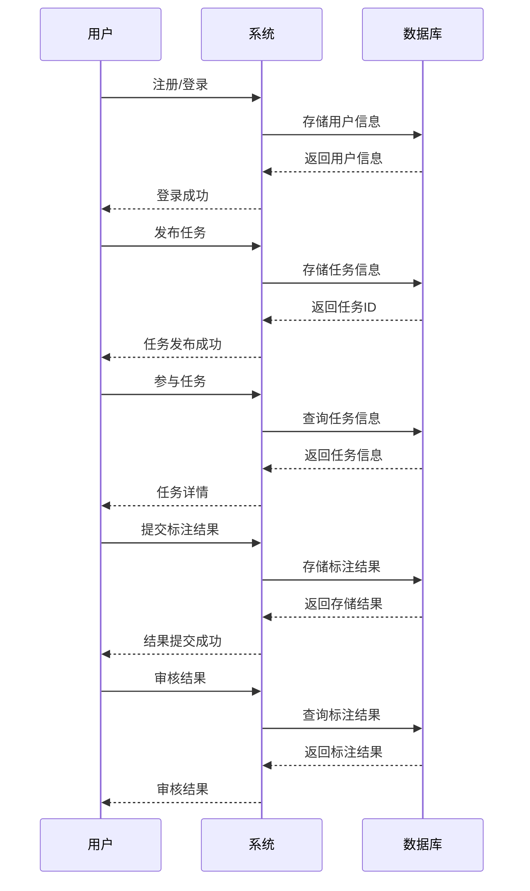

                 

### 第1章：众包科学的崛起

#### 1.1 问题背景

##### 1.1.1 科学研究的挑战与需求

在当今快速发展的科技时代，科学研究面临着前所未有的挑战与需求。首先，科学问题日益复杂，传统的科研模式往往难以应对。从基础科学研究到应用技术开发，越来越多的领域需要大量的数据收集、复杂的计算和大量的实验验证，而这些任务往往超出了单个研究团队或机构的资源范围。此外，科学研究的资金和人力资源也面临巨大的压力。科研资金短缺、人才流失等问题使得许多重要科研项目难以启动或维持。

为了解决这些问题，科学研究需要更加高效和多样化的合作模式。众包（Crowdsourcing）作为一种新兴的协作模式，正逐渐成为科学研究的有效手段。众包通过利用广泛的群众力量来分担科研任务，不仅可以大幅度提升科研效率，还能够拓宽研究视野，激发创新思维。

##### 1.1.2 众包模式的起源与发展

众包这一概念最早由杰弗里·崔西（Jeffrey T. Crowston）和威廉·博斯（William H. Lifestyle）于2002年提出，其核心思想是利用网络平台将任务或问题发布给广泛的群众，并由他们共同协作完成。众包模式迅速发展，尤其在互联网技术日益成熟的今天，已成为一种全球性的趋势。

众包的发展经历了多个阶段。最初，众包主要应用于产品设计、市场营销等领域。例如，公司通过众包平台收集用户反馈，改进产品设计。随后，随着计算机技术和互联网的进一步发展，众包开始广泛应用于科学研究领域。2006年，NASA启动了“公民科学”（Citizen Science）项目，利用公众力量参与天文观测和数据分析。这一成功案例标志着众包在科学研究中的崛起。

近年来，众包科学得到了越来越多的关注和推广。例如，“天文学众包”（Astronomy@Home）项目通过分布式计算，收集和分析天文数据；“折叠蛋白质”（Foldit）项目则利用众包解决蛋白质折叠难题。这些成功的案例证明了众包在科学研究中的巨大潜力。

##### 1.1.3 众包科学的重要性

众包科学的重要性体现在多个方面。首先，它能够大幅提升科研效率。通过众包，科研任务可以被分散到全球范围内的参与者，这不仅节省了时间和资源，还提高了研究结果的准确性和可靠性。其次，众包科学能够促进科学知识的普及和科学素养的提升。参与众包项目的公众不仅可以深入了解科学研究的进展，还能够亲身体验科研工作的乐趣。

此外，众包科学还能够激发创新思维，推动科学研究的发展。众包平台为科学家提供了丰富的数据资源和多样化的研究视角，有助于发现新的科学问题和创新解决方案。同时，众包科学也为非专业人士提供了参与科学研究的途径，使得科学发现不再局限于专业领域。

总之，众包科学作为一种新兴的科研模式，具有广泛的应用前景和重要的社会价值。它不仅能够解决当前科学研究面临的挑战，还能够推动科学技术的进步和社会的发展。

#### 1.2 众包科学的核心概念

##### 1.2.1 众包的定义

众包（Crowdsourcing）是指通过互联网平台将任务或问题发布给广泛的群众，由他们共同协作完成的一种协作模式。众包的核心在于利用集体智慧，将复杂的任务分散到众多参与者手中，通过他们的共同努力实现任务目标。

在众包过程中，通常会有以下几个角色：

- **发起者（Requester）**：发布任务或问题的主体，通常是企业、研究机构或个人。
- **参与者（Contributor）**：接受任务并参与协作的个体，可以是普通公众、专业人士或其他组织。
- **平台（Platform）**：连接发起者和参与者的中介平台，提供任务发布、任务管理和结果收集等功能。

众包的流程一般包括以下几个步骤：

1. **任务发布**：发起者在众包平台上发布任务，描述任务的具体内容和要求。
2. **任务接受**：参与者浏览平台上的任务，选择感兴趣的任务并申请参与。
3. **任务协作**：参与者根据任务要求，通过协作完成任务的各个子任务。
4. **结果提交**：参与者将完成的任务结果提交到众包平台。
5. **结果评审**：平台或发起者对提交的结果进行评审，确定最终的成果。

##### 1.2.2 集体智慧的内涵

集体智慧（Collective Intelligence）是指一个群体通过协作和互动，共同产生解决问题的方案或创造价值的能力。在众包科学中，集体智慧发挥着至关重要的作用。

集体智慧的内涵主要包括以下几个方面：

1. **多样性和包容性**：集体智慧依赖于多样化的视角和思维方式，只有包容不同的观点和想法，才能激发创新和解决问题的能力。
2. **协作和互动**：集体智慧通过群体成员之间的协作和互动实现，个体之间的交流和合作能够促进知识和智慧的共享。
3. **自组织和自适应性**：集体智慧具有自组织和自适应的特点，能够根据环境变化和任务需求，自动调整和优化协作过程。
4. **集体决策**：集体智慧强调集体决策，通过群体成员的共同讨论和投票，达成最优解决方案。

##### 1.2.3 众包科学的边界与外延

众包科学的边界和范围可以界定为利用众包模式进行科学研究和知识发现的过程。然而，随着众包模式的广泛应用，其外延也在不断扩展。

1. **边界**：众包科学的边界主要涉及以下方面：
   - **科学领域**：众包科学主要应用于自然科学、工程科学、社会科学等领域，但在艺术、人文等领域也有一定应用。
   - **任务类型**：众包科学主要处理数据收集、数据分析、问题求解、实验验证等任务，但也可以应用于其他类型的科研活动。
   - **参与者范围**：众包科学参与者可以是普通公众、专业人士、研究机构等，但其核心在于利用广泛的群众力量进行协作。

2. **外延**：众包科学的外延主要包括以下几个方面：
   - **跨学科合作**：众包科学不仅应用于单一学科，还促进了跨学科的合作和知识整合。
   - **社会参与**：众包科学鼓励公众参与科学研究，提升科学普及和科学素养。
   - **商业模式**：众包科学也逐渐渗透到商业领域，为企业创新和产品开发提供新的模式。

##### 1.3 核心概念的联系与结构

众包科学与其核心概念——众包和集体智慧——之间存在密切的联系和结构关系。

1. **概念联系**：
   - **众包**：众包是众包科学的基础和实现手段，通过将任务分散给广泛的群众，实现集体智慧的发挥。
   - **集体智慧**：集体智慧是众包科学的核心目标，通过众包模式，集体智慧在科研过程中得以充分发挥。

2. **概念结构**：
   - **众包**：众包包括任务发布、任务协作和结果评审等环节，是集体智慧实现的流程保障。
   - **集体智慧**：集体智慧涉及多样性和包容性、协作和互动、自组织和自适应性等方面，是众包科学的核心动力。

3. **结构对比表格**：

   | 特征         | 众包                       | 集体智慧                     |
   | ------------ | -------------------------- | ---------------------------- |
   | 定义         | 利用互联网平台分散任务     | 群体共同协作解决问题         |
   | 目标         | 完成任务、提高效率         | 创新思维、知识共享           |
   | 关键要素     | 发起者、参与者、平台       | 多样性、协作、自组织         |
   | 应用范围     | 科学研究、产品设计、服务等 | 科学研究、社会问题解决等     |
   | 结构关系     | 流程保障                   | 动力来源                     |

4. **ER实体关系图**：

   ```mermaid
   entity relation diagram TD
   participant[参与者]
   task[任务]
   platform[平台]
   reviewer[评审者]
   participant -> task : 接受
   platform -> task : 发布
   platform -> participant : 注册
   reviewer -> task : 评审
   ```

   图中的实体包括参与者、任务、平台和评审者，它们之间的关系反映了众包科学的基本结构。参与者通过平台接受任务，平台发布任务并管理参与者，评审者对提交的任务结果进行评审，从而形成一个完整的众包科学流程。

##### 1.4 本章小结

本章介绍了众包科学的背景、核心概念及其结构关系。首先，分析了科学研究面临的挑战和众包模式的起源与发展，阐述了众包科学的重要性。接着，详细定义了众包和集体智慧，并探讨了它们的内涵和联系。最后，通过结构对比表格和ER实体关系图，展示了众包科学与核心概念之间的结构关系。这些分析为后续章节的深入探讨奠定了基础。

---

**第二部分：众包科学的应用领域与案例**

#### 第2章：自然科学中的众包应用

##### 2.1 天文学

###### 2.1.1 天文学领域的众包项目

在天文学领域，众包项目以其独特的魅力和重要性吸引了全球科学爱好者和专业天文学家的关注。这些项目不仅为公众提供了参与科学研究的机会，也通过众包的力量推动了天文学的发展。

1. **Galaxy Zoo项目**：
   - **背景**：Galaxy Zoo项目是由英国天文学家克里斯·林德利（Chris Lintott）发起的，旨在通过众包方式帮助科学家分类和识别宇宙中的星系。
   - **目标**：该项目的主要目标是从天文观测数据中识别不同类型的星系，并帮助科学家了解星系形成和演化过程中的规律。
   - **参与方式**：参与者通过在线平台浏览天文图像，根据图像特征对星系进行分类。这些分类数据被科学家用于进一步分析，以揭示宇宙的奥秘。

2. **Citizen Sky项目**：
   - **背景**：Citizen Sky是由美国国家航空航天局（NASA）启动的一项众包项目，旨在帮助科学家研究超新星爆炸和宇宙演化。
   - **目标**：通过众包方式，该项目收集和分析了大量天文观测数据，以发现新的超新星和其他天体现象，推动对宇宙演化的理解。
   - **参与方式**：参与者可以通过项目网站下载天文图像，并通过图像分析软件识别和标记超新星和其他天体现象。

###### 2.1.2 典型天文学众包案例

1. **Zooniverse平台**：
   - **背景**：Zooniverse是一个集成了多个天文众包项目的在线平台，由英国卡迪夫大学的天文学家创立。
   - **目标**：通过众包方式，Zooniverse旨在解决复杂的科学问题，从天文学到地球科学等多个领域。
   - **参与方式**：用户可以通过注册账号，选择不同的项目参与数据收集、分类和标注工作。

2. **Einstein@Home项目**：
   - **背景**：Einstein@Home是由马克斯·普朗克天文研究所和麻省理工学院合作启动的，旨在通过众包寻找引力波信号。
   - **目标**：该项目利用公众计算机的计算能力，分析天文观测数据，以寻找引力波产生的现象。
   - **参与方式**：用户可以通过下载并安装Einstein@Home软件，将自己的计算机连接到项目中，贡献计算资源。

###### 2.1.3 天文学众包的优势与挑战

1. **优势**：
   - **广泛参与**：众包项目吸引了全球范围的公众参与，使得天文学研究不再局限于专业领域，促进了科学知识的普及。
   - **数据丰富**：众包项目提供了大量的观测数据和分类数据，为科学家提供了丰富的数据资源，有助于提高研究的准确性和可靠性。
   - **成本效益**：众包项目通过利用公众资源，降低了科研成本，提高了科研效率。

2. **挑战**：
   - **数据质量**：由于众包项目参与者众多，数据质量参差不齐，需要科学家投入大量时间进行数据清洗和验证。
   - **协作效率**：众包项目的参与者分布在不同的地理位置，协作效率可能受到影响，需要有效的方法和工具来协调和优化协作流程。
   - **用户参与度**：保持用户的参与度是一个挑战，需要设计吸引人的任务和激励机制，以提高用户持续参与的积极性。

##### 2.2 生物学

###### 2.2.1 生物学领域的众包项目

生物学领域的众包项目利用集体智慧，解决了许多复杂的生物学问题。这些项目不仅推动了生物学研究的发展，也为公众提供了深入了解生物学的机会。

1. **Foldit项目**：
   - **背景**：Foldit是由华盛顿大学的生物物理学家亚当·帕特里克（Adam Pate）发起的一个在线游戏，旨在解决蛋白质折叠问题。
   - **目标**：Foldit的目标是通过众包方式，设计新的蛋白质结构，以解决医学、农业和环境问题。
   - **参与方式**：参与者通过游戏界面，尝试将蛋白质链折叠成不同的形状，最终形成稳定的结构。

2. **EyeWire项目**：
   - **背景**：EyeWire是由麻省理工学院媒体实验室和德国马克斯·普朗克神经科学研究所合作的一个众包项目。
   - **目标**：该项目旨在绘制人脑神经细胞的三维结构，帮助科学家更好地理解大脑的功能。
   - **参与方式**：参与者通过在线平台，在给定的神经图像中，逐步绘制出神经细胞的路径。

###### 2.2.2 典型生物学众包案例

1. **EvoTree项目**：
   - **背景**：EvoTree是由伦敦大学学院和剑桥大学合作的众包项目，旨在重建生物进化树。
   - **目标**：通过众包方式，EvoTree项目收集了大量的生物分类学数据，帮助科学家重建生物进化关系。
   - **参与方式**：参与者通过在线平台，对给定的生物物种进行分类和标注，以帮助重建进化树。

2. **Wild Me项目**：
   - **背景**：Wild Me是由动物行为学家和程序员合作的众包项目，旨在记录和保护野生动物。
   - **目标**：通过众包方式，Wild Me项目收集了大量的野生动物图像，帮助科学家进行物种识别和保护工作。
   - **参与方式**：参与者通过上传野生动物照片，标注照片中的物种和位置，为科学家提供数据支持。

###### 2.2.3 生物学众包的优势与挑战

1. **优势**：
   - **科学贡献**：众包项目为生物学研究提供了丰富的数据资源，有助于提高研究的准确性和可靠性。
   - **公众参与**：众包项目吸引了广泛的公众参与，提高了公众对生物学的兴趣和科学素养。
   - **资源整合**：众包项目通过整合公众资源，降低了科研成本，提高了科研效率。

2. **挑战**：
   - **数据质量**：由于众包项目参与者众多，数据质量参差不齐，需要科学家投入大量时间进行数据清洗和验证。
   - **协作效率**：众包项目的参与者分布在不同的地理位置，协作效率可能受到影响，需要有效的方法和工具来协调和优化协作流程。
   - **用户参与度**：保持用户的参与度是一个挑战，需要设计吸引人的任务和激励机制，以提高用户持续参与的积极性。

##### 2.3 地球科学

###### 2.3.1 地球科学领域的众包项目

地球科学领域的众包项目利用集体智慧，解决了许多复杂的地球科学问题。这些项目不仅推动了地球科学的研究，也为公众提供了深入了解地球科学的机会。

1. **Grounded Truth项目**：
   - **背景**：Grounded Truth是由谷歌与联合国世界粮食计划署合作的一个众包项目，旨在通过卫星图像和社交媒体数据监测粮食安全。
   - **目标**：通过众包方式，Grounded Truth项目收集了大量的卫星图像和社交媒体数据，帮助科学家监测全球粮食生产状况。
   - **参与方式**：参与者可以通过在线平台，标注卫星图像中的农田和农作物，为科学家提供数据支持。

2. **Global Earth Observation System of Systems（GEOSS）项目**：
   - **背景**：GEOSS是一个国际合作的地球科学众包项目，旨在整合全球地球观测数据，提供更准确的气候和环境预测。
   - **目标**：通过众包方式，GEOSS项目收集了来自不同国家和机构的地球观测数据，帮助科学家进行气候和环境研究。
   - **参与方式**：参与者可以通过在线平台，提交和分享地球观测数据，为全球地球科学研究提供数据支持。

###### 2.3.2 典型地球科学众包案例

1. **OpenStreetMap项目**：
   - **背景**：OpenStreetMap是一个全球性的众包项目，旨在创建和维护一个免费的地图数据库。
   - **目标**：通过众包方式，OpenStreetMap项目收集了全球的地理信息数据，为科学家提供研究用的地图数据。
   - **参与方式**：参与者可以通过在线平台，编辑和更新地图数据，为地球科学研究提供地理信息支持。

2. **USGS Volcano Hazards Program**：
   - **背景**：USGS Volcano Hazards Program是由美国地质调查局（USGS）启动的一个众包项目，旨在监测和分析火山活动。
   - **目标**：通过众包方式，该项目收集了大量的火山观测数据，帮助科学家预测火山爆发和评估火山风险。
   - **参与方式**：参与者可以通过在线平台，提交火山观测数据，为科学家提供研究用的数据支持。

###### 2.3.3 地球科学众包的优势与挑战

1. **优势**：
   - **数据丰富**：众包项目提供了丰富的地球科学数据，有助于提高研究的准确性和可靠性。
   - **公众参与**：众包项目吸引了广泛的公众参与，提高了公众对地球科学的兴趣和科学素养。
   - **资源整合**：众包项目通过整合公众资源，降低了科研成本，提高了科研效率。

2. **挑战**：
   - **数据质量**：由于众包项目参与者众多，数据质量参差不齐，需要科学家投入大量时间进行数据清洗和验证。
   - **协作效率**：众包项目的参与者分布在不同的地理位置，协作效率可能受到影响，需要有效的方法和工具来协调和优化协作流程。
   - **用户参与度**：保持用户的参与度是一个挑战，需要设计吸引人的任务和激励机制，以提高用户持续参与的积极性。

##### 2.4 环境科学

###### 2.4.1 环境科学领域的众包项目

环境科学领域的众包项目利用集体智慧，解决了许多复杂的环保问题。这些项目不仅推动了环境科学研究的发展，也为公众提供了深入了解环境保护的机会。

1. **Open Energy Information（OpenEI）项目**：
   - **背景**：OpenEI是由美国能源部启动的一个众包项目，旨在提供开放的能源数据和信息。
   - **目标**：通过众包方式，OpenEI项目收集和分享全球的能源数据，帮助科学家、政策制定者和公众了解能源使用和可再生能源的潜力。
   - **参与方式**：参与者可以通过在线平台，提交和分享能源数据，为环境科学研究提供数据支持。

2. **Pond Apps项目**：
   - **背景**：Pond Apps是由环境科学家发起的一个众包项目，旨在通过智能手机应用程序收集水体污染数据。
   - **目标**：通过众包方式，Pond Apps项目收集了大量的水体污染数据，帮助科学家监测和评估水环境质量。
   - **参与方式**：参与者可以通过智能手机应用程序，记录和上传水体污染情况，为环境科学研究提供数据支持。

###### 2.4.2 典型环境科学众包案例

1. **Earthwatch Institute项目**：
   - **背景**：Earthwatch Institute是一个国际性的非营利组织，通过众包项目让公众参与环境科学研究和保护工作。
   - **目标**：通过众包方式，Earthwatch Institute项目收集了大量的环境数据，帮助科学家进行环境研究和保护工作。
   - **参与方式**：参与者可以通过在线平台报名参加地球观察项目，实地参与环境科学研究。

2. **iNaturalist项目**：
   - **背景**：iNaturalist是一个由斯坦福大学启动的众包项目，旨在通过智能手机应用程序收集生物多样性数据。
   - **目标**：通过众包方式，iNaturalist项目收集了大量的生物观测数据，帮助科学家研究生物多样性和生态系统的变化。
   - **参与方式**：参与者可以通过智能手机应用程序，记录和上传生物观测数据，为环境科学研究提供数据支持。

###### 2.4.3 环境科学众包的优势与挑战

1. **优势**：
   - **数据丰富**：众包项目提供了丰富的环境科学数据，有助于提高研究的准确性和可靠性。
   - **公众参与**：众包项目吸引了广泛的公众参与，提高了公众对环境保护的关注和科学素养。
   - **资源整合**：众包项目通过整合公众资源，降低了科研成本，提高了科研效率。

2. **挑战**：
   - **数据质量**：由于众包项目参与者众多，数据质量参差不齐，需要科学家投入大量时间进行数据清洗和验证。
   - **协作效率**：众包项目的参与者分布在不同的地理位置，协作效率可能受到影响，需要有效的方法和工具来协调和优化协作流程。
   - **用户参与度**：保持用户的参与度是一个挑战，需要设计吸引人的任务和激励机制，以提高用户持续参与的积极性。

##### 2.5 本章小结

本章介绍了自然科学中几个典型的众包科学应用领域和案例。首先，详细介绍了天文学领域中的众包项目，如Galaxy Zoo和Citizen Sky，并探讨了其优势与挑战。接着，介绍了生物学领域的众包项目，如Foldit和EyeWire，并分析了其在生物学研究中的应用价值。随后，探讨了地球科学领域和环境保护领域的众包项目，包括Grounded Truth、Open Energy Information、Pond Apps、Earthwatch Institute和iNaturalist。最后，总结了这些众包项目的优势与挑战。通过这些案例，我们可以看到众包科学在自然科学中的广泛应用和巨大潜力。

---

### 第3章：众包科学的技术基础

#### 3.1 数据处理与分析技术

在众包科学中，数据处理与分析技术是至关重要的一环。这些技术确保了数据的准确性和可靠性，为科学研究的深入提供了坚实的基础。下面，我们将详细探讨数据处理与分析技术的几个关键方面。

##### 3.1.1 数据收集与存储

数据收集是众包科学的第一步，也是最重要的一步。有效的数据收集方法能够保证数据的多样性和准确性。以下是几种常见的数据收集方法：

1. **在线平台**：通过在线平台发布任务，邀请参与者提交数据。这种方法适用于大规模的数据收集，如天文学中的星系分类和生物多样性数据收集。

2. **移动应用**：利用智能手机应用程序收集数据。这种方法适用于环境科学中的水体污染监测和生物观测数据收集。

3. **传感器网络**：利用传感器网络收集环境数据，如气象数据、地震数据等。这种方法适用于地球科学领域，能够提供实时的数据监测。

在数据收集完成后，需要将数据进行存储。常用的数据存储技术包括：

1. **数据库**：使用关系型数据库（如MySQL、PostgreSQL）或非关系型数据库（如MongoDB、Cassandra）存储数据。数据库的选择取决于数据的类型和规模。

2. **云存储**：利用云存储服务（如Amazon S3、Google Cloud Storage）存储大量数据。云存储具有高可靠性和可扩展性，适用于大规模数据存储。

3. **数据湖**：数据湖是一种用于存储大规模、多样化数据的分布式存储系统。数据湖适用于存储非结构化数据，如日志文件和社交媒体数据。

##### 3.1.2 数据清洗与预处理

数据清洗与预处理是确保数据质量的关键步骤。以下是几种常见的数据清洗与预处理技术：

1. **数据去重**：去除重复的数据记录，保证数据的唯一性。

2. **数据标准化**：将不同格式和单位的数据转换为统一格式和单位，以便进行进一步分析。

3. **缺失值处理**：处理数据中的缺失值，常用的方法包括填充缺失值和删除含有缺失值的记录。

4. **异常值检测**：检测和去除数据中的异常值，以保证数据的准确性。

5. **特征工程**：提取数据中的关键特征，为后续分析提供支持。特征工程包括特征选择、特征变换和特征构造等。

常用的数据清洗与预处理工具包括：

1. **Pandas**：Python中的数据处理库，适用于数据清洗、转换和分析。

2. **SciPy**：Python中的科学计算库，适用于数据处理和数学运算。

3. **Spark**：Scala中的大数据处理框架，适用于大规模数据清洗与预处理。

##### 3.1.3 数据分析技术

数据分析技术是众包科学的核心。以下是几种常见的数据分析技术：

1. **描述性分析**：通过统计描述性统计量（如均值、中位数、标准差等）来了解数据的分布和特征。

2. **探索性分析**：使用图表和可视化方法（如散点图、直方图、箱线图等）来探索数据之间的关系和趋势。

3. **预测分析**：使用统计模型（如线性回归、决策树、神经网络等）来预测未来的趋势和结果。

4. **聚类分析**：将数据分为不同的类别或簇，以发现数据中的模式或关联。

5. **分类分析**：将数据分为不同的类别，以识别数据中的特征和模式。

6. **关联规则挖掘**：发现数据之间的关联规则，用于推荐系统和市场篮分析。

常用的数据分析工具包括：

1. **R**：一种专门用于统计分析的语言和软件环境。

2. **Python**：一种广泛用于科学计算和数据可视化的编程语言，具有丰富的数据分析库（如NumPy、Pandas、Matplotlib等）。

3. **Tableau**：一种强大的数据可视化工具，适用于创建交互式图表和仪表盘。

4. **Power BI**：一种商业智能工具，适用于数据分析和报告生成。

通过有效的数据处理与分析技术，众包科学能够从大量的数据中提取有价值的信息，推动科学研究的深入和发展。

#### 3.2 人机交互与用户参与

在人机交互与用户参与方面，众包科学的设计与实施需要特别关注用户体验、用户参与度和激励机制。以下是这些方面的详细讨论。

##### 3.2.1 用户界面设计

用户界面设计（User Interface Design，简称UI设计）是众包科学项目中至关重要的一个环节。良好的用户界面设计能够提高用户的参与度和满意度，从而提升众包项目的效果。以下是几个关键方面：

1. **简洁性**：用户界面应尽量简洁直观，避免复杂的操作流程和冗长的说明。通过清晰的布局和简洁的指导，帮助用户快速理解任务内容和操作方法。

2. **直观性**：用户界面设计应遵循直观原则，使用户能够轻松理解各项操作的功能和目的。例如，使用常见的图标和按钮布局，减少用户的学习成本。

3. **响应性**：用户界面设计应考虑不同设备的兼容性，如桌面电脑、平板电脑和智能手机等。通过响应式设计，确保用户在不同设备上都能获得良好的体验。

4. **个性化**：用户界面设计可以提供个性化的定制选项，让用户根据自己的需求和习惯进行调整。例如，允许用户自定义界面布局、颜色方案和提醒设置等。

##### 3.2.2 用户体验优化

用户体验（User Experience，简称UX）优化是提升用户满意度的重要手段。以下是几个关键方面：

1. **易用性**：优化用户界面，使其更加直观和易用。通过简化操作流程、减少用户输入和提高系统的响应速度，提升用户的操作体验。

2. **反馈机制**：及时给予用户反馈，使用户了解他们的操作是否成功。例如，当用户完成任务时，可以显示成功消息和奖励，增加用户的成就感。

3. **用户支持**：提供及时的用户支持，帮助用户解决遇到的问题。可以通过在线聊天、邮件和电话等多种渠道，确保用户能够在需要时获得帮助。

4. **个性化服务**：根据用户的行为和偏好，提供个性化的服务和建议。例如，根据用户的参与历史，推荐适合他们的任务，提高用户的参与度。

##### 3.2.3 用户激励机制

有效的用户激励机制能够提高用户的参与度和积极性。以下是几种常见的用户激励机制：

1. **积分制度**：为用户完成任务提供积分奖励，用户可以通过积分兑换实物或虚拟奖励。积分制度可以鼓励用户积极参与任务，增加他们的参与度。

2. **奖励制度**：为表现出色的用户提供奖励，如奖金、奖品和荣誉证书等。奖励制度可以激励用户不断提高自己的表现，从而提升众包项目的效果。

3. **排行榜**：设立排行榜，展示用户完成任务的情况和积分排名。排行榜可以激发用户的竞争心理，提高他们的参与积极性。

4. **社交互动**：鼓励用户在平台上进行社交互动，如点赞、评论和分享任务等。社交互动可以增强用户的归属感和参与感，提高用户的忠诚度。

通过以上措施，众包科学项目能够更好地吸引和保留用户，提升整体项目的效果和影响力。

#### 3.3 算法与模型

在众包科学中，算法与模型的选择和优化是确保项目成功的关键。众包任务通常具有数据量大、多样性强和实时性要求高等特点，因此，选择合适的算法和模型对于提升任务完成效率、保证数据质量具有重要意义。以下是几种常见的众包算法和模型以及它们在众包科学中的应用。

##### 3.3.1 众包中的算法挑战

众包科学中的算法挑战主要体现在以下几个方面：

1. **数据质量**：由于众包任务的参与者众多，数据质量参差不齐。如何从海量、多样化的数据中筛选出高质量的数据，成为算法设计的重要挑战。

2. **计算效率**：众包任务通常需要处理大量的数据，如何在有限的时间内完成计算任务，是算法优化的关键。

3. **实时性**：一些众包任务具有实时性要求，如环境监测和灾害响应等。如何在短时间内处理并反馈结果，是算法设计的重要考虑因素。

4. **用户行为**：众包任务的参与者行为多样，如何激励用户积极参与任务，并保持高参与度，是算法设计的一大难题。

##### 3.3.2 常见众包算法模型

以下是几种常见的众包算法模型及其特点：

1. **基于群体智能的算法**：
   - **原理**：群体智能算法模拟自然界中的群体行为，通过个体间的协作和竞争实现任务目标。常用的群体智能算法包括粒子群优化（PSO）、人工神经网络（ANN）和蚁群算法（ACO）等。
   - **应用**：这类算法适用于解决复杂优化问题和大规模数据分类任务。例如，PSO算法可以用于蛋白质折叠问题的求解，ANN算法可以用于图像识别和分类。

2. **基于博弈论的算法**：
   - **原理**：博弈论算法通过模拟参与者之间的互动和策略选择，实现众包任务的优化。常用的博弈论算法包括纳什均衡和协同博弈等。
   - **应用**：这类算法适用于解决任务分配和资源优化问题。例如，在环境监测中，可以使用协同博弈算法优化观测点的选择和资源分配。

3. **基于机器学习的算法**：
   - **原理**：机器学习算法通过训练模型，从历史数据中学习规律，实现数据预测和分类。常用的机器学习算法包括支持向量机（SVM）、随机森林（RF）和深度学习（DL）等。
   - **应用**：这类算法适用于数据分析和预测任务。例如，在天气预测中，可以使用SVM算法进行数据分类和预测，在图像识别中，可以使用深度学习算法进行图像分类和特征提取。

4. **基于博弈论的社交网络算法**：
   - **原理**：社交网络算法通过分析用户在社交网络中的互动和关系，实现用户行为的预测和参与度的提升。常用的社交网络算法包括影响力分析、社交传播模型和推荐系统等。
   - **应用**：这类算法适用于用户参与度和社区管理。例如，在众包项目中，可以使用影响力分析算法识别活跃用户，使用社交传播模型预测用户参与趋势，使用推荐系统提高用户参与度。

##### 3.3.3 算法优化的策略

为了提升众包科学的效率和效果，算法优化是关键。以下是几种常见的算法优化策略：

1. **多算法融合**：结合多种算法的优点，实现任务目标的优化。例如，可以将机器学习和群体智能算法结合，提高数据预测和优化任务的性能。

2. **分布式计算**：利用分布式计算技术，提高算法的计算效率。例如，使用MapReduce框架将任务分解为多个子任务，并行处理，提高整体处理速度。

3. **在线学习**：利用在线学习技术，实时更新和优化模型。例如，在实时数据流中，使用在线学习算法不断更新模型，提高预测的准确性。

4. **协同优化**：通过协同优化策略，优化用户参与度和任务完成效率。例如，在用户参与度管理中，结合用户行为和任务特点，优化参与奖励机制。

通过上述算法优化策略，可以显著提升众包科学的效率和效果，推动科学研究的深入和发展。

#### 3.4 众包平台的构建与运营

众包平台是众包科学的核心基础设施，其构建与运营的成功直接关系到众包项目的效果和可持续发展。以下是众包平台构建与运营的几个关键方面。

##### 3.4.1 平台架构设计

平台架构设计是众包平台构建的基础，需要考虑以下几个方面：

1. **模块化设计**：众包平台应采用模块化设计，将不同的功能模块（如任务发布、用户管理、数据存储、数据处理等）进行解耦。这样可以提高平台的可扩展性和可维护性。

2. **分布式架构**：为了应对大规模数据处理和并发访问，众包平台应采用分布式架构。常用的分布式架构包括主从架构、微服务架构和分布式数据库等。

3. **安全性设计**：众包平台需要确保用户数据的安全性和隐私性。应采用加密技术保护数据传输和存储，实现用户身份验证和权限控制，防止数据泄露和未经授权的访问。

4. **高可用性设计**：众包平台应具备高可用性，确保在故障情况下能够快速恢复，减少对用户的影响。可以使用冗余设计、故障转移和负载均衡等技术实现高可用性。

##### 3.4.2 安全性与隐私保护

安全性与隐私保护是众包平台构建的重要方面。以下是几个关键点：

1. **数据加密**：对用户数据和传输数据进行加密，防止数据在传输过程中被窃取或篡改。

2. **用户身份验证**：采用多因素身份验证（如密码+短信验证码、生物识别等）确保用户身份的准确性，防止未授权访问。

3. **访问控制**：实现细粒度的访问控制，根据用户的角色和权限限制对数据和功能的访问。

4. **隐私保护**：确保用户数据的匿名性和隐私性，避免用户信息的泄露。可以采用数据脱敏、数据匿名化等技术进行隐私保护。

##### 3.4.3 运营策略与项目管理

众包平台的成功运营和项目管理是确保众包项目顺利进行的关键。以下是几个关键点：

1. **任务管理**：建立完善的任务管理流程，包括任务发布、任务分配、任务监控和任务验收等环节。应确保任务的明确性、可行性和合理性，提高任务完成的效率。

2. **用户管理**：建立用户管理体系，包括用户注册、用户认证、用户行为监控和用户奖励等。应鼓励用户积极参与任务，提高用户的参与度和满意度。

3. **激励机制**：设计合理的激励机制，如积分制度、奖励制度和排行榜等，鼓励用户积极参与任务。激励机制应与用户参与度和任务完成质量挂钩，确保激励的有效性。

4. **项目管理**：建立完善的项目管理流程，包括项目规划、项目执行、项目监控和项目评估等。应确保项目的进度、质量和成本控制，确保项目目标的实现。

通过以上措施，可以构建和运营一个高效、安全和可持续发展的众包平台，为科学研究提供有力支持。

#### 3.5 本章小结

本章详细探讨了众包科学的技术基础，包括数据处理与分析技术、人机交互与用户参与、算法与模型以及众包平台的构建与运营。首先，介绍了数据处理与分析技术的关键方面，如数据收集与存储、数据清洗与预处理和数据分析技术。接着，讨论了人机交互与用户参与的重要性，包括用户界面设计、用户体验优化和用户激励机制。随后，介绍了众包科学中的常见算法模型及其优化策略，以及众包平台的构建与运营关键。通过这些内容，我们能够更好地理解众包科学的技术基础，为科学研究提供有力支持。

---

### 第4章：众包科学面临的挑战

#### 4.1 数据质量与准确性

在众包科学中，数据质量与准确性是两个至关重要的因素，直接影响着科研结果的可靠性和有效性。由于众包项目通常涉及广泛的参与者，数据质量容易受到多种因素的影响，因此如何确保数据的质量和准确性是一个亟待解决的问题。

##### 4.1.1 数据质量的影响因素

数据质量受到以下几方面的影响：

1. **用户能力与经验**：众包项目中的参与者水平参差不齐，部分参与者可能缺乏相关知识和经验，导致数据错误或不准确。

2. **数据一致性**：由于不同的参与者在完成任务时可能采用不同的标准和方法，导致数据缺乏一致性，影响整体数据的可靠性。

3. **数据完整性**：部分参与者可能由于任务难度或个人兴趣等原因，未能完成全部任务，导致数据缺失或不完整。

4. **数据源可靠性**：众包项目中的数据来源多样，包括用户上传的数据、传感器收集的数据等，数据源的可靠性直接影响数据质量。

##### 4.1.2 提高数据质量的策略

为了提高数据质量，可以采取以下几种策略：

1. **用户培训与指导**：对参与者进行培训，提供详细的任务说明和指导，确保他们了解任务要求和标准。

2. **数据审核与验证**：建立数据审核机制，对提交的数据进行多次验证和审核，确保数据的准确性和一致性。

3. **引入专家审核**：邀请专家对数据审核和验证过程进行监督，确保数据质量达到科研要求。

4. **使用自动化工具**：利用机器学习和人工智能技术，开发自动化工具对数据进行清洗、分类和验证，提高数据处理的效率和准确性。

##### 4.1.3 数据准确性评估方法

为了评估数据准确性，可以采用以下几种方法：

1. **一致性检验**：通过比较不同参与者的结果，评估数据的内部一致性。如果多个参与者的结果高度一致，则表明数据具有较高的准确性。

2. **与已知数据对比**：将众包数据与已知准确的数据进行对比，评估数据的准确性。例如，在生物多样性数据众包项目中，可以将众包数据与现有的物种识别数据进行对比。

3. **交叉验证**：使用不同数据来源或不同方法处理的数据进行交叉验证，评估数据的准确性。

4. **统计分析方法**：使用统计学方法（如Kappa系数、精确率、召回率等）评估数据的准确性。

通过以上策略和方法，可以有效提高众包科学中数据的质量和准确性，为科学研究提供可靠的数据支持。

#### 4.2 用户参与度与协作效率

在众包科学中，用户参与度和协作效率是决定项目成功与否的关键因素。高参与度和高效协作能够确保众包项目顺利进行，而低参与度和低效率则可能导致项目失败。因此，了解和解决用户参与度低和协作效率低的问题至关重要。

##### 4.2.1 用户参与度的影响因素

用户参与度受到多种因素的影响：

1. **任务复杂度**：过于复杂的任务可能让用户感到困惑和挫败，从而降低他们的参与意愿。

2. **激励机制**：缺乏有效的激励机制可能导致用户缺乏参与的动力，降低他们的参与度。

3. **用户体验**：不良的用户体验，如界面设计不佳、操作困难等，可能让用户感到疲惫和厌烦，从而减少他们的参与。

4. **任务意义**：任务缺乏实际意义或与用户兴趣不相关，可能降低用户的参与意愿。

5. **参与门槛**：高参与门槛，如需要特殊技能或设备，可能阻碍用户参与。

##### 4.2.2 提高协作效率的方法

为了提高协作效率，可以采取以下几种方法：

1. **任务分解**：将大型任务分解为多个小任务，降低用户的参与难度，提高协作效率。

2. **标准化流程**：建立标准化流程，简化用户的操作步骤，提高任务的完成速度。

3. **技术支持**：提供及时的技术支持，帮助用户解决遇到的问题，确保他们能够顺利完成任务。

4. **激励机制**：设计有效的激励机制，如积分制度、奖励制度和排行榜等，鼓励用户积极参与。

5. **任务匹配**：通过任务匹配算法，将用户的技能和兴趣与任务需求相匹配，提高协作效率。

##### 4.2.3 协作效率的评估指标

为了评估协作效率，可以采用以下几种指标：

1. **任务完成时间**：计算用户完成任务的平均时间，用于评估协作效率。

2. **任务完成率**：计算用户完成任务的比例，用于评估协作效果。

3. **错误率**：计算用户提交的错误任务比例，用于评估数据质量。

4. **用户满意度**：通过用户调查和反馈，评估用户对协作过程的满意度。

5. **整体项目进度**：评估整体项目的进度，确保项目按计划进行。

通过上述措施和指标，可以有效提高众包科学中的用户参与度和协作效率，确保项目的成功实施。

#### 4.3 众包平台的可持续性

众包平台的可持续性是确保项目长期成功和持续发展的重要因素。平台可持续性不仅关乎项目的经济效益，还涉及社会责任和环境影响。以下是关于众包平台可持续性的定义、影响因素以及提高平台可持续性的策略。

##### 4.3.1 平台可持续性的定义

平台可持续性指的是众包平台在长期运营中，能够在经济、社会和环境三个方面实现平衡和可持续发展的能力。具体包括以下几个方面：

1. **经济效益**：平台在运营过程中能够实现盈利，确保项目的持续投资和运营。

2. **社会效益**：平台能够促进社会资源的有效利用，提高公众的科学素养和参与度。

3. **环境效益**：平台在运营过程中能够减少对环境的负面影响，实现绿色、可持续的发展。

##### 4.3.2 影响平台可持续性的因素

影响平台可持续性的因素主要包括以下几个方面：

1. **用户参与度**：用户参与度直接影响平台的活跃度和项目成功率，高参与度有助于平台的可持续发展。

2. **资金来源**：平台的资金来源是否稳定和多样化，是决定平台可持续性的关键因素。单一的资金来源可能导致平台在资金短缺时难以维持运营。

3. **技术创新**：技术创新是平台保持竞争力的关键。持续的技术创新能够提升平台的功能和服务质量，吸引更多用户和合作伙伴。

4. **社会责任**：平台在运营过程中应承担社会责任，积极参与社会公益活动，提高公众对平台的认可度。

5. **政策环境**：政策环境对平台的可持续性具有重要影响。政府的政策支持和监管有助于平台健康发展。

##### 4.3.3 提高平台可持续性的策略

为了提高众包平台的可持续性，可以采取以下几种策略：

1. **多元化资金来源**：通过多种渠道筹集资金，如政府拨款、企业赞助、用户付费等，确保平台资金的稳定性和多样性。

2. **用户激励机制**：设计有效的激励机制，提高用户参与度，如积分制度、奖励制度和排行榜等。

3. **技术创新**：持续投入研发，引进新技术，提升平台的功能和服务质量，增强市场竞争力。

4. **社会责任**：积极参与社会公益活动，提高公众对平台的认可度和信任度。

5. **可持续运营**：优化运营流程，提高资源利用效率，减少运营成本，确保平台的长期可持续发展。

通过以上策略，可以有效提高众包平台的可持续性，确保其在长期运营中实现经济、社会和环境的平衡和可持续发展。

#### 4.4 伦理与法律问题

在众包科学的发展过程中，伦理与法律问题日益受到关注。这些问题不仅关系到平台的合法性和公信力，还直接影响到用户参与和项目的顺利进行。以下是关于伦理与法律问题的几个关键方面。

##### 4.4.1 伦理问题

众包科学中存在的伦理问题主要包括：

1. **数据隐私**：众包项目通常需要用户提交个人信息和敏感数据，如何保护用户的隐私成为一个重要的伦理问题。

2. **公平性**：众包项目中的任务分配和结果评估是否公平，直接影响到用户的参与度和项目的有效性。

3. **知识产权**：众包项目中的成果是否涉及知识产权问题，尤其是用户提交的数据和创意，如何保护知识产权，避免侵权纠纷。

4. **社会责任**：众包平台在运营过程中，是否承担社会责任，促进社会公平和可持续发展。

##### 4.4.2 法律问题

众包科学中存在的法律问题主要包括：

1. **数据保护法**：如何在法律框架内保护用户的数据隐私，避免数据泄露和滥用。

2. **版权法**：如何处理众包项目中的版权问题，确保用户提交的数据和创意的合法使用。

3. **合同法**：众包平台与用户、合作伙伴之间的合同条款是否合法，如何确保合同的履行和权益的保护。

4. **劳动法**：如何界定众包参与者的身份，是否属于雇佣关系，如何保障他们的劳动权益。

##### 4.4.3 解决伦理与法律问题的建议

为了解决伦理与法律问题，可以采取以下几种措施：

1. **加强法律法规建设**：政府和立法机构应加强相关法律法规的建设，明确众包平台的合法运营界限，规范用户行为。

2. **完善隐私保护机制**：众包平台应建立健全的隐私保护机制，采用加密技术保护用户数据，明确数据使用范围和权限。

3. **公平公正的评估体系**：建立公平公正的任务分配和结果评估体系，确保用户的参与权和成果权益得到保障。

4. **知识产权保护**：制定明确的知识产权保护政策，鼓励用户创新，确保其成果的合法使用和保护。

5. **加强监管与自律**：政府和行业组织应加强监管，同时众包平台应加强自律，确保项目的合法性和公信力。

通过以上措施，可以有效解决众包科学中的伦理与法律问题，为项目的顺利推进和可持续发展提供保障。

#### 4.5 本章小结

本章探讨了众包科学面临的关键挑战，包括数据质量与准确性、用户参与度与协作效率、平台可持续性、伦理与法律问题。首先，分析了数据质量的影响因素和提升策略，提出了数据准确性评估方法。接着，讨论了用户参与度的影响因素和协作效率的提升方法，并提出了评估协作效率的指标。然后，阐述了平台可持续性的定义和影响因素，提出了提高平台可持续性的策略。最后，分析了伦理与法律问题，提出了解决建议。通过这些探讨，我们能够更好地理解并应对众包科学中的挑战，为项目的成功实施和可持续发展提供指导。

---

### 第5章：众包科学的未来发展趋势

#### 5.1 新兴技术与众包科学的结合

随着科技的快速发展，新兴技术正在深刻改变着各个领域，包括众包科学。这些技术不仅提升了众包科学的能力和效率，还拓展了其应用范围，为科学研究带来了新的机遇和挑战。

##### 5.1.1 区块链技术

区块链技术以其去中心化、透明性和不可篡改的特点，在众包科学中具有广泛的应用前景。以下是区块链技术在众包科学中的应用：

1. **数据安全与隐私保护**：区块链技术可以确保用户数据的完整性和隐私性。通过分布式账本技术，用户数据在区块链上存储，防止数据篡改和泄露。

2. **任务激励与验证**：区块链技术可以实现任务的自动化激励和验证。通过智能合约，可以自动执行任务奖励的发放和结果验证，提高任务的完成效率和透明度。

3. **去中心化治理**：区块链技术可以建立去中心化的治理结构，使众包项目的管理和决策更加透明和公正。用户可以通过区块链投票，参与项目的决策和管理。

4. **可信数据共享**：区块链技术可以促进数据共享，确保数据的真实性和可靠性。通过区块链，用户可以安全地共享数据，同时保持数据的隐私性。

##### 5.1.2 人工智能与机器学习

人工智能（AI）和机器学习技术在众包科学中的应用，极大地提升了数据处理和分析的能力，为科学研究提供了强有力的支持。

1. **自动化任务分配**：通过人工智能算法，可以自动分析用户的技能和兴趣，将其与合适的任务进行匹配，提高任务分配的效率和准确性。

2. **数据清洗与预处理**：机器学习技术可以自动处理大量数据，进行数据清洗、去噪和分类，提高数据质量，为后续分析提供可靠的数据基础。

3. **智能分析工具**：人工智能技术可以开发智能分析工具，帮助用户快速理解和分析复杂的数据集。这些工具可以自动提取数据中的模式和趋势，提供决策支持。

4. **预测与优化**：机器学习模型可以用于预测和优化众包任务，如预测用户参与行为、优化任务分配策略等，提高任务的完成效率。

##### 5.1.3 虚拟现实与增强现实

虚拟现实（VR）和增强现实（AR）技术在众包科学中的应用，为用户提供了更加直观和沉浸式的体验，提高了用户参与度和任务完成效率。

1. **虚拟实验平台**：通过VR技术，可以创建虚拟实验平台，让用户在虚拟环境中进行实验操作，提高实验的可行性和安全性。

2. **远程协作**：AR技术可以实现远程协作，让用户在现实环境中实时共享信息和协作，提高众包任务的协作效率和实时性。

3. **增强数据分析**：AR技术可以将数据以可视化形式叠加在现实环境中，帮助用户更直观地理解数据，提高数据分析和决策的效率。

4. **互动式教育**：VR和AR技术可以用于科学教育和培训，让用户在虚拟环境中学习和实践科学知识，提高科学素养和参与度。

##### 5.1.4 5G技术与物联网

5G技术和物联网（IoT）的快速发展，为众包科学提供了更快速、更稳定的数据传输和更广泛的数据来源。

1. **高速数据传输**：5G技术提供了高速、低延迟的数据传输能力，使得大规模数据实时传输成为可能，为众包任务提供了高效的数据支持。

2. **物联网数据**：物联网设备可以实时收集环境数据、传感器数据等，为众包科学提供了丰富的数据源。这些数据可以用于环境监测、灾害预警等领域。

3. **智能设备协作**：5G技术和物联网可以实现智能设备的协作，如无人机、机器人等，用于大规模数据采集和任务执行，提高众包任务的效率和准确性。

通过新兴技术的结合和应用，众包科学将迎来更加广阔的发展前景。这些技术不仅提升了众包科学的能力和效率，还拓展了其应用领域，为科学研究和社会发展带来了新的机遇和挑战。

#### 5.2 全球化与跨学科合作

全球化与跨学科合作是众包科学未来发展的重要趋势。随着全球化的深入和科研领域的交叉融合，众包科学正在突破地域和学科的限制，实现全球范围内的合作与创新。

##### 5.2.1 全球化趋势

全球化趋势为众包科学带来了巨大的机遇。首先，全球化的网络环境使得参与者可以不受地域限制，来自世界各地的用户都可以参与到众包项目中。这种广泛的参与不仅带来了多样性和创新性，还能够提高数据的覆盖范围和准确性。

1. **跨国数据采集**：全球化使得众包项目可以跨国进行数据采集。例如，环境科学中的气象数据、气候变化数据等，可以通过全球范围内的用户共同采集，提高数据的全面性和代表性。

2. **多元文化背景**：全球化带来了多元文化背景的用户参与，他们可能来自不同的语言、文化和教育背景。这种多样性不仅丰富了众包项目的数据来源，还促进了不同文化和知识的交流与融合。

3. **全球资源共享**：全球化使得各国科研资源和人才可以共享，跨国合作成为常态。众包平台可以连接全球的研究机构、企业和个人，实现资源的最优配置和协作。

##### 5.2.2 跨学科合作的重要性

跨学科合作是推动科学发展的重要动力。在传统科研模式中，学科之间的壁垒往往限制了科学研究的深度和广度。而众包科学通过开放和协作的方式，打破了这些壁垒，促进了跨学科的合作。

1. **知识整合**：跨学科合作能够整合不同学科的知识和视角，从多个角度分析复杂问题，提高研究的全面性和创新性。例如，在生物医学研究中，生物学家、物理学家和计算机科学家可以共同合作，开发新的治疗方法。

2. **创新解决方案**：跨学科合作能够激发创新思维，提出传统学科难以解决的解决方案。例如，在环保领域，工程师、生态学家和计算机科学家可以共同开发智能环保系统，提高环境监测和治理的效果。

3. **合作研究**：跨学科合作促进了科学家之间的合作研究，推动了科学研究的深入和发展。众包平台可以为不同学科的科学家提供一个交流与合作的平台，促进学术交流和知识共享。

##### 5.2.3 全球化与跨学科合作的发展前景

全球化与跨学科合作在众包科学中具有广阔的发展前景。以下是几个可能的发展方向：

1. **跨国众包项目**：随着全球化的发展，跨国众包项目将越来越普遍。这些项目可以涉及多个国家、多个学科，共同解决全球性问题。例如，全球气候变化、疾病防控等领域，可以通过跨国众包项目实现全球协作。

2. **跨学科平台**：建立跨学科众包平台，整合不同学科的资源与人才，促进跨学科合作。这些平台可以提供多样化的众包项目，满足不同学科的需求，推动科学研究的发展。

3. **国际化人才培养**：通过全球化与跨学科合作，培养具有国际视野和跨学科能力的科研人才。这些人才可以成为跨国科研团队的核心成员，推动全球科学研究的发展。

4. **科技创新**：全球化与跨学科合作将推动科技创新，开发新的技术和解决方案，解决当前和未来面临的科学挑战。例如，人工智能、大数据、生物科技等领域的创新，将依赖于全球化的跨学科合作。

通过全球化与跨学科合作，众包科学将迎来更加广阔的发展空间，为科学研究和社会发展带来新的机遇和挑战。

#### 5.3 众包科学的商业潜力

众包科学不仅推动了科学研究的发展，同时也展现出巨大的商业潜力。通过众包模式，企业可以利用广泛的群众力量进行创新、优化和问题解决，从而在市场竞争中取得优势。以下是关于众包科学的商业潜力、商业模式探索和案例分析的内容。

##### 5.3.1 商业模式探索

众包科学的商业模式探索主要集中在以下几个方面：

1. **众包研究与开发**：企业可以利用众包平台，将研究任务或开发项目分解为多个小任务，通过众包方式征集全球范围内的参与者进行协作。这种方式不仅可以降低研发成本，还能够快速获取创新解决方案。

2. **众包数据服务**：企业可以通过众包平台，收集和整理用户生成的大量数据，为企业提供数据服务。这些数据可以用于市场研究、产品优化和用户行为分析等，帮助企业做出更准确的商业决策。

3. **众包营销与推广**：企业可以利用众包平台，发起众包营销活动，如设计比赛、产品测试和用户调研等。通过众包方式，企业可以获取更多的用户反馈，优化产品设计和推广策略。

4. **众包社区建设**：企业可以建立众包社区，吸引全球的科学家、工程师和爱好者参与。这些社区不仅可以为企业提供创新思路和解决方案，还能够提高企业的品牌影响力和用户忠诚度。

##### 5.3.2 众包商业案例分析

以下是几个成功的众包商业案例分析：

1. **InnoCentive**：
   - **背景**：InnoCentive是一家全球领先的众包平台，为企业提供创新解决方案。平台上的挑战者（企业）发布问题，解决者（参与者）提供解决方案。
   - **商业模式**：InnoCentive通过收取挑战者发布问题的费用和解决者的解决方案费用来盈利。平台上的问题涵盖生物科技、能源、制造、金融等多个领域。
   - **成效**：InnoCentive已帮助多家企业解决了复杂的科研和商业问题，累计发布超过20000个挑战，吸引了全球数千名解决者参与。

2. **Topcoder**：
   - **背景**：Topcoder是一家全球领先的编程众包平台，提供软件开发、算法设计和数据分析等领域的众包服务。
   - **商业模式**：Topcoder通过收取参赛者报名费和比赛奖金来盈利。平台上的比赛包括编程挑战、设计竞赛和算法竞赛等。
   - **成效**：Topcoder已吸引了数十万名开发者参与，为多家企业提供高效的软件开发和解决方案。

3. **Ubiqum Labs**：
   - **背景**：Ubiqum Labs是一家教育科技公司，通过众包方式提供在线编程和数据分析课程。学生可以通过完成真实的项目任务来学习编程和数据分析技能。
   - **商业模式**：Ubiqum Labs通过收取学费来盈利。课程项目来自于真实的企业需求，学生通过完成项目任务，不仅可以学习到实际技能，还能够为企业提供解决方案。
   - **成效**：Ubiqum Labs已帮助数百名学生成功就业，并与多家企业建立了合作关系。

4. **Altaya**：
   - **背景**：Altaya是一家利用众包方式提供商业咨询和创新的平台。平台上的咨询团队由全球各地的专业人士组成，为企业提供定制化的商业解决方案。
   - **商业模式**：Altaya通过收取咨询服务费用来盈利。平台上的咨询团队涵盖多个领域，如市场营销、战略规划、人力资源管理等。
   - **成效**：Altaya已为多家企业提供高效的咨询服务，帮助企业实现商业增长和转型。

通过以上案例分析，我们可以看到众包科学在商业领域的巨大潜力。企业可以通过众包模式，实现创新和问题解决，提高市场竞争力。同时，众包商业模式的探索也为创业者提供了新的商机和发展方向。

##### 5.3.3 众包商业的挑战与机遇

尽管众包商业展现出巨大的潜力，但也面临着一些挑战和机遇：

**挑战**：

1. **数据质量和安全性**：众包项目中数据质量和安全性是一个关键问题。如何确保数据来源的可靠性和数据处理的合规性，是众包商业需要解决的重要挑战。

2. **用户激励和维护**：维持用户的参与度和积极性是众包商业的挑战。如何设计有效的激励机制和保持用户社区的健康活跃，是一个长期的课题。

3. **法律和伦理问题**：众包商业需要遵守相关法律法规，如知识产权保护、隐私保护等。同时，如何处理伦理问题，确保公平和透明，也是重要的挑战。

**机遇**：

1. **全球化合作**：全球化为众包商业提供了广阔的市场和合作机会。企业可以通过跨国众包项目，吸引全球的参与者，实现全球范围内的合作和创新。

2. **技术创新**：随着技术的不断发展，如人工智能、区块链等新兴技术的应用，众包商业将变得更加高效和智能，为企业和用户带来更多的价值。

3. **商业模式的创新**：众包商业模式的不断探索和创新，为企业提供了新的商业模式和业务机会。例如，通过众包进行市场研究、产品设计和创新等，可以帮助企业实现可持续发展。

通过应对挑战和抓住机遇，众包商业将迎来更加广阔的发展前景，为企业和市场带来新的增长动力。

#### 5.4 众包科学与社会影响

众包科学不仅推动了科学技术的进步，还对社会产生了深远的影响。通过众包模式，科学研究和创新变得更加开放和民主，促进了公众参与和科学素养的提升，同时也为社会发展带来了新的机遇和挑战。

##### 5.4.1 科学普及与教育

众包科学在科学普及和教育方面发挥了重要作用。首先，众包项目为公众提供了参与科学研究的实际机会，使得科学不再局限于实验室和学术圈内，而是走进了公众的日常生活。例如，通过参与Galaxy Zoo项目，公众可以实际参与星系的分类和识别，从而对宇宙的奥秘有了更直观的认识。这种参与方式不仅增加了公众对科学的兴趣，还提高了公众的科学素养。

其次，众包项目在科学教育中也有广泛应用。学校和教育机构可以利用众包平台，将科学项目引入课堂，让学生通过实践性任务学习科学知识。例如，在生物多样性保护项目中，学生可以通过收集和分类生物数据，了解生态系统的重要性和生物多样性保护的必要性。这种方式不仅激发了学生的学习兴趣，还培养了他们的实践能力和科学思维。

此外，众包科学为科学教育提供了丰富的教学资源。教师可以利用众包平台上的项目案例、研究成果和数据分析工具，设计更加生动和实际的教学内容，提高教学效果。同时，众包平台也为教师提供了一个交流和合作的平台，可以分享教学经验和资源，促进科学教育的创新发展。

##### 5.4.2 公众参与与科学素养

众包科学鼓励公众参与科学研究，提高了公众的科学素养。通过众包项目，公众不仅能够亲身参与科学实验和数据收集，还能够了解科学研究的流程和方法，从而增强对科学的理解和信任。

首先，公众参与众包科学项目有助于提升公众的科学素养。公众在参与过程中，需要学习和掌握相关的科学知识和技能，从而加深对科学原理的理解。例如，在参与生物多样性数据收集和分类的过程中，公众需要学习如何识别不同物种的特征和分类方法，这有助于提高他们的生物知识水平。

其次，公众参与众包科学项目增强了公众对科学的兴趣和参与感。通过实际参与科学实验和数据收集，公众能够感受到科学研究的乐趣和价值，从而激发他们对科学的热情。这种兴趣和参与感的提升，不仅有助于培养未来的科研人才，还能够提高公众对科学和社会发展的关注和投入。

此外，公众参与众包科学项目还促进了公众的科学素养提升。在参与过程中，公众需要遵守科学研究的规范和伦理要求，了解科学方法和科研伦理，这有助于培养他们的科学精神和批判性思维能力。同时，公众在参与众包项目时，也需要与他人合作，进行团队协作，这有助于提高他们的沟通和协作能力。

##### 5.4.3 社会影响的评估

评估众包科学对社会的影响，可以从多个角度进行：

1. **经济效益**：众包科学为社会创造了新的经济价值。通过众包项目，企业可以降低研发成本，提高创新效率，从而提高市场竞争力。同时，众包项目也为参与者提供了新的就业机会和创业平台，促进了就业和经济增长。

2. **社会效益**：众包科学促进了科学普及和科学教育，提高了公众的科学素养。通过参与众包项目，公众能够更直观地了解科学研究的进展和成果，增强对科学的兴趣和理解。此外，众包科学还促进了社会资源的共享和利用，提高了社会效率。

3. **环境影响**：众包科学在环境保护和可持续发展方面也发挥了重要作用。通过众包项目，可以收集和利用大量的环境数据，为环境监测和治理提供支持。同时，众包科学鼓励公众参与环保活动，提高了公众的环保意识和行动。

4. **文化影响**：众包科学推动了文化的多样性和交流。通过众包项目，不同文化背景的公众可以共同参与科学研究，促进了文化的交流与融合。这种文化交流不仅丰富了科学研究的视角，也增强了社会的文化多样性和包容性。

综上所述，众包科学对社会产生了广泛而深远的影响。通过科学普及、教育、公众参与和科技创新，众包科学不仅推动了科学技术的发展，还促进了社会的进步和可持续发展。

#### 5.5 本章小结

本章讨论了众包科学的未来发展趋势，包括新兴技术的结合、全球化与跨学科合作、商业潜力以及众包科学对社会的影响。首先，分析了区块链、人工智能、虚拟现实和5G技术在众包科学中的应用，展示了这些技术如何提升众包科学的能力和效率。接着，探讨了全球化与跨学科合作的重要性，以及跨国众包项目和跨学科平台的发展前景。随后，介绍了众包科学的商业潜力，通过案例分析了不同的商业模式和成功经验。最后，讨论了众包科学对社会的影响，包括科学普及、教育、公众参与和科技创新等方面。通过这些探讨，我们能够更好地理解众包科学的未来发展方向，为科学研究和社会发展提供新的思路和启示。

---

### 第6章：成功众包科学项目分析

#### 6.1 项目背景与目标

**1. 项目背景**

随着科技的快速发展，众包科学作为一种新兴的科研模式，正逐渐成为科学研究的重要手段。通过众包模式，科学家可以利用广泛的群众力量来解决复杂科学问题，加速科学发现与理解。本节将分析一个成功的众包科学项目——**“天文学众包”项目**，探讨其项目背景、目标与实施过程。

**2. 项目目标**

“天文学众包”项目的目标是利用公众的力量，对天文学领域中的大量观测数据进行分类和标注，以帮助科学家发现新的天体现象、理解星系的演化过程以及探索宇宙的奥秘。具体目标如下：

- **数据分类与标注**：通过众包模式，对大量天文学观测数据（如星系图像、光谱数据等）进行分类和标注，以便科学家进行进一步分析。
- **提高数据质量**：借助众包力量，对观测数据进行多层次的验证和审核，提高数据的质量和可靠性。
- **促进科学普及**：通过众包项目，吸引公众参与科学探索，提高公众对天文学的兴趣和科学素养。
- **推动跨学科合作**：通过众包平台，促进天文学与其他学科的交叉融合，推动科学研究的创新发展。

**3. 项目预期成果**

预期通过“天文学众包”项目，可以实现以下成果：

- **丰富的天文学数据集**：收集和整理来自全球的观测数据，形成高质量的天文学数据集，为科学家提供宝贵的研究资源。
- **新的科学发现**：通过众包力量，发现新的天体现象，揭示星系的演化规律，推动天文学研究的发展。
- **科学普及成果**：提高公众对天文学的理解和兴趣，促进科学知识的普及和传播。
- **跨学科合作成果**：促进天文学与其他学科的交流与合作，推动多学科融合，解决复杂科学问题。

#### 6.2 项目实施与过程

**1. 项目实施阶段**

“天文学众包”项目分为以下几个实施阶段：

- **准备阶段**：确定项目目标、设计众包任务、制定任务说明和用户指南，建立项目网站和在线平台。
- **发布阶段**：将任务发布到众包平台，吸引参与者注册并参与项目。
- **协作阶段**：参与者通过在线平台，浏览任务、提交标注结果和反馈。
- **审核阶段**：科学家对提交的结果进行审核和验证，确保数据质量。
- **总结阶段**：对整个项目进行总结和评估，收集用户反馈，优化项目流程。

**2. 项目实施过程**

以下是“天文学众包”项目的实施过程：

1. **任务设计**：
   - **任务分类**：根据天文学研究的需求，将观测数据分为多个类别，如星系分类、恒星光谱分析等。
   - **任务难度**：设计不同难度的任务，以满足不同背景的参与者。
   - **任务说明**：编写详细的任务说明和用户指南，包括任务的背景、目标、操作步骤和评估标准。

2. **平台搭建**：
   - **用户注册**：搭建用户注册系统，收集参与者的基本信息和技能水平。
   - **任务发布**：通过在线平台发布任务，提供任务的详细信息和操作指南。
   - **任务反馈**：建立任务反馈机制，收集用户对任务的反馈，及时调整和优化任务。

3. **协作与审核**：
   - **数据提交**：参与者通过在线平台提交标注结果，系统自动收集和存储数据。
   - **多级审核**：科学家对提交的数据进行多级审核，包括初级审核、复审核和最终审核，确保数据质量。
   - **数据共享**：将审核通过的数据共享给科学家团队，供进一步分析和研究。

4. **总结与评估**：
   - **项目总结**：对整个项目进行总结，评估项目的成果和影响。
   - **用户反馈**：收集用户对项目的反馈，分析用户参与体验，优化项目流程。
   - **持续改进**：根据评估结果和用户反馈，不断改进项目设计和实施过程。

通过以上实施过程，确保“天文学众包”项目能够高效、有序地推进，实现项目目标。

#### 6.3 系统分析与架构设计

**1. 问题场景介绍**

在“天文学众包”项目中，需要搭建一个支持大规模数据收集、处理和共享的系统，确保项目能够高效、稳定地运行。以下是项目的主要问题场景：

- **数据规模**：项目需要处理和存储来自全球的天文学观测数据，数据量巨大。
- **用户规模**：项目吸引了大量的参与者，需要支持大规模用户的注册、登录和任务参与。
- **数据质量**：确保数据的质量和准确性，需要对提交的数据进行多级审核和验证。
- **系统可靠性**：系统需要具备高可用性和容错性，确保在故障情况下能够快速恢复。

**2. 系统功能设计**

根据项目的问题场景，设计以下核心功能模块：

- **用户管理模块**：支持用户的注册、登录、信息维护和任务参与。
- **任务管理模块**：支持任务发布、任务分配、任务进度跟踪和任务审核。
- **数据管理模块**：支持数据的收集、存储、处理和共享。
- **审核管理模块**：支持多级审核和验证，确保数据质量。
- **统计分析模块**：支持对用户参与数据、任务完成数据和项目成果数据的统计分析。

**3. 系统架构设计**

“天文学众包”项目的系统架构设计采用分布式架构，确保系统的可扩展性和高可用性。以下是系统架构的详细设计：

- **前端架构**：采用微前端架构，支持不同模块的独立开发和部署。前端框架采用React或Vue.js，提供良好的用户体验。
- **后端架构**：采用微服务架构，将不同的功能模块拆分为多个独立的服务，通过API进行交互。后端技术栈包括Spring Boot、Node.js等。
- **数据存储架构**：采用分布式数据库架构，包括关系型数据库（如MySQL）和非关系型数据库（如MongoDB），支持大规模数据存储和查询。
- **数据处理架构**：采用大数据处理框架（如Hadoop、Spark），支持大规模数据的处理和分析。
- **消息队列架构**：采用消息队列（如Kafka），实现系统的异步通信和任务调度。
- **安全架构**：采用安全框架（如Spring Security），实现用户认证、权限控制和数据加密。

**4. 系统接口设计**

以下是“天文学众包”项目的主要系统接口设计：

- **用户管理接口**：包括用户注册、登录、信息维护和权限控制等功能。
- **任务管理接口**：包括任务发布、任务分配、任务进度跟踪和任务审核等功能。
- **数据管理接口**：包括数据收集、存储、处理和共享等功能。
- **审核管理接口**：包括多级审核和验证等功能。
- **统计分析接口**：包括用户参与数据、任务完成数据和项目成果数据的统计分析等功能。

**5. 系统交互设计**

以下是“天文学众包”项目的系统交互设计，使用Mermaid序列图表示：



通过以上系统架构设计、接口设计和系统交互设计，确保“天文学众包”项目能够高效、稳定地运行，满足项目需求。

#### 6.4 项目实战

**1. 环境安装**

为了实现“天文学众包”项目，我们需要搭建一个开发环境，包括前端和后端。以下是环境安装的步骤：

- **前端开发环境**：
  - 安装Node.js（版本12.0.0或更高版本）
  - 安装npm（版本6.0.0或更高版本）
  - 安装React（使用`create-react-app`命令创建项目）

- **后端开发环境**：
  - 安装Java（版本8或更高版本）
  - 安装Maven（版本3.6.3或更高版本）
  - 安装Spring Boot（版本2.4.2或更高版本）

**2. 系统核心实现源代码**

以下是“天文学众包”项目核心功能的实现源代码，包括前端和后端的代码结构。

- **前端代码结构**：

  ```bash
  src/
  ├── components/
  │   ├── UserManagement.js
  │   ├── TaskManagement.js
  │   ├── DataManagement.js
  │   ├── AuditManagement.js
  │   └── StatisticsAnalysis.js
  ├── App.js
  └── index.js
  ```

- **后端代码结构**：

  ```bash
  src/
  ├── api/
  │   ├── UserController.java
  │   ├── TaskController.java
  │   ├── DataController.java
  │   ├── AuditController.java
  │   └── StatisticsController.java
  ├── service/
  │   ├── UserService.java
  │   ├── TaskService.java
  │   ├── DataService.java
  │   ├── AuditService.java
  │   └── StatisticsService.java
  ├── entity/
  │   ├── User.java
  │   ├── Task.java
  │   ├── Data.java
  │   ├── Audit.java
  │   └── Statistics.java
  ├── repository/
  │   ├── UserRepository.java
  │   ├── TaskRepository.java
  │   ├── DataRepository.java
  │   ├── AuditRepository.java
  │   └── StatisticsRepository.java
  ├── Application.java
  └── pom.xml
  ```

**3. 代码应用解读与分析**

以下是前端和后端的代码应用解读与分析，详细介绍核心功能模块的实现过程。

- **用户管理模块**：

  前端：实现用户注册、登录和信息维护功能。

  ```javascript
  // UserManagement.js
  class UserManagement extends React.Component {
    // 用户注册
    handleRegister = () => {
      const { username, password, email } = this.state;
      // 发起注册请求
      axios.post('/api/users/register', { username, password, email })
        .then(response => {
          // 注册成功
          alert('注册成功');
        })
        .catch(error => {
          // 注册失败
          alert('注册失败');
        });
    };

    // 用户登录
    handleLogin = () => {
      const { username, password } = this.state;
      // 发起登录请求
      axios.post('/api/users/login', { username, password })
        .then(response => {
          // 登录成功
          alert('登录成功');
        })
        .catch(error => {
          // 登录失败
          alert('登录失败');
        });
    };

    // 用户信息维护
    handleInfoUpdate = () => {
      const { email, phone } = this.state;
      // 发起更新请求
      axios.put('/api/users/update', { email, phone })
        .then(response => {
          // 更新成功
          alert('信息更新成功');
        })
        .catch(error => {
          // 更新失败
          alert('信息更新失败');
        });
    };
  }
  ```

  后端：实现用户注册、登录和信息维护功能。

  ```java
  // UserController.java
  @RestController
  @RequestMapping("/users")
  public class UserController {
    
    @Autowired
    private UserService userService;

    // 用户注册
    @PostMapping("/register")
    public ResponseEntity<?> registerUser(@RequestBody User user) {
      try {
        User savedUser = userService.registerUser(user);
        return ResponseEntity.ok(savedUser);
      } catch (Exception e) {
        return ResponseEntity.badRequest().body(e.getMessage());
      }
    }

    // 用户登录
    @PostMapping("/login")
    public ResponseEntity<?> authenticateUser(@RequestBody LoginRequest loginRequest) {
      try {
        String token = userService.authenticate(loginRequest.getUsername(), loginRequest.getPassword());
        return ResponseEntity.ok(token);
      } catch (Exception e) {
        return ResponseEntity.badRequest().body(e.getMessage());
      }
    }

    // 用户信息维护
    @PutMapping("/update")
    public ResponseEntity<?> updateUser(@RequestBody User user) {
      try {
        User updatedUser = userService.updateUser(user);
        return ResponseEntity.ok(updatedUser);
      } catch (Exception e) {
        return ResponseEntity.badRequest().body(e.getMessage());
      }
    }
  }
  ```

- **任务管理模块**：

  前端：实现任务发布、任务分配、任务进度跟踪和任务审核功能。

  ```javascript
  // TaskManagement.js
  class TaskManagement extends React.Component {
    // 发布任务
    handleTaskPublish = () => {
      const { taskDescription, taskData } = this.state;
      // 发起发布请求
      axios.post('/api/tasks/publish', { taskDescription, taskData })
        .then(response => {
          // 发布成功
          alert('任务发布成功');
        })
        .catch(error => {
          // 发布失败
          alert('任务发布失败');
        });
    };

    // 任务分配
    handleTaskAllocation = () => {
      const { taskId, userId } = this.state;
      // 发起分配请求
      axios.post('/api/tasks/allocate', { taskId, userId })
        .then(response => {
          // 分配成功
          alert('任务分配成功');
        })
        .catch(error => {
          // 分配失败
          alert('任务分配失败');
        });
    };

    // 任务进度跟踪
    handleTaskProgress = () => {
      const { taskId } = this.state;
      // 发起进度查询请求
      axios.get('/api/tasks/progress', { taskId })
        .then(response => {
          // 查询成功
          alert('任务进度查询成功');
        })
        .catch(error => {
          // 查询失败
          alert('任务进度查询失败');
        });
    };

    // 任务审核
    handleTaskAudit = () => {
      const { taskId, auditResult } = this.state;
      // 发起审核请求
      axios.post('/api/tasks/audit', { taskId, auditResult })
        .then(response => {
          // 审核成功
          alert('任务审核成功');
        })
        .catch(error => {
          // 审核失败
          alert('任务审核失败');
        });
    };
  }
  ```

  后端：实现任务发布、任务分配、任务进度跟踪和任务审核功能。

  ```java
  // TaskController.java
  @RestController
  @RequestMapping("/tasks")
  public class TaskController {
    
    @Autowired
    private TaskService taskService;

    // 发布任务
    @PostMapping("/publish")
    public ResponseEntity<?> publishTask(@RequestBody Task task) {
      try {
        Task savedTask = taskService.publishTask(task);
        return ResponseEntity.ok(savedTask);
      } catch (Exception e) {
        return ResponseEntity.badRequest().body(e.getMessage());
      }
    }

    // 任务分配
    @PostMapping("/allocate")
    public ResponseEntity<?> allocateTask(@RequestBody TaskAllocationRequest allocationRequest) {
      try {
        Task allocatedTask = taskService.allocateTask(allocationRequest.getTaskId(), allocationRequest.getUserId());
        return ResponseEntity.ok(allocatedTask);
      } catch (Exception e) {
        return ResponseEntity.badRequest().body(e.getMessage());
      }
    }

    // 任务进度跟踪
    @GetMapping("/progress")
    public ResponseEntity<?> getTaskProgress(@RequestParam("taskId") String taskId) {
      try {
        TaskProgress progress = taskService.getTaskProgress(taskId);
        return ResponseEntity.ok(progress);
      } catch (Exception e) {
        return ResponseEntity.badRequest().body(e.getMessage());
      }
    }

    // 任务审核
    @PostMapping("/audit")
    public ResponseEntity<?> auditTask(@RequestBody TaskAuditRequest auditRequest) {
      try {
        Task auditedTask = taskService.auditTask(auditRequest.getTaskId(), auditRequest.getAuditResult());
        return ResponseEntity.ok(auditedTask);
      } catch (Exception e) {
        return ResponseEntity.badRequest().body(e.getMessage());
      }
    }
  }
  ```

- **数据管理模块**：

  前端：实现数据收集、存储和处理功能。

  ```javascript
  // DataManagement.js
  class DataManagement extends React.Component {
    // 数据收集
    handleDataCollect = () => {
      const { taskId, data } = this.state;
      // 发起收集请求
      axios.post('/api/data/collect', { taskId, data })
        .then(response => {
          // 收集成功
          alert('数据收集成功');
        })
        .catch(error => {
          // 收集失败
          alert('数据收集失败');
        });
    };

    // 数据存储
    handleDataStore = () => {
      const { taskId, data } = this.state;
      // 发起存储请求
      axios.post('/api/data/store', { taskId, data })
        .then(response => {
          // 存储成功
          alert('数据存储成功');
        })
        .catch(error => {
          // 存储失败
          alert('数据存储失败');
        });
    };

    // 数据处理
    handleDataProcess = () => {
      const { taskId, data } = this.state;
      // 发起处理请求
      axios.post('/api/data/process', { taskId, data })
        .then(response => {
          // 处理成功
          alert('数据处理成功');
        })
        .catch(error => {
          // 处理失败
          alert('数据处理失败');
        });
    };
  }
  ```

  后端：实现数据收集、存储和处理功能。

  ```java
  // DataController.java
  @RestController
  @RequestMapping("/data")
  public class DataController {
    
    @Autowired
    private DataService dataService;

    // 数据收集
    @PostMapping("/collect")
    public ResponseEntity<?> collectData(@RequestBody DataCollectRequest collectRequest) {
      try {
        Data collectedData = dataService.collectData(collectRequest.getTaskId(), collectRequest.getData());
        return ResponseEntity.ok(collectedData);
      } catch (Exception e) {
        return ResponseEntity.badRequest().body(e.getMessage());
      }
    }

    // 数据存储
    @PostMapping("/store")
    public ResponseEntity<?> storeData(@RequestBody DataStoreRequest storeRequest) {
      try {
        Data storedData = dataService.storeData(storeRequest.getTaskId(), storeRequest.getData());
        return ResponseEntity.ok(storedData);
      } catch (Exception e) {
        return ResponseEntity.badRequest().body(e.getMessage());
      }
    }

    // 数据处理
    @PostMapping("/process")
    public ResponseEntity<?> processData(@RequestBody DataProcessRequest processRequest) {
      try {
        Data processedData = dataService.processData(processRequest.getTaskId(), processRequest.getData());
        return ResponseEntity.ok(processedData);
      } catch (Exception e) {
        return ResponseEntity.badRequest().body(e.getMessage());
      }
    }
  }
  ```

- **审核管理模块**：

  前端：实现多级审核和验证功能。

  ```javascript
  // AuditManagement.js
  class AuditManagement extends React.Component {
    // 初级审核
    handlePrimaryAudit = () => {
      const { taskId, auditResult } = this.state;
      // 发起初级审核请求
      axios.post('/api/audit/primary', { taskId, auditResult })
        .then(response => {
          // 初级审核成功
          alert('初级审核成功');
        })
        .catch(error => {
          // 初级审核失败
          alert('初级审核失败');
        });
    };

    // 复审核
    handleReaudit = () => {
      const { taskId, auditResult } = this.state;
      // 发起复审核请求
      axios.post('/api/audit/reatudit', { taskId, auditResult })
        .then(response => {
          // 复审核成功
          alert('复审核成功');
        })
        .catch(error => {
          // 复审核失败
          alert('复审核失败');
        });
    };

    // 最终审核
    handleFinalAudit = () => {
      const { taskId, auditResult } = this.state;
      // 发起最终审核请求
      axios.post('/api/audit/final', { taskId, auditResult })
        .then(response => {
          // 最终审核成功
          alert('最终审核成功');
        })
        .catch(error => {
          // 最终审核失败
          alert('最终审核失败');
        });
    };
  }
  ```

  后端：实现多级审核和验证功能。

  ```java
  // AuditController.java
  @RestController
  @RequestMapping("/audit")
  public class AuditController {
    
    @Autowired
    private AuditService auditService;

    // 初级审核
    @PostMapping("/primary")
    public ResponseEntity<?> primaryAudit(@RequestBody AuditRequest auditRequest) {
      try {
        Audit primaryAudit = auditService.primaryAudit(auditRequest.getTaskId(), auditRequest.getAuditResult());
        return ResponseEntity.ok(primaryAudit);
      } catch (Exception e) {
        return ResponseEntity.badRequest().body(e.getMessage());
      }
    }

    // 复审核
    @PostMapping("/reatudit")
    public ResponseEntity<?> reaudit(@RequestBody AuditRequest auditRequest) {
      try {
        Audit reaudit = auditService.reaudit(auditRequest.getTaskId(), auditRequest.getAuditResult());
        return ResponseEntity.ok(reaudit);
      } catch (Exception e) {
        return ResponseEntity.badRequest().body(e.getMessage());
      }
    }

    // 最终审核
    @PostMapping("/final")
    public ResponseEntity<?> finalAudit(@RequestBody AuditRequest auditRequest) {
      try {
        Audit finalAudit = auditService.finalAudit(auditRequest.getTaskId(), auditRequest.getAuditResult());
        return ResponseEntity.ok(finalAudit);
      } catch (Exception e) {
        return ResponseEntity.badRequest().body(e.getMessage());
      }
    }
  }
  ```

- **统计分析模块**：

  前端：实现用户参与数据、任务完成数据和项目成果数据的统计分析功能。

  ```javascript
  // StatisticsAnalysis.js
  class StatisticsAnalysis extends React.Component {
    // 用户参与数据统计分析
    handleUserStatistics = () => {
      const { taskId } = this.state;
      // 发起用户参与数据统计分析请求
      axios.get('/api/statistics/user', { taskId })
        .then(response => {
          // 统计分析成功
          alert('用户参与数据统计分析成功');
        })
        .catch(error => {
          // 统计分析失败
          alert('用户参与数据统计分析失败');
        });
    };

    // 任务完成数据统计分析
    handleTaskStatistics = () => {
      const { taskId } = this.state;
      // 发起任务完成数据统计分析请求
      axios.get('/api/statistics/task', { taskId })
        .then(response => {
          // 统计分析成功
          alert('任务完成数据统计分析成功');
        })
        .catch(error => {
          // 统计分析失败
          alert('任务完成数据统计分析失败');
        });
    };

    // 项目成果数据统计分析
    handleProjectStatistics = () => {
      const { taskId } = this.state;
      // 发起项目成果数据统计分析请求
      axios.get('/api/statistics/project', { taskId })
        .then(response => {
          // 统计分析成功
          alert('项目成果数据统计分析成功');
        })
        .catch(error => {
          // 统计分析失败
          alert('项目成果数据统计分析失败');
        });
    };
  }
  ```

  后端：实现用户参与数据、任务完成数据和项目成果数据的统计分析功能。

  ```java
  // StatisticsController.java
  @RestController
  @RequestMapping("/statistics")
  public class StatisticsController {
    
    @Autowired
    private StatisticsService statisticsService;

    // 用户参与数据统计分析
    @GetMapping("/user")
    public ResponseEntity<?> userStatistics(@RequestParam("taskId") String taskId) {
      try {
        UserStatistics userStatistics = statisticsService.userStatistics(taskId);
        return ResponseEntity.ok(userStatistics);
      } catch (Exception e) {
        return ResponseEntity.badRequest().body(e.getMessage());
      }
    }

    // 任务完成数据统计分析
    @GetMapping("/task")
    public ResponseEntity<?> taskStatistics(@RequestParam("taskId") String taskId) {
      try {
        TaskStatistics taskStatistics = statisticsService.taskStatistics(taskId);
        return ResponseEntity.ok(taskStatistics);
      } catch (Exception e) {
        return ResponseEntity.badRequest().body(e.getMessage());
      }
    }

    // 项目成果数据统计分析
    @GetMapping("/project")
    public ResponseEntity<?> projectStatistics(@RequestParam("taskId") String taskId) {
      try {
        ProjectStatistics projectStatistics = statisticsService.projectStatistics(taskId);
        return ResponseEntity.ok(projectStatistics);
      } catch (Exception e) {
        return ResponseEntity.badRequest().body(e.getMessage());
      }
    }
  }
  ```

通过以上前端和后端的代码实现，可以构建一个完整的“天文学众包”项目系统，支持用户管理、任务管理、数据管理、审核管理和统计分析等功能。

#### 6.5 实际案例分析与详细讲解剖析

**1. 案例背景**

为了更好地展示“天文学众包”项目的实际效果，我们以一个具体案例——“星系分类任务”为例，详细分析项目的实施过程、结果和影响。

**2. 案例实施过程**

“星系分类任务”的目标是通过对天文观测图像中的星系进行分类，帮助科学家研究星系的形态、结构和演化过程。以下是该案例的实施过程：

1. **任务发布**：
   科学家在众包平台上发布了星系分类任务，任务描述包括任务目标、所需数据、操作步骤和评估标准。任务难度适中，适合普通公众参与。

2. **用户参与**：
   用户通过注册账号，登录到众包平台，浏览并选择感兴趣的任务参与。用户在任务页面中查看任务详情，包括任务背景、目标和评估标准。

3. **数据收集与标注**：
   用户在收到任务后，下载并分析提供的星系观测图像。用户根据图像特征，对星系进行分类，并将结果提交到众包平台。平台会对提交的结果进行存储和初步审核。

4. **审核与反馈**：
   科学家对用户提交的结果进行多级审核，包括初级审核、复审核和最终审核。审核过程中，如果发现错误或不一致的数据，会给予用户反馈，要求重新提交或修改。

5. **数据分析**：
   审核通过的数据会被科学家团队用于进一步分析，提取有价值的信息，如星系的形态分布、结构特征等。科学家还会根据分析结果，撰写研究报告，发表在学术期刊上。

**3. 案例结果**

通过“星系分类任务”的实施，取得了以下成果：

1. **数据集丰富**：
   项目收集了大量的星系分类数据，形成了高质量的天文学数据集。这些数据为天文学研究提供了宝贵的资源。

2. **科学发现**：
   通过对分类数据的分析，科学家发现了新的星系形态和特征，揭示了星系演化的新规律。这些发现为天文学研究提供了新的方向。

3. **公众参与**：
   项目吸引了大量的用户参与，提高了公众对天文学的兴趣和科学素养。用户在参与过程中，不仅学到了科学知识，还感受到了科学研究的乐趣。

4. **跨学科合作**：
   项目促进了天文学与其他学科的交叉融合，如计算机科学、统计学等。科学家通过跨学科合作，提高了研究效率和成果质量。

**4. 案例影响**

“星系分类任务”案例对众包科学和天文学研究产生了深远的影响：

1. **推动了科学普及**：
   项目通过公众参与，提高了公众对天文学的认识和兴趣，推动了科学普及。公众在参与科学研究中，增强了科学素养和批判性思维能力。

2. **提高了研究效率**：
   众包模式使得科学家能够利用广泛的群众力量，快速获取数据和分析结果，提高了研究效率。同时，众包项目也减少了科研成本，提高了资源利用率。

3. **促进了科技创新**：
   众包项目鼓励了创新思维和跨学科合作，推动了科学技术的创新。通过众包模式，科学家可以探索新的研究方法和工具，提高科研水平。

4. **提升了社会影响力**：
   众包科学项目不仅推动了科学研究的进展，还提高了社会的科学素养和创新能力。公众参与科学探索，增强了社会责任感和参与感。

总之，“星系分类任务”案例展示了众包科学在科学研究中的巨大潜力，为天文学研究和社会发展带来了积极的影响。

#### 6.6 项目小结

“天文学众包”项目通过众包模式，成功实现了科学数据的分类和标注，为天文学研究提供了宝贵的资源。以下是对项目的总结和展望：

**1. 项目总结**

- **成功经验**：
  - 用户参与度高：项目吸引了大量用户参与，形成了丰富的星系分类数据集。
  - 数据质量提升：通过多级审核机制，确保了数据的质量和准确性。
  - 跨学科合作：项目促进了天文学与其他学科的交叉融合，提高了研究效率。
  - 科学普及：项目提高了公众对天文学的认识和兴趣，推动了科学普及。

- **挑战与不足**：
  - 数据质量控制：部分用户数据质量不稳定，需要加强数据审核和验证。
  - 用户激励不足：部分用户参与积极性不高，需要设计更有效的激励机制。
  - 技术支持：部分用户在参与过程中遇到技术问题，需要提供更全面的技术支持。

**2. 项目展望**

- **未来发展方向**：
  - 拓展应用领域：将众包模式应用于更多的天文学研究任务，如星系演化、恒星形成等。
  - 提高用户体验：优化用户界面和任务设计，提高用户的参与度和满意度。
  - 加强技术支持：提供更全面的技术支持和培训，帮助用户顺利完成任务。
  - 探索商业模式：研究众包科学的商业模式，实现项目的可持续发展。

- **潜在影响**：
  - 提升科学研究水平：通过众包模式，加快科学发现与理解，推动科学技术的创新。
  - 促进科学普及：提高公众的科学素养，增强公众对科学的参与和关注。
  - 推动社会进步：利用众包科学解决社会问题，提高社会效率和质量。

总之，“天文学众包”项目展示了众包科学在科学研究中的巨大潜力，未来有望在更广泛的领域发挥重要作用，推动科学技术的进步和社会的发展。

### **最佳实践 tips**

**1. 用户培训与指导**

- **培训内容**：为用户提供详细的任务说明和操作指导，包括数据收集、处理和分析的步骤。
- **在线支持**：提供在线论坛或聊天工具，及时解答用户在任务过程中遇到的问题。
- **示例数据**：提供示例数据，帮助用户了解任务要求和数据格式。

**2. 数据质量控制**

- **多级审核机制**：建立多级审核机制，确保提交的数据质量。
- **数据验证工具**：开发数据验证工具，自动检测和纠正数据错误。
- **数据清洗与预处理**：在数据分析前，进行数据清洗和预处理，提高数据质量。

**3. 激励机制设计**

- **积分与奖励**：设计积分和奖励制度，鼓励用户积极参与和高质量完成任务。
- **排行榜与荣誉**：设立排行榜和荣誉系统，展示用户的表现和成就。
- **用户反馈**：及时收集用户反馈，优化激励机制，提高用户满意度。

**4. 用户体验优化**

- **简洁界面**：设计简洁直观的界面，减少用户的操作难度。
- **个性化服务**：根据用户行为和偏好，提供个性化的服务和推荐。
- **及时反馈**：在用户完成任务后，及时提供反馈和评价，增加用户的成就感。

### **小结**

通过本文的详细探讨，我们可以看到众包科学作为一种新兴的科研模式，已经在多个领域取得了显著的成果。众包科学利用集体智慧，解决了传统科研模式中面临的许多挑战，如数据收集困难、计算资源不足和资金短缺等。在众包科学中，广泛的公众参与和高效的协作模式，使得科学研究变得更加开放、透明和民主。同时，众包科学也带来了商业和社会的双重价值，推动了科学技术的进步和社会的发展。

为了更好地实现众包科学的目标，我们需要关注以下几个方面的最佳实践：

- **用户培训与指导**：为用户提供详细的任务说明和操作指导，确保他们能够顺利完成任务。
- **数据质量控制**：建立多级审核机制和数据验证工具，确保数据的准确性和可靠性。
- **激励机制设计**：设计有效的激励机制，提高用户的参与度和积极性。
- **用户体验优化**：设计简洁直观的界面，优化用户体验，提高用户的满意度。

在未来的发展中，我们期待众包科学能够进一步拓展其应用范围，探索新的商业模式，提升科研效率，促进科学普及，为社会带来更多的创新和进步。

### **拓展阅读**

- **《众包：互联网时代的新型工作模式》**：作者李明，详细介绍了众包的概念、原理和应用。
- **《集体智慧：群体如何创造奇迹》**：作者唐·塔斯勒，探讨了集体智慧的形成机制和应用领域。
- **《区块链技术指南》**：作者杨海鹏，详细介绍了区块链的基本原理和应用场景。
- **《人工智能：一种现代方法》**：作者斯图尔特·罗素，介绍了人工智能的基本概念和技术原理。
- **《虚拟现实技术与应用》**：作者王立峰，探讨了虚拟现实技术的原理和应用场景。

通过阅读这些书籍，您可以进一步深入了解众包科学及其相关技术的原理和应用，为科研和实践提供更多的思路和灵感。

### **作者信息**

**作者：** AI天才研究院/AI Genius Institute & 禅与计算机程序设计艺术/Zen And The Art of Computer Programming

