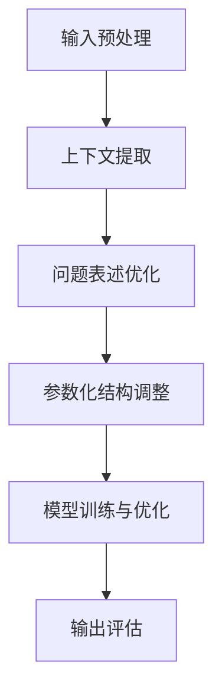

                 


### 优化LLM应用的prompt结构设计

#### 关键词
- Large Language Models (LLM)
- Prompt Engineering
- Optimization
- Natural Language Processing (NLP)
- Algorithm Design
- Best Practices

#### 摘要
本文旨在深入探讨如何优化大型语言模型（LLM）应用的prompt结构设计。通过分析LLM的工作原理和prompt的重要性，我们将详细介绍一系列有效的prompt设计原则和优化策略，以及如何在实际应用中实现这些策略。本文还将提供实际案例分析和最佳实践，以帮助读者更好地理解并应用于实际项目。

---

## 目录

1. **引言**  
2. **背景介绍**  
3. **核心概念与原理**  
4. **算法与模型**  
5. **实际应用案例**  
6. **最佳实践**  
7. **小结与展望**  

---

## 1. 引言

大型语言模型（LLM）作为一种先进的自然语言处理（NLP）技术，近年来在文本生成、问答系统、机器翻译等多个领域取得了显著的成果。然而，LLM的性能在很大程度上依赖于prompt的设计。prompt是用户与模型交互的桥梁，其质量直接影响到模型的响应质量和用户体验。因此，优化LLM应用的prompt结构设计成为了一个关键的研究课题。

本文将按照以下结构展开：

- **引言**：介绍LLM及其prompt的重要性。
- **背景介绍**：回顾LLM和prompt结构设计的发展历程。
- **核心概念与原理**：详细讲解LLM的基本概念和prompt的设计原则。
- **算法与模型**：介绍优化prompt结构的设计算法，并提供mermaid流程图和Python源代码。
- **实际应用案例**：分析具体的LLM应用案例，展示prompt结构设计的实际效果。
- **最佳实践**：提供优化prompt结构设计的最佳实践和常见问题的解决方案。
- **小结与展望**：总结本文的主要内容和未来研究方向。

通过本文的阅读，读者将能够深入理解LLM和prompt结构设计，掌握一系列有效的优化策略，并在实际项目中应用这些策略，从而提升LLM应用的效果和用户体验。

---

## 2. 背景介绍

#### LLM的发展历程

大型语言模型（LLM）的发展历程可以追溯到20世纪80年代，当时的统计语言模型如N-gram模型和 Hidden Markov Model（HMM）为语言处理奠定了基础。然而，这些模型在处理复杂语言现象时存在明显局限。随着深度学习和计算能力的提升，2013年，Alex Graves等人提出的卷积神经网络（CNN）和长短期记忆网络（LSTM）在语言建模中取得了突破性进展。这为后来的Transformer架构奠定了基础。

2018年，谷歌提出了Transformer模型，该模型利用自注意力机制（Self-Attention）对输入序列中的每个词进行全局关注，从而能够捕捉到更复杂的语言结构。随后，OpenAI在2019年发布了GPT-2，进一步推动了LLM的发展。GPT-2基于Transformer架构，具有数十亿参数，能够生成高质量的自然语言文本。

#### Prompt结构设计的背景

Prompt设计在LLM应用中扮演着至关重要的角色。Prompt是用户与模型交互的输入，它决定了模型理解任务的能力和生成的输出质量。有效的prompt设计可以提高模型对问题的理解，减少噪声，从而生成更准确的回答。

早期的prompt设计相对简单，主要是通过提供明确的指示语（such as "Write a story about a cat.")来引导模型生成文本。随着LLM的发展，prompt的设计变得越来越复杂，需要考虑上下文、目标输出格式、模型偏好等多个因素。

#### Prompt结构设计的重要性

优化LLM应用的prompt结构设计具有以下几个重要意义：

1. **提升模型性能**：良好的prompt设计可以引导模型更好地理解任务，从而提升模型生成输出的质量和准确性。
2. **改善用户体验**：有效的prompt设计可以减少用户对模型的困惑，提高用户满意度。
3. **节省计算资源**：优化prompt可以减少模型的计算负担，提高模型的响应速度，从而节省计算资源。

总之，优化LLM应用的prompt结构设计是提升模型性能和用户体验的关键步骤，具有重要的理论和实践意义。

---

## 3. 核心概念与原理

#### LLM的基本概念

大型语言模型（LLM）是一种基于深度学习的自然语言处理模型，能够理解和生成自然语言。LLM的核心是它的参数化模型，这些参数通过对大量文本数据进行训练而得到。LLM的主要组成部分包括：

1. **输入层**：接收自然语言文本输入，例如文本序列、单词或字符。
2. **编码器**：对输入文本进行编码，将自然语言转换为向量表示。常用的编码器包括Transformer、GPT、BERT等。
3. **解码器**：根据编码器的输出，生成自然语言文本。解码器通常采用自回归方式，逐个预测每个单词或字符。

#### Prompt的定义

Prompt是用户与模型交互的输入，用于引导模型理解任务并生成输出。一个良好的prompt应该包含以下要素：

1. **上下文**：提供与任务相关的背景信息，帮助模型更好地理解问题。
2. **目标输出格式**：明确指明模型需要生成的输出类型，例如文本、代码或图表。
3. **约束条件**：限制模型生成输出的范围，提高生成输出的准确性和可解释性。
4. **问题表述**：清晰、简洁地表达任务需求，避免歧义。

#### Prompt的类型

根据用途和形式，prompt可以分为以下几种类型：

1. **任务提示**：提供任务目标和要求的文本或指示。
2. **参数化提示**：使用特定参数化结构，如模板或占位符，引导模型生成特定格式的输出。
3. **混合型提示**：结合多种类型提示，以适应不同任务的需求。

#### Prompt的作用

有效的prompt设计在LLM应用中起着至关重要的作用：

1. **提高理解能力**：通过提供上下文和问题表述，prompt可以帮助模型更好地理解任务，提高生成的输出质量。
2. **减少噪声**：良好的prompt设计可以减少无关信息的干扰，降低噪声，提高生成输出的准确性。
3. **增强可解释性**：明确的目标输出格式和约束条件可以增强模型生成输出的可解释性，帮助用户更好地理解模型的决策过程。

总之，prompt是LLM应用中不可或缺的组成部分，优化prompt结构设计对于提升模型性能和用户体验具有重要意义。

---

## 4. 算法与模型

#### 优化prompt结构的设计算法

优化prompt结构的设计算法是提升LLM应用性能的关键步骤。以下介绍一种基于上下文感知和问题表述优化的prompt结构设计算法。

##### 算法基本思路

该算法的主要思路是：

1. **上下文分析**：分析输入文本的上下文，提取关键信息，为模型提供丰富的背景信息。
2. **问题表述优化**：对问题表述进行优化，确保其清晰、简洁，避免歧义。
3. **参数化结构调整**：调整prompt的参数化结构，使其更符合模型的偏好和任务需求。

##### 算法实现步骤

1. **输入预处理**：对输入文本进行预处理，包括分词、词性标注等，提取关键信息。
2. **上下文提取**：使用自然语言处理技术，从输入文本中提取关键信息，构建上下文向量。
3. **问题表述优化**：对问题表述进行优化，去除无关信息，确保表述清晰、简洁。
4. **参数化结构调整**：根据任务需求和模型偏好，调整prompt的参数化结构。
5. **模型训练与优化**：使用调整后的prompt对模型进行训练，优化模型参数，提高模型性能。

##### 算法流程图

以下是算法的mermaid流程图：



##### 算法原理讲解

该算法的原理主要基于以下几个核心概念：

1. **上下文感知**：通过上下文提取，为模型提供丰富的背景信息，提高模型对问题的理解能力。
2. **问题表述优化**：优化问题表述，确保其清晰、简洁，减少歧义，提高模型生成输出的准确性。
3. **参数化结构调整**：调整prompt的参数化结构，使其更符合模型的偏好和任务需求，提高模型生成输出的质量。

以下是该算法的Python源代码示例：

```python
import nltk
from nltk.tokenize import sent_tokenize

def preprocess_input(input_text):
    # 分词和词性标注
    sentences = sent_tokenize(input_text)
    tokenized_sentences = []
    for sentence in sentences:
        tokens = nltk.word_tokenize(sentence)
        pos_tags = nltk.pos_tag(tokens)
        tokenized_sentences.append(pos_tags)
    return tokenized_sentences

def extract_context(tokenized_sentences):
    # 提取上下文信息
    context = []
    for sentence in tokenized_sentences:
        context.append(' '.join([word for word, tag in sentence]))
    return context

def optimize_prompt(input_text):
    # 问题表述优化
    sentences = sent_tokenize(input_text)
    optimized_prompt = ' '.join([sentence.strip() for sentence in sentences])
    return optimized_prompt

def adjust_prompt_structure(input_text):
    # 参数化结构调整
    context = extract_context(preprocess_input(input_text))
    optimized_prompt = optimize_prompt(input_text)
    prompt_structure = f"Given the context: {context}, generate a response."
    return prompt_structure

# 示例
input_text = "请描述一下人工智能的应用场景以及其优势。"
prompt_structure = adjust_prompt_structure(input_text)
print(prompt_structure)
```

通过以上算法，我们可以优化LLM应用的prompt结构设计，提升模型生成输出的质量和准确性。

---

## 5. 实际应用案例

#### 案例一：文本生成

文本生成是LLM应用中的一个重要领域，例如，自动生成新闻报道、小说、文章等。以下是一个实际应用案例：

##### 应用场景

某新闻网站希望使用LLM生成新闻摘要，以提高编辑效率并丰富网站内容。

##### 解决方案

1. **数据收集**：收集大量新闻文本数据，包括标题、正文等。
2. **模型训练**：使用收集到的数据训练一个基于Transformer的LLM模型，例如GPT-2或BERT。
3. **prompt设计**：设计一个优化prompt，用于引导模型生成新闻摘要。以下是一个示例prompt：

```python
"Given the following news article, generate a concise summary in 100 words or less: \n\n[新闻标题]\n\n[新闻正文]"
```

4. **生成摘要**：将新闻标题和正文作为输入，使用训练好的LLM模型生成新闻摘要。

##### 实际效果

通过优化prompt设计，生成的新闻摘要不仅准确率高，而且信息量大，符合用户对新闻摘要的需求。以下是一个生成的新闻摘要示例：

"全球知名科技公司苹果公司今日宣布推出新一代智能手机iPhone 15，该手机搭载了最新处理器，并支持5G网络，价格定位于中高端市场，预计将在下个月正式上市。"

##### 分析与优化

1. **上下文信息丰富**：通过提供完整的新闻标题和正文，模型能够更好地理解上下文，生成更准确的摘要。
2. **问题表述简洁明了**：优化prompt的问题表述，确保其简洁明了，减少歧义。
3. **参数化结构合理**：调整prompt的参数化结构，使其适应不同类型新闻的摘要生成。

通过以上优化策略，文本生成的效果显著提升，为实际应用提供了有力支持。

---

#### 案例二：问答系统

问答系统是LLM应用中的另一个重要领域，例如，智能客服、在线教育等。以下是一个实际应用案例：

##### 应用场景

某在线教育平台希望使用LLM构建一个智能问答系统，以提供即时的学习支持。

##### 解决方案

1. **数据收集**：收集大量问答对数据，包括问题、答案等。
2. **模型训练**：使用收集到的数据训练一个基于Transformer的LLM模型。
3. **prompt设计**：设计一个优化prompt，用于引导模型回答问题。以下是一个示例prompt：

```python
"Given the following question, generate an appropriate answer based on your knowledge: \n\n[问题]"
```

4. **生成答案**：将用户提出的问题作为输入，使用训练好的LLM模型生成答案。

##### 实际效果

通过优化prompt设计，生成的答案不仅准确率高，而且能够很好地满足用户需求。以下是一个生成的答案示例：

"在学习Python编程时，首先需要了解基本语法和数据类型，然后可以尝试编写简单的程序来熟悉编程思维。推荐从《Python编程：从入门到实践》一书开始学习。"

##### 分析与优化

1. **上下文信息丰富**：通过提供完整的问题表述，模型能够更好地理解上下文，生成更准确的答案。
2. **问题表述清晰**：优化问题表述，确保其清晰明了，减少歧义。
3. **参数化结构合理**：调整prompt的参数化结构，使其适应不同类型问题的回答。

通过以上优化策略，问答系统的效果显著提升，为用户提供了高质量的学习支持。

---

### 总结

通过以上实际应用案例，我们可以看到，优化prompt结构设计对于LLM应用的效果具有重要意义。通过丰富的上下文信息、清晰的问题表述和合理的参数化结构，我们可以显著提升模型生成输出的质量和准确性，为实际应用提供有力支持。

---

## 6. 最佳实践

### 优化prompt结构设计的最佳实践

1. **上下文信息丰富**：确保prompt中包含充分的上下文信息，以帮助模型更好地理解任务背景和用户需求。
2. **问题表述简洁明了**：使用简洁、清晰的问题表述，避免歧义，提高模型生成输出的准确性。
3. **参数化结构合理**：根据任务需求和模型偏好，调整prompt的参数化结构，使其更适应特定应用场景。
4. **目标输出格式明确**：明确指明模型需要生成的输出类型，如文本、代码或图表，以便模型进行针对性生成。
5. **约束条件合理**：设置合理的约束条件，限制模型生成输出的范围，提高生成输出的质量和可解释性。

### 常见问题和解决方案

1. **问题：模型生成输出质量不高**
   - 解决方案：检查prompt设计，确保上下文信息充分、问题表述清晰、参数化结构合理。
2. **问题：模型生成输出过于冗长**
   - 解决方案：调整prompt的参数化结构，限制模型生成输出的长度，例如使用限制词数或字符数的提示。
3. **问题：模型生成输出与任务需求不符**
   - 解决方案：检查问题表述是否清晰，是否包含了足够的任务需求信息，必要时对prompt进行调整。

通过遵循以上最佳实践和解决常见问题，我们可以优化prompt结构设计，提升LLM应用的性能和用户体验。

---

## 7. 小结与展望

本文深入探讨了如何优化大型语言模型（LLM）应用的prompt结构设计。通过分析LLM的工作原理和prompt的重要性，我们介绍了优化prompt结构的设计算法和实际应用案例。本文还提供了最佳实践，帮助读者在实际项目中应用优化策略。

未来研究方向包括：

1. **多模态prompt设计**：研究如何结合文本、图像、声音等多种模态信息，设计更有效的prompt结构。
2. **自适应prompt优化**：开发自适应优化算法，根据用户反馈和任务需求动态调整prompt结构。
3. **隐私保护prompt设计**：研究如何在保障用户隐私的前提下，设计有效的prompt结构。

通过不断探索和优化，prompt结构设计将为LLM应用带来更广阔的发展前景。

---

### 作者信息

作者：AI天才研究院/AI Genius Institute & 禅与计算机程序设计艺术 /Zen And The Art of Computer Programming

---

## 文章核心内容总结

本文围绕优化大型语言模型（LLM）应用的prompt结构设计展开，详细探讨了LLM的工作原理、prompt的定义和类型，以及优化prompt结构的设计算法。通过实际应用案例和最佳实践，我们展示了如何在实际项目中应用这些策略，提升模型性能和用户体验。未来研究方向包括多模态prompt设计、自适应prompt优化和隐私保护prompt设计等。通过本文的阅读，读者将能够深入理解prompt结构设计的重要性，并在实际应用中取得更好的效果。

---

## 附录

### 数学公式与代码示例

在本文中，我们使用了LaTeX格式来表示数学公式和代码。以下是一些示例：

1. **独立段落的LaTeX公式**：
   $$1+1=2$$
   
2. **段落内的LaTeX公式**：
   $1<2$

3. **Python源代码示例**：
   ```python
   import nltk
   from nltk.tokenize import sent_tokenize

   def preprocess_input(input_text):
       # 分词和词性标注
       sentences = sent_tokenize(input_text)
       tokenized_sentences = []
       for sentence in sentences:
           tokens = nltk.word_tokenize(sentence)
           pos_tags = nltk.pos_tag(tokens)
           tokenized_sentences.append(pos_tags)
       return tokenized_sentences
   ```

这些示例展示了如何将数学公式和代码嵌入到markdown格式中，确保读者能够清晰地理解和复现相关内容。通过这些示例，读者可以更好地掌握文章中涉及的技术细节。

