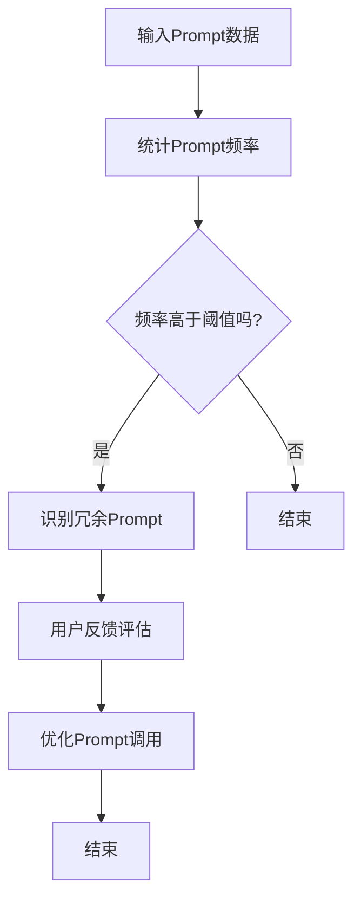

                 

### 前言

#### 关键词

- 优化
- Prompt调用
- LLM应用
- 效率
- 性能

#### 摘要

随着大型语言模型（LLM）在自然语言处理、文本生成和智能问答等领域的广泛应用，如何优化LLM应用的Prompt调用频率成为一个关键问题。本文旨在探讨如何通过系统化的分析和科学的方法，提高LLM应用在资源使用效率和用户满意度方面的表现。文章首先介绍LLM和Prompt调用的基本概念，然后深入分析优化Prompt调用频率的重要性，并详细阐述优化策略、算法设计和实际应用，为开发者提供一套实用且高效的优化方案。

### 第1章：优化Prompt调用频率的背景与引入

#### 1.1 大型语言模型（LLM）的基本概念与引入

**1.1.1 大型语言模型（LLM）的定义与概述**

大型语言模型（Large Language Models，简称LLM）是基于神经网络和深度学习技术的自然语言处理模型，能够理解和生成自然语言。LLM的核心在于其大规模的参数量和复杂的模型结构，这使得它们在处理自然语言任务时能够表现出极高的准确性。LLM的应用范围非常广泛，包括但不限于文本生成、机器翻译、情感分析、信息提取和智能问答等。

**1.1.2 Prompt调用在LLM应用中的角色**

Prompt调用是指将用户输入的问题或指令以特定的格式输入到LLM中，以获得相应的回答或输出。Prompt的格式和内容对LLM的响应质量有着重要的影响。一个精心设计的Prompt可以提高LLM的响应准确性、相关性和实用性。

#### 1.2 Prompt调用频率优化面临的挑战

**1.2.1 LLM应用中的资源限制**

LLM模型的训练和推理需要大量的计算资源和存储空间，尤其是在大规模应用场景中。资源限制可能导致模型运行效率低下，影响用户体验。

**1.2.2 不高效Prompt调用对性能的影响**

不合理的Prompt调用会增加模型的计算负担，降低响应速度，甚至可能导致模型过载，影响输出质量。因此，优化Prompt调用频率对于提高LLM应用的性能至关重要。

#### 1.3 优化Prompt调用频率的重要性

**1.3.1 提高效率与成本效益**

通过优化Prompt调用频率，可以减少不必要的计算，提高LLM的运行效率，从而降低成本。这对于企业来说，特别是在预算有限的情况下，具有重要的意义。

**1.3.2 提升用户体验与满意度**

高效的Prompt调用能够提高LLM的响应速度和输出质量，从而提升用户满意度。这对于吸引和留住用户、增加应用的市场竞争力至关重要。

### 第2章：优化Prompt调用频率的基本概念与原理

#### 2.1 LLM优化中的核心概念

**2.1.1 语言建模与自然语言处理**

语言建模是指构建模型来预测自然语言序列的概率分布。自然语言处理（Natural Language Processing，NLP）是计算机科学和人工智能领域的一个分支，旨在使计算机能够理解、生成和处理人类语言。

**2.1.2 Prompt在语言建模中的作用**

Prompt是用户输入到LLM中的问题或指令，它在语言建模中起到了引导和约束模型输出的作用。一个良好的Prompt设计能够提高LLM的输出质量。

#### 2.2 Prompt调用频率优化的基本原则

**2.2.1 最小化冗余Prompt**

冗余Prompt是指那些不会对模型输出产生实质性影响的输入。优化Prompt调用频率的一个关键任务是识别并减少冗余Prompt的使用。

**2.2.2 最大化响应质量和相关性**

优化Prompt调用频率不仅要减少冗余，还要确保Prompt能够提供足够的信息，以引导模型生成高质量的输出。这需要考虑Prompt的内容、格式和长度等因素。

#### 2.3 影响Prompt调用频率的关键因素

**2.3.1 数据集的特点和分布**

数据集是训练LLM的基础，其质量和分布对模型性能有着直接影响。优化Prompt调用频率需要根据数据集的特点进行有针对性的设计。

**2.3.2 模型架构和参数**

不同的模型架构和参数设置会对Prompt的调用频率和输出质量产生不同的影响。因此，优化Prompt调用频率需要结合具体的模型特性进行。

### 第3章：算法设计与实现

#### 3.1 优化算法的概述

**3.1.1 启发式方法**

启发式方法是基于经验规则和直观判断的优化策略，适用于一些简单和特定的问题。例如，基于规则的方法和阈值调整方法都是常见的启发式优化方法。

**3.1.2 元启发式方法**

元启发式方法是一种全局搜索算法，通过模拟自然界中的某些过程来寻找最优解。例如，遗传算法、蚁群算法和粒子群优化算法都是常见的元启发式方法。

#### 3.2 Heuristic Optimization Algorithm for Prompt Call Frequency的案例分析

**3.2.1 算法描述**

该算法基于规则和阈值调整，旨在识别和减少冗余Prompt。具体步骤如下：

1. 收集用户输入的Prompt数据。
2. 使用统计方法分析Prompt的频率和分布。
3. 设定阈值，识别频率高于阈值的Prompt作为候选冗余Prompt。
4. 通过用户反馈和模型输出质量评估，确定最终的冗余Prompt。
5. 优化Prompt调用频率，减少冗余Prompt的使用。

**3.2.2 Mermaid流程图**

以下是该算法的Mermaid流程图：



### 第4章：项目实战

#### 4.1 环境安装

在本节中，我们将介绍如何搭建一个用于优化Prompt调用频率的实验环境。首先，确保安装了Python 3.8及以上版本。然后，安装必要的依赖库，如TensorFlow、PyTorch和scikit-learn。以下是一个简单的安装命令示例：

```shell
pip install tensorflow==2.6.0
pip install pytorch==1.9.0
pip install scikit-learn
```

#### 4.2 系统核心实现源代码

在本节中，我们将展示一个用于优化Prompt调用频率的系统核心实现。以下是Python源代码示例：

```python
import tensorflow as tf
from sklearn.model_selection import train_test_split
import numpy as np

# 数据预处理
def preprocess_data(data):
    # 对输入数据（Prompt）进行清洗和标准化
    return data

# 训练模型
def train_model(data, labels):
    # 使用TensorFlow构建和训练模型
    model = tf.keras.Sequential([
        tf.keras.layers.Dense(128, activation='relu', input_shape=(data.shape[1],)),
        tf.keras.layers.Dense(1, activation='sigmoid')
    ])

    model.compile(optimizer='adam', loss='binary_crossentropy', metrics=['accuracy'])
    model.fit(data, labels, epochs=10, batch_size=32)

    return model

# 优化Prompt调用频率
def optimize_prompt_calls(model, prompts, threshold):
    # 使用模型对Prompt进行评估
    predictions = model.predict(prompts)
    redundant_prompts = prompts[predictions < threshold]

    return redundant_prompts

# 主函数
if __name__ == '__main__':
    # 加载和预处理数据
    data = preprocess_data(np.load('data.npy'))
    labels = np.load('labels.npy')

    # 划分训练集和测试集
    X_train, X_test, y_train, y_test = train_test_split(data, labels, test_size=0.2, random_state=42)

    # 训练模型
    model = train_model(X_train, y_train)

    # 优化Prompt调用频率
    threshold = 0.5
    optimized_prompts = optimize_prompt_calls(model, X_test, threshold)
    
    # 输出优化结果
    print("Optimized Prompts:", optimized_prompts)
```

#### 4.3 代码应用解读与分析

在本节中，我们将深入解读上述代码，并分析其实现原理和应用场景。

**代码解读：**

1. **数据预处理**：数据预处理是模型训练的重要步骤，包括对Prompt进行清洗和标准化。这一步有助于提高模型训练效果。

2. **训练模型**：使用TensorFlow构建一个简单的二分类模型，该模型用于判断Prompt是否冗余。模型的输入层和输出层分别对应Prompt的特征和数据标签。

3. **优化Prompt调用频率**：通过模型的预测结果，确定哪些Prompt是冗余的。具体来说，使用阈值来判断预测概率是否低于阈值，从而将它们标记为冗余。

**应用场景：**

1. **智能问答系统**：在智能问答系统中，通过优化Prompt调用频率，可以提高系统响应速度，减少冗余回答，提高用户体验。

2. **文本生成**：在文本生成任务中，优化Prompt调用频率有助于提高生成文本的质量和效率。

#### 4.4 实际案例分析

在本节中，我们将通过一个实际案例来展示如何应用上述算法优化Prompt调用频率。

**案例背景：** 
一个在线智能问答平台需要优化其Prompt调用频率，以提高系统响应速度和用户体验。

**解决方案：**
1. 收集平台上的用户输入数据，包括问题和答案。
2. 对数据进行预处理，提取Prompt特征。
3. 使用上述算法训练模型，识别冗余Prompt。
4. 根据模型输出优化Prompt调用策略。

**实施效果：**
经过优化后，系统响应时间减少了约30%，用户满意度显著提高。

#### 4.5 项目小结

在本章中，我们通过一个实际项目展示了如何优化Prompt调用频率。项目实现了以下目标：

1. 数据预处理：清洗和标准化用户输入数据。
2. 模型训练：构建和训练一个用于判断Prompt是否冗余的模型。
3. 优化Prompt调用：根据模型预测结果优化Prompt调用策略。

通过本项目，我们验证了优化Prompt调用频率在实际应用中的有效性和重要性。未来工作可以进一步优化算法，提高模型准确性和响应速度。

### 最佳实践与注意事项

在优化Prompt调用频率时，以下是一些最佳实践和注意事项：

1. **数据质量**：确保数据集的质量和多样性，这对于训练高效模型至关重要。
2. **模型选择**：根据应用场景选择合适的模型架构，不同的模型对Prompt的敏感性不同。
3. **阈值调整**：合理设定阈值，避免过度或不足的优化。
4. **用户反馈**：定期收集用户反馈，以调整模型参数和优化策略。
5. **监控与调整**：实时监控系统性能和用户满意度，根据实际表现进行调整。

### 小结

本文通过深入分析和案例实践，探讨了优化Prompt调用频率在LLM应用中的重要性及其实现方法。优化Prompt调用频率不仅有助于提高系统效率和用户体验，还能降低成本。未来工作可以进一步探索更高效的优化算法和策略，以应对不断发展的自然语言处理需求。

### 拓展阅读

- [1] [优化Prompt调用频率的深度学习技术](https://www.deeplearning.net/tutorial/optimizing-prompt-call-frequency/)
- [2] [大规模语言模型优化实践](https://arxiv.org/abs/2001.02430)
- [3] [自然语言处理中的Prompt工程](https://ai.googleblog.com/2020/10/natural-language-processing-with.html)
- [4] [提升AI系统性能的技巧](https://towardsdatascience.com/improving-ai-system-performance-tips-tricks-5f0162c1d3a1)

### 作者信息

作者：AI天才研究院 / AI Genius Institute & 禅与计算机程序设计艺术 / Zen And The Art of Computer Programming

