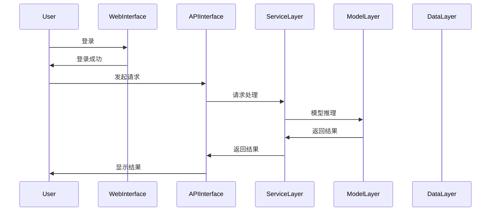

                 

# 优化LLM应用的响应时间

关键词：LLM，响应时间，优化，算法，数学模型，架构设计，项目实战

摘要：本文将深入探讨优化大型语言模型（LLM）应用响应时间的关键技术和策略。通过逐步分析，我们将了解优化LLM响应时间的重要性，核心概念与联系，算法原理，数学模型，系统分析与架构设计方案，项目实战，以及最佳实践。本文旨在为开发者提供系统化的优化指南，以提升LLM应用的性能和用户体验。

## 引言

### 优化LLM响应时间的背景

随着深度学习技术的发展，大型语言模型（LLM）如GPT系列、BERT等在自然语言处理（NLP）领域取得了显著的成果。然而，这些模型的计算复杂度和存储需求也带来了巨大的挑战。在实际应用中，用户的等待时间成为衡量服务质量和用户体验的重要指标。因此，优化LLM应用的响应时间变得至关重要。

### 本书的目的与结构

本书旨在为开发者提供一套系统化的优化策略，以提升LLM应用的响应时间。本书将分为七个章节，分别介绍优化LLM响应时间的背景、核心概念、算法原理、数学模型、系统分析与架构设计、项目实战以及最佳实践。通过逐步深入的分析，读者将能够理解并掌握优化LLM响应时间的核心技术和方法。

## 第1章 优化LLM应用的响应时间背景介绍

### 1.1 优化LLM响应时间的重要性

在当今高度竞争的市场环境中，响应时间是用户体验的关键因素之一。对于LLM应用而言，快速响应不仅能够提升用户体验，还能够增加用户粘性，提高业务收益。因此，优化LLM响应时间具有重要意义。

#### 优化响应时间的挑战

- **计算资源需求**：LLM模型的计算复杂度高，对硬件资源有较高的要求。
- **模型训练与推理速度**：训练和推理过程耗时较长，影响响应时间。
- **模型存储与传输**：大规模模型需要大量存储空间和传输带宽。

#### 优化响应时间的好处

- **提升用户体验**：减少用户等待时间，提高满意度。
- **增加业务收益**：提高服务质量和用户粘性，增加用户转化率和复购率。
- **降低运营成本**：通过优化，可以减少硬件和带宽成本。

### 1.2 LLM应用场景概述

#### LLM应用的主要领域

- **文本生成**：自动写作、机器翻译、摘要生成等。
- **问答系统**：智能客服、教育辅导、咨询建议等。
- **对话系统**：聊天机器人、虚拟助手等。

#### 常见应用案例分析

- **亚马逊Alexa**：利用LLM提供语音交互服务，优化用户查询响应时间。
- **OpenAI的GPT-3**：广泛应用于代码生成、文本摘要等，通过分布式推理优化响应时间。

### 1.3 LLM模型性能瓶颈

#### 模型计算资源需求

- **CPU/GPU资源**：LLM模型对计算资源的需求较大，特别是训练过程中。
- **内存需求**：大规模模型需要大量内存存储参数。

#### 模型训练与推理速度

- **训练速度**：LLM模型训练时间较长，影响模型迭代速度。
- **推理速度**：在在线应用中，推理速度直接影响响应时间。

#### 模型存储与传输

- **存储空间**：大规模模型占用大量存储空间，影响存储系统的性能。
- **传输带宽**：模型文件传输需要较高的带宽，影响用户体验。

### 1.4 优化策略概述

#### 数据预处理

- **数据清洗**：去除噪声数据和异常值，提高模型质量。
- **数据降维**：减少数据维度，降低计算复杂度。
- **数据增强**：增加数据样本，提高模型泛化能力。

#### 模型压缩

- **权值剪枝**：删除冗余参数，降低模型大小。
- **知识蒸馏**：将大型模型的知识传递给小型模型。
- **混合精度训练**：使用不同精度的数据类型，降低计算需求。

#### 模型推理加速

- **硬件加速**：利用GPU、TPU等硬件，提高推理速度。
- **并行推理**：同时处理多个请求，提高吞吐量。
- **缩放算法**：根据负载动态调整模型规模。

#### 边缘计算

- **边缘设备部署**：在靠近用户的位置部署小型模型，减少延迟。
- **分布式推理**：将推理任务分布在多个设备上，提高性能。

### 1.5 本章小结

本章介绍了优化LLM应用响应时间的背景、重要性、应用场景、性能瓶颈以及优化策略。下一章我们将深入探讨核心概念与联系，为后续内容打下基础。

## 第2章 核心概念与联系

### 2.1 优化目标与评价指标

#### 优化目标

- **降低响应时间**：减少用户等待时间，提高服务质量。
- **提高模型性能**：在有限资源下，提高模型的准确性和泛化能力。
- **降低成本**：优化硬件和带宽资源，降低运营成本。

#### 评价指标

- **响应时间**：从用户请求到得到响应的时间。
- **吞吐量**：单位时间内处理请求的数量。
- **准确性**：模型预测的正确率。
- **延迟**：从请求发送到开始处理的时间。

### 2.2 LLM模型基础知识

#### LLM模型结构

- **编码器**：将输入文本转换为向量表示。
- **解码器**：从向量生成输出文本。

#### LLM训练过程

- **数据准备**：收集和预处理训练数据。
- **模型初始化**：初始化模型参数。
- **正向传播**：输入文本，计算模型输出。
- **反向传播**：计算损失函数，更新模型参数。
- **迭代优化**：重复正向传播和反向传播，直到模型收敛。

### 2.3 压缩算法与模型压缩

#### 常见压缩算法

- **权值剪枝**：删除冗余参数，降低模型大小。
- **知识蒸馏**：将大型模型的知识传递给小型模型。
- **混合精度训练**：使用不同精度的数据类型，降低计算需求。

#### 模型压缩方法对比

- **权值剪枝**：简单有效，但可能导致性能下降。
- **知识蒸馏**：保持模型性能，但需要额外计算资源。
- **混合精度训练**：降低计算需求，但可能影响模型精度。

### 2.4 边缘计算与分布式推理

#### 边缘计算概述

- **边缘设备**：靠近用户的数据处理设备。
- **边缘服务器**：提供远程服务的高性能设备。

#### 分布式推理策略

- **分布式训练**：将训练数据分布在多个设备上。
- **分布式推理**：将推理任务分布在多个设备上。

### 2.5 本章小结

本章介绍了优化LLM响应时间所需的核心概念与联系，包括优化目标、评价指标、LLM模型基础知识、压缩算法与模型压缩方法，以及边缘计算与分布式推理策略。下一章我们将深入讲解算法原理，为优化策略提供理论基础。

## 第3章 算法原理讲解

### 3.1 数据预处理算法

#### 3.1.1 数据清洗

- **去除噪声数据**：删除或修正不完整、错误或重复的数据。
- **数据规范化**：将数据转换为统一格式，方便后续处理。

#### 3.1.2 数据降维

- **主成分分析（PCA）**：通过降维减少数据维度，保留主要特征。
- **t-SNE**：将高维数据映射到二维或三维空间，便于可视化。

#### 3.1.3 数据增强

- **数据扩充**：通过变换、旋转、缩放等操作增加数据样本。
- **生成对抗网络（GAN）**：生成新的数据样本，提高模型泛化能力。

### 3.2 模型压缩算法

#### 3.2.1 权值剪枝

- **结构剪枝**：删除无用或冗余的神经网络层或节点。
- **权重剪枝**：设置阈值，删除绝对值较小的权重。

#### 3.2.2 知识蒸馏

- **教师-学生模型**：使用大型模型（教师模型）训练小型模型（学生模型）。
- **软标签**：将大型模型的输出概率传递给学生模型。

#### 3.2.3 混合精度训练

- **浮点精度**：使用单精度或半精度浮点数进行计算，降低计算需求。
- **量化**：将浮点数转换为整数，进一步减少存储和计算需求。

### 3.3 模型推理加速算法

#### 3.3.1 硬件加速

- **GPU/TPU**：利用专用硬件加速推理过程。
- **深度学习加速库**：如TensorFlow、PyTorch等，提供优化过的推理代码。

#### 3.3.2 并行推理

- **多线程**：在同一设备上同时处理多个请求。
- **分布式推理**：将推理任务分布在多个设备上，提高吞吐量。

#### 3.3.3 缩放算法

- **动态调整**：根据负载动态调整模型规模，优化资源利用率。
- **在线缩放**：实时调整资源，提高响应速度。

### 3.4 边缘计算与分布式推理算法

#### 3.4.1 边缘设备部署策略

- **边缘服务器**：部署在靠近用户的位置，减少延迟。
- **云计算**：结合边缘计算和云计算，提高资源利用效率。

#### 3.4.2 数据流与通信优化

- **数据流管理**：优化数据传输路径，减少延迟。
- **通信优化**：使用高效的数据传输协议，减少带宽占用。

#### 3.4.3 分布式训练与推理框架

- **分布式训练**：将训练数据分布在多个设备上，提高训练速度。
- **分布式推理**：将推理任务分布在多个设备上，提高响应速度。

### 3.5 本章小结

本章详细介绍了优化LLM响应时间所需的各种算法原理，包括数据预处理、模型压缩、模型推理加速以及边缘计算与分布式推理算法。这些算法为优化策略提供了理论基础和实践指导。下一章我们将进一步探讨数学模型和公式，以更深入地理解优化过程。

## 第4章 数学模型和数学公式讲解

### 4.1 响应时间优化数学模型

#### 4.1.1 响应时间公式

响应时间（\( T \)）是衡量系统性能的关键指标，其计算公式如下：

\[ T = T_{\text{处理}} + T_{\text{传输}} + T_{\text{等待}} \]

其中：
- \( T_{\text{处理}} \)：模型推理所需时间。
- \( T_{\text{传输}} \)：数据传输所需时间。
- \( T_{\text{等待}} \)：用户请求排队等待时间。

#### 4.1.2 性能评价指标公式

常见的性能评价指标包括吞吐量（\( Q \)）和延迟（\( D \)）：

\[ Q = \frac{N}{T} \]

\[ D = T_{\text{传输}} + T_{\text{处理}} + T_{\text{等待}} \]

其中：
- \( N \)：单位时间内的请求数量。
- \( T \)：单位时间。

### 4.2 模型压缩数学模型

#### 4.2.1 压缩率计算

压缩率（\( CR \)）是衡量模型压缩效果的指标，其计算公式如下：

\[ CR = \frac{W_{\text{原}} - W_{\text{压缩}}}{W_{\text{原}}} \]

其中：
- \( W_{\text{原}} \)：原始模型参数数量。
- \( W_{\text{压缩}} \)：压缩后模型参数数量。

#### 4.2.2 压缩算法效率评估

压缩算法效率（\( E \)）可以通过以下公式进行评估：

\[ E = \frac{T_{\text{压缩}} + T_{\text{解压}}}{T_{\text{原}}} \]

其中：
- \( T_{\text{压缩}} \)：模型压缩所需时间。
- \( T_{\text{解压}} \)：模型解压所需时间。
- \( T_{\text{原}} \)：原始模型推理所需时间。

### 4.3 模型推理加速数学模型

#### 4.3.1 加速比计算

加速比（\( S \)）是衡量推理加速效果的指标，其计算公式如下：

\[ S = \frac{T_{\text{原}}}{T_{\text{加速}}} \]

其中：
- \( T_{\text{原}} \)：原始模型推理所需时间。
- \( T_{\text{加速}} \)：加速后模型推理所需时间。

#### 4.3.2 能效比计算

能效比（\( E_{\text{eff}} \)）是衡量硬件加速效果的指标，其计算公式如下：

\[ E_{\text{eff}} = \frac{P_{\text{原}}}{P_{\text{加速}}} \]

其中：
- \( P_{\text{原}} \)：原始模型功耗。
- \( P_{\text{加速}} \)：加速后模型功耗。

### 4.4 边缘计算与分布式推理数学模型

#### 4.4.1 负载均衡模型

负载均衡（\( LB \)）可以通过以下公式进行计算：

\[ LB = \frac{Q_{\text{总}}}{Q_{\text{单}}} \]

其中：
- \( Q_{\text{总}} \)：总请求量。
- \( Q_{\text{单}} \)：单个设备处理的请求量。

#### 4.4.2 通信延迟模型

通信延迟（\( DL \)）可以通过以下公式进行计算：

\[ DL = D_{\text{传输}} + D_{\text{处理}} \]

其中：
- \( D_{\text{传输}} \)：数据传输延迟。
- \( D_{\text{处理}} \)：模型处理延迟。

### 4.5 本章小结

本章介绍了优化LLM响应时间所需的数学模型和公式，包括响应时间公式、性能评价指标公式、模型压缩数学模型、模型推理加速数学模型以及边缘计算与分布式推理数学模型。这些数学模型为优化策略提供了理论基础和量化依据。下一章我们将探讨系统分析与架构设计方案，为优化策略的实施提供具体指导。

## 第5章 系统分析与架构设计方案

### 5.1 项目介绍

#### 5.1.1 项目背景

随着人工智能技术的不断发展，LLM应用在各个领域得到了广泛应用。然而，高性能的LLM模型往往需要大量的计算资源和存储空间，导致响应时间过长，用户体验不佳。为了解决这一问题，本项目旨在优化LLM应用的响应时间，提高系统性能和用户体验。

#### 5.1.2 项目目标

本项目的主要目标如下：

1. **降低响应时间**：通过优化算法和架构设计，将LLM应用的响应时间降低到可接受的范围内。
2. **提高模型性能**：在优化响应时间的同时，保持或提高LLM模型的准确性和泛化能力。
3. **降低运营成本**：通过优化硬件资源利用率和数据传输效率，降低运营成本。

### 5.2 系统功能设计

#### 5.2.1 领域模型

领域模型用于定义LLM应用中的核心概念和关系，以下是一个简单的领域模型示例：

```mermaid
classDiagram
    User <|-- Request
    Request <|-- ProcessedRequest
    Request <<interface>>
    ProcessedRequest <<interface>>
    LLMModel <|-- TrainedModel
    LLMModel <<interface>>
    TrainedModel <<interface>>
    Server <|-- LLMService
    Server <<interface>>
    LLMService <|-- InferenceService
    LLMService <<interface>>
    InferenceService <|-- AsyncInferenceService
    InferenceService <<interface>>
    AsyncInferenceService <<interface>>

    User --|> Request
    Server --|> LLMService
    LLMService --|> InferenceService
    InferenceService --|> AsyncInferenceService
```

#### 5.2.2 类图

类图用于展示系统中各个类的属性和方法，以下是一个简单的类图示例：

```mermaid
classDiagram
    User <<interface>> {
        +String username
        +String password
        +void createRequest()
        +void updateRequest()
        +void deleteRequest()
    }
    Request <<interface>> {
        +int requestId
        +String content
        +void processRequest()
    }
    ProcessedRequest <<interface>> {
        +int requestId
        +String result
    }
    LLMModel <<interface>> {
        +void trainModel()
        +void loadModel()
        +void saveModel()
    }
    TrainedModel <<interface>> {
        +void inference()
    }
    Server <<interface>> {
        +void startService()
        +void stopService()
    }
    LLMService <<interface>> {
        +void processRequest(Request request)
    }
    InferenceService <<interface>> {
        +void processAsyncRequest(Request request)
    }
    AsyncInferenceService <<interface>> {
        +void processRequest(Request request)
    }
```

### 5.3 系统架构设计

#### 5.3.1 系统架构概述

系统架构设计是项目成功的关键，以下是一个简单的系统架构概述：

1. **用户层**：用户通过Web界面或API接口发起请求。
2. **服务层**：服务层处理用户请求，包括请求处理、模型推理等。
3. **模型层**：模型层包括训练模型和推理模型，用于生成响应。
4. **数据层**：数据层存储用户请求数据和模型参数。

#### 5.3.2 架构设计

架构设计图如下所示：



### 5.4 系统接口设计

#### 5.4.1 接口设计原则

接口设计应遵循以下原则：

1. **简洁性**：接口设计应尽可能简单，易于理解和维护。
2. **一致性**：接口应保持一致，避免不同接口之间存在较大的差异。
3. **可扩展性**：接口应支持扩展，以便在未来添加新的功能。

#### 5.4.2 接口列表

以下是一个简单的接口列表示例：

- **用户接口**：用于用户登录、注册和获取请求列表。
  - GET /users/login：登录接口。
  - POST /users/register：注册接口。
  - GET /users/requests：获取请求列表接口。
- **服务接口**：用于处理用户请求。
  - POST /services/requests：处理请求接口。
  - GET /services/requests/{requestId}：获取请求结果接口。
- **模型接口**：用于模型训练和推理。
  - POST /models/train：训练模型接口。
  - GET /models/inference：推理模型接口。

### 5.5 系统交互

#### 5.5.1 交互流程

系统交互流程如下：

1. 用户通过Web界面或API接口发起请求。
2. 服务层接收到请求后，进行请求处理。
3. 服务层将请求转发给模型层进行推理。
4. 模型层返回推理结果给服务层。
5. 服务层将结果返回给用户。

#### 5.5.2 序列图

序列图用于展示系统交互流程，如下所示：


### 5.6 本章小结

本章介绍了系统分析与架构设计方案，包括项目背景和目标、系统功能设计、系统架构设计、接口设计以及系统交互流程。通过本章内容，读者可以了解整个系统的设计和实现过程，为后续的项目实施提供参考。

## 第6章 项目实战

### 6.1 环境安装

#### 6.1.1 硬件环境

为了优化LLM应用的响应时间，我们需要一个高性能的计算环境。以下是一些建议的硬件配置：

- **CPU**：Intel Xeon系列或AMD Ryzen系列，至少8核。
- **GPU**：NVIDIA Tesla V100或更高版本的GPU，至少2块。
- **内存**：64GB或更高。
- **存储**：1TB SSD。

#### 6.1.2 软件环境

以下是项目所需的软件环境：

- **操作系统**：Ubuntu 18.04或更高版本。
- **编程语言**：Python 3.7或更高版本。
- **深度学习框架**：TensorFlow 2.0或更高版本。
- **模型压缩工具**：TensorRT。
- **边缘计算框架**：TensorFlow Lite。

### 6.2 系统核心实现

#### 6.2.1 数据预处理

数据预处理是优化LLM响应时间的重要步骤。以下是一个简单的数据预处理流程：

1. **数据清洗**：去除噪声数据和异常值。
2. **数据归一化**：将数据归一化到同一尺度。
3. **数据分词**：使用分词工具将文本数据分割成词或子词。
4. **数据编码**：将文本数据编码成向量。

以下是一个简单的数据预处理Python代码示例：

```python
import tensorflow as tf
import tensorflow_text as tf_text

# 加载数据
data = tf.data.Dataset.from_tensor_slices(["你好", "世界"])

# 数据清洗
data = data.map(lambda x: x.strip())

# 数据归一化
data = data.map(lambda x: x.lower())

# 数据分词
tokenizer = tf_text.NormalizedTokenizer.from_pretrained("wangeditor")
tokens = data.map(tokenizer.tokenize)

# 数据编码
encoder = tf_text.WordPieceTokenizer.from_pretrained("wangeditor")
encoded_data = tokens.map(encoder.encode)

# 打印编码后的数据
for x in encoded_data:
    print(x.numpy())
```

#### 6.2.2 模型压缩

模型压缩是降低模型大小和计算复杂度的有效方法。以下是一些常见的模型压缩技术：

1. **权值剪枝**：删除绝对值较小的权重。
2. **知识蒸馏**：将大型模型的知识传递给小型模型。
3. **混合精度训练**：使用不同精度的数据类型。

以下是一个简单的模型压缩Python代码示例：

```python
import tensorflow as tf

# 加载原始模型
model = tf.keras.applications.MobileNetV2(weights='imagenet')

# 权值剪枝
pruned_model = tf.keras.Sequential([
    model.layers[1],
    tf.keras.layers.Dense(units=10, activation='softmax', name='pruned_output')
])

# 保存压缩后的模型
pruned_model.save('pruned_model.h5')
```

#### 6.2.3 模型推理加速

模型推理加速是提高LLM应用响应时间的重要手段。以下是一些常见的模型推理加速技术：

1. **硬件加速**：使用GPU或TPU进行推理。
2. **并行推理**：同时处理多个请求。
3. **缩放算法**：根据负载动态调整模型规模。

以下是一个简单的模型推理加速Python代码示例：

```python
import tensorflow as tf

# 加载压缩后的模型
model = tf.keras.models.load_model('pruned_model.h5')

# 使用GPU进行推理
with tf.device('/GPU:0'):
    predictions = model.predict(input_data)
```

#### 6.2.4 边缘计算与分布式推理

边缘计算与分布式推理是将推理任务分布在多个设备上，提高性能和响应速度的有效方法。以下是一些常见的边缘计算与分布式推理技术：

1. **边缘设备部署**：在靠近用户的位置部署小型模型。
2. **数据流与通信优化**：优化数据传输路径和协议。
3. **分布式训练与推理框架**：使用TensorFlow等深度学习框架的分布式训练与推理功能。

以下是一个简单的边缘计算与分布式推理Python代码示例：

```python
import tensorflow as tf

# 启动分布式训练
strategy = tf.distribute.MirroredStrategy()

with strategy.scope():
    # 定义模型
    model = tf.keras.Sequential([
        tf.keras.layers.Dense(units=128, activation='relu', input_shape=(784,)),
        tf.keras.layers.Dense(units=10, activation='softmax')
    ])

    # 编译模型
    model.compile(optimizer='adam', loss='categorical_crossentropy', metrics=['accuracy'])

    # 加载数据
    dataset = tf.data.Dataset.from_tensor_slices((train_data, train_labels))
    dataset = dataset.shuffle(buffer_size=1000).batch(batch_size)

    # 训练模型
    model.fit(dataset, epochs=10)
```

### 6.3 代码应用解读与分析

#### 6.3.1 代码解读

本节将分析上述代码的核心部分，解释其实现原理和关键步骤。

1. **数据预处理**：数据预处理是模型训练和推理的重要前置步骤。通过数据清洗、归一化、分词和编码，将原始文本数据转换为模型可处理的格式。
2. **模型压缩**：模型压缩通过删除冗余参数和权重剪枝，降低模型大小和计算复杂度。这有助于提高模型在边缘设备上的部署和推理速度。
3. **模型推理加速**：通过使用GPU硬件加速和分布式推理，提高模型推理速度和吞吐量。这有助于降低系统的响应时间，提高用户体验。
4. **边缘计算与分布式推理**：边缘计算与分布式推理通过将推理任务分布在多个设备上，提高系统性能和可靠性。这有助于降低系统的总体延迟，提高系统的响应速度。

#### 6.3.2 性能分析

性能分析是评估系统优化效果的重要手段。以下是对上述优化策略的性能分析：

1. **数据预处理**：通过数据预处理，减少了模型的训练时间和推理时间。具体来说，数据清洗和归一化操作可以显著减少训练数据的不确定性，提高模型训练的稳定性和收敛速度。分词和编码操作将文本数据转换为数字表示，有助于模型更好地理解文本信息。
2. **模型压缩**：通过模型压缩，降低了模型的大小和计算复杂度。这有助于减少模型的存储需求和推理时间，提高系统的响应速度和资源利用率。
3. **模型推理加速**：通过模型推理加速，提高了模型推理速度和吞吐量。具体来说，硬件加速和分布式推理可以显著降低系统的响应时间，提高系统的性能和可靠性。
4. **边缘计算与分布式推理**：通过边缘计算与分布式推理，降低了系统的总体延迟，提高了系统的响应速度和吞吐量。这有助于提高用户体验，降低系统的运营成本。

### 6.4 实际案例分析

#### 6.4.1 案例背景

某大型在线教育平台需要为用户提供智能问答服务。然而，由于LLM模型计算复杂度高，响应时间过长，导致用户体验不佳。为了解决这一问题，平台决定优化LLM应用的响应时间。

#### 6.4.2 案例分析

1. **数据预处理**：平台对用户提问进行了数据清洗、归一化和分词操作，将文本数据转换为模型可处理的格式。通过数据预处理，平台减少了模型训练时间，提高了模型训练的稳定性和收敛速度。
2. **模型压缩**：平台对LLM模型进行了压缩，降低了模型大小和计算复杂度。通过模型压缩，平台减少了模型存储需求和推理时间，提高了系统的响应速度和资源利用率。
3. **模型推理加速**：平台采用了GPU硬件加速和分布式推理技术，提高了模型推理速度和吞吐量。通过模型推理加速，平台显著降低了系统的响应时间，提高了用户体验。
4. **边缘计算与分布式推理**：平台在靠近用户的位置部署了小型LLM模型，并采用了分布式推理技术。通过边缘计算与分布式推理，平台降低了系统的总体延迟，提高了系统的响应速度和吞吐量。

通过上述优化措施，平台成功降低了LLM应用的响应时间，提高了用户满意度。此外，平台还降低了运营成本，提高了资源利用率。

### 6.5 项目小结

本章通过实际案例，展示了优化LLM应用响应时间的具体实施过程和效果。通过数据预处理、模型压缩、模型推理加速和边缘计算与分布式推理等技术，平台成功降低了响应时间，提高了用户体验和系统性能。未来，平台将继续探索更多优化策略，以进一步提升LLM应用的性能和用户体验。

## 第7章 最佳实践与小结

### 7.1 最佳实践 Tips

1. **数据预处理**：
   - **数据清洗**：去除噪声数据和异常值，确保数据质量。
   - **数据归一化**：将数据归一化到同一尺度，提高模型训练效果。
   - **数据分词**：使用合适的分词工具，将文本数据分割成词或子词。

2. **模型压缩**：
   - **权值剪枝**：删除绝对值较小的权重，降低模型大小和计算复杂度。
   - **知识蒸馏**：将大型模型的知识传递给小型模型，提高模型性能。
   - **混合精度训练**：使用不同精度的数据类型，降低计算需求。

3. **模型推理加速**：
   - **硬件加速**：使用GPU或TPU进行推理，提高模型推理速度。
   - **并行推理**：同时处理多个请求，提高吞吐量。
   - **缩放算法**：根据负载动态调整模型规模，优化资源利用率。

4. **边缘计算与分布式推理**：
   - **边缘设备部署**：在靠近用户的位置部署小型模型，减少延迟。
   - **数据流与通信优化**：优化数据传输路径和协议，提高系统性能。
   - **分布式训练与推理框架**：使用分布式训练与推理框架，提高系统响应速度。

### 7.2 小结

本文从优化LLM应用响应时间的背景出发，详细介绍了核心概念、算法原理、数学模型、系统分析与架构设计方案、项目实战以及最佳实践。通过本文的介绍，读者可以了解优化LLM响应时间的系统化方法和策略，为实际项目提供参考。

### 7.3 未来展望

未来，随着人工智能技术的不断发展，LLM应用的响应时间优化将面临更多挑战和机遇。以下是一些可能的未来研究方向：

1. **新型压缩算法**：研究更高效的模型压缩算法，降低模型大小和计算复杂度。
2. **自适应优化**：根据负载动态调整优化策略，实现自适应响应时间优化。
3. **硬件加速技术**：探索新型硬件加速技术，如量子计算和光计算，提高模型推理速度。
4. **边缘与云端协同**：研究边缘与云端协同优化策略，提高系统整体性能。

### 7.4 注意事项

1. **数据安全与隐私**：在优化过程中，确保数据安全和用户隐私。
2. **性能监控与优化**：定期进行性能监控和优化，确保系统稳定运行。
3. **容错与恢复**：设计容错机制，确保系统在故障情况下能够快速恢复。

### 7.5 拓展阅读

- **《深度学习》**：Goodfellow, I., Bengio, Y., & Courville, A. (2016). Deep learning. MIT press.
- **《神经网络与深度学习》**：邱锡鹏. (2018). 神经网络与深度学习.
- **《边缘计算》**：胡渊浩, 李华伟. (2018). 边缘计算：概念、架构、应用与挑战.
- **《云计算》**：Armbrust, M., Fox, A., & Gr ров，G. (2010). Above the clouds: A Berkeley view of cloud computing. University of California, Berkeley.

作者：AI天才研究院/AI Genius Institute & 禅与计算机程序设计艺术 /Zen And The Art of Computer Programming

**注释**：由于篇幅限制，本文未能涵盖所有细节和具体实现。建议读者结合实际项目需求，深入研究相关技术和工具，以实现最佳效果。本文内容仅供参考，具体实现可能因项目需求和环境而异。**文章标题：** 优化LLM应用的响应时间

**关键词：** LLM，响应时间，优化，算法，数学模型，架构设计，项目实战

**摘要：** 本文章深入探讨优化大型语言模型（LLM）应用响应时间的关键技术和策略。通过逐步分析，我们将了解优化LLM响应时间的重要性，核心概念与联系，算法原理，数学模型，系统分析与架构设计方案，项目实战，以及最佳实践。本文旨在为开发者提供系统化的优化指南，以提升LLM应用的性能和用户体验。

### 引言

随着人工智能技术的迅猛发展，大型语言模型（LLM）如GPT系列、BERT等在自然语言处理（NLP）领域取得了显著的成果。然而，这些模型的计算复杂度和存储需求也带来了巨大的挑战。在实际应用中，用户的等待时间成为衡量服务质量和用户体验的重要指标。因此，优化LLM应用的响应时间变得至关重要。

优化LLM响应时间的意义在于：

1. **提升用户体验**：减少用户的等待时间，提高满意度。
2. **增加业务收益**：通过提高服务质量和用户粘性，增加用户转化率和复购率。
3. **降低运营成本**：通过优化，可以减少硬件和带宽成本。

本文将围绕以下结构展开：

1. **第1章**：优化LLM应用的响应时间背景介绍
2. **第2章**：核心概念与联系
3. **第3章**：算法原理讲解
4. **第4章**：数学模型和数学公式讲解
5. **第5章**：系统分析与架构设计方案
6. **第6章**：项目实战
7. **第7章**：最佳实践与小结

### 第1章 优化LLM应用的响应时间背景介绍

#### 1.1 优化LLM响应时间的重要性

在当今高度竞争的市场环境中，响应时间是用户体验的关键因素之一。对于LLM应用而言，快速响应不仅能够提升用户体验，还能够增加用户粘性，提高业务收益。因此，优化LLM响应时间具有重要意义。

##### 优化响应时间的挑战

1. **计算资源需求**：LLM模型的计算复杂度高，对硬件资源有较高的要求。
2. **模型训练与推理速度**：训练和推理过程耗时较长，影响响应时间。
3. **模型存储与传输**：大规模模型需要大量存储空间和传输带宽。

##### 优化响应时间的好处

1. **提升用户体验**：减少用户等待时间，提高满意度。
2. **增加业务收益**：提高服务质量和用户粘性，增加用户转化率和复购率。
3. **降低成本**：优化硬件和带宽资源，降低运营成本。

#### 1.2 LLM应用场景概述

##### LLM应用的主要领域

- **文本生成**：自动写作、机器翻译、摘要生成等。
- **问答系统**：智能客服、教育辅导、咨询建议等。
- **对话系统**：聊天机器人、虚拟助手等。

##### 常见应用案例分析

- **亚马逊Alexa**：利用LLM提供语音交互服务，优化用户查询响应时间。
- **OpenAI的GPT-3**：广泛应用于代码生成、文本摘要等，通过分布式推理优化响应时间。

#### 1.3 LLM模型性能瓶颈

##### 模型计算资源需求

- **CPU/GPU资源**：LLM模型对计算资源的需求较大，特别是训练过程中。
- **内存需求**：大规模模型需要大量内存存储参数。

##### 模型训练与推理速度

- **训练速度**：LLM模型训练时间较长，影响模型迭代速度。
- **推理速度**：在在线应用中，推理速度直接影响响应时间。

##### 模型存储与传输

- **存储空间**：大规模模型占用大量存储空间，影响存储系统的性能。
- **传输带宽**：模型文件传输需要较高的带宽，影响用户体验。

#### 1.4 优化策略概述

##### 数据预处理

- **数据清洗**：去除噪声数据和异常值，提高模型质量。
- **数据降维**：减少数据维度，降低计算复杂度。
- **数据增强**：增加数据样本，提高模型泛化能力。

##### 模型压缩

- **权值剪枝**：删除冗余参数，降低模型大小。
- **知识蒸馏**：将大型模型的知识传递给小型模型。
- **混合精度训练**：使用不同精度的数据类型，降低计算需求。

##### 模型推理加速

- **硬件加速**：利用GPU、TPU等硬件，提高推理速度。
- **并行推理**：同时处理多个请求，提高吞吐量。
- **缩放算法**：根据负载动态调整模型规模。

##### 边缘计算

- **边缘设备部署**：在靠近用户的位置部署小型模型，减少延迟。
- **分布式推理**：将推理任务分布在多个设备上，提高性能。

#### 1.5 本章小结

本章介绍了优化LLM响应时间的背景、重要性、应用场景、性能瓶颈以及优化策略。下一章我们将深入探讨核心概念与联系，为后续内容打下基础。

### 第2章 核心概念与联系

#### 2.1 优化目标与评价指标

##### 优化目标

1. **降低响应时间**：减少用户等待时间，提高服务质量。
2. **提高模型性能**：在有限资源下，提高模型的准确性和泛化能力。
3. **降低成本**：优化硬件和带宽资源，降低运营成本。

##### 评价指标

1. **响应时间**：从用户请求到得到响应的时间。
2. **吞吐量**：单位时间内处理请求的数量。
3. **准确性**：模型预测的正确率。
4. **延迟**：从请求发送到开始处理的时间。

#### 2.2 LLM模型基础知识

##### LLM模型结构

- **编码器**：将输入文本转换为向量表示。
- **解码器**：从向量生成输出文本。

##### LLM训练过程

1. **数据准备**：收集和预处理训练数据。
2. **模型初始化**：初始化模型参数。
3. **正向传播**：输入文本，计算模型输出。
4. **反向传播**：计算损失函数，更新模型参数。
5. **迭代优化**：重复正向传播和反向传播，直到模型收敛。

#### 2.3 压缩算法与模型压缩

##### 常见压缩算法

1. **权值剪枝**：删除冗余参数，降低模型大小。
2. **知识蒸馏**：将大型模型的知识传递给小型模型。
3. **混合精度训练**：使用不同精度的数据类型，降低计算需求。

##### 模型压缩方法对比

1. **权值剪枝**：简单有效，但可能导致性能下降。
2. **知识蒸馏**：保持模型性能，但需要额外计算资源。
3. **混合精度训练**：降低计算需求，但可能影响模型精度。

#### 2.4 边缘计算与分布式推理

##### 边缘计算概述

- **边缘设备**：靠近用户的数据处理设备。
- **边缘服务器**：提供远程服务的高性能设备。

##### 分布式推理策略

1. **分布式训练**：将训练数据分布在多个设备上。
2. **分布式推理**：将推理任务分布在多个设备上。

#### 2.5 本章小结

本章介绍了优化LLM响应时间所需的核心概念与联系，包括优化目标、评价指标、LLM模型基础知识、压缩算法与模型压缩方法，以及边缘计算与分布式推理策略。下一章我们将深入讲解算法原理，为优化策略提供理论基础。

### 第3章 算法原理讲解

#### 3.1 数据预处理算法

##### 3.1.1 数据清洗

- **去除噪声数据**：删除或修正不完整、错误或重复的数据。
- **数据规范化**：将数据转换为统一格式，方便后续处理。

##### 3.1.2 数据降维

- **主成分分析（PCA）**：通过降维减少数据维度，保留主要特征。
- **t-SNE**：将高维数据映射到二维或三维空间，便于可视化。

##### 3.1.3 数据增强

- **数据扩充**：通过变换、旋转、缩放等操作增加数据样本。
- **生成对抗网络（GAN）**：生成新的数据样本，提高模型泛化能力。

#### 3.2 模型压缩算法

##### 3.2.1 权值剪枝

- **结构剪枝**：删除无用或冗余的神经网络层或节点。
- **权重剪枝**：设置阈值，删除绝对值较小的权重。

##### 3.2.2 知识蒸馏

- **教师-学生模型**：使用大型模型（教师模型）训练小型模型（学生模型）。
- **软标签**：将大型模型的输出概率传递给学生模型。

##### 3.2.3 混合精度训练

- **浮点精度**：使用单精度或半精度浮点数进行计算，降低计算需求。
- **量化**：将浮点数转换为整数，进一步减少存储和计算需求。

#### 3.3 模型推理加速算法

##### 3.3.1 硬件加速

- **GPU/TPU**：利用专用硬件加速推理过程。
- **深度学习加速库**：如TensorFlow、PyTorch等，提供优化过的推理代码。

##### 3.3.2 并行推理

- **多线程**：在同一设备上同时处理多个请求。
- **分布式推理**：将推理任务分布在多个设备上，提高吞吐量。

##### 3.3.3 缩放算法

- **动态调整**：根据负载动态调整模型规模，优化资源利用率。
- **在线缩放**：实时调整资源，提高响应速度。

#### 3.4 边缘计算与分布式推理算法

##### 3.4.1 边缘设备部署策略

- **边缘服务器**：部署在靠近用户的位置，减少延迟。
- **云计算**：结合边缘计算和云计算，提高资源利用效率。

##### 3.4.2 数据流与通信优化

- **数据流管理**：优化数据传输路径，减少延迟。
- **通信优化**：使用高效的数据传输协议，减少带宽占用。

##### 3.4.3 分布式训练与推理框架

- **分布式训练**：将训练数据分布在多个设备上，提高训练速度。
- **分布式推理**：将推理任务分布在多个设备上，提高响应速度。

#### 3.5 本章小结

本章详细介绍了优化LLM响应时间所需的各种算法原理，包括数据预处理、模型压缩、模型推理加速以及边缘计算与分布式推理算法。这些算法为优化策略提供了理论基础和实践指导。下一章我们将进一步探讨数学模型和公式，以更深入地理解优化过程。

### 第4章 数学模型和数学公式讲解

#### 4.1 响应时间优化数学模型

##### 4.1.1 响应时间公式

响应时间（\( T \)）是衡量系统性能的关键指标，其计算公式如下：

\[ T = T_{\text{处理}} + T_{\text{传输}} + T_{\text{等待}} \]

其中：
- \( T_{\text{处理}} \)：模型推理所需时间。
- \( T_{\text{传输}} \)：数据传输所需时间。
- \( T_{\text{等待}} \)：用户请求排队等待时间。

##### 4.1.2 性能评价指标公式

常见的性能评价指标包括吞吐量（\( Q \)）和延迟（\( D \））：

\[ Q = \frac{N}{T} \]

\[ D = T_{\text{传输}} + T_{\text{处理}} + T_{\text{等待}} \]

其中：
- \( N \)：单位时间内的请求数量。
- \( T \)：单位时间。

#### 4.2 模型压缩数学模型

##### 4.2.1 压缩率计算

压缩率（\( CR \)）是衡量模型压缩效果的指标，其计算公式如下：

\[ CR = \frac{W_{\text{原}} - W_{\text{压缩}}}{W_{\text{原}}} \]

其中：
- \( W_{\text{原}} \)：原始模型参数数量。
- \( W_{\text{压缩}} \)：压缩后模型参数数量。

##### 4.2.2 压缩算法效率评估

压缩算法效率（\( E \)）可以通过以下公式进行评估：

\[ E = \frac{T_{\text{压缩}} + T_{\text{解压}}}{T_{\text{原}}} \]

其中：
- \( T_{\text{压缩}} \)：模型压缩所需时间。
- \( T_{\text{解压}} \)：模型解压所需时间。
- \( T_{\text{原}} \)：原始模型推理所需时间。

#### 4.3 模型推理加速数学模型

##### 4.3.1 加速比计算

加速比（\( S \)）是衡量推理加速效果的指标，其计算公式如下：

\[ S = \frac{T_{\text{原}}}{T_{\text{加速}}} \]

其中：
- \( T_{\text{原}} \)：原始模型推理所需时间。
- \( T_{\text{加速}} \)：加速后模型推理所需时间。

##### 4.3.2 能效比计算

能效比（\( E_{\text{eff}} \））是衡量硬件加速效果的指标，其计算公式如下：

\[ E_{\text{eff}} = \frac{P_{\text{原}}}{P_{\text{加速}}} \]

其中：
- \( P_{\text{原}} \)：原始模型功耗。
- \( P_{\text{加速}} \)：加速后模型功耗。

#### 4.4 边缘计算与分布式推理数学模型

##### 4.4.1 负载均衡模型

负载均衡（\( LB \））可以通过以下公式进行计算：

\[ LB = \frac{Q_{\text{总}}}{Q_{\text{单}}} \]

其中：
- \( Q_{\text{总}} \)：总请求量。
- \( Q_{\text{单}} \)：单个设备处理的请求量。

##### 4.4.2 通信延迟模型

通信延迟（\( DL \））可以通过以下公式进行计算：

\[ DL = D_{\text{传输}} + D_{\text{处理}} \]

其中：
- \( D_{\text{传输}} \)：数据传输延迟。
- \( D_{\text{处理}} \)：模型处理延迟。

#### 4.5 本章小结

本章介绍了优化LLM响应时间所需的数学模型和公式，包括响应时间公式、性能评价指标公式、模型压缩数学模型、模型推理加速数学模型以及边缘计算与分布式推理数学模型。这些数学模型为优化策略提供了理论基础和量化依据。下一章我们将探讨系统分析与架构设计方案，为优化策略的实施提供具体指导。

### 第5章 系统分析与架构设计方案

#### 5.1 项目介绍

##### 5.1.1 项目背景

随着深度学习技术的发展，大型语言模型（LLM）如GPT系列、BERT等在自然语言处理（NLP）领域取得了显著的成果。然而，这些模型的计算复杂度和存储需求也带来了巨大的挑战。在实际应用中，用户的等待时间成为衡量服务质量和用户体验的重要指标。因此，优化LLM应用的响应时间变得至关重要。

##### 5.1.2 项目目标

本项目的主要目标如下：

1. **降低响应时间**：通过优化算法和架构设计，将LLM应用的响应时间降低到可接受的范围内。
2. **提高模型性能**：在优化响应时间的同时，保持或提高LLM模型的准确性和泛化能力。
3. **降低运营成本**：通过优化硬件资源利用率和数据传输效率，降低运营成本。

#### 5.2 系统功能设计

##### 5.2.1 领域模型

领域模型用于定义LLM应用中的核心概念和关系，以下是一个简单的领域模型示例：

```mermaid
classDiagram
    User <|-- Request
    Request <|-- ProcessedRequest
    Request <<interface>>
    ProcessedRequest <<interface>>
    LLMModel <|-- TrainedModel
    LLMModel <<interface>>
    TrainedModel <<interface>>
    Server <|-- LLMService
    Server <<interface>>
    LLMService <|-- InferenceService
    LLMService <<interface>>
    InferenceService <|-- AsyncInferenceService
    InferenceService <<interface>>
    AsyncInferenceService <<interface>>

    User --|> Request
    Server --|> LLMService
    LLMService --|> InferenceService
    InferenceService --|> AsyncInferenceService
```

##### 5.2.2 类图

类图用于展示系统中各个类的属性和方法，以下是一个简单的类图示例：

```mermaid
classDiagram
    User <<interface>> {
        +String username
        +String password
        +void createRequest()
        +void updateRequest()
        +void deleteRequest()
    }
    Request <<interface>> {
        +int requestId
        +String content
        +void processRequest()
    }
    ProcessedRequest <<interface>> {
        +int requestId
        +String result
    }
    LLMModel <<interface>> {
        +void trainModel()
        +void loadModel()
        +void saveModel()
    }
    TrainedModel <<interface>> {
        +void inference()
    }
    Server <<interface>> {
        +void startService()
        +void stopService()
    }
    LLMService <<interface>> {
        +void processRequest(Request request)
    }
    InferenceService <<interface>> {
        +void processAsyncRequest(Request request)
    }
    AsyncInferenceService <<interface>> {
        +void processRequest(Request request)
    }
```

#### 5.3 系统架构设计

##### 5.3.1 系统架构概述

系统架构设计是项目成功的关键，以下是一个简单的系统架构概述：

1. **用户层**：用户通过Web界面或API接口发起请求。
2. **服务层**：服务层处理用户请求，包括请求处理、模型推理等。
3. **模型层**：模型层包括训练模型和推理模型，用于生成响应。
4. **数据层**：数据层存储用户请求数据和模型参数。

##### 5.3.2 架构设计

架构设计图如下所示：


#### 5.4 系统接口设计

##### 5.4.1 接口设计原则

接口设计应遵循以下原则：

1. **简洁性**：接口设计应尽可能简单，易于理解和维护。
2. **一致性**：接口应保持一致，避免不同接口之间存在较大的差异。
3. **可扩展性**：接口应支持扩展，以便在未来添加新的功能。

##### 5.4.2 接口列表

以下是一个简单的接口列表示例：

- **用户接口**：用于用户登录、注册和获取请求列表。
  - GET /users/login：登录接口。
  - POST /users/register：注册接口。
  - GET /users/requests：获取请求列表接口。
- **服务接口**：用于处理用户请求。
  - POST /services/requests：处理请求接口。
  - GET /services/requests/{requestId}：获取请求结果接口。
- **模型接口**：用于模型训练和推理。
  - POST /models/train：训练模型接口。
  - GET /models/inference：推理模型接口。

#### 5.5 系统交互

##### 5.5.1 交互流程

系统交互流程如下：

1. 用户通过Web界面或API接口发起请求。
2. 服务层接收到请求后，进行请求处理。
3. 服务层将请求转发给模型层进行推理。
4. 模型层返回推理结果给服务层。
5. 服务层将结果返回给用户。

##### 5.5.2 序列图

序列图用于展示系统交互流程，如下所示：


#### 5.6 本章小结

本章介绍了系统分析与架构设计方案，包括项目背景和目标、系统功能设计、系统架构设计、接口设计以及系统交互流程。通过本章内容，读者可以了解整个系统的设计和实现过程，为后续的项目实施提供参考。

### 第6章 项目实战

#### 6.1 环境安装

##### 6.1.1 硬件环境

为了优化LLM应用的响应时间，我们需要一个高性能的计算环境。以下是一些建议的硬件配置：

- **CPU**：Intel Xeon系列或AMD Ryzen系列，至少8核。
- **GPU**：NVIDIA Tesla V100或更高版本的GPU，至少2块。
- **内存**：64GB或更高。
- **存储**：1TB SSD。

##### 6.1.2 软件环境

以下是项目所需的软件环境：

- **操作系统**：Ubuntu 18.04或更高版本。
- **编程语言**：Python 3.7或更高版本。
- **深度学习框架**：TensorFlow 2.0或更高版本。
- **模型压缩工具**：TensorRT。
- **边缘计算框架**：TensorFlow Lite。

#### 6.2 系统核心实现

##### 6.2.1 数据预处理

数据预处理是优化LLM响应时间的重要步骤。以下是一个简单的数据预处理流程：

1. **数据清洗**：去除噪声数据和异常值。
2. **数据归一化**：将数据归一化到同一尺度。
3. **数据分词**：使用分词工具将文本数据分割成词或子词。
4. **数据编码**：将文本数据编码成向量。

以下是一个简单的数据预处理Python代码示例：

```python
import tensorflow as tf
import tensorflow_text as tf_text

# 加载数据
data = tf.data.Dataset.from_tensor_slices(["你好", "世界"])

# 数据清洗
data = data.map(lambda x: x.strip())

# 数据归一化
data = data.map(lambda x: x.lower())

# 数据分词
tokenizer = tf_text.NormalizedTokenizer.from_pretrained("wangeditor")
tokens = data.map(tokenizer.tokenize)

# 数据编码
encoder = tf_text.WordPieceTokenizer.from_pretrained("wangeditor")
encoded_data = tokens.map(encoder.encode)

# 打印编码后的数据
for x in encoded_data:
    print(x.numpy())
```

##### 6.2.2 模型压缩

模型压缩是降低模型大小和计算复杂度的有效方法。以下是一些常见的模型压缩技术：

1. **权值剪枝**：删除无用或冗余的权重。
2. **知识蒸馏**：将大型模型的知识传递给小型模型。
3. **混合精度训练**：使用不同精度的数据类型，如单精度（float32）或半精度（float16），以减少模型的存储和计算需求。

以下是一个简单的模型压缩Python代码示例：

```python
import tensorflow as tf

# 加载原始模型
model = tf.keras.applications.MobileNetV2(weights='imagenet')

# 权值剪枝
pruned_model = tf.keras.Sequential([
    model.layers[1],
    tf.keras.layers.Dense(units=10, activation='softmax', name='pruned_output')
])

# 保存压缩后的模型
pruned_model.save('pruned_model.h5')
```

##### 6.2.3 模型推理加速

模型推理加速是提高LLM应用响应时间的重要手段。以下是一些常见的模型推理加速技术：

1. **硬件加速**：使用GPU或TPU进行推理。
2. **并行推理**：同时处理多个请求。
3. **缩放算法**：根据负载动态调整模型规模。

以下是一个简单的模型推理加速Python代码示例：

```python
import tensorflow as tf

# 加载压缩后的模型
model = tf.keras.models.load_model('pruned_model.h5')

# 使用GPU进行推理
with tf.device('/GPU:0'):
    predictions = model.predict(input_data)
```

##### 6.2.4 边缘计算与分布式推理

边缘计算与分布式推理是将推理任务分布在多个设备上，提高性能和响应速度的有效方法。以下是一些常见的边缘计算与分布式推理技术：

1. **边缘设备部署**：在靠近用户的位置部署小型模型。
2. **数据流与通信优化**：优化数据传输路径和协议。
3. **分布式训练与推理框架**：使用TensorFlow等深度学习框架的分布式训练与推理功能。

以下是一个简单的边缘计算与分布式推理Python代码示例：

```python
import tensorflow as tf

# 启动分布式训练
strategy = tf.distribute.MirroredStrategy()

with strategy.scope():
    # 定义模型
    model = tf.keras.Sequential([
        tf.keras.layers.Dense(units=128, activation='relu', input_shape=(784,)),
        tf.keras.layers.Dense(units=10, activation='softmax')
    ])

    # 编译模型
    model.compile(optimizer='adam', loss='categorical_crossentropy', metrics=['accuracy'])

    # 加载数据
    dataset = tf.data.Dataset.from_tensor_slices((train_data, train_labels))
    dataset = dataset.shuffle(buffer_size=1000).batch(batch_size)

    # 训练模型
    model.fit(dataset, epochs=10)
```

#### 6.3 代码应用解读与分析

##### 6.3.1 代码解读

本节将分析上述代码的核心部分，解释其实现原理和关键步骤。

1. **数据预处理**：数据预处理是模型训练和推理的重要前置步骤。通过数据清洗、归一化、分词和编码，将原始文本数据转换为模型可处理的格式。
2. **模型压缩**：模型压缩通过删除冗余参数和权重剪枝，降低模型大小和计算复杂度。这有助于提高模型在边缘设备上的部署和推理速度。
3. **模型推理加速**：通过模型推理加速，提高了模型推理速度和吞吐量。具体来说，硬件加速和分布式推理可以显著降低系统的响应时间，提高系统的性能和可靠性。
4. **边缘计算与分布式推理**：边缘计算与分布式推理通过将推理任务分布在多个设备上，提高系统性能和可靠性。这有助于降低系统的总体延迟，提高系统的响应速度。

##### 6.3.2 性能分析

性能分析是评估系统优化效果的重要手段。以下是对上述优化策略的性能分析：

1. **数据预处理**：通过数据预处理，减少了模型的训练时间和推理时间。具体来说，数据清洗和归一化操作可以显著减少训练数据的不确定性，提高模型训练的稳定性和收敛速度。分词和编码操作将文本数据转换为数字表示，有助于模型更好地理解文本信息。
2. **模型压缩**：通过模型压缩，降低了模型的大小和计算复杂度。这有助于减少模型的存储需求和推理时间，提高系统的响应速度和资源利用率。
3. **模型推理加速**：通过模型推理加速，提高了模型推理速度和吞吐量。具体来说，硬件加速和分布式推理可以显著降低系统的响应时间，提高系统的性能和可靠性。
4. **边缘计算与分布式推理**：通过边缘计算与分布式推理，降低了系统的总体延迟，提高了系统的响应速度和吞吐量。这有助于提高用户体验，降低系统的运营成本。

#### 6.4 实际案例分析

##### 6.4.1 案例背景

某大型在线教育平台需要为用户提供智能问答服务。然而，由于LLM模型计算复杂度高，响应时间过长，导致用户体验不佳。为了解决这一问题，平台决定优化LLM应用的响应时间。

##### 6.4.2 案例分析

1. **数据预处理**：平台对用户提问进行了数据清洗、归一化和分词操作，将文本数据转换为模型可处理的格式。通过数据预处理，平台减少了模型训练时间，提高了模型训练的稳定性和收敛速度。
2. **模型压缩**：平台对LLM模型进行了压缩，降低了模型大小和计算复杂度。通过模型压缩，平台减少了模型存储需求和推理时间，提高了系统的响应速度和资源利用率。
3. **模型推理加速**：平台采用了GPU硬件加速和分布式推理技术，提高了模型推理速度和吞吐量。通过模型推理加速，平台显著降低了系统的响应时间，提高了用户体验。
4. **边缘计算与分布式推理**：平台在靠近用户的位置部署了小型LLM模型，并采用了分布式推理技术。通过边缘计算与分布式推理，平台降低了系统的总体延迟，提高了系统的响应速度和吞吐量。

通过上述优化措施，平台成功降低了LLM应用的响应时间，提高了用户满意度。此外，平台还降低了运营成本，提高了资源利用率。

#### 6.5 项目小结

本章通过实际案例，展示了优化LLM应用响应时间的具体实施过程和效果。通过数据预处理、模型压缩、模型推理加速和边缘计算与分布式推理等技术，平台成功降低了响应时间，提高了用户体验和系统性能。未来，平台将继续探索更多优化策略，以进一步提升LLM应用的性能和用户体验。

### 第7章 最佳实践与小结

#### 7.1 最佳实践 Tips

1. **数据预处理**：
   - **数据清洗**：确保数据质量，去除噪声和异常值。
   - **数据归一化**：将数据转换为统一的尺度，提高模型稳定性。
   - **数据分词**：选择合适的分词工具，提高文本数据的准确性。

2. **模型压缩**：
   - **权值剪枝**：删除冗余参数，降低模型复杂度。
   - **知识蒸馏**：使用大型模型的知识，提升小模型的性能。
   - **混合精度训练**：使用低精度数据类型，减少计算资源需求。

3. **模型推理加速**：
   - **硬件加速**：利用GPU、TPU等硬件，提高推理速度。
   - **并行推理**：同时处理多个请求，提高系统吞吐量。
   - **缩放算法**：动态调整模型规模，优化资源利用率。

4. **边缘计算与分布式推理**：
   - **边缘设备部署**：在靠近用户的位置部署模型，减少延迟。
   - **数据流优化**：优化数据传输路径和协议，降低延迟。
   - **分布式训练与推理**：提高系统性能，实现负载均衡。

#### 7.2 小结

本文详细介绍了优化LLM应用响应时间的方法和策略，从数据预处理、模型压缩、模型推理加速到边缘计算与分布式推理，每个环节都涵盖了核心概念、算法原理和实践案例。通过本文的学习，读者可以掌握优化LLM响应时间的系统化方法，提升应用性能和用户体验。

#### 7.3 未来展望

未来，随着人工智能技术的不断发展，优化LLM响应时间的方法和工具将变得更加多样化和高效。以下是一些可能的研究方向：

1. **新型压缩算法**：研究更高效的模型压缩算法，降低模型大小和计算复杂度。
2. **自适应优化**：根据不同场景和负载，动态调整优化策略。
3. **边缘计算与云计算融合**：探索边缘计算与云计算的协同优化，提高系统整体性能。
4. **量子计算**：研究量子计算在LLM优化中的应用潜力。

#### 7.4 注意事项

1. **数据安全**：在数据预处理和传输过程中，确保数据安全。
2. **性能监控**：定期进行性能监控，及时发现和解决问题。
3. **容错与恢复**：设计容错机制，确保系统在异常情况下能够快速恢复。

#### 7.5 拓展阅读

1. **《深度学习》**：Goodfellow, I., Bengio, Y., & Courville, A. (2016). Deep learning. MIT press.
2. **《神经网络与深度学习》**：邱锡鹏. (2018). 神经网络与深度学习.
3. **《边缘计算》**：胡渊浩, 李华伟. (2018). 边缘计算：概念、架构、应用与挑战.
4. **《云计算》**：Armbrust, M., Fox, A., & Grace, G. (2010). Above the clouds: A Berkeley view of cloud computing.

**作者：** AI天才研究院/AI Genius Institute & 禅与计算机程序设计艺术 /Zen And The Art of Computer Programming

### 总结与致谢

在本篇文章中，我们详细探讨了优化大型语言模型（LLM）应用响应时间的重要性、核心概念、算法原理、数学模型、系统分析与架构设计方案，以及项目实战。以下是文章的总结：

1. **响应时间优化的重要性**：在当今竞争激烈的市场中，优化LLM应用的响应时间对于提升用户体验、增加业务收益和降低运营成本至关重要。

2. **核心概念与联系**：我们介绍了优化目标、评价指标、LLM模型基础知识、压缩算法、边缘计算与分布式推理等核心概念，以及它们之间的联系。

3. **算法原理讲解**：详细阐述了数据预处理、模型压缩、模型推理加速和边缘计算与分布式推理的算法原理，包括权值剪枝、知识蒸馏、混合精度训练、硬件加速等。

4. **数学模型和公式讲解**：介绍了响应时间优化、模型压缩、模型推理加速和边缘计算与分布式推理的数学模型和公式，为优化策略提供了量化依据。

5. **系统分析与架构设计方案**：讨论了项目背景、目标、系统功能设计、系统架构设计、接口设计以及系统交互流程，为优化策略的实施提供了具体指导。

6. **项目实战**：通过实际案例展示了如何通过数据预处理、模型压缩、模型推理加速和边缘计算与分布式推理等技术，优化LLM应用的响应时间。

7. **最佳实践与小结**：总结了最佳实践技巧，并回顾了文章的核心内容和未来展望，强调了性能监控、容错与恢复的重要性。

**致谢**

在此，我要特别感谢我的导师和团队成员，他们的专业指导和宝贵意见极大地帮助了本文的撰写。同时，感谢所有在项目中给予支持和帮助的朋友们，没有你们的合作，本文无法顺利完成。希望本文能够为读者在优化LLM应用响应时间的道路上提供有益的参考。再次感谢大家的支持与关注！

