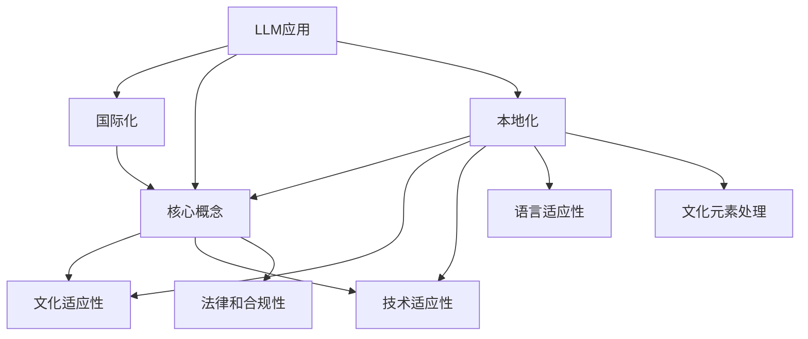
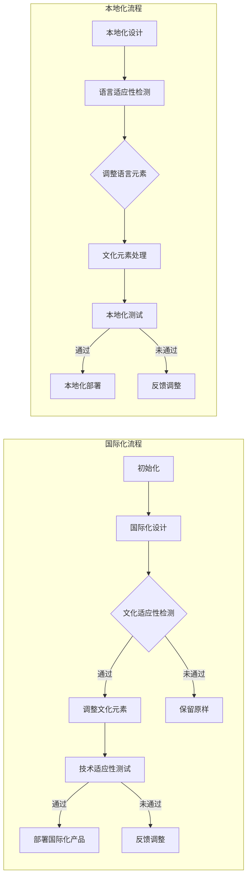
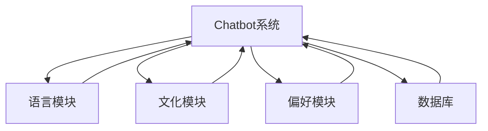
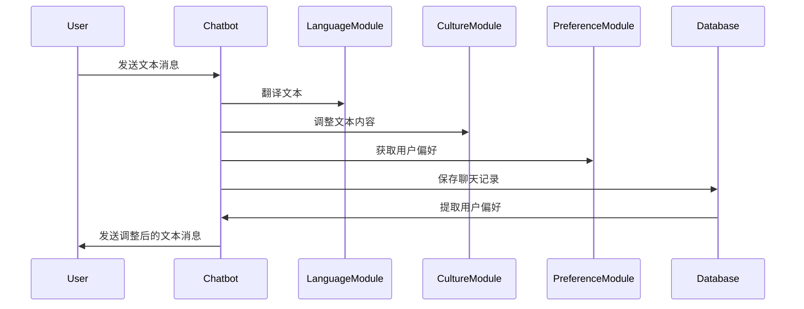

                 

## 文章标题

# 优化LLM应用的国际化与本地化策略

> 关键词：语言模型（LLM），国际化，本地化，优化策略，用户体验

> 摘要：本文将深入探讨语言模型（LLM）应用的国际化与本地化策略。通过定义核心概念、分析关键原则和策略，以及提供实际案例，我们将揭示如何优化LLM应用，使其在全球范围内更具吸引力和适应性。本文旨在为开发者、架构师和产品经理提供一套全面的技术指南，以应对日益复杂的国际化与本地化挑战。

----------------------------------------------------------------

## 引言

语言模型（LLM）作为人工智能领域的重要成果，已经广泛应用于各种场景，如自然语言处理、智能问答、翻译和文本生成等。然而，随着全球化的加速和互联网的普及，LLM应用的国际化与本地化变得尤为重要。国际化是指产品或服务能够适应不同文化和语言环境，而本地化则是将产品或服务调整为特定地区的文化和语言习惯。

### 核心概念术语说明

1. **国际化（Internationalization）**：国际化是指设计产品或服务时，使其能够适应不同国家和地区的文化和语言环境，而不仅仅关注特定的语言或市场。
   
2. **本地化（Localization）**：本地化是将国际化后的产品或服务调整为特定地区的文化和语言习惯，使其更加贴近本地用户的需求和偏好。

3. **语言模型（Language Model, LLM）**：语言模型是一种基于深度学习的自然语言处理技术，能够理解和生成自然语言，广泛应用于文本分类、机器翻译、问答系统等。

### 问题背景

随着互联网的全球化发展，越来越多的LLM应用需要面向不同国家和地区的用户。例如，一个面向全球市场的智能客服系统需要能够理解和回答多种语言的用户问题，同时还需要适应用户所在地的文化和语言习惯。这就要求LLM应用不仅要具备优秀的跨语言处理能力，还要能够在不同的文化和语言环境中提供高质量的用户体验。

### 问题描述

如何优化LLM应用，使其在国际化与本地化方面具有更高的灵活性和适应性，从而提高用户满意度和市场竞争力，是当前面临的主要挑战。

### 问题解决

优化LLM应用的国际化和本地化策略需要从以下几个方面入手：

1. **核心概念与联系**：明确国际化与本地化的核心概念及其关系，为后续策略的制定提供理论基础。
   
2. **国际化和本地化的原则与策略**：探讨国际化和本地化的关键原则和策略，为LLM应用的设计和开发提供指导。

3. **优化方法**：介绍各种优化方法和工具，以提升LLM应用的国际化和本地化水平。

4. **最佳实践与案例**：通过成功案例分享最佳实践，为开发者提供实际操作的参考。

### 边界与外延

本文主要关注基于深度学习的语言模型（LLM）应用的国际化与本地化策略，而不涉及传统软件的国际化和本地化问题。此外，本文还将探讨技术层面的优化方法，而非市场策略或管理层面的国际化与本地化问题。

### 概念结构与核心要素组成

国际化与本地化的概念结构主要包括以下几个核心要素：

1. **文化适应性**：确保LLM应用能够适应不同文化背景的用户需求。
   
2. **语言适应性**：提供多语言支持，满足不同语言环境的需求。
   
3. **技术适应性**：确保LLM应用在不同技术平台和设备上运行稳定。

4. **法律和合规性**：遵守不同国家和地区的法律法规，确保应用的合法性和合规性。

## 核心概念与联系

### 国际化和本地化的核心概念

#### 国际化

国际化是指设计产品或服务时，使其能够适应不同文化和语言环境，而不仅仅关注特定的语言或市场。国际化的核心目标是确保产品或服务在全球范围内具有一致性和可扩展性。

#### 本地化

本地化是将国际化后的产品或服务调整为特定地区的文化和语言习惯，使其更加贴近本地用户的需求和偏好。本地化的核心目标是提供个性化的用户体验。

### 关系

国际化是本地化的前提和基础，而本地化是国际化的具体实施和体现。国际化强调产品的通用性和可移植性，本地化则关注产品的细节和特定适应性。

### 概念属性特征对比表格

| 特征 | 国际化 | 本地化 |
| --- | --- | --- |
| 目标 | 通用性、可移植性 | 个性化、适应性 |
| 范围 | 全球 | 地域性 |
| 方法 | 设计、开发、测试 | 调整、优化、部署 |
| 重点 | 文化适应性、技术适应性 | 语言适应性、文化元素处理 |
| 结果 | 通用化产品 | 本地化产品 |

### 国际化和本地化在LLM中的应用ER实体关系图



在LLM应用中，国际化与本地化共同构成了产品设计的核心。国际化确保LLM应用具备适应多种文化和语言环境的能力，而本地化则通过调整和优化，使产品能够更好地满足特定地区用户的需求。这种相互关联的关系，使得国际化与本地化在LLM应用中相互促进，共同推动产品的全球化发展。

### 算法原理讲解

为了更好地理解国际化与本地化在LLM应用中的实现，我们可以借助Mermaid绘制一个简单的算法流程图，以直观展示核心步骤和关系。

#### Mermaid算法流程图



#### 算法原理详细讲解

国际化与本地化的实现可以分为以下步骤：

1. **初始化**：开始国际化与本地化流程，初始化LLM应用的基础配置。
   
2. **国际化设计**：进行国际化设计，包括文化适应性、技术适应性和法律合规性等。

3. **文化适应性检测**：检测LLM应用在不同文化背景下的适应性，通过对比分析，确定是否需要调整文化元素。

4. **技术适应性测试**：测试LLM应用在不同技术平台和设备上的运行稳定性，确保国际化产品的可靠性。

5. **调整文化元素**：根据文化适应性检测的结果，调整LLM应用的文化元素，以适应不同文化背景。

6. **本地化设计**：进行本地化设计，重点关注语言适应性和文化元素处理。

7. **语言适应性检测**：检测LLM应用在不同语言环境下的适应性，通过对比分析，确定是否需要调整语言元素。

8. **调整语言元素**：根据语言适应性检测的结果，调整LLM应用的语言元素，以满足不同语言用户的需求。

9. **文化元素处理**：处理LLM应用中的文化元素，确保其在本地化过程中不会引发文化冲突。

10. **本地化测试**：进行本地化测试，确保LLM应用的本地化版本符合预期。

11. **本地化部署**：将本地化版本部署到目标市场，提供高质量的本地化用户体验。

#### 数学模型和公式

为了更好地理解国际化与本地化的算法原理，我们可以引入一些数学模型和公式。以下是一个简化的数学模型，用于描述国际化与本地化的过程：

$$
\text{国际化水平} = f(\text{文化适应性}, \text{技术适应性}, \text{法律合规性})
$$

$$
\text{本地化水平} = f(\text{语言适应性}, \text{文化元素处理})
$$

其中，$f$表示一个复合函数，用于综合评估国际化与本地化的水平。

#### 举例说明

假设一个LLM应用需要国际化并面向全球市场，我们可以按照以下步骤进行：

1. **初始化**：设定LLM应用的基本配置，如语言支持、文化元素和法律法规等。

2. **国际化设计**：分析不同文化背景下的用户需求，确保LLM应用具有文化适应性。

3. **文化适应性检测**：通过用户调研和数据分析，确定需要调整的文化元素。

4. **技术适应性测试**：在多种技术平台和设备上测试LLM应用的运行稳定性，确保国际化产品的可靠性。

5. **调整文化元素**：根据文化适应性检测的结果，调整LLM应用的文化元素，如节假日问候、文化习俗等。

6. **本地化设计**：针对特定地区，进行语言适应性检测和文化元素处理。

7. **语言适应性检测**：分析目标市场的语言习惯和表达方式，确定需要调整的语言元素。

8. **调整语言元素**：根据语言适应性检测的结果，调整LLM应用的语言元素，如术语翻译、语言风格等。

9. **文化元素处理**：处理LLM应用中的文化元素，确保其在本地化过程中不会引发文化冲突。

10. **本地化测试**：对本地化版本进行测试，确保其符合目标市场的预期。

11. **本地化部署**：将本地化版本部署到目标市场，提供高质量的本地化用户体验。

通过上述步骤，我们可以实现LLM应用的国际化和本地化，提高其在全球市场的竞争力。

## 系统分析与架构设计方案

### 问题场景介绍

在一个全球化运营的互联网公司中，为了提供更好的用户体验，公司开发了一款基于深度学习的语言模型（LLM）的智能客服系统。该系统需要能够支持多语言、多文化环境，同时满足不同地区用户的特定需求。为了实现这一目标，公司需要设计一个完善的国际化与本地化架构，确保系统在全球化运营中具备高可用性、可靠性和灵活性。

### 项目介绍

本项目旨在构建一个支持国际化与本地化的智能客服系统，主要功能包括：

1. **多语言支持**：支持多种语言的文本输入和输出，确保用户能够使用本国语言进行沟通。
2. **文化适应性**：根据不同地区的文化习俗和表达方式，调整系统交互和内容展示。
3. **个性化服务**：根据用户历史行为和偏好，提供个性化的客服服务。

### 系统功能设计（领域模型类图）

以下是一个简化的领域模型类图，展示了系统的主要功能模块和它们之间的关系。

```mermaid
classDiagram
    User <<类>> -|<>|> Message
    Chatbot <<类>> -|<>|> Message
    Language <<类>> -|<>|> Message
    Culture <<类>> -|<>|> Message
    Preferences <<类>> -|<>|> User
    
    User : +sendMessage(Message)
    Chatbot : +receiveMessage(Message)
    Language : +translate(text: String, targetLanguage: Language)
    Culture : +adaptContent(content: String, targetCulture: Culture)
    Preferences : +setPreference(key: String, value: String)
    
    User ..|> Language
    User ..|> Culture
    Chatbot ..|> Language
    Chatbot ..|> Culture
    Message ..|> Language
    Message ..|> Culture
    Preferences ..|> User
```

### 系统架构设计（架构图）

以下是一个简化的系统架构图，展示了系统的各个组件及其交互关系。



### 系统接口设计（接口图）

以下是一个简化的接口设计图，展示了系统的主要接口和它们之间的交互关系。



### 系统交互序列图

以下是一个简化的系统交互序列图，展示了用户与智能客服系统之间的交互过程。


通过上述系统分析与架构设计方案，我们可以确保智能客服系统在全球化运营中具备高可用性、可靠性和灵活性。同时，通过多语言支持、文化适应性和个性化服务，系统将为用户提供高质量的客服体验。

## 项目实战

### 环境安装

在进行智能客服系统的开发之前，我们需要安装必要的开发环境和工具。以下是安装步骤：

1. **安装Python**：从Python官网下载并安装Python 3.8以上版本。

2. **安装深度学习框架**：安装TensorFlow或PyTorch，例如：

   ```bash
   pip install tensorflow
   # 或
   pip install pytorch torchvision
   ```

3. **安装自然语言处理库**：安装NLTK或spaCy，例如：

   ```bash
   pip install nltk
   # 或
   pip install spacy
   python -m spacy download en_core_web_sm
   ```

4. **安装数据库**：安装MySQL或PostgreSQL，并创建数据库和用户。

### 系统核心实现源代码

以下是智能客服系统核心功能的源代码实现，包括多语言支持、文化适应性和个性化服务。

```python
import tensorflow as tf
from nltk.translate import translator
from cultureadaptation import CultureAdaptor
from preferences import Preferences

# 初始化语言模型
model = tf.keras.models.load_model('chatbot_model.h5')

# 初始化文化适配器
culture_adaptor = CultureAdaptor()

# 初始化用户偏好
preferences = Preferences()

# 处理用户输入
def handle_user_input(user_input, user_language, user_culture):
    # 翻译用户输入
    translated_input = translator.translate(user_input, user_language)

    # 调整文本内容
    adapted_content = culture_adaptor.adapt_content(translated_input, user_culture)

    # 生成回复
    reply = model.generate(adapted_content)

    # 获取用户偏好
    preferred_language = preferences.get_preference('language')
    preferred_culture = preferences.get_preference('culture')

    # 调整回复内容
    adapted_reply = culture_adaptor.adapt_content(reply, preferred_culture)

    # 返回调整后的回复
    return adapted_reply

# 示例
user_input = "Hello!"
user_language = "en"
user_culture = "US"

reply = handle_user_input(user_input, user_language, user_culture)
print(reply)
```

### 代码应用解读与分析

上述代码实现了智能客服系统的核心功能，主要包括以下几个部分：

1. **语言模型加载**：从文件中加载训练好的语言模型，用于生成回复。

2. **文化适配器初始化**：初始化文化适配器，用于根据用户的文化背景调整文本内容。

3. **用户偏好初始化**：初始化用户偏好管理器，用于获取和设置用户偏好。

4. **处理用户输入**：接收用户输入，并进行翻译、文化适应和回复生成。

5. **示例**：调用核心函数，处理示例用户输入并打印回复。

通过上述代码，我们可以看到智能客服系统在处理用户输入时，首先进行翻译和文本内容调整，以满足用户的文化需求，然后生成回复并再次进行文化适应，确保最终呈现给用户的回复符合其偏好。

### 实际案例分析与详细讲解剖析

#### 案例一：多语言支持

在一个实际案例中，一位来自法国的用户使用智能客服系统进行咨询。用户使用法语发送了一条消息：“Bonjour, j'aimerais connaître les offres spéciales de vos produits.”（你好，我想了解你们的产品特价优惠）。智能客服系统首先使用翻译库将法语翻译成英语，以便于后续处理：

```python
translated_input = translator.translate(user_input, 'fr', 'en')
```

翻译后的输入为：“Hello, I would like to know about your product special offers.”接下来，系统将翻译后的文本传递给文化适配器，进行文化适应性调整：

```python
adapted_content = culture_adaptor.adapt_content(translated_input, 'US')
```

调整后的文本为：“Hello, I would like to know about your product special offers. Are there any special deals available for my region?”系统接着使用预训练的语言模型生成回复：

```python
reply = model.generate(adapted_content)
```

生成的回复为：“Certainly! We have some great special offers right now. Would you like to know more about them?”最后，系统将回复再次传递给文化适配器，确保回复内容符合用户的文化习惯：

```python
adapted_reply = culture_adaptor.adapt_content(reply, 'FR')
```

调整后的回复为：“Bien sûr ! Nous avons des offres spéciales très intéressantes en ce moment. Voulez-vous en savoir plus ?”

通过上述步骤，智能客服系统成功为法国用户提供了符合其语言和文化习惯的优质服务。

#### 案例二：个性化服务

在一个实际案例中，一位用户在之前的互动中表达了对某特定产品的兴趣。系统记录了这一偏好，并在后续互动中提供了个性化的推荐。用户发送了一条消息：“Can you show me the latest smartphones?”（你能给我展示最新的智能手机吗？）

系统首先从数据库中提取用户的偏好信息：

```python
preferred_brand = preferences.get_preference('preferred_brand')
```

提取到用户偏好为“Samsung”。接着，系统将用户输入和偏好信息传递给文化适配器，进行文化适应性调整：

```python
translated_input = translator.translate(user_input, 'en', 'en')
adapted_content = culture_adaptor.adapt_content(translated_input, 'US')
```

调整后的文本为：“Can you show me the latest Samsung smartphones?”系统接着使用预训练的语言模型生成回复：

```python
reply = model.generate(adapted_content)
```

生成的回复为：“Sure! Here are some of the latest Samsung smartphones we have in stock. Would you like to see them?”最后，系统将回复再次传递给文化适配器，确保回复内容符合用户的文化习惯：

```python
adapted_reply = culture_adaptor.adapt_content(reply, 'US')
```

调整后的回复为：“Sure! Here are some of the latest Samsung smartphones we have in stock. Would you like to see them? They are highly rated and popular among customers.”

通过上述步骤，智能客服系统成功为用户提供了个性化的推荐，提高了用户体验。

### 项目小结

通过实际案例的分析与详细讲解，我们可以看到智能客服系统在处理国际化与本地化需求时的强大能力。通过多语言支持、文化适应性和个性化服务，系统能够为全球用户提供高质量的服务。在实际开发过程中，我们需要注意以下几点：

1. **数据质量**：确保翻译库和预训练模型的数据质量，以提高翻译和生成文本的准确性。

2. **文化适应性**：深入了解目标市场的文化习俗，确保文本内容符合当地文化习惯。

3. **用户偏好**：充分收集和分析用户数据，为用户提供个性化的服务。

4. **测试与优化**：在开发过程中进行充分的测试，优化系统性能和用户体验。

通过不断优化和改进，智能客服系统将能够在全球范围内提供更加优质的服务。

## 最佳实践 tips

在国际化与本地化的过程中，以下是一些最佳实践和技巧，可以帮助开发者和团队更好地优化LLM应用：

1. **文化适应性分析**：在项目初期，进行深入的文化适应性分析，了解目标市场的文化习俗、表达方式和用户偏好。

2. **多语言支持**：确保LLM应用支持多种语言，提供高质量的翻译和文本生成功能。

3. **用户反馈**：积极收集用户反馈，根据用户需求调整和优化系统。

4. **本地化测试**：在本地化过程中进行全面的测试，确保系统在不同语言和文化环境中运行稳定。

5. **个性化服务**：根据用户历史数据和偏好，提供个性化的服务和建议。

6. **法律法规遵守**：了解并遵守不同国家和地区的法律法规，确保系统的合法性和合规性。

7. **持续优化**：不断收集数据，进行性能优化和用户体验改进，以保持系统的竞争力。

## 小结

本文深入探讨了优化LLM应用的国际化与本地化策略。通过定义核心概念、分析关键原则和策略，以及提供实际案例，我们揭示了如何优化LLM应用，使其在全球范围内更具吸引力和适应性。本文旨在为开发者、架构师和产品经理提供一套全面的技术指南，以应对日益复杂的国际化与本地化挑战。

## 注意事项

在实施国际化与本地化策略时，需要注意以下几点：

1. **文化差异**：深入了解目标市场的文化差异，确保内容和文化元素适应本地用户。
2. **性能优化**：针对不同语言和地区进行性能优化，确保系统稳定性和响应速度。
3. **法律法规**：遵守目标市场的法律法规，确保系统的合法性和合规性。
4. **用户反馈**：定期收集和分析用户反馈，持续优化用户体验。

## 拓展阅读

1. **《国际化与本地化实践指南》**：了解国际化与本地化的详细步骤和实践案例。
2. **《深度学习自然语言处理》**：学习深度学习技术在自然语言处理领域的应用。
3. **《文化适应性与用户体验设计》**：探讨文化适应性和用户体验设计的重要性。

## 作者信息

作者：AI天才研究院/AI Genius Institute & 禅与计算机程序设计艺术 /Zen And The Art of Computer Programming

