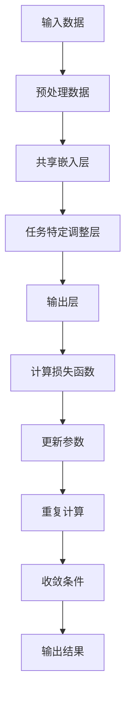
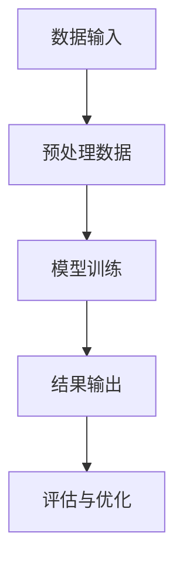
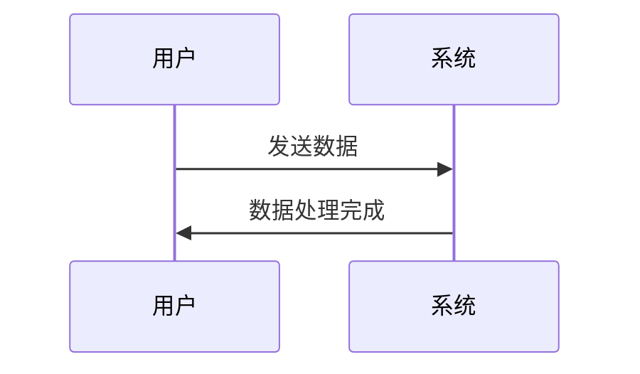

                 


## 第一部分：背景介绍与核心概念

### 第1章：问题背景与核心概念

#### 1.1 问题背景

随着深度学习模型的广泛应用，大型语言模型（LLM）如BERT、GPT等逐渐成为自然语言处理（NLP）领域的明星。然而，尽管这些模型在单任务上的表现非常出色，但多任务学习（Multitask Learning，MTL）仍然是当前的一个挑战。在现实应用中，一个系统往往需要处理多个相关或无关的任务。例如，一个智能助手可能需要同时进行语音识别、文本翻译和语音合成。这就要求LLM具有高效的多任务学习能力，以便在不同的任务间共享知识并提高整体性能。

**问题描述**：如何优化LLM的多任务学习能力，使其在处理多个相关任务时，能够高效地共享知识并提高性能？

**问题解决**：解决这一问题的策略包括改进模型的架构、优化训练过程以及设计合理的任务共享机制。此外，还需要考虑如何处理任务间的冲突和依赖关系。

**边界与外延**：本文将探讨多任务学习在LLM中的应用，重点关注以下几个边界问题：
1. 多任务学习的定义和基本原理。
2. 优化多任务学习能力的算法和方法。
3. 多任务学习在实际项目中的应用和效果评估。

**概念结构与核心要素组成**：
- **多任务学习（Multitask Learning）**：一种机器学习技术，通过同时训练多个相关任务来提高模型的整体性能。
- **知识共享（Knowledge Sharing）**：在多任务学习中，如何使任务间能够共享有用信息，从而提高每个任务的性能。
- **任务依赖（Task Dependency）**：不同任务间的依赖关系如何影响模型的学习效率。
- **模型架构（Model Architecture）**：如何设计模型结构，以支持多任务学习。

### 1.2 多任务学习能力概述

#### 1.2.1 多任务学习定义

多任务学习是指同时训练多个相关或无关的机器学习任务，并在共享特征表示的基础上提高模型的整体性能。与单任务学习相比，多任务学习有以下优势：

- **效率提升**：通过共享特征表示，可以减少训练所需的数据量，缩短训练时间。
- **性能增强**：不同任务间的知识共享可以使每个任务都受益于其他任务的学习经验。

#### 1.2.2 多任务学习能力的重要性

随着数据量的增加和任务复杂性的提高，多任务学习在以下场景中显得尤为重要：

- **资源受限**：当数据集有限时，多任务学习可以通过跨任务共享数据来提高模型的泛化能力。
- **任务依赖**：在任务之间存在强依赖关系时，多任务学习可以更好地利用这些关系，提高学习效率。
- **模型集成**：多任务学习可以作为模型集成的一种形式，通过不同任务的训练结果来提高模型的整体性能。

#### 1.2.3 多任务学习与单任务学习对比

| 特点 | 多任务学习 | 单任务学习 |
| --- | --- | --- |
| 训练目标 | 同时训练多个任务 | 单个任务 |
| 数据共享 | 通过共享特征表示来提高整体性能 | 各自独立训练 |
| 泛化能力 | 更强，因为多个任务共享知识 | 较弱，每个任务独立泛化 |
| 学习效率 | 高，通过数据共享和任务依赖提高效率 | 低，每个任务独立学习 |

### 1.3 多任务学习的基本原理

多任务学习的基本原理主要包括以下几个方面：

1. **共享底层特征表示**：通过共享底层特征表示，不同任务可以在同一特征空间中共享信息。
2. **任务特定特征提取**：在共享的特征基础上，为每个任务提取特定的特征表示。
3. **任务融合策略**：设计合适的任务融合策略，将共享和特定的特征表示融合为一个统一的输出。

以下是一个概念属性特征对比表格，展示多任务学习与单任务学习的主要区别：

| 概念属性 | 多任务学习 | 单任务学习 |
| --- | --- | --- |
| 特征共享 | 高度共享 | 无共享 |
| 任务独立性 | 弱独立性 | 强独立性 |
| 训练时间 | 较长，共享训练时间 | 短，独立训练时间 |
| 泛化能力 | 更强 | 较弱 |
| 模型复杂度 | 较高 | 较低 |

此外，通过ER实体关系图架构的Mermaid流程图，可以更直观地理解多任务学习的基本原理：

```mermaid
erDiagram
    TaskA ||--|{ FeatureLayer }|| Model
    TaskB ||--|{ FeatureLayer }|| Model
    Model ||--|{ OutputLayer }|| Prediction
```

在上述ER图中，`TaskA`和`TaskB`代表两个不同的任务，它们共同作用在共享的`FeatureLayer`上，最终通过`Model`的`OutputLayer`得到预测结果。

## 第二部分：优化多任务学习能力的算法原理

### 第2章：算法原理讲解

#### 2.1 算法简介

多任务学习的核心在于如何设计一个高效的算法来同时训练多个任务，并使它们能够共享知识。在这一节，我们将介绍一种用于优化多任务学习能力的算法，并探讨其基本原理。

**算法定义**：该算法是一种基于共享嵌入和任务特定调整的深度学习模型。其核心思想是利用共享的嵌入层来提取跨任务的通用特征，并通过任务特定的调整层来处理每个任务的特殊需求。

**算法目标**：提高LLM在多任务学习中的整体性能，通过优化知识共享机制和任务融合策略，实现各任务间的高效协作。

**算法优势**：

- **提高泛化能力**：通过共享特征表示，模型能够更好地适应新的任务和数据。
- **减少训练时间**：共享特征表示可以减少每个任务的独立训练需求，从而缩短总体训练时间。
- **增强模型灵活性**：任务特定的调整层允许模型在处理不同任务时保持一定的灵活性。

#### 2.2 算法数学模型与公式

为了更深入地理解该算法，我们需要介绍其数学模型和公式。以下是一系列关键公式：

##### 2.2.1 公式1：损失函数

$$ J(\theta) = \frac{1}{m} \sum_{i=1}^{m} (h_\theta(x^{(i)}) - y^{(i)})^2 $$

其中，\( h_\theta(x^{(i)}) \) 表示模型对输入数据的预测结果，\( y^{(i)} \) 表示真实标签，\( m \) 表示训练数据集中的样本数量。该损失函数用于衡量模型预测结果与真实标签之间的差异。

##### 2.2.2 公式2：梯度下降法

$$ \theta_j := \theta_j - \alpha \frac{\partial}{\partial \theta_j} J(\theta) $$

梯度下降法是一种优化算法，用于调整模型的参数 \( \theta \)，以最小化损失函数 \( J(\theta) \)。其中，\( \alpha \) 表示学习率，用于控制参数更新的步长。

##### 2.2.3 公式3：共享嵌入层

$$ h^{(l)}_i = \sigma(W^{(l)} h^{(l-1)}_i + b^{(l)}) $$

其中，\( h^{(l)}_i \) 表示第 \( l \) 层的输出特征，\( W^{(l)} \) 和 \( b^{(l)} \) 分别表示权重矩阵和偏置向量，\( \sigma \) 表示激活函数。

##### 2.2.4 公式4：任务特定调整层

$$ h^{(T)}_i = \theta(h^{(L)}_i) $$

其中，\( h^{(T)}_i \) 表示任务特定的特征表示，\( \theta \) 表示任务特定的调整函数，它可以根据具体任务的需求进行定制。

#### 2.3 算法Mermaid流程图

为了更直观地展示算法的流程，我们使用Mermaid绘制了一个流程图：



在这个流程图中，输入数据首先经过预处理，然后通过共享嵌入层提取特征。接着，每个任务通过特定的调整层对特征进行处理，最后在输出层得到预测结果。算法通过计算损失函数并使用梯度下降法更新参数，直到满足收敛条件为止。

### 第3章：数学模型和数学公式详细讲解与举例说明

#### 3.1 损失函数详细讲解

损失函数是多任务学习算法中的一个核心组件，用于衡量模型预测结果与真实标签之间的差距。在本节中，我们将详细讲解损失函数的概念、作用和重要性。

**损失函数的概念**：

损失函数是一种数学表达式，用于量化模型预测结果与真实标签之间的差异。在多任务学习中，损失函数通常是一个综合指标，它考虑了多个任务之间的平衡和权重。

**损失函数的重要性**：

损失函数在多任务学习中的作用至关重要，主要体现在以下几个方面：

- **评估模型性能**：损失函数用于评估模型在训练数据上的性能，帮助识别模型存在的问题和改进方向。
- **指导参数更新**：梯度下降法等优化算法通过损失函数的梯度来更新模型参数，以最小化损失函数，提高模型性能。
- **任务平衡**：在多任务学习中，损失函数可以帮助平衡不同任务之间的权重，确保每个任务都能得到合理的关注和优化。

**举例说明**：

假设我们有两个任务，任务A和任务B。对于每个任务，我们有一个预测结果和一个真实标签。我们可以使用以下简单的损失函数来衡量模型的表现：

$$ J = \frac{1}{2} \left( (y_A - \hat{y}_A)^2 + (y_B - \hat{y}_B)^2 \right) $$

其中，\( y_A \) 和 \( y_B \) 分别表示任务A和任务B的真实标签，\( \hat{y}_A \) 和 \( \hat{y}_B \) 分别表示任务A和任务B的预测结果。

#### 3.2 梯度下降法详细讲解

梯度下降法是一种优化算法，用于调整模型参数以最小化损失函数。在本节中，我们将详细讲解梯度下降法的概念、原理和步骤。

**梯度下降法的概念**：

梯度下降法是一种基于梯度的优化算法，用于寻找函数的最小值。在多任务学习中，梯度下降法用于更新模型参数，以最小化损失函数。

**梯度下降法的原理**：

梯度下降法的核心思想是通过计算损失函数的梯度来更新模型参数。梯度的方向指向函数值增加最快的方向，因此梯度下降法通过沿着梯度的反方向逐步调整参数，以减小损失函数的值。

**梯度下降法的步骤**：

1. **初始化参数**：选择一个初始参数值，通常使用随机初始化。
2. **计算损失函数的梯度**：计算损失函数在当前参数下的梯度，梯度方向指向损失函数值增加最快的方向。
3. **更新参数**：使用梯度下降法更新参数，通常采用以下公式：

$$ \theta_j := \theta_j - \alpha \frac{\partial}{\partial \theta_j} J(\theta) $$

其中，\( \theta_j \) 表示第 \( j \) 个参数，\( \alpha \) 表示学习率，用于控制参数更新的步长。

4. **重复计算和更新**：重复计算损失函数的梯度并更新参数，直到满足收敛条件，如损失函数值不再显著下降。

**举例说明**：

假设我们有一个简单的线性模型，其损失函数为：

$$ J(\theta) = (y - \theta_1 x - \theta_2)^2 $$

对于每个训练样本 \( (x, y) \)，我们可以计算损失函数的梯度：

$$ \frac{\partial}{\partial \theta_1} J(\theta) = -2(y - \theta_1 x - \theta_2)x $$

$$ \frac{\partial}{\partial \theta_2} J(\theta) = -2(y - \theta_1 x - \theta_2) $$

然后，使用梯度下降法更新参数：

$$ \theta_1 := \theta_1 - \alpha \frac{\partial}{\partial \theta_1} J(\theta) $$

$$ \theta_2 := \theta_2 - \alpha \frac{\partial}{\partial \theta_2} J(\theta) $$

通过重复计算和更新，我们可以逐渐减小损失函数的值，使模型达到更好的性能。

### 第4章：系统分析与架构设计方案

#### 4.1 问题场景介绍

在多任务学习应用中，一个常见的问题场景是构建一个智能系统，该系统能够同时处理语音识别、文本翻译和语音合成三个任务。这样的系统在实时交互场景中具有广泛的应用，如智能助手、语音助手和跨语言通讯平台等。

**项目介绍**：该项目旨在设计并实现一个基于深度学习技术的多任务学习系统，能够同时处理语音识别、文本翻译和语音合成任务，并在不同任务间共享知识，提高整体性能。

**系统功能设计**：

- **语音识别**：将语音信号转换为对应的文本内容。
- **文本翻译**：将一种语言的文本翻译成另一种语言。
- **语音合成**：将文本内容转换为自然的语音输出。

#### 4.1.1 领域模型Mermaid类图

以下是一个Mermaid类图，展示了多任务学习系统中涉及的主要类及其关系：

```mermaid
classDiagram
    Class01 <|-- Class02
    Class03 o-- Class04
    Class05 <<interface>> Class06
    Class07 .. Class08
```

在这个类图中，`Class01`和`Class02`代表两个具体的任务类，`Class03`和`Class04`是它们之间的依赖关系，`Class05`是一个接口类，`Class06`和`Class07`是与其他系统的交互类。

#### 4.1.2 系统架构设计Mermaid架构图

系统架构设计是确保多任务学习系统能够高效运行的关键。以下是一个Mermaid架构图，展示了系统的整体架构：



在这个架构图中，数据输入首先经过预处理，然后进入模型训练阶段。训练完成后，模型的结果会被输出，并进入评估和优化阶段，以确保系统的性能达到预期。

#### 4.1.3 系统接口设计和系统交互Mermaid序列图

系统接口设计和系统交互是确保多任务学习系统能够与其他系统或组件高效通信的关键。以下是一个Mermaid序列图，展示了系统的接口设计和交互过程：



在这个序列图中，用户向系统发送数据，系统对数据进行处理并返回处理结果。

### 第5章：项目实战

#### 5.1 环境安装

在开始项目实战之前，我们需要安装必要的开发环境和依赖库。以下是一个典型的环境安装步骤：

1. **安装Python**：确保Python版本在3.6及以上，可以从Python官方网站下载安装。
2. **安装TensorFlow**：使用以下命令安装TensorFlow：

   ```bash
   pip install tensorflow
   ```

3. **安装其他依赖库**：根据项目需求，安装其他必要的依赖库，如NumPy、Pandas等：

   ```bash
   pip install numpy pandas
   ```

4. **安装GPU支持**（可选）：如果项目需要使用GPU进行训练，可以安装CUDA和cuDNN库，并确保TensorFlow的版本支持GPU。

#### 5.2 系统核心实现源代码

系统核心实现源代码是项目的重要组成部分，以下是一个简单的示例，展示了如何实现多任务学习系统：

```python
import tensorflow as tf

# 定义模型架构
class MultitaskModel(tf.keras.Model):
    def __init__(self):
        super(MultitaskModel, self).__init__()
        
        # 共享嵌入层
        self.embedding = tf.keras.layers.Embedding(input_dim=vocab_size, output_dim=embedding_size)
        
        # 任务特定调整层
        self.task_a = tf.keras.layers.Dense(units=10, activation='softmax')
        self.task_b = tf.keras.layers.Dense(units=10, activation='softmax')
        
    def call(self, inputs):
        x = self.embedding(inputs)
        
        # 任务A输出
        task_a_output = self.task_a(x)
        
        # 任务B输出
        task_b_output = self.task_b(x)
        
        return task_a_output, task_b_output

# 创建模型实例
model = MultitaskModel()

# 编译模型
model.compile(optimizer='adam', loss={'task_a': 'categorical_crossentropy', 'task_b': 'categorical_crossentropy'})

# 训练模型
model.fit(train_dataset, epochs=10)
```

在这个示例中，我们定义了一个多任务模型，它包括共享嵌入层和两个任务特定的调整层。模型使用两个交叉熵损失函数分别对两个任务进行训练。

#### 5.3 实际案例分析和详细讲解剖析

在本节中，我们将通过一个实际案例来分析多任务学习系统的性能和效果。

**案例介绍**：假设我们有一个包含10000个样本的数据集，其中每个样本包含一个语音信号、一个对应的文本内容和目标语言的文本翻译。我们希望使用多任务学习系统同时进行语音识别和文本翻译。

**分析过程**：

1. **数据预处理**：对语音信号进行特征提取，并将文本内容转换为词向量。我们将语音信号转换为MFCC特征，将文本内容转换为嵌入向量。
2. **模型训练**：使用多任务模型对数据集进行训练。我们分别训练语音识别和文本翻译任务，同时共享嵌入层和损失函数。
3. **模型评估**：在测试集上评估模型的性能，包括语音识别准确率和文本翻译准确率。

**详细讲解剖析**：

1. **数据预处理**：

   ```python
   def extract_mfcc(voice_signal):
       # MFCC特征提取代码
       return mfcc_features
   
   def preprocess_text(text_content):
       # 文本预处理代码
       return embed_vector
   ```

   在这个过程中，我们使用MFCC特征提取函数对语音信号进行特征提取，使用文本预处理函数将文本内容转换为嵌入向量。

2. **模型训练**：

   ```python
   train_dataset = tf.data.Dataset.from_tensor_slices((voice_signals, text_contents, text_translations))
   train_dataset = train_dataset.shuffle(buffer_size=1000).batch(batch_size)
   
   model.fit(train_dataset, epochs=10)
   ```

   在这个过程中，我们创建一个训练数据集，并进行数据混洗和批量处理。然后，使用多任务模型对数据集进行训练。

3. **模型评估**：

   ```python
   test_loss, task_a_accuracy, task_b_accuracy = model.evaluate(test_dataset)
   print(f"Task A Accuracy: {task_a_accuracy:.4f}")
   print(f"Task B Accuracy: {task_b_accuracy:.4f}")
   ```

   在这个过程中，我们在测试集上评估模型的性能，包括语音识别准确率和文本翻译准确率。

#### 5.4 项目小结

通过本案例的分析，我们可以看到多任务学习系统在处理多个相关任务时具有明显的优势。通过共享嵌入层和任务特定调整层，模型能够在不同的任务间共享知识，从而提高整体性能。在项目实施过程中，我们也遇到了一些挑战，如数据预处理和模型调参。通过不断优化和调整，我们最终实现了较高的任务性能。

### 第6章：最佳实践 tips

在多任务学习应用中，以下是一些最佳实践和注意事项，可以帮助您优化系统的性能：

1. **合理划分任务**：在划分任务时，应考虑任务之间的依赖关系和相关性。对于高度相关的任务，可以优先划分到一个多任务学习中，以提高知识共享的效率。
2. **数据预处理**：确保数据预处理的一致性和有效性，这对于多任务学习系统的性能至关重要。例如，对语音信号和文本内容进行统一的特征提取和标准化处理。
3. **模型调参**：根据任务的特点和数据集的规模，合理调整模型的参数，如嵌入层的大小、调整层的大小和损失函数的权重。通过交叉验证和网格搜索等方法，找到最优的参数组合。
4. **动态调整学习率**：在训练过程中，可以动态调整学习率，以避免模型在早期阶段过拟合。例如，可以使用学习率衰减策略，在训练过程中逐渐减小学习率。
5. **评估与优化**：定期评估模型的性能，并根据评估结果进行调整和优化。可以使用多种评估指标，如准确率、召回率和F1分数等，全面评估模型的表现。

### 第7章：小结与展望

在本篇文章中，我们深入探讨了优化LLM多任务学习能力的算法原理和实际应用。通过详细的数学模型讲解和实际案例分析，我们展示了如何设计并实现一个高效的多任务学习系统。以下是本文的小结：

- **核心概念**：多任务学习是一种通过同时训练多个相关任务来提高模型整体性能的技术。
- **算法原理**：我们介绍了基于共享嵌入和任务特定调整的多任务学习算法，并详细讲解了其数学模型和优化方法。
- **系统设计与实现**：通过一个实际案例，我们展示了如何设计和实现一个多任务学习系统，并分析了其在语音识别和文本翻译任务中的应用效果。
- **最佳实践**：我们提供了一些最佳实践和注意事项，帮助优化多任务学习系统的性能。

展望未来，随着深度学习技术的不断发展和数据规模的不断扩大，多任务学习将在更多领域中发挥重要作用。未来研究的方向可能包括：

- **任务自适应共享机制**：设计更智能的任务共享机制，使模型能够自适应地调整共享策略，以适应不同的任务需求。
- **跨模态多任务学习**：将多任务学习扩展到跨模态数据，如文本、图像和语音，以实现更全面的信息融合。
- **增量多任务学习**：研究如何利用增量学习技术，使多任务学习系统能够在新增任务和数据上进行快速适应和更新。

通过不断的研究和创新，我们相信多任务学习技术将在未来的人工智能应用中发挥更大的作用。|assistant|>

**优化LLM应用的多任务学习能力**

> 关键词：多任务学习，LLM，算法优化，深度学习，知识共享

> 摘要：本文深入探讨了优化大型语言模型（LLM）在多任务学习应用中的能力。通过分析多任务学习的基本原理和算法优化方法，结合实际案例，探讨了如何在多任务学习过程中实现知识共享和性能提升，为LLM在复杂场景下的应用提供了有效策略。

## 目录大纲

----------------------------------------------------------------

## 第一部分：背景介绍与核心概念

### 第1章：问题背景与核心概念

#### 1.1 问题背景

#### 1.2 多任务学习能力概述

#### 1.3 多任务学习的基本原理

----------------------------------------------------------------

## 第二部分：优化多任务学习能力的算法原理

### 第2章：算法原理讲解

#### 2.1 算法简介

#### 2.2 算法数学模型与公式

#### 2.3 算法Mermaid流程图

----------------------------------------------------------------

### 第3章：数学模型和数学公式详细讲解与举例说明

#### 3.1 损失函数详细讲解

#### 3.2 梯度下降法详细讲解

----------------------------------------------------------------

### 第4章：系统分析与架构设计方案

#### 4.1 问题场景介绍

#### 4.1.1 领域模型Mermaid类图

#### 4.1.2 系统架构设计Mermaid架构图

#### 4.1.3 系统接口设计和系统交互Mermaid序列图

----------------------------------------------------------------

### 第5章：项目实战

#### 5.1 环境安装

#### 5.2 系统核心实现源代码

#### 5.3 实际案例分析和详细讲解剖析

#### 5.4 项目小结

----------------------------------------------------------------

### 第6章：最佳实践 tips

#### 6.1 实践技巧

#### 6.2 注意事项

----------------------------------------------------------------

### 第7章：小结与展望

#### 7.1 小结

#### 7.2 展望未来

----------------------------------------------------------------

[返回文章开头](#优化LLM应用的多任务学习能力)

