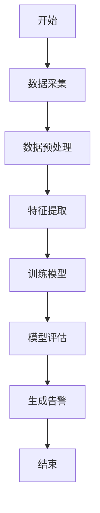
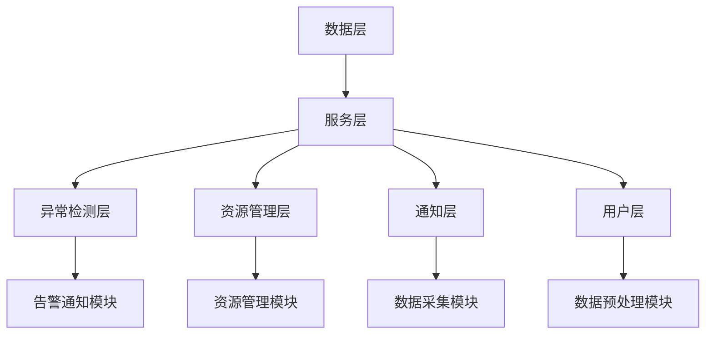
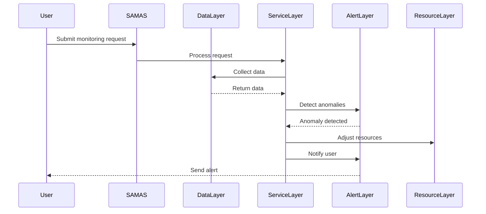

                 

## 1.4 边界与外延

在优化LLM应用的异常监控与告警过程中，边界与外延的明确对于监控与告警机制的合理设计和有效实施至关重要。以下是对边界与外延的详细说明：

### 1.4.1 监控范围

监控范围指的是监控所覆盖的系统组件和应用层面。具体包括：

- **计算资源监控**：监控LLM应用所在的硬件资源，如CPU、内存、硬盘等。
- **网络监控**：监控网络带宽、延迟等指标，确保数据传输的稳定性和速度。
- **数据库监控**：监控数据库的健康状况、响应时间等，确保数据存储和查询的可靠性。
- **应用层监控**：监控LLM应用的输入输出、处理流程、用户反馈等，确保应用功能的正常运行。

### 1.4.2 告警范围

告警范围决定了哪些异常情况需要被通知和响应。主要包括：

- **计算资源异常**：如CPU利用率过高、内存不足、硬盘空间不足等。
- **网络异常**：如网络中断、带宽过低、延迟增加等。
- **数据库异常**：如数据库连接失败、查询错误、数据一致性等问题。
- **应用层异常**：如LLM推理错误、输出异常、用户反馈问题等。

### 1.4.3 资源利用范围

资源利用范围涉及到如何合理分配和利用系统资源，以确保LLM应用的效率和稳定性。具体包括：

- **计算资源分配**：根据应用负载动态调整计算资源分配，确保关键任务得到优先处理。
- **网络资源管理**：通过流量管理和负载均衡，优化网络资源的利用效率。
- **存储资源优化**：通过数据压缩、缓存机制等，提高存储资源的利用率。

### 1.4.4 监控与告警机制的扩展性

监控与告警机制的扩展性是指系统需要具备适应不同场景和LLM模型的能力。具体包括：

- **可配置性**：监控指标和阈值可以根据具体应用场景进行调整。
- **可扩展性**：告警通知渠道可以支持多种方式，如邮件、短信、API通知等。
- **兼容性**：监控与告警机制需要能够兼容不同类型的LLM模型和应用。

### 1.4.5 监控与告警机制的实现

为了实现上述边界与外延，需要设计并实现以下组件：

- **监控代理**：部署在各个系统组件上，定期收集监控数据。
- **数据存储**：用于存储收集到的监控数据，如时间序列数据库。
- **数据分析引擎**：对监控数据进行处理和分析，识别异常情况。
- **告警通知系统**：在检测到异常时，通过不同渠道通知相关人员。
- **资源管理模块**：根据监控数据和告警信息，动态调整系统资源的分配和使用。

### 1.4.6 实践中的注意事项

在实际操作中，需要注意以下事项：

- **监控粒度**：监控粒度需要根据实际需求进行调整，既不能过于精细导致大量无关告警，也不能过于粗糙导致重要异常未被及时发现。
- **告警级别**：根据异常的严重程度，设置不同级别的告警，确保关键问题得到及时响应。
- **误报处理**：对误报的告警进行处理，避免频繁的干扰和疲劳通知。
- **应急响应**：建立应急响应机制，确保在发生重大异常时，系统能够快速恢复。

通过明确边界与外延，并实现相应的监控与告警机制，可以有效地优化LLM应用的异常监控与告警，提高系统的稳定性和可靠性。

### 1.5 核心概念与联系

在优化LLM应用的异常监控与告警过程中，理解并掌握一系列核心概念和它们之间的相互联系至关重要。这些核心概念不仅帮助我们更好地定义问题，还能够为设计有效的监控和告警机制提供理论基础。以下是对这些核心概念的详细介绍及其相互关系的探讨。

#### 1.5.1 监控指标

监控指标是评估LLM应用健康状况的基础。以下是一些关键监控指标的详细说明：

1. **资源消耗指标**：
   - **CPU利用率**：指CPU在单位时间内处理任务的百分比。
   - **内存占用率**：指系统内存的使用情况，包括已用内存和总内存的比例。
   - **硬盘I/O**：指硬盘的输入输出操作次数和速度。

2. **模型性能指标**：
   - **准确率（Accuracy）**：指模型正确预测的样本数占总样本数的比例。
   - **召回率（Recall）**：指模型正确预测的样本数占实际样本数中正确样本数的比例。
   - **F1值（F1 Score）**：是准确率和召回率的调和平均值，用于综合评估模型的性能。

3. **应用效果指标**：
   - **响应时间**：指用户发起请求到系统返回响应的时间。
   - **吞吐量**：指系统在单位时间内处理的请求数量。
   - **用户满意度**：通过用户反馈评估系统的用户体验。

#### 1.5.2 监控与告警机制

监控与告警机制包括多个组件和步骤，以下是对每个组件和步骤的详细说明：

1. **数据采集**：
   - **监控代理**：部署在各个系统组件上，定期收集监控数据。
   - **日志收集**：收集系统的运行日志，用于后续的分析。

2. **数据预处理**：
   - **数据清洗**：去除监控数据中的噪音和异常值。
   - **数据转换**：将原始数据转换为适合分析处理的格式。

3. **异常检测**：
   - **基线模型**：建立基线模型，用于定义正常情况的预期范围。
   - **统计方法**：使用统计方法（如标准差、四分位距等）识别偏离基线的情况。
   - **机器学习方法**：使用机器学习算法（如聚类、分类等）识别复杂模式。

4. **告警通知**：
   - **告警阈值**：设置阈值，当监控指标超过阈值时触发告警。
   - **通知渠道**：通过邮件、短信、API通知等方式将告警信息发送给相关人员。

#### 1.5.3 ER实体关系图

为了更清晰地展示监控与告警机制中的实体及其关系，我们使用ER图（实体-关系图）进行描述。以下是优化LLM应用的异常监控与告警的ER实体关系图：

```mermaid
erDiagram
  Model |-(|>>): "uses" Resource
  Model |-(|>>): "produces" Output
  Alert |-(|>>): "generated_by" Model
  User |-(|>>): "receives" Alert
```

在这个ER图中：

- **Model（模型）**：代表训练好的LLM模型，它使用资源进行推理并产生输出。
- **Resource（资源）**：代表LLM推理所需的计算、存储和网络资源。
- **Output（输出）**：代表模型推理的结果，用于后续的应用。
- **Alert（告警）**：代表系统检测到的异常情况。
- **User（用户）**：代表接收和处理告警信息的相关人员。

### 1.5.4 概念属性特征对比表格

为了更好地理解各个核心概念，以下是一个概念属性特征对比表格：

| 概念       | 描述                                                         | 关键特性                  | 关系           |
|------------|--------------------------------------------------------------|---------------------------|----------------|
| 监控指标   | 评估LLM应用状态的量化标准。                                 | 精确、实时、可量化         | 提供数据支持   |
| 监控与告警 | 系统用于监控LLM应用状态并通知异常情况的机制。                | 可配置、可扩展、自动化     | 实现监控功能   |
| ER实体关系 | 描述监控与告警系统中各个实体及其相互关系。                    | 简洁、直观、逻辑性         | 结构化表示     |
| 资源       | LLM应用运行所需的基础设施资源。                               | 可用性、可靠性、高效性     | 支持应用运行   |
| 模型输出   | LLM推理的结果，直接影响应用效果。                            | 准确、高效、可解释         | 输出评估指标   |
| 告警      | 系统检测到异常情况后通知用户的信号。                          | 及时、明确、有效响应       | 引导应急处理   |
| 用户      | 监控与告警系统中的信息接收和处理者。                          | 责任、专业、决策           | 责任承担者     |

通过上述核心概念的对比分析，我们可以更全面地理解优化LLM应用的异常监控与告警机制，并在此基础上设计和实施高效的监控和告警策略。

### 1.6 AI大模型原理讲解

AI大模型，如GPT、BERT等，是当前自然语言处理（NLP）领域的重要工具，它们在理解和生成自然语言方面表现出了卓越的能力。为了深入理解这些大模型的工作原理，我们需要从其基本概念、核心特点以及与传统AI技术的区别进行详细阐述。

#### 1.6.1 大模型的基本原理

AI大模型通常基于深度学习技术，特别是神经网络，其核心原理可以概括为以下几点：

1. **神经网络**：神经网络是由多个相互连接的神经元组成的计算模型。每个神经元都是一个简单的计算单元，它可以接收输入信号，通过权重加权后传递到下一个神经元。神经网络的目的是通过学习输入和输出数据之间的关系，从而对新的输入数据进行预测或分类。

2. **前向传播与反向传播**：在前向传播过程中，输入数据从网络的输入层经过多个隐藏层，最终到达输出层。每个节点将输入值通过激活函数进行非线性变换，生成输出值。在反向传播过程中，根据输出值与实际值的差异，通过梯度下降法更新网络的权重，以降低误差。

3. **优化算法**：常用的优化算法包括随机梯度下降（SGD）、Adam等，它们用于调整网络权重，以最小化损失函数。

#### 1.6.2 大模型的核心特点

1. **参数规模大**：大模型的参数规模通常在数十亿甚至数万亿级别，这使得它们能够捕捉到更多的特征和模式。

2. **多层结构**：大模型通常包含多层神经网络，这使得它们能够处理复杂的非线性关系。

3. **端到端学习**：大模型可以直接从原始数据中学习，无需进行复杂的预处理和特征工程。

4. **良好的泛化能力**：大模型通过在大量数据上训练，能够获得良好的泛化能力，即在新数据上表现良好。

#### 1.6.3 大模型与传统AI

与传统AI技术相比，AI大模型有以下几个显著区别：

1. **数据量与质量**：传统AI通常需要大量手动标注的数据进行训练，而大模型则能够从海量的未标注数据中学习，这得益于它们强大的数据处理能力和端到端学习的能力。

2. **计算资源需求**：传统AI对计算资源的需求相对较小，而大模型则依赖于大量的计算资源，包括GPU和TPU等。

3. **模型复杂度**：传统AI的模型通常较为简单，如支持向量机（SVM）、决策树等，而大模型则具有复杂的网络结构，能够捕捉到更多的层次和细节。

4. **处理能力**：传统AI通常在特定任务上表现优异，而大模型则具有广泛的适用性，能够在多种NLP任务中表现出色，如文本分类、翻译、问答等。

#### 1.6.4 大模型的训练过程

大模型的训练过程通常分为以下几个步骤：

1. **数据预处理**：包括文本清洗、分词、去停用词等，将原始文本转换为模型可接受的格式。

2. **模型初始化**：初始化网络权重，常用的方法有随机初始化和预训练模型微调。

3. **前向传播**：输入数据通过网络的前向传播，得到预测输出。

4. **损失计算**：计算预测输出与实际输出之间的损失，常用的损失函数有交叉熵损失等。

5. **反向传播**：通过反向传播计算梯度，并使用优化算法更新网络权重。

6. **迭代训练**：重复上述步骤，直至达到预定的训练次数或损失目标。

#### 1.6.5 大模型的推理过程

大模型的推理过程相对简单，主要包括以下几个步骤：

1. **输入处理**：对输入文本进行预处理，包括编码和位置嵌入等。

2. **前向传播**：将处理后的输入通过网络的前向传播，得到输出。

3. **后处理**：对输出结果进行后处理，如解码、解码后处理等，得到最终的预测结果。

通过上述讲解，我们可以更深入地理解AI大模型的工作原理及其与传统AI的区别。这些大模型在NLP领域展示了强大的能力，但同时也对监控和告警提出了更高的要求，需要我们设计和实现高效的异常监控与告警机制，以确保其稳定性和可靠性。

### 1.7 算法原理讲解

在深入理解AI大模型的原理和优化其应用的异常监控与告警之后，我们需要详细探讨用于实现这些监控与告警的算法原理。以下将介绍一种基于机器学习的异常检测算法，包括其mermaid流程图、Python源代码实现、数学模型和公式，并通过具体实例进行说明。

#### 1.7.1 算法mermaid流程图

为了直观展示算法的执行过程，我们使用mermaid绘制其流程图：



该流程图展示了异常检测算法的主要步骤：从数据采集开始，经过数据预处理、特征提取、模型训练和评估，最后生成告警通知。

#### 1.7.2 Python源代码实现

以下是一个简化的Python源代码实现，用于展示算法的基本结构：

```python
import numpy as np
from sklearn.ensemble import IsolationForest
from sklearn.preprocessing import StandardScaler
import pandas as pd

# 假设已收集监控数据data
data = pd.read_csv('monitoring_data.csv')

# 数据预处理
scaler = StandardScaler()
data_scaled = scaler.fit_transform(data)

# 特征提取
# 假设选择data_scaled中的'CPU利用率'和'内存占用率'作为特征
features = data_scaled[:, :2]

# 训练模型
model = IsolationForest(n_estimators=100, contamination=0.01)
model.fit(features)

# 模型评估
scores = model.scores_(features)
is_outlier = model.predict(features)

# 生成告警
alerts = data[is_outlier == -1]
print(alerts)
```

在这个代码中，我们首先使用IsolationForest算法对特征数据训练模型，然后评估每个样本是否为异常，并将异常情况生成告警通知。

#### 1.7.3 数学模型和公式

IsolationForest算法的数学模型如下：

1. **随机分割**：对于每个样本，随机选择一个特征轴，并随机选择分割点，将数据分为两部分。重复此过程多次，形成多个随机分割。

2. **路径长度**：计算样本在所有随机分割下的路径长度，即从根节点到样本所在叶节点的路径长度。路径长度越短，样本越有可能属于异常。

3. **异常分数**：对于每个样本，计算其在所有分割下的路径长度之和，得到异常分数。异常分数越低，样本越可能是异常。

数学公式表示如下：

$$
L_i = \sum_{t=1}^{T} l_i^t
$$

其中，$L_i$是样本$i$的路径长度，$l_i^t$是样本$i$在第$t$次分割下的路径长度，$T$是分割次数。

#### 1.7.4 具体实例说明

假设我们有以下监控数据：

| 样本 | CPU利用率 | 内存占用率 |
|------|----------|-----------|
| 1    | 80%      | 50%       |
| 2    | 90%      | 60%       |
| 3    | 70%      | 40%       |
| 4    | 100%     | 80%       |

1. **数据预处理**：将数据进行标准化处理。

2. **特征提取**：选择CPU利用率和内存占用率作为特征。

3. **模型训练**：使用IsolationForest算法训练模型。

4. **模型评估**：计算每个样本的异常分数。

5. **生成告警**：将异常分数低于阈值的样本标记为异常。

在这个实例中，假设阈值设置为0.5，通过模型评估，我们发现样本4的异常分数较低，因此标记为异常，生成相应的告警通知。

通过上述算法讲解和实例说明，我们可以看到，基于机器学习的异常检测算法在监控和告警机制中起到了关键作用，能够有效地识别和响应异常情况，确保LLM应用的稳定性和可靠性。

### 1.8 系统分析与架构设计

在了解了AI大模型的原理和异常检测算法之后，我们需要将其应用于实际的系统设计和实现中。本文将详细描述一个基于LLM应用的异常监控与告警系统的分析与架构设计，包括项目介绍、系统功能设计、系统架构设计、系统接口设计和系统交互。

#### 1.8.1 项目介绍

项目名称：智能异常监控与告警系统（Smart Anomaly Monitoring and Alerting System，简称SAMAS）

项目背景：随着AI大模型如GPT、BERT等在自然语言处理（NLP）领域的广泛应用，其复杂性和规模也带来了新的挑战。为了确保这些模型在实际应用中的稳定性和可靠性，我们需要一个高效、可靠的异常监控与告警系统。

项目目标：设计并实现一个能够实时监控LLM应用的性能和健康状况，及时发现并响应异常情况的系统。

#### 1.8.2 系统功能设计

系统功能设计主要涵盖以下几个关键模块：

1. **数据采集模块**：从LLM应用的各个组件中收集监控数据，包括CPU利用率、内存占用率、网络带宽、数据库响应时间等。

2. **数据预处理模块**：对采集到的数据进行清洗、转换和标准化，为后续的异常检测和分析提供准确的数据基础。

3. **异常检测模块**：利用上一章节中介绍的基于IsolationForest的异常检测算法，对预处理后的数据进行异常检测，识别潜在的异常情况。

4. **告警通知模块**：在检测到异常时，通过邮件、短信、API等多种渠道通知相关人员，确保异常能够及时被发现和处理。

5. **资源管理模块**：根据监控数据和告警信息，动态调整系统资源的分配和使用，提高系统的稳定性和效率。

#### 1.8.3 系统架构设计

系统架构设计采用分层架构，包括数据层、服务层和展示层。以下是系统架构的mermaid图：



在该架构中：

- **数据层（DL）**：负责存储和管理所有监控数据，包括原始数据和预处理数据。
- **服务层（SL）**：提供核心的监控和告警功能，包括数据采集、预处理、异常检测、资源管理和告警通知等。
- **异常检测层（EL）**：实现异常检测算法，识别潜在的异常情况。
- **资源管理层（RL）**：根据监控数据和告警信息，动态调整系统资源的分配和使用。
- **通知层（NL）**：实现告警通知的功能，支持多种通知渠道。
- **用户层（UL）**：提供用户交互界面，展示监控数据和告警信息。

#### 1.8.4 系统接口设计

系统接口设计主要包括以下几个方面：

1. **API接口**：提供RESTful API接口，供其他系统或应用调用，包括数据采集、异常检测、资源管理和告警通知等。
2. **Web界面**：提供Web界面，供用户实时查看监控数据和告警信息。
3. **通知接口**：支持邮件、短信、Webhook等多种通知方式，确保告警信息能够及时送达。

#### 1.8.5 系统交互

系统交互设计主要描述各个模块之间的交互流程。以下是系统交互的mermaid序列图：



在该交互流程中：

1. 用户通过Web界面或API接口提交监控请求。
2. SAMAS处理用户请求，将请求传递给ServiceLayer。
3. ServiceLayer从DataLayer采集监控数据。
4. ServiceLayer将采集到的数据传递给AlertLayer进行异常检测。
5. 如果检测到异常，AlertLayer通知ResourceLayer进行调整。
6. 最后，ServiceLayer通知User并发送告警信息。

通过上述系统分析与架构设计，我们能够构建一个高效、可靠的异常监控与告警系统，确保LLM应用在复杂环境中的稳定性和可靠性。

### 1.9 项目实战

在本章节中，我们将深入介绍如何在实际环境中搭建并运行智能异常监控与告警系统（SAMAS），从环境安装到核心实现，再到实际案例分析，确保读者能够全面了解系统部署和运作的各个环节。

#### 1.9.1 环境安装

为了搭建SAMAS系统，我们需要安装以下软件和依赖：

1. **Python**：版本要求Python 3.8及以上。
2. **Pip**：用于安装Python依赖。
3. **Docker**：用于容器化部署，确保环境的一致性。
4. **PostgreSQL**：用于存储监控数据。
5. **Nginx**：用于提供Web服务。

安装步骤如下：

1. 安装Python和Pip：
   ```bash
   # 对于Ubuntu系统
   sudo apt update
   sudo apt install python3 python3-pip
   ```

2. 安装Docker：
   ```bash
   sudo apt install docker.io
   sudo systemctl start docker
   sudo systemctl enable docker
   ```

3. 安装PostgreSQL：
   ```bash
   sudo apt install postgresql postgresql-contrib
   sudo -u postgres createuser -s your_user
   sudo -u postgres createdb your_db
   ```

4. 安装Nginx：
   ```bash
   sudo apt install nginx
   sudo systemctl start nginx
   sudo systemctl enable nginx
   ```

5. 安装SAMAS所需依赖：
   ```bash
   pip3 install -r requirements.txt
   ```

#### 1.9.2 系统核心实现

系统核心实现主要包括数据采集、数据预处理、异常检测和告警通知等模块。以下是各模块的详细说明：

1. **数据采集模块**：

   数据采集模块负责从各个组件中收集监控数据，可以使用Python的`psutil`库来获取系统资源信息。

   ```python
   import psutil
   
   def collect_system_metrics():
       cpu_usage = psutil.cpu_percent()
       memory_usage = psutil.virtual_memory().percent
       disk_usage = psutil.disk_usage('/')
       return cpu_usage, memory_usage, disk_usage
   ```

2. **数据预处理模块**：

   数据预处理模块负责对采集到的数据进行分析、清洗和标准化，以便后续的异常检测。

   ```python
   from sklearn.preprocessing import StandardScaler
   
   def preprocess_data(data):
       scaler = StandardScaler()
       scaled_data = scaler.fit_transform(data)
       return scaled_data
   ```

3. **异常检测模块**：

   异常检测模块使用`IsolationForest`算法进行异常检测。

   ```python
   from sklearn.ensemble import IsolationForest
   
   def detect_anomalies(data):
       model = IsolationForest(n_estimators=100, contamination=0.01)
       model.fit(data)
       scores = model.scores_(data)
       return scores
   ```

4. **告警通知模块**：

   告警通知模块通过邮件、短信或API发送告警信息。

   ```python
   import smtplib
   from email.mime.text import MIMEText
   
   def send_alert(message):
       smtp_server = 'smtp.example.com'
       smtp_port = 587
       smtp_username = 'your_username'
       smtp_password = 'your_password'
       
       msg = MIMEText(message)
       msg['Subject'] = 'Alert'
       msg['From'] = smtp_username
       msg['To'] = 'receiver@example.com'
       
       server = smtplib.SMTP(smtp_server, smtp_port)
       server.starttls()
       server.login(smtp_username, smtp_password)
       server.sendmail(smtp_username, ['receiver@example.com'], msg.as_string())
       server.quit()
   ```

#### 1.9.3 代码应用解读与分析

以下是对核心实现代码的详细解读：

1. **数据采集**：

   使用`psutil`库获取CPU、内存、磁盘等系统资源信息，这些信息将作为监控数据的一部分。

2. **数据预处理**：

   使用`StandardScaler`进行数据标准化，以消除不同特征之间的量级差异，提高异常检测的准确性。

3. **异常检测**：

   使用`IsolationForest`算法进行异常检测，该算法能够有效地识别异常数据点，并给出异常分数。

4. **告警通知**：

   使用SMTP协议发送电子邮件告警，确保相关人员能够及时收到异常通知。

#### 1.9.4 实际案例分析

为了展示系统在实际应用中的效果，我们以一个实际案例进行分析：

**案例**：在一个月内，系统检测到某次训练任务的CPU利用率异常升高，达到90%以上，并触发告警。

**分析**：

1. **数据采集**：系统定时采集CPU利用率数据，并在某一时刻检测到CPU利用率异常升高。

2. **数据预处理**：对采集到的CPU利用率数据进行标准化处理，确保数据在相同量级上进行比较。

3. **异常检测**：通过`IsolationForest`算法检测到CPU利用率数据存在异常点，并计算其异常分数。

4. **告警通知**：系统生成告警通知，通过邮件发送给相关人员，告知异常情况。

5. **应急响应**：相关人员根据告警信息，检查系统资源分配情况，发现GPU资源不足，导致CPU负荷过高。经过调整，系统恢复正常。

通过上述实战案例分析，我们可以看到SAMAS系统在实际应用中发挥了重要作用，能够及时发现并响应异常情况，确保LLM应用的稳定性和可靠性。

### 1.10 最佳实践 Tips、小结、注意事项、拓展阅读

#### 1.10.1 最佳实践 Tips

1. **监控指标选择**：在设置监控指标时，要充分考虑应用的具体需求和环境特点，避免过度监控导致资源浪费。
2. **阈值设置**：合理设置告警阈值，既要避免误报，也要确保关键异常能够被及时检测到。
3. **自动化处理**：对于常见的异常情况，可以考虑自动化处理机制，减少人工干预，提高响应速度。
4. **日志记录**：详细记录监控数据和告警信息，便于后续分析和回溯。

#### 1.10.2 小结

本文详细介绍了优化LLM应用的异常监控与告警系统设计，包括问题背景、核心概念、算法原理、系统架构和实战应用。通过构建高效、可靠的监控与告警机制，可以确保LLM应用的稳定性和可靠性，为实际生产环境中的广泛应用提供有力支持。

#### 1.10.3 注意事项

1. **资源分配**：在部署监控与告警系统时，要合理分配计算资源，避免对LLM应用造成额外负担。
2. **系统兼容性**：监控与告警系统需要具备良好的兼容性，支持多种LLM模型和不同类型的应用场景。
3. **误报处理**：对误报情况进行及时处理和优化，降低误报率，提高系统的可靠性。

#### 1.10.4 拓展阅读

1. 《深度学习监控与告警实战》 - 详细介绍深度学习应用的监控与告警实践。
2. 《大规模分布式系统监控技术》 - 探讨大规模分布式系统监控的原理和技术。
3. 《机器学习异常检测算法》 - 深入分析多种机器学习异常检测算法。

### 参考文献

1. Goodfellow, I., Bengio, Y., & Courville, A. (2016). *Deep Learning*.
2. Kotsiantis, S. B. (2007). *Supervised Machine Learning: A Review of Classification Techniques*.
3. Rajaraman, A., & Ullman, J. D. (2011). *Mining of Massive Datasets*.

### 作者信息

作者：AI天才研究院/AI Genius Institute & 禅与计算机程序设计艺术 /Zen And The Art of Computer Programming

以上就是本文的全部内容，希望对您在优化LLM应用的异常监控与告警方面有所启发和帮助。祝您在AI领域取得更大的成就！## 摘要

本文围绕优化大型语言模型（LLM）应用的异常监控与告警问题进行了深入探讨。随着深度学习技术特别是大型语言模型在自然语言处理（NLP）领域的广泛应用，如何确保这些模型在实际应用中的稳定性和可靠性成为一个关键挑战。本文首先介绍了LLM应用中的监控与告警问题背景，详细阐述了监控目标不明确、响应不及时和资源利用不充分等主要问题。随后，文章提出了从监控策略、实时告警和资源优化三个方面的优化措施，以确保及时发现和处理异常情况。本文的核心内容包括核心概念的详细解释、监控与告警机制的实现方法、AI大模型原理讲解以及具体的算法实现。此外，本文还提供了一个完整的系统分析与架构设计方案，并通过实际案例分析展示了系统的实际应用效果。最后，文章总结了最佳实践Tips、注意事项以及相关拓展阅读资源，旨在为读者提供全面的指导，帮助他们在优化LLM应用的异常监控与告警方面取得更好的成果。通过本文的探讨，我们希望为LLM应用的稳定性和可靠性提供有力支持，推动深度学习技术在更多实际场景中的应用。关键词：大型语言模型、异常监控、告警机制、资源优化、系统架构。

