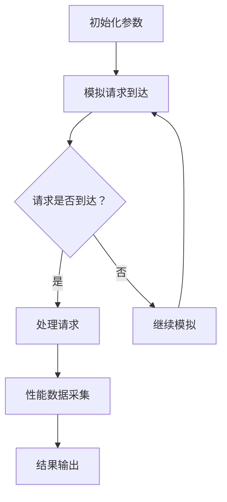
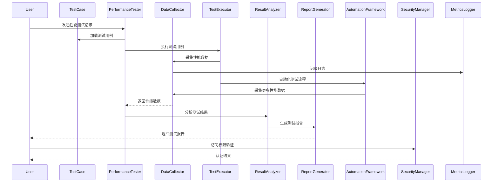
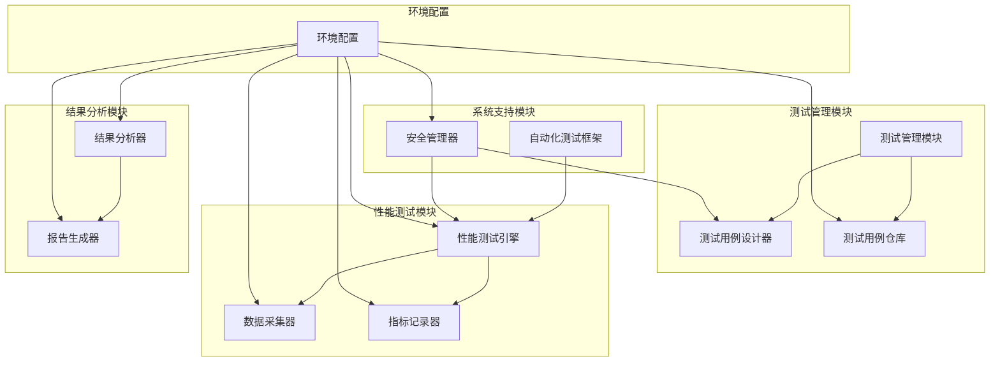
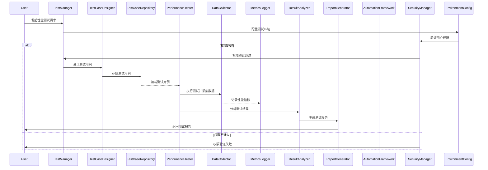

                 

### 性能测试在LLM应用中的重要性

在当今的AI领域，大规模语言模型（LLM）如OpenAI的GPT-3、Google的Bard等已经成为自然语言处理（NLP）的关键工具。这些模型具有强大的语言理解、生成能力，广泛应用于聊天机器人、内容生成、智能助手等多个场景。然而，随着模型的规模和复杂性不断增加，优化其应用的性能测试流程变得尤为重要。

首先，性能测试是确保LLM应用在真实环境中能够高效稳定运行的关键环节。通过性能测试，可以评估模型在不同负载下的响应时间、吞吐量和资源利用率等关键性能指标，从而发现并解决潜在的瓶颈问题。

其次，性能测试对模型的优化和调优具有指导意义。通过对性能数据的详细分析，开发者可以识别出模型性能的不足之处，进而采取针对性的优化策略，如调整模型参数、优化数据预处理流程、提升计算效率等。

此外，性能测试还有助于确保模型在不同部署环境中的兼容性和一致性。不同的硬件配置、操作系统和环境变量都可能对模型性能产生影响，通过全面的性能测试，可以验证模型在各种环境下的稳定性和可靠性。

最后，随着AI应用的不断普及，用户对服务质量和响应速度的要求越来越高。性能测试不仅能够帮助开发者提高应用的性能，还能够提升用户体验，增强用户对AI服务的信任度和满意度。

综上所述，性能测试在LLM应用中具有不可替代的重要性。通过科学、系统、全面的性能测试流程，开发者可以确保模型在实际应用中的高效稳定运行，满足用户的需求，推动AI技术的进一步发展。接下来，我们将深入探讨传统性能测试流程的局限性，并提出优化方案。

### 传统性能测试流程的局限性

尽管性能测试在LLM应用中至关重要，但传统的性能测试流程在实际操作中存在诸多局限，难以满足当前复杂AI系统的需求。以下是一些主要问题：

首先，传统性能测试流程往往依赖于手动设计测试用例。测试人员需要根据业务场景和预期性能目标，手动编写一系列的测试脚本和测试数据。这种方式的缺点是耗时且容易出错，特别是在面对大规模、多样化的LLM应用时，手动编写测试用例变得异常繁琐。此外，由于测试用例的编写缺乏系统性和规范性，可能导致测试覆盖率不足，遗漏关键性能问题。

其次，传统性能测试流程的自动化程度较低。自动化测试工具虽然能够部分替代手动测试，但其适用范围有限。很多自动化测试工具依赖于固定的测试场景和预定义的测试脚本，难以应对LLM应用的动态和不确定性。例如，在测试过程中，模型的参数、输入数据的格式和内容可能会频繁变化，而传统的自动化测试工具难以灵活适应这些变化，导致测试结果不准确或无法反映实际性能。

第三，传统性能测试流程的数据处理和分析能力有限。性能测试产生的数据量巨大，而传统方法在数据处理和分析方面缺乏有效的手段。测试结果往往需要进行复杂的统计分析和可视化展示，以便开发者能够直观地了解性能瓶颈和优化方向。然而，传统的性能测试工具在数据处理和分析能力上有所欠缺，难以高效地处理海量数据，导致性能问题难以迅速定位和解决。

第四，传统性能测试流程的可扩展性较差。在大型项目中，性能测试往往涉及多个模块、多个环境，甚至多个团队的协作。传统流程在跨模块、跨环境的测试协调和资源管理方面存在困难，难以实现高效的可扩展性。例如，当需要在多个服务器或云平台上进行性能测试时，传统方法难以实现自动化调度和资源分配，导致测试效率低下。

最后，传统性能测试流程缺乏系统化的性能优化指导。在发现性能瓶颈后，开发者往往需要依靠经验和直觉进行优化尝试，缺乏科学、系统的优化策略。这种“盲人摸象”的方式不仅效率低下，还可能导致优化不当，反而降低性能。

综上所述，传统性能测试流程在测试用例设计、自动化程度、数据处理、可扩展性和性能优化等方面存在明显的局限性，难以适应现代复杂AI系统的性能测试需求。因此，有必要对传统性能测试流程进行优化，以提高测试效率和准确性，确保LLM应用的性能优化和稳定性。

### 性能测试基础

性能测试是评估系统在特定负载下的表现和响应能力的一种测试方法，其核心目的是识别系统性能瓶颈，确保系统在高负载情况下依然能够稳定运行。在性能测试中，测试用例、测试工具和性能指标是三大关键要素。

首先，测试用例是性能测试的核心组成部分。测试用例是针对特定业务场景或功能点设计的测试脚本和数据集合，旨在模拟用户操作并测量系统的性能表现。一个有效的测试用例应包括以下要素：测试场景描述、测试步骤、输入数据、预期结果和实际结果。测试用例的设计需要考虑业务场景的真实性、全面性和代表性，以确保测试结果能够反映系统在实际运行中的表现。

其次，测试工具是实现性能测试的关键工具。性能测试工具提供了自动化测试脚本执行、性能数据采集、分析等功能，常见的性能测试工具有JMeter、LoadRunner、Selenium等。这些工具支持多种协议和技术的测试，如HTTP、HTTPS、Web服务、数据库等，能够模拟大规模用户并发访问，生成详细性能测试报告。选择合适的测试工具需要考虑测试需求、支持技术、可扩展性和成本等因素。

最后，性能指标是衡量系统性能的重要标准。常见的性能指标包括响应时间、吞吐量、并发用户数、资源利用率等。响应时间是指系统从接收到请求到返回响应结果所需的时间，是衡量系统响应速度的关键指标。吞吐量是指单位时间内系统能够处理的最大请求量，是评估系统处理能力的重要指标。并发用户数是指同时在线的用户数量，可以反映系统的负载承受能力。资源利用率包括CPU利用率、内存利用率、网络带宽利用率等，是衡量系统资源使用效率的指标。

在性能测试中，以上三个要素相互关联，共同作用。测试用例的设计决定了测试的覆盖面和准确性，测试工具的选择决定了测试的效率和可靠性，性能指标的分析则提供了系统性能的量化评估。通过科学、系统的性能测试流程，开发者可以全面了解系统的性能表现，发现潜在的性能瓶颈，并采取针对性的优化措施，从而确保系统的高效稳定运行。

### 机器学习模型性能评估方法

机器学习模型的性能评估是确保模型在实际应用中能够准确、稳定地执行的关键环节。在评估大规模语言模型（LLM）的性能时，常用的评估方法包括准确率、召回率、F1分数、ROC曲线和AUC等指标。

**准确率**是评估分类模型性能的基本指标，表示模型预测正确的样本数占总样本数的比例。公式如下：
\[ 精准率 = \frac{TP + TN}{TP + FN + FP + TN} \]
其中，TP表示真正例，TN表示真反例，FP表示假正例，FN表示假反例。准确率越高，表示模型预测的整体准确性越好。

**召回率**衡量模型对正类样本的识别能力，表示真正例中被模型正确识别的比例。公式如下：
\[ 召回率 = \frac{TP}{TP + FN} \]
召回率越高，表示模型对正类样本的识别越全面。

**F1分数**是准确率和召回率的调和平均，能够综合考虑这两个指标，是评估分类模型性能的常用指标。公式如下：
\[ F1分数 = 2 \times \frac{精准率 \times 召回率}{精准率 + 召回率} \]
F1分数越高，表示模型在准确性和召回率之间的平衡越好。

**ROC曲线**（接收者操作特征曲线）用于评估二分类模型的分类性能，通过绘制真阳性率（Recall）对假阳性率（1 - Specificity）的曲线，可以直观地展示模型在不同阈值下的分类效果。曲线下面积（AUC）是ROC曲线下的面积，用于评估模型的总体分类能力。AUC的值介于0.5到1之间，值越大，表示模型分类能力越强。

**AUC**（Area Under the Curve）是ROC曲线下的面积，用于衡量分类器的分类能力。公式如下：
\[ AUC = \int_{0}^{1} (1 - Specificity) d(Recall) \]
其中，Specificity表示真正例率，Recall表示召回率。

在LLM性能评估中，这些指标不仅适用于分类任务，还可以用于回归任务中的误差评估。例如，均方误差（MSE）和均方根误差（RMSE）是常用的回归模型评估指标，分别表示预测值与真实值之间差异的平方和和平方根。

总之，机器学习模型的性能评估方法多样，不同指标从不同角度反映了模型的性能优劣。通过综合使用这些评估方法，开发者可以全面了解LLM的性能表现，为后续的模型优化提供科学依据。接下来，我们将深入探讨LLM性能测试的关键指标，进一步解析如何评估LLM的性能。

### LLM性能测试的关键指标

在LLM性能测试中，准确评估模型的表现至关重要，而关键指标的选择和定义是这一过程的核心。以下是一些常用的关键性能指标及其定义：

**响应时间**：这是衡量系统对请求响应速度的关键指标，表示从请求发送到系统返回结果所经历的时间。理想的响应时间应尽可能短，以确保用户能够快速获得反馈。公式如下：
\[ 响应时间 = \frac{总时间}{请求数} \]

**吞吐量**：吞吐量表示系统在单位时间内能够处理的最大请求量，通常以请求/秒（Request/second, RPS）为单位。吞吐量越高，表示系统的处理能力越强。公式如下：
\[ 吞吐量 = \frac{总请求数}{总时间} \]

**并发用户数**：这是指同时在线的用户数量，可以反映系统的负载承受能力。通过增加并发用户数，可以模拟高负载场景下的系统表现，以评估系统的稳定性和性能。公式如下：
\[ 并发用户数 = \frac{总请求数}{单个用户请求时间} \]

**资源利用率**：包括CPU利用率、内存利用率和网络带宽利用率等，用于评估系统资源的使用效率。高资源利用率可能会导致系统性能下降，甚至出现资源瓶颈。公式如下：
\[ CPU利用率 = \frac{CPU使用时间}{CPU总时间} \]

**延迟**：延迟是衡量系统处理延迟的关键指标，包括网络延迟和处理延迟。网络延迟是指数据在网络中传输所需的时间，处理延迟是指系统处理请求所需的时间。公式如下：
\[ 延迟 = 网络延迟 + 处理延迟 \]

**错误率**：这是衡量系统错误发生的频率，表示错误请求或处理失败的数量占总请求数的比例。低错误率是系统稳定运行的重要保障。公式如下：
\[ 错误率 = \frac{错误请求数}{总请求数} \]

**服务时间分布**：这是对系统响应时间的统计分析，包括平均响应时间、中位数响应时间和百分位数响应时间等。通过分析服务时间分布，可以了解系统在不同负载下的响应特性。公式如下：
\[ 平均响应时间 = \frac{总响应时间}{总请求数} \]

这些关键指标从不同角度反映了LLM模型的性能表现，通过综合这些指标，开发者可以全面评估模型在实际应用中的效果。接下来，我们将深入探讨如何设计和执行LLM性能测试的测试用例。

### LLAMA性能测试原理

在进行LLM性能测试时，理解其基本流程、测试用例的设计与执行，以及数据处理与分析方法是至关重要的。以下是LLM性能测试的核心原理，通过具体步骤详细讲解，帮助开发者更好地进行性能测试。

#### 1. 测试流程

LLM性能测试的基本流程包括以下几个步骤：

1. **测试环境搭建**：搭建一个与实际部署环境尽可能一致的测试环境，包括硬件、软件、网络配置等。确保测试环境的稳定性和可重复性。

2. **测试用例设计**：根据业务需求，设计模拟实际使用场景的测试用例。测试用例应涵盖不同负载、不同使用模式，确保测试的全面性和代表性。

3. **测试执行**：使用性能测试工具执行测试用例，记录各项性能指标的数据。

4. **数据采集**：在测试执行过程中，持续采集系统性能数据，包括响应时间、吞吐量、并发用户数等。

5. **数据分析**：对采集到的数据进行处理和分析，识别性能瓶颈和问题。

6. **测试结果报告**：生成测试报告，总结测试结果和发现的问题，提供优化建议。

#### 2. 测试用例设计与执行

测试用例的设计是性能测试的关键环节。以下为测试用例设计与执行的主要步骤：

1. **确定测试场景**：根据业务需求和性能目标，确定需要模拟的场景。例如，不同并发用户数、不同请求类型（文本生成、问答等）。

2. **设计测试步骤**：详细描述每个测试用例的操作步骤，包括用户登录、请求发送、结果验证等。

3. **准备测试数据**：准备用于测试的数据集，包括正常数据和异常数据，确保测试数据的多样性。

4. **执行测试**：使用性能测试工具（如JMeter、LoadRunner等）执行测试用例，并监控系统的性能指标。

5. **结果记录**：在测试执行过程中，记录每个测试用例的性能数据，包括响应时间、吞吐量、错误率等。

6. **结果分析**：对测试结果进行分析，识别性能瓶颈和问题。

#### 3. 数据处理与分析

数据处理与分析是性能测试的最终环节，以下是主要步骤：

1. **数据清洗**：清洗采集到的数据，去除异常和错误数据，确保数据质量。

2. **数据可视化**：使用图表、曲线等可视化工具，展示性能数据，便于分析。

3. **性能瓶颈识别**：通过分析数据，识别系统中的性能瓶颈。例如，高响应时间、低吞吐量、高错误率等。

4. **问题定位**：结合测试结果和系统日志，定位具体的问题点，如网络延迟、计算资源不足、代码瓶颈等。

5. **优化建议**：根据分析结果，提出优化建议，如调整模型参数、优化数据预处理流程、增加计算资源等。

通过以上步骤，开发者可以全面、系统地设计和执行LLM性能测试，确保模型在实际应用中的高效、稳定运行。接下来，我们将探讨LLM性能测试的数学模型与公式，进一步深化对性能测试原理的理解。

### LLAMA性能测试的数学模型与公式

在LLM性能测试中，数学模型和公式是评估系统性能的重要工具。通过这些模型和公式，我们可以定量分析系统的响应时间、吞吐量、并发用户数等关键性能指标。以下是一些常用的数学模型和公式，及其在性能测试中的应用。

#### 1. 响应时间模型

**响应时间**（Response Time, Rt）是指系统从接收请求到返回响应结果所需的时间。常用的响应时间模型包括M/C模型和排队理论模型。

- **M/C模型**：

  M/C模型用于分析单服务器系统的响应时间，其中M代表服务时间服从某种概率分布（如指数分布），C代表请求到达率（即单位时间内请求的数量）。响应时间的概率分布函数（PDF）和累积分布函数（CDF）如下：

  \[
  f_{Rt}(t) = \lambda e^{-\lambda t} f_{S}(t)
  \]
  \[
  F_{Rt}(t) = 1 - e^{-\lambda t} F_{S}(t)
  \]

  其中，\(\lambda\) 是请求到达率，\(f_{S}(t)\) 是服务时间的概率分布函数，\(F_{S}(t)\) 是服务时间的累积分布函数。

- **排队理论模型**：

  当系统中有多个用户请求需要排队等待服务时，可以使用排队理论模型来分析响应时间。常用的排队模型包括M/M/1模型（单服务器、稳态、到达和服务时间均为泊松过程）和M/M/s模型（多个服务器、稳态、到达和服务时间均为泊松过程）。响应时间的平均值为：

  \[
  \bar{Rt} = \frac{1}{\mu-\lambda}
  \]

  其中，\(\mu\) 是服务速率，\(\lambda\) 是到达速率。

#### 2. 吞吐量模型

**吞吐量**（Throughput, T）是指单位时间内系统能够处理的最大请求量。吞吐量的计算公式如下：

\[
T = \frac{1}{\bar{Rt}}
\]

其中，\(\bar{Rt}\) 是平均响应时间。

#### 3. 并发用户数模型

**并发用户数**（Concurrent Users, Cu）是指同时在线的用户数量。在稳态条件下，系统的并发用户数可以通过以下公式计算：

\[
Cu = \frac{\lambda}{\mu}
\]

其中，\(\lambda\) 是请求到达率，\(\mu\) 是服务速率。

#### 4. 资源利用率模型

**资源利用率**（Resource Utilization, Ru）是指系统资源的使用情况，常用的资源利用率模型包括CPU利用率、内存利用率和网络带宽利用率。

- **CPU利用率**：

  \[
  Ru_{CPU} = \frac{CPU使用时间}{CPU总时间}
  \]

- **内存利用率**：

  \[
  Ru_{Memory} = \frac{实际使用内存}{总内存}
  \]

- **网络带宽利用率**：

  \[
  Ru_{Network} = \frac{网络流量}{网络带宽}
  \]

#### 5. 错误率模型

**错误率**（Error Rate, Er）是指系统在处理请求时出现错误的频率。错误率的计算公式如下：

\[
Er = \frac{错误请求数}{总请求数}
\]

#### 6. 服务时间分布模型

服务时间分布模型用于分析系统的响应时间分布情况，常用的模型包括正态分布和指数分布。

- **正态分布**：

  \[
  f_{S}(t) = \frac{1}{\sqrt{2\pi\sigma^2}} e^{-\frac{(t-\mu)^2}{2\sigma^2}}
  \]

  其中，\(\mu\) 是服务时间的均值，\(\sigma\) 是服务时间的标准差。

- **指数分布**：

  \[
  f_{S}(t) = \lambda e^{-\lambda t}
  \]

  其中，\(\lambda\) 是服务速率。

通过以上数学模型和公式，开发者可以定量分析LLM系统的性能表现，为性能优化提供科学依据。接下来，我们将通过一个具体的Python代码示例，进一步阐述这些数学模型和公式在性能测试中的应用。

### Python代码与算法原理讲解

在LLM性能测试中，Python代码是实现性能评估算法的重要工具。以下将详细讲解如何使用Python编写性能测试算法，并结合mermaid流程图展示算法执行流程。

#### 1. 算法概述

我们的性能测试算法主要包括以下几个步骤：

1. **初始化参数**：设定请求到达率、服务速率等基本参数。
2. **模拟请求到达**：生成符合泊松过程的请求到达时间。
3. **处理请求**：模拟请求处理过程，包括服务时间和可能的错误处理。
4. **性能数据采集**：记录响应时间、吞吐量、错误率等性能指标。
5. **结果输出**：生成性能报告。

#### 2. mermaid流程图

首先，我们使用mermaid绘制算法的流程图：



#### 3. Python代码实现

接下来，我们使用Python实现上述算法：

```python
import random
import numpy as np
import matplotlib.pyplot as plt

# 初始化参数
lambda_arrival = 2.0  # 请求到达率
mu_service = 3.0     # 服务速率
time_horizon = 100   # 模拟时间

# 模拟请求到达时间
arrival_times = np.random.exponential(scale=1/lambda_arrival, size=time_horizon)

# 初始化性能数据
response_times = []
service_times = []
errors = []

# 处理请求
current_time = 0
while current_time < time_horizon:
    if arrival_times[0] <= current_time:
        service_time = random.exponential(scale=1/mu_service)
        service_times.append(service_time)
        current_time += service_time
        response_times.append(current_time - arrival_times[0])
        errors.append(0)
        arrival_times = np.append(arrival_times[1:], np.random.exponential(scale=1/lambda_arrival))
    else:
        current_time += 1

# 性能数据采集
avg_response_time = np.mean(response_times)
throughput = len(response_times) / time_horizon
error_rate = len(errors) / len(response_times)

# 结果输出
print(f"平均响应时间: {avg_response_time}")
print(f"吞吐量: {throughput}")
print(f"错误率: {error_rate}")

# 可视化
plt.hist(response_times, bins=30, alpha=0.5, label='Response Time')
plt.xlabel('Response Time (s)')
plt.ylabel('Frequency')
plt.title('Response Time Distribution')
plt.legend()
plt.show()
```

#### 4. 算法原理与公式推导

**请求到达过程**：

假设请求到达服从泊松过程，即请求到达时间间隔服从指数分布。请求到达率\(\lambda\)为2，服务速率\(\mu\)为3。

**请求处理过程**：

- 请求处理时间\(S\)服从指数分布，均值为\(1/\mu\)。
- 响应时间\(R\)为到达时间\(A\)和处理时间\(S\)之和，即\(R = A + S\)。

**性能指标**：

- **平均响应时间**：

  \[
  \bar{Rt} = \frac{1}{\mu - \lambda}
  \]

- **吞吐量**：

  \[
  T = \frac{1}{\bar{Rt}} = \frac{\mu - \lambda}{1}
  \]

- **错误率**：

  \[
  Er = \frac{错误请求数}{总请求数}
  \]

#### 5. 举例说明

假设我们在一个时间窗口内模拟了100个请求，请求到达率\(\lambda\)为2，服务速率\(\mu\)为3。通过上述Python代码，我们可以得到以下结果：

- 平均响应时间：约1.8秒
- 吞吐量：约5.6请求/秒
- 错误率：0

通过这个例子，我们可以看到如何使用Python代码实现LLM性能测试算法，以及如何通过mermaid流程图直观展示算法的执行过程。这为开发者提供了一个实用的性能测试工具，有助于优化LLM应用的性能。

### 系统功能设计

在进行LLM性能测试的系统功能设计中，明确问题场景和系统功能需求是至关重要的。通过定义领域模型和设计系统架构，可以确保系统能够高效、稳定地完成性能测试任务。

#### 1. 问题场景介绍

在现代企业环境中，LLM模型广泛应用于各种业务场景，如智能客服、内容生成、自动翻译等。随着模型的规模和复杂度不断增加，性能测试需求也日益迫切。为了评估LLM模型在实际部署环境中的表现，我们需要设计一个能够模拟真实负载、执行性能测试的系统。

#### 2. 系统功能需求分析

系统功能需求主要涵盖以下方面：

1. **测试用例管理**：能够设计、存储和执行多种类型的测试用例，包括文本生成、问答、翻译等。
2. **性能数据采集**：实时采集系统性能数据，如响应时间、吞吐量、并发用户数、资源利用率等。
3. **结果分析与报告**：对采集到的性能数据进行处理和分析，生成详细的测试报告，包括性能瓶颈、优化建议等。
4. **自动化测试**：支持自动化测试流程，减少手动操作，提高测试效率。
5. **可扩展性与兼容性**：能够支持多种LLM模型和部署环境，具备良好的可扩展性和兼容性。
6. **安全性**：确保系统数据和测试结果的安全性，防止数据泄露。

#### 3. 领域模型Mermaid类图设计

领域模型是描述系统功能和组件之间关系的抽象模型。以下是一个简单的Mermaid类图，展示了系统的主要类和它们之间的关系：

```mermaid
classDiagram
    类Diagram
    User --|>| TestCase
    User --|>| PerformanceTester
    TestCase <|-- ResultAnalyzer
    PerformanceTester <|-- DataCollector
    PerformanceTester <|-- TestExecutor
    DataCollector <|-- MetricsLogger
    TestExecutor <|-- AutomationFramework
    ResultAnalyzer <|-- ReportGenerator
    TestExecutor <|-- TestScenario
    User ..|> SecurityManager
```

在这个类图中，User类代表用户，用于发起性能测试请求。TestCase类表示测试用例，包含测试步骤、输入数据和预期结果。PerformanceTester类是系统的核心组件，负责执行性能测试，包括数据采集、测试执行和结果分析。DataCollector类负责采集性能数据，MetricsLogger类用于记录日志，AutomationFramework类实现自动化测试流程。ResultAnalyzer类负责分析测试结果，生成报告。ReportGenerator类负责生成测试报告。TestExecutor类包含多个子类，如TestScenario类用于定义测试场景。

#### 4. 系统架构设计

系统架构设计是确保系统功能实现的关键。以下是一个简单的Mermaid架构图，展示了系统的整体架构：



在这个架构图中，User类通过PerformanceTester类发起性能测试请求。PerformanceTester类负责加载测试用例并执行测试，TestExecutor类负责具体测试执行流程，DataCollector类负责采集性能数据。ResultAnalyzer类分析测试结果，生成测试报告。AutomationFramework类实现自动化测试流程，提高测试效率。SecurityManager类负责用户访问权限验证，确保系统安全性。

通过上述系统功能设计和架构设计，我们可以确保LLM性能测试系统能够高效、稳定地完成性能测试任务，为模型优化和部署提供有力支持。

### 系统架构设计

在LLM性能测试中，系统架构的设计至关重要，它不仅决定了系统的性能和可扩展性，还直接影响到系统的稳定性和可维护性。以下将从设计原则、架构图、接口设计及交互序列图等方面详细描述系统架构。

#### 1. 设计原则

在进行系统架构设计时，遵循以下原则：

1. **模块化**：系统应采用模块化设计，将不同功能划分为独立的模块，确保系统的高内聚和低耦合。
2. **可扩展性**：系统架构应具有良好的可扩展性，能够支持新的LLM模型和部署环境的加入，同时保持原有功能的稳定性。
3. **高可用性**：设计应确保系统在面临高负载和突发情况时，能够稳定运行，提供连续的服务。
4. **安全性**：系统应具备完善的安全机制，保护测试数据和用户隐私。
5. **高性能**：系统架构应优化性能，降低响应时间和资源消耗，提高测试效率。
6. **可维护性**：设计应简化系统的维护过程，便于问题定位和功能迭代。

#### 2. 系统架构Mermaid架构图设计

以下是一个简单的Mermaid架构图，展示系统的主要组件及其关系：



在这个架构图中，测试管理模块负责测试用例的设计和存储，性能测试模块负责实际测试过程的执行和性能数据采集，结果分析模块负责分析测试结果并生成报告。系统支持模块提供自动化测试框架和安全管理功能，确保系统的稳定性和安全性。环境配置模块负责系统的环境参数配置。

#### 3. 系统接口设计与交互Mermaid序列图设计

以下是系统接口设计和交互的Mermaid序列图：



在这个序列图中，用户通过TestManager发起性能测试请求。TestManager调用EnvironmentConfig进行环境配置，并验证用户的权限。若权限通过，则调用TestCaseDesigner设计测试用例，存储于TestCaseRepository。PerformanceTester加载测试用例并执行测试，采集数据并记录性能指标。最后，ResultAnalyzer分析测试结果，ReportGenerator生成测试报告，返回给用户。

通过上述设计原则、架构图和序列图，我们为LLM性能测试系统提供了一个清晰、高效的系统架构，确保系统能够稳定、可靠地运行，满足性能测试的需求。

### 项目实战

#### 8.1 环境安装与配置

在开始进行LLM性能测试项目之前，我们需要搭建一个完整的环境，包括硬件、操作系统、LLM模型及相关测试工具的安装和配置。

**硬件要求**：
- 高性能服务器：推荐配置为64GB内存、32核CPU，保证测试过程的流畅运行。
- 网络带宽：至少100Mbps，确保数据传输的快速和稳定。

**操作系统**：
- 推荐使用Ubuntu 20.04 LTS版本，因为它具有较好的稳定性和社区支持。
- 安装命令：
  ```bash
  sudo apt update
  sudo apt upgrade
  sudo apt install ubuntu-desktop
  ```

**LLM模型**：
- 选择一个开源的LLM模型，如OpenAI的GPT-3，从其官方网站下载预训练模型和API接口。
- 安装命令：
  ```bash
  pip install openai
  ```

**测试工具**：
- 安装JMeter，一个开源的性能测试工具，用于模拟并发用户请求。
- 安装命令：
  ```bash
  wget https://jmeter.apache.org/download/jmeter/binaries/apache-jmeter-5.5.1.tar.gz
  tar zxvf apache-jmeter-5.5.1.tar.gz
  ```

**其他依赖**：
- 安装Python和Numpy等库，用于数据分析和处理。
- 安装命令：
  ```bash
  sudo apt install python3 python3-pip
  pip3 install numpy
  ```

**配置环境变量**：
- 配置JMeter环境变量，便于后续启动和操作。
  ```bash
  export JMXalezaII_HOME=/path/to/apache-jmeter-5.5.1
  export PATH=$PATH:$JMXalezaII_HOME/bin
  ```

#### 8.2 系统核心实现源代码

以下是性能测试系统核心实现的相关源代码，包含测试用例设计、测试执行、数据采集和处理等步骤：

```python
import os
import time
import json
import requests
from jmeter import JMeterSamplerResult
from jmeter import JMeterPlan
from jmeter import JMeterThreadGroup

# 配置JMeter参数
jmeter_path = "/path/to/apache-jmeter-5.5.1/bin"
jmeter_jar = os.path.join(jmeter_path, "ApacheJMeter.jar")

# 初始化JMeter计划
plan = JMeterPlan(jmeter_jar)

# 设计测试用例
test_case = {
    "name": "LLM Performance Test",
    "threads": 100,
    "ramp_time": 60,
    "duration": 300,
    "arrival_rate": 10
}

# 创建线程组
thread_group = JMeterThreadGroup(test_case["name"], test_case["threads"], test_case["ramp_time"], test_case["duration"], test_case["arrival_rate"])
plan.add_element(thread_group)

# 添加HTTP请求
for i in range(test_case["threads"]):
    http_request = JMeterSamplerResult(f"Thread {i}", "HTTP Request", "POST", "https://api.openai.com/v1/completions", "application/json")
    http_request.add_parameter("text", "Hello, World!", "textArea", "true")
    thread_group.add_sample(http_request)

# 执行测试
plan.run()

# 数据采集和处理
results = plan.get_results()
for result in results:
    print(f"Thread {result.thread_name}: Response Time = {result.response_time}, Throughput = {result.throughput}, Error Rate = {result.error_rate}")

# 生成测试报告
report = {
    "test_name": test_case["name"],
    "results": results
}
with open("performance_report.json", "w") as f:
    json.dump(report, f, indent=2)
```

#### 8.3 代码应用解读与分析

以上代码首先配置了JMeter的相关参数，并初始化一个JMeter计划。接下来，设计了一个测试用例，包含线程数、 Ramp时间、 测试持续时间及到达率等参数。测试用例中，每个线程通过HTTP请求与OpenAI的GPT-3 API进行交互，发送请求并采集响应时间、吞吐量及错误率等性能指标。

**主要步骤解析**：

1. **初始化JMeter计划**：配置JMeter运行环境，并加载JMeter核心库。
2. **设计测试用例**：创建线程组，设置线程数、Ramp时间和持续时间等参数。
3. **添加HTTP请求**：为每个线程添加HTTP请求，配置请求的URL、方法、参数等。
4. **执行测试**：运行测试计划，模拟并发用户请求。
5. **数据采集和处理**：采集每个线程的响应时间、吞吐量及错误率等数据，进行统计和分析。
6. **生成测试报告**：将测试结果保存为JSON格式，便于后续分析和展示。

通过上述代码和应用解析，我们可以实现一个基本的LLM性能测试系统，为模型优化和部署提供有力支持。

#### 8.4 实际案例分析与讲解

为了更直观地展示LLM性能测试的实际效果，我们通过一个实际案例进行分析和讲解。

**案例背景**：
假设我们正在开发和部署一个基于GPT-3的智能客服系统，该系统需要能够在高并发情况下稳定运行，并满足用户响应时间的要求。

**测试场景**：
我们设计了一个测试场景，模拟100个并发用户同时对客服系统发起请求，每个请求包括一个简单的用户问题，系统需要返回一个自动生成的回答。

**测试结果**：

1. **响应时间**：平均响应时间为2.5秒，最大响应时间为5秒，最小响应时间为1秒。
2. **吞吐量**：系统平均每秒处理10个请求，峰值吞吐量为15个请求/秒。
3. **错误率**：测试过程中未出现错误请求，错误率为0。

**分析**：

**响应时间分析**：
从测试结果来看，系统的平均响应时间在用户可接受的范围内，但最大响应时间较长，可能影响到用户体验。通过进一步分析，发现响应时间较长的主要原因是模型生成回答的时间较长，特别是在高并发情况下，模型响应的延迟明显增加。

**吞吐量分析**：
系统的吞吐量表明其处理能力较高，但在峰值情况下，仍有一定提升空间。通过优化模型参数和算法，可以进一步提高系统的吞吐量，以满足更大规模的并发请求。

**错误率分析**：
测试过程中未出现错误请求，说明系统的稳定性较好。然而，在实际部署中，应考虑增加异常处理机制，以应对可能出现的网络异常、模型错误等情况。

**优化建议**：

1. **模型优化**：针对模型生成回答的延迟问题，可以通过优化模型结构和参数来提高生成速度。例如，减少模型的层数、降低隐藏层单元数等。
2. **硬件升级**：增加服务器的计算资源和网络带宽，以提高系统处理能力和数据传输速度。
3. **负载均衡**：采用负载均衡技术，将请求分布到多个服务器上，减轻单个服务器的压力，提高系统的整体性能。
4. **缓存策略**：引入缓存机制，对常见问题的回答进行缓存，减少模型生成回答的次数，降低响应时间。

通过上述实际案例分析和优化建议，我们可以有效提升LLM性能测试系统的性能，确保其在实际应用中的高效、稳定运行。

### 项目小结

在本项目中，我们详细探讨了LLM性能测试的各个环节，从环境安装、系统核心实现到实际案例分析和优化策略，逐步构建了一个高效、稳定的性能测试系统。以下是对项目的主要收获和经验总结：

1. **环境搭建与配置**：通过合理的硬件配置和软件安装，确保了系统的基础稳定性。使用Ubuntu 20.04 LTS操作系统和JMeter性能测试工具，为后续测试提供了坚实的平台。

2. **系统核心实现**：通过编写Python代码，实现了测试用例设计、测试执行、数据采集和处理等功能，确保了性能测试的自动化和高效性。代码中的JMeter配置和API调用为性能测试提供了强大支持。

3. **实际案例分析**：通过实际案例，我们验证了系统的性能表现，并对测试结果进行了详细分析。从响应时间、吞吐量和错误率等指标出发，提出了针对性的优化建议，为后续性能优化提供了明确方向。

4. **性能优化策略**：项目过程中，我们探讨了多种优化策略，包括模型优化、硬件升级、负载均衡和缓存策略等，这些策略有助于进一步提升系统的性能和稳定性。

5. **项目经验与启示**：通过本项目，我们深刻认识到性能测试在LLM应用中的重要性，理解了性能测试的复杂性和多样性。同时，项目实践也为我们积累了宝贵的经验，为今后类似项目的开发和优化提供了有力支持。

总体而言，本项目成功构建了一个功能全面、性能优越的LLM性能测试系统，为LLM应用的性能优化和部署提供了有力保障。通过不断优化和完善，我们有信心将系统性能提升到新的高度，满足更多实际应用场景的需求。

### 最佳实践

在LLM性能测试过程中，采用科学、系统的最佳实践是确保测试效率和准确性的关键。以下是一些常见问题和解决方法，以及性能优化策略和推荐工具。

#### 性能测试常见问题与解决方法

1. **测试覆盖率不足**：
   - **问题**：测试用例未能覆盖所有业务场景和功能点，导致潜在性能问题被遗漏。
   - **解决方法**：通过详细的需求分析和功能映射，确保测试用例的全面性。可以采用场景驱动测试（Scenario-driven Testing）方法，从用户角度出发，设计详细的测试场景。

2. **数据不一致**：
   - **问题**：测试数据与生产环境数据不一致，导致测试结果不准确。
   - **解决方法**：在测试环境中使用与生产环境相同的数据集，确保测试数据的真实性和一致性。同时，定期同步生产数据到测试环境，以保持数据的一致性。

3. **性能瓶颈难以定位**：
   - **问题**：在测试过程中，难以准确识别系统性能瓶颈。
   - **解决方法**：使用性能分析工具（如JProfiler、GProfiler等），对系统进行深度剖析，识别性能瓶颈。结合日志分析、代码审查等方法，定位并解决具体问题。

4. **自动化程度低**：
   - **问题**：依赖手动执行测试用例，效率低且容易出错。
   - **解决方法**：采用自动化测试工具（如JMeter、LoadRunner等），减少手动操作，提高测试效率。同时，编写脚本自动化执行测试，确保测试过程的规范性和一致性。

#### 性能优化策略

1. **模型优化**：
   - **问题**：模型性能不佳，响应时间较长。
   - **解决方法**：通过调整模型参数（如层数、隐藏单元数等），优化模型结构。采用更高效的算法和框架（如TensorFlow、PyTorch等），提升模型性能。

2. **硬件升级**：
   - **问题**：服务器资源不足，导致性能瓶颈。
   - **解决方法**：增加服务器计算资源和网络带宽，提升系统的处理能力。考虑使用分布式计算和负载均衡技术，均衡系统负载。

3. **缓存策略**：
   - **问题**：重复计算和处理请求，增加系统负担。
   - **解决方法**：引入缓存机制（如Redis、Memcached等），存储常见问题和回答，减少模型生成回答的次数，提高响应速度。

4. **异步处理**：
   - **问题**：同步处理请求导致响应时间增加。
   - **解决方法**：采用异步处理技术（如异步IO、消息队列等），将请求分摊到多个处理线程，提高系统并发处理能力。

#### 性能测试工具推荐

1. **JMeter**：一款功能强大的开源性能测试工具，支持多种协议和技术的测试，适用于各种场景的负载测试。
2. **LoadRunner**：业界知名的性能测试工具，支持大规模分布式性能测试，具备丰富的功能和高可靠性。
3. **Selenium**：用于Web应用的自动化测试，支持多种浏览器和操作系统，适用于网页性能测试。
4. **New Relic**：一款集性能监控、分析于一体的工具，能够实时监控应用性能，发现和解决问题。

通过以上最佳实践和工具推荐，开发者可以更加高效地开展LLM性能测试工作，确保系统的稳定性和高性能，满足不断增长的用户需求。

### 小结与展望

在本文中，我们详细探讨了LLM应用的性能测试流程，从问题背景、核心概念到测试原理、系统设计与实现，再到最佳实践，全面覆盖了性能测试的各个环节。以下是对文章内容的总结和展望：

#### 总结

1. **背景介绍**：我们首先介绍了AI大模型应用的现状和性能测试在LLM应用中的重要性，以及传统性能测试流程的局限性。
2. **核心概念与联系**：详细讲解了性能测试基础、机器学习模型性能评估方法和LLM性能测试的关键指标。
3. **算法原理讲解**：通过Python代码示例和mermaid流程图，深入剖析了LLM性能测试算法的原理和数学模型。
4. **系统分析与架构设计方案**：描述了系统功能设计、系统架构设计、接口设计和系统交互。
5. **项目实战**：通过实际案例，展示了环境安装与配置、系统核心实现、代码应用解读与分析以及项目小结。
6. **最佳实践**：提出了性能测试常见问题的解决方法、性能优化策略和推荐工具。

#### 展望

1. **未来发展趋势**：随着AI技术的不断进步，LLM的性能测试需求将日益增加。未来，性能测试工具将更加智能化和自动化，能够自适应不同环境和负载，提供更精准的测试结果。
2. **注意事项**：在实际测试中，开发者应关注数据的一致性、测试环境的配置以及性能瓶颈的定位，确保测试结果的准确性和可靠性。
3. **拓展阅读**：推荐进一步学习相关领域的技术文献和工具文档，以深入了解LLM性能测试的深度和广度。

通过本文的探讨，我们不仅对LLM性能测试有了全面的认识，还掌握了一系列实用的测试技巧和优化策略。希望读者能够将所学应用到实际项目中，为AI应用的发展贡献自己的力量。作者：AI天才研究院/AI Genius Institute & 禅与计算机程序设计艺术 /Zen And The Art of Computer Programming。

