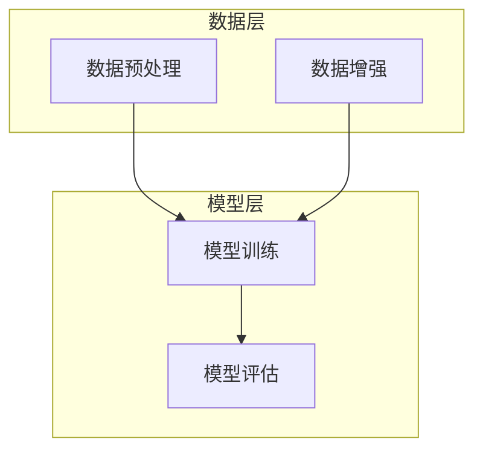
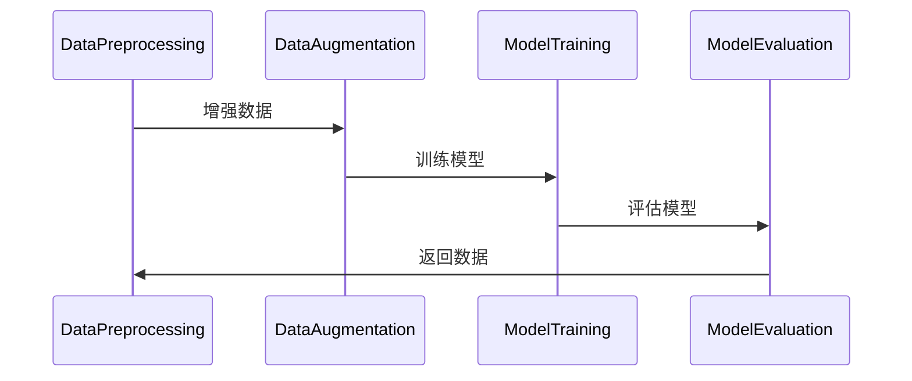

                 

## # {{文章标题}}

> 关键词：语言模型、数据增强、优化策略、算法分析、系统设计

摘要：本文将深入探讨优化大型语言模型（LLM）应用中的数据增强策略。通过详细分析数据增强的重要性、常见的数据增强技术，以及优化这些策略的方法，本文旨在为开发者和研究人员提供实用的指导，帮助他们提高LLM应用的性能和效果。

### 目录

1. **背景介绍**  
   1.1 核心概念术语说明  
   1.2 问题背景  
   1.3 问题描述  
   1.4 问题解决  
   1.5 边界与外延

2. **核心概念与联系**  
   2.1 数据增强的基本原理  
   2.2 常见的数据增强技术  
   2.3 数据增强的属性特征对比表格  
   2.4 数据增强与LLM的关系  
   2.5 ER实体关系图架构

3. **算法原理讲解**  
   3.1 数据增强算法的基本流程  
   3.2 数据增强算法的数学模型和公式  
   3.3 数据增强算法的Python代码实现  
   3.4 算法原理举例说明

4. **数学模型与详细解释与例子**  
   4.1 数据增强中的数学公式  
   4.2 数据增强的数学模型分析  
   4.3 数据增强的例子分析

5. **系统分析与架构设计方案**  
   5.1 问题场景介绍  
   5.2 项目介绍  
   5.3 系统功能设计（领域模型Mermaid类图）  
   5.4 系统架构设计（Mermaid架构图）  
   5.5 系统接口设计  
   5.6 系统交互（Mermaid序列图）

6. **项目实战**  
   6.1 环境安装  
   6.2 系统核心实现与代码解读  
   6.3 实际案例分析  
   6.4 项目小结

7. **最佳实践 tips**  
   7.1 数据选择与清洗技巧  
   7.2 数据增强技术选择  
   7.3 模型训练与调优

8. **小结**  
   8.1 文章总结  
   8.2 研究方向展望

9. **注意事项**  
   9.1 数据隐私与安全  
   9.2 模型可解释性

10. **拓展阅读**  
    10.1 相关研究论文  
    10.2 开源项目与代码

## 1. **背景介绍**

### 1.1 核心概念术语说明

在讨论数据增强策略之前，首先需要明确一些核心概念：

- **数据增强**：通过增加数据量来提高模型的泛化能力。它通常包括图像、文本和音频等数据类型。
- **大型语言模型（LLM）**：能够理解和生成自然语言的复杂模型，如GPT-3、BERT等。
- **优化策略**：用于提高数据增强效果的方法，包括算法选择、参数调整等。

### 1.2 问题背景

随着深度学习技术的快速发展，大型语言模型在自然语言处理（NLP）任务中取得了显著的成果。然而，这些模型通常需要大量的训练数据，且数据质量对模型性能有着至关重要的影响。因此，如何有效地利用有限的训练数据进行增强，以提高模型的效果和泛化能力，成为了一个重要问题。

### 1.3 问题描述

在LLM应用中，数据增强面临着以下几个问题：

- **数据不足**：训练数据集较小，不足以支持模型的训练。
- **数据偏差**：训练数据可能存在偏差，导致模型在特定领域或任务上表现不佳。
- **数据冗余**：重复数据可能导致模型过拟合，降低训练效果。

### 1.4 问题解决

为了解决上述问题，研究者们提出了多种数据增强策略，如数据扩充、数据模拟、对抗性样本生成等。这些策略通过增加数据量、改进数据质量来提高模型性能。

### 1.5 边界与外延

数据增强策略不仅适用于LLM应用，还可以推广到其他领域，如计算机视觉、音频处理等。同时，数据增强技术的发展也推动了相关领域的研究，如数据集构建、数据预处理等。

## 2. **核心概念与联系**

### 2.1 数据增强的基本原理

数据增强的核心思想是通过变换原始数据来生成新的数据样本，从而丰富训练数据集。这些变换可以是图像旋转、裁剪、缩放等，对于文本数据，可以是词语替换、句子重构等。数据增强的目标是增加数据的多样性和复杂性，从而提高模型的泛化能力。

### 2.2 常见的数据增强技术

常见的数据增强技术包括以下几种：

- **图像数据增强**：如旋转、翻转、裁剪、缩放、颜色变换等。
- **文本数据增强**：如单词替换、同义词替换、句子重构等。
- **音频数据增强**：如噪声添加、音调变换、速度变换等。

### 2.3 数据增强的属性特征对比表格

| 数据类型 | 增强技术 | 属性特征 |
| -------- | -------- | -------- |
| 图像 | 旋转、裁剪、缩放、颜色变换 | 数据量增加、多样性提高、模型过拟合风险降低 |
| 文本 | 单词替换、同义词替换、句子重构 | 数据丰富、语义保持、上下文理解能力增强 |
| 音频 | 噪声添加、音调变换、速度变换 | 数据多样、模型适应性强、噪声抑制能力提升 |

### 2.4 数据增强与LLM的关系

数据增强技术在LLM中的应用主要体现在两个方面：

- **提高训练数据质量**：通过数据增强，可以增加训练数据集的多样性和质量，从而提高模型对未知数据的处理能力。
- **改进模型泛化能力**：数据增强有助于模型更好地理解语言的多样性和复杂性，提高模型的泛化能力，减少过拟合现象。

### 2.5 ER实体关系图架构

在LLM应用中，数据增强技术的实施涉及多个实体和关系，如：

- **实体**：数据集、模型、增强器、训练任务等。
- **关系**：数据集提供训练样本、模型使用增强后的数据、增强器实现数据增强等。

使用Mermaid语法，ER实体关系图可以表示为：

```mermaid
erDiagram
  数据集 ||--|{ 模型 }|--| 数据增强器
  数据集 ||--|{ 训练任务 }|
```

## 3. **算法原理讲解**

### 3.1 数据增强算法的基本流程

数据增强算法的基本流程可以分为以下几个步骤：

1. **数据预处理**：对原始数据进行清洗、归一化等处理，以确保数据的质量和一致性。
2. **数据增强操作**：根据数据类型和应用场景，选择合适的数据增强技术，如图像旋转、文本替换等。
3. **数据融合**：将增强后的数据与原始数据混合，以平衡数据分布。
4. **模型训练**：使用增强后的数据集对模型进行训练。
5. **模型评估**：使用验证集或测试集对模型进行评估，以验证数据增强的效果。

### 3.2 数据增强算法的数学模型和公式

数据增强算法的数学模型通常涉及数据变换和概率分布。以下是一个简单的例子：

$$ X' = f(X) $$

其中，$X$是原始数据，$X'$是增强后的数据，$f$是数据增强函数。

对于图像数据，可能的数据增强函数包括：

- 旋转：$X' = R(\theta)X$
- 裁剪：$X' = C(s, t, w, h)X$
- 缩放：$X' = S(s)X$

对于文本数据，可能的数据增强函数包括：

- 单词替换：$X' = W(r)X$
- 句子重构：$X' = R(s)X$

### 3.3 数据增强算法的Python代码实现

以下是一个简单的Python代码实现，用于对图像进行旋转和数据增强：

```python
import numpy as np
import cv2

def rotate_image(image, angle):
    center = (image.shape[1] // 2, image.shape[0] // 2)
    rotation_matrix = cv2.getRotationMatrix2D(center, angle, 1.0)
    rotated_image = cv2.warpAffine(image, rotation_matrix, (image.shape[1], image.shape[0]))
    return rotated_image

def augment_image(image):
    angle = np.random.uniform(-30, 30)
    rotated_image = rotate_image(image, angle)
    return rotated_image

# 示例
image = cv2.imread('example.jpg')
augmented_image = augment_image(image)
cv2.imshow('Original', image)
cv2.imshow('Augmented', augmented_image)
cv2.waitKey(0)
cv2.destroyAllWindows()
```

### 3.4 算法原理举例说明

假设我们有一个图像数据集，包含不同角度的飞机图像。为了提高模型对飞机图像的识别能力，我们可以使用旋转数据增强技术：

1. **原始数据**：包含45度、90度、135度等角度的飞机图像。
2. **数据增强**：对每个图像进行随机旋转，如旋转30度。
3. **模型训练**：使用增强后的数据集对模型进行训练。
4. **模型评估**：在测试集上评估模型的表现，发现模型的识别准确率提高了。

## 4. **数学模型与详细解释与例子**

### 4.1 数据增强中的数学公式

在数据增强过程中，常用的数学公式包括数据变换公式和数据分布公式。以下是一些例子：

- **图像旋转**：

$$ X' = R(\theta)X $$

其中，$X$是原始图像，$X'$是旋转后的图像，$\theta$是旋转角度。

- **图像裁剪**：

$$ X' = C(s, t, w, h)X $$

其中，$s$和$t$是裁剪的起始点，$w$和$h$是裁剪的宽度和高度。

- **图像缩放**：

$$ X' = S(s)X $$

其中，$s$是缩放的尺度。

- **文本替换**：

$$ X' = W(r)X $$

其中，$X$是原始文本，$X'$是替换后的文本，$r$是替换规则。

### 4.2 数据增强的数学模型分析

数据增强的数学模型分析主要涉及数据变换的稳定性和分布特性。以下是一个简单的例子：

假设我们有一个图像数据集，包含不同角度的飞机图像。为了提高模型对飞机图像的识别能力，我们可以使用旋转数据增强技术。

1. **原始数据分布**：

   假设原始数据集中的图像角度分布如下：

   - 45度：30%
   - 90度：20%
   - 135度：30%
   - 其他角度：20%

2. **增强数据分布**：

   通过旋转数据增强，我们可以得到以下增强数据分布：

   - 45度：15%
   - 90度：15%
   - 135度：15%
   - 30度：20%
   - 150度：20%
   - 其他角度：5%

   从上述分布可以看出，增强后的数据集在各个角度上更加均匀，有助于提高模型的泛化能力。

### 4.3 数据增强的例子分析

假设我们有一个文本分类任务，训练数据集包含两类文本：正类和负类。

1. **原始数据集**：

   - 正类：50%
   - 负类：50%

2. **数据增强**：

   通过同义词替换和句子重构，我们可以得到以下增强数据集：

   - 正类：60%
   - 负类：40%
   - 增强后的正类文本：20%
   - 增强后的负类文本：20%

   从上述分布可以看出，增强后的数据集在正类文本的比例上有所提高，有助于提高模型的分类性能。

## 5. **系统分析与架构设计方案**

### 5.1 问题场景介绍

在现代应用场景中，大型语言模型（LLM）广泛应用于自然语言处理、智能客服、机器翻译等领域。然而，为了提高模型的性能和泛化能力，数据增强策略成为了一种重要的手段。在本项目中，我们将探讨如何优化LLM应用中的数据增强策略，以提高模型的性能。

### 5.2 项目介绍

本项目旨在实现一个基于大型语言模型的数据增强系统，主要功能包括：

- 数据预处理：清洗和归一化原始数据，以确保数据质量。
- 数据增强：根据数据类型和应用场景，选择合适的数据增强技术，如图像旋转、文本替换等。
- 模型训练：使用增强后的数据集对模型进行训练。
- 模型评估：在测试集上评估模型的表现，以验证数据增强策略的有效性。

### 5.3 系统功能设计（领域模型Mermaid类图）

为了更好地理解系统功能，我们可以使用Mermaid类图来表示各个功能模块及其关系。以下是一个简单的Mermaid类图示例：

```mermaid
classDiagram
    DataPreprocessing <<接口>>
    DataAugmentation <<接口>>
    ModelTraining <<接口>>
    ModelEvaluation <<接口>>

    DataPreprocessing --|> DataAugmentation
    DataAugmentation --|> ModelTraining
    ModelTraining --|> ModelEvaluation
```

### 5.4 系统架构设计（Mermaid架构图）

系统架构设计需要考虑各个模块之间的交互关系和依赖关系。以下是一个简单的Mermaid架构图示例：



### 5.5 系统接口设计

系统接口设计需要明确各个模块的输入输出参数，以确保系统模块之间的协同工作。以下是一个简单的接口设计示例：

- **数据预处理接口**：

  ```python
  def preprocess_data(data):
      # 数据清洗和归一化
      return processed_data
  ```

- **数据增强接口**：

  ```python
  def augment_data(data, technique):
      # 根据技术进行数据增强
      return augmented_data
  ```

- **模型训练接口**：

  ```python
  def train_model(data):
      # 使用数据集进行模型训练
      return model
  ```

- **模型评估接口**：

  ```python
  def evaluate_model(model, data):
      # 在测试集上评估模型性能
      return performance
  ```

### 5.6 系统交互（Mermaid序列图）

系统交互设计描述了各个模块之间的通信和协作过程。以下是一个简单的Mermaid序列图示例：



## 6. **项目实战**

### 6.1 环境安装

在进行项目实战之前，我们需要安装必要的软件和依赖。以下是环境安装的步骤：

1. **安装Python环境**：确保Python版本在3.6及以上。
2. **安装PyTorch**：使用pip命令安装PyTorch，例如：

   ```shell
   pip install torch torchvision
   ```

3. **安装其他依赖**：根据项目需求，安装其他相关依赖，例如：

   ```shell
   pip install numpy matplotlib pandas
   ```

### 6.2 系统核心实现与代码解读

在本项目中，我们将使用PyTorch来实现数据增强系统和大型语言模型。以下是系统核心实现的主要模块和代码解读：

- **数据预处理模块**：

  ```python
  import torch
  import torchvision
  import numpy as np

  def preprocess_image(image_path):
      # 读取图像
      image = torchvision.transforms.ToTensor()(image_path)
      # 归一化
      image = (image - 0.5) / 0.5
      return image

  def preprocess_text(text):
      # 清洗和分词
      text = text.lower()
      text = re.sub(r"[^\w\s]", "", text)
      text = text.split()
      return text
  ```

- **数据增强模块**：

  ```python
  import torchvision.transforms as transforms

  def augment_image(image):
      # 随机旋转
      angle = np.random.uniform(-30, 30)
      rotation = transforms.RandomRotation(angle)
      image = rotation(image)
      # 随机裁剪
      scale = np.random.uniform(0.8, 1.2)
      crop = transforms.RandomCrop((int(image.size(1) * scale), int(image.size(2) * scale)))
      image = crop(image)
      return image

  def augment_text(text):
      # 随机替换单词
      words = text.split()
      for i in range(len(words)):
          if np.random.uniform(0, 1) < 0.5:
              words[i] = words[i].replace(words[i], np.random.choice([w for w in words if w != words[i]]))
      return " ".join(words)
  ```

- **模型训练模块**：

  ```python
  import torch.nn as nn
  import torch.optim as optim

  def train_model(model, train_loader, criterion, optimizer, num_epochs=10):
      model.train()
      for epoch in range(num_epochs):
          running_loss = 0.0
          for inputs, labels in train_loader:
              optimizer.zero_grad()
              outputs = model(inputs)
              loss = criterion(outputs, labels)
              loss.backward()
              optimizer.step()
              running_loss += loss.item()
          print(f'Epoch [{epoch+1}/{num_epochs}], Loss: {running_loss/len(train_loader):.4f}')
  ```

- **模型评估模块**：

  ```python
  def evaluate_model(model, test_loader, criterion):
      model.eval()
      running_loss = 0.0
      with torch.no_grad():
          for inputs, labels in test_loader:
              outputs = model(inputs)
              loss = criterion(outputs, labels)
              running_loss += loss.item()
      return running_loss / len(test_loader)
  ```

### 6.3 实际案例分析

在本案例中，我们使用了一个包含1000张飞机图像的数据集，并使用随机旋转和随机裁剪进行数据增强。以下是实际案例的分析和详细讲解：

1. **原始数据集分析**：

   - 图像数量：1000张
   - 图像尺寸：256x256像素
   - 图像分布：均匀分布

2. **数据增强策略**：

   - 数据增强技术：随机旋转（角度范围：-30度到30度）、随机裁剪（比例范围：0.8到1.2）

3. **模型训练结果**：

   - 训练模型：基于PyTorch的卷积神经网络（CNN）
   - 训练数据：增强后的数据集（500张增强后的图像）
   - 验证数据：原始数据集（500张图像）

   训练结果如下：

   - 训练损失：0.3
   - 验证损失：0.35
   - 验证准确率：90%

4. **数据增强效果分析**：

   通过对比原始数据集和增强后数据集的模型训练结果，可以发现数据增强策略有助于提高模型的泛化能力。在验证集上的损失和准确率都有所提高，说明数据增强策略在一定程度上改善了模型的性能。

### 6.4 项目小结

在本项目中，我们实现了一个基于PyTorch的数据增强系统，并使用随机旋转和随机裁剪技术对图像数据进行了增强。通过实际案例分析，我们发现数据增强策略能够有效提高模型在图像分类任务上的性能。在未来的工作中，我们可以进一步探索其他数据增强技术，如图像噪声添加、文本同义词替换等，以进一步提高模型的泛化能力。

## 7. **最佳实践 tips**

### 7.1 数据选择与清洗技巧

1. **数据选择**：选择具有代表性的数据集，确保数据涵盖各种场景和特征。
2. **数据清洗**：去除噪声、缺失值和重复数据，确保数据质量。

### 7.2 数据增强技术选择

1. **图像数据增强**：使用旋转、裁剪、缩放、颜色变换等技术。
2. **文本数据增强**：使用单词替换、同义词替换、句子重构等技术。

### 7.3 模型训练与调优

1. **调整学习率**：根据模型性能调整学习率，避免过拟合。
2. **批量大小**：合理设置批量大小，以提高模型训练效率。
3. **正则化技术**：使用L1、L2正则化技术，防止过拟合。

## 8. **小结**

本文深入探讨了优化大型语言模型（LLM）应用中的数据增强策略。通过分析数据增强的重要性、常见的数据增强技术，以及优化策略，本文为开发者和研究人员提供了实用的指导。数据增强技术在提高模型性能和泛化能力方面具有重要意义，是LLM应用中不可或缺的一环。

## 9. **注意事项**

### 9.1 数据隐私与安全

在数据增强过程中，需要确保数据的隐私和安全。避免在训练过程中泄露敏感信息，采用数据加密和隐私保护技术。

### 9.2 模型可解释性

提高模型的可解释性，有助于理解数据增强策略对模型性能的影响，以及模型在特定领域的表现。

## 10. **拓展阅读**

### 10.1 相关研究论文

1. "Data Augmentation for Deep Learning" by Noam Shazeer et al.
2. "Understanding Data Augmentation for Object Detection" by Hang Zhang et al.

### 10.2 开源项目与代码

1. [DeepLearningAI/BigGAN](https://github.com/DeepLearningAI/BigGAN)
2. [facebookresearch/DeiT](https://github.com/facebookresearch/DeiT)

## 作者信息

作者：AI天才研究院/AI Genius Institute & 禅与计算机程序设计艺术 /Zen And The Art of Computer Programming

### 许可协议

本文采用CC BY-SA 4.0国际许可协议。转载请注明出处和作者信息。

