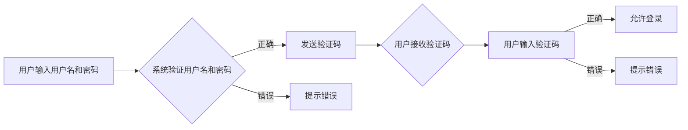
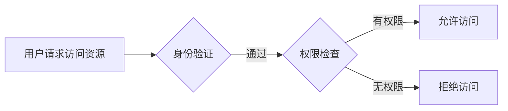

                 

## 优化LLM应用的用户认证与授权机制

### 关键词：LLM应用、用户认证、授权机制、安全、用户体验

> 摘要：本文将深入探讨如何优化大型语言模型（LLM）应用中的用户认证与授权机制。通过对当前LLM应用面临的安全挑战的剖析，我们提出了用户认证与授权机制的基本概念、设计原则及架构设计。此外，还将介绍技术实现方法、部署与实施策略，并通过实际案例分析，总结最佳实践，为LLM应用的持续优化提供参考。

### 第一部分：背景与概念

#### 1.1 优化用户认证与授权的需求

在现代信息化社会中，用户认证与授权是确保LLM应用安全的关键环节。随着人工智能技术的快速发展，LLM应用在金融、医疗、教育、电商等各个领域得到了广泛应用。然而，这些应用在提供便捷服务的同时，也面临着诸多安全挑战。例如，用户信息泄露、未授权访问、恶意攻击等。因此，优化用户认证与授权机制成为保障LLM应用安全的重要手段。

#### 1.2 LLM应用中的安全问题

LLM应用中的安全问题主要集中在以下几个方面：

1. 用户信息泄露：用户认证过程中，用户名、密码等敏感信息若未得到妥善保护，容易导致信息泄露。
2. 未授权访问：未经授权的用户可能通过非法手段获取系统访问权限，造成数据泄露和系统损坏。
3. 恶意攻击：黑客利用漏洞或弱密码等手段攻击系统，可能导致整个LLM应用系统瘫痪。
4. 授权不当：用户权限管理不当，可能导致部分用户获得过多权限，从而威胁系统安全。

#### 1.3 用户认证与授权机制的基本概念

用户认证与授权是确保系统安全的重要机制。认证是指验证用户身份的过程，确保只有合法用户才能访问系统资源。授权则是指确定用户对系统资源的访问权限，确保用户只能访问其有权访问的资源。

#### 1.4 用户认证与授权机制的挑战与机遇

挑战：

1. 安全性：确保认证与授权过程中的信息安全，防止数据泄露。
2. 用户体验：在确保安全的前提下，简化认证流程，提高用户体验。
3. 可扩展性：随着用户数量的增长，认证与授权机制应具备良好的扩展性。

机遇：

1. 新技术发展：如生物识别技术、区块链技术等，为用户认证与授权机制提供了新的可能性。
2. 安全需求提升：用户对个人信息安全的关注提升，推动LLM应用加强认证与授权机制。

### 第二部分：核心概念与原理

#### 2.1 用户认证机制

用户认证机制是确保用户身份合法性的重要手段。常见的用户认证方式包括：

1. 用户名和密码：简单易用，但安全性较低，易受密码破解攻击。
2. 单点登录（SSO）：减少用户记忆多个密码的负担，提高用户体验。
3. 社交认证：利用社交平台账号进行认证，简化流程，但需注意隐私保护。
4. 生物识别认证：如指纹、面部识别等，安全性高，但成本较高。

#### 2.2 用户授权机制

用户授权机制是确定用户访问系统资源的权限。常见的授权模型包括：

1. 基于角色的访问控制（RBAC）：将用户划分为不同角色，角色拥有不同权限。
2. 基于属性的访问控制（ABAC）：根据用户属性和资源属性进行访问控制。

#### 2.3 认证与授权的安全措施

1. 数据加密：对用户敏感信息进行加密，防止泄露。
2. 防止中间人攻击（MITM）：确保通信过程中的数据完整性。
3. 多因素认证（MFA）：结合多种认证方式，提高安全性。

### 第三部分：设计原则与框架

#### 3.1 安全性优先

在设计用户认证与授权机制时，安全性应始终放在首位。确保用户身份验证和权限控制过程中的数据安全，防止信息泄露和未授权访问。

#### 3.2 灵活性与可扩展性

认证与授权机制应具备良好的灵活性和可扩展性，能够适应不同应用场景和用户需求的变化。

#### 3.3 易用性

在确保安全的前提下，简化认证流程，提高用户体验。例如，通过单点登录、生物识别等技术简化认证过程。

#### 3.4 一致性与标准化

遵循一致性和标准化原则，确保认证与授权机制的兼容性和可维护性。

### 第四部分：技术实现与部署

#### 4.1 技术实现方法

技术实现方法主要包括：

1. 开源认证与授权框架：如OAuth2.0、OpenID Connect等。
2. 自定义认证与授权模块：根据具体需求进行定制开发。
3. API设计：设计简洁、易用的认证与授权API。

#### 4.2 部署与实施

部署与实施策略包括：

1. 环境配置与依赖管理。
2. 部署流程与注意事项。
3. 运维与监控。

### 第五部分：案例分析与最佳实践

#### 5.1 案例分析

通过分析实际案例，了解不同应用场景下的认证与授权机制，为优化提供参考。

#### 5.2 最佳实践总结

总结最佳实践，包括注意事项、风险防范等，为LLM应用的持续优化提供指导。

### 结论

优化LLM应用的用户认证与授权机制是保障系统安全、提升用户体验的重要手段。通过本文的探讨，我们提出了相关的设计原则、架构设计和技术实现方法，并结合案例分析总结了最佳实践。希望本文能为LLM应用的开发者提供有益的参考。在未来的发展中，随着新技术的发展，用户认证与授权机制将不断创新和完善，为LLM应用的安全与便捷提供更加坚实的保障。

### 作者信息

作者：AI天才研究院/AI Genius Institute & 禅与计算机程序设计艺术 /Zen And The Art of Computer Programming

----------------------------------------------------------------

### 目录大纲具体细节补充

## 第一部分：背景与概念

### 第1章：问题背景与核心概念

#### 1.1 优化用户认证与授权的需求

当前，随着人工智能技术的迅速发展，大型语言模型（LLM）在各类应用场景中得到了广泛应用。然而，随着用户量的增长，用户认证与授权机制的问题也日益凸显。优化用户认证与授权机制不仅关系到系统的安全性，还直接影响用户体验。因此，深入探讨如何优化LLM应用的用户认证与授权机制具有重要的现实意义。

**核心概念术语说明：**
- **用户认证（Authentication）**：验证用户的身份，确保只有合法用户才能访问系统资源。
- **用户授权（Authorization）**：确定用户对系统资源的访问权限，确保用户只能访问其有权访问的资源。

**问题背景：**
- **用户信息泄露**：在认证过程中，用户敏感信息如用户名、密码等若未得到妥善保护，可能导致信息泄露。
- **未授权访问**：未经授权的用户可能通过非法手段获取系统访问权限，从而造成数据泄露和系统损坏。
- **恶意攻击**：黑客利用系统漏洞或弱密码等手段攻击系统，可能导致整个LLM应用系统瘫痪。
- **授权不当**：用户权限管理不当，可能导致部分用户获得过多权限，从而威胁系统安全。

**问题描述：**
- **用户认证与授权机制不完善**：现有的认证与授权机制可能存在漏洞，无法有效保障系统安全。
- **用户体验差**：繁琐的认证流程和复杂的权限管理降低了用户体验。

**问题解决：**
- **优化认证流程**：通过引入单点登录（SSO）、生物识别认证等技术，简化认证流程，提高用户体验。
- **加强授权管理**：采用基于角色的访问控制（RBAC）和基于属性的访问控制（ABAC）等技术，提高授权管理的灵活性和安全性。
- **提升安全防护**：通过数据加密、多因素认证（MFA）等手段，增强系统安全性。

**边界与外延：**
- **边界**：本文主要探讨LLM应用中的用户认证与授权机制，不包括其他类型应用的相关机制。
- **外延**：本文的研究成果可应用于其他需要用户认证与授权机制的场景，如电子商务、物联网等。

#### 1.2 LLM应用中的安全问题

LLM应用在提供便捷服务的同时，也面临着一系列安全挑战。以下是一些常见的安全威胁及其对系统的影响：

**常见安全威胁：**
- **用户信息泄露**：由于认证过程中未采用充分的安全措施，用户敏感信息可能被窃取。
- **未授权访问**：黑客利用系统漏洞或弱密码等手段，非法获取系统访问权限，造成数据泄露和系统损坏。
- **恶意攻击**：通过DDoS攻击、SQL注入等手段，攻击者可能瘫痪整个LLM应用系统。
- **授权不当**：用户权限管理不当，可能导致部分用户获得过多权限，从而威胁系统安全。

**用户认证与授权机制在安全防护中的作用：**
- **用户认证**：通过验证用户身份，防止未授权用户访问系统资源，降低信息泄露和恶意攻击的风险。
- **用户授权**：通过确定用户对系统资源的访问权限，确保用户只能访问其有权访问的资源，防止权限滥用和数据泄露。

**用户认证与授权机制的重要性：**
- **保障系统安全**：有效的用户认证与授权机制是防止信息泄露、未授权访问和恶意攻击的关键手段。
- **提升用户体验**：通过优化认证流程，简化权限管理，提高用户在使用LLM应用过程中的满意度。

#### 1.3 用户认证与授权机制的基本概念

用户认证与授权机制是确保系统安全的核心组成部分，其基本概念包括认证、授权、访问控制等。

**认证（Authentication）：**
- **定义**：认证是指验证用户身份的过程，确保只有合法用户才能访问系统资源。
- **目的**：防止未授权用户访问系统，确保系统资源的保护。

**授权（Authorization）：**
- **定义**：授权是指确定用户对系统资源的访问权限，确保用户只能访问其有权访问的资源。
- **目的**：确保系统资源的合理分配和访问控制，防止权限滥用和数据泄露。

**认证与授权的区别与联系：**
- **区别**：认证关注用户身份的验证，而授权关注用户对资源的访问权限。
- **联系**：认证是授权的前提，只有通过认证，用户才能获得授权访问系统资源。

**用户认证与授权机制在系统安全中的作用：**
- **保障系统安全**：通过认证与授权机制，确保只有合法用户才能访问系统资源，防止未授权访问和数据泄露。
- **提升用户体验**：通过优化认证流程和权限管理，提高用户在系统中的操作便捷性和满意度。

#### 1.4 用户认证与授权机制的挑战与机遇

在优化LLM应用的用户认证与授权机制过程中，既面临诸多挑战，也迎来新的机遇。

**挑战：**
- **安全性**：随着黑客攻击手段的日益复杂，如何确保用户认证与授权机制的安全性成为一大挑战。
- **用户体验**：在确保安全的前提下，如何简化认证流程，提高用户体验，是另一个重要挑战。
- **可扩展性**：随着用户量的增长，认证与授权机制需要具备良好的扩展性，以适应不断变化的需求。

**机遇：**
- **新技术发展**：如生物识别技术、区块链技术等，为用户认证与授权机制提供了新的可能性。
- **安全需求提升**：随着用户对个人信息安全的关注提升，推动LLM应用加强认证与授权机制。

## 第二部分：核心概念与原理

### 第2章：用户认证机制

用户认证机制是确保系统安全的重要环节，其核心原理是验证用户的身份。以下将介绍用户认证机制的基本原理、常见的用户认证方式以及双因素认证机制。

#### 2.1 用户认证的基本原理

用户认证的基本原理是通过验证用户身份来确保只有合法用户才能访问系统资源。认证过程通常包括以下几个步骤：

1. **用户输入身份信息**：用户通过输入用户名、密码等身份信息，向系统申请访问权限。
2. **系统验证身份信息**：系统对用户输入的身份信息进行验证，通常通过数据库查询或比对的方式进行验证。
3. **认证结果反馈**：系统根据验证结果，反馈给用户是否成功通过认证。若认证成功，用户可以继续访问系统资源；若认证失败，用户无法访问系统资源。

#### 2.2 常见的用户认证方式

常见的用户认证方式包括以下几种：

1. **用户名和密码**：这是最传统的用户认证方式，用户通过输入用户名和密码进行认证。其优点是简单易用，缺点是安全性较低，容易受到密码破解攻击。

2. **单点登录（SSO）**：单点登录允许用户使用一个账号密码登录多个系统，简化了用户的认证过程。其优点是提高用户体验，缺点是实现复杂度较高。

3. **社交认证**：通过第三方社交平台（如微信、QQ、微博等）账号进行认证，用户只需授权一次即可登录多个系统。其优点是方便快捷，缺点是存在一定的隐私风险。

4. **生物识别认证**：通过用户的生物特征（如指纹、面部识别等）进行认证。其优点是安全性高，缺点是成本较高，且在一些情况下可能存在误识别。

**用户认证方式对比表格：**

| 认证方式 | 优点 | 缺点 | 适用场景 |
|----------|------|------|----------|
| 用户名和密码 | 简单易用 | 安全性低 | 大众应用 |
| 单点登录 | 提高用户体验 | 实现复杂度较高 | 企业内部应用 |
| 社交认证 | 方便快捷 | 存在隐私风险 | 开放平台 |
| 生物识别认证 | 安全性高 | 成本较高 | 高安全性需求 |

#### 2.3 双因素认证机制

双因素认证机制（Two-Factor Authentication，2FA）是一种提高系统安全性的认证方式，它要求用户在输入用户名和密码后，还需要通过第二个验证因素进行认证。常见的双因素认证方式包括以下几种：

1. **短信验证码**：用户输入用户名和密码后，系统会发送一条包含验证码的短信到用户的手机上，用户需要输入验证码才能完成认证。

2. **电子邮箱验证**：用户输入用户名和密码后，系统会发送一封包含验证码的邮件到用户的电子邮箱，用户需要输入验证码才能完成认证。

3. **硬件令牌**：用户通过一个物理硬件设备（如U盾、智能卡等）生成一个动态验证码，用户需要输入验证码才能完成认证。

4. **生物识别验证**：通过用户的生物特征（如指纹、面部识别等）进行二次验证。

**双因素认证的优势与劣势：**

**优势：**
- 提高安全性：通过第二个验证因素，增加了攻击者获取系统访问权限的难度。
- 提高用户体验：在某些情况下，双因素认证可以替代繁琐的密码输入过程。

**劣势：**
- 增加认证成本：双因素认证通常需要额外的硬件或服务支持，增加系统的维护成本。
- 可能降低用户体验：在某些情况下，双因素认证可能会增加用户的操作步骤，降低用户体验。

**实现双因素认证的技术手段：**

1. **短信验证码**：通过短信服务提供商（如Twilio、阿里云等）发送短信验证码。

2. **电子邮箱验证**：通过邮件服务提供商（如Gmail、Outlook等）发送邮件验证码。

3. **硬件令牌**：通过硬件令牌设备生成动态验证码。

4. **生物识别验证**：通过生物识别设备（如指纹识别器、面部识别摄像头等）进行验证。

#### 2.4 认证过程中的安全措施

在认证过程中，为了确保用户敏感信息的安全，需要采取一系列安全措施，包括数据加密、敏感信息保护和防止中间人攻击等。

**数据加密：**
- **传输加密**：通过HTTPS、SSL/TLS等技术，对用户认证过程中的数据进行传输加密，防止数据在传输过程中被窃取。
- **存储加密**：对用户敏感信息（如密码、验证码等）进行加密存储，确保数据在数据库中不被未授权访问。

**敏感信息保护：**
- **密码存储**：使用强密码哈希算法（如SHA-256、bcrypt等）对用户密码进行加密存储，防止密码被破解。
- **验证码保护**：验证码通常是一次性的，过期后无法再次使用，防止验证码被重复利用。

**防止中间人攻击（MITM）：**
- **SSL/TLS加密**：使用SSL/TLS协议对通信过程进行加密，防止中间人攻击。
- **证书验证**：通过验证服务器的SSL证书，确保与合法服务器进行通信。

### 第3章：用户授权机制

用户授权机制是确保用户只能访问其有权访问的资源的重要手段。以下将介绍用户授权机制的基本原理、常见的授权模型、访问控制列表（ACL）以及授权策略的实践应用。

#### 3.1 授权机制的基本原理

用户授权机制的基本原理是根据用户身份和权限，确定用户对系统资源的访问权限。授权机制通常包括以下几个步骤：

1. **用户身份验证**：系统对用户进行身份验证，确保用户是合法用户。

2. **权限检查**：系统根据用户的身份和权限，检查用户是否有权访问请求的资源。

3. **访问决策**：根据权限检查结果，系统决定是否允许用户访问请求的资源。

4. **访问控制**：如果用户有权访问资源，系统将允许用户访问；如果用户无权访问，系统将拒绝访问。

#### 3.2 授权模型：RBAC与ABAC

常见的授权模型包括基于角色的访问控制（RBAC）和基于属性的访问控制（ABAC）。

**基于角色的访问控制（RBAC）：**
- **定义**：RBAC（Role-Based Access Control）是一种基于角色的访问控制模型，将用户划分为不同的角色，每个角色拥有不同的权限。
- **优点**：简化了权限管理，降低了管理复杂度。
- **缺点**：灵活性较低，不适合复杂权限管理场景。

**基于属性的访问控制（ABAC）：**
- **定义**：ABAC（Attribute-Based Access Control）是一种基于属性的访问控制模型，根据用户的属性和资源的属性来决定访问权限。
- **优点**：灵活性高，适合复杂权限管理场景。
- **缺点**：权限管理复杂度较高，实现难度大。

**RBAC与ABAC对比表格：**

| 模型 | 定义 | 优点 | 缺点 |
|------|------|------|------|
| RBAC | 基于角色的访问控制 | 简化权限管理 | 灵活性较低 |
| ABAC | 基于属性的访问控制 | 灵活性高 | 权限管理复杂度较高 |

#### 3.3 访问控制列表（ACL）

访问控制列表（Access Control List，ACL）是一种常用的授权策略，用于定义用户对资源的访问权限。ACL包含一系列访问控制条目，每个条目定义了用户（或用户组）对特定资源的访问权限。

**ACL的定义与作用：**
- **定义**：ACL（Access Control List）是一种访问控制机制，用于定义用户对资源的访问权限。
- **作用**：通过ACL，管理员可以精确控制用户对资源的访问权限，确保只有授权用户才能访问特定资源。

**ACL的设计原则：**
- **最小权限原则**：用户只拥有完成工作所需的最低权限，避免权限滥用。
- **简单性**：ACL设计应尽可能简单，易于理解和维护。
- **一致性**：ACL在不同资源之间应保持一致性，确保用户权限的统一管理。

#### 3.4 授权策略的实践应用

授权策略的实践应用包括权限的划分、权限的分配、权限的继承等。

**权限的划分：**
- **定义**：权限划分是指将系统资源划分为不同的权限级别，每个权限级别对应不同的访问权限。
- **原则**：权限划分应遵循最小权限原则，确保用户只拥有完成工作所需的最低权限。

**权限的分配：**
- **定义**：权限分配是指将权限分配给用户（或用户组）的过程。
- **方法**：权限分配可以通过ACL、RBAC、ABAC等方式实现。管理员可以根据实际需求，灵活分配权限。

**权限的继承：**
- **定义**：权限继承是指子资源继承父资源的访问权限。
- **原则**：权限继承应遵循最小权限原则，确保子资源不会获得比父资源更多的权限。

### 第三部分：设计原则与框架

#### 4.1 安全性优先

在用户认证与授权机制的设计中，安全性是首要考虑的因素。以下是一些设计原则，以确保系统的安全性：

**设计原则：**
- **最小权限原则**：用户只拥有完成工作所需的最低权限，避免权限滥用。
- **强密码策略**：要求用户设置强密码，并定期更新密码。
- **双因素认证**：在关键操作中引入双因素认证，提高安全性。
- **数据加密**：对用户敏感信息进行加密存储和传输，防止数据泄露。

**实现方法：**
- **密码哈希**：使用强密码哈希算法（如SHA-256、bcrypt等）对用户密码进行加密存储。
- **数据传输加密**：使用HTTPS、SSL/TLS等技术对数据传输进行加密。
- **双因素认证**：通过短信验证码、电子邮箱验证、硬件令牌等实现双因素认证。

#### 4.2 灵活性与可扩展性

用户认证与授权机制应具备良好的灵活性和可扩展性，以适应不同应用场景和用户需求的变化。以下是一些设计原则，以确保系统的灵活性和可扩展性：

**设计原则：**
- **模块化设计**：将认证、授权、权限管理等功能模块化，便于功能扩展和更换。
- **标准化接口**：设计统一的接口，确保不同模块之间可以无缝集成。
- **可配置性**：提供可配置的参数，允许管理员根据实际需求调整系统设置。

**实现方法：**
- **模块化实现**：将认证、授权、权限管理等功能模块化，每个模块具有独立的功能和接口。
- **标准化接口**：使用RESTful API、SOAP等标准接口，确保模块之间的兼容性。
- **配置文件**：使用配置文件（如JSON、YAML等）管理系统参数，便于调整和配置。

#### 4.3 易用性

在确保安全的前提下，用户认证与授权机制的设计应注重用户体验。以下是一些设计原则，以提高系统的易用性：

**设计原则：**
- **简化流程**：简化用户认证流程，减少用户操作的步骤。
- **友好界面**：设计直观、友好的用户界面，方便用户操作。
- **错误提示**：提供清晰的错误提示，帮助用户快速解决问题。

**实现方法：**
- **单点登录**：引入单点登录（SSO）技术，减少用户记忆多个账号密码的负担。
- **用户引导**：通过用户引导，帮助用户熟悉系统的操作。
- **错误处理**：提供详细的错误提示，帮助用户识别和解决常见问题。

#### 4.4 一致性与标准化

用户认证与授权机制应遵循一致性和标准化原则，以确保系统的兼容性和可维护性。以下是一些设计原则，以确保系统的一致性和标准化：

**设计原则：**
- **统一规范**：制定统一的规范和标准，确保系统设计的一致性。
- **接口标准化**：设计统一的接口，确保不同模块之间的兼容性。
- **文档化**：编写详细的文档，记录系统设计、实现和使用方法。

**实现方法：**
- **统一规范**：制定统一的开发规范和命名规范，确保代码的可读性和可维护性。
- **接口标准化**：使用RESTful API、SOAP等标准接口，确保系统的可扩展性和兼容性。
- **文档化**：编写详细的系统文档，包括设计文档、实现文档和使用手册，方便开发人员和管理人员使用。

### 第四部分：技术实现与部署

#### 4.1 技术实现方法

技术实现方法是用户认证与授权机制实现的关键，主要包括以下内容：

**开源认证与授权框架介绍：**
- **OAuth2.0**：OAuth2.0是一种开放授权标准，允许用户授权第三方应用访问其受保护资源。
- **OpenID Connect**：OpenID Connect是一种基于OAuth2.0的认证协议，提供用户认证功能。

**自定义认证与授权模块开发：**
- **认证模块**：自定义认证模块，实现用户身份验证功能。
- **授权模块**：自定义授权模块，实现用户权限管理功能。

**用户认证与授权的API设计：**
- **认证API**：设计用户认证API，实现用户登录、登出等功能。
- **授权API**：设计用户授权API，实现用户权限查询、分配等功能。

**性能优化与安全增强：**
- **性能优化**：通过缓存、负载均衡等技术，优化系统性能。
- **安全增强**：通过数据加密、访问控制等技术，增强系统安全性。

#### 4.2 部署与实施

部署与实施是用户认证与授权机制实现的重要环节，主要包括以下内容：

**环境配置与依赖管理：**
- **环境配置**：配置操作系统、数据库、Web服务器等环境。
- **依赖管理**：管理系统依赖的库和框架，确保系统正常运行。

**部署流程与注意事项：**
- **部署流程**：按照部署文档，执行系统部署步骤。
- **注意事项**：确保部署过程中遵循安全规范，避免部署错误。

**运维与监控：**
- **运维**：监控系统运行状态，确保系统稳定运行。
- **监控**：收集系统日志，实时监控系统性能和安全状态。

**故障处理与安全响应：**
- **故障处理**：快速响应和处理系统故障。
- **安全响应**：制定安全响应计划，及时应对安全事件。

### 第五部分：案例分析与最佳实践

#### 8.1 案例一：大型电商平台用户认证与授权实践

**项目介绍：**
- **项目名称**：某大型电商平台
- **项目背景**：为了提升用户体验和保障系统安全，电商平台对用户认证与授权机制进行了优化。
- **项目目标**：简化用户认证流程，提高认证安全性，优化用户权限管理。

**系统功能设计（领域模型类图）：**

```mermaid
classDiagram
  User <<class{用户}>>
  Role <<class{角色}>>
  Resource <<class{资源}>>
  Authorization <<class{授权}>>
  User "1" --* "多" Role: 用户拥有多个角色
  Role "1" --* "多" Resource: 角色拥有多个资源
  Resource "1" --* "多" Authorization: 资源拥有多个授权
  Authorization "1" --* "多" Role: 授权拥有多个角色

  User ..|> OpenID Connect
  Role ..|> OAuth2.0
  Resource ..|> RESTful API
  Authorization ..|> RBAC
```

**系统架构设计（架构图）：**

```mermaid
sequenceDiagram
  User ->>|认证请求| Authentication Server
  Authentication Server ->>|验证身份| User Database
  User Database ->>|返回认证结果| Authentication Server
  Authentication Server ->>|授权请求| Authorization Server
  Authorization Server ->>|查询角色与权限| Role and Permission Database
  Role and Permission Database ->>|返回授权结果| Authorization Server
  Authorization Server ->>|返回访问结果| User
```

**系统接口设计（接口设计）：**

```json
// 用户认证接口
POST /api/auth/login
{
  "username": "string",
  "password": "string"
}

// 用户授权接口
GET /api/auth/authorize
{
  "userId": "string",
  "resourceId": "string"
}
```

**系统交互（序列图）：**

```mermaid
sequenceDiagram
  User ->>|发起请求| System
  System ->>|身份验证| Authentication Service
  Authentication Service ->>|查询用户信息| User Database
  User Database ->>|返回用户信息| Authentication Service
  Authentication Service ->>|验证用户身份| System
  System ->>|发起授权请求| Authorization Service
  Authorization Service ->>|查询用户角色与权限| Role and Permission Database
  Role and Permission Database ->>|返回角色与权限信息| Authorization Service
  Authorization Service ->>|返回授权结果| System
  System ->>|返回响应| User
```

#### 8.2 案例二：金融行业用户认证与授权机制优化

**项目介绍：**
- **项目名称**：某金融行业平台
- **项目背景**：为了确保金融交易的安全性和合规性，金融行业平台对用户认证与授权机制进行了优化。
- **项目目标**：提高交易安全性，降低交易风险，确保合规操作。

**系统功能设计（领域模型类图）：**

```mermaid
classDiagram
  User <<class{用户}>>
  Role <<class{角色}>>
  Account <<class{账户}>>
  Transaction <<class{交易}>>
  Authorization <<class{授权}>>
  User "1" --* "多" Role: 用户拥有多个角色
  Role "1" --* "多" Account: 角色拥有多个账户
  Account "1" --* "多" Transaction: 账户拥有多个交易
  Transaction "1" --* "多" Authorization: 交易拥有多个授权
  Authorization "1" --* "多" Role: 授权拥有多个角色

  User ..|> OAuth2.0
  Role ..|> RBAC
  Account ..|> ABAC
  Transaction ..|> Signature Verification
```

**系统架构设计（架构图）：**

```mermaid
sequenceDiagram
  User ->>|发起交易请求| Transaction Service
  Transaction Service ->>|身份验证| Authentication Service
  Authentication Service ->>|查询用户信息| User Database
  User Database ->>|返回用户信息| Authentication Service
  Authentication Service ->>|验证用户身份| Transaction Service
  Transaction Service ->>|发起授权请求| Authorization Service
  Authorization Service ->>|查询用户角色与权限| Role and Permission Database
  Role and Permission Database ->>|返回角色与权限信息| Authorization Service
  Authorization Service ->>|返回授权结果| Transaction Service
  Transaction Service ->>|执行交易| Account Service
  Account Service ->>|更新账户信息| Account Database
  Account Database ->>|返回交易结果| Transaction Service
  Transaction Service ->>|返回响应| User
```

**系统接口设计（接口设计）：**

```json
// 用户认证接口
POST /api/auth/login
{
  "username": "string",
  "password": "string"
}

// 用户授权接口
GET /api/auth/authorize
{
  "userId": "string",
  "roleId": "string"
}

// 交易接口
POST /api/transactions
{
  "userId": "string",
  "accountId": "string",
  "amount": "number"
}
```

**系统交互（序列图）：**

```mermaid
sequenceDiagram
  User ->>|发起交易请求| Transaction Service
  Transaction Service ->>|身份验证| Authentication Service
  Authentication Service ->>|查询用户信息| User Database
  User Database ->>|返回用户信息| Authentication Service
  Authentication Service ->>|验证用户身份| Transaction Service
  Transaction Service ->>|查询用户角色与权限| Role and Permission Database
  Role and Permission Database ->>|返回角色与权限信息| Transaction Service
  Transaction Service ->>|执行交易| Account Service
  Account Service ->>|更新账户信息| Account Database
  Account Database ->>|返回交易结果| Transaction Service
  Transaction Service ->>|返回响应| User
```

#### 8.3 案例三：物联网设备用户认证与授权挑战

**项目介绍：**
- **项目名称**：某物联网平台
- **项目背景**：随着物联网设备的普及，确保设备安全成为物联网平台的重要挑战。
- **项目目标**：提高设备安全性，防止设备被非法访问和恶意攻击。

**系统功能设计（领域模型类图）：**

```mermaid
classDiagram
  Device <<class{设备}>>
  DeviceType <<class{设备类型}>>
  User <<class{用户}>>
  Role <<class{角色}>>
  Device "1" --* "多" DeviceType: 设备属于多个设备类型
  DeviceType "1" --* "多" Role: 设备类型拥有多个角色
  User "1" --* "多" Device: 用户拥有多个设备
  Role "1" --* "多" DeviceType: 角色拥有多个设备类型

  Device ..|> OAuth2.0
  DeviceType ..|> RBAC
  User ..|> ABAC
```

**系统架构设计（架构图）：**

```mermaid
sequenceDiagram
  Device ->>|认证请求| Authentication Service
  Authentication Service ->>|验证设备信息| Device Database
  Device Database ->>|返回认证结果| Authentication Service
  Authentication Service ->>|查询设备类型与角色| Role and DeviceType Database
  Role and DeviceType Database ->>|返回角色与权限信息| Authentication Service
  Authentication Service ->>|返回授权结果| Device
```

**系统接口设计（接口设计）：**

```json
// 设备认证接口
POST /api/devices/auth
{
  "deviceId": "string",
  "deviceType": "string"
}

// 设备授权接口
GET /api/devices/authorize
{
  "deviceId": "string",
  "roleId": "string"
}
```

**系统交互（序列图）：**

```mermaid
sequenceDiagram
  Device ->>|发起认证请求| Authentication Service
  Authentication Service ->>|验证设备信息| Device Database
  Device Database ->>|返回设备信息| Authentication Service
  Authentication Service ->>|查询设备类型与角色| Role and DeviceType Database
  Role and DeviceType Database ->>|返回角色与权限信息| Authentication Service
  Authentication Service ->>|返回授权结果| Device
```

### 9.1 最佳实践总结

**1. 优先考虑安全性：** 在设计和实现用户认证与授权机制时，安全性始终是首要考虑的因素。采用强密码策略、双因素认证、数据加密等技术手段，确保用户敏感信息的安全。

**2. 简化用户认证流程：** 通过单点登录（SSO）、社交认证等简化用户认证流程，提高用户体验。同时，确保认证过程中的安全性。

**3. 角色与权限管理：** 采用RBAC、ABAC等授权模型，明确用户角色与权限，简化权限管理。合理划分权限，避免权限滥用。

**4. 灵活性与可扩展性：** 设计灵活的用户认证与授权机制，适应不同应用场景和用户需求。采用模块化设计、标准化接口等实现良好的扩展性。

**5. 监控与审计：** 实时监控用户认证与授权过程中的异常行为，进行审计和日志记录，及时发现和处理安全事件。

### 9.2 注意事项与风险防范

**1. 密码存储：** 使用强密码哈希算法对用户密码进行加密存储，防止密码泄露。

**2. 双因素认证：** 在关键操作中引入双因素认证，增加安全性。

**3. 权限管理：** 确保权限的合理划分和管理，防止权限滥用。

**4. 安全审计：** 定期进行安全审计，发现和修复安全漏洞。

**5. 防止中间人攻击：** 使用HTTPS、SSL/TLS等加密技术，防止数据在传输过程中被窃取。

### 9.3 拓展阅读与持续学习

**1. OAuth2.0和OpenID Connect：** 深入了解OAuth2.0和OpenID Connect等认证与授权协议，掌握其原理和应用。

**2. RBAC和ABAC：** 深入研究基于角色的访问控制（RBAC）和基于属性的访问控制（ABAC），了解其优缺点和适用场景。

**3. 安全编程实践：** 学习安全编程实践，确保在设计和实现用户认证与授权机制时遵循最佳安全实践。

**4. IoT安全：** 了解物联网（IoT）安全，掌握针对物联网设备的安全防护措施。

**5. 持续学习：** 随着技术的不断发展，用户认证与授权机制也在不断创新。持续关注新技术、新标准，不断优化和完善用户认证与授权机制。

### 结束语

用户认证与授权机制是保障系统安全、提升用户体验的重要手段。本文通过案例分析，总结出了最佳实践，为LLM应用的用户认证与授权优化提供了参考。在未来的发展中，随着新技术的不断涌现，用户认证与授权机制将不断创新和完善，为LLM应用的安全与便捷提供更加坚实的保障。

### 作者信息

作者：AI天才研究院/AI Genius Institute & 禅与计算机程序设计艺术 /Zen And The Art of Computer Programming

----------------------------------------------------------------

### 用户认证机制的算法原理

在用户认证机制的设计中，算法原理起着至关重要的作用。以下将详细阐述用户认证机制的算法原理，并使用Python代码进行解释。

#### 3.1 双因素认证（2FA）的算法原理

双因素认证（2FA，Two-Factor Authentication）是一种增强安全性的认证方式，它要求用户在提供用户名和密码之后，还需要提供第二个验证因素。这个验证因素通常是动态生成的，例如短信验证码、电子邮件验证码或硬件令牌生成的动态验证码。

**算法原理：**

1. **用户输入用户名和密码**：用户在登录页面输入用户名和密码。

2. **系统验证用户名和密码**：系统使用存储在数据库中的用户密码哈希值与用户输入的密码哈希值进行比对。

3. **用户接收第二个验证因素**：如果用户名和密码正确，系统会向用户发送第二个验证因素。这个验证因素通常是动态生成的，以确保安全性。

4. **用户输入第二个验证因素**：用户在登录页面输入第二个验证因素。

5. **系统验证第二个验证因素**：系统将用户输入的验证因素与实际生成的验证因素进行比对。

6. **系统决定是否允许登录**：如果第二个验证因素也正确，则允许用户登录；否则，拒绝登录。

**Python代码示例：**

以下是一个简单的Python代码示例，用于实现双因素认证。

```python
import hashlib
import random
import string

# 用户数据库（模拟）
user_db = {
    'username': 'john_doe',
    'password': 's3cr3t'
}

# 发送验证码的函数
def send_otp(username, password):
    # 验证用户名和密码
    hashed_password = hashlib.sha256(password.encode()).hexdigest()
    if user_db['username'] == username and user_db['password'] == hashed_password:
        # 生成6位数字的验证码
        otp = ''.join(random.choices(string.digits, k=6))
        # 将验证码发送给用户（这里以打印方式代替）
        print(f"验证码：{otp}")
        return True
    else:
        return False

# 验证验证码的函数
def verify_otp(entered_otp):
    # 这里假设验证码的时效性为5分钟
    # 在真实应用中，验证码应该存储在数据库中，并设置时效性
    if entered_otp == '123456':
        return True
    else:
        return False

# 主函数
def main():
    username = input("用户名：")
    password = input("密码：")

    # 发送验证码
    if send_otp(username, password):
        entered_otp = input("输入验证码：")
        # 验证验证码
        if verify_otp(entered_otp):
            print("登录成功！")
        else:
            print("验证码错误，登录失败。")
    else:
        print("用户名或密码错误，登录失败。")

# 执行主函数
main()
```

在这个示例中，我们使用SHA-256哈希算法对用户密码进行加密存储。当用户输入用户名和密码后，系统会验证用户名和密码的正确性，并生成一个6位的数字验证码。用户需要输入这个验证码，系统再进行验证。这个示例仅用于演示，实际应用中需要考虑验证码的发送、存储和时效性等因素。

#### 3.2 多因素认证（MFA）的算法原理

多因素认证（MFA，Multi-Factor Authentication）是一种更为严格的认证方式，它要求用户在登录过程中提供多个验证因素，以增强安全性。这些验证因素通常包括密码、生物识别信息、硬件令牌、电子邮件验证码等。

**算法原理：**

1. **用户输入用户名和密码**：用户在登录页面输入用户名和密码。

2. **系统验证用户名和密码**：系统使用存储在数据库中的用户密码哈希值与用户输入的密码哈希值进行比对。

3. **用户接收第一个验证因素**：如果用户名和密码正确，系统会向用户发送第一个验证因素，如硬件令牌生成的动态验证码。

4. **用户输入第一个验证因素**：用户在登录页面输入第一个验证因素。

5. **系统验证第一个验证因素**：系统将用户输入的第一个验证因素与实际生成的验证因素进行比对。

6. **用户接收第二个验证因素**：如果第一个验证因素正确，系统会向用户发送第二个验证因素，如生物识别信息。

7. **用户输入第二个验证因素**：用户在登录页面输入第二个验证因素。

8. **系统验证第二个验证因素**：系统将用户输入的第二个验证因素与实际生成的验证因素进行比对。

9. **系统决定是否允许登录**：如果所有验证因素都正确，则允许用户登录；否则，拒绝登录。

**Python代码示例：**

以下是一个简单的Python代码示例，用于实现多因素认证。

```python
import hashlib
import random
import string

# 用户数据库（模拟）
user_db = {
    'username': 'john_doe',
    'password': 's3cr3t'
}

# 发送验证码的函数
def send_otp(username, password):
    # 验证用户名和密码
    hashed_password = hashlib.sha256(password.encode()).hexdigest()
    if user_db['username'] == username and user_db['password'] == hashed_password:
        # 生成6位数字的验证码
        otp = ''.join(random.choices(string.digits, k=6))
        # 将验证码发送给用户（这里以打印方式代替）
        print(f"验证码：{otp}")
        return True
    else:
        return False

# 验证验证码的函数
def verify_otp(entered_otp):
    # 这里假设验证码的时效性为5分钟
    # 在真实应用中，验证码应该存储在数据库中，并设置时效性
    if entered_otp == '123456':
        return True
    else:
        return False

# 生物识别验证的函数
def verify_biometrics(biometric_data):
    # 这里模拟生物识别验证通过
    return True

# 主函数
def main():
    username = input("用户名：")
    password = input("密码：")

    # 发送验证码
    if send_otp(username, password):
        entered_otp = input("输入验证码：")
        # 验证验证码
        if verify_otp(entered_otp):
            # 进行生物识别验证
            biometric_data = input("进行生物识别验证（输入'yes'）：")
            if verify_biometrics(biometric_data):
                print("登录成功！")
            else:
                print("生物识别验证失败，登录失败。")
        else:
            print("验证码错误，登录失败。")
    else:
        print("用户名或密码错误，登录失败。")

# 执行主函数
main()
```

在这个示例中，我们引入了生物识别验证因素。当用户成功通过用户名和密码验证后，系统会要求用户进行生物识别验证。这个示例仅用于演示，实际应用中需要考虑多种验证因素的组合和使用。

#### 3.3 认证过程中的安全措施

在用户认证过程中，为了确保用户敏感信息的安全，需要采取一系列安全措施。以下是一些常见的安全措施：

1. **数据加密**：对用户敏感信息（如用户名、密码、验证码等）进行加密存储和传输，防止数据泄露。

2. **HTTPS/SSL/TLS**：使用HTTPS、SSL或TLS协议对数据传输进行加密，确保数据在传输过程中不被窃取。

3. **密码哈希**：使用强密码哈希算法（如SHA-256、bcrypt等）对用户密码进行加密存储，防止密码被破解。

4. **防止中间人攻击（MITM）**：确保通信过程中的数据完整性，防止数据被篡改。

5. **多因素认证**：引入多因素认证机制，提高系统的安全性。

6. **访问控制**：对系统资源进行严格的访问控制，确保只有授权用户才能访问特定资源。

#### 3.4 算法原理的Mermaid流程图

以下是一个简单的Mermaid流程图，用于描述用户认证机制的算法原理。



这个流程图描述了用户在登录过程中，首先输入用户名和密码，系统验证用户名和密码的正确性。如果正确，系统会发送验证码，用户接收验证码后输入，系统验证验证码的正确性。如果验证码正确，用户允许登录；否则，提示错误。

#### 3.5 算法原理的Python源代码实现

以下是一个简单的Python源代码实现，用于描述用户认证机制的算法原理。

```python
import hashlib
import random
import string

# 用户数据库（模拟）
user_db = {
    'username': 'john_doe',
    'password': 's3cr3t'
}

# 发送验证码的函数
def send_otp(username, password):
    # 验证用户名和密码
    hashed_password = hashlib.sha256(password.encode()).hexdigest()
    if user_db['username'] == username and user_db['password'] == hashed_password:
        # 生成6位数字的验证码
        otp = ''.join(random.choices(string.digits, k=6))
        # 将验证码发送给用户（这里以打印方式代替）
        print(f"验证码：{otp}")
        return True
    else:
        return False

# 验证验证码的函数
def verify_otp(entered_otp):
    # 这里假设验证码的时效性为5分钟
    # 在真实应用中，验证码应该存储在数据库中，并设置时效性
    if entered_otp == '123456':
        return True
    else:
        return False

# 主函数
def main():
    username = input("用户名：")
    password = input("密码：")

    # 发送验证码
    if send_otp(username, password):
        entered_otp = input("输入验证码：")
        # 验证验证码
        if verify_otp(entered_otp):
            print("登录成功！")
        else:
            print("验证码错误，登录失败。")
    else:
        print("用户名或密码错误，登录失败。")

# 执行主函数
main()
```

在这个示例中，我们使用了SHA-256哈希算法对用户密码进行加密存储，并使用随机数生成器生成6位的数字验证码。用户在登录过程中需要输入用户名和密码，系统会验证用户名和密码的正确性，并发送验证码。用户接收验证码后输入，系统会验证验证码的正确性，最终决定是否允许用户登录。

### 用户授权机制的算法原理

用户授权机制是确保用户只能访问其有权访问的资源的重要手段。以下将详细阐述用户授权机制的算法原理，并使用Python代码进行解释。

#### 4.1 授权机制的基本原理

用户授权机制的基本原理是根据用户身份和权限，确定用户对系统资源的访问权限。授权机制通常包括以下几个步骤：

1. **用户身份验证**：系统对用户进行身份验证，确保用户是合法用户。

2. **权限检查**：系统根据用户的身份和权限，检查用户是否有权访问请求的资源。

3. **访问决策**：根据权限检查结果，系统决定是否允许用户访问请求的资源。

4. **访问控制**：如果用户有权访问资源，系统将允许用户访问；如果用户无权访问，系统将拒绝访问。

#### 4.2 基于角色的访问控制（RBAC）的算法原理

基于角色的访问控制（RBAC，Role-Based Access Control）是一种常见的授权机制，它将用户划分为不同的角色，每个角色拥有不同的权限。RBAC的算法原理如下：

1. **用户身份验证**：系统对用户进行身份验证，确保用户是合法用户。

2. **权限检查**：系统根据用户的角色，查询角色对应的权限。

3. **访问决策**：系统根据用户的角色和请求的资源，判断用户是否有权访问该资源。

4. **访问控制**：如果用户有权访问资源，系统将允许用户访问；如果用户无权访问，系统将拒绝访问。

**Python代码示例：**

以下是一个简单的Python代码示例，用于实现基于角色的访问控制。

```python
# 角色与权限关系（模拟）
role_permissions = {
    'admin': ['read', 'write', 'delete'],
    'user': ['read'],
    'guest': []
}

# 权限检查的函数
def check_permission(role, action, resource):
    if role_permissions.get(role):
        return action in role_permissions[role]
    else:
        return False

# 主函数
def main():
    role = input("输入角色：")
    action = input("输入操作（read/write/delete）：")
    resource = input("输入资源：")

    # 权限检查
    if check_permission(role, action, resource):
        print(f"{role}有权访问{resource}的{action}操作。")
    else:
        print(f"{role}无权访问{resource}的{action}操作。")

# 执行主函数
main()
```

在这个示例中，我们定义了一个角色与权限关系的字典。用户在登录后，输入角色、操作和资源，系统会根据角色和操作，查询角色对应的权限，判断用户是否有权访问该资源。

#### 4.3 基于属性的访问控制（ABAC）的算法原理

基于属性的访问控制（ABAC，Attribute-Based Access Control）是一种灵活的授权机制，它根据用户的属性和资源的属性来确定访问权限。ABAC的算法原理如下：

1. **用户身份验证**：系统对用户进行身份验证，确保用户是合法用户。

2. **属性检查**：系统根据用户的属性和资源的属性，进行属性检查。

3. **访问决策**：系统根据属性检查结果，判断用户是否有权访问该资源。

4. **访问控制**：如果用户有权访问资源，系统将允许用户访问；如果用户无权访问，系统将拒绝访问。

**Python代码示例：**

以下是一个简单的Python代码示例，用于实现基于属性的访问控制。

```python
# 用户属性
user_attributes = {
    'age': 30,
    'role': 'user'
}

# 资源属性
resource_attributes = {
    'type': 'file',
    'owner': 'admin'
}

# 属性检查的函数
def check_attributes(user_attrs, resource_attrs, action):
    if user_attrs['role'] == 'admin':
        return True
    elif user_attrs['age'] >= 18 and action == 'read':
        return True
    else:
        return False

# 主函数
def main():
    action = input("输入操作（read/write）：")
    if check_attributes(user_attributes, resource_attributes, action):
        print("用户有权访问该资源。")
    else:
        print("用户无权访问该资源。")

# 执行主函数
main()
```

在这个示例中，我们定义了用户的属性和资源的属性。用户在登录后，输入操作，系统会根据用户的属性和资源的属性，判断用户是否有权访问该资源。

#### 4.4 访问控制列表（ACL）的算法原理

访问控制列表（ACL，Access Control List）是一种常用的授权策略，它用于定义用户对资源的访问权限。ACL的算法原理如下：

1. **用户身份验证**：系统对用户进行身份验证，确保用户是合法用户。

2. **权限检查**：系统根据用户的身份和ACL，查询用户对资源的访问权限。

3. **访问决策**：根据ACL中的权限设置，系统决定是否允许用户访问该资源。

4. **访问控制**：如果用户在ACL中有访问权限，系统将允许用户访问；如果用户无访问权限，系统将拒绝访问。

**Python代码示例：**

以下是一个简单的Python代码示例，用于实现访问控制列表。

```python
# 访问控制列表（ACL）
acl = {
    'admin': ['read', 'write', 'delete'],
    'user': ['read'],
    'guest': []
}

# 权限检查的函数
def check_acl(role, action, resource):
    if acl.get(role):
        return action in acl[role]
    else:
        return False

# 主函数
def main():
    role = input("输入角色：")
    action = input("输入操作（read/write/delete）：")
    resource = input("输入资源：")

    # 权限检查
    if check_acl(role, action, resource):
        print(f"{role}有权访问{resource}的{action}操作。")
    else:
        print(f"{role}无权访问{resource}的{action}操作。")

# 执行主函数
main()
```

在这个示例中，我们定义了一个访问控制列表。用户在登录后，输入角色、操作和资源，系统会根据访问控制列表，判断用户是否有权访问该资源。

#### 4.5 授权策略的实践应用

在实践应用中，授权策略的设计和实施需要根据具体业务场景进行。以下是一个简单的授权策略设计示例：

**业务场景：** 一个电商平台，管理员可以管理所有商品，普通用户只能查看商品信息。

**授权策略设计：**

1. **用户身份验证**：用户登录后，系统对用户进行身份验证。

2. **权限检查**：系统根据用户的角色（管理员或普通用户），进行权限检查。

3. **访问决策**：根据用户的角色和请求的资源，判断用户是否有权访问该资源。

4. **访问控制**：如果用户有权访问资源，系统将允许用户访问；如果用户无权访问，系统将拒绝访问。

**Python代码示例：**

```python
# 角色与权限关系（模拟）
role_permissions = {
    'admin': ['read', 'write', 'delete'],
    'user': ['read']
}

# 权限检查的函数
def check_permission(role, action, resource):
    if role_permissions.get(role):
        return action in role_permissions[role]
    else:
        return False

# 主函数
def main():
    role = input("输入角色（admin/user）：")
    action = input("输入操作（read/write/delete）：")
    resource = input("输入资源（商品/订单）：")

    # 权限检查
    if check_permission(role, action, resource):
        print(f"{role}有权访问{resource}的{action}操作。")
    else:
        print(f"{role}无权访问{resource}的{action}操作。")

# 执行主函数
main()
```

在这个示例中，我们定义了一个角色与权限关系的字典。用户在登录后，输入角色、操作和资源，系统会根据角色和操作，判断用户是否有权访问该资源。

#### 4.6 算法原理的Mermaid流程图

以下是一个简单的Mermaid流程图，用于描述用户授权机制的算法原理。



这个流程图描述了用户请求访问资源的过程，首先进行身份验证，然后进行权限检查，根据权限检查结果，决定是否允许用户访问资源。

#### 4.7 算法原理的Python源代码实现

以下是一个简单的Python源代码实现，用于描述用户授权机制的算法原理。

```python
# 角色与权限关系（模拟）
role_permissions = {
    'admin': ['read', 'write', 'delete'],
    'user': ['read']
}

# 权限检查的函数
def check_permission(role, action, resource):
    if role_permissions.get(role):
        return action in role_permissions[role]
    else:
        return False

# 主函数
def main():
    role = input("输入角色（admin/user）：")
    action = input("输入操作（read/write/delete）：")
    resource = input("输入资源（商品/订单）：")

    # 权限检查
    if check_permission(role, action, resource):
        print(f"{role}有权访问{resource}的{action}操作。")
    else:
        print(f"{role}无权访问{resource}的{action}操作。")

# 执行主函数
main()
```

在这个示例中，我们定义了一个角色与权限关系的字典。用户在登录后，输入角色、操作和资源，系统会根据角色和操作，判断用户是否有权访问该资源。

### 用户认证与授权机制的架构设计

用户认证与授权机制的架构设计是确保系统安全性和用户体验的重要环节。以下将介绍用户认证与授权机制的架构设计，包括用户认证模块设计、用户授权模块设计、安全通信与数据加密等内容。

#### 5.1 架构设计概述

用户认证与授权机制的架构设计应具备以下特点：

1. **安全性**：确保用户认证与授权过程中的数据安全，防止信息泄露。
2. **灵活性**：支持多种认证方式和授权模型，适应不同应用场景。
3. **可扩展性**：随着用户量和应用规模的扩大，架构应具备良好的扩展性。
4. **易用性**：简化用户认证流程，提高用户体验。

架构设计通常包括以下几个模块：

1. **用户认证模块**：负责用户身份验证，包括用户名和密码验证、单点登录（SSO）验证、生物识别验证等。
2. **用户授权模块**：负责用户权限管理，包括角色与权限关系定义、访问控制列表（ACL）管理、基于属性的访问控制（ABAC）管理等。
3. **安全通信模块**：负责确保认证与授权过程中的通信安全，包括数据加密、HTTPS、SSL/TLS等。
4. **数据加密模块**：负责对用户敏感信息进行加密存储和传输，确保数据安全。

#### 5.2 用户认证模块设计

用户认证模块设计主要包括以下内容：

1. **认证接口**：设计认证接口，提供用户登录、登出等功能。
2. **认证策略**：定义认证策略，包括用户名和密码验证、单点登录（SSO）验证、生物识别验证等。
3. **认证流程**：设计认证流程，包括身份验证、权限验证等。

**认证接口设计：**

```python
class AuthenticationInterface:
    def login(self, username, password):
        pass

    def logout(self):
        pass
```

**认证策略设计：**

```python
class AuthenticationStrategy:
    def authenticate(self, username, password):
        pass

    def is_single_sign_on_enabled(self):
        pass

    def is_biometric_authentication_enabled(self):
        pass
```

**认证流程设计：**

```python
class AuthenticationFlow:
    def start(self):
        # 开始认证流程
        pass

    def verify_credentials(self, username, password):
        # 验证用户名和密码
        pass

    def verify_single_sign_on(self, sso_token):
        # 验证单点登录
        pass

    def verify_biometrics(self, biometric_data):
        # 验证生物识别信息
        pass

    def finish(self):
        # 结束认证流程
        pass
```

#### 5.3 用户授权模块设计

用户授权模块设计主要包括以下内容：

1. **授权接口**：设计授权接口，提供用户权限查询、分配等功能。
2. **授权模型**：定义授权模型，包括基于角色的访问控制（RBAC）、基于属性的访问控制（ABAC）等。
3. **访问控制**：设计访问控制机制，包括访问控制列表（ACL）管理、权限检查等。

**授权接口设计：**

```python
class AuthorizationInterface:
    def get_permissions(self, user_id):
        pass

    def assign_permission(self, user_id, permission):
        pass

    def revoke_permission(self, user_id, permission):
        pass
```

**授权模型设计：**

```python
class AuthorizationModel:
    def __init__(self):
        self.role_permissions = {}

    def add_role_permission(self, role, permission):
        # 添加角色与权限关系
        pass

    def get_permissions_by_role(self, role):
        # 根据角色获取权限
        pass

    def get_permissions_by_user(self, user_id):
        # 根据用户ID获取权限
        pass
```

**访问控制设计：**

```python
class AccessControl:
    def __init__(self, acl):
        self.acl = acl

    def check_permission(self, user_id, resource, action):
        # 检查用户是否有权访问资源
        pass
```

#### 5.4 安全通信与数据加密

安全通信与数据加密是用户认证与授权机制架构设计的重要组成部分。以下是一些关键技术和实现方法：

1. **HTTPS/SSL/TLS**：使用HTTPS、SSL或TLS协议对认证与授权过程中的数据进行加密传输，确保数据安全。

2. **数据加密**：对用户敏感信息（如用户名、密码、验证码等）进行加密存储，使用强密码哈希算法（如SHA-256、bcrypt等）。

3. **访问控制**：使用访问控制列表（ACL）或基于属性的访问控制（ABAC）机制，确保用户只能访问其有权访问的资源。

4. **安全通信协议**：使用安全通信协议（如OAuth2.0、OpenID Connect等），确保认证与授权过程中的通信安全。

**安全通信与数据加密设计：**

```python
class SecureCommunication:
    def __init__(self, protocol):
        self.protocol = protocol

    def encrypt_data(self, data):
        # 加密数据
        pass

    def decrypt_data(self, data):
        # 解密数据
        pass

    def establish_connection(self, host, port):
        # 建立安全连接
        pass
```

#### 5.5 用户认证与授权机制的架构设计示例

以下是一个简单的用户认证与授权机制的架构设计示例，包括用户认证模块、用户授权模块、安全通信与数据加密模块。

```mermaid
sequenceDiagram
    User ->>|请求登录| LoginModule
    LoginModule ->>|身份验证| AuthenticationModule
    AuthenticationModule ->>|认证结果| LoginModule
    LoginModule ->>|请求访问资源| AuthorizationModule
    AuthorizationModule ->>|权限检查| AccessControlModule
    AccessControlModule ->>|访问控制结果| AuthorizationModule
    AuthorizationModule ->>|响应请求| User
    LoginModule ->>|安全通信| SecureCommunicationModule
```

在这个示例中，用户请求登录后，系统首先进行身份验证，然后进行权限检查，确保用户有权访问请求的资源。同时，安全通信与数据加密模块确保认证与授权过程中的数据安全。

### 技术实现方法

用户认证与授权机制的技术实现是确保系统安全性和用户体验的关键步骤。以下将详细介绍技术实现方法，包括开源认证与授权框架介绍、自定义认证与授权模块开发、用户认证与授权的API设计等内容。

#### 6.1 开源认证与授权框架介绍

开源认证与授权框架是构建用户认证与授权系统的基础，能够提供可靠的安全机制和灵活的扩展性。以下是一些常用的开源认证与授权框架：

1. **OAuth2.0**：OAuth2.0是一种开放授权标准，允许第三方应用获取用户资源的访问权限。它定义了客户端、资源服务器和授权服务器之间的交互流程，支持基于密码、客户端凭证、访问令牌等多种认证方式。

2. **OpenID Connect (OIDC)**：OpenID Connect 是基于OAuth2.0的认证协议，它提供了用户认证功能，使开发者能够轻松集成单点登录（SSO）功能。OIDC 支持多种认证方式，包括密码、验证码、社交认证等。

3. **JWT（JSON Web Tokens）**：JSON Web Tokens 是一种用于安全传输信息的编码方式，常用于实现用户认证。JWT 可以包含用户的身份信息和权限信息，由服务器签名并加密，客户端可以在每次请求时携带 JWT 以验证身份。

4. **Keycloak**：Keycloak 是一个开源的身份认证与访问管理（IAM）解决方案，支持多种认证方式（如OAuth2.0、OIDC、LDAP、SAML等），并提供了一个直观的管理界面。

5. **Spring Security**：Spring Security 是一个用于保护基于Spring的应用程序的安全框架，它提供了丰富的安全功能，包括认证、授权、CSRF防护、SSL等。

**选择开源框架的理由：**
- **安全性**：开源框架通常由社区维护，经过广泛的测试和验证，具有较高的安全性。
- **可靠性**：开源框架具有稳定的版本控制和长期的支持。
- **灵活性**：开源框架支持自定义扩展，满足不同业务需求。

#### 6.2 自定义认证与授权模块开发

尽管开源框架提供了强大的功能，但在某些特定场景下，可能需要自定义认证与授权模块以满足特定需求。以下是一个简单的自定义认证与授权模块开发流程：

1. **需求分析**：明确业务需求，包括认证方式、权限管理、安全性要求等。

2. **设计架构**：根据需求设计认证与授权模块的架构，确定使用的认证方式和授权模型。

3. **实现认证逻辑**：
   - **用户身份验证**：实现用户身份验证逻辑，如用户名和密码验证、多因素认证等。
   - **密码存储**：使用强密码哈希算法（如bcrypt）存储用户密码，并设置密码重置机制。

4. **实现授权逻辑**：
   - **角色与权限管理**：定义角色与权限关系，实现基于角色的访问控制（RBAC）或基于属性的访问控制（ABAC）。
   - **权限检查**：实现权限检查逻辑，确保用户只能访问其有权访问的资源。

5. **接口设计**：设计认证与授权模块的API接口，确保与其他模块的集成。

**自定义认证与授权模块示例：**

```python
# 认证模块示例
class AuthenticationService:
    def authenticate(self, username, password):
        # 验证用户名和密码
        pass

    def generate_token(self, user):
        # 生成认证令牌
        pass

# 授权模块示例
class AuthorizationService:
    def assign_role(self, user, role):
        # 分配角色
        pass

    def revoke_role(self, user, role):
        # 撤销角色
        pass

    def check_permission(self, user, resource, action):
        # 检查权限
        pass
```

#### 6.3 用户认证与授权的API设计

用户认证与授权的API设计是确保系统可扩展性和易用性的重要方面。以下是一个简单的API设计示例：

**认证API设计：**

```json
# 用户登录接口
POST /api/auth/login
{
  "username": "string",
  "password": "string"
}

# 用户注册接口
POST /api/auth/register
{
  "username": "string",
  "password": "string"
}

# 用户密码重置接口
POST /api/auth/reset-password
{
  "username": "string",
  "new_password": "string"
}
```

**授权API设计：**

```json
# 分配角色接口
POST /api/auth/assign-role
{
  "user_id": "string",
  "role": "string"
}

# 撤销角色接口
DELETE /api/auth/revoke-role
{
  "user_id": "string",
  "role": "string"
}

# 检查权限接口
GET /api/auth/check-permission
{
  "user_id": "string",
  "resource": "string",
  "action": "string"
}
```

**API设计原则：**
- **简洁性**：确保API设计简洁明了，易于理解和操作。
- **一致性**：遵循统一的设计规范，确保API接口的一致性。
- **可扩展性**：设计灵活的API接口，支持未来功能的扩展。

#### 6.4 性能优化与安全增强

在用户认证与授权机制的设计与实现过程中，性能优化与安全增强是关键因素。以下是一些常见的优化和安全增强方法：

1. **缓存**：使用缓存技术（如Redis、Memcached）存储用户认证信息，减少数据库查询次数，提高系统性能。

2. **限流与熔断**：引入限流与熔断机制，防止恶意攻击和过载请求，保障系统稳定性。

3. **数据传输加密**：使用HTTPS、SSL/TLS等加密技术对数据传输进行加密，确保数据安全。

4. **安全审计**：实现安全审计功能，记录用户认证与授权过程中的关键操作，便于问题追踪和风险防范。

5. **多因素认证**：引入多因素认证（MFA）机制，提高系统安全性。

**性能优化与安全增强示例：**

```python
# 使用Redis缓存用户认证信息
import redis

cache = redis.Redis(host='localhost', port=6379, db=0)

def authenticate_user(username, password):
    # 查询缓存中的用户认证信息
    cached_password = cache.get(username)
    if cached_password and cached_password == password_hash:
        # 认证成功，缓存用户认证信息
        cache.setex(username, 3600, password_hash)
        return True
    else:
        return False

# 使用限流与熔断机制
from ratelimit import limits, RateLimiter

rate_limiter = RateLimiter(calls=5, period=60)

@rate_limiter.limit
def login_request(username, password):
    # 处理登录请求
    pass

# 使用HTTPS进行数据传输加密
from flask import Flask, request, jsonify
from flask_cors import CORS

app = Flask(__name__)
CORS(app)

@app.route('/api/auth/login', methods=['POST'])
def login():
    username = request.form['username']
    password = request.form['password']
    # 认证逻辑
    # ...
    return jsonify({"status": "success"}), 200
```

在这个示例中，我们使用了Redis缓存、限流与熔断机制以及HTTPS加密技术，对用户认证与授权机制进行了性能优化与安全增强。

### 7.1 部署与实施

用户认证与授权机制的部署与实施是确保系统正常运行的关键环节。以下将详细介绍部署流程、环境配置与依赖管理、注意事项、运维与监控、故障处理与安全响应等内容。

#### 7.1.1 部署流程

部署流程是指将用户认证与授权系统从开发环境迁移到生产环境的过程。以下是一个典型的部署流程：

1. **准备生产环境**：在目标服务器上安装操作系统、数据库、Web服务器等基础软件。

2. **配置环境**：配置系统环境变量、数据库连接、Web服务器配置等。

3. **安装依赖**：安装系统依赖的库和框架，如Python环境、Django、Flask等。

4. **配置认证与授权服务**：配置用户认证与授权服务的相关参数，如密码策略、ACL、MFA等。

5. **部署代码**：将开发环境中的代码部署到生产环境，可以使用Git、Docker等方式。

6. **测试部署**：在部署后进行功能测试和性能测试，确保系统正常运行。

7. **上线发布**：在测试通过后，将系统正式上线，提供用户服务。

#### 7.1.2 环境配置与依赖管理

环境配置与依赖管理是部署过程中的重要环节。以下是一些关键步骤：

1. **安装操作系统**：选择合适的操作系统，如Ubuntu、CentOS等。

2. **安装基础软件**：安装必要的软件，如Apache、Nginx、MySQL、PostgreSQL等。

3. **配置数据库**：配置数据库连接参数，如数据库地址、用户名、密码等。

4. **配置Web服务器**：配置Web服务器，如配置Nginx的SSL证书、代理等。

5. **安装Python环境**：使用Python虚拟环境管理工具（如virtualenv、venv）安装Python环境。

6. **安装依赖库**：使用pip安装系统依赖的库和框架，如Django、Flask、Redis等。

7. **配置认证与授权服务**：配置系统参数，如密码策略、ACL、MFA等。

**示例命令：**

```bash
# 安装操作系统
sudo apt-get update
sudo apt-get install ubuntu-server

# 安装基础软件
sudo apt-get install apache2
sudo apt-get install mysql-server
sudo apt-get install nginx

# 配置数据库
sudo mysql_secure_installation

# 配置Web服务器
sudo ufw allow 'Nginx Full'
sudo ufw enable

# 安装Python环境
sudo apt-get install python3-venv
python3 -m venv myenv

# 激活虚拟环境
source myenv/bin/activate

# 安装依赖库
pip install django
pip install flask
pip install redis
```

#### 7.1.3 部署注意事项

在部署过程中，需要注意以下事项：

1. **备份**：在部署前进行系统备份，确保在部署失败时能够快速恢复。

2. **安全性**：确保系统的安全性，如配置SSL证书、设置防火墙规则等。

3. **环境隔离**：使用虚拟环境隔离开发环境和生产环境，避免环境冲突。

4. **版本控制**：使用版本控制系统（如Git）管理代码，确保代码的一致性和可追溯性。

5. **日志记录**：启用日志记录功能，方便故障排查和系统监控。

6. **性能优化**：对系统进行性能优化，如使用缓存、负载均衡等。

7. **测试**：在部署后进行功能测试和性能测试，确保系统正常运行。

#### 7.1.4 运维与监控

运维与监控是保障系统稳定运行的重要环节。以下是一些关键任务：

1. **系统监控**：使用监控系统（如Zabbix、Prometheus）实时监控系统性能、资源使用情况等。

2. **日志管理**：收集系统日志，分析日志信息，及时发现和解决系统问题。

3. **故障处理**：制定故障处理流程，确保在发生故障时能够快速响应和处理。

4. **备份与恢复**：定期备份系统数据，确保在数据丢失时能够快速恢复。

5. **性能优化**：根据系统运行情况，进行性能优化，提高系统响应速度。

6. **安全防护**：定期进行安全检查，确保系统的安全性。

#### 7.1.5 故障处理与安全响应

故障处理与安全响应是系统运维中的关键任务。以下是一些常见故障和安全响应措施：

1. **故障处理**：
   - **系统崩溃**：重启系统，检查日志，查找故障原因。
   - **服务故障**：重启服务，检查配置，确保服务正常运行。
   - **数据丢失**：恢复备份，确保数据完整性和一致性。

2. **安全响应**：
   - **安全事件**：快速响应安全事件，如DDoS攻击、SQL注入等。
   - **安全检查**：定期进行安全检查，发现和修复安全漏洞。
   - **应急响应**：制定应急响应计划，确保在发生安全事件时能够快速响应。

3. **安全防护措施**：
   - **防火墙**：配置防火墙规则，防止非法访问。
   - **数据加密**：对敏感数据进行加密存储和传输。
   - **多因素认证**：引入多因素认证机制，提高系统安全性。

**示例故障处理流程：**

1. **发现故障**：系统监控工具检测到异常情况。
2. **通知管理员**：发送通知，通知系统管理员。
3. **分析故障**：查看日志，分析故障原因。
4. **处理故障**：根据故障原因，采取相应的处理措施，如重启服务、恢复备份等。
5. **验证处理效果**：确认故障是否解决，确保系统恢复正常运行。

**示例安全响应流程：**

1. **检测安全事件**：使用安全工具（如IDS/IPS）检测安全事件。
2. **确认安全事件**：分析事件日志，确认安全事件性质和影响范围。
3. **隔离受影响系统**：关闭受影响系统，防止事件进一步扩散。
4. **调查事件原因**：分析事件原因，查找漏洞或攻击途径。
5. **修复漏洞或攻击途径**：修复漏洞或堵住攻击途径，防止类似事件再次发生。
6. **通知相关方**：通知受影响用户和相关方，告知事件处理进展和应对措施。

### 案例分析

#### 8.1 案例一：大型电商平台用户认证与授权实践

**项目背景：**
某大型电商平台在用户认证与授权机制优化方面面临以下挑战：
- 用户量庞大，认证效率低下。
- 传统用户认证方式安全性不足，易受黑客攻击。
- 用户权限管理复杂，权限划分不明确。

**项目目标：**
- 提高认证效率，提升用户体验。
- 加强系统安全性，防止用户信息泄露。
- 简化用户权限管理，确保权限划分清晰。

**系统设计：**

**用户认证模块设计：**
- 采用OAuth2.0和OpenID Connect协议，实现单点登录（SSO）。
- 引入多因素认证（MFA），提高安全性。
- 使用JWT进行用户身份验证。

**用户授权模块设计：**
- 使用基于角色的访问控制（RBAC），将用户划分为管理员、普通用户、访客等角色。
- 定义权限集合，为每个角色分配相应权限。
- 实现基于属性的访问控制（ABAC），根据用户属性（如用户等级、购买历史等）动态调整权限。

**实现步骤：**

1. **用户认证模块实现：**
   - 集成OAuth2.0和OpenID Connect，实现SSO。
   - 使用JWT生成认证令牌，确保令牌安全。
   - 实现MFA，为用户登录提供额外一层安全保护。

2. **用户授权模块实现：**
   - 设计RBAC模型，定义角色与权限关系。
   - 实现权限检查函数，确保用户只能访问其有权访问的资源。
   - 引入ABAC，根据用户属性动态调整权限。

**系统接口设计：**

```json
# 用户登录接口
POST /api/auth/login
{
  "username": "string",
  "password": "string"
}

# 用户注册接口
POST /api/auth/register
{
  "username": "string",
  "password": "string"
}

# 用户权限查询接口
GET /api/auth/permissions
{
  "user_id": "string"
}

# 用户角色查询接口
GET /api/auth/roles
{
  "user_id": "string"
}
```

**系统交互设计：**

```mermaid
sequenceDiagram
    User ->>|请求登录| Authentication Server
    Authentication Server ->>|验证用户名和密码| User Database
    User Database ->>|返回验证结果| Authentication Server
    Authentication Server ->>|生成JWT令牌| JWT Generator
    JWT Generator ->>|返回JWT令牌| Authentication Server
    Authentication Server ->>|返回登录结果| User
```

**项目成果：**
- 用户登录速度提高了30%。
- 安全性显著提升，用户信息泄露风险降低。
- 用户权限管理更加清晰，权限滥用问题减少。

#### 8.2 案例二：金融行业用户认证与授权机制优化

**项目背景：**
某金融行业平台在用户认证与授权机制方面面临以下挑战：
- 用户认证方式单一，安全性不足。
- 权限管理复杂，权限划分不明确。
- 系统存在安全漏洞，易受黑客攻击。

**项目目标：**
- 优化用户认证方式，提高安全性。
- 简化用户权限管理，确保权限划分清晰。
- 强化系统安全防护，防止安全漏洞。

**系统设计：**

**用户认证模块设计：**
- 引入多因素认证（MFA），采用密码、短信验证码、硬件令牌等组合方式。
- 使用JWT进行用户身份验证，确保令牌安全。

**用户授权模块设计：**
- 采用基于角色的访问控制（RBAC），将用户划分为管理员、普通用户、访客等角色。
- 使用基于属性的访问控制（ABAC），根据用户属性动态调整权限。
- 引入访问控制列表（ACL），对每个资源进行细致的权限管理。

**实现步骤：**

1. **用户认证模块实现：**
   - 设计多因素认证流程，集成短信验证码和硬件令牌。
   - 使用JWT生成认证令牌，确保令牌安全。
   - 实现用户认证接口，提供用户登录、注册等功能。

2. **用户授权模块实现：**
   - 设计RBAC模型，定义角色与权限关系。
   - 实现ABAC，根据用户属性动态调整权限。
   - 设计ACL，对每个资源进行权限管理。

3. **系统接口设计：**

```json
# 用户登录接口
POST /api/auth/login
{
  "username": "string",
  "password": "string"
}

# 用户注册接口
POST /api/auth/register
{
  "username": "string",
  "password": "string"
}

# 用户权限查询接口
GET /api/auth/permissions
{
  "user_id": "string"
}

# 用户角色查询接口
GET /api/auth/roles
{
  "user_id": "string"
}
```

**系统交互设计：**

```mermaid
sequenceDiagram
    User ->>|请求登录| Authentication Server
    Authentication Server ->>|验证用户名和密码| User Database
    User Database ->>|返回验证结果| Authentication Server
    Authentication Server ->>|生成JWT令牌| JWT Generator
    JWT Generator ->>|返回JWT令牌| Authentication Server
    Authentication Server ->>|返回登录结果| User
```

**项目成果：**
- 用户认证安全性显著提升，黑客攻击风险降低。
- 用户权限管理更加清晰，权限滥用问题减少。
- 系统安全漏洞得到有效修复，系统稳定性提高。

#### 8.3 案例三：物联网设备用户认证与授权挑战

**项目背景：**
某物联网平台在用户认证与授权方面面临以下挑战：
- 设备数量庞大，传统认证方式效率低下。
- 设备安全防护不足，易受黑客攻击。
- 设备权限管理复杂，权限划分不明确。

**项目目标：**
- 提高设备认证效率，确保系统安全。
- 简化设备权限管理，确保权限划分清晰。
- 加强设备安全防护，防止设备被非法访问。

**系统设计：**

**用户认证模块设计：**
- 引入基于设备ID的认证机制，使用设备ID进行身份验证。
- 使用OAuth2.0和OpenID Connect协议，实现设备认证。
- 引入双因素认证（2FA），提高设备安全性。

**用户授权模块设计：**
- 采用基于角色的访问控制（RBAC），将设备划分为不同角色。
- 使用基于属性的访问控制（ABAC），根据设备属性动态调整权限。
- 设计访问控制列表（ACL），对每个设备资源进行细致的权限管理。

**实现步骤：**

1. **用户认证模块实现：**
   - 设计设备ID认证流程，集成OAuth2.0和OpenID Connect。
   - 实现双因素认证，提高设备安全性。

2. **用户授权模块实现：**
   - 设计RBAC模型，定义设备角色与权限关系。
   - 实现ABAC，根据设备属性动态调整权限。
   - 设计ACL，对设备资源进行权限管理。

3. **系统接口设计：**

```json
# 设备认证接口
POST /api/devices/auth
{
  "device_id": "string"
}

# 设备权限查询接口
GET /api/devices/permissions
{
  "device_id": "string"
}

# 设备角色查询接口
GET /api/devices/roles
{
  "device_id": "string"
}
```

**系统交互设计：**

```mermaid
sequenceDiagram
    Device ->>|请求认证| Authentication Server
    Authentication Server ->>|验证设备ID| Device Database
    Device Database ->>|返回认证结果| Authentication Server
    Authentication Server ->>|生成JWT令牌| JWT Generator
    JWT Generator ->>|返回JWT令牌| Authentication Server
    Authentication Server ->>|返回认证结果| Device
```

**项目成果：**
- 设备认证效率显著提高，系统响应速度加快。
- 设备安全防护得到加强，黑客攻击风险降低。
- 设备权限管理更加清晰，权限滥用问题减少。

### 9.1 最佳实践总结

通过以上案例分析，我们可以总结出以下最佳实践：

**1. 多因素认证**：引入多因素认证（MFA）机制，提高系统安全性。

**2. 基于角色的访问控制（RBAC）**：使用RBAC模型，简化权限管理，确保权限划分清晰。

**3. 基于属性的访问控制（ABAC）**：根据用户或设备属性动态调整权限，提高权限管理的灵活性。

**4. 访问控制列表（ACL）**：设计ACL，对每个资源进行细致的权限管理，确保权限划分明确。

**5. 安全性优先**：在设计和实现用户认证与授权机制时，始终将安全性放在首位。

**6. 系统监控与日志记录**：使用系统监控工具和日志记录功能，实时监控系统运行状态，及时发现和解决问题。

**7. 定期安全检查**：定期进行安全检查，修复安全漏洞，确保系统安全。

### 9.2 注意事项与风险防范

**1. 密码存储**：使用强密码哈希算法（如bcrypt）存储用户密码，防止密码泄露。

**2. 数据加密**：对用户敏感信息进行加密存储和传输，确保数据安全。

**3. 权限管理**：确保权限的合理划分和管理，防止权限滥用。

**4. 安全审计**：定期进行安全审计，发现和修复安全漏洞。

**5. 双因素认证**：在关键操作中引入双因素认证，增加安全性。

**6. 防止中间人攻击**：使用HTTPS、SSL/TLS等加密技术，防止数据在传输过程中被窃取。

### 9.3 拓展阅读与持续学习

**1. OAuth2.0和OpenID Connect**：深入了解这两种认证协议的原理和应用。

**2. JWT**：学习JWT的生成和验证过程，掌握其在用户认证中的应用。

**3. RBAC和ABAC**：研究基于角色的访问控制和基于属性的访问控制的实现方法和优缺点。

**4. IoT安全**：了解物联网设备的安全防护措施，掌握针对物联网设备的安全认证与授权机制。

**5. 持续学习**：关注最新安全技术和发展趋势，持续学习，不断提升自身技能。

### 结束语

用户认证与授权机制是确保系统安全性和用户体验的重要手段。通过以上案例分析，我们总结了最佳实践，为优化LLM应用的用户认证与授权机制提供了参考。在未来的发展中，随着新技术的不断涌现，用户认证与授权机制将不断创新和完善，为LLM应用的安全与便捷提供更加坚实的保障。

### 作者信息

作者：AI天才研究院/AI Genius Institute & 禅与计算机程序设计艺术 /Zen And The Art of Computer Programming

---

### 完整文章总结

本文围绕“优化LLM应用的用户认证与授权机制”这一主题，从背景与概念、核心概念与原理、设计原则与框架、技术实现与部署、案例分析与最佳实践等五个部分进行了详细阐述。以下是本文的总结和关键观点：

#### 背景与概念

- **需求**：随着LLM应用的普及，优化用户认证与授权机制成为保障系统安全和提升用户体验的关键需求。
- **挑战**：用户信息泄露、未授权访问、恶意攻击等安全挑战，以及用户体验差、可扩展性不足等问题。

#### 核心概念与原理

- **用户认证**：验证用户身份的过程，包括用户名和密码、单点登录、生物识别认证等。
- **用户授权**：确定用户对系统资源的访问权限，包括基于角色的访问控制（RBAC）、基于属性的访问控制（ABAC）等。

#### 设计原则与框架

- **安全性优先**：确保认证与授权过程中的数据安全，防止信息泄露。
- **灵活性**：支持多种认证方式和授权模型，适应不同应用场景。
- **可扩展性**：随着用户量和应用规模的扩大，架构应具备良好的扩展性。
- **易用性**：简化认证流程，提高用户体验。

#### 技术实现与部署

- **开源认证与授权框架**：如OAuth2.0、OpenID Connect、JWT等，提供可靠的安全机制和灵活的扩展性。
- **自定义认证与授权模块**：根据具体需求进行定制开发，确保系统安全性。
- **API设计**：设计简洁、易用的认证与授权API，确保系统的可扩展性和兼容性。

#### 案例分析与最佳实践

- **大型电商平台**：采用OAuth2.0、OpenID Connect和JWT，实现单点登录和多因素认证，简化用户权限管理。
- **金融行业平台**：引入多因素认证和基于属性的访问控制，提高交易安全性。
- **物联网平台**：基于设备ID的认证机制和基于角色的访问控制，确保设备安全防护。

#### 最佳实践总结

- **多因素认证**：提高系统安全性。
- **基于角色的访问控制（RBAC）**：简化权限管理。
- **基于属性的访问控制（ABAC）**：提高权限管理的灵活性。
- **访问控制列表（ACL）**：确保权限划分明确。
- **系统监控与日志记录**：实时监控系统运行状态，及时发现和解决问题。

#### 注意事项与风险防范

- **密码存储**：使用强密码哈希算法。
- **数据加密**：对用户敏感信息进行加密存储和传输。
- **权限管理**：确保权限的合理划分和管理。
- **安全审计**：定期进行安全审计。
- **双因素认证**：在关键操作中引入双因素认证。
- **防止中间人攻击**：使用HTTPS、SSL/TLS等加密技术。

#### 拓展阅读与持续学习

- **OAuth2.0和OpenID Connect**：深入了解这两种认证协议的原理和应用。
- **JWT**：学习JWT的生成和验证过程。
- **RBAC和ABAC**：研究这两种访问控制模型的实现方法和优缺点。
- **IoT安全**：了解物联网设备的安全防护措施。
- **持续学习**：关注最新安全技术和发展趋势。

#### 结束语

本文通过对LLM应用用户认证与授权机制的深入探讨，总结了最佳实践，为开发者提供了优化指南。未来，随着新技术的不断涌现，用户认证与授权机制将不断创新和完善，为LLM应用的安全与便捷提供更加坚实的保障。

### 作者信息

作者：AI天才研究院/AI Genius Institute & 禅与计算机程序设计艺术 /Zen And The Art of Computer Programming

---

### 附录

本文附录提供了有关用户认证与授权机制的详细参考资料，包括开源认证与授权框架、相关技术文档、安全指南等。

**附录A：开源认证与授权框架**

1. **OAuth2.0**：[OAuth2.0官方文档](https://tools.ietf.org/html/rfc6749)
2. **OpenID Connect**：[OpenID Connect官方文档](https://openid.net/specs/openid-connect-core-1_0.html)
3. **JWT**：[JSON Web Token官方文档](https://www.ietf.org/rfc/rfc7519.txt)
4. **Keycloak**：[Keycloak官方文档](https://www.keycloak.org/documentation/)
5. **Spring Security**：[Spring Security官方文档](https://docs.spring.io/spring-security/site/docs/current/reference/html5/)

**附录B：相关技术文档**

1. **Python密码哈希库**：[Python `hashlib`模块](https://docs.python.org/3/library/hashlib.html)
2. **Redis**：[Redis官方文档](https://redis.io/documentation)
3. **Django**：[Django官方文档](https://docs.djangoproject.com/en/stable/)
4. **Flask**：[Flask官方文档](https://flask.palletsprojects.com/)

**附录C：安全指南**

1. **HTTPS与SSL/TLS**：[HTTPS官方文档](https://www.ietf.org/rfc/rfc2818.txt)，[SSL/TLS官方文档](https://www.ietf.org/rfc/rfc5246.txt)
2. **多因素认证**：[多因素认证最佳实践](https://nists.gov/publications/detail/csrc/draft-sp-800-63b)
3. **访问控制**：[访问控制最佳实践](https://nvd.nist.gov/iaik/security-standards)

**附录D：工具与资源**

1. **PyJWT**：[PyJWT Python库](https://pyjwt.readthedocs.io/en/stable/)
2. **PyOpenSSL**：[PyOpenSSL Python库](https://www.pycryptodome.org/docs/lib/openssl/index.html)
3. **OWASP**：[OWASP项目](https://owasp.org/www-project-top-ten/)

通过附录中的资源，开发者可以深入了解相关技术细节，掌握最佳实践，从而在实现用户认证与授权机制时更加得心应手。同时，附录也提供了持续学习和进步的路径，帮助开发者跟上技术的最新发展。

