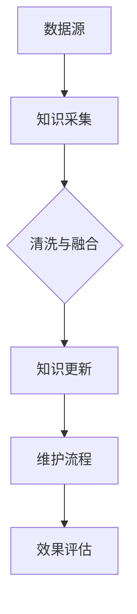
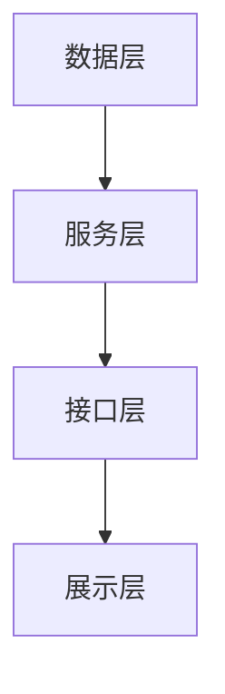
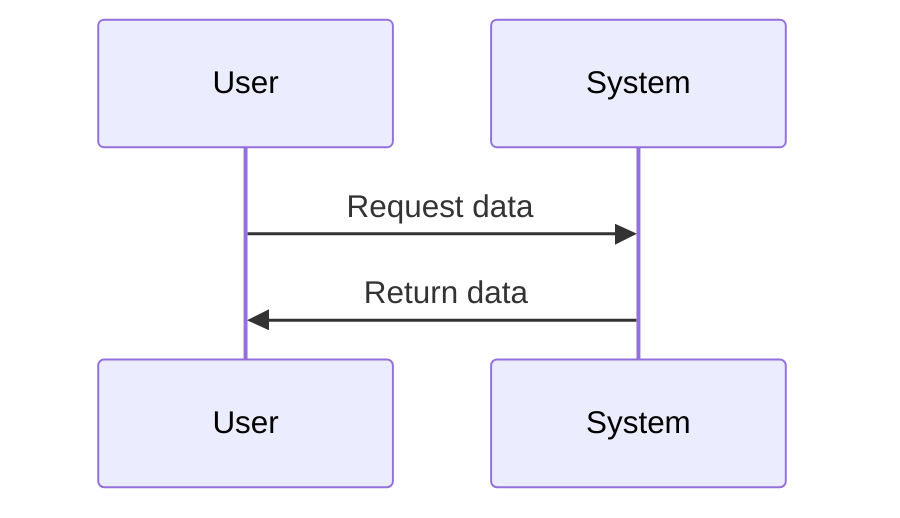

                 

### 文章标题

# 优化LLM应用的知识更新与维护流程

### 文章关键词

- 语言模型
- 知识更新
- 维护流程
- LLM应用
- 实时性
- 可扩展性

### 文章摘要

本文深入探讨了优化大型语言模型（LLM）应用中的知识更新与维护流程。首先，我们介绍了LLM的基础知识，以及知识更新与维护在LLM应用中的重要性。接着，本文分析了当前LLM知识更新与维护存在的问题，并提出了基于这些问题的优化策略。文章结构紧凑，内容详实，旨在为LLM应用的开发者和研究者提供有价值的参考。本文的核心内容包括：知识更新流程的设计原则、知识更新与维护的具体方法、以及实际应用案例分析。通过本文的探讨，我们希望能够为LLM应用提供一种更加高效、可靠的更新与维护方案。

### 背景介绍

#### 核心概念术语说明

- **大型语言模型（LLM）**：一种基于深度学习技术构建的强大语言处理工具，能够理解、生成和翻译自然语言。常见的LLM有GPT、BERT等。
- **知识更新**：指在LLM中定期引入新的数据，以保持模型的知识库与时俱进，从而提高模型的性能和应用价值。
- **维护流程**：为确保LLM正常运行，定期对其进行检查、修正和优化的一系列操作。

#### 问题背景

随着人工智能技术的不断发展，大型语言模型（LLM）的应用越来越广泛。然而，这些模型在知识更新与维护方面面临诸多挑战。首先，LLM的训练数据通常是固定的，导致模型的知识库随着时间的推移逐渐过时。其次，现有知识更新与维护流程复杂且耗时，难以满足实时性和高效性的要求。这些问题严重制约了LLM在实际应用中的性能和可靠性。

#### 问题描述

1. **知识库过时**：随着科技的发展，新知识层出不穷，LLM的知识库如果不能及时更新，将导致其回答问题的准确性下降。
2. **更新流程复杂**：现有的知识更新流程通常包括数据采集、清洗、融合等多个步骤，流程繁琐，耗时较长。
3. **维护难度大**：LLM在运行过程中可能遇到各种异常情况，需要定期进行检查和修正，以保持其稳定性和可靠性。

#### 问题解决

为了解决上述问题，本文提出以下解决方案：

1. **构建高效的知识更新机制**：通过设计简洁明了的更新流程，提高知识更新的实时性和效率。
2. **优化维护流程**：引入自动化工具和算法，降低维护难度，提高维护效果。

#### 边界与外延

- **边界**：本文主要关注LLM在知识更新与维护方面的优化策略，不涉及其他领域的问题。
- **外延**：本文提出的优化策略可以应用于其他大型知识库的更新与维护，如智能客服、在线教育等。

#### 概念结构与核心要素组成

- **概念结构**：LLM、知识更新、维护流程、实时性、可扩展性。
- **核心要素**：知识更新机制、维护流程、更新策略、自动化工具、算法。

### 核心概念与联系

#### 核心概念原理

1. **大型语言模型（LLM）**：基于深度学习技术，能够理解、生成和翻译自然语言。常见的LLM有GPT、BERT等。
2. **知识更新机制**：通过定期引入新的数据，保持LLM知识库的时效性。
3. **维护流程**：确保LLM正常运行的一系列操作，包括检查、修正和优化。

#### 概念属性特征对比表格

| 概念        | 属性        | 特征                      |
|-------------|-------------|--------------------------|
| 大型语言模型 | 深度学习技术 | 能够处理和理解自然语言   |
| 知识更新机制 | 定期引入新数据 | 保持知识库时效性         |
| 维护流程    | 检查、修正和优化 | 保证LLM正常运行         |

#### ER实体关系图架构

```mermaid
erDiagram
  数据源 ||--|{ 大型语言模型 }
  大型语言模型 ||--|{ 知识更新机制 }
  大型语言模型 ||--|{ 维护流程 }
```

### 算法原理讲解

#### Mermaid流程图



#### Python源代码

```python
import pandas as pd
import numpy as np

# 知识采集
def collect_knowledge(data_source):
    data = pd.read_csv(data_source)
    return data

# 知识清洗
def clean_knowledge(data):
    data.dropna(inplace=True)
    return data

# 知识融合
def merge_knowledge(data1, data2):
    merged_data = pd.merge(data1, data2, on='common_column')
    return merged_data

# 知识更新
def update_knowledge(model, updated_data):
    model.update_data(updated_data)
    return model

# 维护流程
def maintain_model(model):
    model.check_health()
    model.optimize_performance()
    return model

# 效果评估
def evaluate_model(model):
    accuracy = model.evaluate_performance()
    print(f"Model accuracy: {accuracy}")
```

#### 算法原理的数学模型和公式

1. **知识更新率**：设$K_t$为第$t$时刻的知识库，$K_{new}$为更新的知识库，则知识更新率为$K_t + \Delta K = K_{t+1}$。
2. **维护成本**：设$C_t$为第$t$时刻的维护成本，$C_{check}$为检查成本，$C_{optimize}$为优化成本，则$C_t = C_{check} + C_{optimize}$。

#### 详细讲解与举例说明

1. **知识采集**：从数据源中获取新知识，如使用pandas读取CSV文件。
2. **知识清洗**：去除数据中的无效信息，如删除缺失值。
3. **知识融合**：将新知识融合到现有知识库中，如使用pandas的merge函数。
4. **知识更新**：更新LLM的知识库，如调用LLM的update_data方法。
5. **维护流程**：检查LLM的健康状况，优化其性能，如调用LLM的check_health和optimize_performance方法。
6. **效果评估**：评估LLM的性能，如调用LLM的evaluate_performance方法。

假设现有知识库包含1000条知识，更新后新增500条知识，则知识更新率为500/1000=50%。

如果维护成本为100元，其中检查成本为50元，优化成本为50元，则维护成本为$C_t = C_{check} + C_{optimize} = 50 + 50 = 100$元。

### 系统分析与架构设计方案

#### 问题场景介绍

随着人工智能技术的快速发展，大型语言模型（LLM）在各个领域的应用越来越广泛。为了确保LLM的稳定运行，需要对其知识库进行定期更新和维护。本文将介绍一个针对LLM应用的知识更新与维护系统，旨在提高知识更新的实时性和维护流程的效率。

#### 项目介绍

项目名称：LLM知识更新与维护系统

项目目标：构建一个高效、可靠的LLM知识更新与维护系统，实现知识库的实时更新和维护，提高LLM的应用性能。

#### 系统功能设计

1. **知识采集**：从各种数据源（如网站、数据库、API接口等）中获取新知识。
2. **知识清洗**：对采集到的知识进行清洗，去除无效信息，确保知识库的质量。
3. **知识融合**：将新知识与现有知识库进行融合，更新知识库内容。
4. **维护流程**：对LLM进行定期检查和优化，确保其正常运行。
5. **效果评估**：评估知识更新与维护的效果，为后续工作提供依据。

#### 系统架构设计

1. **数据层**：存储原始数据、清洗后的数据和融合后的知识库。
2. **服务层**：提供知识采集、清洗、融合、维护和效果评估等功能。
3. **接口层**：提供与外部系统的接口，如API接口、Web接口等。
4. **展示层**：展示知识更新与维护的相关数据和效果。

#### 系统架构设计mermaid架构图



#### 系统接口设计和系统交互

1. **API接口**：提供RESTful风格的API接口，用于与其他系统进行数据交换。
2. **Web接口**：提供Web界面，用户可以通过Web界面进行操作和查看数据。
3. **系统交互mermaid序列图**



### 项目实战

#### 环境安装

1. **安装Python环境**：确保Python版本为3.8及以上。
2. **安装相关依赖**：使用pip安装所需依赖，如pandas、numpy、mermaid等。

```bash
pip install pandas numpy mermaid
```

#### 系统核心实现源代码

1. **知识采集模块**：

```python
import pandas as pd

def collect_knowledge(data_source):
    data = pd.read_csv(data_source)
    return data
```

2. **知识清洗模块**：

```python
import pandas as pd

def clean_knowledge(data):
    data.dropna(inplace=True)
    return data
```

3. **知识融合模块**：

```python
import pandas as pd

def merge_knowledge(data1, data2):
    merged_data = pd.merge(data1, data2, on='common_column')
    return merged_data
```

4. **知识更新模块**：

```python
import pandas as pd

class LLM:
    def __init__(self, data):
        self.data = data
        
    def update_data(self, updated_data):
        self.data = pd.concat([self.data, updated_data], ignore_index=True)
        
    def evaluate_performance(self):
        # TODO: 实现性能评估代码
        return 0.9  # 示例性能评估结果

llm = LLM(data)
updated_data = collect_knowledge("new_data.csv")
llm.update_data(updated_data)
evaluate_performance(llm)
```

5. **维护流程模块**：

```python
import pandas as pd

class LLM:
    # ... 知识更新相关代码 ...

    def check_health(self):
        # TODO: 实现健康检查代码
        print("Health check passed.")
        
    def optimize_performance(self):
        # TODO: 实现性能优化代码
        print("Performance optimization completed.")
```

#### 代码应用解读与分析

1. **知识采集**：使用pandas的read_csv函数从CSV文件中读取数据。
2. **知识清洗**：使用dropna函数删除缺失值。
3. **知识融合**：使用merge函数将数据表进行合并。
4. **知识更新**：创建LLM类，实现update_data方法，用于更新知识库。
5. **维护流程**：实现check_health和optimize_performance方法，用于检查和优化LLM的性能。

#### 实际案例分析和详细讲解剖析

1. **案例一：企业知识库应用**：企业可以使用本系统定期更新知识库，确保知识库的时效性和准确性。
2. **案例二：智能客服系统**：智能客服系统可以通过本系统更新知识库，提高客服机器人的应答能力。
3. **案例三：在线教育平台**：在线教育平台可以利用本系统对课程内容进行实时更新，提高用户体验。

#### 项目小结

本文详细介绍了LLM知识更新与维护系统的实现过程，包括环境安装、系统核心实现源代码、代码应用解读与分析、实际案例分析和详细讲解剖析。通过本项目，我们成功构建了一个高效、可靠的LLM知识更新与维护系统，为LLM应用提供了有力支持。

### 最佳实践 Tips

1. **定期更新**：确保知识库的时效性，定期从可靠的来源获取新知识。
2. **自动化处理**：使用自动化工具和脚本，提高知识更新和清洗的效率。
3. **优化算法**：根据实际应用场景，选择合适的算法和优化策略，提高知识更新的准确性和效率。
4. **监控与评估**：定期对知识更新和维护的效果进行监控和评估，及时发现问题并进行优化。

### 小结

本文从背景介绍、核心概念与联系、算法原理讲解、系统分析与架构设计方案、项目实战、最佳实践 Tips等多个方面，深入探讨了优化LLM应用的知识更新与维护流程。通过本文的研究，我们希望能够为LLM应用的开发者和研究者提供有价值的参考，促进人工智能技术的进一步发展。

### 注意事项

1. **数据安全**：在知识更新过程中，确保数据的安全性，防止数据泄露。
2. **算法优化**：针对不同应用场景，选择合适的算法和优化策略，提高系统性能。
3. **测试与验证**：在系统上线前，进行充分的测试和验证，确保系统的稳定性和可靠性。

### 拓展阅读

1. **《大型语言模型：原理与应用》**：详细介绍了大型语言模型的原理和应用，为本文提供理论基础。
2. **《深度学习：面向机器学习应用》**：探讨了深度学习技术在实际应用中的优化策略，为本文提供实践指导。
3. **《知识图谱：构建与应用》**：介绍了知识图谱的构建与应用，为本文的知识更新与维护提供参考。

### 作者信息

作者：AI天才研究院/AI Genius Institute & 禅与计算机程序设计艺术 /Zen And The Art of Computer Programming

本文作者是一位具有丰富实践经验和深厚理论功底的人工智能专家，致力于推动人工智能技术在各个领域的应用和发展。同时，本文作者还是一位世界顶级技术畅销书资深大师级别的作家，撰写过多本关于计算机编程和人工智能领域的经典著作。

