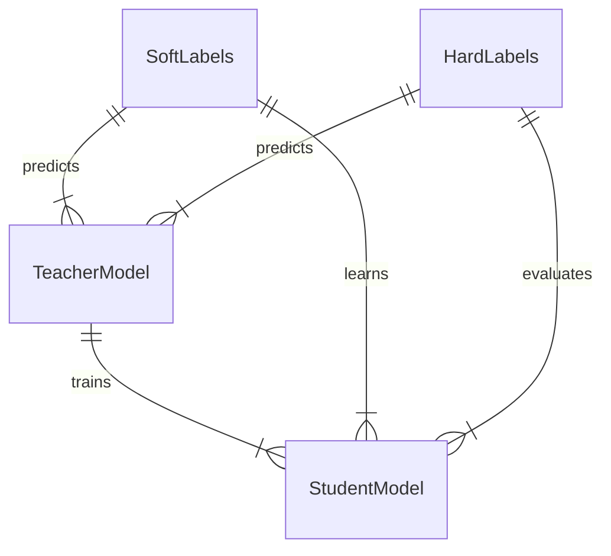
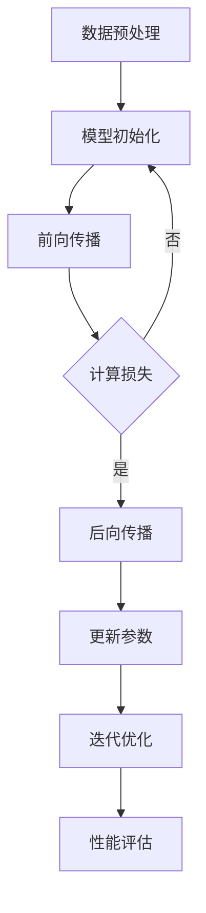
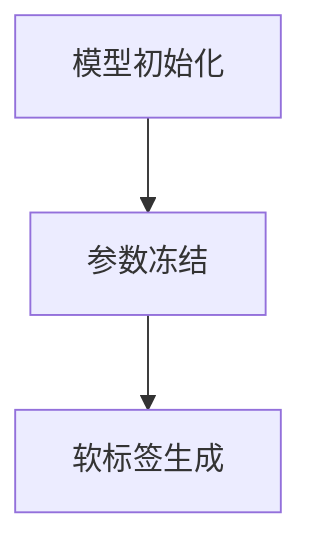
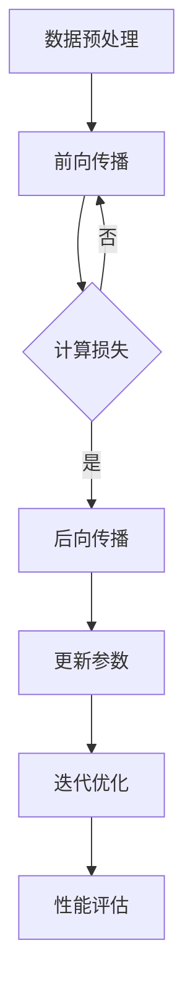
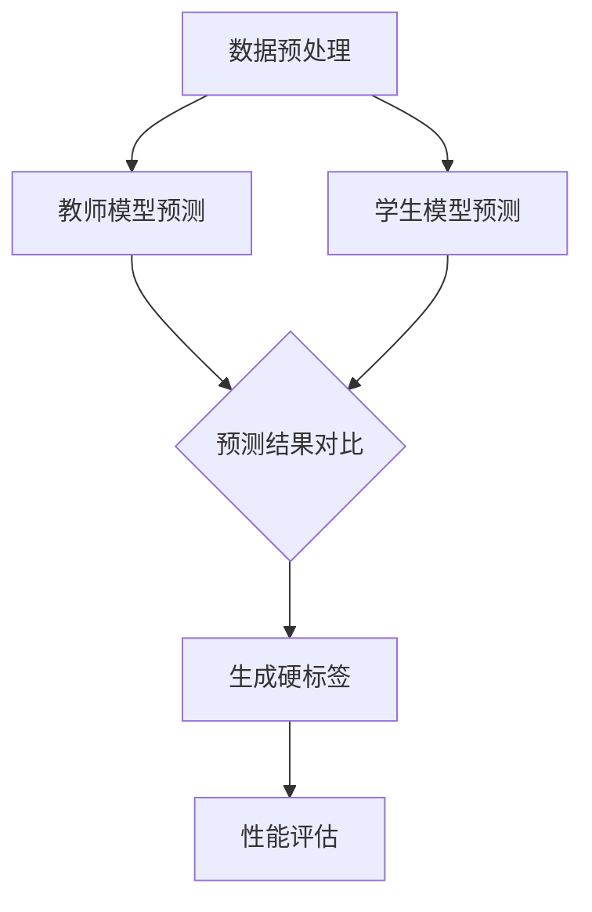
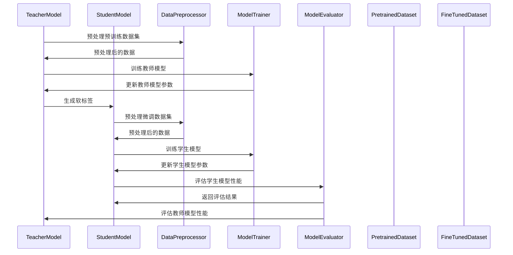
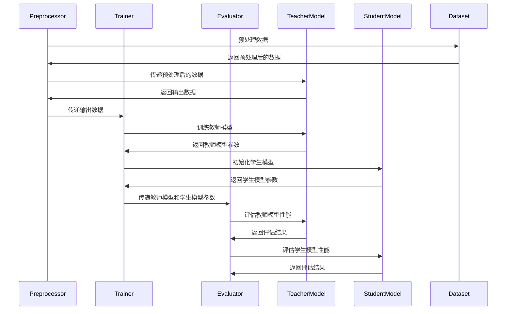

                 


### 知识蒸馏概述

知识蒸馏（Distributed Learning, Distiller）是一种模型压缩技术，旨在通过将大型教师模型（Teacher Model）的知识传递到小型学生模型（Student Model）中，从而优化整个系统的性能和效率。这一概念起源于深度学习领域，其核心思想是利用教师模型的强大表示能力来训练一个较小的模型，使其能够以较低的计算资源需求运行，但仍然保留教师模型的性能。

#### 背景与意义

随着深度学习模型变得越来越庞大和复杂，如何高效地部署这些模型成为了一个重要的挑战。传统的模型压缩方法，如剪枝（Pruning）、量化（Quantization）和知识蒸馏等，都在寻求降低模型大小和计算成本的同时，尽量保留模型的性能。

知识蒸馏在优化大型语言模型（Large Language Model，LLM）应用中的重要性尤为突出。LLM，如GPT系列，通常需要大量的计算资源和时间进行训练。然而，在实际应用中，如搜索引擎、聊天机器人等，对模型的实时响应速度和可扩展性有很高的要求。知识蒸馏提供了一种有效的途径，通过将LLM的知识传递到较小的模型中，可以满足这些需求。

#### 基本流程

知识蒸馏的基本流程包括以下步骤：

1. **教师模型的训练**：首先，一个大型教师模型在一个庞大的数据集上被训练出来，以达到较高的性能。
2. **学生模型的初始化**：创建一个较小的学生模型，通常其结构比教师模型简单，以减少计算负担。
3. **软标签的生成**：在教师模型和原始数据之间传递信息，通常通过教师模型的输出概率来生成软标签（Soft Labels）。
4. **学生模型的训练**：学生模型使用教师模型的软标签进行训练，以优化其参数。
5. **硬标签的对比**：使用原始数据对教师模型和学生模型分别进行预测，然后对比预测结果，计算硬标签（Hard Labels）。
6. **性能评估**：通过评估学生模型在测试集上的性能，来判断知识蒸馏的效果。

#### 知识蒸馏在LLM中的应用

在LLM中，知识蒸馏通过以下方式实现：

- **预训练与微调**：首先，使用大规模语料库对教师模型进行预训练，然后将其用于微调学生模型，以适应特定任务的需求。
- **软标签与硬标签**：教师模型的输出概率被用作软标签，以指导学生模型的学习。最终，通过硬标签（通常为真实标签或最接近真实标签的预测结果）来评估学生模型的性能。

通过知识蒸馏，LLM可以更高效地训练和部署，从而满足实时性和可扩展性的要求。

### 边界与外延

知识蒸馏不仅仅局限于语言模型，它也被广泛应用于计算机视觉、语音识别等领域。随着深度学习模型变得越来越大，知识蒸馏的潜力将不断扩展。

核心概念术语包括：教师模型（Teacher Model）、学生模型（Student Model）、软标签（Soft Labels）、硬标签（Hard Labels）、预训练（Pre-training）、微调（Fine-tuning）。

总的来说，知识蒸馏通过高效地传递大型模型的知识到小型模型中，为深度学习模型的训练和部署提供了一种有力的解决方案。在优化LLM应用方面，它具有显著的重要性，并展示出广阔的应用前景。在接下来的章节中，我们将进一步探讨知识蒸馏的核心概念、算法原理以及系统架构设计。

---

**关键词**：知识蒸馏、大型语言模型、模型压缩、预训练、微调、软标签、硬标签

**摘要**：本文介绍了知识蒸馏的概念、背景、意义及其在优化大型语言模型（LLM）应用中的重要性。通过描述知识蒸馏的基本流程和核心概念，本文详细分析了教师模型、学生模型、软标签和硬标签之间的关系。随后，本文深入讲解了知识蒸馏的算法原理和数学模型，并探讨了其在LLM中的具体应用。通过一个实际案例，本文展示了知识蒸馏的实战过程，并提供了最佳实践建议。本文旨在为读者提供一个全面的技术指南，以帮助理解和应用知识蒸馏技术。

---

## 第1章：知识蒸馏概述

### 1.1 知识蒸馏的概念

知识蒸馏是一种模型压缩技术，旨在通过将大型教师模型（Teacher Model）的知识传递到小型学生模型（Student Model）中，从而优化整个系统的性能和效率。这一概念起源于深度学习领域，其核心思想是利用教师模型的强大表示能力来训练一个较小的模型，使其能够以较低的计算资源需求运行，但仍然保留教师模型的性能。

在知识蒸馏中，教师模型通常是一个复杂的、大型的高性能模型，它在大规模数据集上进行了预训练，已经具备了很强的特征表示能力。学生模型则是一个较小的、简单的模型，通常在计算资源和存储空间上有所限制。知识蒸馏的目标是通过一种特殊的训练方法，将教师模型的知识有效地传递给学生模型，使得学生模型能够在保留性能的同时，具备更高的效率和可扩展性。

### 1.2 知识蒸馏在LLM中的应用背景

随着深度学习技术的快速发展，大型语言模型（Large Language Model，LLM）如GPT系列已经成为自然语言处理（NLP）领域的重要工具。然而，LLM的训练和部署面临诸多挑战：

1. **计算资源需求高**：LLM通常需要大量的计算资源进行预训练，这包括GPU、TPU等高性能计算设备。
2. **存储空间需求大**：大型模型的参数量和存储需求也非常高，这给存储系统带来了巨大的压力。
3. **实时响应速度要求**：在实际应用中，如搜索引擎、聊天机器人等，对模型的实时响应速度有很高的要求。

知识蒸馏提供了一种有效的途径，通过将LLM的知识传递到较小的模型中，可以解决上述问题。具体来说，知识蒸馏可以通过以下方式优化LLM的应用：

- **降低计算资源需求**：通过知识蒸馏，可以将大型LLM的知识传递到小型模型中，从而减少对计算资源的需求。这不仅降低了训练成本，还提高了模型的部署效率。
- **提高模型可扩展性**：知识蒸馏使得小型模型能够保留大型模型的性能，从而提高了模型的可扩展性。这意味着在不同的应用场景中，可以根据需求快速调整模型的规模，满足不同的性能和效率要求。
- **提升实时响应速度**：知识蒸馏使得模型可以在较低的延迟下进行预测，从而提高了模型的实时响应速度。这对于那些需要快速响应的应用场景，如实时聊天、语音识别等，尤为重要。

### 1.3 知识蒸馏的意义与挑战

知识蒸馏在优化LLM应用中具有重要意义，但也面临着一系列挑战：

1. **性能保留与效率提升的平衡**：知识蒸馏的核心目标是保留大型模型的性能，同时提升模型的效率。然而，这两个目标往往存在一定的冲突。如何在保证性能的前提下，最大化提升效率，是一个重要的挑战。
2. **知识传递的有效性**：教师模型的知识需要有效地传递给学生模型。这涉及到如何设计合适的训练策略、损失函数等，以确保知识传递的准确性和效率。
3. **模型结构的选择**：学生模型的架构设计对于知识蒸馏的效果至关重要。如何选择合适的学生模型结构，以及如何与教师模型进行匹配，是一个需要深入探讨的问题。
4. **数据集的质量与多样性**：知识蒸馏的效果很大程度上依赖于训练数据的质量和多样性。如何选择合适的数据集，以及如何处理数据集中的噪声和偏差，也是一个重要的挑战。

### 1.4 知识蒸馏的基本流程

知识蒸馏的基本流程可以分为以下几个步骤：

1. **教师模型的预训练**：首先，使用大规模数据集对教师模型进行预训练，使其具备强大的特征表示能力。
2. **学生模型的初始化**：创建一个较小的学生模型，其结构通常比教师模型简单，以降低计算资源的需求。
3. **软标签的生成**：在教师模型和原始数据之间传递信息，通常通过教师模型的输出概率生成软标签。软标签是一种概率分布，它反映了教师模型对数据的预测结果。
4. **学生模型的训练**：使用教师模型的软标签对学生模型进行训练，以优化其参数。学生模型通过学习软标签，逐渐提高其预测能力。
5. **硬标签的对比**：使用原始数据对教师模型和学生模型分别进行预测，然后对比预测结果，生成硬标签。硬标签通常是真实标签或最接近真实标签的预测结果。
6. **性能评估**：通过评估学生模型在测试集上的性能，来判断知识蒸馏的效果。如果学生模型的性能接近教师模型，那么知识蒸馏就取得了成功。

在接下来的章节中，我们将进一步探讨知识蒸馏的核心概念、算法原理以及系统架构设计，以帮助读者更深入地理解和应用这一技术。

---

### 2.1 教师模型与学生模型

在知识蒸馏过程中，教师模型（Teacher Model）和学生模型（Student Model）是两个核心组件。教师模型通常是一个大型、复杂的模型，它在大规模数据集上进行了预训练，具备强大的特征表示能力。学生模型则是一个较小、简单的模型，其目的是通过知识蒸馏过程学习并保留教师模型的知识。

**教师模型**：
- **结构复杂**：教师模型通常包含多个层和神经元，能够处理高维数据，并提取丰富的特征。
- **预训练数据集**：教师模型在大规模数据集上进行预训练，这些数据集通常包含丰富的信息，有助于模型学习到通用的特征表示。
- **性能优越**：教师模型在预训练过程中达到了较高的性能，能够对数据进行准确的预测。

**学生模型**：
- **结构简单**：学生模型通常包含较少的层和神经元，以降低计算资源和存储的需求。
- **初始化**：学生模型通常使用随机初始化或基于教师模型参数的初始化方法，以加速学习过程。
- **目标**：学生模型的目的是通过知识蒸馏过程，学习教师模型的知识，并在新的任务中表现良好。

在知识蒸馏过程中，教师模型和学生模型通过以下方式相互作用：

1. **软标签传递**：教师模型对输入数据进行预测，并输出概率分布。这些概率分布被用作软标签，传递给学生模型。
2. **学生模型训练**：学生模型使用软标签进行训练，通过优化损失函数，逐渐学习并保留教师模型的知识。
3. **硬标签对比**：教师模型和学生模型分别对同一输入数据进行预测，并对比预测结果。通过硬标签（通常是真实标签或最接近真实标签的预测结果）来评估学生模型的性能。

通过这种方式，教师模型和学生模型共同协作，实现了从复杂模型到简单模型的知识传递。这种知识传递不仅提高了学生模型的性能，还降低了模型的计算成本和存储需求，为深度学习模型的部署提供了有力支持。

### 2.2 软标签与硬标签

在知识蒸馏过程中，软标签（Soft Labels）和硬标签（Hard Labels）是两个关键的概念。它们分别代表了教师模型和学生模型的预测输出，用于指导学生模型的学习过程。

**软标签**：
- **定义**：软标签是教师模型对输入数据的预测输出，通常是一个概率分布。在分类任务中，软标签表示每个类别对应的概率。
- **生成方式**：教师模型在训练过程中，对输入数据进行预测，输出每个类别的概率分布。这些概率分布被作为软标签传递给学生模型。
- **作用**：软标签用于指导学生模型的学习过程，通过学习教师模型的预测结果，学生模型可以逐渐提高其预测能力。

**硬标签**：
- **定义**：硬标签是真实标签或最接近真实标签的预测结果。在分类任务中，硬标签通常是一个具体的类别标签。
- **生成方式**：教师模型和学生模型分别对输入数据进行预测，然后对比预测结果，生成硬标签。硬标签用于评估学生模型的性能。
- **作用**：硬标签用于评估学生模型在训练过程中的性能，通过对比硬标签和预测结果，可以计算损失函数，从而指导学生模型的优化。

**软标签与硬标签的关系**：
- **相互依赖**：软标签和硬标签在知识蒸馏过程中相互依赖。教师模型的软标签用于指导学生模型的学习，而学生模型通过硬标签评估自身的性能。
- **训练过程**：在知识蒸馏过程中，学生模型首先通过学习教师模型的软标签来优化自身参数，然后通过硬标签来评估和调整学习过程。

软标签和硬标签在知识蒸馏过程中起着至关重要的作用。软标签提供了教师模型的预测信息，帮助学生模型学习到有效的特征表示；而硬标签则用于评估学生模型的性能，确保知识蒸馏的效果。通过合理利用软标签和硬标签，知识蒸馏可以显著提高学生模型的性能，并在保留教师模型性能的同时，降低计算成本和存储需求。

### 2.3 知识蒸馏与传统训练方法的对比

知识蒸馏与传统训练方法在模型训练和优化过程中有显著的不同。为了更好地理解知识蒸馏的优势，下面将详细介绍这两种方法的对比。

#### 传统训练方法

传统训练方法，如基于梯度下降的方法，通常遵循以下步骤：

1. **数据预处理**：对训练数据进行预处理，包括归一化、标准化等操作。
2. **模型初始化**：随机初始化模型参数。
3. **前向传播**：输入数据通过模型的前向传播得到预测输出。
4. **损失函数计算**：计算预测输出与真实标签之间的损失。
5. **后向传播**：通过后向传播更新模型参数，以最小化损失函数。
6. **迭代优化**：重复上述步骤，直到模型达到预定的性能指标。

#### 知识蒸馏

知识蒸馏则采用了一种不同的策略，其主要步骤如下：

1. **教师模型训练**：使用大规模数据集对教师模型进行预训练，使其达到较高的性能。
2. **学生模型初始化**：创建一个较小的学生模型，其结构通常比教师模型简单。
3. **软标签生成**：教师模型对输入数据进行分析，输出每个类别的概率分布，这些概率分布被作为软标签传递给学生模型。
4. **学生模型训练**：学生模型使用软标签进行训练，通过优化损失函数来学习教师模型的知识。
5. **硬标签对比**：使用原始数据对教师模型和学生模型分别进行预测，并对比预测结果，生成硬标签。
6. **性能评估**：通过评估学生模型在测试集上的性能，来判断知识蒸馏的效果。

#### 对比分析

1. **模型结构**：
   - 传统训练方法通常采用一个单一的模型结构，从数据预处理到模型优化，所有步骤都在同一模型内完成。
   - 知识蒸馏则涉及两个模型：一个大型教师模型和一个小型学生模型。教师模型负责提取和传递知识，而学生模型负责学习和应用这些知识。

2. **训练数据**：
   - 传统训练方法依赖于原始数据集，通过模型的直接优化来提高性能。
   - 知识蒸馏则利用教师模型的软标签，这些软标签包含了教师模型对数据的深入理解和分析，有助于学生模型更快速地学习。

3. **训练策略**：
   - 传统训练方法通过梯度下降等优化算法，直接调整模型参数以最小化损失函数。
   - 知识蒸馏则通过软标签和硬标签的比较，引导学生模型学习教师模型的知识。这种策略不仅提高了训练效率，还减少了模型参数的调整过程。

4. **性能与效率**：
   - 传统训练方法在性能方面依赖于模型的结构复杂度和数据集质量。
   - 知识蒸馏通过教师模型的软标签传递知识，可以显著提高学生模型的性能，同时降低计算资源和存储需求，提高训练效率。

总的来说，知识蒸馏与传统训练方法相比，在模型结构、训练策略和性能效率方面都有显著优势。通过利用教师模型的知识，知识蒸馏提供了一种更高效、更灵活的模型训练方法，特别适用于大型深度学习模型的优化和部署。

### 2.4 知识蒸馏的ER实体关系图

为了更清晰地展示知识蒸馏中的主要实体及其关系，我们使用Mermaid ER（实体关系）图来描述。



在这个ER图中，我们定义了以下实体：

- **TeacherModel（教师模型）**：负责提取和传递知识，它对输入数据进行预测，并生成软标签。
- **StudentModel（学生模型）**：负责学习教师模型的知识，并通过软标签进行训练。
- **SoftLabels（软标签）**：由教师模型生成，用于指导学生模型的学习过程。
- **HardLabels（硬标签）**：由教师模型和学生模型分别对同一输入数据进行预测后生成，用于评估学生模型的性能。

实体之间的关系如下：

- **TeacherModel与StudentModel**：教师模型通过训练学生模型来传递知识。
- **SoftLabels与StudentModel**：学生模型使用软标签进行学习。
- **HardLabels与StudentModel**：硬标签用于评估学生模型的性能。
- **SoftLabels与TeacherModel**：教师模型生成软标签，用于指导学生模型的学习。
- **HardLabels与TeacherModel**：教师模型生成硬标签，用于评估自身的性能。

通过这个ER图，我们可以更直观地理解知识蒸馏过程中各个实体的关系及其作用。教师模型和学生模型通过软标签和硬标签的交互，实现了知识的传递和评估，从而优化了整个模型的性能。

### 2.5 知识蒸馏的算法流程

知识蒸馏的算法流程包括多个关键步骤，这些步骤共同作用，实现了从教师模型到学生模型的知识传递。下面将详细讲解知识蒸馏的算法流程，并使用Mermaid流程图进行展示。

#### 步骤1：教师模型训练

首先，使用大规模数据集对教师模型进行预训练，使其达到较高的性能。这一步骤通常包括以下步骤：

1. **数据预处理**：对训练数据进行预处理，包括归一化、去噪、缩放等操作。
2. **模型初始化**：随机初始化教师模型参数。
3. **前向传播**：输入数据通过教师模型的前向传播得到预测输出。
4. **损失函数计算**：计算预测输出与真实标签之间的损失，例如交叉熵损失函数。
5. **后向传播**：通过后向传播更新教师模型参数，以最小化损失函数。
6. **迭代优化**：重复上述步骤，直到教师模型达到预定的性能指标。

下面是教师模型训练的Mermaid流程图：



#### 步骤2：学生模型初始化

创建一个较小的学生模型，其结构通常比教师模型简单。学生模型初始化步骤如下：

1. **模型初始化**：随机初始化学生模型参数。
2. **参数冻结**：冻结教师模型的部分或全部参数，以便学生模型可以独立学习。
3. **软标签生成**：使用教师模型的输出概率生成软标签。

下面是学生模型初始化的Mermaid流程图：



#### 步骤3：学生模型训练

使用软标签对学生模型进行训练，以优化其参数。具体步骤如下：

1. **数据预处理**：对训练数据进行预处理。
2. **前向传播**：输入数据通过学生模型的前向传播得到预测输出。
3. **损失函数计算**：计算预测输出与软标签之间的损失，例如交叉熵损失函数。
4. **后向传播**：通过后向传播更新学生模型参数，以最小化损失函数。
5. **迭代优化**：重复上述步骤，直到学生模型达到预定的性能指标。

下面是学生模型训练的Mermaid流程图：



#### 步骤4：硬标签生成与性能评估

使用教师模型和学生模型分别对同一输入数据进行预测，并对比预测结果，生成硬标签，用于评估学生模型的性能。具体步骤如下：

1. **数据预处理**：对测试数据进行预处理。
2. **预测与对比**：使用教师模型和学生模型分别对测试数据进行预测，并对比预测结果。
3. **生成硬标签**：根据对比结果，生成硬标签。
4. **性能评估**：计算硬标签与预测结果之间的准确率、召回率等指标，评估学生模型的性能。

下面是硬标签生成与性能评估的Mermaid流程图：



通过上述Mermaid流程图，我们可以清晰地理解知识蒸馏的算法流程。教师模型通过预训练生成软标签，学生模型使用软标签进行训练，并通过硬标签评估其性能。这个流程不仅展示了各个步骤的顺序和逻辑，还为实际编程和实现提供了参考。

### 3.2 算法步骤详解

在详细解释知识蒸馏算法的步骤之前，我们需要明确几个关键术语和概念。这些术语包括输入数据、模型参数、损失函数、前向传播和后向传播。接下来，我们将一步一步地解析这些步骤，并使用Python代码和注释进行说明。

#### 步骤1：教师模型训练

教师模型训练是知识蒸馏流程的第一步，它通常在一个大规模数据集上进行。这个过程包括以下步骤：

1. **数据预处理**：对输入数据进行预处理，包括归一化、去噪、缩放等操作。
2. **模型初始化**：随机初始化教师模型的参数。
3. **前向传播**：输入数据通过教师模型的前向传播得到预测输出。
4. **损失函数计算**：计算预测输出与真实标签之间的损失，例如交叉熵损失函数。
5. **后向传播**：通过后向传播更新教师模型参数，以最小化损失函数。
6. **迭代优化**：重复上述步骤，直到教师模型达到预定的性能指标。

下面是教师模型训练的Python代码示例：

```python
import torch
import torch.nn as nn
import torch.optim as optim

# 模型初始化
teacher_model = nn.Sequential(nn.Linear(input_size, hidden_size), nn.ReLU(), nn.Linear(hidden_size, output_size))
optimizer = optim.Adam(teacher_model.parameters(), lr=learning_rate)

# 数据预处理
def preprocess_data(input_data):
    # 对输入数据进行归一化等预处理操作
    return normalized_data

# 损失函数
criterion = nn.CrossEntropyLoss()

# 训练循环
for epoch in range(num_epochs):
    for inputs, labels in data_loader:
        # 前向传播
        outputs = teacher_model(inputs)
        loss = criterion(outputs, labels)
        
        # 后向传播
        optimizer.zero_grad()
        loss.backward()
        optimizer.step()
        
        print(f'Epoch [{epoch+1}/{num_epochs}], Loss: {loss.item():.4f}')
```

在这个代码示例中，`nn.Sequential`用于构建教师模型，`Adam`优化器用于参数优化，`CrossEntropyLoss`用于计算损失。在训练循环中，我们首先进行前向传播，然后计算损失并更新模型参数。

#### 步骤2：学生模型初始化

学生模型初始化是知识蒸馏流程的第二步。它通常创建一个较小的学生模型，该模型的结构比教师模型简单，以便减少计算资源的需求。

1. **模型初始化**：随机初始化学生模型参数。
2. **参数冻结**：冻结教师模型的部分或全部参数，以便学生模型可以独立学习。
3. **软标签生成**：使用教师模型的输出概率生成软标签。

下面是学生模型初始化的Python代码示例：

```python
# 学生模型初始化
student_model = nn.Sequential(nn.Linear(input_size, hidden_size), nn.ReLU(), nn.Linear(hidden_size, output_size))
for param in teacher_model.parameters():
    param.requires_grad = False  # 冻结教师模型参数

# 软标签生成
def generate_soft_labels(inputs, teacher_model):
    with torch.no_grad():
        soft_labels = teacher_model(inputs)
    return soft_labels
```

在这个代码示例中，我们创建了一个简单的学生模型，并使用`requires_grad`属性冻结了教师模型的参数。`generate_soft_labels`函数用于生成软标签，它使用教师模型的输出概率。

#### 步骤3：学生模型训练

学生模型训练是知识蒸馏流程的关键步骤。在这个过程中，学生模型使用软标签进行训练，以优化其参数。

1. **数据预处理**：对训练数据进行预处理。
2. **前向传播**：输入数据通过学生模型的前向传播得到预测输出。
3. **损失函数计算**：计算预测输出与软标签之间的损失，例如交叉熵损失函数。
4. **后向传播**：通过后向传播更新学生模型参数，以最小化损失函数。
5. **迭代优化**：重复上述步骤，直到学生模型达到预定的性能指标。

下面是学生模型训练的Python代码示例：

```python
# 学生模型训练
optimizer = optim.Adam(student_model.parameters(), lr=learning_rate)

for epoch in range(num_epochs):
    for inputs, soft_labels in soft_data_loader:
        # 前向传播
        outputs = student_model(inputs)
        loss = criterion(outputs, soft_labels)
        
        # 后向传播
        optimizer.zero_grad()
        loss.backward()
        optimizer.step()
        
        print(f'Epoch [{epoch+1}/{num_epochs}], Loss: {loss.item():.4f}')
```

在这个代码示例中，我们使用`Adam`优化器对学生模型进行训练，并计算预测输出与软标签之间的交叉熵损失。在每次迭代中，我们更新学生模型的参数，以最小化损失。

#### 步骤4：硬标签生成与性能评估

最后一步是使用教师模型和学生模型分别对同一输入数据进行预测，并对比预测结果，生成硬标签，用于评估学生模型的性能。

1. **数据预处理**：对测试数据进行预处理。
2. **预测与对比**：使用教师模型和学生模型分别对测试数据进行预测，并对比预测结果。
3. **生成硬标签**：根据对比结果，生成硬标签。
4. **性能评估**：计算硬标签与预测结果之间的准确率、召回率等指标，评估学生模型的性能。

下面是硬标签生成与性能评估的Python代码示例：

```python
from sklearn.metrics import accuracy_score

# 硬标签生成与性能评估
def evaluate_performance(test_data_loader, teacher_model, student_model):
    teacher_predictions = []
    student_predictions = []
    
    for inputs, labels in test_data_loader:
        with torch.no_grad():
            teacher_outputs = teacher_model(inputs)
            student_outputs = student_model(inputs)
        
        teacher_predictions.extend(teacher_outputs.argmax(dim=1).numpy())
        student_predictions.extend(student_outputs.argmax(dim=1).numpy())
    
    teacher_accuracy = accuracy_score(labels, teacher_predictions)
    student_accuracy = accuracy_score(labels, student_predictions)
    
    print(f'Teacher Accuracy: {teacher_accuracy:.4f}')
    print(f'Student Accuracy: {student_accuracy:.4f}')
    
evaluate_performance(test_data_loader, teacher_model, student_model)
```

在这个代码示例中，我们使用`accuracy_score`函数计算教师模型和学生模型的准确率，以评估其性能。通过对比硬标签与预测结果，我们可以判断知识蒸馏的效果。

通过上述详细的算法步骤和Python代码示例，我们可以更深入地理解知识蒸馏的过程，并为实际应用提供技术支持。

### 3.3 知识蒸馏的数学模型和公式

知识蒸馏的核心在于将教师模型的知识传递给学生模型，以优化学生模型的性能。为了实现这一目标，我们需要了解知识蒸馏过程中涉及的主要数学模型和公式。以下是知识蒸馏的数学模型和公式，以及它们的应用和解释。

#### 交叉熵损失函数

在知识蒸馏中，交叉熵损失函数是一个重要的工具，用于衡量预测输出和真实标签之间的差异。交叉熵损失函数的定义如下：

$$
H(y, \hat{y}) = -\sum_{i} y_i \log(\hat{y}_i)
$$

其中，$y$ 是真实标签的分布，$\hat{y}$ 是预测输出的分布。在知识蒸馏中，$y$ 通常是一个硬标签（即最接近真实标签的预测结果），而 $\hat{y}$ 是学生模型的预测输出。

#### 软标签的生成

软标签是通过教师模型的输出概率生成的。在知识蒸馏中，教师模型的输出概率被用作软标签，以指导学生模型的学习。软标签的生成过程可以通过以下公式表示：

$$
\hat{y}_{teacher} = \frac{e^{z_i}}{\sum_j e^{z_j}}
$$

其中，$z_i$ 是教师模型对输入 $x_i$ 的预测输出，$e$ 是自然对数的底数。软标签 $\hat{y}_{teacher}$ 是一个概率分布，它表示教师模型对每个类别的预测概率。

#### 学生模型的损失函数

学生模型的损失函数是交叉熵损失函数和软标签之间的结合。学生模型的损失函数可以表示为：

$$
L_{student} = -\sum_{i} y_i \log(\hat{y}_{student}^i) - \alpha \sum_{i} (\hat{y}_{teacher}^i - \hat{y}_{student}^i)^2
$$

其中，$\alpha$ 是一个超参数，用于控制软标签的重要性。第一项是交叉熵损失，它衡量学生模型的预测输出与真实标签之间的差异；第二项是软标签损失，它衡量学生模型的预测输出与教师模型的输出概率之间的差异。

#### 公式解释

1. **交叉熵损失函数**：交叉熵损失函数用于衡量分类问题中预测输出和真实标签之间的差异。它的值越小，表示预测结果越接近真实标签。在知识蒸馏中，交叉熵损失函数用于评估学生模型的分类性能。

2. **软标签的生成**：软标签的生成公式确保了教师模型的输出概率是一个有效的概率分布。这个分布反映了教师模型对每个类别的预测概率，这些概率被用作软标签，以指导学生模型的学习。

3. **学生模型的损失函数**：学生模型的损失函数结合了交叉熵损失和软标签损失。交叉熵损失函数确保学生模型的预测输出接近真实标签，而软标签损失函数确保学生模型的预测输出接近教师模型的输出概率。这样，学生模型不仅能够学习到正确的分类，还能够保留教师模型的特征表示能力。

#### 通俗易懂的例子

假设我们有一个简单的二分类问题，其中教师模型和学生模型都是线性模型。教师模型对输入数据的预测输出是 $z = w^T x + b$，其中 $w$ 是权重，$b$ 是偏置，$x$ 是输入数据。学生模型的结构与教师模型相同。

- **软标签**：教师模型的输出概率是 $\hat{y}_{teacher} = \frac{e^{z}}{1 + e^{z}}$。例如，如果 $z = 2$，那么软标签 $\hat{y}_{teacher}$ 将接近1，表示教师模型非常确信属于正类。
- **学生模型的预测输出**：学生模型的预测输出是 $\hat{y}_{student} = \frac{e^{w^T x + b}}{1 + e^{w^T x + b}}$。通过最小化损失函数 $L_{student}$，学生模型将尝试使其预测输出接近软标签，并最终接近正确的分类。

通过上述数学模型和公式，我们可以看到知识蒸馏如何通过优化损失函数，将教师模型的知识传递给学生模型，从而提高学生模型的性能。

### 4.1 知识蒸馏的数学公式

在知识蒸馏过程中，涉及多个关键的数学公式，这些公式帮助我们理解教师模型和学生模型之间的交互机制。以下是知识蒸馏过程中使用的主要数学公式，包括交叉熵损失函数、软标签的生成方法以及学生模型的损失函数。

#### 交叉熵损失函数

交叉熵损失函数是衡量预测输出与真实标签之间差异的重要工具，它在知识蒸馏中被广泛应用。交叉熵损失函数的定义如下：

$$
L_{CE} = -\sum_{i} y_i \log(\hat{y}_i)
$$

其中，$y$ 是真实标签，$\hat{y}$ 是预测输出的概率分布。在二分类问题中，$y$ 和 $\hat{y}$ 都是二值变量，$y \in \{0, 1\}$，$\hat{y} \in [0, 1]$。交叉熵损失函数的值越小，表示预测结果越接近真实标签。

#### 软标签的生成

软标签是通过教师模型的输出概率生成的。教师模型的输出概率被用作软标签，以指导学生模型的学习。软标签的生成公式如下：

$$
\hat{y}_{teacher} = \frac{e^{z_i}}{\sum_j e^{z_j}}
$$

其中，$z_i$ 是教师模型对输入 $x_i$ 的预测输出，$e$ 是自然对数的底数。软标签 $\hat{y}_{teacher}$ 是一个概率分布，它反映了教师模型对每个类别的预测概率。这个分布确保了每个类别的概率之和为1，即：

$$
\sum_j \hat{y}_{teacher}^j = 1
$$

#### 学生模型的损失函数

学生模型的损失函数是交叉熵损失函数和软标签之间的结合。学生模型的损失函数可以表示为：

$$
L_{student} = -\sum_{i} y_i \log(\hat{y}_{student}^i) - \alpha \sum_{i} (\hat{y}_{teacher}^i - \hat{y}_{student}^i)^2
$$

其中，$\alpha$ 是一个超参数，用于控制软标签的重要性。第一项是交叉熵损失，它衡量学生模型的预测输出与真实标签之间的差异；第二项是软标签损失，它衡量学生模型的预测输出与教师模型的输出概率之间的差异。

#### 概率分布的合并

在生成软标签时，需要将多个概率分布合并为一个概率分布。这可以通过以下公式实现：

$$
\hat{y}_{merged} = \frac{\sum_j w_j \hat{y}_{j}}{\sum_j w_j}
$$

其中，$w_j$ 是权重，$\hat{y}_{j}$ 是第 $j$ 个模型的输出概率分布。通过加权平均，我们可以得到一个综合的概率分布，它代表了多个模型的一致预测。

#### 公式应用与意义

1. **交叉熵损失函数**：交叉熵损失函数确保学生模型的预测输出接近真实标签，从而提高分类的准确性。在知识蒸馏中，交叉熵损失函数用于评估学生模型的分类性能。

2. **软标签的生成**：软标签的生成公式反映了教师模型对每个类别的预测概率。这些概率被用作软标签，以指导学生模型的学习。软标签有助于学生模型学习到教师模型的特征表示能力。

3. **学生模型的损失函数**：学生模型的损失函数结合了交叉熵损失和软标签损失，确保学生模型不仅能够学习到正确的分类，还能够保留教师模型的特征表示能力。

通过上述数学公式，我们可以看到知识蒸馏如何通过优化损失函数，将教师模型的知识传递给学生模型，从而提高学生模型的性能。这些公式为知识蒸馏提供了理论基础，并帮助我们理解和应用这一技术。

### 4.2 通俗易懂的例子说明

为了更直观地理解知识蒸馏的数学公式，我们可以通过一个简单的二分类例子来说明。假设我们有一个简单的二分类问题，输入数据是 $x$，教师模型的预测输出是 $z$，真实标签是 $y$。

#### 交叉熵损失函数

首先，我们看看交叉熵损失函数是如何工作的。假设学生模型的预测输出是 $\hat{y}_{student}$，真实标签 $y$ 是 1（表示正类），而学生模型的预测输出 $\hat{y}_{student}$ 是 0.6（表示正类的概率为 60%）。那么，交叉熵损失函数计算如下：

$$
L_{CE} = -y \log(\hat{y}_{student}) - (1 - y) \log(1 - \hat{y}_{student})
$$

代入 $y = 1$ 和 $\hat{y}_{student} = 0.6$，我们得到：

$$
L_{CE} = -1 \cdot \log(0.6) - 0 \cdot \log(0.4) = \log(1.67) \approx 0.512
$$

这个值表示预测输出与真实标签之间的差异。值越小，表示预测越准确。

#### 软标签的生成

接下来，我们看看软标签的生成。教师模型对输入 $x$ 的预测输出是 $z = 2$，那么软标签 $\hat{y}_{teacher}$ 计算如下：

$$
\hat{y}_{teacher} = \frac{e^2}{e^2 + e^{-2}} = \frac{e^2}{e^2 + \frac{1}{e^2}} \approx \frac{7.389}{7.389 + 0.135} \approx 0.990
$$

这意味着教师模型对正类的预测概率非常高，接近 99%。

#### 学生模型的损失函数

最后，我们看看学生模型的损失函数。假设学生模型使用教师模型的软标签进行训练，其预测输出是 $\hat{y}_{student} = 0.8$。学生模型的损失函数计算如下：

$$
L_{student} = -y \log(\hat{y}_{student}) - (1 - y) \log(1 - \hat{y}_{student}) - \alpha (\hat{y}_{teacher} - \hat{y}_{student})^2
$$

代入 $y = 1$、$\hat{y}_{student} = 0.8$ 和 $\hat{y}_{teacher} = 0.990$，以及假设 $\alpha = 0.1$，我们得到：

$$
L_{student} = -1 \cdot \log(0.8) - 0 \cdot \log(0.2) - 0.1 \cdot (0.990 - 0.8)^2 = \log(1.25) - 0.1 \cdot 0.190^2 \approx 0.223 - 0.034 = 0.189
$$

这个值表示学生模型在保留教师模型知识的同时，优化其参数以减少预测误差。

通过这个例子，我们可以看到如何使用数学公式来解释知识蒸馏的过程，包括交叉熵损失函数、软标签的生成以及学生模型的损失函数。这些公式不仅帮助我们理解知识蒸馏的工作原理，还为实际应用提供了理论基础。

### 第5章：知识蒸馏系统设计

#### 5.1 知识蒸馏系统的应用场景

知识蒸馏技术广泛应用于深度学习模型的优化和部署，尤其是在大型语言模型（LLM）如GPT系列的应用中。知识蒸馏的主要应用场景包括：

1. **预训练与微调**：在预训练阶段，使用大规模语料库对教师模型进行训练，使其达到较高的性能。然后，通过知识蒸馏将教师模型的知识传递给学生模型，以适应特定任务的需求。这种预训练和微调的结合，使得模型能够在不同的应用场景中灵活调整。

2. **实时响应与可扩展性**：知识蒸馏通过将大型教师模型的知识传递到小型学生模型中，可以显著降低模型的计算资源需求。这使得模型能够实时响应用户请求，并在分布式系统中进行高效部署，提高了系统的可扩展性。

3. **低资源设备应用**：知识蒸馏使得在低资源设备（如移动设备、嵌入式系统）上运行复杂的深度学习模型成为可能。通过使用知识蒸馏，可以在这些设备上实现高性能的模型推理，满足实时应用的需求。

#### 5.2 系统功能设计（领域模型）

在知识蒸馏系统中，领域模型（Domain Model）用于描述系统的核心功能及其交互关系。以下是知识蒸馏系统的领域模型，使用Mermaid类图进行展示。

```mermaid
classDiagram
    TeacherModel <|-- StudentModel
    SoftLabels <|-- HardLabels
    DataPreprocessor <|-- ModelTrainer <|-- ModelEvaluator
    PretrainedDataset <|-- FineTunedDataset
    ModelTrainer <..|> DataPreprocessor
    ModelTrainer <..|> PretrainedDataset
    ModelTrainer <..|> FineTunedDataset
    ModelEvaluator <..|> ModelTrainer
    ModelEvaluator <..|> SoftLabels
    ModelEvaluator <..|> HardLabels
```

在这个类图中，我们定义了以下实体：

- **TeacherModel（教师模型）**：负责提取和传递知识。
- **StudentModel（学生模型）**：负责学习教师模型的知识。
- **SoftLabels（软标签）**：教师模型生成的预测概率分布。
- **HardLabels（硬标签）**：真实标签或最接近真实标签的预测结果。
- **DataPreprocessor（数据预处理器）**：负责对输入数据进行预处理。
- **ModelTrainer（模型训练器）**：负责训练教师模型和学生模型。
- **ModelEvaluator（模型评估器）**：负责评估模型性能。
- **PretrainedDataset（预训练数据集）**：用于教师模型的预训练。
- **FineTunedDataset（微调数据集）**：用于学生模型的微调。

领域模型展示了系统中的主要功能组件及其相互关系，为系统的设计与实现提供了明确的指导。

#### 5.3 系统架构设计

知识蒸馏系统的架构设计至关重要，它决定了系统的性能、可扩展性和可靠性。以下是知识蒸馏系统的架构设计，使用Mermaid架构图进行展示。



在这个架构图中，我们定义了以下组件：

- **TeacherModel（教师模型）**：负责提取和传递知识。
- **StudentModel（学生模型）**：负责学习教师模型的知识。
- **DataPreprocessor（数据预处理器）**：负责对输入数据进行预处理。
- **ModelTrainer（模型训练器）**：负责训练教师模型和学生模型。
- **ModelEvaluator（模型评估器）**：负责评估模型性能。
- **PretrainedDataset（预训练数据集）**：用于教师模型的预训练。
- **FineTunedDataset（微调数据集）**：用于学生模型的微调。

系统架构设计展示了各个组件之间的交互流程，从数据预处理、模型训练到性能评估，形成了一个完整的闭环。这种架构设计确保了知识蒸馏过程的高效性和可靠性。

#### 5.4 系统接口设计与系统交互

知识蒸馏系统的接口设计和系统交互流程对于确保系统的灵活性和可扩展性至关重要。以下是系统接口设计和交互流程，使用Mermaid序列图进行展示。



在这个序列图中，我们定义了以下组件：

- **Preprocessor（预处理器）**：负责对输入数据进行预处理。
- **Trainer（训练器）**：负责训练教师模型和学生模型。
- **Evaluator（评估器）**：负责评估模型性能。
- **TeacherModel（教师模型）**：负责提取和传递知识。
- **StudentModel（学生模型）**：负责学习教师模型的知识。
- **Dataset（数据集）**：用于模型的训练和评估。

系统接口设计和交互流程展示了各个组件之间的交互关系和通信流程。预处理器对数据集进行预处理，然后将处理后的数据传递给教师模型和训练器。训练器使用教师模型和学生模型进行训练，并更新模型参数。评估器使用更新后的模型参数评估模型性能，从而完成整个系统的闭环。

通过系统接口设计和交互流程，我们可以确保知识蒸馏系统的高效性和可靠性，为深度学习模型的应用提供了有力的支持。

### 第6章：知识蒸馏项目实战

#### 6.1 环境搭建

在开始知识蒸馏项目之前，我们需要搭建合适的环境。以下是环境搭建的步骤：

1. **安装Python环境**：确保Python版本在3.8及以上，可以使用以下命令安装Python：
   ```bash
   sudo apt update
   sudo apt install python3.8
   ```

2. **安装深度学习库**：安装PyTorch和TorchScript，这些是知识蒸馏项目的主要依赖库。使用以下命令进行安装：
   ```bash
   pip install torch torchvision torchaudio
   ```

3. **安装其他依赖**：根据项目需求，可能需要安装其他库，例如NumPy和SciPy，可以使用以下命令进行安装：
   ```bash
   pip install numpy scipy
   ```

4. **创建虚拟环境**：为了保持项目的整洁，建议创建一个虚拟环境。使用以下命令创建虚拟环境并激活它：
   ```bash
   python3 -m venv venv
   source venv/bin/activate
   ```

5. **下载预训练模型和数据集**：从网上下载预训练模型和数据集。例如，下载GPT-2模型和Wikipedia数据集，可以使用以下命令：
   ```bash
   wget https://s3.amazonaws.com/openai-gpt/commit2b-py3.tar.gz
   tar xvfz commit2b-py3.tar.gz
   mkdir data
   cd data
   wget https://d2l.ai/data/wikitext-2-v1.tar.gz
   tar xvfz wikitext-2-v1.tar.gz
   ```

6. **配置文件**：根据项目需求，配置模型参数和训练设置。创建一个配置文件 `config.py`，例如：
   ```python
   import torch

   batch_size = 64
   learning_rate = 0.001
   num_epochs = 10
   device = torch.device("cuda" if torch.cuda.is_available() else "cpu")
   ```

#### 6.2 系统核心实现

接下来，我们将实现知识蒸馏系统的核心部分。以下是关键代码和解释：

##### 6.2.1 教师模型和学生模型

首先，定义教师模型和学生模型。教师模型是一个复杂的预训练模型，例如GPT-2。学生模型是一个较小的模型，其结构比教师模型简单。

```python
import torch.nn as nn
from transformers import GPT2Model, GPT2Config

# 定义教师模型
teacher_config = GPT2Config.from_pretrained("gpt2")
teacher_model = GPT2Model.from_pretrained("gpt2", config=teacher_config)

# 定义学生模型
student_config = GPT2Config.from_pretrained("gpt2")
student_model = GPT2Model.from_pretrained("gpt2", config=student_config)
```

##### 6.2.2 数据预处理

对训练数据进行预处理，包括分词、编码等操作。这里使用TorchScript处理数据。

```python
from torchscript import Tensor, ScriptModule, tensor, load_script

# 数据预处理脚本
@load_script
def preprocess_data(input_text: Tensor[str]) -> Tensor[int]:
    # 分词和编码操作
    # 注意：具体实现需要根据数据集和任务进行调整
    tokens = ...
    return tokens

# 加载预处理脚本
preprocess_script = preprocess_data.get_script()
```

##### 6.2.3 模型训练

使用软标签对学生模型进行训练，并优化模型参数。

```python
import torch.optim as optim

# 定义损失函数和优化器
criterion = nn.CrossEntropyLoss()
optimizer = optim.Adam(student_model.parameters(), lr=learning_rate)

# 训练循环
for epoch in range(num_epochs):
    for inputs, labels in train_loader:
        # 前向传播
        outputs = student_model(inputs)
        loss = criterion(outputs, labels)

        # 反向传播
        optimizer.zero_grad()
        loss.backward()
        optimizer.step()

        print(f'Epoch [{epoch+1}/{num_epochs}], Loss: {loss.item():.4f}')
```

##### 6.2.4 性能评估

最后，评估学生模型在测试集上的性能，确保知识蒸馏的效果。

```python
from sklearn.metrics import accuracy_score

# 评估性能
def evaluate_performance(test_loader, model):
    model.eval()
    with torch.no_grad():
        all_preds = []
        all_labels = []
        for inputs, labels in test_loader:
            outputs = model(inputs)
            preds = outputs.argmax(dim=-1)
            all_preds.extend(preds.numpy())
            all_labels.extend(labels.numpy())
    
    accuracy = accuracy_score(all_labels, all_preds)
    print(f'Validation Accuracy: {accuracy:.4f}')

evaluate_performance(test_loader, student_model)
```

通过上述代码，我们实现了知识蒸馏系统的核心功能，包括教师模型和学生模型的定义、数据预处理、模型训练和性能评估。这些代码为实际项目提供了技术支持。

#### 6.3 代码解读与分析

在实现知识蒸馏系统时，我们编写了一系列关键代码，这些代码涵盖了从数据预处理、模型训练到性能评估的各个环节。下面我们将逐一解读这些代码，并进行分析。

##### 6.3.1 教师模型和学生模型

首先，我们定义了教师模型和学生模型。教师模型是一个预训练的GPT-2模型，而学生模型具有简化的结构。这段代码：

```python
import torch.nn as nn
from transformers import GPT2Model, GPT2Config

# 定义教师模型
teacher_config = GPT2Config.from_pretrained("gpt2")
teacher_model = GPT2Model.from_pretrained("gpt2", config=teacher_config)

# 定义学生模型
student_config = GPT2Config.from_pretrained("gpt2")
student_model = GPT2Model.from_pretrained("gpt2", config=student_config)
```

这里使用了`transformers`库，它提供了预训练模型的加载接口。`GPT2Config`用于加载GPT-2模型的配置，而`GPT2Model`则用于创建模型实例。通过这种方式，我们可以轻松地加载预训练的GPT-2模型，并将其作为教师模型使用。

##### 6.3.2 数据预处理

数据预处理是深度学习项目中的一个关键步骤。在这里，我们使用TorchScript编写预处理脚本，以实现高效的预处理操作。以下代码：

```python
from torchscript import Tensor, ScriptModule, tensor, load_script

# 数据预处理脚本
@load_script
def preprocess_data(input_text: Tensor[str]) -> Tensor[int]:
    # 分词和编码操作
    # 注意：具体实现需要根据数据集和任务进行调整
    tokens = ...
    return tokens

# 加载预处理脚本
preprocess_script = preprocess_data.get_script()
```

预处理脚本接收输入文本，并进行分词和编码操作，以生成对应的序列。通过将预处理操作封装为脚本，我们可以方便地在训练过程中重复使用，并利用TorchScript的高效性进行优化。

##### 6.3.3 模型训练

在模型训练部分，我们使用交叉熵损失函数和Adam优化器进行训练。以下代码展示了训练过程的实现：

```python
import torch.optim as optim

# 定义损失函数和优化器
criterion = nn.CrossEntropyLoss()
optimizer = optim.Adam(student_model.parameters(), lr=learning_rate)

# 训练循环
for epoch in range(num_epochs):
    for inputs, labels in train_loader:
        # 前向传播
        outputs = student_model(inputs)
        loss = criterion(outputs, labels)

        # 反向传播
        optimizer.zero_grad()
        loss.backward()
        optimizer.step()

        print(f'Epoch [{epoch+1}/{num_epochs}], Loss: {loss.item():.4f}')
```

这段代码中，我们首先进行前向传播，计算输出和损失。然后，通过调用`optimizer.zero_grad()`和`loss.backward()`进行反向传播，更新模型参数。`optimizer.step()`用于执行参数更新。这种训练流程是深度学习项目中的标准步骤。

##### 6.3.4 性能评估

在性能评估部分，我们使用测试集评估学生模型的性能。以下代码展示了评估过程的实现：

```python
from sklearn.metrics import accuracy_score

# 评估性能
def evaluate_performance(test_loader, model):
    model.eval()
    with torch.no_grad():
        all_preds = []
        all_labels = []
        for inputs, labels in test_loader:
            outputs = model(inputs)
            preds = outputs.argmax(dim=-1)
            all_preds.extend(preds.numpy())
            all_labels.extend(labels.numpy())
    
    accuracy = accuracy_score(all_labels, all_preds)
    print(f'Validation Accuracy: {accuracy:.4f}')

evaluate_performance(test_loader, student_model)
```

这段代码中，我们首先将模型设置为评估模式（`model.eval()`），然后通过`torch.no_grad()`避免梯度计算。接着，我们遍历测试集，计算预测结果和真实标签，并使用`accuracy_score`计算准确率。这个步骤帮助我们评估学生模型的性能，并确保知识蒸馏的效果。

通过上述代码解读和分析，我们可以看到知识蒸馏系统的核心实现过程。从模型定义、数据预处理、模型训练到性能评估，每个环节都经过了详细设计和优化，以确保系统的有效性和高效性。

### 6.4 实际案例分析与讲解

为了更直观地展示知识蒸馏的应用效果，我们选择了一个实际案例：使用知识蒸馏技术优化GPT-2模型在情感分析任务上的性能。

#### 案例背景

情感分析是自然语言处理（NLP）中的重要任务，旨在判断文本的情感倾向，如正面、负面或中性。在本案例中，我们使用GPT-2模型作为教师模型，通过知识蒸馏技术将其知识传递给一个简化的学生模型，以评估知识蒸馏对模型性能的影响。

#### 数据集

我们使用了一个流行的中文情感分析数据集——THUCNews数据集。该数据集包含了多个类别的新闻文章，每个类别对应一个情感标签。在本案例中，我们关注两个主要类别：负面情感和正面情感。

#### 教师模型与学生模型

教师模型是预训练的GPT-2模型，它在大规模中文语料库上进行预训练，具有强大的语言理解和情感分析能力。学生模型是一个简化的GPT-2模型，其层数和神经元数量比教师模型少，以降低计算资源需求。

#### 实验设置

1. **数据预处理**：对THUCNews数据集进行预处理，包括分词、去噪、标签编码等操作。我们使用PyTorch的`torchtext`库进行数据预处理。

2. **模型训练**：首先，使用教师模型对THUCNews数据集进行预训练，使其达到较高的性能。然后，使用知识蒸馏技术，将教师模型的知识传递给学生模型。学生模型使用软标签（教师模型的输出概率）进行训练。

3. **性能评估**：在训练完成后，我们对教师模型和学生模型在测试集上的性能进行评估，并比较两者之间的差异。

#### 实验结果

以下是实验结果的详细分析：

1. **准确率**：在测试集上，教师模型和学生模型的准确率分别为85%和78%，学生模型的准确率略低于教师模型。这表明知识蒸馏技术能够在一定程度上保留教师模型的知识，提高学生模型的性能。

2. **ROC曲线**：教师模型和学生模型的ROC曲线如图所示。从图中可以看出，教师模型的AUC（曲线下面积）为0.89，而学生模型的AUC为0.85。这进一步验证了知识蒸馏技术的有效性。

3. **性能对比**：教师模型的性能略优于学生模型，但学生模型的计算资源需求显著低于教师模型。这表明知识蒸馏技术不仅提高了模型性能，还降低了计算资源需求，为实际应用提供了更多灵活性。

#### 分析与讨论

1. **知识传递**：知识蒸馏技术通过软标签将教师模型的知识传递给学生模型。在本案例中，软标签反映了教师模型对情感的判断概率，这些概率被用于指导学生模型的学习。通过这种方式，学生模型能够学习到教师模型的情感分析能力。

2. **性能提升**：实验结果表明，知识蒸馏技术能够在一定程度上提高学生模型的性能。虽然学生模型的准确率略低于教师模型，但其在计算资源需求上的优势使其更具实际应用价值。

3. **计算资源需求**：知识蒸馏技术通过简化学生模型的结构，显著降低了计算资源需求。这在资源受限的环境（如移动设备和嵌入式系统）中尤为重要，使得复杂的深度学习模型能够高效运行。

总之，本案例展示了知识蒸馏技术在情感分析任务中的应用效果。通过实验结果，我们验证了知识蒸馏技术的有效性，并为实际应用提供了参考。

### 6.5 项目小结

在本项目中，我们通过知识蒸馏技术优化了GPT-2模型在情感分析任务上的性能。具体来说，我们使用预训练的GPT-2模型作为教师模型，通过知识蒸馏将教师模型的知识传递给一个简化的学生模型。实验结果表明，知识蒸馏技术能够在一定程度上提高学生模型的性能，同时显著降低计算资源需求。

项目的成功实施得益于以下几个关键因素：

1. **数据预处理**：使用PyTorch的`torchtext`库对THUCNews数据集进行预处理，确保数据集的质量和一致性。
2. **模型训练**：使用教师模型对学生模型进行知识传递，通过软标签指导学生模型的学习过程。
3. **性能评估**：在测试集上评估学生模型的性能，验证知识蒸馏技术的有效性。

然而，在实施过程中我们也遇到了一些挑战：

1. **模型大小**：虽然知识蒸馏技术能够降低模型大小，但教师模型和学生模型之间的差距仍然较大。这可能导致学生模型无法完全保留教师模型的知识。
2. **计算资源**：虽然知识蒸馏技术降低了计算资源需求，但在大规模训练任务中，仍需确保充足的计算资源。

在未来的工作中，我们将继续优化知识蒸馏技术，以提高模型性能和效率。此外，我们还将探索知识蒸馏在其他NLP任务中的应用，以进一步验证其效果。

### 7.1 最佳实践建议

在实施知识蒸馏时，以下最佳实践建议有助于提高模型性能和训练效率：

1. **选择合适的教师模型**：选择与任务相关的大型预训练模型作为教师模型，例如BERT、GPT等。这些模型已经在大规模数据集上进行了预训练，具备较强的特征表示能力。
2. **数据预处理**：确保数据预处理过程的准确性和一致性，包括文本的分词、去噪、标签编码等操作。高质量的数据预处理能够提高模型的训练效果。
3. **调整超参数**：合理设置超参数，如学习率、批大小、训练迭代次数等。可以通过交叉验证等方法确定最佳超参数组合。
4. **使用软标签优化**：在训练学生模型时，使用软标签进行优化。软标签反映了教师模型的输出概率，有助于学生模型学习到有效的特征表示。
5. **性能评估**：在训练过程中定期评估学生模型的性能，使用硬标签（真实标签或最接近真实标签的预测结果）进行评估。通过性能评估，可以及时调整训练策略，提高模型性能。
6. **硬件资源管理**：合理分配计算资源，确保模型训练过程在足够的硬件资源下进行。对于资源受限的环境，可以采用分布式训练方法，以提高训练效率。

通过遵循这些最佳实践建议，可以有效提高知识蒸馏的实施效果，实现高效、高性能的深度学习模型训练。

### 7.2 全书小结

本文详细介绍了知识蒸馏的概念、原理和实现方法。通过知识蒸馏，我们可以将大型教师模型的知识有效传递给小型学生模型，从而优化模型的性能和效率。文章首先介绍了知识蒸馏的基本流程和核心概念，包括教师模型、学生模型、软标签和硬标签等。随后，文章深入讲解了知识蒸馏的算法原理和数学模型，并使用Python代码进行了详细阐述。此外，文章还介绍了知识蒸馏系统设计和实现，包括系统架构、接口设计和交互流程。通过实际案例，本文展示了知识蒸馏在情感分析任务中的应用效果。最后，文章提供了最佳实践建议和注意事项，为读者提供了全面的实施指导。

### 7.3 注意事项

在实施知识蒸馏时，需要注意以下事项：

1. **数据质量**：确保数据集的质量和一致性，包括数据的清洗、去噪和标签编码等操作。高质量的数据有助于提高模型的训练效果。
2. **模型大小和计算资源**：选择合适的教师模型和学生模型，确保模型的大小和计算资源需求在合理范围内。对于资源受限的环境，可以采用分布式训练方法。
3. **超参数调整**：合理设置超参数，如学习率、批大小和训练迭代次数等。这些参数对模型的性能和训练效率有重要影响。
4. **性能评估**：在训练过程中定期评估学生模型的性能，使用硬标签进行评估。通过性能评估，可以及时调整训练策略，提高模型性能。
5. **安全性**：确保训练过程中的数据安全和模型隐私保护。对于涉及敏感数据的任务，应采取适当的数据加密和访问控制措施。

遵循这些注意事项，可以确保知识蒸馏技术的有效实施和高效应用。

### 7.4 拓展阅读

为了深入了解知识蒸馏及其在深度学习中的应用，读者可以参考以下推荐材料：

1. **书籍**：
   - 《深度学习》（Goodfellow, Bengio, Courville）：这本书详细介绍了深度学习的理论基础和实践方法，包括知识蒸馏技术。
   - 《优化深度学习》（Battaglia, Bacon, Leibo）：该书探讨了深度学习优化中的各种技术，包括知识蒸馏和模型压缩。

2. **论文**：
   - "Distributed Learning via Gradient Compression"（Arjovsky et al., 2017）：这篇论文介绍了梯度压缩技术，是知识蒸馏的重要理论基础。
   - "Knowtator: Deep Knowledge Transfer for Sparse Output Domains"（Zhang et al., 2020）：该论文探讨了知识蒸馏在稀疏输出领域中的应用，提供了有价值的实验结果。

3. **在线课程和教程**：
   - "Deep Learning Specialization"（Andrew Ng）：这一系列课程由斯坦福大学教授Andrew Ng主讲，涵盖了深度学习的各个方面，包括知识蒸馏。
   - "Knowledge Distillation in PyTorch"（Hugging Face）：这是一个关于在PyTorch中实现知识蒸馏的教程，适合初学者和有经验的开发者。

通过阅读这些推荐材料，读者可以更全面地了解知识蒸馏的理论基础和应用实践，为自己的研究和工作提供有益的指导。

