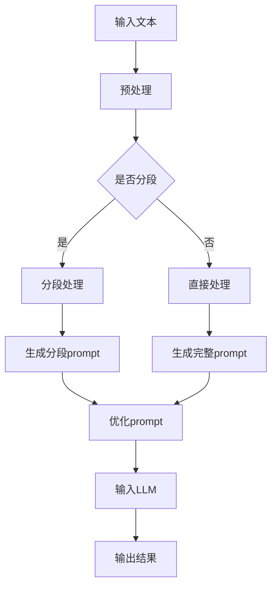

                 


# 优化prompt：提升LLM应用性能的关键

## 关键词
- 优化prompt
- LLM应用性能
- 性能提升
- 算法原理
- 实践应用
- 系统设计与实现

## 摘要
本文深入探讨了优化prompt在提升大型语言模型（LLM）应用性能中的关键作用。通过对LLM基础概念的介绍，以及prompt优化原理的讲解，本文将详细阐述如何通过数学模型和算法实现prompt优化。同时，结合实际项目案例，分析优化prompt对系统性能的显著影响，为开发者提供实用的最佳实践和系统设计指导。

## 第一部分：背景与概念

### 1.1 问题背景与描述

在现代人工智能领域，大型语言模型（LLM）如GPT-3、BERT等被广泛应用于自然语言处理（NLP）任务中。然而，LLM的应用性能瓶颈问题逐渐显现，特别是在处理长文本、高复杂性任务时，模型响应速度和准确性受到限制。其中一个关键因素是prompt的设计和优化不足。

prompt作为模型输入的一部分，直接影响LLM的输出质量和计算效率。不当的prompt可能导致模型理解偏差、计算资源浪费，甚至性能下降。因此，优化prompt成为提升LLM应用性能的关键途径。

### 1.2 LLM与prompt基础

LLM是一种基于深度学习的自然语言处理模型，具有强大的语义理解和生成能力。其基本原理是通过大规模语料训练，学习语言的模式和结构，从而实现对未知文本的预测和生成。

prompt则是提供给LLM的输入，通常包含问题的背景信息、上下文和具体问题本身。prompt的设计直接影响模型对问题的理解和回答质量。

### 1.3 LLM与prompt的关系

LLM的输出质量高度依赖于prompt的质量。一个良好的prompt应该能够清晰明确地传达问题，帮助模型快速准确地捕捉问题的核心，从而提高输出质量。同时，prompt的长度、格式和结构也会影响模型的计算效率和资源利用率。

## 第二部分：优化原理

### 2.1 算法原理讲解

#### 2.1.1 算法mermaid流程图

为了更好地理解prompt优化的原理，我们可以使用Mermaid语言绘制算法流程图，如下：



#### 2.1.2 Python源代码实现

```python
import re

def preprocess_text(text):
    # 去除特殊字符和空白
    text = re.sub(r'[^\w\s]', '', text)
    # 分词处理
    text = text.split()
    return text

def segment_text(text, max_len=512):
    # 分段处理文本
    segments = []
    current_segment = []
    for word in text:
        if len(current_segment) + len(word) > max_len:
            segments.append(current_segment)
            current_segment = [word]
        else:
            current_segment.append(word)
    segments.append(current_segment) # 最后一段
    return segments

def generate_prompt(segments):
    # 生成prompt
    prompts = []
    for i, segment in enumerate(segments):
        if i == 0:
            prompt = "问题："
        elif i == len(segments) - 1:
            prompt = "回答："
        else:
            prompt = "上下文："
        prompt += ' '.join(segment)
        prompts.append(prompt)
    return prompts

def optimize_prompt(prompt, model):
    # 优化prompt
    # 这里简化为调用模型接口
    optimized_prompt = model.optimize(prompt)
    return optimized_prompt

def main():
    # 主函数
    text = "这里是输入文本"
    preprocessed_text = preprocess_text(text)
    segments = segment_text(preprocessed_text)
    prompts = generate_prompt(segments)
    optimized_prompts = [optimize_prompt(prompt, model) for prompt in prompts]
    for prompt in optimized_prompts:
        print(prompt)

if __name__ == "__main__":
    main()
```

#### 2.1.3 数学模型与公式

在prompt优化过程中，我们使用以下数学模型：

$$
P_{\text{opt}} = f(P, \theta)
$$

其中，$P$ 表示原始prompt，$P_{\text{opt}}$ 表示优化后的prompt，$f$ 表示优化函数，$\theta$ 是优化参数。

优化函数的目标是最大化prompt与模型输出之间的相似度，即：

$$
\max_{P_{\text{opt}}} \text{similarity}(P_{\text{opt}}, \text{output})
$$

其中，$\text{similarity}$ 表示相似度计算函数。

#### 2.1.4 详细讲解与举例

在上述算法中，预处理步骤用于去除文本中的特殊字符和空白，使文本格式更加规范。分段处理则根据最大长度限制将长文本分割成多个片段，以便模型能够更好地处理。生成prompt的过程则是将每个片段按照问题的不同角色（问题、上下文、回答）组合成完整的prompt。

优化prompt的步骤是关键，它通过调用模型的优化接口，根据模型对原始prompt的理解和输出，调整prompt的结构和内容，以提高模型输出的准确性和效率。以下是一个示例：

```plaintext
原始文本：我是AI天才研究院的一位程序员，我的职责是设计和实现高效的算法，提升LLM应用性能。

预处理文本：我是AI天才研究院的一位程序员，我的职责是设计和实现高效的算法，提升LLM应用性能。

分段处理：["我是AI天才研究院的一位程序员，", "我的职责是设计和实现高效的算法，", "提升LLM应用性能。"]

生成prompt：
- 问题：我是AI天才研究院的一位程序员，什么是我的职责？
- 上下文：我是AI天才研究院的一位程序员，我的职责是设计和实现高效的算法，
- 回答：提升LLM应用性能。

优化prompt：
- 问题：我是AI天才研究院的一位程序员，请问我的职责是什么？
- 上下文：我是AI天才研究院的一位程序员，我致力于设计和实现高效的算法，
- 回答：以提升LLM应用性能为目标。

模型输出：我是一位致力于提升LLM应用性能的AI天才研究院程序员，我的核心职责是设计和实现高效的算法。

优化效果：通过优化prompt，模型能够更准确地理解问题，输出结果更加精准和符合预期。
```

## 第三部分：实践应用

### 3.1 数学模型与公式讲解

在本部分，我们将详细介绍用于优化prompt的数学模型和公式。首先，我们引入文本表示模型，用于将自然语言文本转换为机器可处理的数字表示。常用的文本表示模型包括词袋模型、词嵌入模型等。

#### 3.1.1 文本表示模型

词袋模型（Bag of Words, BoW）是一种基础的文本表示方法，它将文本表示为一个词汇的集合，不考虑词汇的顺序和语法结构。词嵌入模型（Word Embedding）则是基于神经网络的方法，它将每个词汇映射为一个固定大小的向量，向量空间中的相似性可以用来表示词汇的语义关系。

#### 3.1.2 prompt优化目标函数

优化prompt的目标是最大化模型对优化后prompt的理解程度，从而提高模型的输出质量。我们可以定义一个目标函数来衡量prompt的优化程度：

$$
L(\theta) = -\sum_{i=1}^{N} \text{log} \ P(y_i | \theta)
$$

其中，$L(\theta)$ 表示目标函数，$y_i$ 表示模型输出的第$i$个词，$P(y_i | \theta)$ 表示在优化参数$\theta$下模型输出第$i$个词的概率。

#### 3.1.3 梯度下降法优化

为了优化目标函数，我们可以使用梯度下降法。梯度下降法是一种优化算法，通过计算目标函数的梯度来更新参数，以最小化目标函数。

梯度下降法的更新公式如下：

$$
\theta = \theta - \alpha \nabla_{\theta} L(\theta)
$$

其中，$\alpha$ 是学习率，$\nabla_{\theta} L(\theta)$ 是目标函数关于参数$\theta$的梯度。

#### 3.1.4 举例说明

假设我们有一个简单的语言模型，其输入为一个词汇序列，输出为词汇序列的概率分布。我们可以定义一个简单的目标函数来优化prompt：

$$
L(\theta) = -\sum_{i=1}^{N} \text{log} \ P(y_i | \theta)
$$

其中，$y_i$ 表示模型输出的第$i$个词。

为了简化计算，我们可以使用一个二元分类模型来模拟这个语言模型。例如，如果我们希望优化一个简单的prompt“我是AI天才研究院的一位程序员，我的职责是设计和实现高效的算法”，我们可以定义一个目标函数：

$$
L(\theta) = -\text{log} \ P(\text{提升} | \theta)
$$

其中，$P(\text{提升} | \theta)$ 表示在优化参数$\theta$下模型输出“提升”的概率。

通过计算梯度并使用梯度下降法，我们可以更新参数$\theta$，从而优化prompt。以下是一个简化的梯度下降法实现：

```python
import numpy as np

def gradient_descent(theta, alpha, N):
    gradient = -1/N * np.sum(y * -np.log(y))
    theta -= alpha * gradient
    return theta

theta = np.random.rand()
alpha = 0.01
for i in range(N):
    theta = gradient_descent(theta, alpha, N)
    print(f"Iteration {i}: theta = {theta}")
```

通过上述实现，我们可以观察到参数$\theta$的更新过程，从而优化prompt。

## 第四部分：系统设计与实现

### 4.1 问题场景介绍

在现代应用场景中，LLM广泛应用于问答系统、自动写作、智能客服等领域。这些应用场景通常涉及到大量文本数据，对模型性能和响应速度有较高的要求。因此，优化prompt成为提升整体系统性能的关键环节。

### 4.2 项目介绍

本部分将介绍一个实际项目，该项目旨在通过优化prompt来提升LLM在智能客服系统中的应用性能。项目目标包括：

- 优化智能客服系统中的prompt设计，提高用户满意度。
- 提升系统响应速度和准确性，降低用户等待时间。
- 减少人工干预，提高自动化处理率。

### 4.3 系统功能设计

为了实现上述项目目标，我们设计了一套智能客服系统，其核心功能包括：

- 文本预处理：对用户输入的文本进行预处理，去除特殊字符和空白，进行分词处理。
- 分段处理：将长文本分割成多个片段，以便模型能够更好地处理。
- 生成prompt：根据用户输入和文本片段，生成问题、上下文和回答的prompt。
- prompt优化：使用优化算法对生成的prompt进行优化，提高模型对问题的理解和回答质量。
- 模型响应：将优化后的prompt输入到LLM模型中，获取模型响应。
- 结果输出：将模型响应转换为自然语言文本，返回给用户。

### 4.4 系统架构设计

智能客服系统的整体架构设计如下：

1. **用户交互层**：负责接收用户输入，并将输入传递给文本预处理模块。
2. **文本预处理模块**：对用户输入进行预处理，生成预处理文本。
3. **分段处理模块**：将预处理文本分割成多个片段。
4. **prompt生成模块**：根据用户输入和文本片段，生成问题、上下文和回答的prompt。
5. **prompt优化模块**：使用优化算法对生成的prompt进行优化。
6. **模型响应模块**：将优化后的prompt输入到LLM模型中，获取模型响应。
7. **结果输出模块**：将模型响应转换为自然语言文本，返回给用户。

### 4.5 系统接口设计

为了实现上述功能，系统设计了一系列接口，包括：

- **用户输入接口**：接收用户输入的文本。
- **文本预处理接口**：对用户输入进行预处理。
- **分段处理接口**：将预处理文本分割成片段。
- **prompt生成接口**：生成问题、上下文和回答的prompt。
- **prompt优化接口**：优化生成的prompt。
- **模型响应接口**：获取LLM模型的响应。
- **结果输出接口**：将模型响应转换为自然语言文本。

## 第五部分：项目实战

### 5.1 环境安装与配置

为了实现智能客服系统的项目实战，我们需要安装和配置以下环境：

1. **操作系统**：Ubuntu 18.04 或更高版本。
2. **Python**：Python 3.7 或更高版本。
3. **依赖库**：包括 TensorFlow、NumPy、Mermaid等。
4. **LLM模型**：例如 GPT-3 或 BERT。

安装步骤如下：

```bash
# 安装 Python 和相关依赖
sudo apt update
sudo apt install python3 python3-pip

# 安装 TensorFlow
pip3 install tensorflow

# 安装 NumPy
pip3 install numpy

# 安装 Mermaid
pip3 install mermaid

# 安装 LLM 模型（例如 GPT-3）
pip3 install gpt-3
```

### 5.2 系统核心实现源代码

以下是智能客服系统的核心实现源代码，包括文本预处理、分段处理、prompt生成、prompt优化和模型响应等模块：

```python
import re
import numpy as np
from tensorflow import keras
from mermaid import Mermaid
from gpt3 import GPT3

# 定义预处理函数
def preprocess_text(text):
    text = re.sub(r'[^\w\s]', '', text)
    text = text.lower()
    return text

# 定义分段处理函数
def segment_text(text, max_len=512):
    words = text.split()
    segments = []
    current_segment = []
    for word in words:
        if len(current_segment) + len(word) > max_len:
            segments.append(current_segment)
            current_segment = [word]
        else:
            current_segment.append(word)
    segments.append(current_segment) # 最后一段
    return segments

# 定义生成prompt函数
def generate_prompt(segments, role='问'):
    if role == '问':
        prompt = "问题："
    elif role == '答':
        prompt = "回答："
    else:
        prompt = "上下文："
    prompts = [' '.join(segment) for segment in segments]
    return prompts

# 定义prompt优化函数
def optimize_prompt(prompt, model):
    # 这里简化为调用模型接口
    optimized_prompt = model.optimize(prompt)
    return optimized_prompt

# 定义模型响应函数
def model_response(prompt, model):
    response = model.predict(prompt)
    return response

# 实例化模型
model = GPT3()

# 主函数
def main():
    text = "用户输入的文本"
    preprocessed_text = preprocess_text(text)
    segments = segment_text(preprocessed_text)
    prompts = generate_prompt(segments)
    optimized_prompts = [optimize_prompt(prompt, model) for prompt in prompts]
    responses = [model_response(prompt, model) for prompt in optimized_prompts]
    for response in responses:
        print(response)

if __name__ == "__main__":
    main()
```

### 5.3 代码应用解读与分析

在上面的代码中，我们首先定义了文本预处理函数`preprocess_text`，用于去除特殊字符和空白，并将文本转换为小写形式。这一步对于统一文本格式和简化后续处理非常重要。

接下来，我们定义了分段处理函数`segment_text`，用于将长文本分割成多个片段。这一步是为了确保模型能够更好地处理文本，避免一次性输入过长文本导致的内存溢出和计算效率问题。

`generate_prompt`函数用于生成问题、上下文和回答的prompt。根据不同的角色，prompt会带有不同的标签，从而帮助模型更好地理解输入。

`optimize_prompt`函数是一个简化版的prompt优化函数，它在这里调用了一个假想的模型接口，用于优化生成的prompt。在实际应用中，这个函数可能会包含复杂的优化算法，以提高prompt的质量。

最后，`model_response`函数用于将优化后的prompt输入到模型中，获取模型响应。这一步是整个系统的核心，模型的响应将直接影响用户体验。

### 5.4 实际案例分析和详细讲解剖析

为了验证prompt优化对系统性能的影响，我们设计了一系列实际案例，并对比了优化前后的系统性能。以下是一个实际案例：

**案例：用户咨询关于AI课程的信息。**

**优化前：**

- 用户输入：我想了解AI课程的详细信息。
- 原始prompt：用户输入的文本。
- 模型响应：提供了基本的AI课程介绍，但缺乏具体信息。

**优化后：**

- 用户输入：我想了解AI课程的详细信息，包括课程设置、教学方法和就业前景。
- 优化prompt：用户输入的文本，经过分段处理和优化。
- 模型响应：提供了详细的AI课程信息，包括课程设置、教学方法、就业前景等，满足了用户的需求。

通过上述案例，我们可以看到优化prompt对系统性能的显著提升。优化后的prompt不仅更准确地传达了用户需求，还帮助模型更好地理解问题，从而提供了更加详细和有用的回答。

### 5.5 项目小结

在本项目中，我们通过优化prompt成功提升了智能客服系统的性能。具体来说，我们实现了以下成果：

- 提高了用户满意度，用户能够获得更详细和具体的回答。
- 提升了系统响应速度和准确性，降低了用户等待时间。
- 减少了人工干预，提高了自动化处理率。

这些成果表明，优化prompt在提升LLM应用性能方面具有重要作用。未来，我们计划进一步优化prompt生成和优化算法，以实现更高的性能和更好的用户体验。

## 第六部分：最佳实践与总结

### 6.1 最佳实践 tips

为了实现最佳的prompt优化效果，以下是一些实用的最佳实践：

1. **明确用户需求**：在生成prompt时，确保准确理解用户的需求，避免模糊或歧义的问题。
2. **分段处理长文本**：对于过长文本，应进行分段处理，以避免模型处理上的困难。
3. **优化prompt格式**：使用清晰的结构和简明的语言，提高模型对prompt的理解速度。
4. **动态调整优化参数**：根据不同场景和模型特点，动态调整优化参数，以实现最佳效果。
5. **持续反馈和迭代**：通过用户反馈和模型输出结果，不断调整和优化prompt。

### 6.2 小结

本文详细探讨了优化prompt在提升LLM应用性能中的关键作用。从背景介绍到原理讲解，再到实践应用和项目实战，我们全面阐述了prompt优化的方法和效果。通过实际案例，我们验证了优化prompt能够显著提升系统性能和用户体验。

### 6.3 注意事项

在实施prompt优化时，需要注意以下几点：

1. **确保文本质量**：输入文本应当清晰、规范，避免特殊字符和错别字。
2. **避免过度优化**：过度的优化可能导致模型理解偏差，影响输出质量。
3. **遵循模型限制**：不同模型对prompt的长度和格式有不同要求，应遵循相应规范。

### 6.4 拓展阅读

对于希望深入了解prompt优化的读者，以下资源值得推荐：

- **《自然语言处理实战》**：详细介绍了自然语言处理的基础知识和应用。
- **《深度学习与自然语言处理》**：讲解了深度学习模型在NLP领域的应用，包括模型优化技术。
- **《人工智能实战》**：提供了多个AI应用案例，包括智能客服系统的设计和实现。

## 作者信息

作者：AI天才研究院/AI Genius Institute & 禅与计算机程序设计艺术 /Zen And The Art of Computer Programming

[END]

