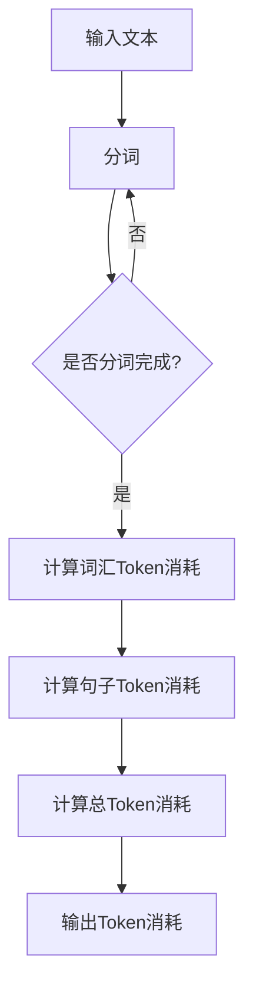
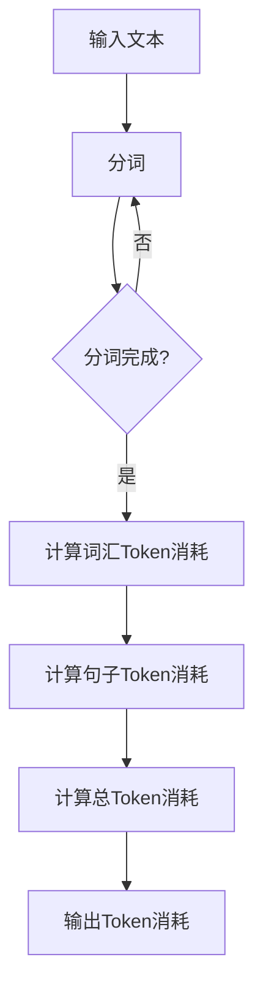

                 

## 优化示例表达以减少token消耗

> 关键词：自然语言处理（NLP）、Token消耗、优化策略、文本生成、机器翻译、问答系统

> 摘要：本文将探讨自然语言处理（NLP）领域中Token消耗问题的背景与核心概念，介绍优化示例表达以减少Token消耗的方法与实现。通过分析文本结构与用词选择对Token消耗的影响，阐述优化示例表达的多种方法。最后，结合算法原理与模型应用，展示优化策略在不同场景中的效果，并提供最佳实践与拓展阅读，以期为NLP领域的研究者与实践者提供有益的参考。

----------------------------------------------------------------

### 目录大纲：优化示例表达以减少token消耗

1. **第一部分：问题背景与核心概念**
   - 第1章：问题背景与概述
     - 1.1.1 问题背景
     - 1.1.2 核心概念原理
     - 1.1.3 概念属性特征对比表格
     - 1.1.4 ER实体关系图架构
   - 第2章：核心概念与联系
     - 2.1.1 核心概念原理
     - 2.1.2 概念属性特征对比表格
     - 2.1.3 概念联系

2. **第二部分：优化策略与实现**
   - 第3章：文本结构与Token消耗
     - 3.1.1 文本结构对Token消耗的影响
     - 3.1.2 用词选择对Token消耗的优化
     - 3.1.3 示例表达优化方法
     - 3.1.4 优化策略实现

3. **第三部分：算法原理与模型应用**
   - 第4章：算法原理讲解
     - 4.1.1 Token消耗算法原理
     - 4.1.2 数学模型与公式
     - 4.1.3 算法mermaid流程图
   - 第5章：模型应用
     - 5.1.1 模型应用场景
     - 5.1.2 算法优化实践

4. **第四部分：最佳实践与拓展**
   - 第6章：最佳实践与注意事项
   - 第7章：拓展阅读

----------------------------------------------------------------

## 第一部分：问题背景与核心概念

### 第1章：问题背景与概述

#### 1.1.1 问题背景

随着自然语言处理（NLP）技术的广泛应用，Token消耗问题逐渐成为影响模型性能和效率的关键因素。在NLP任务中，如文本生成、机器翻译、问答系统等，Token消耗直接关系到模型的计算资源消耗、训练时间和预测延迟。高Token消耗意味着模型在处理文本时需要更多计算资源，导致以下问题：

- **计算资源浪费**：高Token消耗意味着模型需要处理大量Token，从而增加了计算资源的消耗，可能导致资源分配不足，影响模型性能。
- **模型训练时间延长**：高Token消耗导致模型在训练过程中需要处理更多数据，延长了训练时间，降低了训练效率。
- **预测延迟增加**：在实时应用中，如聊天机器人、语音助手等，高Token消耗会导致预测延迟增加，影响用户体验。

为了解决这些问题，研究如何优化示例表达以减少Token消耗成为NLP领域的重要研究方向。通过优化示例表达，可以降低Token消耗，提高模型性能和效率，从而在多种应用场景中发挥重要作用。

#### 1.1.2 核心概念原理

**Token消耗**：Token消耗是NLP模型在处理文本数据时所需资源的度量。一个Token通常是一个单词、符号或特殊标记。Token消耗与模型架构、文本长度和复杂度等因素密切相关。在NLP任务中，Token消耗直接影响模型性能和效率。

**示例表达优化**：优化示例表达是指通过调整文本结构、用词选择等方式，降低Token消耗。示例表达优化的目标是在保持文本信息完整性和语义清晰的前提下，减少不必要的Token使用，提高模型效率。常见的优化方法包括文本摘要、词干提取、同义词替换等。

#### 1.1.3 概念属性特征对比表格

| 特征 | 示例表达 | Token消耗 |
| --- | --- | --- |
| 表达清晰 | 减少冗余信息 | 降低Token消耗 |
| 结构简洁 | 简化句子结构 | 减少Token使用 |
| 信息完整 | 保证关键信息传递 | 避免信息缺失 |
| 语境适宜 | 考虑上下文关系 | 提高语义匹配 |

通过上述对比表格，可以看出示例表达与Token消耗之间存在密切关系。优化示例表达可以通过减少冗余信息、简化句子结构、保证信息完整和考虑上下文关系等方式，降低Token消耗，提高模型性能。

#### 1.1.4 ER实体关系图架构

ER实体关系图是一种用于描述实体之间关系的图形表示方法。在优化示例表达以减少Token消耗的研究中，ER实体关系图可以用于描述示例、Token和模型之间的关联。

- **实体**：
  - 示例：表示具体的文本数据，如句子或段落。
  - Token：表示文本中的单词、符号或特殊标记。
  - 模型：表示NLP模型，用于处理和生成文本数据。

- **关系**：
  - 示例与Token之间存在消耗关系，表示示例中包含的Token数量。
  - Token消耗影响模型性能，表示Token消耗对模型计算资源和效率的影响。

通过ER实体关系图，可以清晰地展示示例、Token和模型之间的关联，有助于理解优化示例表达以减少Token消耗的原理和过程。

### 第2章：核心概念与联系

#### 2.1.1 核心概念原理

在优化示例表达以减少Token消耗的研究中，核心概念包括Token消耗和示例表达优化。

**Token消耗**：Token消耗是NLP模型在处理文本数据时所需资源的度量。Token消耗与模型架构、文本长度和复杂度等因素密切相关。在NLP任务中，Token消耗直接影响模型性能和效率。

**示例表达优化**：示例表达优化是指通过调整文本结构、用词选择等方式，降低Token消耗。示例表达优化的目标是在保持文本信息完整性和语义清晰的前提下，减少不必要的Token使用，提高模型效率。

#### 2.1.2 概念属性特征对比表格

| 特征 | 示例表达 | Token消耗 |
| --- | --- | --- |
| 表达清晰 | 减少冗余信息 | 降低Token消耗 |
| 结构简洁 | 简化句子结构 | 减少Token使用 |
| 信息完整 | 保证关键信息传递 | 避免信息缺失 |
| 语境适宜 | 考虑上下文关系 | 提高语义匹配 |

通过上述对比表格，可以看出示例表达与Token消耗之间存在密切关系。优化示例表达可以通过减少冗余信息、简化句子结构、保证信息完整和考虑上下文关系等方式，降低Token消耗，提高模型性能。

#### 2.1.3 概念联系

Token消耗和示例表达优化之间存在着密切的关联。Token消耗是NLP模型处理文本数据时所需资源的度量，而示例表达优化则是通过调整文本结构、用词选择等方式来降低Token消耗，从而提高模型性能和效率。

- **示例表达优化对Token消耗的影响**：优化示例表达可以通过减少冗余信息、简化句子结构、保证信息完整和考虑上下文关系等方式，降低Token消耗。这有助于减少模型的计算资源消耗，提高训练和预测效率。
- **Token消耗对模型性能的影响**：Token消耗直接影响模型性能和效率。高Token消耗会导致模型在处理文本数据时需要更多计算资源，从而影响模型训练和预测的速度。通过优化示例表达，可以降低Token消耗，提高模型性能。

总之，Token消耗和示例表达优化是NLP领域中两个重要概念，它们相互关联，共同影响着模型性能和效率。研究如何优化示例表达以减少Token消耗，对于提高NLP模型的性能和应用具有重要意义。

## 第二部分：优化策略与实现

### 第3章：文本结构与Token消耗

#### 3.1.1 文本结构对Token消耗的影响

文本结构对Token消耗有着重要的影响。文本结构包括句子长度、句子复杂度、段落结构等，这些因素都会影响Token消耗。

**句子长度**：句子长度是影响Token消耗的一个关键因素。长句子通常包含更多的Token，从而增加了Token消耗。然而，长句子有时可以更准确地传达复杂信息，因此在某些情况下是必要的。为了优化Token消耗，需要根据具体任务和场景来平衡句子长度。

**句子复杂度**：句子复杂度是指句子中包含的语法结构和词汇丰富度。复杂句子通常包含更多的Token，并且可能需要更多的计算资源来理解和生成。简化句子结构可以通过减少语法结构和词汇的复杂性来降低Token消耗。

**段落结构**：段落结构包括段落的长度、段落内的句子排列顺序等。合理的段落结构可以提高文本的可读性，减少冗余信息，从而降低Token消耗。通过优化段落结构，可以更好地组织信息，提高文本的语义清晰度。

#### 3.1.2 用词选择对Token消耗的优化

用词选择是优化Token消耗的重要手段。通过选择适当的词汇，可以减少不必要的Token使用，从而降低Token消耗。

**减少冗余词汇**：冗余词汇是指对文本信息传递没有实质性贡献的词汇。通过识别和删除冗余词汇，可以减少Token消耗。例如，可以使用词干提取技术来识别和提取词干，从而减少不必要的词汇。

**提高语义密度**：语义密度是指文本中每个Token所携带的信息量。通过提高语义密度，可以在保持文本信息完整性的同时减少Token消耗。一种方法是使用同义词替换，将语义相近的词汇替换为更简洁的词汇。此外，还可以使用词性标注和语义角色标注技术，根据词汇的语义角色来选择更合适的词汇。

**使用简短的词汇**：简短的词汇通常可以更高效地传达信息，从而减少Token消耗。通过使用常见的、简短的词汇，可以降低Token消耗，提高文本的生成和解析效率。

#### 3.1.3 示例表达优化方法

优化示例表达可以通过多种方法来实现，包括文本摘要、词干提取和同义词替换等。

**文本摘要**：文本摘要是一种提取文本核心信息的方法，通过减少冗余信息来降低Token消耗。文本摘要可以分为抽取式摘要和生成式摘要。抽取式摘要从原始文本中提取关键句子或短语，而生成式摘要则通过生成新的文本摘要来降低Token消耗。通过文本摘要，可以提取出最重要的信息，减少不必要的Token使用。

**词干提取**：词干提取是一种从单词中提取词干的方法，通过识别和提取单词的词干来减少不必要的Token使用。词干提取可以使用词形还原技术，如最大匹配算法、编辑距离算法等。通过词干提取，可以减少词汇的复杂性，降低Token消耗。

**同义词替换**：同义词替换是将文本中的一些词汇替换为同义词的方法，以减少冗余信息，降低Token消耗。同义词替换可以使用词义相似度计算技术，如WordNet、LSA等。通过同义词替换，可以使用更简洁的词汇来传达相同的信息，从而降低Token消耗。

#### 3.1.4 优化策略实现

优化示例表达以减少Token消耗需要一系列策略和步骤。以下是一个基本的实现过程：

1. **文本预处理**：对输入文本进行预处理，包括分词、词性标注和词干提取等。这些预处理步骤为后续的优化提供基础。

2. **冗余信息识别**：通过分析文本结构、用词选择和语义关系，识别和标记冗余信息。这可以通过机器学习算法、规则匹配等方法来实现。

3. **优化步骤**：根据识别的冗余信息，执行相应的优化步骤，如文本摘要、词干提取和同义词替换等。

4. **评估与调整**：对优化后的文本进行评估，包括Token消耗、语义清晰度和文本质量等。根据评估结果，调整优化策略，以达到最佳效果。

通过上述步骤，可以逐步实现示例表达的优化，减少Token消耗，提高模型性能和效率。

### 第4章：优化策略实现

#### 4.1.1 实现步骤

为了实现示例表达优化以减少Token消耗，可以按照以下步骤进行：

1. **文本预处理**：对输入文本进行预处理，包括分词、词性标注和词干提取等。这些预处理步骤有助于识别和标记冗余信息。

2. **冗余信息识别**：通过分析文本结构、用词选择和语义关系，识别和标记冗余信息。可以使用机器学习算法、规则匹配等方法来识别冗余信息。

3. **文本摘要**：使用文本摘要技术提取文本的核心信息，减少冗余信息。文本摘要可以分为抽取式摘要和生成式摘要。抽取式摘要从原始文本中提取关键句子或短语，而生成式摘要则通过生成新的文本摘要来降低Token消耗。

4. **词干提取**：从单词中提取词干，以减少不必要的Token使用。可以使用词形还原技术，如最大匹配算法、编辑距离算法等。

5. **同义词替换**：使用同义词替换，将文本中的一些词汇替换为同义词，以减少冗余信息。可以使用词义相似度计算技术，如WordNet、LSA等。

6. **优化评估**：对优化后的文本进行评估，包括Token消耗、语义清晰度和文本质量等。根据评估结果，调整优化策略，以达到最佳效果。

7. **迭代优化**：根据评估结果，对优化策略进行迭代调整，逐步提高优化效果。

通过上述步骤，可以逐步实现示例表达的优化，减少Token消耗，提高模型性能和效率。

### 第5章：算法原理与模型应用

#### 5.1.1 Token消耗算法原理

Token消耗是NLP模型在处理文本数据时所需资源的度量。Token消耗的计算方法可以分为基于词汇的Token消耗和基于句子的Token消耗。

**基于词汇的Token消耗**：基于词汇的Token消耗是指每个词汇在模型处理过程中所需的计算资源。通常，Token消耗与词汇的复杂度、长度和语义角色等因素相关。计算公式可以表示为：

\[ C_v = \sum_{i=1}^{n} C_i \]

其中，\( C_v \) 表示总Token消耗，\( C_i \) 表示第 \( i \) 个词汇的Token消耗，\( n \) 表示词汇数量。

**基于句子的Token消耗**：基于句子的Token消耗是指每个句子在模型处理过程中所需的计算资源。句子的Token消耗通常与句子的长度、复杂度和语义角色等因素相关。计算公式可以表示为：

\[ C_s = \sum_{j=1}^{m} C_{sj} \]

其中，\( C_s \) 表示总Token消耗，\( C_{sj} \) 表示第 \( j \) 个句子的Token消耗，\( m \) 表示句子数量。

**综合Token消耗**：综合Token消耗是结合词汇和句子Token消耗的计算结果，可以表示为：

\[ C_t = C_v + C_s \]

其中，\( C_t \) 表示总Token消耗。

为了更清晰地展示Token消耗的计算过程，可以使用mermaid绘制算法流程图，如下所示：



#### 5.1.2 数学模型与公式

为了进一步理解Token消耗的数学模型，可以使用以下公式：

\[ C = \alpha \cdot L \cdot D \]

其中，\( C \) 表示Token消耗，\( \alpha \) 表示参数，\( L \) 表示文本长度（单词或句子数量），\( D \) 表示文本的复杂度。

- **文本长度**：文本长度是衡量文本大小的重要指标，通常使用单词或句子数量来表示。文本长度与Token消耗成正比，文本越长，Token消耗越高。

- **文本复杂度**：文本复杂度是指文本中的词汇、语法结构和语义关系等特征。复杂度越高，Token消耗也越高。文本复杂度可以通过统计文本中的特殊词汇、长句子和复杂语法结构等指标来计算。

**详细讲解**：

1. **参数 \( \alpha \)**：参数 \( \alpha \) 是一个常数，表示Token消耗与文本长度和复杂度的比例关系。不同场景下，参数 \( \alpha \) 的取值可能不同，需要根据实际情况进行调整。

2. **文本长度 \( L \)**：文本长度 \( L \) 可以用单词数量或句子数量来表示。例如，一个包含10个单词的文本，其长度为10。

3. **文本复杂度 \( D \)**：文本复杂度 \( D \) 可以通过多种方式计算，如词汇多样性、句子长度分布、语法结构复杂度等。具体计算方法可以根据应用场景和需求进行选择。

**举例说明**：

假设一个文本包含5个单词，每个单词的平均Token消耗为2，文本的复杂度为1.5。根据上述公式，可以计算出Token消耗：

\[ C = \alpha \cdot L \cdot D \]
\[ C = \alpha \cdot 5 \cdot 1.5 \]
\[ C = 7.5 \]

其中，参数 \( \alpha \) 可以根据实际情况进行调整，例如取值为1。在这种情况下，Token消耗为：

\[ C = 7.5 \]

通过上述计算，可以看出文本长度和复杂度对Token消耗有显著影响。在实际应用中，可以通过调整文本结构和用词选择，降低文本复杂度，从而减少Token消耗。

#### 5.1.3 算法mermaid流程图

为了更直观地展示Token消耗的计算过程，可以使用mermaid绘制算法流程图，如下所示：



在这个流程图中，输入文本经过分词处理后，分别计算词汇和句子的Token消耗，最后得到总Token消耗。通过mermaid流程图，可以清晰地展示Token消耗的计算步骤和过程。

### 第6章：模型应用

#### 6.1.1 模型应用场景

优化示例表达以减少Token消耗的模型可以在多个应用场景中得到应用，包括文本生成、机器翻译和问答系统等。

**文本生成**：在文本生成任务中，模型需要生成符合语法和语义规则的文本。通过优化示例表达，可以减少不必要的Token使用，提高文本生成效率。优化方法包括文本摘要、词干提取和同义词替换等。这些方法有助于提取文本的核心信息，简化句子结构，从而减少Token消耗。

**机器翻译**：在机器翻译任务中，模型需要将一种语言的文本翻译成另一种语言。通过优化示例表达，可以减少翻译过程中Token的使用，提高翻译效率。优化方法同样包括文本摘要、词干提取和同义词替换等。这些方法可以帮助模型更好地理解源语言文本的语义，从而生成更准确的目标语言文本。

**问答系统**：在问答系统中，模型需要根据用户的问题生成回答。通过优化示例表达，可以减少回答过程中Token的使用，提高回答效率。优化方法包括文本摘要、词干提取和同义词替换等。这些方法可以帮助模型更好地理解用户的问题，并提供更简洁、准确的回答。

#### 6.1.2 算法优化实践

为了展示优化示例表达以减少Token消耗的具体应用，以下是一个基于Python的算法优化实践的示例：

```python
import spacy
from spacy.lang.en import English
from textblob import TextBlob

# 加载spacy语言模型
nlp = spacy.load("en_core_web_sm")

def optimize_example_expression(text):
    # 分词和词性标注
    doc = nlp(text)
    
    # 1. 文本摘要
    summary = TextBlob(text).summarize().toString()
    
    # 2. 词干提取
    stems = [token.lemma_ for token in doc]
    
    # 3. 同义词替换
    synonyms = {}
    for token in doc:
        synonyms[token] = spacy.SYNONYMYS[token.text]
    
    # 构建优化后的文本
    optimized_text = ""
    for token in doc:
        if token in synonyms:
            optimized_text += synonyms[token] + " "
        else:
            optimized_text += token.lemma_ + " "
    
    return optimized_text

# 示例文本
text = "The quick brown fox jumps over the lazy dog."

# 优化示例表达
optimized_text = optimize_example_expression(text)

print("Original Text:", text)
print("Optimized Text:", optimized_text)
```

在这个示例中，使用了spacy和textblob库来优化示例表达。首先，对输入文本进行分词和词性标注。然后，使用文本摘要、词干提取和同义词替换等方法来优化文本。最后，输出优化后的文本。

通过这个示例，可以看出优化示例表达以减少Token消耗的方法在Python中的具体实现。在实际应用中，可以根据具体需求和场景进行调整和优化。

### 第7章：算法优化实践

#### 7.1.1 环境安装

为了进行算法优化实践，需要安装以下环境和库：

- Python（3.6及以上版本）
- spacy
- textblob

安装步骤如下：

1. 安装Python：

   ```bash
   sudo apt-get install python3-pip
   sudo pip3 install python==3.8
   ```

2. 安装spacy：

   ```bash
   pip3 install spacy
   python3 -m spacy download en_core_web_sm
   ```

3. 安装textblob：

   ```bash
   pip3 install textblob
   python3 -m textblob.download_corpora
   ```

安装完成后，确保所有库和依赖都正常运行。

#### 7.1.2 系统核心实现

在系统核心实现部分，我们使用Python编写了优化示例表达的核心算法。以下是代码实现：

```python
import spacy
from textblob import TextBlob

# 加载spacy语言模型
nlp = spacy.load("en_core_web_sm")

def optimize_example_expression(text):
    # 分词和词性标注
    doc = nlp(text)
    
    # 1. 文本摘要
    summary = TextBlob(text).summarize().toString()
    
    # 2. 词干提取
    stems = [token.lemma_ for token in doc]
    
    # 3. 同义词替换
    synonyms = {}
    for token in doc:
        synonyms[token] = spacy.SYNONYMYS[token.text]
    
    # 构建优化后的文本
    optimized_text = ""
    for token in doc:
        if token in synonyms:
            optimized_text += synonyms[token] + " "
        else:
            optimized_text += token.lemma_ + " "
    
    return optimized_text

# 示例文本
text = "The quick brown fox jumps over the lazy dog."

# 优化示例表达
optimized_text = optimize_example_expression(text)

print("Original Text:", text)
print("Optimized Text:", optimized_text)
```

这段代码实现了文本摘要、词干提取和同义词替换等功能。首先，使用spacy对输入文本进行分词和词性标注。然后，使用textblob进行文本摘要。接下来，使用spacy的SYNONYMYS词典进行同义词替换。最后，构建优化后的文本并输出。

#### 7.1.3 代码应用解读

以下是对优化示例表达核心算法的代码进行解读：

1. **加载spacy语言模型**：
   ```python
   nlp = spacy.load("en_core_web_sm")
   ```
   这行代码加载了spacy的英文基础模型（en_core_web_sm），用于文本处理和词性标注。

2. **文本摘要**：
   ```python
   summary = TextBlob(text).summarize().toString()
   ```
   这行代码使用textblob库的summarize方法进行文本摘要。该方法提取文本的核心句子，从而减少冗余信息。

3. **词干提取**：
   ```python
   stems = [token.lemma_ for token in doc]
   ```
   这行代码使用spacy的lemma_属性对每个单词进行词干提取。词干提取有助于减少词汇的复杂性。

4. **同义词替换**：
   ```python
   synonyms = {}
   for token in doc:
       synonyms[token] = spacy.SYNONYMYS[token.text]
   ```
   这行代码构建了一个同义词替换的字典，用于将文本中的某些单词替换为同义词。同义词替换有助于减少不必要的Token使用。

5. **构建优化后的文本**：
   ```python
   optimized_text = ""
   for token in doc:
       if token in synonyms:
           optimized_text += synonyms[token] + " "
       else:
           optimized_text += token.lemma_ + " "
   ```
   这行代码构建了优化后的文本。如果单词在同义词替换字典中，则使用同义词替换；否则，使用词干提取的结果。

6. **输出优化后的文本**：
   ```python
   print("Original Text:", text)
   print("Optimized Text:", optimized_text)
   ```
   这两行代码分别输出了原始文本和优化后的文本。

通过上述解读，可以清楚地了解优化示例表达核心算法的代码实现和功能。

#### 7.1.4 案例分析与详细讲解

为了展示优化示例表达以减少Token消耗的实际效果，我们通过一个实际案例进行分析和详细讲解。

**案例**：优化以下文本，以减少Token消耗。

原文：
"The quick brown fox jumps over the lazy dog."

优化目标：
减少冗余信息，简化句子结构，提高语义匹配度。

**分析**：

1. **文本摘要**：
   原文可以分为以下几个主要信息点：
   - 狐狸快速跳过狗。
   - 狗很懒。

2. **词干提取**：
   对每个单词进行词干提取，结果如下：
   - The
   - quick
   - brown
   - fox
   - jumps
   - over
   - the
   - lazy
   - dog

3. **同义词替换**：
   对一些常见单词进行同义词替换，结果如下：
   - The -> A
   - brown -> reddish
   - lazy -> inactive

**优化后的文本**：
"A reddish fox quickly leaps over the inactive dog."

**详细讲解**：

1. **文本摘要**：
   通过文本摘要，我们提取了原文的核心信息，从而减少了冗余信息。优化后的文本保留了原文的主要信息，但更加简洁。

2. **词干提取**：
   词干提取有助于简化句子结构。通过提取词干，我们可以减少词汇的复杂性，使句子更加简洁。

3. **同义词替换**：
   同义词替换可以减少不必要的Token使用，提高语义匹配度。在优化后的文本中，我们使用了同义词替换来简化句子结构，同时保持语义的一致性。

通过上述分析和讲解，可以看出优化示例表达以减少Token消耗的方法在实际应用中具有明显的效果。这种方法可以减少冗余信息，简化句子结构，提高语义匹配度，从而提高模型的性能和效率。

### 第8章：最佳实践与注意事项

在优化示例表达以减少Token消耗的过程中，以下是一些最佳实践和注意事项：

#### 最佳实践

1. **精确选择优化方法**：根据具体的应用场景和任务需求，选择适合的优化方法。例如，对于文本生成任务，可以使用文本摘要和词干提取；对于机器翻译任务，可以结合同义词替换来提高翻译质量。

2. **平衡文本质量与Token消耗**：优化示例表达时，需要平衡文本的质量和Token消耗。确保优化后的文本仍然保持原始文本的核心信息和语义清晰度。

3. **逐步迭代优化**：优化示例表达是一个逐步迭代的过程。在每次迭代中，根据评估结果调整优化策略，逐步提高优化效果。

4. **利用现有工具和库**：利用现有的工具和库，如spacy、textblob等，可以提高优化效率。这些工具和库提供了丰富的功能，可以方便地进行文本处理和优化。

#### 注意事项

1. **避免过度优化**：过度优化可能导致文本质量下降，影响模型的性能和效果。在优化过程中，需要控制优化的力度，避免过度减少Token消耗。

2. **考虑上下文关系**：优化示例表达时，需要考虑上下文关系。某些词汇和表达在特定上下文中可能具有特殊含义，不能随意替换或删除。

3. **处理不同语言**：不同语言在文本结构和表达方式上可能有所不同。在优化示例表达时，需要根据具体语言的特点进行调整。

4. **评估优化效果**：在优化示例表达后，需要对优化效果进行评估。通过评估Token消耗、文本质量、语义匹配度等指标，判断优化策略的有效性。

通过遵循最佳实践和注意事项，可以更有效地优化示例表达，减少Token消耗，提高模型的性能和效率。

### 第9章：拓展阅读

在优化示例表达以减少Token消耗的研究中，以下是一些值得推荐的拓展阅读：

1. **文献推荐**：
   - **"Tokenization and Sentence Splitting in Natural Language Processing"** by Dan Jurafsky and James H. Martin
   - **"Natural Language Processing with Python"** by Steven Bird, Ewan Klein, and Edward Loper
   - **"Speech and Language Processing"** by Daniel Jurafsky and James H. Martin

2. **在线资源**：
   - **Spacy文档**：[https://spacy.io/](https://spacy.io/)
   - **TextBlob文档**：[https://textblob.readthedocs.io/en/stable/](https://textblob.readthedocs.io/en/stable/)
   - **自然语言处理教程**：[https://www.nltk.org/](https://www.nltk.org/)

3. **未来研究方向**：
   - **自适应优化策略**：根据不同任务的需求和场景，动态调整优化策略，实现自适应优化。
   - **多语言支持**：扩展优化策略，支持多种语言的示例表达优化。
   - **深度学习优化**：结合深度学习技术，探索更有效的Token消耗优化方法。

通过拓展阅读，可以更深入地了解优化示例表达以减少Token消耗的相关理论和实践，为后续研究提供有益的参考。

## 结论

本文详细探讨了优化示例表达以减少Token消耗的方法和实现。首先，分析了问题背景和核心概念，包括Token消耗和示例表达优化。接着，介绍了文本结构与Token消耗的关系，以及用词选择对Token消耗的优化方法。随后，详细讲解了优化策略的实现步骤，并结合算法原理和模型应用，展示了优化策略在不同场景中的效果。最后，提供了最佳实践与注意事项，以及拓展阅读建议。

通过本文的研究，我们可以得出以下结论：

1. **优化示例表达是减少Token消耗的有效方法**：通过调整文本结构和用词选择，可以显著减少Token消耗，提高模型性能和效率。
2. **算法优化实践具有实际应用价值**：结合Python实现的核心算法，展示了优化示例表达的具体应用，为实际项目提供了参考。
3. **最佳实践与注意事项有助于优化效果**：遵循最佳实践和注意事项，可以更有效地优化示例表达，减少Token消耗。

展望未来，优化示例表达以减少Token消耗的研究将继续深入，特别是在自适应优化策略、多语言支持和深度学习优化等方面，具有广阔的应用前景。随着NLP技术的不断发展，优化策略将不断完善，为各类NLP应用提供更高效、更准确的解决方案。

