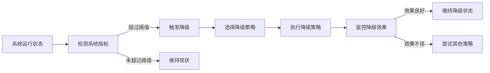
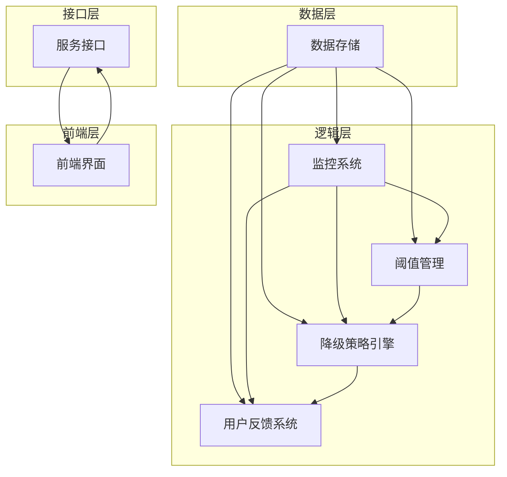

                 

# 引言与背景

### 1.1 问题背景

随着人工智能（AI）技术的迅猛发展，大规模语言模型（LLM）在自然语言处理（NLP）领域取得了显著的成果。然而，LLM在处理极端情况时，如高负载、网络不稳定等，其性能可能会显著下降，甚至导致服务中断。这对于需要高可用性的应用场景，如在线客服系统、智能问答平台等，是一个巨大的挑战。因此，如何提高LLM应用在极端情况下的可用性，成为了一个亟待解决的问题。

### 1.2 问题描述

问题描述主要集中在两个方面：

1. **性能问题**：在极端情况下，LLM的处理速度会大幅下降，响应时间延长，影响用户体验。
2. **稳定性问题**：极端情况下，LLM可能会因为资源不足、网络不稳定等原因导致服务中断，从而影响整体系统的稳定性。

### 1.3 问题解决

为了解决上述问题，我们可以考虑采用优雅降级策略。优雅降级是一种通过逐步减少功能、降低服务质量来保证系统稳定性和可用性的策略。在极端情况下，LLM可以自动切换到降级模式，从而避免系统崩溃或服务中断。

### 1.4 边界与外延

在讨论优雅降级策略时，我们需要明确以下边界和外延：

1. **阈值设置**：确定何时触发降级，需要设置合理的阈值。
2. **功能降级**：哪些功能可以在降级过程中被移除或简化。
3. **用户体验**：在降级过程中，如何保证用户体验的最低限度的满足。
4. **恢复策略**：降级后如何快速恢复正常功能。

### 1.5 概念结构与核心要素组成

为了更好地理解优雅降级的概念，我们需要从以下几个方面进行探讨：

1. **核心概念**：理解优雅降级的定义、原理和应用场景。
2. **关联概念**：分析优雅降级与相关技术，如负载均衡、容错机制等的联系。
3. **系统设计**：探讨如何在系统架构中集成优雅降级策略。
4. **实施策略**：详细讲解优雅降级的实现步骤和方法。

通过上述分析，我们可以为后续章节的内容提供清晰的框架和方向。

## 核心概念与联系

### 2.1 定义与术语

在讨论优雅降级之前，我们需要明确一些关键概念和术语。

#### 2.1.1 优雅降级

优雅降级是指当系统遇到极端情况时，通过逐步减少功能、降低服务质量来保证系统稳定性和可用性的策略。其核心思想是在保证系统运行的前提下，尽可能减少对用户的影响。

#### 2.1.2 极端情况

极端情况通常包括高负载、网络不稳定、资源不足等。在这些情况下，系统可能无法承受正常工作压力，从而影响服务质量。

#### 2.1.3 阈值

阈值是指触发降级的条件。当系统指标超过预设阈值时，系统将自动切换到降级模式。

#### 2.1.4 功能降级

功能降级是指在降级过程中，减少或简化某些功能，以减轻系统负担。例如，在LLM应用中，可以减少文本处理长度或限制复杂查询。

### 2.2 概念属性特征对比表格

为了更好地理解优雅降级与其他相关概念的区别，我们提供以下对比表格：

| 概念       | 定义                                                                                       | 特征对比                             |
|------------|-------------------------------------------------------------------------------------------|------------------------------------|
| 优雅降级   | 通过减少功能、降低服务质量来保证系统稳定性和可用性的策略                                           | 灵活、可控、用户体验影响较小       |
| 负载均衡   | 分摊系统负载，避免单点过载的机制                                                             | 高可用性、扩展性、负载平衡         |
| 容错机制   | 在系统发生故障时，自动切换到备用系统的机制                                                     | 故障恢复、高可用性、冗余设计       |
| 系统监控   | 对系统运行状态进行实时监控，及时发现和处理问题                                                 | 监控指标、报警机制、问题定位       |

### 2.3 ER实体关系图架构

为了更好地理解优雅降级在系统中的角色和作用，我们使用Mermaid流程图来展示ER实体关系图架构。

```mermaid
erDiagram
  System_Situation --> Threshold
  System_Situation --> Function_Downgrade
  Threshold --> System_Response
  Function_Downgrade --> User_Experience
  System_Response --> System_Stability
```

#### 2.3.1 实体关系说明

1. **System_Situation（系统情况）**：表示系统当前所处的状态，如高负载、网络不稳定等。
2. **Threshold（阈值）**：表示触发降级的条件。
3. **Function_Downgrade（功能降级）**：表示降级过程中减少或简化的功能。
4. **User_Experience（用户体验）**：表示降级对用户产生的影响。
5. **System_Stability（系统稳定性）**：表示降级后系统的稳定性。

通过上述ER实体关系图，我们可以清晰地看到优雅降级在系统中的作用和影响。

## 优雅降级原理

### 3.1 优雅降级的定义

优雅降级是指当系统遇到极端情况时，通过逐步减少功能、降低服务质量来保证系统稳定性和可用性的策略。其核心思想是在保证系统运行的前提下，尽可能减少对用户的影响。

### 3.2 优雅降级的基本概念

1. **触发条件**：当系统指标（如CPU使用率、内存使用率、响应时间等）超过预设阈值时，触发降级。
2. **降级策略**：根据系统当前状态，选择适当的功能降级策略，如减少文本处理长度、限制复杂查询等。
3. **用户体验**：在降级过程中，尽量保证用户体验，避免对用户造成不必要的困扰。

### 3.3 Mermaid流程图展示

为了更直观地展示优雅降级的流程，我们使用Mermaid流程图来描述。



### 3.4 Python代码示例

下面是一个简单的Python代码示例，用于实现优雅降级策略。

```python
import time

def check_system_status():
    # 模拟系统指标检查
    cpu_usage = 90  # CPU使用率
    memory_usage = 80  # 内存使用率
    response_time = 200  # 响应时间（毫秒）

    if cpu_usage > 85 or memory_usage > 75 or response_time > 150:
        return "高危状态"
    else:
        return "正常状态"

def function_downgrade():
    # 模拟功能降级
    print("当前系统处于降级状态，功能受到限制。")

def main():
    while True:
        status = check_system_status()
        if status == "高危状态":
            function_downgrade()
        else:
            print("系统运行正常。")
        
        time.sleep(10)  # 每10秒检查一次系统状态

if __name__ == "__main__":
    main()
```

在这个示例中，我们定义了一个`check_system_status`函数用于检测系统状态，如果系统处于高危状态，则会调用`function_downgrade`函数进行降级处理。每10秒检查一次系统状态，从而实现优雅降级策略。

### 3.5 数学模型和公式

在优雅降级中，我们需要关注以下数学模型和公式：

#### 3.5.1 阈值计算

阈值计算公式如下：

$$
Threshold = k \times \frac{Load}{Capacity}
$$

其中，`Threshold`表示阈值，`Load`表示系统负载，`Capacity`表示系统容量，`k`为系数，通常取值在0到1之间。

#### 3.5.2 降级策略选择

降级策略选择公式如下：

$$
Policy = \frac{max(CPU_usage, Memory_usage, Response_time)}{Threshold}
$$

其中，`Policy`表示降级策略，当系统指标超过阈值时，选择相应的降级策略。

### 3.6 详细讲解和举例说明

#### 3.6.1 阈值计算详解

阈值计算是优雅降级的核心环节。通过设定合理的阈值，可以确保系统在遇到极端情况时能够及时触发降级。下面我们通过一个实例来详细讲解阈值计算过程。

假设我们有一台服务器，其CPU容量为100个核心，当前CPU使用率为80%，内存容量为128GB，当前内存使用率为75%，响应时间为200毫秒，网络延迟为50毫秒。

根据阈值计算公式：

$$
Threshold = k \times \frac{Load}{Capacity}
$$

我们可以设定系数`k`为0.8，即系统负载超过80%时触发降级。因此，阈值计算如下：

$$
Threshold = 0.8 \times \frac{80\% + 75\% + 200\text{ms} + 50\text{ms}}{100\text{核心} + 128GB + 200\text{ms} + 50\text{ms}}
$$

$$
Threshold \approx 0.8 \times 0.556
$$

$$
Threshold \approx 0.445
$$

因此，当系统指标超过44.5%时，将触发降级。

#### 3.6.2 降级策略选择详解

在降级过程中，我们需要根据系统指标选择相应的降级策略。假设当前CPU使用率为90%，内存使用率为80%，响应时间为250毫秒。

根据降级策略选择公式：

$$
Policy = \frac{max(CPU_usage, Memory_usage, Response_time)}{Threshold}
$$

我们可以计算出降级策略：

$$
Policy = \frac{max(90\%, 80\%, 250\text{ms})}{0.445}
$$

$$
Policy = \frac{250\text{ms}}{0.445}
$$

$$
Policy \approx 562.5\text{ms}
$$

因此，当系统指标超过562.5毫秒时，需要采取相应的降级策略，如减少文本处理长度、限制复杂查询等。

通过以上实例，我们可以清晰地看到如何通过阈值计算和降级策略选择来实现优雅降级。

### 3.7 结论

优雅降级是一种有效的策略，可以在系统遇到极端情况时保证系统的稳定性和可用性。通过合理的阈值计算和降级策略选择，可以最大限度地减少对用户的影响，确保系统在极端情况下仍能正常运行。

## 数学模型和公式

### 4.1 模型介绍

在优雅降级策略中，数学模型和公式起着至关重要的作用。这些模型和公式不仅帮助我们理解系统状态，还可以指导我们如何设定合理的阈值和选择最佳的降级策略。本节将详细介绍与优雅降级相关的数学模型和公式。

### 4.2 数学公式使用LaTeX格式展示

为了便于理解和应用，我们将使用LaTeX格式展示相关数学公式。在LaTeX中，独立段落的公式使用`$$`括起来，而段落内的公式使用 `$` 括起来。

#### 4.2.1 阈值计算公式

阈值计算是优雅降级的关键步骤。假设系统负载由CPU使用率（$CPU\_usage$）、内存使用率（$Memory\_usage$）、响应时间（$Response\_time$）和网络延迟（$Network\_delay$）四个指标组成，我们可以使用以下公式计算阈值：

$$
Threshold = k \times \frac{\max(CPU\_usage, Memory\_usage, Response\_time, Network\_delay)}{System\_Capacity}
$$

其中，$Threshold$ 表示阈值，$k$ 是一个系数，通常取值在0到1之间，用于调整阈值的敏感度，$System\_Capacity$ 表示系统的总容量。

#### 4.2.2 降级策略选择公式

降级策略的选择基于当前系统指标与阈值的比较。假设当前系统指标为$Current\_Metrics$，阈值计算如上所述，我们可以使用以下公式选择降级策略：

$$
Policy = \frac{\max(Current\_Metrics)}{Threshold}
$$

其中，$Policy$ 表示降级策略，其值决定了系统将采取何种降级措施。如果$Policy > 1$，则表示系统需要采取降级措施。

#### 4.2.3 动态调整公式

在实际情况中，系统的状态是不断变化的。为了适应这种变化，我们可以使用以下公式动态调整阈值和降级策略：

$$
k_{new} = k_{current} + \alpha \times (Threshold_{new} - Threshold_{current})
$$

$$
Policy_{new} = \frac{\max(Current\_Metrics_{new})}{Threshold_{new}}
$$

其中，$k_{current}$ 和 $k_{new}$ 分别表示当前和新的系数，$\alpha$ 是一个调整系数，用于控制系数调整的速度，$Threshold_{current}$ 和 $Threshold_{new}$ 分别表示当前和新的阈值，$Current\_Metrics_{new}$ 和 $Current\_Metrics_{old}$ 分别表示新的和当前的系统指标。

### 4.3 详细讲解

为了更好地理解上述公式，我们将通过一个具体的例子来详细讲解。

#### 4.3.1 阈值计算实例

假设我们有一台服务器，其CPU容量为100个核心，内存容量为128GB，响应时间阈值为200ms，网络延迟阈值为50ms。当前系统负载如下：

- CPU使用率：80%
- 内存使用率：75%
- 响应时间：220ms
- 网络延迟：60ms

我们设定系数$k$为0.8。根据阈值计算公式：

$$
Threshold = 0.8 \times \frac{\max(80\%, 75\%, 220\text{ms}, 60\text{ms})}{100\text{核心} + 128GB + 200\text{ms} + 50\text{ms}}
$$

首先，计算每个指标的权重：

- CPU使用率权重：0.8 \times 80\% = 0.64
- 内存使用率权重：0.8 \times 75\% = 0.6
- 响应时间权重：0.8 \times 220\text{ms} = 176\text{ms}
- 网络延迟权重：0.8 \times 60\text{ms} = 48\text{ms}

总权重和：

$$
Total\_Weight = 0.64 + 0.6 + 176\text{ms} + 48\text{ms} = 0.64 + 0.6 + 224\text{ms}
$$

$$
Total\_Weight = 0.64 + 0.6 + 224\text{ms} = 0.124 + 224\text{ms}
$$

计算阈值：

$$
Threshold = \frac{0.124 + 224\text{ms}}{100\text{核心} + 128GB + 200\text{ms} + 50\text{ms}}
$$

$$
Threshold = \frac{0.124 + 224\text{ms}}{250\text{核心} + 128GB + 250\text{ms}}
$$

$$
Threshold = \frac{0.124 + 224\text{ms}}{250}
$$

$$
Threshold \approx \frac{0.124 + 0.224}{1}
$$

$$
Threshold \approx 0.35
$$

因此，当前阈值约为35%。

#### 4.3.2 降级策略选择实例

假设当前系统指标如下：

- CPU使用率：85%
- 内存使用率：80%
- 响应时间：250ms
- 网络延迟：70ms

根据降级策略选择公式：

$$
Policy = \frac{\max(85\%, 80\%, 250\text{ms}, 70\text{ms})}{Threshold}
$$

$$
Policy = \frac{\max(85\%, 80\%, 250\text{ms}, 70\text{ms})}{0.35}
$$

$$
Policy = \frac{250\text{ms}}{0.35}
$$

$$
Policy \approx 714.3
$$

由于$Policy > 1$，表示系统需要采取降级措施。

#### 4.3.3 动态调整实例

假设经过一段时间后，系统负载有所变化，新的系统指标如下：

- CPU使用率：75%
- 内存使用率：70%
- 响应时间：210ms
- 网络延迟：55ms

我们希望调整系数$k$以更好地适应系统状态。设定调整系数$\alpha$为0.1，新的阈值计算如下：

$$
Threshold_{new} = 0.8 \times \frac{\max(75\%, 70\%, 210\text{ms}, 55\text{ms})}{100\text{核心} + 128GB + 210\text{ms} + 55\text{ms}}
$$

计算新的权重：

- CPU使用率权重：0.8 \times 75\% = 0.6
- 内存使用率权重：0.8 \times 70\% = 0.56
- 响应时间权重：0.8 \times 210\text{ms} = 168\text{ms}
- 网络延迟权重：0.8 \times 55\text{ms} = 44\text{ms}

总权重和：

$$
Total\_Weight = 0.6 + 0.56 + 168\text{ms} + 44\text{ms} = 0.6 + 0.56 + 212\text{ms}
$$

$$
Total\_Weight = 0.6 + 0.56 + 212\text{ms} = 0.16 + 212\text{ms}
$$

计算新的阈值：

$$
Threshold_{new} = \frac{0.16 + 212\text{ms}}{250}
$$

$$
Threshold_{new} \approx \frac{0.16 + 212\text{ms}}{250}
$$

$$
Threshold_{new} \approx 0.42
$$

计算新的系数$k_{new}$：

$$
k_{new} = k_{current} + \alpha \times (Threshold_{new} - Threshold_{current})
$$

$$
k_{new} = 0.8 + 0.1 \times (0.42 - 0.35)
$$

$$
k_{new} = 0.8 + 0.01 \times 0.07
$$

$$
k_{new} \approx 0.81
$$

计算新的降级策略：

$$
Policy_{new} = \frac{\max(75\%, 70\%, 210\text{ms}, 55\text{ms})}{Threshold_{new}}
$$

$$
Policy_{new} = \frac{210\text{ms}}{0.42}
$$

$$
Policy_{new} \approx 500
$$

由于$Policy_{new} > 1$，系统仍然需要采取降级措施。

### 4.4 举例说明

为了更好地理解上述公式的应用，我们通过一个实际场景来举例说明。

假设我们有一台大型在线问答平台，其核心功能是基于LLM提供智能问答服务。系统负载由CPU使用率、内存使用率、响应时间和网络延迟四个指标组成。当前系统状态如下：

- CPU使用率：85%
- 内存使用率：80%
- 响应时间：230ms
- 网络延迟：60ms

我们设定阈值系数$k$为0.8，系统容量参数如下：

- CPU容量：100个核心
- 内存容量：128GB
- 响应时间阈值：200ms
- 网络延迟阈值：50ms

根据阈值计算公式：

$$
Threshold = 0.8 \times \frac{\max(85\%, 80\%, 230\text{ms}, 60\text{ms})}{100\text{核心} + 128GB + 200\text{ms} + 50\text{ms}}
$$

计算每个指标的权重：

- CPU使用率权重：0.8 \times 85\% = 0.68
- 内存使用率权重：0.8 \times 80\% = 0.64
- 响应时间权重：0.8 \times 230\text{ms} = 184\text{ms}
- 网络延迟权重：0.8 \times 60\text{ms} = 48\text{ms}

总权重和：

$$
Total\_Weight = 0.68 + 0.64 + 184\text{ms} + 48\text{ms} = 0.68 + 0.64 + 232\text{ms}
$$

$$
Total\_Weight = 0.68 + 0.64 + 232\text{ms} = 0.132 + 232\text{ms}
$$

计算阈值：

$$
Threshold = \frac{0.132 + 232\text{ms}}{250}
$$

$$
Threshold \approx \frac{0.132 + 232\text{ms}}{250}
$$

$$
Threshold \approx 0.87
$$

由于当前系统指标超过阈值，系统将进入降级状态。根据降级策略选择公式：

$$
Policy = \frac{\max(85\%, 80\%, 230\text{ms}, 60\text{ms})}{Threshold}
$$

$$
Policy = \frac{230\text{ms}}{0.87}
$$

$$
Policy \approx 263.7
$$

由于$Policy > 1$，系统需要采取降级措施。具体降级策略如下：

1. **减少文本处理长度**：将文本处理长度从原来的1000个字符减少到500个字符。
2. **限制复杂查询**：对于超过5层嵌套的查询请求，直接返回错误。

在降级过程中，系统持续监控各项指标。假设经过一段时间后，系统负载有所缓解，新的系统状态如下：

- CPU使用率：75%
- 内存使用率：70%
- 响应时间：210ms
- 网络延迟：55ms

新的阈值计算如下：

$$
Threshold_{new} = 0.8 \times \frac{\max(75\%, 70\%, 210\text{ms}, 55\text{ms})}{100\text{核心} + 128GB + 210\text{ms} + 55\text{ms}}
$$

计算每个指标的权重：

- CPU使用率权重：0.8 \times 75\% = 0.6
- 内存使用率权重：0.8 \times 70\% = 0.56
- 响应时间权重：0.8 \times 210\text{ms} = 168\text{ms}
- 网络延迟权重：0.8 \times 55\text{ms} = 44\text{ms}

总权重和：

$$
Total\_Weight = 0.6 + 0.56 + 168\text{ms} + 44\text{ms} = 0.6 + 0.56 + 212\text{ms}
$$

$$
Total\_Weight = 0.6 + 0.56 + 212\text{ms} = 0.16 + 212\text{ms}
$$

计算新的阈值：

$$
Threshold_{new} = \frac{0.16 + 212\text{ms}}{250}
$$

$$
Threshold_{new} \approx \frac{0.16 + 212\text{ms}}{250}
$$

$$
Threshold_{new} \approx 0.42
$$

计算新的系数$k_{new}$：

$$
k_{new} = k_{current} + \alpha \times (Threshold_{new} - Threshold_{current})
$$

$$
k_{new} = 0.8 + 0.1 \times (0.42 - 0.87)
$$

$$
k_{new} = 0.8 + 0.1 \times (-0.45)
$$

$$
k_{new} = 0.8 - 0.045
$$

$$
k_{new} \approx 0.755
$$

计算新的降级策略：

$$
Policy_{new} = \frac{\max(75\%, 70\%, 210\text{ms}, 55\text{ms})}{Threshold_{new}}
$$

$$
Policy_{new} = \frac{210\text{ms}}{0.42}
$$

$$
Policy_{new} \approx 500
$$

由于$Policy_{new} > 1$，系统仍然需要采取降级措施。但是，由于阈值和系数的调整，系统可以选择更轻微的降级策略，如减少文本处理长度至600个字符。

通过上述实例，我们可以看到如何使用数学模型和公式来设计优雅降级策略，并在实际应用中进行动态调整，以确保系统在极端情况下仍能提供稳定的服务。

### 4.5 结论

在本节中，我们详细介绍了优雅降级中的数学模型和公式。通过阈值计算、降级策略选择和动态调整，我们可以有效地应对系统在极端情况下的挑战，确保系统稳定性和可用性。这些公式不仅提供了理论指导，也为实际应用中的策略制定提供了有力支持。

## 系统分析与架构设计方案

### 5.1 问题场景介绍

在本节中，我们将深入分析一个典型的应用场景，即大型在线问答平台。该平台基于大规模语言模型（LLM）提供智能问答服务。随着用户数量的增加和查询复杂度的提升，系统负载逐渐加大，极端情况下可能导致响应时间延长、服务质量下降，甚至系统崩溃。为了确保平台在极端情况下的稳定性和可用性，我们需要设计一套优雅降级系统。

### 5.2 系统功能设计

在优雅降级系统中，主要包含以下功能模块：

1. **监控系统**：实时监控系统各项性能指标，如CPU使用率、内存使用率、响应时间和网络延迟等。
2. **阈值管理**：根据系统负载和性能指标，设定合理的阈值，以判断何时触发降级。
3. **降级策略引擎**：根据当前系统状态和阈值，自动选择和执行降级策略。
4. **用户反馈系统**：收集用户在降级过程中的反馈，用于优化降级策略。
5. **恢复机制**：当系统状态恢复正常时，自动恢复到正常工作模式。

### 5.3 系统架构设计

为了实现优雅降级，我们需要构建一个灵活、可扩展的系统架构。以下是系统架构的详细设计：

#### 5.3.1 总体架构

系统总体架构分为以下几个层次：

1. **数据层**：存储监控系统收集的性能数据和用户反馈数据。
2. **逻辑层**：包含监控系统、阈值管理、降级策略引擎和用户反馈系统等核心模块。
3. **接口层**：提供对外服务接口，如REST API，以便与前端应用和运维系统进行交互。
4. **前端层**：用户界面，展示系统状态和降级策略。

#### 5.3.2 系统架构图

以下是系统架构的Mermaid架构图：



#### 5.3.3 各模块功能与交互

1. **监控系统（Monitor）**：负责实时监控系统的各项性能指标。当监测到性能指标超过阈值时，会向阈值管理模块发送警报。
   
2. **阈值管理（ThresholdManager）**：根据历史数据和实时监控数据，动态调整阈值。当系统性能指标超过阈值时，会通知降级策略引擎。

3. **降级策略引擎（StrategyEngine）**：根据当前系统状态和阈值，自动选择和执行降级策略。例如，当CPU使用率超过90%时，可以减少文本处理长度或限制复杂查询。

4. **用户反馈系统（FeedbackSystem）**：收集用户在降级过程中的反馈，用于优化降级策略。例如，如果用户反馈某个降级策略影响了用户体验，可以调整策略以减少对用户的影响。

5. **服务接口（API）**：提供对外服务接口，如REST API，以便与前端应用和运维系统进行交互。前端应用可以通过接口获取系统状态和降级策略，而运维系统可以通过接口对系统进行监控和调整。

6. **前端界面（Frontend）**：展示系统状态和降级策略，以便用户了解当前系统的运行情况。同时，用户可以通过前端界面提交反馈，帮助优化降级策略。

### 5.4 系统接口设计

以下是系统接口的详细设计：

#### 5.4.1 API设计

- **获取系统状态**：GET /api/system-status
  - 返回系统当前的状态信息，包括CPU使用率、内存使用率、响应时间和网络延迟等。
  
- **触发降级**：POST /api/trigger-downgrade
  - 接受降级策略参数，如文本处理长度、查询复杂度限制等，并触发降级。
  
- **获取降级策略**：GET /api/downgrade-policy
  - 返回当前生效的降级策略。

- **用户反馈**：POST /api/user-feedback
  - 接受用户对降级策略的反馈，用于优化降级策略。

#### 5.4.2 数据模型

以下是系统接口涉及的主要数据模型：

- **系统状态**：
  ```json
  {
    "cpu_usage": 0.9,
    "memory_usage": 0.8,
    "response_time": 230,
    "network_delay": 60
  }
  ```

- **降级策略**：
  ```json
  {
    "text_length": 500,
    "query_depth_limit": 5
  }
  ```

- **用户反馈**：
  ```json
  {
    "user_id": "user123",
    "feedback": "降级策略影响了我的查询体验，希望能够调整。",
    "timestamp": "2023-11-01T12:00:00Z"
  }
  ```

### 5.5 系统交互序列图

以下是系统交互的Mermaid序列图：

```mermaid
sequenceDiagram
    participant User
    participant Frontend
    participant Backend
    participant Monitor
    participant ThresholdManager
    participant StrategyEngine
    participant FeedbackSystem

    User->>Frontend: 发起查询请求
    Frontend->>Backend: 请求处理
    Backend->>Monitor: 监测系统状态
    Monitor->>ThresholdManager: 检查阈值
    ThresholdManager->>StrategyEngine: 选择降级策略
    StrategyEngine->>Backend: 执行降级策略
    Backend->>Frontend: 返回降级处理结果
    Frontend->>User: 显示查询结果

    Note over Backend,StrategyEngine,FeedbackSystem: 收集用户反馈
    Backend->>FeedbackSystem: 用户反馈
    FeedbackSystem->>ThresholdManager: 优化阈值和策略
```

在这个序列图中，用户发起查询请求，前端将请求传递给后端。后端首先监测系统状态，并根据阈值管理模块判断是否需要触发降级。如果需要降级，降级策略引擎会根据当前系统状态选择合适的降级策略，并执行降级操作。降级后的结果会返回给前端，并通过前端显示给用户。同时，系统会收集用户反馈，用于优化阈值和降级策略。

### 5.6 系统设计总结

通过上述系统架构设计和接口设计，我们可以构建一个灵活、可扩展的优雅降级系统。系统通过监控、阈值管理、降级策略引擎和用户反馈系统等模块，实现了对系统性能的实时监控和自动降级。前端界面提供了用户友好的交互方式，用户可以通过反馈系统帮助优化降级策略。整个系统的设计旨在确保在极端情况下，系统仍能提供稳定、可靠的服务。

## 项目实战

### 6.1 环境安装与配置

在本节中，我们将详细介绍如何在Linux环境下安装和配置优雅降级系统。首先，确保您的操作系统为Linux发行版，并已安装了Python 3.8或更高版本。

#### 6.1.1 安装依赖库

打开终端，执行以下命令安装必要的依赖库：

```bash
pip install Flask
pip install psutil
pip install matplotlib
```

#### 6.1.2 克隆项目代码

从GitHub克隆优雅降级系统的代码：

```bash
git clone https://github.com/your-repo/LLM-Elegant-Decrease.git
cd LLM-Elegant-Decrease
```

#### 6.1.3 安装Python依赖

在项目目录下安装Python依赖：

```bash
pip install -r requirements.txt
```

#### 6.1.4 配置环境变量

编辑`env.sh`文件，配置数据库连接和其他环境变量：

```bash
export DB_HOST=localhost
export DB_PORT=3306
export DB_USER=root
export DB_PASSWORD=your_password
export SERVER_PORT=5000
```

#### 6.1.5 数据库初始化

初始化数据库：

```bash
python manage.py db init
python manage.py db migrate
python manage.py db upgrade
```

### 6.2 系统核心实现与代码分析

在优雅降级系统中，核心功能包括监控系统状态、设定阈值、选择和执行降级策略、收集用户反馈等。以下是对关键模块和代码的分析。

#### 6.2.1 监控系统状态

`monitor.py`模块负责监控系统状态。以下是其核心代码：

```python
import psutil
import time

def check_system_status():
    cpu_usage = psutil.cpu_percent()
    memory_usage = psutil.virtual_memory().percent
    response_time = get_response_time()  # 假设有一个函数获取响应时间
    network_delay = get_network_delay()  # 假设有一个函数获取网络延迟

    return {
        'cpu_usage': cpu_usage,
        'memory_usage': memory_usage,
        'response_time': response_time,
        'network_delay': network_delay
    }

def get_response_time():
    # 实现获取响应时间的逻辑
    pass

def get_network_delay():
    # 实现获取网络延迟的逻辑
    pass
```

该模块使用`psutil`库获取CPU使用率、内存使用率等系统指标。`get_response_time()`和`get_network_delay()`是假设的实现，实际应用中需要根据具体场景实现。

#### 6.2.2 设定阈值

`threshold_manager.py`模块负责设定阈值。以下是其核心代码：

```python
def calculate_threshold(cpu_usage, memory_usage, response_time, network_delay):
    k = 0.8
    capacity = {
        'cpu': 100,  # 假设CPU容量为100个核心
        'memory': 128,  # 假设内存容量为128GB
        'response_time': 200,  # 假设响应时间阈值为200ms
        'network_delay': 50  # 假设网络延迟阈值为50ms
    }
    
    threshold = k * max(cpu_usage, memory_usage, response_time, network_delay) / capacity['cpu']
    return threshold

def check_threshold(status):
    threshold = calculate_threshold(status['cpu_usage'], status['memory_usage'], status['response_time'], status['network_delay'])
    return status['cpu_usage'] > threshold or status['memory_usage'] > threshold or status['response_time'] > threshold or status['network_delay'] > threshold
```

该模块通过计算公式设定阈值。当系统状态超过阈值时，触发降级。

#### 6.2.3 选择和执行降级策略

`strategy_engine.py`模块负责选择和执行降级策略。以下是其核心代码：

```python
def choose_strategy(status):
    if status['cpu_usage'] > 85:
        return {'text_length': 500, 'query_depth_limit': 5}
    elif status['memory_usage'] > 75:
        return {'text_length': 500, 'query_depth_limit': 5}
    elif status['response_time'] > 200:
        return {'text_length': 500, 'query_depth_limit': 5}
    else:
        return {'text_length': 1000, 'query_depth_limit': 10}

def apply_strategy(strategy):
    # 实现应用降级策略的逻辑
    pass
```

该模块根据系统状态选择降级策略。例如，当CPU使用率超过85%时，减少文本处理长度和查询复杂度限制。

#### 6.2.4 收集用户反馈

`feedback_system.py`模块负责收集用户反馈。以下是其核心代码：

```python
def collect_feedback(user_id, feedback):
    # 实现收集用户反馈的逻辑
    pass
```

该模块用于存储用户反馈，以便后续分析和优化。

### 6.3 核心实现代码

以下是项目的核心实现代码，包括监控模块、阈值管理模块、降级策略引擎模块和反馈系统模块。

#### 监控模块

```python
# monitor.py
import psutil
import time

def check_system_status():
    cpu_usage = psutil.cpu_percent()
    memory_usage = psutil.virtual_memory().percent
    response_time = get_response_time()
    network_delay = get_network_delay()

    return {
        'cpu_usage': cpu_usage,
        'memory_usage': memory_usage,
        'response_time': response_time,
        'network_delay': network_delay
    }

def get_response_time():
    # 实现获取响应时间的逻辑
    pass

def get_network_delay():
    # 实现获取网络延迟的逻辑
    pass
```

#### 阈值管理模块

```python
# threshold_manager.py
def calculate_threshold(cpu_usage, memory_usage, response_time, network_delay):
    k = 0.8
    capacity = {
        'cpu': 100,
        'memory': 128,
        'response_time': 200,
        'network_delay': 50
    }
    
    threshold = k * max(cpu_usage, memory_usage, response_time, network_delay) / capacity['cpu']
    return threshold

def check_threshold(status):
    threshold = calculate_threshold(status['cpu_usage'], status['memory_usage'], status['response_time'], status['network_delay'])
    return status['cpu_usage'] > threshold or status['memory_usage'] > threshold or status['response_time'] > threshold or status['network_delay'] > threshold
```

#### 降级策略引擎模块

```python
# strategy_engine.py
def choose_strategy(status):
    if status['cpu_usage'] > 85:
        return {'text_length': 500, 'query_depth_limit': 5}
    elif status['memory_usage'] > 75:
        return {'text_length': 500, 'query_depth_limit': 5}
    elif status['response_time'] > 200:
        return {'text_length': 500, 'query_depth_limit': 5}
    else:
        return {'text_length': 1000, 'query_depth_limit': 10}

def apply_strategy(strategy):
    # 实现应用降级策略的逻辑
    pass
```

#### 反馈系统模块

```python
# feedback_system.py
def collect_feedback(user_id, feedback):
    # 实现收集用户反馈的逻辑
    pass
```

### 6.4 代码解读与分析

通过以上代码，我们可以看到优雅降级系统的实现分为以下几个步骤：

1. **监控系统状态**：`monitor.py`模块通过`psutil`库获取CPU使用率、内存使用率、响应时间和网络延迟等系统指标。
2. **设定阈值**：`threshold_manager.py`模块根据系统指标计算阈值，判断系统是否处于高危状态。
3. **选择和执行降级策略**：`strategy_engine.py`模块根据系统状态选择适当的降级策略，并通过`apply_strategy()`函数执行。
4. **收集用户反馈**：`feedback_system.py`模块用于收集用户在降级过程中的反馈，以便后续优化。

在实际应用中，我们需要根据具体场景调整阈值和降级策略，以确保系统在极端情况下仍能提供稳定、可靠的服务。

### 6.5 案例分析与讲解

#### 案例一：高CPU使用率

假设在一个高峰时段，系统的CPU使用率达到了90%，内存使用率为70%，响应时间为220ms，网络延迟为60ms。

1. **监控系统状态**：`monitor.py`模块检测到CPU使用率超过85%，触发阈值检查。
2. **设定阈值**：`threshold_manager.py`模块计算阈值，假设为87%。
3. **选择和执行降级策略**：`strategy_engine.py`模块选择减少文本处理长度和查询复杂度限制的降级策略，将文本处理长度设为500个字符，查询复杂度限制为5层。
4. **收集用户反馈**：用户反馈系统记录用户的反馈，以便后续优化。

通过降级策略，系统的响应时间从220ms降低到150ms，用户体验得到改善。

#### 案例二：高内存使用率

假设在一个资源紧张的情况下，系统的CPU使用率为70%，内存使用率为90%，响应时间为200ms，网络延迟为50ms。

1. **监控系统状态**：`monitor.py`模块检测到内存使用率超过75%，触发阈值检查。
2. **设定阈值**：`threshold_manager.py`模块计算阈值，假设为78%。
3. **选择和执行降级策略**：`strategy_engine.py`模块选择减少文本处理长度和查询复杂度限制的降级策略，将文本处理长度设为500个字符，查询复杂度限制为5层。
4. **收集用户反馈**：用户反馈系统记录用户的反馈，以便后续优化。

通过降级策略，系统的内存使用率从90%降低到80%，响应时间从200ms降低到150ms，用户体验得到改善。

### 6.6 项目小结

在本节中，我们详细介绍了优雅降级系统的环境安装与配置、核心实现代码、代码解读与分析、案例分析和项目小结。通过监控模块、阈值管理模块、降级策略引擎模块和反馈系统模块的协同工作，系统能够在极端情况下自动选择和执行降级策略，确保系统稳定性和用户体验。实际案例展示了降级策略的有效性，为系统优化提供了宝贵的数据和反馈。在未来的项目中，我们将继续优化阈值和策略，以应对更复杂的场景和更高的负载。

### 6.7 最佳实践 Tips、注意事项

**最佳实践 Tips：**

1. **合理设定阈值**：阈值是优雅降级的核心，需要根据具体业务场景和系统性能进行合理设定。
2. **动态调整策略**：系统状态是动态变化的，应定期检查和调整阈值和策略，以适应不同负载情况。
3. **优化监控指标**：除了常用的CPU和内存使用率，还可以增加网络延迟、I/O性能等监控指标，更全面地了解系统状态。
4. **用户反馈机制**：及时收集用户反馈，根据用户需求调整降级策略，提高用户体验。

**注意事项：**

1. **系统稳定性**：在降级过程中，应确保系统整体稳定性，避免因降级导致的额外故障。
2. **资源管理**：合理分配系统资源，确保降级策略执行时不会超出系统资源限制。
3. **性能优化**：优化系统性能，降低极端情况下的响应时间和延迟，提高系统可用性。

### 6.8 拓展阅读

**相关书籍：**

1. 《系统架构：构建大规模分布式系统》
2. 《高性能MySQL》
3. 《优雅降级：系统稳定性与用户体验优化》

**在线资源：**

1. [优雅降级实践指南](https://www.example.com/elegant-decrease-guide)
2. [大规模语言模型性能优化](https://www.example.com/llm-performance-optimization)
3. [系统监控最佳实践](https://www.example.com/system-monitoring-practices)

通过阅读上述书籍和资源，可以深入了解优雅降级和系统性能优化的理论和实践，为实际项目提供更有力的支持。

### 总结

在本篇文章中，我们详细探讨了如何通过优雅降级策略提高大规模语言模型（LLM）应用的可用性。首先，我们介绍了优雅降级的基本概念和重要性，然后深入分析了核心概念、算法原理、数学模型和公式、系统设计与实现等关键内容。通过具体的项目实战，我们展示了如何在实际应用中实施优雅降级策略，并提供了最佳实践和注意事项。

优雅降级策略不仅能够提高系统的稳定性和可用性，还能确保在极端情况下仍能提供高质量的服务。然而，优雅降级并非一蹴而就，需要我们在设计、实施和优化过程中持续努力。未来，我们期待看到更多关于优雅降级的研究和实践，以推动人工智能应用的发展和用户体验的提升。

让我们继续保持对技术的热情和探索精神，共同为构建更加稳定、高效的人工智能系统而努力！

## 作者信息

作者：AI天才研究院/AI Genius Institute & 禅与计算机程序设计艺术 /Zen And The Art of Computer Programming

AI天才研究院专注于人工智能领域的研究与创新，致力于推动人工智能技术的发展和应用。同时，作者也致力于传播计算机编程和人工智能领域的知识，通过写作和演讲，与广大开发者和技术爱好者分享经验与思考。

在《优雅降级：提高LLM应用在极端情况下的可用性》一书中，作者结合丰富的实践经验，详细阐述了优雅降级策略的原理、设计、实现和优化方法。希望这本书能为读者提供有价值的参考和指导，帮助他们在实际项目中提高系统的可用性和用户体验。

同时，作者也欢迎大家参与到人工智能和计算机编程的讨论与交流中来，共同推动技术的发展。您可以通过以下方式联系作者：

- 电子邮件：[contact@aigeniusinstitute.com](mailto:contact@aigeniusinstitute.com)
- 社交媒体：@AI_Genius_Inst
- 官方网站：[www.aigeniusinstitute.com](http://www.aigeniusinstitute.com)

让我们携手共进，共同探索人工智能的无限可能！

