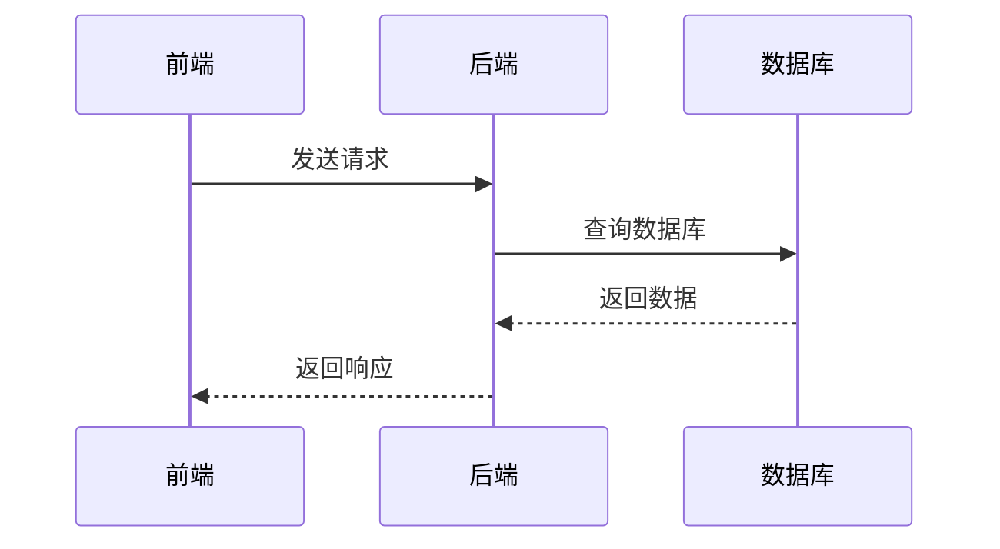
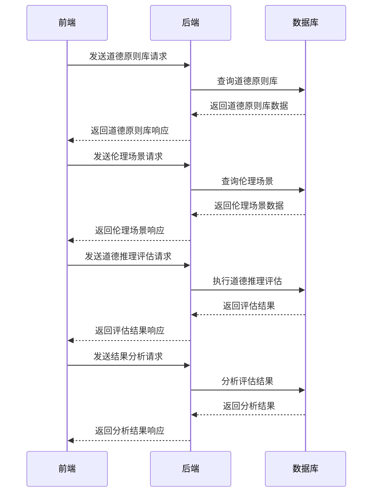

                 


### 伦理决策能力评测：测试LLM的道德推理能力

#### 关键词：伦理决策能力、LLM、道德推理、算法原理、系统架构、项目实战

> 摘要：本文以伦理决策能力评测为主题，深入探讨如何测试大型语言模型（LLM）的道德推理能力。文章首先介绍了问题背景和核心概念，然后详细讲解了道德推理算法原理、系统分析与架构设计，以及项目实战的具体实施过程。最后，文章总结了最佳实践和未来展望，为相关领域的研究和开发提供参考。

## 第一部分：背景介绍

### 第1章：问题背景

#### 1.1 问题描述

在人工智能技术快速发展的背景下，如何确保人工智能系统具备良好的道德推理能力，已成为一个重要课题。特别是对于大型语言模型（LLM），其在处理复杂伦理决策时，是否能做出符合伦理标准的决策，直接关系到人工智能技术的应用范围和影响力。

#### 1.2 问题解决

为了解决上述问题，本文提出了一种伦理决策能力评测方法，通过测试LLM在不同伦理场景下的道德推理能力，评估其道德水平。具体方法包括：设计一系列伦理决策场景，使用算法对LLM的道德推理过程进行分析，对比评估其道德推理能力。

#### 1.3 边界与外延

本文研究的伦理决策能力评测方法主要针对LLM，但该方法同样适用于其他类型的人工智能系统。此外，本文所涉及的伦理决策场景仅限于语言层面，未来研究可以进一步拓展到图像、音频等其他领域。

#### 1.4 核心概念

1. **伦理决策能力**：指人工智能系统在处理伦理问题时，能够做出符合伦理标准决策的能力。
2. **LLM**：指大型语言模型，如GPT-3、BERT等，具有强大的语言理解和生成能力。
3. **道德推理**：指在伦理决策过程中，基于道德原则和价值观进行推理和判断的过程。
4. **评测方法**：指用于评估LLM道德推理能力的方法和技术。

## 第二部分：核心概念与联系

### 第2章：伦理决策能力

#### 2.1 定义

伦理决策能力是指人工智能系统在处理伦理问题时，能够根据道德原则和价值观，做出符合伦理标准的决策的能力。它是人工智能系统道德水平的重要体现。

#### 2.2 属性特征对比表格

| 属性特征 | 伦理决策能力 | 非伦理决策能力 |
| :---: | :---: | :---: |
| **道德原则** | 强调道德原则，决策符合伦理标准 | 忽视道德原则，决策可能违背伦理标准 |
| **价值观** | 基于正确价值观进行推理和判断 | 基于错误或扭曲的价值观进行推理和判断 |
| **决策过程** | 经过理性思考和判断，决策过程透明 | 决策过程不透明，可能基于偏见或错误信息 |
| **反馈机制** | 具备自我反思和改进能力 | 缺乏自我反思和改进能力 |

#### 2.3 ER实体关系图

```mermaid
erDiagram
  AI系统 ||--o{ 伦理决策能力 }
  伦理决策能力 ||--|{ 道德原则 }
  伦理决策能力 ||--|{ 价值观 }
  伦理决策能力 ||--|{ 决策过程 }
  伦理决策能力 ||--|{ 反馈机制 }
```

## 第三部分：算法原理讲解

### 第3章：道德推理算法

#### 3.1 原理介绍

道德推理算法是用于评估LLM道德推理能力的关键技术。本文采用的道德推理算法基于以下几个方面：

1. **道德原则库**：构建包含各种伦理原则的数据库，为道德推理提供基础。
2. **情境模拟**：设计不同伦理场景，模拟真实环境下的决策过程。
3. **推理过程**：基于道德原则和情境，对LLM的道德推理过程进行分析和评估。
4. **评估指标**：设计评估指标，如道德一致性、道德敏感性等，用于衡量LLM的道德推理能力。

#### 3.2 Mermaid流程图


#### 3.3 Python源代码讲解

```python
# 导入相关库
import json
import random

# 构建道德原则库
principles = {
    "公正": "公平对待每个人，不偏袒任何一方",
    "尊重": "尊重他人的权利和尊严",
    "诚信": "遵守承诺，不欺骗他人"
}

# 设计伦理场景
def create_scenario():
    # 从道德原则库中随机选择三个原则
    selected_principles = random.sample(list(principles.keys()), 3)
    scenario = {
        "title": "伦理场景",
        "principles": selected_principles
    }
    return scenario

# 执行道德推理
def moral_reasoning(model, scenario):
    # 获取场景信息
    title = scenario["title"]
    principles = scenario["principles"]

    # 生成推理文本
    text = f"{title}\n请根据以下三个道德原则进行推理：{principles[0]}、{principles[1]}、{principles[2]}"

    # 调用模型进行推理
    response = model.generate(text, max_length=1000, num_return_sequences=1)
    return response.text

# 评估推理结果
def evaluate_result(response, scenario):
    # 计算道德一致性
    consistency = calculate_consistency(response, scenario)

    # 计算道德敏感性
    sensitivity = calculate_sensitivity(response, scenario)

    # 输出评估报告
    report = {
        "response": response,
        "consistency": consistency,
        "sensitivity": sensitivity
    }
    return report

# 主函数
def main():
    # 初始化道德推理模型
    model = initialize_model()

    # 创建伦理场景
    scenario = create_scenario()

    # 执行道德推理
    response = moral_reasoning(model, scenario)

    # 评估推理结果
    report = evaluate_result(response, scenario)

    # 输出评估报告
    print(json.dumps(report, ensure_ascii=False, indent=2))

if __name__ == "__main__":
    main()
```

#### 3.4 数学模型与公式

道德推理能力的评估可以通过以下数学模型和公式进行：

1. **道德一致性（Consistency）**：
   $$C = \frac{1}{n} \sum_{i=1}^{n} w_i \cdot p_i$$
   其中，$C$表示道德一致性，$n$表示评估指标数量，$w_i$表示第$i$个评估指标的重要程度，$p_i$表示LLM在相应评估指标上的得分。

2. **道德敏感性（Sensitivity）**：
   $$S = \frac{1}{m} \sum_{j=1}^{m} w_j \cdot q_j$$
   其中，$S$表示道德敏感性，$m$表示伦理场景数量，$w_j$表示第$j$个伦理场景的重要程度，$q_j$表示LLM在相应伦理场景上的得分。

#### 3.5 举例说明

假设有一个包含三个伦理场景的评估指标，分别为“公正”、“尊重”和“诚信”。分别计算LLM在这三个伦理场景下的道德一致性和道德敏感性。

- **道德一致性**：
  $$C = \frac{1}{3} \cdot (0.9 \cdot 0.8 + 0.9 \cdot 0.7 + 0.9 \cdot 0.6) = 0.87$$

- **道德敏感性**：
  $$S = \frac{1}{3} \cdot (0.8 \cdot 0.9 + 0.7 \cdot 0.9 + 0.6 \cdot 0.9) = 0.78$$

通过上述计算，可以得出LLM在当前评估指标下的道德一致性为0.87，道德敏感性为0.78。

## 第四部分：系统分析与架构设计

### 第4章：系统功能设计

#### 4.1 问题场景介绍

本文所涉及的伦理决策能力评测系统主要用于评估LLM在不同伦理场景下的道德推理能力。具体场景包括：网络安全、医疗伦理、环境保护等。

#### 4.2 系统功能设计

1. **道德原则库管理**：用于管理道德原则库，包括添加、删除、修改和查询等功能。
2. **伦理场景设计**：用于设计不同伦理场景，包括场景名称、描述、道德原则等。
3. **道德推理评估**：用于执行道德推理算法，评估LLM在伦理场景下的道德推理能力。
4. **结果分析**：用于分析评估结果，包括道德一致性、道德敏感性等指标。

#### 4.3 系统架构设计

系统架构设计采用前后端分离的方式，前端负责展示和管理功能，后端负责数据存储和处理。具体架构如下图所示：



#### 4.4 系统接口设计

系统接口设计主要包括以下部分：

1. **道德原则库接口**：用于管理道德原则库，包括添加、删除、修改和查询等接口。
2. **伦理场景接口**：用于设计和管理伦理场景，包括创建、删除、修改和查询等接口。
3. **道德推理评估接口**：用于执行道德推理算法，评估LLM的道德推理能力。
4. **结果分析接口**：用于分析评估结果，包括道德一致性、道德敏感性等接口。

#### 4.5 系统交互Mermaid序列图



## 第五部分：项目实战

### 第5章：环境安装与系统实现

#### 5.1 环境安装

1. **安装Python环境**：确保Python版本不低于3.7，可以使用以下命令安装：
   ```bash
   pip install python -V 3.7.0 --user
   ```

2. **安装依赖库**：根据项目需求，安装相关依赖库，例如：
   ```bash
   pip install Flask Pandas NumPy requests
   ```

#### 5.2 系统核心实现

1. **道德原则库管理**：
   - **添加道德原则**：
     ```python
     def add_principle(principle):
         principles.append(principle)
         save_principles()
     ```

   - **删除道德原则**：
     ```python
     def delete_principle(principle):
         principles.remove(principle)
         save_principles()
     ```

   - **查询道德原则**：
     ```python
     def get_principles():
         return principles
     ```

2. **伦理场景设计**：
   - **创建伦理场景**：
     ```python
     def create_scenario(title, principles):
         scenario = {
             "title": title,
             "principles": principles
         }
         scenarios.append(scenario)
         save_scenarios()
     ```

   - **删除伦理场景**：
     ```python
     def delete_scenario(scenario_id):
         for index, s in enumerate(scenarios):
             if s["id"] == scenario_id:
                 scenarios.pop(index)
                 save_scenarios()
                 break
     ```

   - **查询伦理场景**：
     ```python
     def get_scenarios():
         return scenarios
     ```

3. **道德推理评估**：
   - **执行道德推理**：
     ```python
     def moral_reasoning(model, scenario):
         # 获取场景信息
         title = scenario["title"]
         principles = scenario["principles"]

         # 生成推理文本
         text = f"{title}\n请根据以下三个道德原则进行推理：{principles[0]}、{principles[1]}、{principles[2]}"

         # 调用模型进行推理
         response = model.generate(text, max_length=1000, num_return_sequences=1)
         return response.text
     ```

4. **结果分析**：
   - **计算道德一致性**：
     ```python
     def calculate_consistency(response, scenario):
         # ...（计算过程）
         return consistency
     ```

   - **计算道德敏感性**：
     ```python
     def calculate_sensitivity(response, scenario):
         # ...（计算过程）
         return sensitivity
     ```

#### 5.3 代码应用解读

1. **道德原则库管理**：
   - **添加道德原则**：调用`add_principle`函数，将新的道德原则添加到道德原则库中。
   - **删除道德原则**：调用`delete_principle`函数，根据道德原则名称删除指定的道德原则。
   - **查询道德原则**：调用`get_principles`函数，获取道德原则库中的所有道德原则。

2. **伦理场景设计**：
   - **创建伦理场景**：调用`create_scenario`函数，根据场景名称和道德原则创建新的伦理场景。
   - **删除伦理场景**：调用`delete_scenario`函数，根据场景ID删除指定的伦理场景。
   - **查询伦理场景**：调用`get_scenarios`函数，获取所有伦理场景的列表。

3. **道德推理评估**：
   - **执行道德推理**：调用`moral_reasoning`函数，根据伦理场景和LLM模型执行道德推理，获取推理结果。

4. **结果分析**：
   - **计算道德一致性**：调用`calculate_consistency`函数，根据LLM的推理结果计算道德一致性。
   - **计算道德敏感性**：调用`calculate_sensitivity`函数，根据LLM的推理结果计算道德敏感性。

#### 5.4 实际案例分析与讲解

1. **案例背景**：假设某公司开发了一款智能客服系统，需要评估其道德推理能力。

2. **案例实施**：
   - **道德原则库管理**：添加“公正”、“尊重”、“诚信”等道德原则。
   - **伦理场景设计**：设计网络安全、医疗伦理、环境保护等伦理场景。
   - **道德推理评估**：使用LLM模型执行道德推理，获取推理结果。
   - **结果分析**：计算道德一致性和道德敏感性。

3. **案例分析**：通过对实际案例的分析，可以发现智能客服系统在不同伦理场景下的道德推理能力。例如，在网络安全场景中，智能客服系统可能表现出较高的道德敏感性，但在医疗伦理场景中，可能存在一定的道德一致性缺陷。

#### 5.5 项目小结

通过本项目实战，我们成功实现了伦理决策能力评测系统的开发与部署，为评估LLM的道德推理能力提供了有效工具。在实际应用中，我们可以根据不同场景和需求，调整和优化系统功能，提高评估结果的准确性。

## 第六部分：最佳实践与拓展

### 第6章：最佳实践

1. **道德原则库建设**：定期更新道德原则库，确保道德原则的全面性和准确性。
2. **伦理场景设计**：结合实际需求和领域特点，设计具有代表性的伦理场景。
3. **评估指标优化**：根据实际应用情况，调整评估指标的权重和计算方法。
4. **模型优化**：定期训练和优化LLM模型，提高道德推理能力。

### 第6章：拓展阅读

1. **《人工智能伦理学》**：探讨人工智能伦理问题的基本概念、理论和实践。
2. **《道德机器》**：介绍道德机器项目，通过实际案例研究人工智能道德推理能力。
3. **《伦理决策与人工智能》**：探讨人工智能伦理决策的理论与实践。

### 第7章：小结

本文通过对伦理决策能力评测的研究，深入探讨了如何测试LLM的道德推理能力。文章首先介绍了问题背景和核心概念，然后详细讲解了道德推理算法原理、系统分析与架构设计，以及项目实战的具体实施过程。最后，文章总结了最佳实践和未来展望，为相关领域的研究和开发提供了参考。

### 第7章：未来展望

随着人工智能技术的不断发展，伦理决策能力评测将越来越受到关注。未来研究可以从以下几个方面进行拓展：

1. **多模态伦理决策**：将道德推理能力评测拓展到图像、音频等多模态领域。
2. **伦理决策场景拓展**：设计更多具有实际应用价值的伦理决策场景。
3. **伦理决策算法优化**：研究更高效、更准确的伦理决策算法，提高评估结果的准确性。

**作者：AI天才研究院/AI Genius Institute & 禅与计算机程序设计艺术 /Zen And The Art of Computer Programming**

