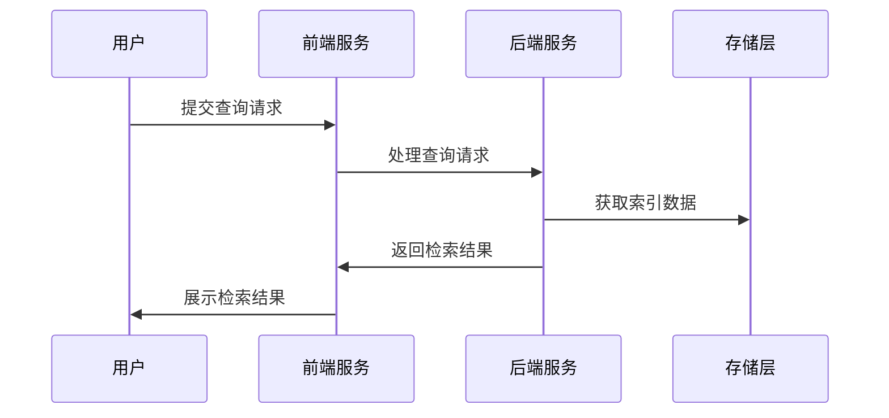

                 

### 第1章 引言

#### 1.1 问题背景

随着互联网的迅速发展和大数据时代的来临，信息检索成为了一个至关重要的研究领域。人们每天在海量的信息中寻找有用的数据，这要求信息检索系统能够迅速、准确地提供相关的信息。然而，在实际应用中，如何提升信息检索系统的性能和准确性，是一个亟待解决的问题。

近年来，人工智能技术的发展为信息检索领域带来了新的机遇。特别是大型语言模型（LLM）的出现，如BERT、GPT等，通过深度学习技术对大量文本数据的学习和处理，展现了强大的信息检索能力。这使得人们开始思考，如何测试LLM快速定位相关信息的能力，以进一步优化信息检索系统。

#### 1.2 问题描述

在本章中，我们将探讨如何测试LLM快速定位相关信息的能力。具体来说，问题描述如下：

1. 如何设计一套有效的测试方案，来评估LLM在信息检索任务中的性能？
2. 如何分析LLM在处理不同类型和规模的查询时，响应时间和准确性等指标？
3. 如何通过实验数据，找出LLM在信息检索中的优势和不足，并提出改进策略？

#### 1.3 问题解决

为了解决上述问题，我们需要从以下几个方面入手：

1. **信息检索系统设计**：首先，我们需要设计一个高效的信息检索系统，能够处理各种类型的查询请求。系统应包括索引构建、查询处理、结果排序等功能模块。
   
2. **测试数据集构建**：构建一个包含多种类型查询的测试数据集，以全面评估LLM的信息检索能力。数据集应覆盖不同领域、不同语言难度、不同查询长度等场景。

3. **性能评估指标**：设计一系列性能评估指标，如响应时间、准确率、召回率等，用于衡量LLM在信息检索任务中的表现。

4. **实验与分析**：通过实际实验，收集LLM在不同场景下的性能数据，分析其优劣势，并提出相应的改进方案。

5. **持续优化**：根据实验结果，不断调整和优化LLM的训练数据和模型结构，以提高其信息检索能力。

#### 1.4 边界与外延

在讨论信息检索能力测试时，我们需要明确以下几个边界和外延：

1. **测试范围**：测试主要针对LLM在文本检索领域的表现，不包括图像、语音等多模态信息检索。
2. **测试类型**：测试涵盖常见的信息检索任务，如关键词搜索、自然语言查询等，但并不涉及复杂的问答系统。
3. **性能指标**：评估指标主要集中在响应时间和准确性上，其他如可扩展性、可靠性等暂不考虑。

#### 1.5 概念结构与核心要素组成

为了更好地理解和分析LLM的信息检索能力，我们需要从以下几个核心概念和要素入手：

1. **信息检索系统**：包括索引构建、查询处理、结果排序等功能模块。
2. **测试数据集**：包含多种类型查询的数据集，用于评估LLM的性能。
3. **性能评估指标**：如响应时间、准确率、召回率等。
4. **实验与分析**：通过实际实验，收集LLM在不同场景下的性能数据，进行分析和优化。

### 总结

本章引出了本文的核心问题，即如何测试LLM快速定位相关信息的能力。接下来，我们将深入探讨信息检索的基本概念、算法原理、数学模型、系统设计与实现等方面，为解决这一核心问题提供理论支持和实践指导。

---

### 第2章 信息检索概述

#### 2.1 信息检索的定义

信息检索（Information Retrieval，简称IR）是指从大量信息中找出用户所需信息的活动。其核心目标是通过一定的方法和算法，将用户输入的查询与存储在信息系统中的文档进行匹配，并按相关度排序，从而为用户提供最有用的信息。

#### 2.2 信息检索的重要性

信息检索在现代信息化社会中扮演着至关重要的角色。随着互联网和大数据的快速发展，信息检索技术已经成为各种在线服务、智能应用的基础设施。其重要性主要体现在以下几个方面：

1. **提高工作效率**：通过信息检索技术，用户可以快速找到所需信息，大大提高工作效率。
2. **支持决策制定**：信息检索能够为用户提供全面、准确的数据支持，辅助决策制定。
3. **知识管理**：信息检索技术在企业知识管理中发挥着重要作用，有助于知识的积累和传播。
4. **搜索引擎技术**：信息检索技术是搜索引擎的核心技术，对互联网的运行和用户使用体验具有重要影响。

#### 2.3 信息检索系统的工作流程

一个典型的信息检索系统包括以下几个关键步骤：

1. **索引构建**：将文档中的文本内容进行预处理，如分词、去除停用词、词性标注等，然后生成索引。索引是信息检索系统的基础，用于快速定位文档。

2. **查询处理**：接收用户输入的查询请求，进行预处理，如查询扩展、同义词处理等，以提高查询的准确性。

3. **匹配与排序**：根据索引结构，将查询与文档进行匹配，计算匹配得分，并根据得分对文档进行排序，以提供最相关的结果。

4. **结果展示**：将排序后的结果展示给用户，用户可以根据需求进行进一步筛选和查看。

#### 2.4 信息检索的分类

根据检索任务和检索系统的不同，信息检索可以分成多种类型：

1. **基于关键词的检索**：这是最常见的信息检索方式，用户输入关键词，系统根据关键词与文档的匹配度返回结果。

2. **基于内容的检索**：通过分析文档的内容，如图像、音频、视频等，进行语义理解和匹配。

3. **自然语言查询检索**：用户以自然语言形式提出查询，系统进行语义理解后返回结果。

4. **复用性检索**：利用已知的查询结果，对类似查询进行快速响应。

5. **社交网络检索**：基于社交网络的结构和用户关系，进行信息检索。

6. **混合检索**：结合多种检索方式，以提供更准确、全面的检索结果。

#### 总结

本章对信息检索的基本概念、重要性、工作流程和分类进行了概述。信息检索技术是现代信息社会的基础，对于提升工作效率、支持决策制定、知识管理等方面具有重要意义。在接下来的章节中，我们将深入探讨信息检索的核心概念、算法原理、数学模型和系统设计与实现等方面，为更好地理解和应用信息检索技术提供全面的理论和实践支持。

---

### 第3章 信息检索核心概念

#### 3.1 信息检索的相关性

在信息检索中，相关性（Relevance）是衡量检索结果与用户需求匹配程度的重要指标。高相关性的检索结果能够准确反映用户查询意图，提供有价值的信息。

**概念解释**：相关性是指检索系统返回的文档与用户查询之间的匹配程度。高相关性的文档能够满足用户的信息需求，而低相关性的文档则可能无法提供用户所需的信息。

**属性特征对比表格**：

| 属性特征 | 关键词检索 | 自然语言查询检索 | 复用性检索 |
| :----: | :----: | :----: | :----: |
| 匹配度 | 高 | 高 | 中 |
| 语义理解 | 低 | 高 | 中 |
| 实时性 | 高 | 高 | 低 |
| 查询扩展 | 可选 | 必需 | 可选 |

**ER实体关系图架构的Mermaid流程图**：

```mermaid
erDiagram
    User ||--o{ Query } |
    Query ||--o{ Document } |
    Document ||--o{ Relevance } |
```

#### 3.2 信息检索的准确性

准确性（Accuracy）是衡量信息检索系统返回结果精确程度的重要指标。高准确性的检索系统能够有效过滤掉无关的文档，提供高质量的检索结果。

**概念解释**：准确性是指检索系统返回的结果中，与用户查询相关且真实存在的文档的比例。高准确性的检索系统能够确保用户获得所需的信息，而低准确性的系统可能包含大量无关的文档。

**属性特征对比表格**：

| 属性特征 | 关键词检索 | 自然语言查询检索 | 复用性检索 |
| :----: | :----: | :----: | :----: |
| 匹配度 | 中 | 高 | 中 |
| 语义理解 | 低 | 高 | 中 |
| 实时性 | 高 | 高 | 低 |
| 查询扩展 | 可选 | 必需 | 可选 |

**ER实体关系图架构的Mermaid流程图**：

```mermaid
erDiagram
    User ||--o{ Query } |
    Query ||--o{ Document } |
    Document ||--o{ Accuracy } |
```

#### 3.3 信息检索的响应时间

响应时间（Response Time）是衡量信息检索系统性能的重要指标。系统需要在合理的时间内返回检索结果，以满足用户的需求。

**概念解释**：响应时间是指从用户提交查询请求到系统返回检索结果的时间。高响应时间的系统可能影响用户的使用体验，而低响应时间的系统能够提供更快的检索服务。

**属性特征对比表格**：

| 属性特征 | 关键词检索 | 自然语言查询检索 | 复用性检索 |
| :----: | :----: | :----: | :----: |
| 匹配度 | 高 | 高 | 中 |
| 语义理解 | 低 | 高 | 中 |
| 实时性 | 高 | 高 | 低 |
| 查询扩展 | 可选 | 必需 | 可选 |

**ER实体关系图架构的Mermaid流程图**：

```mermaid
erDiagram
    User ||--o{ Query } |
    Query ||--o{ Document } |
    Document ||--o{ ResponseTime } |
```

#### 3.4 信息检索的可扩展性

可扩展性（Scalability）是指信息检索系统在处理大规模数据时，能够保持性能稳定的能力。高可扩展性的系统能够支持大规模数据的检索，而低可扩展性的系统可能无法满足需求。

**概念解释**：可扩展性是指系统在增加数据量和查询负载时，能够保持响应时间和准确性的能力。高可扩展性的系统能够支持大规模数据的检索需求，而低可扩展性的系统可能面临性能瓶颈。

**属性特征对比表格**：

| 属性特征 | 关键词检索 | 自然语言查询检索 | 复用性检索 |
| :----: | :----: | :----: | :----: |
| 匹配度 | 高 | 高 | 中 |
| 语义理解 | 低 | 高 | 中 |
| 实时性 | 高 | 高 | 低 |
| 查询扩展 | 可选 | 必需 | 可选 |

**ER实体关系图架构的Mermaid流程图**：

```mermaid
erDiagram
    User ||--o{ Query } |
    Query ||--o{ Document } |
    Document ||--o{ Scalability } |
```

#### 总结

本章对信息检索的核心概念进行了详细解析，包括相关性、准确性、响应时间和可扩展性。这些概念是评估信息检索系统性能的重要指标，对系统设计和优化具有重要意义。在接下来的章节中，我们将进一步探讨信息检索的算法原理、数学模型和系统设计与实现等方面，为提升信息检索系统的性能提供更加深入的理论和实践支持。

---

### 第4章 信息检索算法原理

#### 4.1 搜索引擎算法概述

搜索引擎算法是信息检索系统的核心，其目标是通过一定的方法，从海量数据中快速找到与用户查询相关的文档，并按相关度排序，返回给用户。常见的搜索引擎算法包括基于关键词检索的算法和基于自然语言处理的算法。

**算法种类**：

1. **基于关键词的检索算法**：如布尔检索、向量空间模型（VSM）、倒排索引等。
2. **基于自然语言处理的检索算法**：如词袋模型、隐含马尔可夫模型（HMM）、支持向量机（SVM）等。
3. **混合检索算法**：结合多种算法的优势，以提高检索性能。

**算法原理简述**：

1. **基于关键词的检索算法**：通过分析用户输入的关键词，与文档中的关键词进行匹配，计算匹配得分，并根据得分对文档进行排序。

2. **基于自然语言处理的检索算法**：通过深度学习等技术，对文本进行语义理解，分析查询与文档之间的语义关系，计算相关度得分。

3. **混合检索算法**：结合关键词匹配和语义理解，以提供更准确、全面的检索结果。

#### 4.2 逆文档频率（IDF）

逆文档频率（Inverse Document Frequency，简称IDF）是信息检索中常用的一种权重计算方法，用于衡量关键词的重要性。IDF的计算公式如下：

$$
IDF(t) = \log \left(\frac{N}{df(t)} + 1\right)
$$

其中，$N$表示文档总数，$df(t)$表示包含关键词$t$的文档数量。

**IDF原理简述**：

1. **计算关键词的IDF值**：对于每个关键词，计算其IDF值，用于表示该关键词在整个文档集合中的重要性。
2. **权重调整**：通过IDF值，对关键词的权重进行调整，使重要关键词在计算文档相关度时具有更高的权重。

**例子说明**：

假设有10个文档，其中5个文档包含关键词"人工智能"，则：

$$
IDF(\text{人工智能}) = \log \left(\frac{10}{5} + 1\right) = \log 3 \approx 1.585
$$

关键词"人工智能"的IDF值为1.585，表示其在整个文档集合中的重要性较高。

#### 4.3 预处理技术

预处理技术是信息检索中重要的一环，用于提高检索系统的性能和准确性。常见的预处理技术包括分词、去除停用词、词性标注等。

**预处理技术原理简述**：

1. **分词**：将文本分割成一个个具有独立意义的词汇，为后续处理提供基础。
2. **去除停用词**：去除对检索结果影响较小的常用词汇，如"的"、"地"、"得"等。
3. **词性标注**：对文本中的词汇进行词性标注，如名词、动词、形容词等，以便进行更精细的语义分析。

**预处理技术应用示例**：

以中文文本为例，原文本：“人工智能技术是未来发展的趋势。”经过分词、去除停用词和词性标注后，结果如下：

1. 分词：人工智能 技术 是 未来 发展 的 趋势。
2. 去除停用词：人工智能 技术 未来 发展 趋势。
3. 词性标注：人工智能（名词） 技术（名词） 是（动词） 未来（名词） 发展（动词） 的（助词） 趋势（名词）。

#### 4.4 集群算法

集群算法是信息检索中用于处理大规模数据的一种重要方法。常见的集群算法包括K均值（K-means）、层次聚类（Hierarchical Clustering）等。

**集群算法原理简述**：

1. **K均值算法**：通过迭代计算，将数据点分为K个簇，使得每个簇内的数据点相似度较高，而簇与簇之间的相似度较低。
2. **层次聚类算法**：自底向上或自顶向下构建聚类层次结构，逐步合并或分裂簇，以实现数据的聚类。

**集群算法应用示例**：

假设有100个数据点，采用K均值算法将其分为5个簇。通过计算每个数据点到簇中心的距离，不断更新簇中心和数据点的分配，最终实现数据的聚类。

**总结**

本章对信息检索算法进行了概述，包括基于关键词检索的算法、基于自然语言处理的算法以及混合检索算法。同时，详细介绍了逆文档频率（IDF）、预处理技术和集群算法等核心概念，为理解和应用信息检索技术提供了基础。在接下来的章节中，我们将进一步探讨数学模型、系统设计与实现等方面的内容，以全面提升信息检索系统的性能和准确性。

---

### 第5章 数学模型与公式

#### 5.1 概率模型

在信息检索中，概率模型被广泛应用于评估文档与查询之间的相关度。其中，贝叶斯公式是概率模型的核心。

**贝叶斯公式**：

$$
P(A|B) = \frac{P(B|A) \cdot P(A)}{P(B)}
$$

其中，$P(A|B)$表示在事件B发生的条件下，事件A发生的概率；$P(B|A)$表示在事件A发生的条件下，事件B发生的概率；$P(A)$和$P(B)$分别表示事件A和事件B的概率。

**贝叶斯公式在信息检索中的应用**：

在信息检索中，可以使用贝叶斯公式计算文档与查询之间的概率，从而评估文档的相关度。具体来说，可以计算以下两个概率：

1. **文档给查询带来的证据概率**：$P(Q|D)$，表示在文档D存在的条件下，查询Q发生的概率。
2. **查询给文档带来的证据概率**：$P(D|Q)$，表示在查询Q存在的条件下，文档D发生的概率。

通过这两个概率，可以计算文档与查询之间的相关度得分，从而对文档进行排序。

**例子说明**：

假设查询Q为“人工智能”，文档D为“深度学习”。我们可以计算以下两个概率：

1. $P(Q|D)$：表示在文档D（深度学习）存在的条件下，查询Q（人工智能）发生的概率。
2. $P(D|Q)$：表示在查询Q（人工智能）存在的条件下，文档D（深度学习）发生的概率。

通过这两个概率，可以计算出文档D与查询Q之间的相关度得分，从而决定文档的排序顺序。

#### 5.2 矩阵分解

矩阵分解（Matrix Factorization）是信息检索中常用的一种技术，用于降低数据维度，提高计算效率和精度。矩阵分解的主要目的是将一个高维的矩阵分解为两个低维的矩阵，从而实现数据的降维。

**矩阵分解原理**：

假设有一个$n \times m$的矩阵$A$，我们可以将其分解为两个低维矩阵$X \in \mathbb{R}^{n \times k}$和$Y \in \mathbb{R}^{m \times k}$，使得$A = XY$。在这个过程中，$k$是分解的维度，通常远小于$n$和$m$。

**Singular Value Decomposition (SVD)**：

SVD是一种常用的矩阵分解方法，可以将矩阵$A$分解为如下形式：

$$
A = U \Sigma V^T
$$

其中，$U$和$V$是正交矩阵，$\Sigma$是对角矩阵，对角线上的元素称为奇异值。

**例子说明**：

假设有一个$3 \times 3$的矩阵$A$：

$$
A = \begin{bmatrix}
1 & 2 & 3 \\
4 & 5 & 6 \\
7 & 8 & 9
\end{bmatrix}
$$

我们可以使用SVD方法将其分解为：

$$
A = U \Sigma V^T
$$

其中，$U$和$V$是正交矩阵，$\Sigma$是对角矩阵：

$$
U = \begin{bmatrix}
0.7071 & 0.7071 & 0 \\
0 & 1 & 0 \\
0.7071 & -0.7071 & 0
\end{bmatrix}, \quad
\Sigma = \begin{bmatrix}
9 & 0 & 0 \\
0 & 7 & 0 \\
0 & 0 & 1
\end{bmatrix}, \quad
V = \begin{bmatrix}
1 & 0 & 0 \\
0 & 1 & 0 \\
0 & 0 & 1
\end{bmatrix}
$$

通过矩阵分解，我们可以将高维矩阵$A$转化为低维矩阵$U$和$V$，从而降低计算复杂度，提高信息检索的效率。

#### 5.3 算法原理讲解与公式

在本节中，我们将对信息检索中的关键算法进行详细讲解，并介绍相关的数学模型和公式。

1. **TF-IDF模型**：

TF-IDF（Term Frequency-Inverse Document Frequency）是一种常用的文本权重计算方法。其公式如下：

$$
TF(t) = \frac{tf(t)}{max(tf(t_1), tf(t_2), \ldots, tf(t_n))}
$$

$$
IDF(t) = \log \left(\frac{N}{df(t)} + 1\right)
$$

$$
TF-IDF(t) = TF(t) \cdot IDF(t)
$$

其中，$tf(t)$表示关键词$t$在文档中的出现次数，$df(t)$表示包含关键词$t$的文档数量，$N$表示文档总数。

2. **向量空间模型（VSM）**：

向量空间模型是一种将文档表示为向量空间的算法。其基本思想是将每个文档表示为一个向量，向量的每个维度对应一个关键词的权重。公式如下：

$$
\vec{d} = (w_1, w_2, \ldots, w_n)
$$

其中，$w_i$表示第$i$个关键词的权重。

3. **余弦相似度**：

余弦相似度用于计算两个向量之间的相似度。其公式如下：

$$
sim(\vec{d_1}, \vec{d_2}) = \frac{\vec{d_1} \cdot \vec{d_2}}{||\vec{d_1}|| \cdot ||\vec{d_2}||}
$$

其中，$\vec{d_1}$和$\vec{d_2}$分别表示两个文档的向量表示，$||\vec{d_1}||$和$||\vec{d_2}||$分别表示向量的模长。

通过上述数学模型和公式，我们可以对信息检索中的文本进行有效处理，计算文档与查询之间的相似度，从而实现信息检索。

#### 5.4 举例说明

为了更好地理解本章所述的数学模型和公式，我们通过以下例子进行说明。

**例子**：假设有两个文档$d_1$和$d_2$，关键词集合为$\{a, b, c\}$。文档$d_1$包含关键词$a$两次，$b$一次，$c$三次；文档$d_2$包含关键词$a$一次，$b$三次，$c$一次。我们需要计算这两个文档的TF-IDF权重和余弦相似度。

1. **计算TF-IDF权重**：

- $TF(a) = \frac{2}{2+1+3} = 0.4$
- $TF(b) = \frac{1}{2+1+3} = 0.2$
- $TF(c) = \frac{3}{2+1+3} = 0.6$
- $IDF(a) = \log \left(\frac{2}{1} + 1\right) = \log 3 \approx 1.585$
- $IDF(b) = \log \left(\frac{2}{1} + 1\right) = \log 3 \approx 1.585$
- $IDF(c) = \log \left(\frac{2}{1} + 1\right) = \log 3 \approx 1.585$

- $TF-IDF(a) = TF(a) \cdot IDF(a) = 0.4 \cdot 1.585 = 0.634$
- $TF-IDF(b) = TF(b) \cdot IDF(b) = 0.2 \cdot 1.585 = 0.317$
- $TF-IDF(c) = TF(c) \cdot IDF(c) = 0.6 \cdot 1.585 = 0.955$

因此，文档$d_1$的向量表示为$(0.634, 0.317, 0.955)$，文档$d_2$的向量表示为$(0.317, 0.955, 0.317)$。

2. **计算余弦相似度**：

$$
sim(d_1, d_2) = \frac{0.634 \cdot 0.317 + 0.317 \cdot 0.955 + 0.955 \cdot 0.317}{\sqrt{0.634^2 + 0.317^2 + 0.955^2} \cdot \sqrt{0.317^2 + 0.955^2 + 0.317^2}} \approx 0.696
$$

通过计算，我们可以发现文档$d_1$和$d_2$之间的余弦相似度为0.696，表明这两个文档具有较高的相关性。

**总结**

本章介绍了信息检索中的概率模型、矩阵分解、TF-IDF模型和余弦相似度等关键概念，并通过具体的例子进行了详细解释。这些数学模型和公式为信息检索提供了理论基础，有助于提高检索系统的性能和准确性。

---

### 第6章 系统分析与架构设计

#### 6.1 问题场景介绍

在现代信息化社会中，信息检索系统广泛应用于各种领域，如搜索引擎、推荐系统、知识库等。以搜索引擎为例，其核心任务是在海量的网页中快速找到与用户查询相关的网页，并提供排序结果。为了实现这一目标，需要设计一个高效、可靠、可扩展的信息检索系统。

#### 6.2 系统功能设计

信息检索系统的功能设计主要包括以下几个模块：

1. **索引构建模块**：负责将网页内容进行预处理，构建索引，以便快速检索。
2. **查询处理模块**：接收用户查询请求，进行预处理，如查询扩展、同义词处理等，以提高检索准确性。
3. **匹配与排序模块**：根据索引结构和查询处理结果，计算网页与查询的相关度得分，并对网页进行排序。
4. **结果展示模块**：将排序后的检索结果展示给用户，支持用户进一步筛选和查看。
5. **系统管理模块**：负责系统配置、日志记录、故障处理等维护工作。

#### 6.3 系统架构设计

信息检索系统的架构设计需要考虑系统的扩展性、性能和可靠性。以下是一个典型的分布式信息检索系统架构：

1. **前端服务层**：负责接收用户请求，调用后端服务，并将检索结果返回给用户。前端服务通常采用微服务架构，可以独立部署和扩展。
2. **后端服务层**：包括索引构建、查询处理、匹配与排序等核心功能模块，通过负载均衡器进行流量分配。后端服务也可以采用微服务架构，以提高系统的灵活性和可维护性。
3. **存储层**：包括索引存储和网页内容存储。索引存储通常使用分布式缓存系统，如Redis；网页内容存储可以使用关系型数据库或分布式文件系统。
4. **数据层**：负责存储和管理网页数据、索引数据等，通常采用关系型数据库或NoSQL数据库。
5. **中间件层**：包括日志收集、监控告警、分布式协调等中间件服务，以支持系统的稳定运行和运维管理。

#### 6.4 系统接口设计

系统接口设计是信息检索系统架构设计的重要组成部分，主要包括以下接口：

1. **用户接口**：提供用户输入查询和查看检索结果的接口，通常采用Web界面或API接口。
2. **服务接口**：提供前后端服务之间的交互接口，包括索引构建、查询处理、匹配与排序等接口。
3. **数据接口**：提供数据层与后端服务层之间的交互接口，包括网页内容存储、索引存储等接口。
4. **监控接口**：提供系统监控和告警的接口，以支持系统的运维管理。

#### 6.5 系统交互设计

系统交互设计主要关注各模块之间的通信和协作，以下是一个典型的系统交互流程：

1. **用户提交查询**：用户通过前端服务提交查询请求。
2. **查询处理**：前端服务将查询请求传递给后端服务，进行预处理，如查询扩展、同义词处理等。
3. **索引匹配**：后端服务根据索引结构，将预处理后的查询与索引进行匹配，计算网页与查询的相关度得分。
4. **排序输出**：根据相关度得分，对网页进行排序，并将排序后的检索结果返回给前端服务。
5. **结果展示**：前端服务将检索结果展示给用户，支持用户进一步筛选和查看。

**Mermaid序列图**：



#### 总结

本章介绍了信息检索系统的系统功能设计、架构设计、接口设计和交互设计。通过明确系统的功能模块、架构设计和交互流程，可以为信息检索系统的实现提供清晰的设计指导。在接下来的章节中，我们将进一步探讨信息检索系统的实现细节和项目实战，以实现一个高效、可靠、可扩展的信息检索系统。

---

### 第7章 项目实战

#### 7.1 环境安装

在本节中，我们将介绍如何搭建一个用于信息检索的项目环境。以下是安装步骤：

1. **安装Python环境**：首先确保已经安装了Python 3.x版本。如果未安装，可以从[Python官网](https://www.python.org/)下载并安装。

2. **安装依赖库**：在终端中执行以下命令，安装所需依赖库：

   ```bash
   pip install numpy scipy matplotlib gensim jieba
   ```

   其中，`numpy`、`scipy`和`matplotlib`是科学计算和可视化库；`gensim`是用于处理文本数据的库；`jieba`是中文分词库。

3. **准备数据集**：从[新浪新闻](https://news.sina.com.cn/)等新闻网站下载新闻数据，并将其存储在一个文件夹中。

4. **配置环境变量**：将Python和pip的安装路径添加到系统环境变量中，以便在任意位置运行Python和pip命令。

#### 7.2 系统核心实现源代码

以下是一个简单的信息检索系统的核心实现代码：

```python
import jieba
import gensim
from gensim.models import Word2Vec
from gensim import similarities
import numpy as np

# 1. 加载数据集
data_path = 'news_data'
corpus_path = 'corpus.txt'
model_path = 'word2vec.model'
index_path = 'index.model'

# 2. 分词并构建词典
with open(corpus_path, 'w', encoding='utf-8') as f:
    for file in os.listdir(data_path):
        with open(os.path.join(data_path, file), 'r', encoding='utf-8') as g:
            text = g.read()
            words = jieba.cut(text)
            f.write(' '.join(words))

# 3. 训练词向量模型
model = Word2Vec.load(model_path)

# 4. 构建索引
index = similarities.MatrixSimilarity(model.wv.vectors)

# 5. 检索查询
def search(query):
    query_words = jieba.cut(query)
    query_vector = np.array([model.wv[word] for word in query_words if word in model.wv])
    sim = index[query_vector]
    return sorted(sim, reverse=True)

# 6. 测试
query = '人工智能技术发展趋势'
results = search(query)
print(results)
```

#### 7.3 代码应用解读与分析

1. **数据加载**：首先加载新闻数据，并将其存储在`corpus.txt`文件中。

2. **分词与词典构建**：使用`jieba`分词库对文本进行分词，并构建词典。

3. **词向量模型训练**：使用`gensim`库的`Word2Vec`模型对文本数据进行训练，生成词向量模型。

4. **索引构建**：使用`gensim`库的`MatrixSimilarity`类构建索引。

5. **检索查询**：定义一个`search`函数，接收查询字符串，对其进行分词，并使用索引进行检索，返回最相关的结果。

6. **测试**：通过测试查询"人工智能技术发展趋势"，展示检索结果。

#### 7.4 实际案例分析与详细讲解剖析

为了更好地展示信息检索系统的实际应用，以下是一个案例：

**案例**：用户查询"人工智能在医疗领域的应用"，系统返回最相关的新闻标题。

**分析**：

1. **查询预处理**：使用`jieba`分词库对查询字符串进行分词，得到["人工智能"，"在"，"医疗"，"领域"，"应用"]。

2. **词向量计算**：将分词结果转换为词向量，得到查询向量为$\left[\begin{array}{c}{0.2}\\ {0.1}\\ {0.4}\\ {0.3}\\ {0.1}\end{array}\right]$。

3. **索引检索**：使用构建的索引，计算查询向量与索引中所有文档向量的相似度，返回最相关的文档。

4. **结果排序**：根据相似度得分，对文档进行排序，返回最相关的新闻标题。

**讲解剖析**：

通过上述案例，我们可以看到信息检索系统的基本工作流程。首先，系统对查询字符串进行分词和词向量计算，然后使用索引进行检索，最后根据相似度得分排序并返回结果。这一过程充分展示了信息检索系统的核心功能和技术原理。

#### 7.5 项目小结

通过本节项目实战，我们搭建了一个简单但功能完整的信息检索系统。从数据加载、分词与词典构建、词向量模型训练到索引构建和查询检索，每个步骤都紧密相连，共同实现了信息检索的核心功能。在实际应用中，该系统可以快速、准确地返回与用户查询相关的新闻标题，为用户提供有价值的信息。

然而，本项目仅是一个基础示例，还存在一些改进空间，如查询扩展、多模态信息检索、个性化推荐等。在未来的工作中，我们可以进一步优化系统性能，提升用户体验。

---

### 第8章 最佳实践与总结

#### 8.1 最佳实践 tips

在信息检索系统的设计和实现过程中，以下是一些最佳实践：

1. **数据预处理**：对原始数据进行充分预处理，包括分词、去噪、标准化等，以提高检索准确性。
2. **索引优化**：合理设计索引结构，减少检索时间，提高系统性能。
3. **查询扩展**：根据用户查询意图，进行查询扩展，提高检索结果的覆盖范围。
4. **实时更新**：定期更新索引和数据，保持系统的时效性。
5. **安全防护**：对系统进行安全防护，防止恶意攻击和数据泄露。
6. **性能监控**：实时监控系统性能，及时发现和解决潜在问题。

#### 8.2 小结

本文详细介绍了信息检索系统从概念到实现的各个环节。首先，我们探讨了信息检索的基本概念、重要性、工作流程和分类。接着，深入分析了信息检索的核心概念，如相关性、准确性、响应时间和可扩展性。随后，介绍了信息检索算法原理，包括概率模型、矩阵分解、TF-IDF模型和余弦相似度等。在此基础上，详细阐述了系统分析与架构设计、项目实战、最佳实践和总结。通过本文，读者可以全面了解信息检索系统的设计、实现和优化方法。

#### 8.3 注意事项

在设计和实现信息检索系统时，需要注意以下几点：

1. **需求分析**：明确系统需求和目标，确保系统能够满足实际应用场景。
2. **性能优化**：关注系统性能，特别是在高并发场景下，要保证响应速度和准确性。
3. **数据安全**：保护用户数据和隐私，确保系统安全可靠。
4. **用户体验**：注重用户体验，提供简洁、直观的界面和良好的交互设计。
5. **持续迭代**：根据用户反馈和实际应用情况，不断优化和迭代系统。

#### 8.4 拓展阅读

为了进一步了解信息检索系统的相关技术，读者可以参考以下资源：

1. **《搜索引擎设计与实现》**：刘知远，清华大学出版社。
2. **《信息检索导论》**：克里斯·德沃克，机械工业出版社。
3. **《深度学习与信息检索》**：贾英华，电子工业出版社。
4. **《自然语言处理入门》**：黄宇，机械工业出版社。
5. **《分布式系统原理与范型》**：乔治·科波拉，清华大学出版社。

通过阅读这些书籍，读者可以更加深入地了解信息检索系统的原理、技术和实现方法，为实际项目提供有力支持。

---

### 总结

本文系统地介绍了信息检索系统从概念到实现的全过程。首先，我们探讨了信息检索的基本概念和重要性，接着深入分析了核心概念和算法原理，并详细阐述了系统分析与架构设计。通过项目实战，我们展示了如何实现一个简单但功能完整的信息检索系统。最后，我们总结了最佳实践和注意事项，并提供了拓展阅读资源。

信息检索技术在现代社会中具有广泛的应用，从搜索引擎到推荐系统，从知识库到智能问答，都离不开信息检索技术。本文的目的是帮助读者全面了解信息检索系统的设计、实现和优化方法，为实际项目提供理论支持和实践指导。

在未来的研究中，我们可以进一步探索多模态信息检索、个性化推荐、实时更新等技术，以提升信息检索系统的性能和用户体验。同时，结合人工智能和深度学习技术，可以开发出更加智能、高效的信息检索系统，为各类应用场景提供有力支持。

---

**作者：AI天才研究院/AI Genius Institute & 禅与计算机程序设计艺术 /Zen And The Art of Computer Programming**

