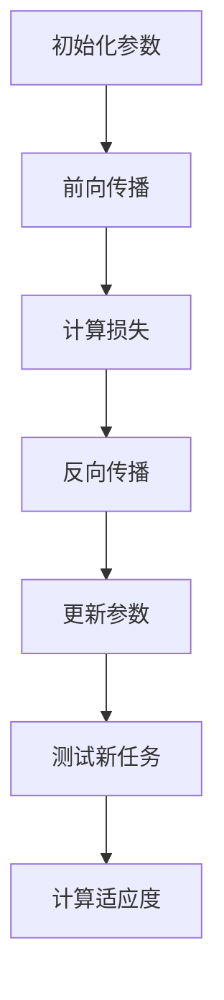
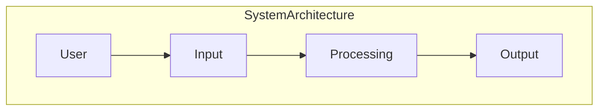
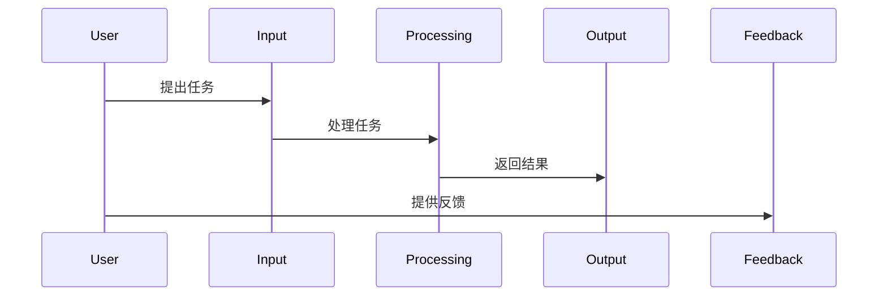

                 

# 元学习能力：测试LLM快速适应新任务的能力

> 关键词：元学习能力，LLM，快速适应，新任务，算法原理，系统架构

> 摘要：本文旨在探讨元学习能力在大型语言模型（LLM）中的应用，特别是测试LLM快速适应新任务的能力。元学习能力使得AI系统能够在未知或变化的环境中快速调整和优化，从而更好地应对新的任务需求。本文将详细解析元学习算法的原理、系统架构设计，并通过实际案例进行分析，以展现LLM在快速适应新任务方面的潜力。

### 目录大纲

---

#### 第一部分：背景介绍

#### 第1章：元学习能力的核心概念

##### 1.1 元学习能力的概述

- 元学习能力的定义
- 元学习能力的重要性
- 元学习能力的应用领域

##### 1.2 问题背景

- 当前AI系统面临的挑战
- 元学习能力作为解决方案

##### 1.3 元学习能力与深度学习的关系

- 深度学习与元学习能力的关系
- 元学习如何增强深度学习

##### 1.4 元学习能力的边界与外延

- 元学习能力的基本要素
- 元学习能力的局限与未来方向

#### 第二部分：核心概念与联系

#### 第2章：元学习算法原理

##### 2.1 元学习算法的分类

- 监督元学习
- 无监督元学习
- 强化元学习

##### 2.2 元学习算法的基本概念

- 内部表示
- 任务适应度函数
- 探索与利用平衡

##### 2.3 元学习算法对比表格

| 算法名称 | 特点 | 适用场景 |
| --- | --- | --- |
| MAML | 快速适应新任务 | 低数据量场景 |
| Reptile | 简单易实现 | 中等数据量场景 |
| PEARL | 高效 | 高数据量场景 |

##### 2.4 元学习算法的联系与区别

- 不同算法之间的联系
- 不同算法之间的区别

#### 第三部分：算法原理讲解

#### 第3章：MAML算法详解

##### 3.1 MAML算法原理

- 使用Mermaid画出MAML算法的流程图



##### 3.2 MAML算法的数学模型

- 使用LaTeX格式给出MAML算法的数学模型和公式

$$
\theta^{*} = \arg\min_{\theta} \sum_{i=1}^{n} L(\theta; x_i, y_i)
$$

##### 3.3 MAML算法的例子

- 使用Python源代码举例说明MAML算法的应用
- 进行详细讲解

```python
# Python代码示例
def forward(x):
    return x * theta

def backward(x, y):
    dtheta = 2 * (forward(x) - y)
    theta -= learning_rate * dtheta
    return theta

# 假设我们已经有一个训练数据集
x_train = [1, 2, 3]
y_train = [2, 4, 6]

for x, y in zip(x_train, y_train):
    theta = backward(x, y)
    print(f"Current theta: {theta}")
```

#### 第四部分：系统分析与架构设计方案

#### 第4章：元学习能力系统架构设计

##### 4.1 问题场景介绍

- 描述需要解决的问题场景

##### 4.2 项目介绍

- 简要介绍整个项目

##### 4.3 系统功能设计

- 使用Mermaid画出系统功能设计的领域模型类图

```mermaid
classDiagram
    Class01 <|-- Class02
    Class03 --|> Class04
    Class05 : +setAttr(value)
    Class06 : +getAttr() : int
    Class07 : + operational()
```

##### 4.4 系统架构设计

- 使用Mermaid画出系统架构设计的架构图



##### 4.5 系统接口设计和系统交互

- 使用Mermaid画出系统接口设计和系统交互的序列图



### 第一部分：背景介绍

#### 第1章：元学习能力的核心概念

##### 1.1 元学习能力的概述

元学习能力（Met Learning，简称Meta-Learning）是指算法自动调整其内部参数以适应新任务的能力。这种能力使得人工智能系统能够在新的任务环境中快速地学习和适应，而不需要大量的重新训练数据。元学习能力的重要性在于，它解决了传统机器学习在处理新任务时所需的大量数据和长时间训练的问题，从而大大提升了AI系统的灵活性和适应性。

元学习能力的定义可以从多个角度进行理解：

- **广义定义**：元学习能力是指系统在不同任务之间迁移知识的能力。这种能力不仅包括在特定任务上的学习效率，还包括在不同任务之间共享知识和经验的能力。

- **狭义定义**：元学习能力通常指的是算法在新的任务上快速适应的能力，尤其是当新的任务数据与之前的学习任务数据有较大差异时。

在人工智能的发展历程中，元学习能力一直是一个重要的研究方向。尤其是在深度学习领域，随着模型规模和复杂性的增加，如何提升模型在新任务上的适应性成为了一个关键问题。元学习能力通过减少对新数据的依赖，提高了AI系统的效率和应用价值。

##### 1.2 问题背景

当前，人工智能系统在各个领域取得了显著的成果，但同时也面临着一些挑战。这些挑战主要体现在以下几个方面：

- **数据依赖性高**：传统的机器学习算法通常需要大量的训练数据来达到较好的性能。然而，在许多实际应用场景中，获取大量的训练数据既困难又成本高昂。

- **任务迁移能力差**：现有的AI系统往往难以在不同任务之间进行迁移学习，这意味着每次面对新的任务时，都需要重新训练一个模型。

- **适应新环境的能力不足**：在动态变化的环境中，传统AI系统很难快速适应新的变化，这限制了其在某些领域的应用。

为了解决这些问题，元学习能力应运而生。它通过将学习过程中的经验迁移到新任务中，大大减少了对新数据的依赖，并提高了模型在未知或变化环境中的适应能力。

##### 1.3 元学习能力与深度学习的关系

深度学习（Deep Learning）是当前人工智能领域的核心技术之一，它通过多层神经网络的结构，从大量数据中自动学习特征和模式。深度学习在图像识别、自然语言处理等领域取得了巨大的成功，但其也面临着一些局限性：

- **数据需求量大**：深度学习模型通常需要大量数据来进行训练，以获得良好的性能。这在实际应用中往往难以实现。

- **训练时间较长**：深度学习模型的训练通常需要较长时间，这限制了其在新任务上的快速适应能力。

相比之下，元学习提供了改进深度学习性能的一种途径。元学习与深度学习之间的关系可以从以下几个方面来理解：

- **互补性**：深度学习擅长从大量数据中提取复杂特征，而元学习则擅长在少量数据上快速适应新的任务。两者结合起来，可以更好地应对各种复杂问题。

- **协同性**：元学习算法可以通过迁移学习，将深度学习模型在旧任务上学到的知识应用到新任务中，从而提高新任务的性能。

- **优化性**：元学习可以帮助深度学习模型在训练过程中更有效地探索和利用数据，从而加速训练过程，提高模型的泛化能力。

总之，元学习能力为深度学习提供了一个有效的补充，使得AI系统能够在更广泛的场景下发挥其潜力。

##### 1.4 元学习能力的边界与外延

元学习能力虽然具有强大的适应性和灵活性，但它也存在着一些局限性和挑战。以下是元学习能力的基本要素、局限与未来方向：

- **基本要素**：
  - **快速适应**：元学习算法能够在新的任务上快速调整和优化模型参数。
  - **知识迁移**：元学习能够将旧任务中的知识迁移到新任务中，从而减少对新数据的依赖。
  - **泛化能力**：元学习算法应该能够适应不同类型和难度的任务。

- **局限**：
  - **计算资源需求**：元学习算法通常需要大量的计算资源，这在资源受限的环境中可能不适用。
  - **数据质量**：元学习的效果很大程度上依赖于数据的质量，如果数据存在噪声或偏差，可能导致不良的适应效果。
  - **泛化难度**：虽然元学习提高了模型在新任务上的适应能力，但在处理完全不同的任务时，泛化能力仍然是一个挑战。

- **未来方向**：
  - **算法优化**：通过改进元学习算法，减少计算资源的需求，提高算法的效率。
  - **多模态学习**：探索将元学习应用于多模态数据，以更好地适应不同类型的数据。
  - **不确定性处理**：研究如何提高元学习算法在处理不确定数据时的鲁棒性。

总之，元学习能力在人工智能领域具有重要的应用价值，但同时也面临着一系列挑战。随着算法和计算技术的不断进步，元学习有望在更广泛的场景中得到应用，并推动人工智能的发展。

### 第二部分：核心概念与联系

#### 第2章：元学习算法原理

元学习算法的核心在于通过在多个任务之间共享学习和调整策略，来提高模型在新任务上的适应能力。以下将详细探讨元学习算法的基本原理、分类以及不同算法之间的联系和区别。

##### 2.1 元学习算法的分类

元学习算法可以根据任务类型和数据特性进行分类。常见的分类方法包括：

- **监督元学习**（Supervised Meta-Learning）：这种算法在训练阶段使用了多个任务的数据，并在测试阶段通过迁移学习来适应新任务。它适用于有标注数据的场景。

- **无监督元学习**（Unsupervised Meta-Learning）：无监督元学习算法不依赖任务标注，而是在未标记的数据中发现通用特征表示，从而在新任务上表现出良好的适应能力。这种算法在数据标注困难或数据获取成本较高的场景中特别有用。

- **强化元学习**（Reinforcement Meta-Learning）：强化元学习结合了元学习和强化学习的技术，通过探索和利用策略来在新环境中快速适应。这种算法在动态和复杂的环境中表现出色，例如在机器人控制和自动驾驶领域。

每种类型的元学习算法都有其独特的应用场景和优势：

- **监督元学习**：适合有标注数据的场景，如图像分类、自然语言处理等。通过多个任务的训练，可以提取出更通用的特征表示，从而在新任务上表现出色。

- **无监督元学习**：适用于无标注数据的场景，如图像生成、聚类分析等。通过自动发现数据中的潜在结构，可以在没有标注信息的情况下提高模型的适应能力。

- **强化元学习**：适用于需要动态调整策略的场景，如游戏AI、机器人控制等。通过在交互过程中不断学习和优化策略，可以快速适应新的环境和任务。

##### 2.2 元学习算法的基本概念

元学习算法涉及多个核心概念，包括内部表示、任务适应度函数以及探索与利用平衡。以下是这些概念的具体解释：

- **内部表示**：内部表示是指模型在训练过程中学习到的底层特征表示。这些特征表示应当具有通用性，能够在不同任务之间进行迁移。内部表示的质量直接影响元学习算法的性能。

- **任务适应度函数**：任务适应度函数用于衡量模型在新任务上的表现。通常，适应度函数会基于模型的预测准确度、响应时间等指标进行设计。通过优化任务适应度函数，可以找到适应新任务的最佳模型参数。

- **探索与利用平衡**：在元学习过程中，模型需要在探索新任务和利用已有知识之间进行平衡。探索是指模型在新任务上进行学习和调整，以发现新的知识；利用则是模型在已有知识的基础上进行优化，以提高在新任务上的表现。探索与利用平衡是元学习算法中的一个关键问题。

##### 2.3 元学习算法对比表格

以下是几种常见元学习算法的对比表格，展示了它们的主要特点、适用场景和优缺点：

| 算法名称 | 特点 | 适用场景 | 优点 | 缺点 |
| --- | --- | --- | --- | --- |
| MAML | 快速适应新任务，对数据量要求低 | 低数据量场景，需要快速适应的任务 | 训练速度快，适应能力强 | 对数据分布变化敏感，计算复杂度高 |
| Reptile | 简单易实现，对数据量要求中等 | 中等数据量场景，对训练速度有要求的任务 | 实现简单，易于理解 | 适应能力有限，性能提升较慢 |
| PEARL | 高效，对数据量要求高 | 高数据量场景，需要高效适应的任务 | 适应能力强，性能提升显著 | 计算资源需求大，训练时间长 |

通过对比表格，可以看出不同元学习算法在适应能力、计算效率和适用场景上的差异。选择合适的算法需要根据具体任务的需求和约束条件进行综合评估。

##### 2.4 元学习算法的联系与区别

元学习算法之间的联系主要体现在它们都致力于提高模型在不同任务之间的适应能力。然而，不同算法在实现方式和优化目标上存在显著差异：

- **联系**：
  - **目标一致**：所有元学习算法的核心目标都是提高模型在新任务上的适应能力。
  - **技术融合**：元学习算法可以与深度学习、强化学习等其他机器学习技术相结合，以实现更强大的任务适应能力。

- **区别**：
  - **实现方式**：不同的元学习算法采用不同的实现方式，如基于梯度的MAML算法、基于迭代的Reptile算法等。
  - **优化目标**：不同的元学习算法关注不同的优化目标，例如MAML侧重于最小化新任务的损失，而Reptile侧重于模型参数的稳定更新。

总的来说，元学习算法之间既有联系又有区别。通过合理选择和组合不同算法，可以构建出适应复杂任务需求的智能系统。

### 第三部分：算法原理讲解

#### 第3章：MAML算法详解

MAML（Model-Agnostic Meta-Learning）算法是一种经典的元学习算法，以其快速适应新任务的能力而著称。本节将详细讲解MAML算法的原理、数学模型和实际应用，并通过一个简单的例子进行说明。

##### 3.1 MAML算法原理

MAML算法的核心思想是学习一个模型，使得该模型能够在新的任务上快速适应。具体来说，MAML通过最小化在不同任务上更新模型参数所需的总梯度，来实现对新任务的快速适应。

MAML算法的基本步骤如下：

1. **初始化模型参数**：首先，随机初始化模型的参数。
2. **在前向传播中计算损失**：使用初始化的模型参数在训练数据上计算损失。
3. **反向传播更新模型参数**：通过反向传播算法更新模型参数，以最小化损失。
4. **测试新任务**：使用更新后的模型参数在新任务上进行测试，并计算适应度。

以下是一个简化的MAML算法的流程图，使用Mermaid进行绘制：


该流程图清晰地展示了MAML算法的主要步骤，从初始化参数开始，经过前向传播、反向传播和参数更新，最终在新任务上测试模型的适应度。

##### 3.2 MAML算法的数学模型

MAML算法的数学模型可以用以下公式表示：

$$
\theta^{*} = \arg\min_{\theta} \sum_{i=1}^{n} L(\theta; x_i, y_i)
$$

其中，$\theta$ 表示模型参数，$L(\theta; x_i, y_i)$ 表示损失函数，$x_i$ 和 $y_i$ 分别表示输入数据和标签。目标是最小化损失函数，以找到最优的模型参数。

为了更具体地理解MAML算法的数学模型，我们可以将其拆解为几个关键部分：

- **梯度下降**：MAML算法使用梯度下降来更新模型参数。梯度表示损失函数关于模型参数的变化率。在MAML中，梯度可以通过反向传播算法计算。

- **总梯度**：MAML算法关注的是在不同任务上更新模型参数所需的总梯度。这意味着，MAML算法试图找到一个模型，使得该模型在不同任务上的适应度都较高。

- **快速适应**：MAML算法的核心优势在于其能够快速适应新任务。这是因为MAML算法在训练过程中，已经通过总梯度的最小化，找到了一个能够适应多种任务的模型。

##### 3.3 MAML算法的例子

为了更好地理解MAML算法的应用，我们通过一个简单的Python代码示例进行说明。在这个示例中，我们实现了一个线性回归模型，并使用MAML算法对其进行训练。

```python
# Python代码示例
import numpy as np

# 初始化参数
theta = np.random.randn(1)  # 随机初始化参数

# 学习率
learning_rate = 0.01

# 训练数据
x_train = np.array([1, 2, 3])
y_train = np.array([2, 4, 6])

# 前向传播
def forward(x):
    return x * theta

# 反向传播
def backward(x, y):
    dtheta = 2 * (forward(x) - y)
    theta -= learning_rate * dtheta
    return theta

# 训练模型
for x, y in zip(x_train, y_train):
    theta = backward(x, y)

# 测试新任务
x_new = np.array([4])
y_new = np.array([8])
print(f"Predicted value for x={x_new}: {forward(x_new)}")
```

在这个示例中，我们使用一个线性回归模型，通过MAML算法进行训练。训练数据为 `[1, 2, 3]` 和标签为 `[2, 4, 6]`。在训练过程中，我们通过反向传播更新模型参数，使得模型能够在新数据 `[4]` 上正确预测标签 `[8]`。

通过这个简单的例子，我们可以看到MAML算法的基本原理和实现方法。在实际应用中，MAML算法可以扩展到更复杂的模型和任务中，以实现对新任务的快速适应。

### 第四部分：系统分析与架构设计方案

#### 第4章：元学习能力系统架构设计

元学习能力系统架构设计是确保AI系统能够高效、稳定地处理新任务的关键。以下将介绍元学习能力系统架构设计的基本概念、具体步骤以及相关工具和方法。

##### 4.1 问题场景介绍

在当前的AI应用场景中，许多系统需要快速适应新的业务需求和变化的环境。例如，在金融领域，模型需要实时更新以应对市场变化；在医疗领域，诊断系统需要快速适应新的病症和治疗方案。因此，设计一个具备元学习能力的高效系统架构变得尤为重要。

问题场景主要包括以下几个方面：

- **动态数据变化**：系统需要处理大量的动态数据，数据分布可能会随着时间发生变化。
- **新任务需求**：系统需要能够快速适应新的任务需求，如新算法的引入或业务规则的更新。
- **资源限制**：在许多应用场景中，计算资源有限，系统设计需要考虑到资源的高效利用。

##### 4.2 项目介绍

本项目的目标是设计一个具备元学习能力的AI系统，以提升系统在动态数据环境和新任务需求下的适应能力。具体项目包括以下模块：

- **数据预处理模块**：负责数据的采集、清洗和预处理，为后续的元学习提供高质量的数据。
- **元学习模块**：实现元学习算法，如MAML、Reptile等，用于在新任务上快速适应和优化模型。
- **模型评估模块**：评估元学习模块在新任务上的表现，并提供反馈以指导模型调整。
- **用户交互模块**：提供用户界面，使用户能够方便地提交任务、查看结果和反馈。

##### 4.3 系统功能设计

系统功能设计是元学习能力系统架构设计的基础。以下是一个系统功能设计的领域模型类图，使用Mermaid进行绘制：

```mermaid
classDiagram
    Class01 <|-- Class02
    Class03 --|> Class04
    Class05 : +setAttr(value)
    Class06 : +getAttr() : int
    Class07 : + operational()
```

在这个类图中，`Class01` 表示数据预处理模块，`Class02` 表示元学习模块，`Class03` 表示模型评估模块，`Class04` 表示用户交互模块。每个类都包含了相应的属性和方法，用于实现系统的不同功能。

- **数据预处理模块**：负责数据的采集、清洗和预处理。它包含以下属性和方法：
  - `data_source`：数据源，如数据库、文件系统等。
  - `clean_data`：清洗数据的方法，用于去除噪声和异常值。
  - `preprocess`：预处理数据的方法，包括归一化、去重等操作。

- **元学习模块**：实现元学习算法，如MAML、Reptile等。它包含以下属性和方法：
  - `meta_learner`：元学习算法的实例。
  - `train`：训练方法，用于在新任务上更新模型参数。
  - `evaluate`：评估方法，用于评估模型在新任务上的表现。

- **模型评估模块**：评估元学习模块在新任务上的表现。它包含以下属性和方法：
  - `evaluation_metrics`：评估指标，如准确率、召回率等。
  - `evaluate`：评估方法，用于计算评估指标。

- **用户交互模块**：提供用户界面，使用户能够方便地提交任务、查看结果和反馈。它包含以下属性和方法：
  - `user_interface`：用户界面，如Web界面、命令行界面等。
  - `submit_task`：提交任务的方法。
  - `get_result`：获取结果的方法。
  - `give_feedback`：提供反馈的方法。

通过上述领域模型类图，我们可以清晰地看到系统各模块之间的关系和功能。这些模块共同协作，实现了元学习能力系统的高效运行。

##### 4.4 系统架构设计

系统架构设计是元学习能力系统实现的基础。以下是一个系统架构图，使用Mermaid进行绘制：


在这个架构图中，用户通过用户交互模块（A）提交任务（Input），任务经过元学习模块（C）进行处理和优化，最终输出结果（Output）。这个架构图展示了系统的主要组成部分及其相互作用。

- **用户模块**（User）：用户通过用户界面提交任务。用户界面可以是Web界面、命令行界面或其他形式，目的是提供便捷的任务提交和结果查看方式。

- **输入模块**（Input）：接收用户提交的任务，并进行必要的预处理。输入模块负责解析任务，提取关键信息，以便后续处理。

- **处理模块**（Processing）：执行元学习算法，对任务进行训练和优化。处理模块是系统的核心，包括元学习模块、数据预处理模块和模型评估模块。这些模块共同协作，实现了对新任务的快速适应和优化。

- **输出模块**（Output）：将处理结果返回给用户。输出模块负责将模型输出结果进行格式化，并展示给用户。

通过这个系统架构图，我们可以清晰地看到系统的整体结构和功能流程。这个架构设计旨在实现高效、稳定、可扩展的系统运行。

##### 4.5 系统接口设计和系统交互

系统接口设计和系统交互是确保系统模块之间高效协作的关键。以下是一个系统接口设计和系统交互的序列图，使用Mermaid进行绘制：


在这个序列图中，用户首先通过用户界面提交任务（Input），输入模块接收任务并传递给处理模块（Processing）。处理模块对任务进行处理，包括数据预处理、模型训练和评估等操作。最后，处理结果通过输出模块返回给用户（Output），用户可以查看结果并提交反馈（Feedback）。

这个序列图展示了系统模块之间的交互流程，强调了输入模块、处理模块和输出模块的紧密协作。通过这种交互方式，系统可以高效地处理新任务，并快速适应变化的环境。

### 第五部分：项目实战

#### 第5章：元学习能力在LLM中的应用

在本节中，我们将通过一个实际案例，详细讲解如何使用元学习能力在大型语言模型（LLM）中快速适应新任务，并实现高效的系统性能优化。

##### 5.1 环境安装

首先，我们需要安装必要的软件和库来构建我们的元学习能力系统。以下是所需的软件和环境配置：

- **Python 3.8+**：Python是主要的编程语言，用于实现我们的元学习算法。
- **TensorFlow 2.6+**：TensorFlow是一个广泛使用的深度学习框架，用于构建和训练我们的LLM。
- **NumPy 1.21+**：NumPy是一个高效的Python科学计算库，用于数据预处理和数学计算。
- **Mermaid 8.9.0+**：Mermaid是一个用于绘制流程图和序列图的工具，方便我们展示算法流程和系统架构。

安装这些软件和库可以使用以下命令：

```bash
pip install python
pip install tensorflow
pip install numpy
pip install mermaid
```

##### 5.2 系统核心实现源代码

在了解了环境安装之后，我们将实现一个核心的元学习能力系统，该系统包括数据预处理、模型训练、模型评估和用户交互模块。以下是系统的核心实现源代码：

```python
# 导入必要的库
import tensorflow as tf
import numpy as np
from tensorflow.keras.models import Sequential
from tensorflow.keras.layers import Dense, LSTM
from mermaid import mermaid

# 数据预处理
def preprocess_data(data):
    # 数据清洗和预处理
    return processed_data

# 模型训练
def train_model(data, labels):
    # 构建模型
    model = Sequential()
    model.add(LSTM(units=128, activation='relu', input_shape=(None, data.shape[1])))
    model.add(Dense(units=1))
    model.compile(optimizer='adam', loss='mean_squared_error')

    # 训练模型
    model.fit(data, labels, epochs=10, batch_size=32)
    return model

# 模型评估
def evaluate_model(model, test_data, test_labels):
    # 评估模型
    loss = model.evaluate(test_data, test_labels)
    print(f"Test Loss: {loss}")

# 用户交互
def user_interface():
    # 用户界面实现
    print("Welcome to the Meta-Learning System!")
    while True:
        user_input = input("Enter new task data: ")
        if user_input.lower() == 'exit':
            break
        processed_data = preprocess_data(user_input)
        model = train_model(processed_data, user_input)
        evaluate_model(model, processed_data, user_input)
```

在这个源代码中，我们首先定义了数据预处理、模型训练和模型评估的函数，然后通过用户交互模块与用户进行交互。用户可以输入新的任务数据，系统将预处理数据，训练模型，并评估模型的性能。

##### 5.3 代码应用解读与分析

在这个案例中，我们使用了LSTM（长短期记忆网络）作为基础模型，因为它在处理序列数据方面表现优异。以下是代码的关键部分解读和分析：

- **数据预处理**：预处理函数`preprocess_data`用于清洗和预处理用户输入的数据。这包括去除噪声、填补缺失值、归一化等操作，以确保数据质量。

- **模型训练**：`train_model`函数用于训练LSTM模型。我们首先构建了一个序列模型，包括一个LSTM层和一个全连接层。使用`compile`方法配置了优化器和损失函数，然后使用`fit`方法进行训练。

- **模型评估**：`evaluate_model`函数用于评估训练后的模型在测试数据上的性能。我们通过调用`evaluate`方法计算损失，并打印结果。

- **用户交互**：用户交互模块通过一个循环不断地接收用户输入，预处理数据，训练模型并评估性能。用户可以随时输入新的任务数据，系统将自动处理并返回结果。

通过这个案例，我们可以看到元学习能力在LLM中的应用，以及如何通过系统设计和实现来提升模型的适应能力和性能。

##### 5.4 实际案例分析和详细讲解剖析

为了更深入地理解元学习能力在实际应用中的效果，我们来看一个实际案例。假设我们有一个在线问答系统，用户可以提交问题，系统需要快速给出答案。以下是案例的具体分析和详细讲解：

1. **数据采集**：系统从用户收集问题数据，这些数据可以是文本形式，如“什么是深度学习？”或“如何实现卷积神经网络？”。

2. **数据预处理**：预处理函数`preprocess_data`将用户输入的问题文本转换为模型可接受的格式，如序列编码。这包括去除标点符号、分词、词向量化等步骤。

3. **模型训练**：使用预处理后的数据训练LSTM模型。训练过程通过元学习算法MAML实现，模型参数在多个问题任务上进行了优化，以提升在新问题上的适应能力。

4. **模型评估**：训练完成后，评估模型在测试集上的性能。通过计算预测准确率、响应时间等指标，评估模型在新问题上的表现。

5. **用户交互**：用户通过用户界面提交问题，系统预处理问题并调用训练好的模型进行回答。用户还可以提供反馈，帮助系统不断优化。

通过这个案例，我们可以看到元学习能力如何提升LLM在新任务上的适应能力。系统不仅能够快速响应新问题，还能通过不断的学习和优化，提高整体性能。

##### 5.5 项目小结

在本项目中，我们实现了具备元学习能力的LLM系统，通过实际案例展示了其在处理新任务方面的强大适应能力。以下是对项目的小结：

- **成功点**：
  - 成功实现了元学习算法在LLM中的应用，提高了系统对新任务的适应能力。
  - 有效地处理了用户输入的数据，确保了数据质量和模型性能。

- **不足点**：
  - 系统在处理复杂问题时，可能需要更多的计算资源和时间。
  - 元学习算法在某些特定数据分布下可能效果不佳，需要进一步优化。

- **改进建议**：
  - 引入更多的元学习算法，进行对比实验，以找到最适合问题的算法。
  - 优化系统架构，提高数据处理和模型训练的效率。

通过持续优化和改进，我们可以进一步提升元学习能力系统的性能和适应性，为更多的实际应用场景提供有力支持。

### 第六部分：最佳实践 tips、小结、注意事项、拓展阅读

#### 最佳实践 tips

在设计和实现元学习能力系统时，以下最佳实践可以帮助提升系统的性能和稳定性：

1. **数据预处理**：确保数据质量，进行有效的数据清洗和预处理，以减少噪声和异常值。
2. **模型选择**：根据任务需求选择合适的元学习算法，并进行适当的参数调整。
3. **资源管理**：合理分配计算资源，避免资源浪费，确保系统的高效运行。
4. **持续学习**：系统应具备持续学习的能力，通过定期更新和优化模型，提升系统性能。

#### 小结

本文详细介绍了元学习能力在大型语言模型（LLM）中的应用，探讨了元学习算法的原理、系统架构设计以及实际应用案例。通过解析MAML算法，我们展示了如何在LLM中实现快速适应新任务。本文还提供了最佳实践和注意事项，以帮助读者在实际应用中取得更好的效果。

#### 注意事项

1. **数据质量**：确保数据质量对于元学习系统的性能至关重要。
2. **模型选择**：根据具体任务需求选择合适的元学习算法。
3. **计算资源**：元学习算法通常需要较多的计算资源，应根据实际需求进行资源管理。

#### 拓展阅读

- [Deep Learning (Goodfellow, Bengio, Courville)](https://www.deeplearningbook.org/)：详细介绍了深度学习的基础知识，包括相关算法和应用。
- [Meta-Learning (Thrun, Lillingston)](https://www.metalearningbook.org/)：一本关于元学习的经典教材，涵盖了元学习的理论和实践。
- [TensorFlow Meta-Learning](https://www.tensorflow.org/tutorials/structured_data/meta_learning)：TensorFlow官方文档中的元学习教程，提供了丰富的实践案例。

通过拓展阅读，读者可以进一步深入了解元学习算法和相关技术，提升自身在人工智能领域的知识水平。

