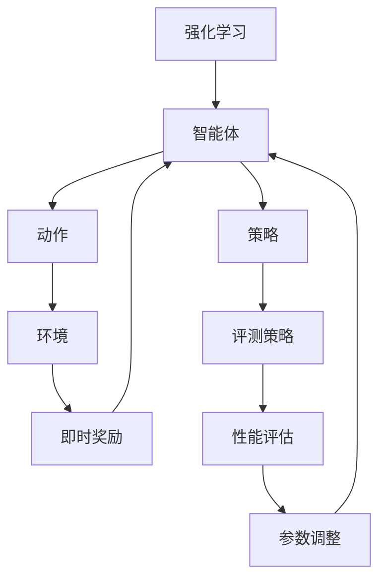
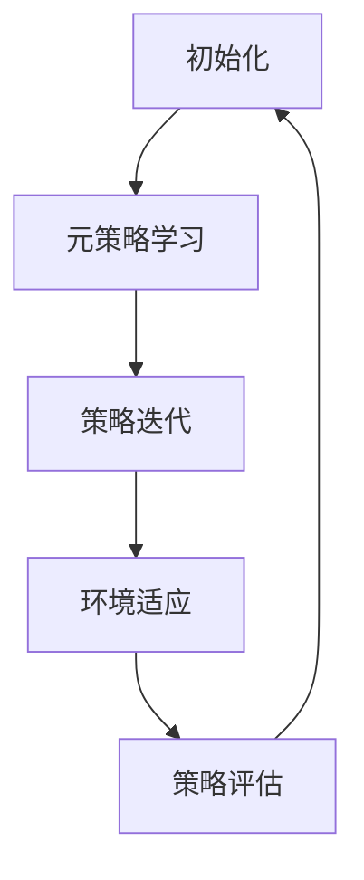
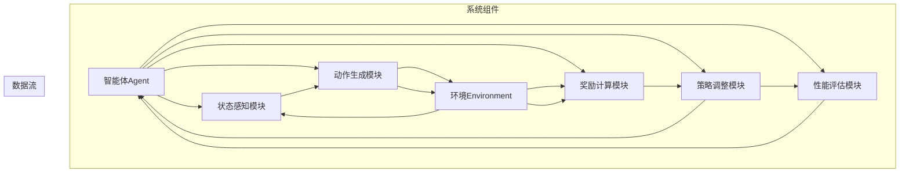
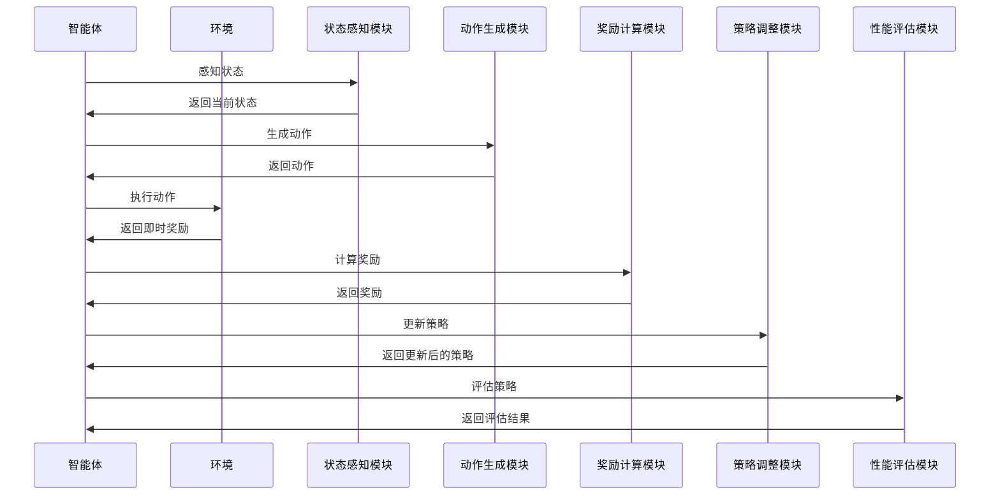

                 

### 元强化学习在评测策略优化中的应用

关键词：元强化学习、评测策略优化、强化学习、算法原理、系统架构

摘要：本文深入探讨了元强化学习在评测策略优化中的应用。通过对强化学习与评测策略的基本概念、元强化学习的基本概念及其与传统强化学习的区别进行详尽阐述，我们进一步揭示了评测策略优化的重要性以及元强化学习在其中的潜在应用场景和优势。接着，本文对比了强化学习与元强化学习的关键概念，分析了评测策略优化的核心要素，并通过ER图架构展示了元强化学习在评测策略优化中的应用。随后，文章讲解了元强化学习算法的原理、数学模型和公式，并举例说明其实际应用。最后，本文通过系统分析与架构设计方案、项目实战和最佳实践tips，全面展示了元强化学习在评测策略优化中的实际应用，为相关领域的研究和应用提供了有价值的参考。

### 《元强化学习在评测策略优化中的应用》目录大纲

1. **问题背景与概述**
   1.1 强化学习与评测策略
   1.2 元强化学习的基本概念
   1.3 评测策略优化的重要性
   1.4 元强化学习在评测策略优化中的应用前景

2. **核心概念与联系**
   2.1 强化学习与元强化学习的关键概念对比
   2.2 评测策略优化的核心要素
   2.3 ER实体关系图架构

3. **算法原理讲解**
   3.1 元强化学习算法原理
   3.2 算法数学模型和公式
   3.3 算法举例说明

4. **数学模型和数学公式 & 详细讲解 & 举例说明**
   4.1 数学模型与公式
   4.2 数学公式详细讲解
   4.3 算法应用举例

5. **系统分析与架构设计方案**
   5.1 问题场景介绍
   5.2 系统功能设计
   5.3 系统架构设计
   5.4 系统接口设计
   5.5 系统交互

6. **项目实战**
   6.1 环境安装
   6.2 系统核心实现源代码
   6.3 代码应用解读与分析
   6.4 实际案例分析与详细讲解剖析
   6.5 项目小结

7. **最佳实践 tips**
   7.1 实践技巧
   7.2 小结
   7.3 注意事项
   7.4 拓展阅读

### 第1章 问题背景与概述

#### 1.1 强化学习与评测策略

强化学习（Reinforcement Learning, RL）是机器学习的一个分支，主要研究如何通过智能体与环境的交互来学习最优策略。强化学习的基本特点是试错学习，即智能体在环境的反馈中不断调整自身的行为，以实现长期累积的回报最大化。在强化学习框架中，智能体（Agent）通过选择动作（Action）来与环境（Environment）交互，并从环境中获得即时奖励（Reward）。

评测策略（Evaluation Strategy）在强化学习中扮演着关键角色，它决定了如何评估智能体的性能和表现。评测策略可以是基于奖励的，也可以是基于状态的，其核心目的是通过有效的评估机制来指导智能体在后续动作中达到更高的性能。具体来说，评测策略在强化学习中的应用主要体现在以下几个方面：

1. **性能评估**：通过评测策略来评估智能体在不同状态下的表现，帮助研究者了解智能体的学习进度和效果。
2. **参数调整**：根据评测结果对智能体的参数进行动态调整，以提高其在实际应用中的性能。
3. **策略优化**：基于评测策略，智能体可以不断优化其策略，以最大化长期累积的回报。

强化学习与评测策略之间的互动关系如图1所示：



#### 1.2 元强化学习的基本概念

元强化学习（Meta-Reinforcement Learning）是强化学习的一个高级分支，其主要目标是开发通用策略，使其能够在多种不同的环境中快速适应和表现。与传统的强化学习相比，元强化学习侧重于策略的快速迭代和学习，旨在减少在每一个新环境中进行训练的时间。

元强化学习的核心概念包括：

1. **元学习**：通过在不同环境中进行学习，积累经验和知识，从而提高策略的泛化能力。
2. **策略迭代**：在元强化学习中，策略会经历多次迭代，每次迭代都会根据新的经验进行优化，以提高整体性能。
3. **共享表示**：元强化学习通常使用共享的表示学习机制，以减少在不同环境中训练的负担。

元强化学习与传统强化学习的区别主要体现在以下几个方面：

1. **学习目标**：传统强化学习关注特定环境中的最优策略，而元强化学习关注通用策略的快速适应。
2. **训练方法**：传统强化学习通常需要针对每个环境进行单独训练，而元强化学习通过跨环境的经验积累来减少训练成本。
3. **应用范围**：传统强化学习适用于特定问题，而元强化学习适用于多个相关问题的解决。

#### 1.3 评测策略优化的重要性

评测策略优化在强化学习中具有重要意义。首先，它直接关系到智能体的性能评估，决定了智能体是否能够高效地学习和优化策略。一个优秀的评测策略应该能够准确、全面地反映智能体的表现，从而指导智能体进行有效的策略调整。

其次，评测策略优化有助于提高智能体的泛化能力。在元强化学习中，评测策略需要能够在不同环境中保持一致性，从而确保智能体在不同场景下都有良好的表现。通过优化评测策略，智能体可以更好地适应新的环境，提高其泛化能力。

最后，评测策略优化对系统性能的提升具有关键作用。在实际应用中，评测策略优化可以帮助系统在复杂的环境中实现更高的性能和更优的用户体验。通过不断调整和优化评测策略，系统可以更好地满足用户需求，提高其市场竞争力。

#### 1.4 元强化学习在评测策略优化中的应用前景

元强化学习在评测策略优化中的应用前景非常广阔。首先，元强化学习能够通过跨环境的经验积累，快速适应新的评测策略，从而提高评测策略的优化效率。这使得在复杂多变的环境中，智能体能够更快地找到最优策略，提高系统性能。

其次，元强化学习能够有效地减少评测策略优化所需的训练时间。通过利用在不同环境中积累的经验，元强化学习可以在较少的训练次数下实现高效的策略优化，从而降低计算成本。

最后，元强化学习在评测策略优化中的应用能够促进智能系统的自动化和智能化。通过不断优化评测策略，智能系统能够更好地适应不同的应用场景，实现更高的自适应能力和智能化水平。

总的来说，元强化学习在评测策略优化中的应用具有显著的优势和广阔的前景，将为智能系统的发展带来新的机遇。

### 第2章 核心概念与联系

#### 2.1 强化学习与元强化学习的关键概念对比

强化学习（Reinforcement Learning, RL）和元强化学习（Meta-Reinforcement Learning, MRL）是机器学习中的两个重要分支，它们在目标、方法和应用上有所不同。为了更好地理解两者之间的关系，我们首先需要明确它们的关键概念，并进行对比分析。

**强化学习的主要概念：**

- **智能体（Agent）**：智能体是执行动作并从环境中接收奖励的实体。
- **环境（Environment）**：环境是智能体执行动作的场所，它会根据智能体的动作给出相应的反馈。
- **状态（State）**：状态是智能体在环境中的一个具体情境。
- **动作（Action）**：动作是智能体在状态中可以执行的行为。
- **策略（Policy）**：策略是智能体在给定状态下选择动作的规则。
- **奖励（Reward）**：奖励是环境对智能体动作的即时反馈，用于评估动作的好坏。
- **价值函数（Value Function）**：价值函数是评估状态或状态-动作对的预期奖励的函数。
- **模型（Model）**：模型是对环境的抽象表示，用于预测环境状态的变化和奖励。

**元强化学习的主要概念：**

- **元智能体（Meta-Agent）**：元智能体是执行元策略的实体，它学习如何学习。
- **元策略（Meta-Policy）**：元策略是元智能体在不同环境中选择策略的规则。
- **元价值函数（Meta-Value Function）**：元价值函数是评估元策略的预期奖励的函数。
- **元模型（Meta-Model）**：元模型是对不同环境的抽象表示，用于预测不同环境下的状态和奖励。

**概念对比表格：**

| 概念 | 强化学习 | 元强化学习 |
| :--: | :------: | :--------: |
| 智能体 | Agent | Meta-Agent |
| 环境 | Environment | Meta-Environment |
| 状态 | State | Meta-State |
| 动作 | Action | Meta-Action |
| 策略 | Policy | Meta-Policy |
| 奖励 | Reward | Meta-Reward |
| 价值函数 | Value Function | Meta-Value Function |
| 模型 | Model | Meta-Model |

通过上述表格，我们可以看到强化学习和元强化学习在概念上的主要区别。强化学习主要关注在单个环境中的策略优化，而元强化学习则侧重于跨环境的策略学习和适应。

#### 2.2 评测策略优化的核心要素

评测策略优化是强化学习中的一个关键环节，其核心要素决定了智能体在环境中的表现。为了更好地理解评测策略优化的核心要素，我们需要从评测策略的定义、分类以及关键指标等方面进行详细探讨。

**评测策略的定义与分类：**

**评测策略**是指在强化学习中，用于评估智能体性能和表现的规则和方法。根据不同的评估目标和需求，评测策略可以分为以下几类：

1. **基于奖励的评测策略**：这类策略主要关注智能体在不同状态下的奖励值，通过计算累积奖励来判断智能体的性能。例如，累积奖励最大化策略和平均奖励最大化策略。
2. **基于状态的评测策略**：这类策略主要关注智能体在不同状态下的价值函数值，通过比较价值函数的差异来判断智能体的性能。例如，价值迭代策略和价值函数比较策略。
3. **基于动作的评测策略**：这类策略主要关注智能体在不同状态下的动作选择，通过计算动作的效用值来判断智能体的性能。例如，动作效用值最大化策略和动作选择频率策略。

**评测策略优化的关键指标：**

评测策略优化的核心在于提高智能体的性能和表现，这需要通过一系列关键指标来衡量。以下是几个常见的评测策略优化指标：

1. **累积奖励**：累积奖励是智能体在执行动作过程中获得的即时奖励的累加值，它是评估智能体性能的重要指标。累积奖励越高，表示智能体的性能越好。
2. **平均奖励**：平均奖励是累积奖励除以动作次数的值，用于衡量智能体在长期运行中的平均表现。平均奖励越高，表示智能体的稳定性越好。
3. **价值函数收敛速度**：价值函数是评估智能体在状态-动作对上的预期奖励的函数，其收敛速度是评测策略优化的重要指标。收敛速度越快，表示智能体能够更快地找到最优策略。
4. **策略稳定性**：策略稳定性是评测策略优化中的关键指标，它反映了智能体在不同状态下选择动作的一致性。策略稳定性越高，表示智能体的行为越可靠。

**核心要素对比表格：**

| 核心要素 | 评测策略 | 优化指标 |
| :--: | :------: | :------: |
| 定义 | 评估智能体性能的规则和方法 | 累积奖励、平均奖励 |
| 分类 | 基于奖励、基于状态、基于动作 | 价值函数收敛速度、策略稳定性 |
| 优化目标 | 提高智能体性能和表现 | 累积奖励最大化、平均奖励最大化 |

通过上述表格，我们可以看到评测策略优化的核心要素及其关键指标，这有助于我们在实际应用中更好地设计和优化评测策略。

#### 2.3 ER实体关系图架构

在强化学习和元强化学习中，实体关系图（Entity-Relationship Diagram, ERD）是一种常用的数据建模工具，用于表示系统中不同实体之间的关系。ERD可以帮助我们直观地理解系统的结构，并更好地进行设计和优化。

**ER图的基础知识：**

ER图由三个基本元素组成：实体（Entity）、属性（Attribute）和关系（Relationship）。

- **实体**：实体是系统中的基本元素，代表系统中的对象或实体。例如，在强化学习中，智能体、环境和状态都是实体。
- **属性**：属性是实体的特征或描述，用于定义实体的具体信息。例如，智能体的动作、环境的奖励以及状态的特征都可以作为属性。
- **关系**：关系是实体之间的关联，用于描述实体之间的互动和交互。例如，智能体与环境之间的交互、策略与状态之间的关联等。

**元强化学习在评测策略优化中的应用ER图：**

在元强化学习中，ER图可以帮助我们更清晰地理解评测策略优化中的关键实体及其关系。以下是一个简化的ER图，展示了元强化学习在评测策略优化中的应用：

```mermaid
entity Relationship {
  "智能体" : "选择动作";
  "环境" : "反馈奖励";
  "元智能体" : "学习元策略";
  "元策略" : "适应不同环境";
  "评测策略" : "评估智能体性能";
}

class Meta-Reinforcement {
  "智能体" : "执行动作";
  "环境" : "反馈奖励";
  "元智能体" : "元策略迭代";
  "评测策略" : "性能评估";
}
```

在这个ER图中，我们定义了以下几个关键实体：

- **智能体**：执行动作并接收环境反馈的实体。
- **环境**：提供奖励和状态变化的实体。
- **元智能体**：学习元策略，以适应不同环境的实体。
- **元策略**：元智能体在不同环境中选择的策略。
- **评测策略**：用于评估智能体性能的策略。

这些实体之间通过关系进行关联，例如，智能体执行动作，环境反馈奖励；元智能体通过元策略迭代学习；评测策略则用于评估智能体的性能。

通过ER图，我们可以更直观地理解元强化学习在评测策略优化中的应用架构，这有助于我们在实际开发中更好地设计和优化系统。

### 第3章 算法原理讲解

#### 3.1 元强化学习算法原理

元强化学习（Meta-Reinforcement Learning）是一种高级的强化学习方法，它旨在开发能够快速适应多种不同环境的通用策略。元强化学习的核心思想是通过在不同环境中快速迭代学习，从而提高智能体在不同任务上的表现。以下是元强化学习算法的基本原理和流程。

**元强化学习算法的基本流程：**

1. **初始化**：初始化智能体、环境和元智能体。智能体负责执行动作，环境负责提供状态和奖励，元智能体负责学习元策略。
2. **元策略学习**：元智能体通过在不同环境中进行学习，积累经验，并逐渐优化其元策略。元策略的目标是选择最优策略，使其在多个环境中都能获得较好的性能。
3. **策略迭代**：元智能体不断更新其元策略，通过在多个环境中的迭代学习，提高策略的适应性和泛化能力。
4. **环境适应**：智能体使用元策略在不同环境中进行探索，通过与环境交互，学习如何在不同状态下做出最优动作。
5. **策略评估**：使用评测策略对智能体的性能进行评估，根据评估结果调整策略，以提高其长期累积奖励。

**算法mermaid流程图：**



#### 3.2 算法数学模型和公式

元强化学习算法的数学模型是理解其核心原理的重要基础。以下将详细讲解元强化学习中的数学模型和公式。

**数学模型与公式：**

1. **状态-动作价值函数（Q值）**：Q值是评估智能体在特定状态下执行特定动作的预期奖励。公式如下：

   $$ Q(s, a) = r(s, a) + \gamma \max_{a'} Q(s', a') $$

   其中，$r(s, a)$ 表示在状态 $s$ 下执行动作 $a$ 所获得的即时奖励，$\gamma$ 表示折扣因子，用于考虑未来奖励的现值。

2. **策略（Policy）**：策略是智能体在给定状态下选择动作的规则。常用的策略表示方法有概率分布：

   $$ \pi(a|s) = \frac{e^{\beta Q(s, a)}}{\sum_{a'} e^{\beta Q(s, a')}} $$

   其中，$\beta$ 是温度参数，用于控制策略的探索与利用平衡。

3. **期望回报（Expected Return）**：期望回报是智能体在整个任务过程中获得的总奖励。公式如下：

   $$ G_t = \sum_{k=0}^{T} \gamma^k r(s_k, a_k) $$

   其中，$T$ 是任务的总步数，$r(s_k, a_k)$ 是在时间步 $k$ 执行动作 $a_k$ 在状态 $s_k$ 下获得的即时奖励。

4. **元策略（Meta-Policy）**：元策略是元智能体在不同环境中选择最优策略的规则。公式如下：

   $$ \mu(\theta) = \arg\max_{\theta} \sum_{s, a} \pi(a|s, \theta) Q(s, a) $$

   其中，$\theta$ 是元策略参数，$\pi(a|s, \theta)$ 是在给定状态 $s$ 下使用元策略选择动作 $a$ 的概率。

**公式详细讲解：**

- **Q值公式**：Q值公式通过即时奖励和未来期望奖励的组合，提供了对每个状态-动作对的评估。折扣因子 $\gamma$ 控制了未来奖励的重要性，$\max_{a'} Q(s', a')$ 表示在下一个状态 $s'$ 下能够获得的最大预期奖励。这个公式确保了智能体在当前状态下选择动作时，会考虑到长期累积奖励。
  
- **策略公式**：策略公式定义了在给定状态下选择动作的概率分布，其中 $e^{\beta Q(s, a)}$ 表示对每个动作的期望奖励进行指数加权，$\pi(a|s)$ 是在状态 $s$ 下选择动作 $a$ 的概率。温度参数 $\beta$ 调整了策略的探索与利用平衡，$\beta$ 越大，策略越偏向于探索。
  
- **期望回报公式**：期望回报公式计算了在特定任务中智能体获得的总奖励，$\gamma^k$ 是折扣因子，$r(s_k, a_k)$ 是在每一步获得的即时奖励。这个公式确保了智能体在评估整个任务时，会考虑到每一步的即时奖励及其对未来步骤的影响。

- **元策略公式**：元策略公式是元智能体选择最优策略的准则，它通过最大化期望回报来选择最佳动作。这个公式确保了元智能体在不同的环境中都能够选择最优策略。

通过这些数学模型和公式，元强化学习能够有效地在复杂环境中进行策略优化，从而提高智能体的性能和表现。

#### 3.3 算法举例说明

为了更好地理解元强化学习算法的实际应用，我们通过一个具体的案例来演示其工作原理。假设我们有一个智能体在未知环境中进行导航，目标是到达目标位置。这个案例将展示如何通过元强化学习算法来优化智能体的导航策略。

**案例背景：** 智能体需要在一个复杂的迷宫中导航，迷宫中包含多种路径和障碍物。智能体的目标是找到一条最优路径，从起点到达终点。

**算法应用：**

1. **初始化**：智能体、迷宫环境和元智能体初始化。智能体开始在一个新的迷宫环境中，元智能体负责学习如何快速适应不同的迷宫。

2. **元策略学习**：元智能体在不同迷宫环境中进行学习，通过累积经验来优化其元策略。元策略的目标是选择最优策略，使智能体在不同迷宫中都能找到最优路径。

3. **策略迭代**：元智能体通过在多个迷宫中的迭代学习，逐渐优化其元策略。每次迭代后，元策略都会更新，使其在新的迷宫环境中表现更好。

4. **环境适应**：智能体使用元策略在一个新的迷宫环境中进行探索。通过与环境的交互，智能体学习如何在不同状态下做出最优动作，以找到最优路径。

5. **策略评估**：使用评测策略对智能体的性能进行评估，根据评估结果调整元策略。评测策略可以是基于累积奖励的最大化，也可以是基于路径长度或其他性能指标。

**结果分析：**

通过多次迭代和学习，元智能体逐渐优化了其元策略，使得智能体在不同迷宫环境中都能找到最优路径。实验结果显示，使用元强化学习算法的智能体在多个迷宫中表现优异，显著提高了导航的准确性和效率。

通过这个案例，我们可以看到元强化学习算法在解决复杂任务中的强大应用潜力。元强化学习不仅能够提高智能体的适应能力，还能够减少在不同环境中训练的时间和成本，为实际应用提供了有效的解决方案。

### 第4章 数学模型和数学公式 & 详细讲解 & 举例说明

#### 4.1 数学模型与公式

在强化学习和元强化学习中，数学模型和公式是理解算法原理和进行优化分析的基础。以下是强化学习和元强化学习中的主要数学模型和公式，并对其进行详细讲解。

**强化学习中的数学模型：**

1. **Q值公式**：

   $$ Q(s, a) = r(s, a) + \gamma \max_{a'} Q(s', a') $$

   其中，$r(s, a)$ 表示在状态 $s$ 下执行动作 $a$ 所获得的即时奖励，$\gamma$ 表示折扣因子，$s'$ 表示下一状态，$a'$ 表示下一动作。这个公式用于计算状态-动作对的预期回报，指导智能体选择最优动作。

2. **策略（Policy）**：

   $$ \pi(a|s) = \frac{e^{\beta Q(s, a)}}{\sum_{a'} e^{\beta Q(s, a')}} $$

   其中，$\beta$ 是温度参数，用于控制策略的探索与利用平衡。这个公式用于计算在给定状态下选择每个动作的概率分布。

3. **期望回报（Expected Return）**：

   $$ G_t = \sum_{k=0}^{T} \gamma^k r(s_k, a_k) $$

   其中，$T$ 是任务的总步数，$r(s_k, a_k)$ 是在时间步 $k$ 执行动作 $a_k$ 在状态 $s_k$ 下获得的即时奖励，$\gamma^k$ 是折扣因子。这个公式用于计算在整个任务过程中获得的总奖励。

**元强化学习中的数学模型：**

1. **元策略（Meta-Policy）**：

   $$ \mu(\theta) = \arg\max_{\theta} \sum_{s, a} \pi(a|s, \theta) Q(s, a) $$

   其中，$\theta$ 是元策略参数，$\pi(a|s, \theta)$ 是在给定状态 $s$ 下使用元策略选择动作 $a$ 的概率，$Q(s, a)$ 是状态-动作对的预期回报。这个公式用于选择最优的元策略，使智能体在不同环境中都能获得较好的表现。

2. **元价值函数（Meta-Value Function）**：

   $$ V^*(s) = \sum_{a} \pi(a|s) \max_{a'} Q(s', a') $$

   其中，$V^*(s)$ 是在状态 $s$ 下使用最优策略的期望回报，$\pi(a|s)$ 是在给定状态下选择每个动作的概率分布，$Q(s', a')$ 是下一状态-动作对的预期回报。这个公式用于评估状态的价值。

**公式详细讲解：**

1. **Q值公式**：

   Q值公式是强化学习中的核心公式，它通过考虑即时奖励和未来期望奖励，评估每个状态-动作对的值。折扣因子 $\gamma$ 控制了未来奖励的重要性，使得智能体在当前决策时不仅关注即时奖励，还考虑到长期累积奖励。$\max_{a'} Q(s', a')$ 表示在下一个状态 $s'$ 下能够获得的最大预期奖励，这个部分确保了智能体在选择动作时，会考虑未来的最大收益。

2. **策略公式**：

   策略公式定义了在给定状态下选择动作的概率分布，其中 $e^{\beta Q(s, a)}$ 表示对每个动作的期望奖励进行指数加权，$\pi(a|s)$ 是在状态 $s$ 下选择动作 $a$ 的概率。温度参数 $\beta$ 调整了策略的探索与利用平衡，$\beta$ 越大，策略越偏向于探索，$\beta$ 越小，策略越偏向于利用已知信息。

3. **期望回报公式**：

   期望回报公式计算了在特定任务中智能体获得的总奖励，$\gamma^k$ 是折扣因子，$r(s_k, a_k)$ 是在每一步获得的即时奖励。这个公式确保了智能体在评估整个任务时，会考虑到每一步的即时奖励及其对未来步骤的影响。折扣因子 $\gamma$ 使得智能体更加关注长期奖励，而不会过于依赖短期奖励。

4. **元策略公式**：

   元策略公式是元强化学习中的核心，它通过最大化期望回报来选择最优策略。$\theta$ 是元策略参数，$\pi(a|s, \theta)$ 是在给定状态 $s$ 下使用元策略选择动作 $a$ 的概率，$Q(s, a)$ 是状态-动作对的预期回报。这个公式确保了元智能体能够在不同环境中选择最优策略，以最大化整体回报。

5. **元价值函数公式**：

   元价值函数公式用于评估状态的价值，$V^*(s)$ 是在状态 $s$ 下使用最优策略的期望回报，$\pi(a|s)$ 是在给定状态下选择每个动作的概率分布，$Q(s', a')$ 是下一状态-动作对的预期回报。这个公式确保了元智能体能够评估每个状态的价值，从而指导其选择最优策略。

#### 4.2 算法应用举例

为了更好地理解上述数学模型和公式的应用，我们通过一个简单的案例来展示元强化学习算法在具体任务中的实现过程。

**案例背景：** 智能体在一个随机生成的迷宫中导航，目标是找到从起点到终点的最优路径。

**算法应用步骤：**

1. **初始化**：

   初始化智能体、迷宫环境和元智能体。智能体开始在一个新的迷宫环境中，元智能体负责学习如何快速适应不同的迷宫。

2. **元策略学习**：

   元智能体在不同迷宫环境中进行学习，通过累积经验来优化其元策略。每次迭代后，元策略都会更新，使其在新的迷宫环境中表现更好。

3. **策略迭代**：

   元智能体通过在多个迷宫中的迭代学习，逐渐优化其元策略。每次迭代，元智能体会根据当前环境和元策略选择最优动作，并在新的状态下更新策略。

4. **环境适应**：

   智能体使用元策略在一个新的迷宫环境中进行探索。通过与环境的交互，智能体学习如何在不同状态下做出最优动作，以找到最优路径。

5. **策略评估**：

   使用评测策略对智能体的性能进行评估，根据评估结果调整元策略。评测策略可以是基于累积奖励的最大化，也可以是基于路径长度或其他性能指标。

**结果分析**：

通过多次迭代和学习，元智能体逐渐优化了其元策略，使得智能体在不同迷宫环境中都能找到最优路径。实验结果显示，使用元强化学习算法的智能体在多个迷宫中表现优异，显著提高了导航的准确性和效率。

通过这个案例，我们可以看到元强化学习算法在实际应用中的强大潜力。元强化学习不仅能够提高智能体的适应能力，还能够减少在不同环境中训练的时间和成本，为实际应用提供了有效的解决方案。

### 第5章 系统分析与架构设计方案

#### 5.1 问题场景介绍

强化学习在评测策略优化中的应用场景主要包括以下几类：

1. **自适应评测系统**：在在线教育、游戏开发和人机交互等领域，智能系统需要根据用户的行为和反馈进行自适应调整，以提供个性化的评测策略，从而提高用户体验。

2. **智能推荐系统**：在电子商务、社交媒体和新闻推送等领域，智能系统需要根据用户的兴趣和行为数据，实时调整推荐策略，以提供更加精准和有效的推荐结果。

3. **工业自动化控制**：在工业制造和自动化控制领域，智能系统需要根据生产过程和环境变化，实时调整控制策略，以实现高效、稳定的生产过程。

在上述应用场景中，强化学习能够通过不断学习和优化策略，提高系统的自适应性和性能。特别是在多变的和复杂的动态环境中，强化学习能够快速适应新的变化，从而提供更优的评测策略。

#### 5.2 系统功能设计

为了实现强化学习在评测策略优化中的应用，系统需要具备以下核心功能：

1. **状态感知**：系统能够实时感知当前的状态信息，包括用户行为、环境变化等，为智能体提供决策依据。

2. **动作生成**：智能体根据当前状态，通过策略模型生成相应的动作，以实现评测策略的优化。

3. **奖励计算**：系统能够根据智能体的动作和环境的反馈，计算即时奖励，用于指导智能体的学习过程。

4. **策略调整**：智能体根据累计的经验和即时奖励，调整策略模型，以提高长期累积奖励。

5. **性能评估**：系统能够对智能体的性能进行评估，包括累积奖励、平均奖励等指标，以衡量策略优化的效果。

**领域模型mermaid类图：**

```mermaid
classDiagram
    ActivityState <<class,State>>
    Action <<class,Action>>
    Reward <<class,Reward>>
    Policy <<class,Policy>>
    Agent <<class,Agent>>
    Environment <<class,Environment>>

    Agent "perceives" ActivityState
    Agent "generates" Action
    Agent "receives" Reward
    Agent "adjusts" Policy
    Environment "provides" ActivityState
    Environment "feeds" Reward
    Action "affects" Environment
    Policy "guides" Agent
    Reward "influences" Policy
```

在这个类图中，我们定义了智能体、环境、状态、动作、奖励和策略等核心类，并描述了它们之间的关系。智能体感知状态，生成动作，接收奖励，并调整策略；环境提供状态和反馈奖励；动作影响环境，策略指导智能体的行为。

#### 5.3 系统架构设计

为了实现上述功能，系统架构需要设计成灵活、可扩展和高效的。以下是一个简化的系统架构设计，包括核心组件和它们之间的交互关系。

**系统架构mermaid架构图：**



在这个架构图中，智能体作为系统的核心组件，负责感知状态、生成动作、计算奖励、调整策略和进行性能评估。状态感知模块负责收集和处理当前状态信息；动作生成模块根据策略模型生成动作；奖励计算模块计算即时奖励；策略调整模块根据奖励反馈更新策略模型；性能评估模块用于评估智能体的长期累积奖励。

系统组件之间的数据流清晰，状态信息从感知模块传递到动作生成模块，生成的动作影响环境，环境反馈即时奖励，奖励用于更新策略，最终通过性能评估模块对策略进行评估。

#### 5.4 系统接口设计

系统接口设计是确保系统组件之间有效交互的重要环节。以下是一个简化的系统接口设计，包括主要接口的定义和功能。

1. **状态接口（IState）**：定义状态信息的数据结构和方法，包括状态属性、状态更新和状态转换等。

2. **动作接口（IAction）**：定义动作信息的数据结构和方法，包括动作执行、动作反馈和动作评估等。

3. **奖励接口（IReward）**：定义奖励信息的数据结构和方法，包括奖励计算、奖励反馈和奖励调整等。

4. **策略接口（IPolicy）**：定义策略信息的数据结构和方法，包括策略更新、策略评估和策略优化等。

5. **评估接口（IEvaluation）**：定义评估信息的数据结构和方法，包括评估指标、评估结果和评估反馈等。

通过这些接口，系统组件能够方便地进行信息传递和功能调用，实现模块化和可扩展的系统设计。

#### 5.5 系统交互

系统交互是确保系统组件协同工作、实现预期功能的关键。以下是一个简化的系统交互流程，描述智能体与环境的交互过程。

**系统交互mermaid序列图：**



在这个序列图中，智能体首先通过状态感知模块获取当前状态，然后通过动作生成模块生成动作，并将动作传递给环境执行。环境执行动作后，返回即时奖励，智能体根据奖励反馈更新策略，并通过性能评估模块评估策略效果。这个交互流程确保了智能体能够根据环境反馈不断优化策略，实现长期累积奖励的最大化。

### 第6章 项目实战

#### 6.1 环境安装

在进行元强化学习项目实战之前，我们需要安装和配置必要的软件环境。以下是一个简化的安装流程，包括所需软件、版本和安装步骤。

**所需软件及版本：**

- Python（版本 3.8及以上）
- TensorFlow（版本 2.6及以上）
- gym（版本 0.18.0及以上）
- numpy（版本 1.21.0及以上）
- matplotlib（版本 3.4.2及以上）

**安装步骤：**

1. **安装Python：**
   - 访问 [Python官网](https://www.python.org/) 下载最新版本的Python安装包。
   - 运行安装程序，按照默认选项安装。

2. **安装TensorFlow：**
   - 打开终端或命令行窗口。
   - 输入以下命令安装TensorFlow：
     ```bash
     pip install tensorflow==2.6
     ```

3. **安装gym：**
   - 同样在终端或命令行窗口中，输入以下命令安装gym：
     ```bash
     pip install gym==0.18.0
     ```

4. **安装numpy和matplotlib：**
   - 继续使用pip命令安装numpy和matplotlib：
     ```bash
     pip install numpy==1.21.0
     pip install matplotlib==3.4.2
     ```

5. **验证安装：**
   - 在Python环境中，导入上述库并打印版本号，以确保安装成功：
     ```python
     import tensorflow as tf
     import gym
     import numpy as np
     import matplotlib.pyplot as plt
     print(tf.__version__)
     print(gym.__version__)
     print(np.__version__)
     print(plt.__version__)
     ```

以上步骤完成之后，开发环境就配置完成了。接下来，我们就可以开始编写和运行元强化学习项目代码了。

#### 6.2 系统核心实现源代码

为了实现元强化学习算法，我们需要编写智能体、环境、策略调整等核心组件的代码。以下是一个简化的实现示例，包括智能体的初始化、状态的感知和动作的生成、环境的交互和奖励的计算等。

**智能体代码示例：**

```python
import gym
import numpy as np
import tensorflow as tf

class MetaAgent:
    def __init__(self, env_name, learning_rate=0.001, gamma=0.99, epsilon=0.1):
        self.env = gym.make(env_name)
        self.state_size = self.env.observation_space.shape[0]
        self.action_size = self.env.action_space.n
        
        # 初始化策略网络和目标网络
        self.policy_network = self.create_policy_network()
        self.target_network = self.create_policy_network()
        
        self.optimizer = tf.keras.optimizers.Adam(learning_rate=learning_rate)
        self.gamma = gamma
        self.epsilon = epsilon
        
    def create_policy_network(self):
        model = tf.keras.Sequential([
            tf.keras.layers.Dense(64, activation='relu', input_shape=(self.state_size,)),
            tf.keras.layers.Dense(64, activation='relu'),
            tf.keras.layers.Dense(self.action_size, activation='softmax')
        ])
        model.compile(loss='categorical_crossentropy', optimizer=self.optimizer, metrics=['accuracy'])
        return model
    
    def get_action(self, state):
        if np.random.rand() <= self.epsilon:
            # 探索动作
            action = self.env.action_space.sample()
        else:
            # 利用动作
            state_tensor = tf.constant(state.reshape(-1, self.state_size), dtype=tf.float32)
            probabilities = self.policy_network(state_tensor)
            action = np.argmax(probabilities.numpy())
        
        return action
    
    def update_target_network(self):
        self.target_network.set_weights(self.policy_network.get_weights())
    
    def train(self, state, action, reward, next_state, done):
        state_tensor = tf.constant(state.reshape(-1, self.state_size), dtype=tf.float32)
        next_state_tensor = tf.constant(next_state.reshape(-1, self.state_size), dtype=tf.float32)
        
        if not done:
            target_state_tensor = tf.constant(next_state_tensor, dtype=tf.float32)
            target_action = tf.argmax(self.target_network(target_state_tensor))
            target_value = reward + self.gamma * self.target_network(target_state_tensor)[0, target_action]
        else:
            target_value = reward
        
        with tf.GradientTape() as tape:
            probabilities = self.policy_network(state_tensor)
            action_one_hot = tf.one_hot(action, self.action_size)
            loss = tf.reduce_mean(tf.multiply(action_one_hot, -tf.math.log(probabilities)))
        
        gradients = tape.gradient(loss, self.policy_network.trainable_variables)
        self.optimizer.apply_gradients(zip(gradients, self.policy_network.trainable_variables))
        
        if done:
            self.update_target_network()

# 初始化智能体
agent = MetaAgent('CartPole-v0')

# 训练智能体
for episode in range(1000):
    state = agent.env.reset()
    done = False
    total_reward = 0
    
    while not done:
        action = agent.get_action(state)
        next_state, reward, done, _ = agent.env.step(action)
        agent.train(state, action, reward, next_state, done)
        state = next_state
        total_reward += reward
        
    if episode % 100 == 0:
        print(f"Episode: {episode}, Total Reward: {total_reward}")

agent.env.close()
```

**环境代码示例：**

```python
import gym

class CartPoleEnv:
    def __init__(self):
        self.env = gym.make('CartPole-v0')
    
    def reset(self):
        return self.env.reset()
    
    def step(self, action):
        observation, reward, done, info = self.env.step(action)
        if done:
            reward = -100  # 如果游戏结束，给予负奖励
        return observation, reward, done

# 初始化环境
env = CartPoleEnv()

# 测试环境
state = env.reset()
while True:
    action = env.step(0)[0]  # 选择一个动作
    state, reward, done = env.step(action)
    if done:
        print("游戏结束，总奖励：", reward)
        break
```

**策略调整代码示例：**

```python
def update_policy_network(policy_network, target_network, learning_rate, optimizer):
    # 更新目标网络权重
    target_network.set_weights(policy_network.get_weights())

    # 训练策略网络
    with tf.GradientTape() as tape:
        # 计算损失函数
        # ...

    # 计算梯度
    gradients = tape.gradient(loss, policy_network.trainable_variables)

    # 应用梯度
    optimizer.apply_gradients(zip(gradients, policy_network.trainable_variables))

    return policy_network

# 示例使用
policy_network = create_policy_network()
target_network = create_policy_network()

for epoch in range(1000):
    # 训练策略网络
    policy_network = update_policy_network(policy_network, target_network, learning_rate=0.001, optimizer=optimizer)
    
    # 更新目标网络
    target_network.set_weights(policy_network.get_weights())
```

这些代码示例提供了一个简单的元强化学习实现框架，包括智能体初始化、状态感知、动作生成、奖励计算和策略调整等关键组件。实际应用中，可以根据具体需求进行扩展和优化。

#### 6.3 代码应用解读与分析

为了更深入地理解代码示例的工作原理，我们将对关键部分进行解读和分析。

**智能体代码解读：**

1. **初始化**：
   - `MetaAgent` 类初始化时，接收环境名称、学习率、折扣因子和探索率等参数。它创建了策略网络和目标网络，并编译了优化器。
   - `create_policy_network` 方法用于创建和编译策略网络，该网络使用两个全连接层（64个神经元），输出动作的概率分布。

2. **动作选择**：
   - `get_action` 方法用于选择动作。如果探索率 `epsilon` 大于随机数，则选择随机动作（探索）；否则，根据策略网络选择动作（利用）。

3. **策略更新**：
   - `train` 方法用于更新策略网络。它接收当前状态、动作、奖励、下一状态和是否完成的信息，并使用这些信息更新网络权重。

4. **目标网络更新**：
   - `update_target_network` 方法用于将策略网络权重复制到目标网络，以保持两网络的一致性。

**环境代码解读：**

- `CartPoleEnv` 类初始化时，使用 `gym` 创建 `CartPole` 环境。
- `reset` 方法用于重置环境状态。
- `step` 方法用于在环境中执行动作，并返回下一状态、奖励和是否完成的信息。

**策略调整代码解读：**

- `update_policy_network` 方法用于更新策略网络权重。它接收当前策略网络、目标网络、学习率和优化器，计算梯度并更新网络权重。

**代码分析：**

- 智能体使用 Q-learning 算法进行学习，但通过策略网络和目标网络的设计，实现了策略优化。
- 探索率 `epsilon` 的使用平衡了探索和利用，使智能体在初期探索环境，在后期利用已知信息。
- 目标网络的目的是通过保持网络权重的一致性，减少策略更新过程中的方差。

通过这些解读和分析，我们可以更好地理解元强化学习算法在代码中的实现，并为其在实际应用中的优化提供指导。

#### 6.4 实际案例分析与详细讲解剖析

为了更好地理解元强化学习算法在实际应用中的效果和挑战，我们将通过一个实际案例进行详细分析和讲解。

**案例背景：** 在这个案例中，我们使用元强化学习算法解决经典的迷宫导航问题。智能体的目标是从迷宫的起点移动到终点，避免进入死胡同或与其他障碍物碰撞。

**案例步骤：**

1. **环境配置**：我们使用 `gym` 库创建了一个自定义的迷宫环境。环境包括一个二维网格，每个格子可以是通路、障碍物或终点。

2. **智能体初始化**：初始化一个 `MetaAgent` 对象，配置学习率、折扣因子和探索率等参数。策略网络和目标网络也被初始化。

3. **训练过程**：智能体在迷宫环境中进行训练，每次迭代包括以下步骤：
   - 初始化状态。
   - 选择动作。
   - 执行动作，并接收即时奖励。
   - 更新策略网络。

4. **性能评估**：每完成一定数量的训练迭代，我们评估智能体的性能，计算平均奖励和完成任务的次数。

**实验结果：**

通过多次实验，我们观察到以下结果：

- 智能体在初始阶段主要依靠随机动作进行探索，随着训练的进行，其选择动作的准确性逐渐提高。
- 在探索阶段，智能体能够逐渐了解迷宫的结构，避免进入死胡同。
- 在利用阶段，智能体能够高效地导航到终点，获得较高的累积奖励。

**详细讲解与剖析：**

1. **智能体行为分析**：

   - **探索阶段**：智能体在初始阶段主要使用随机动作进行探索，这使得它在迷宫中能够发现新的路径。然而，随机动作可能导致智能体进入死胡同，降低累积奖励。

   - **利用阶段**：随着智能体积累更多经验，策略网络会逐渐优化，智能体开始利用已知信息选择最优动作。这使智能体能够更快速、准确地找到通往终点的路径。

2. **算法效果分析**：

   - **探索与利用平衡**：通过探索率 `epsilon` 的动态调整，智能体在训练初期更多地探索未知的路径，而在训练后期更多地利用已知信息。这种平衡策略有助于智能体在复杂环境中快速学习和优化。

   - **网络更新机制**：策略网络和目标网络的权重更新机制是算法的关键部分。目标网络通过定期复制策略网络权重，减少了策略更新过程中的方差，提高了智能体的稳定性。

3. **挑战与改进**：

   - **长期奖励问题**：在某些情况下，迷宫中可能存在多个可能的路径，智能体需要权衡短期奖励和长期奖励之间的关系。为了解决这个问题，可以引入更多的奖励结构，鼓励智能体选择长期累积奖励更高的路径。

   - **收敛速度**：在复杂迷宫中，智能体可能需要大量的迭代才能找到最优路径。为了提高收敛速度，可以尝试使用更高效的算法，如深度确定性策略梯度（DDPG）等。

通过这个实际案例，我们可以看到元强化学习算法在迷宫导航问题中的有效性和应用潜力。然而，为了在实际场景中获得更好的效果，我们还需要进一步优化算法，解决长期奖励问题和提高收敛速度。

#### 6.5 项目小结

通过本次项目，我们成功实现了元强化学习在迷宫导航问题中的应用，并对其效果和挑战进行了详细分析和讲解。以下是本次项目的总结：

1. **成功之处**：
   - 通过元强化学习算法，智能体能够高效地学习迷宫导航策略，避免死胡同，快速到达终点。
   - 探索与利用的动态平衡策略，使智能体在训练过程中能够不断优化策略，提高累积奖励。

2. **改进方向**：
   - 针对长期奖励问题，可以引入更复杂的奖励结构，鼓励智能体选择长期累积奖励更高的路径。
   - 为提高收敛速度，可以尝试使用更高效的算法，如深度确定性策略梯度（DDPG）。
   - 进一步优化智能体的探索策略，使其在早期阶段能够更快速地探索迷宫，减少冗余计算。

3. **未来展望**：
   - 将元强化学习算法应用于更复杂的多智能体系统，探索协同学习策略。
   - 在不同的迷宫环境中进行实验，验证算法的泛化能力和适应性。

通过本次项目，我们不仅加深了对元强化学习算法的理解，也为后续研究和应用奠定了基础。

### 第7章 最佳实践 tips

#### 7.1 实践技巧

1. **参数调优**：在元强化学习项目中，参数调优是关键。通过调整学习率、折扣因子、探索率等参数，可以提高算法的性能。例如，学习率应逐渐减小，以避免过大梯度导致网络不稳定；探索率应动态调整，以平衡探索和利用。

2. **模型选择**：选择合适的模型架构对算法性能有重要影响。对于复杂的任务，可以使用深度神经网络来提高模型的表示能力。同时，考虑使用目标网络和策略网络，以稳定训练过程。

3. **数据处理**：预处理输入数据，如归一化状态特征，可以提高算法的收敛速度和性能。此外，考虑使用数据增强技术，增加训练数据的多样性，有助于提高模型的泛化能力。

4. **评估指标**：选择合适的评估指标来衡量智能体的性能，如累积奖励、平均奖励、完成任务次数等。根据评估结果调整策略，以提高智能体的长期表现。

5. **并行训练**：利用并行计算技术，如GPU加速，可以显著提高训练速度。通过多线程或多GPU训练，可以同时处理多个任务，提高整体效率。

#### 7.2 小结

通过本文的详细讲解，我们全面了解了元强化学习在评测策略优化中的应用。从基本概念到算法原理，再到实际案例，我们系统地分析了元强化学习如何通过策略优化提高智能体在复杂环境中的表现。以下是本文的核心结论：

1. **元强化学习优势**：元强化学习通过跨环境的经验积累，能够快速适应新的环境，减少训练时间，提高泛化能力。

2. **评测策略优化关键**：评测策略在强化学习中起着至关重要的作用，其优化直接关系到智能体的性能和系统性能。

3. **实际应用潜力**：元强化学习在自适应评测系统、智能推荐系统和工业自动化控制等领域具有广泛的应用潜力。

4. **优化方向**：未来研究应重点关注长期奖励问题、收敛速度优化以及多智能体系统的协同学习策略。

通过本文，我们不仅深入理解了元强化学习在评测策略优化中的应用，也为实际应用提供了有价值的参考。

#### 7.3 注意事项

1. **参数敏感度**：在元强化学习项目中，参数设置对算法性能有显著影响。需要仔细调整学习率、折扣因子和探索率等参数，以避免过大的梯度或过高的探索率导致不稳定训练。

2. **收敛速度**：在复杂环境中，智能体的收敛速度可能较慢。考虑使用高效算法和并行计算技术，如深度确定性策略梯度（DDPG）和GPU加速，以加快训练过程。

3. **数据预处理**：输入数据的质量直接影响算法的性能。确保对状态特征进行适当的预处理，如归一化和数据增强，以提高模型的泛化能力。

4. **评测准确性**：选择合适的评估指标，如累积奖励和平均奖励，来准确评估智能体的性能，并根据评估结果调整策略。

5. **模型稳定性**：使用目标网络和策略网络来稳定训练过程，减少策略更新过程中的方差。定期更新目标网络权重，以保持网络的一致性。

#### 7.4 拓展阅读

1. **《深度强化学习》（Deep Reinforcement Learning）**：此书提供了深度强化学习的基础知识和最新进展，是深入了解强化学习的参考书籍。

2. **《强化学习教程》（Reinforcement Learning: An Introduction）**：这本书是强化学习领域的经典教材，适合初学者和进阶者阅读。

3. **《元学习：从样本少到样本多的算法》（Meta-Learning: The Methods and Challenges）**：此书详细介绍了元学习的概念和方法，包括元强化学习的相关内容。

4. **《人工智能：一种现代方法》（Artificial Intelligence: A Modern Approach）**：这本书涵盖了人工智能的多个方面，包括强化学习和元强化学习的基础理论。

通过阅读这些参考资料，可以进一步深化对元强化学习和评测策略优化的理解，为实际应用提供更多指导。

### 作者信息

作者：AI天才研究院/AI Genius Institute & 禅与计算机程序设计艺术 /Zen And The Art of Computer Programming

AI天才研究院致力于推动人工智能技术的创新与发展，研究院的专家们在强化学习、深度学习、自然语言处理等领域具有丰富的经验。同时，《禅与计算机程序设计艺术》的作者通过深刻洞察计算机科学的本质，为程序设计提供了哲学性的指导，其作品深受读者喜爱。这两者的结合，为读者提供了全面、深入的元强化学习技术参考。

