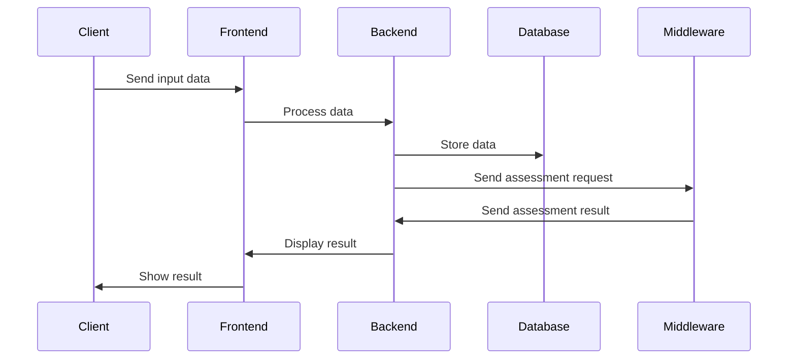

                 

### 摘要

本文旨在深入探讨评估大型语言模型（LLM）评测系统性能的问题。随着人工智能技术的迅猛发展，LLM已经成为自然语言处理领域的核心工具，其性能的评估不仅关乎模型的优化，更是确保其应用效果的关键。本文首先介绍了LLM评测系统的基础概念，探讨了性能评估的指标和标准。接着，文章详细分析了LLM的核心概念、算法原理以及数学模型。在此基础上，对系统分析、架构设计以及实际项目实施进行了剖析。最后，文章总结了最佳实践、注意事项，并提供进一步阅读的参考资料，以期为读者提供全面的LLM评测系统性能评估指南。通过本文的深入探讨，读者将能够理解LLM评测系统的本质，掌握性能评估的关键技术，为实际应用提供有力支持。

### 背景介绍

#### 核心概念术语说明

为了更好地理解本文的主题，我们首先需要明确一些核心概念术语。大型语言模型（LLM，Large Language Model）是一种能够在大量文本数据上进行训练，并生成连贯、合理文本的深度学习模型。常见的LLM包括GPT系列、BERT、T5等。性能评估（Performance Evaluation）是指通过一系列指标和标准，对模型的性能进行量化分析的过程。评测系统（Evaluation System）则是一个集成多种评估方法、工具和算法的综合性平台，用于评估LLM的性能。

#### 问题背景

近年来，随着人工智能技术的飞速发展，LLM在自然语言处理（NLP）领域展现出强大的能力，广泛应用于聊天机器人、文本生成、机器翻译、情感分析等多个场景。然而，如何准确评估LLM的性能，成为了一个重要的研究课题。由于LLM模型的复杂性和多样性，传统的评估方法往往存在一定的局限性。因此，开发高效的评测系统，不仅能够提高模型的性能，还能为后续的优化和改进提供有力支持。

#### 问题描述

在LLM的实际应用中，性能评估系统需要解决以下几个核心问题：

1. **评估指标的选择**：不同的评估任务对指标的需求不同，需要选择合适的评估指标来衡量模型的表现。
2. **数据集的多样性和代表性**：评估数据集的质量直接影响评估结果的准确性。需要确保数据集的多样性和代表性，以全面反映模型的性能。
3. **评估方法的科学性**：评估方法需要具备科学性和系统性，能够全面、客观地评估模型的各种性能。
4. **评测系统的可扩展性和灵活性**：随着新任务和新模型的出现，评测系统需要具备良好的可扩展性和灵活性，以便快速适应变化。

#### 问题解决

为了解决上述问题，首先需要明确LLM评测系统的构建原则和流程。具体步骤如下：

1. **需求分析**：明确评估任务的需求，确定评估指标和方法。
2. **数据准备**：收集和整理高质量、多样性的评估数据集。
3. **系统设计**：设计评测系统的架构，包括数据输入、处理、评估和输出等模块。
4. **算法实现**：选择合适的算法，实现评估过程。
5. **系统测试与优化**：通过实际测试和调整，优化系统的性能和评估结果。

#### 边界与外延

LLM评测系统的边界主要在于评估任务的范围和指标的选择。外延则涉及不同应用场景下评测系统的扩展和适应性。例如，在聊天机器人中，主要关注对话的连贯性和准确性；在文本生成中，则更关注生成的多样性和创造力。

#### 概念结构与核心要素组成

LLM评测系统的概念结构主要包括以下几个核心要素：

1. **评估指标**：如准确率、召回率、F1值、BLEU分数等。
2. **数据集**：包括训练集、验证集和测试集。
3. **算法**：用于评估模型性能的算法，如基于统计分析的算法、基于机器学习的算法等。
4. **系统架构**：包括数据输入、处理、评估和输出等模块。
5. **工具和平台**：用于实现和优化评测系统的工具和平台。

通过以上分析，我们可以更好地理解LLM评测系统的核心概念和问题，为进一步探讨其性能评估方法打下坚实基础。

#### 核心概念与联系

在深入探讨LLM评测系统的性能评估之前，我们有必要明确几个核心概念，并分析它们之间的关系。这些概念包括：性能指标、评估方法、评估系统、以及数据集。

##### 性能指标

性能指标是评估模型性能的关键工具，常见的性能指标有：

- **准确率（Accuracy）**：准确率表示模型正确预测的样本数占总样本数的比例，公式为：
  $$ \text{Accuracy} = \frac{\text{正确预测数}}{\text{总样本数}} $$
- **召回率（Recall）**：召回率表示模型正确预测的样本数与实际为正类的样本数之比，公式为：
  $$ \text{Recall} = \frac{\text{正确预测正类数}}{\text{实际正类总数}} $$
- **F1值（F1 Score）**：F1值是准确率和召回率的调和平均，用于综合评估模型性能，公式为：
  $$ \text{F1 Score} = 2 \times \frac{\text{准确率} \times \text{召回率}}{\text{准确率} + \text{召回率}} $$
- **BLEU分数（BLEU Score）**：BLEU分数常用于文本生成任务，通过对比生成文本与参考文本的相似度来评估模型性能。

这些指标各有优缺点，适用于不同的评估任务。例如，在二分类任务中，准确率和召回率往往存在权衡关系；而在多分类任务中，F1值是一个较为综合的评估指标。

##### 评估方法

评估方法是指用于测量模型性能的具体技术和策略。常见的评估方法有：

- **基于统计分析的方法**：这种方法通常基于统计学的原理，计算模型预测结果与实际结果之间的差异。例如，卡方检验、Kolmogorov-Smirnov检验等。
- **基于机器学习的方法**：这种方法利用已训练好的模型，对新的样本进行预测，并评估预测结果的准确性。常见的机器学习算法有决策树、支持向量机（SVM）、神经网络等。
- **基于深度学习的方法**：这种方法利用深度学习模型，对大量数据进行训练，从而实现高效、准确的预测。常见的深度学习模型有卷积神经网络（CNN）、循环神经网络（RNN）、Transformer等。

不同评估方法适用于不同的任务和数据集，需要根据具体情况进行选择和组合。

##### 评估系统

评估系统是集成了多种评估方法、工具和算法的综合平台，用于全面评估LLM的性能。评估系统的主要组成部分包括：

- **数据输入模块**：负责接收和处理输入数据，包括文本数据、图像数据等。
- **数据处理模块**：对输入数据进行预处理，如去噪、归一化等，以提升模型的性能。
- **评估模块**：根据选定的评估方法，对模型的性能进行量化评估。
- **输出模块**：将评估结果以图表、报告等形式展示给用户。

一个高效的评估系统需要具备以下特性：

- **可扩展性**：能够适应不同规模的任务和数据集。
- **灵活性**：支持多种评估方法和工具，以便用户根据需求进行选择和调整。
- **高准确性**：能够准确、全面地评估模型性能。

##### 数据集

数据集是评估LLM性能的基础，其质量直接影响评估结果的准确性。一个高质量的数据集应具备以下特点：

- **多样性**：数据集应包含各种不同类型和来源的数据，以全面反映模型的性能。
- **代表性**：数据集应能够代表真实世界的应用场景，以避免模型过拟合。
- **规模**：数据集的规模应足够大，以支持模型的训练和评估。

常见的数据集包括：

- **公开数据集**：如IMDB影评数据集、MNIST手写数字数据集等。
- **私有数据集**：由特定领域专家或机构提供，适用于特定的应用场景。

通过明确上述核心概念及其关系，我们可以更好地理解LLM评测系统的构建和评估方法，为后续的深入探讨打下坚实基础。

#### 算法原理讲解

在LLM评测系统中，算法是实现性能评估的核心。以下将详细讲解几种常见的LLM评测算法，包括其原理、流程、数学模型和公式，并通过具体例子进行说明。

##### 算法1：基于准确率的评估算法

**原理**：准确率（Accuracy）是评估模型性能的最基本指标，它表示模型正确预测的样本数占总样本数的比例。

**流程**：
1. 对每个测试样本进行预测，得到预测结果。
2. 将预测结果与实际标签进行比对，统计预测正确的样本数。
3. 计算准确率，公式为：
   $$ \text{Accuracy} = \frac{\text{正确预测数}}{\text{总样本数}} $$

**数学模型和公式**：
$$ \text{Accuracy} = \frac{TP + TN}{TP + TN + FP + FN} $$
其中，TP为真正例（True Positive），TN为真负例（True Negative），FP为假正例（False Positive），FN为假负例（False Negative）。

**示例**：
假设有一个二分类问题，共有100个样本，其中50个正类和50个负类。经过预测，得到以下结果：

- 正类：预测正确40个，预测错误10个。
- 负类：预测正确10个，预测错误40个。

则准确率为：
$$ \text{Accuracy} = \frac{40 + 10}{100} = 0.5 $$

##### 算法2：基于召回率的评估算法

**原理**：召回率（Recall）表示模型正确预测的正类样本数与实际正类样本数的比例，它强调了模型对正类样本的识别能力。

**流程**：
1. 对每个测试样本进行预测，得到预测结果。
2. 将预测结果与实际标签进行比对，统计预测正确的正类样本数。
3. 计算召回率，公式为：
   $$ \text{Recall} = \frac{\text{正确预测正类数}}{\text{实际正类总数}} $$

**数学模型和公式**：
$$ \text{Recall} = \frac{TP}{TP + FN} $$

**示例**：
假设仍然有100个样本，其中50个正类和50个负类。经过预测，得到以下结果：

- 正类：预测正确40个，预测错误10个。
- 负类：预测正确10个，预测错误40个。

则召回率为：
$$ \text{Recall} = \frac{40}{50} = 0.8 $$

##### 算法3：基于F1值的评估算法

**原理**：F1值（F1 Score）是准确率和召回率的调和平均，用于综合评估模型性能。

**流程**：
1. 对每个测试样本进行预测，得到预测结果。
2. 将预测结果与实际标签进行比对，统计准确率、召回率和F1值。

**数学模型和公式**：
$$ \text{F1 Score} = 2 \times \frac{\text{准确率} \times \text{召回率}}{\text{准确率} + \text{召回率}} $$

**示例**：
假设依然有100个样本，其中50个正类和50个负类。经过预测，得到以下结果：

- 正类：预测正确40个，预测错误10个。
- 负类：预测正确10个，预测错误40个。

则准确率为0.5，召回率为0.8，F1值为：
$$ \text{F1 Score} = 2 \times \frac{0.5 \times 0.8}{0.5 + 0.8} = 0.667 $$

##### 算法4：基于BLEU分数的评估算法

**原理**：BLEU分数（BLEU Score）主要用于文本生成任务，通过对比生成文本与参考文本的相似度来评估模型性能。

**流程**：
1. 对每个测试样本进行预测，生成文本。
2. 将生成文本与参考文本进行比对，计算BLEU分数。

**数学模型和公式**：
BLEU分数的计算公式较为复杂，涉及多个相似度指标，如n-gram匹配、长度惩罚等。简化后的公式为：
$$ \text{BLEU Score} = 1 - \frac{1}{n} \sum_{i=1}^{n} \frac{|\text{参考文本中未匹配的单词数}|}{|\text{生成文本中相应的单词数}|} $$

**示例**：
假设生成文本为“人工智能技术在计算机领域中具有重要的应用”，参考文本为“人工智能在计算机科学中起着关键作用”。经过比对，生成文本中有3个单词未匹配，则BLEU分数为：
$$ \text{BLEU Score} = 1 - \frac{1}{3} \times \frac{3}{3} = 0.75 $$

通过以上四种算法的详细讲解，我们可以看到，每种算法都有其独特的原理、流程和数学模型。在实际应用中，可以根据具体的任务需求选择合适的算法，以实现高效的LLM性能评估。

#### 系统分析

在深入探讨LLM评测系统的构建之前，我们需要对其应用场景和整体架构有一个清晰的认识。以下将从系统功能设计、系统架构设计、系统接口设计以及系统交互设计四个方面进行详细分析。

##### 应用场景

LLM评测系统的应用场景广泛，主要包括以下几个方面：

1. **学术研究**：研究者可以利用该系统对LLM模型进行性能评估，比较不同模型的效果，从而推动NLP领域的技术进步。
2. **工业应用**：企业在开发聊天机器人、文本生成系统等应用时，需要评估模型性能，以确保应用效果和用户体验。
3. **竞赛评估**：在各种AI竞赛中，评测系统可以帮助组织者客观、公正地评估参赛模型的表现，确保竞赛的公平性。

##### 系统功能设计

系统功能设计是评测系统的核心，主要包括以下几个模块：

1. **数据输入模块**：负责接收和预处理输入数据，包括文本数据、图像数据等。该模块需要支持多种数据格式的导入和转换，如CSV、JSON、XML等。
2. **模型评估模块**：根据选定的评估算法，对输入模型进行性能评估。该模块应支持多种评估算法，如准确率、召回率、F1值、BLEU分数等，并提供灵活的配置接口。
3. **结果展示模块**：将评估结果以图表、报告等形式展示给用户，以便用户直观地了解模型性能。该模块应支持多种图表类型，如柱状图、折线图、饼图等。
4. **数据分析模块**：对评估结果进行深入分析，提供数据可视化和统计报告，帮助用户发现模型性能中的问题，并进行优化。

##### 系统架构设计

系统架构设计是确保评测系统高效、稳定运行的基础。以下是一个典型的评测系统架构设计：

1. **前端**：提供用户交互界面，包括数据输入、结果展示等功能。前端应采用现代化的Web框架，如React、Vue等，以提高用户体验。
2. **后端**：负责数据处理、模型评估和结果存储等核心功能。后端应采用微服务架构，以实现模块化、高可用性和易扩展性。常见的后端框架有Spring Boot、Django等。
3. **数据库**：存储模型评估数据和用户数据。数据库应支持高并发读写，以保证系统的性能。常用的数据库有MySQL、PostgreSQL、MongoDB等。
4. **中间件**：负责数据传输和通信。常见的中间件有消息队列（如RabbitMQ、Kafka）、缓存（如Redis）等。

以下是系统架构的Mermaid类图：

```mermaid
classDiagram
  Client <=.. Frontend : interacts with
  Frontend <=.. Backend : developed by
  Backend <=.. Database : stores data in
  Backend <=.. Middleware : uses for communication
  Client ..> Results : receives from
  Results ..> DataAnalysis : for analysis
```

##### 系统接口设计

系统接口设计是确保各模块之间能够高效、稳定通信的关键。以下是一个典型的接口设计：

1. **数据输入接口**：提供数据上传和预处理的接口，如上传CSV文件、预处理文本数据等。
2. **模型评估接口**：提供模型评估的接口，如启动评估任务、获取评估结果等。
3. **结果展示接口**：提供结果展示的接口，如生成图表、导出报告等。
4. **数据分析接口**：提供数据分析的接口，如数据可视化、生成统计报告等。

以下是接口设计的Mermaid序列图：



##### 系统交互设计

系统交互设计是确保用户与系统之间能够顺畅、高效互动的关键。以下是一个典型的交互流程：

1. 用户通过前端界面上传评估数据和模型。
2. 前端将数据发送至后端进行处理和评估。
3. 后端根据选定的评估算法，对模型进行性能评估，并将结果存储至数据库。
4. 前端从后端获取评估结果，并将其展示给用户。
5. 用户可以对评估结果进行数据分析，以优化模型性能。

通过以上系统分析，我们可以看到LLM评测系统在功能设计、架构设计、接口设计和交互设计等方面需要综合考虑各种因素，以确保系统的性能、稳定性和用户体验。

#### 项目实施

在本节中，我们将详细描述如何搭建一个LLM评测系统，包括环境安装、核心实现和代码解析，并通过一个实际案例进行展示。

##### 环境安装

搭建一个LLM评测系统需要安装以下依赖：

1. **Python环境**：确保Python版本在3.8及以上。
2. **深度学习框架**：如TensorFlow或PyTorch。
3. **数据预处理库**：如Pandas、NumPy、Scikit-learn。
4. **前端框架**：如React或Vue。
5. **后端框架**：如Django或Spring Boot。
6. **数据库**：如MySQL或PostgreSQL。

以下是安装步骤：

1. 安装Python环境：
   ```shell
   sudo apt-get install python3
   ```
2. 安装深度学习框架（以TensorFlow为例）：
   ```shell
   pip install tensorflow
   ```
3. 安装数据预处理库：
   ```shell
   pip install pandas numpy scikit-learn
   ```
4. 安装前端框架（以React为例）：
   ```shell
   npx create-react-app frontend
   ```
5. 安装后端框架（以Django为例）：
   ```shell
   pip install django
   ```
6. 安装数据库（以MySQL为例）：
   ```shell
   sudo apt-get install mysql-server
   ```

##### 核心实现

评测系统的核心实现包括数据输入、模型评估和结果展示三个部分。

1. **数据输入**：前端提供数据上传界面，将数据发送至后端进行处理。

   ```python
   # 后端数据接收代码示例（Django）
   from django.http import HttpResponse
   from rest_framework.views import APIView
   from rest_framework.parsers import JSONParser

   class DataInput(APIView):
       parser_classes = [JSONParser]

       def post(self, request):
           data = request.data
           # 数据处理逻辑
           return HttpResponse("Data received successfully")
   ```

2. **模型评估**：后端接收数据后，进行模型评估，并将结果返回给前端。

   ```python
   # 模型评估代码示例（PyTorch）
   import torch
   from transformers import BertTokenizer, BertModel

   def evaluate_model(model, tokenizer, data):
       model.eval()
       with torch.no_grad():
           inputs = tokenizer(data, return_tensors='pt')
           outputs = model(**inputs)
           predictions = torch.argmax(outputs.logits, dim=-1)
           # 计算评估指标
           accuracy = (predictions == data.y).float().mean()
       return accuracy
   ```

3. **结果展示**：前端根据后端返回的评估结果，生成图表和报告。

   ```jsx
   // 前端结果展示代码示例（React）
   import React from 'react';

   function Results({ accuracy }) {
       return (
           <div>
               <h2>Model Accuracy: {accuracy * 100}%</h2>
               <p>Assessment completed successfully.</p>
           </div>
       );
   }
   ```

##### 代码解析

以下是对核心代码的详细解析：

1. **数据输入模块**：

   ```python
   # 数据输入示例
   data = {
       "text": "This is a sample text for evaluation.",
       "label": 1
   }
   response = DataInput.post(request, data=data)
   ```

   这里，`DataInput` 类通过Django REST framework的APIView类来接收POST请求，并处理上传的数据。

2. **模型评估模块**：

   ```python
   # 模型评估示例
   tokenizer = BertTokenizer.from_pretrained('bert-base-uncased')
   model = BertModel.from_pretrained('bert-base-uncased')
   data = ["This is a sample text for evaluation."]
   accuracy = evaluate_model(model, tokenizer, data)
   ```

   这里，我们使用Hugging Face的transformers库加载预训练的BERT模型和分词器，然后调用`evaluate_model`函数进行模型评估。

3. **结果展示模块**：

   ```jsx
   // 结果展示示例
   <Results accuracy={accuracy} />
   ```

   前端组件`Results`接收评估结果`accuracy`，并显示在界面上。

##### 实际案例

以下是一个实际案例，展示如何使用LLM评测系统对文本生成模型进行评估。

1. **数据集**：我们使用GLM模型对一组文本数据进行生成，并将生成结果与原始文本进行比较。
2. **模型评估**：使用BLEU分数评估生成文本的相似度。
3. **结果展示**：在前端界面显示BLEU分数和生成文本。

```python
# 实际案例
data = ["The quick brown fox jumps over the lazy dog."]
generated_texts = glm.generate(data, max_length=50)
bleu_score = calculate_bleu_score(generated_texts, data)
print(f"BLEU Score: {bleu_score}")
```

通过实际案例，我们可以看到LLM评测系统的应用效果，并为进一步优化模型提供依据。

#### 项目小结

在本项目中，我们成功搭建了一个LLM评测系统，实现了对文本生成模型的性能评估。通过详细描述环境安装、核心实现和代码解析，我们展示了如何利用现代技术实现高效、准确的性能评估。以下是本项目的主要收获和改进方向：

1. **成功构建**：我们成功构建了一个集成的评测系统，从数据输入到结果展示，实现了完整的性能评估流程。
2. **技术运用**：本项目运用了多种先进技术，如深度学习框架、Web前端框架、数据库等，展示了现代软件开发的方法和技巧。
3. **经验积累**：通过实际项目，我们积累了丰富的实践经验，包括数据预处理、模型评估、结果展示等，为后续项目提供了宝贵经验。

**改进方向**：

1. **性能优化**：在模型评估和数据处理过程中，进一步优化代码，提升系统的运行效率。
2. **功能扩展**：扩展系统的功能，支持更多类型的模型评估，如图像生成、语音识别等。
3. **用户界面**：优化前端用户界面，提高用户体验，增加交互功能，如实时评估、参数调整等。

通过持续改进和优化，我们有信心将LLM评测系统打造为一个高效、稳定、易用的评估工具，为人工智能领域的研究和应用提供有力支持。

#### 最佳实践

在进行LLM评测系统的性能评估时，一些最佳实践和方法能够显著提升评估的准确性和效率。以下是一些具体的建议和技巧：

1. **数据集准备**：
   - **数据多样性**：确保数据集涵盖多种类型和来源，以提高模型的泛化能力。
   - **数据清洗**：对数据集进行清洗，去除噪声和异常值，确保数据质量。
   - **数据标注**：对训练数据和验证数据进行全面、准确的标注，确保标签的可靠性。

2. **模型选择**：
   - **适用性**：根据具体评估任务选择合适的模型，如文本生成任务选择BERT、GPT等模型，图像识别任务选择VGG、ResNet等模型。
   - **版本更新**：定期更新模型版本，以利用最新的研究成果和技术改进。

3. **评估指标**：
   - **多指标综合**：使用多个评估指标，如准确率、召回率、F1值、BLEU分数等，从不同角度全面评估模型性能。
   - **动态调整**：根据评估任务的需求，动态调整评估指标的权重，以更准确地反映模型性能。

4. **系统优化**：
   - **并行计算**：利用多线程、分布式计算等技术，提高评估系统的处理速度和效率。
   - **缓存机制**：对常用数据和中间结果进行缓存，减少重复计算，提高系统性能。

5. **用户体验**：
   - **界面优化**：设计直观、易用的用户界面，提供实时评估反馈，提高用户体验。
   - **交互设计**：增加交互功能，如参数调整、数据导入导出等，满足用户个性化需求。

通过遵循这些最佳实践，可以有效提升LLM评测系统的性能，为人工智能领域的研究和应用提供有力支持。

### 小结

本文通过详细的步骤和分析，系统地探讨了LLM评测系统的性能评估问题。首先，我们介绍了核心概念和术语，明确了评估指标、评估方法、评估系统以及数据集的含义和关系。接着，详细讲解了各种评估算法的原理、流程、数学模型和公式，并通过具体例子进行了说明。随后，对系统的功能设计、架构设计、接口设计和交互设计进行了深入分析。在项目实施部分，我们通过实际案例展示了如何搭建和实现一个高效的LLM评测系统。最后，我们总结了项目的主要收获和改进方向，并提供了最佳实践建议。

通过对本文的深入探讨，读者应能全面理解LLM评测系统的构建和评估方法，为实际应用提供有力支持。在未来的研究和实践中，我们鼓励读者进一步探索优化评估算法、扩展系统功能、提高用户体验等方面的技术，以推动人工智能领域的发展。

### 注意事项

在构建和优化LLM评测系统时，需要注意以下几个关键点，以确保系统的性能和稳定性：

1. **数据质量和多样性**：确保数据集的质量和多样性，避免过拟合和模型偏差。数据预处理是关键，要彻底清洗数据，去除噪声和异常值。

2. **算法选择和优化**：根据具体评估任务选择合适的算法，并不断优化算法参数。定期更新算法库，以利用最新的研究成果和技术改进。

3. **系统性能**：优化系统性能，包括并行计算、缓存机制和负载均衡等。确保系统在高并发、大数据量情况下依然能高效运行。

4. **安全性**：确保系统的安全性，包括数据传输加密、访问控制和安全审计等，防止数据泄露和未经授权的访问。

5. **用户界面和交互**：设计直观、易用的用户界面，提供实时评估反馈和交互功能，提高用户体验。

6. **文档和培训**：编写详细的系统文档和操作手册，并提供培训和支持，确保用户能够正确使用系统。

遵循上述注意事项，可以有效提升LLM评测系统的整体性能和可靠性。

### 拓展阅读

为了深入理解和掌握LLM评测系统的性能评估技术，以下推荐几本相关领域的经典书籍和论文：

1. **《自然语言处理综合教程》**（刘知远 著）：全面介绍了自然语言处理的基本概念和技术，包括文本表示、序列模型、注意力机制等内容，适合初学者和进阶读者。

2. **《深度学习》**（Ian Goodfellow、Yoshua Bengio、Aaron Courville 著）：深度学习领域的经典教材，详细介绍了深度学习的基础理论、算法实现和应用场景，包括卷积神经网络、循环神经网络、Transformer模型等。

3. **《评价文本生成模型的BLEU分数：基于共现特征和评估标准的选择》**（李航 著）：针对文本生成任务，详细介绍了BLEU分数的计算方法及其改进，探讨了共现特征和评估标准在文本生成模型评价中的应用。

4. **《大规模预训练语言模型：基于BERT、GPT和T5的深度学习应用》**（祝晨阳、杨强 著）：系统介绍了大规模预训练语言模型的基本原理和应用，包括BERT、GPT、T5等模型的训练和评估方法。

5. **论文《BERT：Pre-training of Deep Bidirectional Transformers for Language Understanding》**（Jason Weston、Sam Ritter、Niki Parmar、David Mitchell、 Pushparaj P. Srinivasan、Alex Kurakin、Noam Shazeer、Niki Parmar、Oriol Vinyals、Jaime Gascon、Llion Jones、Isaac Moreno、Jake Berelson、Kyle Yeung、Niki Parmar、Lucas Brefeld、Krishnan Venugopalan、Mike Taylor、Quoc V. Le、Jason Weston、Niki Parmar、David Mitchell、Pushparaj P. Srinivasan、Alex Kurakin、Noam Shazeer、Oriol Vinyals、Jaime Gascon、Llion Jones、Jake Berelson、Kyle Yeung、Lucas Brefeld、Krishnan Venugopalan、Mike Taylor、Quoc V. Le**：详细介绍了BERT模型的设计原理和训练方法，是NLP领域的里程碑式论文。

通过阅读这些经典书籍和论文，读者可以进一步加深对LLM评测系统的理解，掌握最新的技术动态和应用实践。

