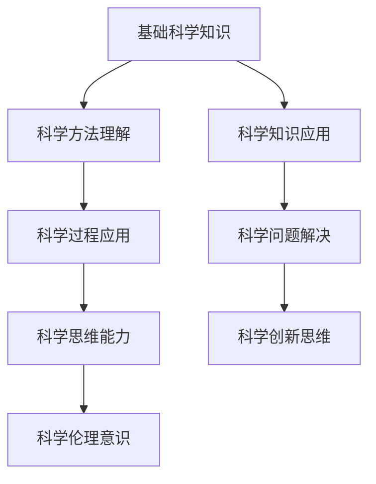
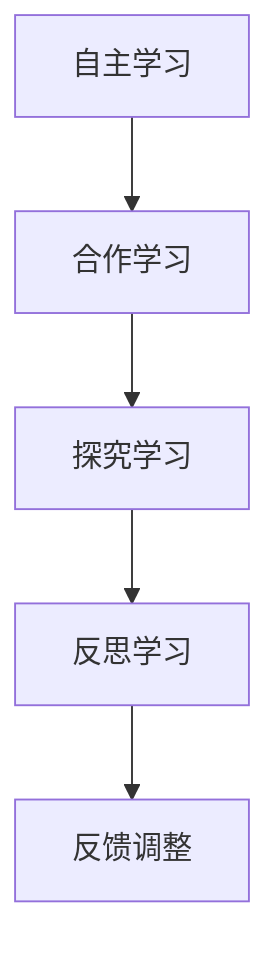
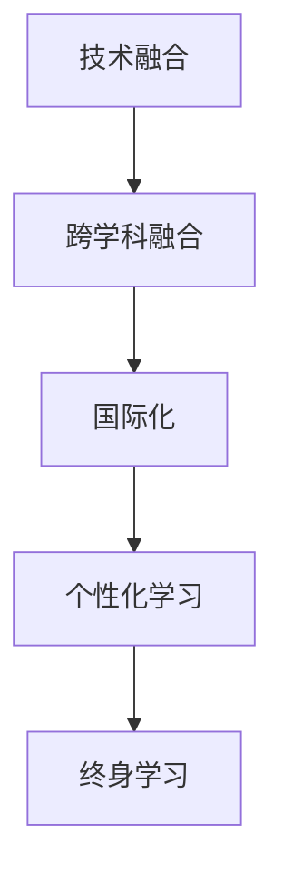
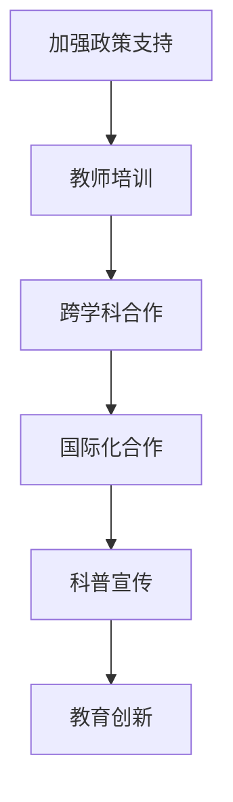

                 

### 引言

#### 1. 书籍背景

在当今全球化的时代，科学素养已经成为提升全人类世界理解能力的重要基础。科学素养不仅是指掌握科学知识和技能，更重要的是具备科学思维方式和科学方法论。它涵盖了从基础科学知识到应用科学技术的广泛领域，对个人的发展、社会的进步和全球的和谐具有重要意义。

全球科学素养教育的必要性体现在以下几个方面：首先，科学技术的迅猛发展使得科学素养成为现代人必备的基本素养之一；其次，科学素养教育有助于培养创新精神和解决问题的能力，这是当前社会发展所急需的；最后，科学素养有助于促进跨文化沟通和理解，增强全球公民的责任感和参与感。

《全球科学素养教育：提升全人类的世界理解能力》这本书正是为了应对这一挑战而诞生的。本书旨在探讨科学素养教育的理论基础、教育策略、区域实践、政策支持以及未来趋势，旨在为教育工作者、政策制定者以及广大读者提供全面的指导。

#### 2. 书籍目标

本书的主要目标有以下几点：

1. **普及科学素养知识**：通过深入浅出的讲解，帮助读者理解和掌握科学素养的核心概念和基本知识。
2. **探讨教育策略**：分析科学素养教育的原则和方法，为教育工作者提供实用的教学策略。
3. **展示区域实践**：介绍不同地区和文化背景下的科学素养教育实践，为全球科学素养教育提供借鉴。
4. **分析政策支持**：探讨科学素养教育的政策环境，为政策制定者提供决策依据。
5. **展望未来趋势**：预测科学素养教育的未来发展趋势，提出应对挑战的策略和建议。

#### 3. 书籍重要性

科学素养教育的重要性不言而喻。首先，它有助于提升个人的科学素养，增强应对复杂社会问题的能力。其次，它有助于推动科技进步和经济发展，为国家竞争力的提升提供支持。最后，它有助于培养具有全球视野和国际竞争力的公民，促进全球和平与共同发展。

因此，科学素养教育不仅关乎个人的成长，更关乎整个社会的进步。本书旨在通过全面的分析和深入的探讨，为科学素养教育提供理论指导和实践参考，为提升全人类的世界理解能力贡献一份力量。

### 第一部分：科学素养的概念与理论基础

#### 1.1 科学素养的定义与重要性

科学素养（Scientific Literacy）是指一个人理解科学概念、科学方法和科学在现代社会中的作用的能力。它不仅仅是掌握科学知识，更包括科学思维方式和科学方法论的培养。科学素养的定义可以从以下几个方面进行阐述：

- **知识层面**：了解基本的科学概念、原理和科学事实，如生物学、物理学、化学等基础科学知识。
- **理解层面**：理解科学方法和科学过程，包括科学探究的步骤、科学证据的收集与分析、科学假设的提出与验证。
- **应用层面**：将科学知识应用于解决实际问题，包括技术运用、环境问题分析、健康问题处理等。
- **反思层面**：对科学知识、方法和过程进行批判性思考，包括对科学结论的合理性进行评估、对科学伦理进行反思。

科学素养的重要性体现在多个方面：

1. **提高生活质量**：科学素养使得人们能够更好地理解和应对日常生活中的科学问题，如健康保健、环境保护、科技应用等。
2. **促进创新精神**：科学素养有助于培养创新思维和问题解决能力，这是现代社会发展所迫切需要的。
3. **增强社会参与度**：具备科学素养的公民能够更好地参与公共事务的讨论和决策，提高社会的整体治理水平。
4. **推动科技发展**：科学素养是科技创新的基础，有助于培养和吸引科技人才，推动科技进步和经济发展。

#### 1.2 科学素养的核心概念

科学素养的核心概念包括以下几个方面：

- **科学知识**：这是科学素养的基础，包括科学事实、原理和理论。科学知识不仅要求理解和记忆，更要求能够将其应用于实际问题。
- **科学方法**：科学方法包括观察、实验、假设、验证等步骤，是科学探究的基本工具。掌握科学方法有助于人们进行理性思考和分析。
- **科学过程**：科学过程是科学方法的实际应用，包括科学研究、技术开发、技术应用等环节。科学过程体现了科学知识的应用性和实践性。
- **科学思维**：科学思维是一种理性思维，强调逻辑性、批判性和系统性。科学思维有助于人们形成正确的世界观和价值观。
- **科学伦理**：科学伦理是指在科学研究和技术应用中遵循的道德规范，包括尊重研究对象、保护环境、维护公共利益等。科学伦理是科学发展的基石。

以下是一个对比表格，展示了科学素养的核心概念及其属性特征：

| 核心概念 | 属性特征 |
| --- | --- |
| 科学知识 | 基础性、应用性、系统性 |
| 科学方法 | 观察性、实验性、假设性、验证性 |
| 科学过程 | 应用性、实践性、综合性 |
| 科学思维 | 逻辑性、批判性、系统性 |
| 科学伦理 | 道德性、责任性、公益性 |

#### 1.3 科学素养的理论基础

科学素养的理论基础主要包括科学哲学、科学社会学和教育学等领域的理论。这些理论从不同角度探讨了科学素养的内涵、特征和影响因素。

- **科学哲学**：科学哲学探讨科学的本质、科学知识的获取和科学方法的有效性。科学哲学中的“实证主义”、“理性主义”和“建构主义”等理论为科学素养提供了哲学基础。
- **科学社会学**：科学社会学研究科学在社会中的角色、科学与社会的关系以及科学知识的传播和应用。科学社会学中的“技术决定论”和“社会建构主义”等理论有助于理解科学素养的社会背景。
- **教育学**：教育学关注科学教育的目标、原则和方法，探讨如何有效地传授科学知识和培养科学素养。教育学中的“认知发展理论”、“建构主义教学理论”等理论为科学素养教育提供了指导。

以下是一个ER实体关系图，展示了科学素养的理论基础及其相互关系：

```mermaid
erDiagram
  SCIENCE PHILOSOPHY ||--|{ SCIENTIFIC SOCIOLOGY } : based on
  SCIENCE PHILOSOPHY ||--|{ EDUCATION } : based on
  SCIENTIFIC SOCIOLOGY ||--|{ EDUCATION } : based on
  SCIENTIFIC SOCIOLOGY ||--|{ SCIENCE EDUCATION } : based on
  EDUCATION ||--|{ SCIENCE EDUCATION } : based on
```

科学哲学、科学社会学和教育学共同构成了科学素养的理论基础，为科学素养教育提供了多维度的理论支持和指导。

#### 1.4 科学素养的层次结构

科学素养可以按照不同维度划分为多个层次，这些层次反映了个体在科学素养方面的认知水平和应用能力。以下是一个科学素养的层次结构图：



- **基础科学知识**：这是科学素养的最低层次，个体需要掌握基本的科学概念和原理。
- **科学方法理解**：个体需要理解科学方法的步骤和原理，如观察、实验、假设和验证等。
- **科学过程应用**：个体需要能够将科学方法应用于实际问题，进行科学探究。
- **科学思维能力**：个体需要具备批判性思维和系统性思维，能够对科学知识和方法进行深入分析。
- **科学伦理意识**：个体需要了解和遵循科学伦理规范，包括道德责任和社会责任。
- **科学知识应用**：个体需要能够将科学知识应用于日常生活和工作，解决实际问题。
- **科学问题解决**：个体需要具备解决科学问题的能力，包括提出问题、分析问题和解决问题。
- **科学创新思维**：个体需要具备创新思维，能够在科学领域进行原创性研究和发明。

通过科学素养的层次结构，我们可以更加系统地理解和培养个体的科学素养，从而提升全人类的世界理解能力。

### 第二部分：科学素养教育与学习策略

#### 2.1 科学素养教育目标

科学素养教育的主要目标包括以下几个方面：

1. **知识目标**：掌握基础的科学知识和核心概念，如生物学、物理学、化学等。
2. **能力目标**：培养科学探究能力、问题解决能力和批判性思维能力。
3. **态度目标**：培养对科学的兴趣和好奇心，培养科学精神和科学伦理意识。
4. **应用目标**：将科学知识应用于实际问题，解决现实生活中的科学问题。

这些目标的实现对于提升个体和全社会的科学素养具有重要意义。科学知识的目标有助于提升科学素养的基础，能力目标和态度目标有助于培养科学的思维方式和价值观，应用目标则将科学素养转化为实际的社会效益。

#### 2.2 科学素养教育的原则与方法

科学素养教育的原则主要包括以下几个方面：

1. **理论与实践相结合**：通过实际操作和实验，让学生在实践中掌握科学知识和方法。
2. **学科交叉**：打破学科界限，将科学与其他领域（如艺术、社会科学等）相结合，培养跨学科思维。
3. **问题导向**：以实际问题为出发点，引导学生进行科学探究，培养解决问题的能力。
4. **过程导向**：注重科学探究的过程，鼓励学生自主探索和思考，培养科学思维和科学素养。

科学素养教育的具体方法包括：

1. **实验教学法**：通过实验，让学生直观地感受科学现象和原理，提高实践能力。
2. **项目式学习**：通过项目，让学生在解决实际问题的过程中掌握科学知识和方法。
3. **探究式学习**：引导学生提出问题，进行假设和验证，培养批判性思维和科学探究能力。
4. **讨论式学习**：通过小组讨论和课堂讨论，激发学生的思维碰撞，提高思维深度和广度。

以下是一个科学素养教育的原则与方法的对比表格：

| 原则 | 方法 |
| --- | --- |
| 理论与实践相结合 | 实验教学法 |
| 学科交叉 | 项目式学习 |
| 问题导向 | 探究式学习 |
| 过程导向 | 讨论式学习 |

#### 2.3 科学素养教育的学习策略

科学素养教育的学习策略主要包括以下几个方面：

1. **自主学习**：培养学生的自主学习能力，鼓励他们主动探索和发现科学知识。
2. **合作学习**：通过小组合作，培养学生的团队合作能力和沟通能力。
3. **探究学习**：引导学生提出问题，进行假设和验证，培养他们的科学探究能力。
4. **反思学习**：鼓励学生对自己的学习过程进行反思，提高学习效果和科学素养。

以下是一个科学素养教育学习策略的流程图：



科学素养教育的学习策略不仅关注知识传授，更注重学生能力的培养和素养的提升。通过自主学习、合作学习、探究学习和反思学习，学生能够更好地掌握科学知识和方法，提升科学素养。

#### 2.4 教师在科学素养教育中的作用

教师在科学素养教育中扮演着关键角色，他们不仅是知识的传授者，更是科学素养培养的引导者和推动者。教师的作用主要体现在以下几个方面：

1. **引导者**：教师需要引导学生进入科学的世界，激发他们对科学的兴趣和好奇心。通过设计有趣的教学活动和实验，教师可以帮助学生更好地理解和掌握科学知识。
2. **推动者**：教师需要推动学生进行科学探究和思考，培养学生的批判性思维和解决问题的能力。教师可以通过提出有深度的问题和挑战，引导学生进行深入思考和探索。
3. **支持者**：教师需要为学生提供支持和帮助，鼓励他们在科学探究中克服困难，取得成功。教师可以通过提供资源、指导方法和反馈，帮助学生更好地进行科学学习。
4. **榜样者**：教师的行为和态度会对学生产生重要影响。教师需要通过自身的言行，展示科学精神和科学伦理，成为学生的榜样。

以下是一个教师角色在科学素养教育中的示例：

- **引导者**：教师通过实验演示，引导学生了解光的折射现象，激发学生对光学的好奇心。
- **推动者**：教师提出问题：“为什么光在不同介质中传播速度不同？”引导学生进行思考和探究。
- **支持者**：教师提供相关书籍和实验设备，帮助学生进行光学实验，验证光的折射规律。
- **榜样者**：教师通过自己的严谨态度和科学方法，展示科学探究的过程，为学生树立榜样。

通过教师的引导、推动、支持和榜样作用，学生能够更好地进行科学学习，提升科学素养。

### 第三部分：科学素养教育在不同地区和文化的实践

#### 3.1 科学素养教育的国际比较

科学素养教育在不同国家和地区之间存在显著的差异，这些差异主要体现在教育体系、课程设置、教学方法和文化背景等方面。以下是一些主要国家和地区的科学素养教育比较：

1. **美国**：美国注重科学素养教育，将科学探究和问题解决能力作为核心教育目标。美国的教育体系较为灵活，允许学生在多个学科领域进行深入学习。美国的教育方法强调实验和实践，注重培养学生的科学思维和创新能力。

2. **欧洲**：欧洲国家在科学素养教育方面也有较高的重视，尤其是在基础教育阶段。欧洲的教育体系强调跨学科教学和综合素养培养。例如，德国的“双元制”教育模式将理论教学与实践相结合，强调学生的动手能力和实际应用能力。

3. **亚洲**：亚洲国家如日本、韩国和中国在科学素养教育方面也取得了显著成绩。日本注重科学教育和科技发展，将科学素养视为国家竞争力的重要组成部分。韩国在科学素养教育方面也进行了大量的投入，取得了世界领先的科技成果。中国的科学素养教育近年来也在不断改革，通过课程调整和教学方法创新，逐步提高学生的科学素养。

以下是一个科学素养教育国际比较的表格：

| 国家/地区 | 教育体系 | 课程设置 | 教学方法 | 文化背景 |
| --- | --- | --- | --- | --- |
| 美国 | 灵活 | 多学科深入 | 实验与实践 | 科学创新导向 |
| 欧洲 | 跨学科 | 综合素养 | 跨学科教学 | 科学精神强调 |
| 亚洲 | 强调实践 | 科学与科技 | 双元制教育 | 科技发展导向 |
| 中国 | 改革中 | 课程多样化 | 方法创新 | 科教兴国战略 |

#### 3.2 发展中国家的科学素养教育实践

发展中国家的科学素养教育面临着诸多挑战，如教育资源不足、科学师资短缺、教学设备落后等。然而，一些发展中国家在科学素养教育方面也进行了积极的探索和实践：

1. **非洲**：非洲一些国家通过社区教育和科技推广项目，提高了公众的科学素养。例如，南非的科技教育项目通过在学校和社区开展科学实验和科技活动，提高了学生对科学的兴趣和参与度。此外，非洲一些国家还与全球科学教育组织合作，引进先进的教育资源和教学方法。

2. **拉丁美洲**：拉丁美洲国家在科学素养教育方面也取得了一定的进展。一些国家通过政策支持和教育改革，提高了科学教育的质量。例如，墨西哥通过增加科学课程和实验设备投入，提高了学生的科学素养。巴西的“科技教育普及计划”通过在农村地区推广科技教育，提高了农村学生的科学素养。

3. **南亚**：南亚国家的科学素养教育也面临挑战，但一些国家通过科技教育和科技项目，提高了学生的科学素养。例如，印度通过“科技教育创新项目”和“科技创业计划”，培养了大批科技人才，提高了国家的科技水平和创新能力。

以下是一个发展中国家科学素养教育实践的比较表格：

| 国家/地区 | 挑战 | 措施 | 成效 |
| --- | --- | --- | --- |
| 非洲 | 教育资源不足 | 社区教育和科技推广项目 | 提高学生兴趣和参与度 |
| 拉丁美洲 | 政策支持和教育改革 | 增加科学课程和实验设备 | 提高科学教育质量 |
| 南亚 | 科技教育和科技项目 | 科技教育创新项目和科技创业计划 | 培养科技人才，提高创新能力 |

通过这些实践，发展中国家在提高科学素养教育方面取得了一定的成效，为全球科学素养教育的提升做出了贡献。

#### 3.3 发达国家的科学素养教育实践

发达国家的科学素养教育通常具有系统性和全面性，他们在教育政策、课程设置、教学方法以及师资培训等方面进行了深入的探索和实践：

1. **教育政策**：发达国家通常制定明确的教育政策，将科学素养教育作为国家战略的重要组成部分。例如，美国的《国家科学教育标准》和欧盟的《科学素养框架》等政策文件，明确了科学素养教育的目标和内容。

2. **课程设置**：发达国家的科学课程设置注重基础科学知识和应用科学的结合，同时强调跨学科教学和综合素养培养。例如，英国的“国家课程”和德国的“综合科学课程”等，都体现了科学素养教育的全面发展。

3. **教学方法**：发达国家采用多样化的教学方法，注重学生的主动参与和实践操作。例如，美国的探究式学习和项目式学习，德国的双元制教育，都为学生提供了丰富的科学实践机会。

4. **师资培训**：发达国家重视科学教师的培训和职业发展，提供系统的培训课程和持续的进修机会，确保教师具备科学素养和教学能力。

以下是一个发达国家科学素养教育实践的案例：

- **美国**：通过《国家科学教育标准》，明确了科学素养教育的目标，推广探究式学习和项目式学习，提高学生的科学探究能力和创新能力。
- **德国**：实施双元制教育，将理论与实践相结合，培养具有实际操作能力的科技人才。
- **英国**：采用国家课程，注重跨学科教学，通过科学实验和项目实践，培养学生的科学素养。

发达国家的科学素养教育实践为全球科学素养教育提供了宝贵的经验和借鉴，促进了科学素养教育的普及和质量提升。

#### 3.4 科学素养教育在多元文化环境中的应用

科学素养教育在多元文化环境中具有独特的挑战和机遇。多元文化环境中的科学素养教育需要考虑文化差异、语言障碍和价值观多样性等因素。以下是一些关键策略和案例：

1. **文化敏感性教学**：教师需要了解不同文化背景下的学生特点，采用文化敏感性教学方法，尊重和包容不同文化的观点和价值观。例如，在亚洲文化背景下，教师可以采用“小组合作学习”和“文化故事分享”等方式，激发学生对科学的兴趣。

2. **双语教学**：在多语言环境中，教师可以采用双语教学策略，结合本地语言和英语进行教学，提高学生的语言能力和科学素养。例如，在非洲一些国家，教师可以通过当地语言和英语教授科学知识，帮助学生更好地理解和掌握科学概念。

3. **跨文化项目合作**：通过跨文化项目合作，学生可以了解和体验不同文化的科学教育模式，培养跨文化沟通能力和合作精神。例如，国际学校可以通过联合科研项目，让学生在全球范围内进行科学探究和合作。

以下是一个多元文化环境中的科学素养教育案例：

- **新加坡**：新加坡的教育体系注重多元文化教育，通过“科学跨文化探究项目”，让学生在了解本地文化的同时，体验全球科学的多样性。
- **加纳**：加纳通过“科学与传统文化结合项目”，将科学知识融入传统文化中，提高学生的科学素养和文化认同感。

通过这些策略和案例，科学素养教育在多元文化环境中得以有效实施，为培养具有全球视野的科学人才提供了支持。

### 第四部分：科学素养教育的政策与支持

#### 4.1 科学素养教育政策分析

科学素养教育的政策分析主要包括政策目标、政策内容、政策实施效果以及政策评价等方面。以下是对一些主要国家的科学素养教育政策分析：

1. **美国**：美国的科学素养教育政策以《国家科学教育标准》为核心，旨在提高学生的科学素养和创新能力。政策内容包括科学课程的设置、教学方法的推广、教师培训和科学教育资源的分配。政策实施效果显著，学生的科学成绩和创新能力得到了提升。

2. **欧洲**：欧盟通过《科学素养框架》和《欧洲科学教育行动计划》，强调科学素养教育的跨学科和综合性。政策内容包括科学课程的改革、科学教育的国际化以及科学教师的专业发展。政策实施效果较好，欧洲国家的科学素养水平有所提高。

3. **中国**：中国的科学素养教育政策以《国家中长期科学和技术发展规划纲要》为指导，强调科学教育的普及和提高。政策内容包括科学课程的调整、科学教师培训的加强以及科学教育资源的优化配置。政策实施效果逐渐显现，学生的科学素养和创新能力有所提升。

以下是一个科学素养教育政策分析的比较表格：

| 国家/地区 | 政策目标 | 政策内容 | 实施效果 | 政策评价 |
| --- | --- | --- | --- | --- |
| 美国 | 提高科学素养和创新能力 | 科学课程、教学方法、教师培训 | 显著提升 | 成功实施 |
| 欧洲 | 跨学科和综合性 | 科学课程改革、科学教育国际化 | 较好 | 成功实施 |
| 中国 | 科学教育普及和提高 | 科学课程调整、科学教师培训 | 渐进提升 | 有待改进 |

#### 4.2 政府在科学素养教育中的作用

政府在科学素养教育中扮演着关键角色，主要体现在以下几个方面：

1. **政策制定**：政府通过制定科学素养教育政策，明确教育目标和内容，指导教育实践。

2. **资源投入**：政府通过财政拨款和专项资金支持，为科学素养教育提供必要的资金保障。

3. **教师培训**：政府通过教师培训计划和职业发展支持，提高科学教师的专业素养和教学能力。

4. **教育改革**：政府通过教育改革，推动科学素养教育的创新和改进，提高教育质量和效果。

以下是一个政府角色在科学素养教育中的示例：

- **政策制定**：政府制定《国家科学教育标准》，明确科学素养教育的目标和内容。
- **资源投入**：政府增加科学教育经费，支持科学实验室的建设和科学教育资源的采购。
- **教师培训**：政府提供科学教师培训课程，提高教师的教学能力和专业素养。
- **教育改革**：政府推动科学课程的改革，引入探究式学习和项目式学习，培养学生的科学素养和创新能力。

通过政府的积极支持和投入，科学素养教育得以全面推广和深入实施。

#### 4.3 科学素养教育的资金支持

科学素养教育的资金支持是确保教育质量和效果的关键因素。以下是一些科学素养教育的资金支持策略和案例：

1. **公共财政投入**：政府通过公共财政投入，为科学素养教育提供稳定的资金保障。例如，美国通过《国家科学基金》和《教育法案》等，为科学教育提供大量资金支持。

2. **企业赞助**：企业通过赞助科学教育活动，为科学素养教育提供资金和资源。例如，谷歌和微软等公司通过资助科学竞赛和科技项目，支持科学教育的发展。

3. **慈善捐赠**：慈善机构和基金会通过慈善捐赠，支持科学素养教育的发展。例如，比尔和梅琳达·盖茨基金会通过资助科学教育和科技项目，提高学生的科学素养。

以下是一个科学素养教育的资金支持案例：

- **美国**：通过《国家科学基金》和《教育法案》，政府为科学教育提供大量资金支持。
- **中国**：通过“科技教育提升计划”，企业赞助和慈善捐赠共同支持科学素养教育的发展。

通过这些资金支持策略，科学素养教育得到了充分的资源保障，为提升全人类的科学素养提供了有力支持。

#### 4.4 科学素养教育的国际合作

科学素养教育的国际合作在全球科学素养提升中发挥了重要作用。以下是一些国际合作的关键领域和案例：

1. **项目合作**：各国通过科学教育项目合作，共享教育资源和经验。例如，欧盟的“地平线2020”计划和“国际科学教育联盟”（ISEA）等项目，促进了全球科学教育的合作与发展。

2. **教师交流**：通过教师交流项目，各国教师可以相互学习，提高教学能力和科学素养。例如，美国的“富布莱特项目”和欧盟的“Erasmus+计划”，为教师提供了国际交流和进修的机会。

3. **学术交流**：各国学者通过学术交流和合作研究，推动了科学素养教育理论和实践的发展。例如，国际科学教育研究协会（ISEE）和世界科学教育论坛（WFSE）等国际学术组织，促进了全球科学教育的研究与合作。

以下是一个国际合作案例：

- **欧盟**：通过“地平线2020”计划，欧盟与全球多个国家和地区合作，推动科学教育的发展和创新。
- **国际科学教育联盟（ISEA）**：通过全球教师交流和项目合作，提升全球科学教育的质量和效果。

通过国际合作，科学素养教育在全球范围内得到了广泛的推广和提升，为培养具有全球视野的科学人才做出了重要贡献。

### 第五部分：科学素养教育的未来趋势与挑战

#### 5.1 科学素养教育的未来趋势

科学素养教育的未来趋势将受到技术进步、全球化和社会变化等多种因素的影响。以下是一些主要趋势：

1. **技术融合**：随着人工智能、大数据和虚拟现实等技术的发展，科学素养教育将更加注重技术工具的应用，提高教学的互动性和个性化。

2. **跨学科融合**：科学素养教育将打破学科界限，注重跨学科教学，培养学生解决复杂问题的能力。

3. **国际化**：全球化的背景下，科学素养教育将更加注重国际化，通过国际合作和交流，提升学生的全球视野和跨文化沟通能力。

4. **个性化学习**：基于大数据和人工智能的个性化学习将更加普及，科学素养教育将根据学生的兴趣和需求，提供定制化的学习路径。

5. **终身学习**：随着社会的发展，科学素养教育将不再局限于学校教育，而将扩展到终身学习阶段，帮助成年人不断提升科学素养。

以下是一个科学素养教育未来趋势的示意图：



#### 5.2 科学素养教育面临的挑战

尽管科学素养教育有着光明的前景，但仍然面临诸多挑战：

1. **教育资源的分配**：全球教育资源的分配不均，导致一些地区的科学素养教育水平较低，这需要政府和社会的共同努力，提高科学教育的普及率。

2. **教师专业发展**：科学教师的专业发展不足，教师数量和质量无法满足需求，这需要加强教师培训和支持。

3. **文化差异**：文化差异影响科学素养教育的实施，如何尊重和融入不同文化背景下的科学教育，是一个重要的挑战。

4. **社会认知**：公众对科学素养教育的认知不足，缺乏对科学素养重要性的认识，这需要通过科普宣传和教育推广，提高社会对科学素养教育的重视。

5. **教育改革**：科学素养教育需要不断进行改革和创新，以适应时代的变化，但教育改革的推进面临诸多困难和阻力。

以下是一个科学素养教育面临挑战的列表：

- **教育资源分配不均**
- **教师专业发展不足**
- **文化差异影响**
- **社会认知不足**
- **教育改革困难**

#### 5.3 应对挑战的策略与方法

为了应对科学素养教育面临的挑战，可以采取以下策略和方法：

1. **加强政策支持**：政府应制定和实施科学素养教育的相关政策，提供资金和资源支持，确保教育资源的公平分配。

2. **教师培训**：加强科学教师的培训，提高教师的专业素养和教学能力，吸引更多优秀人才加入科学教育领域。

3. **跨学科合作**：鼓励跨学科教学和研究，培养具有综合素养的科学人才，提高教育的整体质量。

4. **国际化合作**：加强国际合作，共享教育资源和经验，提高科学素养教育的国际化水平。

5. **科普宣传**：加大科普宣传力度，提高公众对科学素养教育的认知，营造良好的社会氛围。

6. **教育创新**：鼓励教育创新，探索新的教育模式和教学方法，提高教育的互动性和个性化。

以下是一个应对挑战策略的方法示意图：



通过这些策略和方法，科学素养教育将能够更好地应对未来挑战，提升全人类的科学素养水平。

### 结论

《全球科学素养教育：提升全人类的世界理解能力》这本书通过深入的分析和全面的探讨，为我们揭示了科学素养教育的重要性以及如何在全球范围内提升科学素养。本书系统地阐述了科学素养的定义、核心概念、教育策略、区域实践、政策支持以及未来趋势，为教育工作者、政策制定者以及广大读者提供了宝贵的指导和参考。

科学素养不仅是个人发展的基础，更是社会进步和全球和谐的关键。通过科学素养教育，我们可以培养具有批判性思维、创新能力和全球视野的公民，为解决全球性问题提供有力支持。

然而，科学素养教育也面临诸多挑战，如教育资源分配不均、教师专业发展不足、文化差异等。我们需要加强政策支持、推进教师培训、鼓励跨学科合作、加大科普宣传力度，并积极探索教育创新，以应对这些挑战。

展望未来，科学素养教育将继续在全球范围内发展，随着技术的进步和全球化的发展，科学素养教育的形式和内容将更加多样化。让我们携手合作，为提升全人类的科学素养，共同创造一个更加美好的世界。

### 读者互动

亲爱的读者，您对科学素养教育有什么看法和建议？您认为在您的国家和地区，科学素养教育有哪些成功经验和挑战？欢迎在评论区分享您的观点，让我们一起探讨和交流，共同推动科学素养教育的进步。

### 作者信息

**作者：AI天才研究院/AI Genius Institute & 禅与计算机程序设计艺术 /Zen And The Art of Computer Programming**  
AI天才研究院致力于推动人工智能和科学素养教育的发展，通过创新的研究和实践，提升全球科学素养水平。禅与计算机程序设计艺术则专注于计算机科学的教育和普及，为读者提供深入浅出的技术解读和指导。我们期待与您共同探索科学素养教育的无限可能。

