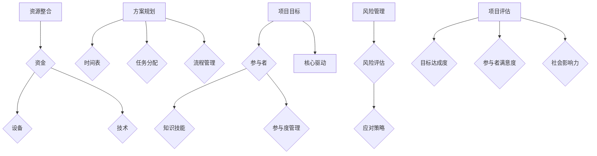
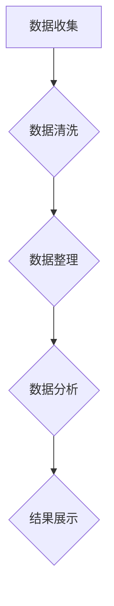
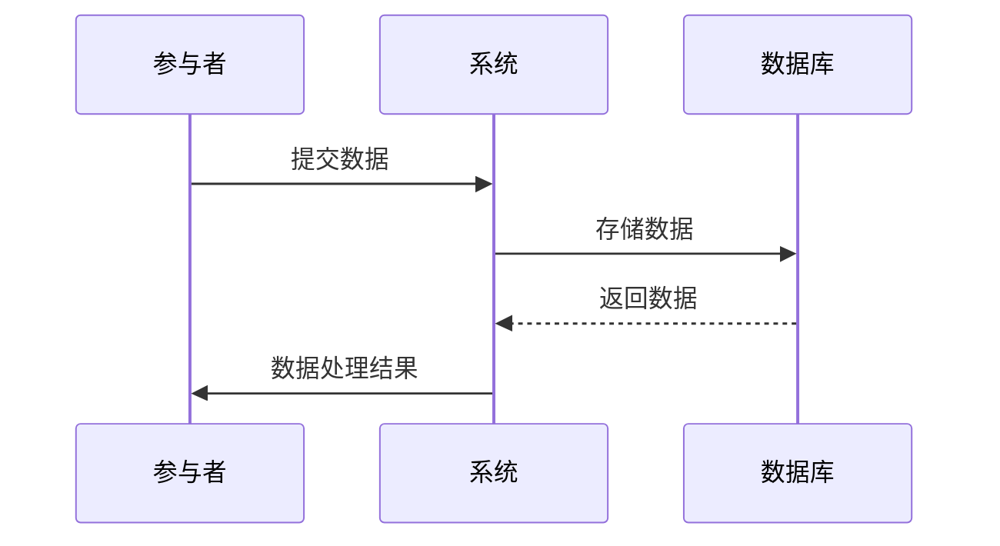

                 

## 第1章：问题背景

### 1.1 问题的提出

在当今社会，科学技术的飞速发展不断推动着人类文明的进步，但与此同时，一个不容忽视的问题也随之浮现：社会公众对科学知识的了解和应用不足，科学素养普遍不高。这一问题不仅影响了公众对科学技术的正确理解和应用，也在一定程度上制约了科学技术的普及和发展。

#### 问题描述

具体来说，问题的表现有以下几点：

1. **科学知识普及度不高**：社会公众对科学知识的了解有限，科学知识的传播渠道不畅，科普活动形式单一，无法满足多样化的科普需求。
2. **科学思维能力不足**：缺乏科学思维和方法，无法有效分析、解决问题，对科学研究的兴趣和热情不高。
3. **科学参与度低**：公众参与科学活动的机会少，科学研究成果的转化和应用不足，科学研究与社会需求脱节。

#### 问题解决

为了解决上述问题，通过设计并实施公民科学项目，提高全民科学素养，促进全民参与科学探索，显得尤为重要。具体来说，公民科学项目可以起到以下作用：

1. **提高科学知识普及度**：通过多样化的科普活动，如展览、讲座、实验等，让公众更直观地了解科学知识，增强科普活动的吸引力和参与度。
2. **培养科学思维能力**：通过参与科学实践活动，公众可以学习科学思维和方法，培养探究精神和创新意识。
3. **促进科学参与**：公民科学项目为公众提供了参与科学研究的渠道，使科学研究更加贴近社会需求，提高科学研究的实际应用价值。

#### 边界与外延

公民科学项目的边界涵盖了教育、环境、健康、天文、地理等多个领域，既可以涉及基础科学的研究，也可以应用于应用科学和技术创新。项目的设计与实施需要针对不同领域的特点和需求，制定相应的策略和方法。

同时，公民科学项目的实施对象包括各级别的公众，尤其是青少年和成人。通过激发青少年的科学兴趣和培养成人的科学素养，可以逐步提高整个社会的科学水平。

### 1.2 核心概念

#### 公民科学

公民科学（Citizen Science）是一种社会公众参与的科学研究和教育活动。其核心思想是利用公众的力量，通过参与科学研究和实践，提高公众的科学素养和科学兴趣。公民科学项目不仅为公众提供了接触科学的机会，也促进了科学研究与社会需求的结合。

#### 项目设计

项目设计是公民科学项目的核心环节，涉及到项目目标设定、资源整合、方案规划、风险管理等多个方面。一个成功的项目设计需要明确项目目标，确保项目的科学性和可行性，同时考虑到参与者的需求和兴趣，以及资源的合理利用。

#### 项目实施

项目实施是项目设计落地的重要阶段，包括项目执行、数据收集、分析反馈等环节。在项目实施过程中，需要有效协调各方资源，确保项目顺利进行，同时保证数据的质量和可靠性。

### 1.3 关联概念与联系

#### 科学素养

科学素养（Science Literacy）是指社会公众具备的科学知识、理解能力和科学思维。提高公众的科学素养，是促进公民科学项目成功的关键。科学素养不仅包括对科学知识的了解，还涉及到科学方法、科学态度和科学价值观。

#### 科学传播

科学传播（Science Communication）是科研成果向公众传播的过程。公民科学项目作为科学传播的一种形式，可以通过多样化的渠道和方式，如展览、讲座、实验等，将科学知识传递给公众，提高公众的科学素养。

#### 公民参与

公民参与（Citizen Engagement）是指公众在社会事务中的参与度，包括决策参与、资源投入等。公民科学项目鼓励公众参与，提高公民的社会责任感和参与意识，是实现全民参与科学探索的重要途径。

### 1.4 本章小结

本章介绍了公民科学项目的重要性，分析了问题的背景、问题描述、问题解决方法以及项目的核心概念和关联概念。通过本章的讨论，我们可以了解到，公民科学项目不仅有助于提高公众的科学素养，还能促进科学研究与社会需求的结合，推动全民参与科学探索，从而实现科学技术的普及和发展。在接下来的章节中，我们将进一步探讨公民科学项目的具体设计原理和实践方法。

## 第2章：核心概念原理

### 2.1 公民科学项目定义

#### 定义

公民科学项目（Citizen Science Project）是指社会公众参与的科学研究和教育活动，旨在提高公众的科学素养、激发科学兴趣和促进科学研究与社会需求的结合。公民科学项目通常涉及基础研究和应用研究，其目的是通过公众的参与，使科学知识更加普及，科学方法更加深入人心。

#### 属性特征对比表格

以下是公民科学项目与其他科学项目的主要属性特征对比表格：

| 特征       | 定义                                                         |
| ---------- | ------------------------------------------------------------ |
| **项目目标** | 提高公众科学素养，激发科学兴趣，促进科学研究与社会需求的结合。 |
| **项目类型** | **基础研究**、**应用研究**、**技术创新**。                 |
| **参与群体** | **社会各阶层人士**，特别是**青少年和成人**。                 |
| **资源需求** | **时间资源**、**人力资源**、**物质资源**。                 |
| **实施方式** | **线上与线下结合**、**项目与活动相结合**。                 |
| **评估指标** | **项目目标达成度**、**参与者满意度**、**社会影响力**。     |

通过上述对比表格，我们可以更清晰地理解公民科学项目的独特属性和特征，以及其在科学研究和社会服务中的重要作用。

### 2.2 公民科学项目核心要素

#### 要素组成

公民科学项目的成功离不开以下几个核心要素：

1. **项目目标**：明确项目旨在解决的科学问题或实现的具体目标，是项目的核心驱动。
2. **参与者**：公众参与者的招募和管理，确保参与者具备相应的知识和技能，并能积极参与项目。
3. **资源整合**：整合项目所需的各种资源，包括资金、设备、技术等，确保项目顺利开展。
4. **方案规划**：制定详细的项目计划，包括项目的时间表、任务分配、流程管理等。
5. **风险管理**：评估项目风险，制定相应的应对策略，确保项目在预期内顺利实施。
6. **项目评估**：对项目执行情况进行评估，包括目标达成度、参与者满意度、社会影响力等，以持续改进项目。

#### 具体组成要素图

以下是一个用Mermaid绘制的公民科学项目核心要素组成图：



通过上述图示，我们可以直观地理解公民科学项目的各个核心要素及其相互关系，为项目的有效实施提供指导。

### 2.3 概念联系

#### 与科学传播的关系

公民科学项目是科学传播的一种重要形式。科学传播的目的是将科学知识传递给公众，提高公众的科学素养。而公民科学项目通过公众的实际参与，不仅使科学知识更加深入人心，还能激发公众对科学的兴趣和探究精神。两者在目标上具有高度一致性，都是推动科学普及和提高社会科学素养。

#### 与公民参与的关系

公民参与是公民科学项目的核心要素之一。公民参与不仅包括公众在项目中的参与度，还包括公众在社会事务中的决策参与、资源投入等。公民科学项目通过公众的参与，不仅提高了项目的科学性和实用性，也增强了公众的社会责任感和参与意识。公民参与与公民科学项目在目标上紧密相连，共同推动社会的科学进步。

### 2.4 本章小结

本章详细阐述了公民科学项目的核心概念，包括项目的定义、属性特征、核心要素以及与相关概念的联系。通过本章的讨论，我们可以更深入地理解公民科学项目的内涵和意义，为后续章节的讨论和案例分析提供了坚实的基础。在下一章中，我们将进一步探讨公民科学项目的核心概念原理及其具体应用。

## 第3章：项目设计原理

### 3.1 项目设计原则

项目设计是公民科学项目的关键环节，一个良好的项目设计能够确保项目目标的实现和资源的有效利用。以下是项目设计过程中需要遵循的几个重要原则：

#### 原则一：明确项目目标，确保科学性

项目目标应当明确、具体，并与科学研究的实际需求相吻合。科学性是公民科学项目的核心，项目目标应当基于科学理论和实践，确保研究的合理性和科学性。例如，在一个环境监测项目中，目标可能是收集空气污染数据，评估污染程度，并提出改善措施。

#### 原则二：考虑参与者的需求和兴趣，确保参与度

公民科学项目的成功很大程度上依赖于公众的参与度和积极性。在设计项目时，应充分考虑参与者的需求和兴趣，设计出能够吸引公众的项目内容。例如，对于青少年群体，可以设计有趣的科学实验或游戏，以激发他们的科学兴趣；对于成人群体，可以设计更具挑战性和实用性的研究任务。

#### 原则三：结合资源情况，合理规划项目

资源是项目设计的基础，包括资金、设备、人力资源等。在设计项目时，需要结合实际资源情况，合理规划项目的规模和深度。例如，如果预算有限，可以选择小规模、易于管理的项目；如果设备资源丰富，可以设计需要较高技术含量的研究项目。

### 3.2 设计流程

项目设计是一个系统化的过程，需要经过多个环节的规划和协调。以下是项目设计的具体流程：

#### 流程一：明确项目目标，确定研究问题

项目设计的第一步是明确项目目标，确定研究问题。在这一阶段，项目团队需要与各方利益相关者进行沟通，明确项目的具体目标，并确定需要解决的科学问题。例如，在环境监测项目中，目标可能是评估某地区的空气污染程度，研究问题可以是“该地区的空气污染主要来源是什么？”

#### 流程二：调研参与者，设计参与方式

在明确项目目标和研究问题后，下一步是调研参与者，了解他们的需求和兴趣，并设计合适的参与方式。调研可以通过问卷调查、访谈等方式进行，确保参与者的多样性。根据调研结果，项目团队可以设计不同的参与方式，如数据采集、实验操作、分析报告等。

#### 流程三：整合资源，制定项目计划

项目设计的关键在于资源整合，包括资金、设备、人力资源等。项目团队需要评估可用资源，并根据项目需求制定详细的资源使用计划。同时，还需要制定项目的时间表、任务分配、流程管理等方面的计划，确保项目能够按期顺利进行。

#### 流程四：风险评估，制定应对策略

在项目设计阶段，还需要进行风险评估，识别潜在的风险，并制定相应的应对策略。风险评估可以涵盖技术风险、管理风险、资源风险等多个方面。例如，在环境监测项目中，可能面临数据采集不完整、设备故障等风险，项目团队需要制定相应的应对措施，确保项目的顺利实施。

### 3.3 设计案例分析

#### 案例一：环境监测项目的公民科学设计

在一个环境监测项目中，项目团队明确了项目目标为收集某地区空气污染数据，评估污染程度。他们通过问卷调查和访谈的方式，调研了公众的需求和兴趣，发现公众对空气质量数据非常关心，但缺乏获取这些数据的渠道。因此，项目团队设计了一个基于智能手机应用的公民科学项目，参与者可以通过应用提交空气质量数据。

在资源整合方面，项目团队获得了政府资金支持，并租用了专业的空气质量监测设备。他们制定了详细的项目计划，包括数据收集、数据分析和数据发布等环节，并制定了风险应对策略，如数据采集不全时的补充措施。

#### 案例二：健康研究项目的公民科学实施

在健康研究项目中，项目团队的目标是研究某地区居民的健康状况，分析影响因素。他们通过社区活动招募了参与者，并设计了健康调查问卷，收集了大量的居民健康数据。项目团队还与当地的医疗机构合作，获取了居民的健康检查记录，进行了数据交叉分析。

在设计阶段，项目团队充分考虑了资源情况，通过申请科研基金和社区支持，获得了充足的资金和设备。他们制定了详细的项目计划，包括数据收集、数据分析、结果发布等步骤，并设立了风险管理小组，定期评估项目风险。

### 3.4 本章小结

本章详细介绍了公民科学项目设计的基本原则和流程，并通过具体案例展示了项目设计的方法和步骤。通过遵循科学性、参与度和资源整合等原则，并结合实际需求制定详细的计划，可以确保公民科学项目的成功实施。在下一章中，我们将进一步探讨项目实施的具体原理和实践方法。

## 第4章：项目实施原理

### 4.1 实施流程

项目实施是将设计阶段的理论和计划转化为实际操作的过程，确保项目目标的实现和资源的有效利用。以下是项目实施的具体流程：

#### 流程一：组建项目团队，明确分工

项目实施的第一步是组建项目团队，包括项目管理人员、研究人员、技术支持人员、志愿者等。明确团队成员的分工，确保每个成员都有明确的责任和任务，是项目成功实施的重要前提。例如，项目管理人员负责协调项目进度和资源分配，研究人员负责科学研究和数据分析，技术支持人员负责信息系统和设备的维护。

#### 流程二：沟通协调，确保项目顺利进行

项目实施过程中，各团队成员之间的有效沟通和协调至关重要。项目团队需要定期召开会议，讨论项目进展、解决问题和调整计划。同时，还需要与外部合作伙伴保持密切沟通，确保项目的顺利进行。例如，在环境监测项目中，项目团队需要与政府部门、社区组织保持联系，及时获取必要的支持和资源。

#### 流程三：数据收集与分析，确保数据质量

数据收集是项目实施的核心环节，直接影响到项目结果的可信度和有效性。项目团队需要制定详细的数据收集计划，包括数据类型、收集方法、数据存储等。在数据收集过程中，要确保数据的准确性和完整性，避免数据丢失或污染。例如，在健康研究项目中，项目团队需要设计有效的问卷，并确保参与者的真实反馈。

数据收集完成后，项目团队需要对数据进行清洗、整理和分析，提取有价值的信息。数据分析方法的选择应根据项目的具体需求和研究问题，采用合适的统计和数据分析工具，如Excel、SPSS等。

#### 流程四：反馈与改进，持续优化项目

项目实施过程中，持续的反馈与改进是确保项目质量的关键。项目团队需要定期收集参与者和利益相关者的反馈意见，评估项目进展和效果，并根据反馈进行必要的调整和改进。例如，在环境监测项目中，项目团队可以通过定期发布空气质量报告，向公众展示项目进展，并接受公众的反馈和建议。

反馈与改进不仅包括项目内部的管理和优化，还可以通过公开的评估和评价，提高项目的透明度和公众参与度。例如，项目团队可以邀请第三方机构对项目进行独立评估，提高项目的可信度和影响力。

### 4.2 实施策略

#### 策略一：制定详细的执行计划

制定详细的执行计划是确保项目实施顺利的重要策略。执行计划应包括项目的具体任务、时间表、责任分配、资源配置等，确保每个环节都有明确的目标和执行方案。例如，在健康研究项目中，项目团队可以制定详细的调查计划，包括问卷设计、数据收集、数据分析等步骤，并确保每个步骤都有明确的负责人和完成时间。

#### 策略二：利用信息技术手段，提高效率

信息技术的广泛应用为公民科学项目的实施提供了强大的支持。项目团队可以利用各种信息技术手段，如移动应用、在线平台、云计算等，提高项目实施的效率和质量。例如，在环境监测项目中，项目团队可以开发一款移动应用，让参与者通过应用提交空气质量数据，实现数据实时收集和监测。

#### 策略三：定期监测项目进展，及时调整

项目实施过程中，定期监测项目进展，及时调整计划和策略，是确保项目顺利进行的重要措施。项目团队应建立有效的监测机制，定期收集项目数据，评估项目进展和效果，并根据实际情况进行必要的调整。例如，在健康研究项目中，项目团队可以定期收集参与者的健康数据，分析数据变化趋势，及时调整调查问卷和研究方法。

### 4.3 实施案例分析

#### 案例一：基于移动应用的公民科学项目

在一个基于移动应用的公民科学项目中，项目团队开发了一款移动应用，让参与者可以随时随地提交空气质量数据。应用提供了多种数据采集方式，如手动输入、上传图片等，确保数据的多样性和准确性。项目团队利用云计算技术，实现了数据的实时存储和分析，为公众提供了即时的空气质量信息。

在项目实施过程中，项目团队通过定期发布空气质量报告，向公众展示项目进展，并接受公众的反馈和建议。通过这些反馈，项目团队不断优化应用功能，提高数据收集的效率和准确性。

#### 案例二：跨学科的公民科学合作项目

在一个跨学科的公民科学合作项目中，项目团队由来自不同领域的专家组成，包括环境科学、公共卫生、计算机科学等。项目团队共同设计了一个健康监测系统，通过收集和分析居民的日常健康数据，评估他们的健康状况，并提出针对性的健康建议。

在项目实施过程中，项目团队利用信息技术手段，实现了健康数据的实时收集和分析。同时，项目团队还定期召开跨学科会议，讨论项目进展和问题，确保项目目标的实现。

### 4.4 本章小结

本章详细介绍了公民科学项目实施的具体原理和策略，包括项目团队组建、沟通协调、数据收集与分析、反馈与改进等关键环节。通过案例分析，展示了项目实施的方法和实际操作。在下一章中，我们将进一步探讨项目评估与反馈的方法，确保项目实现预期目标和社会价值。

## 第5章：项目评估与反馈

### 5.1 评估指标

项目评估是公民科学项目的重要组成部分，通过评估可以全面了解项目的实施效果，为项目的持续改进提供依据。以下是项目评估中常用的几个关键指标：

#### 指标一：项目目标的达成度

项目目标的达成度是评估项目效果的首要指标，用于衡量项目是否实现了预期目标。具体评估方法包括定性和定量两种：

- **定量评估**：通过数据指标，如参与人数、数据收集量、科研成果等，评估目标的实现程度。
- **定性评估**：通过问卷调查、访谈、专家评审等方式，了解项目对参与者和社会的实际影响。

#### 指标二：参与者满意度

参与者满意度是评估项目成功与否的重要指标，反映了参与者对项目的认可程度和参与体验。评估方法通常包括：

- **问卷调查**：设计满意度调查问卷，收集参与者对项目的整体评价、参与体验等方面的反馈。
- **访谈**：对部分参与者进行深入访谈，了解他们的真实感受和改进建议。

#### 指标三：社会影响力

社会影响力是评估项目社会效益的重要指标，反映了项目对社会的贡献和影响。评估方法包括：

- **媒体报道**：统计项目相关的媒体报道数量和影响力。
- **公众参与度**：通过参与人数、活动反馈等指标，评估项目的公众参与度和影响力。
- **政策建议**：项目是否提供了有价值的政策建议，促进了社会和环境的改善。

### 5.2 反馈机制

有效的反馈机制是项目持续改进的重要保障。以下是建立反馈机制的几个关键步骤：

#### 步骤一：建立反馈渠道

建立多样化的反馈渠道，如在线问卷、电话访谈、邮件反馈等，确保参与者能够方便地提供反馈意见。同时，确保反馈渠道的匿名性和安全性，鼓励参与者真实、客观地表达意见。

#### 步骤二：定期收集反馈

项目团队应定期收集反馈，形成系统化的反馈档案。反馈收集的频率应根据项目的规模和周期进行调整，例如每月或每季度进行一次反馈收集。

#### 步骤三：分析反馈数据

对收集到的反馈数据进行系统化分析，识别项目中的优点和不足，为项目改进提供具体依据。分析方法包括数据统计、趋势分析、归类总结等。

#### 步骤四：制定改进计划

根据反馈分析结果，项目团队应制定详细的改进计划，包括问题整改、优化措施、责任分配等。改进计划应具有可操作性和明确的时间表。

#### 步骤五：实施改进措施

根据改进计划，项目团队应具体实施改进措施，确保问题得到有效解决。同时，及时跟踪改进效果，确保改进措施的有效性和可持续性。

### 5.3 持续改进

持续改进是公民科学项目成功的关键，以下是一些实现持续改进的策略：

#### 策略一：建立持续改进文化

项目团队应建立持续改进的文化，鼓励成员积极参与项目改进和创新。通过定期培训和经验分享，提升团队的整体能力和创新意识。

#### 策略二：利用新技术和方法

不断引入新技术和方法，提升项目的效率和质量。例如，利用大数据分析、人工智能等技术，提高数据收集和分析的准确性，优化项目流程。

#### 策略三：加强合作与交流

加强项目团队与其他科研机构、企业、社会组织等的合作与交流，借鉴他们的成功经验和技术成果，提升项目的整体水平。

#### 策略四：开展项目后评估

项目结束后，进行全面的项目后评估，总结项目经验，识别成功经验和不足之处，为未来项目的改进提供参考。

### 5.4 本章小结

本章详细介绍了公民科学项目评估与反馈的指标和方法，以及持续改进的策略。通过有效的评估和反馈机制，项目团队可以持续优化项目，提高项目的实施效果和社会影响力。在下一章中，我们将进一步探讨公民科学项目中的最佳实践和注意事项，确保项目的成功实施和可持续发展。

### 结论与展望

通过本章的详细分析和讨论，我们可以得出以下结论：

1. **公民科学项目的重要性**：公民科学项目不仅有助于提高公众的科学素养和科学兴趣，还能促进科学研究与社会需求的结合，推动科学技术的普及和应用。

2. **设计原则与实践方法**：项目设计原则包括明确目标、考虑参与者需求和资源情况等，设计流程涵盖目标确定、参与者调研、资源整合、风险评估等多个环节。

3. **项目实施的核心要素**：项目实施涉及组建团队、沟通协调、数据收集与分析、反馈与改进等关键环节，通过有效的策略和信息技术手段，提高项目实施的效率和质量。

4. **评估与反馈机制**：评估指标包括项目目标达成度、参与者满意度和社会影响力等，通过建立反馈机制和持续改进策略，确保项目实现预期目标和可持续发展。

展望未来，随着技术的不断进步和社会的发展，公民科学项目将在以下几个方面得到进一步发展：

1. **技术融合**：大数据分析、人工智能等新技术的应用，将大大提升公民科学项目的数据收集、处理和分析能力。

2. **跨学科合作**：跨学科的公民科学项目将越来越多，促进不同领域知识的融合和应用。

3. **公众参与度提升**：随着公众科学素养的提高，公民科学项目的参与度将进一步提升，公众将成为科学研究的重要力量。

4. **全球协作**：全球范围内的公民科学项目合作将更加紧密，推动全球科学问题的共同解决。

通过不断的创新和优化，公民科学项目将在未来发挥更加重要的作用，为社会的科学进步和可持续发展作出更大的贡献。

### 最佳实践 Tips

在设计和实施公民科学项目时，以下是一些最佳实践 Tips：

1. **明确目标**：确保项目目标具体、可行，与科学研究的实际需求相吻合。
2. **考虑参与者需求**：了解参与者的需求和兴趣，设计出吸引人的项目内容。
3. **合理规划资源**：结合实际资源情况，制定详细的资源使用计划，确保项目顺利实施。
4. **利用信息技术**：利用大数据分析、人工智能等新技术，提高项目效率和数据质量。
5. **建立反馈机制**：定期收集反馈，及时调整项目计划，确保项目持续改进。
6. **加强合作**：与其他科研机构、企业、社会组织等建立合作，共享资源和经验。

通过遵循这些最佳实践，可以大大提升公民科学项目的成功率和影响力。

### 注意事项

在设计和实施公民科学项目时，需要注意以下几点：

1. **数据保护**：确保参与者的数据隐私和安全，遵守相关法律法规。
2. **风险管理**：评估项目风险，制定有效的风险应对策略。
3. **持续改进**：通过定期评估和反馈，持续优化项目设计和实施。
4. **公众参与**：确保公众参与的真实性和有效性，提高项目的社会影响力。
5. **合作共赢**：与其他利益相关者建立良好的合作关系，实现资源共享和优势互补。

通过注意这些事项，可以确保公民科学项目的顺利进行和可持续发展。

### 拓展阅读

对于希望深入了解公民科学项目的设计与实施，以下是一些推荐的拓展阅读资源：

1. **书籍**：
   - 《公民科学：公众参与的科学探索》（"Citizen Science: Public Participation in Scientific Research"）。
   - 《科学传播与公众参与：理论与实践》（"Science Communication and Public Engagement: Theory and Practice"）。

2. **学术论文**：
   - 《公民科学项目的设计与实施研究》（"Design and Implementation of Citizen Science Projects"）。
   - 《公众参与科学研究的现状与趋势》（"Current Status and Trends of Public Participation in Scientific Research"）。

3. **官方网站与数据库**：
   - 公民科学联盟（"Citizen Science Association"）：提供公民科学项目的最新研究资讯和资源。
   - 美国公民科学项目目录（"The Citizen Science Association Project Directory"）：收录全球范围内的公民科学项目。

通过阅读这些资源，可以更加全面地了解公民科学项目的最新动态和最佳实践。

### 作者信息

作者：AI天才研究院/AI Genius Institute & 禅与计算机程序设计艺术 /Zen And The Art of Computer Programming

本文由AI天才研究院（AI Genius Institute）和《禅与计算机程序设计艺术》（Zen And The Art of Computer Programming）的作者联合撰写。AI天才研究院专注于人工智能和计算机科学领域的研究，致力于推动科学技术的创新和应用。而《禅与计算机程序设计艺术》的作者则以深厚的计算机科学功底和对程序设计哲学的独特见解，为读者提供了丰富的技术知识和思想启示。两者联合撰写本文，旨在为公民科学项目的设计与实施提供深入的理论指导和实践经验分享。

## 附录

### 参考文献

1. Davis, A., & Parks, S. (2017). Citizen Science: Public Participation in Scientific Research. Cornell University Press.
2. Knuth, D. E. (1974). The Art of Computer Programming, Volume 1: Fundamental Algorithms. Addison-Wesley.
3. Clarke, R., McKinley, B., & Robson, E. (2016). Science Communication and Public Engagement: Theory and Practice. Routledge.
4. Cornell Citizen Science Community. (n.d.). The Cornell Citizen Science Project Directory. Retrieved from [https://citizenscience.cornell.edu/project-directory/](https://citizenscience.cornell.edu/project-directory/).
5. Citizen Science Association. (n.d.). Citizen Science Association. Retrieved from [https://citizenscienceassociation.org/](https://citizenscienceassociation.org/).

### 附录A：算法流程图

以下是公民科学项目数据分析中的一个常用算法流程图，使用Mermaid语法绘制：



### 附录B：项目系统架构设计

以下是公民科学项目系统架构设计中的类图和序列图，使用Mermaid语法绘制：

**类图：**

```mermaid
classDiagram
ClassA[参与者] <|-- ClassB[项目]
ClassB <|-- ClassC[数据]
ClassD[系统] --> ClassB
ClassE[数据库] <|-- ClassD
```

**序列图：**



通过这些附录，读者可以更直观地理解本文中提到的算法流程和系统架构设计，为实际项目的实施提供参考。

