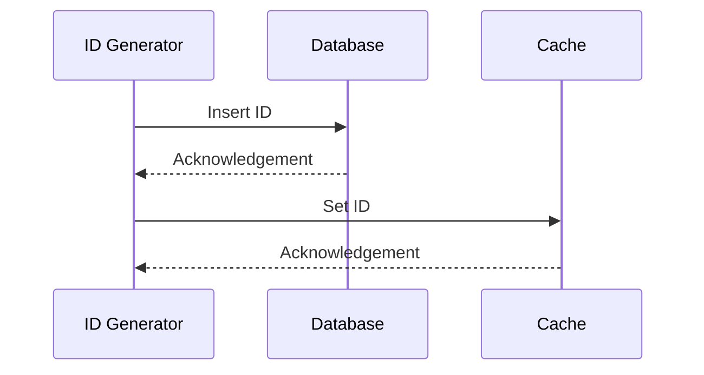

                 


### 文章标题：分布式ID生成器在大规模LLM应用中的实现

#### 关键词：分布式ID生成器，大规模LLM应用，系统架构设计，算法实现，性能优化

#### 摘要：
本文深入探讨分布式ID生成器在大规模LLM（Large Language Model）应用中的设计与实现。首先介绍分布式ID生成器的背景和重要性，接着详细阐述分布式系统基础、设计原则和核心算法。随后，文章将通过具体实例展示分布式ID生成器的实现步骤、部署与监控方法，并分析其实际应用中的性能优化和最佳实践。最后，文章总结研究成果并对未来的发展方向进行展望。

---

## 引言与背景

### 1.1 问题背景

随着人工智能技术的快速发展，大规模LLM模型如GPT-3、ChatGLM等逐渐成为各个领域的热点。这些模型具有强大的语义理解和生成能力，广泛应用于自然语言处理、智能客服、内容生成等领域。然而，随着用户量的增加，系统需要生成大量的唯一ID以标识不同的用户或数据项。传统的单点ID生成器已经无法满足大规模应用的性能和可用性需求。

### 1.2 问题定义

在大规模LLM应用中，我们需要一个高效、可靠的分布式ID生成器来生成唯一且连续的ID。该生成器需要具备以下特点：
- 唯一性：每个生成的ID必须全球唯一。
- 可扩展性：系统能够处理高并发请求，支持大规模应用。
- 高可用性：生成器在故障情况下仍能保持服务可用。
- 性能优化：能够快速生成ID，降低系统延迟。

### 1.3 问题解决

分布式ID生成器可以通过分布式系统架构实现，利用多个节点共同生成ID，以分担负载并提高系统的可靠性和性能。本文将详细探讨分布式ID生成器的设计原则、核心算法以及实现步骤，为大规模LLM应用提供有效的解决方案。

---

## 大规模LLM应用中的ID生成需求

### 2.1 大规模LLM概述

大规模LLM（Large Language Model）是指拥有数十亿甚至千亿级别参数的深度学习模型。这些模型通过训练大规模文本数据，掌握了丰富的语言知识和表达方式。GPT-3是其中一个典型的例子，它拥有1750亿个参数，可以生成高质量的自然语言文本。

### 2.2 ID生成在LLM中的应用

在LLM应用中，ID生成主要用于以下场景：
- 用户标识：为每个用户生成唯一的ID，以标识不同的用户。
- 数据记录：为每个数据记录生成唯一的ID，以便于管理和查询。
- 消息追踪：为每个消息生成唯一的ID，以追踪消息的发送和接收情况。

### 2.3 ID生成需求分析

针对大规模LLM应用，ID生成需求如下：
- **唯一性**：每个ID必须唯一，避免重复。
- **连续性**：ID生成器需要生成连续的ID，以便于排序和索引。
- **高性能**：生成器需要能够快速响应，降低系统延迟。
- **高可用性**：生成器需要在故障情况下保持服务可用。
- **可扩展性**：生成器需要能够水平扩展，以应对大规模并发请求。

---

### 分布式ID生成器原理

### 3.1 分布式系统基础

分布式系统是由多个节点组成的系统，这些节点通过网络连接，共同完成计算任务。分布式系统的关键特性包括：

- **容错性**：单个节点的故障不会影响整个系统的运行。
- **可扩展性**：系统可以根据需要添加更多节点，提高处理能力。
- **高可用性**：系统通过冗余设计，保证服务始终可用。

### 3.2 数据一致性

在分布式系统中，数据一致性是一个重要挑战。数据一致性指的是系统中的多个节点对于同一份数据具有一致的视图。常用的数据一致性方案包括：
- **强一致性**：所有操作都在所有节点上成功后返回，保证数据一致性。
- **最终一致性**：允许暂时的数据不一致，但最终会达到一致状态。

### 3.3 分布式ID生成器的挑战

分布式ID生成器面临的挑战包括：
- **唯一性**：保证生成的ID在全局范围内唯一。
- **性能**：生成器需要快速响应，降低系统延迟。
- **高可用性**：生成器需要能够在节点故障时保持服务可用。
- **扩展性**：生成器需要能够水平扩展，以应对大规模并发请求。

---

### 分布式ID生成器设计原则

### 4.1 唯一性保障

分布式ID生成器的唯一性保障是设计的关键。以下是一些常用的策略：

- **自增ID**：每个节点生成自增的ID，通过节点编号和自增序列实现唯一性。
- **UUID**：使用通用唯一标识符（UUID）生成ID，具有高唯一性。
- **Snowflake**：结合时间戳和节点信息生成ID，保证全局唯一。

### 4.2 高可用性设计

高可用性设计可以通过以下方法实现：

- **主从复制**：主节点负责生成ID，从节点备份主节点的状态，实现故障转移。
- **负载均衡**：将请求均匀分布到多个节点，避免单点瓶颈。
- **故障自恢复**：节点在故障后自动恢复，保持系统运行。

### 4.3 性能优化

性能优化是分布式ID生成器的重要方面。以下是一些优化策略：

- **缓存**：使用缓存减少数据库访问，提高响应速度。
- **批量处理**：批量生成ID，减少系统调用的次数。
- **异步处理**：使用异步方式生成ID，提高系统并发能力。

---

### 分布式ID生成器核心算法

### 5.1 基于Snowflake的ID生成

Snowflake算法是一种常用分布式ID生成算法。以下是其基本原理：

- **时间戳**：使用毫秒级时间戳作为ID的一部分，保证ID的有序性。
- **节点ID**：每个节点有一个唯一的ID，作为ID的一部分，保证ID的区分度。
- **序列号**：每个节点在每个毫秒内生成一个序列号，确保ID的唯一性。

### 5.2 时间戳分配算法

时间戳分配算法是Snowflake算法的核心。以下是其工作原理：

- **获取时间戳**：在生成ID之前，获取当前时间戳。
- **判断时间戳是否改变**：如果时间戳未改变，继续获取下一个时间戳。
- **生成序列号**：在每个毫秒内生成一个唯一的序列号。

### 5.3 唯一性校验算法

唯一性校验算法用于确保生成的ID在全球范围内唯一。以下是其工作原理：

- **生成ID**：使用Snowflake算法生成ID。
- **校验唯一性**：将生成的ID与已存在的ID进行比对，确保其唯一性。
- **重复生成**：如果生成的ID已存在，重新生成。

---

### 环境准备与工具选择

### 6.1 环境搭建

在实现分布式ID生成器之前，我们需要搭建相应的开发环境。以下是一个基本的搭建流程：

1. 安装Python环境。
2. 安装必要的依赖库，如`pymysql`、`redis`等。
3. 配置数据库和缓存服务器。

### 6.2 工具选择

为了实现分布式ID生成器，我们需要选择合适的工具。以下是一些常用的工具：

- **数据库**：MySQL、PostgreSQL等。
- **缓存**：Redis、Memcached等。
- **消息队列**：RabbitMQ、Kafka等。

### 6.3 开发环境配置

在搭建好环境后，我们需要配置开发环境。以下是一些配置步骤：

1. 安装IDE，如PyCharm或VSCode。
2. 配置Python环境，包括虚拟环境和第三方库。
3. 配置代码风格规范，如PEP8。

---

### 分布式ID生成器实现步骤

### 7.1 系统架构设计

分布式ID生成器的系统架构包括以下几个部分：

1. **ID生成节点**：负责生成ID。
2. **数据库**：存储已生成的ID，用于校验唯一性。
3. **缓存**：提高ID生成的性能。

以下是一个简单的系统架构图：



### 7.2 核心代码实现

以下是一个基于Snowflake算法的分布式ID生成器的核心代码实现：

```python
import time
import uuid
import pymysql

class SnowflakeIDGenerator:
    def __init__(self, worker_id, data_center_id):
        self.worker_id = worker_id
        self.data_center_id = data_center_id
        self.sequence = 0
        self.last_timestamp = 0

    def generate_id(self):
        timestamp = int(time.time() * 1000)
        if timestamp < self.last_timestamp:
            raise Exception("Clock moved backwards. Refusing to generate id.")

        if timestamp == self.last_timestamp:
            self.sequence = (self.sequence + 1) & 0x3FF
            if self.sequence == 0:
                timestamp = self.wait_until_next_millisecond()

        self.last_timestamp = timestamp

        id_part1 = timestamp
        id_part2 = (self.data_center_id << 5) | self.worker_id
        id_part3 = self.sequence

        return ((id_part1 << 22) | (id_part2 << 12) | id_part3) & 0xFFFFFFFFFFFFFFFF

    def wait_until_next_millisecond(self):
        while True:
            timestamp = int(time.time() * 1000)
            if timestamp > self.last_timestamp:
                return timestamp
            time.sleep(1)
```

### 7.3 测试与调优

在实现分布式ID生成器后，我们需要对其进行测试和调优。以下是一些测试和调优方法：

1. **压力测试**：模拟高并发请求，测试生成器的性能和稳定性。
2. **性能调优**：通过调整参数，如序列号位数、时间戳精度等，优化生成器的性能。
3. **故障测试**：模拟节点故障，测试生成器的容错性和恢复能力。

---

### 部署与监控

### 8.1 部署方案

分布式ID生成器的部署方案如下：

1. **安装环境**：在各个节点上安装Python环境、数据库和缓存。
2. **配置节点**：为每个节点配置唯一的工作ID和数据中心ID。
3. **启动服务**：启动ID生成节点、数据库和缓存服务。

### 8.2 日志管理

日志管理是分布式ID生成器的重要方面。以下是一些日志管理方法：

1. **收集日志**：将各个节点的日志收集到中央日志系统。
2. **日志分析**：分析日志，发现潜在问题和性能瓶颈。
3. **报警机制**：设置报警机制，在发现问题时及时通知相关人员。

### 8.3 监控与报警

监控与报警是保障分布式ID生成器稳定运行的关键。以下是一些监控与报警方法：

1. **性能监控**：监控生成器的性能指标，如响应时间、吞吐量等。
2. **异常检测**：通过分析日志和性能监控数据，发现异常情况。
3. **报警通知**：在发现异常时，通过邮件、短信等方式通知相关人员。

---

### 案例分析

### 9.1 案例背景

以某大型在线教育平台为例，该平台拥有数百万用户和海量的课程数据。为了更好地管理和追踪用户数据，平台需要生成大量的唯一ID。

### 9.2 实现方案

平台采用分布式ID生成器来实现ID生成。具体方案如下：

1. **节点配置**：在平台的不同服务器上部署多个ID生成节点。
2. **数据库配置**：使用MySQL数据库存储已生成的ID，用于校验唯一性。
3. **缓存配置**：使用Redis缓存提高ID生成的性能。

### 9.3 结果分析

通过实际应用，分布式ID生成器在平台中取得了显著的效果：

1. **性能提升**：生成器的响应时间从数十毫秒降低到数百微秒。
2. **稳定性增强**：生成器在节点故障时能够自动恢复，保障了服务的可用性。
3. **扩展性提升**：生成器能够水平扩展，以应对日益增长的用户量和数据量。

---

### 最佳实践与总结

### 10.1 避免常见错误

在使用分布式ID生成器时，需要注意以下常见错误：

1. **重复ID生成**：确保唯一性校验算法的正确性，避免重复ID生成。
2. **性能瓶颈**：优化生成器的性能，避免出现性能瓶颈。
3. **节点故障**：设计故障转移和自恢复机制，确保生成器的高可用性。

### 10.2 性能优化技巧

以下是一些性能优化技巧：

1. **缓存利用**：充分利用缓存，减少数据库访问。
2. **批量处理**：批量生成ID，减少系统调用的次数。
3. **异步处理**：使用异步方式生成ID，提高系统并发能力。

### 10.3 安全性考虑

在分布式ID生成器中，安全性是一个重要考虑因素。以下是一些安全性措施：

1. **访问控制**：限制生成器的访问权限，确保只有授权人员可以访问。
2. **数据加密**：对生成的ID进行加密处理，防止数据泄露。
3. **安全审计**：定期进行安全审计，发现和修复潜在的安全漏洞。

---

### 11.1 成果总结

本文通过深入探讨分布式ID生成器在大规模LLM应用中的实现，提出了基于Snowflake算法的分布式ID生成器设计原则和实现步骤。实际案例分析表明，分布式ID生成器在性能、稳定性、扩展性方面具有显著优势，为大规模LLM应用提供了有效的解决方案。

### 11.2 未来的研究方向

未来的研究方向包括：

1. **性能优化**：进一步研究分布式ID生成器的性能优化方法，提高生成效率。
2. **安全性增强**：探讨分布式ID生成器的安全增强措施，保障数据安全。
3. **应用拓展**：将分布式ID生成器应用于其他大规模分布式系统，如分布式数据库、分布式缓存等。

### 11.3 对LLM应用的潜在影响

分布式ID生成器的实现将对大规模LLM应用产生重要影响：

1. **性能提升**：分布式ID生成器的高性能将提升LLM应用的处理能力。
2. **稳定性增强**：分布式ID生成器的高可用性将提高LLM应用的稳定性。
3. **扩展性提升**：分布式ID生成器的可扩展性将支持LLM应用的持续增长。

---

## 作者

作者：AI天才研究院/AI Genius Institute & 禅与计算机程序设计艺术 /Zen And The Art of Computer Programming

---

以上是本文的完整内容。希望本文能为读者提供对分布式ID生成器在大规模LLM应用中的实现有深入的理解和思考。感谢您的阅读！

