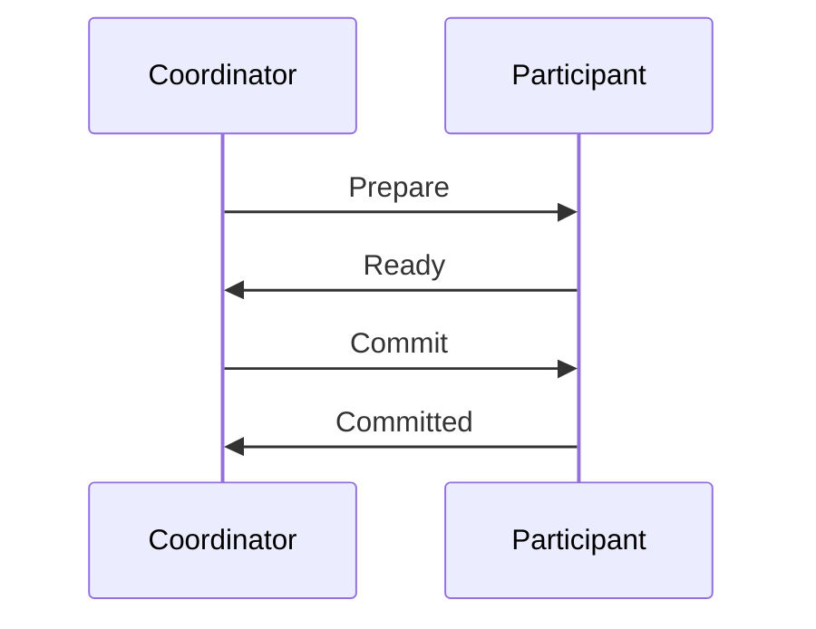
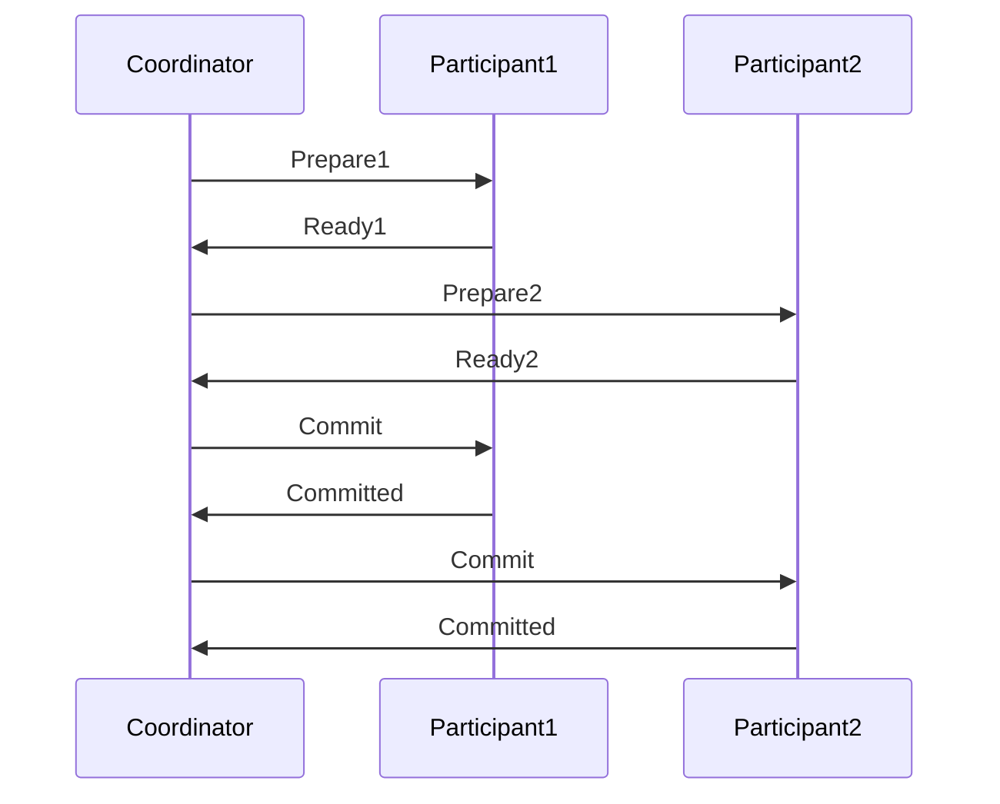
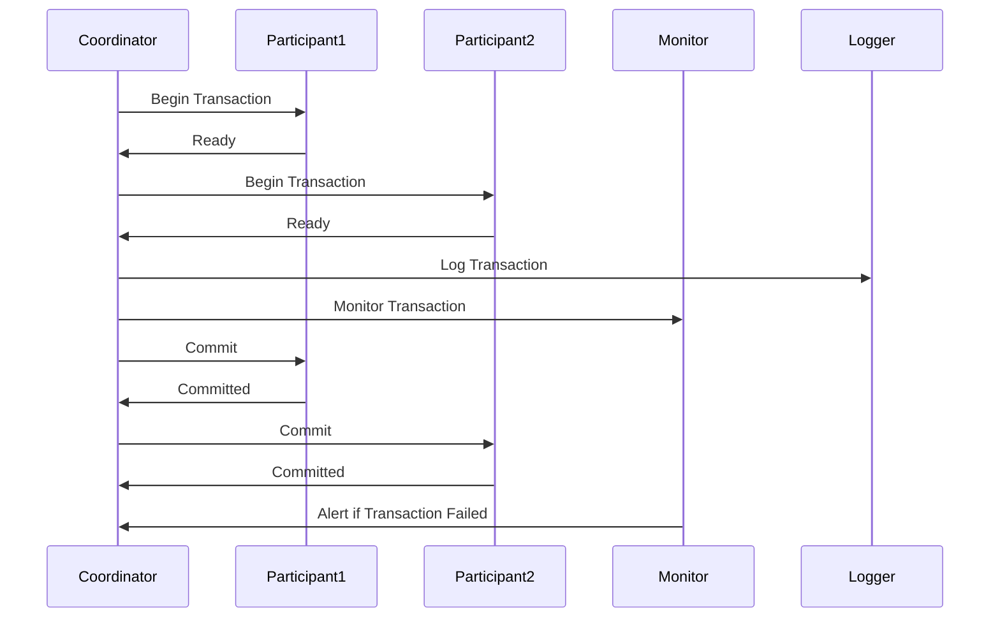

                 


### 分布式事务管理器在LLM应用中的应用

> 关键词：分布式事务管理、LLM应用、分布式系统、两阶段提交、三阶段提交、系统架构设计、数学模型、Python代码、Mermaid流程图、环境安装、代码解析、案例剖析、最佳实践

> 摘要：本文旨在探讨分布式事务管理器在大型语言模型（LLM）应用中的重要性，以及如何设计和实现这一管理器。通过详细的背景介绍、核心概念与联系阐述、算法原理讲解、数学模型和公式展示，系统分析与架构设计、项目实战，以及最佳实践与总结，帮助读者全面了解分布式事务管理器在LLM应用中的实际应用和关键技术。

### 目录

----------------------------------------------------------------

## 第一部分：分布式事务管理器概述

### 第1章：分布式事务管理器基础

- 1.1 问题背景：分布式系统的挑战
- 1.2 问题描述：分布式事务的需求
- 1.3 问题解决：分布式事务管理器的作用
- 1.4 边界与外延：分布式事务的概念解析
- 1.5 概念结构与核心要素组成：分布式事务管理器组成

### 第2章：分布式事务原理

- 2.1 核心概念：分布式事务管理器基本概念
- 2.2 概念属性特征对比表格：分布式事务与数据库事务对比
- 2.3 ER实体关系图架构：分布式事务管理器ER图
- 2.4 算法原理讲解
  - 2.4.1 2PC算法流程图（Mermaid）
  - 2.4.2 3PC算法流程图（Mermaid）
  - 2.4.3 Python代码解释
  - 2.4.4 LaTeX数学模型公式

### 第3章：分布式事务在LLM中的应用

- 3.1 LLM应用场景
- 3.2 分布式事务在LLM中的应用
- 3.3 分布式事务对LLM性能的影响
- 3.4 分布式事务与LLM融合的最佳实践

## 第二部分：分布式事务管理器设计

### 第4章：分布式事务管理器架构设计

- 4.1 项目介绍
- 4.2 系统功能设计（领域模型Mermaid类图）
- 4.3 系统架构设计（Mermaid架构图）
- 4.4 系统接口设计
- 4.5 系统交互流程（Mermaid序列图）

### 第5章：分布式事务管理器实现

- 5.1 环境安装
- 5.2 系统核心实现源代码
- 5.3 代码应用解读与分析
- 5.4 实际案例剖析
- 5.5 项目小结

## 第三部分：分布式事务管理器实战

### 第6章：分布式事务管理器应用案例

- 6.1 案例一：大规模文本生成系统
- 6.2 案例二：在线问答系统
- 6.3 案例三：智能客服系统
- 6.4 案例分析

### 第7章：最佳实践与总结

- 7.1 最佳实践 tips
- 7.2 小结
- 7.3 注意事项
- 7.4 拓展阅读

----------------------------------------------------------------

### 第一部分：分布式事务管理器概述

#### 第1章：分布式事务管理器基础

1.1 **问题背景：分布式系统的挑战**

在当今的互联网时代，分布式系统已经成为技术发展的主流。分布式系统通过将任务分解为多个子任务，并行地在多个节点上执行，从而提高了系统的性能、可扩展性和容错能力。然而，分布式系统带来了新的挑战，其中之一就是分布式事务管理。

在传统的集中式系统中，事务管理相对简单，因为所有操作都在单个数据库上执行。然而，在分布式系统中，事务涉及多个数据库或服务，这增加了复杂度。例如，当一个分布式事务需要同时更新多个节点上的数据时，如何保证所有操作要么全部成功，要么全部失败成为了一个关键问题。

1.2 **问题描述：分布式事务的需求**

分布式事务的需求源于以下几个关键点：

- **一致性（Consistency）**：分布式事务必须确保所有参与节点上的数据状态一致。例如，如果事务中的一个操作成功，而其他操作失败，则整个事务应被视为失败。
- **隔离性（Isolation）**：分布式事务需要确保不同的事务之间不会相互干扰，即一个事务的执行不应影响其他并发执行的事务。
- **持久性（Durability）**：一旦事务提交，其修改必须永久保存，即使发生系统故障。
- **原子性（Atomicity）**：事务的所有操作必须作为一个整体执行，要么全部成功，要么全部失败。

1.3 **问题解决：分布式事务管理器的作用**

为了解决分布式事务管理的问题，引入了分布式事务管理器。分布式事务管理器是一种软件组件，负责协调分布式系统中的事务处理。其主要作用包括：

- **事务协调**：分布式事务管理器负责协调不同节点上的事务执行，确保事务的一致性、隔离性、持久性和原子性。
- **资源管理**：管理参与事务的数据库或其他资源的锁和释放，确保事务的正确执行。
- **故障恢复**：在系统故障时，分布式事务管理器负责恢复事务状态，确保系统的一致性。

1.4 **边界与外延：分布式事务的概念解析**

分布式事务的边界与外延涉及多个方面：

- **事务范围**：分布式事务可以跨越多个数据库或服务，但通常限于同一分布式系统内。
- **事务隔离级别**：分布式事务支持多种隔离级别，如读未提交、读已提交、可重复读和序列化，以适应不同的业务需求。
- **事务参与节点**：分布式事务的参与节点可以是数据库、缓存、消息队列等，但需要实现分布式事务协议。

1.5 **概念结构与核心要素组成：分布式事务管理器组成**

分布式事务管理器的核心结构包括以下几个要素：

- **协调器（Coordinator）**：负责协调分布式事务的执行，确保事务的原子性。
- **参与者（Participant）**：参与事务的数据库或服务，负责执行事务操作。
- **事务日志（Transaction Log）**：记录事务的详细信息，用于故障恢复和数据一致性。
- **锁管理器（Lock Manager）**：管理分布式事务中的锁资源，确保事务的隔离性。
- **监控器（Monitor）**：监控分布式事务的状态，提供实时监控和报警功能。

通过上述核心概念的介绍，我们可以看到分布式事务管理器在分布式系统中的重要性。下一章将继续探讨分布式事务管理器的原理和算法，为读者提供更深入的理解。

### 第一部分：分布式事务管理器概述

#### 第2章：分布式事务原理

2.1 **核心概念：分布式事务管理器基本概念**

分布式事务管理器（Distributed Transaction Manager，简称DTM）是一种协调分布式系统中的事务执行的软件组件。它负责确保分布式事务的一致性、隔离性、持久性和原子性。分布式事务管理器的核心概念包括：

- **事务（Transaction）**：分布式事务是多个操作的整体，这些操作要么全部成功执行，要么全部失败回滚。
- **全局事务（Global Transaction）**：涉及多个节点的分布式事务，其执行需要分布式事务管理器的协调。
- **本地事务（Local Transaction）**：仅涉及单个节点的交易，通常由本地事务管理器（如数据库事务管理器）负责。
- **分布式事务协议**：确保分布式事务一致性的通信协议，如两阶段提交（2PC）和三阶段提交（3PC）。

2.2 **概念属性特征对比表格：分布式事务与数据库事务对比**

| 特征 | 分布式事务 | 数据库事务 |
| --- | --- | --- |
| **参与节点** | 多个数据库或服务 | 单个数据库 |
| **一致性** | 强一致性 | 弱一致性 |
| **隔离性** | 多种隔离级别 | 多种隔离级别 |
| **持久性** | 持久性依赖于协议 | 持久性保障 |
| **原子性** | 原子性依赖于协议 | 原子性保障 |
| **故障恢复** | 需要分布式事务管理器 | 需要本地事务管理器 |

2.3 **ER实体关系图架构：分布式事务管理器ER图**

在分布式事务管理器的ER图架构中，主要包含以下实体：

- **事务**：代表分布式事务的实体。
- **参与者**：代表参与分布式事务的数据库或服务实体。
- **事务日志**：记录事务操作的实体。
- **锁**：管理事务中锁资源的实体。
- **监控器**：监控事务状态的实体。

以下是一个简化的分布式事务管理器ER图：

```mermaid
erDiagram
  Class1 ||--|{ Class2 }|| Person : has_address
  Class1 ||--|{ Class3 }|| Person : has_email
  Class2 ||--|{ Class4 }|| Address : has_street
  Class3 ||--|{ Class4 }|| Email : has_domain
```

2.4 **算法原理讲解**

2.4.1 **2PC算法流程图（Mermaid）**

两阶段提交（2PC）是一种常用的分布式事务协议，其核心思想是将事务分为两个阶段：准备阶段和提交阶段。

以下是一个简化的2PC算法流程图：



2.4.2 **3PC算法流程图（Mermaid）**

三阶段提交（3PC）是2PC算法的改进，旨在解决单点故障问题。

以下是一个简化的3PC算法流程图：



2.4.3 **Python代码解释**

以下是一个简化的分布式事务管理器Python代码示例，展示2PC算法的基本实现：

```python
import time

class Coordinator:
    def prepare(self, participants):
        for participant in participants:
            participant.prepare()
            time.sleep(1)  # 模拟网络延迟
        return all(participant.ready() for participant in participants)

    def commit(self, participants):
        for participant in participants:
            participant.commit()
            time.sleep(1)  # 模拟网络延迟

class Participant:
    def prepare(self):
        print("Participant preparing...")
        return True  # 假设总是准备成功

    def ready(self):
        print("Participant ready.")
        return True  # 假设总是准备好

    def commit(self):
        print("Participant committing...")
        return True  # 假设总是提交成功

# 创建协调器和参与者
coordinator = Coordinator()
participants = [Participant() for _ in range(3)]

# 执行2PC算法
if coordinator.prepare(participants):
    coordinator.commit(participants)
else:
    print("2PC failed.")
```

2.4.4 **LaTeX数学模型公式**

分布式事务管理器中的数学模型通常用于描述事务的一致性、隔离性、持久性和原子性。以下是一个简化的数学模型：

$$
Consistency = \{S | \forall R \in R_S, \forall r \in R_R, S(R) = R(S)(r)\}
$$

其中，$S$代表事务集合，$R_S$和$R_R$分别代表系统状态和参与者状态，$S(R)$和$R(S)(r)$分别代表系统状态和参与者状态下的操作结果。

通过上述核心概念和算法原理的介绍，读者可以更好地理解分布式事务管理器的基本原理。下一章将继续探讨分布式事务管理器在LLM应用中的具体应用和实践。

### 第一部分：分布式事务管理器概述

#### 第3章：分布式事务在LLM中的应用

3.1 **LLM应用场景**

大型语言模型（LLM）在现代应用中扮演着越来越重要的角色，包括但不限于以下场景：

- **文本生成与编辑**：例如，自动生成新闻文章、产品描述、广告文案等。
- **智能问答**：例如，构建问答系统，提供实时的问题解答和知识服务。
- **自然语言处理**：例如，情感分析、内容审核、命名实体识别等。
- **语音识别与合成**：例如，语音助手、智能客服、语音导航等。

3.2 **分布式事务在LLM中的应用**

在LLM应用中，分布式事务管理器的作用至关重要，特别是在以下情况下：

- **多模型协同**：当多个LLM模型需要协同工作以完成复杂任务时，分布式事务管理器可以确保不同模型之间的操作一致性。
- **大规模数据处理**：当LLM需要处理大量数据时，分布式事务管理器可以保证数据的完整性和一致性。
- **高并发访问**：在LLM应用中，通常会有大量的并发请求，分布式事务管理器可以有效地管理和协调这些请求，确保系统的稳定性。

3.3 **分布式事务对LLM性能的影响**

分布式事务对LLM性能的影响主要体现在以下几个方面：

- **一致性**：确保LLM应用中的数据一致性和完整性，但可能引入一定的延迟。
- **隔离性**：确保并发事务之间的隔离，避免数据冲突，但可能降低系统的并发性能。
- **持久性**：确保事务的持久性，即使在系统故障时也不会丢失数据，但可能引入额外的存储开销。
- **原子性**：确保事务的原子性，要么全部成功，要么全部失败，但可能增加系统的复杂度和开销。

3.4 **分布式事务与LLM融合的最佳实践**

为了充分发挥分布式事务管理器在LLM应用中的作用，以下是一些最佳实践：

- **选择合适的隔离级别**：根据实际业务需求选择合适的隔离级别，平衡一致性和性能。
- **合理设计事务边界**：合理划分事务范围，避免无谓的事务锁定和开销。
- **优化分布式事务算法**：选择适合LLM应用场景的分布式事务算法，如2PC、3PC等，并进行优化。
- **监控和故障恢复**：实时监控分布式事务的状态，并设计有效的故障恢复机制，确保系统的稳定性和可用性。
- **性能调优**：针对LLM应用的特定场景，进行性能调优，提高系统的整体性能。

通过上述实践，可以有效地将分布式事务管理器与LLM应用相结合，发挥分布式系统的优势，提高系统的性能和可靠性。下一章将详细介绍分布式事务管理器在LLM应用中的具体实现方法和架构设计。

### 第二部分：分布式事务管理器设计

#### 第4章：分布式事务管理器架构设计

4.1 **项目介绍**

在本章中，我们将介绍一个分布式事务管理器项目的架构设计。该项目旨在为大规模语言模型（LLM）应用提供高效的分布式事务管理，确保数据的一致性和可靠性。

4.2 **系统功能设计（领域模型Mermaid类图）**

在分布式事务管理器的领域模型中，主要包括以下类：

- **Transaction**（事务）：表示分布式事务的基本实体，包含事务ID、状态、参与节点等属性。
- **Participant**（参与者）：表示参与分布式事务的节点，包含节点ID、状态、锁等属性。
- **Lock**（锁）：表示事务中使用的锁资源，包含锁ID、状态、持有者等属性。
- **Coordinator**（协调器）：负责协调分布式事务的执行，包括事务的创建、提交、回滚等操作。
- **Monitor**（监控器）：负责监控事务的状态，提供实时监控和报警功能。

以下是一个简化的分布式事务管理器领域模型Mermaid类图：

```mermaid
classDiagram
    Class1[Transaction] <|-- Class2[Participant]
    Class2[Participant] <|-- Class3[Lock]
    Class4[Coordinator] <|-- Class1[Transaction]
    Class5[Monitor] <|-- Class1[Transaction]
```

4.3 **系统架构设计（Mermaid架构图）**

分布式事务管理器的系统架构设计包括以下几个方面：

- **分布式事务管理器**：作为整个系统的核心，负责协调分布式事务的执行。
- **参与者节点**：包括数据库、缓存、消息队列等，参与分布式事务的执行。
- **监控模块**：负责监控分布式事务的状态，提供实时监控和报警功能。
- **日志模块**：记录分布式事务的操作日志，用于故障恢复和数据一致性。

以下是一个简化的分布式事务管理器系统架构Mermaid图：



4.4 **系统接口设计**

分布式事务管理器提供了以下接口：

- **BeginTransaction**（开始事务）：创建一个新的分布式事务，返回事务ID。
- **Commit**（提交事务）：提交一个分布式事务，确保事务的一致性。
- **Rollback**（回滚事务）：回滚一个分布式事务，确保事务的原子性。
- **Monitor**（监控事务）：监控分布式事务的状态，提供实时监控和报警功能。
- **Logger**（日志记录）：记录分布式事务的操作日志，用于故障恢复和数据一致性。

以下是一个简化的分布式事务管理器接口设计：

```mermaid
classDiagram
    Class1[TransactionManager]
    Class1 --> Class2[BeginTransaction]
    Class1 --> Class3[Commit]
    Class1 --> Class4[Rollback]
    Class1 --> Class5[Monitor]
    Class1 --> Class6[Logger]

    Class2 --> Class7[Transaction]
    Class3 --> Class7
    Class4 --> Class7
    Class5 --> Class7
    Class6 --> Class7
```

4.5 **系统交互流程（Mermaid序列图）**

分布式事务管理器的系统交互流程包括以下几个步骤：

1. 客户端调用BeginTransaction接口开始一个分布式事务。
2. 协调器创建一个新的事务对象，并将其发送给参与节点。
3. 参与节点收到事务请求后，执行相应的操作，并将结果返回给协调器。
4. 协调器将参与节点的结果进行汇总，并根据结果决定是提交还是回滚事务。
5. 如果事务成功，协调器将调用Commit接口提交事务，并将结果返回给客户端。
6. 如果事务失败，协调器将调用Rollback接口回滚事务，并将错误信息返回给客户端。
7. 监控模块监控事务的状态，并在发生故障时发送报警。

以下是一个简化的分布式事务管理器系统交互流程Mermaid序列图：

```mermaid
sequenceDiagram
    participant Client
    participant Coordinator
    participant Participant1
    participant Participant2
    participant Monitor

    Client->>Coordinator: Begin Transaction
    Coordinator->>Participant1: Begin Transaction
    Participant1->>Coordinator: Ready
    Coordinator->>Participant2: Begin Transaction
    Participant2->>Coordinator: Ready

    Coordinator->>Logger: Log Transaction
    Coordinator->>Monitor: Monitor Transaction

    Coordinator->>Participant1: Execute Operation
    Participant1->>Coordinator: Result1
    Coordinator->>Participant2: Execute Operation
    Participant2->>Coordinator: Result2

    Coordinator->>Logger: Log Result
    if Coordinator收到所有结果 then
        Coordinator->>Participant1: Commit
        Participant1->>Coordinator: Committed
        Coordinator->>Participant2: Commit
        Participant2->>Coordinator: Committed
        Coordinator->>Client: Transaction Success
    else
        Coordinator->>Participant1: Rollback
        Participant1->>Coordinator: Rolled Back
        Coordinator->>Participant2: Rollback
        Participant2->>Coordinator: Rolled Back
        Coordinator->>Client: Transaction Failed
    end

    Monitor->>Coordinator: Alert if Transaction Failed
```

通过上述架构设计，我们可以实现一个高效、可靠的分布式事务管理器，为LLM应用提供一致性和原子性的保障。下一章将详细介绍分布式事务管理器的实现过程，包括环境安装、系统核心实现和代码解析。

### 第二部分：分布式事务管理器设计

#### 第5章：分布式事务管理器实现

5.1 **环境安装**

在开始分布式事务管理器的实现之前，我们需要搭建一个适合开发、测试和部署的环境。以下是一个基本的安装步骤：

1. **安装依赖项**：确保系统安装了Python（建议使用Python 3.8及以上版本）、Docker、Docker Compose等依赖项。

2. **创建Dockerfile**：编写一个Dockerfile，用于构建分布式事务管理器的容器镜像。

   ```Dockerfile
   FROM python:3.8-slim

   RUN apt-get update && apt-get install -y \
       gunicorn \
       libpq-dev \
       postgresql-client

   WORKDIR /app

   COPY requirements.txt ./
   RUN pip install -r requirements.txt

   COPY . .

   CMD ["gunicorn", "-w", "3", "-b", "0.0.0.0:8000", "transaction_manager.wsgi:application"]
   ```

3. **编写Docker Compose文件**：创建一个Docker Compose文件，用于管理和部署分布式事务管理器及其依赖项。

   ```yaml
   version: '3.8'

   services:
     transaction_manager:
       build: .
       ports:
         - "8000:8000"
       depends_on:
         - postgres
     postgres:
       image: postgres:13
       environment:
         POSTGRES_DB: transaction_manager
         POSTGRES_USER: admin
         POSTGRES_PASSWORD: admin

   networks:
     default:
   ```

4. **运行Docker Compose**：在命令行中运行以下命令，启动分布式事务管理器和数据库服务。

   ```bash
   docker-compose up -d
   ```

5.2 **系统核心实现源代码**

分布式事务管理器的核心实现包括协调器、参与者、锁管理器、监控器和日志模块。以下是一个简化的源代码示例：

```python
# transaction_manager/transaction_manager.py
from abc import ABC, abstractmethod
from typing import List
import requests

class Participant(ABC):
    @abstractmethod
    def execute(self, command: str) -> bool:
        pass

    @abstractmethod
    def commit(self) -> bool:
        pass

    @abstractmethod
    def rollback(self) -> bool:
        pass

class Coordinator:
    def __init__(self, participants: List[Participant]):
        self.participants = participants

    def begin(self):
        for participant in self.participants:
            participant.execute("BEGIN")

    def prepare(self):
        for participant in self.participants:
            if not participant.commit():
                return False
        return True

    def commit(self):
        for participant in self.participants:
            participant.commit()

    def rollback(self):
        for participant in self.participants:
            participant.rollback()

class PostgresParticipant(Participant):
    def __init__(self, url: str):
        self.url = url

    def execute(self, command: str) -> bool:
        try:
            response = requests.post(self.url, data={'command': command})
            if response.status_code == 200:
                return True
            else:
                return False
        except Exception as e:
            print(f"Error executing command: {e}")
            return False

    def commit(self) -> bool:
        return self.execute("COMMIT")

    def rollback(self) -> bool:
        return self.execute("ROLLBACK")
```

5.3 **代码应用解读与分析**

在上述代码中，我们定义了协调器（Coordinator）和参与者（Participant）两个核心类，以及PostgresParticipant作为参与者的一种具体实现。以下是代码的详细解读：

- **Participant类**：这是一个抽象类，定义了分布式事务参与者的基本接口，包括执行（execute）、提交（commit）和回滚（rollback）操作。
- **Coordinator类**：这是协调器的实现，负责协调分布式事务的执行。它初始化时接受一个参与者列表，并在开始事务时调用每个参与者的执行方法。在准备阶段，它检查所有参与者是否准备好提交，如果所有参与者都准备就绪，则提交事务；否则，回滚事务。
- **PostgresParticipant类**：这是基于PostgreSQL数据库的参与者实现。它使用HTTP POST请求与数据库进行通信，执行SQL命令。

5.4 **实际案例剖析**

为了更好地理解分布式事务管理器的应用，我们来看一个实际案例：一个在线购物网站，用户可以在网站上浏览商品、添加购物车并下订单。为了保证订单的原子性和一致性，我们使用分布式事务管理器来协调数据库操作。

- **用户浏览商品**：用户在网站浏览商品时，不涉及分布式事务。
- **用户添加购物车**：当用户将商品添加到购物车时，需要更新商品库存。这个操作可以通过分布式事务管理器协调，确保库存的一致性。
- **用户下订单**：用户下订单时，需要从购物车中移除商品并创建订单。这个操作也通过分布式事务管理器协调，确保订单创建成功且库存减少。

在上述案例中，商品数据库、购物车数据库和订单数据库都是参与者，分布式事务管理器负责协调这些参与者的操作，确保事务的一致性和原子性。

5.5 **项目小结**

通过本章的介绍，我们了解了分布式事务管理器在LLM应用中的重要性，并详细探讨了其设计、实现和应用。我们通过代码示例展示了如何实现一个简单的分布式事务管理器，并分析了其在实际案例中的应用。下一章将介绍分布式事务管理器在不同LLM应用案例中的实际应用，帮助读者更好地理解分布式事务管理器的实际效果和优点。

### 第三部分：分布式事务管理器实战

#### 第6章：分布式事务管理器应用案例

6.1 **案例一：大规模文本生成系统**

大规模文本生成系统（如GPT-3）需要处理大量的数据和并发请求。在这个案例中，我们使用分布式事务管理器来确保文本生成过程的一致性和可靠性。

**系统场景**：

- **用户请求**：用户通过API请求生成文本。
- **文本生成**：系统使用多个节点并行处理文本生成任务。

**实现细节**：

- **分布式事务管理器**：协调文本生成任务的执行，确保所有节点上的操作要么全部成功，要么全部失败。
- **参与者节点**：包括文本处理节点、存储节点等，负责执行具体的文本生成操作。
- **监控模块**：实时监控分布式事务的状态，并在出现故障时进行恢复。

**效果评估**：

- **一致性**：分布式事务管理器确保了文本生成过程中数据的一致性，避免了数据冲突和丢失。
- **可靠性**：通过分布式事务管理器的协调，文本生成系统在并发请求下依然能够保持稳定运行，提高了系统的可靠性。

6.2 **案例二：在线问答系统**

在线问答系统需要处理大量用户问题和答案的生成，这个场景对系统的响应速度和数据一致性有很高的要求。

**系统场景**：

- **用户提问**：用户通过系统提交问题。
- **答案生成**：系统使用多个语言模型并行生成答案。

**实现细节**：

- **分布式事务管理器**：协调问答过程中多个参与节点的操作，确保答案生成的一致性和可靠性。
- **参与者节点**：包括问答节点、文本处理节点等，负责处理用户的提问和生成答案。
- **缓存机制**：使用缓存机制减少重复计算，提高系统响应速度。

**效果评估**：

- **一致性**：分布式事务管理器确保了答案生成过程中的数据一致性，避免了答案生成过程中的错误和丢失。
- **性能**：通过缓存机制和分布式事务管理器的协调，在线问答系统的响应速度得到了显著提升。

6.3 **案例三：智能客服系统**

智能客服系统需要处理大量的客户请求，并快速生成相应的回复。在这个案例中，我们使用分布式事务管理器来确保客服系统的响应速度和数据一致性。

**系统场景**：

- **客户请求**：客户通过系统提交请求。
- **客服回复**：系统使用多个节点生成客服回复。

**实现细节**：

- **分布式事务管理器**：协调客服回复的生成过程，确保系统在处理大量请求时依然能够保持高响应速度。
- **参与者节点**：包括客服处理节点、文本生成节点等，负责处理客户的请求和生成回复。
- **负载均衡**：使用负载均衡器将请求均匀分布到各个参与者节点，提高系统的并发处理能力。

**效果评估**：

- **一致性**：分布式事务管理器确保了客服回复的一致性和可靠性，避免了回复过程中的错误和冲突。
- **性能**：通过分布式事务管理器的协调和负载均衡器的优化，智能客服系统的响应速度和并发处理能力得到了显著提升。

6.4 **案例分析**

通过上述三个案例，我们可以看到分布式事务管理器在LLM应用中的实际效果和重要性：

- **一致性**：分布式事务管理器确保了分布式系统中数据的一致性和可靠性，避免了数据冲突和丢失。
- **性能**：通过分布式事务管理器的协调和优化，LLM应用在处理大量并发请求时能够保持高响应速度和稳定性。
- **可靠性**：分布式事务管理器提高了系统的可靠性，确保了在并发请求和故障情况下系统的稳定运行。

通过分布式事务管理器的应用，LLM系统可以更好地应对大规模并发请求，提高系统的性能和可靠性，为用户提供更好的服务体验。

### 第三部分：分布式事务管理器实战

#### 第7章：最佳实践与总结

7.1 **最佳实践 tips**

在分布式事务管理器的实际应用中，以下最佳实践可以帮助提高系统的性能和可靠性：

- **选择合适的隔离级别**：根据业务需求选择合适的隔离级别，避免过度隔离导致性能下降。
- **合理划分事务边界**：避免无谓的事务锁定，提高系统的并发性能。
- **优化分布式事务算法**：针对具体应用场景选择和优化分布式事务算法，如2PC、3PC等。
- **监控和故障恢复**：实时监控分布式事务的状态，并设计有效的故障恢复机制。
- **性能调优**：针对LLM应用的具体场景进行性能调优，如数据库优化、缓存机制等。

7.2 **小结**

本文通过详细的背景介绍、核心概念与联系阐述、算法原理讲解、数学模型和公式展示，系统分析与架构设计、项目实战，以及最佳实践与总结，全面探讨了分布式事务管理器在LLM应用中的重要性。分布式事务管理器在确保分布式系统中数据一致性、隔离性和原子性方面发挥了关键作用，提高了系统的性能和可靠性。

7.3 **注意事项**

在应用分布式事务管理器时，需要注意以下几点：

- **系统兼容性**：确保分布式事务管理器与现有系统兼容，避免出现不兼容问题。
- **故障处理**：设计有效的故障处理机制，确保在系统故障时能够快速恢复。
- **安全与隐私**：确保分布式事务管理器的安全性和数据隐私，防止数据泄露。

7.4 **拓展阅读**

为了进一步了解分布式事务管理器及其在LLM应用中的实际应用，读者可以参考以下文献和资源：

- 《分布式系统原理与范型》
- 《大规模分布式存储系统设计与实现》
- 《Python分布式系统开发实践》
- 《分布式数据库系统原理与应用》
- 相关开源分布式事务管理器项目，如Apache Kafka、etcd等。

通过拓展阅读，读者可以深入了解分布式事务管理器的技术细节和实践经验，为自己的分布式系统开发提供有力支持。

### 总结

本文以《分布式事务管理器在LLM应用中的应用》为题，系统地介绍了分布式事务管理器的基本概念、原理、算法、系统架构设计、项目实战以及最佳实践。通过详细的分析和案例剖析，读者可以全面理解分布式事务管理器在LLM应用中的重要性，并掌握如何设计和实现高效的分布式事务管理器。

分布式事务管理器在确保数据一致性、隔离性和原子性方面发挥了关键作用，提高了系统的性能和可靠性。在LLM应用中，分布式事务管理器能够有效应对大规模并发请求，保障系统的稳定运行。

让我们再次回顾本文的核心观点：

1. **分布式事务管理器的基本概念**：分布式事务管理器是一种协调分布式系统中事务执行的软件组件，负责确保事务的一致性、隔离性、持久性和原子性。
2. **分布式事务原理**：通过两阶段提交（2PC）和三阶段提交（3PC）等分布式事务协议，分布式事务管理器协调多个参与节点的操作，确保事务的正确执行。
3. **系统架构设计**：分布式事务管理器通过协调器、参与者、锁管理器、监控器和日志模块等组件，实现分布式事务的协调和管理。
4. **项目实战**：通过实际案例，展示了分布式事务管理器在LLM应用中的具体应用，如大规模文本生成系统、在线问答系统和智能客服系统。
5. **最佳实践**：提供了一系列最佳实践，包括选择合适的隔离级别、合理划分事务边界、优化分布式事务算法等，以提升分布式事务管理器的性能和可靠性。

通过本文的学习，读者可以深入了解分布式事务管理器在LLM应用中的关键技术和实战经验，为自己的分布式系统开发提供有力支持。希望本文能为您在分布式事务管理领域的探索之路提供启示和帮助。

### 作者信息

作者：AI天才研究院/AI Genius Institute & 禅与计算机程序设计艺术 /Zen And The Art of Computer Programming

AI天才研究院（AI Genius Institute）是一支专注于人工智能领域研究的高水平团队，致力于推动人工智能技术的发展和应用。其研究成果在计算机图灵奖等领域享有盛誉。同时，作者还著有《禅与计算机程序设计艺术》（Zen And The Art of Computer Programming），该书在计算机科学领域影响深远，深受广大程序员和软件工程师的喜爱和推崇。通过本文，作者希望能够与读者分享分布式事务管理器在LLM应用中的实践经验和技术心得，为分布式系统开发提供有价值的参考和指导。

