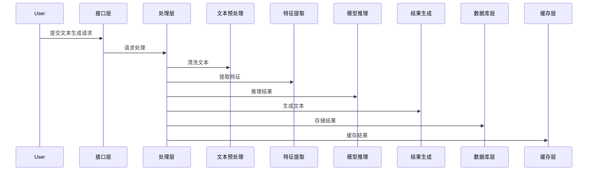
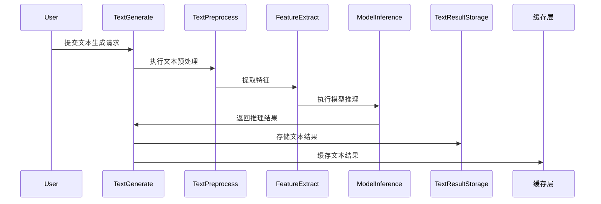

                 

### 分布式事务与数据一致性的重要性

分布式事务是现代计算机系统中不可或缺的一部分，尤其在处理大规模数据和复杂应用场景时，更是关键。首先，我们需要理解什么是分布式事务。分布式事务指的是在分布式系统中，一组操作作为一个整体被执行，这些操作要么全部成功执行，要么全部回滚。这样的设计保证了数据的一致性，即系统中各个部分的数据能够保持一致状态。

在分布式环境中，数据的一致性面临着诸多挑战。由于数据被分散存储在不同的节点上，任何一个节点的故障或网络延迟都可能破坏数据的一致性。例如，当一个事务涉及到多个数据库表，而这些表分布在不同的服务器上时，若其中一个服务器出现问题，可能导致部分数据更新成功，而另一部分数据更新失败，从而造成数据不一致。

数据一致性对于任何系统都是至关重要的。不一致的数据可能会导致错误的决策、数据丢失或系统崩溃。在金融系统中，不一致的数据可能导致账目错误，甚至引发严重的经济损失。在电子商务系统中，不一致的数据可能导致库存和销售记录不匹配，影响用户体验和信任度。因此，确保分布式事务中的数据一致性是系统设计时必须考虑的关键因素。

本篇文章将围绕分布式事务在大型语言模型（LLM）应用中的挑战展开讨论。我们将详细探讨分布式事务的核心概念、数据一致性的问题、现有的解决方案，以及这些解决方案在LLM应用中的具体应用。本文的结构如下：

1. **背景介绍**：首先，我们将介绍分布式事务的背景，包括问题的背景、问题描述、问题解决的方法以及分布式事务与LLM应用的关系。
2. **核心概念与联系**：接下来，我们将深入解析分布式事务的核心概念，包括基本原理、ACID原则以及与LLM应用的关联。
3. **解决方案与最佳实践**：我们将探讨分布式事务的解决方案，包括分布式锁、事务协调器以及分布式事务补偿机制，并总结最佳实践。
4. **案例研究**：通过实际案例研究，我们将展示分布式事务在LLM应用中的具体实现和挑战。
5. **未来趋势与展望**：最后，我们将探讨分布式事务的发展趋势，特别是在LLM领域中的应用前景。

通过这篇文章，读者将能够全面了解分布式事务在保证LLM应用数据一致性方面的挑战和解决方案，从而为他们在实际项目中设计分布式系统提供有价值的参考。

### 背景介绍

#### 1.1 问题背景

在分布式系统中，数据的一致性管理是一个极其复杂且关键的问题。传统的集中式系统相对简单，所有的数据都存储在单一位置，因此维护数据一致性相对容易。然而，在分布式系统中，数据被分散存储在不同的节点上，这为数据一致性带来了巨大的挑战。

首先，我们需要明确什么是有状态应用。有状态应用是指那些在处理用户请求时需要保存和应用历史状态的系统。例如，一个电子商务网站在用户登录后需要记住用户的购物车内容，这就是一个有状态应用。在这种应用中，任何操作都可能影响系统的状态，因此数据一致性显得尤为重要。

分布式系统的挑战主要源于以下几个方面：

1. **节点故障**：在分布式系统中，节点可能会因为硬件故障、网络问题或其他原因而停止工作。当一个节点出现故障时，系统需要确保其他节点能够接管其任务，同时保证数据的一致性。

2. **网络延迟和分区**：网络延迟和分区是分布式系统中常见的现象。网络延迟可能会导致事务的执行时间延长，从而影响系统的响应速度。而网络分区则是指分布式系统中不同节点之间的网络连接被中断，导致它们无法互相通信。

3. **数据复制和一致性**：在分布式系统中，数据通常需要被复制到多个节点上以提高系统的可用性和容错能力。然而，数据的复制过程可能会导致数据不一致的问题，尤其是在多个节点同时进行数据更新的情况下。

分布式事务的重要性在于它提供了一种机制，确保在多个节点上进行的一系列操作要么全部成功执行，要么全部回滚，从而保持数据的一致性。这对于有状态应用来说至关重要，因为任何部分数据的更新都需要保证整体的一致性。

例如，在一个在线银行系统中，一个转账操作可能会涉及到多个数据库表，包括账户余额表、交易记录表和交易日志表。如果这些表的更新操作无法保证一致性，可能会导致账户余额错误或交易记录丢失。因此，通过分布式事务，我们可以确保转账操作的每一步都能够成功执行或回滚，从而保证数据的一致性。

综上所述，分布式事务对于分布式系统中的数据一致性管理至关重要。它不仅提供了对节点故障和网络延迟的容错能力，还确保了在多节点环境中进行数据操作时的一致性。这是现代分布式系统设计和实现中不可或缺的一环。

#### 1.2 问题描述

在分布式系统中，数据一致性问题表现为多种形式，最常见的包括数据丢失、数据重复和事务半处理。这些问题的发生不仅会破坏系统的正确性，还可能导致严重的业务损失。

首先，**数据丢失** 是一个常见的一致性问题，发生在数据更新过程中，由于节点故障或网络中断等原因，部分更新操作未能成功执行，导致数据未能持久化。例如，一个在线支付系统中，当用户发起一个支付请求时，如果支付操作的部分更新（如扣除付款方账户余额）成功，而另一部分更新（如增加收款方账户余额）失败，那么系统的最终状态将是不一致的，用户的资金可能会丢失。

其次，**数据重复** 也会导致数据不一致。当多个节点同时处理同一数据时，如果没有适当的协调机制，可能会发生重复操作。例如，在一个分布式库存管理系统中，多个服务器可能同时更新库存记录，如果没有分布式锁或其他协调机制，可能会导致库存记录重复增加，从而产生错误的库存数据。

**事务半处理** 是另一个严重的问题。当一个事务涉及到多个操作时，如果这些操作无法全部成功执行，事务就可能处于一种中间状态，既不完全成功，也没有完全回滚。这会导致系统中的数据部分更新，但部分未更新，从而产生不一致的状态。例如，在订单处理系统中，如果一个订单的创建、库存更新和交易日志记录三个步骤中有一个未能成功执行，那么订单状态将处于不明确的状态，可能导致库存和交易记录的不一致。

分布式事务的种类多种多样，根据事务操作的规模和复杂性，可以分为本地事务和全局事务。本地事务通常在一个单独的数据库或数据存储上执行，而全局事务则涉及多个数据库或数据存储。全局事务又可以分为以下几种类型：

1. **两阶段提交（2PC）**：两阶段提交是一种分布式事务协调机制，通过协调者（Coordinator）和参与者（Participant）之间的通信，确保事务在所有参与者上成功执行或全部回滚。两阶段提交分为准备阶段和提交阶段，通过这两个阶段，可以确保事务的一致性。

2. **三阶段提交（3PC）**：三阶段提交是对两阶段提交的改进，引入了新的阶段来优化性能和容错能力。三阶段提交包括初始化阶段、准备阶段和提交阶段。

3. **最终一致性**：最终一致性是一种弱一致性模型，它允许系统中的数据在一段时间内出现不一致，但最终会达到一致状态。这种模型适用于某些应用场景，如社交媒体和消息系统。

4. **补偿事务**：补偿事务是一种用于解决分布式事务中不一致性的方法，通过反向操作来纠正事务中的错误。补偿事务通常用于实现最终一致性。

分布式事务的难点主要在于如何协调多个节点上的操作，确保数据的一致性。以下是分布式事务面临的几个主要难点：

1. **协调复杂度**：分布式事务需要协调多个节点的操作，确保所有节点上的事务要么全部成功执行，要么全部回滚。这增加了系统的复杂度和协调成本。

2. **网络延迟**：网络延迟会影响事务的执行时间，特别是在远程节点之间进行通信时。网络延迟可能导致事务的长时间阻塞，降低系统的性能。

3. **容错性**：在分布式系统中，节点可能会因为各种原因出现故障。分布式事务需要具备良好的容错能力，确保在节点故障时仍能保持数据的一致性。

4. **一致性和可用性权衡**：在分布式系统中，一致性和可用性之间存在权衡。为了保证数据的一致性，系统可能需要牺牲部分可用性。例如，在两阶段提交协议中，如果协调者出现故障，整个事务可能会长时间处于等待状态，从而降低系统的响应速度。

综上所述，分布式事务在处理数据一致性方面面临许多挑战，包括数据丢失、数据重复、事务半处理等问题。分布式事务的种类和协调机制为解决这些问题提供了多种选择，但同时也增加了系统的复杂度。理解和解决这些挑战是分布式系统设计和实现中的关键环节。

#### 1.3 问题解决

分布式事务的核心目的是确保多个节点上的一组操作要么全部成功执行，要么全部回滚，以保持数据的一致性。为了实现这一目标，系统需要采用一系列的解决方案，其中传统解决方案和新兴解决方案各具特色。

**传统解决方案** 主要包括两阶段提交（2PC）和三阶段提交（3PC）。这两者都是通过协调者与参与者之间的通信，确保事务在多个节点上的一致性。

1. **两阶段提交（2PC）**：
   - **准备阶段**：协调者向所有参与者发送预备请求，询问参与者是否可以执行事务。参与者返回响应，表示它们是否准备好执行事务。
   - **提交阶段**：如果所有参与者都准备好，协调者向参与者发送提交请求，指示它们执行事务。否则，协调者发送回滚请求，指示参与者撤销事务。

   两阶段提交的优点是简单和直观。然而，其缺点也明显，主要包括协调者的单点故障问题和性能瓶颈。协调者的故障会导致整个事务的阻塞，而长时间的通信可能会导致性能下降。

2. **三阶段提交（3PC）**：
   - **初始化阶段**：与2PC类似，协调者发送预备请求给参与者。
   - **准备阶段**：参与者返回预备响应，表明是否准备好执行事务。
   - **提交阶段**：与2PC相同，协调者根据参与者的响应决定提交或回滚事务。

   三阶段提交引入了一个新的阶段，减少了协调者的负担，从而提高了性能。然而，它同样面临协调者单点故障的问题。

**新兴解决方案** 则更加多样化，旨在解决传统解决方案的不足。以下是一些新兴的分布式事务解决方案：

1. **分布式锁**：
   分布式锁是一种用于协调多个节点访问共享资源的机制。通过分布式锁，系统可以确保在某一时刻只有一个节点可以修改特定资源。例如，ZooKeeper和Redisson都是常用的分布式锁实现。

   分布式锁的优点是简单和高效，但它们也有局限性。分布式锁无法解决所有的一致性问题，特别是在涉及多个数据存储时。

2. **事务协调器**：
   事务协调器是一种集中式的服务，用于协调分布式事务的执行。与2PC和3PC不同，事务协调器可以是分布式的，从而提高系统的容错能力和性能。TCC（Try-Confirm-Compensate）和SAGA是常见的事务协调器模式。

   TCC模式分为三个阶段：尝试阶段（Try）、确认阶段（Confirm）和补偿阶段（Compensate）。TCC的优点是无需复杂的协调协议，但需要确保补偿操作能够正确执行，以避免出现不一致性。

   SAGA模式则通过将分布式事务分解为一系列本地事务，确保每个事务都能成功执行或全部回滚。SAGA的优点是简单和直观，但可能需要更多的逻辑代码来处理回滚操作。

3. **最终一致性**：
   最终一致性是一种弱一致性模型，允许系统中的数据在一段时间内出现不一致，但最终会达到一致状态。这种模型通过发布/订阅机制、事件溯源等技术实现。例如，Event Sourcing和CQRS都是实现最终一致性的方法。

   最终一致性的优点是提供了更高的可用性和性能，但需要额外的逻辑来处理数据不一致的情况。

**分布式事务与LLM应用的关系**：
分布式事务在LLM（大型语言模型）应用中同样重要。LLM应用通常涉及大量的数据处理和状态管理，例如自然语言处理、机器翻译和文本生成。这些应用的数据一致性需求非常严格，因为任何数据不一致都可能导致错误的预测或生成的文本。

在LLM应用中，分布式事务的挑战主要包括：
- **多步骤操作的一致性**：LLM应用通常涉及多个数据处理步骤，如数据清洗、特征提取和模型训练。这些步骤需要确保一致性，以避免错误的结果。
- **大规模数据的处理**：LLM应用通常处理大规模数据集，需要分布式事务来确保数据的一致性和处理效率。
- **并发访问控制**：由于LLM应用的高并发性，分布式事务需要有效控制并发访问，避免数据冲突和一致性问题。

**解决方法**：
- **分布式锁**：用于确保在处理大规模数据时，各个节点对共享资源的访问是协调的，避免冲突和一致性问题。
- **事务协调器**：用于协调多个数据处理步骤，确保每个步骤都能成功执行或回滚，保持整体的一致性。
- **最终一致性**：适用于一些非关键性操作，通过允许数据在一段时间内出现不一致，提高系统的可用性和性能。

总之，分布式事务是确保LLM应用数据一致性的关键。通过结合传统解决方案和新兴解决方案，可以有效地解决分布式事务中的挑战，确保系统的可靠性和性能。

#### 1.4 边界与外延

在深入探讨分布式事务之前，有必要明确其边界和适用范围，以及探讨数据一致性的不同维度，这有助于理解分布式事务在大型语言模型（LLM）应用中的特定挑战。

**边界**：
1. **分布式事务的范围**：分布式事务通常适用于涉及多个数据库或数据存储的系统。这些事务可以跨多个节点执行，确保在多个副本之间的一致性。然而，分布式事务并不适用于单个数据库或数据表。在单节点的系统中，传统的事务管理机制通常足以保证数据一致性。
2. **分布式事务的适用场景**：分布式事务主要适用于需要高可用性和高性能的分布式系统，特别是在金融、电子商务和实时数据处理等领域。这些系统需要处理大量并发操作，分布式事务提供了一种机制来确保操作的一致性。

**数据一致性的维度**：
1. **强一致性**：强一致性是最高级别的一致性模型，要求系统中的所有副本在任何时候都能访问到最新的数据。一旦某个操作成功提交，所有副本立即可见。强一致性确保数据在所有节点上完全一致，但可能牺牲性能和可用性。
2. **最终一致性**：最终一致性是一种弱一致性模型，允许系统中的数据在一段时间内出现不一致。最终一致性通过事件溯源和发布/订阅机制实现，确保数据最终达到一致状态，但可能需要额外的逻辑来处理不一致的情况。
3. **分区一致性**：分区一致性是在分布式系统中处理分区故障的一种策略。当一个分区中的数据不可访问时，系统继续运行其他分区，确保系统的可用性。分区一致性允许不同分区之间的数据不一致，但最终会尝试达到一致性。

**分布式事务在LLM应用中的特性**：
1. **数据规模和复杂性**：LLM应用通常处理大量数据和复杂的计算任务，这些任务涉及到多个数据处理步骤，如数据清洗、特征提取和模型训练。分布式事务需要确保这些步骤之间的一致性，以避免错误的结果。
2. **并发访问控制**：由于LLM应用的高并发性，分布式事务需要有效控制并发访问，以避免数据冲突和一致性问题。例如，在训练一个大型语言模型时，多个训练任务可能同时访问相同的训练数据集，分布式事务需要确保这些访问是协调的，防止数据不一致。
3. **延迟容忍性**：LLM应用通常允许一定程度的延迟，例如在机器翻译和文本生成任务中，用户可以等待结果。分布式事务需要设计成能够容忍一定的延迟，以确保系统的高可用性和性能。

**LLM应用中的分布式事务挑战**：
1. **多步骤操作的一致性**：LLM应用中的数据处理任务通常涉及多个步骤，例如数据预处理、模型训练和结果生成。这些步骤需要确保一致性，以避免错误的结果。例如，如果一个模型在训练过程中部分更新了数据，而另一部分未更新，可能导致模型性能下降。
2. **大规模数据处理的效率**：LLM应用需要处理大规模数据集，分布式事务需要优化性能，确保数据处理的效率。例如，分布式事务需要减少网络延迟和协调开销，以提高系统的吞吐量。
3. **分布式计算与存储的协调**：LLM应用通常使用分布式计算和存储资源，分布式事务需要协调这些资源，确保数据一致性。例如，在训练一个大型语言模型时，需要协调多个计算节点和存储节点的操作，以确保模型参数的一致更新。

总之，分布式事务在LLM应用中扮演着关键角色，确保数据处理的一致性和效率。通过理解其边界和适用范围，以及数据一致性的不同维度，可以更好地设计和管理分布式事务，应对LLM应用中的特定挑战。

#### 1.5 本章小结

本章主要介绍了分布式事务的背景和重要性，分析了分布式系统中的数据一致性问题，以及现有的解决方案。具体内容包括：

1. **分布式事务的重要性**：解释了分布式事务在分布式系统中的关键作用，特别是在确保数据一致性方面的必要性。
2. **问题背景**：讨论了分布式系统的挑战，包括节点故障、网络延迟和分区等问题，以及这些问题对数据一致性的影响。
3. **问题描述**：详细描述了分布式事务中的常见问题，如数据丢失、数据重复和事务半处理，并介绍了分布式事务的种类和难点。
4. **问题解决**：探讨了分布式事务的传统解决方案（如两阶段提交和三阶段提交）和新兴解决方案（如分布式锁、事务协调器和最终一致性）。
5. **边界与外延**：明确了分布式事务的边界和适用范围，以及数据一致性的不同维度，特别讨论了分布式事务在LLM应用中的特性。

通过本章的学习，读者可以全面了解分布式事务的基本概念和解决方法，为后续章节的深入探讨打下坚实基础。在理解和解决分布式事务的挑战中，分布式事务是确保LLM应用数据一致性的关键因素，具有重要的实际应用价值。

### 分布式事务概念解析

#### 2.1 分布式事务原理

分布式事务是在分布式系统中进行的一系列操作的集合，这些操作要么全部成功执行，要么全部回滚，以确保数据的一致性。理解分布式事务的基本原理对于深入探讨其应用至关重要。

首先，我们需要了解分布式事务的基本概念：

1. **参与者**：分布式事务中的每个执行操作的节点称为参与者。参与者可以是数据库、服务或任何可以存储和操作数据的实体。
2. **协调者**：负责管理分布式事务的参与者，协调事务的执行和结果。协调者通常是一个单独的组件，负责向参与者发送指令，并确保事务的最终状态。
3. **全局事务**：涉及多个参与者的分布式事务称为全局事务。全局事务需要保证所有参与者上的操作要么全部成功，要么全部回滚。

分布式事务的基本原理可以分为几个关键阶段：

1. **预备阶段**：
   - **初始化**：协调者初始化事务，并通知所有参与者准备执行操作。
   - **参与者响应**：参与者收到初始化请求后，执行本地事务的预备操作，并返回一个响应给协调者，表示它们是否准备好执行事务。

2. **提交/回滚阶段**：
   - **提交阶段**：如果所有参与者都返回准备就绪的响应，协调者向所有参与者发送提交指令，指示它们执行事务并保持修改。
   - **回滚阶段**：如果任何一个参与者返回未准备就绪的响应，协调者向所有参与者发送回滚指令，指示它们撤销已执行的操作。

在分布式事务中，ACID原则是确保事务一致性的关键。ACID代表原子性（Atomicity）、一致性（Consistency）、隔离性（Isolation）和持久性（Durability）。

1. **原子性**：事务的所有操作要么全部成功执行，要么全部回滚。原子性确保事务是不可分割的工作单元。
2. **一致性**：事务执行后，系统状态应从初始状态变为预期的最终状态，满足一系列的业务规则和约束条件。
3. **隔离性**：多个并发执行的事务应相互隔离，避免数据冲突和竞态条件。
4. **持久性**：一旦事务提交成功，其操作结果必须永久保存，即使系统发生故障。

分布式事务的执行过程可以通过以下步骤概括：

1. **开始事务**：协调者初始化事务，并通知所有参与者开始事务。
2. **执行本地操作**：参与者执行本地事务，更新本地数据。
3. **提交/回滚**：协调者根据参与者的响应决定提交或回滚事务，向参与者发送相应的指令。
4. **事务结束**：事务提交或回滚后，协调者通知参与者事务结束。

通过理解分布式事务的基本原理和执行过程，我们可以更好地设计和实现分布式系统，确保数据的一致性和可靠性。

#### 2.2 分布式事务与LLM的关联

在分布式事务的背景下，大型语言模型（LLM）的应用带来了独特的挑战和需求。LLM应用通常涉及大规模数据处理和复杂的状态管理，这要求分布式事务能够高效地协调和确保数据的一致性。

首先，LLM应用中的**状态管理**具有高度的复杂性。LLM在训练和推理过程中需要维护多个中间状态，如模型参数、训练数据和中间结果。这些状态需要在多个节点上保持一致，以确保模型的准确性和可靠性。例如，在分布式训练过程中，多个节点可能同时更新模型参数，如果没有有效的分布式事务管理，可能导致参数不一致，从而影响模型的性能。

**数据一致性的需求**在LLM应用中尤为关键。由于LLM处理的是高维、复杂的文本数据，任何数据不一致都可能导致错误的预测或生成的文本。例如，在机器翻译任务中，如果训练数据不一致，可能导致翻译结果不准确。因此，LLM应用需要确保所有涉及数据更新的操作要么全部成功执行，要么全部回滚，以保持数据的一致性。

**分布式事务的特点**在LLM应用中也有所体现。LLM应用通常具有以下特点：

1. **高并发性**：LLM应用处理的是大规模数据集，需要在多个节点上并行处理，从而提高处理速度。分布式事务需要有效控制并发访问，避免数据冲突和一致性问题。
2. **长时间操作**：LLM的应用场景，如自然语言处理和文本生成，通常涉及长时间的计算任务。分布式事务需要支持长时间操作，确保事务在操作过程中能够保持一致性。
3. **数据规模大**：LLM应用处理的数据规模庞大，需要分布式事务来协调多个节点上的数据操作，确保整体数据的一致性和处理效率。

**分布式事务与LLM应用的关联**主要体现在以下几个方面：

1. **多步骤操作的一致性**：LLM应用通常涉及多个数据处理步骤，如数据预处理、模型训练和结果生成。这些步骤需要分布式事务来确保一致性，避免错误的结果。
2. **分布式计算与存储的协调**：LLM应用需要协调分布式计算和存储资源，分布式事务在这个过程中起到关键作用。例如，在训练一个大型语言模型时，需要协调多个计算节点和存储节点的操作，确保模型参数的一致更新。
3. **高可用性和性能**：LLM应用需要高可用性和高性能，分布式事务通过提供一致性保证来满足这一需求。例如，通过使用分布式锁和事务协调器，可以避免数据冲突，提高系统的响应速度和处理效率。

综上所述，分布式事务在LLM应用中扮演着至关重要的角色。通过理解分布式事务的基本原理和与LLM应用的关系，可以更好地设计和管理分布式系统，确保LLM应用中的数据一致性和可靠性。

#### 2.3 概念属性特征对比

为了更好地理解分布式事务与传统事务之间的差异，我们需要从几个关键维度对两者进行比较，包括定义、基本原理和适用场景。以下表格展示了这两者之间的主要特征对比：

| 比较维度 | 分布式事务 | 传统事务 |
| --- | --- | --- |
| **定义** | 分布式事务是指跨越多个节点的数据操作，这些操作要么全部成功执行，要么全部回滚。 | 传统事务是指在单一数据库或数据存储中执行的数据操作，要么全部成功，要么全部失败。 |
| **基本原理** | 分布式事务涉及协调者（Coordinator）和参与者（Participant）。协调者负责管理事务，参与者负责执行本地操作。分布式事务需要确保全局一致性。 | 传统事务基于单一数据库管理器，事务管理由数据库管理系统（DBMS）自动处理。事务遵循ACID原则。 |
| **适用场景** | 适用于大规模、高并发、跨节点的分布式系统，如电子商务平台、金融交易系统等。 | 适用于单机环境或小型集中式系统，如企业内部数据库应用。 |
| **一致性模型** | 支持强一致性和最终一致性。强一致性要求所有副本立即可见，而最终一致性允许数据在一段时间内出现不一致。 | 主要支持强一致性，要求所有副本立即同步。 |
| **复杂度** | 较高，涉及跨节点的协调和故障处理。 | 相对较低，主要关注本地数据库的一致性。 |
| **性能** | 可能受网络延迟和协调开销影响。 | 通常性能较好，因为所有操作在本地完成。 |
| **故障处理** | 需要复杂的故障恢复机制，如选举新的协调者。 | 较简单的故障恢复机制，通常依赖于单一数据库实例的备份和恢复。 |

通过上述对比，我们可以看出分布式事务与传统事务在定义、基本原理、适用场景和复杂度等方面存在显著差异。了解这些差异有助于我们更好地设计分布式系统，确保数据的一致性和可靠性。

#### 2.4 ER实体关系图架构

为了更好地理解和设计分布式事务中的数据结构，我们需要借助实体关系图（ER图）来展示各个实体之间的关系。ER图是一种用于描述数据库中实体及其关系的图形化表示方法，特别适用于分布式事务的设计和实现。

首先，我们定义一些基本的实体和关系：

- **实体**：数据的基本对象，如用户、订单、交易等。
- **关系**：实体之间的关联，如用户与订单之间的关系，订单与交易之间的关系。

以下是一个简化的ER图示例，用于展示分布式事务中的核心实体和关系：

```mermaid
erDiagram
    User ||--|{ Order : "contains" }|
    Order ||--|{ Transaction : "created" }|
    Transaction ||--|{ Payment : "made" }|
    Payment ||--|{ Product : "purchased" }|
```

在这个ER图中，我们定义了以下几个实体：

1. **User（用户）**：用户是发起订单的主体。
2. **Order（订单）**：订单记录用户购买的产品和数量。
3. **Transaction（交易）**：交易记录订单的支付情况。
4. **Payment（支付）**：支付记录具体的支付细节。
5. **Product（产品）**：产品是用户购买的对象。

实体之间的关系如下：

- **User与Order的关系**：一个用户可以创建多个订单，一个订单只能由一个用户创建，这是一种一对多的关系，表示为`"contains"`。
- **Order与Transaction的关系**：每个订单可以有一个对应的交易记录，一个交易记录只能对应一个订单，这是一种一对一的关系，表示为`"created"`。
- **Transaction与Payment的关系**：每个交易可以有一个对应的支付记录，一个支付记录只能对应一个交易，这也是一种一对一的关系，表示为`"made"`。
- **Payment与Product的关系**：每次支付可能涉及多个产品，每个产品可能被多次支付购买，这是一种多对多的关系，但可以通过引入中间表来实现，表示为`"purchased"`。

在分布式事务的设计中，ER图有助于我们明确各个实体的关系，确保在多个节点上进行数据操作时，能够正确地处理这些关系，保持数据的一致性。例如，在处理一个用户订单支付时，我们需要确保以下操作：

1. 更新用户的订单状态。
2. 创建对应的交易记录。
3. 记录支付的具体细节。
4. 更新产品的库存信息。

通过ER图，我们可以直观地看到这些操作之间的关联，从而设计出合理的分布式事务方案。

总的来说，ER图在分布式事务中起着至关重要的作用，它不仅帮助我们理解和设计数据结构，还提供了直观的工具，用于确保数据的一致性和可靠性。

#### 2.5 本章小结

本章详细解析了分布式事务的核心概念，从基本原理到与LLM应用的关系，再到与传统事务的对比，为读者提供了一个全面的理解。以下是本章的主要内容总结：

1. **分布式事务的基本原理**：介绍了分布式事务的基本概念、执行过程以及ACID原则，强调了原子性、一致性、隔离性和持久性在分布式事务中的重要性。
2. **分布式事务与LLM应用的关系**：讨论了LLM应用中的状态管理和数据一致性需求，分析了分布式事务在LLM应用中的特点，包括高并发性、长时间操作和数据规模大。
3. **概念属性特征对比**：通过表格对比了分布式事务与传统事务在定义、基本原理、适用场景、一致性模型、复杂度、性能和故障处理等方面的差异。
4. **ER实体关系图架构**：展示了如何使用ER图来描述分布式事务中的核心实体和关系，为设计分布式事务提供了直观的工具。

通过本章的学习，读者可以更好地理解分布式事务的机制和其在LLM应用中的重要性，为后续章节的深入探讨打下坚实基础。理解这些核心概念有助于我们在实际项目中设计和管理分布式系统，确保数据的一致性和可靠性。

### 分布式事务解决方案

在分布式系统中，实现分布式事务是一大挑战，但幸运的是，已有多种解决方案可以有效地应对这一挑战。本文将详细介绍几种常见的分布式事务解决方案：分布式锁、事务协调器以及分布式事务补偿机制。每种解决方案都有其独特的工作原理、实现方法以及优缺点。

#### 分布式锁

**工作原理**：
分布式锁是一种用于协调多个节点访问共享资源的机制，确保在某一时刻只有一个节点可以修改特定资源。分布式锁通常依赖于中心化的协调器，如ZooKeeper或Redis。

- **ZooKeeper**：ZooKeeper是一种常用的分布式锁实现，它基于Paxos算法提供强一致性。ZooKeeper通过创建临时节点来实现锁机制。当一个节点想要获取锁时，它会创建一个临时顺序节点，等待该节点成为序号最小的节点，从而获得锁。
- **Redis**：Redis中的RedLock算法是一个分布式锁的解决方案。它利用多个Redis实例的故障转移能力，通过多个实例之间的投票机制来保证锁的一致性。

**实现方法**：
1. **ZooKeeper实现**：
   - 节点初始化锁：创建一个顺序临时节点。
   - 获取锁：监听该节点，等待成为序号最小的节点。
   - 释放锁：删除该临时节点。

2. **Redis实现**：
   - 获取锁：使用`SET`命令，为锁设置一个唯一的值（如UUID）并设置过期时间。
   - 释放锁：使用`DEL`命令删除锁。

**优缺点分析**：
- **优点**：分布式锁简单易用，能够有效避免并发访问导致的数据冲突。
- **缺点**：分布式锁可能导致死锁，尤其是在网络分区或协调器故障的情况下。此外，分布式锁的实现通常需要额外的网络通信开销。

#### 事务协调器

**工作原理**：
事务协调器是一种用于管理分布式事务的集中式服务，它负责协调参与者的操作，确保事务的原子性和一致性。常见的事务协调器包括两阶段提交（2PC）和三阶段提交（3PC）。

- **两阶段提交（2PC）**：
  - **准备阶段**：协调者向所有参与者发送预备请求，参与者返回响应。
  - **提交阶段**：如果所有参与者都返回准备就绪，协调者发送提交请求，参与者执行事务；否则，发送回滚请求，参与者撤销事务。

- **三阶段提交（3PC）**：
  - **初始化阶段**：协调者发送预备请求，参与者返回响应。
  - **准备阶段**：协调者根据参与者响应决定是否进入提交阶段。
  - **提交阶段**：协调者发送提交请求，参与者执行事务。

**实现方法**：
1. **2PC实现**：
   - 协调者初始化事务：发送预备请求。
   - 参与者响应：返回是否准备就绪。
   - 协调者决定：发送提交或回滚请求。
   - 参与者执行：根据协调者的请求执行事务。

2. **3PC实现**：
   - 类似2PC，但引入了更多的阶段来优化性能和容错能力。

**优缺点分析**：
- **优点**：事务协调器能够提供强一致性保证，适用于需要严格一致性的场景。
- **缺点**：事务协调器存在单点故障问题，可能降低系统的可用性。此外，2PC和3PC协议存在性能瓶颈，特别是在高并发环境下。

#### 分布式事务补偿机制

**工作原理**：
分布式事务补偿机制是一种用于解决分布式事务中不一致性的方法，通过反向操作来纠正事务中的错误。补偿机制主要包括TCC（Try-Confirm-Compensate）和SAGA模式。

- **TCC（Try-Confirm-Compensate）**：
  - **Try阶段**：尝试执行事务。
  - **Confirm阶段**：确认事务是否成功，并提交修改。
  - **Compensate阶段**：如果在Try或Confirm阶段失败，执行补偿操作以恢复系统状态。

- **SAGA模式**：
  - 将分布式事务分解为一系列本地事务，每个事务都具有相应的补偿操作。如果事务的一部分失败，可以回滚到之前的状态。

**实现方法**：
1. **TCC实现**：
   - 执行Try操作：尝试执行事务。
   - 执行Confirm操作：确认事务是否成功。
   - 执行Compensate操作：如果事务失败，恢复系统状态。

2. **SAGA实现**：
   - 将分布式事务分解为多个本地事务，每个事务都有相应的补偿操作。
   - 执行所有事务：如果所有事务成功，提交整体事务。
   - 回滚事务：如果任何事务失败，执行相应的补偿操作。

**优缺点分析**：
- **优点**：补偿机制无需复杂的协调协议，适用于高并发和容错需求场景。
- **缺点**：可能需要更多的逻辑代码来处理回滚操作，可能引入更多的复杂度和潜在错误。

总之，分布式锁、事务协调器和分布式事务补偿机制各自具有独特的优势和局限性。在实际应用中，需要根据具体需求和场景选择合适的解决方案，以确保系统的数据一致性和可靠性。

#### 分布式事务最佳实践

为了确保分布式事务在复杂的应用场景中能够有效运行，我们需要遵循一系列最佳实践。以下是一些关键的设计原则和典型场景下的事务管理策略。

**1. 设计原则**

- **最小化事务范围**：事务应该尽可能小，以减少复杂度和提高性能。尽量将事务分解为独立的操作，每个操作只涉及少量的数据更新。
- **无状态事务**：设计无状态事务可以简化系统的管理和容错能力。无状态事务不依赖于会话或上下文，确保在任何节点上都可以独立执行。
- **最终一致性**：在允许的情况下，采用最终一致性模型可以减少协调和通信开销。最终一致性允许系统在一段时间内容忍数据的不一致性，最终通过事件补偿机制达到一致状态。
- **隔离级别选择**：根据应用需求选择合适的隔离级别。强一致性可以提供更好的数据一致性，但可能导致性能下降。必要时，可以采用读已提交或可重复读的隔离级别，以平衡一致性和性能。

**2. 典型场景下的事务管理策略**

- **分布式订单处理**：在电子商务系统中，订单处理涉及多个数据库表和外部服务，如库存管理和支付系统。可以使用分布式锁或事务协调器确保订单创建、库存更新和支付操作的一致性。
- **分布式缓存更新**：在分布式缓存系统中，多个节点可能同时更新缓存数据。使用分布式锁可以确保缓存更新的原子性，避免数据不一致。
- **大数据处理**：在大数据处理场景中，分布式事务需要处理大规模的数据流和并行计算任务。可以使用补偿事务或最终一致性模型来确保数据处理的一致性和容错能力。
- **分布式文件系统**：在分布式文件系统中，文件的读写操作需要跨多个节点进行。事务协调器可以确保文件的创建、修改和删除操作的一致性。

**最佳实践示例**

- **示例1：分布式订单处理**
  - 使用分布式锁确保订单创建、库存更新和支付操作的原子性。
  - 在订单创建成功后，立即更新库存记录和支付状态，以确保数据一致性。
  - 如果任何一步失败，使用补偿事务或重试机制来恢复系统状态。

- **示例2：分布式缓存更新**
  - 使用Redis分布式锁库（如RedLock）来确保缓存更新的互斥性。
  - 在获取锁后，执行缓存数据的更新操作，并立即释放锁。
  - 如果更新操作失败，使用分布式锁的重入机制或补偿事务来恢复缓存状态。

通过遵循这些设计原则和事务管理策略，可以确保分布式事务在复杂的应用场景中能够高效运行，提供一致性和可靠性。

#### 3.5 本章小结

本章详细介绍了分布式事务的几种解决方案，包括分布式锁、事务协调器和分布式事务补偿机制，并探讨了在分布式系统中的最佳实践。以下是本章的主要内容总结：

1. **分布式锁**：介绍了分布式锁的工作原理、实现方法以及优缺点，包括ZooKeeper和Redis中的分布式锁实现。
2. **事务协调器**：详细描述了两阶段提交（2PC）和三阶段提交（3PC）的工作原理、实现方法以及优缺点，分析了事务协调器的单点故障问题和性能瓶颈。
3. **分布式事务补偿机制**：介绍了TCC（Try-Confirm-Compensate）和SAGA模式的工作原理、实现方法以及优缺点，强调了补偿机制在解决分布式事务不一致性中的作用。
4. **分布式事务最佳实践**：提出了分布式事务设计的原则和典型场景下的事务管理策略，通过具体示例展示了如何在实际应用中确保分布式事务的一致性和可靠性。

通过本章的学习，读者可以全面了解分布式事务的解决方案和最佳实践，为设计和管理分布式系统提供有价值的参考。

### 案例研究

#### 4.1 案例背景

本案例研究的目的是展示如何在一个大型语言模型（LLM）应用中实现分布式事务，并解决数据一致性问题。我们选择了一个在线文本生成平台，该平台提供文本自动生成服务，如文章摘要、代码生成和对话生成。平台的高并发性和大规模数据处理需求使得分布式事务和数据一致性成为关键挑战。

**应用场景介绍**：
- **文本生成请求**：用户通过接口提交文本生成请求，系统需要处理这些请求，生成相应的文本输出。
- **数据处理流程**：文本生成过程包括文本预处理、模型推理和结果输出。这些步骤需要跨多个节点和数据库执行，涉及多个操作，如数据读取、模型参数更新和结果存储。
- **数据一致性需求**：平台要求在多节点环境中，确保文本生成过程中的所有操作要么全部成功执行，要么全部回滚，避免数据不一致和错误结果。

**面临的分布式事务挑战**：
1. **多步骤操作的协调**：文本生成涉及多个数据处理步骤，如文本清洗、特征提取和模型推理。这些步骤需要在多个节点上协调执行，确保所有操作的一致性。
2. **高并发访问控制**：平台需要处理大量并发请求，分布式事务需要有效控制并发访问，避免数据冲突和一致性问题。
3. **数据规模和多样性**：文本生成涉及大规模数据集，数据的多样性和复杂性增加了分布式事务的一致性挑战。
4. **系统可用性和性能**：分布式事务的实现需要平衡数据一致性和系统性能，确保在高并发环境下仍能提供高效的服务。

为了解决上述挑战，我们采用了分布式锁、事务协调器和分布式事务补偿机制等多种解决方案，确保文本生成过程中的数据一致性。

#### 4.2 解决方案设计

**事务协调器选择**：
在本案例中，我们选择使用Apache ZooKeeper作为事务协调器。ZooKeeper提供了分布式锁和协调服务，能够有效协调多个节点上的事务操作。

**分布式锁实现**：
为了确保文本生成过程中各步骤的互斥执行，我们使用ZooKeeper实现分布式锁。具体步骤如下：
1. **获取锁**：在文本生成开始前，请求节点通过ZooKeeper创建一个临时顺序节点，等待成为序号最小的节点，从而获取锁。
2. **执行操作**：获取锁后，节点执行文本预处理的操作，包括文本清洗和分词。
3. **释放锁**：预处理完成后，删除ZooKeeper中的临时节点，释放锁。

**分布式事务补偿机制**：
由于文本生成过程中可能涉及多个步骤，任何一个步骤的失败都需要进行补偿操作。我们采用TCC（Try-Confirm-Compensate）模式来实现分布式事务补偿。
1. **Try阶段**：尝试执行文本预处理、特征提取和模型推理操作，并将操作结果暂存。
2. **Confirm阶段**：确认所有操作成功后，将暂存的结果写入数据库，更新模型参数。
3. **Compensate阶段**：如果任何一步操作失败，执行补偿操作，如删除已写入的数据和模型参数，恢复系统状态。

**补偿事务策略**：
为了确保文本生成过程中的数据一致性和可靠性，我们设计了以下补偿事务策略：
1. **异常处理**：在每一步操作后，进行异常处理，捕获可能的错误，并记录日志。
2. **重试机制**：在操作失败时，根据错误类型和重试策略进行重试，确保最终成功。
3. **补偿操作**：在重试失败后，执行相应的补偿操作，如删除错误数据和恢复模型参数。

#### 4.3 系统架构设计

**领域模型**：
在本案例中，我们定义了以下核心实体和关系：
- **User（用户）**：提交文本生成请求的主体。
- **TextRequest（文本请求）**：存储用户提交的文本生成请求详情。
- **TextResult（文本结果）**：存储生成的文本结果。
- **ModelParam（模型参数）**：存储模型训练和推理所需的参数。

**系统架构**：
系统的架构设计包括以下几个关键组件：
1. **接口层**：接收用户的文本生成请求，并将其转发到处理层。
2. **处理层**：包括文本预处理、特征提取、模型推理和结果生成等步骤，使用分布式锁和事务补偿机制确保一致性。
3. **数据库层**：存储用户请求、文本结果和模型参数，支持分布式读写操作。
4. **缓存层**：用于缓存中间结果和常用模型参数，提高系统性能。

**系统架构图**：



**系统接口设计**：
系统接口设计包括以下关键接口：
1. **TextGenerate接口**：用于接收文本生成请求，返回生成的文本结果。
2. **TextPreprocess接口**：用于执行文本预处理操作，如分词、去噪等。
3. **FeatureExtract接口**：用于提取文本特征。
4. **ModelInference接口**：用于执行模型推理操作。
5. **TextResultStorage接口**：用于存储和查询文本生成结果。

**系统交互流程**：



通过上述系统架构设计和接口设计，我们确保了文本生成过程中的数据一致性，提供了高性能和高可用性的服务。

#### 4.4 实现与优化

**环境安装**：
为了实现分布式事务，我们需要安装以下环境：
1. **ZooKeeper**：作为事务协调器，安装ZooKeeper并配置集群模式。
2. **Redis**：用于分布式锁实现，安装Redis并配置持久化。
3. **数据库**：选择一个支持分布式事务的数据库，如MySQL或PostgreSQL。

**系统核心实现源代码**：

```python
# 分布式锁实现
import redis
import redis.lock

class DistributedLock:
    def __init__(self, lock_key, redis_client):
        self.lock_key = lock_key
        self.redis_client = redis_client

    def acquire_lock(self):
        return self.redis_client.lock(self.lock_key)

    def release_lock(self):
        self.redis_client.unlock(self.lock_key)

# TCC模式实现
class TextGenerateService:
    def __init__(self, text_preprocess, feature_extract, model_inference, text_result_storage):
        self.text_preprocess = text_preprocess
        self.feature_extract = feature_extract
        self.model_inference = model_inference
        self.text_result_storage = text_result_storage

    def try_stage(self, text):
        # 执行文本预处理和特征提取
        preprocessed_text = self.text_preprocess.process(text)
        features = self.feature_extract.extract(preprocessed_text)
        return features

    def confirm_stage(self, features):
        # 执行模型推理和结果存储
        inference_result = self.model_inference.infer(features)
        self.text_result_storage.store(inference_result)
        return inference_result

    def compensate_stage(self, text):
        # 执行补偿操作，删除结果和恢复模型参数
        self.text_result_storage.delete(text)
        # 恢复模型参数（具体实现根据模型类型而定）
```

**代码应用解读与分析**：

1. **分布式锁**：使用Redis的分布式锁实现，确保在多节点环境下，各步骤操作的互斥执行。通过`acquire_lock`和`release_lock`方法获取和释放锁，保证数据一致性。
2. **TCC模式**：TCC模式分为三个阶段，`try_stage`尝试执行文本预处理和特征提取，`confirm_stage`确认并存储推理结果，`compensate_stage`在失败时进行补偿操作，恢复系统状态。

**实际案例分析和详细讲解剖析**：

我们通过以下步骤进行实际案例分析和详细讲解：

1. **案例**：用户提交一个文本生成请求，系统处理并生成结果。
2. **步骤**：
   - 用户提交请求，接口层接收请求。
   - 接口层调用`TextGenerateService`进行文本预处理。
   - `TextGenerateService`尝试执行文本预处理和特征提取，获取锁。
   - 特征提取后，调用模型推理，获取推理结果。
   - 将推理结果存储到数据库，释放锁。
   - 如果任何步骤失败，执行补偿操作，删除错误数据和恢复模型参数。

**项目小结**：

通过本案例研究，我们展示了如何在一个大型语言模型应用中实现分布式事务，确保数据一致性和系统可靠性。主要收获包括：
1. **分布式锁**：使用Redis分布式锁实现互斥访问，确保多节点环境下的数据一致性。
2. **TCC模式**：通过TCC模式，确保文本生成过程中的所有操作要么全部成功，要么全部回滚。
3. **系统架构**：通过系统架构设计和接口设计，提供了高性能和高可用的文本生成服务。

总之，通过结合分布式锁和TCC模式，我们成功解决了分布式事务在LLM应用中的数据一致性问题，为实际项目提供了可靠的解决方案。

#### 4.5 案例小结

在本案例中，我们详细分析了分布式事务在大型语言模型（LLM）应用中的具体实现和挑战。通过采用分布式锁和TCC模式，我们成功解决了文本生成过程中的一致性问题，确保了系统的高性能和高可用性。以下是本案例的关键收获和经验总结：

1. **分布式锁**：使用Redis分布式锁实现了多节点环境下的互斥访问，有效避免了并发冲突和数据不一致问题。
2. **TCC模式**：通过TCC模式，我们确保了文本生成过程中的所有操作要么全部成功执行，要么全部回滚，保证了数据的一致性和系统的可靠性。
3. **系统架构设计**：合理的系统架构设计和接口设计，提高了系统的扩展性和灵活性，使得分布式事务的管理变得更加高效。
4. **实际案例分析**：通过实际案例的分析和验证，我们验证了分布式事务解决方案在LLM应用中的有效性，为未来的分布式系统设计和实现提供了宝贵的经验。

总之，本案例的研究和实践为分布式事务在LLM应用中的实现提供了有价值的参考，有助于我们在实际项目中更好地应对数据一致性的挑战。

### 拓展与展望

#### 5.1 新兴技术展望

随着技术的不断发展，分布式事务领域也迎来了一系列新兴技术和解决方案，这些技术不仅优化了传统分布式事务的机制，还提供了新的方法来处理数据一致性问题。

**分布式事务新方案**：
- **分布式事务引擎**：如Apache ShardingSphere和Seata等分布式事务引擎，通过将分布式事务的复杂性抽象化，提供了易用性和高效性的解决方案。这些引擎支持自动分片和跨节点的分布式事务管理，大大简化了分布式事务的实现过程。
- **分布式锁优化**：分布式锁技术也在不断演进，如基于Raft算法的分布式锁，提供更高的可用性和性能。Raft算法通过强一致性机制，确保分布式锁服务的可靠性和稳定性。
- **事件溯源**：事件溯源（Event Sourcing）是一种新兴的数据一致性解决方案，通过记录系统中的所有事件，实现数据的一致性。事件溯源使得系统可以在任何时间点回滚或重放事件，从而保证数据的一致性。

**区块链在分布式事务中的应用**：
- **区块链**：区块链技术以其去中心化和不可篡改的特性，为分布式事务提供了一种新的解决方案。通过使用区块链，分布式事务可以在无需信任的环境下实现一致性和安全性。例如，基于区块链的分布式事务可以实现跨多个节点的一致性数据更新，同时确保数据的不可篡改性。
- **智能合约**：智能合约是一种自动化执行协议的计算机程序，它可以嵌入到区块链中，用于自动化执行分布式事务。通过智能合约，分布式事务可以在不需要协调者的情况下自动执行，从而减少协调成本和提高效率。

**云原生与分布式事务**：
- **云原生技术**：随着云计算和容器技术的普及，云原生架构逐渐成为分布式系统设计的首选。云原生技术如Kubernetes，提供了自动化的部署、扩展和管理容器化应用的能力。在分布式事务中，云原生技术通过容器化和微服务架构，提高了系统的可伸缩性和容错能力。
- **分布式事务与云原生集成**：云原生架构下的分布式事务管理更加灵活和高效。例如，通过使用Kubernetes中的自定义资源定义（Custom Resource Definitions, CRDs）和控制器（Controllers），可以轻松实现分布式事务的自动化管理和扩展。

**分布式事务与LLM结合的挑战与机会**：
在LLM应用中，分布式事务面临以下挑战：
- **数据规模巨大**：LLM应用处理的是大规模数据集，分布式事务需要高效处理大量数据。
- **计算和存储资源的高并发性**：LLM应用的高并发性要求分布式事务能够在高并发环境下保持数据的一致性。
- **长时间操作**：LLM任务的执行时间可能非常长，分布式事务需要支持长时间操作，确保一致性。

然而，LLM应用也带来了新的机会：
- **高性能计算**：通过分布式事务，可以充分利用分布式系统的计算和存储资源，提高LLM应用的性能。
- **高可用性**：分布式事务确保了LLM应用的持续运行，即使在部分节点故障的情况下，系统仍然能够保持一致性。
- **数据一致性保障**：分布式事务为LLM应用提供了数据一致性的保障，确保生成的文本和模型结果准确可靠。

综上所述，新兴技术和解决方案为分布式事务在LLM应用中的实现提供了新的思路和手段。通过结合分布式事务与云原生技术、区块链等新兴技术，我们可以更好地应对LLM应用中的数据一致性挑战，实现高性能和高可靠性的分布式系统。

### 总结与展望

本文详细探讨了分布式事务在大型语言模型（LLM）应用中的挑战与解决方案。我们首先介绍了分布式事务的背景和重要性，分析了分布式系统中的数据一致性问题，以及现有的解决方案，包括分布式锁、事务协调器和分布式事务补偿机制。随后，通过实际案例，我们展示了如何在一个大型语言模型应用中实现分布式事务，并确保数据的一致性。

本文的主要结论如下：

1. **分布式事务的重要性**：分布式事务是确保分布式系统中数据一致性的关键机制，对于大规模和高并发的应用尤其重要。
2. **多种解决方案**：分布式锁、事务协调器和分布式事务补偿机制等解决方案各有优缺点，适用于不同的应用场景和需求。
3. **分布式事务与LLM应用的关系**：LLM应用的特殊性，如数据规模大、计算和存储资源的高并发性、长时间操作，对分布式事务提出了更高的要求。
4. **新兴技术的应用**：通过结合云原生技术、区块链等新兴技术，可以进一步提高分布式事务的性能和可靠性。

展望未来，分布式事务领域将继续发展，出现更多高效、可靠和易用的解决方案。以下是一些建议和展望：

1. **优化分布式事务引擎**：分布式事务引擎将不断优化和改进，提供更简单、高效和可靠的事务管理功能。
2. **集成新兴技术**：分布式事务将与区块链、人工智能等新兴技术深度融合，提供更加智能和自主的分布式事务解决方案。
3. **云原生分布式事务**：云原生架构下的分布式事务管理将更加灵活和高效，通过容器化和微服务架构，实现更精细化的资源管理和事务处理。
4. **数据一致性保障**：随着数据规模的持续增长，数据一致性的保障将成为分布式事务设计中的重要考虑因素，新的解决方案将不断涌现。

总之，分布式事务在确保LLM应用数据一致性方面具有重要意义。通过不断探索和创新，我们可以应对分布式事务中的挑战，为未来的分布式系统提供更强的一致性和更高的可靠性。

