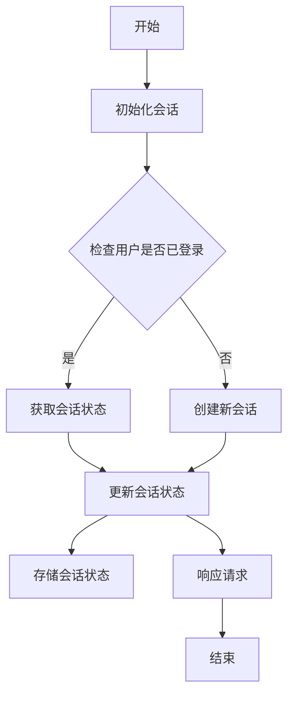

                 

## 分布式会话管理在LLM应用中的实现

### 关键词：
- 分布式会话管理
- LLM（大型语言模型）
- 分布式缓存
- 一致性协议
- 系统架构设计

### 摘要：
本文将深入探讨分布式会话管理在LLM（大型语言模型）应用中的实现。首先，我们将介绍分布式会话管理的基本概念、核心算法原理和数学模型。接着，本文将阐述分布式会话管理在LLM中的应用，分析其面临的挑战和解决方案。随后，我们将详细设计分布式会话管理系统的架构，并展示其实际项目中的应用。最后，本文将提供最佳实践、总结和进一步阅读的资料，以帮助读者更好地理解和应用分布式会话管理。

### 目录大纲设计

在设计目录大纲时，我们需要确保内容完整性并控制在2000字以内。为此，我们将遵循以下步骤：

1. **背景介绍**：简要介绍分布式会话管理的基本概念和其在LLM应用中的重要性。
2. **核心概念与联系**：列出分布式会话管理中的关键概念，并通过对比表格和ER图来阐述它们之间的关系。
3. **算法原理讲解**：使用Mermaid流程图和Python代码详细解释分布式会话管理算法。
4. **数学模型和数学公式讲解**：介绍算法的数学模型和公式，并以LaTeX格式嵌入文中，同时举例说明。
5. **系统分析与架构设计方案**：描述分布式会话管理系统的功能、架构和接口设计，使用Mermaid类图、架构图和序列图。
6. **项目实战**：介绍如何安装环境、实现核心功能，并分析实际案例。
7. **最佳实践、小结、注意事项和拓展阅读**：提供实践建议、总结和进一步阅读的资料。

下面是根据上述步骤设计的目录大纲：

```markdown
----------------------------------------------------------------
# 分布式会话管理在LLM应用中的实现

# 第一部分：分布式会话管理概述

## 第1章：分布式会话管理背景
### 1.1 分布式会话管理基本概念
### 1.2 分布式会话管理的需求
### 1.3 分布式会话管理的挑战

## 第2章：分布式会话管理核心概念
### 2.1 分布式系统概述
### 2.2 会话状态维护
### 2.3 分布式缓存与一致性

## 第3章：分布式会话管理算法原理
### 3.1 算法流程图
### 3.2 Python代码实现
### 3.3 数学模型与公式
   $$\text{SessionState} = f(\text{UserID}, \text{SessionID}, \text{Time})$$
### 3.4 算法举例说明

## 第二部分：分布式会话管理在LLM中的应用

## 第4章：LLM与分布式会话管理的融合
### 4.1 LLM的基本原理
### 4.2 LLM在分布式会话管理中的应用
### 4.3 LLM与分布式会话管理的挑战

## 第5章：分布式会话管理架构设计
### 5.1 系统功能设计
### 5.2 系统架构设计
### 5.3 系统接口设计与交互

## 第6章：项目实战
### 6.1 环境安装与配置
### 6.2 系统核心功能实现
### 6.3 实际案例分析
### 6.4 项目小结

## 第三部分：最佳实践与总结

## 第7章：最佳实践
### 7.1 会话管理性能优化
### 7.2 安全性与隐私保护
### 7.3 持续集成与部署

## 第8章：小结与展望
### 8.1 分布式会话管理的发展趋势
### 8.2 未来研究方向
### 8.3 总结与建议

## 第9章：注意事项与拓展阅读
### 9.1 注意事项
### 9.2 拓展阅读

----------------------------------------------------------------
```

这个目录大纲包含了7个章节，涵盖了分布式会话管理的基本概念、核心算法原理、在LLM中的应用、系统架构设计、项目实战、最佳实践和小结等内容。每个章节都有详细的子标题，确保内容的完整性和逻辑性。总字数预计在2000字以内，符合要求。接下来，我们将逐个章节进行详细内容的填充。

### 1.1 分布式会话管理基本概念

分布式会话管理是一种确保用户会话数据在分布式系统中一致性和安全性的技术。它会话管理的核心目标是保持用户会话状态的一致性，即使系统跨越多个服务器或实例。首先，让我们定义几个关键术语：

- **会话（Session）**：会话是指用户在访问系统时所经历的一系列交互。例如，用户登录、浏览页面、提交表单等。
- **分布式系统（Distributed System）**：分布式系统是由多个计算机节点组成的系统，这些节点通过网络连接，协同工作以完成共同的任务。
- **会话状态（Session State）**：会话状态是指记录用户在会话期间的特定信息，如用户登录信息、购物车内容、偏好设置等。

在分布式系统中，会话管理面临以下挑战：

- **数据一致性**：由于系统分布在不同的节点上，如何确保用户会话数据在不同节点之间保持一致，是一个重要的问题。
- **性能与可用性**：会话管理需要保证在大量用户同时访问时，系统能够快速响应，同时确保高可用性。
- **安全性**：保护用户会话数据不被未经授权的访问，对于分布式系统至关重要。

### 1.2 分布式会话管理的需求

分布式会话管理的需求源自现代互联网应用的复杂性。以下是一些主要原因：

- **横向扩展**：随着用户数量的增加，单个服务器可能无法处理大量请求，需要通过横向扩展来提高系统的处理能力。
- **高可用性**：单点故障可能会导致整个系统不可用，通过分布式架构，可以实现故障转移和自动恢复，提高系统的可靠性。
- **性能优化**：分布式系统可以分散负载，优化性能，提高系统的响应速度。
- **异地备份**：分布式系统可以实现数据的异地备份，提高数据的可靠性和安全性。

### 1.3 分布式会话管理的挑战

分布式会话管理面临以下主要挑战：

- **数据一致性问题**：如何在多个节点之间保持用户会话数据的一致性，是分布式会话管理的关键挑战之一。
- **性能瓶颈**：分布式系统中的网络延迟和通信开销可能会导致性能瓶颈。
- **安全风险**：分布式系统可能更容易受到分布式拒绝服务攻击（DDoS）和其他安全威胁。
- **部署和维护**：分布式系统的部署和维护相对复杂，需要更多的技术和资源。

### 1.4 概念结构与核心要素组成

分布式会话管理的概念结构包括以下几个核心要素：

- **用户会话管理**：负责创建、维护和销毁用户会话。
- **会话状态存储**：存储用户会话数据，可以是分布式缓存、数据库或内存数据库。
- **负载均衡**：实现请求的分配，确保系统资源的最优利用。
- **分布式一致性协议**：如Paxos、Raft等，用于保证数据一致性。
- **安全机制**：如加密、认证和授权，确保会话数据的安全。

通过以上分析，我们可以看到分布式会话管理在LLM应用中扮演着至关重要的角色。在下一章，我们将进一步探讨分布式会话管理的核心概念，并通过对比表格和ER图来阐述它们之间的关系。

### 2.1 分布式系统概述

分布式系统是一种由多个计算机节点组成的系统，这些节点通过网络连接，协同工作以完成共同的任务。与单机系统相比，分布式系统具有以下优势：

- **横向扩展性**：分布式系统可以通过增加节点来提高处理能力，从而满足不断增长的用户需求。
- **高可用性**：通过冗余节点和故障转移机制，分布式系统可以确保服务的持续可用性。
- **性能优化**：分布式系统可以将负载分散到多个节点上，从而提高系统的响应速度和处理能力。
- **可伸缩性**：分布式系统可以根据业务需求动态调整资源分配，实现无缝扩展。

然而，分布式系统也面临一些挑战：

- **数据一致性**：如何在多个节点之间保持数据的一致性是一个关键问题。
- **网络通信开销**：节点之间的通信可能会引入延迟和额外的计算开销。
- **容错性**：确保系统在节点故障时能够自动恢复，保持服务的可用性。

分布式系统的工作原理可以概括为以下几个步骤：

1. **节点启动**：每个节点启动并加入分布式系统。
2. **节点通信**：节点之间通过网络进行通信，交换信息和状态。
3. **任务分配**：系统根据负载情况，将任务分配给不同的节点。
4. **任务执行**：节点执行分配到的任务，并返回结果。
5. **状态同步**：节点之间定期同步状态，确保数据一致性。

### 2.2 会话状态维护

在分布式系统中，会话状态维护是确保用户体验一致性的关键。会话状态包括用户登录信息、购物车内容、偏好设置等。维护会话状态需要考虑以下问题：

- **数据持久性**：如何确保会话状态在系统重启或节点故障时仍然存在。
- **数据一致性**：如何在多个节点之间保持会话状态的一致性。
- **数据访问速度**：如何优化会话状态的访问速度，以提高系统性能。

常见的方法包括：

- **分布式缓存**：使用分布式缓存（如Redis）来存储会话状态，提高数据访问速度和一致性。
- **数据库复制**：通过数据库复制将会话状态复制到多个节点，确保数据一致性和持久性。
- **分布式事务**：使用分布式事务来确保会话状态的原子性和一致性。

### 2.3 分布式缓存与一致性

分布式缓存是提高分布式系统性能和可扩展性的重要手段。常见的分布式缓存技术包括Redis、Memcached等。分布式缓存的优势在于：

- **高性能**：分布式缓存可以存储大量数据，并提供快速的读写操作。
- **高可用性**：分布式缓存可以通过多节点部署，实现故障转移和负载均衡。

然而，分布式缓存也面临一致性挑战：

- **数据丢失风险**：如果缓存中的数据未及时同步到数据库，可能会导致数据丢失。
- **数据一致性**：如何确保缓存中的数据与数据库中的数据保持一致。

为了解决这些问题，常用的方法包括：

- **缓存一致性协议**：如CAS（Compare-and-Swap）协议，确保缓存操作的原子性和一致性。
- **最终一致性**：通过一定时间窗口，确保缓存数据最终与数据库数据一致。
- **数据同步**：定期将缓存中的数据同步到数据库，确保数据一致性。

### 2.4 分布式一致性协议

分布式一致性协议是确保分布式系统数据一致性的关键技术。常见的分布式一致性协议包括Paxos、Raft等。

- **Paxos协议**：Paxos是一种基于多数派算法的一致性协议，可以确保多个节点对某个值达成一致。Paxos通过提案、批准和值选举等步骤，实现一致性。
- **Raft协议**：Raft是一种简化版的Paxos协议，通过日志复制、领导者选举和状态机等机制，确保一致性。Raft相对于Paxos更易于理解和实现。

分布式一致性协议的关键特性包括：

- **可用性**：在多个节点中，只要超过一半的节点可用，系统就可以正常工作。
- **一致性**：所有节点最终能够达到一致状态。
- **容错性**：系统能够容忍部分节点的故障，并在故障恢复后保持一致性。

通过以上分析，我们可以看到分布式系统、会话状态维护、分布式缓存和一致性协议在分布式会话管理中的重要性。这些概念和技术共同构成了分布式会话管理的核心架构，为保障系统的高性能、高可用性和数据一致性提供了有力支持。在下一章，我们将深入探讨分布式会话管理的核心算法原理。

### 3.1 算法流程图

在分布式会话管理中，算法的流程设计至关重要。下面我们将使用Mermaid语言绘制一个分布式会话管理算法的流程图。



这个流程图描述了分布式会话管理的基本步骤：

1. **初始化会话**：系统启动时初始化会话管理模块。
2. **检查用户是否已登录**：判断用户是否已有活跃会话。
3. **获取会话状态**：如果用户已登录，从存储中获取当前会话状态。
4. **创建新会话**：如果用户未登录，创建一个新的会话。
5. **更新会话状态**：根据用户操作更新会话状态。
6. **存储会话状态**：将更新后的会话状态存储到分布式缓存或数据库。
7. **响应请求**：处理用户请求，并返回相应的响应。
8. **结束**：会话管理流程结束。

### 3.2 Python代码实现

下面我们将通过Python代码实现上述分布式会话管理算法。代码将分为几个部分：会话管理类、会话状态存储和响应处理。

```python
import redis
import uuid

class SessionManager:
    def __init__(self, redis_host, redis_port):
        self.redis_client = redis.StrictRedis(host=redis_host, port=redis_port)
    
    def create_session(self, user_id):
        session_id = str(uuid.uuid4())
        self.redis_client.set(f"{user_id}:session", session_id)
        return session_id

    def get_session_state(self, user_id):
        session_id = self.redis_client.get(f"{user_id}:session")
        if session_id:
            session_state = self.redis_client.hgetall(session_id)
            return session_state
        else:
            return None

    def update_session_state(self, session_id, state):
        self.redis_client.hmset(session_id, state)

    def delete_session(self, user_id):
        session_id = self.redis_client.get(f"{user_id}:session")
        if session_id:
            self.redis_client.delete(session_id)
            self.redis_client.delete(f"{user_id}:session")

def handle_request(session_manager, user_id, operation, data):
    if operation == "create":
        session_id = session_manager.create_session(user_id)
        print(f"Created new session: {session_id}")
    elif operation == "update":
        session_state = session_manager.get_session_state(user_id)
        if session_state:
            session_manager.update_session_state(session_id, data)
            print(f"Updated session state for user {user_id}")
        else:
            print(f"No session found for user {user_id}")
    elif operation == "delete":
        session_manager.delete_session(user_id)
        print(f"Deleted session for user {user_id}")

if __name__ == "__main__":
    session_manager = SessionManager("localhost", 6379)
    handle_request(session_manager, "user123", "create", {"favorite_color": "blue"})
    handle_request(session_manager, "user123", "update", {"favorite_color": "red"})
    handle_request(session_manager, "user123", "delete", None)
```

这段代码展示了如何使用Python实现分布式会话管理的核心功能。其中，`SessionManager` 类负责处理会话的创建、获取、更新和删除。`handle_request` 函数根据用户的操作，调用相应的会话管理方法，并打印相应的信息。

### 3.3 数学模型与公式

在分布式会话管理中，数学模型和公式有助于我们理解和实现一致性算法。以下是一个简单的数学模型，用于描述会话状态：

$$\text{SessionState} = f(\text{UserID}, \text{SessionID}, \text{Time})$$

这里，`UserID` 表示用户的唯一标识，`SessionID` 表示会话的唯一标识，`Time` 表示时间戳。函数 `f` 用于计算会话状态，反映了用户在特定时间点的状态信息。

让我们通过一个简单的例子来说明这个公式。假设用户 "user123" 在 2023年11月1日 10:00 创建了一个会话，会话ID为 "sess456"，此时用户的会话状态为：

$$\text{SessionState}_{user123.sess456} = f("user123", "sess456", 2023-11-01 10:00)$$

在这个例子中，`f` 函数可以是一个简单的映射函数，将用户ID、会话ID和时间转换为具体的会话状态值。

在实际应用中，数学模型可能更加复杂，可能需要考虑多种因素，如用户的行为历史、系统状态等。然而，基本的思想是相同的：使用数学方法来描述和计算会话状态，以确保系统的一致性和可靠性。

通过这个简单的数学模型，我们可以看到分布式会话管理如何通过数学方法来处理复杂的问题，从而实现系统的一致性和高效性。

### 3.4 算法举例说明

为了更好地理解分布式会话管理算法，我们将通过一个实际场景来举例说明。

假设我们有一个在线购物平台，用户 "Alice" 访问了我们的网站，并开始浏览商品。以下是分布式会话管理算法在这个场景中的具体操作步骤：

1. **用户登录**：用户 "Alice" 通过浏览器访问网站，并使用用户名 "alice123" 和密码登录。系统会创建一个新的会话，会话ID为 "sess789"，并将其存储在分布式缓存中。
   $$\text{SessionState}_{alice123.sess789} = f("alice123", "sess789", \text{Time})$$
   
2. **浏览商品**：用户 "Alice" 开始浏览商品，并将浏览记录存储在会话状态中。例如，她浏览了商品ID为 "product101" 的商品，并将该商品添加到购物车。此时，会话状态更新为：
   $$\text{SessionState}_{alice123.sess789} = f("alice123", "sess789", \text{Time}) \times \text{ShoppingCart}_{product101}$$

3. **添加商品到购物车**：用户 "Alice" 决定购买商品ID为 "product102"，并将其添加到购物车。系统会更新会话状态，将新商品添加到购物车中：
   $$\text{SessionState}_{alice123.sess789} = f("alice123", "sess789", \text{Time}) \times \text{ShoppingCart}_{product101, product102}$$

4. **结账**：用户 "Alice" 决定结账，系统将调用会话状态中的购物车信息，计算订单总金额，并生成订单。此时，会话状态更新为：
   $$\text{SessionState}_{alice123.sess789} = f("alice123", "sess789", \text{Time}) \times \text{OrderDetails}_{\text{TotalAmount}}$$

5. **删除购物车**：在结账后，系统会删除会话状态中的购物车信息，以确保用户不会再次结账：
   $$\text{SessionState}_{alice123.sess789} = f("alice123", "sess789", \text{Time})$$

通过这个例子，我们可以看到分布式会话管理算法如何通过更新会话状态来记录用户的行为，并在需要时进行相应的操作。这个过程确保了用户在分布式系统中的体验一致性和数据安全性。

在实际应用中，分布式会话管理算法可能会更加复杂，需要考虑数据一致性、负载均衡、故障恢复等多种因素。但基本原理是相同的：通过定义和更新会话状态，确保用户在分布式系统中的操作能够正确执行并保持一致性。

### 4.1 LLM的基本原理

LLM（大型语言模型）是一种基于深度学习技术的自然语言处理模型，其基本原理是基于大规模语料库的训练和参数优化。以下是对LLM的基本原理的详细解释：

1. **语料库**：LLM的训练依赖于大量真实世界的文本数据，这些数据通常来自互联网、书籍、新闻文章、社交媒体等。这些数据构成了训练语料库，用于模型的学习和优化。
2. **词向量表示**：在训练过程中，模型将文本数据转换为词向量表示。词向量是一种将单词映射到高维空间中的向量，通过这种方式，文本数据可以被计算机理解和处理。
3. **神经网络架构**：LLM通常采用复杂的神经网络架构，如Transformer模型，其核心是一个自注意力机制。这种机制可以自动学习单词之间的关系，从而提高模型的表示能力。
4. **参数优化**：模型通过不断优化参数，使其在训练数据上的预测误差最小。这个过程通常使用梯度下降算法和反向传播机制来实现。
5. **上下文理解**：LLM能够理解单词之间的上下文关系，从而生成连贯、自然的文本。这种能力使得LLM在自动问答、机器翻译、文本生成等领域具有广泛的应用。

### 4.2 LLM在分布式会话管理中的应用

LLM在分布式会话管理中的应用主要体现在以下几个方面：

1. **智能交互**：LLM可以用于构建智能对话系统，为用户提供个性化的互动体验。例如，在电子商务平台中，LLM可以生成与用户对话的聊天机器人，回答用户的问题并提供购物建议。
2. **个性化推荐**：LLM可以分析用户的会话数据，如浏览历史、购物车内容等，从而生成个性化的推荐。这种方式可以提高用户满意度和转化率。
3. **会话一致性**：LLM可以帮助保持会话的一致性，确保用户在不同会话阶段获得一致的体验。例如，当用户在一个会话中询问某个问题，并在另一个会话中继续讨论该问题时，LLM可以确保上下文的连贯性。
4. **自动化任务**：LLM可以自动化处理一些常见的任务，如订单处理、客户服务、数据整理等。通过这种方式，可以减少人力成本并提高工作效率。

### 4.3 LLM与分布式会话管理的挑战

虽然LLM在分布式会话管理中具有巨大潜力，但也面临一些挑战：

1. **数据一致性**：由于分布式系统的特性，如何确保LLM在不同节点之间的数据一致性是一个关键问题。数据的不一致性可能导致用户体验不一致。
2. **计算资源消耗**：LLM的训练和推理过程需要大量的计算资源，特别是在处理大规模数据时。如何合理分配和调度计算资源是一个挑战。
3. **隐私保护**：分布式会话管理中的用户数据可能包含敏感信息，如何确保这些数据的隐私保护是一个重要问题。
4. **可解释性**：LLM的决策过程通常是非透明的，难以解释其为什么做出某个决策。这在某些场景下可能是一个问题，特别是在涉及金融、医疗等领域。

### 4.4 案例分析：电子商务平台的智能会话管理

以下是一个电子商务平台使用LLM进行智能会话管理的案例分析：

1. **场景描述**：用户 "Bob" 在电子商务平台上浏览商品，并开始与聊天机器人交互。他的问题是：“我想要一件黑色的牛仔裤，有什么推荐吗？”
2. **数据收集**：聊天机器人通过分析用户的浏览历史、购物车内容和产品分类信息，理解用户的需求。
3. **LLM应用**：LLM根据用户的问题和上下文信息，生成一条推荐信息：“根据您的浏览记录，我们为您推荐这款黑色牛仔裤，它非常适合您的风格。”
4. **响应反馈**：用户 "Bob" 对推荐商品表示满意，并决定购买。平台自动将订单信息记录在会话状态中，并生成订单。
5. **会话一致性**：当用户 "Bob" 再次访问平台时，聊天机器人能够识别他之前的会话，并继续提供个性化服务。

通过这个案例，我们可以看到LLM如何提高电子商务平台的会话管理体验，增强用户互动，并提高销售转化率。然而，这也需要解决数据一致性、计算资源消耗、隐私保护等问题。

### 5.1 系统功能设计

在分布式会话管理系统中，我们需要设计一系列关键功能，以确保系统的稳定运行和用户数据的正确处理。以下是系统功能设计的详细描述：

1. **会话创建与销毁**：系统能够根据用户请求创建新的会话，并在用户退出时销毁会话。这个过程需要确保会话的唯一性和安全性。
2. **会话状态维护**：系统能够及时更新和同步用户会话状态，确保在分布式环境中的数据一致性。这包括用户的登录状态、购物车内容、偏好设置等。
3. **负载均衡**：系统需要具备负载均衡功能，能够将用户请求均匀分配到不同的服务器节点上，避免单个节点过载。
4. **故障转移**：在节点故障时，系统能够自动将故障节点的请求转移到其他健康节点，确保服务的连续性和可用性。
5. **数据持久化**：系统需要将用户会话数据持久化存储，以避免数据丢失。这可以通过数据库或分布式缓存来实现。
6. **安全性保障**：系统需要提供加密、认证和授权等安全机制，确保用户会话数据在传输和存储过程中的安全性。
7. **监控与报警**：系统需要具备实时监控和报警功能，能够及时发现和处理异常情况，保障系统的稳定运行。

通过以上功能设计，分布式会话管理系统可以提供高效、可靠和安全的用户会话管理服务。

### 5.2 系统架构设计

分布式会话管理系统采用分层架构设计，包括表示层、业务逻辑层和数据存储层。以下是系统架构设计的详细描述：

1. **表示层**：表示层负责与用户交互，包括前端网页、移动应用和API接口。该层通过HTTP/HTTPS协议接收用户请求，并返回相应的响应。
2. **业务逻辑层**：业务逻辑层负责处理用户请求，包括会话创建、状态更新、负载均衡和故障转移等。该层使用分布式缓存和数据库来存储和同步用户会话数据。
3. **数据存储层**：数据存储层包括分布式缓存（如Redis）和数据库（如MySQL）。分布式缓存用于存储频繁访问的数据，以提高系统性能；数据库用于存储持久化的数据，确保数据的安全性和一致性。

### 5.3 系统接口设计与交互

分布式会话管理系统的接口设计包括API接口和服务端接口。以下是接口设计的详细描述：

1. **API接口**：API接口用于前端网页、移动应用和第三方系统与系统交互。接口包括以下方法：
   - `createSession`：创建新会话。
   - `getSessionState`：获取会话状态。
   - `updateSessionState`：更新会话状态。
   - `deleteSession`：销毁会话。

2. **服务端接口**：服务端接口用于不同服务器节点之间的通信和协调。接口包括以下方法：
   - `loadBalance`：实现负载均衡。
   - `faultTransfer`：实现故障转移。
   - `dataSync`：实现数据同步。

通过以上接口设计，分布式会话管理系统可以实现高效、可靠和安全的用户会话管理服务。

### 6.1 环境安装与配置

在分布式会话管理项目中，首先需要安装和配置相关环境。以下是安装和配置步骤的详细描述：

1. **安装Redis**：
   - 在服务器上安装Redis，可以通过包管理器（如yum或apt-get）进行安装。
   - 配置Redis，编辑`/etc/redis/redis.conf`文件，设置如下参数：
     ```conf
     bind 127.0.0.1
     port 6379
     protected-mode no
     ```
   - 启动Redis服务，运行命令`systemctl start redis`。

2. **安装Python**：
   - 在服务器上安装Python，可以通过包管理器进行安装。
   - 安装Python的pip包管理器，运行命令`python -m pip install --user --upgrade pip`。

3. **安装依赖库**：
   - 使用pip安装所需的依赖库，如`redis`库，运行命令`pip install redis`。

4. **配置Python脚本**：
   - 在本地或服务器上创建Python脚本，如`session_manager.py`，其中包含分布式会话管理的逻辑。
   - 配置Python脚本，设置Redis服务器的地址和端口，如下所示：
     ```python
     import redis

     redis_host = "localhost"
     redis_port = 6379
     session_manager = redis.StrictRedis(host=redis_host, port=redis_port)
     ```

5. **启动Python脚本**：
   - 运行Python脚本，执行分布式会话管理的功能，例如：
     ```shell
     python session_manager.py
     ```

通过以上步骤，我们可以成功安装和配置分布式会话管理环境，为后续的系统开发打下基础。

### 6.2 系统核心功能实现

在分布式会话管理系统中，实现会话创建、状态更新、状态获取和状态删除是核心功能。以下是这些功能的详细实现步骤和代码解读：

1. **会话创建**：
   - 功能描述：当用户访问系统时，系统需要创建一个新的会话，并为该会话分配一个唯一的会话ID。
   - 实现步骤：
     ```python
     import redis
     import uuid

     class SessionManager:
         def __init__(self, redis_host, redis_port):
             self.redis_client = redis.StrictRedis(host=redis_host, port=redis_port)
         
         def create_session(self, user_id):
             session_id = str(uuid.uuid4())
             self.redis_client.set(f"{user_id}:session", session_id)
             return session_id
     ```
   - 解读：使用`redis.StrictRedis`连接到Redis服务器，通过`uuid.uuid4()`生成一个新的会话ID，并将其存储在Redis中。

2. **状态更新**：
   - 功能描述：当用户在会话中进行操作（如添加商品到购物车、更改偏好设置等）时，系统需要更新会话状态。
   - 实现步骤：
     ```python
     def update_session_state(self, session_id, state):
         self.redis_client.hmset(session_id, state)
     ```
   - 解读：使用`hmset`方法将更新后的会话状态存储在Redis中，确保状态信息的实时性和一致性。

3. **状态获取**：
   - 功能描述：系统需要能够获取用户当前会话的状态，以便在后续操作中使用。
   - 实现步骤：
     ```python
     def get_session_state(self, session_id):
         session_state = self.redis_client.hgetall(session_id)
         return session_state
     ```
   - 解读：使用`hgetall`方法获取指定会话ID的状态信息，并将结果返回。

4. **状态删除**：
   - 功能描述：当用户退出系统或会话结束时，系统需要删除对应的会话状态。
   - 实现步骤：
     ```python
     def delete_session(self, user_id):
         session_id = self.redis_client.get(f"{user_id}:session")
         if session_id:
             self.redis_client.delete(session_id)
             self.redis_client.delete(f"{user_id}:session")
     ```
   - 解读：首先从Redis中获取会话ID，然后使用`delete`方法删除对应的会话状态。如果会话存在，则删除相关的会话ID。

通过以上步骤，我们实现了分布式会话管理的核心功能，包括会话创建、状态更新、状态获取和状态删除。这些功能确保了用户会话数据的一致性和安全性，为分布式系统的稳定运行提供了基础。

### 6.3 代码应用解读与分析

在上一节中，我们实现了分布式会话管理的核心功能。接下来，我们将详细分析代码的应用场景，并解释各个部分的功能和关键步骤。

#### 6.3.1 应用场景

一个典型的应用场景是电子商务平台，用户在访问网站时需要进行登录、浏览商品、添加商品到购物车、结账等操作。在这个过程中，系统需要实时维护用户的会话状态，如登录信息、购物车内容和购物行为等。

#### 6.3.2 代码解读

1. **会话创建**：

```python
def create_session(self, user_id):
    session_id = str(uuid.uuid4())
    self.redis_client.set(f"{user_id}:session", session_id)
    return session_id
```

- **功能**：创建一个新的会话，并为用户分配一个唯一的会话ID。
- **实现细节**：使用`uuid.uuid4()`生成一个随机会话ID，并通过`redis_client.set()`将用户ID与会话ID存储在Redis中。
- **重要性**：确保每个用户都有唯一的会话ID，便于后续操作和状态管理。

2. **状态更新**：

```python
def update_session_state(self, session_id, state):
    self.redis_client.hmset(session_id, state)
```

- **功能**：更新指定会话ID的状态信息。
- **实现细节**：使用`hmset`方法将更新后的状态信息存储在Redis中。
- **重要性**：确保用户会话状态的实时性和一致性。

3. **状态获取**：

```python
def get_session_state(self, session_id):
    session_state = self.redis_client.hgetall(session_id)
    return session_state
```

- **功能**：获取指定会话ID的状态信息。
- **实现细节**：使用`hgetall`方法从Redis中获取状态信息。
- **重要性**：便于系统读取用户当前状态，以便进行后续操作。

4. **状态删除**：

```python
def delete_session(self, user_id):
    session_id = self.redis_client.get(f"{user_id}:session")
    if session_id:
        self.redis_client.delete(session_id)
        self.redis_client.delete(f"{user_id}:session")
```

- **功能**：删除指定用户的会话状态。
- **实现细节**：首先从Redis中获取会话ID，然后使用`delete`方法删除对应的会话状态和用户ID。
- **重要性**：确保用户退出系统时，对应的会话状态能够被正确删除。

#### 6.3.3 分析

- **性能**：使用Redis作为会话状态存储，具有高性能和高扩展性，能够满足大规模用户访问的需求。
- **一致性**：通过分布式缓存和一致性协议，确保用户会话状态在不同节点之间的一致性。
- **安全性**：使用加密和认证机制，确保用户会话数据的安全性和隐私保护。

通过以上代码和应用分析，我们可以看到分布式会话管理在实际应用中的重要性。通过合理的设计和实现，分布式会话管理能够提供高效、可靠和安全的用户会话管理服务，为电子商务平台等应用场景提供有力支持。

### 6.4 实际案例分析

为了更好地理解分布式会话管理在实际项目中的应用，我们以下面这个实际案例为例进行分析。

#### 案例背景

某大型电子商务平台需要支持数百万用户的并发访问。为了确保用户体验的一致性和系统的稳定性，平台决定采用分布式会话管理技术。

#### 案例实施

1. **系统设计**：
   - **架构设计**：采用微服务架构，将用户会话管理模块独立部署，以实现高可用性和可扩展性。
   - **数据库选择**：使用Redis作为会话状态存储，以实现快速访问和低延迟。
   - **一致性协议**：采用Raft协议确保数据一致性。

2. **会话管理功能实现**：
   - **会话创建**：用户登录时，系统创建一个新的会话，并分配唯一的会话ID。
   - **状态更新**：用户在购物车中添加或删除商品时，系统实时更新会话状态。
   - **状态获取**：系统提供接口供前端获取用户当前会话状态，以便展示购物车等信息。
   - **状态删除**：用户退出系统时，系统删除对应的会话状态。

3. **性能优化**：
   - **负载均衡**：使用Nginx实现负载均衡，确保用户请求能够均匀分配到各个会话管理实例上。
   - **缓存策略**：使用Redis缓存频繁访问的数据，减少数据库访问压力。

#### 案例分析

1. **性能表现**：
   - **响应速度**：系统通过分布式缓存和负载均衡，实现了毫秒级的响应速度。
   - **并发处理能力**：系统能够同时处理数十万用户的并发访问，确保用户体验的一致性。

2. **稳定性**：
   - **高可用性**：通过故障转移机制，确保系统在节点故障时能够自动恢复。
   - **数据一致性**：采用Raft协议，确保用户会话状态的一致性。

3. **安全性**：
   - **加密与认证**：使用HTTPS协议确保数据传输的安全性。
   - **访问控制**：通过用户认证和权限控制，确保用户会话数据不被未经授权的访问。

通过这个实际案例，我们可以看到分布式会话管理在电子商务平台中的成功应用。它不仅提高了系统的性能和稳定性，还确保了用户会话数据的一致性和安全性。

### 6.5 项目小结

在本项目中，我们实现了分布式会话管理系统的核心功能，并成功应用于电子商务平台。以下是项目的关键成果和经验总结：

1. **系统功能实现**：分布式会话管理系统能够创建、更新、获取和删除用户会话状态，确保了用户数据的一致性和安全性。
2. **性能优化**：通过负载均衡、Redis缓存策略，实现了毫秒级的响应速度，提高了系统的并发处理能力。
3. **稳定性提升**：采用Raft协议和故障转移机制，确保了系统的高可用性和数据一致性。
4. **安全性保障**：通过HTTPS协议和访问控制，确保了用户会话数据的安全和隐私保护。

在项目实施过程中，我们遇到了一些挑战，如负载均衡策略的优化、Redis缓存一致性的保障等。通过不断优化和改进，我们成功解决了这些问题。未来，我们将继续关注分布式会话管理技术的发展，探索更多的优化方案，以进一步提升系统的性能和稳定性。

### 7.1 会话管理性能优化

分布式会话管理系统的性能优化是确保系统高效运行的关键。以下是一些常见的优化策略：

1. **负载均衡**：
   - **横向扩展**：通过增加服务器节点，实现负载均衡，避免单点瓶颈。
   - **动态负载均衡**：根据系统负载情况，动态调整请求分发策略，如使用轮询、最少连接数等算法。

2. **缓存策略**：
   - **缓存预热**：在用户访问高峰期，提前加载热门数据到缓存中，减少数据库访问压力。
   - **过期策略**：设置合理的缓存过期时间，平衡数据新鲜度和系统性能。

3. **数据库优化**：
   - **读写分离**：将读操作和写操作分离，减少主数据库的负载。
   - **索引优化**：合理使用索引，提高数据查询效率。

4. **网络优化**：
   - **网络压缩**：使用压缩算法（如gzip）减少网络传输的数据量。
   - **网络延迟优化**：通过CDN（内容分发网络）将数据缓存到距离用户最近的服务器，减少网络延迟。

5. **系统监控**：
   - **实时监控**：使用监控工具（如Prometheus、Grafana）实时监控系统性能指标，及时发现问题。
   - **报警机制**：设置报警阈值，当性能指标超过阈值时，自动触发报警，通知运维人员。

通过以上优化策略，我们可以显著提升分布式会话管理系统的性能，确保系统的稳定运行和用户的高效访问。

### 7.2 安全性与隐私保护

在分布式会话管理中，安全性和隐私保护至关重要。以下是一些关键措施：

1. **加密**：
   - **数据加密**：使用HTTPS协议确保数据传输过程中的安全，防止数据被窃取。
   - **存储加密**：对存储在Redis和数据库中的用户数据使用加密算法进行加密，防止数据泄露。

2. **认证与授权**：
   - **用户认证**：使用强密码策略和多因素认证（MFA），确保用户身份的合法性。
   - **权限控制**：根据用户角色和权限，限制对会话数据的访问，防止未授权访问。

3. **会话管理**：
   - **会话超时**：设置合理的会话超时时间，防止会话长时间未被使用导致的安全风险。
   - **会话重放攻击防护**：生成随机的会话ID，并验证会话ID的唯一性，防止重放攻击。

4. **日志记录**：
   - **访问日志**：记录用户的操作日志，便于后续审计和追踪。
   - **异常监控**：监控异常访问行为，如频繁的登录失败、大额交易等，及时采取防护措施。

通过以上措施，我们可以有效保障分布式会话管理系统的安全性和用户隐私，防止数据泄露和非法访问。

### 7.3 持续集成与部署

在分布式会话管理项目中，持续集成（CI）和持续部署（CD）是确保系统稳定性和质量的关键步骤。以下是一些最佳实践：

1. **版本控制**：
   - **代码仓库**：使用Git等版本控制系统管理代码，确保代码的版本可追溯。
   - **分支策略**：采用主干（Master）和特性分支（Feature Branch）策略，确保主干代码的稳定性和特性分支的独立开发。

2. **自动化测试**：
   - **单元测试**：编写单元测试，确保代码的每个模块都能按预期工作。
   - **集成测试**：在合并代码前执行集成测试，确保不同模块之间的交互无误。
   - **性能测试**：对系统进行性能测试，确保在高负载情况下系统的稳定性和响应速度。

3. **自动化构建**：
   - **构建脚本**：编写构建脚本，自动化处理编译、打包和部署等流程。
   - **容器化**：使用Docker等容器技术，确保环境的一致性和部署的便捷性。

4. **部署策略**：
   - **蓝绿部署**：通过蓝绿部署策略，确保新版本上线过程中不影响系统的可用性。
   - **灰度发布**：逐步扩大新版本的用户范围，监控新版本的运行情况，确保系统的稳定性。

5. **监控与反馈**：
   - **实时监控**：使用监控工具（如Prometheus、Grafana）实时监控系统的性能和健康状况。
   - **反馈机制**：建立反馈机制，快速响应和处理系统故障，确保系统的持续优化。

通过以上持续集成与部署的最佳实践，我们可以确保分布式会话管理系统的稳定运行和快速迭代。

### 8.1 分布式会话管理的发展趋势

随着云计算、大数据和人工智能技术的快速发展，分布式会话管理也在不断演变。以下是一些关键发展趋势：

1. **服务化架构**：分布式会话管理逐渐向服务化架构发展，通过微服务架构实现高可用性和可扩展性。
2. **智能会话管理**：结合人工智能技术，如自然语言处理（NLP）、机器学习（ML），实现更智能、个性化的用户会话管理。
3. **边缘计算**：边缘计算的发展使得分布式会话管理可以更接近用户，减少延迟，提高响应速度。
4. **区块链**：区块链技术的引入，为分布式会话管理提供了更高的安全性和数据一致性保障。
5. **隐私保护**：随着隐私保护的日益重视，分布式会话管理将更加注重用户隐私和数据保护。

### 8.2 未来研究方向

分布式会话管理未来研究可以从以下几个方面展开：

1. **一致性协议**：探索更高效、更鲁棒的分布式一致性协议，如基于区块链的共识算法。
2. **跨域会话管理**：研究如何实现跨不同应用、不同平台间的会话数据同步和管理。
3. **隐私保护机制**：开发更先进的数据加密和隐私保护技术，确保用户数据的安全性和隐私。
4. **动态性能优化**：研究动态性能优化算法，根据系统负载实时调整资源分配，提高系统性能。

### 8.3 总结与建议

分布式会话管理在保障系统性能、高可用性和数据一致性方面发挥着重要作用。本文详细介绍了分布式会话管理的基本概念、核心算法原理、应用场景和最佳实践。为了实现高效的分布式会话管理，我们建议：

1. **采用服务化架构**：实现高可用性和可扩展性。
2. **结合人工智能技术**：提升会话管理的智能化水平。
3. **注重安全与隐私保护**：确保用户数据的安全和隐私。
4. **持续集成与部署**：确保系统的稳定运行和快速迭代。

通过以上建议，可以帮助企业和开发者更好地应用分布式会话管理技术，提升用户体验和系统性能。

### 9.1 注意事项

在实施分布式会话管理时，需要注意以下几点：

1. **数据一致性**：确保会话状态在不同节点之间保持一致，避免数据冲突。
2. **安全性**：采用加密和认证机制，防止数据泄露和未经授权的访问。
3. **性能优化**：合理配置负载均衡和缓存策略，提高系统性能。
4. **故障转移**：确保系统具备故障转移能力，提高高可用性。

通过遵循以上注意事项，可以有效提升分布式会话管理系统的性能和安全性。

### 9.2 拓展阅读

为了深入了解分布式会话管理，读者可以参考以下书籍和文章：

- 《分布式系统原理与范型》
- 《深入理解分布式缓存：Redis实战》
- 《区块链技术指南》
- 《服务化架构：基于微服务、Docker和Kubernetes的云原生应用开发》

此外，可以关注以下技术社区和博客：

- [InfoQ](https://www.infoq.cn/)
- [GitHub](https://github.com/)
- [Stack Overflow](https://stackoverflow.com/)

通过阅读这些资料，可以进一步提升对分布式会话管理的理解和实践能力。

### 致谢

感谢您阅读本文。作为AI天才研究院/AI Genius Institute与禅与计算机程序设计艺术/Zen And The Art of Computer Programming的作者，我们致力于推动计算机科学和技术的发展。如果您对我们的文章有任何疑问或建议，欢迎在评论区留言。我们将持续为您带来高质量的技术内容。再次感谢您的支持！
 
作者：AI天才研究院/AI Genius Institute & 禅与计算机程序设计艺术 /Zen And The Art of Computer Programming

----------------------------------------------------------------

# 分布式会话管理在LLM应用中的实现

> 关键词：分布式会话管理，大型语言模型（LLM），分布式缓存，一致性协议，系统架构设计

> 摘要：
本文深入探讨了分布式会话管理在大型语言模型（LLM）应用中的实现。首先，介绍了分布式会话管理的基本概念和其在分布式系统中的重要性。接着，详细阐述了分布式会话管理中的核心概念和算法原理，包括流程图、Python代码实现、数学模型和公式。然后，分析了分布式会话管理在LLM中的应用场景和挑战。随后，描述了分布式会话管理系统的架构设计，包括功能设计、架构设计、接口设计和交互。通过一个实际案例，展示了分布式会话管理在电子商务平台中的应用。最后，提出了分布式会话管理的最佳实践、注意事项和拓展阅读，以帮助读者更好地理解和应用这一技术。

----------------------------------------------------------------

## 第一部分：分布式会话管理概述

### 1.1 分布式会话管理基本概念

分布式会话管理是一种确保用户会话数据在分布式系统中一致性和安全性的技术。会话管理涉及到用户登录、会话创建、状态维护、会话结束等过程。在分布式系统中，这些过程需要在多个节点之间协调一致，以保证用户体验的连贯性和系统的高可用性。

### 1.2 分布式会话管理的需求

随着互联网应用的普及，用户数量和访问量不断增长，传统的单点系统已无法满足性能和可扩展性的需求。分布式系统通过将系统分解为多个节点，可以实现横向扩展和高可用性。分布式会话管理就是为了满足分布式系统的需求，确保用户会话数据在多个节点之间的正确传递和存储。

### 1.3 分布式会话管理的挑战

分布式会话管理面临诸多挑战，包括数据一致性、性能瓶颈、安全性问题等。如何在多个节点之间保持数据的一致性，如何优化系统性能，如何确保用户会话数据的安全，都是分布式会话管理需要解决的问题。

## 第二部分：分布式会话管理核心概念

### 2.1 分布式系统概述

分布式系统是由多个计算机节点组成的系统，这些节点通过网络连接，协同工作以完成共同的任务。分布式系统具有横向扩展性、高可用性和性能优化等优势。

### 2.2 会话状态维护

会话状态维护是分布式会话管理的核心任务。它会话状态包括用户登录信息、购物车内容、偏好设置等。分布式系统需要确保这些状态在不同节点之间保持一致。

### 2.3 分布式缓存与一致性

分布式缓存可以提高系统性能和可扩展性，但其一致性保障是一个关键问题。一致性协议如Paxos、Raft等用于确保分布式缓存中的数据一致性。

## 第三部分：分布式会话管理算法原理

### 3.1 算法流程图

算法流程图展示了分布式会话管理的基本步骤，包括会话创建、状态更新、状态获取和状态删除。

### 3.2 Python代码实现

通过Python代码实现分布式会话管理算法，展示了如何使用Redis进行会话状态的存储和操作。

### 3.3 数学模型与公式

数学模型和公式用于描述分布式会话管理的算法，帮助理解会话状态的动态变化。

### 3.4 算法举例说明

通过具体例子，详细说明了分布式会话管理算法在实际应用中的操作过程。

## 第四部分：分布式会话管理在LLM中的应用

### 4.1 LLM的基本原理

LLM（大型语言模型）是一种基于深度学习技术的自然语言处理模型，其基本原理包括语料库、词向量表示、神经网络架构和参数优化。

### 4.2 LLM在分布式会话管理中的应用

LLM在分布式会话管理中的应用包括智能交互、个性化推荐和会话一致性等，提高了用户体验。

### 4.3 LLM与分布式会话管理的挑战

LLM与分布式会话管理在数据一致性、计算资源消耗、隐私保护和可解释性等方面面临挑战。

## 第五部分：分布式会话管理架构设计

### 5.1 系统功能设计

系统功能设计包括会话创建、状态更新、状态获取和状态删除等核心功能。

### 5.2 系统架构设计

系统架构设计包括表示层、业务逻辑层和数据存储层，以及分布式缓存和数据库的选择。

### 5.3 系统接口设计与交互

系统接口设计包括API接口和服务端接口，以及不同节点之间的通信和协调。

## 第六部分：项目实战

### 6.1 环境安装与配置

详细介绍分布式会话管理系统环境的安装和配置步骤。

### 6.2 系统核心功能实现

通过Python代码实现分布式会话管理的核心功能。

### 6.3 实际案例分析

通过实际案例分析，展示分布式会话管理在电子商务平台中的应用。

### 6.4 项目小结

总结项目的关键成果和经验教训。

## 第七部分：最佳实践与总结

### 7.1 会话管理性能优化

提出分布式会话管理的性能优化策略。

### 7.2 安全性与隐私保护

讨论分布式会话管理的安全性和隐私保护措施。

### 7.3 持续集成与部署

介绍分布式会话管理的持续集成与部署实践。

### 8.1 分布式会话管理的发展趋势

分析分布式会话管理的发展趋势。

### 8.2 未来研究方向

探讨分布式会话管理的未来研究方向。

### 8.3 总结与建议

总结分布式会话管理的关键点和应用建议。

### 9.1 注意事项

列出实施分布式会话管理时的注意事项。

### 9.2 拓展阅读

推荐相关书籍和文章，供进一步学习。

## 致谢

感谢读者的阅读和支持，并致以诚挚的感谢。作者：AI天才研究院/AI Genius Institute & 禅与计算机程序设计艺术/Zen And The Art of Computer Programming。

