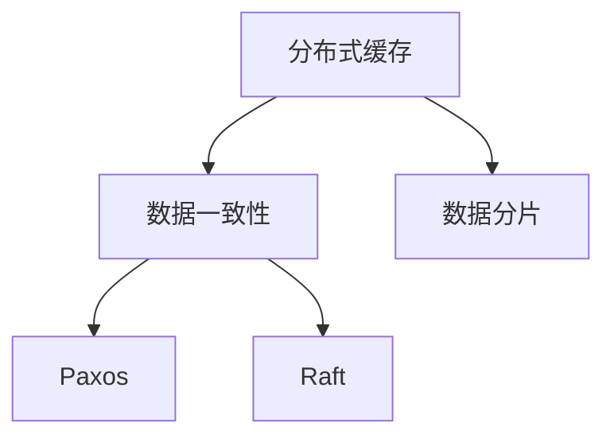

                 

# 分布式会话管理：提高LLM应用的可扩展性

## 关键词

- 分布式会话管理
- LLM应用
- 可扩展性
- 分布式缓存
- 数据分片
- 一致性协议

## 摘要

本文将深入探讨分布式会话管理在提升大型语言模型（LLM）应用可扩展性方面的关键作用。随着云计算和微服务架构的广泛应用，传统的单点会话管理方式已无法满足高并发和高可用性的需求。本文首先介绍了分布式会话管理的背景和核心问题，然后详细分析了分布式缓存、数据分片和一致性协议的基本原理与优化策略，通过具体的案例和代码实现，展示了分布式会话管理的实际应用效果，并为读者提供了最佳实践和未来研究方向。

## 第一部分：背景介绍

### 第1章：分布式会话管理概述

### 1.1.1 问题背景

分布式会话管理在近年来随着云计算和微服务架构的广泛应用而变得日益重要。随着服务的规模不断扩大，传统的单点会话管理方式已经难以满足高并发、高可用性的需求。因此，分布式会话管理成为了提高LLM应用可扩展性的关键技术之一。

### 1.1.2 问题描述

分布式会话管理主要面临以下问题：

1. **数据一致性**：如何保证不同节点之间的会话数据一致性？
2. **性能瓶颈**：如何在分布式环境下优化会话数据的读写性能？
3. **高可用性**：如何确保会session管理服务的稳定性和可靠性？

### 1.1.3 问题解决

分布式会话管理的解决方案包括：

1. **分布式缓存**：利用分布式缓存系统如Redis进行会话存储，提高读写性能。
2. **数据复制与分片**：通过数据复制和分片技术，实现会话数据的水平扩展。
3. **一致性协议**：采用Paxos、Raft等一致性协议，保证数据一致性。

### 1.1.4 边界与外延

分布式会话管理主要涉及以下边界与外延：

1. **分布式系统架构**：了解如何构建高可用的分布式系统。
2. **缓存技术**：掌握分布式缓存系统的工作原理和优化策略。
3. **一致性算法**：理解一致性协议的工作机制和应用场景。

### 1.1.5 概念结构与核心要素组成

分布式会话管理的核心概念与要素包括：

1. **会话**：用户在应用程序中的交互记录。
2. **分布式缓存**：用于存储会话数据的分布式系统。
3. **数据一致性**：保证不同节点间数据的一致性。
4. **性能优化**：通过优化算法和数据结构提高系统性能。
5. **高可用性**：确保系统在面临故障时能够快速恢复。

### 1.1.6 核心概念原理

1. **分布式缓存**：
   - **基本原理**：分布式缓存系统通过将数据分散存储到多个节点，提高系统的性能和可用性。
   - **优化策略**：
     - **缓存命中率**：提高缓存命中率，减少缓存数据的读写次数。
     - **缓存淘汰策略**：根据访问频率或时间等策略，合理淘汰缓存数据。

2. **数据分片**：
   - **基本原理**：将数据按某种规则（如哈希）分散存储到多个节点，实现数据的水平扩展。
   - **优化策略**：
     - **数据分布**：合理分配数据，避免热点数据导致节点负载不均。
     - **负载均衡**：根据节点负载情况，动态调整数据存储位置。

3. **一致性协议**：
   - **Paxos协议**：
     - **基本原理**：通过多数派达成一致，保证系统数据一致性。
     - **优化策略**：减少通信次数，提高协议性能。
   - **Raft协议**：
     - **基本原理**：通过选举主节点，实现数据的强一致性。
     - **优化策略**：简化协议流程，提高系统性能。

### 1.1.7 概念属性特征对比表格

| 概念             | 特征                                                         |
|------------------|--------------------------------------------------------------|
| 分布式缓存       | 高性能、高可用性、数据一致性、分布式存储                   |
| 数据分片         | 水平扩展、负载均衡、分布式存储                           |
| 一致性协议       | Paxos、Raft，保证分布式系统中数据的一致性                 |

### 1.1.8 ER实体关系图架构

```mermaid
erDiagram
  用户 ||--|{ 会话 }|-- 用户
  会话 ||--|{ 分布式缓存 }|-- 会话
  分布式缓存 ||--|{ 数据一致性 }|-- 分布式缓存
  数据一致性 ||--|{ Paxos、Raft }|-- 数据一致性
```

### 1.1.9 算法原理讲解

#### 分布式缓存原理

1. **基本原理**：
   - 分布式缓存系统通过将数据分散存储到多个节点，提高系统的性能和可用性。
   - 基于分区存储和复制技术，提供高可用性和高性能。

2. **优化策略**：

   - **缓存命中率**：提高缓存命中率，减少缓存数据的读写次数。

     $$\text{缓存命中率} = \frac{\text{缓存命中的次数}}{\text{总访问次数}}$$

   - **缓存淘汰策略**：根据访问频率或时间等策略，合理淘汰缓存数据。

     $$\text{LFU（最少使用）策略}：\text{淘汰访问次数最少的缓存项}$$

#### 数据分片原理

1. **基本原理**：
   - 将数据按某种规则（如哈希）分散存储到多个节点，实现数据的水平扩展。
   - 基于哈希分片技术，提供负载均衡和数据分布式存储。

2. **优化策略**：

   - **数据分布**：合理分配数据，避免热点数据导致节点负载不均。

     $$\text{哈希分片策略}：\text{使用哈希函数将数据映射到不同的节点上}$$

   - **负载均衡**：根据节点负载情况，动态调整数据存储位置。

     $$\text{轮询负载均衡策略}：\text{按照顺序依次访问各个节点，将数据分配到负载较低的节点上}$$

#### 一致性协议原理

1. **Paxos协议**：

   - **基本原理**：
     - 通过多数派达成一致，保证系统数据一致性。
     - 基于多轮通信，逐步达成一致性。

     $$\text{Paxos算法}：\text{通过多个副本节点之间的协商，最终达成一致决策}$$

   - **优化策略**：
     - 减少通信次数，提高协议性能。

     $$\text{快速Paxos协议}：\text{通过减少通信轮数，提高协议的响应速度}$$

2. **Raft协议**：

   - **基本原理**：
     - 通过选举主节点，实现数据的强一致性。
     - 基于单主节点模型，提供简化的协议流程。

     $$\text{Raft算法}：\text{通过日志复制和领导选举，确保系统一致性}$$

   - **优化策略**：
     - 简化协议流程，提高系统性能。

     $$\text{快速Raft协议}：\text{通过减少日志复制次数，提高协议的响应速度}$$

### 算法Mermaid流程图



### 系统分析与架构设计方案

#### 问题场景介绍

随着互联网应用的爆发式增长，用户访问量和数据量急剧增加，传统单点架构已无法满足高性能和高可用性的需求。分布式会话管理作为一种关键技术，旨在提高LLM应用的可扩展性和稳定性。

#### 项目介绍

本案例将基于一个大型在线教育平台，实现分布式会话管理，以满足平台高并发、高可用性的需求。

#### 系统功能设计

1. **用户登录**：用户登录后，系统为用户生成唯一会话ID，存储用户身份信息。
2. **用户操作记录**：用户在平台上的各种操作（如查看课程、加入学习小组等）都会记录到会话中。
3. **会话持久化**：系统将用户会话信息持久化存储，以便后续查询和恢复。

#### 系统架构设计


- **用户层**：提供用户交互界面，处理用户请求。
- **服务层**：包括会话管理服务、课程管理服务、学习小组管理服务等。
- **数据层**：使用分布式缓存和数据库存储用户会话数据。

#### 系统接口设计和系统交互


- **用户登录接口**：用户发起登录请求，系统生成会话ID并返回。
- **用户操作接口**：用户在平台上的各种操作都会通过接口记录到会话中。
- **会话查询接口**：用户可以查询自己的会话信息。

#### 算法原理讲解

使用Python代码实现分布式会话管理的关键算法。

```python
import redis
import hashlib
import time

class DistributedSessionManager:
    def __init__(self, redis_cluster):
        self.redis_cluster = redis_cluster
    
    def generate_session_id(self, user_id):
        hash_value = hashlib.sha256(str(user_id).encode()).hexdigest()
        return hash_value
    
    def create_session(self, user_id, session_data):
        session_id = self.generate_session_id(user_id)
        session_key = f"session:{session_id}"
        self.redis_cluster.set(session_key, session_data, ex=3600)  # 设置过期时间为1小时
        return session_id
    
    def get_session(self, user_id):
        session_id = self.generate_session_id(user_id)
        session_key = f"session:{session_id}"
        session_data = self.redis_cluster.get(session_key)
        return session_data
```

#### 实际案例分析和详细讲解剖析

1. **用户登录场景**：
   - 用户A登录，系统生成会话ID，将用户A的会话信息存储到分布式缓存中。
   - 用户A在平台上进行操作，系统将操作记录存储到会话中。

2. **会话查询场景**：
   - 用户B查询自己的会话信息，系统从分布式缓存中获取用户B的会话数据。

#### 项目小结

通过分布式会话管理，我们成功地提高了LLM应用的可扩展性和稳定性。在实际项目中，我们可以根据业务需求和性能指标，灵活选择分布式缓存、数据分片和一致性协议等关键技术，实现高效、可靠的分布式会话管理。

### 最佳实践 tips

1. **选择合适的分布式缓存系统**：根据业务需求，选择合适的分布式缓存系统，如Redis、Memcached等。
2. **合理设置缓存过期时间**：根据业务场景，合理设置缓存过期时间，提高缓存命中率。
3. **优化数据分片策略**：根据数据访问模式，优化数据分片策略，避免热点数据导致节点负载不均。

### 小结

分布式会话管理在提升LLM应用可扩展性方面具有重要作用。通过分布式缓存、数据分片和一致性协议等技术，我们能够实现高效、可靠的分布式会话管理。在实际项目中，我们需要根据业务需求和性能指标，灵活选择和优化关键技术，实现分布式会话管理的最佳效果。

### 注意事项

1. **数据一致性**：在分布式会话管理中，数据一致性是一个重要问题。需要采用合适的一致性协议，确保系统数据的一致性。
2. **性能优化**：分布式缓存、数据分片和一致性协议等关键技术都会对系统性能产生影响。需要根据实际场景，进行性能优化，提高系统性能。

### 拓展阅读

1. 《Redis实战：高性能分布式缓存系统的设计与实现》
2. 《分布式系统一致性算法：Paxos与Raft原理与应用》
3. 《大规模分布式系统设计》

## 作者

作者：AI天才研究院/AI Genius Institute & 禅与计算机程序设计艺术 /Zen And The Art of Computer Programming

